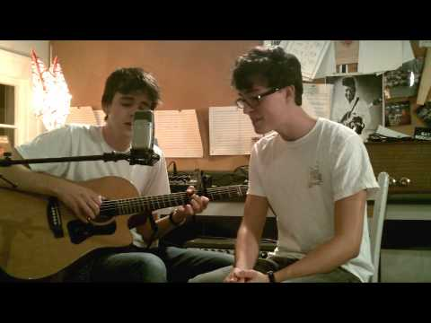

(1) Don't Think Twice, It's Alright - Bob Dylan (The Other Favorites Cover) - YouTube

Don't Think Twice, It's Alright - Bob Dylan (The Other Favorites Cover)
https://www.youtube.com/watch?v=kzzCFlMTZGU
[Josh Turner](https://www.youtube.com/channel/UC3Wj9aO8VS5ZuXrtWfJf81w)
1,459,361 views views
Published on Sep 11, 2011

|     |
| --- |
| [(L)](https://www.youtube.com/watch?v=kzzCFlMTZGU) |

Description

Carson McKee and Josh Turner singing some Dylan at 2 A.M.

Recorded on a Zoom H2 and a Langejans guitar. Support this music: [https://www.patreon.com/JoshTurnerGuitar](https://www.youtube.com/redirect?v=kzzCFlMTZGU&redir_token=NVQIGTwJu-MyjrqhomE8hT8bbil8MTUwNzQxMDcxN0AxNTA3MzI0MzE3&event=video_description&q=https%3A%2F%2Fwww.patreon.com%2FJoshTurnerGuitar)Facebook: /theotherfavoritesmusic Instagram: @theotherfavorites

Top Comments

The Cockroaches North America  | I once thought that I was a musician. That all ended when I found this channel. I am terribly critical of all musicians and though I tried to spot some sort of break in the rythym or a sour harmony or even a mispronounced lyric.I found nothing but shear devotion towards the song. You guys have that "lost in space" kind of look when you are into a song. It's a look you don't see very often and by only a few artists. All I can say is that I AM A HUGE FAN !!!!!!

2 years ago

#FREEEARL  | This is what it would look like if John Lennon and Paul McCartney had a YouTube channel as teens

10 months ago (edited)

Jake Carroll  | i gave her my heart but she wanted my soul.
1 year ago

a2zme  | Dylan would be proud...
3 years ago

Bob Landy  | Carson could go as young Buddy Holly, lol
1 year ago

Julien M  | Heatbreaking to say I love it more than the original. Sorry Bob
1 year ago (edited)

anthemofadam  | "we never did too much talkin anyway" ( ͡° ͜ʖ ͡°)
9 months ago

Klump  | "You are just kind of wasting my, precious time" 2:55 Goosebumps all day

1 year ago (edited)

melomaniac  | I'm trying to decide if I should use this incredible cover as inspiration to become better at guitar myself, or if I should use it as a sign to quit whilst I'm ahead

10 months ago

henry link  | I have been following Josh Turner for over a year now and I never fail to be in awe of his talent. I'm 75 and have been playing banjo for 25 years. I feel like a beginner next to him - and not even talking mandolin, guitar, bass uke and lute!

2 years ago