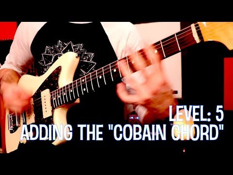

(1) The 7 LEVELS of Smells Like Teen Spirit (Main Riff) - YouTube

The 7 LEVELS of Smells Like Teen Spirit (Main Riff)
https://www.youtube.com/watch?v=Xambk1JkWrE
[The-Art-of-Guitar](https://www.youtube.com/channel/UCXdG2bTITo_9dH0heqkXlDQ)
325,230 views views
Published on Jan 24, 2018

|     |
| --- |
| [(L)](https://www.youtube.com/watch?v=Xambk1JkWrE) |

Description

Even the 'easiest' riffs have more depth than we usually think. What level do you this part?

Top Comments

The-Art-of-Guitar  | Crap I just realized I called it "Palm Muting'" on Level 2. I meant "Fretting-Hand Muting."

6 days ago

David Parry  | I loved that song when I first saw the video and I knew "they're gonna be huge" I love to play Nirvana but I really like playing Alice In Chains like Sickman and Rain When I Die etc. Jerry was clever, I like how he put stuff together

6 days ago

Zackbluecheese  | Boy level 7 is funky as hell
6 days ago

Tim Allen  | Such a good lesson!!! I normally cringe when technically perfect players play nirvana, a lot of people just don't get the fact that Kurt worked hard to be imperfect and he was a better player than he let on. Better rhythm chops than most too. Once again thanks for your superb lesson.

6 days ago

Simon Burford  | Do you think Kurt played 'level 7' live because he was bored of doing the same thing with that song all the time? He was a decent rythem guitarist but didn't care about playing tight, especially live, because he respected/wanted to be punk too much. I can almost imagine him just playing the upstroke out of boredom/slight hatred, it's a bit of an agressive move like you're pulling/scatching at the strings. But maybe I'm over analysing a bit lol. This is a really cool lesson, I've moved past SLTS at stage 4 I've just realised because I could play it at that level and wasn't too fussed about learning it better, but the barring of the 4th string on the lower strings is such an important detail that I never cared enough to explore. Genuinely opened my eyes!

6 days ago

Bobby Ratliff  | sounds like you've reached Nirvana wink wink nudge nudge
2 days ago

Louis james  | U didnt cover level 8. The way he played it live at top of the pops 😂

5 days ago

J  | You need to sleep better, my man
6 days ago

Llorrac TN  | 7 levels of Iron Man next?
6 days ago

nakamaka dude  | That was really awesome analysis
6 days ago