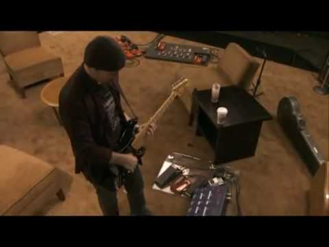

(1) U2's The Edge soundchecks his guitar rig (It Might Get Loud) - YouTube

U2's The Edge soundchecks his guitar rig (It Might Get Loud)
https://www.youtube.com/watch?v=xMw8NjCs_dg
[Cornel Lazar](https://www.youtube.com/channel/UCAQezVK1LhpnOGPU_dbkPbQ)
2,238,010 views views
Published on Feb 8, 2010

|     |
| --- |
| [(L)](https://www.youtube.com/watch?v=xMw8NjCs_dg) |

Description

U2's The Edge and his guitar tech Dallas Schoo soundchecking Edge's guitar rig. Deleted scene off It Might Get Loud. Songs performed: Until The End Of The World, Pride (In The Name Of Love), Bad

Top Comments

Jijst5  | I love this guy! One of the most important guitarists for modern rock music, I think.

1 year ago

AdventuresOfTheKanFam  | Edge is original. People that can standout as originals are the true stars. Anyone can copy a sound. If you look at music, very few are/were actual originals, Edge is one.

2 years ago

Mike Conover  | He sounds just like that guy from U2
4 years ago

uncleallo  | U2 is Bono and The Edge together it couldn't work any other way. The Edge is a genius. You cannot discredit him and say he uses too many effects bc effects are created to be used just as a guitar is. I dont know if The Edge creates his sound along with a technician but the sound along with his melodies and solos are like where the bar is set on how to use a guitar with effects and not over or under do it. The Edge = musical genius

3 years ago

GeoAl09  | My most favorite thing about The Edge is....his beanie. It's like super glued to his head. I wonder if he showers with his beanie on and goes to bed with it on.

1 year ago

Boss Leprechaun  | Had to come here cause on all the "it might get loud" videos they just bash the edge so hard. This man is great at guitar!

1 year ago

Kentucky Windage  | That is the proper way to paint a landscape with your guitar... a guitar master at work.

1 year ago

Kezmaefele  | I'm always amazed by the Edge's humility. To play his part and sing his part and be a part of a whole.  He is an amazing talent by himself, no doubt.  But as a part of U2 and the songs and the lyrics and even his harmonizing vocals, he is truly able to become something that is greater than the sum of its parts - U2.

4 years ago

Jeanette Stracka  | I love the guitar part for Bad, it is so original. That song just blows my mind every time I hear it.

1 year ago

Hans VDV  | This is the reason I'm a U2 fan for, at least, 20 years.
1 year ago