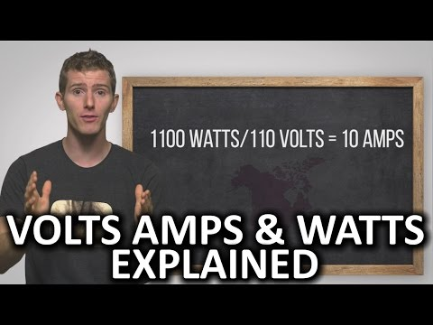

(1) Volts, Amps, and Watts Explained - YouTube

Volts, Amps, and Watts Explained
https://www.youtube.com/watch?v=mvuHsu8S6v8
[Techquickie](https://www.youtube.com/channel/UC0vBXGSyV14uvJ4hECDOl0Q)
368,833 views views
Published on Oct 25, 2016

|     |
| --- |
| [(L)](https://www.youtube.com/watch?v=mvuHsu8S6v8) |

Description

What's the difference between a volt, amp, and watt? Why is your power bill in kilowatt-hours and your battery bank in milliamp-hours? Why are there so many units?!

TunnelBear message: TunnelBear is the easy-to-use VPN app for mobile and desktop. Visit [http://tunnelbear.com/linus](https://www.youtube.com/redirect?q=http%3A%2F%2Ftunnelbear.com%2Flinus&redir_token=7MhTw5qYwHF1LcKGB5mIBri-Vmx8MTUwNzMyODg5NUAxNTA3MjQyNDk1&v=mvuHsu8S6v8&event=video_description) to try it free and save 10% when you sign up for unlimited TunnelBear data.

Follow: [http://twitter.com/linustech](https://www.youtube.com/redirect?q=http%3A%2F%2Ftwitter.com%2Flinustech&redir_token=7MhTw5qYwHF1LcKGB5mIBri-Vmx8MTUwNzMyODg5NUAxNTA3MjQyNDk1&v=mvuHsu8S6v8&event=video_description)Join the community: [http://linustechtips.com](https://www.youtube.com/redirect?q=http%3A%2F%2Flinustechtips.com&redir_token=7MhTw5qYwHF1LcKGB5mIBri-Vmx8MTUwNzMyODg5NUAxNTA3MjQyNDk1&v=mvuHsu8S6v8&event=video_description)

Top Comments

FunsterProductions  | Electricity is hard for many people great video
11 months ago (edited)

Majin Blu  | water-cooled ps4??
11 months ago

Amoeba  | My bill is in gigawatt-hours, because AMD.
11 months ago

Carsten Svendsen  | That last bit though. First time I've ever seen an off-shoot in a techquickie. And it was GOLDEN!

11 months ago

THEoriginalxSKATE369  | At 1:30 was that a dildo race xD
11 months ago

nfaguade  | I still don't get it.
11 months ago

L3xou97  | Hair dryer bought in monaco would not work nice if you plug it in New York but I'm sure it will not blue smoke. In monaco the voltage is 230V and it's 110V in New York I think.

11 months ago

PaddyDoesTech  | 3:30 that water wheel is spinning the wrong way
11 months ago

Duck  | Sweet back to 10th grade ( ͡° ͜ʖ ͡° )
11 months ago

BattousaiHBr  | i dont understand A/h. if amps are how much current is flowing, then wouldnt mAh mean how much mA flow in 1 hour? wouldnt that serve the same purpose as kWh? both being units of energy that is.

11 months ago