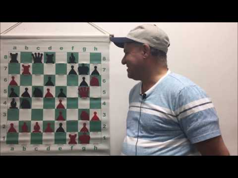

(2) The Hardest Checkmate In 1 Puzzle In The World! (Even GMs Have Trouble With This!) - YouTube

The Hardest Checkmate In 1 Puzzle In The World! (Even GMs Have Trouble With This!)

https://www.youtube.com/watch?v=4D_gZyinQi8

[Los Angeles Chess Club](https://www.youtube.com/channel/UC4d2qOIBhcAWYEjOXHOnxMw)

145,762 views views
Published on Apr 23, 2017

|     |
| --- |
| [(L)](https://www.youtube.com/watch?v=4D_gZyinQi8) |

Description

Join [http://LAChessClub.com](https://www.youtube.com/redirect?event=video_description&v=4D_gZyinQi8&redir_token=J0TQld0KgVTqTpBeGhRLKs4_y4V8MTUxNjIxMTgwN0AxNTE2MTI1NDA3&q=http%3A%2F%2FLAChessClub.com) to learn chess to get smarter, make friends, and participate in WEEKLY CASH PRIZE chess tournaments!

Top Comments

Los Angeles Chess Club  | For people who are complaining about not revealing all the information/showing the last move, you can actually figure out what the last move really was. That's the beauty of this puzzle and the WHOLE POINT and why it's so hard in the first place! 1. Normally, to solve a puzzle, you look for all possible checks. None of them work in this case. Now what?

2. You have to think outside of regular moves. What's usually not considered a regular move? Castling and En Passsant. 3. Does castling lead to a check here? Obviously not because white/red has already castled. Does en passant lead to check? Yes it does! Does it lead to checkmate? Yes, it does!

4. How can we know en passant is the right answer though? Because the puzzle is a MATE in ONE move. 5. Therefore, since en passant is the ONLY move that leads to checkmate, we can infer what the previous moves of both white and black were.

8 months ago

Justin Stephan  | en passant, I didn't cheat, took me 5 mins though lol
8 months ago

exotictoad  | the second you said that it wasnt a normal move i saw it. good puzzle but i think using an en passont in the first move to make it harder is kinda cheating

8 months ago

carnivalwrestler  | LOL.Just goes to prove that context is important in anything.

8 months ago

chri2453  | Ok, this was funny, but I still wonder by which move order you reached this position.

8 months ago

EL THORRO  | I actually got this right with no help lol ez
2 months ago

Blank Frost  | i know this is a puzzle but this set up is impossible in a real chess match because of the pawn structure of the a file if both players have all pieces on the board there is no way a pawn than be behind the enemy pawn nor can they be doubled which is the case in the e file.

3 months ago

Rahul Rajaram  | So essentially he's saying that because its a mate in one puzzle, e7-e5 had to have been the last move. I suppose in a puzzle sense thats fine to say, but in terms of chessboard as it is you cannot prove e7-e5 was the last move. Im sure the GMs found en passant as a possibility immediately, but where they had trouble was trying to prove en passant was possible by virtue of the board state. The logic here is backwards and wrong.

2 months ago

Castellazzi  | 25 sec! Yes. Thank you for this puzzle. When you said it must be mate in 1. I new it must be en passant move.

7 months ago (edited)

Benjamin A. Herder  | It's en passant aint it.
8 months ago