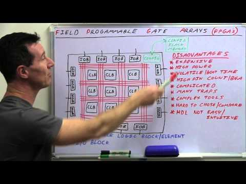

(4) EEVblog #496 - What Is An FPGA? - YouTube

EEVblog #496 - What Is An FPGA?
https://www.youtube.com/watch?v=gUsHwi4M4xE
[EEVblog](https://www.youtube.com/channel/UC2DjFE7Xf11URZqWBigcVOQ)
383,455 views views
Published on Jul 19, 2013

|     |
| --- |
| [(L)](https://www.youtube.com/watch?v=gUsHwi4M4xE) |

Description

What is an FPGA, and how does it compare to a microcontroller? A basic introduction to what Field Programmable Gate Arrays are and how they work, and the advantages and disadvantages. FPGA Stuff in Dave's Amazon store: [http://bit.ly/1ayoNiV](https://www.youtube.com/redirect?redir_token=B0a3DOmxPL7ultJI-lJ5Ak1gxf98MTUyNzYxODU3NUAxNTI3NTMyMTc1&q=http%3A%2F%2Fbit.ly%2F1ayoNiV&v=gUsHwi4M4xE&event=video_description)FPGA Implementation Tutorial: [http://www.youtube.com/watch?v=7AFGcA...](https://www.youtube.com/watch?v=7AFGcAyK7kE)Forum: [http://www.eevblog.com/forum/blog/eev...](https://www.youtube.com/redirect?redir_token=B0a3DOmxPL7ultJI-lJ5Ak1gxf98MTUyNzYxODU3NUAxNTI3NTMyMTc1&q=http%3A%2F%2Fwww.eevblog.com%2Fforum%2Fblog%2Feevblog-496-what-is-an-fpga%2F&v=gUsHwi4M4xE&event=video_description)EEVblog Main Web Site:[http://www.eevblog.com](https://www.youtube.com/redirect?redir_token=B0a3DOmxPL7ultJI-lJ5Ak1gxf98MTUyNzYxODU3NUAxNTI3NTMyMTc1&q=http%3A%2F%2Fwww.eevblog.com&v=gUsHwi4M4xE&event=video_description)EEVblog Amazon Store:[http://astore.amazon.com/eevblogstore-20](https://www.youtube.com/redirect?redir_token=B0a3DOmxPL7ultJI-lJ5Ak1gxf98MTUyNzYxODU3NUAxNTI3NTMyMTc1&q=http%3A%2F%2Fastore.amazon.com%2Feevblogstore-20&v=gUsHwi4M4xE&event=video_description)Donations:[http://www.eevblog.com/donations/](https://www.youtube.com/redirect?redir_token=B0a3DOmxPL7ultJI-lJ5Ak1gxf98MTUyNzYxODU3NUAxNTI3NTMyMTc1&q=http%3A%2F%2Fwww.eevblog.com%2Fdonations%2F&v=gUsHwi4M4xE&event=video_description)Projects:[http://www.eevblog.com/projects/](https://www.youtube.com/redirect?redir_token=B0a3DOmxPL7ultJI-lJ5Ak1gxf98MTUyNzYxODU3NUAxNTI3NTMyMTc1&q=http%3A%2F%2Fwww.eevblog.com%2Fprojects%2F&v=gUsHwi4M4xE&event=video_description)Electronics Info Wiki:[http://www.eevblog.com/wiki/](https://www.youtube.com/redirect?redir_token=B0a3DOmxPL7ultJI-lJ5Ak1gxf98MTUyNzYxODU3NUAxNTI3NTMyMTc1&q=http%3A%2F%2Fwww.eevblog.com%2Fwiki%2F&v=gUsHwi4M4xE&event=video_description)

EEVblog #496 - What Is An FPGA?
https://www.youtube.com/watch?v=gUsHwi4M4xE
[EEVblog](https://www.youtube.com/channel/UC2DjFE7Xf11URZqWBigcVOQ)
383,455 views views
Published on Jul 19, 2013

|     |
| --- |
| [(L)](https://www.youtube.com/watch?v=gUsHwi4M4xE) |

Description

What is an FPGA, and how does it compare to a microcontroller? A basic introduction to what Field Programmable Gate Arrays are and how they work, and the advantages and disadvantages. FPGA Stuff in Dave's Amazon store: [http://bit.ly/1ayoNiV](https://www.youtube.com/redirect?redir_token=B0a3DOmxPL7ultJI-lJ5Ak1gxf98MTUyNzYxODU3NUAxNTI3NTMyMTc1&q=http%3A%2F%2Fbit.ly%2F1ayoNiV&v=gUsHwi4M4xE&event=video_description)FPGA Implementation Tutorial: [http://www.youtube.com/watch?v=7AFGcA...](https://www.youtube.com/watch?v=7AFGcAyK7kE)Forum: [http://www.eevblog.com/forum/blog/eev...](https://www.youtube.com/redirect?redir_token=B0a3DOmxPL7ultJI-lJ5Ak1gxf98MTUyNzYxODU3NUAxNTI3NTMyMTc1&q=http%3A%2F%2Fwww.eevblog.com%2Fforum%2Fblog%2Feevblog-496-what-is-an-fpga%2F&v=gUsHwi4M4xE&event=video_description)EEVblog Main Web Site:[http://www.eevblog.com](https://www.youtube.com/redirect?redir_token=B0a3DOmxPL7ultJI-lJ5Ak1gxf98MTUyNzYxODU3NUAxNTI3NTMyMTc1&q=http%3A%2F%2Fwww.eevblog.com&v=gUsHwi4M4xE&event=video_description)EEVblog Amazon Store:[http://astore.amazon.com/eevblogstore-20](https://www.youtube.com/redirect?redir_token=B0a3DOmxPL7ultJI-lJ5Ak1gxf98MTUyNzYxODU3NUAxNTI3NTMyMTc1&q=http%3A%2F%2Fastore.amazon.com%2Feevblogstore-20&v=gUsHwi4M4xE&event=video_description)Donations:[http://www.eevblog.com/donations/](https://www.youtube.com/redirect?redir_token=B0a3DOmxPL7ultJI-lJ5Ak1gxf98MTUyNzYxODU3NUAxNTI3NTMyMTc1&q=http%3A%2F%2Fwww.eevblog.com%2Fdonations%2F&v=gUsHwi4M4xE&event=video_description)Projects:[http://www.eevblog.com/projects/](https://www.youtube.com/redirect?redir_token=B0a3DOmxPL7ultJI-lJ5Ak1gxf98MTUyNzYxODU3NUAxNTI3NTMyMTc1&q=http%3A%2F%2Fwww.eevblog.com%2Fprojects%2F&v=gUsHwi4M4xE&event=video_description)Electronics Info Wiki:[http://www.eevblog.com/wiki/](https://www.youtube.com/redirect?redir_token=B0a3DOmxPL7ultJI-lJ5Ak1gxf98MTUyNzYxODU3NUAxNTI3NTMyMTc1&q=http%3A%2F%2Fwww.eevblog.com%2Fwiki%2F&v=gUsHwi4M4xE&event=video_description)