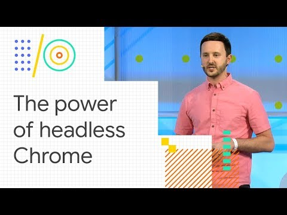

(4) The power of Headless Chrome and browser automation (Google I/O '18) - YouTube

The power of Headless Chrome and browser automation (Google I/O '18)
https://www.youtube.com/watch?v=lhZOFUY1weo

[Google Chrome Developers](https://www.youtube.com/channel/UCnUYZLuoy1rq1aVMwx4aTzw)

14,341 views views
Published on May 9, 2018

|     |
| --- |
| [(L)](https://www.youtube.com/watch?v=lhZOFUY1weo) |

Description

The headless browser revolution has arrived! Headless browsers are powerful tools that all developers can adopt in their workflow. This session will showcase examples of the amazing things that Chrome can do without a UI: write programs to control the browser; test a site; automate UI tasks; integrate into a CI system; setup A/B perf monitoring; prerender a client-side app for SEO; and more. The focus will be on using Puppeteer, Google's Node library for controlling headless Chrome.

Getting Started with Headless Chrome → [https://goo.gl/wg3u1W](https://www.youtube.com/redirect?v=lhZOFUY1weo&event=video_description&redir_token=iLzlz9nWuCyubobtxCtjS7fhw8B8MTUyNzYxMDk4NkAxNTI3NTI0NTg2&q=https%3A%2F%2Fgoo.gl%2Fwg3u1W)Puppeteer → [https://goo.gl/YXrgqX](https://www.youtube.com/redirect?v=lhZOFUY1weo&event=video_description&redir_token=iLzlz9nWuCyubobtxCtjS7fhw8B8MTUyNzYxMDk4NkAxNTI3NTI0NTg2&q=https%3A%2F%2Fgoo.gl%2FYXrgqX)Examples → [https://goo.gl/G4QcBC](https://www.youtube.com/redirect?v=lhZOFUY1weo&event=video_description&redir_token=iLzlz9nWuCyubobtxCtjS7fhw8B8MTUyNzYxMDk4NkAxNTI3NTI0NTg2&q=https%3A%2F%2Fgoo.gl%2FG4QcBC)Demo sites: → [https://pptraas.com](https://www.youtube.com/redirect?v=lhZOFUY1weo&event=video_description&redir_token=iLzlz9nWuCyubobtxCtjS7fhw8B8MTUyNzYxMDk4NkAxNTI3NTI0NTg2&q=https%3A%2F%2Fpptraas.com)→ [https://try-puppeteer.appspot.com](https://www.youtube.com/redirect?v=lhZOFUY1weo&event=video_description&redir_token=iLzlz9nWuCyubobtxCtjS7fhw8B8MTUyNzYxMDk4NkAxNTI3NTI0NTg2&q=https%3A%2F%2Ftry-puppeteer.appspot.com)Watch more Chrome and Web sessions from I/O '18 here → [https://goo.gl/5fgXhX](https://www.youtube.com/redirect?v=lhZOFUY1weo&event=video_description&redir_token=iLzlz9nWuCyubobtxCtjS7fhw8B8MTUyNzYxMDk4NkAxNTI3NTI0NTg2&q=https%3A%2F%2Fgoo.gl%2F5fgXhX) See all the sessions from Google I/O '18 here → [https://goo.gl/q1Tr8x](https://www.youtube.com/redirect?v=lhZOFUY1weo&event=video_description&redir_token=iLzlz9nWuCyubobtxCtjS7fhw8B8MTUyNzYxMDk4NkAxNTI3NTI0NTg2&q=https%3A%2F%2Fgoo.gl%2Fq1Tr8x)Subscribe to the Chrome Developers channel → [http://goo.gl/LLLNvf](https://www.youtube.com/redirect?v=lhZOFUY1weo&event=video_description&redir_token=iLzlz9nWuCyubobtxCtjS7fhw8B8MTUyNzYxMDk4NkAxNTI3NTI0NTg2&q=http%3A%2F%2Fgoo.gl%2FLLLNvf)[#io18](https://www.youtube.com/results?search_query=%23io18)

The power of Headless Chrome and browser automation (Google I/O '18)
https://www.youtube.com/watch?v=lhZOFUY1weo

[Google Chrome Developers](https://www.youtube.com/channel/UCnUYZLuoy1rq1aVMwx4aTzw)

14,341 views views
Published on May 9, 2018

|     |
| --- |
| [(L)](https://www.youtube.com/watch?v=lhZOFUY1weo) |

Description

The headless browser revolution has arrived! Headless browsers are powerful tools that all developers can adopt in their workflow. This session will showcase examples of the amazing things that Chrome can do without a UI: write programs to control the browser; test a site; automate UI tasks; integrate into a CI system; setup A/B perf monitoring; prerender a client-side app for SEO; and more. The focus will be on using Puppeteer, Google's Node library for controlling headless Chrome.

Getting Started with Headless Chrome → [https://goo.gl/wg3u1W](https://www.youtube.com/redirect?v=lhZOFUY1weo&event=video_description&redir_token=iLzlz9nWuCyubobtxCtjS7fhw8B8MTUyNzYxMDk4NkAxNTI3NTI0NTg2&q=https%3A%2F%2Fgoo.gl%2Fwg3u1W)Puppeteer → [https://goo.gl/YXrgqX](https://www.youtube.com/redirect?v=lhZOFUY1weo&event=video_description&redir_token=iLzlz9nWuCyubobtxCtjS7fhw8B8MTUyNzYxMDk4NkAxNTI3NTI0NTg2&q=https%3A%2F%2Fgoo.gl%2FYXrgqX)Examples → [https://goo.gl/G4QcBC](https://www.youtube.com/redirect?v=lhZOFUY1weo&event=video_description&redir_token=iLzlz9nWuCyubobtxCtjS7fhw8B8MTUyNzYxMDk4NkAxNTI3NTI0NTg2&q=https%3A%2F%2Fgoo.gl%2FG4QcBC)Demo sites: → [https://pptraas.com](https://www.youtube.com/redirect?v=lhZOFUY1weo&event=video_description&redir_token=iLzlz9nWuCyubobtxCtjS7fhw8B8MTUyNzYxMDk4NkAxNTI3NTI0NTg2&q=https%3A%2F%2Fpptraas.com)→ [https://try-puppeteer.appspot.com](https://www.youtube.com/redirect?v=lhZOFUY1weo&event=video_description&redir_token=iLzlz9nWuCyubobtxCtjS7fhw8B8MTUyNzYxMDk4NkAxNTI3NTI0NTg2&q=https%3A%2F%2Ftry-puppeteer.appspot.com)Watch more Chrome and Web sessions from I/O '18 here → [https://goo.gl/5fgXhX](https://www.youtube.com/redirect?v=lhZOFUY1weo&event=video_description&redir_token=iLzlz9nWuCyubobtxCtjS7fhw8B8MTUyNzYxMDk4NkAxNTI3NTI0NTg2&q=https%3A%2F%2Fgoo.gl%2F5fgXhX) See all the sessions from Google I/O '18 here → [https://goo.gl/q1Tr8x](https://www.youtube.com/redirect?v=lhZOFUY1weo&event=video_description&redir_token=iLzlz9nWuCyubobtxCtjS7fhw8B8MTUyNzYxMDk4NkAxNTI3NTI0NTg2&q=https%3A%2F%2Fgoo.gl%2Fq1Tr8x)Subscribe to the Chrome Developers channel → [http://goo.gl/LLLNvf](https://www.youtube.com/redirect?v=lhZOFUY1weo&event=video_description&redir_token=iLzlz9nWuCyubobtxCtjS7fhw8B8MTUyNzYxMDk4NkAxNTI3NTI0NTg2&q=http%3A%2F%2Fgoo.gl%2FLLLNvf)[#io18](https://www.youtube.com/results?search_query=%23io18)