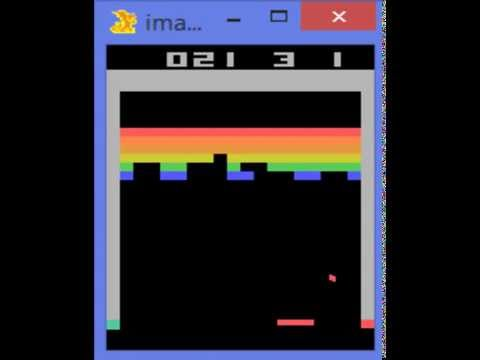

(5) Google DeepMind's Deep Q-learning playing Atari Breakout - YouTube

Google DeepMind's Deep Q-learning playing Atari Breakout
https://www.youtube.com/watch?v=V1eYniJ0Rnk
[Two Minute Papers](https://www.youtube.com/channel/UCbfYPyITQ-7l4upoX8nvctg)
738,177 views views
Published on Mar 7, 2015

|     |
| --- |
| [(L)](https://www.youtube.com/watch?v=V1eYniJ0Rnk) |

Description

Google DeepMind created an artificial intelligence program using deep reinforcement learning that plays Atari games and improves itself to a superhuman level. It is capable of playing many Atari games and uses a combination of deep artificial neural networks and reinforcement learning. After presenting their initial results with the algorithm, Google almost immediately acquired the company for several hundred million dollars, hence the name Google DeepMind. Please enjoy the footage and let me know if you have any questions regarding deep learning!

______________________

Recommended for you: 1. How DeepMind's AlphaGo Defeated Lee Sedol - [https://www.youtube.com/watch?v=a-ovv...](https://www.youtube.com/watch?v=a-ovvd_ZrmA&index=58&list=PLujxSBD-JXgnqDD1n-V30pKtp6Q886x7e)2. How DeepMind Conquered Go With Deep Learning (AlphaGo) - [https://www.youtube.com/watch?v=IFmj5...](https://www.youtube.com/watch?v=IFmj5M5Q5jg&index=42&list=PLujxSBD-JXgnqDD1n-V30pKtp6Q886x7e)3. Google DeepMind's Deep Q-Learning & Superhuman Atari Gameplays - [https://www.youtube.com/watch?v=Ih8Ef...](https://www.youtube.com/watch?v=Ih8EfvOzBOY&index=14&list=PLujxSBD-JXgnqDD1n-V30pKtp6Q886x7e)Subscribe if you would like to see more content like this: [http://www.youtube.com/subscription_c...](http://www.youtube.com/subscription_center?add_user=keeroyz)- Original DeepMind code: [https://sites.google.com/a/deepmind.c...](https://www.youtube.com/redirect?q=https%3A%2F%2Fsites.google.com%2Fa%2Fdeepmind.com%2Fdqn%2F&redir_token=hyW86UyEiH7LryT3OKS1BOIyFGh8MTUxMTgxNjI2MUAxNTExNzI5ODYx&v=V1eYniJ0Rnk&event=video_description)- Ilya Kuzovkin's fork with visualization:[https://github.com/kuz/DeepMind-Atari...](https://www.youtube.com/redirect?q=https%3A%2F%2Fgithub.com%2Fkuz%2FDeepMind-Atari-Deep-Q-Learner&redir_token=hyW86UyEiH7LryT3OKS1BOIyFGh8MTUxMTgxNjI2MUAxNTExNzI5ODYx&v=V1eYniJ0Rnk&event=video_description)- This patch fixes the visualization when reloading a pre-trained network. The window will appear after the first evaluation batch is done (typically a few minutes):[http://cg.tuwien.ac.at/~zsolnai/wp/wp...](https://www.youtube.com/redirect?q=http%3A%2F%2Fcg.tuwien.ac.at%2F%7Ezsolnai%2Fwp%2Fwp-content%2Fuploads%2F2015%2F03%2Ftrain_agent.patch&redir_token=hyW86UyEiH7LryT3OKS1BOIyFGh8MTUxMTgxNjI2MUAxNTExNzI5ODYx&v=V1eYniJ0Rnk&event=video_description)- This configuration file will run Ilya Kuzovkin's version with less than 1GB of VRAM:[http://cg.tuwien.ac.at/~zsolnai/wp/wp...](https://www.youtube.com/redirect?q=http%3A%2F%2Fcg.tuwien.ac.at%2F%7Ezsolnai%2Fwp%2Fwp-content%2Fuploads%2F2015%2F03%2Frun_gpu&redir_token=hyW86UyEiH7LryT3OKS1BOIyFGh8MTUxMTgxNjI2MUAxNTExNzI5ODYx&v=V1eYniJ0Rnk&event=video_description)- The original Nature paper on this deep learning technique is available here:[http://www.nature.com/nature/journal/...](https://www.youtube.com/redirect?q=http%3A%2F%2Fwww.nature.com%2Fnature%2Fjournal%2Fv518%2Fn7540%2Ffull%2Fnature14236.html&redir_token=hyW86UyEiH7LryT3OKS1BOIyFGh8MTUxMTgxNjI2MUAxNTExNzI5ODYx&v=V1eYniJ0Rnk&event=video_description)- And some mirrors that are not behind a paywall:[http://www.cs.swarthmore.edu/~meeden/...](https://www.youtube.com/redirect?q=http%3A%2F%2Fwww.cs.swarthmore.edu%2F%7Emeeden%2Fcs63%2Fs15%2Fnature15b.pdf&redir_token=hyW86UyEiH7LryT3OKS1BOIyFGh8MTUxMTgxNjI2MUAxNTExNzI5ODYx&v=V1eYniJ0Rnk&event=video_description)[http://diyhpl.us/~nmz787/pdf/Human-le...](https://www.youtube.com/redirect?q=http%3A%2F%2Fdiyhpl.us%2F%7Enmz787%2Fpdf%2FHuman-level_control_through_deep_reinforcement_learning.pdf&redir_token=hyW86UyEiH7LryT3OKS1BOIyFGh8MTUxMTgxNjI2MUAxNTExNzI5ODYx&v=V1eYniJ0Rnk&event=video_description)Web → [https://cg.tuwien.ac.at/~zsolnai/](https://www.youtube.com/redirect?q=https%3A%2F%2Fcg.tuwien.ac.at%2F%7Ezsolnai%2F&redir_token=hyW86UyEiH7LryT3OKS1BOIyFGh8MTUxMTgxNjI2MUAxNTExNzI5ODYx&v=V1eYniJ0Rnk&event=video_description)Twitter → [https://twitter.com/karoly_zsolnai](https://www.youtube.com/redirect?q=https%3A%2F%2Ftwitter.com%2Fkaroly_zsolnai&redir_token=hyW86UyEiH7LryT3OKS1BOIyFGh8MTUxMTgxNjI2MUAxNTExNzI5ODYx&v=V1eYniJ0Rnk&event=video_description)