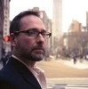
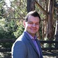
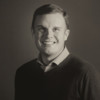

(5) My sudden trip to Hell | LinkedIn

#  My sudden trip to Hell

- Published on August 20, 2019

[ ##  Mark Attila Opauszky](https://www.linkedin.com/in/opauszky/)

  Entrepreneur and Founder at PathFactory

[3 articles](https://www.linkedin.com/in/opauszky/detail/recent-activity/posts/)

*“Open your eyes Mark! Mark open your eyes...” *

I did. It was bright. Then my field of vision was suddenly filled with faces of people wearing masks, looking down at me. “I’m in a hospital”, I thought.

“You’re in a hospital”, one of the masked people helpfully explained “I’m Doctor Salarnio. You have a breathing tube; we are going to unhook it and extubate you.” Dr. Salarnio leaned in so close, his was the only face I could see. “It’s not going to be pleasant”, he said. And it wasn’t.

February 11, 2019. I was headed from my home in Toronto to New York. It was going to be a busy week; though as the CEO of a growth stage technology company, they were all busy now. I was speaking at the Baird LLP conference, but not before visiting some of our customers to shine a light on what PathFactory was going to do for them this year.

For a little over six years now PathFactory had been helping marketers with a new kind of automation. The big idea was to enable our customers to deliver a highly responsive, on-demand experience with their marketing and their content. It was a whole new way to address the issues faced by B2B marketing, and it was working. The company was posting record quarters and settling into a comfortable lead.

As CEO, I had been through all the phases of the company since inception, and now had a genuine growth company on my hands: great people, great customers, and of course, great problems. It consumed every minute I had , but I loved it. Many months earlier I had resolved to approach this challenge head on, and that meant I needed to be in the best physical and mental shape of my life.

I’ve always thought of myself as a strong person, but I had started to worry that I was taking my assumed strength for granted. Surely all the stress and the long hours would take a permanent toll. So, I made two iron-clad promises to myself: first, that my family would come first, and I would be fully present for all the moments that mattered. Second, that I would need to get myself in the best shape of my life. That meant a lot of different things to me, mental and physical both, but most importantly, it meant my heart needed to be strong: strong enough that it would continue beating no matter what happened to me. To that end, I took good care of myself, worked out even when it wasn’t convenient, and kept myself on a healthy regimen.

By the end of 2018, I finally felt I had achieved the right balance. Family doing great? Check! Business doing great? Check! Mark doing great? Check!. What could go wrong?

**When Everything Goes Wrong**

By the time I landed in New York that day in February, I felt a flu coming on. The next 48 hours was a marathon, so I resolved to push through. It helped that my co-founder Nick Edouard was with me - we always worked well together, and I knew that despite whatever minor illness I was battling, we could cover the ground we needed to on this trip. Initially everything was going fine, but by Wednesday night I was running a serious fever and my left leg was in a surprising amount of pain.

I was really struggling to keep focus that day, so Nick had taken most of the meetings on his own. We were supposed to fly back to Toronto that evening, but I elected to stay one more night in the hotel to sleep off whatever this thing was. Despite my protests, Nick decided to stay as well. His decision to do so would be the first of several that would save my life.

The next day I was in terrible shape; my fever was 104.5 and my left knee was killing me. I still believed I had the flu, and my knee looked totally normal - no bruises, cuts or swelling - just pain. After many attempts to cure this ailment by pushing fluids and resting, I collapsed in my hotel room and summoned just enough strength to ask Siri to text Nick. A few hours later, I was being rushed into emergency surgery at Mount Sinai West, ironically just a few blocks from the event that had brought me to New York.

My fate would have been very different without Nick. He rallied the medical staff and insisted they investigate what was going on with me beyond the initial assumption of a bad case of the flu. When they did investigate, they found something extraordinary – and extraordinarily bad.

They discovered that I had developed necrotic fasciitis, commonly known as the flesh-eating disease. And I was rapidly slipping into septic shock. One of the attending doctors in the trauma unit, Dr. Hahn, called my wife, Danielle, at home. She had no idea I was in the hospital. He told her I might not make it through the night, and she should come to the hospital immediately. To this day, I still can’t imagine what that call must have been like for her.

**Upon Waking**

“You have a breathing tube; we are going to unhook it and extubate you. It’s not going to be pleasant” said Dr Salarnio. As it turns out, having what feels like a vacuum cleaner hose ripped out of your lungs sure snaps you into the moment. And that momentary lucidity lasted just long enough for me to push out just two words:

“that... sucked.”

I heard someone giggle. Dr. Salarnio smiled. I felt I should try to follow it up with something a bit wittier, but a second later I sank down into some lower level of consciousness.

For the next three days I would float in a sort of inky darkness, struggling for moments of clarity and unable to remember much of anything. I  couldn’t process my surroundings. I didn't know it at the time, but in fact I was recovering from a coma.

The first few days out of a coma are very hard on the brain. Time passes differently in that state.it can seem to the patient like weeks or months have passed when it’s merely been days. That was true for me; it was  like being utterly alone in purgatory for what felt like two years. I still have trouble putting this experience into words that adequately express the true darkness and terror of it all. This part, for me, was the worst of it. It took everything I had to claw my way back to reality And when I did, I learned that this was just going to be the beginning of my ordeal.

Over the days that followed, my doctors laid it out for me::

First, and for the avoidance of doubt, I obviously did not have a bad case of the flu. I had necrotizing fasciitis. Type II necrotizing fasciitis to be more specific. This mainly involves infection by the *Streptococcus pyogenes* bacteria and more commonly affects young, healthy adults. I didn't do anything to get it, it just happened - like being struck by lightning. It was bad, really bad, and when the dust had all settled it had cost me most of my left leg as the medical staff tried to cut out the infection and save my life.

Second, the *nec-fasc* had resulted in the worst possible complication: septic shock syndrome. Septic shock is an extreme condition your body puts itself into in response to massive infections like nec-fasc. My blood pressure dropped to dangerously low levels, and most of my major organs – my heart, lungs, liver, kidneys and brain – shut down or nearly shut down. I was near death several times. No one could predict if a full recovery from this extensive shut down was even possible.  But they wouldn’t rule it out, either. It was, at this stage at least, a big unknown.

Third, the lifesaving treatment I underwent severely damaged my hands and feet. Upon waking and establishing some level of clarity, I came to realize that many of my appendages were black, and I had a pretty good idea what that meant- they were dead, or at least dying.

Fourth, I should expect to be in the hospital for months. I was far from out of the woods and still in critical condition. I would later learn that the guidance given to my family and friends in those early days of my illness is that we would take it one day at a time, and that with these conditions, it is often one step forward and one step back.

Fifth, and probably most jarring, I learned that it was no longer mid-February – it was March, and I had been in a coma for weeks. My wife had left the kids with their grandparents back in Toronto and moved into a hotel near the hospital. She rarely left my side the entire time I was on life support. She knew I was teetering on the edge of the precipice. (Many weeks later, we discovered that my probability of surviving was in the 5% range.) She fought past all that and kept everyone in the ICU focused on me. Danielle is the strongest person I have ever met, and I would never dare disappoint her by dying.

**Coming to Terms with a New Reality**

Despite still being hooked up to feeding tubes, dialysis machines, infusion pumps, catheters and a vital sign monitor that was constantly telling everyone how messed up I was, I didn’t really believe any of it. I figured I could go home soon and just walk it off. My earlier resolve to make myself as strong as possible was central to my self-image, and I figured it wouldn’t be long before my previously boundless energy and vitality would return.

But that image was permanently dispelled the first time I saw what remained of my leg. They painfully removed the elaborate layers of dressings that spanned the top of my leg to the top of my foot to reveal ... well, mostly stuff you don't ever expect to see. “That’s bone, right?” I croaked. The skin on my lower leg was gone, same with the back of the upper leg; the muscles in many parts were gone too. The whole thing looked like something from a horror movie. In order to save my body, the part of my leg where the infection had taken root had to be sacrificed.

I pushed out a few words, the kind of words you actually hear in movies but never expect to say yourself: “am I going to walk again?” My wife sat next to me as I asked the question to the room filled with medical staff. The room was silent. Danielle leaned into my field of view, and told me with no uncertain doubt “yes, you will walk, but it’s going to take some time and we will get there together.” At that point, I knew I needed to modify my expectations about recovery.

I spent a few more weeks in the ICU regaining organ function while being fed massive courses of antibiotics. I still needed to be cleared by the infectious disease team who would show up every two days to draw fluid from under my kneecap, employing a comically large syringe that seemed to require two people to operate it. My leg was still completely gutted, and bones and muscles would be exposed for weeks still. The dressings needed to be peeled off and changed every day. This horror show was my 8 AM daily ritual. It took four surgical residents 30 minutes to accomplish, and I nearly passed out from the pain every time. I was also on dialysis for hours at a time which made me throw up most of what they were feeding me through the tube in my nose (note to future generations: throwing up with a feeding tube in you should be avoided at all costs, although for me it was a daily thing).  After nearly a month in the ICU at Mount Sinai, I was stable enough to move, so we arranged for med-evac transport to Sunnybrook Hospital in Toronto for reconstructive surgery.

The surgeons at Sunnybrook saved most of my leg – and, incredibly, my knee function - with an aggressive set of muscle and skin grafts. I did suffer some amputations, notably most of my feet and some fingers; there may be more in my future still. Losing pieces of my body has been difficult to take. But I keep telling myself that it has been a comparatively small price to pay, all things considered. It may sound strange to hear, but I genuinely believe that I was lucky. World class doctors worked miracles, saving my life and rebuilding my body, so that I could fulfill the first promise to myself, and be there for my family.

Meanwhile, as far as the second promise to myself went, I had fulfilled that one too. If I hadn’t been in good physical and mental shape going into this, I don’t think I could have ever survived the ordeal. Now I was healing fast and pushing hard to move to the next stage. I became a student of the recovery process, and spent all my time understanding and internalizing what was happening to me, working hard to meet each successive milestone. The first time my kids could come to see me in the hospital was trying. It had been weeks and I knew they were scared. I was scared too.

My 11 year old daughter was shocked “Dad, your muscles are gone!”, she blurted out. She was right, skin was hanging from my arms and I looked 20 years older. “I will get them back”, I said. She smiled bravely through her emotions. “Promise me”, she said; and I did. My young son only wanted to know if all the bad things were over. I told him they were. This was good enough for him, he was not interested in the details. My daughter wanted to know everything and see everything. She was so grown up. It was the only time I cried.

After the major surgeries were done, I was transferred to St. Johns rehabilitation hospital, where I had to re-learn to walk and move. But first I had to master sitting upright. Weeks in a coma and twelve major surgeries had atrophied my muscles. They say you lose 1% of muscle mass a day under these circumstances, and they were correct. I had lost 40 pounds and could hardly move. I spent hours just trying to do the simplest things, like lift an arm, or move a leg.

Rehab is much like I imagined it from TV, but a lot more painful. It can take every ounce of your willpower to stand or even take a single step, and your reward is that you throw up and pass out. Rehab is also what you make it. I decided to treat it like a full-time job. My whole world became working out and eating as much protein as I could hold down to regain strength and put on weight.

Throughout this journey, I never turned on the TV or fired up my phone once. I was concerned that those things could distract me from the most important focus - healing myself – and I refused to allow anything to pull my attention away from that focus. In rehab, I took to waking up in the middle of the night and doing slow, tedious laps around the nurse’s station with my walker. Once again, I was fortunate - progress was fast. I owe a lot of that to how I treated my body before my illness. A short time after they wheeled me into St. Johns, I walked out with only the help of a cane. I took an Uber home and tried as hard as I could to get back to a normal life.

**The Inevitable Setbacks**

The illness that would cost me months away from my children, my company and my life was now behind me. It was May when I finally got home, but I was far from fully healed. My body was not behaving, and it would take months to get my strength back and repair my immune system. Despite this, I returned to work almost immediately.

Being back in the office with the team felt incredible. Even with everything that had happened to me, I was still very much in love with the problem we were attacking, very much addicted to the metrics, the culture and the growth. Anyone that has ever been part of a start-up or growth stage company will relate. There is nothing that can really replicate the excitement that comes with being part of a winning team.

I was so proud of the work we had done to date, and I could not wait to see us step it up to the next level. But whereas my heart and mind were committed, the rest of my body was not cooperating. It only took three weeks before I knew I had returned to work too early. I was accustomed to having boundless energy; the kind that let me stay close to details, listen carefully and make hard decisions. Now, it was harder to reach for that energy.

The surgeries had left me in a near constant state of pain that was mentally and physically draining. I was not doing my best work at a time when the company really needed me to. I also had some serious near-term work to complete on my own health and recovery. For myself, I expected nothing less than 100% recovery. For the company, I expected nothing less than excellence. So a difficult, zero-sum choice was forming fast. I could do a good job of running the company or I could do a good job of healing, but not both. True, I could have tried to do a sub-par job of both at the same time, but I had put my family through so much already, and I owed more to my people and my customers than that. I would not be the weakest link, not even for moment. There was only one choice.

**The Only Choice**

Stepping out of the CEO role at PathFactory was an incredibly difficult decision, but it was the only way to ensure that the business would continue to thrive, that I would be OK, and that my family would be OK. Perhaps not such a hard choice after all. It was mercifully made easier when an individual whom I admired and trusted became available, and willing to take my chair.

Change is hard, but it happens, often without stopping to ask for your permission. The cards in your hand look like a winner one day, and the next you get dealt a whole new hand. How you play that new hand matters. This has always been especially true in the tech business, where the ability to absorb rapid change in a positive way is practically table stakes. I had a chance to practice some of that in my personal life as well. The hand that nec-fasc dealt me was an extreme experience that at times, really did feel like I was in some sort of Hell; but it’s an experience that is now forever a part of me.

**A Debt of Gratitude**

As I look toward the future, it’s with a sense of clarity about what is most important in life and with great optimism for what is to come. Life is short, and I am grateful to be here to experience it with the people I love and respect. I hope that my experience will help me to be a mindful leader, a great dad, a worthy husband, and a solid friend. The list of folks to thank is long and it reads like movie credits. To everyone who helped me, healed me, and cared for the things I hold dear when I couldn’t - thank you.

### Published by

  [Mark Attila Opauszky](https://www.linkedin.com/in/opauszky/)

  Entrepreneur and Founder at PathFactory
   Published • 1d

[3 articles](https://www.linkedin.com/in/opauszky/detail/recent-activity/posts/)

   Share Share on LinkedIn   Share in a post

Other options  ![](data:image/svg+xml,%3csvg xmlns='http://www.w3.org/2000/svg' viewBox='0 0 24 24' width='24px' height='24px' x='0' y='0' preserveAspectRatio='xMinYMin meet' class='artdeco-icon js-evernote-checked' focusable='false' data-evernote-id='676'%3e%3cpath d='M17.29%2c3a3.7%2c3.7%2c0%2c0%2c0-2.62%2c1.09L12.09%2c6.67A3.7%2c3.7%2c0%2c0%2c0%2c11%2c9.29a3.65%2c3.65%2c0%2c0%2c0%2c.52%2c1.86l-0.37.37a3.66%2c3.66%2c0%2c0%2c0-4.48.56L4.09%2c14.67a3.71%2c3.71%2c0%2c1%2c0%2c5.24%2c5.24l2.59-2.59A3.7%2c3.7%2c0%2c0%2c0%2c13%2c14.71a3.65%2c3.65%2c0%2c0%2c0-.52-1.86l0.37-.37a3.66%2c3.66%2c0%2c0%2c0%2c4.48-.57l2.59-2.59A3.71%2c3.71%2c0%2c0%2c0%2c17.29%2c3ZM11.13%2c14.71a1.82%2c1.82%2c0%2c0%2c1-.54%2c1.3L8%2c18.59A1.83%2c1.83%2c0%2c0%2c1%2c5.41%2c16L8%2c13.41a1.79%2c1.79%2c0%2c0%2c1%2c1.74-.48L8.28%2c14.4A0.94%2c0.94%2c0%2c0%2c0%2c9.6%2c15.73l1.46-1.46A1.82%2c1.82%2c0%2c0%2c1%2c11.13%2c14.71ZM18.59%2c8L16%2c10.59a1.79%2c1.79%2c0%2c0%2c1-1.74.48L15.73%2c9.6A0.94%2c0.94%2c0%2c0%2c0%2c14.4%2c8.27L12.94%2c9.74A1.79%2c1.79%2c0%2c0%2c1%2c13.41%2c8L16%2c5.41A1.83%2c1.83%2c0%2c0%2c1%2c18.59%2c8Z' class='large-icon js-evernote-checked' style='fill: currentColor' data-evernote-id='700'%3e%3c/path%3e%3c/svg%3e) Copy link   Facebook  ![](data:image/svg+xml,%3csvg xmlns='http://www.w3.org/2000/svg' viewBox='0 0 24 24' width='24px' height='24px' x='0' y='0' preserveAspectRatio='xMinYMin meet' class='social-icon js-evernote-checked' focusable='false' data-evernote-id='678'%3e%3cg style='fill: currentColor' class='solid-icon js-evernote-checked' data-evernote-id='866'%3e %3crect x='-0.003' style='fill:none%3b' width='24' height='24' data-evernote-id='867' class='js-evernote-checked'%3e%3c/rect%3e %3cpath style='' d='M21%2c7.7c0%2c0.2%2c0%2c0.4%2c0%2c0.6C21%2c14.4%2c16.5%2c21%2c8.3%2c21c-2.5%2c0-5.4-0.5-7.3-1.6c2.7%2c0%2c5.1-0.7%2c7-2c-2-0.2-3.7-1.3-4.3-3c0.7%2c0.1%2c1.9-0.1%2c2.3-0.3c-2-0.6-3.1-2.1-3.4-4.1c0.4%2c0.2%2c1.2%2c0.2%2c1.7%2c0.1c-1-0.8-1.4-2.2-1.4-3.8c0-0.8%2c0.2-1.7%2c0.6-2.3c1.9%2c2.8%2c5.2%2c4.9%2c8.7%2c5.1c-0.1-0.5-0.3-1.2-0.3-1.8C12%2c4.8%2c13.7%2c3%2c16.3%2c3c1.9%2c0%2c2.8%2c0.7%2c3.6%2c1.7c0.9-0.3%2c1.7-0.8%2c2.5-1.3c-0.2%2c1.1-0.8%2c2.1-1.8%2c2.7c0.9-0%2c1.8-0.3%2c2.6-0.7C22.7%2c6.2%2c22%2c7%2c21%2c7.7z' data-evernote-id='868' class='js-evernote-checked'%3e%3c/path%3e %3c/g%3e%3c/svg%3e) Twitter

- ·

- ·

- 17 Shares

###  Reactions

- 

- 

- 

- [(L)](https://www.linkedin.com/in/amberneumann?miniProfileUrn=urn%3Ali%3Afs_miniProfile%3AACoAAAbtlrcB8svV7NPdJIT-gFfUM2-ZFnygFLk)

- 

- 

- 

- 

-

###    82 Comments    Comments on Mark Attila Opauszky’s article

 

Add a comment…

Add a comment…

    Images

 18m

 

[(L)](https://www.linkedin.com/in/amberneumann/)[ ###     Amber Neumann     Crown Counsel at Ministry of the Attorney General - Office of the Public Guardian and Trustee](https://www.linkedin.com/in/amberneumann/)

Like so many others, I cried reading this. You, Danielle, and I were at Jarvis CI together. That, of course, makes this uncomfortably relatable. I’m not even sure what to say other than to acknowledge the humanity you have shared here. Your strength, and Danielle’s, is awe inspiring yet not at all surprising. It was evident in you both even at seventeen. I add my virtual hug to you both along with all the others sent your way.

 58m

 

[(L)](https://www.linkedin.com/in/olivier-mengu%C3%A9/)[ ###     Olivier Mengué     Senior Software Engineer](https://www.linkedin.com/in/olivier-mengu%C3%A9/)

I cried while reading your story. Maybe because I'm a husband and dad. Maybe because I love my job. Maybe because I know I should appreciate and take care of my body more than I do. Or just because nobody deserves what you are enduring.

[ ##  Mark Attila Opauszky](https://www.linkedin.com/in/opauszky/)

### Entrepreneur and Founder at PathFactory

### More from Mark Attila Opauszky

- [        The time has come for marketers to become the heroes...     Mark Attila Opauszky on LinkedIn](https://www.linkedin.com/pulse/time-has-come-marketers-become-heroes-mark-attila-opauszky/)
- [        The Attention Economy: How Traditional Marketing is Failing Fast-Moving Buyers     Mark Attila Opauszky on LinkedIn](https://www.linkedin.com/pulse/attention-economy-how-traditional-marketing-failing-buyers-opauszky/)