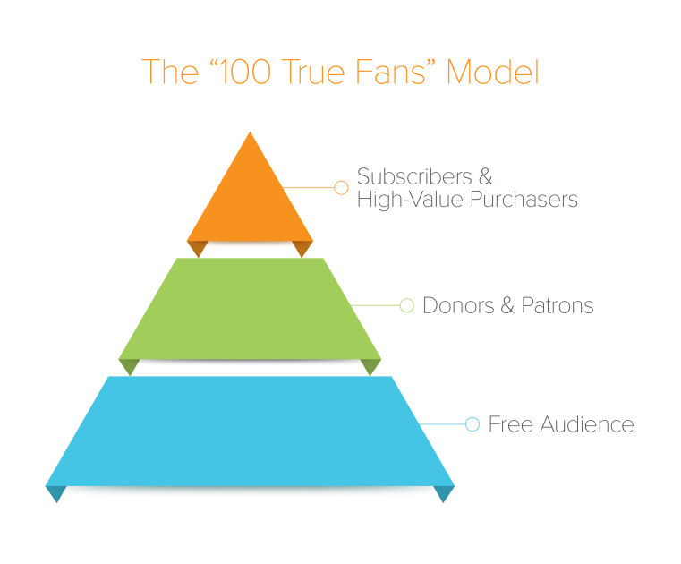
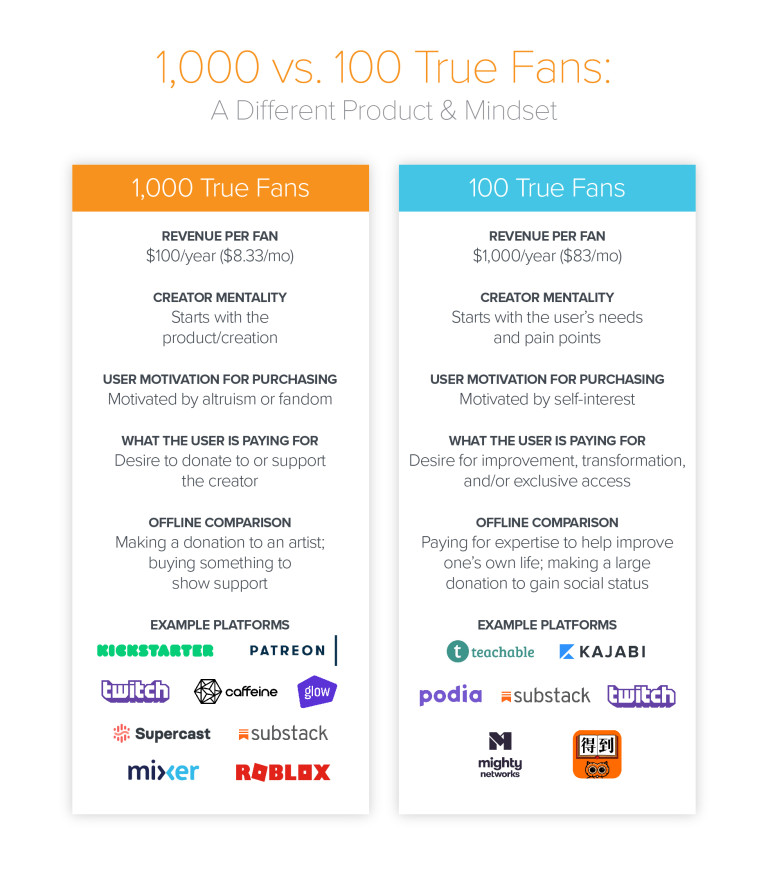

1,000 True Fans? Try 100

# 1,000 True Fans? Try 100

by[Li Jin](https://a16z.com/author/li-jin/)

More than a decade ago, *Wired* editor Kevin Kelly wrote an essay called “[1,000 True Fans](https://kk.org/thetechnium/1000-true-fans/),” predicting that the internet would allow large swaths of people to make a living off their creations, whether an artist, musician, author, or entrepreneur. Rather than pursuing widespread celebrity, he argued, creators only needed to engage a modest base of “true fans”—those who will “buy anything you produce”—to the tune of $100 per fan, per year (for a total annual income of $100,000). By embracing online networks, he believed creators could bypass traditional gatekeepers and middlemen, get paid directly by a smaller base of fans, and live comfortably off the spoils.

Today, that idea is as salient as ever—but I propose taking it a step further. As the [Passion Economy](https://a16z.com/2019/10/08/passion-economy/) grows, more people are monetizing what they love. The global adoption of social platforms like Facebook and YouTube, the mainstreaming of the influencer model, and the rise of new creator tools has shifted the threshold for success. I believe that creators need to amass only *100* True Fans—not 1,000—paying them *$1,000* a year, not $100. Today, creators can effectively make more money off fewer fans.

Sound unlikely? We’re already seeing this shift, according to creator platforms. On [Patreon](http://patreon.com/), the average initial pledge amount has increased 22 percent over the past two years. Since 2017, the share of new patrons paying more than $100 per month—or $1,200 per year—has grown 21 percent.  On the online course platform [Podia](http://podia.com/), the number of creators earning more than $1,000 in a month is growing 20 percent each month, while the average number of customers per creator is growing at a rate of 10 percent. Likewise, on [Teachable](https://teachable.com/), the average price point per class offering has risen roughly 20 percent, year over year. In 2019, nearly 500 Teachable course creators made more than $100,000; of those, 25 averaged more than $1,000 per sale.

Now, 100 True Fans and 1,000 True Fans aren’t mutually exclusive, and the revenue benchmark of $1,000 per fan per year isn’t intended to be an exact prescription. Instead, this thinking provides a framework for the future of the Passion Economy: creators can segment their audiences and offer tailored products and services at varying price points.

Here’s how it works: A creator can cultivate a large, free audience on horizontal social platforms or through an email list. He or she can then convert some of those users to patrons and subscribers. The creator can then leverage some of *those* buyers to higher-value purchases, such as extra content, exclusive access, or direct interaction with the creator.

This strategy is closely related to the concept of “[whales](https://www.alistdaily.com/strategy/mobile-gaming-whales-fitting-new-descriptors/)” in gaming, in which [1 to 2 percent](https://venturebeat.com/2013/03/14/whales-and-why-social-gamers-are-just-gamers/) of users drive 80 percent of gaming companies’ revenue (though that model is [evolving](https://a16z.com/2019/09/28/business-models-gaming-platform-shifts-blockchain-crypto-collaboration-creativity/)). Put simply, if you can convince a small number of super-engaged people to pay more, you can also have a general audience that pays less. By segmenting the customer base and offering greater value to top fans—at a higher price point—creators can earn a living with a smaller total audience.

Again, returning to the examples above, this isn’t purely hypothetical. One creator on Teachable who advises artists on how to sell their art made $110,000 last year with only 76 students, at an average of $1,437 per course. Another creator who teaches physiotherapy made $141,000 with only 61 students, at an average price point of $2,314 per course. On Podia, the average revenue per user is increasing, as well. Creators who started out solely selling courses on the platform can now further monetize their audience by expanding into downloads and membership subscriptions. While making a living off the 100 True Fan model is far from commonplace, it’s increasingly possible.

## How to earn these high-paying super-fans?

There is a substantive difference between monetizing through 1,000 True Fans (at $100 a year) and 100 True Fans (at $1,000 a year). Whereas a creator can earn $100 a year from a fan via patronage or donations, collecting $1,000 a year per fan requires a wholly different product. These fans expect to derive meaningful value and purpose from the product.

This represents a move away from the traditional donation model—in which users pay to benefit the *creator*—to a *value* model, in which users are willing to pay more for something that benefits *themselves*. What was traditionally dubbed “self-help” now exists under the umbrella of “wellness.” People are willing to pay more for exclusive, ROI-positive services that are constructive in their lives, whether it’s related to health, finances, education, or work. In the offline world, people are accustomed to hiring experts across verticals (think interior designers, organizational consultants, public speaking coaches, executive coaches, and SAT tutors) and are willing to pay premium prices for the promise of measurable improvement and results. Now that mindset is filtering into our digital lives, as well.

This relates to [Daniel Pink](https://en.wikipedia.org/wiki/Drive:_The_Surprising_Truth_About_What_Motivates_Us)’s concept of intrinsic motivation: we’re driven by Autonomy (the urge to direct one’s life), Mastery (the desire to get better at something that matters), and Purpose (the yearning to do work in the service of something larger than one’s self).

Regardless of the terminology, products and services in this category solve high-priority problems for consumers. Creators pursuing the 100 True Fans model recognize and monetize the desire for improvement and transformation. And better technology, such as video course platforms and improved real-time video streaming, allows for richer, higher-quality content than was possible a decade ago.

There are many examples of existing premium subscription services that have already conditioned consumers to pay high prices for services, whether $200 per month Equinox memberships, $159 per month subscriptions to Rent the Runway Unlimited, or $250+ per month subscriptions to Purple Carrot.

This trend is paralleled in the [SaaS world](https://a16z.com/2019/06/27/superhuman/), where paid versions of free software cater to power users or prosumers. Though free versions of these products exist, power users chose the paid version for the efficiency and heightened user experience. Compare, for example, YouTube’s wealth of free video tutorials versus a paid education platform like [MasterClass](https://www.masterclass.com/) ($90 per class) or [Juni Learning](https://junilearning.com/) ($250/month for private kids coding classes). While YouTube offers a massive amount of high-quality free content, it can be difficult to navigate and personalize. New paid creator platforms are less about mere entertainment or delight, and more about providing a full solution for the user’s desired outcome, including curriculum, accountability, and community.

## The recipe for earning $1,000 per fan

The monetization strategy for 100 True Fans also differs from the 1,000 True Fans convention. Easy perks like offering users ad-free content and access to back-catalogs can help creators monetize at a lower dollar amount. But to gain fans who are willing to pay $1,000 a year—no small sum—creators need to offer a step-function increase in value. The recipe, then, is to go *niche* and to tap into users’ desire for results. Practically, what does that look like? It means providing differentiated content, community, accountability, and access.

1. Premium content and community that has no close substitutes
2. Delivering tangible value and results
3. Accountability
4. Access, recognition and status
Let’s unpack each:

### **Premium content and community with no close substitutes**

People are willing to pay high prices for exclusive, differentiated content and access to a network of like-minded individuals. In late 2019, two financial advisors-turned-podcasters launched a private, paid community called Advisor Growth Community (powered by the platform [Mighty Networks](http://mightynetworks.com/)). The online hub charges financial advisors $2,000 per year to collaborate with colleagues and learn how to grow their practices. It currently has nearly 100 members in its ranks. The career development program Reforge, a masterclass for growth and marketing strategies, charges upwards of $3,000 per seat to hundreds of participants each year.

Frequently, premium content and community are bundled together to enhance the student experience by providing valuable social reinforcement and support.

### **Delivering tangible value and results**

In China, the unicorn audio course platform Dedao sells paid audio courses that appeal to users’ desire for self-improvement and lifelong learning. The best selling topics include management, study skills, and public speaking. These classes can reach up to 199 RMB (approximately $28 USD)—a meaningful sum in a country where the average income is [21,600 RMB](https://www.stlouisfed.org/on-the-economy/2018/january/income-living-standards-china) (~$3,100 USD). The most popular course is taught by former Peking University professor Xue Zhaofeng and has over 470,000 subscribers.

While the US podcasting industry is still [modestly monetized](https://a16z.com/2019/05/23/podcast-ecosystem-investing-2019/) through advertising, the flourishing ecosystem of paid meditation and audio wellness apps like Headspace, Calm, and Aaptiv—all of which charge subscribers directly—indicate that users are willing to pay for content that tangibly affects their well-being.

### **Accountability**

The more a student pays up front, the more invested he or she is in achieving the desired outcome. Higher-priced creators don’t only offer more or better content, they also motivate and incentivize students to get what they paid for. For instance, the premium version ($699 vs. $499) of productivity expert [Tiago Forte’s Teachable class](https://www.buildingasecondbrain.com/) on digital note-taking and productivity includes eight expert interviews, 16 note templates, six advanced tutorials, and access to a members-only blog. Tiago also shares [his numbers publicly](https://twitter.com/fortelabs/status/1136462094897995776?s=20), reinforcing the perception of accountability.

### **Access, recognition, and status**

On Patreon, the comedy podcast [This Might Get Weird](https://www.patreon.com/thismightgetweird) has $5 per month and $15 per month tiers, both of which afford access to a Discord community and extra content. The creator also offers a limited number of $69 per month ($828 per year) subscriptions, which provides a monthly, 30-minute livestream, among other benefits. But the highest-priced offering is a $500 per month ($6,000 per year) tier, which grants users personal coaching sessions with the podcast hosts, via video chat, every 3 months. The top tier offers a level of exclusivity and access that matches the price—100 times more expensive than the base tier.

There are also big, growing businesses in China, such as Bixin, Taobao, and Heizhu Esports (from Netease), in which people pay creators to play video games with them. Some of these users are [earning tens of thousands of dollars per month](https://www.abacusnews.com/digital-life/you-can-pay-gamers-china-play-pubg-you/article/3001069) as paid game companions. Beyond purchasing personal recognition from the creator, there’s also the potential recognition of other fans. In the gaming world, whales often lord their big spending habits over non-spenders, thus providing an aspirational target for everyone else. More broadly, products can be designed in such a way that super-fans receive social affirmation from “normal” fans, triggering a positively reinforcing network effect that increases the value of super-fans, beyond the monetary spend.

Twitch streamers can rake in hundreds of thousands of dollars a year from donations and tips—in one recent case, a streamer received a [$75,000 tip](https://www.notebookcheck.net/Twitch-Streamer-receives-donation-of-US-75-000-marking-a-new-record.394481.0.html). The personalized shoutouts from the streamer, recognition, and elevated social status that such donations afford lead to higher levels of spending. It’s worth noting that limited access and recognition are unscalable, to some extent: people are, by definition, paying high amounts to gain exclusive access or to elevate their status above other users.

## From 1,000 to 100: Fewer, truer fans

The creator economy is in the midst of a decisive shift—from a “bigger is better,” ad-driven revenue model to one of niche communities and direct user-to-creator payment. [An emerging category of digital platforms is helping people to translate their skills and talents into businesses. But as the creator landscape evolves, the playbook needs updating.](https://twitter.com/intent/tweet?url=https://wp.me/pa0Syt-1fyU&text=An%20emerging%20category%20of%20digital%20platforms%20is%20helping%20people%20to%20translate%20their%20skills%20and%20talents%20into%20businesses.%20But%20as%20the%20creator%20landscape%20evolves%2C%20the%20playbook%20needs%20updating.&via=ljin18&related=ljin18)[Click To Tweet](https://twitter.com/intent/tweet?url=https://wp.me/pa0Syt-1fyU&text=An%20emerging%20category%20of%20digital%20platforms%20is%20helping%20people%20to%20translate%20their%20skills%20and%20talents%20into%20businesses.%20But%20as%20the%20creator%20landscape%20evolves%2C%20the%20playbook%20needs%20updating.&via=ljin18&related=ljin18).

Rather than viewing one’s fans as a uniform group, the 100 True Fans model calls on creators to distinguish between various subsegments based on affinity and willingness to pay. The relationship super-fans have with creators is different from regular fans: they become disciples, protégés, co-learners, and co-creators. As such, they require a whole new set of tools and platforms.

The key to monetizing at $1,000 per fan, per year is tailored offerings priced at tiered levels. A creator might have a broad follower base on free social platforms, convert some of those followers to one-time purchasers or patrons, then uplevel some of those users to high-paying super-fans. For founders and operators, that means building products that align monetization with the end user value.

The 100 True Fans concept isn’t for everyone, nor is 1,000 True Fans. Creators that have larger, more diffuse audiences with weaker allegiance or engagement are likely better off monetizing through sponsorships or branded products. For many, that path will be more lucrative—and require less heavy lifting—than designing the sort of high-value, personalized program 100 True Fans demand.

As the tech analyst and blogger Ben Thompson once said, “The internet enables niche in a massively powerful way.” For creators who earn the trust of a niche audience and who deliver what those users crave—whether self-improvement, connection, recognition, or belonging—100 True Fans provides an updated monetization model for the fast-growing [Passion Economy](https://a16z.com/2019/10/08/passion-economy/).

***

*The views expressed here are those of the individual AH Capital Management, L.L.C. (“a16z”) personnel quoted and are not the views of a16z or its affiliates. Certain information contained in here has been obtained from third-party sources, including from portfolio companies of funds managed by a16z. While taken from sources believed to be reliable, a16z has not independently verified such information and makes no representations about the enduring accuracy of the information or its appropriateness for a given situation.*

*This content is provided for informational purposes only, and should not be relied upon as legal, business, investment, or tax advice. You should consult your own advisers as to those matters. References to any securities or digital assets are for illustrative purposes only, and do not constitute an investment recommendation or offer to provide investment advisory services. Furthermore, this content is not directed at nor intended for use by any investors or prospective investors, and may not under any circumstances be relied upon when making a decision to invest in any fund managed by a16z. (An offering to invest in an a16z fund will be made only by the private placement memorandum, subscription agreement, and other relevant documentation of any such fund and should be read in their entirety.) Any investments or portfolio companies mentioned, referred to, or described are not representative of all investments in vehicles managed by a16z, and there can be no assurance that the investments will be profitable or that other investments made in the future will have similar characteristics or results. A list of investments made by funds managed by Andreessen Horowitz (excluding investments for which the issuer has not provided permission for a16z to disclose publicly as well as unannounced investments in publicly traded digital assets) is available at https://a16z.com/investments/*

*Charts and graphs provided within are for informational purposes solely and should not be relied upon when making any investment decision. Past performance is not indicative of future results. The content speaks only as of the date indicated. Any projections, estimates, forecasts, targets, prospects, and/or opinions expressed in these materials are subject to change without notice and may differ or be contrary to opinions expressed by others. Please see https://a16z.com/disclosures for additional important information.*

February 6, 2020

### Subscribe to our newsletter!

### Related Stories

### [The Passion Economy and the Future of Work](https://a16z.com/2019/10/08/passion-economy/)

by[Li Jin](https://a16z.com/author/li-jin/)

### [a16z Podcast: The Truth about 1000 True Fans + Pricing Our Attention](https://a16z.com/2020/01/27/1000-true-fans-attention-economy-inevitable-kevin-kelly/)

with[Kevin Kelly](https://a16z.com/author/kevin-kelly/) and[Sonal Chokshi](https://a16z.com/author/sonal-chokshi/)

### [16 Key Metrics for the Passion Economy](https://a16z.com/2020/01/08/key-metrics-for-the-passion-economy/)

by[Li Jin](https://a16z.com/author/li-jin/)

- [gaming & new media](https://a16z.com/category/gaming/)•
- [marketplaces](https://a16z.com/category/marketplaces/)•
- [networking](https://a16z.com/category/networking/)•
- [online communities](https://a16z.com/category/community/)•
- [growth](https://a16z.com/advice-and-how-to/growth/)•
- [network effects](https://a16z.com/advice-and-how-to/network-effects/)•
- [Facebook](https://www.facebook.com/sharer/sharer.php?u=https://a16z.com/2020/02/06/100-true-fans/)
- [LinkedIn](https://www.linkedin.com/shareArticle?mini=true&url=https://a16z.com/2020/02/06/100-true-fans/)
- [Twitter](https://twitter.com/intent/tweet/?text=1%2C000+True+Fans%3F+Try+100&url=https://a16z.com/2020/02/06/100-true-fans/&via=a16z)

### Subscribe to our newsletter!