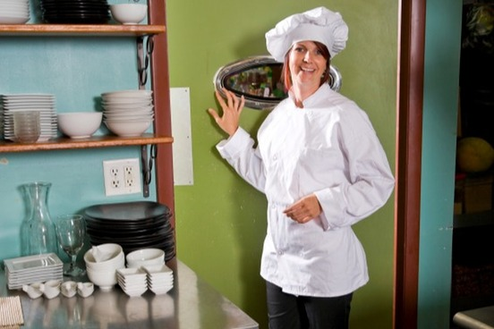
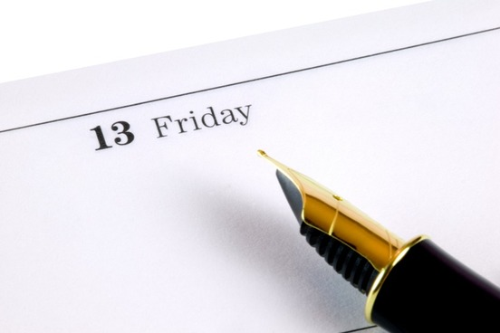
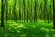
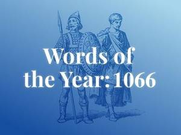
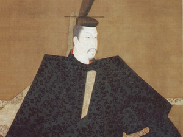

10 Perfectly Cromulent Words : Vellichor

 Words We're Watching

# 10 Perfectly Cromulent Words

## The internet loves these words—whether they're in the dictionary or not

- [(L)](https://www.merriam-webster.com/words-at-play/internets-favorite-words/vellichor#)

- [(L)](https://www.merriam-webster.com/words-at-play/internets-favorite-words/vellichor#)

- [(L)](https://www.merriam-webster.com/words-at-play/internets-favorite-words/vellichor#)

* * *

#####   [Cromulent](https://www.merriam-webster.com/words-at-play/internets-favorite-words/vellichor)

 

Definition: uncertain, possibly "acceptable," or "fine"
>

> “Are you a word geek like me? 8) So any way, my new favorite word is cromulent…It caught my attention because I'm a Conan fan, and I thought it was Crom-related.  But the truth is cooler still.”

> —Post on www.happyatheistforum.com

It is safe to say that *The Simpsons* has contributed a great deal to the English language. One famous example is *cromulent*, which was coined specifically for the 1996 episode “Lisa the Iconoclast." In reference to one character’s questioning of the use of *embiggen*, another says “it’s a perfectly cromulent word.” Despite being a complete fabrication, the word caught on, and seems to be made for the internet—where the most popular "favorite words" are rarely used for their intended purposes. Like the spurious *cromulent*, many of these words are not even entered in dictionaries, as they seem to only be trotted out as examples of one's extensive vocabulary.

*Embiggen*, by the way, was also said to have been created for this episode, although it had already been used in an issue of *Notes and Queries* from 1884, meaning "to make great." Both *cromulent* and *embiggen* have been quite successful, and stand an excellent chance of one day being used in a manner that does not slyly reference the television show that they came from.

 1/10

#####   [Defenestrate](https://www.merriam-webster.com/words-at-play/internets-favorite-words/vellichor)

 

Definition: to throw someone or something out of a window
>

> “Fun Fact: ‘Skeuomorph’ is probably tied with ‘defenestration’ for favorite word of mine. Also it is my cat's birthday.”

> —Twitter user, 13 June 2013

[*Defenestrate*](https://www.merriam-webster.com/dictionary/defenestrate) is perhaps the most common word that people pull out of their pocket and wave around when what they are actually trying to say is "look at the big shiny word I know," rather than what the word in question actually indicates. Yet the verb entered our language in the beginning of the 20th century, quite a bit later than the noun (*defenestration*) and adjective (*defenestrated*), both of which have been in use since 1620.

The early forms of this word were used in reference to the Defenestration of Prague, which occurred on May 23, 1618, when two Catholic officials were tossed from a window by irate Protestants—an event which led to the Thirty Years’ War.

 2/10

#####   [Idiocracy](https://www.merriam-webster.com/words-at-play/internets-favorite-words/vellichor)

 

Definition: government by idiots
>

> “DH's favorite word is "Idiocracy" -- it defines the A.I. voting public, apparently. :)”

> —Comment on babyfit.com, 9 March 2007

*Idiocracy* is not a particularly new word, although it has picked up a new meaning recently. It can be found as far back as 1654, in Seth Ward's *Vindiciæ academiarum*.

However, this use of the word (and pretty much all others for the next 350 years) referred to government by self-rule (the *idio*- in this word is the same one that we find in words such as *idiosyncratic*).

This all changed in 2006, with the release of Mike Judge’s *Idiocracy*, a film in which a man awakens five hundred years in the future and discovers that the world is ruled by…well, by idiots. Very few dictionaries have taken the step of including either of these uses of *idiocracy*, and the earlier one seems to be in little danger of becoming suddenly popular. The recent use of the word to refer to "government by idiots" is showing fairly wide usage, and if it remains healthy it stands a good chance of joining [other political insults](https://www.merriam-webster.com/words-at-play/political-putdowns) defined in reference books soon.

 3/10

#####   [Vellichor](https://www.merriam-webster.com/words-at-play/internets-favorite-words/vellichor)

 

Definition: the strange wistfulness of used bookstores
>

> “Day 70. Learning a new word makes me happy. Vellichor is now one of my favorite words.”

> — Twitter user, 11 March 2015

[*The Dictionary of Obscure Sorrows*](http://www.dictionaryofobscuresorrows.com/), by John Koenig, is an ongoing collection of invented words, each representing an attempt to find a word to fit a concept for which our vocabulary is currently lacking. [*Vellichor*](http://www.dictionaryofobscuresorrows.com/post/57250260260/vellichor) is one such word, and Koenig’s site has hundreds of others, such as *zenosyne* (the sense that time keeps going faster), *liberosis* (the desire to care less about things), and *sonder* (the realization that each random passerby is living a life as vivid and complex as your own).

These words are obviously not "real" words, at least not in the sense that many people think of words are being real; they are intentional creations. However, something peculiar has been happening to some of Koenig’s words: they are now cropping up in online lists of words that people particularly enjoy, and are so inching toward some sort of realness. Some purists might well say that this doesn’t make them any more real, and that they still are just made-up. This is obviously true, but what is also obviously true is that sometimes this is how a word enters the language.

 4/10

#####   [Paraprosdokian](https://www.merriam-webster.com/words-at-play/internets-favorite-words/vellichor)

 
“The cook was a good cook, as cooks go; and as cooks go she went.”

Definition: a figure of speech in which the end of the sentence is surprising, or causes the reader to reinterpret the first part.

>

> “My favorite word is paraprosdokian, and my favorite punctuation mark is the interrobang‽ (?!)”

> —OkCupid profile

We can all recognize a *paraprosdokian*, even if we can’t define it when asked to (which won’t happen to you, by the way). There is an oft-quoted line by the British writer H.H. Munro (better known as Saki) that nicely illustrates this rhetorical flourish: “The cook was a good cook, as cooks go; and as cooks go she went.”

The use of the paraprosdokian may be largely confined to playful writers and humorists (Groucho Marx was particularly adept at employing it). The use of the actual word, however, is more the province of people who are interested in bizarre and obscure words.

 5/10

#####   [Triskaidekaphobia](https://www.merriam-webster.com/words-at-play/internets-favorite-words/vellichor)

 

Definition: fear of the number 13
>

> “My favorite word is triskaidekaphobia – fear of the number 13. Why? Because it’s just a cool word. For the record, I do not suffer from triskaidekaphobia.”

> —Posted under ‘Beyond the Resume’ on a UX designer's portfolio website

Our fear of the number 13 may be old, but the word to describe it is fairly modern, occurring first in 1908, in a book by Isador Coriat titled *Religion and Medicine: the Moral Control of Nervous Disorders*. [Triskaidekaphobia](https://www.merriam-webster.com/dictionary/Triskaidekaphobia) is somewhat of a mule word (a word that draws from two different languages), as it comes from the Greek word for 13 (*triskaideka*) and the Latin *phobia*. We enjoy [unusual words for phobias](https://www.merriam-webster.com/words-at-play/top-10-unusual-phobias-vol-1/haphephobia) much more than we enjoy the phobias themselves.

 6/10

#####   [Schadenfreude](https://www.merriam-webster.com/words-at-play/internets-favorite-words/vellichor)

 

Definition: enjoyment obtained from the troubles of others
>
> 6) My favorite word is Schadenfreude
> —Profile on www.couchsurfing.com

This lovely word, so useful for describing the human condition, is taken directly from the German. It first appears in English print in 1842, in a book on psychology by a man with the enviable name of Samuel Simon Schmucker: “what the Germans term [*schadenfreude*](https://www.merriam-webster.com/dictionary/schadenfreude), a malicious pleasure in the misfortune or sufferings of others.” For a number of decades the word was only used in reference to German vocabulary, but by the end of the 19th century it had become more or less naturalized (or at least was awarded a green card), and it simply used as an English word.

*Schadenfreude* might not belong on this list, in that it seems to have changed from a word that requires explanation to a word that is widely used and commonly understood. However, it has a synonym, *epicaricacy*, that appeared in a small number of 18th century dictionaries but has failed to enjoy the same success. So if you want to describe your feelings of glee when you see someone fall into a puddle of mud, but don’t want to use an almost-common word, you may instead use *epicaricacy*.

 7/10

#####   [Petrichor](https://www.merriam-webster.com/words-at-play/internets-favorite-words/vellichor)

 

Definition: “A pleasant, distinctive smell frequently accompanying the first rain after a long period of warm, dry weather in certain regions.” (*Oxford English Dictionary*)

>

> “one of my favorite word is “Petrichor” i don't say it a lot though because people just like to use things with out even knowing the meaning behind it  this word mean a lot to me.”

> —Tumblr User

The *OED* appears to be the only dictionary that has seen fit to include this term, which was coined in 1964 and first appeared in the journal *Nature*. It is in many ways the perfect example of this certain type of word: it describes succinctly a thing that many of us thought there was no single word for, is likely to confuse almost anyone you use it with, and can instantly shift the topic of your conversation from what you were talking about to the word you just used.

 8/10

#####   [Callipygian](https://www.merriam-webster.com/words-at-play/internets-favorite-words/vellichor)

 

 Photo: [Aleksandr Zykov on Flickr](https://www.flickr.com/photos/infanticida/4985391785/in/photolist-8AxrhM-81nyWN-81jscV-519xqw-fbkmG-7JNyd-8MwGcM-8MzKiW-fYEsR-8MwFzX-3bbggV-2kLT6d-oxCxRn-6oN3WF-453yA-dpNYUk-of5vT2-VDNe-8vM9np-9W379-rUtq56-4Y6tQz-4HujP6-VDN3-oJG7ch-oueb21-oJFNhE-oLs4rD-ou)

Definition: having shapely buttocks
>

> “My favorite word is callipygian. It is a Greek word, originally derived in the 1640’s or 50’s to describe a statute of Aphrodite. It is an adjective.”

> —Post on studymode.com, 30 October 2013

[*Callipygian*](https://www.merriam-webster.com/dictionary/callipygian) is a perfectly lovely word. It is potentially useful, and is unique (there are no other single non-slang words for the state of having shapely buttocks in English). However, it merits inclusion in this list on the grounds that people rarely use it in a natural fashion; it is almost always used to illustrate the complexity of English vocabulary, rather than to describe a posterior. There is a very good reason for this: few people will appreciate your using this word to describe them, no matter how much you explain it. It is also but one of a list of words that English has for describing buttocks of a wide variety. We have obscure words to describe rumps that are fat (*steatopygous*), hairy (*dasypygal*), and skinny (*pin buttock*).

 9/10

#####   [Antidisestablishmentarianism](https://www.merriam-webster.com/words-at-play/internets-favorite-words/vellichor)

 [(L)](https://www.merriam-webster.com/words-at-play/green-words/prasine)
 Up Next
 
5 Better Ways to Say 'Green'

 

Definition: ”Properly, opposition to the disestablishment of the Church of England” (*Oxford English Dictionary*)

>

> “My favorite word is PARTY. My second favorite word is HARD. And my third favorite word is ANTIDISESTABLISHMENTARIANISM”

> —Twitter User, 22 June 2013

If you spend any significant amount of time looking at lists that people make of their favorite obscure words in English (and the Internet is awash with such things), you will very quickly notice one salient characteristic that most of the entries share: they are made up of exceedingly long words. You are unlikely to find many lists composed of the likes of *bur*, *pip*, and [*ut*](https://www.merriam-webster.com/dictionary/ut). It is uncertain why we have such a fascination with lengthy words, although a desire to appear learned probably has something to do with it.*Antidisestablishmentarianism* is a splendid example of a word that people enjoy for some reason other than its ostensibly intended use; they like it because it is a very long word. *Merriam-Webster* does not define the word, on the grounds that very few people (if any) ever use it, except as an example of a long word. The *Oxford English Dictionary* does define it, but also notes that it is “popularly cited as an example of a long word."

The word has been in use as an example of a mouthful of syllables for slightly over a hundred years now, and it seems likely that it has had a far more successful career as a curio than it ever would have had as a description of the opposition to the [disestablishment](https://www.merriam-webster.com/dictionary/disestablishment) of a church.

 10/10

 [(L)](https://www.merriam-webster.com/words-at-play/green-words/prasine)

 
5 Better Ways to Say 'Green'

 Up Next

* * *

## More Words At Play

 

##### [Hostage's Time in Captivity was 'Kafkaesque'](https://www.merriam-webster.com/news-trend-watch/hostages-time-in-captivity-was-kafkaesque-20171012)

['A nightmarish quality'](https://www.merriam-webster.com/news-trend-watch/hostages-time-in-captivity-was-kafkaesque-20171012)

 

##### ['Gamut' and 'Gambit' (and 'Gauntlet' Too)](https://www.merriam-webster.com/words-at-play/gamut-and-gambit-and-gauntlet-too)

[Know when to use (or run) each.](https://www.merriam-webster.com/words-at-play/gamut-and-gambit-and-gauntlet-too)

 

##### [Words of the Year: 1066](https://www.merriam-webster.com/video/words-from-the-norman-invasion)

[Or, Why Pig Meat is Called 'Pork' and Cow Meat is Called 'Beef'](https://www.merriam-webster.com/video/words-from-the-norman-invasion)

 

##### [17 English Words that Come From Japanese](https://www.merriam-webster.com/words-at-play/17-english-words-that-come-from-japanese)

[Some borrowed words don't get returned](https://www.merriam-webster.com/words-at-play/17-english-words-that-come-from-japanese)

* * *

### Comments

 [** show](https://www.merriam-webster.com/words-at-play/internets-favorite-words/vellichor#)  comments

####   [TRENDING NOW](https://www.merriam-webster.com/news-trend-watch/see-all)

1. 1

 [ Kafkaesque    'A nightmarish quality'](https://www.merriam-webster.com/news-trend-watch/hostages-time-in-captivity-was-kafkaesque-20171012)

2. 2

 [ mike    "microphone"](https://www.merriam-webster.com/news-trend-watch/trump-espns-ratings-due-to-jemele-hill-at-the-mike-20171010)

3. 3

 [ moron    “a very stupid person”](https://www.merriam-webster.com/news-trend-watch/moron-spikes-after-tillerson-reports-20171004)

4. 4

 [ terrorism    “The use of violent acts to frighten"](https://www.merriam-webster.com/news-trend-watch/terrorism-lookups-follow-las-vegas-shooting-20171002)

5. 5

 [ dotage, dotard    a state or period of senile decay](https://www.merriam-webster.com/news-trend-watch/kim-jong-un-trump-a-dotard-20170921)

 [SEE ALL](https://www.merriam-webster.com/news-trend-watch/see-all)

* * *

Learn a new word every day. Delivered to your inbox!

* * *

### Love words? Need even more definitions?

Subscribe to America's largest dictionary and get thousands more definitions and advanced search—ad free!

 [Merriam-Webster unabridged](https://unabridged.merriam-webster.com/subscriber/register/p1?refc=FOOTER_GALLERY_MWU)