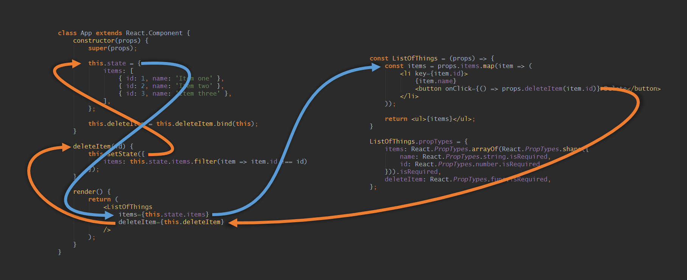

10 React mini-patterns – Hacker Noon

# 10 React mini-patterns

Over the last few years, I’ve worked on a handful of decent-sized React projects, and many, many pint-sized ones. Throughout this magical journey, a number of patterns have come up that I find myself repeating again and again.

Because that’s what patterns are.

These are the sorts of things I would like to have heard about on day one. So if today is your day one with React, you’re in luck.

Or maybe you’re not. There’s only one way to find out…

It’s a long one, but it’s a listicle so you can skip the boring ones (3, 6, 8, 10).

### #1 Sending data down and up

The one thing I’d recommend to everyone new to React is to get your head around the pattern of passing information down (as objects, strings, etc.) and passing methods down to allow child components to pass information back up.

Like sending down a packet of chips and a walkie talkie to miners trapped underground.

How about a picture? The below *thing* is the simplest form of this pattern.

Worth a thousand words?

Parent on the left, child on the right. You can think of the two props that connect these components as allowing information to flow in either direction between the two.

The prop called `items` is passing data down into the child component. The prop called `deleteItem` is giving the child component a way to send some information back up into the parent (“hey, delete this item”).

That’s not really a pattern.
The rest are patterns. I promise.

### #2 Fixing HTML’s inputs

One of the great things about React, and web components in general, is that you get to iron out the kinks if something in html doesn’t work the way you want.

If you think about the different elements that allow for user input (do it), you will soon see that the naming of these elements is nonsensical, bordering on reckless.

If I’m building a site that will have a lot of user inputs, one of the first things I do is fix this.

It’s not purely cosmetic though; there are more improvements to be had:

- •Inputs should return a value via an `onChange` method, not a JavaScript `Event` instance, shouldn’t they?
- •You can go a step further and ensure that the data type returned in `onChange` matches the type passed in. If the `typeof props.value` is `number`, then convert `e.target.value` back to a number before sending the data out again.
- •A set of radio buttons is functionally the same thing as a `<select>`, right? It’s messed up to treat them in a completely different manner when the only difference is the UI. Maybe for your app it makes sense to have a single `<PickOneFromMany />` component and pass either `ui="radio"` or `ui="dropDown"`.

The point is not to do it like I do it. The point is to make them your own — you don’t need to keep working with the somewhat ass-about nature of HTML’s user input elements.

### #3 Binding labels to inputs with unique IDs

On the topic of inputs… if you care about your users, you’ll bind your `<label>` elements to your `<input>`s via an `id`/`for` combo.

But you don’t want to think of some clever and unique id for every input you define, who’s got time for that? I don’t know about you but I’ve got goat videos to watch.

(Frequent-flyer tip: if you have a screaming child on your flight, close your eyes and pretend you’re watching a video on YouTube of goats that sound like humans. Annoying becomes hilarious.)

Back to it. You *could* generate a random ID for each input/label pair, but then your client-rendered HTML won’t match your server-rendered HTML. Checksum error! That’s no good.

So, instead you can create a little module that gives an incrementing ID, and use that in an `Input` component like so:

|     |     |
| --- | --- |
| 1   | class  Input  extends  React.Component { |
| 2   |  constructor(props) { |
| 3   |  super(props); |
| 4   | this.id =  getNextId(); |
| 5   |     |
| 6   | this.onChange = this.onChange.bind(this); |
| 7   | }   |
| 8   |     |
| 9   |  onChange(e) { |
| 10  | this.props.onChange(e.target.value); |
| 11  | }   |
| 12  |     |
| 13  |  render() { |
| 14  | return ( |
| 15  | <label  htmlFor={this.id}> |
| 16  |  {this.props.label} |
| 17  |     |
| 18  | <input |
| 19  |  id={this.id} |
| 20  |  value={this.props.value} |
| 21  |  onChange={this.onChange} |
| 22  | />  |
| 23  | </label> |
| 24  | );  |
| 25  | }   |
| 26  | }   |

 [view raw](https://gist.github.com/davidgilbertson/2cd13f571edda9a884107db3abd8de1b/raw/2637f6cadcc02f9dd9ef3b3929f362891e47c415/Input-for-id.jsx)  [Input-for-id.jsx](https://gist.github.com/davidgilbertson/2cd13f571edda9a884107db3abd8de1b#file-input-for-id-jsx) hosted with ❤ by [GitHub](https://github.com/)

Obviously it makes more sense when the input *isn’t *inside the label.

If `getNextId()` simply increments a number every time it’s called, then when rendering on the server, the number would keep going up and up, eventually reaching infinity. So you’ll want to reset the number each time you render the app (for each network request).

You can do this at the entry point to your app, with a simple `resetId()` or whatever name you think is best.

With all that taken into account, your super-fancy module might look something like this:

|     |     |
| --- | --- |
| 1   | let count =  1; |
| 2   |     |
| 3   | export  const  resetId  = () => { |
| 4   | count =  1; |
| 5   | }   |
| 6   |     |
| 7   | export  const  getNextId  = () => { |
| 8   |  return  `element-id-${count++}`; |
| 9   | }   |

 [view raw](https://gist.github.com/davidgilbertson/0377b00b31afc4ac7c9bbb9b8706cca7/raw/ff81c7332d8ec6725ec6749d7459268b82a821b6/elementIdCreator.js)  [elementIdCreator.js](https://gist.github.com/davidgilbertson/0377b00b31afc4ac7c9bbb9b8706cca7#file-elementidcreator-js) hosted with ❤ by [GitHub](https://github.com/)

### #4 Controlling CSS with props

When you want to apply different CSS in different instances (e.g. ‘primary’ and ‘secondary’ buttons) you can pass in props to control which CSS to apply.

This seems super simple on the surface, but let me assure you there are a lot of wrong ways to do this (I’ve tried them all!).

There are — I reckon — three distinct ways in which you can control the CSS applied to a component.

#### Using themes

For grouping a number of CSS declarations together, you can use the idea of ‘themes’, for example primary or secondary button:

`<Button theme="secondary">Hello</Button>`
Do your best to only require one theme per component.

#### Using flags

Maybe some of your buttons have rounded corners, but this doesn’t correspond directly with the themes you have defined.

In this case you can either sit your designer down and have *the consistency talk*, or create a boolean prop which might look a little something like this:

`<Button theme="secondary" rounded>Hello</Button>`
Just like HTML’s binary attributes, you don’t need to do `rounded={true}`.

#### Setting values

In some cases you might want to pass in the value of a CSS property directly (in the component you would set it as an inline style).

`<Icon width="25" height="25" type="search" />`

#### An example

Imagine you’re creating a link component. You go through your site’s designs and work out that there are three distinct themes, and that sometimes they have an underline, sometimes they don’t.

Here’s how I would design that component:

|     |     |
| --- | --- |
| 1   | const  Link = (props) => { |
| 2   |  let  className =  `link link--${props.theme}-theme`; |
| 3   |     |
| 4   | if (!props.underline) className +=  ' link--no-underline'; |
| 5   |     |
| 6   | return <a  href={props.href}  className={className}>{props.children}</a>; |
| 7   | };  |
| 8   |     |
| 9   | Link.propTypes  = { |
| 10  |  theme:  PropTypes.oneOf([ |
| 11  |  'default',  // primary color, no underline |
| 12  |  'blend',  // inherit surrounding styles |
| 13  |  'primary-button',  // primary color, solid block |
| 14  | ]), |
| 15  |  underline:  PropTypes.bool, |
| 16  |  href:  PropTypes.string.isRequired, |
| 17  |  children:  PropTypes.oneOfType([ |
| 18  |  PropTypes.element, |
| 19  |  PropTypes.array, |
| 20  |  PropTypes.string, |
| 21  | ]).isRequired, |
| 22  | };  |
| 23  |     |
| 24  | Link.defaultProps  = { |
| 25  |  theme:  'default', |
| 26  |  underline: false, |
| 27  | };  |

 [view raw](https://gist.github.com/davidgilbertson/0395dde53099c6c96c03ea77e16182a6/raw/5a56b3c6e2f575d9afd918b59140965cf68fa09b/Link.jsx)  [Link.jsx](https://gist.github.com/davidgilbertson/0395dde53099c6c96c03ea77e16182a6#file-link-jsx) hosted with ❤ by [GitHub](https://github.com/)

And the CSS…

|     |     |
| --- | --- |
| 1   | .link--default-theme, |
| 2   | .link--blend-theme:hover { |
| 3   |  color: #D84315; |
| 4   | }   |
| 5   |     |
| 6   | .link--blend-theme { |
| 7   |  color: inherit; |
| 8   | }   |
| 9   |     |
| 10  | .link--default-theme:hover, |
| 11  | .link--blend-theme:hover { |
| 12  |  text-decoration: underline; |
| 13  | }   |
| 14  |     |
| 15  | .link--primary-button-theme { |
| 16  |  display: inline-block; |
| 17  |  padding: 12px  25px; |
| 18  |  font-size: 18px; |
| 19  |  background: #D84315; |
| 20  |  color: white; |
| 21  | }   |
| 22  |     |
| 23  | .link--no-underline { |
| 24  |  text-decoration: none; |
| 25  | }   |

 [view raw](https://gist.github.com/davidgilbertson/40489061968cbc9363346a8975167d54/raw/f5270c2598e41de58369f1696166d8243ee043aa/Link.css)  [Link.css](https://gist.github.com/davidgilbertson/40489061968cbc9363346a8975167d54#file-link-css) hosted with ❤ by [GitHub](https://github.com/)

You may have noticed the awkward double negative for `link--no-underline`.

Story time: I used to think writing fewer lines of CSS was the goal, but it’s not. I’d rather have some double-negatives and multi-selector rulesets if it means the styles are applied in a nice layered way.

I’m sure I’ve said it before but the hardest thing about scaling a website is the CSS. JavaScript is easy, but with CSS you pay for your sins — once you’ve started a mess, it’s not easy to back out of.

True fact: fighting CSS specificity is the number one cause of death among web developers. If you’re on a big computer, check out the CSS for the little notification icon in medium’s top nav.

If you’re not, or you’re lazy, just guess how many CSS rules are combined to make this round circle with a number in it?

Twenty three rules.
That’s *not *including the styles inherited from eleven other rules.
The line-height alone is overridden nine times.

If line-height was a cat it would be dead by now.
This cannot be pleasant to maintain.

With React we can do better. We can thoughtfully design which classes are applied to our components. We can remove global resets and move it all inside our `Button.scss`. We can remove all reliance on specificity and ordering of files.

Side note: I dream of a day when we will be able to tell browsers that we don’t want their opinion about style at all. `::user-agent-styles: none-whatsoever;` — make it happen, vendors. [Edit: a clever chap in the comments has pointed out that `all: unset` may cure what ails me.]

### #5 The switching component

A switching component is a component that renders one of many components.

This may be a `<Page>` component that displays one of many pages. Or tabs in a tab set, or different modals in a modal component.

I used to do this with switch statements, then progressed to actually passing in the component I wanted rendered. Then moved on to exporting references to the components from the component itself (as named exports, then as properties on the component).

All terrible ideas.

The potentially-terrible approach that I have settled on is to use an object to map prop values to components.

|     |     |
| --- | --- |
| 1   | import HomePage from  './HomePage.jsx'; |
| 2   | import AboutPage from  './AboutPage.jsx'; |
| 3   | import UserPage from  './UserPage.jsx'; |
| 4   | import FourOhFourPage from  './FourOhFourPage.jsx'; |
| 5   |     |
| 6   | const  PAGES  = { |
| 7   |  home: HomePage, |
| 8   |  about: AboutPage, |
| 9   |  user: UserPage, |
| 10  | };  |
| 11  |     |
| 12  | const  Page = (props) => { |
| 13  |  const  Handler = PAGES[props.page] \|\| FourOhFourPage; |
| 14  |     |
| 15  | return <Handler  {...props} /> |
| 16  | };  |
| 17  |     |
| 18  | Page.propTypes  = { |
| 19  |  page:  PropTypes.oneOf(Object.keys(PAGES)).isRequired, |
| 20  | };  |

 [view raw](https://gist.github.com/davidgilbertson/b7c9b4a9f99e7fc301687e151540de6b/raw/d576e1dc8d780d7a154d8a75902a1f165c88c443/Page.jsx)  [Page.jsx](https://gist.github.com/davidgilbertson/b7c9b4a9f99e7fc301687e151540de6b#file-page-jsx) hosted with ❤ by [GitHub](https://github.com/)

The keys of the `PAGES` object can be used in the prop types to catch dev-time errors.

Then of course we would use this like `<Page page="home" />`.

If you replace the keys `home`, `about` and `user` with `/`, `/about`, and `/user`, you’ve got yourself half a router.

(Future post idea: removing `react-router`.)

### #6 Reaching into a component

If you’re looking for an easy way to please your users, add `autofocus` to the input that they are most likely to type into when coming to a page. It really is that easy.

Perhaps you have a sign-in form and — being the UX champ that you are — you want to put that little blinking cursor in the ‘user name’ field.

But oh no, the form shows in a modal when the user clicks ‘sign in’, and the `autofocus` attribute only applies to page load.

Whatever will you do!

You’ll programmatically focus the element, that’s what. Here you may be tempted to give the input an id and type `document.getElementById('user-name-input').focus()`.

This works, but is not The Correct Way. The fewer things you have in your app that rely on two strings matching, the better.

Luckily, there is a very easy way to do this ‘properly’:

|     |     |
| --- | --- |
| 1   | class  Input  extends  Component { |
| 2   |  focus() { |
| 3   | this.el.focus(); |
| 4   | }   |
| 5   |     |
| 6   |  render() { |
| 7   | return ( |
| 8   | <input |
| 9   |  ref={el=> { this.el = el; }} |
| 10  | />  |
| 11  | );  |
| 12  | }   |
| 13  | }   |

 [view raw](https://gist.github.com/davidgilbertson/b118a247865070a419c9736aeb3e0358/raw/c040644fba4d5622f9f4b36c5f6d75fc183b266c/Input-with-focus.jsx)  [Input-with-focus.jsx](https://gist.github.com/davidgilbertson/b118a247865070a419c9736aeb3e0358#file-input-with-focus-jsx) hosted with ❤ by [GitHub](https://github.com/)

Boom, an input component with a `focus()` method that focuses the HTML element.

In the parent component, we can get a reference to the Input component and call its `focus()` method.

|     |     |
| --- | --- |
| 1   | class  SignInModal  extends  Component { |
| 2   |  componentDidMount() { |
| 3   | this.InputComponent.focus(); |
| 4   | }   |
| 5   |     |
| 6   |  render() { |
| 7   | return ( |
| 8   | 
 |
| 9   | <label>User name: </label> |
| 10  | <Input |
| 11  |  ref={comp  => { this.InputComponent = comp; }} |
| 12  | />  |
| 13  | 
 |
| 14  | )   |
| 15  | }   |
| 16  | }   |

 [view raw](https://gist.github.com/davidgilbertson/4602e62582f2dc4a05f177af7bb0e35a/raw/ee8a64eddea089a536c3a2372a988efd3e536708/SignInModal-focus-child.jsx)  [SignInModal-focus-child.jsx](https://gist.github.com/davidgilbertson/4602e62582f2dc4a05f177af7bb0e35a#file-signinmodal-focus-child-jsx) hosted with ❤ by [GitHub](https://github.com/)

Note that when you use `ref` on a component, it’s a reference to the component (not the underlying element), so you have access to its methods.

### #7 Almost-components

Let’s say you’re building a component that lets you search for people. As you type, you see a list of names and photos of potential matches. Something like this.

(I’m searching for political satirists because I, like *everyone*, am super interested in what other people think about politics.)

When designing this component, you may think to yourself: is each item in that list it’s own `SearchSuggestion` component? It’s really only a few lines of HTML and CSS, so maybe not? But I was once told ‘if in doubt, create another component’.

Oh my, this is quite the dilly of a pickle, isn’t it?

If I was making this, I would not have a separate component. Instead, just a `renderSearchSuggestion` method that returned the appropriate DOM for each entry. I can then generate the results like:

|     |     |
| --- | --- |
| 1   | const  SearchSuggestions = (props) => { |
| 2   |  // renderSearchSuggestion() behaves as a pseduo SearchSuggestion component |
| 3   |  // keep it self contained and it should be easy to extract later if needed |
| 4   |  const  renderSearchSuggestion  =  listItem  => ( |
| 5   | <li  key={listItem.id}>{listItem.name}  {listItem.id}</li> |
| 6   | );  |
| 7   |     |
| 8   | return ( |
| 9   | <ul> |
| 10  |  {props.listItems.map(renderSearchSuggestion)} |
| 11  | </ul> |
| 12  | );  |
| 13  | }   |

 [view raw](https://gist.github.com/davidgilbertson/b31d5ce0a3798f4c79367cdfcda0a583/raw/0f3cccb3890f9ee4a7e84bd96bca9ba075ccd47f/SearchSuggestions-with-pseudo.jsx)  [SearchSuggestions-with-pseudo.jsx](https://gist.github.com/davidgilbertson/b31d5ce0a3798f4c79367cdfcda0a583#file-searchsuggestions-with-pseudo-jsx) hosted with ❤ by [GitHub](https://github.com/)

If things get more complex or you want to use this component elsewhere, you should be able to copy/paste the code out into a new component.

Don’t prematurely componentize. Components aren’t like teaspoons; you *can *have too many.

What I am not saying: “take something that you think should be a component, and make it part of the parent component.”

What I am saying: “take something that you *don’t* think should be a component, and make it a bit more like its own component (if it can be).”

### #8 Components for formatting text

When I first started with React I thought of components as big things, a way of grouping structural chunks of DOM. But components work just as well as a way to apply formatting.

Here’s a `<Price>` component that takes a number and returns a pretty string, with or without decimals and a ‘$’ sign.

|     |     |
| --- | --- |
| 1   | const  Price = (props) => { |
| 2   |  const  price = props.children.toLocaleString('en', { |
| 3   |  style: props.showSymbol  ?  'currency'  : undefined, |
| 4   |  currency: props.showSymbol  ?  'USD'  : undefined, |
| 5   |  maximumFractionDigits: props.showDecimals  ?  2  :  0, |
| 6   | }); |
| 7   |     |
| 8   | return {price} |
| 9   | };  |
| 10  |     |
| 11  | Price.propTypes  = { |
| 12  |  className:  React.PropTypes.string, |
| 13  |  children:  React.PropTypes.number, |
| 14  |  showDecimals:  React.PropTypes.bool, |
| 15  |  showSymbol:  React.PropTypes.bool, |
| 16  | };  |
| 17  |     |
| 18  | Price.defaultProps  = { |
| 19  |  children:  0, |
| 20  |  showDecimals: true, |
| 21  |  showSymbol: true, |
| 22  | };  |
| 23  |     |
| 24  | const  Page = () => { |
| 25  |  const  lambPrice =  1234.567; |
| 26  |  const  jetPrice =  999999.99; |
| 27  |  const  bootPrice =  34.567; |
| 28  |     |
| 29  | return ( |
| 30  | 
 |
| 31  | 
One lamb is <Price  className="expensive">{lambPrice}</Price>
 |
| 32  | 
One jet is <Price  showDecimals={false}>{jetPrice}</Price>
 |
| 33  | 
Those gumboots will set ya back <Price  showDecimals={false}  showSymbol={false}>{bootPrice}</Price> bucks.
 |
| 34  | 
 |
| 35  | );  |
| 36  | };  |

 [view raw](https://gist.github.com/davidgilbertson/a7cb41cb9b9c14e5f04b03ff7fde8ad9/raw/b8fcd6a4ed021c1ad43878b4ce2860568f790198/Price-with-usage.jsx)  [Price-with-usage.jsx](https://gist.github.com/davidgilbertson/a7cb41cb9b9c14e5f04b03ff7fde8ad9#file-price-with-usage-jsx) hosted with ❤ by [GitHub](https://github.com/)

As you can see I’m using the powerful `Intl` string formatting library, here’s a [link to their website](https://developer.mozilla.org/en/docs/Web/JavaScript/Reference/Global_Objects/Number/toLocaleString).

I should point out (before some punk does) that this is not a saving in lines of code. You could just as easily use a function to do this. (Of course components are just functions with different shaped brackets.)

It’s less code, but to my eye, not quite as nice:

|     |     |
| --- | --- |
| 1   | function  numberToPrice(num, options  = {}) { |
| 2   |  const  showSymbol = options.showSymbol !== false; |
| 3   |  const  showDecimals = options.showDecimals !== false; |
| 4   |     |
| 5   | return num.toLocaleString('en', { |
| 6   |  style: showSymbol  ?  'currency'  : undefined, |
| 7   |  currency: showSymbol  ?  'USD'  : undefined, |
| 8   |  maximumFractionDigits: showDecimals  ?  2  :  0, |
| 9   | }); |
| 10  | }   |
| 11  |     |
| 12  | const  Page = () => { |
| 13  |  const  lambPrice =  1234.567; |
| 14  |  const  jetPrice =  999999.99; |
| 15  |  const  bootPrice =  34.567; |
| 16  |     |
| 17  | return ( |
| 18  | 
 |
| 19  | 
One lamb is {numberToPrice(lambPrice)}
 |
| 20  | 
One jet is {numberToPrice(jetPrice, {  showDecimals: false })}
 |
| 21  | 
Those gumboots will set ya back {numberToPrice(bootPrice, {  showDecimals: false,  showSymbol: false })} bucks.
 |
| 22  | 
 |
| 23  | );  |
| 24  | };  |

 [view raw](https://gist.github.com/davidgilbertson/88f25c3ad800fcf099b00e2201949e8b/raw/9a30735dedd056416d27250c687b945ba6717d4c/numberToPrice-with-usage.jsx)  [numberToPrice-with-usage.jsx](https://gist.github.com/davidgilbertson/88f25c3ad800fcf099b00e2201949e8b#file-numbertoprice-with-usage-jsx) hosted with ❤ by [GitHub](https://github.com/)

Note that I’m not checking that I got a valid number in any of the above. That’s because …

### #9 The store is the component’s servant

I have probably written this thousands of times:
if (props.user.signInStatus === SIGN_IN_STATUSES.SIGNED_IN)...
(I’ve been told that I exaggerate, like, a gazillion times.)

Quite recently I have decided that if I’m doing a check like this, I’m doing it wrong. I want to just ask “is the user signed in?”, not “is the sign in status of the user equal to signed in?”

My components have enough going on in their lives, they shouldn’t have to worry their pretty little heads over such matters. Nor should they have to worry that a price isn’t being sent as a number, or a boolean as the word ‘true’.

For you see, if the data in your store is designed to match your components, your components will be much simpler. And I’ve said it before, complexity is where the bugs hide. The less complexity you have in your components, the lower the chance of bugs.

But the complexity has to go *somewhere*, doesn’t it?
My suggestion is this:

1. 1Work out the general structure of your components and the data they will require

2. 2Design your store to support those requirements

3. 3Do whatever you need to do to your incoming data to make it fit into the store.

For this last point, I recommend a single module that does all the massaging of incoming data (oh la la). Renaming props, casting strings to numbers, objects into arrays, date strings to date objects, whatever.

Do it all in the one place, and unit test the crap out of it.

If you’re rockin’ a react/redux setup, you might then do something like this in an action creator that fetches search results:

|     |     |
| --- | --- |
| 1   | fetch(`/api/search?${queryParams}`) |
| 2   | .then(response  =>  response.json()) |
| 3   | .then(normalizeSearchResultsApiData) // the do-it-all data massager |
| 4   | .then(normalData  => { |
| 5   |  // dispatch normalData to the store here |
| 6   | }); |

 [view raw](https://gist.github.com/davidgilbertson/3ae5b5a77d3d5c1d7513f5f39de487ad/raw/ef5f858c7b20cb32394fa05deb958ef861e621f9/get-search-results-action-creator-body.js)  [get-search-results-action-creator-body.js](https://gist.github.com/davidgilbertson/3ae5b5a77d3d5c1d7513f5f39de487ad#file-get-search-results-action-creator-body-js) hosted with ❤ by [GitHub](https://github.com/)

Your components will thank you for it.

### #10 Importing components without relative paths

Wouldn’t it be sweet if instead of doing this:
**import **Button **from **'../../../../Button/Button.jsx';
**import **Icon **from **'../../../../Icon/Icon.jsx';
**import **Footer **from **'../../Footer/Footer.jsx';
You could just do this:
`import {Button, Icon, Footer} from 'Components';`
Well in *theory *you can:

- •Create a single `index.js` somewhere that exports references each of your components
- •Use Webpack's `resolve.alias` to redirect `Components` to that index file

I hadn’t done this before, and planned to convert one of my existing apps for this post (then lie and tell you I totes do it all the time). But as I wrote the code I came to realise that this is a bad idea, for three reasons:

1. 1It [seems to be broken](https://github.com/webpack/webpack/issues/4160#issuecomment-281236136) in Webpack 2.

2. 2It’s an `eslint` error because `Components` won’t be in `node_modules`.

3. 3If you use a good IDE, it will know things about your components. You will get clever warnings about not supplying required props, the ability to `cmd`/`ctrl`+click to open that component’s file. Things of that nature.

If you do the above, your IDE will no longer know where to find that component and you’ll lose those smarts.

Thanks, WebStorm.

Edit: [matthew hsiung](https://medium.com/@hsiungmatt) has a solution for the eslint and WebStorm issues in [this comment](https://medium.com/@hsiungmatt/great-article-917a2f6b718e#.w66jk94ao).

### Wrap up

That’s the lot of them. I’m quite sure I’ll look at this in a year and wince. Perhaps you’ll do it today. Perhaps you’ll share something that has served you well.

Oh and I’ve decided I don’t care if you click the little green heart or not. I WILL NOT BE DEFINED BY AN INTERNET METRIC.