100 Notable Books of 2019 - The New York Times

 
Cari Vander Yacht

#  100 Notable Books of 2019

The year’s notable fiction, poetry and nonfiction, selected by the editors of The New York Times Book Review.

Show All

Comics/Graphics

Fiction

Memoir

Nonfiction

Poetry

Stories

Thrillers

 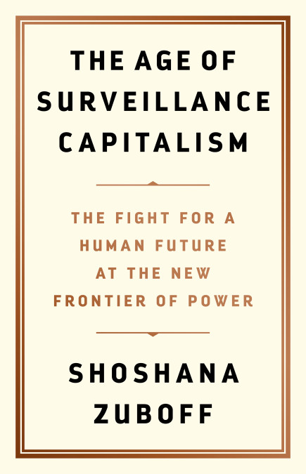

 [The Age of SurveillanceCapitalism: The Fightfor a Human Future atthe New Frontier of Power](https://www.nytimes.com/2019/01/18/books/review/shoshana-zuboff-age-of-surveillance-capitalism.html)

By **Shoshana Zuboff.** $38.00. PublicAffairs.

  Nonfiction.

This intensively researched, engaging book examines how tech behemoths like Facebook and Google gather personal data they can manipulate in unprecedented ways.

Buy

 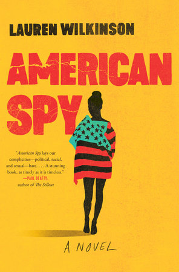

 [American Spy](https://www.nytimes.com/2019/02/20/books/review/american-spy-lauren-wilkinson.html)

By **Lauren Wilkinson.** $27.00. Random House.

  Fiction.

This gutsy debut thriller — about a black female F.B.I. agent haunted by an old case — delivers plenty of action while addressing thought-provoking issues of identity, belonging and moral compromise. “Running informants was about cultivating their trust,” the heroine says. “I found it worked best to lie frequently.”

Buy

 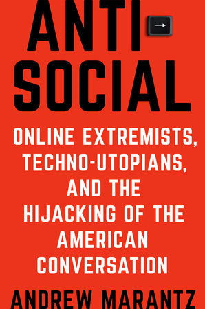

 [Antisocial: OnlineExtremists, Techno-Utopians,and the Hijacking ofAmerican Conversation](https://www.nytimes.com/2019/10/10/books/review/antisocial-andrew-marantz.html)

By **Andrew Marantz.** $28.00. Viking.

  Nonfiction.

The tech entrepreneurs who built social media imagined it as a community where users would connect and make the world a better place. Marantz visits the darkest, most twisted corners of the internet to show how that original blueprint went wrong.

Buy

 

 [Audience of One: DonaldTrump, Television, andthe Fracturing of America](https://www.nytimes.com/2019/09/06/books/review/audience-of-one-james-poniewozik.html)

By **James Poniewozik.** $27.95. Liveright.

  Nonfiction.

Using his ample comedic gifts to describe a slow-boil tragedy, Poniewozik, the chief television critic of The New York Times, traces the contemporaneous histories of Trump and TV. Perhaps his greatest accomplishment is making Trump’s presidency seem almost inevitable.

Buy

 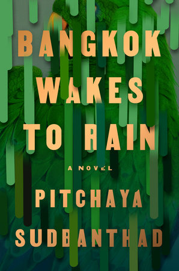

 [Bangkok Wakes to Rain](https://www.nytimes.com/2019/04/04/books/review/bangkok-veeraporn-nitiprapha-pitchaya-sudbanthad.html)

By **Pitchaya Sudbanthad.** $27.00. Riverhead.

  Fiction.

In his debut novel, Pitchaya explores the intersecting lives of several generations — human and animal — connected to a single house in Thailand’s fever dream of a capital city. The book evokes a place as much as a people.

Buy

 

 [Becoming](https://www.nytimes.com/2018/12/06/books/review/michelle-obama-becoming-memoir.html)

By **Michelle Obama.** $32.50. Crown.

  Nonfiction.    Memoir.

The former first lady spent much of the last decade in the public eye; her memoir shows us her life from the inside, recounting with grace, candor and wit her family’s journey from the Jim Crow South to Chicago and her own improbable rise to the White House.

Buy

 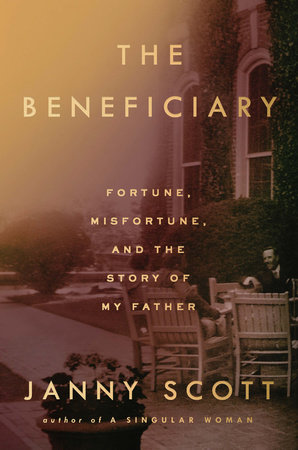

 [The Beneficiary:Fortune, Misfortune, andthe Story of My Father](https://www.nytimes.com/2019/04/19/books/review/beneficiary-janny-scott.html)

By **Janny Scott.** $28.00. Riverhead.

  Nonfiction.

Scott, a former reporter for The Times, explores the consequences of generations of inherited Main Line wealth as played out in her own family.

Buy

 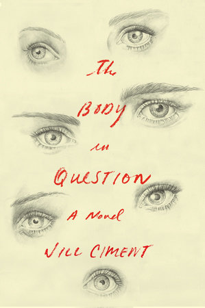

 [The Body in Question](https://www.nytimes.com/2019/06/11/books/review/jill-ciment-body-in-question.html)

By **Jill Ciment.** $24.95. Pantheon.

  Fiction.

In this deliciously acerbic and intelligent novel, two jurors meet at a murder trial, and, sequestered at an Econo Lodge, begin a passionate affair with unexpected reverberations on their lives and the legal proceedings. Among the book’s other pleasures, Ciment knowingly but matter-of-factly depicts class distinctions.

Buy

 

 [Bottle of Lies: The Inside Storyof the Generic Drug Boom](https://www.nytimes.com/2019/05/13/books/review/bottle-of-lies-katherine-eban.html)

By **Katherine Eban.** $28.99. Ecco/HarperCollins.

  Nonfiction.

In her stunning exposé, Eban describes an industry rife with corruption and life-threatening misdeeds exacerbated by lax regulation.

Buy

 

 [The British Are Coming:The War for America,Lexington to Princeton, 1775-1777](https://www.nytimes.com/2019/05/11/books/review/rick-atkinson-the-british-are-coming.html)

By **Rick Atkinson.** $40.00. Holt.

  Nonfiction.

This first volume in a planned trilogy offers a Tolstoyan perspective on the American Revolution, presenting a conflict that will be new to many readers, one that was ugly, savage and often barbaric.

Buy

 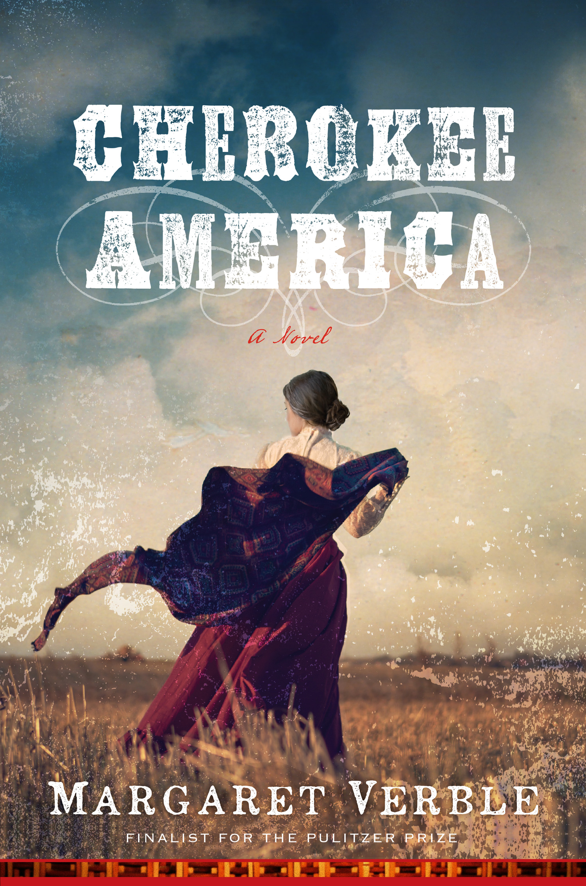

 [Cherokee, America](https://www.nytimes.com/2019/03/07/books/review/cherokee-america-margaret-verble.html)

By **Margaret Verble.** $27.00.
Houghton Mifflin Harcourt.

  Fiction.

Verble, a voting member of the Cherokee Nation of Oklahoma, explores her heritage in this historical novel, a sprawling family saga that opens in 1875 and includes subplots about murder, politics, romance — and, always, Cherokee culture.

Buy

 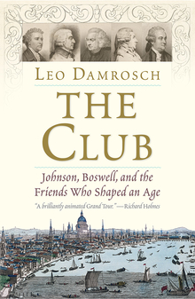

 [The Club: Johnson,Boswell, and the FriendsWho Shaped an Age](https://www.nytimes.com/2019/04/05/books/review/leo-damrosch-club.html)

By **Leo Damrosch.** $30.00. Yale University.

  Nonfiction.

Beginning in 1764, some of Britain’s future leading lights (including Samuel Johnson, Edmund Burke and Edward Gibbon) met every Friday night to talk and drink. Damrosch’s magnificent history revives the Club’s creative ferment.

Buy

 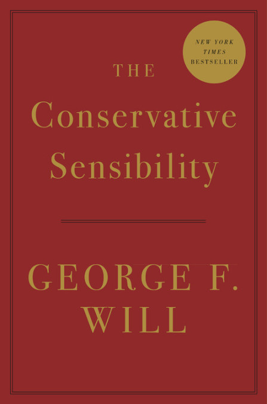

 [The Conservative Sensibility](https://www.nytimes.com/2019/06/03/books/review/george-will-the-conservative-sensibility.html)

By **George F. Will.** $35.00. Hachette.

  Nonfiction.

Will, after a long career as a public intellectual, sums up his thinking about the meaning of conservatism in an argument that includes history, epistemology, culture, religion, politics and constitutionalism.

Buy

 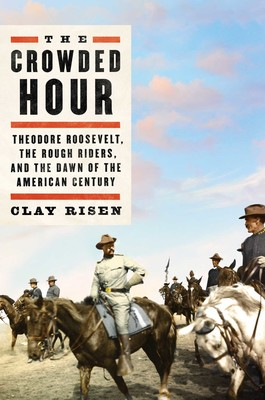

 [The Crowded Hour:Theodore Roosevelt, theRough Riders, and the Dawnof the American Century](https://www.nytimes.com/2019/06/04/books/review/clay-risen-crowded-hour.html)

By **Clay Risen.** $30.00. Scribner.

  Nonfiction.

This fast-paced narrative traces the rise of Roosevelt into a national figure and something of a legend against the backdrop of the emergence of the United States as a world power.

Buy

 

 [Deaf Republic: Poems](https://www.nytimes.com/2019/04/06/books/review/ilya-kaminsky-deaf-republic-poems.html)

By **Ilya Kaminsky.** $16.00. Paperback. Graywolf.

  Poetry.

This extraordinary poetry collection is structured as a two-act play, in which an occupying army kills a deaf boy and villagers respond by marshaling a wall of silence as a source of resistance. “Our hearing doesn’t weaken,” one poem declares, “but something silent in us strengthens.”

Buy

 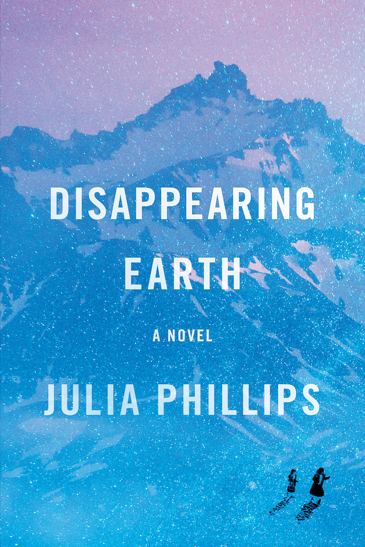

 [Disappearing Earth](https://www.nytimes.com/2019/05/14/books/review/disappearing-earth-julia-phillips.html)

By **Julia Phillips.** $26.95. Knopf.

  Fiction.

When two sisters are kidnapped on the remote Kamchatka Peninsula in eastern Russia, it sends shock waves through the community.

Buy

 

 [Ducks, Newburyport](https://www.nytimes.com/2019/09/10/books/review/contemporary-american-angst-in-a-single-thousand-word-sentence.html)

By **Lucy Ellmann.** $22.95. Paperback. Biblioasis.

  Fiction.

For most of its 1,000 pages, Ellmann’s brilliantly ambitious seventh novel follows the unspooling consciousness of an Ohio housewife circa 2017, and does so almost entirely in one long, lyrical, constantly surprising sentence.

Buy

 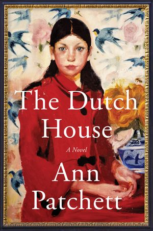

 [The Dutch House](https://www.nytimes.com/2019/09/24/books/review/ann-patchett-dutch-house.html)

By **Ann Patchett.** $27.99. Harper/HarperCollins.

  Fiction.

In Patchett’s luminous new novel, an orphaned brother and sister grapple with love, loss and family history after their wicked stepmother banishes them from the family home. Like a fairy tale, the novel takes a winding road and doesn’t rush to a finish.

Buy

 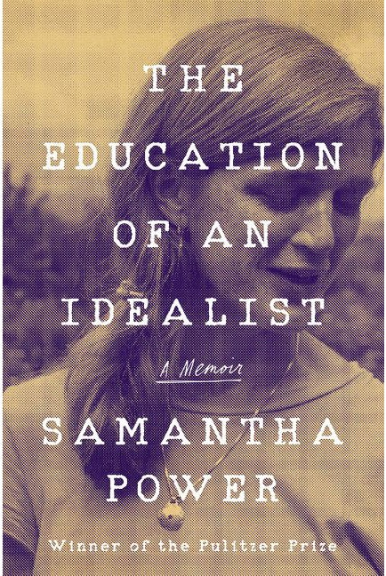

 [The Education of anIdealist: A Memoir](https://www.nytimes.com/2019/09/10/books/review/the-education-of-an-idealist-samantha-power.html)

By **Samantha Power.** $29.99. Dey St./Morrow.

  Nonfiction.    Memoir.

In this autobiography, Barack Obama’s adviser and United Nations ambassador interweaves her personal story, diplomatic history and moral arguments with unblinking honesty.

Buy

 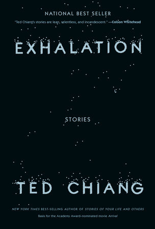

 [Exhalation: Stories](https://www.nytimes.com/2019/05/29/books/review/new-science-fiction-time-travel.html)

By **Ted Chiang.** $25.95. Knopf.

  Fiction.    Stories.

Many of these nine deeply beautiful stories explore the material consequences of various kinds of time travel. Reading this book feels like being seated at dinner with a friend who will explain the state of the sciences to you without an ounce of condescension.

Buy

 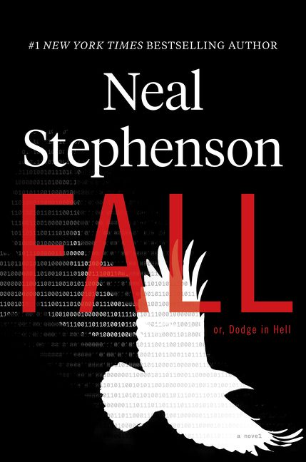

 [Fall: Or, Dodge in Hell](https://www.nytimes.com/2019/06/14/books/review/fall-or-dodge-in-hell-neal-stephenson.html)

By **Neal Stephenson.**
$35.00. Morrow/HarperCollins.

  Fiction.

Stephenson tackles big questions — what is reality? how might it be simulated? — via the tale of a billionaire whose mind survives in the digital world long after his physical death.

Buy

 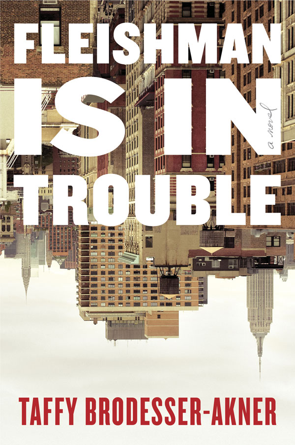

 [Fleishman Is in Trouble](https://www.nytimes.com/2019/06/11/books/review/fleishman-is-in-trouble-taffy-brodesser-akner.html)

By **Taffy Brodesser-Akner.**
$27.00. Random House.

  Fiction.

In her zingy, well-observed debut, Brodesser-Akner updates the miserable-marriage novel for our times, focusing on a hapless middle-aged doctor whose big-earner wife has abruptly left him and their kids.

Buy

 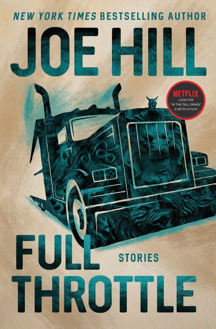

 [Full Throttle: Stories](https://www.nytimes.com/2019/10/01/books/review/full-throttle-joe-hill.html)

By **Joe Hill.** $27.99. Morrow/HarperCollins.

  Fiction.    Stories.

In each of these inventive stories, the gruesome skin of horror — the genre premise — is wrapped around a darker psychological root: the horrors of everyday life. Hill’s worldview, though bleak, has a moral coherence; things make sense in a grimly perverse way.

Buy

 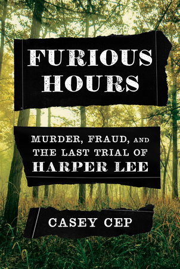

 [Furious Hours: Murder,Fraud, and the LastTrial of Harper Lee](https://www.nytimes.com/2019/05/06/books/review/casey-cep-furious-hours-harper-lee.html)

By **Casey Cep.** $26.95. Knopf.

  Nonfiction.

Cep’s remarkable first book is really two: a gripping investigation of a rural Alabama preacher who murdered five family members for the insurance in the 1970s, and a sensitive portrait of the novelist Harper Lee, who tried and failed to write her own book about the case.

Buy

Advertisement

 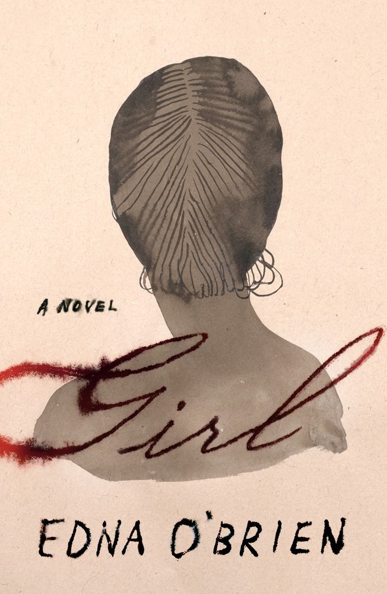

 [Girl](https://www.nytimes.com/2019/10/15/books/review/girl-edna-obrien.html)

By **Edna O'Brien.** $26.00. Farrar, Straus & Giroux.

  Fiction.

The narrator of the Irish writer’s latest novel is kidnapped by jihadi fighters in northeastern Nigeria. She returns home bearing a jihadi’s child. It’s a tribute to O’Brien’s skill as a writer — her ability to inhabit the minds of her characters and to craft virtuosic sentences — that “Girl” is immensely painful to read.

Buy

 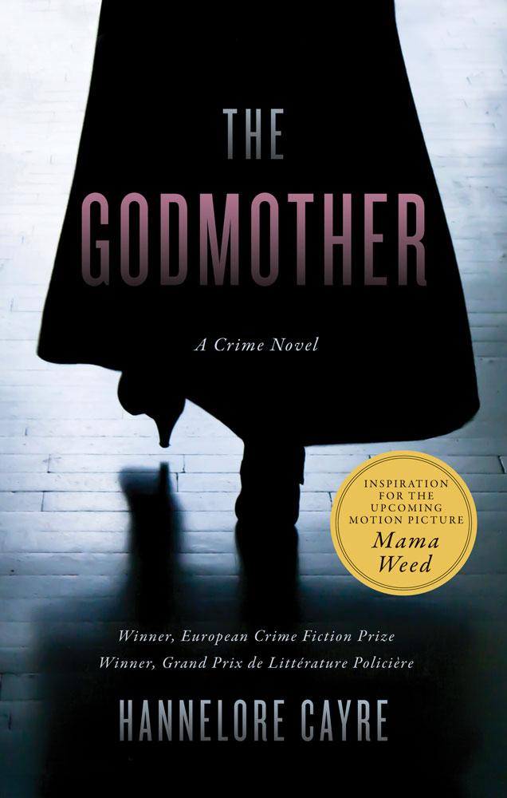

 [The Godmother](https://www.nytimes.com/2019/10/25/books/review/godmother-hannelore-cayre-thrillers-by-women.html)

By **Hannelore Cayre.** Translated by
Stephanie Smee. $17.95. Paperback. ECW.

  Fiction.

This slender and sardonic novel, a prizewinning best seller in France, features a middle-aged heroine as a drug-running crime boss and offers an entire ethnographic study of North African immigrants in the Parisian suburbs.

Buy

 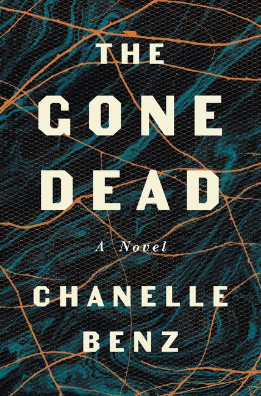

 [The Gone Dead](https://www.nytimes.com/2019/06/20/books/review/deshawn-charles-winslow-west-mills-chanelle-benz-gone-dead.html)

By **Chanelle Benz.** $26.99. Ecco/HarperCollins.

  Fiction.

Benz’s novel centers on a woman’s quest for justice for her dead father upon returning to the Mississippi Delta in 2003, after 30 years away from home. Like Attica Locke’s Houston, Benz’s Delta is portrayed with care and depth.

Buy

 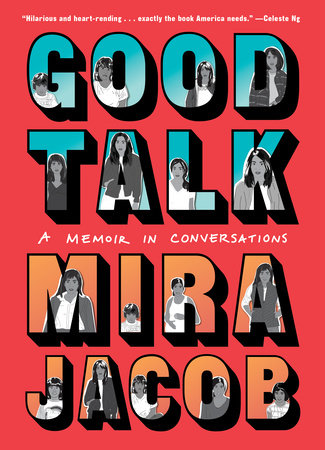

 [Good Talk: A Memoirin Conversations](https://www.nytimes.com/2019/05/02/books/review/graphic-content-mira-jacob.html)

By **Mira Jacob.** $30.00. One World.

  Nonfiction.    Memoir.    Comics/Graphics.

Jacob’s graphic memoir is focused on what it means to be a person of color in America. Born in New Mexico to parents who immigrated from India, married to a white man and raising a biracial child in New York City, Jacob explores the tensions through talks with her relatives and others.

Buy

 

 [Grace Will Lead Us Home:The Charleston ChurchMassacre and the Hard,Inspiring Journey to Forgiveness](https://www.nytimes.com/2019/06/06/books/review/jennifer-berry-hawes-grace-will-lead-us-home.html)

By **Jennifer Berry Hawes.** $28.99. St. Martin’s.

  Nonfiction.

This magisterial account of the 2015 hate crime and its aftermath, by a Pulitzer-winning local reporter, delivers a heart-rending portrait of life for the survivors and a powerful meditation on the meaning of mercy.

Buy

 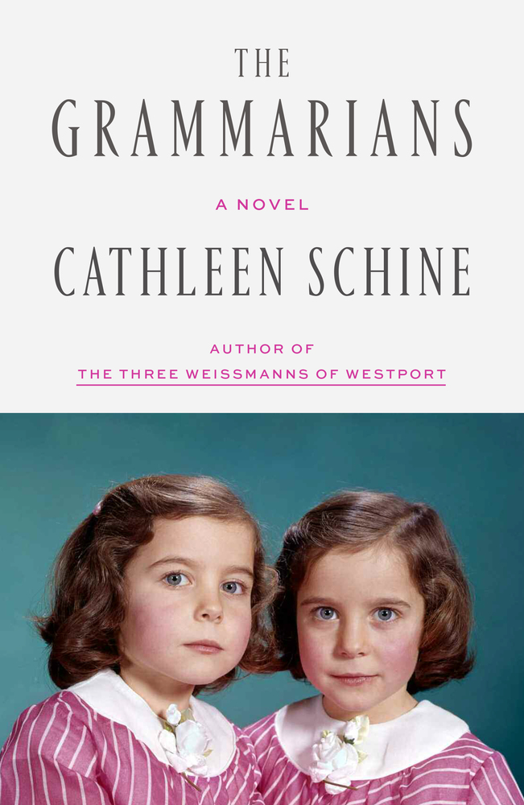

 [The Grammarians](https://www.nytimes.com/2019/08/30/books/review/the-grammarians-cathleen-schine.html)

By **Cathleen Schine.** $27.00.
Sarah Crichton/Farrar, Straus & Giroux.

  Fiction.

A wise and witty novel that follows the diverging lives and linguistic obsessions of identical twin sisters who struggle to figure out who they are on their own and in relation to each other.

Buy

 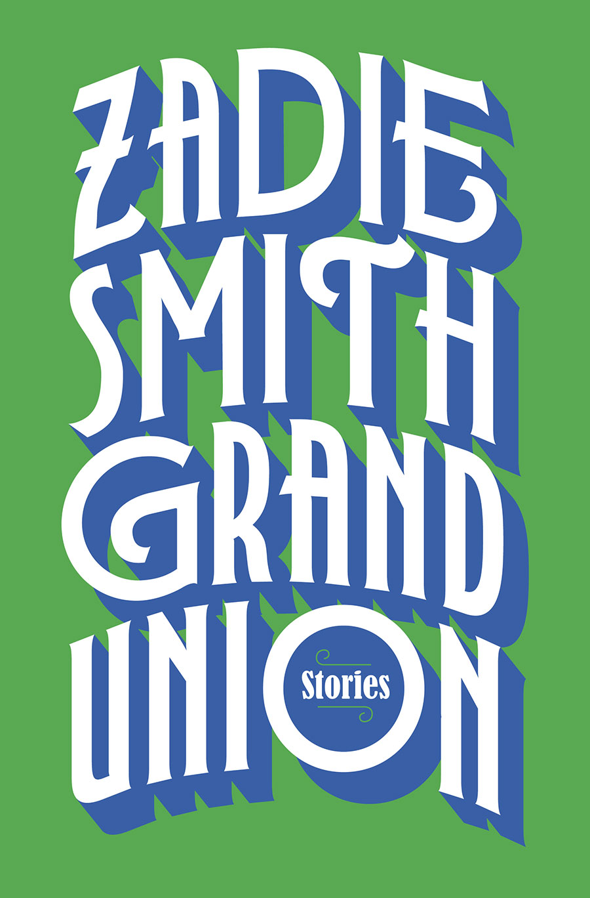

 [Grand Union: Stories](https://www.nytimes.com/2019/10/08/books/review/grand-union-stories-zadie-smith.html)

By **Zadie Smith.** $27.00. Penguin Press.

  Fiction.    Stories.

In her first story collection, which contains some of Smith’s most vibrant, original fiction, the British novelist moves beyond traditional narrative into the surreal, the essayistic, the pointillist. The best of these stories suggest that Smith is eager to explore wilder, less charted territory.

Buy

 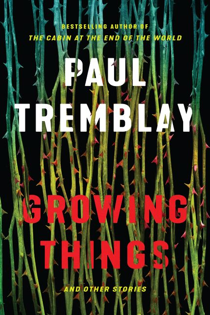

 [Growing Things:And Other Stories](https://www.nytimes.com/2019/08/13/books/review/summer-horror-column-paul-tremblay.html)

By **Paul Tremblay.** $25.99.
Morrow/HarperCollins.

  Fiction.    Stories.

Tremblay is one of our most masterly horror writers, and this collection of his short fiction does not disappoint — particularly the title story, a tale of nature gone berserk.

Buy

 

 [The Guarded Gate: Bigotry,Eugenics, and the Law ThatKept Two Generations of Jews,Italians, and Other EuropeanImmigrants Out of America](https://www.nytimes.com/2019/05/20/books/review/guarded-gate-daniel-okrent.html)

By **Daniel Okrent.** $32.00. Scribner.

  Nonfiction.

In 1920s America, a mix of nativist sentiment and pseudoscience led to the first major law curtailing immigration. Okrent focuses on eugenics, which argued that letting in people of certain nationalities and races would harm America’s gene pool.

Buy

 

 [Guest House forYoung Widows: Amongthe Women of ISIS](https://www.nytimes.com/2019/09/10/books/review/guest-house-for-young-widows-azadeh-moaveni.html)

By **Azadeh Moaveni.** $28.00. Random House.

  Nonfiction.

This powerful book about the women who joined or supported the Islamic State militant group is almost novelistic in the in-depth, three-dimensional portraits it offers of individuals whose actions and motivations seem so difficult to understand.

Buy

 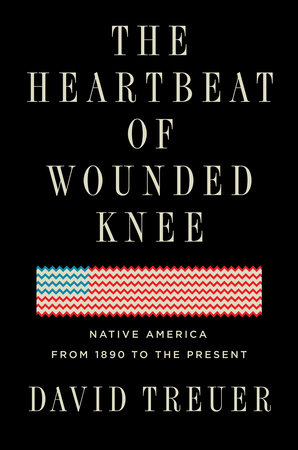

 [The Heartbeat of WoundedKnee: Native AmericaFrom 1890 to the Present](https://www.nytimes.com/2019/01/20/books/review/david-treuer-heartbeat-wounded-knee.html)

By **David Treuer.** $28.00. Riverhead.

  Nonfiction.

This response to Dee Brown’s “Bury My Heart at Wounded Knee” highlights the numerous achievements of Native Americans over the past century, and celebrates their resilience and adaptability in the face of prejudice, violence and the many other obstacles placed in their way.

Buy

 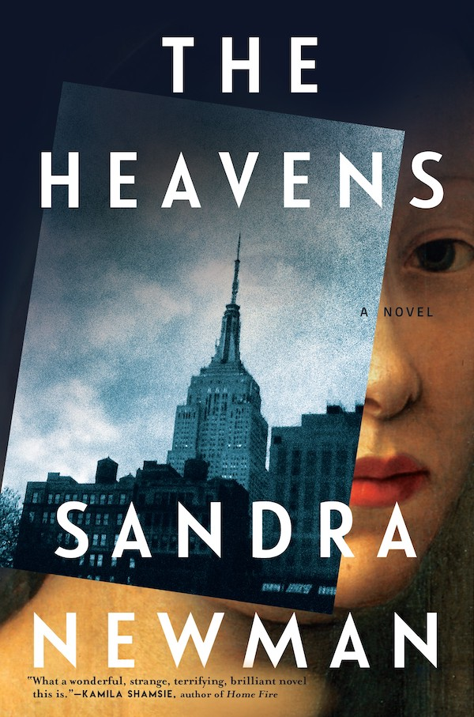

 [The Heavens](https://www.nytimes.com/2019/02/27/books/review/sandra-newman-heavens.html)

By **Sandra Newman.** $26.00. Grove.

  Fiction.

This novel, which explores notions of time travel, romance and mental stability, features a heroine who comes to believe she lives simultaneously in Elizabethan England and 21st-century New York, with events in one period affecting life in the other.

Buy

 

 [Horizon](https://www.nytimes.com/2019/04/02/books/review/barry-lopez-horizon-environment-ecology-travel.html)

By **Barry Lopez.** $30.00. Knopf.

  Nonfiction.

The eminent environmentalist reconstructs decades’ worth of his observations of the natural world, from the Arctic to Australia.

Buy

 

 [How to Be an Antiracist](https://www.nytimes.com/2019/08/20/books/review/how-to-be-an-antiracist-ibram-x-kendi.html)

By **Ibram X. Kendi.** $27.00. One World.

  Nonfiction.

In this lively and provocative follow-up to “Stamped From the Beginning,” his National Book Award-winning history of racist ideas, Kendi scrutinizes himself and the rest of us, laying out a blueprint for combating racism wherever it lurks — which, he argues, is pretty much everywhere.

Buy

 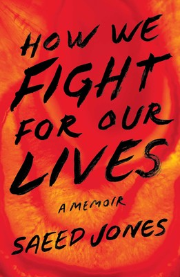

 [How We Fight For Our Lives](https://www.nytimes.com/2019/10/08/books/review/how-we-fight-for-our-lives-saeed-jones.html)

By **Saeed Jones.** $26.00. Simon & Schuster.

  Nonfiction.    Memoir.

This memoir by a talented poet about growing up black and gay tackles sexual violence, bigotry and shame with searing imagery and an unusual generosity of spirit: As a memoirist, Jones isn’t interested in score-settling.

Buy

 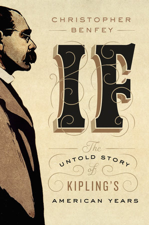

 [If: The Untold Story ofKipling’s American Years](https://www.nytimes.com/2019/07/07/books/review/if-christopher-benfey-kipling.html)

By **Christopher Benfey.** $28.00. Penguin Press.

  Nonfiction.

An eloquent argument that Kipling’s engagement with the United States and its writers, as well as his time living in Vermont, yielded the bulk of his most popular work.

Buy

 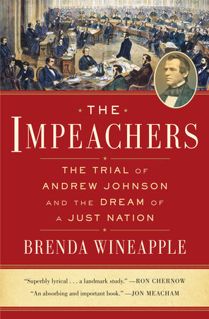

 [The Impeachers: The Trialof Andrew Johnson andthe Dream of a Just Nation](https://www.nytimes.com/2019/05/18/books/review/brenda-wineapple-impeachers.html)

By **Brenda Wineapple.** $32.00. Random House.

  Nonfiction.

With impeachment on many people’s minds at the present moment, Wineapple offers a timely glimpse of the first impeachment of an American president, detailing all the maneuvering and manipulating that went into the failed effort to remove Andrew Johnson from the White House.

Buy

 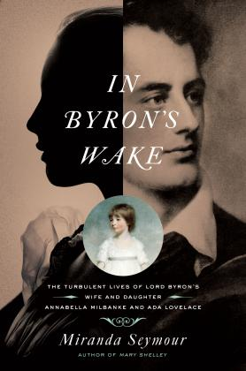

 [In Byron's Wake: TheTurbulent Lives of Lord Byron’sWife and Daughter: AnnabellaMilbanke and Ada Lovelace](https://www.nytimes.com/2018/11/30/books/review/miranda-seymour-in-byrons-wake-ada-lovelace-biography.html)

By **Miranda Seymour.** $35.00. Pegasus.

  Nonfiction.

A dual biography that traces the poet’s tangled legacy and its influence on the lives of his widow and their daughter, who made a name for herself as a mathematician and astronomer.

Buy

 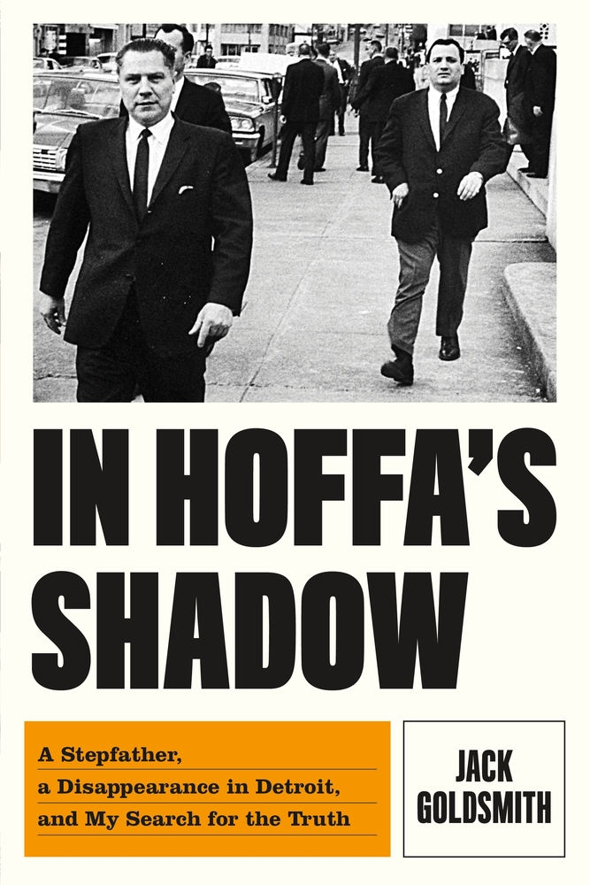

 [In Hoffa's Shadow: AStepfather, a Disappearancein Detroit, and MySearch for the Truth](https://www.nytimes.com/2019/09/27/books/review/in-hoffas-shadow-jack-goldsmith.html)

By **Jack Goldsmith.**
$28.00. Farrar, Straus & Giroux.

  Nonfiction.    Memoir.

It’s fair to say that the last thing the world was itching for is another speculative account of Jimmy Hoffa’s final days, which is precisely why Goldsmith’s gripping hybrid of personal memoir and forensic procedural lands with the force of a sucker punch.

Buy

 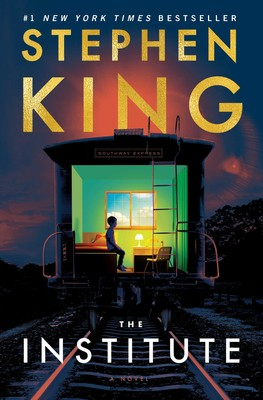

 [The Institute](https://www.nytimes.com/2019/09/10/books/review/stephen-king-the-institute.html)

By **Stephen King.** $30.00. Scribner.

  Fiction.    Thrillers.

In King’s most frightening books — like this one, about the abduction of psychically gifted children — the evil is perpetrated not by supernatural creatures, but by ordinary people like you and me. A novel as consummately honed and enthralling as the very best of his work.

Buy

 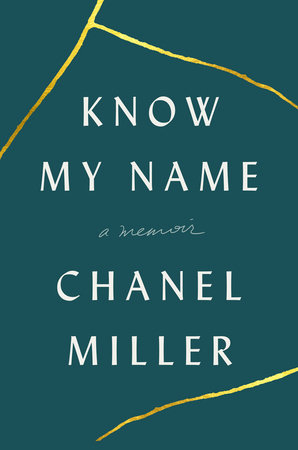

 [Know My Name: A Memoir](https://www.nytimes.com/2019/09/24/books/review/chanel-miller-know-my-name.html)

By **Chanel Miller.** $28.00. Viking.

  Nonfiction.    Memoir.

In a powerful, gutsy memoir, Miller — the sexual assault survivor in the Stanford case — reclaims her name and her story, taking us through the trial, the support of her steadfast attorney, the humiliation of testifying and her rage at her assailant’s light sentence.

Buy

 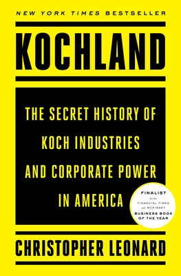

 [Kochland: The Secret Historyof Koch Industries andCorporate Power in America](https://www.nytimes.com/2019/08/15/books/review/kochland-christopher-leonard.html)

By **Christopher Leonard.**
$35.00. Simon & Schuster.

  Nonfiction.

With balance and evenhandedness, Leonard traces the phenomenal rise of Koch Industries from an obscure Wichita oil company into a global behemoth, primarily through the efforts of one man, Charles Koch, who has been brilliant at seeing economic opportunities and seizing them.

Buy

 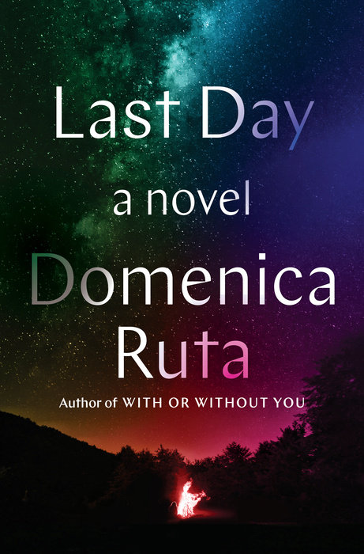

 [Last Day](https://www.nytimes.com/2019/05/28/books/review/last-day-domenica-ruta.html)

By **Domenica Ruta.** $27.00. Spiegel & Grau.

  Fiction.

Ruta’s darkly glittering novel flits among characters — including a trio of astronauts, a 15-year-old girl and a tattoo artist — during the planet’s final hours. Despite the heavy subject matter, comic moments leaven the book, and Ruta sprinkles in startling observations.

Buy

 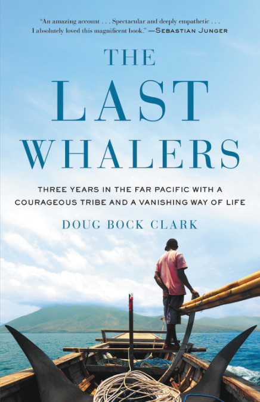

 [The Last Whalers: ThreeYears in the Far PacificWith a Courageous Tribeand a Vanishing Way of Life](https://www.nytimes.com/2019/04/02/books/review/changing-earth-last-whalers.html)

By **Doug Bock Clark.** $30.00. Little, Brown.

  Nonfiction.

A full look at the Lamalerans, a thriving tribal society that hunts sperm whales off Indonesia’s coast.

Buy

 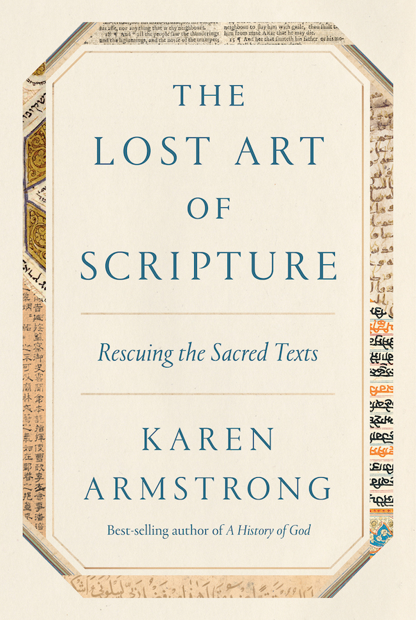

 [The Lost Art of Scripture:Rescuing the Sacred Texts](https://www.nytimes.com/2019/11/11/books/review/the-lost-art-of-scripture-karen-armstrong.html)

By **Karen Armstrong.** $35.00. Knopf.

  Nonfiction.

In her magisterial new book, Armstrong argues that Scripture shouldn’t be argued literally or rigidly from a pulpit or in a library. She makes the case that, if approached in a flexible and evolving way, the old words can be effectively deployed to help the problems of the modern world.

Buy

 

 [Lost Children Archive](https://www.nytimes.com/2019/03/06/books/review/lost-children-archive-valeria-luiselli.html)

By **Valeria Luiselli.** $27.95. Knopf.

  Fiction.

This novel follows a couple and their children on a road trip from New York to the Mexican border, against a backdrop of immigration crisis. Luiselli has delivered a madly allusive, self-reflexive, experimental novel, one that is as much about storytellers and storytelling as it is about lost children.

Buy

 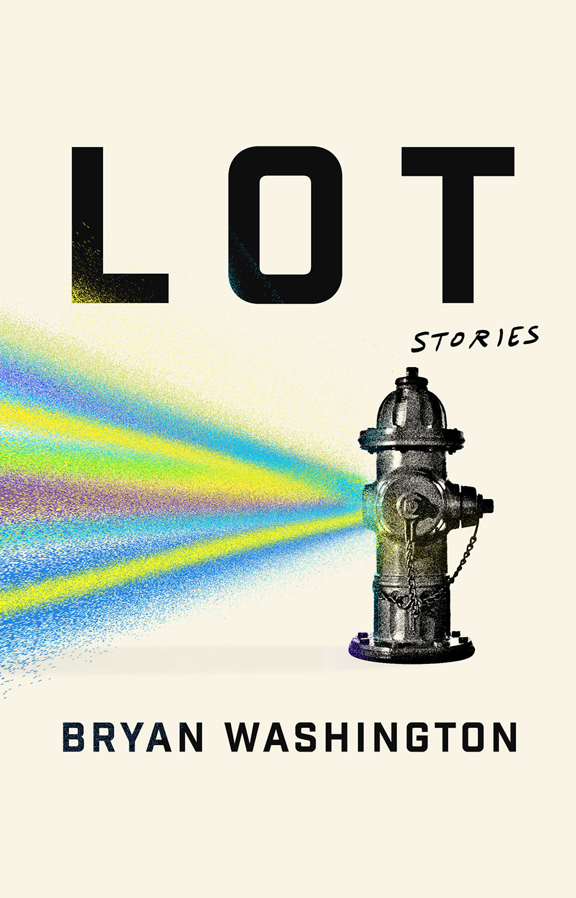

 [Lot: Stories](https://www.nytimes.com/2019/05/14/books/review/lot-bryan-washington.html)

By **Bryan Washington.** $27.00. Riverhead.

  Fiction.    Stories.

This audacious debut collection, set in the sand- and oil- and drug- and poverty- and resentment-soaked landscape of Houston, is a profound exploration of cultural and physical borders.

Buy

 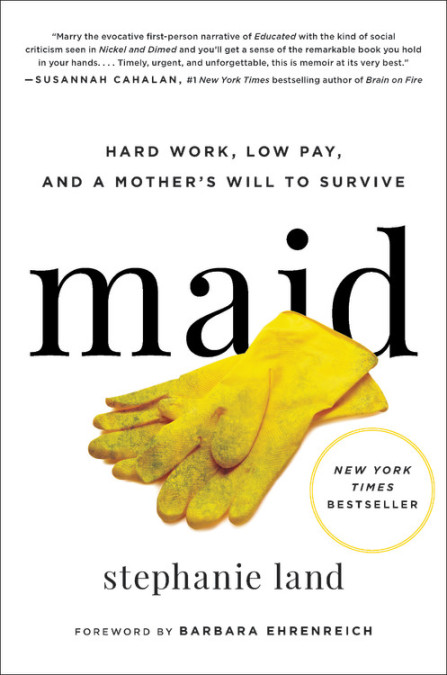

 [Maid: Hard Work, Low Payand a Mother’s Will to Survive](https://www.nytimes.com/2019/01/31/books/review/stephanie-land-maid.html)

By **Stephanie Land.** $27.00. Hachette.

  Nonfiction.    Memoir.

In her unstinting memoir — a portrait of working-class poverty in America — Land scrapes by on $9 an hour cleaning houses to support herself and her young daughter.

Buy

 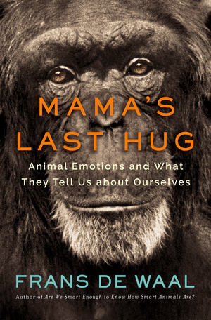

 [Mama's Last Hug: AnimalEmotions and What TheyTell Us About Ourselves](https://www.nytimes.com/2019/02/25/books/review/frans-de-waal-mamas-last-hug.html)

By **Frans de Waal.** $27.95. Norton.

  Nonfiction.

De Waal argues that we make a grave mistake when we pretend that only humans think, feel and know, and cites neurochemical studies to conclude that feelings like love, anger and joy are widespread throughout the animal kingdom.

Buy

 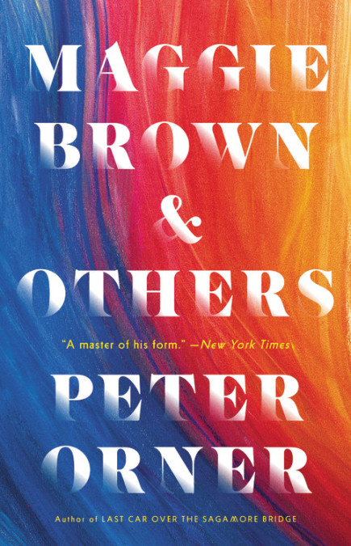

 [Maggie Brown & Others](https://www.nytimes.com/2019/07/05/books/review/books-review-maggie-brown-others-peter-orner.html)

By **Peter Orner.** $27.00. Little, Brown.

  Fiction.    Stories.

A collection of stories that probe the fleeting connections of characters struggling to adjust to the rush of time.

Buy

 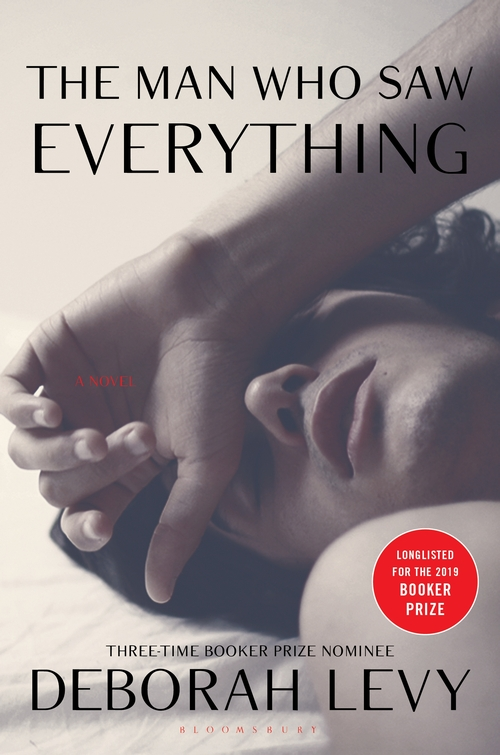

 [The Man Who Saw Everything](https://www.nytimes.com/2019/10/15/books/review/the-man-who-saw-everything-deborah-levy.html)

By **Deborah Levy.** $26.00. Bloomsbury.

  Fiction.

Levy’s novel experiments with time travel, history and the endless complications of love as she unspools the story of a young historian of Eastern Europe, knocked for more than a loop while crossing London’s Abbey Road.

Buy

 

 [Margaret Thatcher:The Authorized Biography— Herself Alone](https://www.nytimes.com/2019/11/12/books/review/margaret-thatcher-the-authorized-biography-herself-alone-charles-moore.html)

By **Charles Moore.** $40.00. Knopf.

  Nonfiction.

The third, and concluding, volume of this enormous biographical project, taking Thatcher from her third election victory in 1987 to her death in 2013, reveals a complex figure who had a lasting and lastingly controversial impact on her country and on history.

Buy

 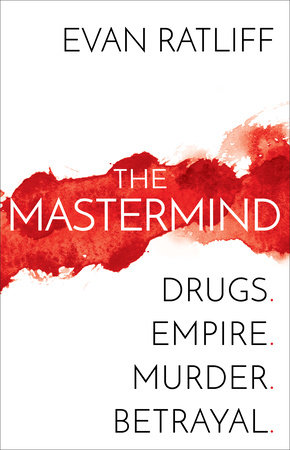

 [The Mastermind: Drugs.Empire. Murder. Betrayal.](https://www.nytimes.com/2019/03/05/books/review/mastermind-evan-ratliff-paul-le-roux.html)

By **Evan Ratliff.** $28.00. Random House.

  Nonfiction.

Ratliff’s page-turning investigation explores how Paul Le Roux transformed himself from a nerdy kid with a talent for encryption into the boss of an international drug cartel.

Buy

 

 [The Memory Police](https://www.nytimes.com/2019/08/15/books/review/read-receipts-on-two-dystopian-novels-predict-the-surveillance-state.html)

By **Yoko Ogawa.** Translated by
Stephen Snyder. $25.95. Pantheon.

  Fiction.

The acclaimed Japanese writer’s fifth English release is an elegantly spare dystopian fable narrated by a novelist whose editor is wanted for his immunity to “disappearances,” an incremental collective dementia.

Buy

 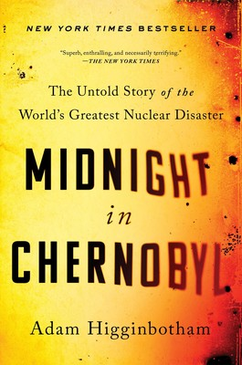

 [Midnight in Chernobyl: TheUntold Story of the World’sGreatest Nuclear Disaster](https://www.nytimes.com/2019/04/03/books/review/adam-higginbotham-midnight-in-chernobyl.html)

By **Adam Higginbotham.**
$29.95. Simon & Schuster.

  Nonfiction.

This study of the 1986 Chernobyl disaster is a gripping detective story in which mistakes pile up as the narrative moves toward tragedy.

Buy

 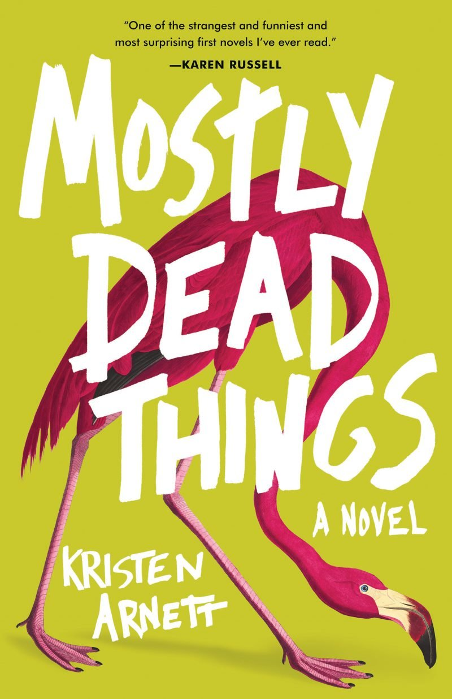

 [Mostly Dead Things](https://www.nytimes.com/2019/06/03/books/review/kristen-arnett-mostly-dead-things-nicholas-mancusi-a-philosophy-of-ruin.html?searchResultPosition=3)

By **Kristen Arnett.** $25.00. Tin House.

  Fiction.

The “red mess” that Arnett’s narrator finds in the family’s taxidermy workshop early in this debut novel is not the inside of a deer — it’s her dad, who has committed suicide. The book balances grief with humor and lush, visceral details.

Buy

 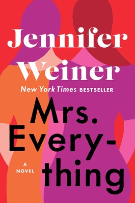

 [Mrs. Everything](https://www.nytimes.com/2019/07/10/books/review/eight-beach-books.html)

By **Jennifer Weiner.** $28.00. Atria.

  Fiction.

Balancing her signature wit with a political voice that’s new to her fiction, Weiner tells the story of the women’s movement through the lives of two sisters raised in 1950s Detroit. The book holds up the prism of choice and lets light shine through from every angle.

Buy

 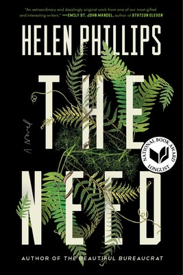

 [The Need](https://www.nytimes.com/2019/07/07/books/review/helen-phillips-the-need.html)

By **Helen Phillips.** $26.00. Simon & Schuster.

  Fiction.    Thrillers.

Molly, the exhausted mother of a toddler and a newborn, thinks she hears an intruder in the house. As she panics, the novel — which starts out as conventional suspense — veers into sci-fi and horror territory.

Buy

 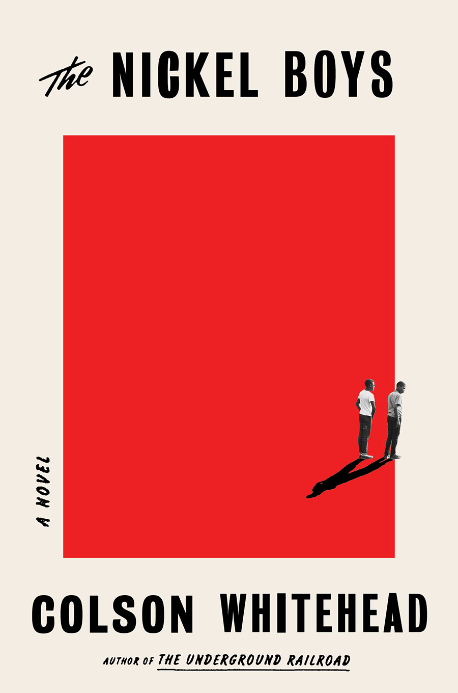

 [The Nickel Boys](https://www.nytimes.com/2019/07/14/books/review/nickel-boys-colson-whitehead.html)

By **Colson Whitehead.** $24.95. Doubleday.

  Fiction.

Whitehead, a Pulitzer winner for “The Underground Railroad,” continues to explore America’s racist legacy in this powerful novel about a serious student who dreams that college might lead him out of the Jim Crow South. Instead, he’s wrongly arrested and sent to a brutal reform school modeled on a real institution.

Buy

 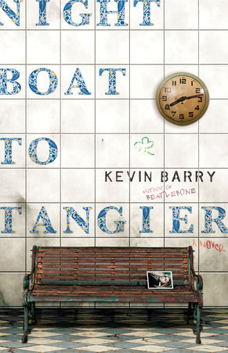

 [Night Boat to Tangier](https://www.nytimes.com/2019/09/19/books/review/night-boat-to-tangier-kevin-barry.html)

By **Kevin Barry.** $25.95. Doubleday.

  Fiction.

The Irish writer’s latest novel features two aging Beckettian drug smugglers looking back on their battered lives as they pass the time in a seedy Spanish port.

Buy

 

 [No Visible Bruises: WhatWe Don’t Know AboutDomestic Violence Can Kill Us](https://www.nytimes.com/2019/06/07/books/review/rachel-louise-snyder-no-visible-bruises.html)

By **Rachel Louise Snyder.** $28.00. Bloomsbury.

  Nonfiction.

Snyder highlights an epidemic of unacknowledged violence. Fifty women a month are shot and killed by their partners, and she explores the problem from multiple perspectives: the victims, the aggressors and a society that turns a blind eye.

Buy

 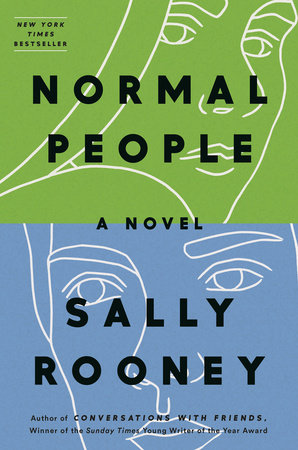

 [Normal People](https://www.nytimes.com/2019/04/15/books/review/normal-people-sally-rooney.html)

By **Sally Rooney.** $26.00. Hogarth.

  Fiction.

Rooney dramatizes with excruciating insight the entwined lives of a high school couple as they mature into college students, bringing to light how her contemporaries think and act in private, and showing us ourselves in their predicaments.

Buy

 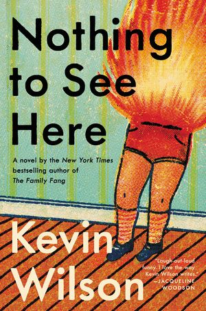

 [Nothing to See Here](https://www.nytimes.com/2019/10/29/books/review/nothing-to-see-here-kevin-wilson.html)

By **Kevin Wilson.** $26.99. Ecco/HarperCollins.

  Fiction.

At the center of this rich, spiky, darkly funny novel about female friendship are 10-year-old twins with a genetic condition that causes them to burst into flames when they’re anxious or upset. The book, which is filled with moments of great beauty, also manages a big emotional payoff.

Buy

 

 [Now We Shall Be Entirely Free](https://www.nytimes.com/2019/09/10/books/review/while-youre-waiting-for-the-next-hilary-mantel-try-andrew-miller.html)

By **Andrew Miller.** $19.00. Paperback. Europa.

  Fiction.

In this novel set in the 18th-century England of the Peninsular War, a returning British officer tries to break free of his battlefield memories — turning a story that begins as a full-immersion historical novel into something closer to a psychological mystery.

Buy

 

 [The Octopus Museum: Poems](https://www.nytimes.com/2019/04/29/books/review/the-octopus-museum-poems-brenda-shaughnessy.html)

By **Brenda Shaughnessy.** $25.00. Knopf.

  Poetry.

In her bleak but very funny fifth collection, Shaughnessy turns largely to prose poems to envision a near-future ravaged by climate change. The book’s central question is what we owe our children and humanity writ large.

Buy

 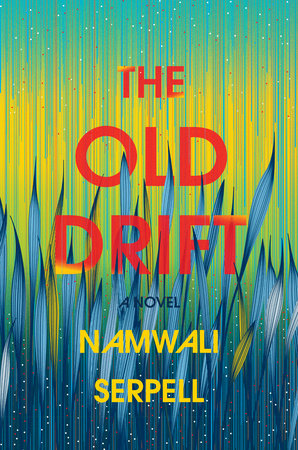

 [The Old Drift](https://www.nytimes.com/2019/03/28/books/review/old-drift-salman-rushdie.html)

By **Namwali Serpell.** $28.00. Hogarth.

  Fiction.

Through the intertwined stories of three families — one white, one black and one the product of an interracial marriage — this debut novel weaves a complex narrative of Zambia. Serpell ranges skillfully between historical and science fiction, shifting gears between political argument, psychological realism and rich fabulism.

Buy

 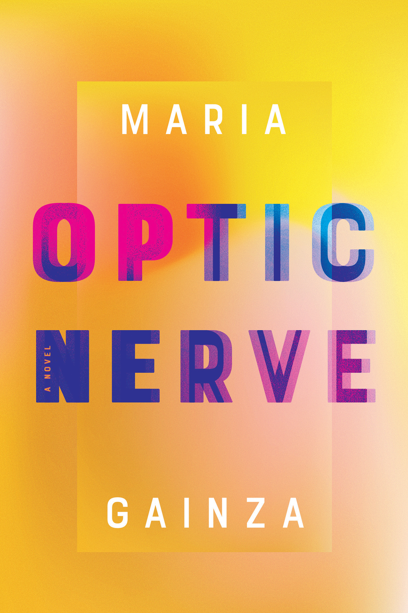

 [Optic Nerve](https://www.nytimes.com/2019/04/18/books/review/maria-gainza-optic-nerve.html)

By **María Gainza.** Translated by
Thomas Bunstead. $25.00. Catapult.

  Fiction.

In this delightful autofiction — the first book by Gainza, an Argentine art critic, to appear in English — a woman delivers pithy assessments of world-class painters along with glimpses of her life, braiding the two into an illuminating whole.

Buy

 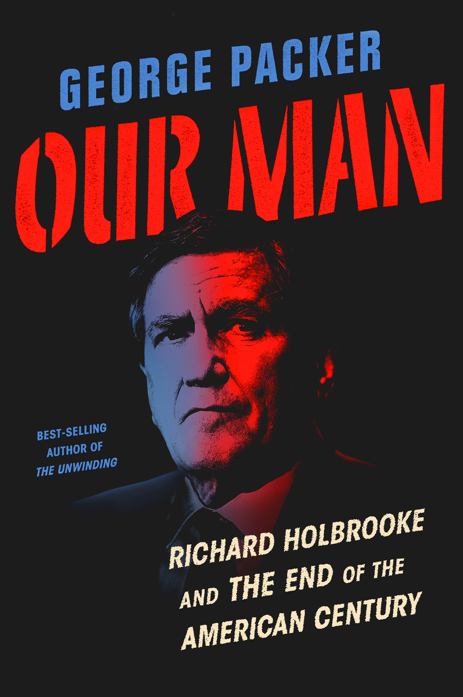

 [Our Man: RichardHolbrooke and the Endof the American Century](https://www.nytimes.com/2019/05/09/books/review/george-packer-our-man-richard-holbrooke-biography.html)

By **George Packer.** $30.00. Knopf.

  Nonfiction.

Packer’s complex portrait of the well-known American diplomat offers a “warts and all” picture, describing a highly accomplished man who was endearing and exasperating, relentless, ambitious, voracious, brilliant, idealistic, noble and needy.

Buy

 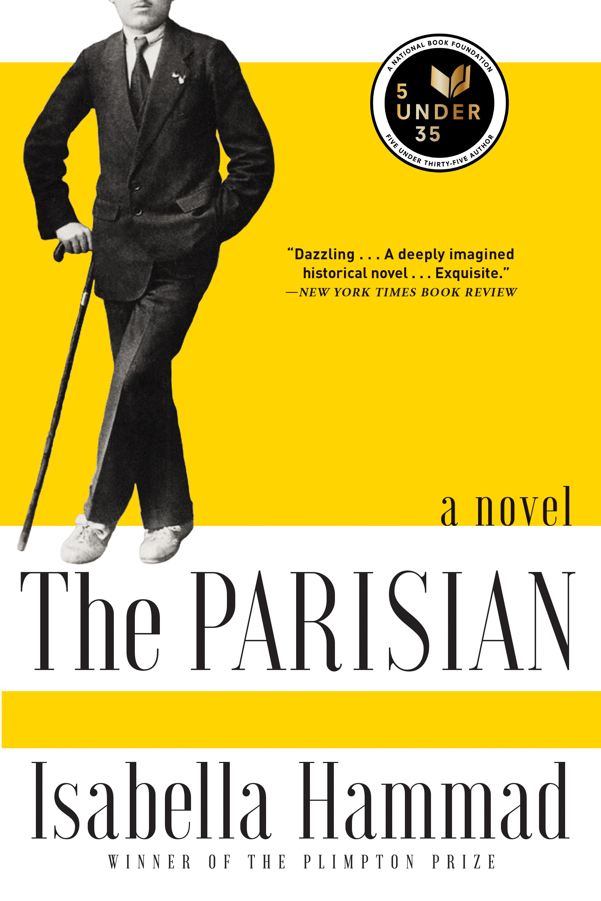

 [The Parisian](https://www.nytimes.com/2019/04/12/books/review/isabella-hammad-parisian.html)

By **Isabella Hammad.** $27.00. Grove.

  Fiction.

This strikingly accomplished first novel, set in the early 20th century and modeled in part on the life of the author’s grandfather, captures the fate of a European-educated Arab, a man divided, like his native Palestine.

Buy

 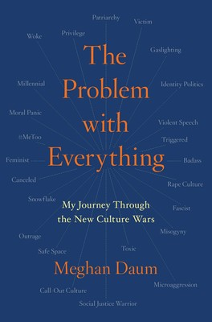

 [The Problem WithEverything: My JourneyThrough the New Culture Wars](https://www.nytimes.com/2019/10/16/books/review/the-problem-with-everything-meghan-daum.html?searchResultPosition=1)

By **Meghan Daum.** $27.00. Gallery.

  Nonfiction.

Daum, a sharp critic and essayist, takes on the excesses and oversimplifications of contemporary feminism in a book she says she’s “never been more afraid of writing” or “more certain I had to.”

Buy

 

 [Rabbits for Food](https://www.nytimes.com/2019/05/13/books/review/binnie-kirshenbaum-rabbits-for-food.html)

By **Binnie Kirshenbaum.** $26.00. Soho.

  Fiction.

After a New Year’s breakdown, the heroine of this furious comic novel checks into a Manhattan mental hospital and starts taking notes.

Buy

 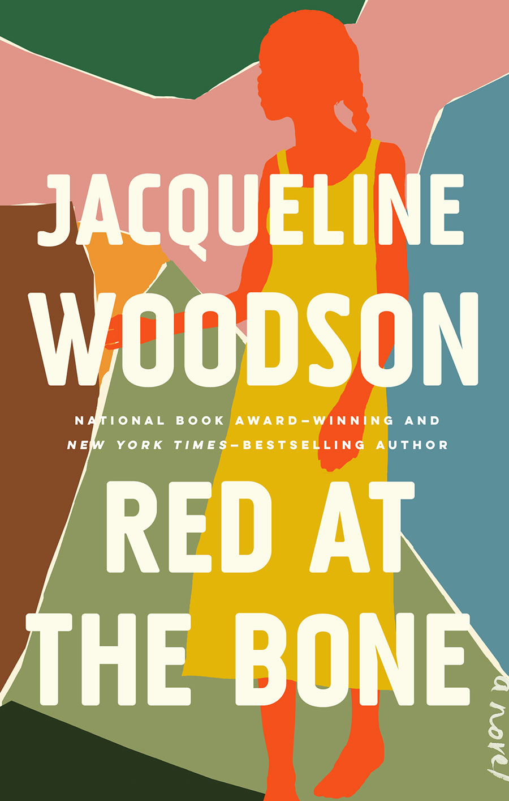

 [Red at the Bone](https://www.nytimes.com/2019/09/16/books/review/red-at-the-bone-jacqueline-woodson.html)

By **Jacqueline Woodson.** $26.00. Riverhead.

  Fiction.

The effects of a teenage pregnancy ripple through three generations of a Brooklyn family in this adult novel by the national ambassador for young people’s literature. Novelists rarely depict mothers eager to leave their babies, and it’s a treat to see how lovingly, even joyfully, Woodson embraces her young heroine’s desires.

Buy

 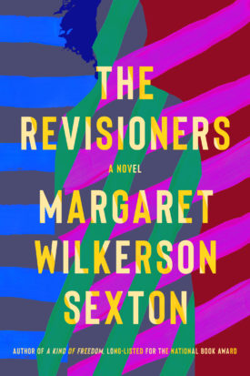

 [The Revisioners](https://www.nytimes.com/2019/11/05/books/review/the-revisioners-margaret-wilkerson-sexton.html)

By **Margaret Wilkerson
Sexton.** $25.00. Counterpoint.

  Fiction.

This stunning novel is told in alternating chapters from the points of view of two African-American women connected by blood but divided by time: a biracial single mom in 2017 and a former sharecropper turned farm-owning widow in 1924. Both tell their progeny stories that ground the novel in the harsh facts of history even as they take on the weight of myth. The plot itself is not quite the point; this is a novel about the women, the mothers.

Buy

 

 [Rusty Brown](https://www.nytimes.com/2019/10/14/books/review/rusty-brown-chris-ware.html)

By **Chris Ware.** $35.00. Pantheon.

  Fiction.    Comics/Graphics.

Ware’s long-awaited new graphic novel, opening in his native Omaha circa 1975, is at least four books in one, with a sum greater than its (great) parts. Intimate and feverishly inventive, it follows multiple characters to reveal moments large and small.

Buy

 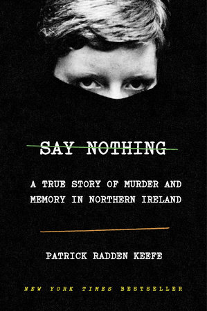

 [Say Nothing: A TrueStory of Murder andMemory in Northern Ireland](https://www.nytimes.com/2019/02/22/books/review/say-nothing-patrick-radden-keefe.html)

By **Patrick Radden Keefe.** $28.95. Doubleday.

  Nonfiction.

Part history, part true crime, Keefe’s book uses the abduction and murder of a Belfast mother to illuminate the bitter conflict known as the Troubles.

Buy

 

 [Separate: The Story ofPlessy v. Ferguson, andAmerica’s Journey FromSlavery to Segregation](https://www.nytimes.com/2019/02/18/books/review/steve-luxenberg-separate-plessy-v-ferguson.html)

By **Steve Luxenberg.** $35.00. Norton.

  Nonfiction.

This history, full of surprises, absurdities and ironies, traces the doctrine of segregation before and after the Civil War, which culminated in the notorious 1896 Supreme Court decision that made “separate but equal” the law of the land.

Buy

 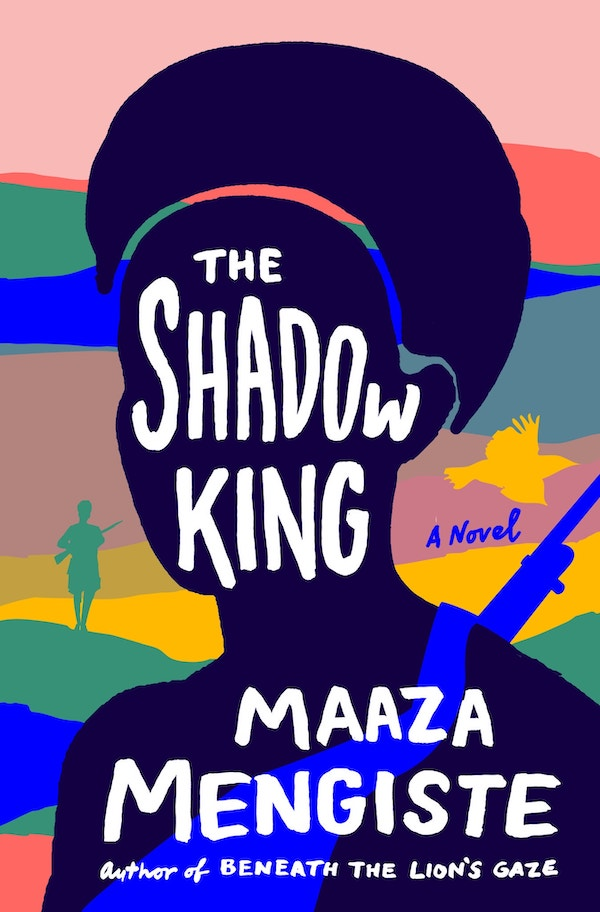

 [The Shadow King](https://www.nytimes.com/2019/09/26/books/review/maaza-mengiste-the-shadow-king.html)

By **Maaza Mengiste.** $26.95. Norton.

  Fiction.

This lyrical, remarkable novel, set during the Second Italo-Ethiopian War, somehow manages to solve the riddle of how to sing war now. It tells the story of Hirut, a young Ethiopian woman who goes from lowly servant to proud warrior, as indelible and compelling a hero as any we’ve read in years.

Buy

 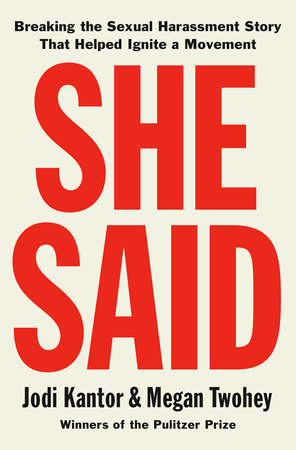

 [She Said: Breaking theSexual Harassment Story ThatHelped Ignite a Movement](https://www.nytimes.com/2019/09/08/books/review/she-said-jodi-kantor-megan-twohey.html)

By **Jodi Kantor and Megan
Twohey.** $28.00. Penguin Press.

  Nonfiction.

The New York Times reporters who broke the Harvey Weinstein scandal recount the obstacles they faced in pursuit of the story and expose the powerful people who protected Weinstein for years.

Buy

 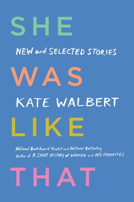

 [She Was Like That:New and Selected Stories](https://www.nytimes.com/2019/10/01/books/review/she-was-like-that-kate-walbert.html)

By **Kate Walbert.** $26.00. Scribner.

  Fiction.

In this evocative collection, the love of women for their children can provide salvation or a trap. Or both, at the same time. Walbert captures maternal love and its moments of grace with an unusual combination of restraint and rhapsody.

Buy

 

 [Solitary: Unbroken byFour Decades in SolitaryConfinement. My Story ofTransformation and Hope.](https://www.nytimes.com/2019/04/04/books/review/albert-woodfox-solitary.html)

By **Albert Woodfox with
Leslie George.** $26.00. Grove.

  Nonfiction.    Memoir.

A stringent, cleareyed memoir by a man who served more than 40 years of solitary confinement at Angola for a murder he did not commit.

Buy

 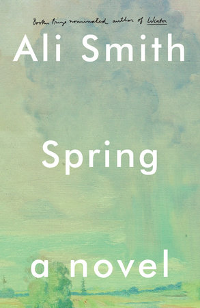

 [Spring](https://www.nytimes.com/2019/05/06/books/review/spring-ali-smith.html)

By **Ali Smith.** $25.95. Pantheon.

  Fiction.

The third novel in Smith’s seasonal quartet — consumed with Brexit, refugee detention, social media — suggests we’re hurtling toward the horrific.

Buy

 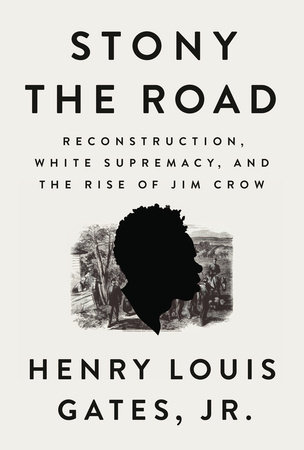

 [Stony the Road:Reconstruction, WhiteSupremacy, and theRise of Jim Crow](https://www.nytimes.com/2019/04/18/books/review/stony-the-road-henry-louis-gates.html)

By **Henry Louis Gates
Jr..** $30.00. Penguin Press.

  Nonfiction.

This lucid and essential history — bolstered by a wealth of visual material — traces the rise of white supremacy in the wake of the Civil War.

Buy

 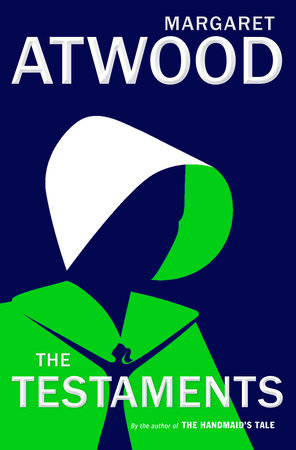

 [The Testaments](https://www.nytimes.com/2019/09/03/books/review/testaments-margaret-atwood-handmaids-tale.html)

By **Margaret Atwood.**
$28.95. Nan A. Talese/Doubleday.

  Fiction.

This haunting and powerful sequel to “The Handmaid’s Tale” — which explores the fates of Offred, her daughters and Aunt Lydia — isn’t an exposé of a fascist hellscape; it’s a young girl’s chronicle of her life there, and how an unexpected turn of events involves her in the regime’s fate.

Buy

 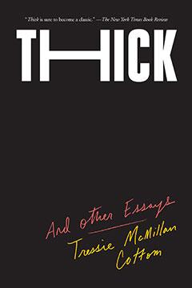

 [Thick: And Other Essays](https://www.nytimes.com/2019/02/12/books/review/thick-tressie-mcmillan-cottom.html)

By **Tressie McMillan
Cottom.** $24.99. New Press.

  Nonfiction.

This profound cultural analysis, a model of black intellectualism, deftly mixes the academic and the popular.

Buy

 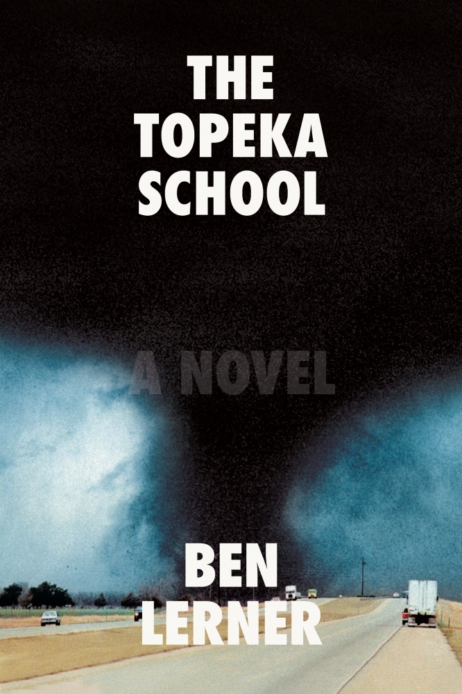

 [The Topeka School](https://www.nytimes.com/2019/10/03/books/review/topeka-school-ben-lerner.html)

By **Ben Lerner.** $27.00. Farrar, Straus & Giroux.

  Fiction.

Lerner’s exhilarating new novel — about a high school debate star in 1990s Kansas — rocks an American amplitude as it takes on psychiatry and language and toxic masculinity, and much else. Never before has Lerner’s fine ethnographic attunement been so joyously indulged, or the bubblicious texture of late Clintonism been so lovingly evoked.

Buy

 

 [The Tradition](https://www.nytimes.com/2019/04/02/books/review/jericho-brown-tradition-poems.html)

By **Jericho Brown.** $17.00.
Paperback. Copper Canyon.

  Poetry.

Brown’s poetry catalogs injuries past and present, personal and national, in a country where blackness is akin to illness. Even as he reckons seriously with our state of affairs, Brown demonstrates a spirit of semantic play.

Buy

 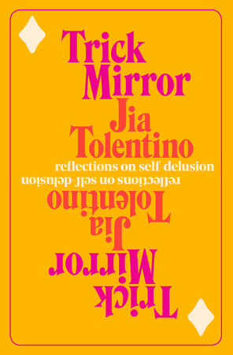

 [Trick Mirror: Reflectionson Self-Delusion](https://www.nytimes.com/2019/08/04/books/review/jia-tolentino-trick-mirror.html)

By **Jia Tolentino.** $27.00. Random House.

  Nonfiction.

In her smart and stylish debut, Tolentino, a 30-year-old New Yorker staff writer, plumbs the contradictions of contemporary life through essays that combine probing social analysis with wry personal anecdote about the “feverish, electric, unlivable hell” of the web.

Buy

 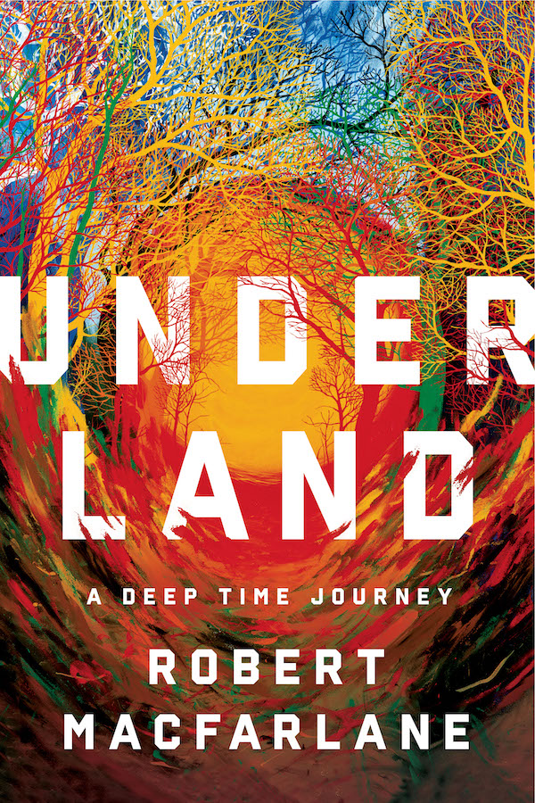

 [Underland: ADeep Time Journey](https://www.nytimes.com/2019/06/03/books/review-underland-robert-macfarlane.html)

By **Robert Macfarlane.** $27.95. Norton.

  Nonfiction.

A series of lyrical, unnerving explorations, from ancient forests to urban catacombs to caves of ice, that probe humanity’s sometimes wondrous, often malign, relationship with the world beneath our feet.

Buy

 

 [The Uninhabitable Earth:Life After Warming](https://www.nytimes.com/2019/04/12/books/review/david-wallace-wells-uninhabitable-earth-nathaniel-rich-losing-earth.html)

By **David Wallace-Wells.** $27.00. Tim Duggan.

  Nonfiction.

Wallace-Wells offers a remorseless, near-unbearable account of anthropogenic climate change, “the biggest threat human life on the planet has ever faced,” and lays out what it will take to avoid catastrophe.

Buy

 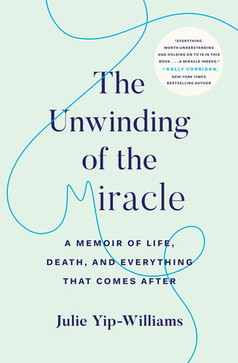

 [The Unwinding of the Miracle:A Memoir of Life, Death, andEverything That Comes After](https://www.nytimes.com/2019/02/06/books/review/julie-yip-williams-unwinding-miracle.html)

By **Julie Yip-Williams.** $27.00. Random House.

  Nonfiction.    Memoir.

Written before her death last year from cancer at the age of 42, Yip-Williams’s book is a remarkable woman’s moving exhortation to the living.

Buy

 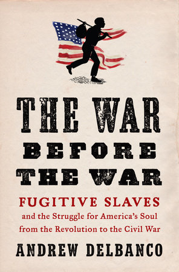

 [The War Before the War:Fugitive Slaves and the Strugglefor America’s Soul From theRevolution to the Civil War](https://www.nytimes.com/2019/01/02/books/review/andrew-delbanco-war-before-the-war.html)

By **Andrew Delbanco.** $30.00. Penguin Press.

  Nonfiction.

Only a tiny fraction of American slaves escaped to freedom, but, as the literary scholar Delbanco shows in this thoughtful book, conflicts over their fate played an outsize role in the buildup to the Civil War.

Buy

 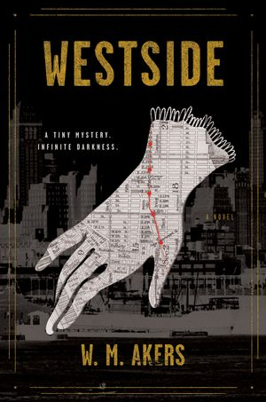

 [Westside](https://www.nytimes.com/2019/05/31/books/review/westside-w-m-akers.html)

By **W.M. Akers.** $22.99. Harper Voyager.

  Fiction.

Akers’s lush, shimmering mystery is set in a Prohibition-era Manhattan that has been divided by a wall separating the affluent Eastside from the nightmarish Westside, which is teeming with jungle, rot and darkness.

Buy

 

 [What You Have HeardIs True: A Memoir ofWitness and Resistance](https://www.nytimes.com/2019/04/20/books/review/carolyn-forche-what-you-have-heard-is-true.html)

By **Carolyn Forché.** $28.00. Penguin Press.

  Nonfiction.    Memoir.

As a young poet in the 1970s, Forché accompanied a stranger to El Salvador and found a country on the edge of civil war. This luminous memoir records her self-discovery and political awakening.

Buy

 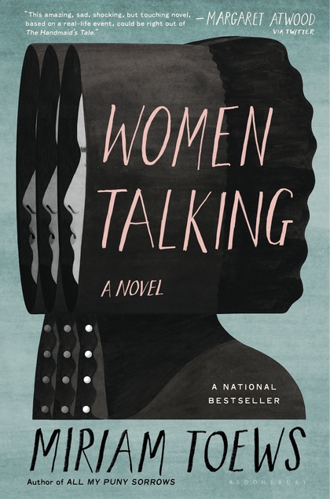

 [Women Talking](https://www.nytimes.com/2019/04/10/books/review/women-talking-miriam-toews.html)

By **Miriam Toews.** $24.00. Bloomsbury.

  Fiction.

In this freewheeling novel of ideas, a spate of sexual violence rends an isolated Mennonite colony in Bolivia. The women — most of whom have been raped — gather to debate their future, touching on questions of free will and forgiveness.

Buy

 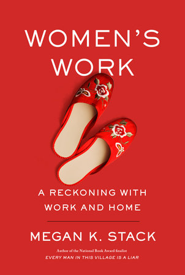

 [Women's Work: A ReckoningWith Work and Home](https://www.nytimes.com/2019/05/11/books/review/megan-stack-womens-work.html)

By **Megan K. Stack.** $27.95. Doubleday.

  Nonfiction.

As a foreign correspondent, Stack covered wars and reported from dozens of countries, but as a new parent she was overwhelmed. This enthralling account of her relationship with the women she hired to help her casts a self-critical eye on the often exploitative labor of motherhood.

Buy

 

 [The Yellow House](https://www.nytimes.com/2019/08/09/books/review/the-yellow-house-sarah-m-broom.html)

By **Sarah M. Broom.** $26.00. Grove.

  Nonfiction.

Part oral history, part urban history, part celebration of a bygone way of life, Broom’s extraordinary debut is a full indictment of the greed, discrimination and poor city planning that led her family’s New Orleans home to be wiped off the map.

Buy

Correction: An earlier version of this article referred incompletely to the publisher of “She Was Like That.” It should have included Scribner, an imprint of Simon & Schuster.

Advertisement