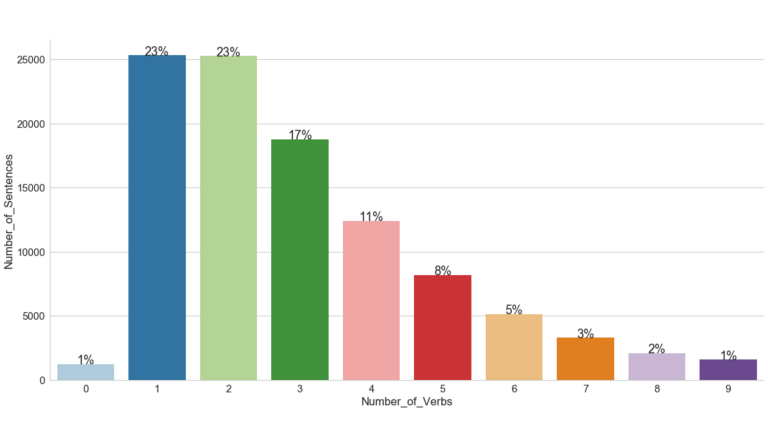

100,000 happy moments

- [**](https://www.technologyreview.com/s/610159/100000-happy-moments/#)
- [**](https://www.technologyreview.com/s/610159/100000-happy-moments/#)
- [**](https://www.technologyreview.com/s/610159/100000-happy-moments/#)
- [**](https://www.technologyreview.com/s/610159/100000-happy-moments/#)
- [**](https://www.technologyreview.com/s/610159/100000-happy-moments/#)
- [**](https://www.technologyreview.com/s/610159/100000-happy-moments/#)

###   [Rewriting Life](https://www.technologyreview.com/topic/rewriting-life/)

# 100,000 happy moments

## What makes people happy? A huge database is making it possible to discern the answer at last.

- by[Emerging Technology from the arXiv](https://www.technologyreview.com/profile/emerging-technology-from-the-arxiv/)
- February 5, 2018
- [**](https://www.technologyreview.com/s/610159/100000-happy-moments/#)
- [**](https://www.technologyreview.com/s/610159/100000-happy-moments/#)
- [**](https://www.technologyreview.com/s/610159/100000-happy-moments/#)
- [**](https://www.technologyreview.com/s/610159/100000-happy-moments/#)
- [**](https://www.technologyreview.com/s/610159/100000-happy-moments/#)
- [**](https://www.technologyreview.com/s/610159/100000-happy-moments/#)

The science of happiness is of increasing interest to psychologists and to society in general. The questions at the heart of this discipline are: what makes us happy, and what sustains this happiness over time?

A variety of factors seem to play important roles. Psychologists think about 50 percent of our happiness is the result of our genes—we seem to be pre-programmed for a certain level of happiness. By contrast, they think our environment—our life circumstances—contributes only 10 percent to our happiness levels.

The rest is under our control. Some 40 percent of our happiness levels are the result of the choices we make. These are things like investing in long-term relationships, doing meaningful work, and bonding with loved ones.

The distribution of the number of verbs per happy moment.

Indeed, the relatively new discipline of positive psychology steers people toward these behaviors. And an increasing number of apps help people make choices to boost their happiness levels.

But the study of these choices and behaviors is in its infancy. Happiness is not a uniform state that can be switched on and off on demand. Instead, it is a state or set of states that can be triggered by a rich tapestry of conditions and permutations of them. And yet there has been relatively little work that teases apart the nature of these conditions and how they arise.

Today, that looks set to change thanks to the work of Akari Asai at the University of Tokyo, in Japan, and colleagues from around the world. These folks have built a database of 100,000 happy moments and begun the challenging task of data mining the contents. And the team has made the database—HappyDB—[publicly available online](https://rit-public.github.io/HappyDB/) so that anybody can explore it further.

The database was straightforward to create. The team set up a task on Amazon’s Mechanical Turk crowdsourcing service that asked people to describe three happy moments in the previous 24 hours or the previous three months.

In this way, they gathered descriptions of 100,000 happy moments from equal proportions of men and women. These people—the Turkers—were based in the US, largely between 20 and 40 years of age, and mostly single.

##### Recommended for You

1. [Your #sunset photos might have helped improve Facebook’s AI](https://www.technologyreview.com/the-download/611070/your-sunset-photos-might-have-helped-improve-facebooks-ai/)

2. [Chinese tech firms are throwing out applicants over the age of 30](https://www.technologyreview.com/the-download/611067/chinese-tech-firms-are-throwing-out-applicants-over-the-age-of-30/)

3. [Cambridge Analytica is closing its doors](https://www.technologyreview.com/the-download/611068/cambridge-analytica-is-closing-its-doors/)

4. [Researchers are keeping pig brains alive outside the body](https://www.technologyreview.com/s/611007/researchers-are-keeping-pig-brains-alive-outside-the-body/)

5. [Computer scientists have found the longest straight line you could sail without hitting land](https://www.technologyreview.com/s/611012/computer-scientists-have-found-the-longest-straight-line-you-could-sail-without-hitting/)

Asai and co. have cleaned up the database in various ways such as correcting obvious spelling mistakes. That was important because initially the database contained many more references to sons than daughters.

But this turned out to be the result of people misspelling the word daughter more commonly than son. “After fixing the typos, both words ended up having almost the same frequency,” say Asai and co.

Examples of happy moments from the database include:
Went out with a friend, had some food and talked about life
I had dinner with my husband
I went for a jog this evening and the weather was nice and it was shady

I'm so excited to be able to travel to Florida next month.  I'm getting giggly just thinking about it

I kissed my girlfriend in the hot tub

These sentences immediately raise the question of how best to analyze them. So Asai and co. have begun the task using natural language processing to analyze the activities that occurred in the happy moment, who participated in them, and what other factors might play a role.

Analysis turns out to be a complex task. For example, the superficially simple sentence “I had dinner with my husband” raise the question of what exactly about this activity made the moment happy. “The extracted activities could be “having dinner,” “being with the husband,” or something that is not explicitly in the text such as “having a date night without the children,” say Asai and co.

The team delved more deeply by analyzing the phrases using standard measures of sentiment and emotional valence. They also attempted to divide the phrases into nine categories, such as achievement, affection, and exercise.

Achievement, for example, involves activities “with extra effort to achieve a better than expected result.” Examples might include “finish work” or “complete marathon.”

Affection involves activities with meaningful interaction with family, loved ones and pets. Examples include a hug, cuddling, or a kiss.

And exercise involves activities “with intent to exercise or workout” such as run, bike, or do yoga.

Finally, the team broke down the results by whether the happy moment occurred in the previous 24 hours or the previous three months. That provided some insight into the difference between activities that provide momentary happiness and those that provide sustained happiness.

“The results suggest that moments reported in the 24-hour period tend to be activities that occur daily (e.g., foods, bedtime) and moments reported in the three-month period tend to reflect infrequent occurrences like holidays or life events,” say Asai and co.

Of course, Asai and co. point out that this kind of analysis is just the beginning of what is likely to be a complex field of natural language processing. They suggest a wide range of questions that this approach could address. For example:

What are the activities described in a given happy moment?
What other components besides activities are important in the happy moment?
Which of these aspects are most central to the happy moment?

Can we discover common paraphrasings to describe activities that appear in happy moments?

These are ambitious questions that will require significant advances in natural language processing.

Then there are additional questions such as how do happy moments vary among demographic groups, among cultures, by geography, and so on. There is plenty of gold in them thar hills.

Which is why the release of the 100,000 happy moments database is a significant step toward a better understanding of happiness and of finding ways to help individuals achieve happiness on their own terms.

Ref: [arxiv.org/abs/1801.07746](http://arxiv.org/abs/1801.07746) : HappyDB: A Corpus of 100,000 Crowdsourced Happy Moments

Want to go ad free? No ad blockers needed.

[Become an Insider](https://ssl.drgnetwork.com/ecom/MTR/app/live/subscriptions?org=MTR&publ=TR&key_code=74WKIAF&type=S)

[Already an Insider? Log in.](https://www.technologyreview.com/auth/login/?redirectTo=%2F%3Futm_medium%3Din_story%26utm_source%3Dtrsite%26utm_campaign%3Dlog_in%26utm_content%3Dversion_1&utm_medium=in_story&utm_source=trsite&utm_campaign=log_in&utm_content=version_1)

The distribution of the number of verbs per happy moment.

From Our Advertisers

- [Provided by**BBVA**  Innovations, Ideas, and Insights](https://www.technologyreview.com/collection/innovations-ideas-and-insights/)
- [In partnership with**Qualcomm**  On-Device Processing and AI Go Hand-in-Hand](https://www.technologyreview.com/s/610421/on-device-processing-and-ai-go-hand-in-hand/)
- [Presented in partnership with**Qualcomm**  Making On-device AI Ubiquitous](https://bit.ly/2pQlUZl)

### Share

- [**](https://www.technologyreview.com/s/610159/100000-happy-moments/#)
- [**](https://www.technologyreview.com/s/610159/100000-happy-moments/#)
- [**](https://www.technologyreview.com/s/610159/100000-happy-moments/#)
- [**](https://www.technologyreview.com/s/610159/100000-happy-moments/#)
- [**](https://www.technologyreview.com/s/610159/100000-happy-moments/#)
- [**](https://www.technologyreview.com/s/610159/100000-happy-moments/#)

[Emerging Technology from the arXiv](https://www.technologyreview.com/profile/emerging-technology-from-the-arxiv/)

Emerging Technology from the arXiv covers the latest ideas and technologies that appear on the Physics arXiv preprint server. It is part of the Physics arXiv Blog.

Email:… [More](https://www.technologyreview.com/s/610159/100000-happy-moments/#)  [KentuckyFC@arxivblog.com](https://www.technologyreview.com/s/610159/100000-happy-moments/mailto:KentuckyFC@arxivblog.com)

[Subscribe to the Physics arXiv Blog RSS Feed](https://www.technologyreview.com/contributor/emerging-technology-from-the-arxiv/rss/).