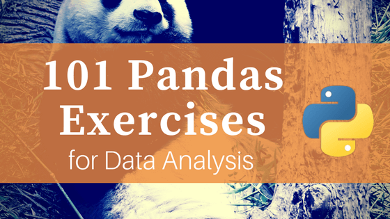

101 Pandas Exercises for Data Analysis - Machine Learning Plus

## [Machine Learning Plus](https://www.machinelearningplus.com/)

- [Home](https://www.machinelearningplus.com/)
- [All Posts](https://www.machinelearningplus.com/blog/)
- [Data Manipulation](https://www.machinelearningplus.com/category/data-manipulation/)
    - [Numpy Tutorial Part 1](https://www.machinelearningplus.com/python/numpy-tutorial-part1-array-python-examples/)
    - [Numpy Tutorial Part 2](https://www.machinelearningplus.com/python/numpy-tutorial-python-part2/)
    - [data.table in R](https://www.machinelearningplus.com/data-manipulation/datatable-in-r-complete-guide/)
    - [101 NumPy Exercises](https://www.machinelearningplus.com/python/101-numpy-exercises-python/)
    - [101 Pandas Exercises](https://www.machinelearningplus.com/python/101-pandas-exercises-python/)
    - [101 Pydatatable Exercises](https://www.machinelearningplus.com/data-manipulation/101-python-datatable-exercises-pydatatable/)
    - [101 R data.table Exercises](https://www.machinelearningplus.com/data-manipulation/101-r-data-table-exercises/)
- [Predictive Modeling](https://www.machinelearningplus.com/category/predictive-modeling/)
    - [Linear Regression in R](https://www.machinelearningplus.com/machine-learning/complete-introduction-linear-regression-r/)
    - [Logistic Regression in R](https://www.machinelearningplus.com/machine-learning/logistic-regression-tutorial-examples-r/)
    - [Caret Package Tutorial](https://www.machinelearningplus.com/machine-learning/caret-package/)
    - [Naive Bayes Algorithm from Scratch](https://www.machinelearningplus.com/predictive-modeling/how-naive-bayes-algorithm-works-with-example-and-full-code/)
    - [Feature Selection in R](https://www.machinelearningplus.com/machine-learning/feature-selection/)
    - [15 Evaluation Metrics for Classification](https://www.machinelearningplus.com/machine-learning/evaluation-metrics-classification-models-r/)
- [Statistics](https://www.machinelearningplus.com/category/statistics/)
    - [What is P-Value](https://www.machinelearningplus.com/statistics/p-value/)
    - [Statistical Significance Tests Tutorial](https://www.machinelearningplus.com/statistics/statistical-significance-tests-r/)
    - [Mahalonobis Distance](https://www.machinelearningplus.com/statistics/mahalanobis-distance/)
- [NLP](https://www.machinelearningplus.com/category/nlp/)
    - [Gensim Tutorial](https://www.machinelearningplus.com/nlp/gensim-tutorial/)
    - [Grid Search LDA model (scikit learn)](https://www.machinelearningplus.com/nlp/topic-modeling-python-sklearn-examples/)
    - [Topic Modeling – LDA (Gensim)](https://www.machinelearningplus.com/nlp/topic-modeling-gensim-python/)
    - [Lemmatization Approaches](https://www.machinelearningplus.com/nlp/lemmatization-examples-python/)
    - [Visualizing Topic Models](https://www.machinelearningplus.com/nlp/topic-modeling-visualization-how-to-present-results-lda-models/)
    - [Cosine Similarity](https://www.machinelearningplus.com/nlp/cosine-similarity/)
- [Python](https://www.machinelearningplus.com/category/python/)
    - [List Comprehensions](https://www.machinelearningplus.com/python/list-comprehensions-in-python/)
    - [Parallel Processing](https://www.machinelearningplus.com/python/parallel-processing-python/)
    - [Python @Property](https://www.machinelearningplus.com/python/python-property/)
    - [Debugging with Pdb](https://www.machinelearningplus.com/python/python-debugging/)
    - [Regular Expressions Tutorial](https://www.machinelearningplus.com/python/python-regex-tutorial-examples/)
    - [Logging Guide](https://www.machinelearningplus.com/python/python-logging-guide/)
    - [datetime in Python](https://www.machinelearningplus.com/python/datetime-python-examples/)
- [Plots](https://www.machinelearningplus.com/category/plots/)
    - [Top 50 matplotlib Visualizations](https://www.machinelearningplus.com/plots/top-50-matplotlib-visualizations-the-master-plots-python/)
    - [Matplotlib Tutorial](https://www.machinelearningplus.com/plots/matplotlib-tutorial-complete-guide-python-plot-examples/)
    - [Matplotlib Histogram](https://www.machinelearningplus.com/plots/matplotlib-histogram-python-examples/)
- [Time Series](https://www.machinelearningplus.com/category/time-series/)
    - [Time Series Analysis in Python](https://www.machinelearningplus.com/time-series/time-series-analysis-python/)
    - [ARIMA Time Series Forecasting in Python (Guide)](https://www.machinelearningplus.com/time-series/arima-model-time-series-forecasting-python/)
    - [Vector Autoregression (VAR)](https://www.machinelearningplus.com/time-series/vector-autoregression-examples-python/)
- [Contact Us](https://www.machinelearningplus.com/contact-us/)

[Skip to content](https://www.machinelearningplus.com/python/101-pandas-exercises-python/#content)

# 101 Pandas Exercises for Data Analysis

* by *[Selva Prabhakaran](https://www.machinelearningplus.com/author/selva86/)**  * | **Posted on [*April 27, 2018*](https://www.machinelearningplus.com/python/101-pandas-exercises-python/)*

*101 python pandas exercises are designed to challenge your logical muscle and to help internalize data manipulation with python’s favorite package for data analysis. The questions are of 3 levels of difficulties with L1 being the easiest to L3 being the hardest.*

101 Pandas Exercises. Photo by Chester Ho.

You might also like to [practice the 101 NumPy exercises](https://www.machinelearningplus.com/python/101-numpy-exercises-python/), they are often used together.

## 1. How to import pandas and check the version?

Show Solution

## 2. How to create a series from a list, numpy array and dict?

Create a pandas series from each of the items below: a list, numpy and a dictionary

Input

	import numpy as np
	mylist = list('abcedfghijklmnopqrstuvwxyz')
	myarr = np.arange(26)
	mydict = dict(zip(mylist, myarr))

Show Solution

## 3. How to convert the index of a series into a column of a dataframe?

Difficulty Level: L1

Convert the series `ser` into a dataframe with its index as another column on the dataframe.

Input

	mylist = list('abcedfghijklmnopqrstuvwxyz')
	myarr = np.arange(26)
	mydict = dict(zip(mylist, myarr))
	ser = pd.Series(mydict)

Show Solution

## 4. How to combine many series to form a dataframe?

Difficulty Level: L1
Combine ser1 and ser2 to form a dataframe.
Input

	import numpy as np
	ser1 = pd.Series(list('abcedfghijklmnopqrstuvwxyz'))
	ser2 = pd.Series(np.arange(26))

Show Solution

## 5. How to assign name to the series’ index?

Difficulty Level: L1
Give a name to the series `ser` calling it ‘alphabets’.
Input
`ser = pd.Series(list('abcedfghijklmnopqrstuvwxyz'))`
Show Solution

##

6. How to get the items of series A not present in series B?
Difficulty Level: L2
From `ser1` remove items present in `ser2`.

	ser1 = pd.Series([1, 2, 3, 4, 5])
	ser2 = pd.Series([4, 5, 6, 7, 8])

Show Solution

## 7. How to get the items not common to both series A and series B?

Difficulty Level: L2
Get all items of `ser1` and `ser2` not common to both.
Input

	ser1 = pd.Series([1, 2, 3, 4, 5])
	ser2 = pd.Series([4, 5, 6, 7, 8])

Show Solution

## 8. How to get the minimum, 25th percentile, median, 75th, and max of a numeric series?

Difficuty Level: L2
Compute the minimum, 25th percentile, median, 75th, and maximum of `ser`.
Input
`ser = pd.Series(np.random.normal(10, 5, 25))`
Show Solution

## 9. How to get frequency counts of unique items of a series?

Difficulty Level: L1
Calculte the frequency counts of each unique value `ser`.
Input
`ser = pd.Series(np.take(list('abcdefgh'), np.random.randint(8, size=30)))`
Show Solution

## 10. How to keep only top 2 most frequent values as it is and replace everything else as ‘Other’?

Difficulty Level: L2

From `ser`, keep the top 2 most frequent items as it is and replace everything else as ‘Other’.

Input

	np.random.RandomState(100)
	ser = pd.Series(np.random.randint(1, 5, [12]))

Show Solution

## 11. How to bin a numeric series to 10 groups of equal size?

Difficulty Level: L2

Bin the series `ser` into 10 equal deciles and replace the values with the bin name.

Input
`ser = pd.Series(np.random.random(20))`
Desired Output

	# First 5 items
	0    7th
	1    9th
	2    7th
	3    3rd
	4    8th
	dtype: category
	Categories (10, object): [1st < 2nd < 3rd < 4th ... 7th < 8th < 9th < 10th]

Show Solution

## 12. How to convert a numpy array to a dataframe of given shape? (L1)

Difficulty Level: L1
Reshape the series `ser` into a dataframe with 7 rows and 5 columns
Input
`ser = pd.Series(np.random.randint(1, 10, 35))`
Show Solution

## 13. How to find the positions of numbers that are multiples of 3 from a series?

Difficulty Level: L2
Find the positions of numbers that are multiples of 3 from `ser`.
Input
`ser = pd.Series(np.random.randint(1, 10, 7))`
Show Solution

## 14. How to extract items at given positions from a series

Difficulty Level: L1
From `ser`, extract the items at positions in list `pos`.
Input

	ser = pd.Series(list('abcdefghijklmnopqrstuvwxyz'))
	pos = [0, 4, 8, 14, 20]

Show Solution

## 15. How to stack two series vertically and horizontally ?

Difficulty Level: L1
Stack ser1 and ser2 vertically and horizontally (to form a dataframe).
Input

	ser1 = pd.Series(range(5))
	ser2 = pd.Series(list('abcde'))

Show Solution

## 16. How to get the positions of items of series A in another series B?

Difficulty Level: L2
Get the positions of items of `ser2` in `ser1` as a list.
Input

	ser1 = pd.Series([10, 9, 6, 5, 3, 1, 12, 8, 13])
	ser2 = pd.Series([1, 3, 10, 13])

Show Solution

## 17. How to compute the mean squared error on a truth and predicted series?

Difficulty Level: L2
Compute the mean squared error of `truth` and `pred` series.
Input

	truth = pd.Series(range(10))
	pred = pd.Series(range(10)) + np.random.random(10)

Show Solution

## 18. How to convert the first character of each element in a series to uppercase?

Difficulty Level: L2
Change the first character of each word to upper case in each word of `ser`.
`ser = pd.Series(['how', 'to', 'kick', 'ass?'])`
Show Solution

## 19. How to calculate the number of characters in each word in a series?

Difficulty Level: L2
Input
`ser = pd.Series(['how', 'to', 'kick', 'ass?'])`
Show Solution

## 20. How to compute difference of differences between consequtive numbers of a series?

Difficulty Level: L1
Difference of differences between the consequtive numbers of `ser`.
Input
`ser = pd.Series([1, 3, 6, 10, 15, 21, 27, 35])`
Desired Output

	[nan, 2.0, 3.0, 4.0, 5.0, 6.0, 6.0, 8.0]
	[nan, nan, 1.0, 1.0, 1.0, 1.0, 0.0, 2.0]

Show Solution

##

21. How to convert a series of date-strings to a timeseries?
Difficiulty Level: L2
Input

`ser = pd.Series(['01 Jan 2010', '02-02-2011', '20120303', '2013/04/04', '2014-05-05', '2015-06-06T12:20'])`

Desired Output

	0   2010-01-01 00:00:00
	1   2011-02-02 00:00:00
	2   2012-03-03 00:00:00
	3   2013-04-04 00:00:00
	4   2014-05-05 00:00:00
	5   2015-06-06 12:20:00
	dtype: datetime64[ns]

Show Solution

## 22. How to get the day of month, week number, day of year and day of week from a series of date strings?

Difficiulty Level: L2
Get the day of month, week number, day of year and day of week from `ser`.
Input

`ser = pd.Series(['01 Jan 2010', '02-02-2011', '20120303', '2013/04/04', '2014-05-05', '2015-06-06T12:20'])`

Desired output

	Date:  [1, 2, 3, 4, 5, 6]
	Week number:  [53, 5, 9, 14, 19, 23]
	Day num of year:  [1, 33, 63, 94, 125, 157]
	Day of week:  ['Friday', 'Wednesday', 'Saturday', 'Thursday', 'Monday', 'Saturday']

Show Solution

## 23. How to convert year-month string to dates corresponding to the 4th day of the month?

Difficiulty Level: L2
Change `ser` to dates that start with 4th of the respective months.
Input
`ser = pd.Series(['Jan 2010', 'Feb 2011', 'Mar 2012'])`
Desired Output

	0   2010-01-04
	1   2011-02-04
	2   2012-03-04
	dtype: datetime64[ns]

Show Solution

## 24. How to filter words that contain atleast 2 vowels from a series?

Difficiulty Level: L3
From `ser`, extract words that contain atleast 2 vowels.
Input
`ser = pd.Series(['Apple', 'Orange', 'Plan', 'Python', 'Money'])`
Desired Output

	0     Apple
	1    Orange
	4     Money
	dtype: object

Show Solution

## 25. How to filter valid emails from a series?

Difficiulty Level: L3

Extract the valid emails from the series `emails`. The regex pattern for valid emails is provided as reference.

Input

	emails = pd.Series(['buying books at amazom.com', 'rameses@egypt.com', 'matt@t.co', 'narendra@modi.com'])
	pattern ='[A-Za-z0-9._%+-]+@[A-Za-z0-9.-]+\\.[A-Za-z]{2,4}'

Desired Output

	1    rameses@egypt.com
	2            matt@t.co
	3    narendra@modi.com
	dtype: object

Show Solution

## 26. How to get the mean of a series grouped by another series?

Difficiulty Level: L2
Compute the mean of `weights` of each `fruit`.
Input

	fruit = pd.Series(np.random.choice(['apple', 'banana', 'carrot'], 10))
	weights = pd.Series(np.linspace(1, 10, 10))
	print(weight.tolist())
	print(fruit.tolist())
	#> [1.0, 2.0, 3.0, 4.0, 5.0, 6.0, 7.0, 8.0, 9.0, 10.0]
	#> ['banana', 'carrot', 'apple', 'carrot', 'carrot', 'apple', 'banana', 'carrot', 'apple', 'carrot']

Desired output

	# values can change due to randomness
	apple     6.0
	banana    4.0
	carrot    5.8
	dtype: float64

Show Solution

## 27. How to compute the euclidean distance between two series?

Difficiulty Level: L2

Compute the [euclidean distance](https://en.wikipedia.org/wiki/Euclidean_distance) between series (points) p and q, without using a packaged formula.

Input

	p = pd.Series([1, 2, 3, 4, 5, 6, 7, 8, 9, 10])
	q = pd.Series([10, 9, 8, 7, 6, 5, 4, 3, 2, 1])

Desired Output
`18.165`
Show Solution

## 28. How to find all the local maxima (or peaks) in a numeric series?

Difficiulty Level: L3

Get the positions of peaks (values surrounded by smaller values on both sides) in `ser`.

Input
`ser = pd.Series([2, 10, 3, 4, 9, 10, 2, 7, 3])`
Desired output
`array([1, 5, 7])`
Show Solution

## 29. How to replace missing spaces in a string with the least frequent character?

Replace the spaces in `my_str` with the least frequent character.
Difficiulty Level: L2
Input
`my_str = 'dbc deb abed gade'`
Desired Output
`'dbccdebcabedcgade'  # least frequent is 'c'`
Show Solution

## 30. How to create a TimeSeries starting ‘2000-01-01’ and 10 weekends (saturdays) after that having random numbers as values?

Difficiulty Level: L2
Desired output

	# values can be random
	2000-01-01    4
	2000-01-08    1
	2000-01-15    8
	2000-01-22    4
	2000-01-29    4
	2000-02-05    2
	2000-02-12    4
	2000-02-19    9
	2000-02-26    6
	2000-03-04    6

Show Solution

## 31. How to fill an intermittent time series so all missing dates show up with values of previous non-missing date?

Difficiulty Level: L2

`ser` has missing dates and values. Make all missing dates appear and fill up with value from previous date.

Input

	ser = pd.Series([1,10,3,np.nan], index=pd.to_datetime(['2000-01-01', '2000-01-03', '2000-01-06', '2000-01-08']))
	print(ser)
	#> 2000-01-01     1.0
	#> 2000-01-03    10.0
	#> 2000-01-06     3.0
	#> 2000-01-08     NaN
	#> dtype: float64

Desired Output

	2000-01-01     1.0
	2000-01-02     1.0
	2000-01-03    10.0
	2000-01-04    10.0
	2000-01-05    10.0
	2000-01-06     3.0
	2000-01-07     3.0
	2000-01-08     NaN

Show Solution

## 32. How to compute the autocorrelations of a numeric series?

Difficiulty Level: L3

Compute autocorrelations for the first 10 lags of `ser`. Find out which lag has the largest correlation.

Input
`ser = pd.Series(np.arange(20) + np.random.normal(1, 10, 20))`
Desired output

	# values will change due to randomness
	[0.29999999999999999, -0.11, -0.17000000000000001, 0.46000000000000002, 0.28000000000000003, -0.040000000000000001, -0.37, 0.41999999999999998, 0.47999999999999998, 0.17999999999999999]
	Lag having highest correlation:  9

Show Solution

## 33. How to import only every nth row from a csv file to create a dataframe?

Difficiulty Level: L2

Import every 50th row of [BostonHousing dataset](https://raw.githubusercontent.com/selva86/datasets/master/BostonHousing.csv) as a dataframe.

Show Solution

## 34. How to change column values when importing csv to a dataframe?

Difficulty Level: L2

Import the [boston housing dataset](https://raw.githubusercontent.com/selva86/datasets/master/BostonHousing.csv), but while importing change the `'medv'` (median house value) column so that values < 25 becomes ‘Low’ and > 25 becomes ‘High’.

Show Solution

## 35. How to create a dataframe with rows as strides from a given series?

Difficiulty Level: L3
Input
`L = pd.Series(range(15))`
Desired Output

	array([[ 0,  1,  2,  3],
	       [ 2,  3,  4,  5],
	       [ 4,  5,  6,  7],
	       [ 6,  7,  8,  9],
	       [ 8,  9, 10, 11],
	       [10, 11, 12, 13]])

Show Solution

##

36. How to import only specified columns from a csv file?
Difficulty Level: L1

Import ‘crim’ and ‘medv’ columns of the [BostonHousing dataset](https://raw.githubusercontent.com/selva86/datasets/master/BostonHousing.csv) as a dataframe.

Show Solution

## 37. How to get the n*rows, n*columns, datatype, summary stats of each column of a dataframe? Also get the array and list equivalent.

Difficulty Level: L2

Get the number of rows, columns, datatype and summary statistics of each column of the [Cars93](https://raw.githubusercontent.com/selva86/datasets/master/Cars93_miss.csv) dataset. Also get the numpy array and list equivalent of the dataframe.

Show Solution

## 38. How to extract the row and column number of a particular cell with given criterion?

Difficulty Level: L1
Input

`df = pd.read_csv('https://raw.githubusercontent.com/selva86/datasets/master/Cars93_miss.csv')`

Which manufacturer, model and type has the highest `Price`? What is the row and column number of the cell with the highest `Price` value?

Show Solution

## 39. How to rename a specific columns in a dataframe?

Difficulty Level: L2

Rename the column `Type` as `CarType` in `df` and replace the ‘.’ in column names with ‘_’.

Input

	df = pd.read_csv('https://raw.githubusercontent.com/selva86/datasets/master/Cars93_miss.csv')
	print(df.columns)
	#> Index(['Manufacturer', 'Model', 'Type', 'Min.Price', 'Price', 'Max.Price',
	#>        'MPG.city', 'MPG.highway', 'AirBags', 'DriveTrain', 'Cylinders',
	#>        'EngineSize', 'Horsepower', 'RPM', 'Rev.per.mile', 'Man.trans.avail',
	#>        'Fuel.tank.capacity', 'Passengers', 'Length', 'Wheelbase', 'Width',
	#>        'Turn.circle', 'Rear.seat.room', 'Luggage.room', 'Weight', 'Origin',
	#>        'Make'],
	#>       dtype='object')

Desired Solution

	print(df.columns)
	#> Index(['Manufacturer', 'Model', 'CarType', 'Min_Price', 'Price', 'Max_Price',
	#>        'MPG_city', 'MPG_highway', 'AirBags', 'DriveTrain', 'Cylinders',
	#>        'EngineSize', 'Horsepower', 'RPM', 'Rev_per_mile', 'Man_trans_avail',
	#>        'Fuel_tank_capacity', 'Passengers', 'Length', 'Wheelbase', 'Width',
	#>        'Turn_circle', 'Rear_seat_room', 'Luggage_room', 'Weight', 'Origin',
	#>        'Make'],
	#>       dtype='object')

Show Solution

## 40. How to check if a dataframe has any missing values?

Difficulty Level: L1
Check if `df` has any missing values.
Input

`df = pd.read_csv('https://raw.githubusercontent.com/selva86/datasets/master/Cars93_miss.csv')`

Show Solution

## 41. How to count the number of missing values in each column?

Difficulty Level: L2

Count the number of missing values in each column of `df`. Which column has the maximum number of missing values?

Input

`df = pd.read_csv('https://raw.githubusercontent.com/selva86/datasets/master/Cars93_miss.csv')`

Show Solution

## 42. How to replace missing values of multiple numeric columns with the mean?

Difficulty Level: L2

Replace missing values in `Min.Price` and `Max.Price` columns with their respective mean.

Input

`df = pd.read_csv('https://raw.githubusercontent.com/selva86/datasets/master/Cars93_miss.csv')`

Show Solution

## 43. How to use apply function on existing columns with global variables as additional arguments?

Difficulty Level: L3

In `df`, use `apply` method to replace the missing values in `Min.Price` with the column’s mean and those in `Max.Price` with the column’s median.

Input

`df = pd.read_csv('https://raw.githubusercontent.com/selva86/datasets/master/Cars93_miss.csv')`

[Use Hint from StackOverflow](https://stackoverflow.com/questions/32437435/passing-additional-arguments-to-python-pandas-dataframe-apply)

Show Solution

## 44. How to select a specific column from a dataframe as a dataframe instead of a series?

Difficulty Level: L2
Get the first column (`a`) in `df` as a dataframe (rather than as a Series).
Input
`df = pd.DataFrame(np.arange(20).reshape(-1, 5), columns=list('abcde'))`
Show Solution

## 45. How to change the order of columns of a dataframe?

Difficulty Level: L3
Actually 3 questions.
1. In `df`, interchange columns `'a'` and `'c'`.

2. Create a generic function to interchange two columns, without hardcoding column names.

3. Sort the columns in reverse alphabetical order, that is colume `'e'` first through column `'a'` last.

Input
`df = pd.DataFrame(np.arange(20).reshape(-1, 5), columns=list('abcde'))`
Show Solution

## 46. How to set the number of rows and columns displayed in the output?

Difficulty Level: L2

Change the pamdas display settings on printing the dataframe `df` it shows a maximum of 10 rows and 10 columns.

Input

`df = pd.read_csv('https://raw.githubusercontent.com/selva86/datasets/master/Cars93_miss.csv')`

Show Solution

## 47. How to format or suppress scientific notations in a pandas dataframe?

Difficulty Level: L2

Suppress scientific notations like ‘e-03’ in `df` and print upto 4 numbers after decimal.

Input

	df = pd.DataFrame(np.random.random(4)**10, columns=['random'])
	df
	#>          random
	#> 0  3.474280e-03
	#> 1  3.951517e-05
	#> 2  7.469702e-02
	#> 3  5.541282e-28

Desired Output

	#>    random
	#> 0  0.0035
	#> 1  0.0000
	#> 2  0.0747
	#> 3  0.0000

Show Solution

## 48. How to format all the values in a dataframe as percentages?

Difficulty Level: L2
Format the values in column `'random'` of `df` as percentages.
Input

	df = pd.DataFrame(np.random.random(4), columns=['random'])
	df
	#>      random
	#> 0    .689723
	#> 1    .957224
	#> 2    .159157
	#> 3    .21082

Desired Output

	#>      random
	#> 0    68.97%
	#> 1    95.72%
	#> 2    15.91%
	#> 3    2.10%

Show Solution

## 49. How to filter every nth row in a dataframe?

Difficulty Level: L1

From `df`, filter the `'Manufacturer'`, `'Model'` and `'Type'` for every 20th row starting from 1st (row 0).

Input

`df = pd.read_csv('https://raw.githubusercontent.com/selva86/datasets/master/Cars93_miss.csv')`

Show Solution

## 50. How to create a primary key index by combining relevant columns?

Difficulty Level: L2

In `df`, Replace `NaN`s with ‘missing’ in columns `'Manufacturer'`, `'Model'` and `'Type'` and create a index as a combination of these three columns and check if the index is a primary key.

Input

`df = pd.read_csv('https://raw.githubusercontent.com/selva86/datasets/master/Cars93_miss.csv', usecols=[0,1,2,3,5])`

Desired Output

	                       Manufacturer    Model     Type  Min.Price  Max.Price
	Acura_Integra_Small           Acura  Integra    Small       12.9       18.8
	missing_Legend_Midsize      missing   Legend  Midsize       29.2       38.7
	Audi_90_Compact                Audi       90  Compact       25.9       32.3
	Audi_100_Midsize               Audi      100  Midsize        NaN       44.6
	BMW_535i_Midsize                BMW     535i  Midsize        NaN        NaN

Show Solution

## 51. How to get the row number of the nth largest value in a column?

Difficulty Level: L2
Find the row position of the 5th largest value of column `'a'` in `df`.
Input

`df = pd.DataFrame(np.random.randint(1, 30, 30).reshape(10,-1), columns=list('abc'))`

Show Solution

## 52. How to find the position of the nth largest value greater than a given value?

Difficulty Level: L2
In `ser`, find the position of the 2nd largest value greater than the mean.
Input
`ser = pd.Series(np.random.randint(1, 100, 15))`
Show Solution

## 53. How to get the last n rows of a dataframe with row sum > 100?

Difficulty Level: L2
Get the last two rows of `df` whose row sum is greater than 100.
`df = pd.DataFrame(np.random.randint(10, 40, 60).reshape(-1, 4))`
Show Solution

## 54. How to find and cap outliers from a series or dataframe column?

Difficulty Level: L2

Replace all values of `ser` in the lower 5%ile and greater than 95%ile with respective 5th and 95th %ile value.

Input
`ser = pd.Series(np.logspace(-2, 2, 30))`
Show Solution

## 55. How to reshape a dataframe to the largest possible square after removing the negative values?

Difficulty Level: L3

Reshape `df` to the largest possible square with negative values removed. Drop the smallest values if need be. The order of the positive numbers in the result should remain the same as the original.

Input
`df = pd.DataFrame(np.random.randint(-20, 50, 100).reshape(10,-1))`
Show Solution

## 56. How to swap two rows of a dataframe?

Difficulty Level: L2
Swap rows 1 and 2 in `df`.
Input
`df = pd.DataFrame(np.arange(25).reshape(5, -1))`
Show Solution

## 57. How to reverse the rows of a dataframe?

Difficulty Level: L2
Reverse all the rows of dataframe `df`.
Input
`df = pd.DataFrame(np.arange(25).reshape(5, -1))`
Show Solution

## 58. How to create one-hot encodings of a categorical variable (dummy variables)?

Difficulty Level: L2

Get one-hot encodings for column `'a'` in the dataframe `df` and append it as columns.

Input

	df = pd.DataFrame(np.arange(25).reshape(5,-1), columns=list('abcde'))
	    a   b   c   d   e
	0   0   1   2   3   4
	1   5   6   7   8   9
	2  10  11  12  13  14
	3  15  16  17  18  19
	4  20  21  22  23  24

Output

	   0  5  10  15  20   b   c   d   e
	0  1  0   0   0   0   1   2   3   4
	1  0  1   0   0   0   6   7   8   9
	2  0  0   1   0   0  11  12  13  14
	3  0  0   0   1   0  16  17  18  19
	4  0  0   0   0   1  21  22  23  24

Show Solution

## 59. Which column contains the highest number of row-wise maximum values?

Difficulty Level: L2
Obtain the column name with the highest number of row-wise maximum’s in `df`.
`df = pd.DataFrame(np.random.randint(1,100, 40).reshape(10, -1))`
Show Solution

## 60. How to create a new column that contains the row number of nearest column by euclidean distance?

Create a new column such that, each row contains the row number of nearest row-record by euclidean distance.

Difficulty Level: L3
Input

	df = pd.DataFrame(np.random.randint(1,100, 40).reshape(10, -1), columns=list('pqrs'), index=list('abcdefghij'))
	df
	#     p   q   r   s
	# a  57  77  13  62
	# b  68   5  92  24
	# c  74  40  18  37
	# d  80  17  39  60
	# e  93  48  85  33
	# f  69  55   8  11
	# g  39  23  88  53
	# h  63  28  25  61
	# i  18   4  73   7
	# j  79  12  45  34

Desired Output

	df
	#    p   q   r   s nearest_row   dist
	# a  57  77  13  62           i  116.0
	# b  68   5  92  24           a  114.0
	# c  74  40  18  37           i   91.0
	# d  80  17  39  60           i   89.0
	# e  93  48  85  33           i   92.0
	# f  69  55   8  11           g  100.0
	# g  39  23  88  53           f  100.0
	# h  63  28  25  61           i   88.0
	# i  18   4  73   7           a  116.0
	# j  79  12  45  34           a   81.0

Show Solution

## 61. How to know the maximum possible correlation value of each column against other columns?

Difficulty Level: L2

Compute maximum possible absolute correlation value of each column against other columns in `df`.

Input

`df = pd.DataFrame(np.random.randint(1,100, 80).reshape(8, -1), columns=list('pqrstuvwxy'), index=list('abcdefgh'))`

Show Solution

## 62. How to create a column containing the minimum by maximum of each row?

Difficulty Level: L2
Compute the minimum-by-maximum for every row of `df`.
`df = pd.DataFrame(np.random.randint(1,100, 80).reshape(8, -1))`
Show Solution

## 63. How to create a column that contains the penultimate value in each row?

Difficulty Level: L2

Create a new column `'penultimate'` which has the second largest value of each row of `df`.

Input
`df = pd.DataFrame(np.random.randint(1,100, 80).reshape(8, -1))`
Show Solution

## 64. How to normalize all columns in a dataframe?

Difficulty Level: L2

1. Normalize all columns of `df` by subtracting the column mean and divide by standard deviation.

2. Range all columns of `df` such that the minimum value in each column is 0 and max is 1.

Don’t use external packages like sklearn.
Input
`df = pd.DataFrame(np.random.randint(1,100, 80).reshape(8, -1))`
Show Solution

## 65. How to compute the correlation of each row with the suceeding row?

Difficulty Level: L2
Compute the correlation of each row of `df` with its succeeding row.
Input
`df = pd.DataFrame(np.random.randint(1,100, 80).reshape(8, -1))`
Show Solution

## 66. How to replace both the diagonals of dataframe with 0?

Difficulty Level: L2
Replace both values in both diagonals of `df` with 0.
Input

	df = pd.DataFrame(np.random.randint(1,100, 100).reshape(10, -1))
	df
	#     0   1   2   3   4   5   6   7   8   9
	# 0  11  46  26  44  11  62  18  70  68  26
	# 1  87  71  52  50  81  43  83  39   3  59
	# 2  47  76  93  77  73   2   2  16  14  26
	# 3  64  18  74  22  16  37  60   8  66  39
	# 4  10  18  39  98  25   8  32   6   3  29
	# 5  29  91  27  86  23  84  28  31  97  10
	# 6  37  71  70  65   4  72  82  89  12  97
	# 7  65  22  97  75  17  10  43  78  12  77
	# 8  47  57  96  55  17  83  61  85  26  86
	# 9  76  80  28  45  77  12  67  80   7  63

Desired output

	#     0   1   2   3   4   5   6   7   8   9
	# 0   0  46  26  44  11  62  18  70  68   0
	# 1  87   0  52  50  81  43  83  39   0  59
	# 2  47  76   0  77  73   2   2   0  14  26
	# 3  64  18  74   0  16  37   0   8  66  39
	# 4  10  18  39  98   0   0  32   6   3  29
	# 5  29  91  27  86   0   0  28  31  97  10
	# 6  37  71  70   0   4  72   0  89  12  97
	# 7  65  22   0  75  17  10  43   0  12  77
	# 8  47   0  96  55  17  83  61  85   0  86
	# 9   0  80  28  45  77  12  67  80   7   0

Show Solution

## 67. How to get the particular group of a groupby dataframe by key?

Difficulty Level: L2

This is a question related to understanding of grouped dataframe. From `df_grouped`, get the group belonging to `'apple'` as a dataframe.

Input

	df = pd.DataFrame({'col1': ['apple', 'banana', 'orange'] * 3,
	                   'col2': np.random.rand(9),
	                   'col3': np.random.randint(0, 15, 9)})

	df_grouped = df.groupby(['col1'])
	# Input
	df = pd.DataFrame({'col1': ['apple', 'banana', 'orange'] * 3,
	                   'col2': np.random.rand(9),
	                   'col3': np.random.randint(0, 15, 9)})

	df_grouped = df.groupby(['col1'])

	# Solution 1
	df_grouped.get_group('apple')

	# Solution 2
	for i, dff in df_grouped:
	    if i == 'apple':
	        print(dff)
	    col1      col2  col3
	0  apple  0.673434     7
	3  apple  0.182348    14
	6  apple  0.050457     3

[/expand]

## 68. How to get the n’th largest value of a column when grouped by another column?

Difficulty Level: L2
In `df`, find the second largest value of `'taste'` for `'banana'`
Input

	df = pd.DataFrame({'fruit': ['apple', 'banana', 'orange'] * 3,
	                   'rating': np.random.rand(9),
	                   'price': np.random.randint(0, 15, 9)})

`               `
Show Solution

## 69. How to compute grouped mean on pandas dataframe and keep the grouped column as another column (not index)?

Difficulty Level: L1

In `df`, Compute the mean `price` of every `fruit`, while keeping the `fruit` as another column instead of an index.

Input

	df = pd.DataFrame({'fruit': ['apple', 'banana', 'orange'] * 3,
	                   'rating': np.random.rand(9),
	                   'price': np.random.randint(0, 15, 9)})

`               `
Show Solution

## 70. How to join two dataframes by 2 columns so they have only the common rows?

Difficulty Level: L2
Join dataframes `df1` and `df2` by ‘fruit-pazham’ and ‘weight-kilo’.
Input

	df1 = pd.DataFrame({'fruit': ['apple', 'banana', 'orange'] * 3,
	                    'weight': ['high', 'medium', 'low'] * 3,
	                    'price': np.random.randint(0, 15, 9)})

	df2 = pd.DataFrame({'pazham': ['apple', 'orange', 'pine'] * 2,
	                    'kilo': ['high', 'low'] * 3,
	                    'price': np.random.randint(0, 15, 6)})

Show Solution

## 72. How to get the positions where values of two columns match?

Difficulty Level: L2
Show Solution

## 73. How to create lags and leads of a column in a dataframe?

Difficulty Level: L2

Create two new columns in `df`, one of which is a lag1 (shift column `a` down by 1 row) of column ‘a’ and the other is a lead1 (shift column `b` up by 1 row).

Input

	df = pd.DataFrame(np.random.randint(1, 100, 20).reshape(-1, 4), columns = list('abcd'))

	    a   b   c   d
	0  66  34  76  47
	1  20  86  10  81
	2  75  73  51  28
	3   1   1   9  83
	4  30  47  67   4

Desired Output

	    a   b   c   d  a_lag1  b_lead1
	0  66  34  76  47     NaN     86.0
	1  20  86  10  81    66.0     73.0
	2  75  73  51  28    20.0      1.0
	3   1   1   9  83    75.0     47.0
	4  30  47  67   4     1.0      NaN

Show Solution

## 74. How to get the frequency of unique values in the entire dataframe?

Difficulty Level: L2
Get the frequency of unique values in the entire dataframe `df`.
Input

`df = pd.DataFrame(np.random.randint(1, 10, 20).reshape(-1, 4), columns = list('abcd'))`

Show Solution

## 75. How to split a text column into two separate columns?

Difficulty Level: L2
Split the string column in `df` to form a dataframe with 3 columns as shown.
Input

	df = pd.DataFrame(["STD, City    State",
	"33, Kolkata    West Bengal",
	"44, Chennai    Tamil Nadu",
	"40, Hyderabad    Telengana",
	"80, Bangalore    Karnataka"], columns=['row'])

	print(df)
	#>                         row
	#> 0          STD, City\tState
	#> 1  33, Kolkata\tWest Bengal
	#> 2   44, Chennai\tTamil Nadu
	#> 3  40, Hyderabad\tTelengana
	#> 4  80, Bangalore\tKarnataka

Desired Output

	0 STD        City        State
	1  33     Kolkata  West Bengal
	2  44     Chennai   Tamil Nadu
	3  40   Hyderabad    Telengana
	4  80   Bangalore    Karnataka

Show Solution
To be continued . .

Sponsored

[(L)](https://azodt.com/index.php?idc=61682&idpub=1&device=desktop&pays=uk&idei=&titre=&idca=689714&idpf=487932&ida=487932&idu=CjA2MjI4NmE2Mi0yMDlhLTRiNWUtODQ0ZS05YzM4Njk5Mjc4NGYtdHVjdDQ5NGExZDYSFGF6b3JpY2EtcGVyZm9saW5lLXNj&ide=1241338%20&site_name=disqus-machinelearningplus-com&url=https://www.drainastim.co.uk/Drainastim-home/?code=aidhq38quq8)[[Heavy legs] You have 3 months to try Drainastim Pro, free of charge!Drainastim Pro ®](https://azodt.com/index.php?idc=61682&idpub=1&device=desktop&pays=uk&idei=&titre=&idca=689714&idpf=487932&ida=487932&idu=CjA2MjI4NmE2Mi0yMDlhLTRiNWUtODQ0ZS05YzM4Njk5Mjc4NGYtdHVjdDQ5NGExZDYSFGF6b3JpY2EtcGVyZm9saW5lLXNj&ide=1241338%20&site_name=disqus-machinelearningplus-com&url=https://www.drainastim.co.uk/Drainastim-home/?code=aidhq38quq8)

Undo

[(L)](http://www.dailyforest.com/worldwide/clement-twins?utm_campaign=ta-df-clement-twins-des-uk-2310&utm_medium=taboola&utm_source=taboola&utm_term=disqus-machinelearningplus-com)[These Twins Were Named "Most Beautiful In The World", Wait Till You See Them TodayDailyforest](http://www.dailyforest.com/worldwide/clement-twins?utm_campaign=ta-df-clement-twins-des-uk-2310&utm_medium=taboola&utm_source=taboola&utm_term=disqus-machinelearningplus-com)

Undo

[(L)](https://www.solarchecker.co.uk/articles/solar-installation-has-never-been-easier-for-uk-homeowners?b=8&h=20&utm_source=taboola-desktop&utm_campaign=2543001&utm_medium=1241338&utm_content=258254852&utm_term=How+Much+do+Solar+Panels+Actually+Cost%3F&device=Desktop&publisher=disqus-machinelearningplus-com)[How Much do Solar Panels Actually Cost?Solar Checker](https://www.solarchecker.co.uk/articles/solar-installation-has-never-been-easier-for-uk-homeowners?b=8&h=20&utm_source=taboola-desktop&utm_campaign=2543001&utm_medium=1241338&utm_content=258254852&utm_term=How+Much+do+Solar+Panels+Actually+Cost%3F&device=Desktop&publisher=disqus-machinelearningplus-com)

Undo

[(L)](http://bfxh08fe.pensandpatron.com/lists/cast-coronation-street-tb-2/?utm_campaign=Coronation%20Street%20Amy%20En%20-%20Desktop%20GBR&utm_source=taboola&utm_medium=disqus-machinelearningplus-com&utm_term=Ashley+From+%27Coronation+Street%27+Is+44+%26+Barely+Recognizable&utm_content=http%3A%2F%2Fdjdy6whc2vqt5.cloudfront.net%2F666f1856-9e28-4a97-9548-fc28ac943e8a.jpg)[Ashley From 'Coronation Street' Is 44 & Barely RecognizablePensAndPatron](http://bfxh08fe.pensandpatron.com/lists/cast-coronation-street-tb-2/?utm_campaign=Coronation%20Street%20Amy%20En%20-%20Desktop%20GBR&utm_source=taboola&utm_medium=disqus-machinelearningplus-com&utm_term=Ashley+From+%27Coronation+Street%27+Is+44+%26+Barely+Recognizable&utm_content=http%3A%2F%2Fdjdy6whc2vqt5.cloudfront.net%2F666f1856-9e28-4a97-9548-fc28ac943e8a.jpg)

Undo

[(L)](https://www.labtrk.com/12fa3800-9e43-4e06-b62a-ca050d27b464?CampaignID=2197484&Site=disqus-machinelearningplus-com&Thumbnail=http%3A%2F%2Fcdn.taboola.com%2Flibtrc%2Fstatic%2Fthumbnails%2F70536a4aaf20c315347a8eed623a6f7a.jpg&Title=Forget+About+Arthritis+and+Joint+Pain%2C+Top+Doctor+Recommends+To+Try+This&Site_id=1241338&ad=30&utm_source=taboola&utm_medium=p_desk&site_id=1241338)[Forget About Arthritis and Joint Pain, Top Doctor Recommends To Try ThisJupiter Laboratories JointFuel360 Supplement](https://www.labtrk.com/12fa3800-9e43-4e06-b62a-ca050d27b464?CampaignID=2197484&Site=disqus-machinelearningplus-com&Thumbnail=http%3A%2F%2Fcdn.taboola.com%2Flibtrc%2Fstatic%2Fthumbnails%2F70536a4aaf20c315347a8eed623a6f7a.jpg&Title=Forget+About+Arthritis+and+Joint+Pain%2C+Top+Doctor+Recommends+To+Try+This&Site_id=1241338&ad=30&utm_source=taboola&utm_medium=p_desk&site_id=1241338)

Undo

[(L)](http://m.tracktechs.net/fff37ce2-7608-480d-a9a1-e6e837738d96?subid1=disqus-machinelearningplus-com&subid2=2649761&subid3=270504715&cid=CjA2MjI4NmE2Mi0yMDlhLTRiNWUtODQ0ZS05YzM4Njk5Mjc4NGYtdHVjdDQ5NGExZDYSIGNhdGFseXN0YWR2ZXJ0aXNpbmctYXVzdHJhbGlhLXNj)[The Best Mattresses For Seniors Are Not The Most ExpensiveMattress | Search Ads](http://m.tracktechs.net/fff37ce2-7608-480d-a9a1-e6e837738d96?subid1=disqus-machinelearningplus-com&subid2=2649761&subid3=270504715&cid=CjA2MjI4NmE2Mi0yMDlhLTRiNWUtODQ0ZS05YzM4Njk5Mjc4NGYtdHVjdDQ5NGExZDYSIGNhdGFseXN0YWR2ZXJ0aXNpbmctYXVzdHJhbGlhLXNj)

Undo

- [69 comments]()
- [**machinelearningplus.com**](https://disqus.com/home/forums/machinelearningplus-com/)
- [Login](https://disqus.com/embed/comments/?base=default&f=machinelearningplus-com&t_i=1117%20https%3A%2F%2Fwww.machinelearningplus.com%2F%3Fp%3D1117&t_u=https%3A%2F%2Fwww.machinelearningplus.com%2Fpython%2F101-pandas-exercises-python%2F&t_e=101%20Pandas%20Exercises%20for%20Data%20Analysis&t_d=101%20Pandas%20Exercises%20for%20Data%20Analysis&t_t=101%20Pandas%20Exercises%20for%20Data%20Analysis&s_o=default#)
- [1](https://disqus.com/home/inbox/)
- [ Recommend  1](https://disqus.com/embed/comments/?base=default&f=machinelearningplus-com&t_i=1117%20https%3A%2F%2Fwww.machinelearningplus.com%2F%3Fp%3D1117&t_u=https%3A%2F%2Fwww.machinelearningplus.com%2Fpython%2F101-pandas-exercises-python%2F&t_e=101%20Pandas%20Exercises%20for%20Data%20Analysis&t_d=101%20Pandas%20Exercises%20for%20Data%20Analysis&t_t=101%20Pandas%20Exercises%20for%20Data%20Analysis&s_o=default#)
- tTweetfShare
- [Sort by Newest](https://disqus.com/embed/comments/?base=default&f=machinelearningplus-com&t_i=1117%20https%3A%2F%2Fwww.machinelearningplus.com%2F%3Fp%3D1117&t_u=https%3A%2F%2Fwww.machinelearningplus.com%2Fpython%2F101-pandas-exercises-python%2F&t_e=101%20Pandas%20Exercises%20for%20Data%20Analysis&t_d=101%20Pandas%20Exercises%20for%20Data%20Analysis&t_t=101%20Pandas%20Exercises%20for%20Data%20Analysis&s_o=default#)

Join the discussion…

[(L)](https://disqus.com/embed/comments/?base=default&f=machinelearningplus-com&t_i=1117%20https%3A%2F%2Fwww.machinelearningplus.com%2F%3Fp%3D1117&t_u=https%3A%2F%2Fwww.machinelearningplus.com%2Fpython%2F101-pandas-exercises-python%2F&t_e=101%20Pandas%20Exercises%20for%20Data%20Analysis&t_d=101%20Pandas%20Exercises%20for%20Data%20Analysis&t_t=101%20Pandas%20Exercises%20for%20Data%20Analysis&s_o=default#)

###### Log in with

-
-
-
-

######  or sign up with Disqus

?

### Disqus is a discussion network

- Disqus never moderates or censors. The rules on this community are its own.
- Don't be a jerk or do anything illegal. Everything is easier that way.

[Read full terms and conditions](https://docs.disqus.com/kb/terms-and-policies/)

-

    - [−](https://disqus.com/embed/comments/?base=default&f=machinelearningplus-com&t_i=1117%20https%3A%2F%2Fwww.machinelearningplus.com%2F%3Fp%3D1117&t_u=https%3A%2F%2Fwww.machinelearningplus.com%2Fpython%2F101-pandas-exercises-python%2F&t_e=101%20Pandas%20Exercises%20for%20Data%20Analysis&t_d=101%20Pandas%20Exercises%20for%20Data%20Analysis&t_t=101%20Pandas%20Exercises%20for%20Data%20Analysis&s_o=default#)
    - [*⚑*](https://disqus.com/embed/comments/?base=default&f=machinelearningplus-com&t_i=1117%20https%3A%2F%2Fwww.machinelearningplus.com%2F%3Fp%3D1117&t_u=https%3A%2F%2Fwww.machinelearningplus.com%2Fpython%2F101-pandas-exercises-python%2F&t_e=101%20Pandas%20Exercises%20for%20Data%20Analysis&t_d=101%20Pandas%20Exercises%20for%20Data%20Analysis&t_t=101%20Pandas%20Exercises%20for%20Data%20Analysis&s_o=default#)

 [ehsan negahbani](https://disqus.com/by/ehsannegahbani/)    •  [3 months ago](https://www.machinelearningplus.com/python/101-pandas-exercises-python/#comment-4660693718)  •  edited

Alternate to #31, if you do not know the resample() function:

`[[NEWLINE]]ind = [][[NEWLINE]]vals = [][[NEWLINE]]for i in range(len(ser)-1):[[NEWLINE]]------ind.append(ser.index[i])[[NEWLINE]]------vals.append(ser.values[i])[[NEWLINE]]------gap_day = (ser.index[i+1] - ser.index[i]).days-1[[NEWLINE]]------for j in range(gap_day):[[NEWLINE]]---------ind.append(ser.index[i]+timedelta(days=j+1))[[NEWLINE]]---------vals.append(ser.values[i])[[NEWLINE]]ind.append(ser.index[-1])[[NEWLINE]]vals.append(ser.values[-1])[[NEWLINE]]ser2 = pd.Series(vals, index = ind)[[NEWLINE]]ser2[[NEWLINE]]`

-

    - [−](https://disqus.com/embed/comments/?base=default&f=machinelearningplus-com&t_i=1117%20https%3A%2F%2Fwww.machinelearningplus.com%2F%3Fp%3D1117&t_u=https%3A%2F%2Fwww.machinelearningplus.com%2Fpython%2F101-pandas-exercises-python%2F&t_e=101%20Pandas%20Exercises%20for%20Data%20Analysis&t_d=101%20Pandas%20Exercises%20for%20Data%20Analysis&t_t=101%20Pandas%20Exercises%20for%20Data%20Analysis&s_o=default#)
    - [*⚑*](https://disqus.com/embed/comments/?base=default&f=machinelearningplus-com&t_i=1117%20https%3A%2F%2Fwww.machinelearningplus.com%2F%3Fp%3D1117&t_u=https%3A%2F%2Fwww.machinelearningplus.com%2Fpython%2F101-pandas-exercises-python%2F&t_e=101%20Pandas%20Exercises%20for%20Data%20Analysis&t_d=101%20Pandas%20Exercises%20for%20Data%20Analysis&t_t=101%20Pandas%20Exercises%20for%20Data%20Analysis&s_o=default#)

 [Andrea D.](https://disqus.com/by/disqus_vMRsM3lIzq/)    •  [3 months ago](https://www.machinelearningplus.com/python/101-pandas-exercises-python/#comment-4660345049)  •  edited

Hi, in question 52 it looks to me you are returning the 2nd element greater than the mean, but you asked for the 2nd largest element so you should try something different like this:

`#Take elements greater than meand[[NEWLINE]]arr1 = np.argwhere(ser > ser.mean())[[NEWLINE]]#Transform it into a list of int to be used with iloc[[NEWLINE]]arr2 = [n[0] for n in arr1][[NEWLINE]]# Let's create a working df with the values sorted (column called 'pos') and the postion as index[[NEWLINE]]df = pd.DataFrame(ser.iloc[arr2], columns=['pos'])[[NEWLINE]]# Now we can take the index of the second element of the df sorted by pos in descending order[[NEWLINE]]row = df['pos'].sort_values(ascending= False).index.values.astype(int)[1][[NEWLINE]]#That's our value[[NEWLINE]]row`

Thank you very much for this post, it's been really useful to me!

-

    - [−](https://disqus.com/embed/comments/?base=default&f=machinelearningplus-com&t_i=1117%20https%3A%2F%2Fwww.machinelearningplus.com%2F%3Fp%3D1117&t_u=https%3A%2F%2Fwww.machinelearningplus.com%2Fpython%2F101-pandas-exercises-python%2F&t_e=101%20Pandas%20Exercises%20for%20Data%20Analysis&t_d=101%20Pandas%20Exercises%20for%20Data%20Analysis&t_t=101%20Pandas%20Exercises%20for%20Data%20Analysis&s_o=default#)
    - [*⚑*](https://disqus.com/embed/comments/?base=default&f=machinelearningplus-com&t_i=1117%20https%3A%2F%2Fwww.machinelearningplus.com%2F%3Fp%3D1117&t_u=https%3A%2F%2Fwww.machinelearningplus.com%2Fpython%2F101-pandas-exercises-python%2F&t_e=101%20Pandas%20Exercises%20for%20Data%20Analysis&t_d=101%20Pandas%20Exercises%20for%20Data%20Analysis&t_t=101%20Pandas%20Exercises%20for%20Data%20Analysis&s_o=default#)

 [ehsan negahbani](https://disqus.com/by/ehsannegahbani/)    •  [4 months ago](https://www.machinelearningplus.com/python/101-pandas-exercises-python/#comment-4656224447)

Another solution for @25:

`[[NEWLINE]]import re as re[[NEWLINE]][email for email in emails if re.findall(pattern, email)][[NEWLINE]]`

-

    - [−](https://disqus.com/embed/comments/?base=default&f=machinelearningplus-com&t_i=1117%20https%3A%2F%2Fwww.machinelearningplus.com%2F%3Fp%3D1117&t_u=https%3A%2F%2Fwww.machinelearningplus.com%2Fpython%2F101-pandas-exercises-python%2F&t_e=101%20Pandas%20Exercises%20for%20Data%20Analysis&t_d=101%20Pandas%20Exercises%20for%20Data%20Analysis&t_t=101%20Pandas%20Exercises%20for%20Data%20Analysis&s_o=default#)
    - [*⚑*](https://disqus.com/embed/comments/?base=default&f=machinelearningplus-com&t_i=1117%20https%3A%2F%2Fwww.machinelearningplus.com%2F%3Fp%3D1117&t_u=https%3A%2F%2Fwww.machinelearningplus.com%2Fpython%2F101-pandas-exercises-python%2F&t_e=101%20Pandas%20Exercises%20for%20Data%20Analysis&t_d=101%20Pandas%20Exercises%20for%20Data%20Analysis&t_t=101%20Pandas%20Exercises%20for%20Data%20Analysis&s_o=default#)

 [ehsan negahbani](https://disqus.com/by/ehsannegahbani/)    •  [4 months ago](https://www.machinelearningplus.com/python/101-pandas-exercises-python/#comment-4656217831)

Another solution to #24 without using "collections":

`[[NEWLINE]]ser = pd.Series(['Apple', 'Orange', 'Plan', 'Python', 'Money'])[[NEWLINE]]vowels = pd.Series(['a', 'e', 'i', 'o', 'u'])[[NEWLINE]][x for x in ser if len(np.intersect1d(list(x.lower()), vowels))>1][[NEWLINE]]`

-

    - [−](https://disqus.com/embed/comments/?base=default&f=machinelearningplus-com&t_i=1117%20https%3A%2F%2Fwww.machinelearningplus.com%2F%3Fp%3D1117&t_u=https%3A%2F%2Fwww.machinelearningplus.com%2Fpython%2F101-pandas-exercises-python%2F&t_e=101%20Pandas%20Exercises%20for%20Data%20Analysis&t_d=101%20Pandas%20Exercises%20for%20Data%20Analysis&t_t=101%20Pandas%20Exercises%20for%20Data%20Analysis&s_o=default#)
    - [*⚑*](https://disqus.com/embed/comments/?base=default&f=machinelearningplus-com&t_i=1117%20https%3A%2F%2Fwww.machinelearningplus.com%2F%3Fp%3D1117&t_u=https%3A%2F%2Fwww.machinelearningplus.com%2Fpython%2F101-pandas-exercises-python%2F&t_e=101%20Pandas%20Exercises%20for%20Data%20Analysis&t_d=101%20Pandas%20Exercises%20for%20Data%20Analysis&t_t=101%20Pandas%20Exercises%20for%20Data%20Analysis&s_o=default#)

 [Lina](https://disqus.com/by/disqus_SS9o9PxLnT/)    •  [4 months ago](https://www.machinelearningplus.com/python/101-pandas-exercises-python/#comment-4648812728)

Can anyone explain to me why why in #60 its max instead of min? Shouldnt it be that nearest distance is the lowest one?

-

    - [−](https://disqus.com/embed/comments/?base=default&f=machinelearningplus-com&t_i=1117%20https%3A%2F%2Fwww.machinelearningplus.com%2F%3Fp%3D1117&t_u=https%3A%2F%2Fwww.machinelearningplus.com%2Fpython%2F101-pandas-exercises-python%2F&t_e=101%20Pandas%20Exercises%20for%20Data%20Analysis&t_d=101%20Pandas%20Exercises%20for%20Data%20Analysis&t_t=101%20Pandas%20Exercises%20for%20Data%20Analysis&s_o=default#)
    - [*⚑*](https://disqus.com/embed/comments/?base=default&f=machinelearningplus-com&t_i=1117%20https%3A%2F%2Fwww.machinelearningplus.com%2F%3Fp%3D1117&t_u=https%3A%2F%2Fwww.machinelearningplus.com%2Fpython%2F101-pandas-exercises-python%2F&t_e=101%20Pandas%20Exercises%20for%20Data%20Analysis&t_d=101%20Pandas%20Exercises%20for%20Data%20Analysis&t_t=101%20Pandas%20Exercises%20for%20Data%20Analysis&s_o=default#)

 [Richard Croft](https://disqus.com/by/disqus_WZ1H2EMizf/)    •  [8 months ago](https://www.machinelearningplus.com/python/101-pandas-exercises-python/#comment-4487548694)

Question 71 reminds me of platform nine and three quarters...

-

    - [−](https://disqus.com/embed/comments/?base=default&f=machinelearningplus-com&t_i=1117%20https%3A%2F%2Fwww.machinelearningplus.com%2F%3Fp%3D1117&t_u=https%3A%2F%2Fwww.machinelearningplus.com%2Fpython%2F101-pandas-exercises-python%2F&t_e=101%20Pandas%20Exercises%20for%20Data%20Analysis&t_d=101%20Pandas%20Exercises%20for%20Data%20Analysis&t_t=101%20Pandas%20Exercises%20for%20Data%20Analysis&s_o=default#)
    - [*⚑*](https://disqus.com/embed/comments/?base=default&f=machinelearningplus-com&t_i=1117%20https%3A%2F%2Fwww.machinelearningplus.com%2F%3Fp%3D1117&t_u=https%3A%2F%2Fwww.machinelearningplus.com%2Fpython%2F101-pandas-exercises-python%2F&t_e=101%20Pandas%20Exercises%20for%20Data%20Analysis&t_d=101%20Pandas%20Exercises%20for%20Data%20Analysis&t_t=101%20Pandas%20Exercises%20for%20Data%20Analysis&s_o=default#)

 [Richard Croft](https://disqus.com/by/disqus_WZ1H2EMizf/)    •  [8 months ago](https://www.machinelearningplus.com/python/101-pandas-exercises-python/#comment-4483505813)

Excellent set of question, thanks v much

    -

        - [−](https://disqus.com/embed/comments/?base=default&f=machinelearningplus-com&t_i=1117%20https%3A%2F%2Fwww.machinelearningplus.com%2F%3Fp%3D1117&t_u=https%3A%2F%2Fwww.machinelearningplus.com%2Fpython%2F101-pandas-exercises-python%2F&t_e=101%20Pandas%20Exercises%20for%20Data%20Analysis&t_d=101%20Pandas%20Exercises%20for%20Data%20Analysis&t_t=101%20Pandas%20Exercises%20for%20Data%20Analysis&s_o=default#)
        - [*⚑*](https://disqus.com/embed/comments/?base=default&f=machinelearningplus-com&t_i=1117%20https%3A%2F%2Fwww.machinelearningplus.com%2F%3Fp%3D1117&t_u=https%3A%2F%2Fwww.machinelearningplus.com%2Fpython%2F101-pandas-exercises-python%2F&t_e=101%20Pandas%20Exercises%20for%20Data%20Analysis&t_d=101%20Pandas%20Exercises%20for%20Data%20Analysis&t_t=101%20Pandas%20Exercises%20for%20Data%20Analysis&s_o=default#)

 [Selva Prabhakaran](https://disqus.com/by/selvaprabhakaran/)  Mod  [*>* Richard Croft](https://www.machinelearningplus.com/python/101-pandas-exercises-python/#comment-4483505813)  •  [4 months ago](https://www.machinelearningplus.com/python/101-pandas-exercises-python/#comment-4649444048)

Welcome :)

-

    - [−](https://disqus.com/embed/comments/?base=default&f=machinelearningplus-com&t_i=1117%20https%3A%2F%2Fwww.machinelearningplus.com%2F%3Fp%3D1117&t_u=https%3A%2F%2Fwww.machinelearningplus.com%2Fpython%2F101-pandas-exercises-python%2F&t_e=101%20Pandas%20Exercises%20for%20Data%20Analysis&t_d=101%20Pandas%20Exercises%20for%20Data%20Analysis&t_t=101%20Pandas%20Exercises%20for%20Data%20Analysis&s_o=default#)
    - [*⚑*](https://disqus.com/embed/comments/?base=default&f=machinelearningplus-com&t_i=1117%20https%3A%2F%2Fwww.machinelearningplus.com%2F%3Fp%3D1117&t_u=https%3A%2F%2Fwww.machinelearningplus.com%2Fpython%2F101-pandas-exercises-python%2F&t_e=101%20Pandas%20Exercises%20for%20Data%20Analysis&t_d=101%20Pandas%20Exercises%20for%20Data%20Analysis&t_t=101%20Pandas%20Exercises%20for%20Data%20Analysis&s_o=default#)

 [Surya Teja Parnampedu](https://disqus.com/by/surify/)    •  [10 months ago](https://www.machinelearningplus.com/python/101-pandas-exercises-python/#comment-4429170010)  •  edited

Alternate for #24:
ser[ser.str.count(pat=r'[aeiou]', flags=re.I) >= 2]
Alternate for #25:
emails[emails.str.match(pat=r"[A-z0-9._%+-]+@[A-z0-9.-]+\.[A-z]{2,4}")]
Alternate for #42:
df.fillna({
'Min_Price': df.Min_Price.mean(),
'Max_Price': df.Max_Price.mean()
})

    -

        - [−](https://disqus.com/embed/comments/?base=default&f=machinelearningplus-com&t_i=1117%20https%3A%2F%2Fwww.machinelearningplus.com%2F%3Fp%3D1117&t_u=https%3A%2F%2Fwww.machinelearningplus.com%2Fpython%2F101-pandas-exercises-python%2F&t_e=101%20Pandas%20Exercises%20for%20Data%20Analysis&t_d=101%20Pandas%20Exercises%20for%20Data%20Analysis&t_t=101%20Pandas%20Exercises%20for%20Data%20Analysis&s_o=default#)
        - [*⚑*](https://disqus.com/embed/comments/?base=default&f=machinelearningplus-com&t_i=1117%20https%3A%2F%2Fwww.machinelearningplus.com%2F%3Fp%3D1117&t_u=https%3A%2F%2Fwww.machinelearningplus.com%2Fpython%2F101-pandas-exercises-python%2F&t_e=101%20Pandas%20Exercises%20for%20Data%20Analysis&t_d=101%20Pandas%20Exercises%20for%20Data%20Analysis&t_t=101%20Pandas%20Exercises%20for%20Data%20Analysis&s_o=default#)

 [Selva Prabhakaran](https://disqus.com/by/selvaprabhakaran/)  Mod  [*>* Surya Teja Parnampedu](https://www.machinelearningplus.com/python/101-pandas-exercises-python/#comment-4429170010)  •  [4 months ago](https://www.machinelearningplus.com/python/101-pandas-exercises-python/#comment-4649444103)

Nice

-

    - [−](https://disqus.com/embed/comments/?base=default&f=machinelearningplus-com&t_i=1117%20https%3A%2F%2Fwww.machinelearningplus.com%2F%3Fp%3D1117&t_u=https%3A%2F%2Fwww.machinelearningplus.com%2Fpython%2F101-pandas-exercises-python%2F&t_e=101%20Pandas%20Exercises%20for%20Data%20Analysis&t_d=101%20Pandas%20Exercises%20for%20Data%20Analysis&t_t=101%20Pandas%20Exercises%20for%20Data%20Analysis&s_o=default#)
    - [*⚑*](https://disqus.com/embed/comments/?base=default&f=machinelearningplus-com&t_i=1117%20https%3A%2F%2Fwww.machinelearningplus.com%2F%3Fp%3D1117&t_u=https%3A%2F%2Fwww.machinelearningplus.com%2Fpython%2F101-pandas-exercises-python%2F&t_e=101%20Pandas%20Exercises%20for%20Data%20Analysis&t_d=101%20Pandas%20Exercises%20for%20Data%20Analysis&t_t=101%20Pandas%20Exercises%20for%20Data%20Analysis&s_o=default#)

 [Bhishan Poudel](https://disqus.com/by/bhishanpoudel/)    •  [10 months ago](https://www.machinelearningplus.com/python/101-pandas-exercises-python/#comment-4420465887)

**Qn 25**

`emails = pd.Series(['buying books at amazom.com', 'rameses@egypt.com', 'matt@t.co', 'narendra@modi.com'])[[NEWLINE]][[NEWLINE]]pattern = '([A-Za-z0-9._%+-]+@[A-Za-z0-9.-]+\\.[A-Za-z]{2,4})'[[NEWLINE]]print(emails.str.extract(pattern, flags=re.I))[[NEWLINE]][[NEWLINE]]                   0[[NEWLINE]]0                NaN[[NEWLINE]]1  rameses@egypt.com[[NEWLINE]]2          matt@t.co[[NEWLINE]]3  narendra@modi.com`

-

    - [−](https://disqus.com/embed/comments/?base=default&f=machinelearningplus-com&t_i=1117%20https%3A%2F%2Fwww.machinelearningplus.com%2F%3Fp%3D1117&t_u=https%3A%2F%2Fwww.machinelearningplus.com%2Fpython%2F101-pandas-exercises-python%2F&t_e=101%20Pandas%20Exercises%20for%20Data%20Analysis&t_d=101%20Pandas%20Exercises%20for%20Data%20Analysis&t_t=101%20Pandas%20Exercises%20for%20Data%20Analysis&s_o=default#)
    - [*⚑*](https://disqus.com/embed/comments/?base=default&f=machinelearningplus-com&t_i=1117%20https%3A%2F%2Fwww.machinelearningplus.com%2F%3Fp%3D1117&t_u=https%3A%2F%2Fwww.machinelearningplus.com%2Fpython%2F101-pandas-exercises-python%2F&t_e=101%20Pandas%20Exercises%20for%20Data%20Analysis&t_d=101%20Pandas%20Exercises%20for%20Data%20Analysis&t_t=101%20Pandas%20Exercises%20for%20Data%20Analysis&s_o=default#)

 [Bhishan Poudel](https://disqus.com/by/bhishanpoudel/)    •  [10 months ago](https://www.machinelearningplus.com/python/101-pandas-exercises-python/#comment-4420442885)

**Qn 24**
probably slow, but easy.
`ser[ser.apply(lambda x: sum(map(x.lower().count,'aeiou'))) >= 2]`

    -

        - [−](https://disqus.com/embed/comments/?base=default&f=machinelearningplus-com&t_i=1117%20https%3A%2F%2Fwww.machinelearningplus.com%2F%3Fp%3D1117&t_u=https%3A%2F%2Fwww.machinelearningplus.com%2Fpython%2F101-pandas-exercises-python%2F&t_e=101%20Pandas%20Exercises%20for%20Data%20Analysis&t_d=101%20Pandas%20Exercises%20for%20Data%20Analysis&t_t=101%20Pandas%20Exercises%20for%20Data%20Analysis&s_o=default#)
        - [*⚑*](https://disqus.com/embed/comments/?base=default&f=machinelearningplus-com&t_i=1117%20https%3A%2F%2Fwww.machinelearningplus.com%2F%3Fp%3D1117&t_u=https%3A%2F%2Fwww.machinelearningplus.com%2Fpython%2F101-pandas-exercises-python%2F&t_e=101%20Pandas%20Exercises%20for%20Data%20Analysis&t_d=101%20Pandas%20Exercises%20for%20Data%20Analysis&t_t=101%20Pandas%20Exercises%20for%20Data%20Analysis&s_o=default#)

 [Selva Prabhakaran](https://disqus.com/by/selvaprabhakaran/)  Mod  [*>* Bhishan Poudel](https://www.machinelearningplus.com/python/101-pandas-exercises-python/#comment-4420442885)  •  [4 months ago](https://www.machinelearningplus.com/python/101-pandas-exercises-python/#comment-4649444251)

Thanks

-

    - [−](https://disqus.com/embed/comments/?base=default&f=machinelearningplus-com&t_i=1117%20https%3A%2F%2Fwww.machinelearningplus.com%2F%3Fp%3D1117&t_u=https%3A%2F%2Fwww.machinelearningplus.com%2Fpython%2F101-pandas-exercises-python%2F&t_e=101%20Pandas%20Exercises%20for%20Data%20Analysis&t_d=101%20Pandas%20Exercises%20for%20Data%20Analysis&t_t=101%20Pandas%20Exercises%20for%20Data%20Analysis&s_o=default#)
    - [*⚑*](https://disqus.com/embed/comments/?base=default&f=machinelearningplus-com&t_i=1117%20https%3A%2F%2Fwww.machinelearningplus.com%2F%3Fp%3D1117&t_u=https%3A%2F%2Fwww.machinelearningplus.com%2Fpython%2F101-pandas-exercises-python%2F&t_e=101%20Pandas%20Exercises%20for%20Data%20Analysis&t_d=101%20Pandas%20Exercises%20for%20Data%20Analysis&t_t=101%20Pandas%20Exercises%20for%20Data%20Analysis&s_o=default#)

 [Bhishan Poudel](https://disqus.com/by/bhishanpoudel/)    •  [10 months ago](https://www.machinelearningplus.com/python/101-pandas-exercises-python/#comment-4420424843)

**Qn 23**
`pd.to_datetime("04 " + ser)`

-

    - [−](https://disqus.com/embed/comments/?base=default&f=machinelearningplus-com&t_i=1117%20https%3A%2F%2Fwww.machinelearningplus.com%2F%3Fp%3D1117&t_u=https%3A%2F%2Fwww.machinelearningplus.com%2Fpython%2F101-pandas-exercises-python%2F&t_e=101%20Pandas%20Exercises%20for%20Data%20Analysis&t_d=101%20Pandas%20Exercises%20for%20Data%20Analysis&t_t=101%20Pandas%20Exercises%20for%20Data%20Analysis&s_o=default#)
    - [*⚑*](https://disqus.com/embed/comments/?base=default&f=machinelearningplus-com&t_i=1117%20https%3A%2F%2Fwww.machinelearningplus.com%2F%3Fp%3D1117&t_u=https%3A%2F%2Fwww.machinelearningplus.com%2Fpython%2F101-pandas-exercises-python%2F&t_e=101%20Pandas%20Exercises%20for%20Data%20Analysis&t_d=101%20Pandas%20Exercises%20for%20Data%20Analysis&t_t=101%20Pandas%20Exercises%20for%20Data%20Analysis&s_o=default#)

 [Bhishan Poudel](https://disqus.com/by/bhishanpoudel/)    •  [10 months ago](https://www.machinelearningplus.com/python/101-pandas-exercises-python/#comment-4420213961)

**Qn 10**

# using value_counts (EASIER)

`%%timeit[[NEWLINE]][[NEWLINE]]np.random.seed(100)[[NEWLINE]]ser = pd.Series(np.random.randint(1, 5, [12]))[[NEWLINE]][[NEWLINE]]idx = ser.value_counts().head(2).index[[NEWLINE]]ser[~ser.isin(idx)] = 'Other'[[NEWLINE]]ser[[NEWLINE]]1.5 ms ± 18.4 µs per loop (mean ± std. dev. of 7 runs, 1000 loops each)`

# using counter (FASTER)

from collections import Counter

`%%timeit[[NEWLINE]]np.random.seed(100)[[NEWLINE]]ser = pd.Series(np.random.randint(1, 5, [12]))[[NEWLINE]][[NEWLINE]]top2 = Counter(ser.values).most_common(2)[[NEWLINE]]idx = [i[0] for i in top2][[NEWLINE]][[NEWLINE]]ser[~ser.isin(idx)] = 'Other'[[NEWLINE]]ser[[NEWLINE]]1.11 ms ± 10.1 µs per loop (mean ± std. dev. of 7 runs, 1000 loops each)`

    -

        - [−](https://disqus.com/embed/comments/?base=default&f=machinelearningplus-com&t_i=1117%20https%3A%2F%2Fwww.machinelearningplus.com%2F%3Fp%3D1117&t_u=https%3A%2F%2Fwww.machinelearningplus.com%2Fpython%2F101-pandas-exercises-python%2F&t_e=101%20Pandas%20Exercises%20for%20Data%20Analysis&t_d=101%20Pandas%20Exercises%20for%20Data%20Analysis&t_t=101%20Pandas%20Exercises%20for%20Data%20Analysis&s_o=default#)
        - [*⚑*](https://disqus.com/embed/comments/?base=default&f=machinelearningplus-com&t_i=1117%20https%3A%2F%2Fwww.machinelearningplus.com%2F%3Fp%3D1117&t_u=https%3A%2F%2Fwww.machinelearningplus.com%2Fpython%2F101-pandas-exercises-python%2F&t_e=101%20Pandas%20Exercises%20for%20Data%20Analysis&t_d=101%20Pandas%20Exercises%20for%20Data%20Analysis&t_t=101%20Pandas%20Exercises%20for%20Data%20Analysis&s_o=default#)

 [Bhishan Poudel](https://disqus.com/by/disqus_lYWFG0ypzD/)    [*>* Bhishan Poudel](https://www.machinelearningplus.com/python/101-pandas-exercises-python/#comment-4420213961)  •  [3 months ago](https://www.machinelearningplus.com/python/101-pandas-exercises-python/#comment-4680546370)  •  edited

I revisited it long after.

    -

        - [−](https://disqus.com/embed/comments/?base=default&f=machinelearningplus-com&t_i=1117%20https%3A%2F%2Fwww.machinelearningplus.com%2F%3Fp%3D1117&t_u=https%3A%2F%2Fwww.machinelearningplus.com%2Fpython%2F101-pandas-exercises-python%2F&t_e=101%20Pandas%20Exercises%20for%20Data%20Analysis&t_d=101%20Pandas%20Exercises%20for%20Data%20Analysis&t_t=101%20Pandas%20Exercises%20for%20Data%20Analysis&s_o=default#)
        - [*⚑*](https://disqus.com/embed/comments/?base=default&f=machinelearningplus-com&t_i=1117%20https%3A%2F%2Fwww.machinelearningplus.com%2F%3Fp%3D1117&t_u=https%3A%2F%2Fwww.machinelearningplus.com%2Fpython%2F101-pandas-exercises-python%2F&t_e=101%20Pandas%20Exercises%20for%20Data%20Analysis&t_d=101%20Pandas%20Exercises%20for%20Data%20Analysis&t_t=101%20Pandas%20Exercises%20for%20Data%20Analysis&s_o=default#)

 [Selva Prabhakaran](https://disqus.com/by/selvaprabhakaran/)  Mod  [*>* Bhishan Poudel](https://www.machinelearningplus.com/python/101-pandas-exercises-python/#comment-4420213961)  •  [4 months ago](https://www.machinelearningplus.com/python/101-pandas-exercises-python/#comment-4649444475)

Thanks for sharing

-

    - [−](https://disqus.com/embed/comments/?base=default&f=machinelearningplus-com&t_i=1117%20https%3A%2F%2Fwww.machinelearningplus.com%2F%3Fp%3D1117&t_u=https%3A%2F%2Fwww.machinelearningplus.com%2Fpython%2F101-pandas-exercises-python%2F&t_e=101%20Pandas%20Exercises%20for%20Data%20Analysis&t_d=101%20Pandas%20Exercises%20for%20Data%20Analysis&t_t=101%20Pandas%20Exercises%20for%20Data%20Analysis&s_o=default#)
    - [*⚑*](https://disqus.com/embed/comments/?base=default&f=machinelearningplus-com&t_i=1117%20https%3A%2F%2Fwww.machinelearningplus.com%2F%3Fp%3D1117&t_u=https%3A%2F%2Fwww.machinelearningplus.com%2Fpython%2F101-pandas-exercises-python%2F&t_e=101%20Pandas%20Exercises%20for%20Data%20Analysis&t_d=101%20Pandas%20Exercises%20for%20Data%20Analysis&t_t=101%20Pandas%20Exercises%20for%20Data%20Analysis&s_o=default#)

 [Bhishan Poudel](https://disqus.com/by/bhishanpoudel/)    •  [10 months ago](https://www.machinelearningplus.com/python/101-pandas-exercises-python/#comment-4420176667)

**Qn 9**
Easiest option is of course the given solution value_counts().
However, we can also do this using numpy.

`np.random.seed(100)[[NEWLINE]]ser = pd.Series([np.random.choice(list('abcdef')) for _ in range(30)])[[NEWLINE]]ser.value_counts()[[NEWLINE]]c    7[[NEWLINE]]a    6[[NEWLINE]]e    5[[NEWLINE]]d    5[[NEWLINE]]f    4[[NEWLINE]]b    3[[NEWLINE]]dtype: int64[[NEWLINE]][[NEWLINE]]# using numpy[[NEWLINE]]u,c = np.unique(ser.values, return_counts= True)[[NEWLINE]]np.array([u,c]).T[[NEWLINE]]array([['a', 6],[[NEWLINE]]       ['b', 3],[[NEWLINE]]       ['c', 7],[[NEWLINE]]       ['d', 5],[[NEWLINE]]       ['e', 5],[[NEWLINE]]       ['f', 4]], dtype=object)`

-

    - [−](https://disqus.com/embed/comments/?base=default&f=machinelearningplus-com&t_i=1117%20https%3A%2F%2Fwww.machinelearningplus.com%2F%3Fp%3D1117&t_u=https%3A%2F%2Fwww.machinelearningplus.com%2Fpython%2F101-pandas-exercises-python%2F&t_e=101%20Pandas%20Exercises%20for%20Data%20Analysis&t_d=101%20Pandas%20Exercises%20for%20Data%20Analysis&t_t=101%20Pandas%20Exercises%20for%20Data%20Analysis&s_o=default#)
    - [*⚑*](https://disqus.com/embed/comments/?base=default&f=machinelearningplus-com&t_i=1117%20https%3A%2F%2Fwww.machinelearningplus.com%2F%3Fp%3D1117&t_u=https%3A%2F%2Fwww.machinelearningplus.com%2Fpython%2F101-pandas-exercises-python%2F&t_e=101%20Pandas%20Exercises%20for%20Data%20Analysis&t_d=101%20Pandas%20Exercises%20for%20Data%20Analysis&t_t=101%20Pandas%20Exercises%20for%20Data%20Analysis&s_o=default#)

 [Bhishan Poudel](https://disqus.com/by/bhishanpoudel/)    •  [10 months ago](https://www.machinelearningplus.com/python/101-pandas-exercises-python/#comment-4420166021)

**Qn **
`ser.describe()`

-

    - [−](https://disqus.com/embed/comments/?base=default&f=machinelearningplus-com&t_i=1117%20https%3A%2F%2Fwww.machinelearningplus.com%2F%3Fp%3D1117&t_u=https%3A%2F%2Fwww.machinelearningplus.com%2Fpython%2F101-pandas-exercises-python%2F&t_e=101%20Pandas%20Exercises%20for%20Data%20Analysis&t_d=101%20Pandas%20Exercises%20for%20Data%20Analysis&t_t=101%20Pandas%20Exercises%20for%20Data%20Analysis&s_o=default#)
    - [*⚑*](https://disqus.com/embed/comments/?base=default&f=machinelearningplus-com&t_i=1117%20https%3A%2F%2Fwww.machinelearningplus.com%2F%3Fp%3D1117&t_u=https%3A%2F%2Fwww.machinelearningplus.com%2Fpython%2F101-pandas-exercises-python%2F&t_e=101%20Pandas%20Exercises%20for%20Data%20Analysis&t_d=101%20Pandas%20Exercises%20for%20Data%20Analysis&t_t=101%20Pandas%20Exercises%20for%20Data%20Analysis&s_o=default#)

 [Bhishan Poudel](https://disqus.com/by/bhishanpoudel/)    •  [10 months ago](https://www.machinelearningplus.com/python/101-pandas-exercises-python/#comment-4420161166)

**Qn 7**
`s = pd.Series(np.setxor1d(ser1.values, ser2.values))`

-

    - [−](https://disqus.com/embed/comments/?base=default&f=machinelearningplus-com&t_i=1117%20https%3A%2F%2Fwww.machinelearningplus.com%2F%3Fp%3D1117&t_u=https%3A%2F%2Fwww.machinelearningplus.com%2Fpython%2F101-pandas-exercises-python%2F&t_e=101%20Pandas%20Exercises%20for%20Data%20Analysis&t_d=101%20Pandas%20Exercises%20for%20Data%20Analysis&t_t=101%20Pandas%20Exercises%20for%20Data%20Analysis&s_o=default#)
    - [*⚑*](https://disqus.com/embed/comments/?base=default&f=machinelearningplus-com&t_i=1117%20https%3A%2F%2Fwww.machinelearningplus.com%2F%3Fp%3D1117&t_u=https%3A%2F%2Fwww.machinelearningplus.com%2Fpython%2F101-pandas-exercises-python%2F&t_e=101%20Pandas%20Exercises%20for%20Data%20Analysis&t_d=101%20Pandas%20Exercises%20for%20Data%20Analysis&t_t=101%20Pandas%20Exercises%20for%20Data%20Analysis&s_o=default#)

 [Bhishan Poudel](https://disqus.com/by/bhishanpoudel/)    •  [10 months ago](https://www.machinelearningplus.com/python/101-pandas-exercises-python/#comment-4420155133)  •  edited

**Qn 6**

`%%timeit[[NEWLINE]]ser1[~ser1.isin(ser2)][[NEWLINE]]449 µs ± 5.01 µs per loop (mean ± std. dev. of 7 runs, 1000 loops each)[[NEWLINE]][[NEWLINE]]%%timeit[[NEWLINE]]s = pd.Series(np.setdiff1d(ser1.values, ser2.values))[[NEWLINE]]87.2 µs ± 309 ns per loop (mean ± std. dev. of 7 runs, 10000 loops each)`

-

    - [−](https://disqus.com/embed/comments/?base=default&f=machinelearningplus-com&t_i=1117%20https%3A%2F%2Fwww.machinelearningplus.com%2F%3Fp%3D1117&t_u=https%3A%2F%2Fwww.machinelearningplus.com%2Fpython%2F101-pandas-exercises-python%2F&t_e=101%20Pandas%20Exercises%20for%20Data%20Analysis&t_d=101%20Pandas%20Exercises%20for%20Data%20Analysis&t_t=101%20Pandas%20Exercises%20for%20Data%20Analysis&s_o=default#)
    - [*⚑*](https://disqus.com/embed/comments/?base=default&f=machinelearningplus-com&t_i=1117%20https%3A%2F%2Fwww.machinelearningplus.com%2F%3Fp%3D1117&t_u=https%3A%2F%2Fwww.machinelearningplus.com%2Fpython%2F101-pandas-exercises-python%2F&t_e=101%20Pandas%20Exercises%20for%20Data%20Analysis&t_d=101%20Pandas%20Exercises%20for%20Data%20Analysis&t_t=101%20Pandas%20Exercises%20for%20Data%20Analysis&s_o=default#)

 [Bhishan Poudel](https://disqus.com/by/bhishanpoudel/)    •  [10 months ago](https://www.machinelearningplus.com/python/101-pandas-exercises-python/#comment-4419586779)  •  edited

**Qn 54**
`capped_ser = np.clip(ser, *np.percentile(ser,[5,95]) )`

    -

        - [−](https://disqus.com/embed/comments/?base=default&f=machinelearningplus-com&t_i=1117%20https%3A%2F%2Fwww.machinelearningplus.com%2F%3Fp%3D1117&t_u=https%3A%2F%2Fwww.machinelearningplus.com%2Fpython%2F101-pandas-exercises-python%2F&t_e=101%20Pandas%20Exercises%20for%20Data%20Analysis&t_d=101%20Pandas%20Exercises%20for%20Data%20Analysis&t_t=101%20Pandas%20Exercises%20for%20Data%20Analysis&s_o=default#)
        - [*⚑*](https://disqus.com/embed/comments/?base=default&f=machinelearningplus-com&t_i=1117%20https%3A%2F%2Fwww.machinelearningplus.com%2F%3Fp%3D1117&t_u=https%3A%2F%2Fwww.machinelearningplus.com%2Fpython%2F101-pandas-exercises-python%2F&t_e=101%20Pandas%20Exercises%20for%20Data%20Analysis&t_d=101%20Pandas%20Exercises%20for%20Data%20Analysis&t_t=101%20Pandas%20Exercises%20for%20Data%20Analysis&s_o=default#)

 [Bhishan Poudel](https://disqus.com/by/disqus_lYWFG0ypzD/)    [*>* Bhishan Poudel](https://www.machinelearningplus.com/python/101-pandas-exercises-python/#comment-4419586779)  •  [3 months ago](https://www.machinelearningplus.com/python/101-pandas-exercises-python/#comment-4684485220)

Edit:
capped_arr = np.clip(ser.to_numpy(), *np.percentile(ser.to_numpy(),[5,95]) )
capped_ser = pd.Series(capped_arr)
capped_ser

-

    - [−](https://disqus.com/embed/comments/?base=default&f=machinelearningplus-com&t_i=1117%20https%3A%2F%2Fwww.machinelearningplus.com%2F%3Fp%3D1117&t_u=https%3A%2F%2Fwww.machinelearningplus.com%2Fpython%2F101-pandas-exercises-python%2F&t_e=101%20Pandas%20Exercises%20for%20Data%20Analysis&t_d=101%20Pandas%20Exercises%20for%20Data%20Analysis&t_t=101%20Pandas%20Exercises%20for%20Data%20Analysis&s_o=default#)
    - [*⚑*](https://disqus.com/embed/comments/?base=default&f=machinelearningplus-com&t_i=1117%20https%3A%2F%2Fwww.machinelearningplus.com%2F%3Fp%3D1117&t_u=https%3A%2F%2Fwww.machinelearningplus.com%2Fpython%2F101-pandas-exercises-python%2F&t_e=101%20Pandas%20Exercises%20for%20Data%20Analysis&t_d=101%20Pandas%20Exercises%20for%20Data%20Analysis&t_t=101%20Pandas%20Exercises%20for%20Data%20Analysis&s_o=default#)

 [Bhishan Poudel](https://disqus.com/by/bhishanpoudel/)    •  [10 months ago](https://www.machinelearningplus.com/python/101-pandas-exercises-python/#comment-4419464405)

**Qn:66 Using numpy rather than for-loop**

`v = df.values.copy()[[NEWLINE]]np.fill_diagonal(v,0)[[NEWLINE]]v = np.rot90(v)[[NEWLINE]]np.fill_diagonal(v,0)[[NEWLINE]][[NEWLINE]]df = pd.DataFrame(v)[[NEWLINE]]df`

-

    - [−](https://disqus.com/embed/comments/?base=default&f=machinelearningplus-com&t_i=1117%20https%3A%2F%2Fwww.machinelearningplus.com%2F%3Fp%3D1117&t_u=https%3A%2F%2Fwww.machinelearningplus.com%2Fpython%2F101-pandas-exercises-python%2F&t_e=101%20Pandas%20Exercises%20for%20Data%20Analysis&t_d=101%20Pandas%20Exercises%20for%20Data%20Analysis&t_t=101%20Pandas%20Exercises%20for%20Data%20Analysis&s_o=default#)
    - [*⚑*](https://disqus.com/embed/comments/?base=default&f=machinelearningplus-com&t_i=1117%20https%3A%2F%2Fwww.machinelearningplus.com%2F%3Fp%3D1117&t_u=https%3A%2F%2Fwww.machinelearningplus.com%2Fpython%2F101-pandas-exercises-python%2F&t_e=101%20Pandas%20Exercises%20for%20Data%20Analysis&t_d=101%20Pandas%20Exercises%20for%20Data%20Analysis&t_t=101%20Pandas%20Exercises%20for%20Data%20Analysis&s_o=default#)

 [Bhishan Poudel](https://disqus.com/by/bhishanpoudel/)    •  [10 months ago](https://www.machinelearningplus.com/python/101-pandas-exercises-python/#comment-4419226849)  •  edited

# Question 75 Can also be done like this:

`columns = df.iloc[0].str.replace('\s\s+',',').str.split(',').values[[NEWLINE]]df.row.iloc[1:].str\[[NEWLINE]].replace('\s\s+',',')\[[NEWLINE]].str.split(',',expand=True)\[[NEWLINE]].rename(columns=lambda x: columns[0][x])`

    -

        - [−](https://disqus.com/embed/comments/?base=default&f=machinelearningplus-com&t_i=1117%20https%3A%2F%2Fwww.machinelearningplus.com%2F%3Fp%3D1117&t_u=https%3A%2F%2Fwww.machinelearningplus.com%2Fpython%2F101-pandas-exercises-python%2F&t_e=101%20Pandas%20Exercises%20for%20Data%20Analysis&t_d=101%20Pandas%20Exercises%20for%20Data%20Analysis&t_t=101%20Pandas%20Exercises%20for%20Data%20Analysis&s_o=default#)
        - [*⚑*](https://disqus.com/embed/comments/?base=default&f=machinelearningplus-com&t_i=1117%20https%3A%2F%2Fwww.machinelearningplus.com%2F%3Fp%3D1117&t_u=https%3A%2F%2Fwww.machinelearningplus.com%2Fpython%2F101-pandas-exercises-python%2F&t_e=101%20Pandas%20Exercises%20for%20Data%20Analysis&t_d=101%20Pandas%20Exercises%20for%20Data%20Analysis&t_t=101%20Pandas%20Exercises%20for%20Data%20Analysis&s_o=default#)

 [Selva Prabhakaran](https://disqus.com/by/selvaprabhakaran/)  Mod  [*>* Bhishan Poudel](https://www.machinelearningplus.com/python/101-pandas-exercises-python/#comment-4419226849)  •  [4 months ago](https://www.machinelearningplus.com/python/101-pandas-exercises-python/#comment-4649444688)

Thanks for all the alternate answers

        -

            - [−](https://disqus.com/embed/comments/?base=default&f=machinelearningplus-com&t_i=1117%20https%3A%2F%2Fwww.machinelearningplus.com%2F%3Fp%3D1117&t_u=https%3A%2F%2Fwww.machinelearningplus.com%2Fpython%2F101-pandas-exercises-python%2F&t_e=101%20Pandas%20Exercises%20for%20Data%20Analysis&t_d=101%20Pandas%20Exercises%20for%20Data%20Analysis&t_t=101%20Pandas%20Exercises%20for%20Data%20Analysis&s_o=default#)
            - [*⚑*](https://disqus.com/embed/comments/?base=default&f=machinelearningplus-com&t_i=1117%20https%3A%2F%2Fwww.machinelearningplus.com%2F%3Fp%3D1117&t_u=https%3A%2F%2Fwww.machinelearningplus.com%2Fpython%2F101-pandas-exercises-python%2F&t_e=101%20Pandas%20Exercises%20for%20Data%20Analysis&t_d=101%20Pandas%20Exercises%20for%20Data%20Analysis&t_t=101%20Pandas%20Exercises%20for%20Data%20Analysis&s_o=default#)

 [Bhishan Poudel](https://disqus.com/by/disqus_lYWFG0ypzD/)    [*>* Selva Prabhakaran](https://www.machinelearningplus.com/python/101-pandas-exercises-python/#comment-4649444688)  •  [3 months ago](https://www.machinelearningplus.com/python/101-pandas-exercises-python/#comment-4680534277)

You are welcome! (I revisited these questions long after and remembered that I had posted many answers and learned a lot from these.) I also thank you for sharing these awesome questions and many awesome answers.

-

    - [−](https://disqus.com/embed/comments/?base=default&f=machinelearningplus-com&t_i=1117%20https%3A%2F%2Fwww.machinelearningplus.com%2F%3Fp%3D1117&t_u=https%3A%2F%2Fwww.machinelearningplus.com%2Fpython%2F101-pandas-exercises-python%2F&t_e=101%20Pandas%20Exercises%20for%20Data%20Analysis&t_d=101%20Pandas%20Exercises%20for%20Data%20Analysis&t_t=101%20Pandas%20Exercises%20for%20Data%20Analysis&s_o=default#)
    - [*⚑*](https://disqus.com/embed/comments/?base=default&f=machinelearningplus-com&t_i=1117%20https%3A%2F%2Fwww.machinelearningplus.com%2F%3Fp%3D1117&t_u=https%3A%2F%2Fwww.machinelearningplus.com%2Fpython%2F101-pandas-exercises-python%2F&t_e=101%20Pandas%20Exercises%20for%20Data%20Analysis&t_d=101%20Pandas%20Exercises%20for%20Data%20Analysis&t_t=101%20Pandas%20Exercises%20for%20Data%20Analysis&s_o=default#)

 [Andrzej](https://disqus.com/by/disqus_qKd45MwyqZ/)    •  [10 months ago](https://www.machinelearningplus.com/python/101-pandas-exercises-python/#comment-4409430597)  •  edited

I believe solution for 51 doesn't work.
it should be
`df['a'].values.argsort()[::-1][n]`

because if you reverse a Series you reverse its index as well, this way after reversing you index the same element.

    -

        - [−](https://disqus.com/embed/comments/?base=default&f=machinelearningplus-com&t_i=1117%20https%3A%2F%2Fwww.machinelearningplus.com%2F%3Fp%3D1117&t_u=https%3A%2F%2Fwww.machinelearningplus.com%2Fpython%2F101-pandas-exercises-python%2F&t_e=101%20Pandas%20Exercises%20for%20Data%20Analysis&t_d=101%20Pandas%20Exercises%20for%20Data%20Analysis&t_t=101%20Pandas%20Exercises%20for%20Data%20Analysis&s_o=default#)
        - [*⚑*](https://disqus.com/embed/comments/?base=default&f=machinelearningplus-com&t_i=1117%20https%3A%2F%2Fwww.machinelearningplus.com%2F%3Fp%3D1117&t_u=https%3A%2F%2Fwww.machinelearningplus.com%2Fpython%2F101-pandas-exercises-python%2F&t_e=101%20Pandas%20Exercises%20for%20Data%20Analysis&t_d=101%20Pandas%20Exercises%20for%20Data%20Analysis&t_t=101%20Pandas%20Exercises%20for%20Data%20Analysis&s_o=default#)

 [Selva Prabhakaran](https://disqus.com/by/selvaprabhakaran/)  Mod  [*>* Andrzej](https://www.machinelearningplus.com/python/101-pandas-exercises-python/#comment-4409430597)  •  [4 months ago](https://www.machinelearningplus.com/python/101-pandas-exercises-python/#comment-4649444848)

Thanks, noted.

-

    - [−](https://disqus.com/embed/comments/?base=default&f=machinelearningplus-com&t_i=1117%20https%3A%2F%2Fwww.machinelearningplus.com%2F%3Fp%3D1117&t_u=https%3A%2F%2Fwww.machinelearningplus.com%2Fpython%2F101-pandas-exercises-python%2F&t_e=101%20Pandas%20Exercises%20for%20Data%20Analysis&t_d=101%20Pandas%20Exercises%20for%20Data%20Analysis&t_t=101%20Pandas%20Exercises%20for%20Data%20Analysis&s_o=default#)
    - [*⚑*](https://disqus.com/embed/comments/?base=default&f=machinelearningplus-com&t_i=1117%20https%3A%2F%2Fwww.machinelearningplus.com%2F%3Fp%3D1117&t_u=https%3A%2F%2Fwww.machinelearningplus.com%2Fpython%2F101-pandas-exercises-python%2F&t_e=101%20Pandas%20Exercises%20for%20Data%20Analysis&t_d=101%20Pandas%20Exercises%20for%20Data%20Analysis&t_t=101%20Pandas%20Exercises%20for%20Data%20Analysis&s_o=default#)

 [Andrzej](https://disqus.com/by/disqus_qKd45MwyqZ/)    •  [a year ago](https://www.machinelearningplus.com/python/101-pandas-exercises-python/#comment-4362451042)  •  edited

I just love how those problems challenge you to use python tools properly. Best way to get comfortable in pandas imo. Thank you <3

Alternate to #33
`df = pd.read_csv('BostonHousing.csv', skiprows=lambda x: x%50!=0)`

    -

        - [−](https://disqus.com/embed/comments/?base=default&f=machinelearningplus-com&t_i=1117%20https%3A%2F%2Fwww.machinelearningplus.com%2F%3Fp%3D1117&t_u=https%3A%2F%2Fwww.machinelearningplus.com%2Fpython%2F101-pandas-exercises-python%2F&t_e=101%20Pandas%20Exercises%20for%20Data%20Analysis&t_d=101%20Pandas%20Exercises%20for%20Data%20Analysis&t_t=101%20Pandas%20Exercises%20for%20Data%20Analysis&s_o=default#)
        - [*⚑*](https://disqus.com/embed/comments/?base=default&f=machinelearningplus-com&t_i=1117%20https%3A%2F%2Fwww.machinelearningplus.com%2F%3Fp%3D1117&t_u=https%3A%2F%2Fwww.machinelearningplus.com%2Fpython%2F101-pandas-exercises-python%2F&t_e=101%20Pandas%20Exercises%20for%20Data%20Analysis&t_d=101%20Pandas%20Exercises%20for%20Data%20Analysis&t_t=101%20Pandas%20Exercises%20for%20Data%20Analysis&s_o=default#)

 [Selva Prabhakaran](https://disqus.com/by/selvaprabhakaran/)  Mod  [*>* Andrzej](https://www.machinelearningplus.com/python/101-pandas-exercises-python/#comment-4362451042)  •  [4 months ago](https://www.machinelearningplus.com/python/101-pandas-exercises-python/#comment-4649443677)

Welcome :)

-

    - [−](https://disqus.com/embed/comments/?base=default&f=machinelearningplus-com&t_i=1117%20https%3A%2F%2Fwww.machinelearningplus.com%2F%3Fp%3D1117&t_u=https%3A%2F%2Fwww.machinelearningplus.com%2Fpython%2F101-pandas-exercises-python%2F&t_e=101%20Pandas%20Exercises%20for%20Data%20Analysis&t_d=101%20Pandas%20Exercises%20for%20Data%20Analysis&t_t=101%20Pandas%20Exercises%20for%20Data%20Analysis&s_o=default#)
    - [*⚑*](https://disqus.com/embed/comments/?base=default&f=machinelearningplus-com&t_i=1117%20https%3A%2F%2Fwww.machinelearningplus.com%2F%3Fp%3D1117&t_u=https%3A%2F%2Fwww.machinelearningplus.com%2Fpython%2F101-pandas-exercises-python%2F&t_e=101%20Pandas%20Exercises%20for%20Data%20Analysis&t_d=101%20Pandas%20Exercises%20for%20Data%20Analysis&t_t=101%20Pandas%20Exercises%20for%20Data%20Analysis&s_o=default#)

 [Anshuman Jadhav](https://disqus.com/by/anshumanjadhav/)    •  [a year ago](https://www.machinelearningplus.com/python/101-pandas-exercises-python/#comment-4226045978)

Alternate for 28
ser = pd.Series([2, 10, 3, 4, 9, 10, 2, 7, 3])
ser_n = ser.as_matrix()
import scipy.signal
indexes = scipy.signal.argrelmax(ser_n )
indexes

    -

        - [−](https://disqus.com/embed/comments/?base=default&f=machinelearningplus-com&t_i=1117%20https%3A%2F%2Fwww.machinelearningplus.com%2F%3Fp%3D1117&t_u=https%3A%2F%2Fwww.machinelearningplus.com%2Fpython%2F101-pandas-exercises-python%2F&t_e=101%20Pandas%20Exercises%20for%20Data%20Analysis&t_d=101%20Pandas%20Exercises%20for%20Data%20Analysis&t_t=101%20Pandas%20Exercises%20for%20Data%20Analysis&s_o=default#)
        - [*⚑*](https://disqus.com/embed/comments/?base=default&f=machinelearningplus-com&t_i=1117%20https%3A%2F%2Fwww.machinelearningplus.com%2F%3Fp%3D1117&t_u=https%3A%2F%2Fwww.machinelearningplus.com%2Fpython%2F101-pandas-exercises-python%2F&t_e=101%20Pandas%20Exercises%20for%20Data%20Analysis&t_d=101%20Pandas%20Exercises%20for%20Data%20Analysis&t_t=101%20Pandas%20Exercises%20for%20Data%20Analysis&s_o=default#)

 [Bhishan Poudel](https://disqus.com/by/disqus_lYWFG0ypzD/)    [*>* Anshuman Jadhav](https://www.machinelearningplus.com/python/101-pandas-exercises-python/#comment-4226045978)  •  [3 months ago](https://www.machinelearningplus.com/python/101-pandas-exercises-python/#comment-4680534799)  •  edited

My +1 for you. Also note the deprecation of .as_matrix() method. Use .to_numpy() as an alternative.

    -

        - [−](https://disqus.com/embed/comments/?base=default&f=machinelearningplus-com&t_i=1117%20https%3A%2F%2Fwww.machinelearningplus.com%2F%3Fp%3D1117&t_u=https%3A%2F%2Fwww.machinelearningplus.com%2Fpython%2F101-pandas-exercises-python%2F&t_e=101%20Pandas%20Exercises%20for%20Data%20Analysis&t_d=101%20Pandas%20Exercises%20for%20Data%20Analysis&t_t=101%20Pandas%20Exercises%20for%20Data%20Analysis&s_o=default#)
        - [*⚑*](https://disqus.com/embed/comments/?base=default&f=machinelearningplus-com&t_i=1117%20https%3A%2F%2Fwww.machinelearningplus.com%2F%3Fp%3D1117&t_u=https%3A%2F%2Fwww.machinelearningplus.com%2Fpython%2F101-pandas-exercises-python%2F&t_e=101%20Pandas%20Exercises%20for%20Data%20Analysis&t_d=101%20Pandas%20Exercises%20for%20Data%20Analysis&t_t=101%20Pandas%20Exercises%20for%20Data%20Analysis&s_o=default#)

 [rcodeprogramming](https://disqus.com/by/rcodeprogramming/)    [*>* Anshuman Jadhav](https://www.machinelearningplus.com/python/101-pandas-exercises-python/#comment-4226045978)  •  [a year ago](https://www.machinelearningplus.com/python/101-pandas-exercises-python/#comment-4229041574)

Good one!

-

    - [−](https://disqus.com/embed/comments/?base=default&f=machinelearningplus-com&t_i=1117%20https%3A%2F%2Fwww.machinelearningplus.com%2F%3Fp%3D1117&t_u=https%3A%2F%2Fwww.machinelearningplus.com%2Fpython%2F101-pandas-exercises-python%2F&t_e=101%20Pandas%20Exercises%20for%20Data%20Analysis&t_d=101%20Pandas%20Exercises%20for%20Data%20Analysis&t_t=101%20Pandas%20Exercises%20for%20Data%20Analysis&s_o=default#)
    - [*⚑*](https://disqus.com/embed/comments/?base=default&f=machinelearningplus-com&t_i=1117%20https%3A%2F%2Fwww.machinelearningplus.com%2F%3Fp%3D1117&t_u=https%3A%2F%2Fwww.machinelearningplus.com%2Fpython%2F101-pandas-exercises-python%2F&t_e=101%20Pandas%20Exercises%20for%20Data%20Analysis&t_d=101%20Pandas%20Exercises%20for%20Data%20Analysis&t_t=101%20Pandas%20Exercises%20for%20Data%20Analysis&s_o=default#)

 [Oleg Lokshyn](https://disqus.com/by/oleglokshyn/)    •  [a year ago](https://www.machinelearningplus.com/python/101-pandas-exercises-python/#comment-4183102880)  •  edited

Alternate for #6:
np.setdiff1d(ser1, ser2)
Alternate for #7:
np.setxor1d(ser1, ser2)
Alternate for #8:
ser.describe()

BTW: expression np.random.RandomState(100) is useless: the object should be assigned to a variable and normal() should be called as it`s method:

state = np.random.RandomState(100)
state.normal(10, 5, 25)
Alternate for #16:
np.argwhere(ser1.isin(ser2))
Alternate for #18:
ser.apply(str.capitalize)
Alternate for #19:
ser.apply(len)
Alternate for #23:
from datetime import timedelta
pd.to_datetime(ser) + timedelta(days=3)
Alternate for #24:
ser[ser.apply(lambda x: len(set(x.lower()) & set('aeiou')) >= 2)]

    -

        - [−](https://disqus.com/embed/comments/?base=default&f=machinelearningplus-com&t_i=1117%20https%3A%2F%2Fwww.machinelearningplus.com%2F%3Fp%3D1117&t_u=https%3A%2F%2Fwww.machinelearningplus.com%2Fpython%2F101-pandas-exercises-python%2F&t_e=101%20Pandas%20Exercises%20for%20Data%20Analysis&t_d=101%20Pandas%20Exercises%20for%20Data%20Analysis&t_t=101%20Pandas%20Exercises%20for%20Data%20Analysis&s_o=default#)
        - [*⚑*](https://disqus.com/embed/comments/?base=default&f=machinelearningplus-com&t_i=1117%20https%3A%2F%2Fwww.machinelearningplus.com%2F%3Fp%3D1117&t_u=https%3A%2F%2Fwww.machinelearningplus.com%2Fpython%2F101-pandas-exercises-python%2F&t_e=101%20Pandas%20Exercises%20for%20Data%20Analysis&t_d=101%20Pandas%20Exercises%20for%20Data%20Analysis&t_t=101%20Pandas%20Exercises%20for%20Data%20Analysis&s_o=default#)

 [Bhishan Poudel](https://disqus.com/by/disqus_lYWFG0ypzD/)    [*>* Oleg Lokshyn](https://www.machinelearningplus.com/python/101-pandas-exercises-python/#comment-4183102880)  •  [3 months ago](https://www.machinelearningplus.com/python/101-pandas-exercises-python/#comment-4680541815)

Nice work Oleg,

# 18

ser.str.upper()
#23
pd.to_datetime(ser) + pd.Timedelta(days=3)

    -

        - [−](https://disqus.com/embed/comments/?base=default&f=machinelearningplus-com&t_i=1117%20https%3A%2F%2Fwww.machinelearningplus.com%2F%3Fp%3D1117&t_u=https%3A%2F%2Fwww.machinelearningplus.com%2Fpython%2F101-pandas-exercises-python%2F&t_e=101%20Pandas%20Exercises%20for%20Data%20Analysis&t_d=101%20Pandas%20Exercises%20for%20Data%20Analysis&t_t=101%20Pandas%20Exercises%20for%20Data%20Analysis&s_o=default#)
        - [*⚑*](https://disqus.com/embed/comments/?base=default&f=machinelearningplus-com&t_i=1117%20https%3A%2F%2Fwww.machinelearningplus.com%2F%3Fp%3D1117&t_u=https%3A%2F%2Fwww.machinelearningplus.com%2Fpython%2F101-pandas-exercises-python%2F&t_e=101%20Pandas%20Exercises%20for%20Data%20Analysis&t_d=101%20Pandas%20Exercises%20for%20Data%20Analysis&t_t=101%20Pandas%20Exercises%20for%20Data%20Analysis&s_o=default#)

 [rcodeprogramming](https://disqus.com/by/rcodeprogramming/)    [*>* Oleg Lokshyn](https://www.machinelearningplus.com/python/101-pandas-exercises-python/#comment-4183102880)  •  [a year ago](https://www.machinelearningplus.com/python/101-pandas-exercises-python/#comment-4229040947)

Nice! Keep going Oleg.

    -

        - [−](https://disqus.com/embed/comments/?base=default&f=machinelearningplus-com&t_i=1117%20https%3A%2F%2Fwww.machinelearningplus.com%2F%3Fp%3D1117&t_u=https%3A%2F%2Fwww.machinelearningplus.com%2Fpython%2F101-pandas-exercises-python%2F&t_e=101%20Pandas%20Exercises%20for%20Data%20Analysis&t_d=101%20Pandas%20Exercises%20for%20Data%20Analysis&t_t=101%20Pandas%20Exercises%20for%20Data%20Analysis&s_o=default#)
        - [*⚑*](https://disqus.com/embed/comments/?base=default&f=machinelearningplus-com&t_i=1117%20https%3A%2F%2Fwww.machinelearningplus.com%2F%3Fp%3D1117&t_u=https%3A%2F%2Fwww.machinelearningplus.com%2Fpython%2F101-pandas-exercises-python%2F&t_e=101%20Pandas%20Exercises%20for%20Data%20Analysis&t_d=101%20Pandas%20Exercises%20for%20Data%20Analysis&t_t=101%20Pandas%20Exercises%20for%20Data%20Analysis&s_o=default#)

 [Selva Prabhakaran](https://disqus.com/by/selvaprabhakaran/)  Mod  [*>* Oleg Lokshyn](https://www.machinelearningplus.com/python/101-pandas-exercises-python/#comment-4183102880)  •  [a year ago](https://www.machinelearningplus.com/python/101-pandas-exercises-python/#comment-4183313342)

Nice work Oleg! Thanks for finding the RandomState(100) problem, I got it mixed up with how random seed works in R and Python.

-

    - [−](https://disqus.com/embed/comments/?base=default&f=machinelearningplus-com&t_i=1117%20https%3A%2F%2Fwww.machinelearningplus.com%2F%3Fp%3D1117&t_u=https%3A%2F%2Fwww.machinelearningplus.com%2Fpython%2F101-pandas-exercises-python%2F&t_e=101%20Pandas%20Exercises%20for%20Data%20Analysis&t_d=101%20Pandas%20Exercises%20for%20Data%20Analysis&t_t=101%20Pandas%20Exercises%20for%20Data%20Analysis&s_o=default#)
    - [*⚑*](https://disqus.com/embed/comments/?base=default&f=machinelearningplus-com&t_i=1117%20https%3A%2F%2Fwww.machinelearningplus.com%2F%3Fp%3D1117&t_u=https%3A%2F%2Fwww.machinelearningplus.com%2Fpython%2F101-pandas-exercises-python%2F&t_e=101%20Pandas%20Exercises%20for%20Data%20Analysis&t_d=101%20Pandas%20Exercises%20for%20Data%20Analysis&t_t=101%20Pandas%20Exercises%20for%20Data%20Analysis&s_o=default#)

Matthew Alhonte  •  [2 years ago](https://www.machinelearningplus.com/python/101-pandas-exercises-python/#comment-4130121289)

Alternate for #75 (A little slower, but in making it I learned about the n parameter for split, which I definitely will use again!)

(df["row"].iloc[1:]
.str.replace(",", "")
.str.split(expand=True, n=2)
.rename(columns= dict(zip(range(3),
df.iloc[0,0].replace(",", "").split()))))

    -

        - [−](https://disqus.com/embed/comments/?base=default&f=machinelearningplus-com&t_i=1117%20https%3A%2F%2Fwww.machinelearningplus.com%2F%3Fp%3D1117&t_u=https%3A%2F%2Fwww.machinelearningplus.com%2Fpython%2F101-pandas-exercises-python%2F&t_e=101%20Pandas%20Exercises%20for%20Data%20Analysis&t_d=101%20Pandas%20Exercises%20for%20Data%20Analysis&t_t=101%20Pandas%20Exercises%20for%20Data%20Analysis&s_o=default#)
        - [*⚑*](https://disqus.com/embed/comments/?base=default&f=machinelearningplus-com&t_i=1117%20https%3A%2F%2Fwww.machinelearningplus.com%2F%3Fp%3D1117&t_u=https%3A%2F%2Fwww.machinelearningplus.com%2Fpython%2F101-pandas-exercises-python%2F&t_e=101%20Pandas%20Exercises%20for%20Data%20Analysis&t_d=101%20Pandas%20Exercises%20for%20Data%20Analysis&t_t=101%20Pandas%20Exercises%20for%20Data%20Analysis&s_o=default#)

 [Selva Prabhakaran](https://disqus.com/by/selvaprabhakaran/)  Mod  [*>* Matthew Alhonte](https://www.machinelearningplus.com/python/101-pandas-exercises-python/#comment-4130121289)  •  [4 months ago](https://www.machinelearningplus.com/python/101-pandas-exercises-python/#comment-4649443782)

Nice!

-

    - [−](https://disqus.com/embed/comments/?base=default&f=machinelearningplus-com&t_i=1117%20https%3A%2F%2Fwww.machinelearningplus.com%2F%3Fp%3D1117&t_u=https%3A%2F%2Fwww.machinelearningplus.com%2Fpython%2F101-pandas-exercises-python%2F&t_e=101%20Pandas%20Exercises%20for%20Data%20Analysis&t_d=101%20Pandas%20Exercises%20for%20Data%20Analysis&t_t=101%20Pandas%20Exercises%20for%20Data%20Analysis&s_o=default#)
    - [*⚑*](https://disqus.com/embed/comments/?base=default&f=machinelearningplus-com&t_i=1117%20https%3A%2F%2Fwww.machinelearningplus.com%2F%3Fp%3D1117&t_u=https%3A%2F%2Fwww.machinelearningplus.com%2Fpython%2F101-pandas-exercises-python%2F&t_e=101%20Pandas%20Exercises%20for%20Data%20Analysis&t_d=101%20Pandas%20Exercises%20for%20Data%20Analysis&t_t=101%20Pandas%20Exercises%20for%20Data%20Analysis&s_o=default#)

Matthew Alhonte  •  [2 years ago](https://www.machinelearningplus.com/python/101-pandas-exercises-python/#comment-4130121286)

Alternate for #66:
import itertools
from itertools import chain
for x, y in chain.from_iterable([
zip(range(10), range(10)),
zip(range(10), range(9, 0, -1))]):
df.iat[x, y] = 0

-

    - [−](https://disqus.com/embed/comments/?base=default&f=machinelearningplus-com&t_i=1117%20https%3A%2F%2Fwww.machinelearningplus.com%2F%3Fp%3D1117&t_u=https%3A%2F%2Fwww.machinelearningplus.com%2Fpython%2F101-pandas-exercises-python%2F&t_e=101%20Pandas%20Exercises%20for%20Data%20Analysis&t_d=101%20Pandas%20Exercises%20for%20Data%20Analysis&t_t=101%20Pandas%20Exercises%20for%20Data%20Analysis&s_o=default#)
    - [*⚑*](https://disqus.com/embed/comments/?base=default&f=machinelearningplus-com&t_i=1117%20https%3A%2F%2Fwww.machinelearningplus.com%2F%3Fp%3D1117&t_u=https%3A%2F%2Fwww.machinelearningplus.com%2Fpython%2F101-pandas-exercises-python%2F&t_e=101%20Pandas%20Exercises%20for%20Data%20Analysis&t_d=101%20Pandas%20Exercises%20for%20Data%20Analysis&t_t=101%20Pandas%20Exercises%20for%20Data%20Analysis&s_o=default#)

Matthew Alhonte  •  [2 years ago](https://www.machinelearningplus.com/python/101-pandas-exercises-python/#comment-4130121283)

Alternate for #60:
from scipy.spatial.distance import pdist, squareform
dist = pdist(df, 'euclidean')
df_dist.apply(lambda x: x.idxmax(), axis=0)
(df
.assign(nearest_row = df_dist.apply(lambda x: x.idxmax(), axis=0))
.assign(dist = df_dist.apply(lambda x: x.max(), axis=0))
)

    -

        - [−](https://disqus.com/embed/comments/?base=default&f=machinelearningplus-com&t_i=1117%20https%3A%2F%2Fwww.machinelearningplus.com%2F%3Fp%3D1117&t_u=https%3A%2F%2Fwww.machinelearningplus.com%2Fpython%2F101-pandas-exercises-python%2F&t_e=101%20Pandas%20Exercises%20for%20Data%20Analysis&t_d=101%20Pandas%20Exercises%20for%20Data%20Analysis&t_t=101%20Pandas%20Exercises%20for%20Data%20Analysis&s_o=default#)
        - [*⚑*](https://disqus.com/embed/comments/?base=default&f=machinelearningplus-com&t_i=1117%20https%3A%2F%2Fwww.machinelearningplus.com%2F%3Fp%3D1117&t_u=https%3A%2F%2Fwww.machinelearningplus.com%2Fpython%2F101-pandas-exercises-python%2F&t_e=101%20Pandas%20Exercises%20for%20Data%20Analysis&t_d=101%20Pandas%20Exercises%20for%20Data%20Analysis&t_t=101%20Pandas%20Exercises%20for%20Data%20Analysis&s_o=default#)

Matthew Alhonte  [*>* Matthew Alhonte](https://www.machinelearningplus.com/python/101-pandas-exercises-python/#comment-4130121283)  •  [2 years ago](https://www.machinelearningplus.com/python/101-pandas-exercises-python/#comment-4130121298)

Whoops. This one, rather:
from scipy.spatial.distance import pdist, squareform
dist = pdist(df, 'euclidean')
df_dist = pd.DataFrame(squareform(dist),
index=list('abcdefghij'),
columns=list('abcdefghij'))
(df
.assign(nearest_row = df_dist.apply(lambda x: x.idxmax(), axis=0))
.assign(dist = df_dist.apply(lambda x: x.max(), axis=0))
)

-

    - [−](https://disqus.com/embed/comments/?base=default&f=machinelearningplus-com&t_i=1117%20https%3A%2F%2Fwww.machinelearningplus.com%2F%3Fp%3D1117&t_u=https%3A%2F%2Fwww.machinelearningplus.com%2Fpython%2F101-pandas-exercises-python%2F&t_e=101%20Pandas%20Exercises%20for%20Data%20Analysis&t_d=101%20Pandas%20Exercises%20for%20Data%20Analysis&t_t=101%20Pandas%20Exercises%20for%20Data%20Analysis&s_o=default#)
    - [*⚑*](https://disqus.com/embed/comments/?base=default&f=machinelearningplus-com&t_i=1117%20https%3A%2F%2Fwww.machinelearningplus.com%2F%3Fp%3D1117&t_u=https%3A%2F%2Fwww.machinelearningplus.com%2Fpython%2F101-pandas-exercises-python%2F&t_e=101%20Pandas%20Exercises%20for%20Data%20Analysis&t_d=101%20Pandas%20Exercises%20for%20Data%20Analysis&t_t=101%20Pandas%20Exercises%20for%20Data%20Analysis&s_o=default#)

Arthur  •  [2 years ago](https://www.machinelearningplus.com/python/101-pandas-exercises-python/#comment-4130121282)

Hi! Thanks a lot for the exercises.

I created a jupyter notebook with all the questions without answers, if anybody is interested:

[https://github.com/Mytakeon...](https://disq.us/url?url=https%3A%2F%2Fgithub.com%2FMytakeon%2F101-pandas%2Fblob%2Fmaster%2Fexercises_no_answers.ipynb%3ABYEDk0Xwu4Z1f0Bgx-9LaARNjZo&cuid=5032069)

    -

        - [−](https://disqus.com/embed/comments/?base=default&f=machinelearningplus-com&t_i=1117%20https%3A%2F%2Fwww.machinelearningplus.com%2F%3Fp%3D1117&t_u=https%3A%2F%2Fwww.machinelearningplus.com%2Fpython%2F101-pandas-exercises-python%2F&t_e=101%20Pandas%20Exercises%20for%20Data%20Analysis&t_d=101%20Pandas%20Exercises%20for%20Data%20Analysis&t_t=101%20Pandas%20Exercises%20for%20Data%20Analysis&s_o=default#)
        - [*⚑*](https://disqus.com/embed/comments/?base=default&f=machinelearningplus-com&t_i=1117%20https%3A%2F%2Fwww.machinelearningplus.com%2F%3Fp%3D1117&t_u=https%3A%2F%2Fwww.machinelearningplus.com%2Fpython%2F101-pandas-exercises-python%2F&t_e=101%20Pandas%20Exercises%20for%20Data%20Analysis&t_d=101%20Pandas%20Exercises%20for%20Data%20Analysis&t_t=101%20Pandas%20Exercises%20for%20Data%20Analysis&s_o=default#)

 [Selva Prabhakaran](https://disqus.com/by/selvaprabhakaran/)  Mod  [*>* Arthur](https://www.machinelearningplus.com/python/101-pandas-exercises-python/#comment-4130121282)  •  [4 months ago](https://www.machinelearningplus.com/python/101-pandas-exercises-python/#comment-4649443967)

Thanks, Arthur!

-

    - [−](https://disqus.com/embed/comments/?base=default&f=machinelearningplus-com&t_i=1117%20https%3A%2F%2Fwww.machinelearningplus.com%2F%3Fp%3D1117&t_u=https%3A%2F%2Fwww.machinelearningplus.com%2Fpython%2F101-pandas-exercises-python%2F&t_e=101%20Pandas%20Exercises%20for%20Data%20Analysis&t_d=101%20Pandas%20Exercises%20for%20Data%20Analysis&t_t=101%20Pandas%20Exercises%20for%20Data%20Analysis&s_o=default#)
    - [*⚑*](https://disqus.com/embed/comments/?base=default&f=machinelearningplus-com&t_i=1117%20https%3A%2F%2Fwww.machinelearningplus.com%2F%3Fp%3D1117&t_u=https%3A%2F%2Fwww.machinelearningplus.com%2Fpython%2F101-pandas-exercises-python%2F&t_e=101%20Pandas%20Exercises%20for%20Data%20Analysis&t_d=101%20Pandas%20Exercises%20for%20Data%20Analysis&t_t=101%20Pandas%20Exercises%20for%20Data%20Analysis&s_o=default#)

Selva Prabhakaran  •  [2 years ago](https://www.machinelearningplus.com/python/101-pandas-exercises-python/#comment-4130121280)

Nice

-

    - [−](https://disqus.com/embed/comments/?base=default&f=machinelearningplus-com&t_i=1117%20https%3A%2F%2Fwww.machinelearningplus.com%2F%3Fp%3D1117&t_u=https%3A%2F%2Fwww.machinelearningplus.com%2Fpython%2F101-pandas-exercises-python%2F&t_e=101%20Pandas%20Exercises%20for%20Data%20Analysis&t_d=101%20Pandas%20Exercises%20for%20Data%20Analysis&t_t=101%20Pandas%20Exercises%20for%20Data%20Analysis&s_o=default#)
    - [*⚑*](https://disqus.com/embed/comments/?base=default&f=machinelearningplus-com&t_i=1117%20https%3A%2F%2Fwww.machinelearningplus.com%2F%3Fp%3D1117&t_u=https%3A%2F%2Fwww.machinelearningplus.com%2Fpython%2F101-pandas-exercises-python%2F&t_e=101%20Pandas%20Exercises%20for%20Data%20Analysis&t_d=101%20Pandas%20Exercises%20for%20Data%20Analysis&t_t=101%20Pandas%20Exercises%20for%20Data%20Analysis&s_o=default#)

Matthew Alhonte  •  [2 years ago](https://www.machinelearningplus.com/python/101-pandas-exercises-python/#comment-4130121281)

Alternate for #55:
def getNextBestSquareArray(df):
arr = df.values.ravel()
onlyPos = np.extract(arr > 0, arr)
targetSideLen = int(np.floor(onlyPos.shape[0]**.5))
targetLen = targetSideLen**2
lenDiff = onlyPos.shape[0] - targetLen
#Using argpartition means we don't have to sort the entire array
clippedArray = np.delete(onlyPos,
np.argpartition(onlyPos, lenDiff-1)[:lenDiff])
return clippedArray.reshape(targetSideLen,
targetSideLen)

With %%timeit, got 91.8 µs ± 1.5 µs (the official solution had 2.96 ms ± 408 µs)

-

    - [−](https://disqus.com/embed/comments/?base=default&f=machinelearningplus-com&t_i=1117%20https%3A%2F%2Fwww.machinelearningplus.com%2F%3Fp%3D1117&t_u=https%3A%2F%2Fwww.machinelearningplus.com%2Fpython%2F101-pandas-exercises-python%2F&t_e=101%20Pandas%20Exercises%20for%20Data%20Analysis&t_d=101%20Pandas%20Exercises%20for%20Data%20Analysis&t_t=101%20Pandas%20Exercises%20for%20Data%20Analysis&s_o=default#)
    - [*⚑*](https://disqus.com/embed/comments/?base=default&f=machinelearningplus-com&t_i=1117%20https%3A%2F%2Fwww.machinelearningplus.com%2F%3Fp%3D1117&t_u=https%3A%2F%2Fwww.machinelearningplus.com%2Fpython%2F101-pandas-exercises-python%2F&t_e=101%20Pandas%20Exercises%20for%20Data%20Analysis&t_d=101%20Pandas%20Exercises%20for%20Data%20Analysis&t_t=101%20Pandas%20Exercises%20for%20Data%20Analysis&s_o=default#)

Todd  •  [2 years ago](https://www.machinelearningplus.com/python/101-pandas-exercises-python/#comment-4130121276)

Loved the exercises thanks for sharing!!

    -

        - [−](https://disqus.com/embed/comments/?base=default&f=machinelearningplus-com&t_i=1117%20https%3A%2F%2Fwww.machinelearningplus.com%2F%3Fp%3D1117&t_u=https%3A%2F%2Fwww.machinelearningplus.com%2Fpython%2F101-pandas-exercises-python%2F&t_e=101%20Pandas%20Exercises%20for%20Data%20Analysis&t_d=101%20Pandas%20Exercises%20for%20Data%20Analysis&t_t=101%20Pandas%20Exercises%20for%20Data%20Analysis&s_o=default#)
        - [*⚑*](https://disqus.com/embed/comments/?base=default&f=machinelearningplus-com&t_i=1117%20https%3A%2F%2Fwww.machinelearningplus.com%2F%3Fp%3D1117&t_u=https%3A%2F%2Fwww.machinelearningplus.com%2Fpython%2F101-pandas-exercises-python%2F&t_e=101%20Pandas%20Exercises%20for%20Data%20Analysis&t_d=101%20Pandas%20Exercises%20for%20Data%20Analysis&t_t=101%20Pandas%20Exercises%20for%20Data%20Analysis&s_o=default#)

Selva Prabhakaran  [*>* Todd](https://www.machinelearningplus.com/python/101-pandas-exercises-python/#comment-4130121276)  •  [2 years ago](https://www.machinelearningplus.com/python/101-pandas-exercises-python/#comment-4130121297)

You're welcome :)

-

    - [−](https://disqus.com/embed/comments/?base=default&f=machinelearningplus-com&t_i=1117%20https%3A%2F%2Fwww.machinelearningplus.com%2F%3Fp%3D1117&t_u=https%3A%2F%2Fwww.machinelearningplus.com%2Fpython%2F101-pandas-exercises-python%2F&t_e=101%20Pandas%20Exercises%20for%20Data%20Analysis&t_d=101%20Pandas%20Exercises%20for%20Data%20Analysis&t_t=101%20Pandas%20Exercises%20for%20Data%20Analysis&s_o=default#)
    - [*⚑*](https://disqus.com/embed/comments/?base=default&f=machinelearningplus-com&t_i=1117%20https%3A%2F%2Fwww.machinelearningplus.com%2F%3Fp%3D1117&t_u=https%3A%2F%2Fwww.machinelearningplus.com%2Fpython%2F101-pandas-exercises-python%2F&t_e=101%20Pandas%20Exercises%20for%20Data%20Analysis&t_d=101%20Pandas%20Exercises%20for%20Data%20Analysis&t_t=101%20Pandas%20Exercises%20for%20Data%20Analysis&s_o=default#)

Matthew Alhonte  •  [2 years ago](https://www.machinelearningplus.com/python/101-pandas-exercises-python/#comment-4130121273)

Alternate for #54:
fifth, ninetyfifth = ser.quantile([.05, .95])

[ser.map](http://disq.us/url?url=http%3A%2F%2Fser.map%3AgQb7WvtV9oela5YmLkTf5cdTIyE&cuid=5032069)(lambda x: (fifth if x ninetyfifth

else x))

[Load more comments](https://disqus.com/embed/comments/?base=default&f=machinelearningplus-com&t_i=1117%20https%3A%2F%2Fwww.machinelearningplus.com%2F%3Fp%3D1117&t_u=https%3A%2F%2Fwww.machinelearningplus.com%2Fpython%2F101-pandas-exercises-python%2F&t_e=101%20Pandas%20Exercises%20for%20Data%20Analysis&t_d=101%20Pandas%20Exercises%20for%20Data%20Analysis&t_t=101%20Pandas%20Exercises%20for%20Data%20Analysis&s_o=default#)

- [Powered by Disqus](https://disqus.com/)
- [*✉*Subscribe*✔*](https://disqus.com/embed/comments/?base=default&f=machinelearningplus-com&t_i=1117%20https%3A%2F%2Fwww.machinelearningplus.com%2F%3Fp%3D1117&t_u=https%3A%2F%2Fwww.machinelearningplus.com%2Fpython%2F101-pandas-exercises-python%2F&t_e=101%20Pandas%20Exercises%20for%20Data%20Analysis&t_d=101%20Pandas%20Exercises%20for%20Data%20Analysis&t_t=101%20Pandas%20Exercises%20for%20Data%20Analysis&s_o=default#)
- [*d*Add Disqus to your site](https://publishers.disqus.com/engage?utm_source=machinelearningplus-com&utm_medium=Disqus-Footer)
- [**Disqus' Privacy Policy](https://help.disqus.com/customer/portal/articles/466259-privacy-policy)

#### Recent Posts

- [Principal Components Analysis (PCA) – Better Explained](https://www.machinelearningplus.com/machine-learning/principal-components-analysis-pca-better-explained/)
- [data.table in R – The Complete Beginners Guide](https://www.machinelearningplus.com/data-manipulation/datatable-in-r-complete-guide/)
- [Augmented Dickey Fuller Test (ADF Test) – Must Read Guide](https://www.machinelearningplus.com/time-series/augmented-dickey-fuller-test/)
- [KPSS Test for Stationarity](https://www.machinelearningplus.com/time-series/kpss-test-for-stationarity/)
- [101 R data.table Exercises](https://www.machinelearningplus.com/data-manipulation/101-r-data-table-exercises/)
- [P-Value – Understanding from Scratch](https://www.machinelearningplus.com/statistics/p-value/)
- [101 Python datatable Exercises (pydatatable)](https://www.machinelearningplus.com/data-manipulation/101-python-datatable-exercises-pydatatable/)
- [Vector Autoregression (VAR) – Comprehensive Guide with Examples in Python](https://www.machinelearningplus.com/time-series/vector-autoregression-examples-python/)
- [Mahalonobis Distance – Understanding the math with examples (python)](https://www.machinelearningplus.com/statistics/mahalanobis-distance/)
- [datetime in Python – Simplified Guide with Clear Examples](https://www.machinelearningplus.com/python/datetime-python-examples/)

#### Tags

[Bigrams](https://www.machinelearningplus.com/tag/bigrams/)[Classification](https://www.machinelearningplus.com/tag/classification/)[Corpus](https://www.machinelearningplus.com/tag/corpus/)[Cosine Similarity](https://www.machinelearningplus.com/tag/cosine-similarity/)[data.table](https://www.machinelearningplus.com/tag/data-table/)[Data Manipulation](https://www.machinelearningplus.com/tag/data-manipulation/)[Debugging](https://www.machinelearningplus.com/tag/debugging/)[Doc2Vec](https://www.machinelearningplus.com/tag/doc2vec/)[Evaluation Metrics](https://www.machinelearningplus.com/tag/evaluation-metrics/)[FastText](https://www.machinelearningplus.com/tag/fasttext/)[Feature Selection](https://www.machinelearningplus.com/tag/feature-selection/)[Gensim](https://www.machinelearningplus.com/tag/gensim/)[LDA](https://www.machinelearningplus.com/tag/lda/)[Lemmatization](https://www.machinelearningplus.com/tag/lemmatization/)[Linear Regression](https://www.machinelearningplus.com/tag/linear-regression/)[Logistic](https://www.machinelearningplus.com/tag/logistic/)[LSI](https://www.machinelearningplus.com/tag/lsi/)[Matplotlib](https://www.machinelearningplus.com/tag/matplotlib/)[Multiprocessing](https://www.machinelearningplus.com/tag/multiprocessing/)[NLP](https://www.machinelearningplus.com/tag/nlp/)[NLTK](https://www.machinelearningplus.com/tag/nltk/)[Numpy](https://www.machinelearningplus.com/tag/numpy/)[P-Value](https://www.machinelearningplus.com/tag/p-value/)[Pandas](https://www.machinelearningplus.com/tag/pandas/)[Parallel Processing](https://www.machinelearningplus.com/tag/parallel-processing/)[Phraser](https://www.machinelearningplus.com/tag/phraser/)[Practice Exercise](https://www.machinelearningplus.com/tag/practice-exercise/)[Python](https://www.machinelearningplus.com/tag/python/)[R](https://www.machinelearningplus.com/tag/r/)[Regex](https://www.machinelearningplus.com/tag/regex/)[Regression](https://www.machinelearningplus.com/tag/regression/)[Residual Analysis](https://www.machinelearningplus.com/tag/residual-analysis/)[Scikit Learn](https://www.machinelearningplus.com/tag/scikit-learn/)[Significance Tests](https://www.machinelearningplus.com/tag/significance-tests/)[Soft Cosine Similarity](https://www.machinelearningplus.com/tag/soft-cosine-similarity/)[spaCy](https://www.machinelearningplus.com/tag/spacy/)[Stationarity](https://www.machinelearningplus.com/tag/stationarity/)[Summarization](https://www.machinelearningplus.com/tag/summarization/)[TaggedDocument](https://www.machinelearningplus.com/tag/taggeddocument/)[TextBlob](https://www.machinelearningplus.com/tag/textblob/)[TFIDF](https://www.machinelearningplus.com/tag/tfidf/)[Time Series](https://www.machinelearningplus.com/tag/time-series/)[Topic Modeling](https://www.machinelearningplus.com/tag/topic-modeling/)[Visualization](https://www.machinelearningplus.com/tag/visualization/)[Word2Vec](https://www.machinelearningplus.com/tag/word2vec/)

Search for:

#### Recent Posts

- [Principal Components Analysis (PCA) – Better Explained](https://www.machinelearningplus.com/machine-learning/principal-components-analysis-pca-better-explained/)
- [data.table in R – The Complete Beginners Guide](https://www.machinelearningplus.com/data-manipulation/datatable-in-r-complete-guide/)
- [Augmented Dickey Fuller Test (ADF Test) – Must Read Guide](https://www.machinelearningplus.com/time-series/augmented-dickey-fuller-test/)
- [KPSS Test for Stationarity](https://www.machinelearningplus.com/time-series/kpss-test-for-stationarity/)
- [101 R data.table Exercises](https://www.machinelearningplus.com/data-manipulation/101-r-data-table-exercises/)
- [P-Value – Understanding from Scratch](https://www.machinelearningplus.com/statistics/p-value/)
- [101 Python datatable Exercises (pydatatable)](https://www.machinelearningplus.com/data-manipulation/101-python-datatable-exercises-pydatatable/)
- [Vector Autoregression (VAR) – Comprehensive Guide with Examples in Python](https://www.machinelearningplus.com/time-series/vector-autoregression-examples-python/)
- [Mahalonobis Distance – Understanding the math with examples (python)](https://www.machinelearningplus.com/statistics/mahalanobis-distance/)
- [datetime in Python – Simplified Guide with Clear Examples](https://www.machinelearningplus.com/python/datetime-python-examples/)

#### Tags

[Bigrams](https://www.machinelearningplus.com/tag/bigrams/)[Classification](https://www.machinelearningplus.com/tag/classification/)[Corpus](https://www.machinelearningplus.com/tag/corpus/)[Cosine Similarity](https://www.machinelearningplus.com/tag/cosine-similarity/)[data.table](https://www.machinelearningplus.com/tag/data-table/)[Data Manipulation](https://www.machinelearningplus.com/tag/data-manipulation/)[Debugging](https://www.machinelearningplus.com/tag/debugging/)[Doc2Vec](https://www.machinelearningplus.com/tag/doc2vec/)[Evaluation Metrics](https://www.machinelearningplus.com/tag/evaluation-metrics/)[FastText](https://www.machinelearningplus.com/tag/fasttext/)[Feature Selection](https://www.machinelearningplus.com/tag/feature-selection/)[Gensim](https://www.machinelearningplus.com/tag/gensim/)[LDA](https://www.machinelearningplus.com/tag/lda/)[Lemmatization](https://www.machinelearningplus.com/tag/lemmatization/)[Linear Regression](https://www.machinelearningplus.com/tag/linear-regression/)[Logistic](https://www.machinelearningplus.com/tag/logistic/)[LSI](https://www.machinelearningplus.com/tag/lsi/)[Matplotlib](https://www.machinelearningplus.com/tag/matplotlib/)[Multiprocessing](https://www.machinelearningplus.com/tag/multiprocessing/)[NLP](https://www.machinelearningplus.com/tag/nlp/)[NLTK](https://www.machinelearningplus.com/tag/nltk/)[Numpy](https://www.machinelearningplus.com/tag/numpy/)[P-Value](https://www.machinelearningplus.com/tag/p-value/)[Pandas](https://www.machinelearningplus.com/tag/pandas/)[Parallel Processing](https://www.machinelearningplus.com/tag/parallel-processing/)[Phraser](https://www.machinelearningplus.com/tag/phraser/)[Practice Exercise](https://www.machinelearningplus.com/tag/practice-exercise/)[Python](https://www.machinelearningplus.com/tag/python/)[R](https://www.machinelearningplus.com/tag/r/)[Regex](https://www.machinelearningplus.com/tag/regex/)[Regression](https://www.machinelearningplus.com/tag/regression/)[Residual Analysis](https://www.machinelearningplus.com/tag/residual-analysis/)[Scikit Learn](https://www.machinelearningplus.com/tag/scikit-learn/)[Significance Tests](https://www.machinelearningplus.com/tag/significance-tests/)[Soft Cosine Similarity](https://www.machinelearningplus.com/tag/soft-cosine-similarity/)[spaCy](https://www.machinelearningplus.com/tag/spacy/)[Stationarity](https://www.machinelearningplus.com/tag/stationarity/)[Summarization](https://www.machinelearningplus.com/tag/summarization/)[TaggedDocument](https://www.machinelearningplus.com/tag/taggeddocument/)[TextBlob](https://www.machinelearningplus.com/tag/textblob/)[TFIDF](https://www.machinelearningplus.com/tag/tfidf/)[Time Series](https://www.machinelearningplus.com/tag/time-series/)[Topic Modeling](https://www.machinelearningplus.com/tag/topic-modeling/)[Visualization](https://www.machinelearningplus.com/tag/visualization/)[Word2Vec](https://www.machinelearningplus.com/tag/word2vec/)

#### Recent Posts

- [Principal Components Analysis (PCA) – Better Explained](https://www.machinelearningplus.com/machine-learning/principal-components-analysis-pca-better-explained/)
- [data.table in R – The Complete Beginners Guide](https://www.machinelearningplus.com/data-manipulation/datatable-in-r-complete-guide/)
- [Augmented Dickey Fuller Test (ADF Test) – Must Read Guide](https://www.machinelearningplus.com/time-series/augmented-dickey-fuller-test/)
- [KPSS Test for Stationarity](https://www.machinelearningplus.com/time-series/kpss-test-for-stationarity/)
- [101 R data.table Exercises](https://www.machinelearningplus.com/data-manipulation/101-r-data-table-exercises/)
- [P-Value – Understanding from Scratch](https://www.machinelearningplus.com/statistics/p-value/)
- [101 Python datatable Exercises (pydatatable)](https://www.machinelearningplus.com/data-manipulation/101-python-datatable-exercises-pydatatable/)
- [Vector Autoregression (VAR) – Comprehensive Guide with Examples in Python](https://www.machinelearningplus.com/time-series/vector-autoregression-examples-python/)
- [Mahalonobis Distance – Understanding the math with examples (python)](https://www.machinelearningplus.com/statistics/mahalanobis-distance/)
- [datetime in Python – Simplified Guide with Clear Examples](https://www.machinelearningplus.com/python/datetime-python-examples/)

#### Tags

[Bigrams](https://www.machinelearningplus.com/tag/bigrams/)[Classification](https://www.machinelearningplus.com/tag/classification/)[Corpus](https://www.machinelearningplus.com/tag/corpus/)[Cosine Similarity](https://www.machinelearningplus.com/tag/cosine-similarity/)[data.table](https://www.machinelearningplus.com/tag/data-table/)[Data Manipulation](https://www.machinelearningplus.com/tag/data-manipulation/)[Debugging](https://www.machinelearningplus.com/tag/debugging/)[Doc2Vec](https://www.machinelearningplus.com/tag/doc2vec/)[Evaluation Metrics](https://www.machinelearningplus.com/tag/evaluation-metrics/)[FastText](https://www.machinelearningplus.com/tag/fasttext/)[Feature Selection](https://www.machinelearningplus.com/tag/feature-selection/)[Gensim](https://www.machinelearningplus.com/tag/gensim/)[LDA](https://www.machinelearningplus.com/tag/lda/)[Lemmatization](https://www.machinelearningplus.com/tag/lemmatization/)[Linear Regression](https://www.machinelearningplus.com/tag/linear-regression/)[Logistic](https://www.machinelearningplus.com/tag/logistic/)[LSI](https://www.machinelearningplus.com/tag/lsi/)[Matplotlib](https://www.machinelearningplus.com/tag/matplotlib/)[Multiprocessing](https://www.machinelearningplus.com/tag/multiprocessing/)[NLP](https://www.machinelearningplus.com/tag/nlp/)[NLTK](https://www.machinelearningplus.com/tag/nltk/)[Numpy](https://www.machinelearningplus.com/tag/numpy/)[P-Value](https://www.machinelearningplus.com/tag/p-value/)[Pandas](https://www.machinelearningplus.com/tag/pandas/)[Parallel Processing](https://www.machinelearningplus.com/tag/parallel-processing/)[Phraser](https://www.machinelearningplus.com/tag/phraser/)[Practice Exercise](https://www.machinelearningplus.com/tag/practice-exercise/)[Python](https://www.machinelearningplus.com/tag/python/)[R](https://www.machinelearningplus.com/tag/r/)[Regex](https://www.machinelearningplus.com/tag/regex/)[Regression](https://www.machinelearningplus.com/tag/regression/)[Residual Analysis](https://www.machinelearningplus.com/tag/residual-analysis/)[Scikit Learn](https://www.machinelearningplus.com/tag/scikit-learn/)[Significance Tests](https://www.machinelearningplus.com/tag/significance-tests/)[Soft Cosine Similarity](https://www.machinelearningplus.com/tag/soft-cosine-similarity/)[spaCy](https://www.machinelearningplus.com/tag/spacy/)[Stationarity](https://www.machinelearningplus.com/tag/stationarity/)[Summarization](https://www.machinelearningplus.com/tag/summarization/)[TaggedDocument](https://www.machinelearningplus.com/tag/taggeddocument/)[TextBlob](https://www.machinelearningplus.com/tag/textblob/)[TFIDF](https://www.machinelearningplus.com/tag/tfidf/)[Time Series](https://www.machinelearningplus.com/tag/time-series/)[Topic Modeling](https://www.machinelearningplus.com/tag/topic-modeling/)[Visualization](https://www.machinelearningplus.com/tag/visualization/)[Word2Vec](https://www.machinelearningplus.com/tag/word2vec/)

report this ad

#### Recent Posts

- [Principal Components Analysis (PCA) – Better Explained](https://www.machinelearningplus.com/machine-learning/principal-components-analysis-pca-better-explained/)
- [data.table in R – The Complete Beginners Guide](https://www.machinelearningplus.com/data-manipulation/datatable-in-r-complete-guide/)
- [Augmented Dickey Fuller Test (ADF Test) – Must Read Guide](https://www.machinelearningplus.com/time-series/augmented-dickey-fuller-test/)
- [KPSS Test for Stationarity](https://www.machinelearningplus.com/time-series/kpss-test-for-stationarity/)
- [101 R data.table Exercises](https://www.machinelearningplus.com/data-manipulation/101-r-data-table-exercises/)

#### Tags

[Bigrams](https://www.machinelearningplus.com/tag/bigrams/)[Classification](https://www.machinelearningplus.com/tag/classification/)[Corpus](https://www.machinelearningplus.com/tag/corpus/)[Cosine Similarity](https://www.machinelearningplus.com/tag/cosine-similarity/)[data.table](https://www.machinelearningplus.com/tag/data-table/)[Data Manipulation](https://www.machinelearningplus.com/tag/data-manipulation/)[Debugging](https://www.machinelearningplus.com/tag/debugging/)[Doc2Vec](https://www.machinelearningplus.com/tag/doc2vec/)[Evaluation Metrics](https://www.machinelearningplus.com/tag/evaluation-metrics/)[FastText](https://www.machinelearningplus.com/tag/fasttext/)[Feature Selection](https://www.machinelearningplus.com/tag/feature-selection/)[Gensim](https://www.machinelearningplus.com/tag/gensim/)[LDA](https://www.machinelearningplus.com/tag/lda/)[Lemmatization](https://www.machinelearningplus.com/tag/lemmatization/)[Linear Regression](https://www.machinelearningplus.com/tag/linear-regression/)[Logistic](https://www.machinelearningplus.com/tag/logistic/)[LSI](https://www.machinelearningplus.com/tag/lsi/)[Matplotlib](https://www.machinelearningplus.com/tag/matplotlib/)[Multiprocessing](https://www.machinelearningplus.com/tag/multiprocessing/)[NLP](https://www.machinelearningplus.com/tag/nlp/)[NLTK](https://www.machinelearningplus.com/tag/nltk/)[Numpy](https://www.machinelearningplus.com/tag/numpy/)[P-Value](https://www.machinelearningplus.com/tag/p-value/)[Pandas](https://www.machinelearningplus.com/tag/pandas/)[Parallel Processing](https://www.machinelearningplus.com/tag/parallel-processing/)[Phraser](https://www.machinelearningplus.com/tag/phraser/)[Practice Exercise](https://www.machinelearningplus.com/tag/practice-exercise/)[Python](https://www.machinelearningplus.com/tag/python/)[R](https://www.machinelearningplus.com/tag/r/)[Regex](https://www.machinelearningplus.com/tag/regex/)[Regression](https://www.machinelearningplus.com/tag/regression/)[Residual Analysis](https://www.machinelearningplus.com/tag/residual-analysis/)[Scikit Learn](https://www.machinelearningplus.com/tag/scikit-learn/)[Significance Tests](https://www.machinelearningplus.com/tag/significance-tests/)[Soft Cosine Similarity](https://www.machinelearningplus.com/tag/soft-cosine-similarity/)[spaCy](https://www.machinelearningplus.com/tag/spacy/)[Stationarity](https://www.machinelearningplus.com/tag/stationarity/)[Summarization](https://www.machinelearningplus.com/tag/summarization/)[TaggedDocument](https://www.machinelearningplus.com/tag/taggeddocument/)[TextBlob](https://www.machinelearningplus.com/tag/textblob/)[TFIDF](https://www.machinelearningplus.com/tag/tfidf/)[Time Series](https://www.machinelearningplus.com/tag/time-series/)[Topic Modeling](https://www.machinelearningplus.com/tag/topic-modeling/)[Visualization](https://www.machinelearningplus.com/tag/visualization/)[Word2Vec](https://www.machinelearningplus.com/tag/word2vec/)

- [Home](https://www.machinelearningplus.com/)
- [All Posts](https://www.machinelearningplus.com/blog/)
- [Data Manipulation](https://www.machinelearningplus.com/category/data-manipulation/)
    - [Numpy Tutorial Part 1](https://www.machinelearningplus.com/python/numpy-tutorial-part1-array-python-examples/)
    - [Numpy Tutorial Part 2](https://www.machinelearningplus.com/python/numpy-tutorial-python-part2/)
    - [data.table in R](https://www.machinelearningplus.com/data-manipulation/datatable-in-r-complete-guide/)
    - [101 NumPy Exercises](https://www.machinelearningplus.com/python/101-numpy-exercises-python/)
    - [101 Pandas Exercises](https://www.machinelearningplus.com/python/101-pandas-exercises-python/)
    - [101 Pydatatable Exercises](https://www.machinelearningplus.com/data-manipulation/101-python-datatable-exercises-pydatatable/)
    - [101 R data.table Exercises](https://www.machinelearningplus.com/data-manipulation/101-r-data-table-exercises/)
- [Predictive Modeling](https://www.machinelearningplus.com/category/predictive-modeling/)
    - [Linear Regression in R](https://www.machinelearningplus.com/machine-learning/complete-introduction-linear-regression-r/)
    - [Logistic Regression in R](https://www.machinelearningplus.com/machine-learning/logistic-regression-tutorial-examples-r/)
    - [Caret Package Tutorial](https://www.machinelearningplus.com/machine-learning/caret-package/)
    - [Naive Bayes Algorithm from Scratch](https://www.machinelearningplus.com/predictive-modeling/how-naive-bayes-algorithm-works-with-example-and-full-code/)
    - [Feature Selection in R](https://www.machinelearningplus.com/machine-learning/feature-selection/)
    - [15 Evaluation Metrics for Classification](https://www.machinelearningplus.com/machine-learning/evaluation-metrics-classification-models-r/)
- [Statistics](https://www.machinelearningplus.com/category/statistics/)
    - [What is P-Value](https://www.machinelearningplus.com/statistics/p-value/)
    - [Statistical Significance Tests Tutorial](https://www.machinelearningplus.com/statistics/statistical-significance-tests-r/)
    - [Mahalonobis Distance](https://www.machinelearningplus.com/statistics/mahalanobis-distance/)
- [NLP](https://www.machinelearningplus.com/category/nlp/)
    - [Gensim Tutorial](https://www.machinelearningplus.com/nlp/gensim-tutorial/)
    - [Grid Search LDA model (scikit learn)](https://www.machinelearningplus.com/nlp/topic-modeling-python-sklearn-examples/)
    - [Topic Modeling – LDA (Gensim)](https://www.machinelearningplus.com/nlp/topic-modeling-gensim-python/)
    - [Lemmatization Approaches](https://www.machinelearningplus.com/nlp/lemmatization-examples-python/)
    - [Visualizing Topic Models](https://www.machinelearningplus.com/nlp/topic-modeling-visualization-how-to-present-results-lda-models/)
    - [Cosine Similarity](https://www.machinelearningplus.com/nlp/cosine-similarity/)
- [Python](https://www.machinelearningplus.com/category/python/)
    - [List Comprehensions](https://www.machinelearningplus.com/python/list-comprehensions-in-python/)
    - [Parallel Processing](https://www.machinelearningplus.com/python/parallel-processing-python/)
    - [Python @Property](https://www.machinelearningplus.com/python/python-property/)
    - [Debugging with Pdb](https://www.machinelearningplus.com/python/python-debugging/)
    - [Regular Expressions Tutorial](https://www.machinelearningplus.com/python/python-regex-tutorial-examples/)
    - [Logging Guide](https://www.machinelearningplus.com/python/python-logging-guide/)
    - [datetime in Python](https://www.machinelearningplus.com/python/datetime-python-examples/)
- [Plots](https://www.machinelearningplus.com/category/plots/)
    - [Top 50 matplotlib Visualizations](https://www.machinelearningplus.com/plots/top-50-matplotlib-visualizations-the-master-plots-python/)
    - [Matplotlib Tutorial](https://www.machinelearningplus.com/plots/matplotlib-tutorial-complete-guide-python-plot-examples/)
    - [Matplotlib Histogram](https://www.machinelearningplus.com/plots/matplotlib-histogram-python-examples/)
- [Time Series](https://www.machinelearningplus.com/category/time-series/)
    - [Time Series Analysis in Python](https://www.machinelearningplus.com/time-series/time-series-analysis-python/)
    - [ARIMA Time Series Forecasting in Python (Guide)](https://www.machinelearningplus.com/time-series/arima-model-time-series-forecasting-python/)
    - [Vector Autoregression (VAR)](https://www.machinelearningplus.com/time-series/vector-autoregression-examples-python/)
- [Contact Us](https://www.machinelearningplus.com/contact-us/)

Copyright [Machine Learning Plus](https://www.machinelearningplus.com/). All rights reserved. | Theme by [Superb WordPress Themes](https://superbthemes.com/)