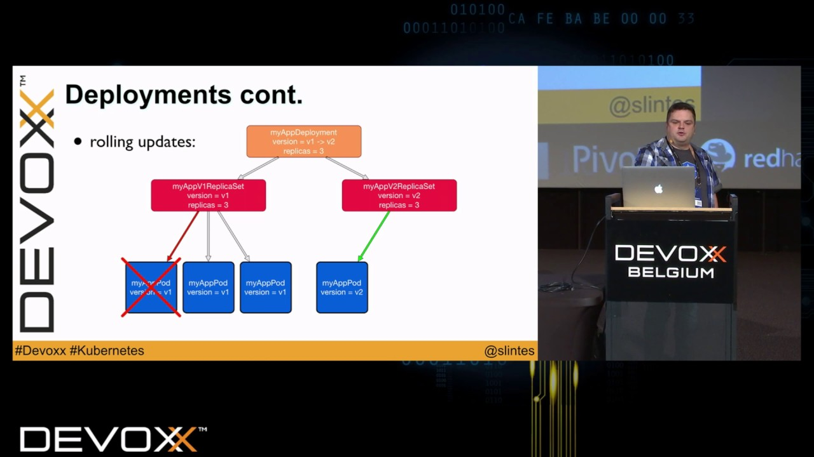

15 Kubernetes features in 15 minutes by Marc Sluiter

15 Kubernetes features in 15 minutes by Marc Sluiter
https://www.youtube.com/watch?v=o85VR90RGNQ
[Devoxx](https://www.youtube.com/channel/UCCBVCTuk6uJrN3iFV_3vurg)
16,587 views views
Published on Nov 10, 2016

|     |
| --- |
| [(L)](https://www.youtube.com/watch?v=o85VR90RGNQ) |

Description

In July 2015 Google released Kubernetes version 1.0, a tool for orchestrating Docker containers in a cluster. A lot happened since then: Kubernetes gained a lot of attraction and was donated to the Cloud Native Computing Foundation. The community is constantly growing, and new versions are released every few months, meaning a lot of useful features have been added since the first release. In this session I want to introduce you shortly to the basics of Kubernetes like Pods, ReplicaSets and Services, and some of the newer features like Jobs, DaemonSets, PetSets, Autoscaling and more.

Marc Sluiter

I started programming with Amiga Basic many years ago and didn't stop since then. After a short excursion to Microsoft .Net later on, I concentrated on developing Java applications. While I focused in most projects on backend development, I also worked with different frontend technologies. I have also some experience in developing Android apps and have interest in the Internet of Things. In my spare time I work with Java on a Raspberry Pi, the Leapmotion input device and Lego Mindstorms. During the last months I was busy with a research project about distributed, scalable, evolvable and secure systems, and a project about hosting distributed applications, both based on Docker and Kubernetes.

[AHL-4947]