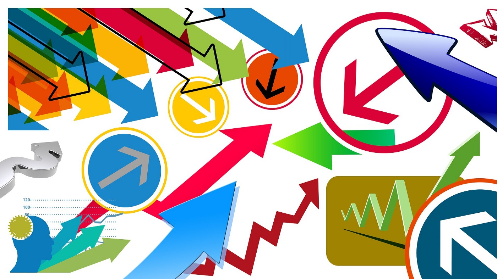
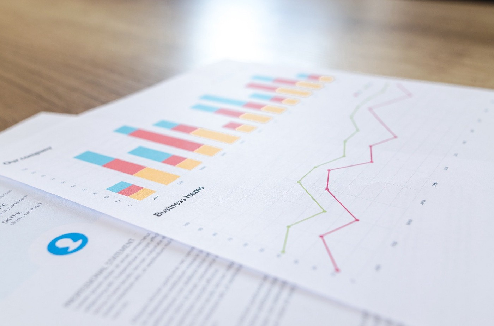
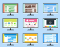
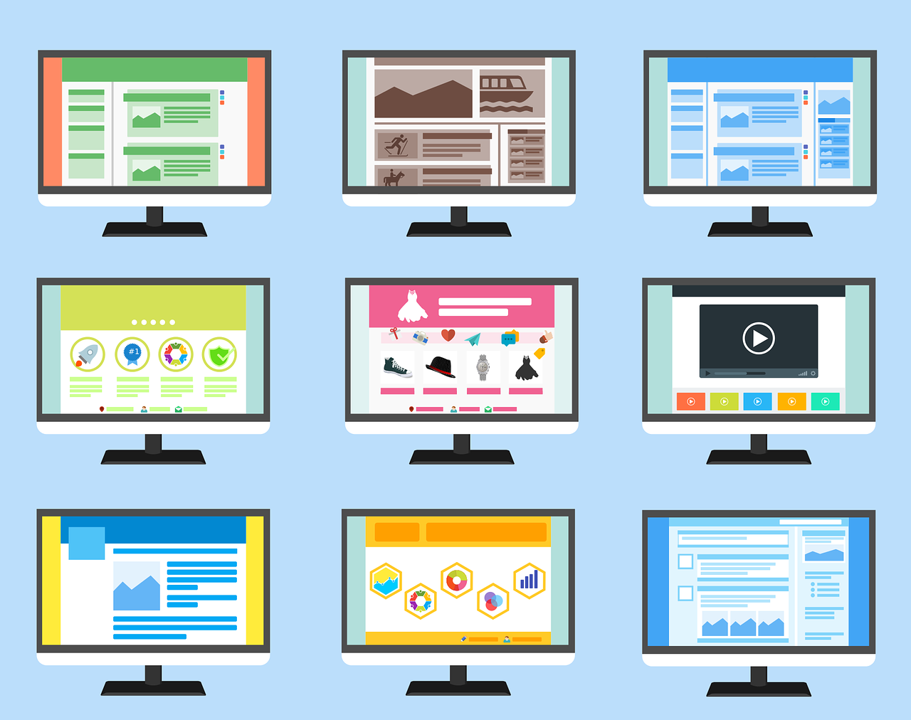

15 Python Libraries That A Data Scientist Need To Know

# 15 Python Libraries That A Data Scientist Need To Know

## Data Gathering, Cleansing, Transforming, Visualisation, Modelling, Audio/Image Recognition and Web Related

[Christopher Tao](https://towardsdatascience.com/@qiuyujx?source=post_page-----df0b3029ecd9----------------------)

[Mar 29](https://towardsdatascience.com/15-python-libraries-that-a-data-scientist-need-to-know-df0b3029ecd9?source=post_page-----df0b3029ecd9----------------------) · 10 min read

If you are a Data Scientist, Data Analyst or just an enthusiast, you should not miss some extremely popular and useful libraries for Python.

In this article, totally 15 Python libraries will be listed and briefly introduced. I believe most of them you may have already familiar, but if not, it is highly recommended to go check them out by yourself.

These libraries will be classified into several categories, that are

- Data Gathering
- Data Cleansing and Transformation
- Data Visualisation
- Data Modelling
- Audio and Image Recognition
- Web

# Data Gathering

Photo by [geralt](https://pixabay.com/users/geralt-9301/) on [Pixabay](https://pixabay.com/illustrations/arrows-centering-direction-central-1738067/)

Most of Data Analytics projects start from data gathering and extraction. Sometimes, the dataset might be given when you work for a certain company to solve an existing problem. However, the data might not be ready-made and you may need to collect it by yourself. The most common scenario is that you need to crawl the data from the Internet.

## 1. Scrapy

[ ## Scrapy | A Fast and Powerful Scraping and Web Crawling Framework   ### Edit description    #### scrapy.org](https://scrapy.org/)

Scrapy is probably the most popular Python library when you want to write a Python crawler to extract information from websites. For example, you could use it to extract all the reviews for all the restaurants in a city or collect all the comments for a certain category of products on an e-commerce website.

The typical usage is to identify the pattern of the interesting information appearing on web pages, both in terms of the URL patterns and XPath patterns. Once these patterns are figured out, Scrapy can help you automatically extract all the needed information and organise them in a data structure such as tabular and JSON.

You can easily install Scrapy using `pip`
pip install scrapy

## 2. Beautiful Soup

[ ## Beautiful Soup   ### Download | Documentation | Hall of Fame | For enterprise | Source | Changelog | Discussion group | Zine ] You didn’t…    #### www.crummy.com](https://www.crummy.com/software/BeautifulSoup/#Download)

Beautiful Soup is yet another Python library for scraping Web content. It is generally accepted that it has a relatively shorter learning curve compare with Scrapy.

Also, Beautiful Soup will be a better choice for relatively smaller-scaled problems and/or just a one-time job. Unlike Scrapy that you have to develop your own “spider” and go back to command-line the run it, Beautiful Soup allows you to import its functions and use them in-line. Therefore, you could even use it in your Jupyter notebooks.

## 3. Selenium

[ ## Selenium Client Driver — Selenium 3.14 documentation   ### Python language bindings for Selenium WebDriver. The selenium package is used to automate web browser interaction from…    #### www.selenium.dev](https://www.selenium.dev/selenium/docs/api/py/index.html)

Originally, Selenium was developed to be an automated Web testing framework. However, developers found that it is quite convenient to use it as a Web scraper.

Selenium is usually utilised when you have to get the interested data after interactions with the web pages. For example, you may need to register an account, then log in and get the content after clicking some buttons and links, and these links are defined as JavaScript functions. In these cases, usually, it is not easy to use Scrapy or Beautiful Soup to implement, but Selenium can.

However, it is important to be noted that Selenium will be much slower than the normal scraping libraries. This is because it actually initialises a web browser such as Chrome and then simulates all the actions defined in the code.

Therefore, when you are dealing with URL patterns and XPaths, do use Scrapy or Beautiful Soup. Only choose Selenium if you have to.

# Data Cleansing and Transformation

Photo by [Sztrapacska74](https://pixabay.com/users/Sztrapacska74-8968314/) on [Pixabay](https://pixabay.com/photos/kitten-cat-4274170/)

I guess it is not necessary to claim how data cleansing and transformation are important in data analytics and data science. Also, there are too many outstanding Python libraries that do these well. I’ll pick up some of them which you must know as a Data Scientist or Analyst.

## 4. Pandas

[ ## pandas   ### pandas is a fast, powerful, flexible and easy to use open source data analysis and manipulation tool, built on top of…    #### pandas.pydata.org](https://pandas.pydata.org/)

I am almost sure that listing Pandas in this list is unnecessary. As long as you are dealing with data, you must have used Pandas.

With Pandas, you can manipulate data in a Pandas Data Frame. There are enormous built-in functions that help you to transform your data.

Don’t need too many words. If you want to learn Python, this is a must-learn library.

## 5. Numpy

[ ## NumPy — NumPy   ### NumPy is the fundamental package for scientific computing with Python. It contains among other things: a powerful…    #### numpy.org](https://numpy.org/)

Similarly, Numpy is another must-learn library for Python language users, even not only for Data Scientists and Analysts.

It extended Python list objects into comprehensive multi-dimensional arrays. There is also a huge number of built-in mathematical functions to support almost all your needs in terms of calculation. Typically, you can use Numpy arrays as matrices and Numpy will allow you to perform matrix calculations.

I believe many Data Scientist will start there Python scripts as follows
import numpy as np
import pandas as pd

So, it is sure that these two libraries are probably the most popular ones in the Python community.

## 6. Spacy

[ ## spaCy · Industrial-strength Natural Language Processing in Python   ### spaCy is designed to help you do real work — to build real products, or gather real insights. The library respects your…    #### spacy.io](https://spacy.io/)

Spacy is probably not as famous as the previous ones. While Numpy and Pandas are the libraries dealing with numeric and structured data, Spacy helps us to convert free text into structured data.

Spacy is one of the most popular NLP (Natural Language Processing) libraries for Python. Imagine that when you scraped a lot of product reviews from an e-commerce website, you have to extract useful information from these free text before you can analyse them. Spacy has numerous built-in features to assist, such as work tokeniser, named entity recognition, and part-of-speech detection.

Also, Spacy support many different human languages. On its official site, it is claimed that it supports more than 55 ones.

# Data Visualisation

Photo by [6689062](https://pixabay.com/users/6689062-6689062/) on [Pixabay](https://pixabay.com/photos/financial-analytics-blur-business-2860753/)

Data Visualisation is absolutely an essential need in Data Analytics. We need to visualise the results and outcomes and telling the data story that we have found.

## 7. Matplotlib

[ ## Matplotlib: Python plotting — Matplotlib 3.2.1 documentation   ### Matplotlib is a comprehensive library for creating static, animated, and interactive visualizations in Python…    #### matplotlib.org](https://matplotlib.org/)

Matplotlib is the most comprehensive data visualisation library for Python. Someone says that Matplotlib is ugly. However, in my opinion, as probably the most basic visualisation library in Python, Matplotlib provides the most possibilities to achieve your visualisation idea. This is just like JavaScript developers may prefer different kinds of visualisation libraries, but when there is a lot of customised features that are not supported by those high-level libraries, D3.js has to be involved.

I have written another article to introduce Matplotlib. Check out this if you want to read more about it.

[ ## An Introduction to Python Matplotlib with 40 Basic Examples   ### Matplotlib is one of the most popular libraries in Python. In this article, 40 basic examples are provided for you to…    #### levelup.gitconnected.com](https://levelup.gitconnected.com/an-introduction-of-python-matplotlib-with-40-basic-examples-5174383a6889)

## 8. Plotly

[ ## Plotly Python Graphing Library   ### Plotly’s Python graphing library makes interactive, publication-quality graphs. Examples of how to make line plots…    #### plotly.com](https://plotly.com/python/)

Honestly, although I believe Matplotlib is a must-learn library for visualisation, most of the times I would prefer to use Plotly because it enables us to create the fanciest graphs in fewest lines of code.

No matter you want to build a 3D surface plot, a map-based scatter plot or an interactive animated plot, Plotly can fulfil the requirements in a short time.

It also provides a chart studio that you can upload your visualisation to an online repository which supports further editing and persistence.

# Data Modelling

Photo by [FeeLoona](https://pixabay.com/users/FeeLoona-694250/) on [Pixabay](https://pixabay.com/photos/child-tower-building-blocks-blocks-1864718/)

When data analytics comes to modelling, we usually refer it to Advanced Analytics. Nowadays, machine learning is already not a novel concept. Python is also considered as the most popular language for machine learning. Of course, there are a lot of outstanding libraries supporting this.

## 9. Scikit Learn

[ ## scikit-learn   ### “We use scikit-learn to support leading-edge basic research […]” “I think it’s the most well-designed ML package I’ve…    #### scikit-learn.org](https://scikit-learn.org/)

Before you dive into “deep learning”, Scikit Learn should be the Python library you to start your path on machine learning.

Scikit Learn has 6 major modules that do

- Data Pre-Processing
- Dimensions Reduction
- Regression
- Classification
- Clustering
- Model Selection

I’m sure that a Data Scientist who has nailed Scikit Learn should already be considered as a good Data Scientist.

## 10. PyTorch

[ ## PyTorch   ### An open source deep learning platform that provides a seamless path from research prototyping to production deployment.    #### pytorch.org](https://pytorch.org/)

PyTorch is authored by Facebook and open-sourced as a mutual machine learning framework for Python.

Compare to Tensorflow, PyTorch is more “pythonic” in terms of its syntax. which also made PyTorch a bit easier to learn and start to use.

Finally, as a deep-learning focus library, PyTorch has very rich API and built-in functions to assist Data Scientists to quickly train their deep learning models.

## 11. Tensorflow

[ ## TensorFlow   ### An end-to-end open source machine learning platform for everyone. Discover TensorFlow’s flexible ecosystem of tools…    #### www.tensorflow.org](https://www.tensorflow.org/)

Tensorflow another machine learning library for Python that was open-sourced by Google.

One of the most popular features of Tensorflow is the Data Flow Graphs on the Tensorboard. The latter is an automatically generated Web-based dashboard visualising the machine learning flows and outcomes, which is extremely helpful for debugging and presentation purposes.

# Audio and Image Recognition

Photo by [Pexels](https://pixabay.com/users/Pexels-2286921/) on [Pixabay](https://pixabay.com/photos/audio-technology-mixer-volume-knob-1839162/)

Machine learning is not only on numbers but also can help on audio and images (videos are considered as a series of image frames). Therefore, when we deal with these multimedia data, those machine learning libraries will not be enough. Here are some popular audio and image recognition libraries for Python.

## 12. Librosa

[ ## LibROSA — librosa 0.7.2 documentation   ### LibROSA is a python package for music and audio analysis. It provides the building blocks necessary to create music…    #### librosa.github.io](https://librosa.github.io/librosa/)

Librosa is a very powerful audio and voice processing Python library. It can be utilised to extract various kinds of features from audio segments, such as the rhythm, beats and tempo.

With Librosa, those extremely complicated algorithms such as the Laplacian segmentation can be easily implemented in a few lines of code.

## 13. OpenCV

[ ## OpenCV   ### Open Computer Vision Library    #### opencv.org](https://opencv.org/)

OpenCV is the most ubiquitously used library for image and video recognition. It is not exaggerated to say that OpenCV enables Python to replace Matlab in terms of image and video recognition.

It provides various APIs and supports not only Python but also Java and Matlab, as well as outstanding performance, which earns much appreciation both in the industry and academic research.

# Web

Photo by [200degrees](https://pixabay.com/users/200degrees-2051452/) on [Pixabay](https://pixabay.com/vectors/website-page-template-internet-web-1624028/)

Don’t forget that Python was commonly used in Web Development before it comes popular in the data science area. So, there are also a lot of excellent libraries for web development.

## 14. Django

[ ## Django   ### Django is a high-level Python Web framework that encourages rapid development and clean, pragmatic design. Built by…    #### www.djangoproject.com](https://www.djangoproject.com/)

If you want to use Python to develop a Web service backend, Django is always the best choice. It is designed to be a high-level framework that can build a website in very few lines of code.

It directly supports most of the popular databases to save your time to set up the connections and data model development. You would only focus on the business logic and never worried about CURD manipulations with Django because it is a database-driven framework.

## 15. Flask

[ ## Welcome to Flask — Flask Documentation (1.1.x)   ### Welcome to Flask’s documentation. Get started with Installation and then get an overview with the Quickstart . There is…    #### flask.palletsprojects.com](https://flask.palletsprojects.com/)

Flask is a light-weight Web development framework in Python. The most valuable feature is that it can be easily customised with any specific requirements very easy and flexible.

A lot of other famous Python libraries and tools which provides Web UI are built using Flask such as Plotly Dash and Airflow because of Flask’s light-weight feature.

# Conclusion

Photo by [Kelly Sikkema](https://unsplash.com/@kellysikkema?utm_source=medium&utm_medium=referral) on [Unsplash](https://unsplash.com/?utm_source=medium&utm_medium=referral)

Indeed, there are more prominent Python libraries that are eligible to be listed in here. It is always exciting to see that Python’s community is such thriving. In case if there are more libraries become one of the must-known ones for Data Scientists and Analysts, there might be necessary to organise them in another article.

Life is short, so I love Python!