15 Types of Regression you should know

# 15 Types of Regression you should know

[ListenData](https://plus.google.com/+listendata)[12 Comments](https://www.listendata.com/2018/03/regression-analysis.html#comment-form)[R](https://www.listendata.com/search/label/R),[regression](https://www.listendata.com/search/label/regression)

Regression techniques are one of the most popular statistical techniques used for predictive modeling and data mining tasks. On average, analytics professionals know only 2-3 types of regression which are commonly used in real world. They are linear and logistic regression. But the fact is there are more than 10 types of regression algorithms designed for various types of analysis. Each type has its own significance. Every analyst must know which form of regression to use depending on type of data and distribution.

**Table of Contents**

1. What is Regression Analysis?
2. Terminologies related to Regression
3. Types of Regressions

    - Linear Regression
    - Polynomial Regression
    - Logistic Regression
    - Quantile Regression
    - Ridge Regression
    - Lasso Regression
    - ElasticNet Regression
    - Principal Component Regression
    - Partial Least Square Regression
    - Support Vector Regression
    - Ordinal Regression
    - Poisson Regression
    - Negative Binomial Regression
    - Quasi-Poisson Regression
    - Cox Regression

4. How to choose the correct Regression Model?

|     |
| --- |
| [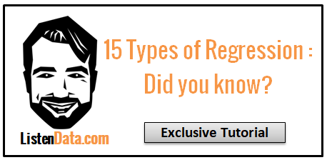](https://2.bp.blogspot.com/-4EMj8azhdRI/WrfvScVzCVI/AAAAAAAAHJY/7l3J-uX2wFA49_Nkif7Wjm5SP713amRrgCLcBGAs/s1600/regression.PNG) |
| Regression Analysis Simplified |

##

What is Regression Analysis?

**Lets take a simple example :** Suppose your manager asked you to predict annual sales. There can be a hundred of factors (drivers) that affects sales. In this case, sales is your **dependent variable**. Factors affecting sales are **independent variables**. Regression analysis would help you to solve this problem.

**> In simple words, regression analysis is used to model the relationship between a dependent variable and one or more independent variables.**

It helps us to answer the following questions -
1. Which of the drivers have a significant impact on sales.
2. Which is the most important driver of sales
3. How do the drivers interact with each other
4. What would be the annual sales next year.
****

## **Terminologies related to regression analysis**

**1. Outliers**

Suppose there is an observation in the dataset which is having a very high or very low value as compared to the other observations in the data, i.e. it does not belong to the population, such an observation is called an outlier. In simple words, it is extreme value. An outlier is a problem because many times it hampers the results we get.

**2. Multicollinearity**

When the independent variables are highly correlated to each other then the variables are said to be multicollinear. Many types of regression techniques assumes multicollinearity should not be present in the dataset. It is because it causes problems in ranking variables based on its importance. Or it makes job difficult in selecting the most important independent variable (factor).

**3. Heteroscedasticity**

When dependent variable's variability is not equal across values of an independent variable, it is called heteroscedasticity. **Example -** As one's income increases, the variability of food consumption will increase. A poorer person will spend a rather constant amount by always eating inexpensive food; a wealthier person may occasionally buy inexpensive food and at other times eat expensive meals. Those with higher incomes display a greater variability of food consumption.

**4. Underfitting and Overfitting**

When we use unnecessary explanatory variables it might lead to overfitting. Overfitting means that our algorithm works well on the training set but is unable to perform better on the test sets. It is also known as problem of **high variance.**

When our algorithm works so poorly that it is unable to fit even training set well then it is said to **underfit the data.** It is also known as **problem of high bias.**

In the following diagram we can see that fitting a linear regression (straight line in fig 1) would underfit the data i.e. it will lead to large errors even in the training set. Using a polynomial fit in fig 2 is balanced i.e. such a fit can work on the training and test sets well, while in fig 3 the fit will lead to low errors in training set but it will not work well on the test set.

|     |
| --- |
| [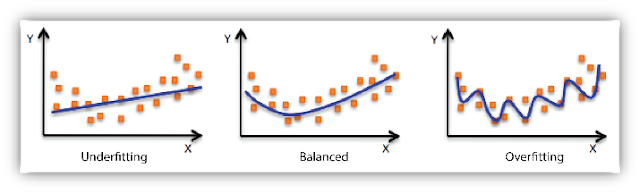](https://4.bp.blogspot.com/-dM4Iae3kVsQ/Wlt28eEHHiI/AAAAAAAACPg/X0dIT2a6RMwdEFUO44fQVX9HXakraYBagCLcBGAs/s1600/img1.png) |
| Regression : Underfitting and Overfitting |

## Types of Regression

Every regression technique has some assumptions attached to it which we need to meet before running analysis. These techniques differ in terms of type of dependent and independent variables and distribution.

## 1. Linear Regression

It is the simplest form of regression. It is a technique in which the **dependent variable is continuous** in nature. The relationship between the dependent variable and independent variables is assumed to be linear in nature. We can observe that the given plot represents a somehow linear relationship between the mileage and displacement of cars. The **green points** are the actual observations while the **black line fitted** is the line of regression

|     |
| --- |
| [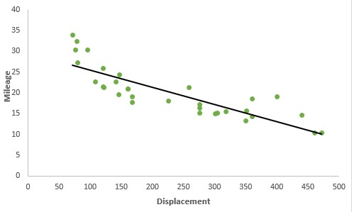](https://4.bp.blogspot.com/-IOOxgPaXMVc/Wlj3LWvcnjI/AAAAAAAACKE/UeTFYvAxDmUDel5UBjdifeWaApB3-dXVgCLcBGAs/s1600/img1.jpg) |
| Regression Analysis |

**> When you have `only 1 independent variable`>  and 1 dependent variable, it is called simple linear regression.

> When you have `more than 1 independent variable`>  and 1 dependent variable, it is called Multiple linear regression.**

**The equation of multiple linear regression is listed below -**

|     |
| --- |
| [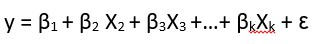](https://2.bp.blogspot.com/-xbqTM5K3bIU/WkzhtHMPEmI/AAAAAAAACFs/RULnlMKw_0U14oRWOUcuETJNt9TBYiJEgCLcBGAs/s1600/b.jpg) |

Multiple Regression Equation

Here 'y' is the dependent variable to be estimated, and X are the independent variables and ε is the error term. βi’s are the regression coefficients.

**Assumptions of linear regression: **

1. There must be a linear relation between independent and dependent variables.

2. There should not be any outliers present.
3. No heteroscedasticity
4. Sample observations should be independent.

5. Error terms should be normally distributed with mean 0 and constant variance.

6. Absence of multicollinearity and auto-correlation.

**Estimating the parameters**To estimate the regression coefficients βi’s we use principle of least squares which is to minimize the sum of squares due to the error terms i.e.

[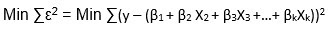](https://3.bp.blogspot.com/-bHdTkTHhk-A/Wlj7qArK-vI/AAAAAAAACKQ/Afedqlb4p1AFVg9MO623FbdUhZKmIeFXACLcBGAs/s1600/img2.jpg)

On solving the above equation mathematically we obtain the regression coefficients as:

[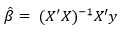](https://4.bp.blogspot.com/-Srjys9kedH8/Wlj8XpIW4dI/AAAAAAAACKY/KeuZNb4RZpkoKrtFmpoDbq07ZXeKBvI1wCLcBGAs/s1600/img3.jpg)

**Interpretation of regression coefficients**

Let us consider an example where the dependent variable is marks obtained by a student and explanatory variables are number of hours studied and no. of classes attended. Suppose on fitting linear regression we got the linear regression as:

**> Marks obtained = 5 + 2 (no. of hours studied) + 0.5(no. of classes attended)**

Thus we can have the regression coefficients 2 and 0.5 which can interpreted as:

1. If no. of hours studied and no. of classes are 0 then the student will obtain 5 marks.

2. Keeping no. of classes attended constant, if student studies for one hour more then he will score 2 more marks in the examination.

3. Similarly keeping no. of hours studied constant, if student attends one more class then he will attain 0.5 marks more.

Linear Regression in R

We consider the swiss data set for carrying out linear regression in R. We use lm() function in the base package. We try to estimate Fertility with the help of other variables.

**> library(datasets)
> model = lm(Fertility ~ .,data = swiss)
> lm_coeff = model$coefficients
> lm_coeff
> summary(model)**

The output we get is:

> lm_coeff

(Intercept) Agriculture Examination Education Catholic 66.9151817 -0.1721140 -0.2580082 -0.8709401 0.1041153 Infant.Mortality 1.0770481 > summary(model)

Call:
lm(formula = Fertility ~ ., data = swiss)
Residuals:
Min 1Q Median 3Q Max -15.2743 -5.2617 0.5032 4.1198 15.3213 Coefficients:

Estimate Std. Error t value Pr(>|t|) (Intercept) 66.91518 10.70604 6.250 1.91e-07 ***

Agriculture -0.17211 0.07030 -2.448 0.01873 * Examination -0.25801 0.25388 -1.016 0.31546 Education -0.87094 0.18303 -4.758 2.43e-05 ***

Catholic 0.10412 0.03526 2.953 0.00519 ** Infant.Mortality 1.07705 0.38172 2.822 0.00734 ** ---

Signif. codes: 0 ‘***’ 0.001 ‘**’ 0.01 ‘*’ 0.05 ‘.’ 0.1 ‘ ’ 1
Residual standard error: 7.165 on 41 degrees of freedom

Multiple R-squared: 0.7067, Adjusted R-squared: 0.671 F-statistic: 19.76 on 5 and 41 DF, p-value: 5.594e-10

Hence we can see that 70% of the variation in Fertility rate can be explained via linear regression.

## 2. Polynomial Regression

It is a technique to fit a nonlinear equation by taking polynomial functions of independent variable.

In the figure given below, you can see the red curve fits the data better than the green curve. Hence in the situations where the relation between the dependent and independent variable seems to be non-linear we can deploy **Polynomial Regression Models.**

Thus a polynomial of degree k in one variable is written as:

[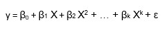](https://1.bp.blogspot.com/-wrJdHn0X_Y8/Wln1K2YZO5I/AAAAAAAACMI/gScVjBesYCY0S4bqUV_tVL6DELUjVcvLwCLcBGAs/s1600/poly2.jpg)

Here we can create new features like

[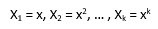](https://2.bp.blogspot.com/-cCV9hGqL9LQ/Wln157jicDI/AAAAAAAACMQ/oiIreV5AsTYAB26KLHAI_fnoxbVMevuNgCLcBGAs/s1600/poly3.jpg)

and can fit linear regression in the similar manner.

In case of multiple variables say X1 and X2, we can create a third new feature (say X3) which is the product of X1 and X2 i.e.

[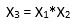](https://1.bp.blogspot.com/-7PfDLmtSWJk/Wln2md8NJ2I/AAAAAAAACMc/XpDcnrF4Md0jd-jmBXRI5yY_TgMnGWChACLcBGAs/s1600/poly5.jpg)

**Disclaimer:** It is to be kept in mind that creating unnecessary extra features or fitting polynomials of higher degree may lead to overfitting.

**Polynomial regression in R:**

We are using [**poly.csv **](https://sites.google.com/site/breathe42/poly.csv)data for fitting polynomial regression where we try to estimate the Prices of the house given their area.

Firstly we read the data using **read.csv( )** and divide it into the dependent and independent variable

**> data = read.csv("poly.csv")
> x = data$Area
> y = data$Price**

In order to compare the results of linear and polynomial regression, firstly we fit linear regression:

**> model1 = lm(y ~x)
> model1$fit
> model1$coeff**

The coefficients and predicted values obtained are:
> model1$fit

1 2 3 4 5 6 7 8 9 10 169.0995 178.9081 188.7167 218.1424 223.0467 266.6949 291.7068 296.6111 316.2282 335.8454 > model1$coeff

(Intercept) x 120.05663769 0.09808581
We create a dataframe where the new variable are x and x square.

**> new_x = cbind(x,x^2)**

new_x
x [1,] 500 250000
[2,] 600 360000
[3,] 700 490000
[4,] 1000 1000000
[5,] 1050 1102500
[6,] 1495 2235025
[7,] 1750 3062500
[8,] 1800 3240000
[9,] 2000 4000000
[10,] 2200 4840000
Now we fit usual OLS to the new data:
**> model2 = lm(y~new_x)
> model2$fit
> model2$coeff**

The fitted values and regression coefficients of polynomial regression are:
> model2$fit

1 2 3 4 5 6 7 8 9 10 122.5388 153.9997 182.6550 251.7872 260.8543 310.6514 314.1467 312.6928 299.8631 275.8110 > model2$coeff

(Intercept) new_xx new_x -7.684980e+01 4.689175e-01 -1.402805e-04

Using ggplot2 package we try to create a plot to compare the curves by both linear and polynomial regression.

**> library(ggplot2)
> ggplot(data = data) + geom_point(aes(x = Area,y = Price)) +
> geom_line(aes(x = Area,y = model1$fit),color = "red") +
> geom_line(aes(x = Area,y = model2$fit),color = "blue") +
> theme(panel.background = element_blank())**

[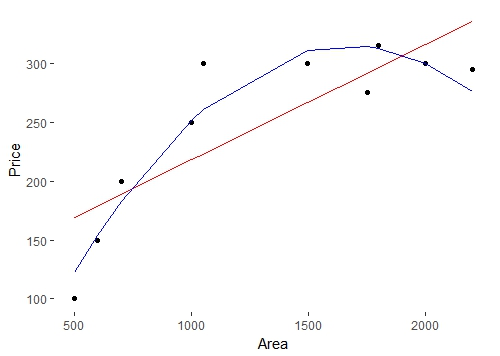](https://3.bp.blogspot.com/-GC6CZTGEsW0/Wls-Q-ROh_I/AAAAAAAACN0/1USwBPjxa60fgR_0K62HH2XUVGIl8T7-wCLcBGAs/s1600/poly.jpeg)

**
**

## **3. Logistic Regression**

In logistic regression, the dependent variable is binary in nature (having two categories). Independent variables can be continuous or binary. In multinomial logistic regression, you can have more than two categories in your dependent variable.

Here my model is:

|     |
| --- |
| [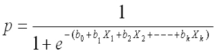](https://1.bp.blogspot.com/-rsjL8rX6Q38/VryuBND_wZI/AAAAAAAAD_w/Fpb9x6BfsuY/s1600/Optimized-prob%2Blogit%2B%25281%2529.png) |
| logistic regression equation |

**Why don't we use linear regression in this case?**

- The homoscedasticity assumption is violated.
- Errors are not normally distributed
- y follows binomial distribution and hence is not normal.

**Examples**

- **HR Analytics:** IT firms recruit large number of people, but one of the problems they encounter is after accepting the job offer many candidates do not join. So, this results in cost over-runs because they have to repeat the entire process again. Now when you get an application, can you actually predict whether that applicant is likely to join the organization (Binary Outcome - Join / Not Join).

- **Elections: **Suppose that we are interested in the factors that influence whether a political candidate wins an election. The outcome (response) variable is binary (0/1); win or lose. The predictor variables of interest are the amount of money spent on the campaign and the amount of time spent campaigning negatively.

**Predicting the category of dependent variable for a given vector X of independent variables**

Through logistic regression we have -
**> P(Y=1) = exp(a + BₙX)  / (1+ exp(a + BₙX))**

Thus we choose a cut-off of probability say 'p'  and if P(Yi = 1) > p then we can say that Yi belongs to class 1 otherwise 0.

**Interpreting the logistic regression coefficients (Concept of Odds Ratio)**

If we take exponential of coefficients, then we’ll get odds ratio for ith explanatory variable. Suppose odds ratio is equal to two, then the odds of event is 2 times greater than the odds of non-event. Suppose dependent variable is customer attrition (whether customer will close relationship with the company) and independent variable is citizenship status (National / Expat). The odds of expat attrite is 3 times greater than the odds of a national attrite.

Logistic Regression in R:

In this case, we are trying to estimate whether a person will have cancer depending whether he smokes or not.

We fit logistic regression with **glm( ) ** function and we set **family = "binomial"**

**> model <- glm(Lung.Cancer..Y.~Smoking..X.,data = data, family = "binomial")**

The predicted probabilities are given by:
**> #Predicted Probablities**

model$fitted.values

1 2 3 4 5 6 7 8 9 0.4545455 0.4545455 0.6428571 0.6428571 0.4545455 0.4545455 0.4545455 0.4545455 0.6428571 10 11 12 13 14 15 16 17 18 0.6428571 0.4545455 0.4545455 0.6428571 0.6428571 0.6428571 0.4545455 0.6428571 0.6428571 19 20 21 22 23 24 25 0.6428571 0.4545455 0.6428571 0.6428571 0.4545455 0.6428571 0.6428571

Predicting whether the person will have cancer or not when we choose the cut off probability to be 0.5

**> data$prediction <- model$fitted.values>0.5**
> data$prediction

[1] FALSE FALSE TRUE TRUE FALSE FALSE FALSE FALSE TRUE TRUE FALSE FALSE TRUE TRUE TRUE

[16] FALSE TRUE TRUE TRUE FALSE TRUE TRUE FALSE TRUE TRUE

## **4. Quantile Regression**

Quantile regression is the extension of linear regression and we generally use it when outliers, high skeweness and heteroscedasticity exist in the data.

In linear regression, we predict the mean of the dependent variable for given independent variables. Since mean does not describe the whole distribution, so modeling the mean is not a full description of a relationship between dependent and independent variables. So we can use quantile regression which predicts a quantile (or percentile) for given independent variables.

**> The term “quantile” is the same as “percentile”**

**Basic Idea of Quantile Regression:**In quantile regression we try to estimate the quantile of the dependent variable given the values of X's. **Note** that the dependent variable should be continuous.

**The quantile regression model:**
For qth quantile we have the following regression model:

This seems similar to linear regression model but here the objective function we consider to minimize is:

[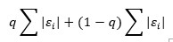](https://1.bp.blogspot.com/-iQrIMqXI4Rk/Wll0V465mOI/AAAAAAAACLA/YPTqA4MhAGYE0u0P8NF23UTDIQM_R9PkQCLcBGAs/s1600/img6.jpg)

where q is the qth quantile.

If q  = 0.5 i.e. if we are interested in the median then it becomes **median regression **(or least absolute deviation regression) and substituting the value of q = 0.5 in above equation we get the objective function as:

[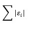](https://2.bp.blogspot.com/-W3cULkOl6vs/Wll1AfbrzWI/AAAAAAAACLM/TYEZb0HImycDIAOMXh_dU1l7NeOWt9HVgCLcBGAs/s1600/img%2B7.jpg)

**Interpreting the coefficients in quantile regression:**
Suppose the regression equation for 25th quantile of regression is:
y = 5.2333 + 700.823 x

It means that for one unit increase in x the estimated increase in 25th quantile of y by 700.823 units.

**Advantages of Quantile over Linear Regression**

- Quite beneficial when heteroscedasticity is present in the data.
- Robust to outliers
- Distribution of dependent variable can be described via various quantiles.
- It is more useful than linear regression when the data is skewed.

**Disclaimer on using quantile regression!**

It is to be kept in mind that the coefficients which we get in quantile regression for a particular quantile should differ significantly from those we obtain from linear regression. If it is not so then our usage of quantile regression isn't justifiable. This can be done by observing the confidence intervals of regression coefficients of the estimates obtained from both the regressions.

Quantile Regression in R

We need to install **quantreg** package in order to carry out quantile regression.

**> install.packages("quantreg")
> library(quantreg)**

Using **rq **function we try to predict the estimate the 25th quantile of Fertility Rate in **Swiss data. **For this we set **tau = 0.25.**

**> model1 = rq(Fertility~.,data = swiss,tau = 0.25)
> summary(model1)**
tau: [1] 0.25
Coefficients:
coefficients lower bd upper bd
(Intercept) 76.63132 2.12518 93.99111
Agriculture -0.18242 -0.44407 0.10603
Examination -0.53411 -0.91580 0.63449
Education -0.82689 -1.25865 -0.50734
Catholic 0.06116 0.00420 0.22848
Infant.Mortality 0.69341 -0.10562 2.36095

Setting tau = 0.5 we run the median regression.
**> model2 = rq(Fertility~.,data = swiss,tau = 0.5)
> summary(model2)**

tau: [1] 0.5
Coefficients:
coefficients lower bd upper bd
(Intercept) 63.49087 38.04597 87.66320
Agriculture -0.20222 -0.32091 -0.05780
Examination -0.45678 -1.04305 0.34613
Education -0.79138 -1.25182 -0.06436
Catholic 0.10385 0.01947 0.15534
Infant.Mortality 1.45550 0.87146 2.21101

We can run quantile regression for multiple quantiles in a single plot.
**> model3 = rq(Fertility~.,data = swiss, tau = seq(0.05,0.95,by = 0.05))
> quantplot = summary(model3)
> quantplot**

We can check whether our quantile regression results differ from the OLS results using plots.

**> plot(quantplot)**
We get the following plot:

[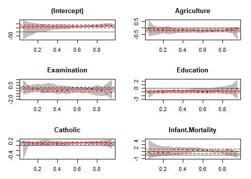](https://3.bp.blogspot.com/-hQ1Vi3BsoC8/WlsZrq7z3mI/AAAAAAAACNk/PCxLz7EPpiIAtzUv3dWuNrluRr8mbo6dwCLcBGAs/s1600/quantplot.jpeg)

Various quantiles are depicted by X axis. The red central line denotes the estimates of OLS coefficients and the dotted red lines are the confidence intervals around those OLS coefficients for various quantiles. The black dotted line are the **quantile regression estimates **and the gray area is the confidence interval for them for various quantiles. We can see that for all the variable both the regression estimated coincide for most of the quantiles. Hence our use of quantile regression is not justifiable for such quantiles. In other words we want that both the red and the gray lines should overlap as less as possible to justify our use of quantile regression.

## 5. Ridge Regression

It's important to understand the concept of regularization before jumping to ridge regression.

### 1. Regularization

Regularization helps to solve over fitting problem which implies model performing well on training data but performing poorly on validation (test) data. Regularization solves this problem by adding a penalty term to the objective function and control the model complexity using that penalty term.

Regularization is generally useful in the following situations:
1. Large number of variables
2. Low ratio of number observations to number of variables
3. High Multi-Collinearity

### 2. **L1 Loss function or L1 Regularization**

In L1 regularization we try to minimize the objective function by adding a penalty term to the **sum of the absolute values of coefficients. ** This is also known as least absolute deviations method. Lasso Regression makes use of L1 regularization.

### 3. L2 Loss function or L2 Regularization

In L2 regularization we try to minimize the objective function by adding a penalty term to the **sum of the squares of coefficients. **Ridge Regression or shrinkage regression makes use of L2 regularization.

**> In general, L2 performs better than L1 regularization. L2 is efficient in terms of computation. There is one area where L1 is considered as a preferred option over L2. L1 has in-built feature selection for sparse feature spaces.  For example, you are predicting whether a person is having a brain tumor using more than 20,000 genetic markers (features). It is known that the vast majority of genes have little or no effect on the presence or severity of most diseases.**

In the linear regression objective function we try to minimize the sum of squares of errors. **In ridge regression** (also known as shrinkage regression) we add a constraint on the sum of squares of the regression coefficients. Thus in ridge regression our objective function is:

[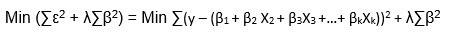](https://2.bp.blogspot.com/-mQhz_RBk_Rs/WlrsUXF0U3I/AAAAAAAACMs/OZ2nOGaYYVk457X9Y3h1cC0d_ajcMTUDACLcBGAs/s1600/ridge1.jpg)

Here **λ is the regularization parameter** which is a non negative number. Here we do not assume normality in the error terms.

**Very Important Note: **

**> We do not regularize the intercept term. The constraint is just on the sum of squares of regression coefficients of X's.**

We can see that ridge regression makes use of **L2 regularization.**

On solving the above objective function we can get the estimates of β as:

**How can we choose the regularization parameter λ?**

If we choose lambda = 0 then we get back to the usual OLS estimates. If lambda is chosen to be very large then it will lead to underfitting. Thus it is highly important to determine a desirable value of lambda. To tackle this issue, we plot the parameter estimates against different values of lambda and select the minimum value of λ after which the parameters tend to stabilize.

### R code for Ridge Regression

Considering the swiss data set, we create two different datasets, one containing dependent variable and other containing independent variables.

**> X = swiss[,-1]
> y = swiss[,1]**

We need to load **glmnet** library to carry out ridge regression.
**> library(glmnet)**

Using **cv.glmnet( )** function we can do cross validation. By default** alpha = 0** which means we are carrying out ridge regression. **lambda** is a sequence of various values of lambda which will be used for cross validation.

**> set.seed(123) #Setting the seed to get similar results.
> model = cv.glmnet(as.matrix(X),y,alpha = 0,lambda = 10^seq(4,-1,-0.1))**

We take the best lambda by using **lambda.min** and hence get the regression coefficients using **predict **function.

**> best_lambda = model$lambda.min**

ridge_coeff = predict(model,s = best_lambda,type = "coefficients")
ridge_coeff The coefficients obtained using ridge regression are:
6 x 1 sparse Matrix of class "dgCMatrix"
1
(Intercept) 64.92994664
Agriculture -0.13619967
Examination -0.31024840
Education -0.75679979
Catholic 0.08978917
Infant.Mortality 1.09527837

** 6. Lasso Regression**

Lasso stands for **Least Absolute Shrinkage and Selection Operator**. It makes use of** L1 regularization **technique in the objective function. Thus the objective function in LASSO regression becomes:

[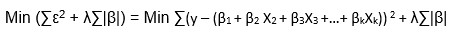](https://1.bp.blogspot.com/-vy7hx5HBZog/WlrxD3WTeGI/AAAAAAAACNE/qXVszdrqEmEhd8FLFT_Hz6uu3MXVzVXBwCLcBGAs/s1600/lasso%2B1.jpg)

λ is the regularization parameter and the intercept term is not regularized.
We do not assume that the error terms are normally distributed.

For the estimates we don't have any specific mathematical formula but we can obtain the estimates using some statistical software.

***Note that lasso regression also needs standardization.***

### Advantage of lasso over ridge regression

**> Lasso regression can perform in-built variable selection as well as parameter shrinkage. While using ridge regression one may end up getting all the variables but with **> Shrinked Paramaters.****

### R code for Lasso Regression

Considering the **swiss dataset** from "**datasets**" package, we have:
**> #Creating dependent and independent variables.
> X = swiss[,-1]
> y = swiss[,1]**

Using** cv.glmnet **in **glmnet **package we do cross validation. For lasso regression we set alpha = 1. By default standardize = TRUE hence we do not need to standardize the variables seperately.

**> #Setting the seed for reproducibility
> set.seed(123)
> model = cv.glmnet(as.matrix(X),y,alpha = 1,lambda = 10^seq(4,-1,-0.1))
> #By default standardize = TRUE**

We consider the best value of lambda by filtering out **lamba.min** from the model and hence get the coefficients using **predict **function.

**> #Taking the best lambda
> best_lambda = model$lambda.min
> lasso_coeff = predict(model,s = best_lambda,type = "coefficients")
> lasso_coeff The lasso coefficients we got are:**
6 x 1 sparse Matrix of class "dgCMatrix"
1
(Intercept) 65.46374579
Agriculture -0.14994107
Examination -0.24310141
Education -0.83632674
Catholic 0.09913931
Infant.Mortality 1.07238898

### **

**

### **Which one is better - Ridge regression or Lasso regression?**

Both ridge regression and lasso regression are addressed to deal with multicollinearity.

Ridge regression is computationally more efficient over lasso regression. Any of them can perform better. So the best approach is to **select that regression model which fits the test set data well.**

**7. Elastic Net Regression**

Elastic Net regression is preferred over both ridge and lasso regression when one is dealing with highly correlated independent variables.

It is a `combination of both L1 and L2 regularization`.

The objective function in case of Elastic Net Regression is:

Like ridge and lasso regression, it does not assume normality.

### R code for Elastic Net Regression

Setting some different value of alpha between 0 and 1 we can carry out elastic net regression.

**> set.seed(123)
> model = cv.glmnet(as.matrix(X),y,alpha = 0.5,lambda = 10^seq(4,-1,-0.1))
> #Taking the best lambda
> best_lambda = model$lambda.min
> en_coeff = predict(model,s = best_lambda,type = "coefficients")
> en_coeff**
The coeffients we obtained are:
6 x 1 sparse Matrix of class "dgCMatrix"
1
(Intercept) 65.9826227
Agriculture -0.1570948
Examination -0.2581747
Education -0.8400929
Catholic 0.0998702
Infant.Mortality 1.0775714
**8. Principal Components Regression (PCR) **

PCR is a regression technique which is widely used when you have many independent variables OR multicollinearity exist in your data. It is divided into 2 steps:

1. Getting the Principal components
2. Run regression analysis on principal components
The most common features of PCR are:
1. Dimensionality Reduction
2. Removal of multicollinearity

### Getting the Principal components

Principal components analysis is a statistical method to extract new features when the original features are highly correlated. We create new features with the help of original features such that the new features are uncorrelated.

Let us consider the first principle component:

[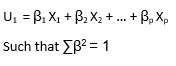](https://3.bp.blogspot.com/-vFggXtE8i3k/WltkDFPjqFI/AAAAAAAACOw/ve6r9aZqK_QJ8ZXLcKkORF3__QMLnJuSgCLcBGAs/s1600/pca1.jpg)

The first PC is having the maximum variance.

Similarly we can find the second PC U2 such that it is **uncorrelated** with U1 and has the second largest variance.

In a similar manner for 'p' features we can have a maximum of 'p' PCs such that all the PCs are uncorrelated with each other and the first PC has the maximum variance, then 2nd PC has the maximum variance and so on.

### **Drawbacks:**

It is to be mentioned that PCR is not a feature selection technique instead it is a feature extraction technique. Each principle component we obtain is a function of all the features. Hence on using principal components one would be unable to explain which factor is affecting the dependent variable to what extent.

### Principal Components Regression in R

We use the longley data set available in R which is used for high multicollinearity. We excplude the Year column.

**> data1 = longley[,colnames(longley) != "Year"]**

View(data)  This is how some of the observations in our dataset will look like:

[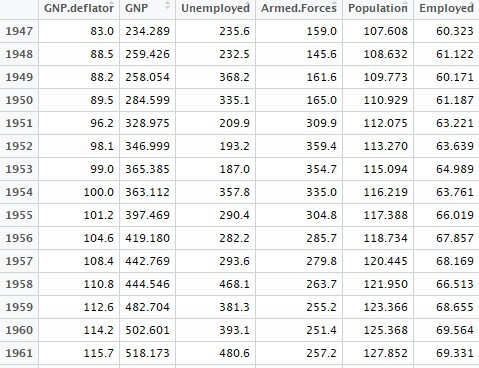](https://4.bp.blogspot.com/-B6eJCR7lOOQ/WltvJ8-LTaI/AAAAAAAACPA/8myMa8mnSPcJLolt2U5u_zNTnYvdph8fgCLcBGAs/s1600/pca2.jpg)

We use **pls package** in order to run PCR.
**> install.packages("pls")
> library(pls)**

In PCR we are trying to estimate the number of Employed people; scale  = T denotes that we are standardizing the variables; validation = "CV" denotes applicability of cross-validation.

**> pcr_model <- pcr(Employed~., data = data1, scale = TRUE, validation = "CV")
> summary(pcr_model)**

We get the summary as:
Data: X dimension: 16 5 Y dimension: 16 1
Fit method: svdpc
Number of components considered: 5
VALIDATION: RMSEP
Cross-validated using 10 random segments.
(Intercept) 1 comps 2 comps 3 comps 4 comps 5 comps
CV 3.627 1.194 1.118 0.5555 0.6514 0.5954
adjCV 3.627 1.186 1.111 0.5489 0.6381 0.5819
TRAINING: % variance explained
1 comps 2 comps 3 comps 4 comps 5 comps
X 72.19 95.70 99.68 99.98 100.00
Employed 90.42 91.89 98.32 98.33 98.74

Here in the RMSEP the root mean square errors are being denoted. While in 'Training: %variance explained' the cumulative % of variance explained by principle components is being depicted. We can see that with 3 PCs more than 99% of variation can be attributed.

We can also create a plot depicting the mean squares error for the number of various PCs.

**> validationplot(pcr_model,val.type = "MSEP")**

[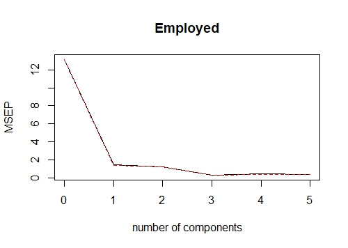](https://3.bp.blogspot.com/-_v_Uv2PL1UQ/WltwxC64CqI/AAAAAAAACPM/qFUihMP8RPM590m466Dm-DHiyRSPEW7RgCLcBGAs/s1600/pca3.jpeg)

By writing **val.type = "R2" **we can plot the R square for various no. of PCs.
**> validationplot(pcr_model,val.type = "R2")**

[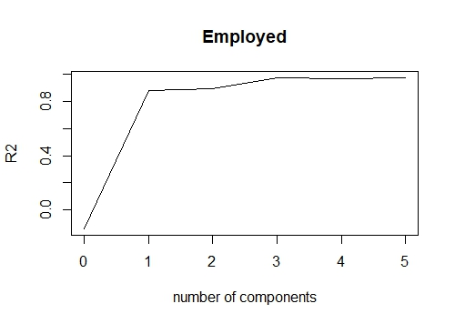](https://4.bp.blogspot.com/-sHy2Oag4RSM/WltxEPdbeSI/AAAAAAAACPQ/hFAfZSVAFsEK_C8ZTNRaxTUIv0lrmsbsQCLcBGAs/s1600/pca4.jpeg)

 If we want to fit pcr for 3 principal components and hence get the predicted values we can write:

**> pred = predict(pcr_model,data1,ncomp = 3)**

**9. Partial Least Squares (PLS) Regression **

It is an alternative technique of principal component regression when you have independent variables highly correlated. It is also useful when there are a large number of independent variables.

**Difference between PLS and PCR**

**> Both techniques create new independent variables called components which are linear combinations of the original predictor variables but PCR creates components to explain the observed variability in the predictor variables, without considering the response variable at all. While PLS takes the dependent variable into account, and therefore often leads to models that are able to fit the dependent variable with fewer components.**

**PLS Regression in R**
**> library(plsdepot)
> data(vehicles)
> pls.model = plsreg1(vehicles[, c(1:12,14:16)], vehicles[, 13], comps = 3)
> # R-Square
> pls.model$R2**

**10. Support Vector Regression**

Support vector regression can solve both linear and non-linear models. SVM uses non-linear kernel functions (such as polynomial) to find the optimal solution for non-linear models.

The main idea of SVR is to minimize error, individualizing the hyperplane which maximizes the margin.

**> library(e1071)
> svr.model <- svm(Y ~ X , data)
> pred <- predict(svr.model, data)
> points(data$X, pred, col = "red", pch=4)**

**11. Ordinal Regression**

Ordinal Regression is used to **predict ranked values**. In simple words, this type of regression is suitable when dependent variable is ordinal in nature. **Example of ordinal variables -** Survey responses (1 to 6 scale), patient reaction to drug dose (none, mild, severe).

**Why we can't use linear regression when dealing with ordinal target variable?**

In linear regression, the dependent variable assumes that changes in the level of the dependent variable are equivalent throughout the range of the variable. For example, the difference in weight between a person who is 100 kg and a person who is 120 kg is 20kg, which has the same meaning as the difference in weight between a person who is 150 kg and a person who is 170 kg. These relationships do not necessarily hold for ordinal variables.

**> library(ordinal)
> o.model <- clm(rating ~ ., data = wine)
> summary(o.model)**

**12. Poisson Regression**

Poisson regression is used **when dependent variable has count data**.

**Application of Poisson Regression -**

1. Predicting the number of calls in customer care related to a particular product

2. Estimating the number of emergency service calls during an event
The dependent variable must meet the following conditions
1. The dependent variable has a Poisson distribution.
2. Counts cannot be negative.
3. This method is not suitable on non-whole numbers

In the code below, we are using dataset named warpbreaks which shows the number of breaks in Yarn during weaving. In this case, the model includes terms for wool type, wool tension and the interaction between the two.

**> pos.model<-glm(breaks~wool*tension, data = warpbreaks, family=poisson)
> summary(pos.model)**

13. Negative Binomial Regression

Like Poisson Regression, it also deals with count data. The question arises "how it is different from poisson regression". The answer is negative binomial regression does not assume distribution of count having variance equal to its mean. While poisson regression assumes the variance equal to its mean.

**> When the variance of count data is greater than the mean count, it is a case of **> overdispersion**> . The opposite of the previous statement is a case of under-dispersion.**

**> library(MASS)
> nb.model <- glm.nb(Days ~ Sex/(Age + Eth*Lrn), data = quine)
> summary(nb.model)**

14. Quasi Poisson Regression

It is an alternative to negative binomial regression. **It can also be used for overdispersed count data. **Both the algorithms give similar results, there are differences in estimating the effects of covariates. The variance of a quasi-Poisson model is a linear function of the mean while the variance of a negative binomial model is a quadratic function of the mean.

**> qs.pos.model <- glm(Days ~ Sex/(Age + Eth*Lrn), data = quine,  family = "quasipoisson")**

Quasi-Poisson regression can handle both over-dispersion and under-dispersion.

15. Cox Regression

Cox Regression is suitable for time-to-event data. See the examples below -
1. Time from customer opened the account until attrition.
2. Time after cancer treatment until death.
3. Time from first heart attack to the second.

**> Logistic regression uses a binary dependent variable but ignores the timing of events. **

As well as estimating the time it takes to reach a certain event, survival analysis can also be used to compare time-to-event for multiple groups.

Dual targets are set for the survival model
1. A continuous variable representing the time to event.
2. A binary variable representing the status whether event occurred or not.
**> library(survival)
> # Lung Cancer Data
> # status:>   > 2=death
> lung$SurvObj <- with(lung, Surv(time, status == 2))
> cox.reg <- coxph(SurvObj ~ age + sex + ph.karno + wt.loss, data =  lung)
> cox.reg**

How to choose the correct regression model?

1. If dependent variable is continuous and model is suffering from collinearity or there are a lot of independent variables, you can try PCR, PLS, ridge, lasso and elastic net regressions. You can select the final model based on Adjusted r-square, RMSE, AIC and BIC.

2. If you are working on count data, you should try poisson, quasi-poisson and negative binomial regression.

3. To avoid overfitting, we can use cross-validation method to evaluate models used for prediction. We can also use ridge, lasso and elastic net regressions techniques to correct overfitting issue.

4. Try support vector regression when you have non-linear model.

#### **R Tutorials : ****[75 Free R Tutorials](https://www.listendata.com/p/r-programming-tutorials.html)**

Love this Post? Spread the Word
 AddThis Sharing Buttons

[Share to FacebookFacebook]()[Share to LinkedInLinkedIn]()[Share to TwitterTwitter]()

Get Free Email Updates :

**Please confirm your email address by clicking on the link sent to your Email**

Related Posts:

- [Web Scraping Website with R](https://www.listendata.com/2018/02/web-scraping-website-with-r.html)
- [Tutorial : Build Webapp in R using Shiny](https://www.listendata.com/2018/02/shiny-tutorial-r.html)
- [Data Visualization in R using ggplot2](https://www.listendata.com/2018/01/data-visualization-in-r-using-ggplot2.html)
- [Run Python from R](https://www.listendata.com/2018/03/run-python-from-r.html)
- [15 Types of Regression you should know](https://www.listendata.com/2018/03/regression-analysis.html)