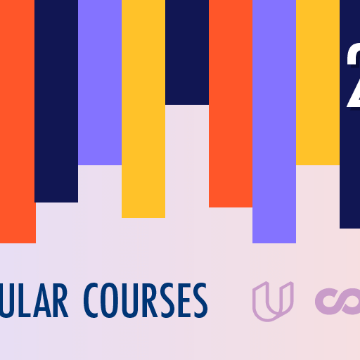

2018's Most Popular Free Online Courses (35 courses) - List by Dhawal Shah

2018's Most Popular Free Online Courses (35 courses) - List by Dhawal Shah

https://www.class-central.com/list/2018-s-most-popular-free-online-courses-wdtww?autoLogin=53c8d593ed1e4db2df8f60955bf03cd6&utm_medium=email&utm_source=product&utm_campaign=most_popular_2018&redirect=https%3A//www.class-central.com/report/new-courses-october-2018/

List of the top enrolled courses from each of the major MOOC platforms: Coursera, edX, Udacity, and FutureLearn.