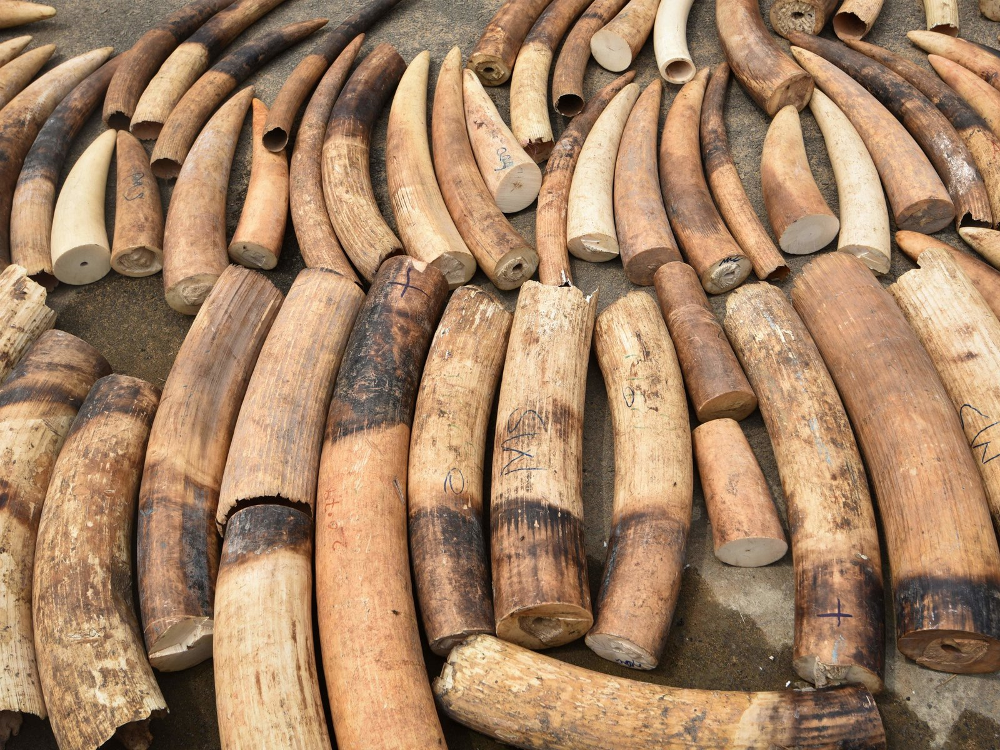

21 Tech Companies Band Together Against Wildlife Trafficking

# 21 Tech Companies Band Together Against Wildlife Trafficking

The companies have formed a coalition to try to stop traffickers from trading in endangered species and items from wildlife such as ivory. ** Sia Kambou/AFP/Getty Images **  ****hide caption****

 ****toggle caption****
Sia Kambou/AFP/Getty Images

Twenty-one top tech companies are banding together to try to stop wildlife traffickers from trading endangered species on their platforms.

The Global Coalition to End Wildlife Trafficking Online, organized by Google and the World Wildlife Fund, was announced Wednesday morning. It includes companies such as Alibaba, Baidu, eBay, Facebook, Instagram and Microsoft, and they're pledging to "work together to collectively reduce wildlife trafficking across platforms by 80% by 2020."

"We've realized that law enforcement on its own can't handle this global surge in illegal trade in wildlife that's happening online and we recognize that the companies themselves are very keen to try and help solve the problem," said Crawford Allan, senior director of TRAFFIC, a WWF-affiliated wildlife trade monitoring network.

Allan says that getting all of these major players on board is designed to mitigate a major challenge in stemming trafficking: When one company cracks down on illegal activity, traffickers simply move to another platform.

"If you have one weak link in the chain, that's where all of the illegal trade will gravitate towards. It's like the whack-a-mole effect if you like," Allan says. "The important thing is to get the companies to think collectively and surprisingly, in spite of what are traditionally very competitive companies. They realized it's a noncompetitive issue and they stepped up together to help find solutions with us."

There's no one-size-fits-all answer, he says. An e-commerce platform is going to face different challenges than does a social media company. And all the companies are going to have to rapidly change their strategies to keep up with increasingly nimble traffickers who keep shifting tactics.

Some companies are newer to the issue, while others such as eBay have been combating wildlife trafficking on their platform for years.

"We've been fighting this battle for a long time and we're really excited now that other companies are joining us," Mike Carson, eBay's senior manager of global policy and regulatory management, tells NPR. He says he sees global momentum growing on this issue.

He says eBay uses filters looking for keywords associated with wildlife trading, and a team actively looks for new trends to stop them. The company also allows users to flag possible violators and routinely gathers information from experts. It is also working to raise consumer awareness about the problem to try to reduce the number of potential buyers.

"There's never a point where we just say, we figured this out, we've got the policy in place," says Carson. "It's a constant iteration and it involves dedication." He says the coalition allows for the company to learn from others about new technologies.

Part of the battle, Allan says, is persuading companies to apply a consistent policy in their offices across the globe when national laws may vary.

Ivory is perhaps the best-known wildlife product being trafficked. Earlier this year, in another win for conservationists, [China banned the domestic sale](https://www.npr.org/sections/thetwo-way/2018/01/01/574952304/chinas-ban-on-its-domestic-ivory-trade-takes-effect) and processing of ivory. That move closed one of the world's biggest ivory markets.

But beyond ivory, there are "many kinds of wildlife being sold online," says Allan, who says he has seen live animals such as cheetah cubs and rare iguanas. He adds that the most trafficked mammal is the endangered pangolin, a kind of scaly anteater used for its meat, scales and leather.

These are the companies that are part of the anti-trafficking coalition: Alibaba, Baidu, Baixing, eBay, Etsy, Facebook, Google, Huaxia Collection, Instagram, Kuaishou, Mall for Africa, Microsoft, Pinterest, Qyer, Ruby Lane, Shengshi Collection, Tencent, Wen Wan Tian Xia, Zhongyikupai, Zhuanzhuan and 58 Group.