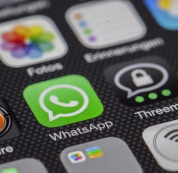

29 of the Best Flipped Classroom Apps for High School Teachers - The Tech Edvocate

29 of the Best Flipped Classroom Apps for High School Teachers - The Tech Edvocate

https://www.thetechedvocate.org/29-best-flipped-classroom-apps-high-school-teachers/?utm_medium=email&utm_source=other&utm_campaign=opencourse.GdeNrll1EeSROyIACtiVvg.announcements~opencourse.GdeNrll1EeSROyIACtiVvg.ZM4ea3X_Eei4MwpIs-gzUg

Spread the loveAt last count, there were over 80,000 educational apps available to teachers. There are apps for everything: literacy, STEM, productivity, audiovisual, etc. There are apps which improve accessibility for students with different learning challenges, i.e. text to voice, voice to text, etc. While many of these may be a dream come true for educators, the dizzying array of choices is also a nightmare. Teachers just don’t have time to filter through thousands of apps to find the one that works be