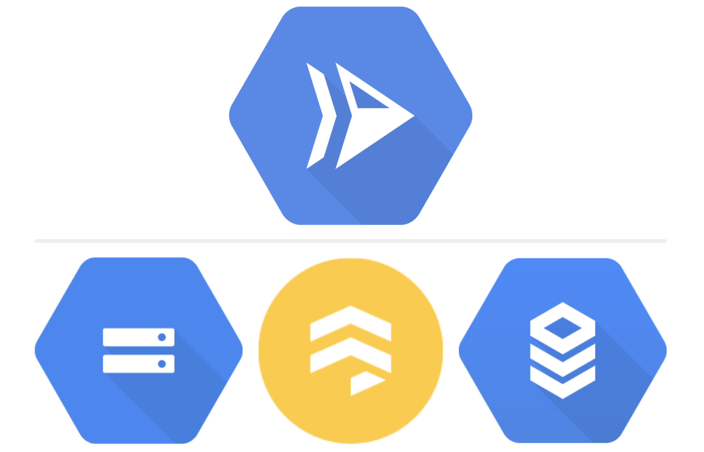

3 Great Options for Persistent Storage with Cloud Run

# 3 Great Options for Persistent Storage with Cloud Run

[Grant Timmerman](https://medium.com/@granttimmerman?source=post_page-----f1581ee05164----------------------)

[Jan 13](https://medium.com/google-cloud/3-great-options-for-persistent-storage-with-cloud-run-f1581ee05164?source=post_page-----f1581ee05164----------------------) · 2 min read

Cloud Run with Cloud Storage, Cloud Firestore, and Cloud SQL

Cloud Run is a managed compute platform that automatically scales your **stateless containers**. Cloud Run is serverless: it abstracts away all infrastructure management, so you can focus on what matters most — building great applications.

However, most applications are **stateful**. As a developer, how can you permanently store images, database records, and other pieces of data?

In this article, we’ll discuss 3 example ways in which you can store data on Google Cloud Platform with Cloud Run.

# Storage with Google Cloud

There are a variety of ways to store data on Google Cloud, depending on your application’s needs. In this imaginary application, let’s create a e-commerce shoe store. Here are three storage options we’ll use for storing different kinds of data:

## Cloud Storage

For storing **files/objects **such as images and video, or archival backups, [Google Cloud Storage](https://cloud.google.com/storage/docs) is an excellent option for this type of data. Here’s an example code snippet in Node that can be used with Cloud Run:

|     |     |
| --- | --- |
| 1   | // Imports the Google Cloud client library |
| 2   | const  {Storage}  =  require('@google-cloud/storage'); |
| 3   |     |
| 4   | // Creates a client |
| 5   | const  storage  =  new  Storage(); |
| 6   |     |
| 7   | async  function  uploadFile(req,  res)  { |
| 8   |  // Uploads a local file to the bucket |
| 9   |  await  storage.bucket(res.query.bucket).upload(req.query.filename,  { |
| 10  |  // Support for HTTP requests made with `Accept-Encoding: gzip` |
| 11  |  gzip: true, |
| 12  |  // By setting the option `destination`, you can change the name of the |
| 13  |  // object you are uploading to a bucket. |
| 14  |  metadata: { |
| 15  |  // Enable long-lived HTTP caching headers |
| 16  |  // Use only if the contents of the file will never change |
| 17  |  // (If the contents will change, use cacheControl: 'no-cache') |
| 18  |  cacheControl: 'public, max-age=31536000', |
| 19  |  }, |
| 20  |  }); |
| 21  |     |
| 22  |  console.log(`${filename} uploaded to ${bucket}.`); |
| 23  | }   |

 [view raw](https://gist.github.com/grant/62edeae5ffdb5f6ca328209f54f948ab/raw/7b277172a355083db01076a08cff42ec0b092ecf/index.js)  [index.js](https://gist.github.com/grant/62edeae5ffdb5f6ca328209f54f948ab#file-index-js) hosted with ❤ by [GitHub](https://github.com/)

Uploading a file to Google Cloud Storage

## Cloud Firestore

For storing **unstructured** data, or creating a flexible, NoSQL, cloud database, [Cloud Firestore](https://firebase.google.com/docs/firestore) is a great solution for mobile, web, and server development. In this sample, we want to store flexible JSON objects for shoe data:

|     |     |
| --- | --- |
| 1   | // Create a Firebase client |
| 2   | const  admin  =  require('firebase-admin'); |
| 3   | admin.initializeApp({ |
| 4   |  credential: admin.credential.applicationDefault() |
| 5   | }); |
| 6   |     |
| 7   | const  db  =  admin.firestore(); |
| 8   | async  function  uploadDoc(req,  res)  { |
| 9   |  // Create a reference to the shoes doc. |
| 10  |  let  shoesDoc  =  db.collection('products').doc('shoes'); |
| 11  |  // Add a shoe |
| 12  |  shoesDoc.set({ |
| 13  |  name: 'gshoe', |
| 14  |  size: 11.5, |
| 15  |  colors: ['blue',  'red',  'yellow',  'green'] |
| 16  |  }); |
| 17  | }); |

 [view raw](https://gist.github.com/grant/22e37ee1534271208d83007aba69db39/raw/1aad42dbe3210295cefedfb000fa3d07074dbba1/index.js)  [index.js](https://gist.github.com/grant/22e37ee1534271208d83007aba69db39#file-index-js) hosted with ❤ by [GitHub](https://github.com/)

Adding a doc/JSON record to Firestore

## Cloud SQL

For storing **structured** data in a RDBMS, such as MySQL, PostgreSQL, and SQL Server, [Cloud SQL](https://cloud.google.com/sql/) can connect to a nice interface for storing and querying your data. Here created a customer table where we can use familiar SQL to create powerful queries:

|     |     |
| --- | --- |
| 1   | const  mysql  =  require('promise-mysql'); |
| 2   |     |
| 3   | // Create a pooled connection to MySQL |
| 4   | let  pool; |
| 5   | const  createPool  =  async  ()  =>  { |
| 6   |  pool  =  await  mysql.createPool({ |
| 7   |  user: process.env.DB_USER,  // e.g. 'my-db-user' |
| 8   |  password: process.env.DB_PASS,  // e.g. 'my-db-password' |
| 9   |  database: process.env.DB_NAME,  // e.g. 'my-database' |
| 10  |  // If connecting via unix domain socket, specify the path |
| 11  |  socketPath: `/cloudsql/${process.env.CLOUD_SQL_CONNECTION_NAME}`, |
| 12  |  // If connecting via TCP, enter the IP and port instead |
| 13  |  // host: 'localhost', |
| 14  |  // port: 3306, |
| 15  |     |
| 16  |  //... |
| 17  |  }); |
| 18  | };  |
| 19  | createPool(); |
| 20  |     |
| 21  | async  function  readCustomers(req,  res)  { |
| 22  |  // Get the 5 newest customers. |
| 23  |  const  customers  =  await  pool.query( |
| 24  |  'SELECT id, name FROM customers ORDER BY id DESC LIMIT 5' |
| 25  |  ); |
| 26  |  res.send({ customers }); |
| 27  | }   |

 [view raw](https://gist.github.com/grant/5b841fbbff9775228d56ba27c6727830/raw/89c7f9b1070ddeb10383d48434015d95d13578cd/index.js)  [index.js](https://gist.github.com/grant/5b841fbbff9775228d56ba27c6727830#file-index-js) hosted with ❤ by [GitHub](https://github.com/)

Reading from a Cloud SQL table

> Note: See > [*> Connecting to Cloud SQL from Cloud Run (fully managed)*](https://cloud.google.com/sql/docs/mysql/connect-run)>  for full documentation on how to connect and use these services together.

Those are 3 storage options for storing data in GCP. Other products include [Cloud Filestore](https://cloud.google.com/filestore/), [Cloud Storage for Firebase](https://firebase.google.com/docs/storage), and [Cloud Memorystore](http://cloud%20memorystore/) among [other databases](https://cloud.google.com/products/databases/).

# Other Tips

Sometimes your data storage could use more configuration. Here are two tips:

- Cloud Run’s **“Max Instances”** feature can limit the number of instances handling running your service. This, in turn, can rate limit the number of requests to your storage service. [Read more](https://cloud.google.com/run/docs/configuring/max-instances).
- **Cloud Tasks** with rate limits per queue can be placed in front of a Cloud Run service to smooth out rapid or jerky requests. [Read more](https://cloud.google.com/tasks/).

# References

Thanks for reading. If you are looking for more reading about storing data with GCP, are some links:

- [Solution: Google Cloud’s Data Management Products](http://cloud.google.com/solutions/data-management)
- [Tutorial: Processing Images with Cloud Run and Cloud Storage](https://cloud.google.com/run/docs/tutorials/image-processing)