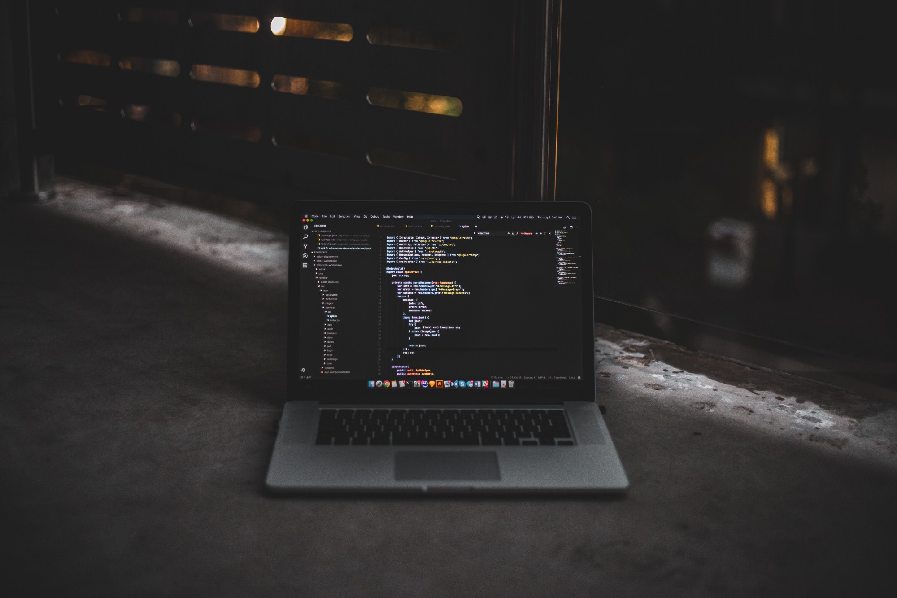
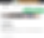
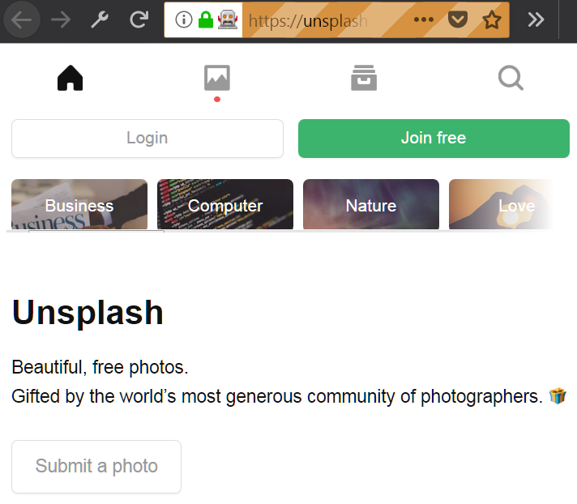

30-minute Python Web Scraper – Hacker Noon

# 30-minute Python Web Scraper

I’ve been meaning to create a web scraper using Python and [Selenium](http://www.seleniumhq.org/) for a while now, but never gotten around to it. A few nights ago, I decided to give it a spin. Daunting as it may have seemed, it was extremely easy to write the code to grab some beautiful images from [Unsplash](https://unsplash.com/).

Image credit: [Blake Connally](https://unsplash.com/@blakeconnally) via [Unsplash.com](https://unsplash.com/photos/B3l0g6HLxr8)

#### Ingredients for a simple Image Scraper

- •[Python](https://www.python.org/downloads/) (3.6.3 or newer)
- •[Pycharm](https://www.jetbrains.com/pycharm/download/#section=windows) (Community edition is just fine)
- •`pip install [requests](http://docs.python-requests.org/en/master/user/install/#install) [Pillow](https://pillow.readthedocs.io/en/latest/installation.html#basic-installation) [selenium](http://selenium-python.readthedocs.io/installation.html#downloading-python-bindings-for-selenium)`
- •[geckodriver](https://github.com/mozilla/geckodriver/releases/latest) (read below for instructions)
- •[Mozlla Firefox](https://www.mozilla.org/en-US/firefox/new/) (as if you didn’t have it installed)
- •Working internet connection (obviously)
- •30 minutes of your time (possibly less)

#### Recipe for a simple Image Scraper

Got everything installed and ready? Good! I’ll explain what each of these ingredients does, as we move forward with our code.

The first thing we’ll be utilizing is the **Selenium webdriver** combined with **geckodriver** to open a browser window that does our job for us. To get started, create a project in **Pycharm**, download the latest version of geckodriver for you operation system, open the compressed file and drag & drop the geckodriver file into your project’s folder. Geckodriver is basically what lets Selenium get control of Firefox, so we need it in our project folder to be able to utilize the browser.

Next thing we want to be doing is to actually import the webdriver from Selenium into our code and connect to the URL we want. So let’s do just that:

|     |     |
| --- | --- |
| 1   | from selenium import webdriver |
| 2   | # The URL we want to browse to |
| 3   | url =  "https://unsplash.com" |
| 4   | # Using Selenium's webdriver to open the page |
| 5   | driver = webdriver.Firefox(executable_path=r'geckodriver.exe') |
| 6   | driver.get(url) |

 [view raw](https://gist.github.com/Chalarangelo/2dafc6379d6f893e83740160928abfef/raw/f70389a4e3c67affb267baa4c55c82f45d782272/unscrape.py)  [unscrape.py](https://gist.github.com/Chalarangelo/2dafc6379d6f893e83740160928abfef#file-unscrape-py) hosted with ❤ by [GitHub](https://github.com/)

Opening a new browser window to a specific URL

A remote-controlled Firefox window

Pretty easy, huh? If you’ve done everything correctly, you are over the hard part already and you should see a browser window similar to the one shown in the above image.

Next up, we should **scroll down** so that more images can be loaded before we get to download them. We also want to **wait a few seconds**, just in case the connection is slow and the images have not fully loaded. As Unsplash is built with React, waiting for about 5 seconds seems like a generous timeframe, so we should do just that, using the `time` package. We also want to use some Javascript code to scroll the page — we will be using `[window.scrollTo()](https://developer.mozilla.org/en-US/docs/Web/API/Window/scrollTo)` to accomplish this. Putting it all together, you should end up with something like this:

|     |     |
| --- | --- |
| 1   | import time |
| 2   | from selenium import webdriver |
| 3   |     |
| 4   | url =  "https://unsplash.com" |
| 5   |     |
| 6   | driver = webdriver.Firefox(executable_path=r'geckodriver.exe') |
| 7   | driver.get(url) |
| 8   | # Scroll page and wait 5 seconds |
| 9   | driver.execute_script("window.scrollTo(0,1000);") |
| 10  | time.sleep(5) |

 [view raw](https://gist.github.com/Chalarangelo/6f05ffc8171a505ec55a35e413002bed/raw/80b40ec1de9db61d42e0d22a683945da99e6c937/unscrape.py)  [unscrape.py](https://gist.github.com/Chalarangelo/6f05ffc8171a505ec55a35e413002bed#file-unscrape-py) hosted with ❤ by [GitHub](https://github.com/)

Scrolling the page and waiting 5 seconds

After testing the above code, you should see the browser scroll down the page a little bit. The next thing we need to be doing is finding the images we want to downalod from the website. After digging around in the code React generates, I figured out that we can use a **CSS selector** to specifically target the images in the gallery of the page. The specific layout and code of the page might change in the future, but at the time of writing I could use a `#gridMulti img` selector to get all the `` elements that were appearing on my screen.

We can get a list of these elements using `[find_elements_by_css_selector()](http://selenium-python.readthedocs.io/api.html#selenium.webdriver.remote.webdriver.WebDriver.find_element_by_css_selector)`, but what we want is the `src` attribute of each element. So, we can iterate over the list and grab those:

|     |     |
| --- | --- |
| 1   | import time |
| 2   | from selenium import webdriver |
| 3   |     |
| 4   | url =  "https://unsplash.com" |
| 5   |     |
| 6   | driver = webdriver.Firefox(executable_path=r'geckodriver.exe') |
| 7   | driver.get(url) |
| 8   |     |
| 9   | driver.execute_script("window.scrollTo(0,1000);") |
| 10  | time.sleep(5) |
| 11  | # Select image elements and print their URLs |
| 12  | image_elements = driver.find_elements_by_css_selector("#gridMulti img") |
| 13  | for image_element in image_elements: |
| 14  | image_url = image_element.get_attribute("src") |
| 15  |  print(image_url) |

 [view raw](https://gist.github.com/Chalarangelo/50818a3f9e3c13aaf52297d41f79f987/raw/93620a88a693b63f569e12d8ad4d9b8c859b1597/unscrape.py)  [unscrape.py](https://gist.github.com/Chalarangelo/50818a3f9e3c13aaf52297d41f79f987#file-unscrape-py) hosted with ❤ by [GitHub](https://github.com/)

Selecting image elements and getting the images’ URLs

Now, to actually get the images we found. For this, we will use `requests` and part of the `PIL` package, namely `Image`. We also want to use `BytesIO` from `io` to write the images to a `./images/` folder that we will create inside our project folder. So, to put this all together, we need to send an **HTTP GET request** to the URL of each image and then, using `Image` and `BytesIO`, we will **store the image** that we get in the response. Here’s one way to do this:

|     |     |
| --- | --- |
| 1   | import requests |
| 2   | import time |
| 3   | from selenium import webdriver |
| 4   | from  PIL  import Image |
| 5   | from io import BytesIO |
| 6   |     |
| 7   | url =  "https://unsplash.com" |
| 8   |     |
| 9   | driver = webdriver.Firefox(executable_path=r'geckodriver.exe') |
| 10  | driver.get(url) |
| 11  |     |
| 12  | driver.execute_script("window.scrollTo(0,1000);") |
| 13  | time.sleep(5) |
| 14  | image_elements = driver.find_elements_by_css_selector("#gridMulti img") |
| 15  | i =  0 |
| 16  |     |
| 17  | for image_element in image_elements: |
| 18  | image_url = image_element.get_attribute("src") |
| 19  |  # Send an HTTP GET request, get and save the image from the response |
| 20  | image_object = requests.get(image_url) |
| 21  | image = Image.open(BytesIO(image_object.content)) |
| 22  | image.save("./images/image"  +  str(i) +  "."  + image.format, image.format) |
| 23  | i +=  1 |

 [view raw](https://gist.github.com/Chalarangelo/ec5c8bed17396e8e55cf3305dbb88f56/raw/e97a4c44d221ecc8e116cca02e19d7052fc34f76/unscrape.py)  [unscrape.py](https://gist.github.com/Chalarangelo/ec5c8bed17396e8e55cf3305dbb88f56#file-unscrape-py) hosted with ❤ by [GitHub](https://github.com/)

Downloading the images

That’s pretty much all you need to get a bunch of free images downloaded. Obviously, unless you want to prototype a design and you just need random images, this little scraper isn’t of much use. So, I took some time to improve it, by adding a few more features:

- •Command line arguments that allow the user to specify a **search query**, as well as a numeric value for scrolling, which allows the page to display more images for downloading.
- •Customizable CSS selector.
- •Customized **result folders**, based on search queries.
- •Full **HD images** by cropping the URL of the thumbnails, as necessary.
- •Named images, based on their URLs.
- •Closing the browser window at the end of the process.

You can (and probably should) try implementing some of these features on your own. The full-featured version of the web scraper is available [here](https://github.com/Chalarangelo/unscrape). Remember to download [geckodriver](https://github.com/mozilla/geckodriver/releases/latest) separately and connect it to your project, as instructed at the start of the article.