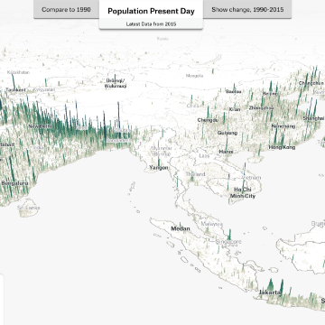

3D mapping global population density: How I built it

3D mapping global population density: How I built it

https://blog.mapbox.com/3d-mapping-global-population-density-how-i-built-it-141785c91107

By: Matt Daniels