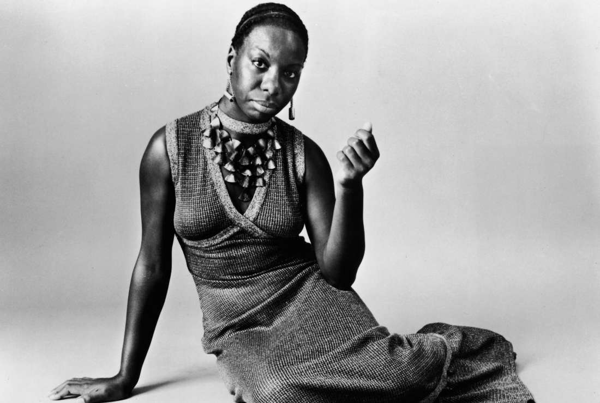
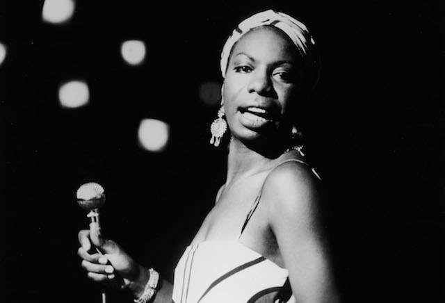
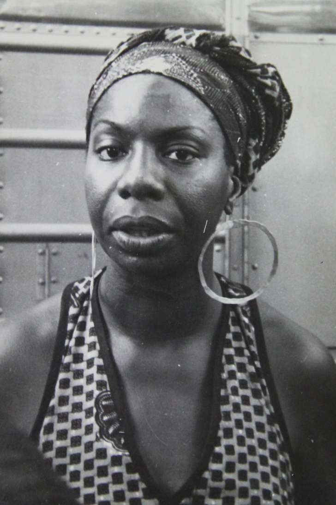
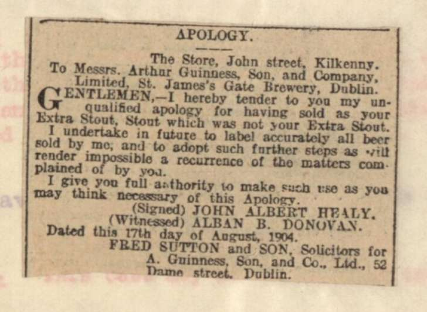
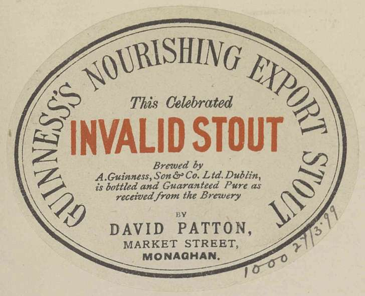
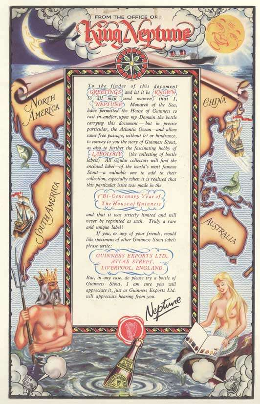

4 Reasons to Write by Hand Rather Than Type

# 4 Reasons to Write by Hand Rather Than Type

[BY Shaunacy Ferro](http://mentalfloss.com/authors/63379/Shaunacy-Ferro)

April 5, 2016

iStock

Once you leave school, there’s rarely a need to write by hand. Work correspondence happens on computers, as does social networking. Except for the occasional grocery list, there’s no particular need to break out your messy handwriting; typing is so much more efficient, right? But there are proven benefits to writing by hand. Here are four reasons you should dust off that pen and paper:

#### 1. IT ACTIVATES THE BRAIN.

A [2012 study](http://www.sciencedirect.com/science/article/pii/S2211949312000038) of children who couldn’t yet read found that writing letters by hand activated a circuit of neurons in the brain associated with reading. Tracing or typing the same letter, however, did not. This extra processing in the brain regions associated with literacy “may facilitate reading acquisition in young children,” the researchers write.

#### 2. IT IMPROVES SPELLING.

A [1990 study](http://psycnet.apa.org/journals/edu/82/1/159/) found that having kids write words out improved their spelling abilities compared to typing on a computer.

#### 3. IT HELPS YOU REMEMBER.

A [2014 study](http://pss.sagepub.com/content/early/2014/04/22/0956797614524581.abstract) that compared the memories of university students who took handwritten notes to those who took notes on laptops found that writing longhand better helps you learn new information. Those who wrote out their notes processed more of what was being said during their lectures, probably because they had to condense information to keep up, rather than mindlessly type the speaker’s words verbatim. In subsequent tests, handwriters recalled information from the lectures better than typists.

#### 4. IT HELPS YOU THINK FASTER.

In a 2009 study of elementary and middle school kids, students writing by hand were found to write more, and more quickly, than those who typed on a keyboard. “Children consistently did better writing with a pen when they wrote essays,” the study’s author, psychologist Virginia Berninger, said in a [press release](http://www.washington.edu/news/2009/09/16/the-pen-may-be-mightier-than-the-keyboard/) at the time.

arrow

entertainment

13 Fascinating Facts About Nina Simone

BY Khalea Underwood

February 21, 2018

Hulton Archive/Getty Images

Nina Simone, who would’ve celebrated her 85th birthday today, was known for using her musical platform to speak out. “I think women play a major part in opening the doors for better understanding around the world,” the “Strange Fruit” songstress once said. Though she chose to keep her personal life shrouded in secrecy, these facts grant VIP access into a life well-lived and the music that still lives on.

#### 1. NINA SIMONE WAS HER STAGE NAME.

The singer was born as Eunice Waymon on February 21, 1933. But by age 21, the North Carolina native was going by a different name at her nightly Atlantic City gig: Nina Simone. She hoped that adopting a different name would keep her mother from [finding out](http://www.essence.com/2015/06/26/netflix-nina-simone-documentary-why-watch) about her performances. “Nina” was her boyfriend’s [nickname](https://books.google.com/books?id=YAU1r9N8vooC&pg=PA49&lpg=PA49&dq=nina+simone+%22little+one%22+boyfriend&source=bl&ots=SWuYqXJTL6&sig=rQtFNwE5-aZ87GP8i0YEsGcFhGo&hl=en&sa=X&ved=0ahUKEwiXmKbK9ojLAhWFyT4KHaPQCekQ6AEINjAF#v=onepage&q=nina%20simone%20%22little%20one%22%20boyfriend&f=false) for her at the time. “Simone” was [inspired](http://articles.latimes.com/2003/apr/22/local/me-simone22/2) by Simone Signoret, an actress that the singer admired.

#### 2. SHE HAD HUMBLE BEGINNINGS.

Getty Images

There's a reason that much of the singer's music had gospel-like sounds. Simone—the daughter of a Methodist minister and a handyman—was raised in the church and started playing the piano by ear [at age 3](http://www.ninasimone.com/bio/). She got her start in her hometown of Tryon, North Carolina, where she played gospel hymns and classical music at Old St. Luke’s CME, the church where her mother ministered. After Simone died on April 21, 2003, she was memorialized at the same sanctuary.

#### 3. SHE WAS BOOK SMART...

Simone, who graduated valedictorian of her high school class, studied at the prestigious Julliard School of Music for a brief period of time before applying to Philadelphia’s Curtis Institute of Music. Unfortunately, Simone was denied admission. For years, she maintained that her race was the reason behind the rejection. But a Curtis faculty member, Vladimir Sokoloff, has gone on record to say that her skin color wasn’t a factor. “It had nothing to do with her…background,” [he said](http://articles.philly.com/2015-08-17/news/65525609_1_eunice-waymon-curtis-piano-faculty-nina-simone) in 1992. But Simone ended up getting the last laugh: Two days before her death, the school awarded her an [honorary degree](http://www.dazeddigital.com/artsandculture/article/25222/1/five-things-you-never-knew-about-nina-simone).

#### 4. ... WITH DEGREES TO PROVE IT.

Simone—who [preferred](http://www.newyorker.com/magazine/2014/08/11/raised-voice) to be called “doctor Nina Simone”—was also awarded two other honorary degrees, from the University of Massachusetts Amherst and Malcolm X College.

#### 5. HER CAREER WAS ROOTED IN ACTIVISM.

Gerrit de Bruin

At the age of 12, Simone [refused](http://www.dazeddigital.com/artsandculture/article/25222/1/five-things-you-never-knew-about-nina-simone) to play at a church revival because her parents had to sit at the back of the hall. From then on, Simone used her art to take a stand. Many of her songs in the '60s, including “Mississippi Goddamn,” “Why (The King of Love Is Dead),” and “Young, Gifted and Black,” addressed the rampant racial injustices of that era.

Unfortunately, her activism wasn't always welcome. Her popularity diminished; venues didn’t invite her to perform, and radio stations didn’t play her songs. But she pressed on—even after the Civil Rights Movement. In 1997, Simone told *Interview Magazine* that she addressed her songs to the third world. In her [own words](http://webcache.googleusercontent.com/search?q=cache:qB_HW_17_GwJ:boscarol.com/ninasimone/pages/nina/interviews/interview1997.html): “I’m a real rebel with a cause.”

#### 6. ONE OF HER MOST FAMOUS SONGS WAS BANNED.

“[Mississippi Goddam](https://www.youtube.com/watch?v=fVQjGGJVSXc),” her 1964 anthem, only took her 20 minutes to an hour to write, according to[legend](http://www.theatlantic.com/entertainment/archive/2015/06/nina-simone-and-mississippi-goddam/396923/)—but it made an impact that still stands the test of time. When she wrote it, Simone had been [fed up](http://www.newstatesman.com/music/2010/03/mississippi-goddam-nina-simone) with the country’s racial unrest. Medger Evers, a Mississippi-born civil rights activist, was assassinated in his home state in 1963. That same year, the Ku Klux Klan bombed a Birmingham Baptist church and as a result, four young black girls were killed. Simone took to her notebook and piano to express her sentiments.

“Alabama's gotten me so upset/Tennessee made me lose my rest/And everybody knows about Mississippi Goddam,” she sang.

Some say that the song was banned in Southern radio stations because “goddam” was in the title. But others argue that the subject matter is what caused the stations to return the records [cracked](http://www.theatlantic.com/entertainment/archive/2015/06/nina-simone-and-mississippi-goddam/396923/) in half.

#### 7. SHE NEVER HAD A NUMBER ONE HIT.

Nina Simone released over 40 albums during her decades-spanning career including studio albums, live versions, and compilations, and scored 15 Grammy nominations. But her highest-charting (and her first) hit, “I Loves You, Porgy,” peaked at[ #2](https://books.google.com/books?id=UbPqCQAAQBAJ&pg=PT288&lpg=PT288&dq=%22I+Loves+You,+Porgy%22+nina+simone+%22number+two%22+charts&source=bl&ots=89why82lQ6&sig=38g7ZciFFx5Q3ZMpkRlhksTfiE8&hl=en&sa=X&ved=0ahUKEwikwJyt-4fLAhULWj4KHdXDBuoQ6AEIKjAD#v=onepage&q=%22I%20Loves%20You%2C%20Porgy%22%20nina%20simone%20%22number%20two%22%20charts&f=false) on the U.S. R&B charts in 1959. Still, her music would go on to influence legendary singers like Roberta Flack and Aretha Franklin.

#### 8. SHE USED HER STYLE TO MAKE A STATEMENT.

Head wraps, bold jewelry, and floor-skimming sheaths were all part of Simone’s stylish rotation. In 1967, she wore the same black crochet fishnet jumpsuit with flesh-colored lining for the entire year. Not only did it give off the illusion of her being naked, but “I wanted people to remember me looking a certain way,” [she said](http://blankonblank.org/interviews/nina-simone-shock-feeling-good-daughter-martin-luther-king-aint-got-no/). “It made it easier for me.”

#### 9. SHE HAD MANY HOMES.

New York City, Liberia, Barbados, England, Belgium, France, Switzerland, and the Netherlands were all [places](http://webcache.googleusercontent.com/search?q=cache:0A6bGVtNGOwJ:www.ninasimone.com/bio/+&cd=3&hl=en&ct=clnk&gl=us&client=safari) that Simone called home. She died at her home in Southern France, and her ashes were [scattered](http://news.bbc.co.uk/2/hi/entertainment/2975871.stm) in several African countries.

#### 10. SHE HAD A FAMOUS INNER CIRCLE.

During the late '60s, Simone and her second husband Andrew Stroud [lived](http://www.biography.com/news/nina-simone-movie-netflix-doc) next to Malcolm X and his family in Mount Vernon, New York. He wasn't her only famous pal. Simone was very close with playwright Lorraine Hansberry. After Hansberry’s death, [Simone penned](http://www.newyorker.com/magazine/2014/08/11/raised-voice) “To Be Young, Gifted and Black” in her honor, a tribute to Hansberry's play of the same title. Simone even struck up a brief friendship with David Bowie in the mid-1970s, who called her every night [for a month](http://time.com/4176079/david-bowie-nina-simone/) to offer his advice and support.

#### 11. YOU CAN STILL VISIT SIMONE IN HER HOMETOWN.

Amazing Nina Documentary Film, LLC, [CC BY-SA 4.0](https://creativecommons.org/licenses/by-sa/4.0), [Wikimedia Commons](https://commons.wikimedia.org/w/index.php?curid=57892739)

In 2010, an 8-foot [sculpture](http://docsouth.unc.edu/commland/monument/341/) of Eunice Waymon was erected in her hometown of Tryon, North Carolina. Her likeness stands tall in Nina Simone Plaza, where she’s seated and playing an eternal song on a keyboard that floats in midair. Her daughter, Lisa Simone Kelly, gave sculptor Zenos Frudakis some of Simone’s ashes to weld into the sculpture’s bronze heart. "It's not something very often done, but I thought it was part of the idea of bringing her home," [Frudakis said](http://www.goupstate.com/article/20100221/articles/2211057).

#### 12. YOU'VE PROBABLY HEARD HER MUSIC IN RECENT HITS.

Rihanna sang a few verses of Simone’s “Do What You Gotta Do” on Kanye West’s *The Life of Pablo*. He’s clearly a superfan: “Blood on the Leaves” and his duet with Jay Z, “New Day,” feature Simone samples as well, along with Lil’ Wayne’s “Dontgetit,” Common’s “Misunderstood” and a host of other tracks.

#### 13. HER MUSIC IS STILL BEING PERFORMED.

*Nina Revisited… A Tribute to Nina Simone* was [released](http://webcache.googleusercontent.com/search?q=cache:qB_HW_17_GwJ:boscarol.com/ninasimone/pages/nina/interviews/interview1997.html) along with the Netflix documentary in 2015. On the album, Lauryn Hill, Jazmine Sullivan, Usher, Alice Smith, and more paid tribute to the legend by performing covers of 16 of her most famous tracks.

Guinness has been a staple in Irish pubs for nearly 260 years. With so much history, it's no surprise that the Guinness Storehouse Archives—which are [open](https://www.guinness-storehouse.com/en/archives) to the public—are stuffed with intriguing artifacts that tell some pretty wild stories. Here are a few.

#### 1. THE LEASE TO THE DUBLIN BREWERY WAS INTENDED TO LAST 9000 YEARS.

In 1759, founder Arthur Guinness signed a lease for a four-acre property at St. James’s Gate in Dublin. The lease required a down payment of £100, an annual rent of £45, and a term of 9000 years (not a typo). Such lengthy leases were relatively common back then: “At the time in Ireland, there was a lot of instability to do with land tenure,” explains Fergus Brady, Archives Manager at Guinness. Centuries earlier, the British had begun confiscating land from native Irish in an effort to build [plantations](https://www.ncas.rutgers.edu/center-study-genocide-conflict-resolution-and-human-rights/16th-17th-century-plantation-ireland), and extra-long leases were a means of avoiding this fate. As Brady explains, “You see these really long leases: 99-year or 999-year leases. It seemed to be a legal custom at the time that they used the number nine.”

#### 2. ARTHUR GUINNESS WAS NOT AFRAID TO DEFEND HIS PROPERTY WITH A PICKAXE.

In 1775, the Dublin Corporation—that is, the city government—demanded that Arthur Guinness pay for the spring water flowing to his brewery. When Guinness argued that he was already paying for water rights through his 9000-year rental agreement, the Dublin Corporation sent a sheriff and a committee to his brewery to cut off the water supply. Guinness was livid. He seized a [pickaxe](https://books.google.com/books?id=k6S2i7xgox0C&pg=PA37&dq=Guinness+9000+year+lease&hl=en&sa=X&ved=0ahUKEwjgrqivqPHYAhWymuAKHUlkDgMQ6AEINTAC#v=onepage&q=Guinness%209000%20year%20lease&f=false) and unleashed a torrent of obscenities so colorful that the Dublin Corporation’s goons eventually retreated.

#### 3. GUINNESS ONCE DEPLOYED FIELD AGENTS TO CATCH COUNTERFEITERS.

Guinness Archive, Diageo Ireland

In the 19th century, there was no such thing as brand consistency. Guinness did not bottle its own beer; instead, it shipped the suds in wooden casks to publicans who supplied their own bottles and applied their own personalized labels. Occasionally, these publicans sold fake or adulterated Guinness. To prevent such sales, the company sent special agents called “travellers” into the field to collect beer samples, which it tested in a laboratory. “If a publican was found to be serving adulterated or counterfeit Guinness, they had to give a public apology in their local newspaper—and even the national newspapers,” archivist Jessica Handy says.

#### 4. FOR 21 YEARS, THE COMPANY HIRED A GUY TO TRAVEL THE WORLD AND DRINK BEER.

In 1899, Guinness hired an American ex-brewer named Arthur T. Shand to be a “Guinness World Traveller.” It was arguably the coolest job in the world. For 21 years, Shand traveled the world taste-testing beer. According to Brady, “His job was to travel the world and taste Guinness, say whether it was good or bad, who our bottlers in the market were, who our major competition was, what kind of people were drinking our product.” Shand traveled to Australia and New Zealand, to Southeast Asia and Egypt. “He was sort of a Guinness sommelier,” Brady says.

#### 5. THE COMPANY'S HARP LOGO CAUSED TROUBLE WITH THE IRISH GOVERNMENT.

The Celtic harp—based on the 14th century “[Brian Boru Harp](https://dh.tcd.ie/clontarf/The%20Brian%20Boru%20Harp)” preserved at Trinity College—became a trademarked Guinness logo in 1876. Forty-five years later, when Ireland gained independence from England, the Irish Free State decided to use the same Celtic harp as its official state emblem. This became awkward. Guinness owned the trademark, and the Irish government was forced to search for a workaround. You can find their solution on an Irish Euro coin. Look at [the coin](https://en.wikipedia.org/wiki/Irish_euro_coins#/media/File:Eurocoin.ie.100.gif), and you’ll notice that the harp’s straight edge faces the right; meanwhile, the harp on a [glass](https://www.irishcentral.com/roots/history/how-guinness-trademarked-symbol-harp-before-irish-government) of Guinness shows the straight edge facing left [[PDF](https://www.guinness-storehouse.com/Content/pdf/archive-factsheets/advertising/harp_trademark.pdf)].

#### 6. GUINNESS REPORTEDLY SAVED LIVES ON THE BATTLEFIELD.

The old slogan “Guinness is good for you” sounds like a marketing gimmick, but it was born out of a genuine belief that the beer was, in fact, a restorative tonic. The health claim dates back to 1815, when an ailing cavalry officer wounded at the Battle of Waterloo reportedly credited Guinness for his recovery. For decades, the medical community [widely](https://books.google.com/books?id=mCPXkFWvabAC&pg=PA75&dq=beer+for+convalescent&hl=en&sa=X&ved=0ahUKEwiE6LbWn_HYAhWFc98KHYZIA2gQ6AEIOjAD#v=onepage&q=beer%20for%20convalescent&f=false) claimed that the dark beer possessed real health benefits—and they weren’t necessarily wrong. “There was little safe drinking water at the time,” Handy says. “But with brewing, consumers knew they were getting a safe beverage.”

#### 7. THE COMPANY CREATED A SPECIAL RECIPE FOR CONVALESCENTS.

Guinness Archive, Diageo Ireland

From the 1880s to the 1920s, Guinness produced a special “Nourishing Export Stout”—a.k.a. “Invalid Stout”—that contained extra sugars, alcohol, and solids and came in cute one-third pint bottles. “It was very common practice for people to buy a couple bottles and keep them as a tonic, even if it was just a glass or half a glass,” Handy says. In fact, Guinness went as far as asking general practitioners for testimonials attesting to the beer’s medical benefits. According to Brady, “Many of them wrote back and said yes, we prescribe this for various ailments.” One doctor even claimed a pint was “as nourishing as a glass of milk.”

#### 8. DOCTORS REGULARLY PRESCRIBED THE BEER TO NURSING MOTHERS.

From the 1880s to the 1930s, many physicians believed Guinness was an effective galactagogue—that is, a lactation aid. The company sent bottles to hospitals as well as wax cartons of yeast (which supposedly helped skin problems and migraines). Hundreds, possibly thousands, of doctors prescribed the beer for ailments such as influenza, insomnia, and anxiety, David Hughes [writes](https://books.google.com/books?id=_tOZqDtYv9QC&pg=PT50&lpg=PT50&dq=history+of+invalid+stout&source=bl&ots=1WXmHkCgTy&sig=Cn0NP3EFpE1jO7jj01A1ctym_Ls&hl=en&sa=X&ved=0ahUKEwi0ut2Qk_bYAhUChuAKHUI0CAc4ChDoAQhXMAk#v=onepage&q=history%20of%20invalid%20stout&f=false) in *A Bottle of Guinness Please: The Colourful History of Guinness*. According to Brady, the company was sending beer to hospitals as late as the 1970s.

#### 9. THE COMPANY ONCE DROPPED 200,000 MESSAGES-IN-A-BOTTLE INTO THE OCEAN.

The message within every bottle dropped in the Atlantic Ocean in 1959.
Guinness Archive, Diageo Ireland

In 1954, Guinness dumped 50,000 messages-in-a-bottle in the Atlantic, Pacific, and Indian Oceans. In 1959, they repeated the stunt again, with 38 ships dropping 150,000 bottles in the Atlantic. The first bottle was discovered in the Azores off Portugal just three months after the initial drop [[PDF](https://www.guinness-storehouse.com/Content/pdf/archive-factsheets/advertising/bottle-drop.pdf)]. Since then, the bottles have turned up in California, New Zealand, and South Africa. Just last year, a bottle was discovered in Nova Scotia. (If you find one, you just might be offered a trip to the Guinness Storehouse in Dublin.)

#### 10. THE PERSONNEL FILES IN THE GUINNESS ARCHIVES CONTAIN SOME DOOZIES.

The Guinness corporate archives are open to the public. According to Handy, “Some of the stories you get in there are amazing, because you get accident reports and you get crazy stories of people bouncing on bags of hops outside the brewery." This may sound less surprising considering that, back in the day, Guinness employees were given an allowance of two pints of beer every day [[PDF](https://www.guinness-storehouse.com/Content/pdf/archive-factsheets/guinness-philanthropy/employee_welfare_at_guinness.pdf)].

#### 11. A GUINNESS SCIENTIST MADE A STATISTICALLY SIGNIFICANT MARK IN THE FIELD OF STATISTICS.

If you’ve taken a statistics class, you might be familiar with the Student’s *t*-test or the *t*-statistic. (It’s a method of working with a small sample size when the standard deviation is unknown.) The *t*-test was first described by William S. Gosset, a brewer and statistician at Guinness who was attempting to analyze a small sample of malt extract. Gosset’s discovery not only helped Guinness create a more consistent-tasting beer, it would lay the bedrock for one of the most important concepts in statistics: [statistical significance](https://www.washingtonpost.com/blogs/ezra-klein/post/guinnesss-big-contribution-to-economics-research/2012/02/08/gIQAzBIazQ_blog.html?utm_term=.b9d81bd2742c).

#### 12. GUINNESS IS SO BIG IN AFRICA, IT LAUNCHED A SUCCESSFUL FEATURE-LENGTH FILM.

Guinness began exporting beer to Africa in 1827. In the 1960s, it opened a brewery in Nigeria—followed by Cameroon and Ghana. Today, there are reportedly more Guinness drinkers in Nigeria than there are in Ireland. “In Ireland, England, and the United States, everybody thinks that Guinness is synonymous with Ireland,” Brady says. “But in Nigeria, there’s a very very low conception of that.” The beer is such a cultural staple that a fictional character who advertised the product named Michael Power—a James Bond-like, crime-fighting journalist—became the star of a feature film in 2003 called [*Critical Assignment*](https://www.youtube.com/watch?v=FtlSxM8Yaro), which was a box office smash. (Of course, there’s some branding built into the script. As Brady explains, “There are definitely scenes where Michael Power is enjoying a pint of Guinness.”)

#### 13. DISPENSING BEER WITH NITROGEN WAS ORIGINALLY CONSIDERED LAUGHABLE.

In the 1950s, Guinness scientist Michael Ash was tasked with solving the “draft problem.” At the time, dispensing a draft pint of Guinness was ridiculously complicated, and the company was losing market share to draft lagers in Britain that could be easily dispensed with CO2. “The stout was too lively to be dispensed with CO2 only,” Brady says. “Ash worked on the problem for four years, working long hours day or night, and became a bit of a recluse apparently. A lot of doubters at the brewery called the project ‘daft Guinness.’” But then Ash attempted dispensing the beer with plain air. It worked. The secret ingredient, Ash discovered, was nitrogen. The air we breathe is 78 percent nitrogen. Today, a Guinness draft contains 75 percent nitrogen. Not only did the discovery make dispensing the beer easier, it created a creamy mouthfeel that’s been the signature of Irish stouts since.

*Full disclosure: Guinness paid for the author to attend an International Stout Day festival in 2017, which provided the opportunity to speak to their archivists.*