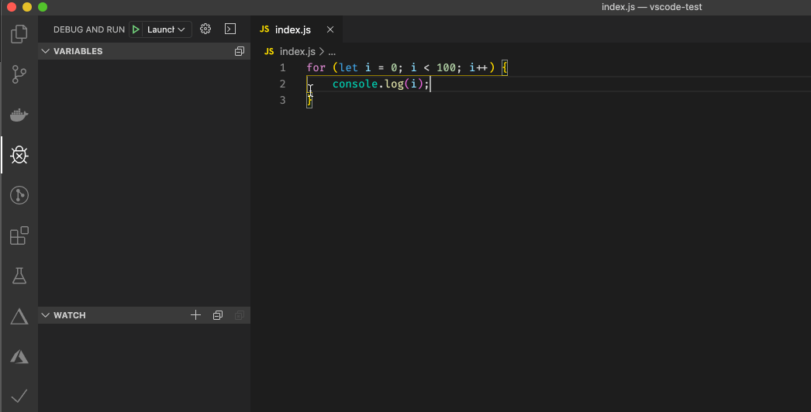

4 Things You Should Know VSCode Can Do — Without Extensions

# 4 Things You Should Know VSCode Can Do — Without Extensions

[Deepal Jayasekara](https://blog.insiderattack.net/@dpjayasekara?source=post_page-----f3d7803733ae----------------------)

[Dec 31, 2019](https://blog.insiderattack.net/4-things-you-should-know-vscode-can-do-without-extensions-f3d7803733ae?source=post_page-----f3d7803733ae----------------------) · 3 min read

In my opinion, VSCode is the best thing ever happened to the IDE world. It’s super lightweight, feature-rich and free hence without a doubt the best IDE I have ever used in my opinion. The other biggest plus of VSCode is the community of extension developers who made our lives a whole lot easy. But today, I’m going to describe four of the most important things VSCode can do without extensions, which some developers even not know.

Feel free to read more about these in the official VSCode documentation, but first, let me point you to where to look.

## Conditional Breakpoints

We use debug points all the time when debugging. But what if we can instruct the debug point only to hit once a given condition is met? These are called Conditional Breakpoints which are handy in especially when debugging inside loops, isolating specific scenarios and debugging edge-cases.

Debugging inside a loop with conditional breakpoints

## Log points

It’s quite common to add `console.log` statements in the code to quickly check whether the application is behaving the way you expected. But the pain of this is that you have to make sure that you have removed every `console.log` you added for debugging before you commit.

Log point is a variant of a debug point which logs a provided message when the debug point is hit. You have access to all of the variables in the scope where log point is added, making Log points extremely valuable and cleaner alternative to good old statements. The hassle of cleaning up adding `console.log`s and removing them is no more.

Adding log points with variables

## Tasks

VSCode tasks are a great way to bring terminal commands into VS Code (e.g, starting-up dependencies using before debugging). This allows you to quickly run frequently used shell commands with a few keystrokes.

The additional benefit of tasks is that you can even configure a given task to run immediately before a debug session is started or run immediately after a debug session using `[preLaunchTask](https://code.visualstudio.com/docs/editor/debugging#_launchjson-attributes)`[and](https://code.visualstudio.com/docs/editor/debugging#_launchjson-attributes)`[postDebugTask](https://code.visualstudio.com/docs/editor/debugging#_launchjson-attributes)`[properties](https://code.visualstudio.com/docs/editor/debugging#_launchjson-attributes) in your `launch.json` debug config. This is extremely helpful to automate preparation commands/clean up commands when debugging. (e.g, Startup 3rd party dependencies in docker as `preLaunchTask`, and stopping dependencies once the debug session finishes as a `postDebugTask`).

## User Inputs in Tasks and Launch Configurations

If we need to frequently change the arguments of a shell command in a VSCode task, we can define it as a [VSCode input variable](https://code.visualstudio.com/docs/editor/variables-reference#_input-variables) and provide it when the task is about to run. VSCode inputs can be used both in tasks as well as launch configurations which makes them extremely helpful.

I hope this might have helped you improve your productivity, and urged you to discover more of what VSCode can do as a FREE IDE.