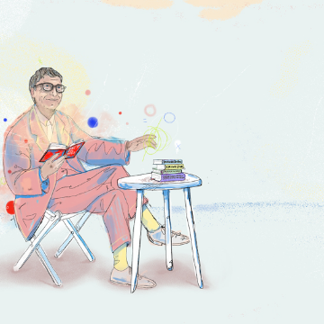

5 books worth reading this summer

5 books worth reading this summer

https://www.gatesnotes.com/About-Bill-Gates/Summer-Books-2018?WT.mc_id=20180521155842_SummerBooks2018_BG-TW&WT.tsrc=BGTW&linkId=51975078

Bill Gates shares his summer book recommendations: Origin Story: A Big History of Everything, by David Christian, Factfulness, by Hans Rosling with Ola Rosling and Anna Rosling Ronnlund, Leonardo da Vinci, by Walter Isaacson, Lincoln in the Bardo, by George Saunders, and Everything Happens for a Reason and Other Lies I’ve Loved, by Kate Bowler.