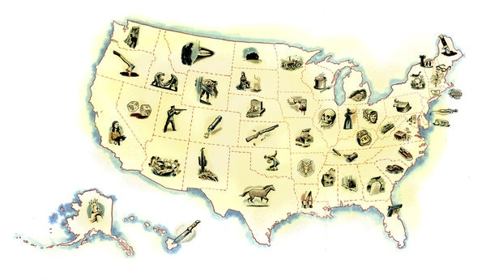
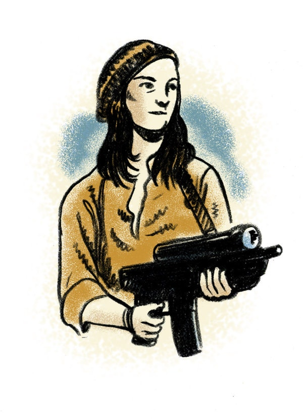

50 States of True Crime

# 50 States of True Crime50 States of True Crime

Every state has an infamous crime — and a book about it.
By [Tina Jordan](https://www.nytimes.com/by/tina-jordan) and Ross MacDonald

- July 26, 2019

-

    - 
    - 
    - 

    -
    -

Image

CreditRoss MacDonald

From the safety of your armchair, lose yourself in some classic — and completely terrifying — real-life stories of murder, mayhem, corruption, arson and robbery.

* * *

##   Alabama

### Bryan Stevenson, “[Just Mercy](https://www.nytimes.com/2014/10/19/books/review/just-mercy-by-bryan-stevenson.html)”

This memoir of an activist lawyer is essentially “the story of Walter McMillian, whom Stevenson began representing in the late 1980s when he was on death row for killing a young white woman in Monroe­ville, Ala., the hometown of Harper Lee.”

##   Alaska

### Tom Kizzia, “[Pilgrim’s Wilderness](https://artsbeat.blogs.nytimes.com/2013/07/24/a-fathers-wrath-tom-kizzia-talks-about-pilgrims-wilderness/)”

“Not since ‘The Shining’ has family life off the grid seemed as terrifying as it does in ‘Pilgrim’s Wilderness,’ about a homesteading family in which things have gone very, very wrong.”

## Get the Book Review Newsletter

Be the first to see reviews, news and features in The New York Times Book Review.

##   Arizona

### Zachary Lazar, “[Evening’s Empire: The Story of My Father’s Murder](https://www.nytimes.com/2009/11/17/books/17book.html)”

“Lazar’s father died in 1975 of distinctly unnatural causes in a stairwell at a Phoenix parking garage. His name was Ed Lazar, and he was an accountant with ties to the once-booming land-fraud community in Arizona.”

##   Arkansas

### Mara Leveritt, “Devil’s Knot: **The True Story of the West Memphis Three**”

Leveritt unravels a sensational case in West Memphis, Ark., where three teenage boys were tried and convicted in the 1992 murders of three 8-year-old boys.

Image

CreditRoss MacDonald

##   California

###  Jeffrey Toobin, “[American Heiress: The Wild Saga of the Kidnapping, Crimes and Trial of Patty Hearst](https://www.nytimes.com/2016/08/14/books/review/jeffrey-toobin-american-heiress-patty-hearst.html)”

“Was Patricia Hearst responsible for her crimes, or was she a victim who did what she needed to do to survive? Or is the truth somewhere in between? ... Toobin uses his knowledge of the justice system and his examination of the evidence to pierce the veil of spectacle and make sense of many contradictory elements.”

## Editors’ Picks

[### Journalist Misses His Deadline on Manson Article. By 20 Years.](https://www.nytimes.com/2019/07/28/style/charles-manson-book.html?fallback=0&recId=1Oh6vNxvZUaYcLGoai1zvUJzVQZ&locked=0&geoContinent=EU&geoRegion=LND&recAlloc=story&geoCountry=GB&blockId=home-featured&imp_id=519779361)

[### Buying a Weekend House With Friends: Is It Really a Good Idea?](https://www.nytimes.com/2019/07/26/realestate/buying-a-weekend-house-with-friends-is-it-really-a-good-idea.html?fallback=0&recId=1Oh6vNxvZUaYcLGoai1zvUJzVQZ&locked=0&geoContinent=EU&geoRegion=LND&recAlloc=story&geoCountry=GB&blockId=home-featured&imp_id=889118979)

[### True Life: I Got Conned by Anna Delvey](https://www.nytimes.com/2019/07/23/books/review/my-friend-anna-rachel-deloache-williams.html?fallback=0&recId=1Oh6vNxvZUaYcLGoai1zvUJzVQZ&locked=0&geoContinent=EU&geoRegion=LND&recAlloc=story&geoCountry=GB&blockId=home-featured&imp_id=870417442)

 [ PAID POST: IMDA](https://adclick.g.doubleclick.net/pcs/click?xai=AKAOjsstnKyrty3xb-dOZbVUYa1fXRz5gy8AfjCWneUCH6360I82KXfwXuGbWd9UlG2yfRK_hoAYXik4qlM47SHIK8PmnqUq3IZ6YhPaLWS0c4m0bT9ArabAf9peY_TKvOZDs0eQLhlje80ifYVZJ5z2TqvEwzJFhJ98t7PtWUuBSYlfcPgfu115hZQWPiYGWixof8aae27Ru0jSLhCALfd3GE_mBr0f3Ok09DkHftJsby5Go2hv-bdheC7j6bBdFJKEf2LT&sig=Cg0ArKJSzMeJ5KpUSIQhEAE&urlfix=1&adurl=https://www.nytimes.com/paidpost/imda/singapores-governing-framework-for-artificial-intelligence.html%3Fcpv_ap_id%3D50012528%26sr_source%3Dlift_ed%26tbs_nyt%3D2019-june-nytnative_ed)[ Balancing A.I. Risk and Innovation: Insights from Singapore](https://adclick.g.doubleclick.net/pcs/click?xai=AKAOjsstnKyrty3xb-dOZbVUYa1fXRz5gy8AfjCWneUCH6360I82KXfwXuGbWd9UlG2yfRK_hoAYXik4qlM47SHIK8PmnqUq3IZ6YhPaLWS0c4m0bT9ArabAf9peY_TKvOZDs0eQLhlje80ifYVZJ5z2TqvEwzJFhJ98t7PtWUuBSYlfcPgfu115hZQWPiYGWixof8aae27Ru0jSLhCALfd3GE_mBr0f3Ok09DkHftJsby5Go2hv-bdheC7j6bBdFJKEf2LT&sig=Cg0ArKJSzMeJ5KpUSIQhEAE&urlfix=1&adurl=https://www.nytimes.com/paidpost/imda/singapores-governing-framework-for-artificial-intelligence.html%3Fcpv_ap_id%3D50012528%26sr_source%3Dlift_ed%26tbs_nyt%3D2019-june-nytnative_ed)

##   Colorado

### Dave Cullen, “[Columbine](https://www.nytimes.com/2009/04/19/books/review/Senior-t.html)”

“The broad outlines of what happened at Columbine High School in Colorado ... are well known. Yet what’s amazing is how much of Cullen’s book still comes as a surprise.”

Image

CreditRoss MacDonald

##   Connecticut

### Joan Barthel, “[A Death in Canaan](https://www.nytimes.com/1976/12/12/archives/a-death-in-canaan-a-death.html)”

In 1973, Peter Kelly — 18 — was arrested and charged with his mother’s vicious murder. “Convinced of Peter’s innocence as they were incensed by the overzealousness of the state police, citizens of the small, western Connecticut community in which he and his unmarried mother lived alone joined together to raise his bond money, hire him a lawyer and get him out of jail.”

##   Delaware

### Ann Rule, “And Never Let Her Go”

Anne Marie Fahey was a young secretary working for the governor of Delaware when she met Tom Capano, a wealthy attorney and former state prosecutor who turned out to be a psychopath.

##   Florida

### Maureen Orth, “[Vulgar Favors](https://www.nytimes.com/1999/04/11/books/american-psycho.html)”

In this deconstruction of Andrew Cunanan’s killing spree and suicide, “the breadth and thoroughness of Orth’s research are often staggering.”

##   Georgia

### John Berendt, “[Midnight in the Garden of Good and Evil: A Savannah Story](https://www.nytimes.com/1994/03/20/books/voodoo-justice.html)”

Berendt’s book, “a combination of true crime and travelogue,” follows the case of Jim Williams, a rich antiques dealer “charged in the 1981 shooting of Danny Hansford, a tempestuous young man known as ‘a walking streak of sex’ to both men and women in town.”

Image

CreditRoss MacDonald

##   Hawaii

### Linda Spalding, “[Who Named the Knife](https://www.nytimes.com/2008/01/20/books/review/McKelvey-t.html)”

In this “honest, creepily fascinating memoir/true-crime story,” Spalding recalls the time she spent serving on the jury of a murder trial, and goes back to reinvestigate the crime.

Advertisement

##   Idaho

### Jack Olsen, “[Give a Boy a Gun: A True Story of Law and Disorder in the American West](https://www.nytimes.com/1986/01/12/books/in-short-nonfiction.html)”

“A compelling account of the killing of two game wardens in early 1981 in an Idaho desert by a ‘mountain man’ named Claude Dallas.”

##   Illinois

### Erik Larson, “[The Devil in the White City: Murder, Magic and Madness at the Fair That Changed America](https://www.nytimes.com/2003/02/10/books/books-of-the-times-add-a-serial-murderer-to-1893-chicago-s-opulent-overkill.html)”

“‘The Devil in the White City,’ a book as lively as its title, has the inspiration to combine two distantly related late-19th-century stories into a narrative that is anything but quaint. One describes planning and preparation for the 1893 Chicago World’s Fair. ... The book’s other path follows a prototypical American serial killer who ... built and operated a conveniently located World’s Fair Hotel, complete with walk-in vault, greased wooden chute and person-sized basement kiln. As for where this would lead, ‘only Poe could have dreamed the rest.’”

##   Indiana

### Wendy Gamber, “[The Notorious Mrs. Clem: Murder and Money in the Gilded Age](https://www.nytimes.com/2016/10/30/books/review/notorious-mrs-clem-and-more-true-crime.html)”

“By 1868 the formerly quiet town of Indianapolis was becoming ‘a city of strangers,’ and nearby Cold Spring was a more inviting place to settle — except for that blood-soaked patch of ground on the west bank of the White River where the bodies of Jacob and Janey Young were found on the morning of Sept. 13.”

##   Iowa

### Patricia L. Bryan and Thomas Wolf, “Midnight Assassin: A Murder in America’s Heartland”

In 1900, the brutal murder of the farmer John Hossack galvanized Iowa — especially after it appeared that his wife, Margaret, had been the one to bludgeon him to death.

##   Kansas

### Truman Capote, “[In Cold Blood](https://timesmachine.nytimes.com/timesmachine/1966/01/16/issue.html?action=click&contentCollection=Archives&module=ArticleEndCTA&region=ArchiveBody&pgtype=article)”

Capote’s famous “nonfiction novel” about the Clutter murders got a rave review in The Times, which called it “a grieving testament of faith in what used to be called the soul.”

##   Kentucky

### Joe Sharkey, “[Above Suspicion](https://www.nytimes.com/1994/03/06/books/in-short-nonfiction-276928.html)”

Sharkey’s tale of an F.B.I. agent-turned-criminal is “a close examination of the mind of an ordinary man driven to an extraordinary act.”

##   Louisiana

### Ethan Brown, “[Murder in the Bayou: Who Killed the Women Known as the Jeff David 8?”](https://www.nytimes.com/2016/10/30/books/review/notorious-mrs-clem-and-more-true-crime.html)

The women — “all prostitutes and drug addicts, which made them vulnerable and defenseless, expendable in a jurisdiction that’s centrally positioned along the route of the Gulf Coast drug trade” — were killed between 2005 and 2009.

Advertisement

Image

CreditRoss MacDonald

##   Maine

### Sarah Perry, “[After the Eclipse](https://www.nytimes.com/2017/10/26/books/review/after-the-eclipse-sarah-perry-memoir-tribute.html)”

“In the early morning of May 12, 1994, Sarah Perry’s 30-year-old mother, Crystal, was stabbed to death in her home, while Sarah, who was 12 at the time, sat frozen on her bed on the other side of a thin wall. The murder, which went unsolved for 12 years, marked Perry, infecting her with a ‘viscous blackness’ unleashed by the killer’s act. Like the partial solar eclipse Perry and her mother witnessed two days before the murder, this blackness blotted out the daughter’s and the mother’s former selves. ‘After the Eclipse’ is Perry’s effort to look behind this shadow.”

##   Maryland

### David Simon, “[Homicide: A Year on the Killing Streets](https://www.nytimes.com/1991/08/04/books/in-short-nonfiction-475891.html)”

In 1988, when he was a reporter for The Baltimore Sun, Simon followed a squad of homicide detectives in Baltimore, “chronicling the mind-numbing violence that has become synonymous with virtually every American city.”

##   Massachusetts

### Masha Gessen, “[The Brothers](https://www.nytimes.com/2015/04/12/books/review/the-brothers-masha-gessens-book-about-the-boston-marathon-bombers.html)”

“The Brothers” examines how ­Dzhokhar Tsarnaev and his older brother, Tamerlan, became the Boston Marathon Bombers.

##   Michigan

### Maggie Nelson, “[The Red Parts](https://www.nytimes.com/2007/04/01/books/review/Conant.t-1.html)”

“In March 1969, Jane Mixer, a 23-year-old University of Michigan law school student, signed up on a campus ride-board to travel home for spring break. Soon after, her body was found with two bullets in her brain and a stocking so ambitiously wound around her neck that her head was nearly severed.” Thirty-five years later, thanks to a DNA match, someone was finally arrested for the crime.

##   Minnesota

### Andrew H. Malcolm, “[Final Harvest: An American Tragedy](https://www.nytimes.com/1986/04/17/arts/books-a-midwest-tale.html)”

“This is the dark side of Lake Wobegon. The victims and villains of ‘Final Harvest’ are not stronger, smarter or above average. Like other Americans, they were swept up in the tornado of social and economic change in American agriculture.”

Image

CreditRoss MacDonald

Advertisement

##   Mississippi

### John Safran, “[God’ll Cut You Down](https://www.nytimes.com/2014/12/08/books/godll-cut-you-down-a-true-crime-book-by-john-safran.html)”

When the white supremacist Richard Barrett was murdered, “a young black man, Vincent McGee, was accused and convicted of the killing. Supposed motive: Mr. McGee’s anger at being underpaid for maintenance work Mr. Barrett had hired him to do. But the situation was so full of unanswered questions that it brought out Mr. Safran’s inner Truman Capote.”

##   Missouri

### Michael W. Cuneo, “Almost Midnight: An American Story of Murder and Redemption”

In an area of the Ozarks blighted by poverty and crime, a local Vietnam vet went on a killing spree. Cuneo decided to find out why.

##   Montana

### Jon Krakauer, “[Missoula](https://www.nytimes.com/2015/05/03/books/review/jon-krakauers-missoula-about-rape-in-a-college-town.html)”

“Krakauer looks at the University of Montana, the local police and the prosecutor’s office through the eyes of five women who reported rapes or attempted rapes between 2010 and 2012.”

##   Nebraska

### Gregg Olsen, “Abandoned Prayers: The Incredible True Story of Murder, Obsession and Amish Secrets”

Eli Stutzman was a respected Amish farmer. He was also, as it turns out, a murderer.

##   Nevada

### Nicholas Pileggi, “[Casino: Love and Honor in Las Vegas](https://www.nytimes.com/1995/09/28/books/books-of-the-times-the-mob-s-tale-of-sorrow-about-las-vegas.html)”

“Viewed in the proper perspective, Pileggi’s story is a morality tale about two men who tried to begin their lives anew by moving to Las Vegas, that ‘city with no memory,’ Pileggi calls it, ‘the nation’s only morality car wash.’ One of the men was brains, the other muscle, but each left his lasting mark on America’s gambling capital.”

##   New Hampshire

### Dick Lehr and Mitchell Zuckoff, “[Judgment Ridge](https://www.nytimes.com/2003/11/02/books/books-in-brief-nonfiction-837776.html)”

“The murders of Half and Susanne Zantop, popular professors at Dartmouth, stunned the residents of somnolent Hanover, N.H., where only four murders had been committed in the last century.”

##   New Jersey

### Charles Graeber, “[The Good Nurse](https://www.nytimes.com/2013/04/12/books/the-good-nurse-by-charles-graeber.html)”

“In 2003, the world discovered what a night nurse named Charles Cullen had been doing during the preceding 16 years. He had killed a judge, a priest and an unknown but large number of other people. He may have been the most prolific serial killer in history.”

##   New Mexico

### Jason Kersten, “[Journal of the Dead: A Story of Friendship and Murder in the New Mexico Desert](https://www.nytimes.com/2003/08/07/books/books-of-the-times-murder-or-act-of-mercy-under-an-unforgiving-sun.html)”

“Two buddies on a camping trip wound up stranded in the desert. They became so desperate that Raffi Kodikian stabbed David Coughlin in the heart, purportedly as an act of mercy killing. The setting was Rattlesnake Canyon in New Mexico, described here as a crack in the landscape and ‘a moral fracture as well.’”

Advertisement

##   New York

### Robert Kolker, “[Lost Girls](https://www.nytimes.com/2013/07/07/books/review/lost-girls-by-robert-kolker.html)”

“In mid-December 2010, the Suffolk County police discovered the bodies of four women, each wrapped in burlap, on a desolate, bramble-covered stretch of sand called Gilgo Beach. It was a gothic whodunit for the internet age, replete with prostitutes, drugs, family dysfunction, investigative incompetence, not to mention a strange, insular beach community and, of course, the websites of Craigslist and Backpage, where the women had advertised for customers.”

##   North Carolina

### Jerry Bledsoe, “[Bitter Blood: A True Story of Southern Family Pride, Madness, and Multiple Murder](https://www.nytimes.com/1988/10/09/books/crimemystery-in-short-nonfiction.html)”

“When a wealthy mother and daughter were gunned down gangland-style at their Louisville, Ky., home in 1984 with no obvious motive, a detective predicted: ‘That family has a dark cloud in it somewhere. Find that cloud and you’ve found your killer.’ It was not until 10 months later, in the wake of a seemingly unrelated triple murder in Winston-Salem, N.C., that the dark cloud emerged.”

Image

CreditRoss MacDonald

##   North Dakota

### Robert Dodge, “Prairie Murders: The True Story of Three Murders and the Loss of Innocence in a Small North Dakota Town”

Homicides are rare in North Dakota, so when three people from the same small town were killed, everyone in the state paid attention.

##   Ohio

### Daniel Keyes, “[The Minds of Billy Mulligan](https://www.nytimes.com/1981/11/15/books/arthur-ragen-allen-et-al.html)”

In 1977, “in a period of eight days, two women, one a nurse, the other an optometry student, had been kidnapped, compelled under threat of death to cash checks at various suburban banks, robbed and raped.” The man arrested for the crimes, William Stanley Milligan, “became the first person in this country’s history to be declared not guilty by reason of insanity on the grounds of a psychiatric diagnosis of ‘multiple personality.’”

##   Oklahoma

### David Grann, “[Killers of the Flower Moon: The Osage Murders and the Birth of the FBI](https://www.nytimes.com/2017/04/12/books/review-killers-of-flower-moon-david-grann.html)”

“Grann’s book, about how dozens of members of the Osage Indian nation in Oklahoma in the 1920s were shot, poisoned or blown to bits by rapacious whites who coveted the oil under their land, is close to impeccable. It’s confident, fluid in its dynamics, light on its feet.”

##   Oregon

### Terri Jentz, “[Strange Piece of Paradise](https://www.nytimes.com/2006/05/14/books/review/14roach.html)”

In 1977, Jentz and a fellow college student, on a 4,200-mile bike journey, were attacked by an ax-wielding stranger: “Understatement is the quiet power that fuels Jentz’s writing, and our rage as we read it. Here is a woman viewing the aftermath of her attempted killing through the smeary haze of her own blood.”

Advertisement

Image

CreditRoss MacDonald

##   Pennsylvania

### Wendy Ruderman and Barbara Laker, “Busted: A Tale of Corruption and Betrayal in the City of Brotherly Love”

“Equal parts serious journalism and sisterly sass, ‘Busted’ is a personable and fast-reading ride along with two Philadelphia Daily News journalists as they chase a police corruption story down the rabbit hole.”

##   Rhode Island

### Leah Carroll, “[Down City](https://www.nytimes.com/2017/03/31/books/review/down-city-leah-carroll.html)”

“Two very short sections open Leah Carroll’s memoir: the description of her mother’s murder in a seedy hotel room, and the description of her father’s death in an equally seedy hotel room 14 years later. Carroll proceeds from these haunting twin plot points through a patchwork of vignettes, reportage and reflection that reaches after her absent parents with sensitive longing.”

Image

##   South Carolina

### Maria Eftimiades, “Sins of the Mother”

In a 1994 case that riveted the nation, a hysterical Susan Smith told police officers that her car had been stolen with her two small sons still inside it. As it turned out, something quite different had happened.

##   South Dakota

### Sandy and Phil Hamman, “Gitchie Girl”

Late one night in 1973, four teenagers sitting around a campfire at a South Dakota state park were gunned down. A fifth, called the “Gitchie Girl,” survived.

Image

CreditRoss MacDonald

Advertisement

##   Tennessee

### Darcy O’Brien, “[Power to Hurt: Inside a Judge’s Chambers: Sexual Assault, Corruption, and the Ultimate Reversal of Justice for Women](https://www.nytimes.com/1996/04/28/books/books-in-brief-nonfiction-006742.html)”

“A tale of sexual assault, greed, power, political corruption and drug addiction unfolded daily for years in the unassuming, sleepy little town of Dyersburg, Tenn., in the chambers of a venerable judge.”

##   Texas

### Melissa del Bosque, “[Bloodlines: The True Story of a Drug Cartel, the FBI, and the Battle for a Horse-Racing Dynasty](https://www.nytimes.com/2017/12/15/books/review/bloodlines-melissa-del-bosque.html)”

“A fast-paced true-crime tale about a Mexican drug cartel and the Texas cops who chase it. ... Del Bosque based her account on scores of personal interviews and reams of court documents, and proves herself fluent in detailing the exceedingly different, but equally rich, milieus of cartel kingpins, Texas equestrians and federal investigators.”

##   Utah

### Mikal Gilmore, “[Shot in the Heart](https://www.nytimes.com/1994/05/27/books/books-of-the-times-portrait-of-a-killer-in-a-violent-family-s-embrace.html)”

“A compelling volume that traces the sad, violent history of the Gilmore family and shows, in its author’s words, ‘how its webwork of dark secrets and failed hopes helped create the legacy that, in part, became my brother’s impetus to murder.’”

Image

CreditRoss MacDonald

##   Vermont

### Peter Meyer, “Death of Innocence”

In 1981, a rape and murder case rocked a small town in Vermont when the perpetrators were discovered to be 15 and 16 years old.

##   Virginia

### Monica Hesse, “[American Fire](https://www.nytimes.com/2017/07/12/books/review-american-fire-monica-hesse.html)”

Hesse’s tale of an arson spree in Accomack County, Va., “has all the elements of a lively crime procedural: courtroom drama, forensic trivia, toothsome gossip, vexed sex.”

##   Washington

### Eli Sanders, “While the City Slept: A Love Lost to Violence and a Young Man’s Descent Into Madness”

In his examination of the murder of two young women in Seattle, Sanders — a Pulitzer Prize-winning journalist — discovered that the killer, who was mentally ill, was not getting the treatment he needed for his disease.

Advertisement

##   West Virginia

### George T. Sidiropolis, “Murder Never Dies”

Sidiropolis explores what life was like in Wheeling, W.Va., in the early 1900s, when murder and corruption were rampant and the city was ruled by organized crime.

##   Wisconsin

### Brian Masters, “The Shrine of Jeffrey Dahmer”

A biography of Wisconsin’s most prolific serial killer, who was also known as the “Milwaukee Cannibal.”

##   Wyoming

### Ron Franscell, “The Darkest Night: The Murder of Innocence in a Small Town”

In one of Wyoming’s most notorious cases, two sisters were abducted and thrown off a bridge — and one of them lived to identify her attackers.

- 
- 
- 

-

Advertisement