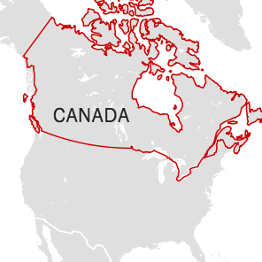
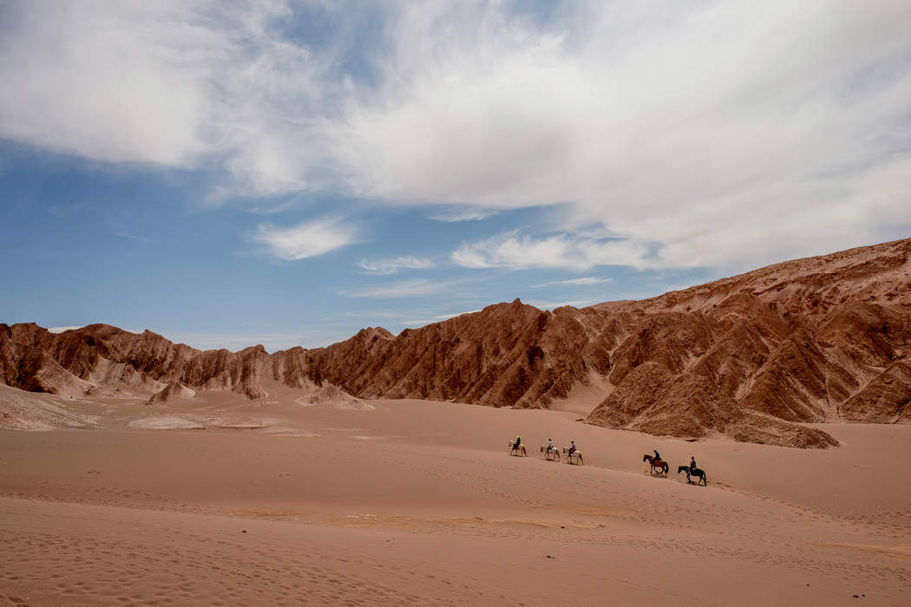
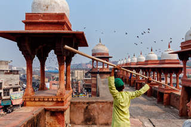
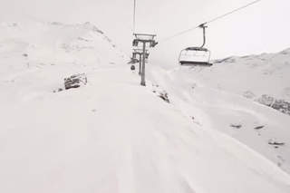

52 Places to Go in 2017

# 52 Places to Go in 2017

There are thousands of getaways to explore this year. Here are some ideas to get you started.

January 4, 2017

[Leer en Español](http://www.nytimes.com/es/interactive/52-lugares-para-visitar-en-2017/?smid=nyt-en&smtyp=article)

Surfing in Tofino, on the western coast of Vancouver Island.  Josh Haner/The New York Times

1.  Canada

A northern neighbor is a world to explore.

Canada is huge — the second-largest country by area. It’s also a world unto itself, with cosmopolitan cities, barely explored natural wonders and everything in between. And this is the year to visit: In honor of the 150th anniversary of its confederation, when the original colonies came together as one country, Canada is rolling out the welcome mat. All of the country’s[more than 200 national parks and historic sites](http://www.pc.gc.ca/eng/voyage-travel/admission.aspx) are offering free admission through the year, from the turquoise lakes and mountain peaks of Banff in Alberta to the rolling dunes and red sandstone cliffs of Prince Edward Island along the Atlantic Coast to the newest reserve, the glacial-rounded[Mealy Mountains](http://www.pc.gc.ca/eng/pn-np/nl/mealy/index.aspx) in Labrador. Meanwhile, in the capital, Ottawa, a[full year of celebration is planned](http://www.ottawa2017.ca/); more events will be on offer in Montreal,[which turns 375](http://www.375mtl.com/en/). And did we mention the exchange rate? A weak Canadian dollar means American travelers get more for their money. So 2017 offers an ideal time to go north. — Remy Scalza

 

-

-

-

-

#### What to do in Canada?

[Our reader suggestions on Facebook.](https://www.facebook.com/nytimestravel/posts/1301754426548325)

- [Five Authors on Their Canada](https://www.nytimes.com/2017/01/04/travel/places-to-go-canada-2017-writers-authors.html)

 

Valle de la Muerte in the Atacama Desert.  Tomas Munita for The New York Times

2.  Atacama Desert, Chile

New ways to explore the world’s highest desert.

The Atacama draws adventure seekers and stargazers to its vast, otherworldly landscape of wind-carved dunes and kaleidoscopic salt lakes. [Sunrise balloon rides](http://www.easternsafaris.com/balloonsoveratacama_home/), which started in August, reveal its staggering beauty from above. The luxurious, recently renovated [Explora Atacama](https://www.explora.com/hotels-and-travesias/atacama-hotel/) hotel reopened in December; overnight rates include guided desert excursions and nighttime access to the hotel’s on-site observatory, equipped with one of Chile’s largest privately-owned telescopes. — Arabella Bowen

 

-

-

-

-

#### What to do in Atacama Desert?

[Our reader suggestions on Facebook.](https://www.facebook.com/nytimestravel/posts/1301756139881487)

 

At the Jama Masjid in Agra.  Poras Chaudhary for The New York Times

3.  Agra, India

Beyond the Taj Mahal, new attractions beckon.

Navigating the stunning, sprawling Taj Mahal will get easier when an orientation center opens this year, but 2017 also promises new reasons to venture beyond: Nearby streets have been [repaved](https://www.youtube.com/watch?v=G-uuYTnroW4); the Agra Pavilion, a glass-walled dining complex, will host more than a dozen vendors and restaurants; and the [Mughal Museum](http://www.davidchipperfield.co.uk/project/mughal_museum), a collaboration with the architect David Chipperfield and [Studio Archohm](http://www.archohm.com/), has broken ground. In addition, [India’s fastest train](http://timesofindia.indiatimes.com/india/Now-Delhi-Agra-at-160-km/hr-on-Gatimaan-Express/articleshow/51693596.cms) and [longest expressway](http://economictimes.indiatimes.com/news/defence/8-iaf-jets-land-on-agra-lucknow-expressway/articleshow/55541284.cms) now cut travel time from Delhi and Lucknow. — Ratha Tep

-

-

-

-

#### What to do in Agra?

[Our reader suggestions on Facebook.](https://www.facebook.com/nytimestravel/posts/1301764053214029)

 

Click and drag to see the Matterhorn

Riding a lift above Zermatt.  Drew Gardner for The New York Times

4.  Zermatt, Switzerland

New reasons to get close to the Matterhorn.

Zermatt, neighbor to the legendary Matterhorn, has been luring active travelers since 1898, when the [Gornergrat](https://www.gornergratbahn.ch/en) train — Switzerland’s first electric cog rail — began operating. In time for the rail’s 200th anniversary, the five-star [Riffelalp Resort](http://www.riffelalp.com/en/news#Rooms%202016), on the edge of a 7,290-foot-high plateau facing the Matterhorn, reopened in December with updated rooms and ski-in and ski-out access. Higher up, at Riffelberg, a permanent [open-air theater](http://freilichtspiele-zermatt.ch/) will open this summer with performances of “Romeo and Juliet on Gornergrat.” — Erin Levi

-

-

-

-

#### What to do in Zermatt?

[Our reader suggestions on Facebook.](https://www.facebook.com/nytimestravel/posts/1301764759880625)

Lion cubs in the Duba Plains.  João Silva/The New York Times

5.  Botswana

Old lions, new digs in the heart of the Okavango.

If you’ve seen an African wildlife documentary in the last 30 years, chances are good that the filmmakers Dereck and Beverly Joubert had a hand in it. This spring the Jouberts, National Geographic explorers in residence, along with the company Great Plains Conservation, will open [Duba Plains Camp](http://greatplainsconservation.com/duba-plains-camp/), a luxury tented camp in a private 77,000-acre portion of the Okavango Delta that’s rife with lions, elephants and species specific to northern Botswana like the red lechwe. Expect safaris on boats with built-in camera mounts (when water levels allow) and a chance to see the descendants of Ma di Tau, the star of “The Last Lions.” — Tim Neville

-

-

-

-

#### What to do in Botswana?

[Our reader suggestions on Facebook.](https://www.facebook.com/nytimestravel/posts/1301771159879985)

Dubrovnik at night.  Andy Haslam for The New York Times

6.  Dubrovnik, Croatia

New ways to enjoy a gem on the Dalmatian Coast.

With its limestone-paved streets and 80-foot-high walls surrounding Old Town, this star of the Dalmatian Coast has long been able to rest on its aesthetic laurels — you might recognize it as King’s Landing on “Game of Thrones.” In recent years, though, it has been adding to the luster. This summer, the city is starting an electric-scooter sharing program, allowing for locals and visitors to zip up and down the coast to more private beaches. The four-star beachside[Hotel Kompas](http://www.adriaticluxuryhotels.com/en/hotel-kompas-dubrovnik) is a comfy addition to the scene, and the long-awaited renovation of the grande dame[Hotel Excelsior](http://www.adriaticluxuryhotels.com/en/hotel-excelsior-dubrovnik) will be finished in June. The new restaurant[Portrait](http://www.portrait.hr/en/restaurant) is serving elevated takes on Dalmatian fare in Old Town. — David Farley

-

-

-

-

#### What to do in Dubrovnik?

[Our reader suggestions on Facebook.](https://www.facebook.com/nytimestravel/posts/1301771963213238)

Click and drag to explore

Taggart Lake Trail.  Benjamin Norman for The New York Times

7.  Grand Teton National Park, Wyoming

A total solar eclipse amid natural splendor.

On Aug. 21, the continental United States will experience a [total solar eclipse](https://eclipse.gsfc.nasa.gov/SEmono/TSE2017/TSE2017.html) for the first time in 38 years. The eclipse will cut a diagonal swath across America, but city lights and overcast skies can be obstacles to prime viewing. A good bet is [Grand Teton](https://www.nps.gov/grte/index.htm) in Wyoming, which will get a generous two minutes and 20 seconds of darkness. If you miss the eclipse, you’ll still be surrounded by the jagged peaks, mountain lakes and wildlife of a pristine national park in its summer glory. — Elisabeth Eaves

-

-

-

-

#### What to do in Grand Teton National Park?

[Our reader suggestions on Facebook.](https://www.facebook.com/nytimestravel/posts/1301775533212881)

- [Grand Teton National Park: Truth in Beauty](https://www.nytimes.com/2016/07/03/travel/grand-teton-national-park-truth-in-beauty.html)

Telefónica Gastro Park.   Joe Schmelzer for The New York Times

8.  Tijuana, Mexico

Trading an unsavory reputation for a great food scene.

Though still rough around the edges, this fast-growing border town is on the rise, with a luxury condo boom and a new $60 million bus rapid transit system. Tijuana is also having a culinary renaissance, fueled by craft breweries, stylish coffee shops and globally informed restaurants that range from[Telefónica Gastro Park’s](http://facebook.com/TelefonicaGastroPark) hipster food trucks to bustling Baja Med spots like[La Querencía](http://www.laquerenciatj.com/) in the riverside Zona Río neighborhood. — Chaney Kwak

-

-

-

-

#### What to do in Tijuana?

[Our reader suggestions on Facebook.](https://www.facebook.com/nytimestravel/posts/1301776633212771)

- [The Store Putting Tijuana on the Design Map](https://www.nytimes.com/2016/10/31/t-magazine/design/object-design-store-tijuana.html)

The Rivera Court in the Detroit Institute of Arts.  Kevin Miyazaki for The New York Times

9.  Detroit, Michigan

A comeback city set to make good on its promise.

Detroit’s revitalization, after its 2013 bankruptcy filing, has long been building. In 2015, it was named a Unesco City of Design. But 2017 may be the year promise becomes reality. The new[QLine](http://m-1rail.com/) streetcar is expected to open in April, connecting the central Woodward Avenue corridor some 3.3 miles between downtown and the revived New Center area. It passes through Midtown, home to the[Detroit Institute of Arts](http://www.dia.org/), and the entertainment-focused[District Detroit](http://www.districtdetroit.com/), where a stadium opening this fall will be shared by the Detroit Red Wings and, in a return from the suburbs, the Detroit Pistons. — Elaine Glusac

-

-

-

-

#### What to do in Detroit?

[Our reader suggestions on Facebook.](https://www.facebook.com/nytimestravel/posts/1301777416546026)

- [Cheap Eats, D.I.Y. Art and the Charm of Locals](https://www.nytimes.com/2015/10/01/travel/detroit-budget-travel.html)

The Warehouse District.  Andreas Meichsner for The New York Times

10.  Hamburg, Germany

A haven for architecture and design.

Zaha Hadid’s meandering promenade along the Elbe recently breathed new life into the riverfront and the nearby 19th-century Warehouse District, which made the Unesco World Heritage list in 2015. Adding to the sheen, the much-anticipated Herzog & de Meuron-designed[Elbphilharmonie](https://www.elbphilharmonie.de/en) is scheduled to open this month. The 360-foot-tall glass structure sits atop an old warehouse, its spiky roof evoking sails and the city’s maritime past. And if all that architectural gawking tires you out, the uber-luxurious[Fontenay](http://www.thefontenay.de/en/) will open later this year, the first five-star hotel in this northern German city in 18 years. — David Farley

-

-

-

-

#### What to do in Hamburg?

[Our reader suggestions on Facebook.](https://www.facebook.com/nytimestravel/posts/1301778086545959)

- [A New Musical Landmark for a City With Plans](https://www.nytimes.com/2016/10/26/arts/music/elbphilharmonie-hamburg-new-musical-landmark.html)

Click and drag to explore

Jardin Majorelle.  Drew Gardner for The New York Times

11.  Marrakesh, Morocco

Art at a legendary designer’s spiritual resting place.

A new museum dedicated to the work of the fashion icon Yves Saint Laurent will debut this fall in Marrakesh, showcasing thousands of sketches, couture garments and accessories. The 43,000-square-foot structure sits adjacent to the [Jardin Majorelle](http://jardinmajorelle.com/ang/), which will celebrate its 60th anniversary as a public garden in 2017 (Saint Laurent saved it from demolition). The much-visited attraction also houses a [museum](http://jardinmajorelle.com/ang/introduction-to-berber-culture/) dedicated to Berber culture and the designer’s private residence, [Villa Oasis](http://jardinmajorelle.com/ang/yves-saint-laurent-and-pierre-berge-bought-the-garden-out-in-1980/). — Nora Walsh

-

-

-

-

#### What to do in Marrakesh?

[Our reader suggestions on Facebook.](https://www.facebook.com/nytimestravel/posts/1301779479879153)

- [Surfacing: Guéliz](http://www.nytimes.com/interactive/2016/03/31/travel/where-to-go-in-marrakesh.html)

A pedestrian bridge over the Reedy River near downtown Greenville.  Hunter McRae for The New York Times

12.  Greenville, South Carolina

The next Charleston?

Though small, Greenville, nestled in the Blue Ridge Mountains, may be the next major food destination, with four big openings:[Husk](http://huskrestaurant.com/) from Sean Brock, [the Kitchen by Wolfgang Puck](http://www.wolfgangpuck.com/restaurants),[Jianna](http://jiannagreenville.com/) from Michael Kramer and the speakeasy[Vault & Vator](http://americangr.com/). Before feasting, enjoy the city’s many public art works along the tree-lined streets, or grab a pour over at[Methodical Coffee](https://methodicalcoffee.com/) en route to biking the 21-mile[Swamp Rabbit Trail](http://greenvillerec.com/swamprabbit/). — Daniel Scheffler

-

-

-

-

#### What to do in Greenville?

[Our reader suggestions on Facebook.](https://www.facebook.com/nytimestravel/posts/1301780369879064)

- [Opening the Gate to a Vibrant Main Street](https://www.nytimes.com/2014/12/07/travel/opening-the-gate-to-a-vibrant-main-street-in-greenville-sc.html)

By horseback in Pedregal.  Danielle Villasana for The New York Times

13.  Pedregal, Ecuador

A natural beauty that’s still natural — for now.

The earthquake that rattled Ecuador last year mostly shattered areas where international travelers seldom go. Now man-made threats may compromise El Pedregal, a popular place for visitors before or after Galápagos excursions. The valley south of Quito is surrounded by huge volcanoes and grassy steppes where [haciendas](http://www.tierradelvolcan.com/)serve as bases for travelers to go hiking, mountain biking and horseback riding. Go before June to see the valley before new power lines encroach on condors and views. — Tim Neville

-

-

-

-

#### What to do in Pedregal?

[Our reader suggestions on Facebook.](https://www.facebook.com/nytimestravel/posts/1301781119878989)

On the coast in Penzance.  Andy Haslam for The New York Times

14.  Penzance, England

A glimpse of ‘Poldark’ country.

Penzance, the Cornish port town in the southwest of England, is having a moment, thanks to the popularity of “Poldark,” the BBC costume drama set in 18th-century Cornwall. The new [Chapel House](http://chapelhousepz.co.uk/) B&B joins a local favorite, the [Artists Residence](http://artistresidencecornwall.co.uk/), while restaurants such as the [Tolcarne Inn](http://tolcarneinn.co.uk/), in nearby Newlyn, and t[he Shore](http://theshorerestaurant.uk/) have put Penzance on the map as a culinary destination. Perhaps the best thing to see in Penzance — aside from the scenery — is the Art Deco-inspired [Jubilee pool](https://www.jubileepool.co.uk/), one of Europe’s last saltwater lidos. The enormous triangular public pool was built in the 1930s and just underwent a $3.73 million renovation. — David Shaftel

-

-

-

-

#### What to do in Penzance?

[Our reader suggestions on Facebook.](https://www.facebook.com/nytimestravel/posts/1301782716545496)

The Dotonbori neighborhood.  Lauryn Ishak for The New York Times

15.  Osaka, Japan

The ultimate Japanese feast awaits.

If Kyoto represents Japan’s spirit, and Tokyo its heart, Osaka is the country’s insatiable appetite. The city’s culinary legacy is alive and at work in the neighborhoods of Tsuruhashi and Fukushima, and in the 91 Michelin-starred restaurants spread throughout the city — like Ajikitcho, specializing in traditional Japanese cooking, and Taian, with a chargrilled focus. On April 28, it will all come together at the [International Festival Utage](http://www.intex-osaka.com/en/guest/event/single.php?id=471) (“feast”), a 10-day food festival, celebrating flavors from Japan’s 47 prefectures. — Kenan Christiansen

-

-

-

-

#### What to do in Osaka?

[Our reader suggestions on Facebook.](https://www.facebook.com/nytimestravel/posts/1301783716545396)

- [Enjoying Osaka’s Famous Food, Without Breaking the Bank](https://www.nytimes.com/2016/04/29/travel/osaka-japan-food-frugal.html)

Inside Skokloster Castle.  James Silverman for The New York Times

16.  Stockholm, Sweden

Scandinavia need not be a wallet-buster.

Free state-owned museums will make visits to Sweden’s capital less expensive in 2017. Over a dozen dropped their hefty entry fees last year, including the [Museum of Modern Art](http://modernamuseet.se/), the [Museum of Natural History](http://nrm.se/), the [Swedish History Museum](http://historiska.se/) and [Skokloster Castle](http://skoklostersslott.se/). Add to that a favorable exchange rate for Americans — the krona is about 20 percent weaker against the dollar than it was two years ago — and this beautiful city suddenly looks even more attractive. — Ingrid K. Williams

-

-

-

-

#### What to do in Stockholm?

[Our reader suggestions on Facebook.](https://www.facebook.com/nytimestravel/posts/1301784549878646)

- [Stockholm as Strindberg’s Muse](https://www.nytimes.com/2016/09/18/travel/stockholm-strindberg-footsteps.html)

Click and drag to see the Buddha

Rabong Buddha Park.  Evan Wexler for The New York Times

17.  Sikkim, India

A haven for spiritual seekers, soon more accessible.

With its first airport opening this year and its first rail link in the works, the remote northeastern Indian state of Sikkim keeps getting closer. Adventurous souls can trek Khangchendzonga National Park, a Himalayan haven of forests, valleys and mountains — including the world’s third-highest peak — that earned Unesco World Heritage status this year. Spiritual seekers, meanwhile, can pursue nirvana around the historically Buddhist land, from centuries-old Buddhist monasteries like Tashiding and Pemayangtse to the museum-like [Namgyal Institute of Tibetology](http://tibetology.net/). And load up on spices, fruits and vegetables. Sikkim became the first fully organic state in India last year. — Seth Sherwood

-

-

-

-

#### What to do in Sikkim?

[Our reader suggestions on Facebook.](https://www.facebook.com/nytimestravel/posts/1301785216545246)

The harbor on Île de Porquerolles.  Andy Haslam for The New York Times

18.  Île de Porquerolles, France

Plage, pétanque, pastis: parfait.

Only 10 minutes by ferry from the mainland, this four-mile-long under-the-radar Mediterranean island is an unexplored refuge with mountain-biking trails, sandy beaches and a single rustic vineyard offering free daily wine tastings. Mostly national parkland, the car-free island has one idyllic village where you’ll hear the clinking of both pétanque boules and glasses of pastis. The place to stay is [Le Mas du Langoustier](http://langoustier.com/), an upscale hotel perched between two coves on the western end of the island. — Ingrid K. Williams

-

-

-

-

#### What to do in Île de Porquerolles?

[Our reader suggestions on Facebook.](https://www.facebook.com/nytimestravel/posts/1301785886545179)

The northern coast of Madagascar.  Oliver S./Shutterstock

19.  Madagascar

An island nation re-emerges as an ecotourism paradise.

Madagascar has stabilized since its elections in 2013 and is luring tourists back to its stunning combination of jungles, beaches and reefs. Lemurs and chameleons are just the headline attractions in this island nation the size of France, which lies off the east coast of Africa. Whale sharks and humpbacks cruise the undersea world, fat-trunked baobab trees dot the land, and more than 90 percent of the island’s mammals are not found anywhere else. Eco-friendly lodging options include luxurious island retreats like the new [Miavana](http://www.timeandtideafrica.com/miavana) and rain forest camps like [Masoala Forest Lodge](http://www.masoalaforestlodge.com/). And it’s not as hard to get to as you might imagine: Air France and South African Airways offer one-stop flights from New York. — Elisabeth Eaves

-

-

-

-

#### What to do in Madagascar?

[Our reader suggestions on Facebook.](https://www.facebook.com/nytimestravel/posts/1301787349878366)

- [Only in Madagascar](http://www.nytimes.com/2010/12/19/travel/19madagascar.html)

The Guanyin of the South Sea in Sanya.  Miguel Toran for The New York Times

20.  Sanya, China

China’s beach destination of choice.

With its stunning white sand beaches and shimmering blue waters, Sanya on Hainan Island, China’s southernmost province, is known as the Hawaii of China. The destination is in the midst of a resort boom, and these eye-catching properties are reason enough to visit. There are already a[Park Hyatt](https://sanya.park.hyatt.com/en/hotel/home.html), a[St. Regis](http://www.starwoodhotels.com/stregis/property/overview/index.html?propertyID=3482&language=en_US) and[a Shangri-La](http://www.shangri-la.com/sanya/shangrilasanya/about/). And late last year, Ian Schrager’s luxe[Edition](http://www.editionhotels.com/sanya) — a 500-room resort with a long list of amenities — made its debut. Next up, in March, is the tony[One & Only Sanya](http://sanya.oneandonlyresorts.com/news/oneonly-sanya/), set amid 28 acres of coconut palms. — Shivani Vora

-

-

-

-

#### What to do in Sanya?

[Our reader suggestions on Facebook.](https://www.facebook.com/nytimestravel/posts/1301787963211638)

- [Chinese Tourists Pump Cash Into a Hot Destination: China](https://www.nytimes.com/2016/09/28/business/international/chinese-tourists-pump-cash-into-a-hot-destination-china.html)

The Medieval Castle in Paphos.  Danielle Villasana for The New York Times

21.  Cyprus

A cultural and culinary renewal on a Mediterranean island.

The Cypriot city of Paphos has prepared a slew of events for its role as a[2017 European Capital of Culture](http://www.pafos2017.eu/?lang=en). But the entire island boasts renewed attractions, especially in Nicosia, where the[A.G. Leventis Gallery](http://www.leventisgallery.org/) opened its collection of over 800 artworks in 2014. The renovated [Altius Boutique Hotel](http://altiushotel.com/) and trendy hot spots like [Cook Shop](http://www.foodlovers.com.cy/), [To Elliniko Ouzomezedopoleio](http://toellinikocy.com/) and the [Pivo Microbrewery](http://www.pivomicrobrewery.com.cy/) offer new lodgings, food and drinks in the capital. — Evan Rail

-

-

-

-

#### What to do in Cyprus?

[Our reader suggestions on Facebook.](https://www.facebook.com/nytimestravel/posts/1301788536544914)

Fish and coral in the Great Barrier Reef.  Brian Kinney/Shutterstock

22.  Great Barrier Reef, Australia

A natural wonder is imperiled, but tourists can help.

Increased sea temperatures, caused by climate change, El Niño and other factors, have caused[extensive coral bleaching](http://www.nytimes.com/2016/05/30/world/australia/bleaching-coral-death-great-barrier-reef.html), mostly in the northern sections of Australia’s 1,430-mile long[Great Barrier Reef](http://www.greatbarrierreef.org/about-the-reef/great-barrier-reef-facts/). The world’s largest living organism — a mosaic of some 2,900 coral reefs and 900 islands — faces[serious threats](http://www.gbrmpa.gov.au/managing-the-reef/threats-to-the-reef) but[conservation efforts are bearing fruit](http://www.sciencemag.org/news/2016/09/some-relief-great-barrier-reef), and visitors can[play a role](https://www.barrierreef.org/get-involved/volunteering) in saving the reef. A[turtle rehabilitation center](http://www.cairnsturtlerehab.org.au/) on[Fitzroy Island](http://www.fitzroyisland.com/) welcomes volunteers, as does the[Lizard Island Research Station](http://australianmuseum.net.au/volunteering-on-lizard-island-research-station), and a[host of other citizen science groups](https://www.barrierreef.org/get-involved/volunteering). And new or recently refurbished resorts on[Hayman](https://www.oneandonlyresorts.com/one-and-only-hayman-island-australia),[Orpheus](http://www.orpheus.com.au/),[Pumpkin](http://www.pumpkinisland.com.au/) and[Lizard](http://www.lizardisland.com.au/) Islands offer idyllic places to explore this fragile, extraordinary natural wonder. — Dave Seminara

-

-

-

-

#### What to do in Great Barrier Reef?

[Our reader suggestions on Facebook.](https://www.facebook.com/nytimestravel/posts/1301789419878159)

Click and drag to explore

The movie room at Prince's Paisley Park.  Kassie Bracken/The New York Times

23.  Minneapolis, Minnesota

Painting a Midwestern city purple.

There’s a lot going on in the City of Lakes this year: the new U.S. Bank Stadium is hosting the[X Games](http://xgames.espn.com/xgames/minneapolis/) in July, and the [Walker Art Center](http://www.walkerart.org/garden/?gclid=Cj0KEQiA4JnCBRDQ5be3nKCPhpwBEiQAjwN1bvCaVMh42lPykZSPd6WuhZ9WXL6gPbLMmSmZF0dZZfsaAji88P8HAQ) will open its popular sculpture garden after an extensive renovation in June. But, dearly beloved, you may be gathered in Minneapolis to celebrate the life of one of its most famous sons: Prince. Since his untimely death in April, fans of the pop genius can paint the town purple: Take a tour of[First Avenue](http://first-avenue.com/blog/2016/09/venuetours), the club featured in the 1984 classic film “Purple Rain,” or go on a citywide Prince-themed tour with[Waconiaville Tours](http://www.waconiavilletours.com/prince). Most exciting,[Paisley Park](https://www.officialpaisleypark.com/), Prince’s private domain for two decades, about 20 miles outside of town, has opened for public tours, allowing fans a look behind the purple veil. — David Farley

-

-

-

-

#### What to do in Minneapolis?

[Our reader suggestions on Facebook.](https://www.facebook.com/nytimestravel/posts/1301791816544586)

- [36 Hours in Minneapolis](http://www.nytimes.com/interactive/2016/08/11/travel/what-to-do-36-hours-in-minneapolis.html)

Left, Kingston Harbor. Right, Chateau 7 Gourmet Jerk Centre.  Robert Rausch for The New York Times

24.  Kingston, Jamaica

New lodging, local eats and, yes, music.

The capital of Jamaica furthers its case as cultural destination, not just a stopover to the beach. Stay at the [Courtyard by Marriott,](http://www.marriott.com/hotels/travel/kincy-courtyard-kingston-jamaica) Kingston’s first new hotel in over a decade, or the SoHo-style [Spanish Court Hotel](http://spanishcourthotel.com/), which has added a second pool, and will open its Montego Bay branch in the summer. Eat like an Olympic legend at Usain Bolt’s restaurant [Tracks & Records](http://tracksandrecords.com/), or get all things jerk at the latest hot spot [Chateau 7 Gourmet Jerk Centre](https://www.facebook.com/Chateau-7-Gourmet-Jerk-Centre-715948215131801). Take in old-school reggae at the [One World Ska and Rocksteady Music Festival](https://www.facebook.com/oneworldska/), launched this November; at the newly opened [Peter Tosh Museum](https://www.theguardian.com/music/musicblog/2016/nov/07/peter-tosh-museum-kingston-jamaica-reggae-legend), honoring the former Wailer; or at one of the dub music parties debuting around the city. And if you still want beach, hop on the freshly completed North-South Highway and arrive in Ocho Rios in under two hours. — Baz Dreisinger

-

-

-

-

#### What to do in Kingston?

[Our reader suggestions on Facebook.](https://www.facebook.com/nytimestravel/posts/1301792516544516)

- [Jamaica, Beyond the Beach](https://www.nytimes.com/2016/04/03/travel/jamaica-beyond-the-beach.html)

Comporta harbor.   Andy Haslam for The New York Times

25.  Comporta, Portugal

The anti-Algarve, an hour from Lisbon.

The Algarve may be chockablock with tourists and grand hotels, but hippie-chic Comporta, a protected nature reserve and former fisherman’s village in the Alentejo region, is deliberately underdeveloped and teeming with creative European A-listers. This year its only major hotel — [Sublime Comporta,](http://sublimecomporta.pt/hotel-overview.html) with rustic rooms and suites scattered across forests of pine, cork and olive — opened a restaurant, Celeiro, inspired by the area’s old rice barns, along with 22 luxury villas. Nearby, Aman Resorts broke ground on a project that fell through, leaving locals buzzing about which big-name company will take up where they left off. Go before the branding happens. — Baz Dreisinger

-

-

-

-

#### What to do in Comporta?

[Our reader suggestions on Facebook.](https://www.facebook.com/nytimestravel/posts/1301827896540978)

A church in Almaty.  MehmetO/Shutterstock

26.  Kazakhstan

From oil state to luxury eco-destination.

Ten years after Borat put it on tourist maps, Kazakhstan aims to be a refuge of Silk Road luxury. A boom of hotels in the capital, Astana, include this year’s openings of a [St. Regis](http://www.starwoodhotels.com/stregis/property/overview/index.html?propertyID=4180&language=en_US) and [Ritz-Carlton](http://www.ritzcarlton.com/en/hotels/kazakhstan/astana). But an earnest transition from oil state to eco-destination is also underway. Astana hosts the [2017 World Expo](https://expo2017astana.com/en/), which highlights future energy solutions and is home to a pavilion powered by clean energy, while the biodiverse Tian Shan mountains were included on [Unesco’s 2016 World Heritage list](http://whc.unesco.org/en/list/1490/). The tour outfitters [Remote Lands](http://www.remotelands.com/destination/14092901_itinerary_kazakhstan_The-Ultimate-Kazakhstan-Adventure) and [Intrepid Travel](http://www.intrepidtravel.com/au/kazakhstan/expedition-baikonur-kazakhstan-100194) have also started new tours. — Adam H. Graham

-

-

-

-

#### What to do in Kazakhstan?

[Our reader suggestions on Facebook.](https://www.facebook.com/nytimestravel/posts/1301794329877668)

An elephant in the wild in Gabon.  Oleg Puchkov/Shutterstock

27.  Gabon

Culture and wildlife without mass tourism — yet.

Hippos surfing waves. Elephants strolling sandy beaches. Gorillas, mandrills, sea turtles, whales. Gabon, a politically stable African country with abundant wildlife, isn’t on many must-see lists, largely because of its lack of infrastructure. It’s still challenging to move within the country and hotels are rare, but the government is working to change that. In the last five years, it has improved the country’s international airport, introduced an online visa application, established a national park system in long-protected reserves and neared completion of a national coastal road. Last year, two lodges reopened, notably [Loango Lodge](http://www.loango-safari.com/), situated at the main entry point to Loango National Park and the gorilla habituation project. And in 2017, two more lodges will open near the Langoué Bai and Lopé national parks. — Kelly DiNardo

-

-

-

-

#### What to do in Gabon?

[Our reader suggestions on Facebook.](https://www.facebook.com/nytimestravel/posts/1301765409880560)

The Stavros Niarchos Foundation Cultural Center.  Andreas Meichsner for The New York Times

28.  Athens, Greece

A post-crisis art boom in an ancient capital.

Prices have dropped, but the Greek debt crisis has not dampened Athens’s thriving arts scene. Recent years have seen a surge of galleries, collectives and nonprofit art organizations built for leaner times, like [Radio Athènes](http://radioathenes.org/), which hosts pop-up lectures and performances, and the immigration-focused [Nomadic Architecture Network](http://nomadikiarxitektoniki.net/). In October, the renovated [EMST National Museum of Contemporary Art](http://www.emst.gr/) opened in a former brewery, while the [Stavros Niarchos Foundation Cultural Center](http://www.snfcc.org/), designed by Renzo Piano, opened in August. Athens will co-host the 2017 edition of [documenta](http://www.documenta14.de/en/), the influential art exhibition held in Kassel, Germany, since it started in 1955. — Charly Wilder

-

-

-

-

#### What to do in Athens?

[Our reader suggestions on Facebook.](https://www.facebook.com/nytimestravel/posts/1301770113213423)

- [Ancient Athens Neighborhood Pins Hopes on a Cultural Center](https://www.nytimes.com/2016/07/06/realestate/commercial/greece-debt-athens-opera.html)

Click and drag to see the surfers

The beach at Uma's restaurant.   Claudia Prat for The New York Times

29.  Northwest Puerto Rico

A new destination for surfers and foodies.

A handful of New York City exiles are defying the island’s troubles and turning the tiny surf town of Isabela into a hot spot that draws those escaping the East Coast winter. The Brooklyn-raised chef Wilson Davalos launched the chic, 20-seat restaurant [CLMDO](http://www.clmdo.com/) in 2014, which sparked a host of other ventures. Highlights include [La Central](http://lacentralbar.com/), a lively craft cocktail bar, and the just-opened branch of a Rockaway Beach favorite, [Uma’s](https://www.facebook.com/Umas-Playa-Jobos-1686949771552825/?fref=ts), a small resort that comprises a beachfront restaurant and surf shop with rooms for rent. — Nell McShane Wulfhart

-

-

-

-

#### What to do in Northwest Puerto Rico?

[Our reader suggestions on Facebook.](https://www.facebook.com/nytimestravel/posts/1301771679879933)

The exhibit "Timeless Present Moment" at MAIIAM.  Lauryn Ishak for The New York Times

30.  Chiang Mai, Thailand

An avalanche of art in Thailand’s second city.

January’s second annual  [Galleries Night Chiang Mai](https://www.facebook.com/galleriesnightcm/) and February’s [Documentary Arts Festival](http://cdaf.asia/), a weeklong biennial, provide opportunities to discover the proliferating art spaces in the historic northern city. Last year’s crop included Chiang Mai’s first contemporary art museum, [MAIIAM](http://www.maiiam.com/); the multidisciplinary [Asian Culture Station](https://www.facebook.com/AsianCultureStation/); and [Thapae East](https://www.facebook.com/ThapaeEast/), an art and performance venue, among others. Art pilgrims can crash at the chic [X2 Chiang Mai Riverside](http://x2resorts.com/resorts/chiang-mai-riverside/) hotel, opening this year, or the [Art Mai Gallery hotel](http://www.artmaigalleryhotel.com/), decorated by Thai artists. — Seth Sherwood

-

-

-

-

#### What to do in Chiang Mai?

[Our reader suggestions on Facebook.](https://www.facebook.com/nytimestravel/posts/1301777313212703)

Two Birds/One Stone restaurant in St. Helena.  Matthew Millman for The New York Times

31.  Napa Valley, California

A new generation of openings.

Long regarded as the country’s classic wine region, this year the area will gain fresh life with the addition of a number of hotels and restaurants, not to mention a new emphasis on bespoke beer from the [Fieldwork Brewery Company,](http://fieldworkbrewing.com/)which opened in October (and joins five other breweries on this 29-mile strip of wine country). Meanwhile, [Las Alcobas](http://www.lasalcobasnapavalley.com/), a hotel designed by Yabu Pushelberg, will open its doors this month in St. Helena, and [Two Birds/One Stone](http://www.twobirdsonestonenapa.com/) brings a yakitori-inspired dining spot to the area. Don’t miss a tasting at the new [JaM](http://www.jamcellars.com/) cellars, which moonlights as a recording studio and bespoke fashion salon. — Ondine Cohane

-

-

-

-

#### What to do in Napa Valley?

[Our reader suggestions on Facebook.](https://www.facebook.com/nytimestravel/posts/1301779686545799)

The beach in front of Hotel Escondido.  Danielle Villasana for The New York Times

32.  Puerto Escondido, Mexico

An artsy enclave on the Oaxacan Coast.

In recent years, the former fishing community of Puerto Escondido, with its palapa-lined beaches and long-established surf scene, has seen the opening of the stylish [Hotel Escondido](http://www.hotelescondido.com/); a number of imaginative haute Mexican restaurants, including [Almoraduz](https://www.facebook.com/almoraduzrestaurante/); and a new arts complex, [Casa Wabi](http://casawabi.org/), founded by one of Mexico’s most famous living artists, Bosco Sodi. With Oaxaca state’s capital, Oaxaca City, grappling again with political violence once early last year, coastal Puerto Escondido has emerged as a beachy, bohemian alternative. — Freda Moon

-

-

-

-

#### What to do in Puerto Escondido?

[Our reader suggestions on Facebook.](https://www.facebook.com/nytimestravel/posts/1301791443211290)

Click and drag to look down

The view over Red Rocks.  Margaret Cheatham Williams/The New York Times

33.  Sedona, Arizona

Sun-soaked luxury that’s Zika-free.

Snowbirds have traditionally escaped gray skies by fleeing to the tropics. But with continued C.D.C. warnings about the Zika virus, some travelers — especially potential parents — are seeking mosquito-free destinations. Consider Sedona, which basks in the dry warmth of the Arizona desert, its natural beauty gleaming under a new sheen of luxury. Last year, resorts like[L’Auberge de Sedona](http://www.lauberge.com/) and[Hilton Sedona Resort at Bell Rock](http://www.hiltonsedonaresort.com/) completed multimillion-dollar renovations. New restaurants like[Mariposa](http://mariposasedona.com/), L’Auberge’s[Cress on Oak Creek](http://www.lauberge.com/cress/) and[SaltRock Southwest Kitchen](http://www.saltrockkitchen.com/) have attracted national praise. And a growing [wine industry](http://visitsedona.com/restaurants/wineries-wine-tasting/) draws oenophiles eager to sample the vintages of the Verde Valley. — Ann Mah

-

-

-

-

#### What to do in Sedona?

[Our reader suggestions on Facebook.](https://www.facebook.com/nytimestravel/posts/1301792323211202)

- [Abandoning Doubt in Sedona](https://www.nytimes.com/2015/01/04/travel/abandoning-doubt-in-sedona-arizona-.html)

The kitchen at Amazónico.  Andy Haslam for The New York Times

34.  Madrid

Way beyond tapas in the Spanish capital.

Dining in Madrid is increasingly an international experience, with extraordinary and innovative Japanese, Brazilian, Vietnamese, Peruvian, Mexican or Indian cuisine. Among the most exciting new restaurants are Sandro Silva’s[Amazónico](http://restauranteamazonico.com/) (with Brazilian and Indian tandoori elements), Dani Garcia’s[BiBo](http://grupodanigarcia.com/bibo-madrid/) Madrid (an “Andalusian brasserie”),[Chuka Ramen Bar](http://chukaramenbar.com/) (a Japanese take on Chinese street food) and David Muñoz’s[DiverXO](http://diverxo.com/) (a three-Michelin star melding of Ibero-Asiatic cuisines). And that is just A through D. All across town, markets and derelict buildings are being transformed into high-end food courts, like the gorgeous [Platea](http://plateamadrid.com/) in a former Art Deco cinema. Wash it all down with house-made spirits at[Macera](http://maceradrinks.com/). — Andrew Ferren

-

-

-

-

#### What to do in Madrid?

[Our reader suggestions on Facebook.](https://www.facebook.com/nytimestravel/posts/1301793556544412)

Sun Valley Village and Bald Mountain.  Sun Valley Resort/Joshua Wells

35.  Ketchum, Idaho

A hideaway ski town emerges.

Photos of glitterati from Marilyn Monroe to Tom Hanks fill the walls at the newly rebuilt [Sun Valley Lodge](https://www.sunvalley.com/lodging/sun-valley-lodge/), testifying to its vintage associations with Hollywood. While the low-key town of Ketchum, home to Sun Valley’s slopes and Ernest Hemingway’s grave, remains more “Papa” than Prada, new development suggests a more prominent future. The Aspen Skiing Company just opened the 99-room [Limelight Hotel Ketchum](https://www.limelighthotels.com/ketchum/the-hotel), the first new hotel in about 20 years, with an outdoor pool and complimentary bikes. [Auberge Resorts](https://aubergeresorts.com/resort/auberge-resorts-sun-valley/) plans to open 65 hotel rooms and 14 residences in 2019. Bike or snowshoe to an expanded[brew pub](http://sawtoothbrewery.com/), a new[distillery](https://www.warfielddistillery.com/) or, most reflective of its unvarnished charms, the bustling community library. — Elaine Glusac

-

-

-

-

#### What to do in Ketchum?

[Our reader suggestions on Facebook.](https://www.facebook.com/nytimestravel/posts/1301794753210959)

Click and drag to explore

Lunch at the Soneva Jani Resort.  Evan Wexler for The New York Times

36.  Maldives

Can an island chain be saved?

The Maldives may be sinking because of climate change, but hope springs eternal — the entire archipelago has applied for Unesco biosphere reserve status for 2017, and more than 25 hotels opened in 2016 or will open in 2017. They include the eco-friendly[Soneva Jani](http://www.soneva.com/soneva-jani), whose bedrooms have retractable roofs, and the[Four Seasons Voavah Baa Atoll](http://www.fourseasons.com/maldivesvoavah/), entirely located within a Unesco biosphere, while the Italian hotel[Baglioni](http://www.baglionihotels.com/category/baglioni-resort-maldives/) opens on the private island of Maagau this summer. Taking an early plunge is[Hurawahli](http://www.hurawalhi.com/dining/undersea-restaurant/), one of the world’s largest subsea restaurants, opening in November. Malé International Airport’s $450 million renovation includes a new runway aimed at increasing travelers.​ — Adam H. Graham

-

-

-

-

#### What to do in Maldives?

[Our reader suggestions on Facebook.](https://www.facebook.com/nytimestravel/posts/1301795596544208)

- [1,000 Islands, 2 Worlds](https://www.nytimes.com/2014/08/31/travel/1000-islands-2-worlds.html)

Fortezza Aragonese in Isola Capo di Rizzuto.  Susan Wright for The New York Times

37.  Calabria, Italy

Food in Italy outside the well-traveled regions.

Some of the best meals in Italy aren’t found in Rome or Tuscany, but from the southern region of Calabria. The toe of Italy’s boot is making a name for itself in food and wine circles, led by places like Ristorante Dattilo, [Ristorante Ruris](http://www.ruris.it/) in Isola Capo Rizzuto and [Antonio Abbruzzino](http://www.antonioabbruzzino.it/index.html) in Catanzaro. Known for spicy dishes and much of the world’s supply of bergamot, Calabria is pivoting toward lighter fare, organic farming and wine made from local grapes. — Danielle Pergament

-

-

-

-

#### What to do in Calabria?

[Our reader suggestions on Facebook.](https://www.facebook.com/nytimestravel/posts/1301797739877327)

El Torcal National Park near Antequera.  Andy Haslam for The New York Times

38.  Antequera, Spain

Does Spain have its own Stonehenge?

The region of Andalusia in southern Spain has a new — but very old — archaeological gem to celebrate: A site in the town of Antequera that is home to ancient dolmens, megalithic tombs built from massive stones believed to be over 5,000 years old. In July, three of these well-preserved monuments, along with two nearby mountains, received [Unesco World Heritage status](http://whc.unesco.org/en/list/1501), and the area is now primed for exploration. — Ingrid K. Williams

-

-

-

-

#### What to do in Antequera?

[Our reader suggestions on Facebook.](https://www.facebook.com/nytimestravel/posts/1301798436543924)

Unstad on the Lofoten Islands.  Leslye Davis/The New York Times

39.  Lofoten Islands, Norway

Adventure and art-inspiring landscapes in the Arctic.

This archipelago, a two-and-a-half-hour flight from Oslo and more than 100 miles north of the Arctic Circle, is an idyllic haven for outdoor adventurers and artists. The craggy mountains that drop dramatically into cobalt waters make it a favorite with hikers, cyclists, kayakers and a growing number of surfers. The same striking landscape is popular with artists who turned cod factories into galleries for contemporary art, ceramics and photography. New hotels like Svolvaer Havn are opening to accommodate the growing number of visitors, while perennial favorites like [Thon Hotel Lofoten](http://www.thonhotels.com/hotels/countrys/norway/svolvar/thon-hotel-lofoten/) have undergone renovations. And with more nonstop flights from the low-cost carrier [Norwegian Air](http://www.norwegian.com/us), it’s all that much easier to get to Norway. — Kelly DiNardo

-

-

-

-

#### What to do in Lofoten Islands?

[Our reader suggestions on Facebook.](https://www.facebook.com/nytimestravel/posts/1301799486543819)

- [Surfing Under the Northern Lights](https://www.nytimes.com/2016/10/23/sports/surfing-unstad-norway-lofoten-masters.html)

A heron in the Iberá Wetlands.  Aleksandra H. Kossowska/Shutterstock

40.  Iberá Wetlands, Argentina

Reviving the world’s second-largest wetlands.

This 3.2-million-acre wetland in northeast Argentina is still off the radar for most visitors, overshadowed by Patagonia. But the government and organizations like the Conservation Land Trust are involved in an extensive “rewilding” project that is repopulating the area with plants and animals, including jaguars. And last year Tompkins Conservation began donating additional land for the creation of [Iberá National Park](http://www.theconservationlandtrust.org/eng/ibera.htm), which, when complete, will be the largest protected natural area in Argentina. — Kelly DiNardo

-

-

-

-

#### What to do in Iberá Wetlands?

[Our reader suggestions on Facebook.](https://www.facebook.com/nytimestravel/posts/1301800866543681)

Rovinj Harbor.  Andy Haslam for The New York Times

41.  Istria, Croatia

New lodgings in an overlooked Adriatic region.

Long overshadowed by Dalmatia to the south, Croatia’s Istria region is gaining new attention thanks to developments like [Family Hotel Amarin](http://www.maistra.com/family-hotel-amarin-rovinj), a child-friendly, 280-room beach resort that opened last year, and the [Valamar Isabella](http://www.valamar.com/en/hotels-porec/valamar-isabella-island-resort), which opened on tiny Sveti Nikola island in 2015. Boutique lodgings have popped up in charming fishing towns like Novigrad, home to the 13-room [Rivalmare](http://www.northistria.com/en/rivalmare). Thankfully, Istria’s other attractions — [Roman ruins](https://en.wikipedia.org/wiki/Pula_Arena), fresh truffles, great wines and incredible seafood — are timeless. — Evan Rail

-

-

-

-

#### What to do in Istria?

[Our reader suggestions on Facebook.](https://www.facebook.com/nytimestravel/posts/1301801893210245)

- [Truffles in Paradise. (And It’s Not Italy.)](https://www.nytimes.com/2016/11/20/travel/croatia-truffles-istria-italy.html)

Click and drag to see the island

Silk Cayes Marine Reserve.   Adriana Zehbrauskas for The New York Times

42.  Placencia, Belize

Ecotourism expands in southern Belize.

A traffic arm still swings down to close the main road into Placencia in southern Belize whenever a small plane lands on its narrow peninsula. More of those planes may be stalling golf carts, a popular form of transportation here, with the recent opening of[Naïa Resort and Spa](http://www.naiaresortandspa.com/), offering 35 beach houses, a yoga studio and a juice bar. The boutique[Itz’ana Resort & Residences](http://itzanabelize.com/) will follow in March with a locavore restaurant, five-room spa and rum bar. The laid-back beach town offers access to the Belize Barrier Reef, prime waters for seasonally diving with whale sharks, which were recently deemed endangered by the International Union for Conservation of Nature. — Elaine Glusac

-

-

-

-

#### What to do in Placencia?

[Our reader suggestions on Facebook.](https://www.facebook.com/nytimestravel/posts/1301803946543373)

A yak in the Langtang region.  Daniel Prudek/Shutterstock

43.  Langtang Region, Nepal

A crumbled town springs back.

Visitors to this hinterland 40 miles north of Kathmandu dwindled following the 2015 avalanche that nearly wiped out Langtang village, the nerve center of the area. In an effort to revive tourism, the travel outfitter Intrepid now offers a spectacular 15-day[Tamang Heritage Trail Trek](http://www.intrepidtravel.com/nepal/expedition-tamang-heritage-trail-trek-101386) through alpine terrain, verdant midlands, rustic villages and monasteries. The newly opened portion of Langtang National Park called the[Tamang Heritage Trail](http://www.allnepal.com/nepal/tamang_heritage_trekking.php) affords an opportunity to meet the Tamang people, originally Tibetan horse traders. — Charu Suri

-

-

-

-

#### What to do in Langtang Region?

[Our reader suggestions on Facebook.](https://www.facebook.com/nytimestravel/posts/1301804759876625)

The Bozcaada harbor.  Danielle Villasana for The New York Times

44.  Bozcaada, Turkey

A slower-paced way to see Turkey.

This wind-hugged sliver of an island in the Dardanelles is delightfully secluded: a 50-minute plane ride from Istanbul to Canakkale followed by a leisurely ferry ride on the[Geyikli-Bozcaada feribot](http://www.gdu.com.tr/Sefer/SeferDetay?SeferId=8) (and thus far, untouched by the violence that has shadowed the country). Despite its modest size, Bozcaada is covered in vineyards and home to six vintners, including the widely known Corvus. Beyond the vines are coves, ancient ruins, two beaches and a latte-colored Ottoman castle. Even the cobblestone downtown area has gotten more mellow: it became a traffic-free zone in 2015. — Charu Suri

-

-

-

-

#### What to do in Bozcaada?

[Our reader suggestions on Facebook.](https://www.facebook.com/nytimestravel/posts/1301804159876685)

Click and drag to explore

Saw's Soul Kitchen.  Chris Carmichael for The New York Times

45.  Birmingham, Alabama

A new brewery was just the start.

Birmingham’s nickname, “The Pittsburgh of the South,” seems apt anew, thanks to the revitalization of the Avondale neighborhood, where artists, restaurateurs and young entrepreneurs are taking over brick warehouses and Queen Anne cottages. Since the neighborhood’s[eponymous brewery](http://avondalebrewing.com/) took up residence inside a 19th-century firehouse, hip hangouts like the wood-fired pizzeria[Post Office Pies](http://postofficepies.com/), the live music venue[Saturn](http://saturnbirmingham.com/) and the garage-turned-brunch hot spot [Rowe’s Service Station](http://eatatrowes.com/) have followed suit, with mainstays like Saw's Soul Kitchen still dishing it out. — Chaney Kwak

-

-

-

-

#### What to do in Birmingham?

[Our reader suggestions on Facebook.](https://www.facebook.com/nytimestravel/posts/1301803559876745)

The Maras salt mines.  Danielle Villasana for The New York Times

46.  Sacred Valley, Peru

Celebrating food culture in Inca country.

A[growing brewery](http://www.cerveceriadelvalle.com/) and other food-themed projects are raising the culinary cred in the Inca heartland. Along the Urubamba River, the luxe Chilean ecohotelier Explora has built a[50-room lodge](https://www.explora.com/hotels-and-travesias/sacred-valley-peru/) on an old maize plantation,[Hacienda Urubamba](http://www.inkaterra.com/inkaterra/inkaterra-hacienda-urubamba/the-experience/) is offering lessons in making maize beer, and the Lima restaurant IK opened the gastro inn[IFK Lodge](http://www.ifk.pe/en/index.php). And starting in May, a sleeper train, the[Andean Explorer](https://www.perurail.com/trains/belmond-andean-explorer/), will explore the altiplano with seasonal highland fare in two dining cars, and a grand piano in the bar. — Nicholas Gill

-

-

-

-

#### What to do in Sacred Valley?

[Our reader suggestions on Facebook.](https://www.facebook.com/nytimestravel/posts/1301801859876915)

Click and drag to explore

Maasai dancers.  Sam Wolson for The New York Times

47.  Laikipia, Kenya

Elephants, lions and fascinating rituals.

The [Borana Conservancy](http://www.borana.co.ke/the-borana-conservancy.html#.WE32EPM3vSw) of central Kenya’s Laikipia region forms part of a 90,000-acre protected area for elephants, lions and cheetahs, among other charismatic megafauna. Game drives and lodges abound, but a spectacular new property, the five-suite [Arijiju](http://arijiju.com/), opened in 2016 with guides who take guests on excursions, including fly fishing, trail running, horseback riding and treetop canopy tours. The region is also home to both the Samburu and the Maasai, tribes with equally colorful and fascinating cultures. — Tim Neville

-

-

-

-

#### What to do in Laikipia?

[Our reader suggestions on Facebook.](https://www.facebook.com/nytimestravel/posts/1301801246543643)

The Busan Cinema Center.  Nathan Willock/VIEW

48.  Busan, South Korea

An underrated second city becomes a design hot spot.

Busan is known as a[film town](http://www.biff.kr/structure/kor/default.asp), but the city’s independent design scene is taking off, too. The Jeonpo Cafe District, a once-gritty industrial area, has recently been transformed into a creative hub packed with boutiques like Object, selling handcrafted items by locals. Nearby, a 1920s former hospital reopened in 2016 as [Brown Hands Cafe](http://brownhands.co.kr/), an atmospheric art space. There are new ventures to showcase local design, too: the[annual Busan Design Festival](http://busan.designfestival.co.kr/fairDash.do) and[Busan Design Spot](http://www.designspot.co.kr/en/spots?city=busan), a guide to local attractions. — Justin Bergman

-

-

-

-

#### What to do in Busan?

[Our reader suggestions on Facebook.](https://www.facebook.com/nytimestravel/posts/1301800343210400)

Click and drag to explore

Cartopia, a food cart pod in Southeast Portland.  Ruth Fremson/The New York Times

49.  Portland, Oregon

Still cool? Actually, it’s gotten cooler.

Is booming Portland, a city that invites visitors to indulge in anything from [decadent doughnuts](https://www.tastingtable.com/travel/national/portland-doughnuts-blue-star-pips-original) to an early retirement, already played out? Bite your pierced tongue — Portland keeps getting better. The city’s already incredible food scene has some notable new players, including a recently opened food hall, t[he Pine Street Market](http://www.pinestreetpdx.com/), and the [first U.S. branch](http://www.pdxmonthly.com/articles/2016/10/3/first-look-at-tokyo-cult-afuri-ramen-opening-soon-in-southeast-portland) of the celebrated Japanese ramen chain [Afuri](http://afuri.com/). New lodgings like the [Hi-Lo](http://www.hi-lo-hotel.com/) and [Society Hotel](http://www.thesocietyhotel.com/) will transform historic structures into stylish places to stay. And the city has a new [high-tech bike-share program](https://www.biketownpdx.com/) and a [recently opened light-rail](http://catchtheorange.com/) that whisks visitors across the eye-catching bridge [Tilikum Crossing](http://catchtheorange.com/#/destinations/tilikum-crossing) and into destination neighborhoods like [Sellwood-Moreland](https://www.travelportland.com/article/sellwood-moreland-shopping/). — Dave Seminara

-

-

-

-

#### What to do in Portland?

[Our reader suggestions on Facebook.](https://www.facebook.com/nytimestravel/posts/1301796793210755)

A selection of dishes at Szimply.  Andrea Wyner for The New York Times

50.  Budapest, Hungary

A majestic European capital revels in modernity.

Post-Iron Curtain Budapest has emerged as an animated metropolis. An appealing, youthful energy increasingly arises in the city, at new restaurants like [Szimply](http://www.szimply.com/) and [Margá Bisztro](http://margabisztro.hu/). Visitors can peruse Hungarian-made jewelry and quirky housewares at [Velvet Chemistry](http://thevelvetchemistry.com/) and [Szimpla Design Shop](http://szimpladesignshop.com/). A slate of new accommodations, including the locally designed [Hotel Rum](http://hotelrumbudapest.com/), further signals the city’s stylish ascent. — Alia Akkam

-

-

-

-

#### What to do in Budapest?

[Our reader suggestions on Facebook.](https://www.facebook.com/nytimestravel/posts/1301797419877359)

Filtered Coffee in Mott Haven.  Tony Cenicola/The New York Times

51.  South Bronx, New York

An industrial neighborhood’s revival.

Since the 1970s, the South Bronx has suffered in reality and reputation. But things are turning around. (Though [crime is still an issue](https://www.nytimes.com/2016/12/31/nyregion/bronx-murder-40th-precinct-police-residents.html) in the area, numbers are way down from heights in the early ’90s.) Openings in 2016 included[artisanal coffee shops](http://www.nytimes.com/2016/06/01/dining/coffee-shops-south-bronx.html?_r=0), galleries and boutiques like [To_Bridges](http://www.to-bridges.info/) and 9J,[La Grata](http://www.lagrata.com/) Neapolitan pizzoteca, and[Milk Burger](http://milkburger.com/). This year’s arrivals will include the Bruckner Market food hall, with a rooftop beer garden and a distillery and brewery; the Bronx Post Place retail and dining complex; Latin-inspired restaurants from the chef[Douglas Rodriguez](http://chefdouglasrodriguez.com/); and a riverfront hotel by[Somerset Partners](http://www.somersetpartnersllc.com/). — Erin Levi

-

-

-

-

#### What to do in South Bronx?

[Our reader suggestions on Facebook.](https://www.facebook.com/nytimestravel/posts/1301797903210644)

A mossy forest on Yakushima.  Lauryn Ishak for The New York Times

52.  Ryukyu Islands, Japan

The Japan you’ve never heard of.

This rarely visited archipelago of 160 islands, with multiple endangered dialects and cultures, stretches from the southern tip of Japan’s mainland to 70 miles off the east coast of Taiwan. Expect Unesco heritage sites, 1,000-year-old cedars, the “living fossil” Amami rabbit, ancient temples and castles, white sand beaches, crystal-clear diving spots and a [tug of war festival](http://www.naha-navi.or.jp.e.ni.hp.transer.com/event/195/). There’s a new (albeit expensive) way to see them: on[an Abercrombie and Kent cruise](https://www.abercrombiekent.com/travel/?tid=6573), with rates starting at $15,495. — Daniel Scheffler

-

-

-

-

#### What to do in Ryukyu Islands?

[Our reader suggestions on Facebook.](https://www.facebook.com/nytimestravel/posts/1301798356543932)

- [  #### How We Chose Our List](http://www.nytimes.com/2017/01/04/travel/places-to-go-faq-2017.html)

- [  #### Previous Places to Go](http://www.nytimes.com/interactive/2015/01/08/travel/places-to-go-archive.html?_r=0)
- [  #### Ways To Go: How to Travel in 2017](https://www.nytimes.com/2017/01/04/travel/places-to-go-transit-2017.html)

Produced by Matthew Bloch, Phaedra Brown, Alicia DeSantis, Alexandra Eaton, Niko Koppel, Dan Saltzstein, Maureen Towey, Jessica White and Josh Williams.

 ** Correction: January 8, 2017 **

The No. 2 entry on Page T2 about Atacama Desert, Chile, erroneously attributes a distinction to a telescope at a hotel there. It is one of the country’s largest privately owned telescopes, not its largest telescope.

 ** Correction: January 8, 2017 **

The No. 14 entry on Page T2 about Penzance, England, describes its location incorrectly. Penzance is in the southwest part of the country, not the southeast.

 ** Correction: January 8, 2017 **

The No. 17 entry on Page T2A about Sikkim, India, misstates the year an airport is scheduled to open there. It is 2017, not 2018. The entry also refers incorrectly to Sikkim’s becoming the first fully organic state in India. It happened in 2015, not in 2016.

 ** Correction: January 8, 2017 **

The No. 30 entry on Page T2B about Chiang Mai, Thailand, misstates the year the X2 Chiang Mai Riverside Hotel is scheduled to open. It is 2017, not 2018.

 ** Correction: January 8, 2017 **

The No. 31 entry on Page T2B about Napa Valley, Calif., refers incorrectly to the ownership of the restaurant Two Birds/One Stone there. It is not owned by Kenzo Estate wines, which has a winery in the area. The entry, using information from a publicist, also refers incorrectly to the opening of Las Alcobas Hotel in Napa. It is scheduled to open later in January; it did not open in December 2016.

 ** Correction: January 8, 2017 **

The No. 47 entry on Page T11 about Laikipia, Kenya, misstates the number of suites at the Arijiju, a private-home retreat in Laikipia. There are fives suites, not 10.

- [**Email](#)
- [**Share](#)
- [**Tweet](#)
- [**More](#)

Advertisement