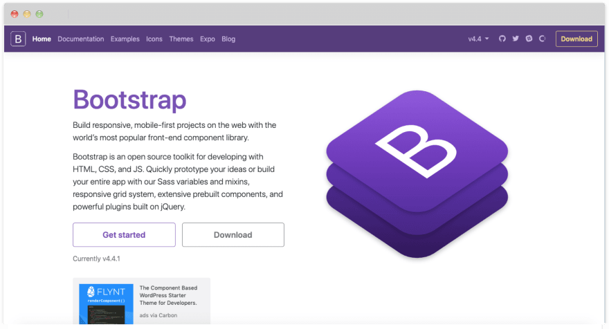
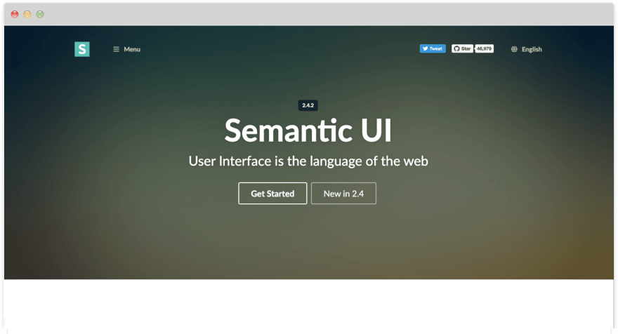
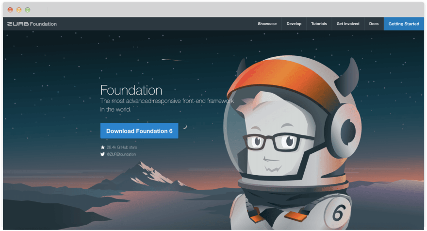
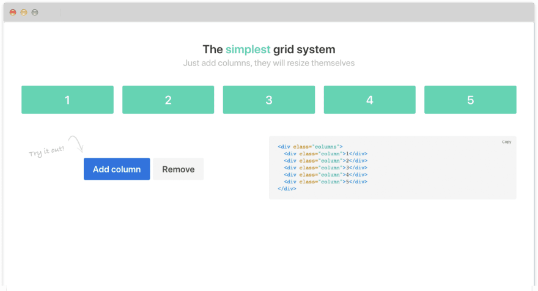
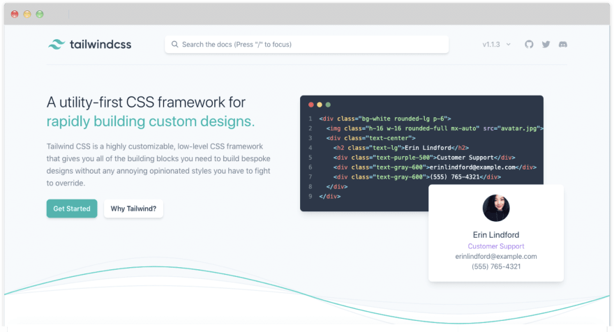
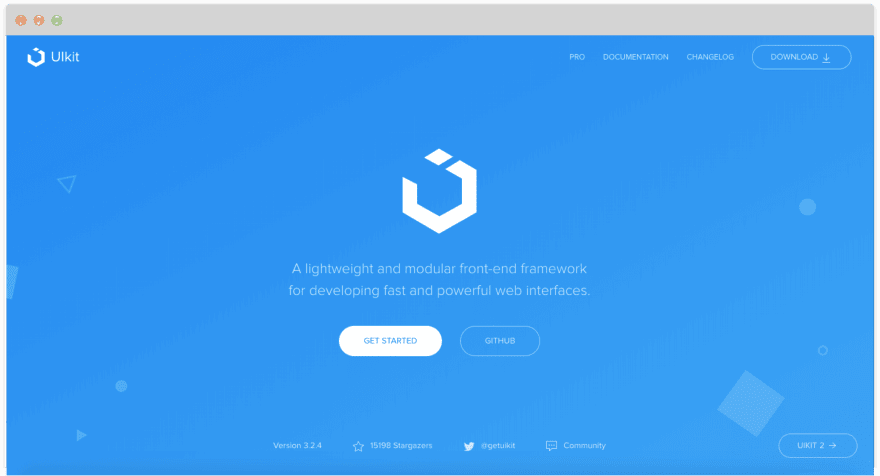

6 awesome CSS frameworks, which you should know as a front-end developer - DEV Community 👩‍💻👨‍💻

#  6 awesome CSS frameworks, which you should know as a front-end developer

###     [  Duomly](https://dev.to/duomly)      Dec 16  ・7 min read

 [#programming](https://dev.to/t/programming)  [#css](https://dev.to/t/css)  [#codenewbie](https://dev.to/t/codenewbie)  [#beginners](https://dev.to/t/beginners)

This article was originally published at: https://www.blog.duomly.com/css-frameworks/

* * *

As a front-end programmer, I talk a lot about front-end frameworks, but I very often forget about how important are CSS frameworks and how much time they can save.

When building the UI, we need a consistent and effective CSS, which can be a hard challenge to achieve. And that's the reason why many front-end developers are looking for a solution in one of the popular CSS frameworks, like Bootstrap.

CSS frameworks allow us to build a beautiful front-end, and besides the nice colors and tables, most of them also came with responsive design, which makes our work more comfortable, because we don't have to create another CSS code for mobile versions, everything is already there.

While coming to a selection of a CSS framework suitable to the certain project we have to take into consideration a few aspects like:

- **performance**, because nobody wants to get a slow application,
- **ease of usage**, because other developers shouldn't have issues with using it,
- **icons**, because we want to avoid using another library just for icons,
- **components and features**, we want the framework to provide solutions for as much layout elements as possible,
- **Sass or Less**, because we may want to use one of them,
- **responsiveness**, because we want to avoid writing additional code,
- **design**, because it would be good to look pretty.

In this article, I'd like to make this choice a little easier, and that's why I'm going to go through the six CSS frameworks, known and less known, and present their pros and cons.

Youtube version of this article is available here:

#### 1. Bootstrap

Bootstrap is one of the most popular CSS frameworks among developers; it was created by Twitter. Bootstrap was the first one who started to promote the mobile-first idea. Today, everything you have to do to achieve a mobile view of your website or application, you have to add certain Bootstrap classes, and that's all.

A big advantage of the Bootstrap frameworks, and possibly one of the success and significant popularity factors is easy to use and learn. Bootstrap is very beginner-friendly; every component and feature is created in a way to make it clear and understandable even for developers on every level.

It probably results from the great documentation which Bootstrap has. Everything is simple with code examples, the description, and visual representation of the effect.

There is a lot of resources to learn Bootstrap, even whole courses of building the projects using this framework. Also, there are a lot of examples of ready layouts that you can check whenever you need it.

Another point worth to mention about Bootstrap is that since 2011, when it was introduced, it's still supported and updated. Not so far ago, the new 4.0 version was released with such improvements like flexbox, Sass and Less support, or new responsive classes.

Sometimes if we use too many classes, it can get messy and complicated. Also, we may have a feeling that a lot of websites based on Bootstrap, without any visual changes, looks the same, and it's hard to make it different.

With the larger amount of pros over the cons, Bootstrap may be considered as one of the best choices when looking for a stable CSS framework.

#### 2. Semantic UI

Semantic UI is another competitor, among other CSS frameworks. It grew with the unique approach they have, focusing on human-friendly HTML, and exactly that's the feeling I got using Semantic UI.

The human-friendly HTML approach made Semantic UI an easy to learn framework which is easily accessible even for beginners. While using Semantic UI, the image has simple the „ui image" class, and if you want to change the size, nothing complicated. It's enough to add a „small" class.

The design and amount of available components make Semantic UI a serious competitor to other frameworks. The design allows us to build a pretty UI or website without many changes, but it's still not an outstanding effect.

Semantic UI also supports responsive design, and it makes it good. Also, the documentation is pretty details and easy to understand. Although there aren't a lot of courses about using Semantic UI, I don't think they are necessary.

Coming as easy to use and rich in different components, Semantic UI is another good solution to take into consideration while selecting CSS frameworks.

#### 3. Foundation

Mentioning Bootstrap, it would be a serious mistake not to say a word about Foundation. The website of the Foundation frameworks says that it's „the most advanced responsive front-end framework in the world". To fulfill this motto, Foundation comes with responsiveness, accessibility, mobile-first approach, and it's also readable and customizable.

Calling themself more professional frameworks, creators decided to provide courses and tutorials about Foundation usage, which is a great deal for the users. Also, it's possible to get a certification.

The documentation of the Foundation framework is pretty good, so nobody should get lost in it.

What's even more awesome, Foundation prepared documentation for creating email templates and websites separately.

Foundation is a huge set of tools that allows us to solve a lot of UI tasks, and it's also optimized for emails and apps. What developers can really appreciate is that Foundation comes with CLI, so it's easy to use it with module bundlers.

The design is also pretty nice and allows us to create a really good looking UI.

For junior developers, Foundation may seem a little bit overwhelming; it provides a strong possibility of customization and controlling the frameworks.

I personally think that Foundation is a great framework if you know what you want to achieve, and you need a proper tool.

#### 4. Bulma

Bulma is a pretty new, open-source CSS framework, and what differs it from the ones mentioned above that it's pure CSS. Bulma doesn't require using Javascript at all.

Bulma gained popularity while the 4th version of Bootstrap was developed, and programmers started to love it. Maybe because of simplicity or maybe because it's very elegant and gives very beautiful results. It becomes more popular then Foundation in a short period.

The main points Bulma takes care about is responsiveness, and here Bulma is not worse than other frameworks, it also follows the rule mobile-first.

Another great thing in Bulma is its modularity, which allows us to import only the necessary parts, and save some space.

As Bootstrap, Bulma is based on flexbox and building a grid is one of the simplest I've ever seen. Really!

Bulma has the support of a small but very passionate community, which makes me think that this framework is going to grow much more.

#### 5. Tailwind CSS

Tailwind CSS is a little bit different than other frameworks, because it doesn't focus so much on delivering ready to use components, but it's more about utility classes, which help developers to build what they need. It's more like giving ready building blocks for components.

Sometimes it may look ugly while we add too many classes, but the goal is reached.

Although it's not a primary goal of the Tailwind CSS framework, the elements have a pretty beautiful design.

Also, like all of the presented CSS frameworks, Tailwind CSS is fully responsive.

In my opinion, it's a great framework for developers who don't want to have an imposed design, and who likes to have a wide possibility of customization. Although it's a less known framework, it has a big potential to grow.

#### 6. UIkit

The last CSS framework on my list is UIkit. The website of the framework says it's a lightweight and modular framework, also going a little bit deeper I was able to take a look at a clean and modern design, which makes the framework a solid competitor.

The big advantage of the framework, besides its design, of course, is a wide variety of components, which may help us build even more advanced UIs.

Also, like every other framework on the list, it's fully responsive, and it contains a set of icons possible to use in our UIs. Besides that, it also supports Less and Sass.

Documentation of the framework is short, but it gives all the needed information easily and straightforwardly, so even beginners can work with this framework.

I personally, really like the clean, modern, and kind of spacious design, and I would definitely try this framework in any of my future projects.

#### Conclusion

There are many different CSS frameworks, but in most cases, they provide us similar functionality but in different ways and with a different design. As a developer, we have to take into consideration some more factors than just the visual aspect while selecting the framework. Still, I believe that everyone can find a suitable solution for a particular project.

Writing this article, I found out about some frameworks, which I didn't know before, and I can't wait to try them. Some of them caught me with simplicity, and some of them present such a lovely design, that really makes me want to try it.

I hope you will find this listing useful while selecting a CSS framework for the next project. If I didn't mention something that's caught your eye, let us know in comments and share with us your opinion about the CSS frameworks you like and use a lot.

Thank you for reading,
Anna from Duomly

