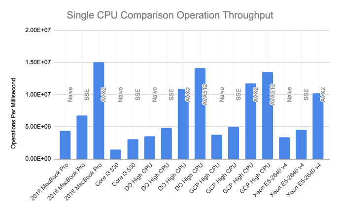
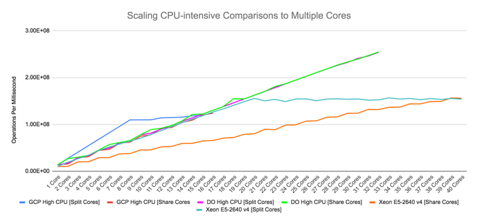
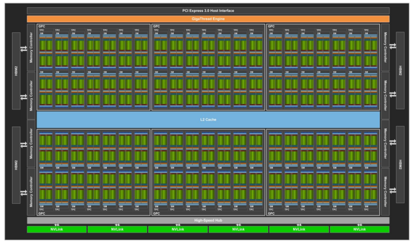
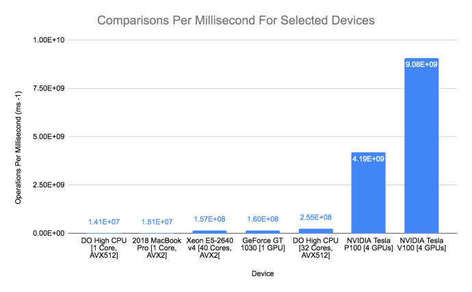

64 Bits ought to be enough for anybody! | Trail of Bits Blog

# 64 Bits ought to be enough for anybody!

- Post
- [November 27, 2019](https://blog.trailofbits.com/2019/11/27/64-bits-ought-to-be-enough-for-anybody/)
- [Leave a comment](https://blog.trailofbits.com/2019/11/27/64-bits-ought-to-be-enough-for-anybody/#respond)

How quickly can we use brute force to guess a 64-bit number? The short answer is, it all depends on what resources are available. So we’re going to examine this problem starting with the most naive approach and then expand to other techniques involving parallelization.

We’ll discuss parallelization at the CPU level with SIMD instructions, then via multiple cores, GPUs, and cloud computing. Along the way we’ll touch on a variety of topics about microprocessors and some interesting discoveries, e.g., adding more cores isn’t always an improvement, and not all cloud vCPUs are equivalent.

## Sixty-four is (more than) a magic number

Why try to guess a 64-bit number? Modern processors operate on 64-bit quantities, so 64 bits is a natural size for magic numbers, headers, and other markers. When fuzzing, it’s common to run into comparisons against such “magic” 64-bit values, but guessing these values is seen as a canonical impossible problem. Fortunately, no one has to use brute force in such situations, because there are better approaches like removing the comparison, using pre-made input seeds, dictionaries, symbolic execution, and compile-time transformation.

But the problem of a brute force guess is easy to understand and parallelize, demonstrating just how effective parallelization can be against a herculean task. Looking at this problem also shows that as hardware gets faster, new sets of computational problems become possible. Imagine what we can achieve using the full arsenal of modern computing power!

Still, we must consider just *how* intractable it is to guess a 64-bit number by simply trying all possibilities. How long would it take? And how much would it cost?

## How big is a 64-bit number?

A 64-bit number can hold 264 (that is, 18,446,744,073,709,551,616) distinct values—more than the grains of sand on Earth and cells in the human body (Figure 1).

|     |     |     |     |     |
| --- | --- | --- | --- | --- |
| **Smallest** |     |     |     | **Largest** |
| Cells in the human body | Amount of sand grains on Earth | 264 | Avagadro’s number | Stars in the Universe |
| [3.72 * 1013](https://www.ncbi.nlm.nih.gov/pubmed/23829164) | [7.5 * 1018](https://www.npr.org/sections/krulwich/2012/09/17/161096233/which-is-greater-the-number-of-sand-grains-on-earth-or-stars-in-the-sky) | [1.84 * 1019](https://www.google.com/search?&q=2**64) | [6.02 * 1023](https://www.nist.gov/si-redefinition/kilogram/kilogram-silicon-spheres-and-international-avogadro-project) | [1024](https://www.esa.int/Science_Exploration/Space_Science/Herschel/How_many_stars_are_there_in_the_Universe) |

A modern CPU can execute about 270 billion instructions per second, so exhausting a 264 search space would take 776 days—a little more than two years. Thankfully, brute force comparison is an embarrassingly parallel problem, where the work can be evenly distributed among many processors. So what if we can coax each processor into doing more than one comparison at a time? Maybe there’s some kind of service where we can get a lot of processors on short notice.

All of a sudden this is starting to look tractable!

## Crunching the numbers

**Disclaimer: **Before we get to the numbers, I want to emphatically state that this is a fun experiment and not a benchmark. No attempt was made to ensure a fair apples-to-apples comparison of different processors or machines. Plus:

- The code used to generate the performance numbers is written in C and lacks tests.
- It may not be the fastest possible version.
- It is also certain to have multiple bugs.
- In fact, a serious time measurement bug found during review delayed this post by a few weeks.

Fixes and suggestions are [welcome on Github](https://github.com/trailofbits/sixtyfour).

All measurements reflect an average of 10 trials. Two of the machines tested are cloud instances in Digital Ocean and Google Cloud, respectively. The Digital Ocean (DO) High CPU instance reports itself as an “Intel(R) Xeon(R) Platinum 8168 CPU” running at 2.70 GHz. The Google Cloud (GCP) High CPU instance reports itself as an “Intel(R) Xeon(R) CPU” running at 3.10 GHz. Neither of these self-reported identifiers can be trusted: Virtualization platforms can and usually do lie about the underlying CPU. Cloud machines are also shared, and what other tenants do on your machine may affect your CPU throughput.

Of the physical machines tested, my 2018 MacBook Pro has an [Intel Core i7 8559U](https://ark.intel.com/content/www/us/en/ark/products/137979/intel-core-i7-8559u-processor-8m-cache-up-to-4-50-ghz.html) processor. The [Xeon E5-2640 v4](https://ark.intel.com/content/www/us/en/ark/products/92984/intel-xeon-processor-e5-2640-v4-25m-cache-2-40-ghz.html) is a 2.40 GHz 40-core shared server. Both of these machines had other software running at the same time as these measurements. The [Core i3 530](https://ark.intel.com/content/www/us/en/ark/products/46472/intel-core-i3-530-processor-4m-cache-2-93-ghz.html) running at 2.93 GHz is an old machine that was literally serving as a footrest and cat scratching post before it was revived for this project thanks to its GPU.

**Pull Requests Wanted:** You will notice that these are all x86 CPUs. ARM system measurements are very much wanted. I did not include these since this project was already taking too long, and I would have to start from scratch to learn ARM’s SIMD instructions.

### The naive for loop

Some say premature optimization is the root of all evil. So let’s measure how long a generic [for loop](https://github.com/trailofbits/sixtyfour/blob/master/naive.c) takes to compare all 264 values. Figure 2 below lists the operations per millisecond (an average of 10 runs) performed on a subset of the full 64-bit range, and an estimate of how long it would take to try all 264 values.

|     |     |     |
| --- | --- | --- |
| **Device** | **Operations Per Millisecond (ms-1)** | **Years To Completion (Yrs)** |
| **2018 MacBook Pro** | **4.41E+06** | **132.78** |
| Core i3 530 | 1.45E+06 | 402.46 |
| DO High CPU | 3.50E+06 | 167.30 |
| GCP High CPU | 3.77E+06 | 155.21 |
| Xeon E5-2640 v4 | 3.37E+06 | 173.38 |

The most naive approach would take 133 years. Clearly, this is much too long to wait and some optimization is in order.

### Vectorized for loop

Modern processors can operate on multiple 64-bit quantities at a time via SIMD or vector instructions. Currently, Intel leads the pack with AVX-512, which, like the name implies, operates on 512-bit vectors. This lets us compare *eight* 64-bit quantities per iteration. For those who want to know more about vector instructions, Cornell has a [good set of introductory material on the topic](https://cvw.cac.cornell.edu/vector/overview_simd)

Vectorization is the process of transforming code that runs on one quantity at a time (a scalar) into code that operates on multiple quantities simultaneously (a vector). Vectorization was my first optimization, because I thought clang would automatically vectorize code for me. Unfortunately, I was wrong—[clang’s auto vectorization](https://llvm.org/docs/Vectorizers.html) is meant to vectorize code without dependence on the loop variable, like matrix multiplication. Instead of relying on the compiler, I used artisanally hand-crafted vectorized comparisons ([sse](https://github.com/trailofbits/sixtyfour/blob/master/sse.c), [avx2](https://github.com/trailofbits/sixtyfour/blob/master/avx.c), and [avx512](https://github.com/trailofbits/sixtyfour/blob/master/avx512.c)) and hand-unrolled loops to make maximum use of multiple vector execution units.

Vector instructions are continually improving, but not every x86 CPU supports AVX-512. Some only support AVX2 (256-bit vectors), while others just do SSE4.1 (128-bit vectors), and some don’t even support that. In Figure 3 (table) and Figure 4 (graph) below, we can compare different vectorization approaches available on our hardware collection.

|     |     |     |     |
| --- | --- | --- | --- |
| **Device** | **Method** | **Operations Per Millisecond (ms-1)** | **Years To Completion (Yrs)** |
| 2018 MacBook Pro | Naive | 4.41E+06 | 132.78 |
| 2018 MacBook Pro | SSE | 6.73E+06 | 86.94 |
| **2018 MacBook Pro** | **AVX2** | **1.51E+07** | **38.85** |
| Core i3 530 | Naive | 1.45E+06 | 402.46 |
| Core i3 530 | SSE | 3.08E+06 | 190.12 |
| DO High CPU | Naive | 3.50E+06 | 167.30 |
| DO High CPU | SSE | 4.86E+06 | 120.44 |
| DO High CPU | AVX2 | 1.09E+07 | 53.57 |
| DO High CPU | AVX512 | 1.41E+07 | 41.44 |
| GCP High CPU | Naive | 3.77E+06 | 155.21 |
| GCP High CPU | SSE | 5.02E+06 | 116.41 |
| GCP High CPU | AVX2 | 1.17E+07 | 49.82 |
| GCP High CPU | AVX512 | 1.35E+07 | 43.37 |
| Xeon E5-2640 v4 | Naive | 3.37E+06 | 173.38 |
| Xeon E5-2640 v4 | SSE | 4.50E+06 | 129.99 |
| Xeon E5-2640 v4 | AVX2 | 1.02E+07 | 57.49 |

The table above is included for completeness; the graph of the same data below, provides an easier visual comparison.

Figure 4: A graphical representation of Figure 3; performance of different methods to compare 64-bit numbers on a single core.

Several things stand out in this data:

- Vectorization always helps. Comparing more values per iteration is always faster, even when accounting for setup time to move values in and out of vector registers.
- AVX2 (four comparisons at a time) is a big improvement over SSE4.1 (two comparisons at a time). As expected, AVX2 is about twice as fast as SSE4.1.
- Conversely, AVX-512 (eight comparisons at a time) is a *small* improvement over AVX2 (four comparisons at a time). How can this be? I suspect that this is due to a little-known side effect of using AVX-512 instructions: They [slow down the processor by as much as 40%](https://lemire.me/blog/2018/09/07/avx-512-when-and-how-to-use-these-new-instructions/). The processor’s power budget doesn’t permit it to both run at full speed *and* make heavy use of AVX-512.

Even with these improvements, it would *still* take 39 years to check all 64 bits on a single core. How much faster can we go using multiple cores?

### Parallelized and vectorized

The problem of finding a needle in a 64-bit haystack happens to be ridiculously parallelizable, so multiple cores should deliver a linear increase in throughput. The data below (Figure 5) shows that this is true—except when it’s not! Sometimes performance plateus even as more cores are added. How can this be?

This effect is due to [hyperthreading](https://en.wikipedia.org/wiki/Hyper-threading). A hyperthreaded processor presents physical cores as two or more virtual cores to the operating system. While each hyperthread appears independent, the underlying execution units are shared. For computationally intensive applications, hyperthreading can have significant and surprising effects on performance. In a hyperthreaded environment and on CPU-intensive workloads, *which* cores are used can matter almost as much as the *amount* of cores. This is especially important for cloud-based workloads, where each vCPU is a [hyperthread on a physical core](https://cloud.google.com/compute/docs/faq#virtualcpu).

Figure 5: Operations per hour versus number of cores for each tested machine, separated by different methods of allocating cores. MacBook Pro and Core i3 530 results are omitted.

Figure 5 shows multicore performance using two methods to allocate workers to hyperthreads. *Split cores* allocates to separate physical cores, while *share cores* allocates to the same physical core.

The 40-hyperthreaded-core Xeon E5-2640 machine represents this difference: Using split core allocation, performance peaks at 20 cores—the amount of physical cores —and then levels off. Using shared core allocation, throughput follows a step function, increasing with each new physical core. We may also make inferences about cloud hardware using this data: The 16 vCPUs of a high-CPU GCP instance probably represent 8 physical and 16 hyperthreaded cores dedicated to our workload.

The DO high-CPU machine presents a puzzle: The same effect isn’t observed. Assuming the vCPUs come from a real and single [Xeon Platinum 8168](https://ark.intel.com/content/www/us/en/ark/products/120504/intel-xeon-platinum-8168-processor-33m-cache-2-70-ghz.html), there should be differences after 24 cores are utilized. This doesn’t happen, and there are a few possible explanations. First, the vCPUs are not from the same physical processor: The Xeon 8168 can operate in an 8-way multiprocessing configuration. Second, the processor is not a Xeon 8168, but another chip altogether. And finally, there may be something wrong with my thread affinity or timing measurement code.

Regardless, the scaling results show a valuable lesson: Using more cores isn’t always better, and it matters *which* cores (or vCPUs) you use. There is little to no gain, for this workload, when allocating more workers than physical cores present in the machine. Always measure when performance counts.

For completeness, Figure 6 lists operations per millisecond and estimated years to completion when utilizing multiple cores, with each core using the fastest supported single-core method. For the cloud machines, each core is a “vCPU,” which is roughly equivalent to one hyperthreaded core. For physical machines, each core is one hyperthreaded core.

|     |     |     |     |
| --- | --- | --- | --- |
| **Device** | **Cores (Hyperthreaded)** | **Operations Per Millisecond (ms-1)** | **Years To Completion (Yrs)** |
| Xeon E5-2640 v4 | 39 / 40 | 1.57E+08 | 3.73 |
| GCP High CPU | 16 / 16 | 1.24E+08 | 4.71 |
| **DO High CPU** | **32 / 32** | **2.55E+08** | **2.30** |
| Core i3 530 | 2 / 4 | 6.24E+06 | 93.76 |
| 2018 MacBook Pro | 8 / 8 | 5.14E+07 | 11.38 |

The only outliers in Figure 6 are the Xeon E5-2640, which did best at 39/40 hyperthreaded cores, and the Core i3 530, which did best at 2/4 hyperthreaded cores. Why 39 cores? The machine is shared and handles other workloads; at 39 cores, all workloads can be put on one core. At 40 cores utilized, the workload is spread to more cores and takes scheduling time away from CPU-intensive integer comparisons.

As expected, using multiple CPUs has drastically reduced compute time. However, it is still too slow. We can’t expect to wait *more than two years* to guess one number.

### Enter the graphics

GPUs take a different approach to computation than CPUs. CPUs are good at multiple concurrent tasks; GPUs are great at doing simple operations over a huge volume of data. This manifests in the main architectural differences: A high-end CPU may come with 24 very complex cores, while a high-end GPU comes with 5,120 simple cores (Figure 7).

Figure 7: This is a Tesla V100 GPU from NVIDIA. It comes with 5,120 CUDA cores and was the most powerful GPU tested. Graphic [taken from the NVIDIA Volta architecture whitepaper](https://images.nvidia.com/content/volta-architecture/pdf/volta-architecture-whitepaper.pdf).

Inadvertently, I picked a problem that is tailor-made for GPU optimization. Brute force comparison is easy to parallelize, involves no complex decisions, and is entirely compute- bound. Thanks to the role of GPUs in machine learning, cheap off-peak GPU capacity is available from every large cloud provider.

Figuring out how to use GPU computation took some work, but it was absolutely worth it. Just look at the throughput in Figure 8! There is an order of magnitude performance gain even though my knowledge of GPU programming and CUDA was about zero when I started, and [my CUDA code](https://github.com/trailofbits/sixtyfour/blob/master/gpu.cu) has approximately my-first-CUDA-tutorial-level of optimization.

|     |     |     |     |
| --- | --- | --- | --- |
| **Device** | **GPUs** | **Operations Per Millisecond (ms-1)** | **Years To Completion (Yrs)** |
| GeForce GT 1030 | 1   | 1.60E+08 | 3.66 |
| NVIDIA Tesla K80 | 8   | 2.92E+09 | 0.20 |
| NVIDIA Tesla P100 | 4   | 4.19E+09 | 0.14 |
| **NVIDIA Tesla V100** | **4** | **9.08E+09** | **0.06** |

As Figure 8 shows, using GPUs instead of CPUs shortens the required time from years to *days*. What a difference the right platform makes! An old $85 video card (the [GeForce GT 1030](https://www.geforce.com/hardware/desktop-gpus/geforce-gt-1030/specifications)) performs on par with a 40-core Xeon machine. Using 4x [NVIDIA Tesla V100](https://www.nvidia.com/en-us/data-center/tesla-v100/) GPUs, we can brute force a 64-bit comparison in 0.06 years, or about 22 *days*.

The difference between CPU and GPU computation for this problem is so dramatic (a lone V100 is about 18.5x as fast as 16 high-CPU cores) that it doesn’t make sense to use CPUs. Adding another GPU will always be a better use of resources than relying on CPU computation. To show how bad CPUs are at this problems, I made this handy graph:

Figure 9: Throughput when comparing 64-bit numbers on selected CPUs and GPUs. This specific problem can be done so much faster on GPUs that it doesn’t make sense to use CPUs at all.

Now that we’ve gone from 130 years (with the naive for loop) to 22 days (on multiple GPUs), can we get to hours or minutes? How much hardware would it take…and how much would it cost?

## Show me the money

We established that GPUs are much faster than CPUs, but GPU time is also much more expensive. And which GPU is best? Different GPU families command rather different prices.

Using current pricing (as of November 2019), we can see that the price/performance of GPUs is about ~5x as good as CPUs. While more expensive, the V100 delivers better performance per dollar than its GPU predecessors (Figure 10).

|     |     |     |     |
| --- | --- | --- | --- |
|     | **Compute-Years Needed** | **Per-Hour Cost (Preemptible)** | **Total Cost** |
| Pre-Emptible CPU GCP [16 vCPU] | 4.71 | $0.20 | $8,311.70 |
| Pre-Emptible GPU [4x P100] | 0.14 | $1.76 | $2,147.34 |
| **Pre-Emptible GPU [4x V100]** | **0.06** | **$3.00** | **$1,689.45** |
| Pre-Emptible K80 [8x K80] | 0.20 | $1.12 | $1,959.64 |

For something that seemed so insurmountable at the start, the final cost is well within reach: Comparing a number against 264 values would take about $1,700 of preemptible GPU compute time.

Because the problem can be parallelized so efficiently, total compute time is almost directly interchangeable for hardware cost and availability. For example, 4x V100 GPUs will look through all 264 numbers in about 22 days, but 2,259x V100 GPUs would look through 264 numbers in about an hour, for the same overall cost.

## Conclusion

This silly experiment shows the importance of understanding your problem, your hardware, and the kinds of computing resources that are available to the average developer.

What seemed like a completely crazy idea turned out to be only mildly insane. Trying 264 comparisons would cost about $1,700 in compute time, and can be accomplished in hours or days.

We also learned a few more things along the way:

- Parallelization is not always easy, but it can be remarkably effective. Learning some CUDA made this originally insurmountable problem go from impractical to “tolerable but expensive.”
- Using more cores isn’t always better, and it matters which cores you use.
- The underlying hardware can leak under the abstraction of the cloud.
- Cloud computing provides access to nearly limitless on-demand hardware; it just has to be put to use.

There are certainly many problems that seem crazy and completely out of reach, but can be solved via a combination of parallelizable algorithms, cloud computing, and a corporate credit card.

We’re always developing ways to work faster and smarter. Need help with your next project? [Contact us](https://www.trailofbits.com/contact/)!

### Share this:

- [Twitter](https://blog.trailofbits.com/2019/11/27/64-bits-ought-to-be-enough-for-anybody/?share=twitter&nb=1)
- [LinkedIn](https://blog.trailofbits.com/2019/11/27/64-bits-ought-to-be-enough-for-anybody/?share=linkedin&nb=1)
- [Reddit](https://blog.trailofbits.com/2019/11/27/64-bits-ought-to-be-enough-for-anybody/?share=reddit&nb=1)
- [Telegram](https://blog.trailofbits.com/2019/11/27/64-bits-ought-to-be-enough-for-anybody/?share=telegram&nb=1)
- [Facebook](https://blog.trailofbits.com/2019/11/27/64-bits-ought-to-be-enough-for-anybody/?share=facebook&nb=1)
- [Email](https://blog.trailofbits.com/2019/11/27/64-bits-ought-to-be-enough-for-anybody/?share=email&nb=1)
- [Print](https://blog.trailofbits.com/2019/11/27/64-bits-ought-to-be-enough-for-anybody/#print)

-

[Like](https://widgets.wp.com/likes/index.html?ver=20190321#)

- 

One blogger likes this.

### *Related*

[A fuzzer and a symbolic executor walk into a cloud](https://blog.trailofbits.com/2016/08/02/engineering-solutions-to-hard-program-analysis-problems/)In "Cyber Grand Challenge"

[Heavy lifting with McSema 2.0](https://blog.trailofbits.com/2018/01/23/heavy-lifting-with-mcsema-2-0/)In "Binary Ninja"

[An accessible overview of Meltdown and Spectre, Part 1](https://blog.trailofbits.com/2018/01/30/an-accessible-overview-of-meltdown-and-spectre-part-1/)In "Compilers"

By Artem Dinaburg

Posted in [Research Practice](https://blog.trailofbits.com/category/research-practice/)