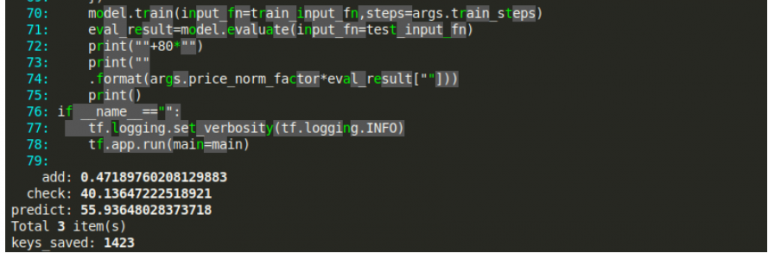
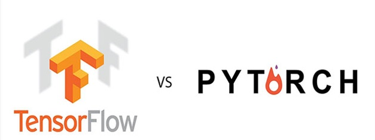

7 Innovative Machine Learning GitHub Repositories in Python

[Machine Learning](https://www.analyticsvidhya.com/blog/category/machine-learning/)[Python](https://www.analyticsvidhya.com/blog/category/python-2/)

# 7 Innovative Machine Learning GitHub Projects you Should Try Out in Python

[Pranav Dar](https://www.analyticsvidhya.com/blog/author/datascience22/),August 2, 2019

[Login to Bookmark this article](https://id.analyticsvidhya.com/accounts/login/?next=https://www.analyticsvidhya.com/blog/2019/08/7-innovative-machine-learning-github-projects-in-python/)

## Overview

- Looking for machine learning projects to do right now? Here are 7 wide-ranging GitHub projects to try out
- These projects cover multiple machine learning domains, including NLP, computer vision and Big Data
- Add these to your machine learning skillset and expand your knowledge

## Introduction

I have conducted tons of [interviews for data science](https://courses.analyticsvidhya.com/courses/ace-data-science-interviews??utm_source=blog&utm_medium=7-innovative-machine-learning-github-projects-in-python) positions in the last couple of years. One thing has stood out – aspiring machine learning professionals don’t focus enough on projects that will make them stand out.

And no, I don’t mean online competitions and hackathons (though that is always a plus point to showcase). I’m talking about off-the-cuff experiments you should do using libraries and frameworks that have just been released. This shows the interviewer two broad things:

- You have an unquenchable curiosity for machine learning. This is a vital aspect of being a successful data scientist
- You are not afraid to experiment with new algorithms and techniques

And guess which platform has the latest [machine learning](https://courses.analyticsvidhya.com/courses/applied-machine-learning-beginner-to-professional/?utm_source=blog&utm_medium=7-innovative-machine-learning-github-projects-in-python) developments and code? That’s right – GitHub!

So let’s look at the top seven machine learning GitHub projects that were released last month. These projects span the length and breadth of machine learning, including projects related to [Natural Language Processing (NLP)](https://courses.analyticsvidhya.com/courses/natural-language-processing-nlp/?utm_source=blog&utm_medium=7-innovative-machine-learning-github-projects-in-python), [Computer Vision](https://courses.analyticsvidhya.com/courses/computer-vision-using-deep-learning-version2/?utm_source=blog&utm_medium=7-innovative-machine-learning-github-projects-in-python), Big Data and more.

*This is part of our monthly Machine Learning GitHub series we have been running since January 2018. Here are the links for this year so you can catch up quickly:

*

- *[January](https://www.analyticsvidhya.com/blog/2019/02/top-5-data-science-github-reddit-january-2019/?utm_source=blog&utm_medium=7-innovative-machine-learning-github-projects-in-python)*
- *[February](https://www.analyticsvidhya.com/blog/2019/03/top-5-data-science-github-repositories-reddit-discussions-february-2019/?utm_source=blog&utm_medium=7-innovative-machine-learning-github-projects-in-python)*
- *[March](https://www.analyticsvidhya.com/blog/2019/04/top-5-machine-learning-github-reddit/?utm_source=blog&utm_medium=7-innovative-machine-learning-github-projects-in-python)*
- *[April](https://www.analyticsvidhya.com/blog/2019/05/5-data-science-github-reddit-april/?utm_source=blog&utm_medium=7-innovative-machine-learning-github-projects-in-python)*
- [*May*](https://www.analyticsvidhya.com/blog/2019/06/top-7-machine-learning-github-repositories-data-scientists/?utm_source=blog&utm_medium=7-innovative-machine-learning-github-projects-in-python)
- [*June*](https://www.analyticsvidhya.com/blog/2019/07/6-powerful-open-source-machine-learning-github-repositories-data-scientists/?utm_source=blog&utm_medium=7-innovative-machine-learning-github-projects-in-python)

## Top Machine Learning GitHub Projects

## [PyTorch-Transformers](https://github.com/huggingface/pytorch-transformers) (NLP)

I’ll be honest – the power of Natural Language Processing (NLP) blows my mind. I started working in data science a few years back and the sheer scale at which NLP has grown and transformed the way we work with text – it almost defies description.

PyTorch-Transformers is the latest in a long line of state-of-the-art NLP libraries. It has beaten all previous benchmarks in various NLP tasks. What I really like about PyTorch Transformers is that is contains PyTorch implementations, pretrained models weights and other important components to get you started quickly.

You might have been frustrated previously at the ridiculous amount of computation power required to run state-of-the-art models. I know I was (not everyone has Google’s resources!). PyTorch-Transformers eradicates the issue to a large degree and enables folks like us to build state-of-the-art NLP models.

Here are a few in-depth articles to get you started with PyTorch-Transformers (and the concept of pre-trained models in NLP):

- [Introduction to PyTorch-Transformers: An Incredible Library for State-of-the-Art NLP (with Python code)](https://www.analyticsvidhya.com/blog/2019/07/pytorch-transformers-nlp-python/?utm_source=blog&utm_medium=7-innovative-machine-learning-github-projects-in-python)
- [8 Excellent Pretrained Models to get you Started with NLP](https://www.analyticsvidhya.com/blog/2019/03/pretrained-models-get-started-nlp/?utm_source=blog&utm_medium=7-innovative-machine-learning-github-projects-in-python)
- [An Introduction to PyTorch – A Simple yet Powerful Deep Learning Library](https://www.analyticsvidhya.com/blog/2018/02/pytorch-tutorial/?utm_source=blog&utm_medium=7-innovative-machine-learning-github-projects-in-python)

## [NeuralClassifier](https://github.com/Tencent/NeuralNLP-NeuralClassifier) (NLP)

Multi-label classification on text data is quite a challenge in the real world. We typically work on single label tasks when we’re dealing with early stage NLP problems. The level goes up several notches on real-world data.

**

> In a multi-label classification problem, an instance/record can have multiple labels and the number of labels per instance is not fixed.

**

NeuralClassifier enables us to quickly implement neural models for hierarchical multi-label classification tasks. What I personally like about NeuralClassifier is that it provides a wide variety of text encoders we are familiar with, such as FastText, RCNN, Transformer encoder and so on.

We can perform the below classification tasks using NeuralClassifier:

- Binary-class text classification
- Multi-class text classification
- Multi-label text classification
- Hierarchical (multi-label) text classification

Here are two excellent articles to read up on what exactly multi-label classification is and how to perform it in Python:

- [Predicting Movie Genres using NLP – An Awesome Introduction to Multi-Label Classification](https://www.analyticsvidhya.com/blog/2019/04/predicting-movie-genres-nlp-multi-label-classification/?utm_source=blog&utm_medium=7-innovative-machine-learning-github-projects-in-python)
- [Build your First Multi-Label Image Classification Model in Python](https://www.analyticsvidhya.com/blog/2019/04/build-first-multi-label-image-classification-model-python/?utm_source=blog&utm_medium=7-innovative-machine-learning-github-projects-in-python)

## [TDEngine](https://github.com/taosdata/TDengine) (Big Data)

This TDEngine repository received the most stars of any new project on GitHub last month. Close to 10,000 stars in less than a month. Let that sink in for a second.

**TDEngine is an open-source Big Data platform** designed for:

- Internet of Things (IoT)
- Connected Cars
- Industrial IoT
- IT Infrastructure, and much more.

TDEngine essentially provides a whole suit of tasks that we associate with data engineering. And we get to do all this at super quick speed (10x speed on processing queries and 1/5th computational usage).

There’s a caveat (for now) – *TDEngine only supports execution on Linux*. This GitHub repository includes the full documentation and starter’s guide with code.

I suggest checking out our comprehensive resource guide for data engineers:

- [Want to Become a Data Engineer? Here’s a Comprehensive List of Resources to get Started](https://www.analyticsvidhya.com/blog/2018/11/data-engineer-comprehensive-list-resources-get-started/?utm_source=blog&utm_medium=7-innovative-machine-learning-github-projects-in-python)

## [Video Object Removal](https://github.com/zllrunning/video-object-removal) (Computer Vision)

Have you worked with any image data yet? Computer Vision techniques for manipulating and dealing with images are quite advanced. Object detection for images is considered a basic step to becoming a computer vision expert.

What about videos, though? The difficult level goes up several notches when we’re asked to simply draw bounding boxes around objects in videos. The dynamic aspect of objects makes the entire concept more complex.

So, imagine my delight when I came across this GitHub repository. **We just need to draw a bounding box around the object in the video to remove it.** It really is that easy! Here are a couple of examples of how this project works:

If you’re new to the world of computer vision, here are a few resources to get you up and running:

- [A Step-by-Step Introduction to the Basic Object Detection Algorithms](https://www.analyticsvidhya.com/blog/2018/10/a-step-by-step-introduction-to-the-basic-object-detection-algorithms-part-1/?utm_source=blog&utm_medium=7-innovative-machine-learning-github-projects-in-python)
- [Computer Vision using Deep Learning 2.0 Course](https://courses.analyticsvidhya.com/courses/computer-vision-using-deep-learning-version2/?utm_source=blog&utm_medium=7-innovative-machine-learning-github-projects-in-python)

## [Python Autocomplete](https://github.com/vpj/python_autocomplete) (Programming)

You’ll love this machine learning GitHub project. As data scientists, our entire role revolves around experimenting with algorithms (well, most of us). **This project is about how a simple LSTM model can autocomplete Python code.**

The code highlighted in grey below is what the LSTM model filled in (and the results are at the bottom of the image):

As the developers put it:
**

> We train and predict on after cleaning comments, strings and blank lines in the python code. The model is trained after tokenizing python code. It seems more efficient than character level prediction with byte-pair encoding.

**

If you’ve ever spent (wasted) time on writing out mundane Python lines, this might be exactly what you’re looking for. It’s still in the *very* early stages so be open to a few issues.

And if you’re wondering what in the world LSTM is, you should read this introductory article:

- [Essentials of Deep Learning: Introduction to Long Short Term Memory (LSTM)](https://www.analyticsvidhya.com/blog/2017/12/fundamentals-of-deep-learning-introduction-to-lstm/?utm_source=blog&utm_medium=7-innovative-machine-learning-github-projects-in-python)

## [tfpyth – TensorFlow to PyTorch to TensorFlow](https://github.com/BlackHC/tfpyth) (Programming)

TensorFlow and PyTorch both have strong user communities. But the incredible adoption rate of PyTorch should see it leapfrog TensorFlow in the next year or two. *Note: This isn’t a knock on TensorFlow which is pretty solid.*

So if you have written any code in TensorFlow and a separate one in PyTorch and want to combine the two to train a model – the *tfpyth* framework is for you. The best part about *tfpyth* is that we don’t need to rewrite the earlier code.

This GitHub repository includes a well structured example of how you can use *tfpyth*. It’s definitely a refreshing look at the TensorFlow vs. PyTorch debate, isn’t it?

Installing *tfpyth* is this easy:
pip install tfpyth

Here are a couple of in-depth articles to learn how TensorFlow and PyTorch work:

- [Deep Learning Guide: Introduction to Implementing Neural Networks using TensorFlow in Python](https://www.analyticsvidhya.com/blog/2016/10/an-introduction-to-implementing-neural-networks-using-tensorflow/?utm_source=blog&utm_medium=7-innovative-machine-learning-github-projects-in-python)
- [An Introduction to PyTorch – A Simple yet Powerful Deep Learning Library](https://www.analyticsvidhya.com/blog/2018/02/pytorch-tutorial/?utm_source=blog&utm_medium=7-innovative-machine-learning-github-projects-in-python)

## [MedicalNet](https://github.com/Tencent/MedicalNet)

I associate transfer learning with NLP. That’s my fault – I am so absorbed with the new developments that I did not imagine where else transfer learning could be applied. So I was thrilled when I came across this wonderful MedicalNet project.

This GitHub repository contains a PyTorch implementation of the ‘[Med3D: Transfer Learning for 3D Medical Image Analysis](https://arxiv.org/abs/1904.00625)‘ paper. This machine learning project aggregates the medical dataset with diverse modalities, target organs, and pathologies to build relatively large datasets.

And as we well know, our deep learning models do (usually) require a large amount of training data. So MedicalNet, released by TenCent, is a brilliant open source project I hope a lot of folks work on.

The developers behind MedicalNet have released four pretrained models based on 23 datasets. And here is an intuitive introduction to transfer learning if you needed one:

- [Transfer Learning & The Art of using Pre-trained Models in Deep Learning](https://www.analyticsvidhya.com/blog/2017/06/transfer-learning-the-art-of-fine-tuning-a-pre-trained-model/?utm_source=blog&utm_medium=7-innovative-machine-learning-github-projects-in-python)

## End Notes

Quite a mix of machine learning projects we have here. I have provided tutorials, guides and resources after each GitHub project.

I have one ask – pick the project that interests you, go through the tutorial, and then apply that particular library to solve the problem. For example, you could take up the NeuralClassifier repository and use that to solve a multi-label classification problem.

This will help you broaden your understanding of the topic and expand your current skillset. A win-win scenario! Let me know your thoughts, your favorite project from the above list, and your feedback in the comments section below.

You can also read this article on Analytics Vidhya's Android APP 

### Share this:

- [Click to share on LinkedIn (Opens in new window)](https://www.analyticsvidhya.com/blog/2019/08/7-innovative-machine-learning-github-projects-in-python/?share=linkedin&nb=1)
- [Click to share on Facebook (Opens in new window)](https://www.analyticsvidhya.com/blog/2019/08/7-innovative-machine-learning-github-projects-in-python/?share=facebook&nb=1)
- [Click to share on Twitter (Opens in new window)](https://www.analyticsvidhya.com/blog/2019/08/7-innovative-machine-learning-github-projects-in-python/?share=twitter&nb=1)
- [Click to share on Pocket (Opens in new window)](https://www.analyticsvidhya.com/blog/2019/08/7-innovative-machine-learning-github-projects-in-python/?share=pocket&nb=1)
- [Click to share on Reddit (Opens in new window)](https://www.analyticsvidhya.com/blog/2019/08/7-innovative-machine-learning-github-projects-in-python/?share=reddit&nb=1)

-

Tags : [best github repositories](https://www.analyticsvidhya.com/blog/tag/best-github-repositories/),  [Computer Vision](https://www.analyticsvidhya.com/blog/tag/computer-vision/),  [deep learning](https://www.analyticsvidhya.com/blog/tag/deep-learning/),  [GitHub machine learning](https://www.analyticsvidhya.com/blog/tag/github-machine-learning/),  [github repositories](https://www.analyticsvidhya.com/blog/tag/github-repositories/),  [machine learning](https://www.analyticsvidhya.com/blog/tag/machine-learning/),  [NLP](https://www.analyticsvidhya.com/blog/tag/nlp/),  [NLP github](https://www.analyticsvidhya.com/blog/tag/nlp-github/),  [python](https://www.analyticsvidhya.com/blog/tag/python/)

*h*[*T* Previous Article  ### A Data Science Leader’s Guide to Managing Stakeholders](https://www.analyticsvidhya.com/blog/2019/08/data-science-leader-guide-managing-stakeholders/)

### [Pranav Dar](https://www.analyticsvidhya.com/blog/author/datascience22/)

Senior Editor at Analytics Vidhya. Data visualization practitioner who loves reading and delving deeper into the data science and machine learning arts. Always looking for new ways to improve processes using ML and AI.