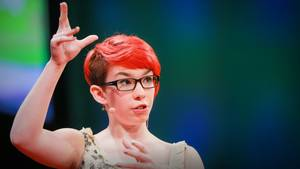
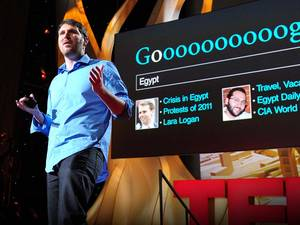
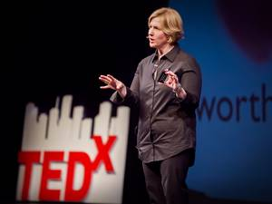
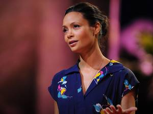
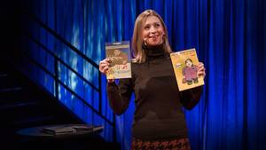

7 TED Talks for those who want to break out of their shell

- [ 9:46](https://www.ted.com/talks/kare_anderson_be_an_opportunity_maker)

[Kare Anderson](https://www.ted.com/speakers/kare_anderson)[Be an opportunity maker](https://www.ted.com/talks/kare_anderson_be_an_opportunity_maker)

[**Add to list](https://www.ted.com/session/new)·[74 comments**](https://www.ted.com/talks/kare_anderson_be_an_opportunity_maker)

- [ 3:27](https://www.ted.com/talks/matt_cutts_try_something_new_for_30_days)

[Matt Cutts](https://www.ted.com/speakers/matt_cutts)[Try something new for 30 days](https://www.ted.com/talks/matt_cutts_try_something_new_for_30_days)

[**Add to list](https://www.ted.com/session/new)·[721 comments**](https://www.ted.com/talks/matt_cutts_try_something_new_for_30_days)

- [ 6:08](https://www.ted.com/talks/rosie_king_how_autism_freed_me_to_be_myself)

[Rosie King](https://www.ted.com/speakers/rosie_king)[How autism freed me to be myself](https://www.ted.com/talks/rosie_king_how_autism_freed_me_to_be_myself)

[**Add to list](https://www.ted.com/session/new)·[166 comments**](https://www.ted.com/talks/rosie_king_how_autism_freed_me_to_be_myself)

- [ 9:04](https://www.ted.com/talks/eli_pariser_beware_online_filter_bubbles)

[Eli Pariser](https://www.ted.com/speakers/eli_pariser)[Beware online "filter bubbles"](https://www.ted.com/talks/eli_pariser_beware_online_filter_bubbles)

[**Add to list](https://www.ted.com/session/new)·[504 comments**](https://www.ted.com/talks/eli_pariser_beware_online_filter_bubbles)

- [20:19 Now playing](https://www.ted.com/talks/brene_brown_on_vulnerability)

[Brené Brown](https://www.ted.com/speakers/brene_brown)[The power of vulnerability](https://www.ted.com/talks/brene_brown_on_vulnerability)

Brené Brown studies human connection — our ability to empathize, belong, love. In a poignant, funny talk, she shares a deep insight from her research, one that sent her on a personal quest to know herself as well as to understand humanity. A talk to share.

[**Add to list](https://www.ted.com/session/new)·[1914 comments**](https://www.ted.com/talks/brene_brown_on_vulnerability)

- [13:55](https://www.ted.com/talks/thandie_newton_embracing_otherness_embracing_myself)

[Thandie Newton](https://www.ted.com/speakers/thandie_newton)[Embracing otherness, embracing myself](https://www.ted.com/talks/thandie_newton_embracing_otherness_embracing_myself)

[**Add to list](https://www.ted.com/session/new)·[620 comments**](https://www.ted.com/talks/thandie_newton_embracing_otherness_embracing_myself)

- [12:03](https://www.ted.com/talks/ann_morgan_my_year_reading_a_book_from_every_country_in_the_world)

[Ann Morgan](https://www.ted.com/speakers/ann_morgan)[My year reading a book from every country in the world](https://www.ted.com/talks/ann_morgan_my_year_reading_a_book_from_every_country_in_the_world)

[**Add to list](https://www.ted.com/session/new)·[56 comments**](https://www.ted.com/talks/ann_morgan_my_year_reading_a_book_from_every_country_in_the_world)