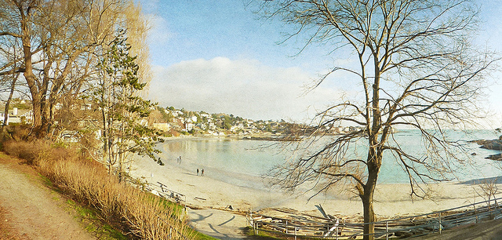
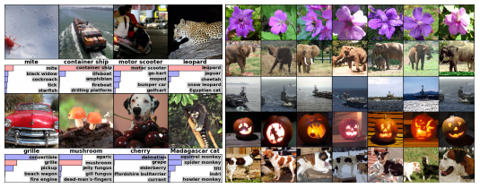
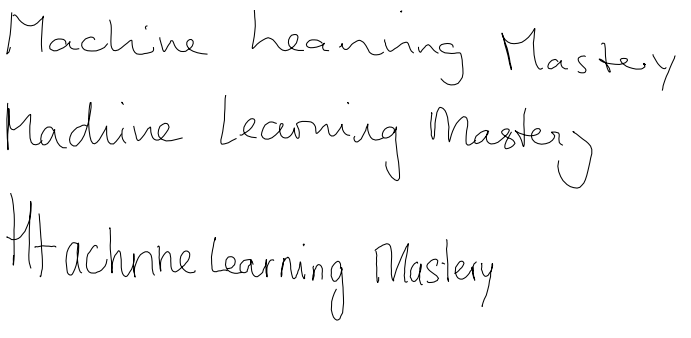
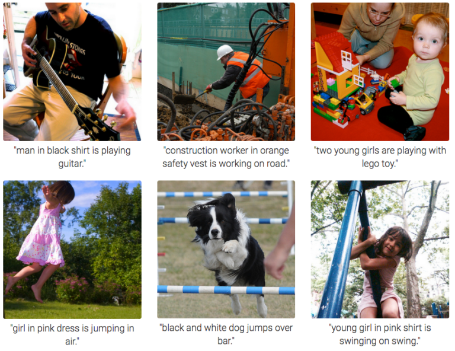
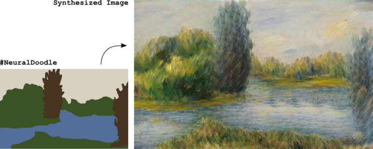
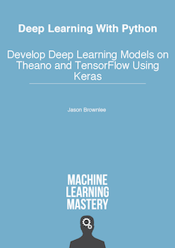

8 Inspirational Applications of Deep Learning

# 8 Inspirational Applications of Deep Learning

By  [Jason Brownlee](https://machinelearningmastery.com/author/jasonb/)  on  July 14, 2016  in  [Deep Learning](https://machinelearningmastery.com/category/deep-learning/)

It is hyperbole to say deep learning is achieving state-of-the-art results across a range of difficult problem domains. A fact, but also hyperbole.

There is a lot of excitement around artificial intelligence, machine learning and deep learning at the moment. It is also an amazing opportunity to get on on the ground floor of some really powerful tech.

I try hard to convince friends, colleagues and students to get started in deep learning and bold statements like the above are not enough. It requires stories, pictures and research papers.

In this post you will discover amazing and recent applications of deep learning that will inspire you to get started in deep learning.

Getting started in deep learning does not have to mean go and study the equations for the next 2-3 years, it could mean [download Keras and start running your first model in 5 minutes flat](http://machinelearningmastery.com/tutorial-first-neural-network-python-keras/). Start applied deep learning. Build things. Get excited and turn it into code and systems.

I have been wanting to write this post for a while. Let’s get started.

Inspirational Applications of Deep Learning

Photo by [Nick Kenrick](https://www.flickr.com/photos/zedzap/12093300505/), some rights reserved.

## Overview

Below is the list of the specific examples we are going to look at in this post.

Not all of the examples are technology that is ready for prime time, but guaranteed, they are all examples that will get you excited.

Some are examples that seem ho hum if you have been around the field for a while. In the broader context, they are not ho hum. Not at all.

Frankly, to an old AI hacker like me, some of these examples are a slap in the face. Problems that I simply did not think we could tackle for decades, if at all.

I’ve focused on visual examples because we can look at screenshots and videos to immediately get an idea of what the algorithm is doing, but there are just as many if not more examples in natural language with text and audio data that are not listed.

Here’s the list:
1. Colorization of Black and White Images.
2. Adding Sounds To Silent Movies.
3. Automatic Machine Translation.
4. Object Classification in Photographs.
5. Automatic Handwriting Generation.
6. Character Text Generation.
7. Image Caption Generation.
8. Automatic Game Playing.

### Need help with Deep Learning in Python?

Take my free 2-week email course and discover MLPs, CNNs and LSTMs (with code).
Click to sign-up now and also get a free PDF Ebook version of the course.

[Start Your FREE Mini-Course Now!](https://machinelearningmastery.leadpages.co/leadbox/142d6e873f72a2%3A164f8be4f346dc/5657382461898752/)

## 1. Automatic Colorization of Black and White Images

Image colorization is the problem of adding color to black and white photographs.

Traditionally this was [done by hand with human effort](https://en.wikipedia.org/wiki/Hand-colouring_of_photographs) because it is such a difficult task.

Deep learning can be used to use the objects and their context within the photograph to color the image, much like a human operator might approach the problem.

A visual and highly impressive feat.

This capability leverages of the high quality and very large convolutional neural networks trained for ImageNet and co-opted for the problem of image colorization.

Generally the approach involves the use of very large convolutional neural networks and supervised layers that recreate the image with the addition of color.

Colorization of Black and White Photographs

Image taken from [Richard Zhang, Phillip Isola and Alexei A. Efros](http://richzhang.github.io/colorization/).

Impressively, the same approach can be used to colorize still frames of black and white movies

### Further Reading

- [Automatic Colorization](http://tinyclouds.org/colorize/)
- [Automatic Colorization of Grayscale Images](https://news.developer.nvidia.com/automatic-image-colorization-of-grayscale-images/)

### Papers

- [Deep Colorization](http://www.cs.cityu.edu.hk/~qiyang/publications/iccv-15.pdf) [pdf], 2015
- [Colorful Image Colorization](http://arxiv.org/pdf/1603.08511.pdf) [pdf] ([website](http://richzhang.github.io/colorization/)), 2016
- [Learning Representations for Automatic Colorization](http://arxiv.org/pdf/1603.06668.pdf) [pdf] ([website](http://people.cs.uchicago.edu/~larsson/colorization/)), 2016
- [Image Colorization with Deep Convolutional Neural Networks](http://cs231n.stanford.edu/reports2016/219_Report.pdf) [pdf], 2016

## 2. Automatically Adding Sounds To Silent Movies

In this task the system must synthesize sounds to match a silent video.

The system is trained using 1000 examples of video with sound of a drum stick striking different surfaces and creating different sounds. A deep learning model associates the video frames with a database of pre-rerecorded sounds in order to select a sound to play that best matches what is happening in the scene.

The system was then evaluated using a turing-test like setup where humans had to determine which video had the real or the fake (synthesized) sounds.

A very cool application of both convolutional neural networks and LSTM recurrent neural networks.

### Further Reading

- [Artificial intelligence produces realistic sounds that fool humans](http://news.mit.edu/2016/artificial-intelligence-produces-realistic-sounds-0613)
- [Machines can generate sound effects that fool humans](https://www.engadget.com/2016/06/13/machines-can-generate-sound-effects-that-fool-humans)

### Papers

- [Visually Indicated Sounds](http://arxiv.org/pdf/1512.08512.pdf) ([webpage](http://vis.csail.mit.edu/)), 2015

## 3. Automatic Machine Translation

This is a task where given words, phrase or sentence in one language, automatically translate it into another language.

Automatic machine translation has been around for a long time, but deep learning is achieving top results in two specific areas:

- Automatic Translation of Text.
- Automatic Translation of Images.

Text translation can be performed without any preprocessing of the sequence, allowing the algorithm to learn the dependencies between words and their mapping to a new language. Stacked networks of large LSTM recurrent neural networks are used to perform this translation.

As you would expect, convolutional neural networks are used to identify images that have letters and where the letters are in the scene. Once identified, they can be turned into text, translated and the image recreated with the translated text. This is often called instant visual translation.

Instant Visual Translation

Example of instant visual translation, taken from the [Google Blog](https://research.googleblog.com/2015/07/how-google-translate-squeezes-deep.html).

### Further Reading

It’s hard to find good resources for this example, if you know any, can you leave a comment.

- [How Google Translate squeezes deep learning onto a phone](https://research.googleblog.com/2015/07/how-google-translate-squeezes-deep.html)

### Papers

- [Sequence to Sequence Learning with Neural Networks](http://arxiv.org/pdf/1409.3215v3.pdf) [pdf], 2014
- [Learning Phrase Representations using RNN Encoder-Decoder for Statistical Machine Translation](http://arxiv.org/pdf/1406.1078v3.pdf) [pdf], 2014
- [Deep Neural Networks in Machine Translation: An Overview](http://www.nlpr.ia.ac.cn/cip/ZongPublications/2015/IEEE-Zhang-8-5.pdf) [pdf], 2015

## 4. Object Classification and Detection in Photographs

This task requires the classification of objects within a photograph as one of a set of previously known objects.

State-of-the-art results have been achieved on benchmark examples of this problem using very large convolutional neural networks. A breakthrough in this problem by Alex Krizhevsky et al. results on the ImageNet classification problem called AlexNet.

Example of Object Classification

Taken from [ImageNet Classification with Deep Convolutional Neural Networks](http://www.cs.toronto.edu/~fritz/absps/imagenet.pdf)

A more complex variation of this task called object detection involves specifically identifying one or more objects within the scene of the photograph and drawing a box around them.

Example of Object Detection within Photogaphs

Taken from the [Google Blog](https://research.googleblog.com/2014/09/building-deeper-understanding-of-images.html).

### Further Reading

- [Building a deeper understanding of images](https://research.googleblog.com/2014/09/building-deeper-understanding-of-images.html)
- [AlexNet](https://github.com/BVLC/caffe/tree/master/models/bvlc_alexnet)
- [ConvNetJS: CIFAR-10 demo](http://cs.stanford.edu/people/karpathy/convnetjs/demo/cifar10.html)

### Papers

- [ImageNet Classification with Deep Convolutional Neural Networks](http://www.cs.toronto.edu/~fritz/absps/imagenet.pdf) [pdf], 2012
- [Some Improvements on Deep Convolutional Neural Network Based Image Classification](http://arxiv.org/pdf/1312.5402v1.pdf) [pdf], 2013
- [Scalable Object Detection using Deep Neural Networks](http://www.cv-foundation.org/openaccess/content_cvpr_2014/papers/Erhan_Scalable_Object_Detection_2014_CVPR_paper.pdf) [pdf], 2013
- [Deep Neural Networks for Object Detection](http://papers.nips.cc/paper/5207-deep-neural-networks-for-object-detection.pdf) [pdf], 2013

## 5. Automatic Handwriting Generation

This is a task where given a corpus of handwriting examples, generate new handwriting for a given word or phrase.

The handwriting is provided as a sequence of coordinates used by a pen when the handwriting samples were created. From this corpus the relationship between the pen movement and the letters is learned and new examples can be generated ad hoc.

What is fascinating is that different styles can be learned and then mimicked. I would love to see this work combined with some forensic hand writing analysis expertise.

Sample of Automatic Handwriting Generation

### Further Reading

- [Interactive Handwriting Generation Demo](http://www.cs.toronto.edu/~graves/handwriting.html)

### Papers

- [Generating Sequences With Recurrent Neural Networks](http://arxiv.org/pdf/1308.0850v5.pdf) [pdf], 2013

## 6. Automatic Text Generation

This is an interesting task, where a corpus of text is learned and from this model new text is generated, word-by-word or character-by-character.

The model is capable of learning how to spell, punctuate, form sentiences and even capture the style of the text in the corpus.

Large recurrent neural networks are used to learn the relationship between items in the sequences of input strings and then generate text. More recently LSTM recurrent neural networks are demonstrating great success on this problem using a character-based model, generating one character at time.

Andrej Karpathy provides many examples in his popular blog post on the topic including:

- Paul Graham essays
- Shakespeare
- Wikipedia articles (including the markup)
- Algebraic Geometry (with LaTeX markup)
- Linux Source Code
- Baby Names

Automatic Text Generation Example of Shakespeare

Example taken from [Andrej Karpathy blog post](http://karpathy.github.io/2015/05/21/rnn-effectiveness/)

### Further Reading

- [The Unreasonable Effectiveness of Recurrent Neural Networks](http://karpathy.github.io/2015/05/21/rnn-effectiveness/)
- [Auto-Generating Clickbait With Recurrent Neural Networks](https://larseidnes.com/2015/10/13/auto-generating-clickbait-with-recurrent-neural-networks/)

### Papers

- [Generating Text with Recurrent Neural Networks](http://www.cs.utoronto.ca/~ilya/pubs/2011/LANG-RNN.pdf) [pdf], 2011
- [Generating Sequences With Recurrent Neural Networks](http://arxiv.org/pdf/1308.0850v5.pdf) [pdf], 2013

## 7. Automatic Image Caption Generation

Automatic image captioning is the task where given an image the system must generate a caption that describes the contents of the image.

In 2014, there were an explosion of deep learning algorithms achieving very impressive results on this problem, leveraging the work from top models for object classification and object detection in photographs.

Once you can detect objects in photographs and generate labels for those objects, you can see that the next step is to turn those labels into a coherent sentence description.

This is one of those results that knocked my socks off and still does. Very impressive indeed.

Generally, the systems involve the use of very large convolutional neural networks for the object detection in the photographs and then a recurrent neural network like an LSTM to turn the labels into a coherent sentence.

Automatic Image Caption Generation

Sample taken from [Andrej Karpathy, Li Fei-Fei](http://cs.stanford.edu/people/karpathy/deepimagesent/)

These techniques have also been expanded to automatically caption video.

### Further Reading

- [A picture is worth a thousand (coherent) words: building a natural description of images](https://research.googleblog.com/2014/11/a-picture-is-worth-thousand-coherent.html)
- [Rapid Progress in Automatic Image Captioning](https://blogs.technet.microsoft.com/machinelearning/2014/11/18/rapid-progress-in-automatic-image-captioning/)

### Papers

- [Deep Visual-Semantic Alignments for Generating Image Descriptions](http://cs.stanford.edu/people/karpathy/cvpr2015.pdf) [pdf] ([and website](http://cs.stanford.edu/people/karpathy/deepimagesent/)), 2015
- [Explain Images with Multimodal Recurrent Neural Networks](http://arxiv.org/pdf/1410.1090v1.pdf) [pdf, 2014]
- [Long-term Recurrent Convolutional Networks for Visual Recognition and Description](http://arxiv.org/pdf/1411.4389v4.pdf) [pdf], 2014
- [Unifying Visual-Semantic Embeddings with Multimodal Neural Language Models](http://arxiv.org/pdf/1411.2539v1.pdf) [pdf], 2014
- [Sequence to Sequence — Video to Text](http://arxiv.org/pdf/1505.00487v3.pdf) [pdf], 2015

## 8. Automatic Game Playing

This is a task where a model learns how to play a computer game based only on the pixels on the screen.

This very difficult task is the domain of deep reinforcement models and is the breakthrough that [DeepMind](https://en.wikipedia.org/wiki/Google_DeepMind) (now part of google) is renown for achieving.

This work was expanded and culminated in Google DeepMind’s [AlphaGo](https://en.wikipedia.org/wiki/AlphaGo) that beat the world master at the game Go.

### Further Reading

- [Deep Reinforcement Learning](https://www.deepmind.com/blog)
- [DeepMind YouTube Channel](https://www.youtube.com/channel/UCP7jMXSY2xbc3KCAE0MHQ-A)
- [Deep Q Learning Demo](https://cs.stanford.edu/people/karpathy/convnetjs/demo/rldemo.html)
- [DeepMind’s AI is an Atari gaming pro now](http://www.wired.co.uk/article/google-deepmind-atari)

### Papers

- [Playing Atari with Deep Reinforcement Learning](http://arxiv.org/pdf/1312.5602v1.pdf) [pdf], 2013
- [Human-level control through deep reinforcement learning](http://www.nature.com/nature/journal/v518/n7540/full/nature14236.html), 2015
- [Mastering the game of Go with deep neural networks and tree search](http://www.nature.com/nature/journal/v529/n7587/full/nature16961.html), 2016

## Additional Examples

Below are some additional examples to those listed above.

- Automatic speech recognition.
    - [Deep Neural Networks for Acoustic Modeling in Speech Recognition](http://static.googleusercontent.com/media/research.google.com/en//pubs/archive/38131.pdf) [pdf], 2012
- Automatic speech understanding.
    - [Towards End-to-End Speech Recognition with Recurrent Neural Networks](http://www.jmlr.org/proceedings/papers/v32/graves14.pdf) [pdf], 2014
- Automatically focus attention on objects in images.
    - [Recurrent Models of Visual Attention](http://arxiv.org/pdf/1406.6247v1.pdf) [pdf], 2014
- Automatically answer questions about objects in a photograph.
    - [Exploring Models and Data for Image Question Answering](http://arxiv.org/pdf/1505.02074v4.pdf) [pdf], 2015
- Automatically turing sketches into photos.
    - [Convolutional Sketch Inversion](https://arxiv.org/abs/1606.03073) [pdf], 2016
- Automatically create stylized images from rough sketches.
    - [Neural Doodle](https://github.com/alexjc/neural-doodle)

Automatically Create Styled Image From Sketch
Image take from [NeuralDoodle](https://github.com/alexjc/neural-doodle)

## More Resources

There are a lot of great resources, talks and more to help you get excited about the capabilities and potential for deep learning.

Below are a few additional resources to help get you excited.

- [The Unreasonable Effectiveness of Deep Learning](https://www.youtube.com/watch?v=sc-KbuZqGkI), talk by Yann LeCun in 2014
- [Awesome Deep Vision](https://github.com/kjw0612/awesome-deep-vision) List of top deep learning computer vision papers
- [The wonderful and terrifying implications of computers that can learn](https://www.youtube.com/watch?v=t4kyRyKyOpo), TED talk by Jeremy Howard
- [Which algorithm has achieved the best results](http://rodrigob.github.io/are_we_there_yet/build/), list of top results on computer vision datasets
- [How Neural Networks Really Work](https://www.youtube.com/watch?v=l2dVjADTEDU), Geoffrey Hinton 2016

## Summary

In this post you have discovered 8 applications of deep learning that are intended to inspire you.

This *show* rather than *tell* approach is expect to cut through the hyperbole and give you a clearer idea of the current and future capabilities of deep learning technology.

Do you know of any inspirational examples of deep learning not listed here? Let me know in the comments.

## Frustrated With Your Progress In Deep Learning?

####  What If You Could Develop A Network in Minutes

…with just a few lines of Python

Discover how in my new Ebook: [Deep Learning With Python](https://machinelearningmastery.com/deep-learning-with-python/)

It covers **self-study tutorials** and **end-to-end projects** on topics like:

*Multilayer Perceptrons*, *Convolutional Nets* and *Recurrent Neural Nets*, and more…

#### Finally Bring Deep Learning To

Your Own Projects
Skip the Academics. Just Results.

[Click to learn more](https://machinelearningmastery.com/deep-learning-with-python/).

#### About Jason Brownlee

Jason Brownlee, PhD is a machine learning specialist who teaches developers how to get results with modern machine learning methods via hands-on tutorials.

[View all posts by Jason Brownlee →](https://machinelearningmastery.com/author/jasonb/)