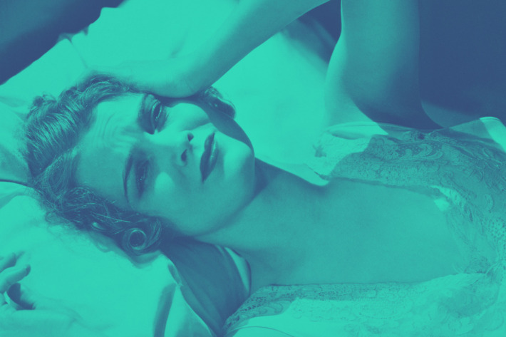

8 Sleep Experts on What to Do When You Can’t Turn Off Your Thoughts at Night

 [sleep](http://nymag.com/tags/sleep/)
   May 10, 2017  2:00 pm

# 8 Sleep Experts on What to Do When You Can’t Turn Off Your Thoughts at Night

 By     [Jessica Brown](http://nymag.com/author/Jessica%20Brown/)

## Share

- [Share](http://www.facebook.com/sharer/sharer.php?u=http://nymag.com/scienceofus/2017/05/8-sleep-experts-on-what-to-do-when-your-mind-is-racing.html%3Futm_source=fb%26utm_medium=s3%26utm_campaign=sharebutton-t)

- [Tweet](https://twitter.com/share?text=8%20Sleep%20Experts%20on%20What%20to%20Do%20When%20Your%20Mind%20Is%20Racing&url=http://nymag.com/scienceofus/2017/05/8-sleep-experts-on-what-to-do-when-your-mind-is-racing.html%3Futm_source=tw%26utm_medium=s3%26utm_campaign=sharebutton-t&via=thescienceofus)

- [Share](http://www.linkedin.com/shareArticle?mini=true%26utm_source=lin%26utm_medium=s3%26utm_campaign=sharebutton-t&url=http%3A%2F%2Fnymag.com%2Fscienceofus%2F2017%2F05%2F8-sleep-experts-on-what-to-do-when-your-mind-is-racing.html&title=8%20Sleep%20Experts%20on%20What%20to%20Do%20When%20You%20Can%E2%80%99t%20Turn%20Off%20Your%20Thoughts%20at%20Night&summary=Worth%20a%20try.&source=http%3A%2F%2Fnymag.com%2Fscienceofus%2F2017%2F05%2F8-sleep-experts-on-what-to-do-when-your-mind-is-racing.html)

- [Email](http://nymag.com/scienceofus/2017/05/8-sleep-experts-on-what-to-do-when-your-mind-is-racing.htmlmailto:?subject=8%20Sleep%20Experts%20on%20What%20to%20Do%20When%20You%20Can%E2%80%99t%20Turn%20Off%20Your%20Thoughts%20at%20Night&body=I%20saw%20this%20on%20Science%20of%20Us%20and%20thought%20you%20might%20be%20interested...%0A%0A8%20Sleep%20Experts%20on%20What%20to%20Do%20When%20You%20Can%E2%80%99t%20Turn%20Off%20Your%20Thoughts%20at%20Night%0AWorth%20a%20try.%0Ahttp%3A%2F%2Fnymag.com%2Fscienceofus%2F2017%2F05%2F8-sleep-experts-on-what-to-do-when-your-mind-is-racing.html%3Futm_source=eml%26utm_medium=e1%26utm_campaign=sharebutton-t)

- [Comment](http://nymag.com/scienceofus/2017/05/8-sleep-experts-on-what-to-do-when-your-mind-is-racing.html#comments)

- [  Print](#)

 

 Photo: Archive Holdings Inc./Getty Images

Some nights, it’s like you can’t get your brain to shut up long enough for you to fall asleep. You’re mentally reviewing the day you just completed while also previewing the day ahead; sometimes, your mind may even reach way back into the archives and pull up something embarrassing you did back in high school. So fun!

Racing thoughts can be a sign of a serious mental health condition like anxiety. But these nights also happen to everyone from time to time — and once we’re too old for bedtime stories, it’s not always clear what to do. There’s no *one *solution that will work for everybody, of course, so instead, we’ve rounded up suggestions from eight sleep experts. At the very least, it’s something to read next time you can’t sleep.

##  Distract yourself with meaningless mental lists.

“The absolute prerequisite for sleep is a quiet mind. Think of something else, rather than what’s worrying you — something with a story to it. It can be anything of interest, but of no importance, so you can devote some brain energy to it without clashing into the real world and going straight back to your worries. I fly a lot, so I imagine I have my own private jet and how would I arrange the furniture on it. If you’re someone who likes going to music festivals, what would your lineup be?” *— Neil Stanley, sleep expert*

##  Try to stay awake instead.

“Thinking about sleep and wishing for it to happen is a recipe for staying awake. This is where paradoxical thinking comes in. If you give yourself the paradoxical instruction to stay awake instead, you’ll be more likely to fall asleep. If you can be comfortable with the idea of remaining awake, then the performance anxiety and frustration that are associated with trying to sleep have nowhere to go and your arousal level drops.” *— Colin Espie, professor of sleep medicine at the University of Oxford*

##  Or just get out of bed.

“If 20 minutes has gone by as the mind races and is unable to relax back to sleep, it’s best to get out of bed. Without looking at your phone or any other screen devices, go to another dimly lit room where you keep a notebook. Write down the thoughts that are keeping you awake. Finish with the words, ‘It can wait until tomorrow.’ Then, go back to bed, focus on the breath, and mindfully relax into those words, giving yourself permission to yield to sleep.”*— Jenni June, sleep consultant*

##  Write down whatever’s freaking you out.

“Spend a maximum of 20 minutes just getting everything out of your head and onto paper every day. It’s a therapeutic way to see that you probably don’t have loads to worry about, rather just a few reoccurring things. You can then see which worries are hypothetical (i.e., what if I make a mistake at work and lose my job) or ‘real’ worries (e.g., I made a mistake and have lost my job). For the real worries you can then make an action plan/problem-solve and for the hypothetical ones, learn to let them go.” *— Kathryn Pinkham, National Health Services insomnia specialist*

##  Get back in bed and do some deep breathing.

“Deep breathing … acts as a powerful distraction technique, particularly if paired with counting. You want to aim to breathe out for longer than you breathe in, and pause after breathing in and out; so you might choose to count for three when you breathe in, then pause and count to five when you breathe out, then pause. Really focus on your breathing and counting, and if your mind wanders off, just take note of that and return your attention to the exercise. You may need to do this for ten minutes or so.” *— Christabel Majendie, sleep therapist*

##  Try not to try so hard.

“Try not to struggle or ‘try harder’ to overcome the sleeplessness or get rid of unwanted thoughts, as this can worsen insomnia. One successful approach to overcome this negative cycle is to instead learn to observe and accept these struggles, using mindfulness strategies to help.” *— Jenny Stephenson, director of*[* HappySleepers*](http://www.happysleepers.co.uk/)

##  Or maybe plan how you’ll get some sun in the a.m.

“Getting more sun exposure in the midmorning can help readjust the brain’s internal clock and make it easier to fall asleep later that night. In my book, I write about how sun exposure is now a key part of many professional athletes’ travel schedules, and seen as a way of preventing jet lag. Non-athletes can do similar things. Someone who can’t seem to fall asleep at night may want to try getting as much exposure to natural light in the morning, essentially prepping themselves to fall asleep when they want to.” — *David K. Randall, author of *[Dreamland: Adventures in the Strange Science of Sleep](https://www.amazon.com/Dreamland-Adventures-Strange-Science-Sleep/dp/0393345866)

##  And if all else fails …

“The great era of tinkering with sleep aids was popular in early modern Europe. Here are a few of my favorites:

• Put some blood-sucking leeches behind your ears. When they bore holes in the skin, pull them out and place a grain of opium in each hole. (From 16th-century French physician André du Laurens.)

• Kill a sheep, and then press its steaming lungs on either side of the head. Keep the lungs in place as long as they remain warm. (From 16th-century French surgeon Ambroise Paré.)

• After the evening meal, eat lettuce, drink wine, and rub an ointment made of the oil of violets or camphor on the temples. Dissolve a mixture of poppy seeds, lettuce seeds, balsam, saffron, and sugar and cook it in poppy juice. Then listen to pleasant music and lie down on a bed covered with the leaves of fresh, cool plants. (From 15th-century philosopher Marsilio Ficino.)” *— Benjamin Reiss, author of *[Wild Nights: How Taming Sleep Created Our Restless World](https://www.amazon.com/Wild-Nights-Taming-Created-Restless-ebook/dp/B01MRZ06B7/ref=sr_1_1?s=books&ie=UTF8&qid=1494367277&sr=1-1&keywords=Wild%2BNights)

## Tags:

- [sleep](http://nymag.com/tags/sleep/)
- [health and wellness](http://nymag.com/tags/health-and-wellness/)
- [unsolicited advice](http://nymag.com/tags/unsolicited-advice/)

   [Share on Facebook](http://www.facebook.com/sharer/sharer.php?u=http://nymag.com/scienceofus/2017/05/8-sleep-experts-on-what-to-do-when-your-mind-is-racing.html%3Futm_source=fb%26utm_medium=s3%26utm_campaign=sharebutton-b)      [Tweet this Story](https://twitter.com/share?text=8%20Sleep%20Experts%20on%20What%20to%20Do%20When%20You%20Can%E2%80%99t%20Turn%20Off%20Your%20Thoughts%20at%20Night&url=http://nymag.com/scienceofus/2017/05/8-sleep-experts-on-what-to-do-when-your-mind-is-racing.html%3Futm_source=tw%26utm_medium=s3%26utm_campaign=sharebutton-b&via=thescienceofus)