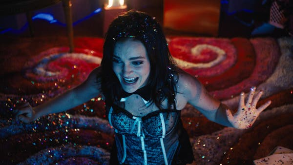
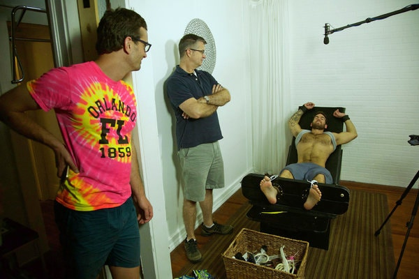
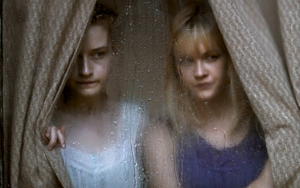
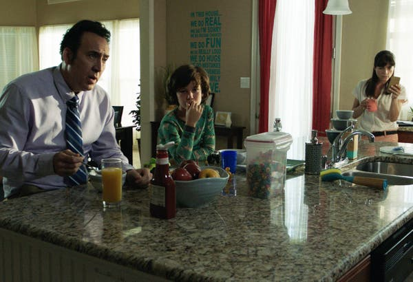

9 Movies to Stream When You’ve Watched Everything Else - The New York Times

 [At Home](https://www.nytimes.com/spotlight/at-home?action=click&pgtype=Article&state=default&module=STORY_MAPS_ATH_promo&variant=show&region=TOP_BANNER&context=at_home_menu)  ›

- [Get Advice: Our Reporters Open Up](https://www.nytimes.com/interactive/2020/at-home/reporters-editors-diaries-lists-recommendations.html?action=click&pgtype=Article&state=default&module=STORY_MAPS_ATH_promo&variant=show&region=TOP_BANNER&context=at_home_menu)

- [Vacation: In Your Backyard](https://www.nytimes.com/2020/05/22/realestate/turning-your-backyard-into-a-vacation-spot.html?action=click&pgtype=Article&state=default&module=STORY_MAPS_ATH_promo&variant=show&region=TOP_BANNER&context=at_home_menu)

- [Watch: 2020’s Best Films](https://www.nytimes.com/2020/05/22/movies/best-films-of-2020.html?action=click&pgtype=Article&state=default&module=STORY_MAPS_ATH_promo&variant=show&region=TOP_BANNER&context=at_home_menu)

- [Make: Frozen Margaritas](https://www.nytimes.com/interactive/2020/05/22/burst/how-to-make-a-frozen-margarita.html?action=click&pgtype=Article&state=default&module=STORY_MAPS_ATH_promo&variant=show&region=TOP_BANNER&context=at_home_menu)

Beyond the Algorithm

# 9 Movies to Stream When You’ve Watched Everything Else

Running low on options? Take a chance on offbeat selections.

Madeline Brewer in “Cam.”Credit...Katelin Arizmendi/Lens Pictures
By [Jason Bailey](https://www.nytimes.com/by/jason-bailey)

- May 20, 2020

-

    - 
    - 
    - [](https://www.nytimes.com/2020/05/20/movies/unique-movie-streaming-recommendations.html?action=click&module=Top%20Stories&pgtype=Homepage&contentCollection=AtHome&package_index=2mailto:?subject=NYTimes.com%3A%209%20Movies%20to%20Stream%20When%20You%E2%80%99ve%20Watched%20Everything%20Else&body=From%20The%20New%20York%20Times%3A%0A%0A9%20Movies%20to%20Stream%20When%20You%E2%80%99ve%20Watched%20Everything%20Else%0A%0ARunning%20low%20on%20options%3F%20Take%20a%20chance%20on%20offbeat%20selections.%0A%0Ahttps%3A%2F%2Fwww.nytimes.com%2F2020%2F05%2F20%2Fmovies%2Funique-movie-streaming-recommendations.html%3Fsmid%3Dem-share)

    -
    -

As summer approaches after a quarantined spring, it seems as if the impossible is happening: you’re running out of things to watch. You’ve checked off all the essentials on our lists of the [best movies](https://www.nytimes.com/interactive/2020/arts/television/best-movies-on-netflix.html) on the [various](https://www.nytimes.com/interactive/2020/arts/television/best-movies-on-amazon-prime.html)  [streaming](https://www.nytimes.com/interactive/2020/arts/television/hulu-shows-movies.html)  [services](https://www.nytimes.com/interactive/2020/arts/television/disney-plus-shows-movies.html); you’ve caught up on all the [buzzworthy shows;](https://www.nytimes.com/interactive/2020/arts/television/best-tv-shows-on-netflix.html) you’ve even watched (gulp) “Tiger King.” ([Again.](https://www.nytimes.com/2020/03/31/arts/television/netflix-tiger-king-recaps.html))

So it’s time to get a little looser with your viewing choices. The great thing about the streaming services is the sheer volume of available movies; that’s also their biggest problem, since their terrible algorithms and useless interfaces so rarely help you find the hidden gems, obscure documentaries and cuckoo genre pictures hidden there. And that’s where we come in. Here are nine options to get you started.

## ‘Sweetheart’

[Stream it on Netflix](https://www.netflix.com/title/80208235)*.*

It plays, at first, like a gender-swapped millennial “Cast Away,” as a young woman (Kiersey Clemons), the sole survivor of a boating accident, washes up on a desert island and does her best to stay alive all alone. And then … she discovers she’s not alone after all. It’s a simple premise, elegantly executed (it clocks in at a tight 82 minutes, not one of them wasted). And the director, J.D. Dillard, balances genuine scares with subtle social commentary.

## ‘Blame’

[Stream it on Hulu](https://www.hulu.com/movie/blame-6b66a239-35e5-4cc4-be46-d41285205286)*.*

Quinn Shephard was all of 20 years old when she wrote, directed, edited, produced and starred in this sharply intelligent and uncommonly complex coming-of-age drama. She plays Abigail, a young actress whose Method approach to her role in a high school production of “The Crucible” causes no shortage of offstage drama. Shephard displays abundant talent as an actor and director, but the picture’s real value is in its verisimilitude; her proximity to this world makes for a teen movie of abundant authenticity.

## ‘Duck Butter’

[Stream it on Netflix](https://www.netflix.com/title/80115118)*.*

Image

Laia Costa and Alia Shawkat in Miguel Arteta’s “Duck Butter.”Credit...Hillary Spera/The Orchard

The “Arrested Development” alum Alia Shawkat co-wrote this (with the director Miguel Arteta) and stars as a young woman put off by the formalities of love and sex. She proposes a bold experiment to a potential new love (Laia Costa): They’ll spend their first 24 hours solely in each other’s company, having sex and hanging out, to fast-forward through months of ritualized dating. The quarantine-reminiscent results are somewhat uneven, for the participants and the audience. But the film’s honesty and intimacy, and the considerable chemistry of its leads, [go a long way](https://www.nytimes.com/2018/04/26/movies/duck-butter-review-alia-shawkat.html).

## ‘No Man’s Land’

[Stream it on Amazon Prime Video](https://www.amazon.com/No-Mans-Land-Steve-Grasty/dp/B075RJDVFZ/ref=sr_1_4?crid=1EJ5PADVG54AH&dchild=1&keywords=no+man%27s+land&qid=1589934246&s=instant-video&sprefix=no+man%27s+land%2Cinstant-video%2C145&sr=1-4).

This 2017 documentary captures the 41-day standoff at Malheur National Wildlife Refuge in eastern Oregon, [where Ammon Bundy and a bunch of frighteningly well-armed “patriots”](https://www.nytimes.com/2016/01/03/us/oregon-ranchers-will-return-to-prison-angering-far-right-activists.html) took over federal buildings with a plan of, in their words, “freedom and stuff.” David Garrett Byars, the director and cinematographer, doesn’t soft-soap the dangerous rhetoric and paranoid sloganeering. But nobody gets a free pass here, and the footage of the shootout that brought the whole ugly affair to a close is terrifying no matter where you land on the conflict.

## ‘Tickled’

[Stream it on Hulu](https://www.hulu.com/movie/tickled-a2fc2fb1-a76c-479d-8136-95888846229c).

Image

From left, David Farrier, a director; Richard Ivey, a tickling fetishist; and a ticklee in the movie.Credit...Magnolia Pictures

The New Zealand television presenter David Farrier fronts and co-directs (with Dylan Reeve) this [stranger-than-fiction documentary](https://www.nytimes.com/2016/06/17/movies/tickled-review.html), detailing his investigation of “competitive endurance tickling.” Farrier initially conceived it as a giggly story about a strange online phenomenon, but found himself immersed in a bizarre web of online harassment, sexual blackmail and worse. The twisty narrative is endlessly fascinating, and Farrier is an engaging onscreen presence, striking just the right balance between bemusement and horror.

## ‘Actor Martinez’

[Stream it on Amazon Prime Video](https://www.amazon.com/gp/video/detail/B06XHZ3P3Q/ref=atv_dp_share_cu_r).

This mash-up of documentary and improvised drama  (and who knows how much is which) is a bit of a bait-and-switch. What initially plays as a meanspirited portrait of a blowhard would-be actor eventually turns its sights on its own directors, whose motives seem murky at best and exploitative at worst, veering into uncomfortable yet telling territory about documentary ethics and sexual politics in filmmaking. Of course, the entire setup could be a fake, and the fact that it’s even a question is, in itself, endlessly compelling. Certainly not for all tastes, but those who can tune into it will find this one prickly, confounding and [thought-provoking](https://www.nytimes.com/2017/03/16/movies/actor-martinez-review.html).

## ‘Cam’

[Stream it on Netflix](https://www.netflix.com/title/80177400).

Advertisement

[Continue reading the main story](https://www.nytimes.com/2020/05/20/movies/unique-movie-streaming-recommendations.html?action=click&module=Top%20Stories&pgtype=Homepage&contentCollection=AtHome&package_index=2#after-story-ad-4)

An online sex worker tries to wrestle back her stolen identity, and faces uncomfortable questions from her family about her work in this chiller from the director Daniel Goldhaber and the writer Isa Mazzei (who based the script on her own experiences as a “camgirl”). What could have been an earnest moral drama or mindless exploitation movie is instead a disturbing, David Lynch-esque [psychological thriller](https://www.nytimes.com/2018/11/15/movies/cam-review.html), as our heroine’s attempt to take down (and eventually outdo) her doppelgänger threatens to scramble her own sanity. Madeline Brewer is stunningly effective in the lead role, while Goldhaber masterfully manifests the character’s creeping madness.

## ‘We Are What We Are’

[Stream it on Amazon Prime Video](https://www.amazon.com/gp/video/detail/B075NWSN37/ref=atv_dp_share_cu_r).

Image

Julia Garner, left, and Ambyr Childers as sisters in “We Are What We Are.”Credit...EntertainmentOne

Every small town has one, the family that keeps to itself and doesn’t cause any trouble, but everyone knows there’s something … off about it. Jim Mickle’s [moody 2013 adaptation](https://www.nytimes.com/2013/09/27/movies/we-are-what-we-are-reimagined-in-the-catskills.html) of the [2011 Mexican horror film](https://www.nytimes.com/2011/02/18/movies/18we-are-what-we-are.html) eventually reveals all the gory (and I do mean *gory*) details of their secret, but that’s not what lingers afterward; it’s the director’s remarkable ability to build tension brick by brick, and the performers’ cleareyed approach to such sensationalistic material. Every actor shines, but the standouts are Julia Garner (“Ozark,” “The Assistant”) as the comparatively levelheaded daughter, and Michael Parks, in a performance of stunning melancholy and restraint, as the increasingly suspicious town sheriff.

## ‘Mom and Dad’

[Stream it on Hulu](https://www.hulu.com/movie/mom-and-dad-5064dbfb-b624-422f-bb5c-30515c9b3576).

Advertisement

[Continue reading the main story](https://www.nytimes.com/2020/05/20/movies/unique-movie-streaming-recommendations.html?action=click&module=Top%20Stories&pgtype=Homepage&contentCollection=AtHome&package_index=2#after-story-ad-5)

Image

From left, Nicolas Cage, Zackary Arthur and Selma Blair in Brian Taylor’s “Mom and Dad.”Credit...Momentum Pictures

The opening credits of Brian Taylor’s pitch-black 2018 horror-comedy invoke the visual language of ’70s exploitation pictures, and the film that follows calls on the same anything-goes spirit. The legitimately shocking premise — an inexplicable outbreak of mass filicide — plays out in all its grisly, gory glory, but Taylor’s smart screenplay roots the conflict in the real frustrations and difficulties of familial relations, while Nicolas Cage and Selma Blair’s performances as the suburban-dwelling, minivan-driving title characters are both gleefully nutso and slyly genuine. By the midpoint, it becomes less a doomsday narrative than a series of dares from the audience to the filmmakers: “Oh no, they wouldn’t,” you might think, and it turns out that yes, they definitely would.

Advertisement

[Continue reading the main story](https://www.nytimes.com/2020/05/20/movies/unique-movie-streaming-recommendations.html?action=click&module=Top%20Stories&pgtype=Homepage&contentCollection=AtHome&package_index=2#after-bottom)