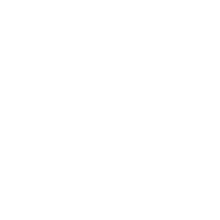

99 days of freedom

# Do you ever wonder what life is like without Facebook?

In response to Facebook's [controversial mood experiment](http://www.theguardian.com/technology/2014/jun/29/facebook-users-emotions-news-feeds) involving some 700,000 unwitting users, we present you 99 Days of Freedom; an online study on how life without Facebook impacts user happiness. Joining is very simple: follow our three step instruction to join the experiment for as long as you like. We can’t wait to hear how you spend your time off.

[Join the experiment](http://99daysoffreedom.com/#the-experiment)

49,259 people are [enjoying freedom](http://99daysoffreedom.com/#the-experiment)

 [Press release](http://wearejust.pr.co/119442-is-it-time-to-kick-your-facebook-addiction)