A 17-Mile Hike to Unite San Francisco - The New York Times

Advertisement

[Continue reading the main story](https://www.nytimes.com/2019/11/18/travel/crosstown-trail-san-francisco.html?action=click&module=Editors%20Picks&pgtype=Homepage#after-top)

# A 17-Mile Hike to Unite San FranciscoA 17-Mile Hike to Unite San Francisco

A motley alliance decided a single trail could unite this divided city. A sixth-generation native sets out to walk it.

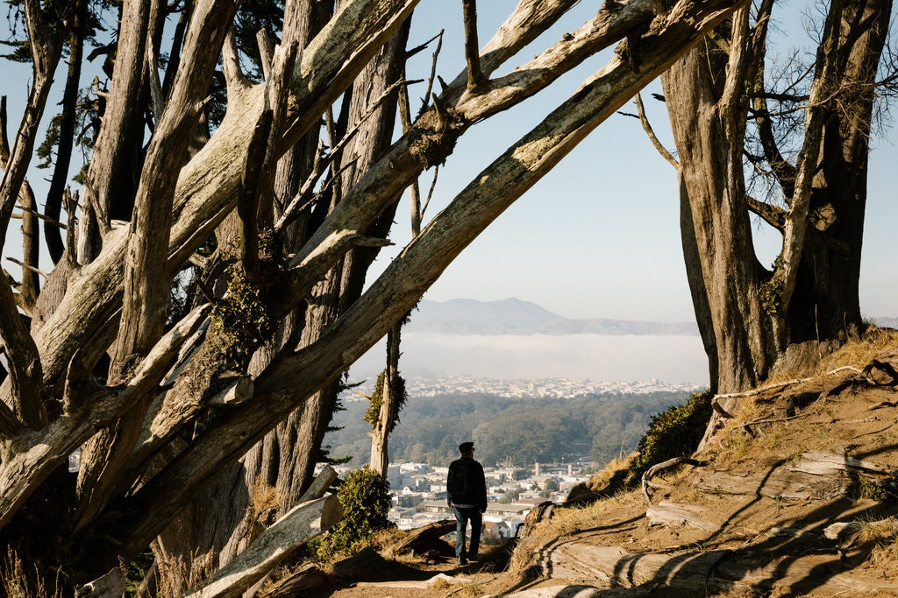

In San Francisco’s aptly named Grandview Park, looking north to Golden Gate Park from the Crosstown Trail.Credit...Jason Henry for The New York Times

By [Nellie Bowles](https://www.nytimes.com/by/nellie-bowles)

- Nov. 18, 2019

-

    - 
    - 
    - [](https://www.nytimes.com/2019/11/18/travel/crosstown-trail-san-francisco.html?action=click&module=Editors%20Picks&pgtype=Homepagemailto:?subject=NYTimes.com%3A%20A%2017-Mile%20Hike%20to%20Unite%20San%20Francisco&body=From%20The%20New%20York%20Times%3A%0A%0AA%2017-Mile%20Hike%20to%20Unite%20San%20Francisco%0A%0AA%20motley%20alliance%20decided%20a%20single%20trail%20could%20unite%20this%20divided%20city.%20A%20sixth-generation%20native%20sets%20out%20to%20walk%20it.%0A%0Ahttps%3A%2F%2Fwww.nytimes.com%2F2019%2F11%2F18%2Ftravel%2Fcrosstown-trail-san-francisco.html)

    -
    -
    -

I was feeling down on my hometown, a fractured city of appalling inequality out of which has sprung an industry that’s contributed to the ruin of our country — and also, probably, my mind. The quirky tech scene had soured, while the houses had gotten grander and the homelessness more brutal. My family has been in San Francisco for six generations, but maybe with me it would be done.

It was in this state that I stumbled on something unusual: a new crosstown trail, a 17-mile hike cutting across the whole of San Francisco.

I looked at a map. The route sweeps up hills, through working class and wealthy neighborhoods, connecting new trails, community garden corridors, state and local parks, stairways, hidden pathways along chain-link fences and two waterfronts. It crosses from the city’s southeast corner to its northwest. And it seemed to arrive almost like tech: out of nowhere, fully formed, right on top of familiar territory.

## Get the Travel Dispatch Newsletter

Every Saturday, get travel tips, destination coverage, photos from all over the world and more.

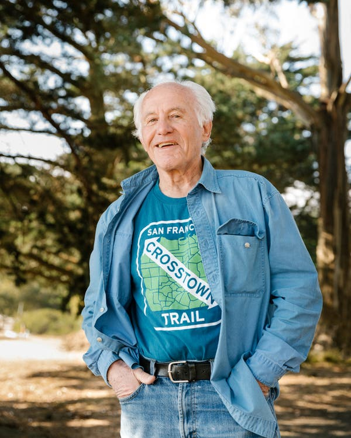

Image

Bob Siegel, 79, was the driving force behind the creation of the Crosstown Trail. Credit...Jason Henry for The New York Times

Cue sheets for the trail are online at [CrosstownTrail.org](https://crosstowntrail.org/map/) — there’s also an app that guides a hiker in real time. The trail is sanctioned by the city and was loosely outlined in the [Recreation and Open Space Element of the](https://sfrecpark.org/wp-content/uploads/Recreational-and-Open-Space-Element-Update-Executive-Summary-04032014-2.pdf)[San Francisco General Plan](https://sfrecpark.org/wp-content/uploads/Recreational-and-Open-Space-Element-Update-Executive-Summary-04032014-2.pdf), adopted in 2014, but the exact route was only chosen a year before it opened. Its creation was not the work of city officials, but of volunteers and activists who came together behind this vision. There are very few actual signs of it on the ground. The map is an app.

Advertisement

[Continue reading the main story](https://www.nytimes.com/2019/11/18/travel/crosstown-trail-san-francisco.html?action=click&module=Editors%20Picks&pgtype=Homepage#after-story-ad-1)

[                        How This Start-Up Is Investing in Greater Diversity in Tech    To make progress, teach more kids how to code.    LEARN MORE](https://adclick.g.doubleclick.net/pcs/click?xai=AKAOjstOVOSDCHUFrYzXGJvcyqKymdI6p9ZPNIXhlduv1hgWAnfBqK1l_NlR9eAPilPfB1DHtalb5CLXttsPIvNLTZp4FcY5UaKIoQ6bV3AcZfp-BhbTey3ZqOgq1Njy9bE9vDuAPjRXL-yh8M8O-cvlM2KddKcPSPzmbhGSKeZGWBbaTpffEd9yjDjtSKclaaUeWZdyoVqW0Oj3GSOVfk4pzL0ItY5e427UHHEL3grbEcWMGknJgM9Pd1ps4F60dn1mfXU8gjEU&sig=Cg0ArKJSzLVDt8M8hmgaEAE&urlfix=1&adurl=https://bs.serving-sys.com/serving/adServer.bs%3Fcn%3Dtrd%26mc%3Dclick%26pli%3D28798761%26PluID%3D0%26ord%3D347212028%26pcp%3D%24%24%24%24page_view_id%3DRy10zsiPOQyuCpqdSIUwsbVX%26pos%3Dmid1%24%24%24%24)

[(L)](https://adclick.g.doubleclick.net/pcs/click?xai=AKAOjstOVOSDCHUFrYzXGJvcyqKymdI6p9ZPNIXhlduv1hgWAnfBqK1l_NlR9eAPilPfB1DHtalb5CLXttsPIvNLTZp4FcY5UaKIoQ6bV3AcZfp-BhbTey3ZqOgq1Njy9bE9vDuAPjRXL-yh8M8O-cvlM2KddKcPSPzmbhGSKeZGWBbaTpffEd9yjDjtSKclaaUeWZdyoVqW0Oj3GSOVfk4pzL0ItY5e427UHHEL3grbEcWMGknJgM9Pd1ps4F60dn1mfXU8gjEU&sig=Cg0ArKJSzLVDt8M8hmgaEAE&urlfix=1&adurl=https://bs.serving-sys.com/serving/adServer.bs%3Fcn%3Dtrd%26mc%3Dclick%26pli%3D28798761%26PluID%3D0%26ord%3D347212028%26pcp%3D%24%24%24%24page_view_id%3DRy10zsiPOQyuCpqdSIUwsbVX%26pos%3Dmid1%24%24%24%24)

When I finally got a hold of the man behind it, 79-year-old Bob Seigel, he was wary.

“It’s gone too viral,” he said.

- The perfect gift for everyone on your list.

[Gift subscriptions to The New York Times. Starting at £20.](https://www.nytimes.com/subscription/gift?campaignId=9L998)

Typical NIMBY not wanting anyone new to join in, I thought. But a trail is probably a story, and I needed a byline. So here I was, in a sour mood, coming to ruin it more.

“I take it you’ll go and write about it even if I tell you not to?” Bob asked.

##   The Beginning: Candlestick Point

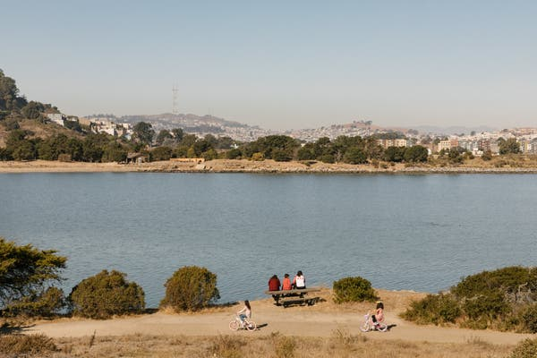

Image

The trail begins at Sunrise Point in the Candlestick Point state park, in one of the city’s last black neighborhoods. Credit...Jason Henry for The New York Times

Around 8 a. m., I meet Bob, his wife, Pat Koren, and their one-eyed Border collie, Dixon, for a coffee in the Mission, where we all live. A Latino neighborhood, Irish before that, the modern Mission has been the heart of the city’s gentrification battle. Bob and Pat have gray hair, matching well-worn backpacks and bring their own mugs.

Bob and I take a Lyft out to the start of the trail: Candlestick Point, a state recreation area in one of the last black neighborhoods of San Francisco.

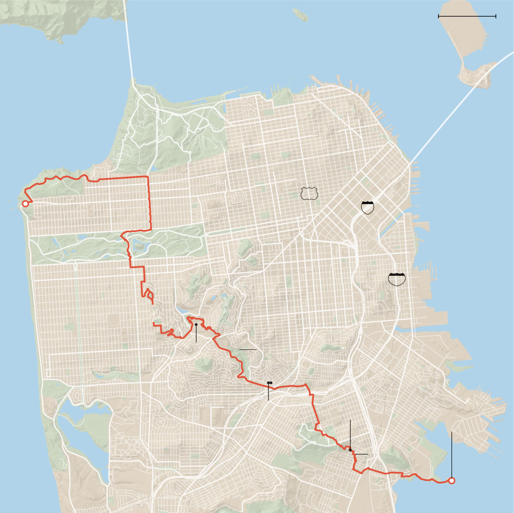
1 mile
California
Golden Gate Br.
San Francisco Bay
Van Ness Ave.
Bay Br.
Presidio
California St.
Mission St.
101
Finish
Lands End Lookout
80
San Francisco
Market St.
Golden Gate
Park
280
Mission
DISTRICT
Sunset Blvd.
Great Hwy.
Forest
Hill
Crosstown Trail
Laguna Honda
Hospital and
Rehabilitation
Center
Glen Canyon Park
Taraval St.
Bird & Beckett
Start
Candlestick
Point State
Recreation Area
Sloat Blvd.
Higher Grounds
Coffee House
Mission Blue
Lake
Merced
Park
Visitacion
Valley
Greenway
John
McLaren
Park
Source: crosstowntrail.org•
By The New York Times

It’s a hot sunny week, the start of San Francisco summer, which comes for us in the fall.

Bob walks with a springy step over a pizza box and past a laundry hamper to the water. The view from the edge of Candlestick Point is of the San Francisco Bay, sailboats, fishermen, and the city’s southeastern coast, where developers are battling old military waste to put in more housing.

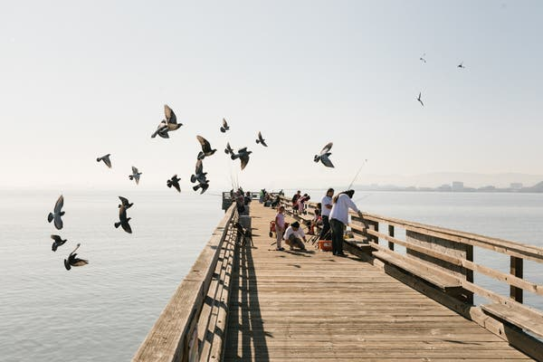

Image

The fishing pier in Candlestick Point recreation area.Credit...Jason Henry for The New York Times

A few people are fishing, some kayaking. It smells of sulfur. A flock of pigeons lands, and Bob stops. Pigeons, he says, need to be appreciated.

“Most people hate pigeons, but if you observe them closely they’re beautiful,” he says, pointing out a white feather and an interesting speckle pattern. A minute later, we see a sickly looking skunk come out from behind a rock, and Bob is thrilled. A newish shipwreck is probably a drug boat, he says, with amazement. He makes me stop to watch a squirrel.

“How many times do you see squirrels in San Francisco? Not that many times!” he answers before I can say, “pretty often.”

Read more about traveling to San Francisco

[ Lawrence Ferlinghetti’s Enduring San Francisco March 11, 2019](https://www.nytimes.com/2019/03/11/travel/lawrence-ferlinghettis-enduring-san-francisco.html?action=click&module=RelatedLinks&pgtype=Article)

[ California’s Highway 1, With Memory Riding Shotgun Oct. 1, 2018](https://www.nytimes.com/2018/10/01/travel/highway-1-california-drive.html?action=click&module=RelatedLinks&pgtype=Article)

He’s not a naturalist — something is chirping and neither of us can identify whether it’s a bird or an insect or electronic — but he likes the sound.

“Go, Dubs!” he shouts at someone walking by wearing a Warriors hat.

We have a long walk ahead, but he keeps making us stop to talk to strangers and watch completely mundane rodents, and I start to give in to this spry older man and his trail.

##   MILE 2.5: The Visitacion Valley Greenway

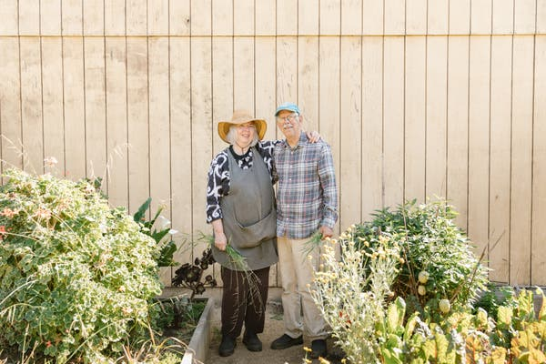

Image

Fran Martin, 74, and Jim Growden, 75, are volunteers in the Visitacion Valley Community Garden along the Crosstown Trail. Credit...Jason Henry for The New York Times

We spill out into a working-class neighborhood called Visitacion Valley and walk along quaint, commercial Leland Avenue. We find a retired couple, Fran Martin and Jim Growden, who have helped organize a series of blocklong[community gardens](https://www.sfparksalliance.org/our-parks/parks/visitacion-valley-greenway) that stack one upon the other.

We grab coffee and trail maps at [Mission Blue](https://missionbluesf.com/), opened by Kellie McCord in April. She sees about 30 trail hikers every Saturday, she says. I hope they buy some of her homemade banana bread.

Image

The Mission Blue cafe offers hikers a respite in the Visitacion Valley portion of the Crosstown Trail. Credit...Jason Henry for The New York Times

These three are the first of the many Crosstown activists I meet on the trail with Bob, who has assembled a determined alliance — a retired specialist in hazardous materials, a naturalist, a Googler who cashed out to make trails full time, hordes of bushwhacking mountain bikers, gardeners, and Bob’s old friend, a cartographer — who decided that what this divided city needs is one long trail.

“Every park could have been money,” Bob says. “Every trail was a fight.”

I’ve felt powerless watching the city’s life unfold this decade. The street scenes of homelessness and the fact that I walk past them — people are in pain on the sidewalk as I go to work, to coffee, on a date — is horrific.

The sidewalks are where our inequality plays out. They are where [the homeless camp](https://www.nytimes.com/2016/02/27/us/san-francisco-wants-homeless-to-leave-tent-camp-but-some-vow-to-fight.html?module=inline) and where residents [recently installed boulders to block them](https://www.nytimes.com/2019/10/21/us/california-homeless-backlash.html?module=inline) and where start-ups [dropped hundreds of scooters overnight](https://www.nytimes.com/2018/04/20/technology/electric-scooters-are-causing-havoc-this-man-is-shrugging-it-off.html?module=inline).

Part of what has made me angry is the way this inequality isolates us from each other. I lived in Johannesburg after college, and this place now reminds me of that one. Private security is on the rise. There are guards outside my grocery store and my sushi restaurant. Our unbalanced new city teeters.

And yet when I start hiking through the first of six community gardens, I see what a good city remains and how it could come back. I cannot help but feel the truism: Cities are made by people, often just a few very determined ones fighting small, decades-long battles, block by block. I realize that while they have fought, I’ve been submitting.

Each garden is run hosted by different members of the neighborhood, mostly middle-age volunteers, women who offer up plums and flowers as we cut through. This portion is a highlight of the trail. I imagine taking my mom, who loves to garden. The blocklong gardens have different themes — this block edible fruits, that one native plants, community plots, a children’s garden.

Mr. Growden, an artist who recently retired from a career disposing of hazardous material  for the city, used metal provided by the city’s waste facility to make the iron gates at the entrance of each garden. He bent intricate floral patterns and butterflies in the heavy iron.

## Editors’ Picks

[### Is It Time Gauguin Got Canceled?](https://www.nytimes.com/2019/11/18/arts/design/gauguin-national-gallery-london.html?fallback=false&recId=646032713&locked=0&geoContinent=EU&geoRegion=ISL&recAlloc=story&geoCountry=GB&blockId=home-featured&imp_id=241716716)

[### ‘S.N.L.’ Turns Impeachment Inquiry Into a Soap Opera Starring Jon Hamm](https://www.nytimes.com/2019/11/17/arts/television/snl-impeachment-jon-hamm-harry-styles.html?fallback=false&recId=646032713&locked=0&geoContinent=EU&geoRegion=ISL&recAlloc=story&geoCountry=GB&blockId=home-featured&imp_id=653556646)

[### She Hung Nooses on Halloween. What Happened Next Was Surprising.](https://www.nytimes.com/2019/11/15/nyregion/clinton-hill-halloween-decorations.html?fallback=false&recId=646032713&locked=0&geoContinent=EU&geoRegion=ISL&recAlloc=story&geoCountry=GB&blockId=home-featured&imp_id=614534143)

[Continue reading the main story](https://www.nytimes.com/2019/11/18/travel/crosstown-trail-san-francisco.html?action=click&module=Editors%20Picks&pgtype=Homepage&action=click&module=editorContent&pgtype=Article&region=CompanionColumn&contentCollection=Trending#after-pp_edpick)

 [ PAID POST: Dorchester Collection](https://adclick.g.doubleclick.net/pcs/click?xai=AKAOjssxeo9kq1gZ51ylsltzVEs5k0yEpsMXp_QAVP_ZJt44dU-p78mKN_XpwFZd2S-uaYK1mgr8ENXC8n1whT-V5KvIOTDchqUSRUo8rqF_2-QeICAxauIs6kSf5BUc1oNuceZ6D4-ybZmrWNIPUQOihaaZuOXVWBsYnoWdr9E00vP_9V1WVEmgOCUO5OAJzgJjFCuRkcIqm5LLtY7hVHIAR31-cYNP9M3or8C-oEZNDgbRnpYDhMyt9hi0vndpNhaQ9A&sig=Cg0ArKJSzECbDMdLipSDEAE&urlfix=1&adurl=https://www.nytimes.com/paidpost/dorchester-collection/a-south-african-soprano-fuses-technique-with-raw-emotion.html%3Fcpv_ap_id%3D50032456%26sr_source%3Dlift_ed%26tbs_nyt%3D2019-Oct-nytnative_ed)[ Follow This Soprano’s Journey From Township to Opera House](https://adclick.g.doubleclick.net/pcs/click?xai=AKAOjssxeo9kq1gZ51ylsltzVEs5k0yEpsMXp_QAVP_ZJt44dU-p78mKN_XpwFZd2S-uaYK1mgr8ENXC8n1whT-V5KvIOTDchqUSRUo8rqF_2-QeICAxauIs6kSf5BUc1oNuceZ6D4-ybZmrWNIPUQOihaaZuOXVWBsYnoWdr9E00vP_9V1WVEmgOCUO5OAJzgJjFCuRkcIqm5LLtY7hVHIAR31-cYNP9M3or8C-oEZNDgbRnpYDhMyt9hi0vndpNhaQ9A&sig=Cg0ArKJSzECbDMdLipSDEAE&urlfix=1&adurl=https://www.nytimes.com/paidpost/dorchester-collection/a-south-african-soprano-fuses-technique-with-raw-emotion.html%3Fcpv_ap_id%3D50032456%26sr_source%3Dlift_ed%26tbs_nyt%3D2019-Oct-nytnative_ed)

Image

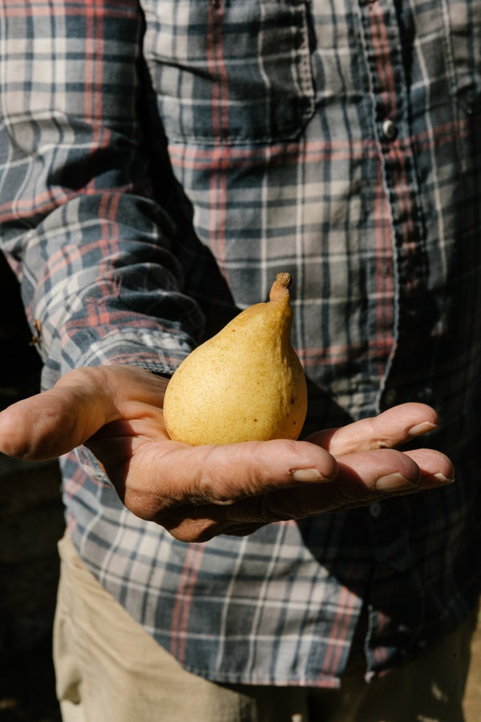

Jim Growden with a pear he picked in a community garden along the trail.Credit...Jason Henry for The New York Times

Image

Among the community gardens along the trail is one known as the agriculture lot.Credit...Jason Henry for The New York Times

We snack on sungold tomatoes and ground cherries. Bob drinks from the hose even though Fran tells him not to.

Anne Seeman runs the second to last garden and was a founder of the greenway, which includes plants that immigrant families in the neighborhood bring from home — pink corn from Mexico, quinoa from Peru, a lot she can’t identify until they flower, and, even then, sometimes she’s not sure.

##   MILE 3: McLaren Park

Image

The trail continues through John McLaren Park, the largest grassland in the city.Credit...Jason Henry for The New York Times

Bob and I, alone again, trek on, into the vast and underutilized[John McLaren Park.](https://sfrecpark.org/destination/john-mclaren-park/) This is the largest grassland in the city, but it got a reputation for grisly murders in the 1980s. This summer morning in 2019, it is quiet and warm.

We walk through a eucalyptus grove and on a new path called the Philosopher’s Way, along which Bob’s friend installed inspirational quotes. We pass a woman in a sun hat on the side of a steep hill singing opera to herself.

My legs are getting sore as we cut through a neighborhood called Excelsior, where front yards are full of roses and California poppies.

Two overpasses — mile 5.3 — and we’re in Glen Park, a residential neighborhood that feels like a village.

Image

Eric Whittington, 63, of Bird & Beckett, in Glen Park along the Crosstown Trail. Credit...Jason Henry for The New York Times

There, our first stop is at a bookstore-jazz lounge called [Bird & Beckett](https://birdbeckett.com/).

Eric Whittington, 63, with a long ponytail, runs it and lives in the building. Most evenings he pushes the rolling bookshelves to the back and hosts popular jazz concerts and poetry readings. Bring your own wine.

But we’re hungry. A few blocks away is [Higher Grounds Coffee House](https://www.facebook.com/pages/Higher-Grounds-Coffee-House/170027856372233).

Bob spent his career teaching English as a Second Language to students at the City College campus in San Francisco’s Chinatown district, and this restaurant is run by his student from 40 years ago Manhal Jweinat.

“I still don’t know English,” Manhal says when he greets us.

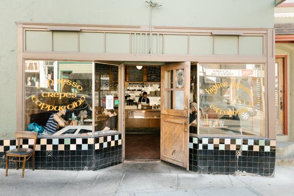

Image

Higher Grounds Coffee House is run by a former student of the Crosstown Trail’s founder, Bob Siegel. Credit...Jason Henry for The New York Times

It’s a cozy restaurant with wooden tables and thick Middle East-inspired crepes. I order a salty one with mushrooms and olives.

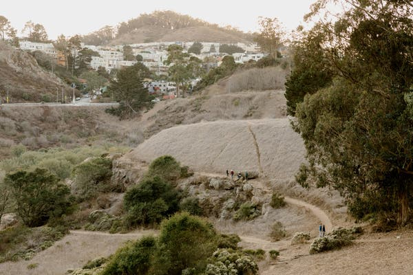

Image

The trail winds through Glen Canyon Park, where a group known as the Gum Tree Girls helped prevent a freeway from cutting through the area.Credit...Jason Henry for The New York Times

Next it’s into [Glen Park Canyon](https://sfrecpark.org/destination/glen-park/) where we pass a trail named after the Gum Tree Girls, three women — activists and young mothers — who banded together in 1965 and fought to stop a freeway from cutting through the canyon.

The name was given to them by the city engineer and intended to be derisive, but they reclaimed it.

“The Hell It Is!” became one of their rallying cries, [as recorded in an oral history of the movement](http://glenparkhistory.wixsite.com/glenparkhistory/freeway-revolt-in-glen-park), and they engaged in acts of civil disobedience, like confiscating construction signs.

And, after 12 years battling that freeway, they won. It was never built, and the canyon is a gem of a park, for kids, joggers, even rock climbers.

This portion of what is now the Crosstown Trail used to dead end within Glen Park. But a teacher named Tom Dallman and his students**  **[slowly hacked a trail through](https://www.glenparkassociation.org/the-farm-at-sota/), despite opposition from neighbors who wanted to keep the park more private. Thanks to them, we walk easily north, and into the next leg.

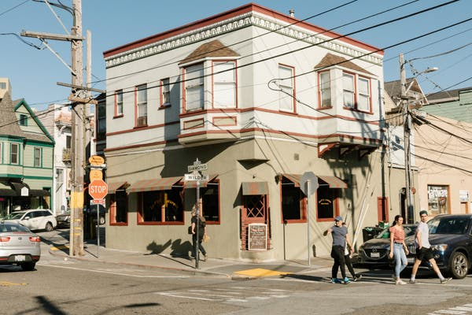

Image

The village-like Glen Park neighborhood, along the trail. Credit...Jason Henry for The New York Times

##   Mile 7.5: Bedpan Alley

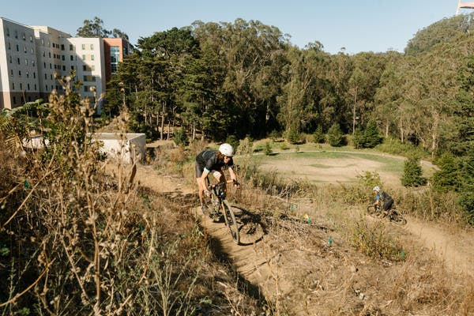

Image

Local bikers helped carve out trails in the Laguna Honda area.Credit...Jason Henry for The New York Times

“Bob!” someone in a sun hat shouts.

Amber Hasselbring, the executive director of [Nature in the City,](http://natureinthecity.org/) a nonprofit to encourage local engagement with nature and public open spaces, joins us for the next leg, her 19-year-old intern, Jeffrey, in tow and looking stricken by the hills and heat. She points out the coyote brush about to bloom and even admires the lustrous poison oak. She hears a chirp and immediately identifies it as a white-crowned sparrow.

From behind a shrub, a lanky man in work pants emerges. This is Matt Blain, who made enough money working at Google that he could quit and do what he really wanted to do: bushwhack and mountain bike. He is part of a group of determined volunteers — the SF Urban Riders — who made this crosstown trail possible by clearing a long bramble-filled canyon that runs alongside Laguna Honda Hospital and Rehabilitation Center and lets the north and south legs of the trail connect.

When the hospital learned what the bikers were up to every weekend on its property, they surprised everyone and embraced it. The bikers began gathering 60-strong with machetes to hack away at the brush. Matt calls the trail Steep Ravine. Others refer to it as Bedpan Alley.

Indeed.

First, we cross through a field of daisies and pass the hospital. There’s a small farm with geese and goats. An old man in a wheelchair is enjoying the sun and watching us trek past.

Then we dive down into the new trail, cocooned in greenery. The hospital once used the area as a dumping ground, and to the side of the trail in the brambles is a scattering of ancient sinks, bottles and, yes, a few bedpans, though these bikers have been hauling them out.

But Bob’s enthusiasm has started to get to me by this point, because all I am really looking at are the wildflowers and the moss, the spa-smelling eucalyptus forest above us, and the sweet engineer in front of me who decided to spend his days making this for us.

##   Mile 8.4: Forest Hill and Golden Gate Park

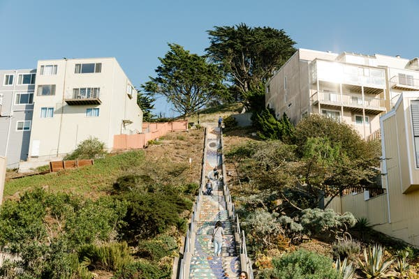

Image

The 16th Avenue tiled steps up to Grandview Park, along the Crosstown Trail.Credit...Jason Henry for The New York Times

I don’t know what to tell you about this next portion: It’s very hard. There are a lot of stairs. But it has the best views, and I am left slack-jawed. I stop taking notes on these stairs, but I leave you with one piece of Crosstown Trail advice: Every time you walk down a flight of stairs, at the very end, look back. There is art hidden in the risers.

From here to the end is more familiar San Francisco tourist territory.

##   Mile 17: Lands End

Image

When the fog clears, the Lands End portion of the trail offers the best view of the Golden Gate Bridge.Credit...Jason Henry for The New York Times

And finally — me limping, Bob fine — we get to the payoff.

While hordes of tourists walk to the base of the Golden Gate Bridge or (I have no idea why) across it, those in the know take the left toward Lands End, which gives the best view of the bridge anyway, because it is the bridge in context, launching out of the expanse of Marin Headlands green, soaring absurdly red across the Bay, and diving down into the city. And that’s only looking in one direction — the other direction you’ll see jagged cliffs that rival Big Sur’s beauty.

When I wanted to make sure my New Yorker girlfriend fell in love with my city, this is where I took her. It’s where Bob performed the marriage of his son and daughter-in-law.

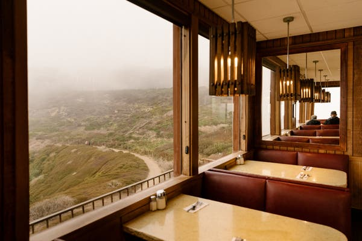

Image

The booths at Louis’ Diner offer some of the best views in town.Credit...Jason Henry for The New York Times

We cross by the Sutro Baths, once public saltwater pools built by the tycoon Adolph Sutro, now iconic ruins.

Here’s one last tip: If it’s open, go to [Louis’,](http://louissf.com/index.html/)[(L)](http://louissf.com/index.html/)a humble-looking diner whose booths offer a view that’s so good it will make you laugh. It was closed, so we went to [Beach Chalet,](https://www.beachchalet.com/) a brewery just a few blocks down the beach.

The Crosstown Trail is a walk across a broken city created by people who believed they could put it back together. In a day, I visited more neighborhoods than I had in 31 years. I think of the gifts to a city one ornery life can give.

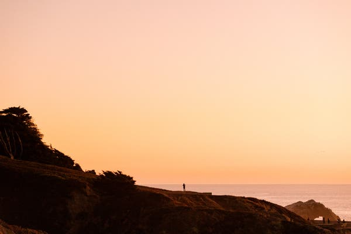

Image

A daylong hike will bring you to sunset at Lands End. Credit...Jason Henry for The New York Times

At the brewery, Bob orders an I.P.A., and we’re joined by his cartographer buddy Ben Pease. Bob is proud of the Crosstown Trail, but his life’s work has been the much longer and harder [Ridge Trail](https://ridgetrail.org/), which he hopes will ultimately be a 550-mile path ringing the whole of San Francisco Bay. Currently about 380 miles of it are open, and as we’ve hiked he’s told me stories about it — a three-year battle for a mile here, a supervisor slowly convinced there. Bob, remember, is 79 years old.

“It’ll happen in your lifetime, not mine,” he says.

“But,” Ben interjects, “It’s this thought of longevity that got you to open the Crosstown Trail in a year. I kept saying, ‘Bob we’re gonna get in trouble.’”

Bob gets a kick out of this.
“Instant trail, baby!” he says. “No one can stop us.”

[   ## 52 Places to Go in 2019  A starter kit for escaping into the world.](https://www.nytimes.com/interactive/2019/travel/places-to-visit.html)

**52 PLACES AND MUCH, MUCH MORE ***Follow our *[*52 Places*](https://www.nytimes.com/interactive/2019/travel/places-to-visit.html?action=click&module=inline&pgtype=Article)* traveler, Sebastian Modak, on ***[*Instagram*](https://www.instagram.com/nytimestravel/)*****  ****as he travels the world****,**** and discover more Travel coverage by following us on *[*Twitter*](https://twitter.com/nytimestravel)* and *[*Facebook*](https://www.facebook.com/nytimestravel/)*. And *[*sign up for our*](https://www.nytimes.com/newsletters/traveldispatch?action=click&module=inline&pgtype=Article)*  *[*Travel Dispatch newsletter*](https://www.nytimes.com/newsletters/traveldispatch?module=inline)*: Each week you’ll receive tips on traveling smarter, stories on hot destinations and access to photos from all over the world.*

Nellie Bowles covers tech and internet culture. Follow her on Twitter:   [@nelliebowles](https://twitter.com/nelliebowles)

- 
- 
- [](https://www.nytimes.com/2019/11/18/travel/crosstown-trail-san-francisco.html?action=click&module=Editors%20Picks&pgtype=Homepagemailto:?subject=NYTimes.com%3A%20A%2017-Mile%20Hike%20to%20Unite%20San%20Francisco&body=From%20The%20New%20York%20Times%3A%0A%0AA%2017-Mile%20Hike%20to%20Unite%20San%20Francisco%0A%0AA%20motley%20alliance%20decided%20a%20single%20trail%20could%20unite%20this%20divided%20city.%20A%20sixth-generation%20native%20sets%20out%20to%20walk%20it.%0A%0Ahttps%3A%2F%2Fwww.nytimes.com%2F2019%2F11%2F18%2Ftravel%2Fcrosstown-trail-san-francisco.html)

-

## [More in Travel](https://www.nytimes.com/section/travel?action=click&module=MoreInSection&pgtype=Article&region=Footer&contentCollection=Travel)

[   D'Ara Nazaryan](https://www.nytimes.com/2019/11/15/travel/luxury-for-less-travel-agents.html?action=click&module=MoreInSection&pgtype=Article&region=Footer&contentCollection=Travel)

[### Luxury for Less: The Travel Advisor Gambit](https://www.nytimes.com/2019/11/15/travel/luxury-for-less-travel-agents.html?action=click&module=MoreInSection&pgtype=Article&region=Footer&contentCollection=Travel)Nov. 15

[   Raphaelle Macaron](https://www.nytimes.com/2019/11/15/travel/europcar-rentals-travel-disasters.html?action=click&module=MoreInSection&pgtype=Article&region=Footer&contentCollection=Travel)

[### Help! Renting a Vehicle Through Europcar Drove Me Crazy!](https://www.nytimes.com/2019/11/15/travel/europcar-rentals-travel-disasters.html?action=click&module=MoreInSection&pgtype=Article&region=Footer&contentCollection=Travel)Nov. 15

[Continue reading the main story](https://www.nytimes.com/2019/11/18/travel/crosstown-trail-san-francisco.html?action=click&module=Editors%20Picks&pgtype=Homepage&action=click&module=MoreInSection&pgtype=Article&region=Footer&contentCollection=Travel#after-pp_morein)

 [   PAID POST: The Macallan](https://adclick.g.doubleclick.net/pcs/click?xai=AKAOjsvaD78THKj4K7vw3kwrU9e9HiDRsO-xZufx9uLw-jBN4uMZQ6ROE6BQzCZU7ZFx5lnDVguJ1Ca95QFI5dGg1uyfBaR2sDX-N2lWO5rpmm6mqSLcrBpVNyeK8L3Xm8l0oST1ATKtqJv1Jpda89OunVn6bzruRTbT0JzcteQ7FLheuZDJwq6gBXVjYYfbE4eQzAPiA45LOVSShykl27n6ykT4fssRi7il6atXGKnhxtwFL3msWKC4goa3Nuc-pCoy6A&sig=Cg0ArKJSzLr1e_wm5mxLEAE&urlfix=1&adurl=https://www.nytimes.com/paidpost/the-macallan/a-recipe-for-bold-decision-making.html%3Fcpv_ap_id%3D50031528%26sr_source%3Dlift_morein%26tbs_nyt%3D2019-Oct-nytnative_morein)  [The Science Behind Decision-Making and How It Changed Chef Judy Joo’s Life Path](https://adclick.g.doubleclick.net/pcs/click?xai=AKAOjsvaD78THKj4K7vw3kwrU9e9HiDRsO-xZufx9uLw-jBN4uMZQ6ROE6BQzCZU7ZFx5lnDVguJ1Ca95QFI5dGg1uyfBaR2sDX-N2lWO5rpmm6mqSLcrBpVNyeK8L3Xm8l0oST1ATKtqJv1Jpda89OunVn6bzruRTbT0JzcteQ7FLheuZDJwq6gBXVjYYfbE4eQzAPiA45LOVSShykl27n6ykT4fssRi7il6atXGKnhxtwFL3msWKC4goa3Nuc-pCoy6A&sig=Cg0ArKJSzLr1e_wm5mxLEAE&urlfix=1&adurl=https://www.nytimes.com/paidpost/the-macallan/a-recipe-for-bold-decision-making.html%3Fcpv_ap_id%3D50031528%26sr_source%3Dlift_morein%26tbs_nyt%3D2019-Oct-nytnative_morein)

[](https://adclick.g.doubleclick.net/pcs/click?xai=AKAOjsvaD78THKj4K7vw3kwrU9e9HiDRsO-xZufx9uLw-jBN4uMZQ6ROE6BQzCZU7ZFx5lnDVguJ1Ca95QFI5dGg1uyfBaR2sDX-N2lWO5rpmm6mqSLcrBpVNyeK8L3Xm8l0oST1ATKtqJv1Jpda89OunVn6bzruRTbT0JzcteQ7FLheuZDJwq6gBXVjYYfbE4eQzAPiA45LOVSShykl27n6ykT4fssRi7il6atXGKnhxtwFL3msWKC4goa3Nuc-pCoy6A&sig=Cg0ArKJSzLr1e_wm5mxLEAE&urlfix=1&adurl=https://www.nytimes.com/paidpost/the-macallan/a-recipe-for-bold-decision-making.html%3Fcpv_ap_id%3D50031528%26sr_source%3Dlift_morein%26tbs_nyt%3D2019-Oct-nytnative_morein)

[   Samantha Orndorff for The New York Times](https://www.nytimes.com/2019/11/14/travel/36-Hours-what-to-do-Indianapolis.html?action=click&module=MoreInSection&pgtype=Article&region=Footer&contentCollection=Travel)

[### 36 Hours in Indianapolis](https://www.nytimes.com/2019/11/14/travel/36-Hours-what-to-do-Indianapolis.html?action=click&module=MoreInSection&pgtype=Article&region=Footer&contentCollection=Travel)Nov. 14

[   James D. Morgan/Qantas](https://www.nytimes.com/2019/11/13/travel/qantas-longest-flight.html?action=click&module=MoreInSection&pgtype=Article&region=Footer&contentCollection=Travel)

[### Would 19 Hours and 16 Minutes in the Air Make Me Crazy?](https://www.nytimes.com/2019/11/13/travel/qantas-longest-flight.html?action=click&module=MoreInSection&pgtype=Article&region=Footer&contentCollection=Travel)Nov. 13

[   Image by Maria Mavropoulou for The New York Times](https://www.nytimes.com/2019/11/11/travel/Egypt-Nile-cruise-women.html?action=click&module=MoreInSection&pgtype=Article&region=Footer&contentCollection=Travel)

[### A Nile Journey Guided by 19th-Century Women](https://www.nytimes.com/2019/11/11/travel/Egypt-Nile-cruise-women.html?action=click&module=MoreInSection&pgtype=Article&region=Footer&contentCollection=Travel)Nov. 11

## Editors’ Picks

[   Celia Talbot Tobin for The New York Times](https://www.nytimes.com/2019/11/13/world/americas/mexico-tenango-embroidery.html?fallback=false&recId=300511659&locked=0&geoContinent=EU&geoRegion=ISL&recAlloc=story&geoCountry=GB&blockId=home-featured&imp_id=329271438&action=click&module=editorsPicks&pgtype=Article&region=Footer)

[### This Mexican Village’s Embroidery Designs Are Admired (and Appropriated) Globally](https://www.nytimes.com/2019/11/13/world/americas/mexico-tenango-embroidery.html?fallback=false&recId=300511659&locked=0&geoContinent=EU&geoRegion=ISL&recAlloc=story&geoCountry=GB&blockId=home-featured&imp_id=329271438&action=click&module=editorsPicks&pgtype=Article&region=Footer)Nov. 13

[   Ulet Ifansasti for The New York Times](https://www.nytimes.com/2019/11/14/world/asia/indonesia-tofu-dioxin-plastic.html?fallback=false&recId=300511659&locked=0&geoContinent=EU&geoRegion=ISL&recAlloc=story&geoCountry=GB&blockId=home-featured&imp_id=503579203&action=click&module=editorsPicks&pgtype=Article&region=Footer)

[### To Make This Tofu, Start by Burning Toxic Plastic](https://www.nytimes.com/2019/11/14/world/asia/indonesia-tofu-dioxin-plastic.html?fallback=false&recId=300511659&locked=0&geoContinent=EU&geoRegion=ISL&recAlloc=story&geoCountry=GB&blockId=home-featured&imp_id=503579203&action=click&module=editorsPicks&pgtype=Article&region=Footer)Nov. 14

[### The Quinceañera, Redefined](https://www.nytimes.com/2019/11/12/style/quinceaera-genz-millennial.html?fallback=false&recId=300511659&locked=0&geoContinent=EU&geoRegion=ISL&recAlloc=story&geoCountry=GB&blockId=home-featured&imp_id=892723105&action=click&module=editorsPicks&pgtype=Article&region=Footer)Nov. 12

## Most Popular

### [A G.O.P. Star Emerges in Impeachment Hearings. Democratic Donors Notice.](https://www.nytimes.com/2019/11/18/nyregion/elise-stefanik-tedra-cobb-impeachment.html?fallback=false&recId=445477074&locked=0&geoContinent=EU&geoRegion=ISL&recAlloc=top_conversion&geoCountry=GB&blockId=published-assets-bq&imp_id=755046206&action=click&module=trending&pgtype=Article&region=Footer)

### [Is It Time Gauguin Got Canceled?](https://www.nytimes.com/2019/11/18/arts/design/gauguin-national-gallery-london.html?fallback=false&recId=445477074&locked=0&geoContinent=EU&geoRegion=ISL&recAlloc=top_conversion&geoCountry=GB&blockId=published-assets-bq&imp_id=409080541&action=click&module=trending&pgtype=Article&region=Footer)

### [Opinion: Mike Pompeo: Last in His Class at West Point in Integrity](https://www.nytimes.com/2019/11/18/opinion/mike-pompeo.html?fallback=false&recId=445477074&locked=0&geoContinent=EU&geoRegion=ISL&recAlloc=top_conversion&geoCountry=GB&blockId=published-assets-bq&imp_id=964255138&action=click&module=trending&pgtype=Article&region=Footer)

### [The Streaming Era Has Finally Arrived. Everything Is About to Change.](https://www.nytimes.com/2019/11/18/business/media/streaming-hollywood-revolution.html?fallback=false&recId=445477074&locked=0&geoContinent=EU&geoRegion=ISL&recAlloc=top_conversion&geoCountry=GB&blockId=published-assets-bq&imp_id=624396205&action=click&module=trending&pgtype=Article&region=Footer)

### [Impeachment Investigators Exploring Whether Trump Lied to Mueller](https://www.nytimes.com/2019/11/18/us/politics/trump-mueller-impeachment.html?fallback=false&recId=445477074&locked=0&geoContinent=EU&geoRegion=ISL&recAlloc=top_conversion&geoCountry=GB&blockId=published-assets-bq&imp_id=619834776&action=click&module=trending&pgtype=Article&region=Footer)

### [Terry O’Neill, Photographer of the Famous, Is Dead at 81](https://www.nytimes.com/2019/11/18/arts/terry-oneill-dead.html?fallback=false&recId=445477074&locked=0&geoContinent=EU&geoRegion=ISL&recAlloc=top_conversion&geoCountry=GB&blockId=published-assets-bq&imp_id=163751978&action=click&module=trending&pgtype=Article&region=Footer)

### [What We Learned in N.F.L. Week 11](https://www.nytimes.com/2019/11/18/sports/football/nfl-scores.html?fallback=false&recId=445477074&locked=0&geoContinent=EU&geoRegion=ISL&recAlloc=top_conversion&geoCountry=GB&blockId=published-assets-bq&imp_id=345860473&action=click&module=trending&pgtype=Article&region=Footer)

### [For Sale: Serena Williams’s Broken Racket. Yes, That One.](https://www.nytimes.com/2019/11/17/sports/tennis/serena-williams-racket-auction.html?fallback=false&recId=445477074&locked=0&geoContinent=EU&geoRegion=ISL&recAlloc=top_conversion&geoCountry=GB&blockId=published-assets-bq&imp_id=379049785&action=click&module=trending&pgtype=Article&region=Footer)

### [Opinion: Stephen Miller Is a White Nationalist. Does It Matter?](https://www.nytimes.com/2019/11/18/opinion/stephen-miller-white-nationalism.html?fallback=false&recId=445477074&locked=0&geoContinent=EU&geoRegion=ISL&recAlloc=top_conversion&geoCountry=GB&blockId=published-assets-bq&imp_id=602015094&action=click&module=trending&pgtype=Article&region=Footer)

### [Opinion: Mueller and Comey Failed Their Tests. She Passed Hers.](https://www.nytimes.com/2019/11/17/opinion/marie-yovanovitch-impeachment.html?fallback=false&recId=445477074&locked=0&geoContinent=EU&geoRegion=ISL&recAlloc=top_conversion&geoCountry=GB&blockId=published-assets-bq&imp_id=847107903&action=click&module=trending&pgtype=Article&region=Footer)

Advertisement

[Continue reading the main story](https://www.nytimes.com/2019/11/18/travel/crosstown-trail-san-francisco.html?action=click&module=Editors%20Picks&pgtype=Homepage#after-bottom)