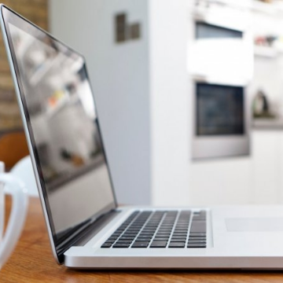

A 2-Year Stanford Study Shows the Astonishing Productivity Boost of Working From Home

A 2-Year Stanford Study Shows the Astonishing Productivity Boost of Working From Home

https://www.inc.com/scott-mautz/a-2-year-stanford-study-shows-astonishing-productivity-boost-of-working-from-home.html

The jury was out on the productivity effect of working from home. It has returned with a surprising verdict.