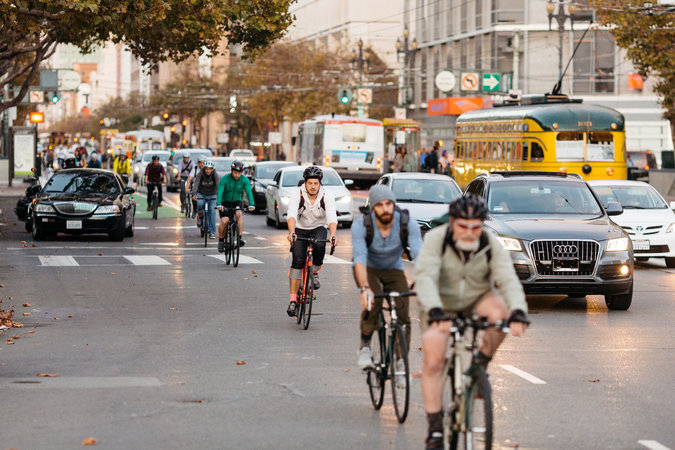
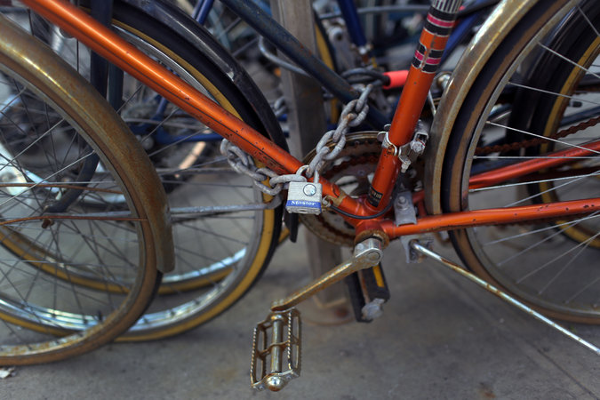
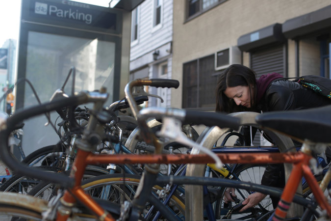
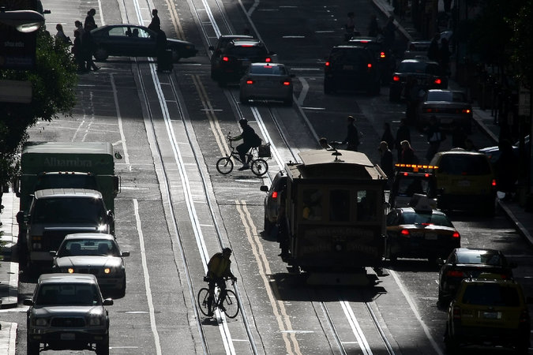
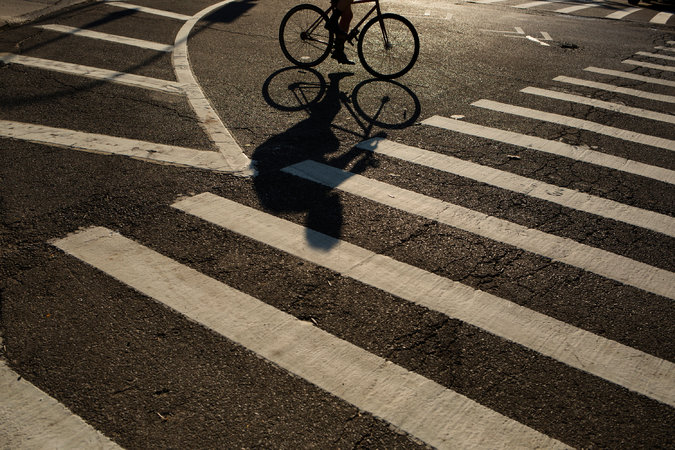

A Beginner’s Guide to Biking to Work

#### Be Safe

 Photo
 
**

 The two-wheelers’ commute on Market Street in San Francisco.

   Credit Jason Henry for The New York Times

**Ditch the Sidewalks: **In many places, biking on sidewalks endangers pedestrians who may not see or hear you, and puts you well outside drivers’ field of view.

**Take the Lane: **Your local rules may vary (here’s a [list of laws by state](http://bikeleague.org/StateBikeLaws)), but most locales permit cyclists to ride in the middle of a regular car lane if a road’s shoulder is narrow or “subpar,” meaning it is full of gravel or potholes or is otherwise dangerous. If a driver cannot safely pass while leaving three full feet of space, it’s safest to ride in the center of the lane and make traffic wait behind you.

**Use Hand Signals: **Cyclists have their own language of hand signals that indicate when they’re slowing down, or which direction they plan to turn. Study up so you can let drivers and other cyclists around you know what you’re going to do before you do it. You can learn more [here](http://bikeleague.org/content/signaling).

**Watch for Parked Cars: **If there’s a row of cars to your right, leave at least three to four feet of space between you and the doors, just in case a driver opens a door without checking first for cyclists.

**Ditch the Tunes: **You need all your senses while riding. If you must have music, consider a small portable stereo. Earbuds block too much ambient traffic noise to be a safe option.

**Connect With Other Riders: **Other cyclists are your best allies in finding bike-friendly roads. Attention to detail matters when balancing on a few square inches of rubber, and regular riders know a city’s contours, bottlenecks and the school driveways where texting parents behind the wheel can pull out without looking.

If you don’t know any bike commuters, seek out a nearby cycling advocacy group on the League of American Bicyclists’ [website](http://www.bikeleague.org/), where you can search using your ZIP code. Often these organizations publish maps showing bike-friendly and ride-at-your-own-risk routes.

Finally, pay attention when you’re driving. If you see many bikers on a thoroughfare, that probably means it’s a good spot to ride. Plus, if a street has many riders, that generally means drivers are tuned in to cyclists. When it comes to riding, [there’s real strength in numbers](http://usa.streetsblog.org/2015/02/27/safety-in-numbers-biking-is-safest-in-nations-with-the-most-people-on-bikes/).

#### Gather Your Gear

 Photo
 
**

 The bike most likely to get stolen? The one that looks easiest to steal. So invest in a good lock.

   Credit Michael Appleton for The New York Times

Cycling can easily get expensive, especially if you’re a sucker for high-end tech. But for commuting, reliable gear is more important than cruising in on a pro-quality ride. Get a few good basics and you’ll get to your destination safely and comfortably.

**Bike:** Wirecutter spent about 30 hours evaluating some 50 bikes, and found that the [Marin Fairfax SC1 is the best bike](http://thesweethome.com/reviews/best-hybrid-commuter-bike/) if you need a reliable ride to work and a good vehicle for weekend exercise.

**Rack, basket or pannier:** Sure, you can carry your stuff in a messenger bag or a backpack, but putting your stuff on a separate rack gets it off your back, making your whole ride more comfortable. [Here are Wirecutter’s picks for the best rack, basket and pannier](http://thesweethome.com/reviews/best-bike-rack-basket-panniers/).

**Lock:** The most attractive bike to most thieves is the one that’s easiest to steal. Your lock doesn’t need to be impenetrable, it just needs to be better than everyone else’s. Wirecutter recommends the [Kryptonite Evolution Mini-7](http://thesweethome.com/reviews/best-bike-lock/).

**Bell:** Dorky, maybe, but a must-have if you’re commuting on busy streets. (In some areas, it might be legally required — check your local laws.)

**Fenders**: Your rear tire can kick up water and dirt from the pavement, covering you in a mix of motor oil, mud, storm runoff and more. Fenders stop this process, keeping road water off you.

**Helmet:** Adults aren’t legally obligated to wear helmets, but a majority of bike fatalities (54 percent in 2015, according to the [Insurance Institute for Highway Safety](http://www.iihs.org/iihs/topics/t/pedestrians-and-bicyclists/fatalityfacts/bicycles)) involve riders who weren’t wearing helmets. Wirecutter’s top pick for commuters is the [Specialized Echelon II](http://thesweethome.com/reviews/best-bike-helmet-for-commuters/).

**Lights:** If you’re up before dawn or stay late and ride home in the dark, you’ll need a white light for the front of your bike and a red one for the back (and like bells, these might be legally required). [Try the Light & Motion Urban 350 for a front light and the Cygolite Hotshot 50 on the back](http://thesweethome.com/reviews/best-commuter-bike-lights/). Reflectors may be required, too, and should come standard on any bike you buy.

**Personal Identification:** Whether you buy a specialized ID bracelet (like [RoadID](https://www.roadid.com/)) or just carry your driver’s license, having identification is a must, so medical personnel can identify you quickly if you’re involved in an accident.

**Flat-changing supplies: **Flats are a part of life for commuters, so you might as well have the right gear to fix them. [Here is everything you’ll need, along with instructions on how to change flats and apply patches](http://thesweethome.com/reviews/best-bike-patch-kit/).

#### Arrive Calm, Cool and Collected

 Photo
 
**

 Locking up the bike by the No. 7 train station on Jackson Avenue in Queens.    Credit Michael Appleton for The New York Times

The fear of showing up to a 9 a.m. board meeting with pit stains stretching down to your belt is real, especially during the swampiest parts of summer. But there’s one simple way to avoid this fate: “You don’t have to do your commute fast. You don’t have to ride hard,” said Bill Nesper, the interim executive director at the [League of American Bicyclists](http://www.bikeleague.org/), a national bicycle advocacy organization.

Another option to combat sweat is to buy an E-bike or a bike with a small, electric-assist motor. “I got an E-bike when I was 36 weeks pregnant and it extended my ability to ride,” said Dena Driscoll, a Philadelphia commuter. With a small, rechargeable battery, the motor works only if you’re pedaling, and it doesn’t add too much oomph. On Mrs. Driscoll’s, the electric assist cuts out when she hits 12 miles per hour. “It doesn’t make you lazy. It just makes you feel more ambitious,” she said, adding that it allows her to pedal up steep hills even if her bike is loaded with children and groceries.

And, of course, ditch that backpack in favor of a rack, basket or pannier.

#### Prep Your Office

 Photo
 
**

 A Bike to Work event in San Francisco in 2009. The benefits of biking to work are many.    Credit Justin Sullivan/Getty Images

The less you have to carry on your bike, the more fun your bike commute is going to be. Stashing extra clothes, toiletries and snacks in a desk drawer will save you from having to tote everything back and forth, and it comes in handy when weather-related emergencies strike.

Here’s what you need:

**Extra Clothes: **Mr. Nesper always keeps a spare set of dress shoes and a suit jacket in his office. “I ride in my athletic shoes and then slip into my work shoes once I arrive,” he said. Since women’s heels are a pain to pack in a bag, I always kept two pairs of pumps — one black and one nude — under my desk.

**Newspaper:** Stuffing your athletic shoes with newsprint will help them dry before quitting time.

**Toiletries**: Consider keeping a “freshen-up” kit in a desk drawer. Stock it with baby powder, which dehumidifies soggy feet (and other bits); dry shampoo, which can give helmet hair a just-washed look; body wipes for scrubbing off chain grease, a tiny hair straightener and extra deodorant.

**Towel:** Ride enough and you will arrive at work moist from either sweat or rain. Having a clean towel will lift your mood more than you know. On Friday, stuff it in your bag and take it home for washing.

**Snacks:** If you feel low on motivation in the hour before your ride home, you may just need a carb infusion. I always keep granola bars, nuts, trail mix or another healthy snack at the ready.

#### Let Yourself Off the Hook Sometimes

 Photo
 
**

 Connecting with other experienced cyclists or cycling groups is a good way to get to know the ins and outs of particular routes.    Credit Victor J. Blue for The New York Times

It’s raining. It’s hot. You’re not feeling it. Fine, don’t ride.

There’s no rule that says bike commuters have to be hard core, or that you need to feel guilty for missing a day.

“A lot of people don’t realize that they can piece their commute together with different types of transit options,” Mr. Nesper said, adding that bike commuters often end up becoming savvy transit consumers. “Many city buses now have bike racks on them,” and some subway systems allow bikes in certain cars. And if those aren’t options, leave your bike at home and take a cab or take a ride-hailing service.

 [Continue reading the main story](https://www.nytimes.com/2017/05/30/smarter-living/biking-to-work-guide.html#whats-next)