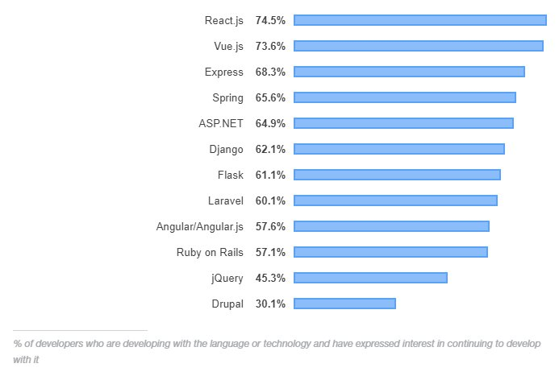
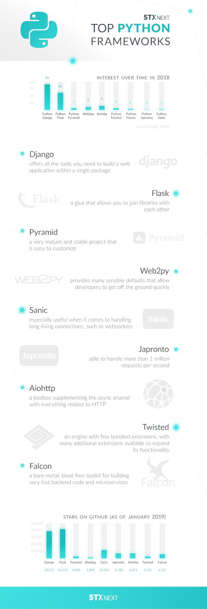

A Beginner’s Introduction to Python Web Frameworks

#  A Beginner’s Introduction to Python Web Frameworks

 **   27 Sep 2018

 ** 25 min read

 **  [Python](https://stxnext.com/blog/category/python/)
 

*Updated June 12, 2019.*

Since you’re reading this, it’s safe to assume you’re interested in taking up [Python](https://stxnext.com/blog/2018/01/17/why-python/)—or maybe you’ve already started learning this awesome language.

It doesn’t seem too daunting, right? You can code, after all, so it’s just a matter of grasping the differences in syntax.

So let’s take it up a notch and talk about collecting proper experience in [Python](https://stxnext.com/ebooks/what-is-python-used-for/).

Let’s discuss creating your first Python project.
Where do you start?

With an idea, obviously, but that won’t be a problem. Surely you already have several great concepts, just waiting for some of that precious spare time and attention.

What’s next, then? The choice of a framework.

And that’s where the real conundrum starts, because the ecosystem of Python frameworks is quite extensive and varied.

In this article, we’re going to describe the most common Python frameworks. We hope that it will be more than enough for you to pick the right one and get started.

Be warned, though, that this list is rather subjective. It came together mainly as a result of our collective experience of applying these frameworks in the projects we have worked on.

Table of contents

I. [What are web frameworks?](https://stxnext.com/blog/2018/09/27/beginners-introduction-python-frameworks/#what-are-web-frameworks)

II. [Django](https://stxnext.com/blog/2018/09/27/beginners-introduction-python-frameworks/#django)

[Sample model in Django](https://stxnext.com/blog/2018/09/27/beginners-introduction-python-frameworks/#sample-model-django)

III. [Flask](https://stxnext.com/blog/2018/09/27/beginners-introduction-python-frameworks/#flask)

[Sample view in Flask](https://stxnext.com/blog/2018/09/27/beginners-introduction-python-frameworks/#sample-view-flask)

IV. [Pyramid](https://stxnext.com/blog/2018/09/27/beginners-introduction-python-frameworks/#pyramid)

[Sample “Hello world” app in Pyramid](https://stxnext.com/blog/2018/09/27/beginners-introduction-python-frameworks/#sample-app-pyramid)

V. [web2py](https://stxnext.com/blog/2018/09/27/beginners-introduction-python-frameworks/#web2py)

[Sample model in web2py](https://stxnext.com/blog/2018/09/27/beginners-introduction-python-frameworks/#sample-model-web2py)

VI. [Sanic](https://stxnext.com/blog/2018/09/27/beginners-introduction-python-frameworks/#sanic)

[Handling websockets in Sanic](https://stxnext.com/blog/2018/09/27/beginners-introduction-python-frameworks/#handling-websockets-sanic)

VII. [Japronto](https://stxnext.com/blog/2018/09/27/beginners-introduction-python-frameworks/#japronto)

[Sample “Hello world” app in Japronto](https://stxnext.com/blog/2018/09/27/beginners-introduction-python-frameworks/#sample-app-japronto)

VIII. [aiohttp](https://stxnext.com/blog/2018/09/27/beginners-introduction-python-frameworks/#aiohttp)

[Websocket client using aiohttp](https://stxnext.com/blog/2018/09/27/beginners-introduction-python-frameworks/#websocket-client-aiohttp)

IX. [Twisted](https://stxnext.com/blog/2018/09/27/beginners-introduction-python-frameworks/#twisted)

[inlineCallbacks code in Twisted](https://stxnext.com/blog/2018/09/27/beginners-introduction-python-frameworks/#inlinecallbacks-code-twisted)

X. [Falcon](https://stxnext.com/blog/2018/09/27/beginners-introduction-python-frameworks/#falcon)

[Sample “Hello world” app in Falcon](https://stxnext.com/blog/2018/09/27/beginners-introduction-python-frameworks/#sample-app-falcon)

XI. [API Star](https://stxnext.com/blog/2018/09/27/beginners-introduction-python-frameworks/#api-star)

[Schema validation on views in API Star](https://stxnext.com/blog/2018/09/27/beginners-introduction-python-frameworks/#schema-validation-api-star)

XII. [Other Python web development frameworks](https://stxnext.com/blog/2018/09/27/beginners-introduction-python-frameworks/#others)

XIII.  [What are some of the most popular web frameworks?](https://stxnext.com/blog/2018/09/27/beginners-introduction-python-frameworks/#most-popular)

XIV. [Top Python frameworks**—**infographic](https://stxnext.com/blog/2018/09/27/beginners-introduction-python-frameworks/#infographic)

XV. [Final thoughts on Python web frameworks](https://stxnext.com/blog/2018/09/27/beginners-introduction-python-frameworks/#final-thoughts)

## I. What are web frameworks?

Before you decide on a particular choice of framework, let’s make sure we’re on the same page when it comes to definitions.

What exactly do we have in mind when we talk about a web application framework?

In short, a web framework is a package of generic functionalities that makes creating web apps easier for the developer. It serves as a shortcut that removes the need to write unnecessary code by reusing existing solutions. As a result, it reduces the time your developers need to spend on writing code and makes their work more effective.

Web frameworks can be divided into two categories: frontend and backend. The former, also known as CSS frameworks, is all about the parts of the web app the users see and interact with. The latter relates to the behind-the-scenes aspects of creating a web app.

The crucial benefit of using Python frameworks is that you can mix and match frontend and backend elements within each framework to achieve the desired result. You can either focus on one or merge several of them, depending on the scope of your project.

By offering ready-made solutions, web app frameworks help developers add complex and dynamic elements that would otherwise be very difficult or time-consuming to develop from scratch.

## II. Django

 

The most popular Python framework is Django, hands down. Django’s trademark is that it offers all the tools you need to build a web application within a single package, from low- to high-end.

Django applications are based on a design pattern similar to MVC, the so-called MVT (Model-View-Template) pattern. Models are defined using the Django ORM, while SQL databases are mainly used as storage.

Django has a built-in admin panel, allowing for easy management of the database content. With minimal configuration, this panel is generated automatically based on the defined models.

Views can include both functions and classes, and the assignment of URLs to views is done in one location (the urls.py file), so that after reviewing that single file you can learn which URLs are supported. Templates are created using a fairly simple Django Templates system.

Django is praised for strong community support and detailed documentation describing the functionality of the framework. This documentation coupled with getting a comprehensive environment after the installation makes the entry threshold rather low. Once you go through [the official tutorial](https://docs.djangoproject.com/en/1.11/intro/tutorial01/), you’ll be able to do most of the things required to build an application.

Unfortunately, Django’s monolithism also has its drawbacks. It is difficult, though not impossible, to replace one of the built-in elements with another implementation. For example, using some other ORM (like SQLAlchemy) requires abandoning or completely rebuilding such items as the admin panel, authorization, session handling, or generating forms.

Because Django is complete but inflexible, it is suitable for standard applications (i.e. the vast majority of software projects). However, if you need to implement some unconventional design, it leads to struggling with the framework, rather than pleasant programming.

### Sample model in Django

1
2
3
4
5
6
7
8
9
10
11
12
13
14
15
16
17
18
 	class Company(models.Model):

	    name = models.CharField(max_length=255)
	    email = models.EmailField(max_length=75, null=True, blank=True)
	    website_url = models.URLField(blank=True, null=True)
	    city = models.CharField(max_length=100, null=True, blank=True)
	    street = models.CharField(max_length=100, null=True, blank=True)
	    size = models.IntegerField(null=True, blank=True)
	    date_founded = models.CharField(
	        help_text='MM/YYYY', null=True, blank=True, max_length=7,
	    )
	    @property
	    def urls(self):
	        return {
	            'view': reverse('view-company', args=(self.pk,)),
	            'edit': reverse('edit-company', args=(self.pk,)),
	        }
	    def __unicode__(self):
	        return self.name

## III. Flask

 

Flask is considered a microframework. It comes with basic functionality, while also allowing for easy expansion. Therefore, Flask works more as the glue that allows you to join libraries with each other.

For example, “pure Flask” does not provide support for any storage, yet there are many different implementations that you can install and use interchangeably for that purpose (such as Flask-SQLAlchemy, Flask-MongoAlchemy, and Flask-Redis). Similarly, the basic template system is Jinja2, but you can use a replacement (like Mako).

The motto of this framework is “one drop at a time,” and this is reflected in its comprehensive documentation. The knowledge of how to build an application is acquired in portions here; after reading a few paragraphs, you will be able to perform basic tasks.

You don’t have to know the more advanced stuff right away—you’ll learn it once you actually need it. Thanks to this, students of Flask can gather knowledge smoothly and avoid boredom, making Flask suitable for learning.

A large number of Flask extensions, unfortunately, are not supported as well as the framework itself. It happens quite often that the plug-ins are no longer being developed or their documentation is outdated. In cases like these, you need to spend some time googling a replacement that offers similar functionality and is still actively supported.

When building your application with packages from different authors, you might have to put quite a bit of sweat into integrating them with each other. You will rarely find ready-made instructions on how to do this in the plug-ins’ documentation, but in such situations the Flask community and websites such as Stack Overflow should be of help.

### Sample view in Flask

1
2
3
4
5
6
7
8
9
10
11
12
 	@image_view.route(

	    '/api/<string:version>/products/<int:prod_id>/images',
	    methods=['GET'],
	)
	@auth_required()
	@documented(prod_id="ID of a product")
	@output(ProductImagesSeq)
	@errors(MissingProduct)
	@jsonify
	def images_get(version, prod_id):
	    """Retrieves a list of product images."""
	    return [i.serialize() for i in find_product(prod_id).images]

## IV. Pyramid

 

Pyramid, the third noteworthy Python web framework, is rooted in two other products that are no longer developed: Pylons and repoze.bfg. The legacy left by its predecessors caused Pyramid to evolve into a very mature and stable project.

The philosophies of Pyramid and Django differ substantially, even though both were released in the same year (2005). Unlike Django, Pyramid is trivial to customize, allowing you to create features in ways that the authors of the framework themselves hadn’t foreseen. It does not force the programmer to use framework’s idioms; it’s meant to be a solid scaffolding for complex or highly non-standard projects.

Pyramid strives to be persistence-agnostic. While there is no bundled database access module, a common practice is to combine Pyramid with the powerful, mature SQLAlchemy ORM. Of course, that’s only the most popular way to go. Programmers are free to choose whatever practices suit them best, such as using the peewee ORM, writing raw SQL queries, or integrating with a NoSQL database, just to name a few.

All options are open, though this approach requires a bit of experience to smoothly add the desired persistence mechanisms to the project. The same goes for other components, such as templating.

Openness and freedom are what Pyramid is all about. Modules bundled with it relate to the web layer only and users are encouraged to freely pick third-party packages that will support other aspects of their projects.

However, this model causes a noticeable overhead at the beginning of any new project, because you have to spend some time choosing and integrating the tools your team is comfortable with. Still, once you put the effort into making additional decisions during the early stages of the work, you are rewarded with a setup that makes it easy and comfortable to start a new project and develop it further.

Pyramid is a self-proclaimed “start small, finish big, stay finished framework.” This makes it an appropriate tool for experienced developers who are not afraid of playing the long game and working extra hard in the beginning, without shipping a single feature within the first few days. Less experienced programmers may feel a bit intimidated.

### Sample “Hello world” app in Pyramid

1
2
3
4
5
6
7
8
9
10
11
12
13
14
15
16
17
 	from wsgiref.simple_server import make_server

	from pyramid.config import Configurator
	from pyramid.response import Response

	def hello_world(request):
	   return Response('Hello, world!')

	if __name__ == '__main__':
	   with Configurator() as config:
	       config.add_route('hello', '/')
	       config.add_view(hello_world, route_name='hello')
	       app = config.make_wsgi_app()

	   server = make_server('0.0.0.0', 6543, app)
	   server.serve_forever()

## V. web2py

 

Created in 2007, web2py is a framework originally designed as a teaching tool for students, so the main concern for its authors was ease of development and deployment.

Web2py is strongly inspired by Django and Ruby on Rails, sharing the idea of convention over configuration. In other words, web2py provides many *sensible defaults* that allow developers to get off the ground quickly.

This approach also means there are a lot of goodies bundled with web2py. You will find everything you’d expect from a web framework in it, including a built-in server, HTML-generating helpers, forms, validators, and many more—nothing unusual thus far, one could argue. Support for multiple database engines is neat, though it’s a pretty common asset among current web frameworks.

However, some other bundled features may surprise you, since they are not present in other frameworks:

- •helpers for creating [JavaScript](https://stxnext.com/services/javascript-development/)-enabled sites with jQuery and Ajax;
- •scheduler and cron;
- •2-factor authentication helpers;
- •text message sender;
- •an event-ticketing system, allowing for automatic assignment of problems that have occurred in the production environment to developers.

The framework proudly claims to be a full-stack solution, providing everything you could ever need.

Web2py has extensive documentation available online. It guides newcomers step by step, starting with a short introduction to the Python language. The introduction is seamlessly linked with the rest of the manual, demonstrating different aspects of web2py in a friendly manner, with lots of code snippets and screenshots.

Despite all its competitive advantages, web2py’s community is significantly smaller than Django’s, or even Pyramid’s. Fewer developers using it means your chances of getting help and support are lower. The official mailing list is mostly inactive.

Additionally—and unfortunately—web2py is not compatible with Python 3 at the moment. This state of things puts the framework’s prospects into question, as support for Python 2 ends in 2020. This issue is being addressed on the project’s github. [Here](https://github.com/web2py/web2py/issues/1353) is where you can track the progress.

### Sample model in web2py

1
2
3
4
5
6
7
8
9
10
11
12
13
14
15
16
17
18
19
20
21
22
23
24
25
 	class Ads(BaseModel):

	    tablename = "ads"

	    def set_properties(self):
	        T = self.db.T
	        self.fields = [
	            *# main*
	            Field("title", "string"),
	            Field("description", "text"),
	            Field("picture", "upload"),
	            Field("thumbnail", "upload"),
	            Field("link", "string"),
	            Field("place", "string")
	        ]

	        self.computations = {
	            "thumbnail": lambda r: THUMB2(r['picture'], gae=self.db.request.env.web2py_runtime_gae)
	    }

	        self.validators = {
	            "title": IS_NOT_EMPTY(),
	            "description": IS_LENGTH(255, 10),
	            "picture": IS_IMAGE(),
	            "place": IS_IN_SET(["top_slider", "top_banner", "bottom_banner", "left_sidebar", "right_sidebar", "inside_article", "user_profile"], zero=None)
	        }

## VI. Sanic

 

Sanic differs considerably from the aforementioned frameworks because unlike them, it is based on asyncio—Python’s toolbox for asynchronous programming, bundled with the standard library starting from version 3.4.

In order to develop projects based on Sanic, you have to grasp the ideas behind asyncio first. This involves a lot of theoretical knowledge about coroutines, concurrent programming caveats, and careful reasoning about the data flow in the application.

Once you get your head around Sanic/asyncio and applies the framework to an appropriate problem, the effort pays off. Sanic is especially useful when it comes to handling long-living connections, such as websockets. If your project requires support for websockets or making a lot of long-lasting external API calls, Sanic is a great choice.

Another use case of Sanic is writing a “glue-web application” that can serve as a mediator between two subsystems with incompatible APIs. Note that it requires at least Python 3.5, though.

The framework is meant to be very fast. One of its dependencies is [uvloop](https://github.com/MagicStack/uvloop)—an alternative, drop-in replacement for asyncio’s not-so-good built-in event loop. Uvloop is a wrapper around libuv, the same engine that powers Node.js. According to the uvloop documentation, this makes asyncio work 2–4 times faster.

In terms of “what’s in the box,” Sanic doesn’t offer as much as other frameworks. It is a microframework, just like Flask. Apart from routing and other basic web-related goodies like utilities for handling cookies and streaming responses, there’s not much inside. Sanic imitates Flask, for instance by sharing the concept of Blueprints—tiny sub-applications that allow developers to split and organize their code in bigger applications.

Sanic also won’t be a good choice for simple CRUD applications that only perform basic database operations. It would just make them more complicated with no visible benefit.

### Handling websockets in Sanic

1
2
3
4
5
6
 	@app.websocket('/websocket')

	async def time(websocket, path):
	   while True:
	      now = datetime.datetime.utcnow().isoformat() + 'Z'
	      await websocket.send(now)
	      await asyncio.sleep(random.random() * 3)

## VII. Japronto

Have you ever imagined handling 1,000,000 requests per second with Python?

It seems unreal, since Python isn’t the fastest programming language out there. But when a brilliant move was made to add asyncio to the standard library, it opened up countless possibilities.

Japronto is a microframework that leverages some of them. As a result, this Python framework was able to cross the magical barrier of 1 million requests handled per second.

You may still be at a loss as to how that is possible, exactly.

It all comes down to 2 aces up Japronto’s sleeve: uvloop and PicoHTTPParser. Uvloop is an asyncio backend based on libuv, while PicoHTTPParser is a lightweight HTTP headers parser written in C. All core components of the framework are also implemented in C. A wide variety of low-level optimizations and tricks are used to tweak performance.

Japronto is designed for special tasks that could not be accomplished with bloated mainstream frameworks. It is a perfect fit for problems where every nanosecond counts. Knowledgeable developers, obsessed with optimization, will reap all of its possible benefits.

Additionally, Japronto is meant to provide a solid foundation for microservices using REST APIs with minimal overhead. In other words, there’s not much in the box. Developers only need to set up routing and decide which routes should use synchronous or asynchronous handlers.

It might seem counterintuitive, but if a request can be handled in a synchronous way, you shouldn’t try to do it asynchronously, as the overhead of switching between coroutines will limit performance.

What is quite unfortunate is that Japronto is not being actively developed. On the other hand, the project is licensed under MIT, and the author claims he is willing to accept any contributions. Like Sanic, the framework is meant to work with Python 3.5+ versions.

### Sample “Hello world” app in Japronto

1
2
3
4
5
6
7
8
 	from japronto import Application

	def hello(request):
	    return request.Response(text='Hello world!')

	app = Application()
	app.router.add_route('/', hello)
	app.run(debug=True)

## VIII. aiohttp

 

Aiohttp is another library based on asyncio, the modern Python toolkit for writing asynchronous code. Not meant to be a framework in a strict sense, aiohttp is more of a toolbox, supplementing the async arsenal with everything related to HTTP.

This means aiohttp is helpful not only for writing server applications, but also to clients. Both will benefit from asyncio’s goodies, most of all the ability to handle thousands of connections at the same time, provided the majority of operations involves I/O calls.

Such powerful clients are great when you have to issue many API calls at once, for example for scraping web pages. Without asyncio, you would have to use threading or multiprocessing, which are harder to get right and require much more memory.

Apart from building standalone applications, aiohttp’s clients are a great supplement to any asyncio-based application that needs to issue non-blocking HTTP calls. The same is true for websockets. Since they are part of the HTTP specification, you can connect to websocket servers and easily exchange messages with them.

When it comes to servers, aiohttp gives you everything you can expect from a microframework. The features available out-of-the-box include routing, middleware, and signals. It may seem like it’s very little, but it will suffice for a web server.

“What about the remaining functionalities?” you may ask.

As far as those are concerned, you can build the rest of the functionalities using one or many asyncio-compatible libraries. You will find plenty of them using sources [like this one](https://github.com/timofurrer/awesome-asyncio).

Aiohttp is built with testing in mind. Developers who want to test an aiohttp-based application will find it extremely easy, especially with the aid of pytest.

Even though aiohttp offers satisfactory performance by default, there are a few low-hanging fruits you can pick. For example, you can install additional libraries: cchardet and aiodns. Aiohttp will detect them automatically. You can also utilize the same uvloop that powers Sanic.

Last but not least: one definite advantage of aiohttp is that it is being actively maintained and developed. Choosing aiohttp when you build your next application will certainly be a good call.

### Websocket client using aiohttp

1
2
3
4
5
6
7
8
9
10
 	async with session.ws_connect('http://example.org/ws') as ws:

	    async for msg in ws:
	        if msg.type == aiohttp.WSMsgType.TEXT:
	            if msg.data == 'close cmd':
	                await ws.close()
	                break
	            else:
	                await ws.send_str(msg.data + '/answer')
	        elif msg.type == aiohttp.WSMsgType.ERROR:
	            break

## IX. Twisted

 

With Twisted, Python developers were able to do async programming long before it was cool. Twisted is one of the oldest and most mature Python projects around.

Originally released in 2002, Twisted predates even PEP8, so the code of the project does not follow the famous code style guide recommendations. Admittedly, this may somewhat discourage people from using it these days.

Twisted’s heart is an event-driven networking engine called `reactor`. It is used for scheduling and calling user-defined callbacks.

In the beginning, developers had to use explicit callbacks by defining functions and passing them around separately for cases when an operation succeeded and when it failed.

Although this technique was compelling, it could also lead to what we know from early JavaScript: callback hell. In other words, the resultant code was tough to read and analyze.

At some point, Twisted introduced inlineCallbacks—the notation for writing asynchronous code that was as simple to read as regular, synchronous code. This solution played very well with Python’s syntax and greatly influenced modern async toolkit from the standard library, asyncio.

The greatest advantage of this framework is that although Twisted itself is just an engine with few bundled extensions, there are many additional extensions available to expand its functionality. They allow for both low-level network programming (TCP/USP) and high, application-level work (HTTP, IMAP, SHH, etc).

This makes Twisted a perfect choice for writing specialized services; however, it is not a good candidate for regular web applications. Developers would have to write a lot of things on their own to get the functionality they take for granted with Django.

Twisted is being actively maintained. There is an undergoing effort to migrate all of its code to be compatible with Python 3. The core functionality was rewritten some time ago, but many third-party modules are still incompatible with newer versions of the interpreter.

This may raise some concerns whether Twisted is the best choice for new projects. On the other hand, though, it is more mature than some asyncio-based solutions. Also, Twisted has been around for quite some time now, which means it will undoubtedly be maintained at least for a good while.

### inlineCallbacks code in Twisted

1
2
3
4
5
6
7
8
9
 	@inlineCallbacks

	def getUsers(self):
	    try:
	        responseBody = yield makeRequest("GET", "/users")
	    except ConnectionError:
	        log.failure("makeRequest failed due to connection error")
	        returnValue([])

	    returnValue(json.loads(responseBody))

## X. Falcon

 

Falcon is another microframework on our list. The goal of the Falcon project is to create a minimalist foundation for building web apps where the slightest overhead matters.

Authors of the framework claim it is a bare-metal, bloat-free toolkit for building very fast backend code and microservices. Plus, it is compatible with both Python 2 and 3.

A big advantage of Falcon is that it is indeed very fast. Benchmarks published on its website show an incredible advantage over mainstream solutions like Django or Flask.

The downside, though, is that Falcon offers very little to start with. There’s routing, middlewares, hooks—and that’s basically everything. There are no extras: no validation, no authentication, etc. It is up to the developer to extend functionality as needed.

Falcon assumes it will be used for building REST APIs that talk JSON. If that is the case, you really need literally zero configuration. You can just sit down and code.

This microframework might be an exciting proposition for implementing highly-customized services that demand the highest performance possible. Falcon is an excellent choice when you don’t want or can’t invest in asyncio-based solutions.

If you’re thinking, “Sometimes the simplest solution is the best one,” you should definitely consider Falcon.

### Sample “Hello world” app in Falcon

1
2
3
4
5
6
7
8
9
10
11
12
13
14
15
 	import falcon

	class QuoteResource:
	def on_get(self, req, resp):
	    quote = {
	        'quote': (
	            "I've always been more interested in "
	            "the future than in the past."
	        ),
	        'author': 'Grace Hopper'
	    }
	    resp.media = quote

	api = falcon.API()
	api.add_route('/quote', QuoteResource())

## XI. API Star

 

API Star is the new kid on the block. It is yet another microframework, but this one is compatible with Python 3 only. Which is not surprising, because it leverages type hints introduced in Python 3.5.

API Star uses type hints as a notation for building validation schemata in a concise, declarative way. Such a schema (called a “Type” in the framework’s terminology) can then be bound to request a handling function.

Additionally, API Star features automatically generated API docs. They are compatible with OpenAPI 3. Such docs can facilitate communication between API authors and its consumers, i.e. frontend developers. If you use the Types we’ve mentioned, they are included in the API docs.

Another outstanding feature is the dependency injection mechanism. It appears to be an alternative to middlewares, but smarter and much more powerful.

For example, you can write a so-called Component that will provide our views with a currently authenticated User. On the view level, you have to explicitly state that it will require a User instance.

The rest happens behind the scenes. API Star resolves which Components have to be executed to finally run our view with all the required information.

The advantage that automatic dependency injection has over regular middlewares is that Components do not cause any overhead for the views where they are not used.

Last but not least, API Star can also be run atop asyncio in a more traditional, synchronous, WSGI-compliant way. This makes it probably the only popular framework in the Python world capable of doing that.

The rest of the goodies bundled with API Star are pretty standard: optional support for templating with jinja2, routing, and event hooks.

All in all, API Star looks extremely promising. At the time of writing, it has over 4,500 stars in its GitHub repository. The repository already has a few dozen contributors, and pull requests are merged daily. Many of us at STX Next are keeping our fingers crossed for this project!

### Schema validation on views in API Star

1
2
3
4
5
6
7
8
9
10
11
12
13
14
15
16
 	from apistar import types, validators

	class Product(types.Type):
	     name = validators.String(max_length=100)
	     rating = validators.Integer(minimum=1, maximum=5)
	     in_stock = validators.Boolean(default=False)
	     size = validators.String(enum=['small', 'medium', 'large'])

	def create_product(product: Product):
	    *# Save a new product record in the database.*
	    ...

	routes = [
	    Route('/create_product/', method='POST', handler=create_product)
	]

## XII. Other Python web development frameworks

There are many more Python web frameworks out there you might find interesting and useful. Each of them focuses on a different issue, was built for distinct tasks, or has a particular history.

The first that comes to mind is Zope2, one of the oldest frameworks, still used mainly as part of the Plone CMS. Zope3 (later renamed BlueBream) was created as Zope2’s successor. The framework was supposed to allow for easier creation of large applications, but hasn’t won too much popularity, mainly because of the need to master fairly complex concepts (e.g. Zope Component Architecture) very early in the learning process.

Also noteworthy is the Google App Engine, which allows you to run applications written in Python, among others. This platform lets you create applications in any framework compatible with WSGI. The SDK for the App Engine includes a simple framework called webapp2, and this exact approach is often used in web applications adapted to this environment.

Another interesting example is Tornado, developed by FriendFeed and made available by Facebook. This framework includes libraries supporting asynchronicity, so you can build applications that support multiple simultaneous connections (like long polling or WebSocket).

Other libraries similar to Tornado include Pulsar (async) and Gevent (greenlet). These libraries allow you to build any network applications (multiplayer games and chat rooms, for example). They also perform well at handling HTTP requests.

Developing applications using these frameworks and libraries is more difficult and requires you to explore some harder-to-grasp concepts. We recommend getting to them later on, as you venture deeper into the wonderful world of Python.

## XIII. What are some of the most popular web frameworks?

Stack Overflow, a leading Q&A site for the global developer community, runs an annual Developer Survey that asks its 90,000-strong pool of followers comprehensive questions about their professional lives.

The survey is interesting for many reasons, not least its statistics highlighting the increasing popularity of Python among developers worldwide.

In one of the questions, developers were asked to rate their most loved web frameworks in various programming languages. As you can see, Python frameworks—including Django and Flask—rank pretty high:

 

 Source: https://insights.stackoverflow.com/survey/2019#most-loved-dreaded-and-wanted

## XIV. Top Python frameworks—infographic

Wouldn’t it be nice if you could get a summary of all the frameworks we’ve listed here in one tidy infographic?

Well, that is exactly what we’ve prepared for you!

 

 Top Python Frameworks

*[Click here to view the infographic in high resolution](https://stxnext.com/media/filer_public_thumbnails/filer_public/5a/96/5a96261e-fb19-4109-9ec7-d2816d765ca3/infografika-python-frameworks_update.png__2500x7342_q85_crop_subsampling-2_upscale.jpg)*

## XV. Final thoughts

Python offers an extensive selection of web frameworks, all of which have their own strengths and weaknesses. At STX Next, we use whatever framework fits a given project best, even learning new ones on the go if need be.

We hope this summary will help you decide which framework you like the most and delve into that one first.

And now, it’s time for you to make a move. Read a guide or watch a tutorial. Write some practice code. Get started on your first Python project.

If you have any more Python-related questions, don’t hesitate to leave us a comment or contact us directly—we’d be happy to help out.

 

 
Wojciech Lichota

Head of Service Delivery

 
Sebastian Buczyński

Senior Python Developer

share this post

 [**  Share on Google+](https://plus.google.com/share?url=https://stxnext.com/blog/2018/09/27/beginners-introduction-python-frameworks/)  [**  Share on Twitter](http://www.twitter.com/share?url=https://stxnext.com/blog/2018/09/27/beginners-introduction-python-frameworks/)  [**  Share on Facebook](https://www.facebook.com/sharer/sharer.php?u=https://stxnext.com/blog/2018/09/27/beginners-introduction-python-frameworks/)  [**  Share on LinkedIn](https://www.linkedin.com/cws/share?url=https://stxnext.com/blog/2018/09/27/beginners-introduction-python-frameworks/)

- [2 comments]()
- [**stxnext**](https://disqus.com/home/forums/stxnext/)
- [Marc Cohen](https://disqus.com/embed/comments/?base=default&f=stxnext&t_u=https%3A%2F%2Fstxnext.com%2Fblog%2F2018%2F09%2F27%2Fbeginners-introduction-python-frameworks%2F&t_d=%0A%20%20%20%20%20%20%20%20%20%20%20%20%20%20%20%20%20%20%20%20A%20Beginner%E2%80%99s%20Introduction%20to%20Python%20Web%20Frameworks%0A%20%20%20%20%20%20%20%20%20%20%20%20%20%20%20%20&t_t=%0A%20%20%20%20%20%20%20%20%20%20%20%20%20%20%20%20%20%20%20%20A%20Beginner%E2%80%99s%20Introduction%20to%20Python%20Web%20Frameworks%0A%20%20%20%20%20%20%20%20%20%20%20%20%20%20%20%20&s_o=default#)
- [](https://disqus.com/home/inbox/)
- [ Recommend](https://disqus.com/embed/comments/?base=default&f=stxnext&t_u=https%3A%2F%2Fstxnext.com%2Fblog%2F2018%2F09%2F27%2Fbeginners-introduction-python-frameworks%2F&t_d=%0A%20%20%20%20%20%20%20%20%20%20%20%20%20%20%20%20%20%20%20%20A%20Beginner%E2%80%99s%20Introduction%20to%20Python%20Web%20Frameworks%0A%20%20%20%20%20%20%20%20%20%20%20%20%20%20%20%20&t_t=%0A%20%20%20%20%20%20%20%20%20%20%20%20%20%20%20%20%20%20%20%20A%20Beginner%E2%80%99s%20Introduction%20to%20Python%20Web%20Frameworks%0A%20%20%20%20%20%20%20%20%20%20%20%20%20%20%20%20&s_o=default#)
- tTweetfShare
- [Sort by Best](https://disqus.com/embed/comments/?base=default&f=stxnext&t_u=https%3A%2F%2Fstxnext.com%2Fblog%2F2018%2F09%2F27%2Fbeginners-introduction-python-frameworks%2F&t_d=%0A%20%20%20%20%20%20%20%20%20%20%20%20%20%20%20%20%20%20%20%20A%20Beginner%E2%80%99s%20Introduction%20to%20Python%20Web%20Frameworks%0A%20%20%20%20%20%20%20%20%20%20%20%20%20%20%20%20&t_t=%0A%20%20%20%20%20%20%20%20%20%20%20%20%20%20%20%20%20%20%20%20A%20Beginner%E2%80%99s%20Introduction%20to%20Python%20Web%20Frameworks%0A%20%20%20%20%20%20%20%20%20%20%20%20%20%20%20%20&s_o=default#)

Join the discussion…

GIF

[](https://disqus.com/embed/comments/?base=default&f=stxnext&t_u=https%3A%2F%2Fstxnext.com%2Fblog%2F2018%2F09%2F27%2Fbeginners-introduction-python-frameworks%2F&t_d=%0A%20%20%20%20%20%20%20%20%20%20%20%20%20%20%20%20%20%20%20%20A%20Beginner%E2%80%99s%20Introduction%20to%20Python%20Web%20Frameworks%0A%20%20%20%20%20%20%20%20%20%20%20%20%20%20%20%20&t_t=%0A%20%20%20%20%20%20%20%20%20%20%20%20%20%20%20%20%20%20%20%20A%20Beginner%E2%80%99s%20Introduction%20to%20Python%20Web%20Frameworks%0A%20%20%20%20%20%20%20%20%20%20%20%20%20%20%20%20&s_o=default#)

-

    - [−](https://disqus.com/embed/comments/?base=default&f=stxnext&t_u=https%3A%2F%2Fstxnext.com%2Fblog%2F2018%2F09%2F27%2Fbeginners-introduction-python-frameworks%2F&t_d=%0A%20%20%20%20%20%20%20%20%20%20%20%20%20%20%20%20%20%20%20%20A%20Beginner%E2%80%99s%20Introduction%20to%20Python%20Web%20Frameworks%0A%20%20%20%20%20%20%20%20%20%20%20%20%20%20%20%20&t_t=%0A%20%20%20%20%20%20%20%20%20%20%20%20%20%20%20%20%20%20%20%20A%20Beginner%E2%80%99s%20Introduction%20to%20Python%20Web%20Frameworks%0A%20%20%20%20%20%20%20%20%20%20%20%20%20%20%20%20&s_o=default#)
    - [****](https://disqus.com/embed/comments/?base=default&f=stxnext&t_u=https%3A%2F%2Fstxnext.com%2Fblog%2F2018%2F09%2F27%2Fbeginners-introduction-python-frameworks%2F&t_d=%0A%20%20%20%20%20%20%20%20%20%20%20%20%20%20%20%20%20%20%20%20A%20Beginner%E2%80%99s%20Introduction%20to%20Python%20Web%20Frameworks%0A%20%20%20%20%20%20%20%20%20%20%20%20%20%20%20%20&t_t=%0A%20%20%20%20%20%20%20%20%20%20%20%20%20%20%20%20%20%20%20%20A%20Beginner%E2%80%99s%20Introduction%20to%20Python%20Web%20Frameworks%0A%20%20%20%20%20%20%20%20%20%20%20%20%20%20%20%20&s_o=default#)

 [Leon0824](https://disqus.com/by/Leon0824/)    •  [5 days ago](https://stxnext.com/blog/2018/09/27/beginners-introduction-python-frameworks/#comment-4585925707)

Another framework could be considered put into the list. [Masonite](http://disq.us/url?url=%0A%3AuNFYFik2nukUnTO4IFyyiQlCX-k&cuid=5154517), a Laravel-like framework.

-

    - [−](https://disqus.com/embed/comments/?base=default&f=stxnext&t_u=https%3A%2F%2Fstxnext.com%2Fblog%2F2018%2F09%2F27%2Fbeginners-introduction-python-frameworks%2F&t_d=%0A%20%20%20%20%20%20%20%20%20%20%20%20%20%20%20%20%20%20%20%20A%20Beginner%E2%80%99s%20Introduction%20to%20Python%20Web%20Frameworks%0A%20%20%20%20%20%20%20%20%20%20%20%20%20%20%20%20&t_t=%0A%20%20%20%20%20%20%20%20%20%20%20%20%20%20%20%20%20%20%20%20A%20Beginner%E2%80%99s%20Introduction%20to%20Python%20Web%20Frameworks%0A%20%20%20%20%20%20%20%20%20%20%20%20%20%20%20%20&s_o=default#)
    - [****](https://disqus.com/embed/comments/?base=default&f=stxnext&t_u=https%3A%2F%2Fstxnext.com%2Fblog%2F2018%2F09%2F27%2Fbeginners-introduction-python-frameworks%2F&t_d=%0A%20%20%20%20%20%20%20%20%20%20%20%20%20%20%20%20%20%20%20%20A%20Beginner%E2%80%99s%20Introduction%20to%20Python%20Web%20Frameworks%0A%20%20%20%20%20%20%20%20%20%20%20%20%20%20%20%20&t_t=%0A%20%20%20%20%20%20%20%20%20%20%20%20%20%20%20%20%20%20%20%20A%20Beginner%E2%80%99s%20Introduction%20to%20Python%20Web%20Frameworks%0A%20%20%20%20%20%20%20%20%20%20%20%20%20%20%20%20&s_o=default#)

 [E Gow](https://disqus.com/by/e_gow/)    •  [5 days ago](https://stxnext.com/blog/2018/09/27/beginners-introduction-python-frameworks/#comment-4585713476)

The open source ERP product Odoo provides a very nice platform for RDBMS backed list/form web applications. I've used just the platform w/o any business plugins to build medical process support apps for a couple of years and I've found it to be very stable, usable, and powerful. It might make a nice addition to your list. Docs are at [https://www.odoo.com/page/docs](https://disq.us/url?url=https%3A%2F%2Fwww.odoo.com%2Fpage%2Fdocs%3AvTOaz1n7MHfoV8-2R-yblpzqbos&cuid=5154517)

## Also on **stxnext**

- [

### Software Product Design: What Is the ROI of Good UX?

    - 1 comment •

    - 10 months ago

[7Kondal Uxer— Thank you Marcin for the excellent article, it had many insights that i can defend my value contribution as a Usability consultant in the project, you made my day.](https://disq.us/?url=https%3A%2F%2Fstxnext.com%2Fblog%2F2018%2F07%2F05%2Fsoftware-product-design-roi-good-ux%2F&key=zRwQeR1VTZQo-0BpfW39dw)](https://disq.us/?url=https%3A%2F%2Fstxnext.com%2Fblog%2F2018%2F07%2F05%2Fsoftware-product-design-roi-good-ux%2F&key=zRwQeR1VTZQo-0BpfW39dw)

- [

###  Serverless Computing Explained - Comparing Features and Pricing to …

    - 4 comments •

    - 2 years ago

[Shubham Dubey— If we can't switch to Iaas or Paas model later, Isn't it a huge risk. I mean If foodpanda had used Serverless during its startup, it will cost more now in compare to IAAS OR PAAS, Since It has more users (no. Of requests) now. Every business grows (In most of the cases) and here clearly future doesn't seems bright. Waiting for reply :)](https://disq.us/?url=https%3A%2F%2Fstxnext.com%2Fblog%2F2017%2F12%2F06%2Fserverless-computing-explained-comparing-features-and-pricing-saas-iaas-paas%2F&key=q83_z4C4HOhclzQXk90e0w)](https://disq.us/?url=https%3A%2F%2Fstxnext.com%2Fblog%2F2017%2F12%2F06%2Fserverless-computing-explained-comparing-features-and-pricing-saas-iaas-paas%2F&key=q83_z4C4HOhclzQXk90e0w)

- [

### Software Development Contracts - Fixed Price vs Time and Materials

    - 1 comment •

    - 2 years ago

[GK— Very lucid article. In Time and Material risk is tilted towards buyer and in Fixed Price towards the software vendor. The biggest challenge that I have seen in Fixed Price approach is scope control. Role of the PM becomes critical. If the PM is weak then the project is doomed from day 1](https://disq.us/?url=https%3A%2F%2Fstxnext.com%2Fblog%2F2017%2F10%2F25%2Fsoftware-development-contracts-fixed-price-time-materials%2F&key=piKE4x_4TDhILFEw4cFpsQ)](https://disq.us/?url=https%3A%2F%2Fstxnext.com%2Fblog%2F2017%2F10%2F25%2Fsoftware-development-contracts-fixed-price-time-materials%2F&key=piKE4x_4TDhILFEw4cFpsQ)

- [

### Python vs. Node.js: Comparing the Pros, Cons, and Use Cases

    - 12 comments •

    - 10 months ago

[PewDiePie Fan— Python sucks. ES6 fixed JavaScript, and Babel is there to compile it so there is no problems anymore. JavaScript is also proven to be faster than Python, and Python can't be minimized either because its based on indents and spaces so like wtf!](https://disq.us/?url=https%3A%2F%2Fstxnext.com%2Fblog%2F2018%2F10%2F16%2Fpython-vs-nodejs-comparison%2F&key=xcTHUOxuUNbss8yi22e7eg)](https://disq.us/?url=https%3A%2F%2Fstxnext.com%2Fblog%2F2018%2F10%2F16%2Fpython-vs-nodejs-comparison%2F&key=xcTHUOxuUNbss8yi22e7eg)

- [Powered by Disqus](https://disqus.com/)
- [*✉*Subscribe*✔*](https://disqus.com/embed/comments/?base=default&f=stxnext&t_u=https%3A%2F%2Fstxnext.com%2Fblog%2F2018%2F09%2F27%2Fbeginners-introduction-python-frameworks%2F&t_d=%0A%20%20%20%20%20%20%20%20%20%20%20%20%20%20%20%20%20%20%20%20A%20Beginner%E2%80%99s%20Introduction%20to%20Python%20Web%20Frameworks%0A%20%20%20%20%20%20%20%20%20%20%20%20%20%20%20%20&t_t=%0A%20%20%20%20%20%20%20%20%20%20%20%20%20%20%20%20%20%20%20%20A%20Beginner%E2%80%99s%20Introduction%20to%20Python%20Web%20Frameworks%0A%20%20%20%20%20%20%20%20%20%20%20%20%20%20%20%20&s_o=default#)
- [*d*Add Disqus to your site](https://publishers.disqus.com/engage?utm_source=stxnext&utm_medium=Disqus-Footer)
- [**Disqus' Privacy Policy](https://help.disqus.com/customer/portal/articles/466259-privacy-policy)