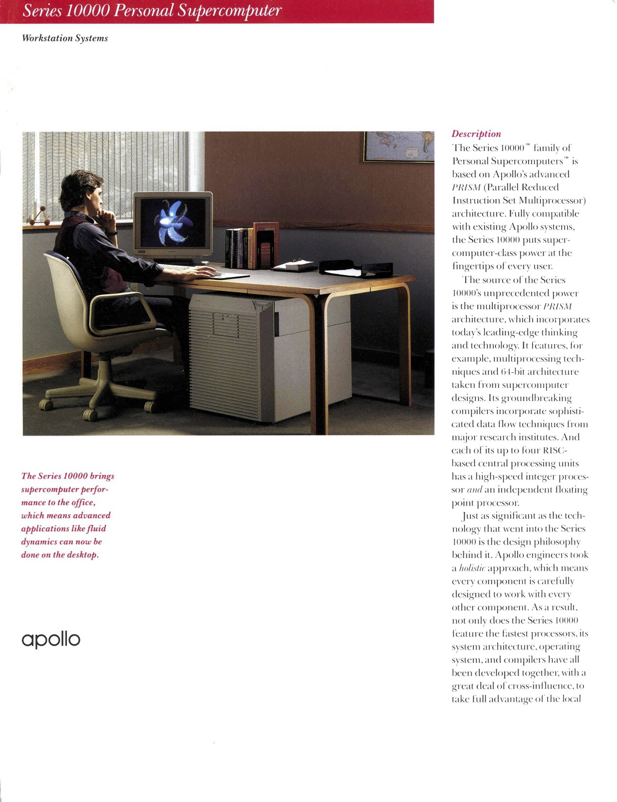
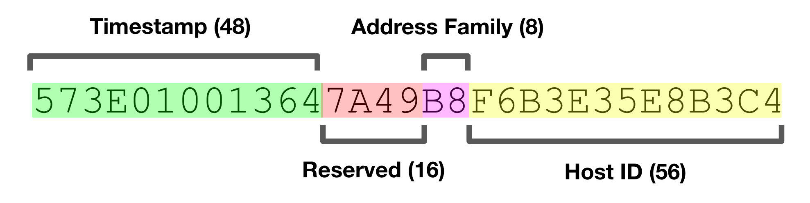
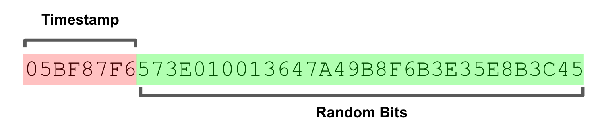
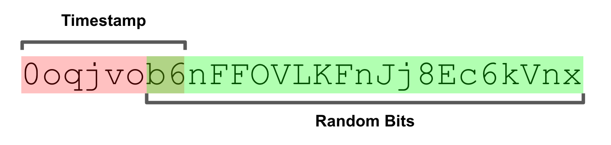

A Brief History of the UUID

[engineering](https://segment.com/blog/categories/engineering/)

# A Brief History of the UUID

[Rick Branson](https://segment.com/blog/authors/rick-branson/)
on June 7th 2017

*Today we’re releasing *[***ksuid***](https://github.com/segmentio/ksuid)*, a Golang library for unique ID generation. It borrows core ideas from the ubiquitous UUID standard, adding time-based ordering and more friendly representation formats. In doing the research that went into this library, we uncovered a compelling story that we wanted to share with a larger audience.*

Ever since two or more machines found themselves exchanging information on a network, they’ve needed a way to uniquely identify *things.*

The first networks that resemble our contemporary ideas began with the construction of the first telephone exchanges in 1870s. Before this crucial tipping point, telecom wires were entirely point-to-point links. While amazing at the time, they were expensive, inflexible, and unreliable. It even resulted in an almost comical explosion of copper lines zig-zagging above the roads of major cities.

While telegraphs were mainly used for important governmental and business communications, telephones were an extreme luxury. Compared to the speed of the telegraph, tying up an expensive copper line for a *quick chat* was incredibly frivolous. The key invention that brought telecommunications to the masses was the switchboard, enabling the creation of exchanges, and in turn vastly increased the utility of these lines. With it brought the first unique identifier in a network: the telephone number.

Fast forward many decades later to the advent of the networked computer. Suddenly the granularity of *things *had to become orders of magnitude finer.

Until this tipping point, data sent across telecom wires had been ephemeral — the networks were just a conduit. Now, it became routine to store and retrieve data on demand, and thus the titanic explosion of data that has inundated the world ever since. Given these new capabilities, the *things* on a network shifted from physical machines to logical pieces of data.

These networks needed a way to uniquely address these pieces of data. The old systems of central control during the telecom age just wouldn’t scale. This is a mathematical inevitability as a network’s capacity for storage and retrieval increases linearly with size. This scale also brings with it a bit of chaos — failures and machine ephemerality move from a yak shaving problem to the routine. Data no longer *lives* in one place, it flows freely across the network.

# A Networking Event for Computing

This brings us to the 1980s. At this point in time, using a computer to share data actually meant sharing a physical computer. Institutions exchanged information using minicomputers and powerful mainframes with hundreds or thousands of dumb terminals.

In other words, data was colocated with computation. While PCs had revolutionized computing, they lacked networking capabilities, and therefore were very fancy calculators.

Founded in 1980, Apollo Computer was one of the first companies to enter the nascent *workstation* market. Workstations were really the first *networked computers*. It sounds kind of ridiculous to use this term, but worth stating that at this time most of the networking technology we take for granted had yet to blossom. And in stark contrast to the mainframe world, data and compute was *distributed* across many interconnected computers. Thus the idea of *distributed computing* entered the mainstream.

Like its contemporary, Sun Microsystems, Apollo was *truly* full-stack*. *Everything had to be built from scratch as the hardware and software of that era was not designed for the use cases they imagined. The asynchrony of networks and the demanding nature of these tasks required vastly more capable computers. Multi-tasking, security controls, networking, and mass storage were all too expensive or impractical to include in PCs at the time. However, they were considered table stakes for the vision of the workstation.

Despite an impressive technological boom in the workstation market, all of these vendors ran into the same road block: few developers knew anything about networks. In order to make a business case for their pricey workstations, they needed a programming environment. Developers needed a way to easily build applications that could fully exploit the networking capabilities of their respective products.

Apollo’s answer was the their Network Computing System ([NCS](https://en.wikipedia.org/wiki/Network_Computing_System)). NCS borrowed ideas from object-oriented programming and was built around Remote Procedure Calls ([RPC](https://en.wikipedia.org/wiki/Remote_procedure_call)). While now mostly obsolete, this approach achieved the end result Apollo was hoping for: any developer knew how to call a function, and object-oriented was the programming paradigm *du jour*.

In an article published in Network World in 1989 about RPC, one MIS Director at Burlington Coat Factory made a particularly salient observation: “It takes a good programmer only a day or so to learn how to build distributed applications using RPCs.” *Cha-ching.* That year Apollo sold to Hewlett-Packard for a whopping $476 million USD, almost a billion dollars when adjusted for inflation.

*Things* (objects, interfaces, operations [methods], etc), or “*entities”* in NCS terminology, all needed unique identities to be addressed in a networked environment. In the standard [Von Neumann architecture](https://en.wikipedia.org/wiki/Von_Neumann_architecture) this is trivial: the memory or mass storage address easily serves this purpose. In a distributed computing model which allows many computers to operate independently, this becomes non-trivial. The scale of their use case meant that coordination across the network was off the table — it was just too slow and prone to failure.

NCS introduced the concept of the UID (Universal IDentifier), which served as the unique primary identity for entities. UIDs are 64-bit numbers that combine a monotonic clock with a unique host ID permanently embedded in the hardware of all of their workstations. Under this scheme, identifiers could be generated thousands of times per second at each host and remain globally unique for all time with no scaling bottleneck. The only point of coordination was at Apollo’s factories — where the machines were permanently branded with their respective identifiers.

# The First UUID

When Apollo began to approach standardizing the principles of NCS as the Network Computing Architecture (NCA), it became clear that the existing UID design was insufficient. Apollo wanted all the workstation vendors to standardize on NCA, and while they all embedded host IDs in their workstations, the bit size varied from vendor to vendor.

Apollo used 20-bits, good enough for around a million machines. While laughable at today’s scale, to run out, Apollo would have to sell more than *$10 billion* worth of hardware to a market that was an order of magnitude smaller.

NCA introduced UUIDs, which built on the UID design, but accommodated a broader range of vendors by extending the number space to 128-bits. Thus the UUID was born. This concept was so useful that even after NCA became a distant memory and RPC fell out of fashion, the UUID remained popular, eventually being standardized by [ISO](https://www.iso.org/standard/53416.html), [IETF](https://tools.ietf.org/html/rfc4122), and [ITU](http://www.itu.int/en/ITU-T/asn1/Pages/UUID/uuids.aspx).

Readers somewhat familiar with UUIDs will recognize that their contents were quite a bit different than the popular UUID Version 4 that is most used today. NCA UUIDs had a 48-bit timestamp, 16 reserved bits, an 8-bit indicator for network address family, and a 56-bit host ID. All told, pretty similar in concept to the Version 1 UUIDs defined in the current-day IETF standard.

All of this history sparked my curiosity about the implementations, and fortunately was able to dig up fragments of the original Apollo NCS source code online. If you’re like me, looking at source code that is many-decades old usually makes for a good time. The first peculiar thing I noticed about this code was the use of the dollar-sign (`$`) in identifiers like variable and function names.

	void uuid_$gen(uuid)
	uuid_$t *uuid;
	{
	#ifdef apollo

	    std_$call void uid_$gen();
	    struct uid_t uid;

	    uid_$gen(uid);
	    uuid_$from_uid((uid_$t *) &uid, uuid);

It turns out that NCS uses a language called “Domain C” introduced by Apollo as part of their “Domain/OS” operating system. Courtesy of [Bitsavers](http://bitsavers.org/), I was able to find a reference manual from 1988 in PDF format. Domain C extends ANSI C in several ways, most importantly here that it allows `$` to appear after the first character in any identifier.

In contemporary times, dollar-signs are used as syntax for variables in uncool programming languages, currency in economics, and to adorn the name of self-aggrandi$ing musicians. To understand their actual purpose in the now extinct world of Apollo Computer, it took digging through the trace amounts of code and documentation that still remains.

After poring through what could be found, a rather anti-climactic conclusion is reached. While not explicitly stated, it seems that this is just a coding convention. Whatever comes before `_$` identifies a particular module. The `_$t` indicates the “default type” such as the `uuid_$t` used above. It also appears it was useful as a way to easily pick out which identifiers were part of libraries that followed Apollo’s programming style. It was a bit disorienting that Apollo would make extensions to C just to suit a particular coding style.

*I digress.*

NCA UUIDs became the basis for the standardized Version 1 UUIDs. Reiterating from before: they included a high-precision timestamp and the hardware-based unique host identifier. It almost goes without saying that system clocks can’t be used to reliably generate unique sequence numbers as clock skew or even chance can cause repeated timestamps. Apollo addressed this by using a global file (literally `/tmp/last_uuid`) to coordinate across processes.

	/*
	 * C H E C K _ U U I D
	 *
	 * On a system wide basis, check to see if the passed UUID is the
	 * same or older than the previously generated one. If it is, make sure
	 * it becomes a little newer.  Write the UUID back to the "last UUID"
	 * storage in any case. In the case of systems using a file as
	 * the storage, fall back to "per process" checking in the event of
	 * the inability to safely access the storage.
	 */

The file was necessary globally-writable by any user. While not particularly secure, Apollo sold end-user workstations used on somewhat trusted networks, so it was at least a somewhat reasonable decision. This technique carried forward in the IETF specification for UUIDs:

	   The following algorithm is simple, correct, and inefficient:

	   o  Obtain a system-wide global lock

	   o  From a system-wide shared stable store (e.g., a file), read the
	      UUID generator state: the values of the timestamp, clock sequence,
	      and node ID used to generate the last UUID.

	   o  Get the current time as a 60-bit count of 100-nanosecond intervals
	      since 00:00:00.00, 15 October 1582.

	   o  Get the current node ID.

	   o  If the state was unavailable (e.g., non-existent or corrupted), or
	      the saved node ID is different than the current node ID, generate
	      a random clock sequence value.

	   o  If the state was available, but the saved timestamp is later than
	      the current timestamp, increment the clock sequence value.

	   o  Save the state (current timestamp, clock sequence, and node ID)
	      back to the stable store.

	   o  Release the global lock.

	   o  Format a UUID from the current timestamp, clock sequence, and node
	      ID values according to the steps in Section 4.2.2.

The source code for an implementation of DCE that I could find is somewhat surprisingly distributed by Apple. They appear to use it mostly to communicate with Microsoft systems like Active Directory and Windows-based File Servers. This implementation with bears the Open Software Foundation copyright, places the actual working stable store behind a preprocessor flag called `UUID_NONVOLATILE_CLOCK`.

	#ifdef UUID_NONVOLATILE_CLOCK
	        *clkseq = uuid__read_clock();           /* read nonvolatile clock */
	        if (*clkseq == 0)                       /* still not init'd ???   */
	        {
	            *clkseq = true_random();      /* yes, set random        */
	        }
	#else
	        /*
	         * with a volatile clock, we always init to a random number
	         */
	        *clkseq = true_random();
	#endif

I couldn’t find any code on the Internet that actually implements the non-volatile clock for DCE RPC’s UUID generation. However, [`libuuid`](https://linux.die.net/man/3/uuid_generate), included in the package repositories of most Linux distributions does include a non-volatile UUID clock implementation that can be inspected. Similar to NCS, it uses a file for monotonicity, but places it at a more sensible `/var/lib/libuuid/clock.txt`. It does attempt to manage the permissions in a slightly more sane way, but the same security caveats apply.

Both the NCS and the `libuuid` implementations spin to acquire a lock on the state file. This is fertile ground for some really nasty problems.

	                while (flock(state_fd, LOCK_EX) < 0) {
	                        if ((errno == EAGAIN) || (errno == EINTR))
	                                continue;

What `libuuid` does bring to the table is a daemon somewhat confusingly named `uuidd` which attempts to bring some safety to the table. `uuidd` can make a strong guarantee if one abides by its rules. Combined with the assumed uniqueness of Ethernet MAC addresses, this delivers a pretty strong guarantee within a given distributed system.

In practice, however, this is all quite a bit to ask. The file-based synchronization has a large number of problematic failure cases. The daemon-based solution is better, but it never really caught on. It is exceedingly rare to use a system that comes with it configured out-of-the-box.

It also turns out that MAC addresses are not actually globally unique as they can be user-modified. Their inclusion in UUIDs also poses a threat to privacy and security. Given their opaque nature, developers tend to not realize that UUIDs could come with machine-identifying information. The creator of the [Melissa virus](https://en.wikipedia.org/wiki/Melissa_(computer_virus)) that impacted Windows in the late 90s was identified using the MAC address from a UUID found in the virus’ code. As the untrustworthy Internet became the dominant networking platform, UUID generation which depended on trust became obsolete. All of these concerns have lead most to abandon leveraging hardware identifiers in UUIDs.

	/*
	 * This is the generic front-end to uuid_generate_random and
	 * uuid_generate_time.  It uses uuid_generate_random only if
	 * /dev/urandom is available, since otherwise we won't have
	 * high-quality randomness.
	 */
	void uuid_generate(uuid_t out)
	{
	        if (have_random_source())
	                uuid_generate_random(out);
	        else
	                uuid_generate_time(out);
	}

In fact, the default paths in `libuuid` avoid time-based UUIDs on any system which provides a pseudo-random number generating block device at [`/dev/(u?)random`](http://man7.org/linux/man-pages/man4/random.4.html), which has been available on popular UNIX variants since the 1990s. This has been a factor in the rise of UUID Version 4, which contains only random data: 122-bits of it. The simplicity of implementation has driven its ubiquity.

# When Worlds Collide

When I first came across these random Version 4 UUIDs, the threat of a collision was *concerning*. While UUIDs should not be used in such a way that collisions would create a security threat, as a developer I would like some level of confidence that my own systems aren’t going to trip over themselves. The bad news is that UUID generation still requires *some* small amount of trust.

The most important aspect of collision safety is the source of entropy. Consider two common cases: a modern version of Linux deployed into a trusted cloud computing environment, and an untrusted mobile device. In the Linux on cloud case, we’re provided with a cryptographically secure Pseudorandom Number Generator ([PRNG](https://en.wikipedia.org/wiki/Pseudorandom_number_generator)) in the form of `/dev/urandom`. This is the “cryptographer-approved” and non-blocking source of entropy. It blends several sources like the “noise” generated by hardware interrupts and I/O activity metadata with a cryptographic function.

However, on a mobile device, almost anything goes: mobile devices cannot be trusted. While most of these are just as good as what’s available in the scenario above, it’s routine that the PRNG source on these devices isn’t very random at all. Given that there’s no way to certify the quality of these, it’s a big gamble to bet on mobile PRNGs. ID generation on low-trust mobile devices is an interesting and active area of academic research[1].

Even in the environment with a trustworthy PRNG device, implementation bugs can lead to collisions. In one particular case, [an obscure bug](https://github.com/ramsey/uuid/issues/80) in how OpenSSL deals with process forking lead to a high collision rate for a pure PHP UUID library. This might sound a bit overboard, but it’s probably worth testing your UUID implementation for obvious collision-creating bugs. It’s more common than you might think. At the system level, [dieharder](http://www.phy.duke.edu/~rgb/General/dieharder.php) is one of many well-regarded tools for analyzing the quality of a system’s PRNG.

Given the proper environment, there’s a vanishingly low risk of collision, bordering on the infeasible. To be able to depend on this uniqueness, a large enough number space must be used to make it much more likely that other extremely uncommon events will occur far sooner than a collision.

With 122 random bits, it would take petabyte-sized pile of UUIDs (2^46) to even bring the chance of a collision into the realm of feasibility, around 1 in 50 billion. It would take billions of petabytes of UUIDs to make it likely.

The threat of an implementation bug or misconfiguration is vastly more important than the threat of random collision. Those concerned with UUID collision in a properly-configured system would find their time better spent pondering far more probable events like solar flares, thermonuclear war, and alien invasion on their systems. Just make sure your systems are *property-configured*.

# Time Is On Our Side

In some cases the timestamp component of UUID Version 1 is actually quite useful. The first time I ran into this was in Apache Cassandra, where they’re called “*TimeUUID*.” In Cassandra, TimeUUIDs are sortable by timestamp, quite useful when needing to roughly order by time. The implementation swaps some of the random bits with a timestamp and a host identifier. The host ID is derived from the node’s IP addresses, which also form the unique identifier in a Cassandra cluster.

The implementation has suffered from weaknesses when trying to compromise the uniqueness in the face of clock skew (see [CASSANDRA-11991](https://issues.apache.org/jira/browse/CASSANDRA-11991)). More importantly, host-identifiable information is embedded in the UUIDs, which, if we’ve learned anything in the past, is not a great idea. Even if these IDs are derived from local network addresses, security best practices discourage actively exposing this information to the outside world, even indirectly.

# Flakey Friends

The ability to sort IDs by time was largely the motivation behind Twitter’s [Snowflake](https://blog.twitter.com/engineering/en_us/a/2010/announcing-snowflake.html), which largely popularized the concept of *k-ordering* by timestamp[2].*  *Twitter needed a way to sort piles of arbitrary tweets by creation time without global coordination. Embedding a timestamp in the ID provides this functionality without the overhead of an additional timestamp field.

K-ordering is a more precise way of saying roughly sorted. In Snowflake, a large amount of the design was driven by the need to fit these IDs into a 64-bit number space. This includes requiring dedicated ID-generation servers that use a separate strong coordination mechanism (ZooKeeper) to assign host IDs and store sequence checkpoints.

Inspired by Snowflake, the team at Boundary released [Flake](https://github.com/boundary/flake) in early 2012. It also uses dedicated ID-generation server processes, but does not require a strong coordination mechanism. Flake is similar to UUID Version 1 in that it uses a much larger 128-bit number space and a 48-bit host identifier derived from the hardware address to protect against overlap in a distributed environment.

It primarily differs from UUID Version 1 in that it’s structured for *lexicographic ordering*. The bits of a Flake ID are arranged in such a way that users can expect that they will be ordered by their timestamp regardless of where they’re written. In contrast, Cassandra must implement specific collation logic to get the same behavior from their TimeUUID.

Unfortunately it appears that Flake ID can expose host identification information to end users as this information is embedded in the generated IDs. While the implementation provided defends against clock skew situations, their uniqueness property does depend heavily on the forward movement of the wall clock.

One noteworthy feature included in Flake is base62 encoding, which provides a much more “portable” representation than UUID. The string representation of UUIDs is one of it’s weaker features. This may seem trivial, but the inclusion of the dash (-) character makes them less usable. An example of this is when UUIDs are indexed by a search engine, where the dashes will likely be interpreted as token delimiters. The base62 encoding avoids this pitfall and retains the lexicographic ordering properties of the binary encoding.

# The Best of Both Worlds

When implementing an internal system at Segment, the team began using UUID Version 4 for generating unique identifiers. It was simple and required no additional dependencies.

After a few weeks, a requirement to order these identifiers by time emerged. This requirement wasn’t strict: the initial purpose was to enable log archiving to Amazon S3 where they are keyed by ranges of message identifiers. The existing UUIDs would have resulted in random dispersion of messages with no natural grouping property. However, if we could take advantage of the [arrow of time](https://en.wikipedia.org/wiki/Arrow_of_time#The_causal_arrow_of_time), it would result in a natural grouping and a feasible number of objects in S3.

Thus KSUID was born. KSUID is an abbreviation for **K**-**S**ortable **U**nique **ID**entifier. It combines the simplicity and security of UUID Version 4 with the lexicographic k-ordering properties of Flake. KSUID makes some trade-offs to achieve these goals, but we believe these to be reasonable for both our use cases and many others out there.

KSUIDs are larger than UUIDs and Flake IDs, weighing in at 160 bits. They consist of a 32-bit timestamp and a 128-bit randomly generated payload. The uniqueness property does not depend on any host-identifiable information or the wall clock. Instead it depends on the improbability of random collisions in such a large number space, just like UUID Version 4. To reduce implementation complexity, the 122-bits of UUID Version 4 are rounded up to 128-bits, making it 64-times more collision resistant as a bonus, even when the additional 32-bit timestamp is not taken into account.

The timestamp provides 1-second resolution, which we found to be acceptable for a broad range of use cases. If a higher resolution timestamp is desired, payload bits can be traded for more timestamp bits. While high-resolution timestamp support is not included in our implementation, it is backwards compatible. Any implementation which uses 32-bit timestamps can safely work with KSUIDs that use higher resolution timestamps.

A “custom” epoch is used that ensures >100 years of useful life. The epoch offset (14e8) was also chosen to be easily remembered and quickly singled out out by human eyes.

KSUID provides two fixed-length encodings: a 20-byte binary encoding and a 27-character base62 encoding. The lexicographic ordering property is provided by encoding the timestamp using [big endian byte ordering](https://en.wikipedia.org/wiki/Endianness). The base62 encoding is tailored to map to the lexicographic ordering of characters in terms of their [ASCII](https://en.wikipedia.org/wiki/ASCII) order.

Fixed-length encodings result in simpler and safer implementations. As a small bonus they are sometimes more efficient, such as in SQL databases, where variable-length data types result in additional storage overhead. Regardless of the chosen format, KSUIDs can be lexicographically ordered by time. The string representation is entirely alphanumeric, thus avoids the problem of tokenized dashes in UUIDs.

# Our Implementation

Today we’re [open sourcing our KSUID implementation](https://github.com/segmentio/ksuid), which is written in Go. It implements popular idiomatic interfaces, making it easy to integrate into an existing codebase and use with other Go libraries. It comes packaged with a command-line tool for generating and inspecting KSUIDs.

	$ ksuid
	0o5Fri5Ia34BTFurJmkOf9T6S1e
	$ ksuid 0o5Fs0EELR0fUjHjbCnEtdUwQe3

	REPRESENTATION:

	  String: 0o5Fs0EELR0fUjHjbCnEtdUwQe3
	     Raw: 05A95E21D7B6FE8CD7CFF211704D8E7B9421210B

	COMPONENTS:

	       Time: 2017-05-16 18:49:21 -0700 PDT
	  Timestamp: 94985761
	    Payload: D7B6FE8CD7CFF211704D8E7B9421210B

# Acknowledgements

This post would not have been possible without the efforts of [Bitsavers](http://bitsavers.org/), which gathered and archived the source material related to Apollo Computing. Thanks to Albert Strasheim, Calvin French-Owen, Evan Johnson, Peter Reinhardt, and Tido Carriero for their insightful comments and feedback.

# References

[1] P. Jesus, C. Baquero, and P. Almeida: ID Generation in Mobile Environments (2006)

[2] T. Altman, Y. Igarashi: Roughly sorting: sequential and parallel approach (1989)

[Back to Segment Blog](https://segment.com/blog/)[Subscribe for new posts](https://eepurl.com/E9mw9)