A Brief Rant on the Future of Interaction Design

So, here's a Vision Of The Future that's popular right now.

[FUTURE VISION](https://www.youtube.com/watch?v=nOU_t4bqEJg)

It's a lot of this sort of thing.
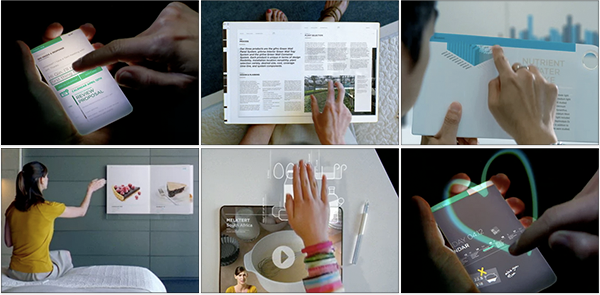

As it happens, designing Future Interfaces For The Future used to be my [line of work](http://worrydream.com/Apple). I had the opportunity to design with real working prototypes, not green screens and After Effects, so there certainly are some interactions in the video which I'm a little skeptical of, given that I've actually tried them and the animators presumably haven't. But that's not my problem with the video.

My problem is the opposite, really — this vision, from an interaction perspective, is *not visionary*. It's a timid increment from the status quo, and the status quo, from an interaction perspective, is *terrible*.

This matters, because *visions matter*. Visions give people a direction and inspire people to act, and *a group of inspired people is the most powerful force in the world*. If you're a young person setting off to realize a vision, or an old person setting off to fund one, I really want it to be something worthwhile. Something that genuinely improves how we interact.

This little rant isn't going to lay out any grand vision or anything. I just hope to suggest some places to look.

Before we think about how we should interact with our Tools Of The Future, let's consider what a tool is in the first place.

I like this definition:   A tool addresses **human needs** by amplifying **human capabilities**.

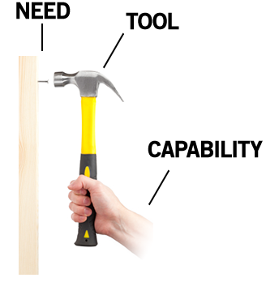

That is, a tool converts what we *can do* into what we *want to do*. A great tool is designed to fit both sides.

In this rant, I'm not going to talk about human **needs**. Everyone talks about that; it's the single most popular conversation topic in history.

And I'm not going to talk about **technology**. That's the easy part, in a sense, because we control it. Technology can be invented; human nature is something we're stuck with.

I'm going to talk about that neglected third factor, human **capabilities**. What people *can do*. Because if a tool isn't designed to be *used by a person*, it can't be a very good tool, right?

Take another look at what our Future People are using to interact with their Future Technology:

Do you see what everyone is interacting with? The central component of this Interactive Future? It's there in every photo!

That's right! —

And that's great! I think hands are *fantastic!*

Hands do two things. They are two utterly amazing things, and you rely on them every moment of the day, and most Future Interaction Concepts *completely ignore both of them*.

Hands **feel** things, and hands **manipulate** things.

Go ahead and pick up a book. Open it up to some page.
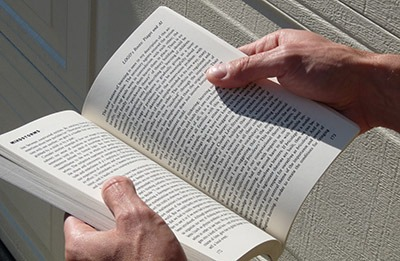

Notice how you *know* where you are in the book by the distribution of weight in each hand, and the thickness of the page stacks between your fingers. Turn a page, and notice how you would *know* if you grabbed two pages together, by how they would slip apart when you rub them against each other.

Go ahead and pick up a glass of water. Take a sip.

Notice how you *know* how much water is left, by how the weight shifts in response to you tipping it.

Almost *every object in the world* offers this sort of feedback. It's so taken for granted that we're usually not even aware of it. Take a moment to pick up the objects around you. Use them as you normally would, and sense their tactile response — their texture, pliability, temperature; their distribution of weight; their edges, curves, and ridges; how they *respond* in your hand as you use them.

There's a reason that our fingertips have some of the densest areas of nerve endings on the body. This is how we experience the world close-up. This is how our tools talk to us. The sense of touch is essential to everything that humans have called "work" for millions of years.

Now, take out your favorite Magical And Revolutionary Technology Device. Use it for a bit.

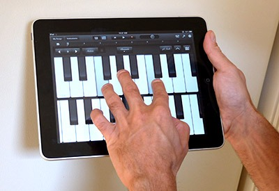

What did you feel? Did it feel *glassy*? Did it have *no connection whatsoever* with the task you were performing?

I call this technology **Pictures Under Glass**. Pictures Under Glass sacrifice all the tactile richness of working with our hands, offering instead a hokey visual facade.

Is that so bad, to dump the tactile for the visual? Try this: close your eyes and tie your shoelaces. No problem at all, right? Now, how well do you think you could tie your shoes if your arm was asleep? Or even if your fingers were numb? When working with our hands, touch does the driving, and vision helps out from the back seat.

Pictures Under Glass is an interaction paradigm of permanent numbness. It's a Novocaine drip to the wrist. It denies our hands what they do best. And yet, it's the star player in every Vision Of The Future.

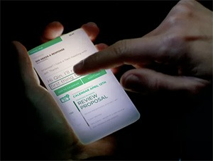

To me, claiming that Pictures Under Glass is the future of interaction is like claiming that black-and-white is the future of photography. It's *obviously* a transitional technology. And the sooner we transition, the better.

What can you do with a Picture Under Glass? You can slide it.
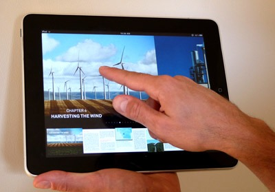

That's the fundamental gesture in this technology. Sliding a finger along a flat surface.

There is *almost nothing in the natural world* that we manipulate in this way.
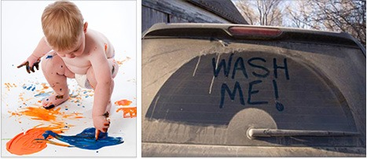
That's pretty much all I can think of.

Okay then, how *do* we manipulate things? As it turns out, our fingers have an incredibly rich and expressive repertoire, and we improvise from it constantly without the slightest thought. In each of these pictures, pay attention to the positions of all the fingers, what's applying pressure against what, and how the weight of the object is balanced:

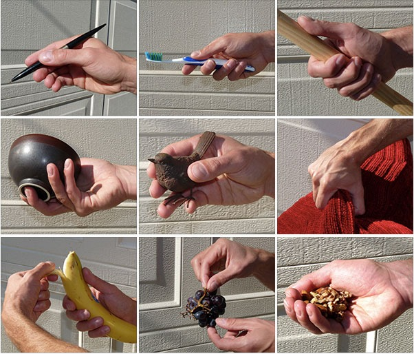

Many of these are variations on the four fundamental grips. (And if you like this sort of thing, you should read John Napier's [wonderful book](http://www.amazon.com/dp/0691025479).)

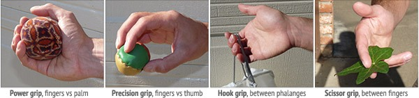

Suppose I give you a jar to open. You actually will switch between two different grips:

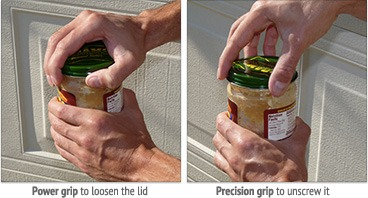

You've made this switch with every jar you've ever opened. Not only without being taught, but probably without ever realizing you were doing it. How's that for an intuitive interface?

We live in a three-dimensional world. Our hands are designed for moving and rotating objects in three dimensions, for picking up objects and placing them over, under, beside, and inside each other. No creature on earth has a dexterity that compares to ours.

The next time you make a sandwich, pay attention to your hands. Seriously! Notice the myriad little tricks your fingers have for manipulating the ingredients and the utensils and all the other objects involved in this enterprise. Then compare your experience to sliding around Pictures Under Glass.

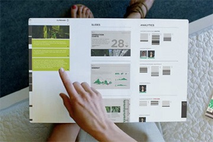

Are we really going to accept an Interface Of The Future that is less expressive than a *sandwich?*

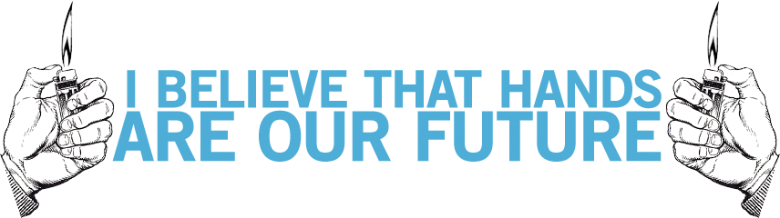
So then. What is the Future Of Interaction?

The most important thing to realize about the future is that it's a *choice*. People choose which visions to pursue, people choose which research gets funded, people choose how they will spend their careers.

Despite how it appears to the culture at large, technology doesn't just *happen*. It doesn't emerge spontaneously, pulling us helplessly toward some inevitable destiny. Revolutionary technology comes out of long research, and research is performed and funded by inspired people.

And this is my plea — be inspired by the untapped potential of human capabilities. Don't just extrapolate yesterday's technology and then cram people into it.

This photo could very well be our future. But *why?* Why choose *that?* It's a handheld device that ignores our hands.

Our hands feel things, and our hands manipulate things. Why aim for anything less than a **dynamic medium that we can see, feel, and manipulate?**

There is a smattering of [active](http://en.wikipedia.org/wiki/Haptic_technology)  [research](http://en.wikipedia.org/wiki/Tangible_User_Interface)  [in](http://ambient.media.mit.edu/transitive/chi2009papers/bau09.pdf)  [related](http://www.alab.t.u-tokyo.ac.jp/~siggraph/09/TouchableHolography/SIGGRAPH09-TH.html)  [areas](http://www.chrisharrison.net/index.php/Research/PneumaticDisplays). It's been smattering along for decades. This research has always been fairly marginalized, and still is. But maybe you can help.

And yes, the fruits of this research are still crude, rudimentary, and sometimes kind of dubious. But *look* —

In 1968 — three years before the *invention of the microprocessor* — Alan Kay stumbled across Don Bitzer's early flat-panel display. Its resolution was *16 pixels by 16 pixels* — an impressive improvement over their earlier 4 pixel by 4 pixel display.

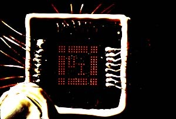

Alan saw those 256 glowing orange squares, and he went home, and he picked up a pen, and he *drew a picture of a goddamn iPad.*

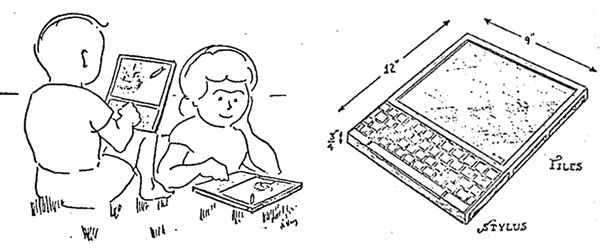

And then he chased that carrot through decades of groundbreaking research, much of which is responsible for the hardware and software that you're currently reading this with.

That's the kind of ambitious, long-range vision I'm talking about. Pictures Under Glass is old news. Let's start using our hands.

If you're with me so far, maybe I can nudge you one step further. Look down at your hands. Are they attached to anything? Yes — you've got arms! And shoulders, and a torso, and legs, and feet! And they all move!

Any dancer or doctor knows full well what an incredibly expressive device your body is. 300 joints! 600 muscles! Hundreds of degrees of freedom!

The next time you make breakfast, pay attention to the exquisitely intricate choreography of opening cupboards and pouring the milk — notice how your limbs move in space, how effortlessly you use your weight and balance. The only reason your mind doesn't explode every morning from the sheer awesomeness of your balletic achievement is that *everyone else in the world can do this as well.*

With an entire body at your command, do you seriously think the Future Of Interaction should be a *single finger?*

[Responses and follow-up.](http://worrydream.com/ABriefRantOnTheFutureOfInteractionDesign/responses.html)