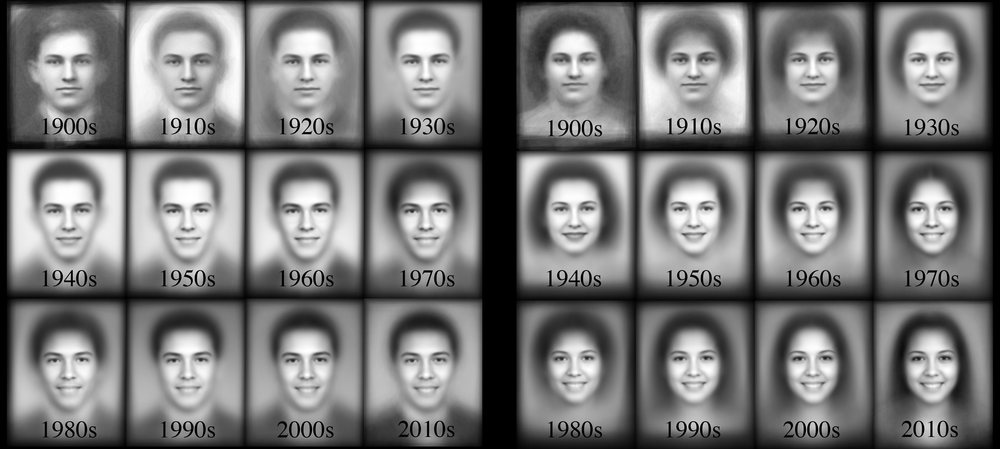
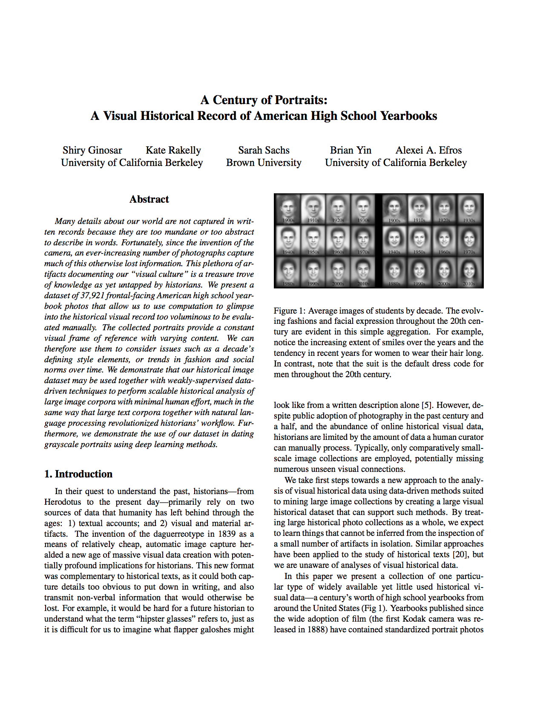
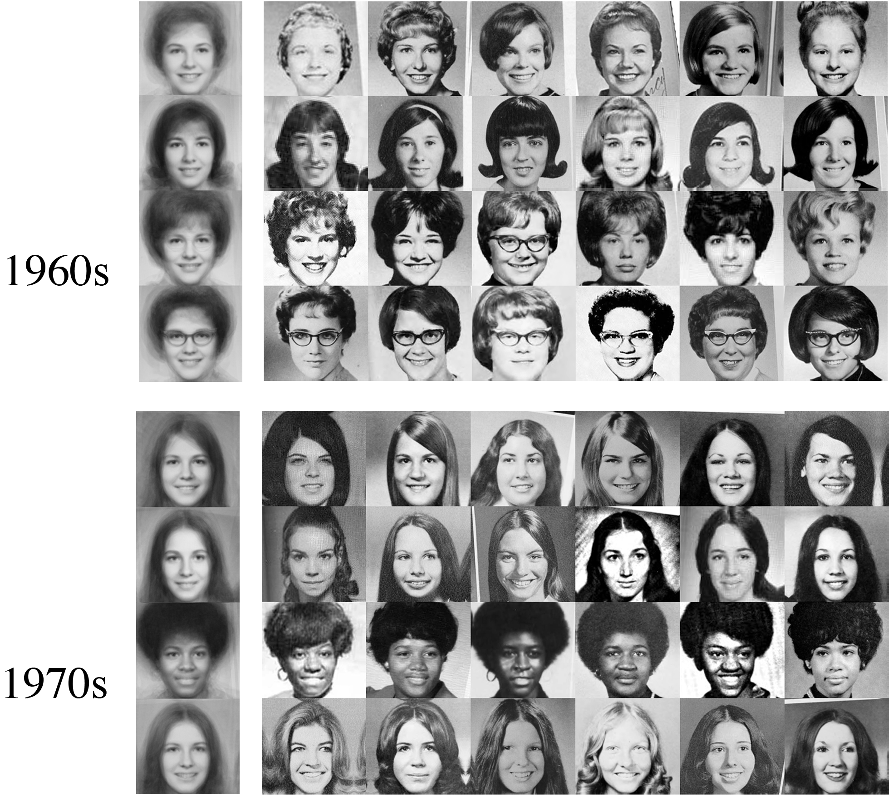

A Century of Portraits

# A Century of Portraits:

A Visual Historical Record of American High School Yearbooks

 
Average images of high school students for each decade of the 20th century.

## Abstract

Many details about our world are not captured in written records because they are too mundane or too abstract to describe in words. Fortunately, since the invention of the camera, an ever-increasing number of photographs capture much of this otherwise lost information. This plethora of artifacts documenting our “visual culture” is a treasure trove of knowledge as yet untapped by historians. We present a dataset of 37,921 frontal-facing American high school yearbook photos that allow us to use computation to glimpse into the historical visual record too voluminous to be evaluated manually. The collected portraits provide a constant visual frame of reference with varying content. We can therefore use them to consider issues such as a decade’s defining style elements, or trends in fashion and social norms over time. We demonstrate that our historical image dataset may be used together with weakly-supervised data-driven techniques to perform scalable historical analysis of large image corpora with minimal human effort, much in the same way that large text corpora together with natural lan- guage processing revolutionized historians’ workflow. Furthermore, we demonstrate the use of our dataset in dating grayscale portraits using deep learning methods.

## People

- [Shiry Ginosar](http://www.eecs.berkeley.edu/~shiry/)
- [Kate Rakelly](http://people.eecs.berkeley.edu/~rakelly/)
- [Sarah Sachs](http://www.sarahmsachs.com/) (Brown University)
- [Brian Yin](http://www.linkedin.com/pub/brian-yin/86/143/b83)
- [Alexei A. Efros](http://www.eecs.berkeley.edu/~efros/)

## Paper

- 

#### A Century of Portraits: A Visual Historical Record of American High School Yearbooks

 **Shiry Ginosar**, Kate Rakelly, Sarah Sachs, Brian Yin, Alexei A. Efros *A Century of Portraits: A Visual Historical Record of American High School Yearbooks*, **To Appear in** Extreme Imaging Workshop, International Conference on Computer Vision, ICCV 2015. **and** IEEE Transactions on Computational Imaging, September 2017. [PDF](http://people.eecs.berkeley.edu/~shiry/publications/IEEE_yearbooks.pdf), [BibTeX](http://people.eecs.berkeley.edu/~shiry/projects/yearbooks/yearbooks.html#yearbooks)

## Sample Results

### The Top Trends of Each Decade

 

Discriminative clusters of high school girls’ styles from the 1960's and 1970's. The left-most entry in each row displays the cluster average. Note that the clusters correspond to the quintessential hair and accessory styles of each decade: The bob, “winged” flip, bubble cut and signature glasses of the 60's. The long hair, Afros and bouffants of the 70's. These fashions emerge from the data in a weakly-supervised, data-driven process.

### The Evolution of Smiles in Photographs

Video courtesy of [Slate.com](http://www.slate.com/)

 

Smiles increasing over time, but women always smile more than men: Male and female Average lip curvature by year with one STD error bars.

## Dataset

- 

#### The Yearbook Dataset

The [Yearbook Dataset](https://www.dropbox.com/s/ubjjoo0b2wz4vgz/faces_aligned_small_mirrored_co_aligned_cropped_cleaned.tar.gz?dl=0) of frontal-facing American high-school seniors from 1905 to 2013 is hosted on space donated by [Dropbox](https://www.dropbox.com/). All faces are aligned using an affine transformation in a process described in the paper.

The training and test lists for female faces used in the paper are also provided.

If you would like to obtain other formats of the data (raw images, non-frontal facing portraits etc) or, alternatively, if you would like to **contribute** more yearbook data send us an email to: <shiry at eecs dot berkeley dot edu>.

## Trained Dating Models

 [Caffe](http://caffe.berkeleyvision.org/) trained dating models on [Model Zoo](https://github.com/BVLC/caffe/wiki/Model-Zoo#yearbook-photo-dating).

## Popular Press

### Radio and Television

 

 

 

### Printed News and Blogs

 

 

 

 

 

 

 

 

 

 

 

 

 

 

## Funding

This material is based upon work supported by the NSF Graduate Research Fellowship DGE 1106400, ONR MURI N000141010934 and an NVidia hardware grant.

## See Also

Developed concurrently and independent from our work, Prof. [Nathan Jacobs](http://cs.uky.edu/~jacobs/)' group at the University of Kentucky also proposed using yearbook data for [dating images](http://cs.uky.edu/~jacobs/papers/salem2016f2y.pdf).

 [Patrick Feaster](http://www.phonozoic.net/) from Indiana University Bloomington published a fascinating blog post in 2014 [using face averaging in yearbook photographs to track the rise of the photo smile](https://griffonagedotcom.wordpress.com/2014/12/18/say-cheese-using-face-averaging-to-track-the-rise-of-the-photo-smile/). He also provides several hypotheses on why smiles came to be the norm in portraiture.

 [Jason Salavon](https://en.wikipedia.org/wiki/Jason_Salavon), an American contemporary artist and an Associate Professor at The University of Chicago, created a piece in 1998 from average images of personally-significant yearbook photographs. In his work titled [The Class of 1988 & The Class of 1967](http://www.salavon.com/work/Class/), he presents averages of all the male and female students of his graduating class of 1988 and contrasts them with averages of the students in his mother's graduating class of 1967 from the same hometown of Fort Worth, Texas.