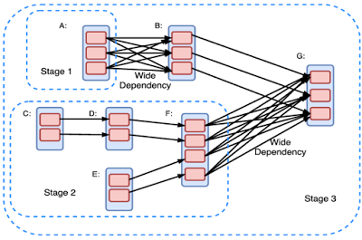
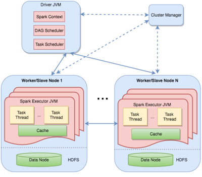
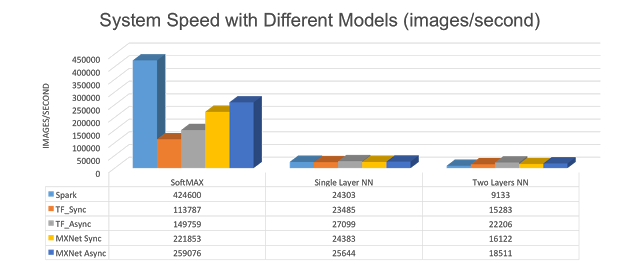
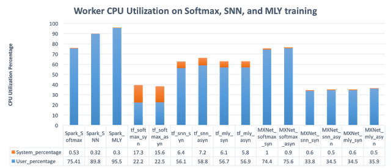

A Comparison of Distributed Machine Learning Platforms

### A Comparison of Distributed Machine Learning Platforms

[This paper](https://www.cse.buffalo.edu/~demirbas/publications/DistMLplat.pdf) surveys the design approaches used in distributed machine learning (ML) platforms and proposes future research directions. This is joint work with my students Kuo Zhang and Salem Alqahtani. We wrote this paper in Fall 2016, and I will be going to ICCCN'17 (Vancouver) to present this paper.

[ML, and in particular Deep Learning (DL)](https://muratbuffalo.blogspot.com/2016/12/learning-machine-learning-beginners.html), has achieved transformative success in speech recognition, image recognition, and natural language processing, and recommendation/search engines recently. These technologies have very promising applications in self-driving cars, digital health systems, CRM, advertising, internet of things, etc. Of course, the money leads/drives the technological progress at an accelerated rate, and we have seen many ML platforms built recently.

Due to the huge dataset and model sizes involved in training, the ML platforms are often distributed ML platforms and employ 10s and 100s of workers in parallel to train the models. It is estimated that an overwhelming majority of the tasks in datacenters will be machine learning tasks in the near future.

My background is in distributed systems, so we decided to study these ML platforms from a distributed systems perspective and analyze the communication and control bottlenecks for these platforms. We also looked at fault-tolerance and ease-of-programming in these platforms.

We categorize the distributed ML platforms under 3 basic design approaches:
1. basic dataflow, 2. parameter-server model, and 3. advanced dataflow.

We talk about each approach in brief, using Apache Spark as an example of the basic dataflow approach, PMLS (Petuum) as an example of the parameter-server model, and TensorFlow and MXNet as examples of the advanced dataflow model. We provide a couple evaluation results comparing their performance. See the paper for more evaluation results. Unfortunately, we were unable to evaluate at scale as a small team from academia.

At the end of this post, I present concluding remarks and recommendation for future work for distributed ML platforms. Skip to the end, if you already have some experience with these distributed ML platforms.

## Spark

In Spark, a computation is modeled as a directed acyclic graph (DAG), where each vertex denotes a Resilient Distributed Dataset(RDD) and each edge denotes an operation on RDD. RDDs are collection of objects divided in logical partitions that are stored and processed as in-memory, with shuffle/overflow to disk.

On a DAG, an edge E from vertex A to vertex B implies that RDD B is a result of performing operation E on RDD A. There are two kinds of operations: transformations and actions. A transformation (e.g., map, filter, join) performs an operation on a RDD and produces a new RDD.

The Spark user models the computation as a DAG which transforms & runs actions on RDDs. The DAG is compiled into stages. Each stage is executed as a series of tasks that run in parallel (one task for each partition). Narrow dependencies are good for efficient execution, whereas wide dependencies introduce bottlenecks since they disrupt pipelining and require communication intensive shuffle operations.

Distributed execution in Spark is performed by partitioning this DAG stages on machines. The figure shows the master-worker architecture clearly. The driver

contains two scheduler components, the DAG scheduler and the task scheduler, and tasks and coordinates the workers.

Spark was designed for general data processing, and not specifically for machine learning. However, using the MLlib for Spark, it is possible to do ML on Spark. In the basic setup, Spark stores the model parameters in the driver node, and the workers communicate with the driver to update the parameters after each iteration. For large scale deployments, the model parameters may not fit into the driver and would be maintained as an RDD. This introduces a lot of overhead because a new RDD will need to be created in each iteration to hold the updated model parameters. Updating the model involves shuffling data across machines/disks, this limits the scalability of Spark. This is where the basic dataflow model (the DAG) in Spark falls short. Spark does not support iterations needed in ML well.

## PMLS

PMLS was designed specifically for ML with a clean slate. It introduced the parameter-server (PS) abstraction for serving the iteration-intensive ML training process.

The PS (shown in the green boxes in the figure) is maintained as distributed in-memory key-value store. It is replicated & sharded: Each node serves as primary for a shard of the model (parameter space), and secondary/replica for other shards. Thus the PS scales well with respect to the number of nodes.

The PS nodes store & update model parameters, and respond to the requests from workers. The workers request up-to-date model parameters from their local PS copy and carry out computation over the partition of dataset assigned to them.

PMLS also adopts the Stale Synchronous Parallelism (SSP) model, which relaxes the Bulk Synchronous Parellelism (BSP) model where workers synchronize at the end of each iteration. SSP cuts some slack to the workers for synchronization, ensures the fastest worker cannot be *s* iteration ahead of the slowest worker. The relaxed consistency model is still OK for ML training due to noise tolerance of the process. [I had covered this in an April 2016 blog post.](https://muratbuffalo.blogspot.com/2016/04/petuum-new-platform-for-distributed.html)

## TensorFlow

Google had a parameter-server model based distributed ML platform, called DistBelief. [(Here is my review of the DistBelief paper.)](https://muratbuffalo.blogspot.com/2017/01/google-distbelief-paper-large-scale.html) From what I can tell, the major complaint about DistBelief was that it required messing with low-level code for writing ML applications. Google wanted any of its employees to be able to write ML code without requiring them to be well-versed in distributed execution ---this is the same reason why Google wrote the MapReduce framework for big data processing.

So TensorFlow is designed to enable that goal. TensorFlow adopts the dataflow paradigm, but the advanced version where the computation graph does not need to be a DAG but can include cycles and support mutable state. I think[Naiad design](http://muratbuffalo.blogspot.com/2014/03/naiad-timely-dataflow-system.html) might have some influence on TensorFlow design.

TensorFlow denotes computation with a directed graph of nodes and edges. The nodes represent computations, with mutable state. And the edges represent multidimensional data arrays (tensors) communicated between nodes. TensorFlow requires the user to statically declare this symbolic computation graph, and uses rewrite & partitioning of the graph to machines for distributed execution. (MXNet, and particularly DyNet, uses dynamic declaration of the graph, which improves on ease & flexibility of programming.)

The distributed ML training in TensorFlow  uses parameter-server approach as the figure shows. When you use the PS abstraction in TensorFlow, you use a parameter-server and data parallelism. TensorFlow says you can do more complicated stuff, but that requires writing custom code and marching into uncharted territory.

## Some evaluation results

For our evaluations we used Amazon EC2 m4.xlarge instances. Each contains 4 vCPU powered by Intel Xeon E5-2676 v3 processor and 16GiB RAM. EBS Bandwidth is 750Mbps. We used two common machine learning tasks for evaluation: 2-class logistic regression and image classification using multi-layered neural networks. I am only providing couple graphs here, check our paper for more experiments. Our experiments had several limitations: we used small number of machines, and couldn't test to scale. We also limited to CPU computing, and didn't test with GPUs.

This figure shows the speed of platforms for logistic regression. Spark performs good here behind PMLS and MXNet.

This figure shows the speed of platforms for DNNs. Spark sees greater performance loss going to two layers NN compared to single layer logistic regression. This is due to more iterative computation needed. We kept the parameters at the driver in Spark because they could fit, things would have been much worse if we kept the parameters in an RDD and updated after every iteration.

This figure shows the CPU utilization of the platforms. Spark application seems to have significantly high CPU utilization, which comes mainly as serialization overhead. [This problem has been pointed out before by earlier work. ](https://muratbuffalo.blogspot.com/2017/05/paper-summary-making-sense-of.html)

## Concluding remarks and future directions

ML/DL applications are embarrassingly parallel, and not very interesting from concurrent algorithms perspective. It is safe to say the parameter-server approach won for training in distributed ML platforms.

As far as bottlenecks is concerned, network still remains as a bottleneck for distributed ML applications. Instead of work on more advanced general purpose dataflow platforms, it is more useful to provide better data/model staging; treat data/model as first class citizen.

However, there can be some surprises and subtleties.[In Spark, the CPU overhead was becoming the bottleneck before the network limitations.](http://muratbuffalo.blogspot.com/2017/05/paper-summary-making-sense-of.html)The programming language used in Spark, i.e., Scala/JVMs, affected its performance significantly. Therefore there is especially a need for better tools for monitoring and/or performance-prediction of distributed ML platforms. Some tools addressing the problem for Spark data processing applications have been proposed recently, such as [Ernest](https://spark-summit.org/east-2017/events/ernest-efficient-performance-prediction-for-advanced-analytics-on-apache-spark/) and [CherryPick](https://blog.acolyer.org/2017/05/04/cherrypick-adaptively-unearthing-the-best-cloud-configurations-for-big-data-analytics/).

There are many open questions for distributed *systems* support for ML runtime, such as resource scheduling and runtime performance improvement. With runtime monitoring/profiling of the application, the next generation distributed ML platforms should provide informed runtime elastic provisioning/scheduling of the computation, memory, network resources for the tasks running atop.

Finally there are open questions for programming & software engineering support. What are suitable [distributed] programming abstractions for ML applications? Also more research needed for verification and validation (testing DNNs with particularly problematic input) of distributed ML applications.

Posted by[Murat](https://www.blogger.com/profile/07842046940394980130)at[12:03 AM](http://muratbuffalo.blogspot.co.uk/2017/07/a-comparison-of-distributed-machine.html)

[Email This](https://www.blogger.com/share-post.g?blogID=8436330762136344379&postID=6137641548526473710&target=email)[BlogThis!](https://www.blogger.com/share-post.g?blogID=8436330762136344379&postID=6137641548526473710&target=blog)[Share to Twitter](https://www.blogger.com/share-post.g?blogID=8436330762136344379&postID=6137641548526473710&target=twitter)[Share to Facebook](https://www.blogger.com/share-post.g?blogID=8436330762136344379&postID=6137641548526473710&target=facebook)[Share to Pinterest](https://www.blogger.com/share-post.g?blogID=8436330762136344379&postID=6137641548526473710&target=pinterest)

[(L)](https://plus.google.com/share?app=110&url=http%3A%2F%2Fmuratbuffalo.blogspot.com%2F2017%2F07%2Fa-comparison-of-distributed-machine.html)