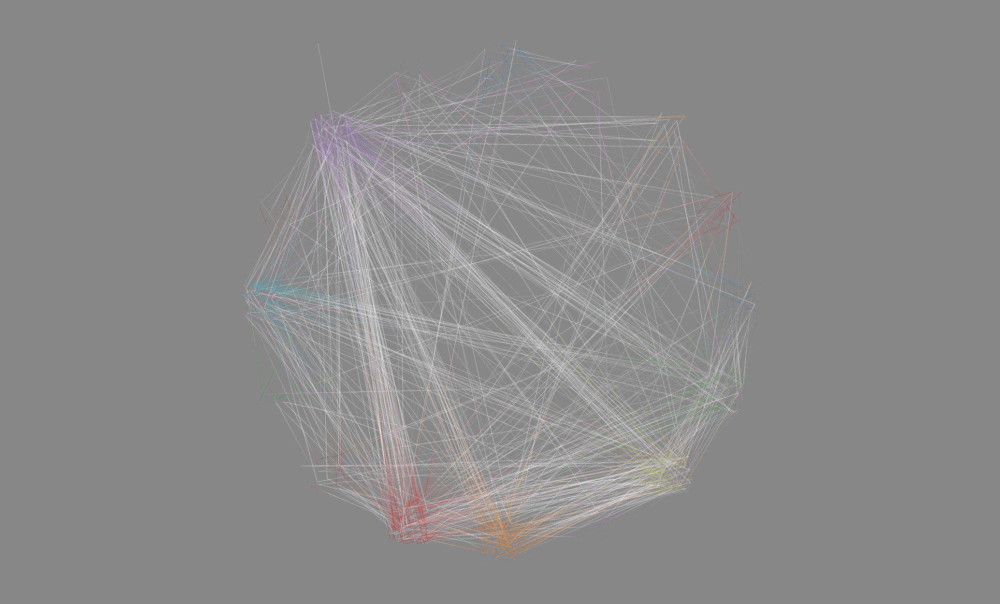
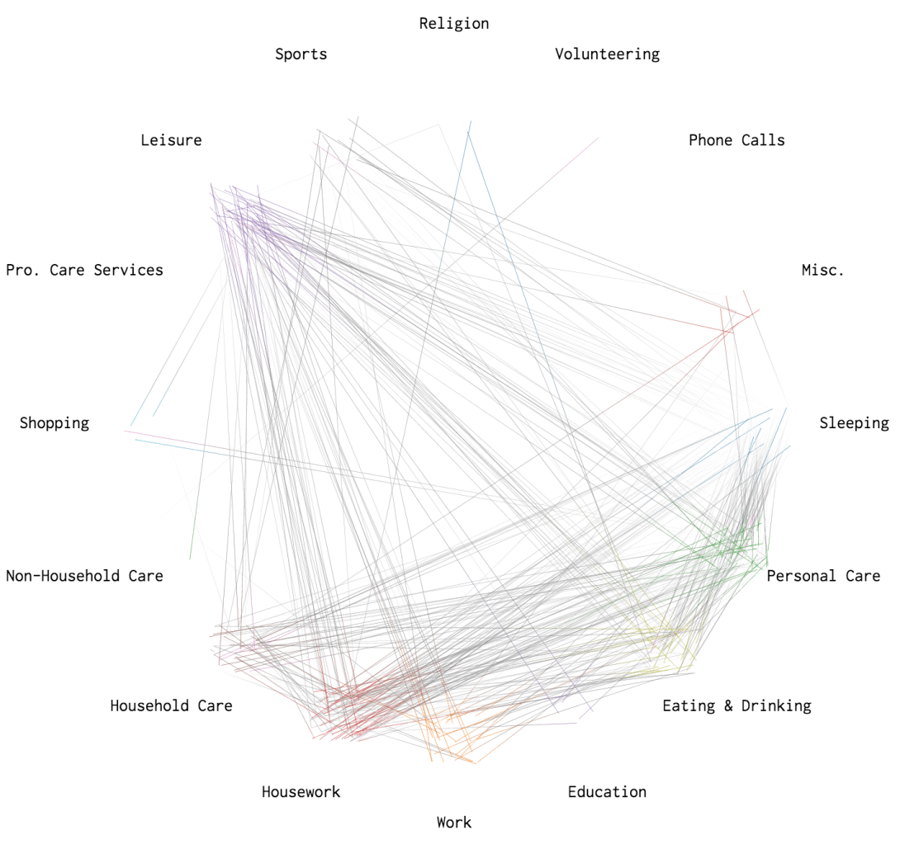
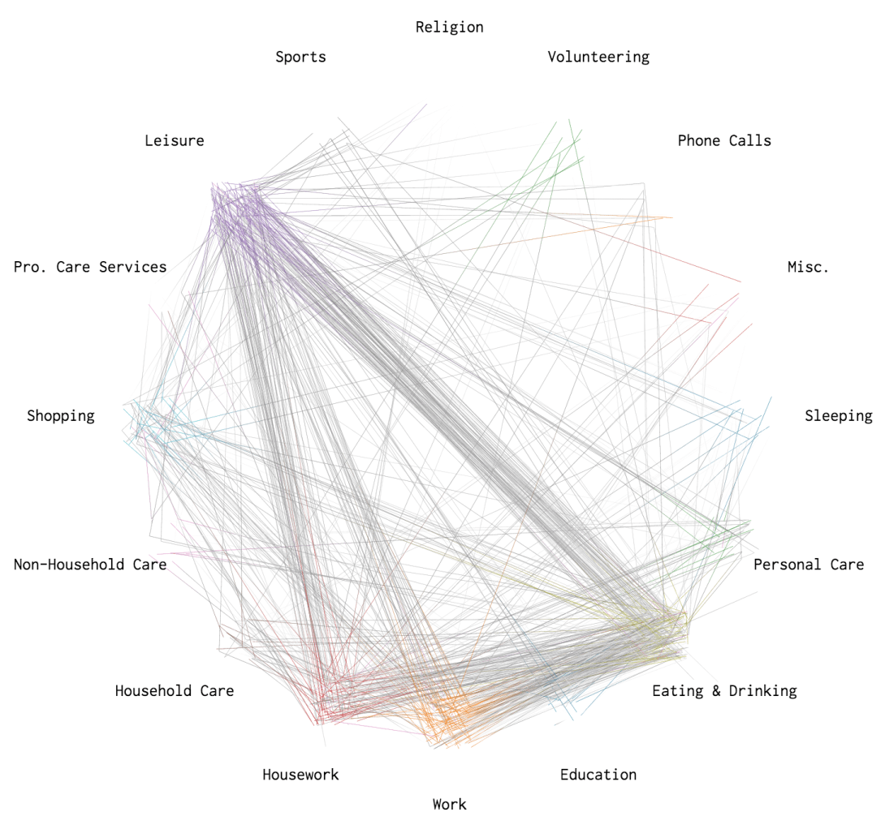
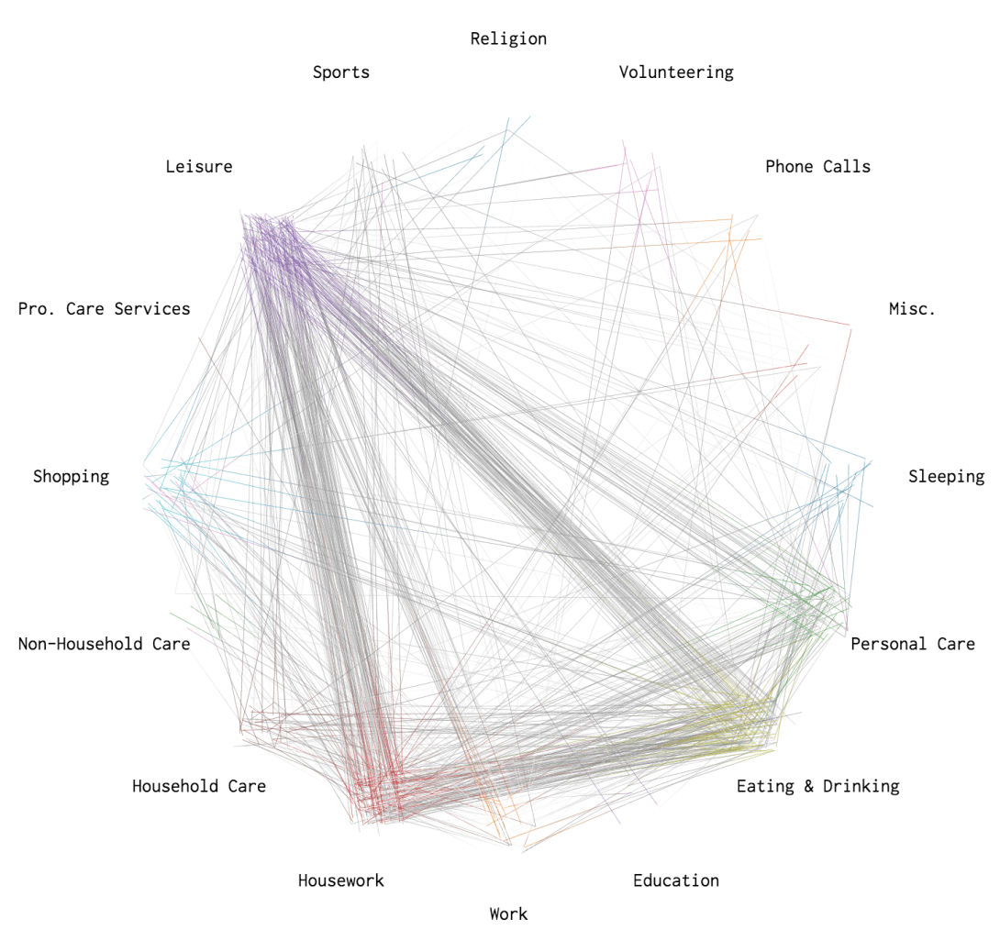
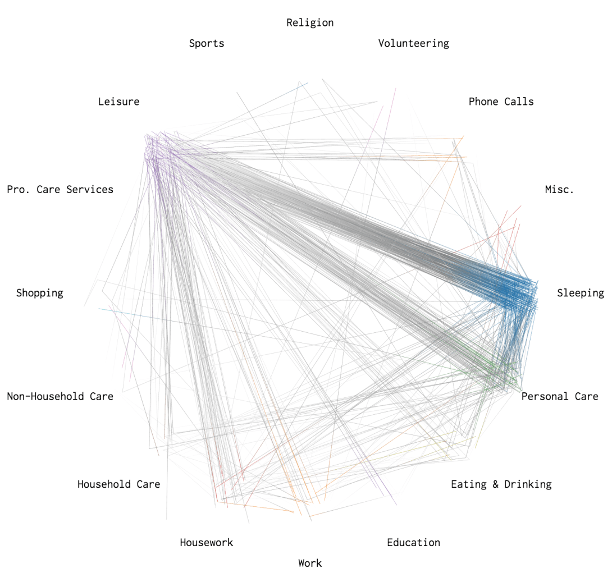
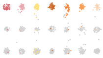
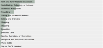
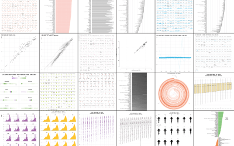
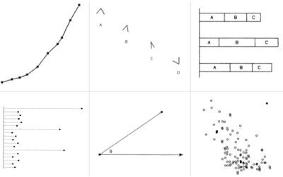

A Day in the Life of Americans

# A Day in the Life of Americans

This is how America runs.

By [Nathan Yau](http://flowingdata.com/about-nathan)  /  Posted to [Data Underload](https://flowingdata.com/category/projects/data-underload/)  /  Tags: [simulation](https://flowingdata.com/tag/simulation/), [time use](https://flowingdata.com/tag/time-use/)

From [two](http://flowingdata.com/2015/11/30/most-common-use-of-time-by-age-and-sex/)  [angles](http://flowingdata.com/2015/11/10/counting-the-hours/) so far, we’ve seen how Americans spend their days, but the views are wideout and limited in what you can see.

I can tell you that about 40 percent of people age 25 to 34 are working on an average day at three in the afternoon. I can tell you similar numbers for housework, leisure, travel, and other things. It’s an overview.

What I really want to see is closer to the individual and a more granular sense of how each person contributes to the patterns. I want to see how a person’s entire day plays out. (As someone who works from home, I’m always interested in what’s on the other side.)

So again I looked at microdata from the American Time Use Survey from 2014, which asked thousands of people what they did during a 24-hour period. I used the data to simulate a single day for 1,000 Americans representative of the population — to the minute.

More specifically, I tabulated transition probabilities for one activity to the other, such as from work to traveling, for every minute of the day. That provided 1,440 transition matrices, which let me model a day as a time-varying Markov chain. The simulations below come from this model, and it’s kind of mesmerizing.

3:04am
Slow
Medium
Fast

Goodnight. More than 80% of people are asleep and it peaks at 96% around 3:00am.

This is a simulation of 1,000 people's average day. It's based on 2014 data from the [American Time Use Survey](http://www.bls.gov/tus/), made way more accessible by the [ATUS Extract Builder](https://www.atusdata.org/).

Sleeping95%Personal Care<1%Eating & Drinking<1%Education0%Work2%Housework<1%Household Care<1%Non-Household Care<1%Shopping0%Pro. Care Services<1%Leisure1%Sports0%Religion0%Volunteering0%Phone Calls0%Misc.0%Traveling<1%

Each dot represents a person, color represents the activity, and time of day is shown in the top left. As someone changes an activity, say from sleep to a morning commute, the dot moves accordingly.

Following the timeline of the ATUS, the simulation starts at 4:00am and runs through 24 hours. The day starts with little movement as people are asleep and won’t wake up for a few hours. For most, the day starts at 7:00am and then it’s off to the races (which is especially fun to see on the fast speed).

You see people head to work, run errands, do housework, take care of the kids, commute, relax, and eat at almost designated times during the day. I stared at these dots longer than I care to admit.

Although with all 1,000 dots floating around it can be a challenge to keep track of where all those people went.

So I drew lines to show the paths.

In the graphics that follow, colors represent paths ending in that activity. Traveling is not included to make activity changes more obvious.

### Waking up

Between 6:30am and 7:30am, most people wake up, head into personal care such as showering and brushing teeth, and then head to work, eat breakfast, relax for a bit, and do housework.

### Lunch hour

From noon to 1:00pm, you see a lot of movement from work or housework to eating and drinking and then back again. Many also take the time to relax.

### Getting off work

As you might expect, once the clock strikes 5:00pm, people head home to prepare and/or eat dinner.

### Winding down

Between 10:00pm and midnight, people wind down for the day, shifting from leisure to personal care and eventually going to sleep.

#### This is an American Workday, By Occupation

[When and where people work](http://flowingdata.com/2017/05/17/american-workday/), a simulation.

#### Most Common Activities

See the [half-hour breakdowns](http://flowingdata.com/2015/11/30/most-common-use-of-time-by-age-and-sex/) for a day, by sex and age group.

#### Make a Moving Bubbles Chart to Show Clustering and Distributions

Here’s how to [make a chart similar to this one](https://flowingdata.com/2016/08/23/make-a-moving-bubbles-chart-to-show-clustering-and-distributions/).

- [Facebook](https://flowingdata.com/2015/12/15/a-day-in-the-life-of-americans/?share=facebook&nb=1)
- [Twitter](https://flowingdata.com/2015/12/15/a-day-in-the-life-of-americans/?share=twitter&nb=1)
- [Reddit](https://flowingdata.com/2015/12/15/a-day-in-the-life-of-americans/?share=reddit&nb=1)

-

### Related Posts

- [Interactive: When Do Americans Leave For Work?](https://flowingdata.com/2015/02/04/when-do-americans-leave-for-work/)Posted to [Data Underload](https://flowingdata.com/category/projects/data-underload/)
- [Counting the Hours](https://flowingdata.com/2015/11/10/counting-the-hours/)Posted to [Data Underload](https://flowingdata.com/category/projects/data-underload/)
- [Most Common Use of Time, By Age and Sex](https://flowingdata.com/2015/11/30/most-common-use-of-time-by-age-and-sex/)Posted to [Data Underload](https://flowingdata.com/category/projects/data-underload/)

Learn to visualize your data. Become a member.
[Join Today](https://flowingdata.com/membership/)

### Membership

This is for people who want to learn to make and design data graphics. Your support goes directly to FlowingData, an independently run site.

### What You Get

- Instant access to tutorials on how to make and design data graphics
- Source code and files to use with your own data
- Four-week course on visualization in R
- Hand-picked links and resources from around the web

### Favorites

[    #### Think Like a Statistician – Without the Math   I call myself a statistician, because, well, I’m a statistics graduate student. However, the most important things I’ve learned are less formal, but have proven extremely useful when working/playing with data.](https://flowingdata.com/2010/03/04/think-like-a-statistician-without-the-math/)

[    #### One Dataset, Visualized 25 Ways   “Let the data speak” they say. But what happens when the data rambles on and on?](https://flowingdata.com/2017/01/24/one-dataset-visualized-25-ways/)

[    #### Top Brewery Road Trip, Routed Algorithmically   There are a lot of great craft breweries in the United States, but there is only so much time. This is the computed best way to get to the top rated breweries and how to maximize the beer tasting experience. Every journey begins with a single sip.](https://flowingdata.com/2015/10/26/top-brewery-road-trip-routed-algorithmically/)

[    #### Graphical perception – learn the fundamentals first   Before you dive into the advanced stuff – like just about everything in your life – you have to learn the fundamentals before you know when you can break the rules.](https://flowingdata.com/2010/03/20/graphical-perception-learn-the-fundamentals-first/)