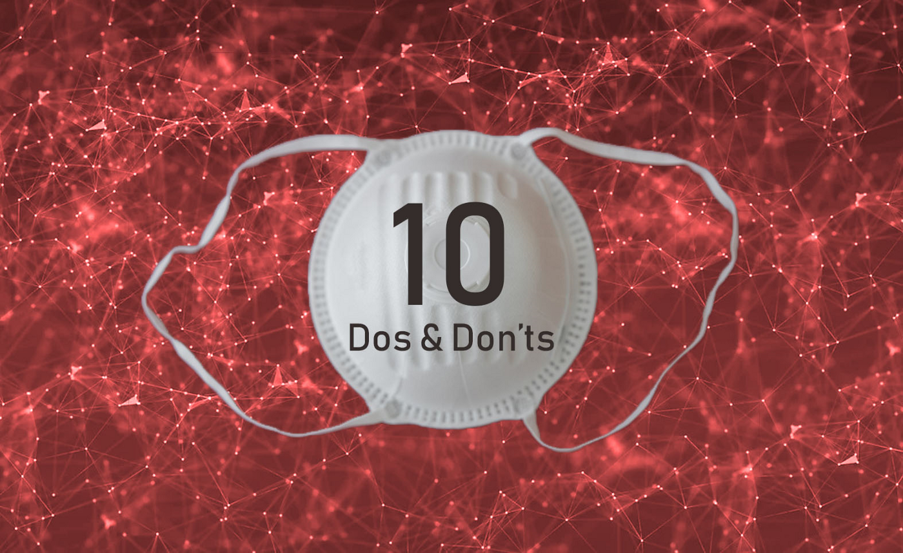

A Decision Scientist’s 10 Dos & Don’ts for COVID-19

Anyone can publish on Medium per our [Policies](https://help.medium.com/hc/en-us/categories/201931128-Policies-Safety?source=post_page-----805577bccd67----------------------), but we don’t fact-check every story. For more info about the coronavirus, see [cdc.gov](https://www.cdc.gov/coronavirus/2019-nCoV?source=post_page-----805577bccd67----------------------).

# A Decision Scientist’s 10 Dos & Don’ts for COVID-19

## Take care of your brain, be smart about data, and make wiser decisions during the pandemic

[Cassie Kozyrkov](https://towardsdatascience.com/@kozyrkov?source=post_page-----805577bccd67----------------------)

[Apr 10](https://towardsdatascience.com/a-decision-scientists-10-dos-don-ts-for-covid-19-805577bccd67?source=post_page-----805577bccd67----------------------) · 2 min read

If your new favorite snack is updates on COVID-19, here are some tips to help you stay afloat in the deluge of misinformation. (Were you expecting tips about washing your hands? This is a *very *different kind of list.)

> Upgrade your resistance to COVID-19 misinformation.

Whether you’re analyzing virus data, making strategic decisions, or simply guzzling opinions on social media, this is for you; I wrote each of the linked articles to delight beginners and experts alike. Think of it as a tour of topics that are especially relevant these days.

***About the author:**** By day, *[*Cassie Kozyrkov*](https://bit.ly/decisionleader)* leads *[*decision intelligence*](http://bit.ly/quaesita_di)* at Google. By night, she blogs about data science for your amusement.*

# DON’Ts

1. Don’t confuse data with objective facts. [[more]](http://bit.ly/quaesita_hist)

2. Don’t forget that your brain sees fake patterns everywhere. [[more]](http://bit.ly/quaesita_inkblot)

3. Don’t fall victim to confirmation bias. [[more]](http://bit.ly/quaesita_confirmation)

4. Don’t be ignorant of assumptions that underlie conclusions. [[more]](https://twitter.com/quaesita/status/1247888569386983426)

5. Don’t expect AI to magically save the day. [[more]](http://bit.ly/quaesita_fad)

6. Don’t take analytical “insights” too seriously. [[more]](http://bit.ly/quaesita_versus)

7. Don’t assume that everyone measures things the same way. [[more](http://bit.ly/quaesita_dmguide2)]

8. Don’t compare apples with oranges. [[more]](http://bit.ly/quaesita_tiger)

9. Don’t trust data models and predictions blindly. [[more]](http://bit.ly/quaesita_fault)

10. Don’t ignore the importance of domain knowledge. [[more](http://bit.ly/quaesita_covidappendix)]

# DOs

1. Do follow a structured process for important decisions. [[more](http://bit.ly/quaesita_covid)]

2. Do think about your default actions. [[more]](http://bit.ly/quaesita_damnedlies)

3. Do set decision criteria before looking at data. [[more]](http://bit.ly/quaesita_inspired)

4. Do check that you understand the basic logic of statistics. [[more](http://bit.ly/quaesita_statistics)]

5. Do choose your population carefully. [[more]](http://bit.ly/quaesita_incompm2)

6. Do meditate on where those data came from. [[more]](http://bit.ly/quaesita_provenance)

7. Do be careful when interpreting data you didn’t collect yourself. [[more]](http://bit.ly/quaesita_notyours)

8. Do insist on data splitting. [[more]](http://bit.ly/quaesita_sydd)
9. Do educate yourself about biases. [[more]](http://bit.ly/quaesita_biasdef)

10. Do forgive yourself for finding ambiguity stressful. [[more]](http://bit.ly/quaesita_ellsberg)

> If you find this information helpful, please share it with others.