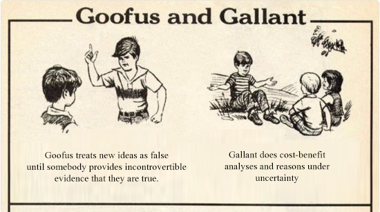
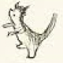
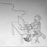
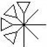
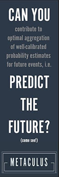

A Failure, But Not Of Prediction | Slate Star Codex

[Home](https://slatestarcodex.com/)

- [About / Top Posts](https://slatestarcodex.com/about/)
- [Psychiat-List](https://psychiat-list.slatestarcodex.com/)
- [Archives](https://slatestarcodex.com/archives/)
- [Meetups](https://www.lesswrong.com/community?filters=SSC)
- [Mistakes](https://slatestarcodex.com/mistakes/)
- [Comments](https://slatestarcodex.com/comments/)
- [Advertise](https://slatestarcodex.com/advertise/)
- [Open Thread](https://slatestarcodex.com/tag/open/?latest)

[Comments Feed](https://slatestarcodex.com/comments/feed/)[RSS Feed](https://slatestarcodex.com/feed/)

[Slate Star Codex](https://slatestarcodex.com/)

SELF-RECOMMENDING!
-

### Recent Posts

    - [Depression: The Olfactory Perspective](https://slatestarcodex.com/2020/04/17/depression-the-olfactory-perspective/)
    - [Open Thread 151.75](https://slatestarcodex.com/2020/04/15/open-thread-151-75/)
    - [A Failure, But Not Of Prediction](https://slatestarcodex.com/2020/04/14/a-failure-but-not-of-prediction/)
    - [Open Thread 151.5](https://slatestarcodex.com/2020/04/12/open-thread-151-5/)
    - [Coronalinks 4/10: Second Derivative](https://slatestarcodex.com/2020/04/10/coronalinks-4-10-second-derivative/)

-

### Upcoming Meetups

Cancelled due to pandemic, sorry.
-

### Blogroll

-

### Embalmed Ones

    - [ANOIEAEIB](http://blog.jaibot.com/)
    - [Common Sense Atheism](http://commonsenseatheism.com/)
    - [Less Wrong](http://lesswrong.com/)
    - [The Last Psychiatrist](http://thelastpsychiatrist.com/)

-

### Fabulous Ones

    - [Alicornutopia](http://alicorn.elcenia.com/board/index.php)
    - [Unsong](http://unsongbook.com/)
    - [Worm](https://parahumans.wordpress.com/)

-

### Innumerable Ones

    - [Gwern](https://www.gwern.net/)
    - [n-Category Cafe](https://golem.ph.utexas.edu/category/)
    - [Put A Number On It](http://putanumonit.com/)
    - [Random Critical Analysis](https://randomcriticalanalysis.wordpress.com/)
    - [Shtetl-Optimized](http://www.scottaaronson.com/blog/)
    - [Statistical Modeling](http://andrewgelman.com/)
    - [Unenumerated](http://unenumerated.blogspot.com/)

-

### Mermaids

    - [MIRI](https://intelligence.org/blog/)
    - [Miri](http://freethoughtblogs.com/brutereason/)
    - [Nothing Is Mere](http://nothingismere.com/)
    - [The Merely Real](https://themerelyreal.wordpress.com/)

-

### Stray Dogs

    - [Anonymous Mugwump](http://anonymousmugwump.blogspot.co.uk/)
    - [Follow The Squirrel](http://followthesquirrel.blogspot.com/)
    - [Marginal Revolution](http://marginalrevolution.com/)
    - [Nintil](https://nintil.com/)
    - [Pseudoerasmus](https://pseudoerasmus.com/)
    - [The Money Illusion](http://www.themoneyillusion.com/)

-

### Suckling Pigs

    - [Fredrik deBoer](https://fredrikdeboer.com/)
    - [Unqualified Restaurant Reservations](http://unqualifiedrestaurants.tumblr.com/)
    - [Whole Health Source](http://wholehealthsource.blogspot.com/)

-

### Those Drawn With A Very Fine Camel Hair Brush

    - [Existential Comics](http://existentialcomics.com/)
    - [Saturday Morning Breakfast Cereal](http://www.smbc-comics.com/)

-

### Those That Are Included In This Classification

    - [r/slatestarcodex](https://www.reddit.com/r/slatestarcodex/)
    - [SSC Discord Server](https://discord.gg/kAVSf9U)
    - [SSC Podcast](http://sscpodcast.libsyn.com/rss)

-

### Those That Are Trained

    - [80000 Hours Blog](https://80000hours.org/blog/)
    - [AI Impacts](http://aiimpacts.org/)
    - [Effective Altruism Forum](http://www.effective-altruism.com/)
    - [GiveWell Blog](http://blog.givewell.org/)
    - [Jeff Kaufman](http://www.jefftk.com/index)
    - [Luke Muehlhauser](http://lukemuehlhauser.com/)
    - [The Unit of Caring](http://theunitofcaring.tumblr.com/)
    - [The Whole Sky](https://thewholesky.wordpress.com/)

-

### Those That At A Distance Resemble Flies

    - [Agenty Duck](http://agentyduck.blogspot.com/)
    - [Beeminder](https://www.beeminder.com/)
    - [Nate Soares](http://mindingourway.com/)

-

### Those That Belong To The Emperor

    - [Sam[]zdat](https://samzdat.com/)
    - [Xenosystems](http://www.xenosystems.net/)

-

### Those That Have Just Broken The Flower Vase

    - [Armed and Dangerous](http://esr.ibiblio.org/)
    - [Bryan Caplan](https://www.econlib.org/author/bcaplan/)
    - [David Friedman](http://daviddfriedman.blogspot.com/)
    - [Don't Worry About The Vase](https://thezvi.wordpress.com/)
    - [Overcoming Bias](http://www.overcomingbias.com/)
    - [Popehat](http://www.popehat.com/)
    - [Sci-Hub](http://sci-hub.tw/)

-

### Those That Tremble As Though They Are Mad

    - [1 Boring Old Man](http://1boringoldman.com/)
    - [Aceso Under Glass](http://acesounderglass.com/)
    - [Cognition and Evolution](http://cognitionandevolution.blogspot.com/)
    - [Crazy Meds](https://crazymeds.net/pmwiki/pmwiki.php)
    - [Erik Anderson Therapy](https://www.erikandersontherapy.com/blog/)
    - [Gruntled and Hinged](http://gruntledandhinged.wordpress.com/)
    - [Real Psychiatry](http://real-psychiatry.blogspot.com/)
    - [Shrink Rap](http://psychiatrist-blog.blogspot.com/)

-

### Various Others

    - [An Algorithmic Lucidity](http://zackmdavis.net/blog/)
    - [De Pony Sun](https://medium.com/@sumdepony)
    - [Gene Expression](https://www.gnxp.com/)
    - [Information Processing](http://infoproc.blogspot.com/)
    - [Melting Asphalt](http://www.meltingasphalt.com/)
    - [Meteuphoric](https://meteuphoric.wordpress.com/)
    - [Otium](https://srconstantin.wordpress.com/)
    - [Ribbonfarm](http://www.ribbonfarm.com/)
    - [The Rationalist Conspiracy](http://rationalconspiracy.com/)
    - [The Sideways View](https://sideways-view.com/)
    - [Thing of Things](http://thingofthings.wordpress.com/)
    - [West Hunter](https://westhunt.wordpress.com/)

-

### Archives

    - [April 2020](https://slatestarcodex.com/2020/04/)
    - [March 2020](https://slatestarcodex.com/2020/03/)
    - [February 2020](https://slatestarcodex.com/2020/02/)
    - [January 2020](https://slatestarcodex.com/2020/01/)
    - [December 2019](https://slatestarcodex.com/2019/12/)
    - [November 2019](https://slatestarcodex.com/2019/11/)
    - [October 2019](https://slatestarcodex.com/2019/10/)
    - [September 2019](https://slatestarcodex.com/2019/09/)
    - [August 2019](https://slatestarcodex.com/2019/08/)
    - [July 2019](https://slatestarcodex.com/2019/07/)
    - [June 2019](https://slatestarcodex.com/2019/06/)
    - [May 2019](https://slatestarcodex.com/2019/05/)
    - [April 2019](https://slatestarcodex.com/2019/04/)
    - [March 2019](https://slatestarcodex.com/2019/03/)
    - [February 2019](https://slatestarcodex.com/2019/02/)
    - [January 2019](https://slatestarcodex.com/2019/01/)
    - [December 2018](https://slatestarcodex.com/2018/12/)
    - [November 2018](https://slatestarcodex.com/2018/11/)
    - [October 2018](https://slatestarcodex.com/2018/10/)
    - [September 2018](https://slatestarcodex.com/2018/09/)
    - [August 2018](https://slatestarcodex.com/2018/08/)
    - [July 2018](https://slatestarcodex.com/2018/07/)
    - [June 2018](https://slatestarcodex.com/2018/06/)
    - [May 2018](https://slatestarcodex.com/2018/05/)
    - [April 2018](https://slatestarcodex.com/2018/04/)
    - [March 2018](https://slatestarcodex.com/2018/03/)
    - [February 2018](https://slatestarcodex.com/2018/02/)
    - [January 2018](https://slatestarcodex.com/2018/01/)
    - [December 2017](https://slatestarcodex.com/2017/12/)
    - [November 2017](https://slatestarcodex.com/2017/11/)
    - [October 2017](https://slatestarcodex.com/2017/10/)
    - [September 2017](https://slatestarcodex.com/2017/09/)
    - [August 2017](https://slatestarcodex.com/2017/08/)
    - [July 2017](https://slatestarcodex.com/2017/07/)
    - [June 2017](https://slatestarcodex.com/2017/06/)
    - [May 2017](https://slatestarcodex.com/2017/05/)
    - [April 2017](https://slatestarcodex.com/2017/04/)
    - [March 2017](https://slatestarcodex.com/2017/03/)
    - [February 2017](https://slatestarcodex.com/2017/02/)
    - [January 2017](https://slatestarcodex.com/2017/01/)
    - [December 2016](https://slatestarcodex.com/2016/12/)
    - [November 2016](https://slatestarcodex.com/2016/11/)
    - [October 2016](https://slatestarcodex.com/2016/10/)
    - [September 2016](https://slatestarcodex.com/2016/09/)
    - [August 2016](https://slatestarcodex.com/2016/08/)
    - [July 2016](https://slatestarcodex.com/2016/07/)
    - [June 2016](https://slatestarcodex.com/2016/06/)
    - [May 2016](https://slatestarcodex.com/2016/05/)
    - [April 2016](https://slatestarcodex.com/2016/04/)
    - [March 2016](https://slatestarcodex.com/2016/03/)
    - [February 2016](https://slatestarcodex.com/2016/02/)
    - [January 2016](https://slatestarcodex.com/2016/01/)
    - [December 2015](https://slatestarcodex.com/2015/12/)
    - [November 2015](https://slatestarcodex.com/2015/11/)
    - [October 2015](https://slatestarcodex.com/2015/10/)
    - [September 2015](https://slatestarcodex.com/2015/09/)
    - [August 2015](https://slatestarcodex.com/2015/08/)
    - [July 2015](https://slatestarcodex.com/2015/07/)
    - [June 2015](https://slatestarcodex.com/2015/06/)
    - [May 2015](https://slatestarcodex.com/2015/05/)
    - [April 2015](https://slatestarcodex.com/2015/04/)
    - [March 2015](https://slatestarcodex.com/2015/03/)
    - [February 2015](https://slatestarcodex.com/2015/02/)
    - [January 2015](https://slatestarcodex.com/2015/01/)
    - [December 2014](https://slatestarcodex.com/2014/12/)
    - [November 2014](https://slatestarcodex.com/2014/11/)
    - [October 2014](https://slatestarcodex.com/2014/10/)
    - [September 2014](https://slatestarcodex.com/2014/09/)
    - [August 2014](https://slatestarcodex.com/2014/08/)
    - [July 2014](https://slatestarcodex.com/2014/07/)
    - [June 2014](https://slatestarcodex.com/2014/06/)
    - [May 2014](https://slatestarcodex.com/2014/05/)
    - [April 2014](https://slatestarcodex.com/2014/04/)
    - [March 2014](https://slatestarcodex.com/2014/03/)
    - [February 2014](https://slatestarcodex.com/2014/02/)
    - [January 2014](https://slatestarcodex.com/2014/01/)
    - [December 2013](https://slatestarcodex.com/2013/12/)
    - [November 2013](https://slatestarcodex.com/2013/11/)
    - [October 2013](https://slatestarcodex.com/2013/10/)
    - [September 2013](https://slatestarcodex.com/2013/09/)
    - [August 2013](https://slatestarcodex.com/2013/08/)
    - [July 2013](https://slatestarcodex.com/2013/07/)
    - [June 2013](https://slatestarcodex.com/2013/06/)
    - [May 2013](https://slatestarcodex.com/2013/05/)
    - [April 2013](https://slatestarcodex.com/2013/04/)
    - [March 2013](https://slatestarcodex.com/2013/03/)
    - [February 2013](https://slatestarcodex.com/2013/02/)

-

    - [Full Archives](https://slatestarcodex.com/archives/)

# A Failure, But Not Of Prediction

Posted on  [April 14, 2020](https://slatestarcodex.com/2020/04/14/a-failure-but-not-of-prediction/)  by  [Scott Alexander](https://slatestarcodex.com/author/admin/)

**I.**

Vox asks [What Went Wrong With The Media’s Coronavirus Coverage?](https://www.vox.com/recode/2020/4/13/21214114/media-coronavirus-pandemic-coverage-cdc-should-you-wear-masks) They conclude that the media needs to be better at “not just saying what we do know, but what we don’t know”. This raises some important questions. Like: how much ink and paper is there in the world? Are we sure it’s enough? But also: how do you become better at saying what you don’t know?

In case you’ve been hiding under a rock recently (honestly, valid) the media not only failed to adequately warn its readers about the epidemic, but actively mocked and condescended to anyone who *did* sound a warning. Real Clear Politics has [a list of highlights](https://www.realclearpolitics.com/articles/2020/03/27/pandemic_brings_out_the_best_and_the_worst_in_the_media_142791.html). The [Vox tweet](https://twitter.com/RepGosar/status/1242625203844325376) saying “Is this going to be a deadly pandemic? No.” Washington Post [telling us in February](https://www.washingtonpost.com/outlook/2020/02/03/why-we-should-be-wary-an-aggressive-government-response-coronavirus/) “Why we should be wary of an aggressive government reponse to coronavirus (it might “scapegoat marginalized populations”). The Daily Beast [complaining that](https://twitter.com/thedailybeast/status/1225937322694381568) “coronavirus, with zero American fatalities, is dominating headlines, while the flu is the real threat”. The *New York Times*, [weighing in](https://www.nytimes.com/2020/01/29/opinion/coronavirus-panic.html) with articles like “The pandemic panic” and “Who says it’s not safe to travel to China”. The [constant](https://www.vox.com/2020/2/7/21126758/coronavirus-xenophobia-racism-china-asians)  [attempts](http://archive.is/https://slate.com/technology/2020/02/coronavirus-panic-racist-profiling-asians.html)  [to attribute](https://www.huffpost.com/?icid=hjx004) “alarmism” over the virus to anti-Chinese racism. [Etc](https://twitter.com/wesyang/status/1241598924516986881), [etc](https://twitter.com/wesyang/status/1244183510992199680), [etc](https://twitter.com/shitvirustakes).

One way people have summed this up is that the media (and the experts they relied on) did a terrible job predicting what would happen. I think this lets them off too easy.

Prediction is very hard. Nate Silver is maybe the best political predicter alive, and he [estimated a 29% chance](https://fivethirtyeight.com/features/why-fivethirtyeight-gave-trump-a-better-chance-than-almost-anyone-else/) of Trump winning just before Trump won. UPenn professor Philip Tetlock has spent decades identifying “superforecasters” and coming up with complicated algorithms for aggregating their predictions, developing [a prediction infrastructure](https://slatestarcodex.com/2016/02/04/book-review-superforecasting/) that beats top CIA analysts, but they [estimated a 23% chance](https://www.bloomberg.com/news/articles/2016-05-18/superforecasters-see-24-chance-of-brexit-as-economy-wins-out) Britain would choose Brexit just before it happened. This isn’t intended to criticize Silver or Tetlock. I believe they’re operating at close to optimum – the best anyone could possibly do with the information that they had. But the world is full of noise, and tiny chance events can have outsized effects, and there are only so many polls you can scrutinize, and even geniuses can only do so well.

Predicting the coronavirus was equally hard, and the best institutions we had missed it. On February 20th, Tetlock’s superforecasters [predicted only a 3% chance](https://www.eurasiagroup.net/live-post/superforecaster-fridays-total-cases-coronavirus-reported-who-20-march-2020) that there would be 200,000+ coronavirus cases a month later (there were). The stock market is a giant coordinated attempt to predict the economy, and it reached an all-time high on February 12, suggesting that analysts expected the economy to do great over the following few months. On February 20th it fell in a way that suggested a mild inconvenience to the economy, but it didn’t really start plummeting until mid-March – the same time the media finally got a clue. These aren’t empty suits on cable TV with no skin in the game. These are the best predictive institutions we have, and they got it wrong. I conclude that predicting the scale of coronavirus in mid-February – the time when we could have done something about it – was really hard.

I don’t like this conclusion. But I have to ask myself – if it was so easy, why didn’t *I* do it? It’s easy to look back and say “yeah, I always secretly knew it would be pretty bad”. I did a few things right – I started prepping half-heartedly in mid-February, I recommended my readers prep [in early March](https://slatestarcodex.com/2020/03/02/coronavirus-links-speculation-open-thread/), I never criticized others for being alarmist. Overall I give myself a solid B-. But if it was so easy, why didn’t I post “Hey everyone, I officially predict the coronavirus will be a nightmarish worldwide pandemic” two months ago? It wouldn’t have helped anything, but I would have had bragging rights forever. For that matter, why didn’t *you* post this – on Facebook, on Twitter, on the comments here? You could have gone down in legend, alongside [Travis W. Fisher](https://twitter.com/metaculus/status/1248966351508692992), for making a single tweet. Since you didn’t do that (aside from the handful of you who did – we love you, Balaji) I conclude that predicting it was hard, even for smart and well-intentioned people like yourselves.

Does that mean we can’t put everyone’s heads on spikes outside the Capitol Building as a warning for future generations? I would be very disappointed if it meant that. I think we can still put heads on spikes. We just have to do it for more subtle, better-thought-out reasons.

**II.**

I used to run user surveys for [a forum on probabilistic reasoning](https://www.lesswrong.com/)…

(I promise this will become relevant soon)

A surprising number of these people had signed up for cryonics – the thing where they freeze your brain after you die, in case the future invents a way to resurrect frozen brains. Lots of people mocked us for this – “if you’re so good at probabilistic reasoning, how can you believe something so implausible?” I was curious about this myself, so I put some questions on one of the surveys.

The results were pretty strange. Frequent users of the forum (many of whom had pre-paid for brain freezing) said they estimated there was a 12% chance the process would work and they’d get resurrected. A control group with no interest in cryonics estimated a 15% chance. The people who were doing it were no more optimistic than the people who weren’t. What gives?

I think they were actually good at probabilistic reasoning. The control group said “15%? That’s less than 50%, which means cryonics probably won’t work, which means I shouldn’t sign up for it.” The frequent user group said “A 12% chance of eternal life for the cost of a freezer? Sounds like a good deal!”

There are a lot of potential objections and complications – for one thing, maybe both those numbers are much too high. You can read more [here](https://www.lesswrong.com/posts/Gh2qQHrCg3teQen3c/rationalists-are-less-credulous-but-better-at-taking-ideas) and [here](https://www.gwern.net/Cryonics). But overall I learned something really important from this.

Making decisions is about more than just having certain beliefs. It’s also about how you act on them.

**III.**

A few weeks ago, I wrote [a blog post on face masks](https://slatestarcodex.com/2020/03/23/face-masks-much-more-than-you-wanted-to-know/). It reviewed the evidence and found that they probably helped prevent the spread of disease. Then it asked: how did the WHO, CDC, etc get this so wrong?

I went into it thinking they’d lied to us, hoping to prevent hoarders from buying up so many masks that there weren’t enough for health workers. Turns out that’s not true. The CDC has been singing [the same tune](https://slatestarcodex.com/blog_images/masks_cdc.png) for the past ten years. Swine flu, don’t wear masks. SARS, don’t wear masks. They’ve been really consistent on this point. But why?

If you really want to understand what happened, don’t read any studies about face masks or pandemics. Read Smith & Pell (2003), [Parachute Use To Prevent Death And Major Trauma Related To Gravitational Challenge: Systematic Review Of Randomized Controlled Trials](https://www.bmj.com/content/327/7429/1459?ijkey=c3677213eca83ff6599127794fc58c4e0f6de55a&keytype2=tf_ipsecsha). It’s an article in the *British Journal Of Medicine* pointing out that there have never been any good studies proving that parachutes are helpful when jumping out of a plane, so they fail to meet the normal standards of evidence-based medicine. From the Discussion section:

**

> It is a truth universally acknowledged that a medical intervention justified by observational data must be in want of verification through a randomised controlled trial. Observational studies have been tainted by accusations of data dredging, confounding, and bias. For example, observational studies showed lower rates of ischaemic heart disease among women using hormone replacement therapy, and these data were interpreted as advocating hormone replacement for healthy women, women with established ischaemic heart disease, and women with risk factors for ischaemic heart disease. However, randomised controlled trials showed that hormone replacement therapy actually increased the risk of ischaemic heart disease, indicating that the apparent protective effects seen in observational studies were due to bias. Cases such as this one show that medical interventions based solely on observational data should be carefully scrutinised, and the parachute is no exception.

**

Of course this is a joke. It’s in the all-joke holiday edition of BMJ, and everyone involved knew exactly what they were doing. But the joke is funny because it points at something true. It’s biting social commentary. Doctors will not admit any treatment could possibly be good until it has a lot of randomized controlled trials behind it, common sense be damned. This didn’t come out of nowhere. They’ve been burned lots of times before by thinking they were applying common sense and getting things really wrong. And after your mistakes kill a few thousand people you start getting really paranoid and careful. And there are so many quacks who can spout off some “common sense” explanation for why their vitamin-infused bleach or colloidal silver should work that doctors have just become immune to that kind of bullshit. Multiple good RCTs or it didn’t happen. Given the history I think this is a defensible choice, and if you are tempted to condemn it you may find [this story about bone marrow transplants](https://medium.com/@jamesheathers/hurry-dont-rush-e1aee626e733) enlightening.

But you can take this too far. After highlighting the lack of parachute RCTs, the paper continues:

**

> Only two options exist. The first is that we accept that, under exceptional circumstances, common sense might be applied when considering the potential risks and benefits of interventions. The second is that we continue our quest for the holy grail of exclusively evidence based interventions and preclude parachute use outside the context of a properly conducted trial. The dependency we have created in our population may make recruitment of the unenlightened masses to such a trial difficult. If so, we feel assured that those who advocate evidence based medicine and criticise use of interventions that lack an evidence base will not hesitate to demonstrate their commitment by volunteering for a double blind, randomised, placebo controlled, crossover trial.

**

Did you follow that? For a good parachute RCT, half the subjects would have to jump out of a plane wearing a placebo parachute. The authors suggest maybe we enlist doctors who insist too stringently on RCTs over common sense for this dubious honor.

(good news, though, a [parachute RCT did eventually get done](https://www.bmj.com/content/363/bmj.k5094))

Sometimes good humor is a little too on the nose, like [those Onion articles](https://politics.theonion.com/bush-our-long-national-nightmare-of-peace-and-prosperi-1819565882) that come true a few years later. The real medical consensus on face masks came from pretty much the same process as the fake medical consensus on parachutes. Common sense said that they worked. But there weren’t many good RCTs. We couldn’t do more, because it would have been unethical to deliberately expose face-mask-less people to disease. In the end, all we had were some mediocre trials of slightly different things that we had to extrapolate out of range.

Just like the legal term for “not proven guilty beyond a reasonable doubt” is “not guilty”, the medical term for “not proven to work in several gold-standard randomized controlled trials” is “it doesn’t work” (and don’t get me started on [“no evidence”](http://www.overcomingbias.com/2008/08/doctor-there-ar.html)). So the CDC said masks didn’t work.

Going back to our diagram:

Goofus started with the position that masks, being a new idea, needed incontrovertible proof. When the few studies that appeared weren’t incontrovertible enough, he concluded that people shouldn’t wear masks.

Gallant would have recognized the uncertainty – based on the studies we can’t be 100% sure masks definitely work for this particular condition – and done a cost-benefit analysis. Common sensically, it seems like masks probably *should* work. The existing evidence for masks is highly suggestive, even if it’s not utter proof. Maybe 80% chance they work, something like that? If you can buy an 80% chance of stopping a deadly pandemic for the cost of having to wear some silly cloth over your face, probably that’s a good deal. Even though regular medicine has good reasons for being as conservative as it is, during a crisis you have to be able to think on your feet.

**IV.**
But getting back to the media:

Their main excuse is that they were just relaying expert opinion – the sort of things the WHO and CDC and top epidemiologists were saying. I believe them. People on Twitter howl and gnash their teeth at this, asking why the press didn’t fact-check or challenge those experts. But I’m not sure I want to institute a custom of journalists challenging experts. Journalist Johann Hari decided to take it upon himself to challenge psychiatric experts, and wrote a serious of terrible articles and a terrible book saying they were wrong about everything. I am a psychiatrist and I can tell you he is so wrong that it is physically painful to read his stuff (though of course I would say that…). Most journalists stick to assuming the experts know more about their subject of expertise than they do, and I think this is wise. The role of science journalists is to primarily to relay, explain, give context to the opinions of experts, not to try to out-medicine the doctors. So I think this is a good excuse.

But I would ask this of any journalist who pleads that they were just relaying and providing context for expert opinions: what was the experts’ percent confidence in their position?

I am so serious about this. What fact could possibly be more relevant? What context could it possibly be more important to give? I’m not saying you need to have put a number in your articles, maybe your readers don’t go for that. But were you working off of one? Did this question even occur to you?

Nate Silver said there was a 29% chance Trump would win. Most people interpreted that as “Trump probably won’t win” and got shocked when he did. What was the percent attached to your “coronavirus probably won’t be a disaster” prediction? Was it also 29%? 20%? 10%? Are you sure you want to go lower than 10%? Wuhan was already under total lockdown, they didn’t even have space to bury all the bodies, and you’re saying that there was less than 10% odds that it would be a problem anywhere else? I hear people say there’s a 12 – 15% chance that future civilizations will resurrect your frozen brain, surely the risk of coronavirus was higher than that?

And if the risk was 10%, shouldn’t that have been the headline. “TEN PERCENT CHANCE THAT THERE IS ABOUT TO BE A PANDEMIC THAT DEVASTATES THE GLOBAL ECONOMY, KILLS HUNDREDS OF THOUSANDS OF PEOPLE, AND PREVENTS YOU FROM LEAVING YOUR HOUSE FOR MONTHS”? Isn’t that a better headline than [Coronavirus panic sells as alarmist information spreads on social media](https://www.axios.com/coronavirus-social-media-b56326b6-ab16-4c8a-bc86-e29b06e5ab2b.html)? But that’s the headline you could have written if your odds were ten percent!

So:

I think people acted like Goofus again.

People were presented with a new idea: a global pandemic might arise and change everything. They waited for proof. The proof didn’t arise, at least at first. I remember hearing people say things like “there’s no reason for panic, there are currently only ten cases in the US”. This should sound like “there’s no reason to panic, the asteroid heading for Earth is still several weeks away”. The only way I can make sense of it is through a mindset where you are not allowed to entertain an idea until you have proof of it. Nobody had incontrovertible evidence that coronavirus was going to be a disaster, so until someone does, you default to the null hypothesis that it won’t be.

Gallant wouldn’t have waited for proof. He would have checked prediction markets and asked top experts for probabilistic judgments. If he heard numbers like 10 or 20 percent, he would have done a cost-benefit analysis and found that putting some tough measures into place, like quarantine and social distancing, would be worthwhile if they had a 10 or 20 percent chance of averting catastrophe.

**V.**

This is at risk of getting too depressing, so I want to focus on some people who deserve recognition for especially good responses.

First, a bunch of generic smart people on Twitter who got things exactly right – there are too many of these people to name, but [Scott Aaronson highlights](https://www.scottaaronson.com/blog/?p=4695) “Bill Gates, Balaji Srinivasan, Paul Graham, Greg Cochran, Robin Hanson, Sarah Constantin, Eliezer Yudkowsky, and Nicholas Christakis.” None of these people (except Greg Cochran) are domain experts, and none of them (except Greg Cochran) have creepy oracular powers. So how could they have beaten the experts? Haven’t we been told a million times that generic intelligence is no match for deep domain knowledge?

I think the answer is: they didn’t beat the experts in epidemiology. Whatever probability of pandemic the experts and prediction markets gave for coronavirus getting really bad, these people didn’t necessarily give a higher probability. They were just better at probabilistic reasoning, so they had different reactions to the same number. There’s no reason generic why smart people shouldn’t be better at probabilistic reasoning then epidemiologists. In fact, this seems exactly like the sort of thing generic smart people might be.

Zeynep Tufekci is an even clearer example. She’s a sociologist and journalist who [was writing about](https://blogs.scientificamerican.com/observations/preparing-for-coronavirus-to-strike-the-u-s/) how it was “our civic duty” to prepare for coronavirus as early as February. She was also the first mainstream media figure to [spread the word](https://www.nytimes.com/2020/03/17/opinion/coronavirus-face-masks.html) that masks were probably helpful.

Totally at random today, reading [a blog post on the Mongol Empire](http://bactra.org/weblog/ebola-and-mongol-modernity.html) like all normal people do during a crisis, I stumbled across a different reference to Zeynep. In a 2014 article, she was [sounding a warning about the Ebola pandemic](https://medium.com/message/ebola-the-real-reason-everyone-should-panic-889f32740e3e) that was going on at the time. She was saying the exact same things everyone is saying now – global institutions are failing, nobody understands exponential growth, travel restrictions could work early but won’t be enough if it breaks out. She quoted a CDC prediction that there could be a million cases by the end of 2014. “Let that sink in,” she wrote. “A million Ebola victims in just a few months.”

In fact, this didn’t happen. There were only about 30,000 cases. The virus never really made it out of Liberia, Sierra Leone, and Guinea.

I don’t count this as a failed prediction on Zeynep’s part. First of all, because it could have been precisely because of people like her sounding the alarm that the epidemic was successfully contained. But more important, it wasn’t really a prediction at all. Her point wasn’t that she definitely knew this Ebola pandemic was the one that would be really bad. Her point was that it might be, so we needed to prepare. She said the same thing when the coronavirus was just starting. If this were a game, her batting average would be 50%, but that’s the wrong framework.

Zeynep Tufecki is admirable. But her admirable skill isn’t looking at various epidemics and successfully predicting which ones will be bad and which ones will fizzle out. She can’t do that any better than anyone else. Her superpower is her ability to treat something as important even before she has incontrovertible evidence that it has to be.

And finally, Kelsey Piper. She wrote a February 6th [article](https://www.vox.com/future-perfect/2020/2/6/21121303/coronavirus-wuhan-panic-pandemic-outbreak) saying:

**

> The coronavirus killed fewer people than the flu did in January. But it might kill more in February — and unlike the flu, its scope and effects are poorly understood and hard to guess at. The Chinese National Health Commission reports 24,324 cases, including 3,887 new ones today. There are some indications that these numbers understate the situation, as overwhelmed hospitals in Wuhan only have the resources to test the most severe cases. As of Tuesday, 171,329 people are under medical observation because they’ve had close contact with a confirmed case.

> It is unclear whether China will be able to get the outbreak under control or whether it will cause a series of epidemics throughout the country. It’s also unclear whether other countries — especially those with weak health systems — will be able to quickly identify any cases in their country and avoid Wuhan-scale outbreaks.

> The point is, it’s simply too soon to assert we’ll do well on both those fronts — and if we fail, then the coronavirus death toll could well climb up into the tens of thousands. It also remains to be seen if vaccines or effective antiviral treatments will be developed. That’s just far too much uncertainty to assure people that they have nothing to worry about. And misleadingly assuring people that there’s nothing to worry about can end up doing harm.

> “Instead of deriding people’s fears about the Wuhan coronavirus,” Sandman, the communications expert, writes, “I would advise officials and reporters to focus more on the high likelihood that things will get worse and the not-so-small possibility that they will get much worse.”

**

She concluded that “the Wuhan coronavirus likely won’t be a nightmare pandemic, but that scenario is still in play”, and followed it up with [an article](https://www.vox.com/future-perfect/2020/2/28/21156128/coronavirus-prepare-outbreak-covid19-health) urging people to prepare by buying essential food and supplies.

If we interpret her “likely won’t be a nightmare pandemic” sentence as a prediction, she got the prediction wrong. Like Zeynep, she has no special ability to predict whether any given disease will end in global disaster. But that didn’t matter! She gave exactly the correct advice to institutions (prepare for a worst-case scenario, stop telling people not to panic) and exactly the correct advice to individuals (start prepping). When you’re good enough at handling uncertainty, getting your predictions exactly right becomes almost superfluous.

The Vox article says the media needs to “say what it doesn’t know”. I agree with this up to a point. But they can’t let this turn into a muddled message of “oh, who knows anything, whatever”. Uncertainty about the world doesn’t imply uncertainty about the best course of action! Within the range of uncertainty that we had about the coronavirus this February, an article that acknowledged that uncertainty wouldn’t have looked like “We’re not sure how this will develop, so we don’t know whether you should stop large gatherings or not”. It would have looked like “We’re not sure how this will develop, so you should *definitely* stop large gatherings.”

I worry that the people who refused to worry about coronavirus until too late thought they were “being careful” and “avoiding overconfidence”. And I worry the lesson they’ll take away from this is to be more careful, and avoid overconfidence even more strongly.

Experts should think along these lines when making their recommendations, but if they don’t, the press should think along them as part of its work of putting expert recommendations in context. I think Kelsey’s article provides an shining example of what this should look like.

Maybe other people got this right too. I’m singling out Kelsey because of a personal connection – I met her through the same probabilistic reasoning forum where I did my cryonics survey years ago. I don’t think this is a coincidence.

*[**Related:**  [Book Review: *The Precipice*](https://slatestarcodex.com/2020/04/01/book-review-the-precipice/); [Two Kinds Of Caution](https://slatestarcodex.com/2017/07/08/two-kinds-of-caution/)]*

This entry was posted in [Uncategorized](https://slatestarcodex.com/category/uncategorized/) and tagged [coronavirus](https://slatestarcodex.com/tag/coronavirus/), [politics](https://slatestarcodex.com/tag/politics/), [really this is secretly about ai](https://slatestarcodex.com/tag/really-this-is-secretly-about-ai/). Bookmark the [permalink](https://slatestarcodex.com/2020/04/14/a-failure-but-not-of-prediction/) or [link without comments](https://slatestarcodex.com/2020/04/14/a-failure-but-not-of-prediction/?comments=false).

[← Open Thread 151.5](https://slatestarcodex.com/2020/04/12/open-thread-151-5/)

[Open Thread 151.75 →](https://slatestarcodex.com/2020/04/15/open-thread-151-75/)

### Leave a Reply

You must be [logged in](https://slatestarcodex.com/wp-login.php?redirect_to=https%3A%2F%2Fslatestarcodex.com%2F2020%2F04%2F14%2Fa-failure-but-not-of-prediction%2F) to post a comment.

### 840 Responses to *A Failure, But Not Of Prediction*

[Reverse order](https://slatestarcodex.com/2020/04/14/a-failure-but-not-of-prediction/?reverseComments=#comments)

1. Mitch Lindgren  *says:*

[April 14, 2020 at 11:59 pm](https://slatestarcodex.com/2020/04/14/a-failure-but-not-of-prediction/#comment-880568)

**

> Prediction is very hard. Nate Silver is maybe the best political predicter alive, and he estimated a 29% chance of Trump winning just before Trump won. Berkeley professor Philip Tetlock has spent most of his life identifying the best predictors in the world and coming up with complicated algorithms for aggregating their predictions, developing a forecasting infrastructure that beats top CIA analysts, but his superforecasters estimated a 23% chance Britain would choose Brexit just before they did. This isn’t intended to criticize Silver or Tetlock. I believe they’re operating at close to optimum – the best anyone could possibly do with the information that they had. But the world is full of noise, and tiny chance events can have outsized effects, and there are only so many polls you can scrutinize, and even geniuses can only do so well.

**

Although you don’t intend to criticize them, this is still phrased in a way that implies Silver and Tetlock’s predictions were wrong. But what should their predictions have been? 100%, since both events actually did happen? Surely not. If we could go back and run the election 1000 times over with small random alterations each time, maybe Trump would only win 29% of the time. But of course we can’t do that, so there’s no way to know.

[Log in to Reply](https://slatestarcodex.com/wp-login.php?redirect_to=https%3A%2F%2Fslatestarcodex.com%2F2020%2F04%2F14%2Fa-failure-but-not-of-prediction%2F)[Hide]()

    - Scott Alexander  *says:*

[April 15, 2020 at 1:05 am](https://slatestarcodex.com/2020/04/14/a-failure-but-not-of-prediction/#comment-880578)

I think you’re saying the same thing I am – performing at optimum doesn’t always look like assigning 100% (or even 50%+) to all true statements. Is there a better way I could have written this?

[Log in to Reply](https://slatestarcodex.com/wp-login.php?redirect_to=https%3A%2F%2Fslatestarcodex.com%2F2020%2F04%2F14%2Fa-failure-but-not-of-prediction%2F)[Hide]()  [↑](https://slatestarcodex.com/2020/04/14/a-failure-but-not-of-prediction/#comment-880568)

        - Mitch Lindgren  *says:*

[April 15, 2020 at 1:26 am](https://slatestarcodex.com/2020/04/14/a-failure-but-not-of-prediction/#comment-880585)

Ah, sorry, it wasn’t clear to me that that’s what you meant. I think what you just wrote in this comment is clearer, albeit perhaps less elegant.

[Log in to Reply](https://slatestarcodex.com/wp-login.php?redirect_to=https%3A%2F%2Fslatestarcodex.com%2F2020%2F04%2F14%2Fa-failure-but-not-of-prediction%2F)[Hide]()  [↑](https://slatestarcodex.com/2020/04/14/a-failure-but-not-of-prediction/#comment-880578)

        - matkoniecz  *says:*

[April 15, 2020 at 5:26 am](https://slatestarcodex.com/2020/04/14/a-failure-but-not-of-prediction/#comment-880644)

Maybe explicitly compare them with other claiming that Trump has 1% chance of winning?

“And they did better than many others, for example XYZ who predicted that ABC”.

[Log in to Reply](https://slatestarcodex.com/wp-login.php?redirect_to=https%3A%2F%2Fslatestarcodex.com%2F2020%2F04%2F14%2Fa-failure-but-not-of-prediction%2F)[Hide]()  [↑](https://slatestarcodex.com/2020/04/14/a-failure-but-not-of-prediction/#comment-880578)

            - Act_II  *says:*

[April 15, 2020 at 7:27 am](https://slatestarcodex.com/2020/04/14/a-failure-but-not-of-prediction/#comment-880731)

I partly agree with this. Forecasters who gave him a 1% or so like The Upshot or PEC pretty blatantly had wrong models (and the excuse of “Sometimes things with a 1% probability happen” rings hollow), whereas I actually chalk up the 29% as a win for Nate Silver’s calibration. But I think the focus of Scott’s post isn’t on blogs like The Upshot. They had a bad model, sure, but at least they tried to acknowledge some uncertainty — their reasoning pattern is still Gallant-like. The post is aimed at pundits (and average people) who tried to make claims with certainty — by rounding down those forecasts or going with their gut or whatever.

Here’s an example. In fall 2016, my girlfriend got an Uber ride from a guy who turned out to be a big Trump supporter. He talked the whole ride about how he was certain Trump was going to win. As it turns out, he was right! But I’m still not going to put much stock in this Uber driver’s predictive ability — certainly not as much as 538, and not even as much as The Upshot. He didn’t draw his conclusion through principled analysis of the evidence; he just knew what he wanted to be true, declared it fact, and his desires happened to align with reality in this case. It’s not so much about the outcome as it is the process.

[Log in to Reply](https://slatestarcodex.com/wp-login.php?redirect_to=https%3A%2F%2Fslatestarcodex.com%2F2020%2F04%2F14%2Fa-failure-but-not-of-prediction%2F)[Hide]()  [↑](https://slatestarcodex.com/2020/04/14/a-failure-but-not-of-prediction/#comment-880644)

                - k10293  *says:*

[April 15, 2020 at 1:45 pm](https://slatestarcodex.com/2020/04/14/a-failure-but-not-of-prediction/#comment-881183)

The Upshot was one of the more reasonable models out there. They gave Trump a 15% chance of winning. You might be confusing it with something like the HuffingtonPost model.

[Hide]()  [↑](https://slatestarcodex.com/2020/04/14/a-failure-but-not-of-prediction/#comment-880731)

        - meh  *says:*

[April 15, 2020 at 8:10 am](https://slatestarcodex.com/2020/04/14/a-failure-but-not-of-prediction/#comment-880773)

the reference to tiny chance events makes it sound as though they missed a black swan type event. but in reality, a 29% prediction means you think the thing will occur pretty often

[Log in to Reply](https://slatestarcodex.com/wp-login.php?redirect_to=https%3A%2F%2Fslatestarcodex.com%2F2020%2F04%2F14%2Fa-failure-but-not-of-prediction%2F)[Hide]()  [↑](https://slatestarcodex.com/2020/04/14/a-failure-but-not-of-prediction/#comment-880578)

        - random_eddie  *says:*

[April 15, 2020 at 9:21 am](https://slatestarcodex.com/2020/04/14/a-failure-but-not-of-prediction/#comment-880860)

>Is there a better way I could have written this?

Yes. You could have characterized these as successful predictions, rather than saying “prediction is hard” and using them as examples of failed predictions.

Predicting CV19 was not hard. I did it. You did it. Anyone who was paying attention and thinking even a little bit clearly could have done it. What was hard was resisting the massive narrative which was literally built on lies and denial, was propagated by officials and the media, and was self-reinforcing due to status games. This narrative is why so many people went on record making predictions that assigned a zero percent probability to a pandemic.

You gave yourself a B-, but I think you deserved an A+. Things were uncertain for a long time (and they still are!), but as more and more evidence emerged you continually revised your assessment of the risks, took appropriate actions, and offered appropriate advice. This is exactly what Gallant does. This is what a successful prediction looks like.

… which in turn is essentially the thesis of your entire post, except you stop short of saying “good predictions are hedged, bad predictions are absolute (whether proven correct or not)”.

[Log in to Reply](https://slatestarcodex.com/wp-login.php?redirect_to=https%3A%2F%2Fslatestarcodex.com%2F2020%2F04%2F14%2Fa-failure-but-not-of-prediction%2F)[Hide]()  [↑](https://slatestarcodex.com/2020/04/14/a-failure-but-not-of-prediction/#comment-880578)

            - albatross11  *says:*

[April 15, 2020 at 11:36 am](https://slatestarcodex.com/2020/04/14/a-failure-but-not-of-prediction/#comment-881024)

It would be interesting to see what fraction of doctors, epidemiologists, virologists, etc., took concrete steps to prepare, compared to some comparable set of educated middle-class-and-up professionals. I don’t know how accurate it would be, but a question like “how many rolls of toilet paper were in your house on March 15” would be interesting–it would positively correlate with people actually taking action toward preparing at a personal level.

[Log in to Reply](https://slatestarcodex.com/wp-login.php?redirect_to=https%3A%2F%2Fslatestarcodex.com%2F2020%2F04%2F14%2Fa-failure-but-not-of-prediction%2F)[Hide]()  [↑](https://slatestarcodex.com/2020/04/14/a-failure-but-not-of-prediction/#comment-880860)

                - Edward Scizorhands  *says:*

[April 15, 2020 at 1:21 pm](https://slatestarcodex.com/2020/04/14/a-failure-but-not-of-prediction/#comment-881156)

I think predicting TP hoarding is putting the bar too high. I’m pretty critical of the White House response to all this, but there are dozens of things that someone trying to predict the future would worry about instead, and while you could probably predict panic buying of *something*, if people were predicting the specific thing that gets panic bought they would put things like hand sanitizer and water.

[Hide]()  [↑](https://slatestarcodex.com/2020/04/14/a-failure-but-not-of-prediction/#comment-881024)

            - [William Kiely](https://www.facebook.com/wjkiely)  *says:*

[April 15, 2020 at 1:57 pm](https://slatestarcodex.com/2020/04/14/a-failure-but-not-of-prediction/#comment-881201)

Characterizing them as successful predictions isn’t quite right either. The fact is that we can’t judge from the outcome of one event whether a particular forecast that that event happened was too high or too low or exactly right. Sometimes we can get a sense and update accordingly to say “I think I was over-confident” or “I think I was underconfident,” but usually that is a small update, and never can we say with certainty that a forecast was “right” or “wrong” based on the outcome.

Relevant: See my comment quoting Tetlock on the “wrong-side-of-maybe fallacy” elsewhere in this comment section.

[Log in to Reply](https://slatestarcodex.com/wp-login.php?redirect_to=https%3A%2F%2Fslatestarcodex.com%2F2020%2F04%2F14%2Fa-failure-but-not-of-prediction%2F)[Hide]()  [↑](https://slatestarcodex.com/2020/04/14/a-failure-but-not-of-prediction/#comment-880860)

            - Quixote  *says:*

[April 17, 2020 at 12:45 pm](https://slatestarcodex.com/2020/04/14/a-failure-but-not-of-prediction/#comment-882530)

I work in risk management at a major bank. By early Feb, everyone in our department had stocked up on non perishable goods, and agreed on the number of cases in the tri-state area when we would switch to working from home (this was on a team basis, the bank wide work from home policy was made via a different set of criteria). So just to say, if you are wondering how various professions did, professional risk mangers got it right.

[Log in to Reply](https://slatestarcodex.com/wp-login.php?redirect_to=https%3A%2F%2Fslatestarcodex.com%2F2020%2F04%2F14%2Fa-failure-but-not-of-prediction%2F)[Hide]()  [↑](https://slatestarcodex.com/2020/04/14/a-failure-but-not-of-prediction/#comment-880860)

    - Paul Zrimsek  *says:*

[April 15, 2020 at 6:27 am](https://slatestarcodex.com/2020/04/14/a-failure-but-not-of-prediction/#comment-880685)

Well, I don’t know. Based on his familiar New Year’s predictions, if it had been Scott doing Silver’s job, he would presumably have phrased it as “Clinton wins (71% confidence)”– and then come back after the election and reprinted it with a strike-through, meaning “I got that one wrong”. It seems to me that Scott’s approach is just clinging to the edge of what it means to be making a prediction at all, so if there’s any meaningful distinction between what he’s doing and what Silver’s doing, the correct reaction is not “We can’t say Silver’s prediction was wrong”; it’s “Whatever it is that Silver was doing, he wasn’t predicting the election result.”

[Log in to Reply](https://slatestarcodex.com/wp-login.php?redirect_to=https%3A%2F%2Fslatestarcodex.com%2F2020%2F04%2F14%2Fa-failure-but-not-of-prediction%2F)[Hide]()  [↑](https://slatestarcodex.com/2020/04/14/a-failure-but-not-of-prediction/#comment-880568)

        - Cliff  *says:*

[April 15, 2020 at 8:20 am](https://slatestarcodex.com/2020/04/14/a-failure-but-not-of-prediction/#comment-880783)

The point of that exercise is that if 70% of the predictions that Scott assigns 70% probability actually happen, then his predictions are very accurate.

[Log in to Reply](https://slatestarcodex.com/wp-login.php?redirect_to=https%3A%2F%2Fslatestarcodex.com%2F2020%2F04%2F14%2Fa-failure-but-not-of-prediction%2F)[Hide]()  [↑](https://slatestarcodex.com/2020/04/14/a-failure-but-not-of-prediction/#comment-880685)

            - John Schilling  *says:*

[April 15, 2020 at 8:26 am](https://slatestarcodex.com/2020/04/14/a-failure-but-not-of-prediction/#comment-880792)

Right. “I got that one wrong” means one thing in the context of calibrating general predictive accuracy, and an entirely different thing in the context of a single actionable prediction. Probably “wrong” is the wrong word to use in the former case, but it’s common usage in a way “the predicted thing did not occur” isn’t.

From Hillary’s edge in the popular vote count and the particularly close totals in the swing states, Trump 71% to lose looks like it was pretty close to the correct non-wrong prediction.

[Log in to Reply](https://slatestarcodex.com/wp-login.php?redirect_to=https%3A%2F%2Fslatestarcodex.com%2F2020%2F04%2F14%2Fa-failure-but-not-of-prediction%2F)[Hide]()  [↑](https://slatestarcodex.com/2020/04/14/a-failure-but-not-of-prediction/#comment-880783)

            - alawisgreen  *says:*

[April 15, 2020 at 10:27 am](https://slatestarcodex.com/2020/04/14/a-failure-but-not-of-prediction/#comment-880942)

A nit:

If 70% of your predictions marked 70% confidence come true, then that doesn’t imply accuracy. It implies calibration, meaning that you are not over-confident or under-confident on average. If an expert is poorly calibrated, it means you can do better than them just by copying their predictions and changing each of them to be slightly more confident or slightly less confident.

To make an absurd example, you could come up with a list of 60 very likely things (e.g. The S&P 500 will trade at above 100 at the end of the year) and 40 very unlikely things (e.g. an asteroid will destroy the planet on Tuesday), and assign all of them a 60% chance. You would end up with perfect calibration, but the predictions would be useless.

[Log in to Reply](https://slatestarcodex.com/wp-login.php?redirect_to=https%3A%2F%2Fslatestarcodex.com%2F2020%2F04%2F14%2Fa-failure-but-not-of-prediction%2F)[Hide]()  [↑](https://slatestarcodex.com/2020/04/14/a-failure-but-not-of-prediction/#comment-880783)

        - Eponymous  *says:*

[April 16, 2020 at 7:02 am](https://slatestarcodex.com/2020/04/14/a-failure-but-not-of-prediction/#comment-881659)

We’ve discussed interpretations of Scott’s prediction exercises ad nauseum. In the absence of a measure of how “difficult” the questions are, the only thing we can confidently grade him on is calibration (except for 50%). Labeling predictions as “right” and “wrong” is strictly about which bucket to put them in for the purpose of calculating calibration.

If we think we know how “difficult” the questions are, we can also grade him on accuracy — the best way would be to have lots of people predict the same set of questions, and use standard scoring methods to compare them. But barring that, we have to use our judgement about how difficult the questions are.

I think part of the point of Scott’s post is that there’s a third quality we should elevate alongside calibration and accuracy — actually taking the optimal action in response to our probability estimates. (Incidentally, I think NN Taleb makes a similar point).

[Log in to Reply](https://slatestarcodex.com/wp-login.php?redirect_to=https%3A%2F%2Fslatestarcodex.com%2F2020%2F04%2F14%2Fa-failure-but-not-of-prediction%2F)[Hide]()  [↑](https://slatestarcodex.com/2020/04/14/a-failure-but-not-of-prediction/#comment-880685)

    - mitv150  *says:*

[April 15, 2020 at 6:28 am](https://slatestarcodex.com/2020/04/14/a-failure-but-not-of-prediction/#comment-880687)

I was thinking this exact thing while reading Scott’s post.

If I am rolling a die, and I say there is only a 1/6 chance of rolling a six, and then I do, my prediction wasn’t wrong. We know that prediction is pretty close to exactly right, despite it giving a relatively low probability of the eventual outcome.

Some events are different, however, or at least the timing is. If we magically reran the election 1000 times over, starting from the morning of, Trump probably still wins nearly every time. At that point, almost all of the variability was baked into the cake.

Giving Trump a 23% chance of winning the morning of the election, by analogy, is like giving the die a 1/6 chance of rolling a six just milliseconds before it stops moving.

It’s basically impossible to know whether a prediction of a complex event is “wrong” or “right” simply by whether the event happened. Complex world events happen just once. It may be perfectly accurate to say that some event has only a 10% chance of happening, even if it does happen.

It’s not clear to me how to think about the accuracy of predictions in circumstances like this.

[Log in to Reply](https://slatestarcodex.com/wp-login.php?redirect_to=https%3A%2F%2Fslatestarcodex.com%2F2020%2F04%2F14%2Fa-failure-but-not-of-prediction%2F)[Hide]()  [↑](https://slatestarcodex.com/2020/04/14/a-failure-but-not-of-prediction/#comment-880568)

        - Anteros  *says:*

[April 15, 2020 at 7:32 am](https://slatestarcodex.com/2020/04/14/a-failure-but-not-of-prediction/#comment-880743)

Uncanny – I wanted to make the same point as you, with the same example of the die, and with your final sentence about not knowing how to think about predictions in circumstances like this.

The result of the 2016 election tells us nothing about the accuracy of Nate Silver’s prediction. It may well have been the most accurate prediction in the history of the Universe. We simply have no idea.

[Log in to Reply](https://slatestarcodex.com/wp-login.php?redirect_to=https%3A%2F%2Fslatestarcodex.com%2F2020%2F04%2F14%2Fa-failure-but-not-of-prediction%2F)[Hide]()  [↑](https://slatestarcodex.com/2020/04/14/a-failure-but-not-of-prediction/#comment-880687)

            - Purplehermann  *says:*

[April 15, 2020 at 1:05 pm](https://slatestarcodex.com/2020/04/14/a-failure-but-not-of-prediction/#comment-881141)

I kind of disagree with this.

A few smart people around me thought he had a decent chance from the start, and one actually bet money he’d win.

[Log in to Reply](https://slatestarcodex.com/wp-login.php?redirect_to=https%3A%2F%2Fslatestarcodex.com%2F2020%2F04%2F14%2Fa-failure-but-not-of-prediction%2F)[Hide]()  [↑](https://slatestarcodex.com/2020/04/14/a-failure-but-not-of-prediction/#comment-880743)

                - [Paul the Fossil](http://www.paulbotts.net/)  *says:*

[April 15, 2020 at 4:58 pm](https://slatestarcodex.com/2020/04/14/a-failure-but-not-of-prediction/#comment-881371)

I lost money betting that Trump would fail to win the GOP nomination. That loss really jolted me, not so much because of the money but because I had been literally laughing out loud when I placed the wager. I assumed that Donald Trump winning a major party nomination was such a ridiculous proposition that I was taking a sucker’s cash.

Having been amazed (and a bit embarrassed), I then opened my eyes/mind and did some listening to some Trump supporters of my acquaintance. By the fall those inputs plus the events of the campaign itself had made me much less certain that he’d lose in November. I was still surprised by that outcome but only mildly, was in my own mind putting his chances up at maybe the 40% range.

What that whole experience reinforced for me was that proposing that people put some actual cash money down on something they are certain about can be clarifying for them. Even a small amount — it’s not the money that matters it’s the act of wagering. It can cut through gut reactions and make you actually take a look and think about it, at least a little.

[Hide]()  [↑](https://slatestarcodex.com/2020/04/14/a-failure-but-not-of-prediction/#comment-881141)

        - iprayiam  *says:*

[April 15, 2020 at 8:53 am](https://slatestarcodex.com/2020/04/14/a-failure-but-not-of-prediction/#comment-880813)

The problem is the conflation of the ideas about prediction and probability. If you flip a coin over and over, and every time, I give it a 50% chance of heads, you don’t get to say that I had a 100% prediction success at the end of the game. That’s meaningless.

It’s also the problem with giving Scott a perfect score for getting 7 / 10 70% chance predictions.

Giving odds to real world occurrences, is a case of the map not being the terrain. For a give observed event, X. X either happens or it doesn’t.

Giving Trump a 29% chance of winning, basically means that if we picked 100 random universes out of a bag, 29 of them would have a Trump win and 71% would not. That’s nonsensical proposition. Probability works best with means and sample distributions and such, none of which works with a simple bit (yes/ no) event.

A better way to think about the accuracy applied back to the real world is that giving Trump a 29% chance = “I predict Hilary to win, with roughly 5:2 odds”. Somebody who made that bet would “lose” significantly, but not so bad as the buddy who put down “100:1” odds.

That;s really the only way to judge a prediction of a singe occurrence in the real world, as a bet with particular odds. Silver or Scott could overall be in the money on their bets, but it is nonsensical to take a single one and say they didn’t miss it because they didn’t put 0% on it.

[Log in to Reply](https://slatestarcodex.com/wp-login.php?redirect_to=https%3A%2F%2Fslatestarcodex.com%2F2020%2F04%2F14%2Fa-failure-but-not-of-prediction%2F)[Hide]()  [↑](https://slatestarcodex.com/2020/04/14/a-failure-but-not-of-prediction/#comment-880687)

            - [Randy M](https://randyswritings.wordpress.com/)  *says:*

[April 15, 2020 at 9:02 am](https://slatestarcodex.com/2020/04/14/a-failure-but-not-of-prediction/#comment-880826)

**

>  If you flip a coin over and over, and every time, I give it a 50% chance of heads, you don’t get to say that I had a 100% prediction success at the end of the game. That’s meaningless.

**

But we can say that you perfectly understand the probability distribution of coin flipping, a very useful bit of knowledge should you acquire it in other domains.

**
> X either happens or it doesn’t.
**

But you can invest various amounts of resources in mitigating or preparing for X, and if you can accurately know the likelihood of various categories of events (not easy!) you could optimize your expenditure and minimize risk.

[Log in to Reply](https://slatestarcodex.com/wp-login.php?redirect_to=https%3A%2F%2Fslatestarcodex.com%2F2020%2F04%2F14%2Fa-failure-but-not-of-prediction%2F)[Hide]()  [↑](https://slatestarcodex.com/2020/04/14/a-failure-but-not-of-prediction/#comment-880813)

            - eccdogg  *says:*

[April 15, 2020 at 10:36 am](https://slatestarcodex.com/2020/04/14/a-failure-but-not-of-prediction/#comment-880957)

More importantly to me with regard to Silver is that from my memory he gave Trump higher odds than what were offered in betting markets.

So if he were an active trader he would have been buying Trump.

Also the narrative by Silver leading up to the election was very good in that he wrote that all there needs to be is a 2% difference between the polls and the votes for Trump to win and those happen frequently. He also said that if Trump were to win it would be due to several states in a region all breaking the same way for him compared to the polls.

[Log in to Reply](https://slatestarcodex.com/wp-login.php?redirect_to=https%3A%2F%2Fslatestarcodex.com%2F2020%2F04%2F14%2Fa-failure-but-not-of-prediction%2F)[Hide]()  [↑](https://slatestarcodex.com/2020/04/14/a-failure-but-not-of-prediction/#comment-880813)

        - Edward Scizorhands  *says:*

[April 15, 2020 at 1:24 pm](https://slatestarcodex.com/2020/04/14/a-failure-but-not-of-prediction/#comment-881159)

The comparison to a die roll should be “someone has already rolled a die, and we can gather some partial information about it in order to make predictions about what’s on top.”

Say these are the faces: **
⚀ ⚁ ⚂ ⚃ ⚄ ⚅**

and we can only see one face, that is on the side, on the bottom-left corner, and there definitely IS NOT a pip there. That gives us information about what face is on top. The result will not change at all — it’s fixed. But we can try to gather more and more data by glimpsing more and more locations on the die.

[Log in to Reply](https://slatestarcodex.com/wp-login.php?redirect_to=https%3A%2F%2Fslatestarcodex.com%2F2020%2F04%2F14%2Fa-failure-but-not-of-prediction%2F)[Hide]()  [↑](https://slatestarcodex.com/2020/04/14/a-failure-but-not-of-prediction/#comment-880687)

        - matkoniecz  *says:*

[April 15, 2020 at 3:43 pm](https://slatestarcodex.com/2020/04/14/a-failure-but-not-of-prediction/#comment-881318)

**

> Giving Trump a 23% chance of winning the morning of the election, by analogy, is like giving the die a 1/6 chance of rolling a six just milliseconds before it stops moving.

**

Seems to be a poor comparison, someone watch dice has access to all relevant data.

Maybe add “while blindfolded and assessing based solely on sound of a rolling dice”?

Or “but you do not see dice directly, you rely on information provided by an excited 5 year old”?

[Log in to Reply](https://slatestarcodex.com/wp-login.php?redirect_to=https%3A%2F%2Fslatestarcodex.com%2F2020%2F04%2F14%2Fa-failure-but-not-of-prediction%2F)[Hide]()  [↑](https://slatestarcodex.com/2020/04/14/a-failure-but-not-of-prediction/#comment-880687)

        - real_human9000  *says:*

[April 15, 2020 at 8:11 pm](https://slatestarcodex.com/2020/04/14/a-failure-but-not-of-prediction/#comment-881478)

My intuition is that the “best” predictor would always be right with 100% confidence, and would accomplish this by taking into account all the relevant data and computing the outcome with absolute certainty.

We operate in a world without data. We don’t know the slope of the surface or elasticity of the die or the internal state of the die roller’s brain. So we accept the best practical approximation, which is a 1/6 chance for each face.

Same goes for elections – the best predictor would have nailed Trump’s victory in 2016. Absent that, people like Nate predict based on polls and economic fundamentals. In the long run, his prediction methods may give the best results that can be accomplished using the available data, we of course have no way of knowing. But guessing 23% to Trump hurts his model relative to someone who assigned a higher percentage (even if his model is well calibrated).

(This all assumes that quantum randomness doesn’t affect things on a macro scale)

[Log in to Reply](https://slatestarcodex.com/wp-login.php?redirect_to=https%3A%2F%2Fslatestarcodex.com%2F2020%2F04%2F14%2Fa-failure-but-not-of-prediction%2F)[Hide]()  [↑](https://slatestarcodex.com/2020/04/14/a-failure-but-not-of-prediction/#comment-880687)

    - Matt M  *says:*

[April 15, 2020 at 6:32 am](https://slatestarcodex.com/2020/04/14/a-failure-but-not-of-prediction/#comment-880688)

It might also be worth pointing out that, from what I remember, Silver was giving Trump a better chance than most of his peers were… It wasn’t exactly rare to find very serious pundits who were telling us that Trump had less than a 1% chance of winning…

[Log in to Reply](https://slatestarcodex.com/wp-login.php?redirect_to=https%3A%2F%2Fslatestarcodex.com%2F2020%2F04%2F14%2Fa-failure-but-not-of-prediction%2F)[Hide]()  [↑](https://slatestarcodex.com/2020/04/14/a-failure-but-not-of-prediction/#comment-880568)

        - Capt. Adama  *says:*

[April 15, 2020 at 7:57 am](https://slatestarcodex.com/2020/04/14/a-failure-but-not-of-prediction/#comment-880761)

Still, I think this species of prediction/forecasting, namely Silver’s probabilistic framing of one-off events is highly overvalued. Practically speaking, confidence values anywhere between 10% and 90% amount to a fairly decent hedge. Hence, anyone who knocked Silver for his 2016 forecast was invariably met with “You don’t understand the concept of probability, do you? Durrr math much?”

Of course, you can’t run the same election twice, much less 100s of times, so Silver’s “predictions” will always be unfalsifiable so long as he never assigns values of 0 or 100 to any outcome.

I suppose Silver’s schtick would be more palatable if he weren’t so, I don’t know, exploitative. Maybe I missed it, but I didn’t see him pumping the brakes on any of the oracle talk back in 2008. He embraced the hype. And since then, the 538 setup seems to be that they are explicit predictions when the outcome is good, probability expressions when the outcome is bad.

[Log in to Reply](https://slatestarcodex.com/wp-login.php?redirect_to=https%3A%2F%2Fslatestarcodex.com%2F2020%2F04%2F14%2Fa-failure-but-not-of-prediction%2F)[Hide]()  [↑](https://slatestarcodex.com/2020/04/14/a-failure-but-not-of-prediction/#comment-880688)

            - Cliff  *says:*

[April 15, 2020 at 8:22 am](https://slatestarcodex.com/2020/04/14/a-failure-but-not-of-prediction/#comment-880787)

Exploitative? Or, wants his business to succeed and doesn’t go out of his way to torpedo it?

[Log in to Reply](https://slatestarcodex.com/wp-login.php?redirect_to=https%3A%2F%2Fslatestarcodex.com%2F2020%2F04%2F14%2Fa-failure-but-not-of-prediction%2F)[Hide]()  [↑](https://slatestarcodex.com/2020/04/14/a-failure-but-not-of-prediction/#comment-880761)

                - Capt. Adama  *says:*

[April 15, 2020 at 8:59 am](https://slatestarcodex.com/2020/04/14/a-failure-but-not-of-prediction/#comment-880822)

When you allow your brand to mutate into clairvoyant-savant-wizard guy (despite knowing better) while you and your devotees dumb-shame anyone who questions your models… yes, it’s exploitative.

Notice I didn’t suggest it was a mistake on his part to ride the wave as he did, but merely pointed out that I find his particular patter both unbecoming and unconvincing. I think *The Bachelor *is smart TV business. I also think it is dumb and exploitative and have no use for it.

[Hide]()  [↑](https://slatestarcodex.com/2020/04/14/a-failure-but-not-of-prediction/#comment-880787)

            - John Schilling  *says:*

[April 15, 2020 at 8:31 am](https://slatestarcodex.com/2020/04/14/a-failure-but-not-of-prediction/#comment-880797)

**

> Of course, you can’t run the same election twice, much less 100s of times, so Silver’s “predictions” will always be unfalsifiable so long as he never assigns values of 0 or 100 to any outcome.

**

But we have more data than just the fact that Trump won. We know how close he came to losing, and we know from many previous elections approximately what the range of variance in vote totals and poll:vote deviation is. If Silver assigns 71% to Trump losing, and Trump *either* wins or loses by say 10% of the vote in the relevant swing states, then that’s pretty close to a falsification of the prediction and I at least would call it such.

Just like I count the people who said “Trump 95% to win!” as falsified by Trump’s very close win.

[Log in to Reply](https://slatestarcodex.com/wp-login.php?redirect_to=https%3A%2F%2Fslatestarcodex.com%2F2020%2F04%2F14%2Fa-failure-but-not-of-prediction%2F)[Hide]()  [↑](https://slatestarcodex.com/2020/04/14/a-failure-but-not-of-prediction/#comment-880761)

                - GKChestertron  *says:*

[April 15, 2020 at 9:07 am](https://slatestarcodex.com/2020/04/14/a-failure-but-not-of-prediction/#comment-880836)

Yep, and at this point Silver has made predictions on three presidential elections with a 4th coming up. iirc, he gave Obama a roughly 95% and 90% chance to win in 2008 and 2012 respectively (and some criticized his model in 2012 as being too statistically conservative). This seems like, overall, he expected to get 2.5 of his picks correct, and he got 2 of 3. That seems reasonable, and we can update that again after this election.

Or another way to look at it, Silver gave (Obama wins 2008), (Obama wins 2012), (Trump wins 2016) a .95 * .9 * .3 joint probability, ie 25%. We can then compare this to the confidence of other forecasters of their picks right before each of those elections, and see who gave this specific set of outcomes the higher probability. The people who gave Trump a 1% chance to win cannot possibly have given this combination more than a 1% joint probability. People who gave Trump a 50% or 90% chance to win might end up looking good, but being wrong or even underconfident on the other two elections could outweigh that depending on the specific numbers.

[Hide]()  [↑](https://slatestarcodex.com/2020/04/14/a-failure-but-not-of-prediction/#comment-880797)

                - Capt. Adama  *says:*

[April 15, 2020 at 9:42 am](https://slatestarcodex.com/2020/04/14/a-failure-but-not-of-prediction/#comment-880886)

I agree, but your typical Silver Bot would probably fight you on this, as the 2016 data would deliver quite the falsification. (Silver, to his credit, admitted to bungling the 2016 nomination, and vowed to take a more statistical approach thereafter. Then the GE happened and it was even worse. The response to that second big miss seems, for the most part, to be retrenchment.)

That said, I don’t think confidence is intended to be a fairly potent expression of MOV in his models. Silver should say so if otherwise. But I don’t think that is how his models work.

My understanding is that polling quality, consistency, and momentum play a significant, if not dominant, role in his modeling. So if the expected margin is in a swing state is <5% but the best polls consistently point to a decisive outcome within that margin, the model will assign a win probability that exceeds that margin. But maybe I'm wrong?

I do like your approach to evaluating these forecasts, but I don't know how you get around cases where you have a fairly inelastic electorate and thus a highly predictable outcome on a very low margin (I ran for a municipal office myself and had to work within precisely this dynamic).

[Hide]()  [↑](https://slatestarcodex.com/2020/04/14/a-failure-but-not-of-prediction/#comment-880797)

            - [MugaSofer](http://pseudonymwrites.wordpress.com/)  *says:*

[April 15, 2020 at 9:25 am](https://slatestarcodex.com/2020/04/14/a-failure-but-not-of-prediction/#comment-880867)

Isn’t this just Bayesianism vs Frequentism?

[Log in to Reply](https://slatestarcodex.com/wp-login.php?redirect_to=https%3A%2F%2Fslatestarcodex.com%2F2020%2F04%2F14%2Fa-failure-but-not-of-prediction%2F)[Hide]()  [↑](https://slatestarcodex.com/2020/04/14/a-failure-but-not-of-prediction/#comment-880761)

        - iprayiam  *says:*

[April 15, 2020 at 8:57 am](https://slatestarcodex.com/2020/04/14/a-failure-but-not-of-prediction/#comment-880819)

Sure and if it was a horse race, Silver would have lost *less* money than his peers, but he still would have lost money. We don’t call that a win because he hedged more.

Silver could still go home and cry to his millions hes made from overall betting in the money. Hell he could even celebrate not losing as much or as often as his peers, and celebrate his overall winning performance.

But on this bet, Silver loses. I don’t see why we treat a prediction of any other single event differently. Statistics is fuzzy in its 1:1 application to “predicting” a single event. Statistics works better for talking about population means. The 2016 election has a population of 1.

[Log in to Reply](https://slatestarcodex.com/wp-login.php?redirect_to=https%3A%2F%2Fslatestarcodex.com%2F2020%2F04%2F14%2Fa-failure-but-not-of-prediction%2F)[Hide]()  [↑](https://slatestarcodex.com/2020/04/14/a-failure-but-not-of-prediction/#comment-880688)

            - [baconbits9](http://sebwassl.blogspot.com/)  *says:*

[April 15, 2020 at 9:02 am](https://slatestarcodex.com/2020/04/14/a-failure-but-not-of-prediction/#comment-880827)

Silver only lost money if the market expectations for Trump winning were higher than 29%, or if he bet against his prediction.

[Log in to Reply](https://slatestarcodex.com/wp-login.php?redirect_to=https%3A%2F%2Fslatestarcodex.com%2F2020%2F04%2F14%2Fa-failure-but-not-of-prediction%2F)[Hide]()  [↑](https://slatestarcodex.com/2020/04/14/a-failure-but-not-of-prediction/#comment-880819)

                - Dan L  *says:*

[April 15, 2020 at 10:24 am](https://slatestarcodex.com/2020/04/14/a-failure-but-not-of-prediction/#comment-880940)

Markets were running [~10%](http://markets.predictwise.com/politics/2016-president-winner) the night before. People playing the 538 line didn’t merely not lose money, they made a killing.

[Hide]()  [↑](https://slatestarcodex.com/2020/04/14/a-failure-but-not-of-prediction/#comment-880827)

                - eccdogg  *says:*

[April 15, 2020 at 10:40 am](https://slatestarcodex.com/2020/04/14/a-failure-but-not-of-prediction/#comment-880963)

Yep my memory is that someone betting using Silver’s model would have bet on Trump given where the market was trading.

Silver was giving Trump better odds than predictit and ladbrokes.

[Hide]()  [↑](https://slatestarcodex.com/2020/04/14/a-failure-but-not-of-prediction/#comment-880827)

                - Matt M  *says:*

[April 15, 2020 at 11:07 am](https://slatestarcodex.com/2020/04/14/a-failure-but-not-of-prediction/#comment-881000)

I can confirm that I personally thought Trump had a less than 50% chance of winning, but did make money betting on him on predictit because I thought his odds were better than most people were giving him credit for.

[Hide]()  [↑](https://slatestarcodex.com/2020/04/14/a-failure-but-not-of-prediction/#comment-880827)

                - Anonymous Bosch  *says:*

[April 15, 2020 at 11:11 am](https://slatestarcodex.com/2020/04/14/a-failure-but-not-of-prediction/#comment-881005)

I did this too, although it was only a few hundred and I can’t say how much of it was suspicion of mis-pricing versus my tendency to hedge when I have a favored outcome.

(I also lost all my winnings betting wrong on various special elections throughout 2017. C’est la vie.)

[Hide]()  [↑](https://slatestarcodex.com/2020/04/14/a-failure-but-not-of-prediction/#comment-880827)

                - iprayiam  *says:*

[April 15, 2020 at 4:33 pm](https://slatestarcodex.com/2020/04/14/a-failure-but-not-of-prediction/#comment-881348)

You are misextending my analogy. I mean that it’s only comparable to a straight bet with given odd by nature of it being a binary event. Yes a market can form around the odds and you can make money on that in the typical ways, but that becomes removed from my point about probability not being perfect fit for “prediction”

[Hide]()  [↑](https://slatestarcodex.com/2020/04/14/a-failure-but-not-of-prediction/#comment-880827)

                - Dan L  *says:*

[April 17, 2020 at 9:53 am](https://slatestarcodex.com/2020/04/14/a-failure-but-not-of-prediction/#comment-882423)

**
> You are misextending my analogy.
**

We’re really not. I recommend you look up how actual, literal *horse races* work, and the basics of betting strategy in that context. Punchline: it really does come down to personal expectations v. the book values.

If you instead want to talk about grading based on whether someone gave a >50% chance to the specific outcome that occurred in a specific instance, fine. But that metric isn’t a particularly useful one in the actual practice of forming predictions. Flattening the target odds to an a priori 50/50 split entails *throwing out* information, and will predictably under-perform probabilistic approaches in distinguishing the quality of competing models.

[Hide]()  [↑](https://slatestarcodex.com/2020/04/14/a-failure-but-not-of-prediction/#comment-880827)

            - eh  *says:*

[April 15, 2020 at 2:43 pm](https://slatestarcodex.com/2020/04/14/a-failure-but-not-of-prediction/#comment-881273)

I made money (roughly $70 AUD) based on Silver’s predictions, because the bookies were giving odds around 8.5:1 and I trusted his model more. I was so sure that it was economically sound that I very nearly put $5k on a Trump win, but it was a little too risky for me to commit to.

[Log in to Reply](https://slatestarcodex.com/wp-login.php?redirect_to=https%3A%2F%2Fslatestarcodex.com%2F2020%2F04%2F14%2Fa-failure-but-not-of-prediction%2F)[Hide]()  [↑](https://slatestarcodex.com/2020/04/14/a-failure-but-not-of-prediction/#comment-880819)

                - Eponymous  *says:*

[April 16, 2020 at 7:12 am](https://slatestarcodex.com/2020/04/14/a-failure-but-not-of-prediction/#comment-881670)

Nice!

[Hide]()  [↑](https://slatestarcodex.com/2020/04/14/a-failure-but-not-of-prediction/#comment-881273)

            - ShemTealeaf  *says:*

[April 16, 2020 at 10:27 am](https://slatestarcodex.com/2020/04/14/a-failure-but-not-of-prediction/#comment-881858)

@iprayiam
**

> But on this bet, Silver loses. I don’t see why we treat a prediction of any other single event differently.

**

We call it a win because we can see how much better he did than the prevailing odds. To use your sports betting analogy, Silver predicted that the underdog had a 30% chance of winning instead of a 10% chance of winning, which translates into a bet on the underdog. Since the underdog won, Silver comes out ahead.

We might also call it a win because the outcome suggests that his model was much closer to reality than the other competing models. To draw an extreme example, let’s say that you and I are trying to predict whether or not I can throw a dart to hit a target. You predict that there’s a .00001% chance that I will hit the target, and Nate Silver predicts that there’s a 49.9% chance that I will hit the target, and I predict a 99.9999% chance that I will hit the target. I throw the dart and just barely hit the edge of the target. Strictly speaking, you and Silver were wrong, and I was right, but the evidence certainly seems to suggest that Silver’s model was much closer to reality than either of ours. If we have to predict the outcome of another throw, we should probably use Silver’s model.

[Log in to Reply](https://slatestarcodex.com/wp-login.php?redirect_to=https%3A%2F%2Fslatestarcodex.com%2F2020%2F04%2F14%2Fa-failure-but-not-of-prediction%2F)[Hide]()  [↑](https://slatestarcodex.com/2020/04/14/a-failure-but-not-of-prediction/#comment-880819)

        - albatross11  *says:*

[April 15, 2020 at 11:41 am](https://slatestarcodex.com/2020/04/14/a-failure-but-not-of-prediction/#comment-881028)

Also, Silver initially wrote some articles saying Trump had no chance, and after a couple good turnouts in either polls or primaries (I forget which), he wrote an article saying why he got it wrong (he was relying on his intuition rather than the numbers) and was afterwards very committed to just reporting the numbers.

Our intuitions about what will and won’t happen are powerful and useful, but they’re likely to lead us astray in the sense of rounding a low probability to zero and in the sense of failing to account for exceptional circumstances. I suspect a lot of experts who got this wrong were falling back on their intuitions rather than running the numbers, more-or-less the way Kahnemann’s work would suggest. Your System 1 is screaming “Not Gonna Happen!!!” so loudly that your System 2’s whispered “How would I compute a probability here?” is never heard.

[Log in to Reply](https://slatestarcodex.com/wp-login.php?redirect_to=https%3A%2F%2Fslatestarcodex.com%2F2020%2F04%2F14%2Fa-failure-but-not-of-prediction%2F)[Hide]()  [↑](https://slatestarcodex.com/2020/04/14/a-failure-but-not-of-prediction/#comment-880688)

        - Eponymous  *says:*

[April 16, 2020 at 7:12 am](https://slatestarcodex.com/2020/04/14/a-failure-but-not-of-prediction/#comment-881669)

**

> It might also be worth pointing out that, from what I remember, Silver was giving Trump a better chance than most of his peers were… It wasn’t exactly rare to find very serious pundits who were telling us that Trump had less than a 1% chance of winning…

**

Yup. There was the guy (forget his name) who said he would eat a bug if Trump won.

He made an obvious mistake — he assumed errors across polls were uncorrelated. Silver pointed this out at the time, so it’s not hindsight. He made the same mistake in 2012, but “won” that time.

Clinton was up by 3 points in national polls before the election, so a 70% chance of winning was reasonable just based on this fact and historical performance of polls. She won the popular vote by 2 points, and lost the EC because of a highly unusual distribution of votes across states. The probability of such an outcome is extremely low, and I don’t think anyone predicted it. All the predictions of a Trump win I heard were from people who assumed that some combination of greater enthusiasm of Trump supporters and lying on surveys would mean that Trump would win more votes than polls showed, and win that way.

So in my book, *nobody* predicted Trump would win *in the way he actually won*. (This includes my guru Greg Cochran.) I’m happy to hear of an exception.

[Log in to Reply](https://slatestarcodex.com/wp-login.php?redirect_to=https%3A%2F%2Fslatestarcodex.com%2F2020%2F04%2F14%2Fa-failure-but-not-of-prediction%2F)[Hide]()  [↑](https://slatestarcodex.com/2020/04/14/a-failure-but-not-of-prediction/#comment-880688)

            - [DavidFriedman](http://www.daviddfriedman.com/)  *says:*

[April 16, 2020 at 9:44 am](https://slatestarcodex.com/2020/04/14/a-failure-but-not-of-prediction/#comment-881808)

**

> and lost the EC because of a highly unusual distribution of votes across states

**

That might be true in this case, but all it takes to get that result is for one party’s support to be substantially more concentrated than the other’s. If one party typically wins states 60/40 and the other 55/45, that will do it.

[Log in to Reply](https://slatestarcodex.com/wp-login.php?redirect_to=https%3A%2F%2Fslatestarcodex.com%2F2020%2F04%2F14%2Fa-failure-but-not-of-prediction%2F)[Hide]()  [↑](https://slatestarcodex.com/2020/04/14/a-failure-but-not-of-prediction/#comment-881669)

            - Chalid  *says:*

[April 16, 2020 at 10:41 am](https://slatestarcodex.com/2020/04/14/a-failure-but-not-of-prediction/#comment-881880)

* *nobody* predicted Trump would win *in the way he actually won*.*

FWIW [Nate Silver](https://fivethirtyeight.com/features/election-update-yes-donald-trump-has-a-path-to-victory/)‘s scenario for a Trump win closely resembled what actually happened.

[Log in to Reply](https://slatestarcodex.com/wp-login.php?redirect_to=https%3A%2F%2Fslatestarcodex.com%2F2020%2F04%2F14%2Fa-failure-but-not-of-prediction%2F)[Hide]()  [↑](https://slatestarcodex.com/2020/04/14/a-failure-but-not-of-prediction/#comment-881669)

    - Capt. J Parker  *says:*

[April 15, 2020 at 9:55 am](https://slatestarcodex.com/2020/04/14/a-failure-but-not-of-prediction/#comment-880899)

Because you cannot re-run the 2016 a statement such as “Trump has a 29% chance of winning” is meaningless. Trump was either going to win or not. Saying an election has a 29% of a given outcome is pseudoscience because this is no way – even in principal – to prove or disprove the 29% was correct. The 29% can only be logically interpreted as a subjective expression of uncertainty in the prediction.

[Log in to Reply](https://slatestarcodex.com/wp-login.php?redirect_to=https%3A%2F%2Fslatestarcodex.com%2F2020%2F04%2F14%2Fa-failure-but-not-of-prediction%2F)[Hide]()  [↑](https://slatestarcodex.com/2020/04/14/a-failure-but-not-of-prediction/#comment-880568)

        - matkoniecz  *says:*

[April 15, 2020 at 4:07 pm](https://slatestarcodex.com/2020/04/14/a-failure-but-not-of-prediction/#comment-881332)

**

> Saying an election has a 29% of a given outcome is pseudoscience because this is no way – even in principal – to prove or disprove the 29% was correct.

**
You can do that by comparing model with reality.

Model predicting that Trump will win because Martians will invade was falsified.

Model predicting close battle in contested states was confirmed as well-matching reality.

[Log in to Reply](https://slatestarcodex.com/wp-login.php?redirect_to=https%3A%2F%2Fslatestarcodex.com%2F2020%2F04%2F14%2Fa-failure-but-not-of-prediction%2F)[Hide]()  [↑](https://slatestarcodex.com/2020/04/14/a-failure-but-not-of-prediction/#comment-880899)

            - Capt. J Parker  *says:*

[April 15, 2020 at 8:24 pm](https://slatestarcodex.com/2020/04/14/a-failure-but-not-of-prediction/#comment-881485)

The ultimate reality that the model needs to be compared with is the reality of the outcome it was being used to predict. In the case of the 2016 election that outcome was: Trump won. Period. Full stop. That outcome does not carry with it any information that would enable you to determine if “Trump, 53%” was any more or less correct a prediction than “Trump, 85%” say, (or, for that matter “Clinton 72%.” ) If we have no basis to adjudicate between Trump 53% and Trump 85% once the reality of the election is known then the 53% and 85% have no meaning. Neither number is falsifiable so, neither number represents any kind of scientific prediction.

[Log in to Reply](https://slatestarcodex.com/wp-login.php?redirect_to=https%3A%2F%2Fslatestarcodex.com%2F2020%2F04%2F14%2Fa-failure-but-not-of-prediction%2F)[Hide]()  [↑](https://slatestarcodex.com/2020/04/14/a-failure-but-not-of-prediction/#comment-881332)

                - anonymousskimmer  *says:*

[April 16, 2020 at 12:00 pm](https://slatestarcodex.com/2020/04/14/a-failure-but-not-of-prediction/#comment-881953)

The models use statistically determined error bars to generate percent likelihoods. These statistics determining these error bars are usable in more than one event, thus this underlying statistical model can be tested multiple times. This allows people to validate the percent likelihood in a variety of races, the same way Scott tries to calibrate his predictions.

[Hide]()  [↑](https://slatestarcodex.com/2020/04/14/a-failure-but-not-of-prediction/#comment-881485)

                - Capt. J Parker  *says:*

[April 16, 2020 at 2:48 pm](https://slatestarcodex.com/2020/04/14/a-failure-but-not-of-prediction/#comment-882051)

anonymousskimmer,

Saying that a prediction method has a certain likelihood of making an accurate prediction is a totally and completely different kind of statement then saying an event has a certain probability of happening. If people making predictions are really telling us that their prediction has a certain likelihood of being correct then they should say precisely that and not confuse us with language that implies a unique event has a “probability of occurring” (like we see for example in the y axis of Scotts calibration graph) The thing is, your reasoning makes sense for things like weather forcasting, but for unique events like presidential elections if that reasoning was strictly applied then one would think the 2016 election would necessitate dramatically increasing ones estimate of uncertainty for the next election. But, that’s not what is happening. For example, some commentators above are saying the Trump-28% prediction by Nate Silver was “accurate”. And Silver’s team wrote [this long piece of nonsense](https://fivethirtyeight.com/features/why-fivethirtyeight-gave-trump-a-better-chance-than-almost-anyone-else/) about how they did everything right.

So, in short the predictors assigned a value with no direct way of checking it’s accuracy then, when common sense hinted that there was something seriously wrong with the value, they just shrugged it off, blamed it on uncertainties associated with the event and promised to continue with what they were doing as if nothing had happened. That’s not science, it’s religion.

[Hide]()  [↑](https://slatestarcodex.com/2020/04/14/a-failure-but-not-of-prediction/#comment-881485)

                - albatross11  *says:*

[April 16, 2020 at 3:00 pm](https://slatestarcodex.com/2020/04/14/a-failure-but-not-of-prediction/#comment-882059)

Capt:

I think this is just a difference in philosophy. A lot of people here adopt the Bayesian idea (I think best explained by Jaynes in his wonderful book about probability theory) that it makes sense to use probabilities to express beliefs[1]. So when I say “there is a 0.2 probability that it will rain tomorrow” I’m not saying that, say, given a hundred instancess of April 17ths with conditions just like today’s conditions, 20/100 of them had rain the next day. Instead, I’m using 0.2 to express my beliefs about the future, in a form that I could use (for example) in an expected value calculation that might help me decide what to do.

If you’re using probabilities to express your beliefs or knowledge, then it makes sense to use them even for one-off situations where you’re trying to assess how likely something is to happen.

The way I understand it, Nate Silver’s approach for predictions is to run lots of simulations. In each one, he simulates (for example) each state’s results based on a probability distribution around the best reported poll numbers, and then sums the results up to get an outcome. And he iterates that a zillion times and when the model comes out Trump 28% of the time, he says “there’s a 28% chance Trump wins.”

Obviously, this fails horribly if his underlying model is wrong in some way he’s not accounting for in his simulation, but it seems like a pretty reasonable way to try to get a handle on the uncertainties of an election outcome.

[1] Jaynes saw probability theory as an extension of logic. In _Probability Theory: The Logic of Science_, he developed an argument for what we’d want from an extension of logic to account for uncertainty, and then showed that probability theory meets all his requirements.

[Hide]()  [↑](https://slatestarcodex.com/2020/04/14/a-failure-but-not-of-prediction/#comment-881485)

                - HeelBearCub  *says:*

[April 16, 2020 at 5:01 pm](https://slatestarcodex.com/2020/04/14/a-failure-but-not-of-prediction/#comment-882104)

@Capt J. Parker:

I think you are fundamentally misunderstanding what Silver means when he says “28% chance of winning”.

@albatross11:
I think you are also incorrect, in a subtle way.

When Silver offers predictions, he is doing it primarily off of polling data. Polling data is a view of what the electorate is planning on doing. It is an incomplete, partial and necessarily flawed view, but a view nonetheless.

Silver then tries to figure out, based on all of his teams vast experience in comparing polls to actual outcomes, what potential compositions of voters could generate the polling data that has been generated. That’s why he always says “*If the election were held today*, we predict Candidate A would have a 53% chance of winning”. He isn’t trying to predict what voters will do in the future (with one caveat), he is trying to understand how likely it is that the polling data is consistent with Candidate A having the winning vote share. This is a subtle but powerful distinction.

It’s akin to pulling colored balls out of a bag. You can pull a limited number of balls out, and have good guesses on the composition of the balls in the entire bag. You aren’t “predicting” what balls will get put in the bag. They are already there. You are trying to make a good guess about what is in the bag based on limited information.

The one caveat to this is with undecided voters. There you have to model how the voters would vote if they were forced to choose today. There again they are leaning on experience, what do voters who say they are undecided tend to do, but I believe he always claims it’s the least accurate part of their modeling. That’s a big part of the reason why he always says their models become more accurate as you get closer to the election, because there are fewer undecided voters in the model.

[Hide]()  [↑](https://slatestarcodex.com/2020/04/14/a-failure-but-not-of-prediction/#comment-881485)

                - Capt. J Parker  *says:*

[April 16, 2020 at 7:30 pm](https://slatestarcodex.com/2020/04/14/a-failure-but-not-of-prediction/#comment-882142)

HeelBearCub,

My gripe with Silver isn’t that he isn’t always right and he can hedge with weasel words like “if the election were held today” that’s all well and good. My gripe is how he crows about how “scientific” his method is when in reality saying Joe Blow has a 63.7% chance of winning is totally unscientific because There Is No Way to Verify Or Falsify the 63.7% number. If you’re making non-falsifiable predictions you are not being scientific. Everyone is so impressed with Silvers process. I’d be impressed if someone could tell me how they would validate the numbers Silver process spits out, especially since those numbers are so tied to a specific instant in time that Silver feels obliged to qualify his predictions with “if the election were held today.”

albatross 11,

Use probabilities to express your beliefs all you want. I believe there is a 0.00036% chance Charliez Theron will invite me to dinner (I started out at 50% but have been updating in a Bayesian fashion) But, if you want to test your beliefs scientifically then your beliefs must be falsifiable. If you were willing to use Bayes theorem to update your beliefs about the probability of rain based on observation I bet you will need to incorporate the frequentist meteorological data you claim to not be incorporating into your stated belief.

[Hide]()  [↑](https://slatestarcodex.com/2020/04/14/a-failure-but-not-of-prediction/#comment-881485)

                - albatross11  *says:*

[April 17, 2020 at 5:43 am](https://slatestarcodex.com/2020/04/14/a-failure-but-not-of-prediction/#comment-882257)

The best way I know to measure correctness of predictions is the [Brier score](https://en.wikipedia.org/wiki/Brier_score). This is more-or-less the sum of the squares of the errors, where the observed value for each prediction is a 1 if it happened and a 0 if it didn’t. (So if you predicted a .2 probability of rain and then it rained, your score would go up by (0.2-1)^2=(-0.8)^2=.64, and if it didn’t rain, your score would go up by 0.04. Lower scores are better.)

[Hide]()  [↑](https://slatestarcodex.com/2020/04/14/a-failure-but-not-of-prediction/#comment-881485)

                - Capt. J Parker  *says:*

[April 17, 2020 at 8:27 am](https://slatestarcodex.com/2020/04/14/a-failure-but-not-of-prediction/#comment-882358)

albatross11,

If you start with a number that has no scientific validity because it is inherently non-falsifiable (the one-off yes/no event probability) and then you crunch it through a mathematical function, you end up with another number that is still lacking in any scientific validity. Maybe you succeeded hiding your initial error from other people or maybe from yourself.

Going back to Silver for a moment, Act_II in the fifth post above implies that a Brier score would give you the “wrong” answer when using it to compare Silver to another 2016 election prediction (s)he was aware of:

**

> Here’s an example. In fall 2016, my girlfriend got an Uber ride from a guy who turned out to be a big Trump supporter. He talked the whole ride about how he was certain Trump was going to win. As it turns out, he was right! But I’m still not going to put much stock in this Uber driver’s predictive ability — certainly not as much as 538, and not even as much as The Upshot. He didn’t draw his conclusion through principled analysis of the evidence; he just knew what he wanted to be true, declared it fact, and his desires happened to align with reality in this case. It’s not so much about the outcome as it is the process.

**

[Hide]()  [↑](https://slatestarcodex.com/2020/04/14/a-failure-but-not-of-prediction/#comment-881485)

                - anonymousskimmer  *says:*

[April 17, 2020 at 9:52 am](https://slatestarcodex.com/2020/04/14/a-failure-but-not-of-prediction/#comment-882421)

@Capt. J Parker

I’m curious how you think predicting the weather differs from predicting an election. The only fundamental differences I see are of scale, and of sampling:

1) Far more weather predictions are made than election predictions.

2) Human polling tends to poll new people each time, whereas atmospheric polling frequently uses static sites (I believe).

The modeling and percent likelihood are presumably quite similar.

[Hide]()  [↑](https://slatestarcodex.com/2020/04/14/a-failure-but-not-of-prediction/#comment-881485)

                - Capt. J Parker  *says:*

[April 17, 2020 at 12:04 pm](https://slatestarcodex.com/2020/04/14/a-failure-but-not-of-prediction/#comment-882506)

anonymousskimmer,

Again, my claim is that if you throw out a number and there is no hope of proving or disproving that number, even in principal, then that number does not represent a scientific prediction. For weather forecasting, if you were in fact saying 20% chance of rain means

**

> …given a hundred instances of April 17ths with conditions just like today’s conditions, 20/100 of them had rain the next day.

**

then that 20% is falsifiable at least in principal. If you said 20% chance of rain means rain will fall on 20% of a given land area in a certain time frame so a stationary observer has a 20% chance of rain falling on themselves then that also is scientifically falsifiable.

In the prediction “28% chance of Trump” the 28% isn’t falsifiable and therefor it doesn’t pass as a scientific prediction no matter how[universally accepted the model is](https://www.youtube.com/watch?v=zrzMhU_4m-g) that was used to generate it.

[Hide]()  [↑](https://slatestarcodex.com/2020/04/14/a-failure-but-not-of-prediction/#comment-881485)

                - HeelBearCub  *says:*

[April 17, 2020 at 12:39 pm](https://slatestarcodex.com/2020/04/14/a-failure-but-not-of-prediction/#comment-882528)

@Capt J Parker:

Your complaint about election prediction holds just as true for weather prediction. The weather either is or is not as predicted. It’s just as non-falsifiable. I invite you to prove that their **was** a 60% chance of rain on a given day.

If you start pointing me at “Well, if there is rain on 6 out of 10 days they say there is a 60% chance of rain …” I think we have found an issue.

[Hide]()  [↑](https://slatestarcodex.com/2020/04/14/a-failure-but-not-of-prediction/#comment-881485)

                - albatross11  *says:*

[April 17, 2020 at 1:01 pm](https://slatestarcodex.com/2020/04/14/a-failure-but-not-of-prediction/#comment-882543)

Capt:

Is there any evidence that would convince you that, say, Alice was better at making one-off predictions of this kind than Bob was? Tetlock ran prediction tournaments in which some people and teams consistently outperformed others in just exactly this kind of set-up. I’d say the people who consistently outperformed everyone else (“superpredictors”) are actually better at making this kind of one-off prediction than other people.

[Hide]()  [↑](https://slatestarcodex.com/2020/04/14/a-failure-but-not-of-prediction/#comment-881485)

                - Capt. J Parker  *says:*

[April 17, 2020 at 1:39 pm](https://slatestarcodex.com/2020/04/14/a-failure-but-not-of-prediction/#comment-882582)

albatross11,
I will repeat what I said to anonymousskimmer:
**

> Saying that a prediction method has a certain likelihood of making an accurate prediction is a totally and completely different kind of statement then saying an event has a certain probability of happening.

**

Bob may simply throw darts and have an election prediction success rate of 50%. Alice on the other hand reads a newspaper occasionally and has an election prediction success rate of 65% validated across multiple election predictions. That would not mean that Alice could say “The odds of Trump winning is 65%.” and have the 65% mean something in that context. If Alice said “Trump will win and my success in predicting elections is 65%” I’d be perfectly fine with that because the accuracy of the 65% could be tested. I don’t think that is the kind of statement Silver is making.

[Hide]()  [↑](https://slatestarcodex.com/2020/04/14/a-failure-but-not-of-prediction/#comment-881485)

                - Capt. J Parker  *says:*

[April 17, 2020 at 2:00 pm](https://slatestarcodex.com/2020/04/14/a-failure-but-not-of-prediction/#comment-882612)

HeelBearCub,
You said:
**
> I invite you to prove that their was a 60% chance of rain on a given day.
**

I agree, you can’t prove that statement when taken at face value and I never claimed one could.

[Hide]()  [↑](https://slatestarcodex.com/2020/04/14/a-failure-but-not-of-prediction/#comment-881485)

                - ShemTealeaf  *says:*

[April 17, 2020 at 2:33 pm](https://slatestarcodex.com/2020/04/14/a-failure-but-not-of-prediction/#comment-882635)

@ Capt. J Parker

What if Alice said “The odds of Trump winning are 65%. I’ve predicted a bunch of elections, and previous elections where I’ve predicted that Candidate X would win 65% of the time resulted in Candidate X winning 65% of the time. My predictions are similarly well calibrated at a bunch of other probabilities”? I think that Alice’s claim there gives you much more actionable information than if she had said “Trump will win and my success in predicting elections is 65%”.

At minimum, it would be nice to differentiate between “Alice predicted 20 elections confidently and got 13 of them right” and “Alice predicted 6 elections confidently, all of which she got right, and she predicted 14 with almost no confidence and got half of them right.” In the second scenario, we can at least ask Alice whether her prediction is confident (in which case she’s a predictor with 100% accuracy) or not confident (in which case she’s a predictor with 50% accuracy), which lets us make a better decision.

[Hide]()  [↑](https://slatestarcodex.com/2020/04/14/a-failure-but-not-of-prediction/#comment-881485)

                - HeelBearCub  *says:*

[April 17, 2020 at 4:06 pm](https://slatestarcodex.com/2020/04/14/a-failure-but-not-of-prediction/#comment-882676)

@Capt. J Parker:

But individual days are one off events in much the same way elections are. The clouds, pressure fronts, etc. are all unique, but also share many similar characteristics.

We have lots of elections in the US. These are primarily first-past-the-post elections in a country where two primary parties are dominant. We have many, many polls of the electorate before these elections. We know based on how polling data has corresponded with election results how to make good guesses at what will happen in the election.

Do we have AS MANY trials of that as we have weather observations? No. But that doesn’t make the statistical process any different.

[Hide]()  [↑](https://slatestarcodex.com/2020/04/14/a-failure-but-not-of-prediction/#comment-881485)

                - Capt. J Parker  *says:*

[April 17, 2020 at 7:52 pm](https://slatestarcodex.com/2020/04/14/a-failure-but-not-of-prediction/#comment-882733)

ShemTealeaf,
You asked what if Alice said:
**

> I’ve predicted a bunch of elections, and previous elections where I’ve predicted that Candidate X would win 65% of the time resulted in Candidate X winning 65% of the time.

**
I presume you really meant to ask what if Alice said:
**

> I’ve predicted a bunch of elections, and previous elections where I’ve predicted that Candidate X had a 65% chance of winning resulted in Candidate X winning 65% of the time.

**
That statement is falsifiable and I have no problem it.
But when Alice says:
**
> Candidate X had a 65% chance of winning.
**

There is no way to falsify that statement so it can’t be regarded as scientifically meaningful.

HeelBearCub

I thought we agreed that probabilities assigned to outcomes of one-off yes/no events are meaningless, be they assigned to Trump winning the 2016 presidential election or snow falling on Lexington green on Patriots day 2020. Are you now claiming there is no such thing as a one-off election?

[Hide]()  [↑](https://slatestarcodex.com/2020/04/14/a-failure-but-not-of-prediction/#comment-881485)

                - HeelBearCub  *says:*

[April 17, 2020 at 8:58 pm](https://slatestarcodex.com/2020/04/14/a-failure-but-not-of-prediction/#comment-882740)

No, I’m saying snow and elections are the same kind of predictable. Based on observations beforehand you can predict the odds of various outcomes.

You’re the one who wants to say those predictions are unfalsifiable as if that has some meaning.

[Hide]()  [↑](https://slatestarcodex.com/2020/04/14/a-failure-but-not-of-prediction/#comment-881485)

                - ShemTealeaf  *says:*

[April 18, 2020 at 6:09 am](https://slatestarcodex.com/2020/04/14/a-failure-but-not-of-prediction/#comment-882776)

@ Capt. J Parker

You can’t completely falsify the statement on its own, but you can judge its accuracy in two ways.

First, you can treat it as part of a larger predictive record. The statement really means something more like “this election is part of the class of elections where Candidate X wins 65% of the time”. I guess this is really true of any kind of prediction. Even if you predict “there is a 1/6 chance of this die roll coming up as a 5”, you’re really predicting “this die roll is part of the class of die rolls where the die has six sides and is roughly fair”, which can only truly be judged after many trials. However, if you consider the predictor to be competent and acting in good faith (since there are ways to “game” your predictions to appear more well calibrated), you can treat the one-off prediction as being meaningful.

Second, some kinds of events aren’t completely binary, so they carry additional information that can be suggestive about the chances of different outcomes. If I predict that Team A has a 99.99999% chance of beating Team B, that prediction looks at lot more reasonable if the final score is 100-5 then if the final score is 100-99. You can’t say that the 100-99 score really falsified my prediction, but you can say that in a situation where Team A has a 99.99999% chance of winning, the 100-99 outcome is extremely unlikely.

[Hide]()  [↑](https://slatestarcodex.com/2020/04/14/a-failure-but-not-of-prediction/#comment-881485)

2. gbear605  *says:*

[April 15, 2020 at 12:10 am](https://slatestarcodex.com/2020/04/14/a-failure-but-not-of-prediction/#comment-880569)

There once was a shepherd boy who lived near a small town. One day, he heard rustling in the trees and thought it had a 10% chance of being a wolf, and did nothing, and nothing came of it. On another day, he once again heard rustling in the trees and thought it had a 10% chance of being a wolf, and did nothing, and nothing came of it. On a third day, he once again heard rustling in the trees and thought it had a 10% chance of being a wolf, and did nothing, and he and all of his flock were eaten by the wolf.

There once was a shepherd boy who lived near a small town. One day, he heard rustling in the trees and thought it had a 10% chance of being a wolf, and cried out “Wolf!,” and all the neighbors came to help but found no wolf. On another day, he heard rustling in the trees and thought it had a 10% chance of being a wolf, and cried out “Wolf!,” and all the neighbors came to help but found no wolf. On a third day, he once again heard rustling in the trees and thought it had a 10% chance of being a wolf, and cried out “Wolf!,” but none of his neighbors came to help because they thought there would be no wolf, and he and all of his flock were eaten by the wolf.

[Log in to Reply](https://slatestarcodex.com/wp-login.php?redirect_to=https%3A%2F%2Fslatestarcodex.com%2F2020%2F04%2F14%2Fa-failure-but-not-of-prediction%2F)[Hide]()

    - Bugmaster  *says:*

[April 15, 2020 at 12:16 am](https://slatestarcodex.com/2020/04/14/a-failure-but-not-of-prediction/#comment-880571)

I could be wrong, but shouldn’t the boy and his neighbours be updating their P(wolf|rustle) dynamically based on repeated trials ?

Yes, I understand that the answer is “the general public is innumerate and so is the media”, but still…

[Log in to Reply](https://slatestarcodex.com/wp-login.php?redirect_to=https%3A%2F%2Fslatestarcodex.com%2F2020%2F04%2F14%2Fa-failure-but-not-of-prediction%2F)[Hide]()  [↑](https://slatestarcodex.com/2020/04/14/a-failure-but-not-of-prediction/#comment-880569)

        - gbear605  *says:*

[April 15, 2020 at 12:18 am](https://slatestarcodex.com/2020/04/14/a-failure-but-not-of-prediction/#comment-880573)

How would you suggest they update P(wolf|rustle)? If anything, it seems like it should go down after each non-wolf rustle, which doesn’t help the boy. Whether a wolf is there on any given rustle is independent of being there the previous rustle, so the only evidence that you get from a wolf not being there is that your prediction of 10% might be too high.

[Log in to Reply](https://slatestarcodex.com/wp-login.php?redirect_to=https%3A%2F%2Fslatestarcodex.com%2F2020%2F04%2F14%2Fa-failure-but-not-of-prediction%2F)[Hide]()  [↑](https://slatestarcodex.com/2020/04/14/a-failure-but-not-of-prediction/#comment-880571)

            - cmrsalmon  *says:*

[April 15, 2020 at 2:06 am](https://slatestarcodex.com/2020/04/14/a-failure-but-not-of-prediction/#comment-880592)

I think the issue here is that the story only allows for two responses to the rustle – cry wolf or not. There are lots of things the boy and the village could have done to manage wolf-related risks, like move the flock away from suspicious bushes, give the boy a gun or a dog, carry out a weekly wolf hunt etc.

[Log in to Reply](https://slatestarcodex.com/wp-login.php?redirect_to=https%3A%2F%2Fslatestarcodex.com%2F2020%2F04%2F14%2Fa-failure-but-not-of-prediction%2F)[Hide]()  [↑](https://slatestarcodex.com/2020/04/14/a-failure-but-not-of-prediction/#comment-880573)

                - Robert Jones  *says:*

[April 15, 2020 at 3:34 am](https://slatestarcodex.com/2020/04/14/a-failure-but-not-of-prediction/#comment-880614)

I think that’s sort of right, but not exactly right. The village needs to make a trade off between allowing the sheep to graze and protecting them from wolves, and the solution they have found is to assign a boy to raise the alarm when required. If they had the resources to provide better wolf protection or cull the wolves, they would likely already have done that.

But, the role of the boy is to identify whether there is a wolf, and raise the alarm if there is. The system is too sensitive if it goes off whenever there is a rustle. The rustle should cause the boy to investigate further.

I’m not sure whether this tells us anything about Covid19.

[Hide]()  [↑](https://slatestarcodex.com/2020/04/14/a-failure-but-not-of-prediction/#comment-880592)

                - [Forward Synthesis](https://forwardsynthesis.wordpress.com/)  *says:*

[April 16, 2020 at 8:32 am](https://slatestarcodex.com/2020/04/14/a-failure-but-not-of-prediction/#comment-881735)

I think the moral lesson here is that sometimes the boy just has to be eaten by the wolf.

[Hide]()  [↑](https://slatestarcodex.com/2020/04/14/a-failure-but-not-of-prediction/#comment-880592)

    - Leafhopper  *says:*

[April 15, 2020 at 2:52 am](https://slatestarcodex.com/2020/04/14/a-failure-but-not-of-prediction/#comment-880604)

That’s a very hungry wolf.

[Log in to Reply](https://slatestarcodex.com/wp-login.php?redirect_to=https%3A%2F%2Fslatestarcodex.com%2F2020%2F04%2F14%2Fa-failure-but-not-of-prediction%2F)[Hide]()  [↑](https://slatestarcodex.com/2020/04/14/a-failure-but-not-of-prediction/#comment-880569)

    - Lambert  *says:*

[April 15, 2020 at 3:07 am](https://slatestarcodex.com/2020/04/14/a-failure-but-not-of-prediction/#comment-880612)

On the first day, he heard rustling and thought there was a 10% chance of a wolf, so he spent the day collecting some nice heavy stones for his sling.

On the second day, he heard more rustling and thought there was a 20% chance of a wolf so he got a couple of men from the village to come to the field with him…

You have to respond proportionately to the threat.

[Log in to Reply](https://slatestarcodex.com/wp-login.php?redirect_to=https%3A%2F%2Fslatestarcodex.com%2F2020%2F04%2F14%2Fa-failure-but-not-of-prediction%2F)[Hide]()  [↑](https://slatestarcodex.com/2020/04/14/a-failure-but-not-of-prediction/#comment-880569)

        - Not A Random Name  *says:*

[April 15, 2020 at 3:18 am](https://slatestarcodex.com/2020/04/14/a-failure-but-not-of-prediction/#comment-880613)

So after hearing a rustling and observing no wolf on the first day the boy should update his probability of there being a wolf from 10% to 20%?

I think some other commenter pointed this out before already. No wolf on first day should make you update in favor of there being no wolf. That seems to make sense to me, on first glace anyway. You seem to think otherwise, why’s that?

[Log in to Reply](https://slatestarcodex.com/wp-login.php?redirect_to=https%3A%2F%2Fslatestarcodex.com%2F2020%2F04%2F14%2Fa-failure-but-not-of-prediction%2F)[Hide]()  [↑](https://slatestarcodex.com/2020/04/14/a-failure-but-not-of-prediction/#comment-880612)

            - Stephen  *says:*

[April 15, 2020 at 8:30 am](https://slatestarcodex.com/2020/04/14/a-failure-but-not-of-prediction/#comment-880796)

My guess is that the rustling in the second instance was 10% more wolf-like. Their point was that, in each case, respond appropriately to the information that you have available.

[Log in to Reply](https://slatestarcodex.com/wp-login.php?redirect_to=https%3A%2F%2Fslatestarcodex.com%2F2020%2F04%2F14%2Fa-failure-but-not-of-prediction%2F)[Hide]()  [↑](https://slatestarcodex.com/2020/04/14/a-failure-but-not-of-prediction/#comment-880613)

                - Not A Random Name  *says:*

[April 15, 2020 at 9:07 am](https://slatestarcodex.com/2020/04/14/a-failure-but-not-of-prediction/#comment-880835)

Well, my point was that their example clearly was meant to convey that yet as-described it just falls flat. Unless I’m mistaken, which is always plausible.

Had they included a sentence like “and the second instance of rustling was 10% more wolf-like” in their description I believe their example would be internally consistent.

In any case, I read them as saying more than what you present as their point.

Lamberts example goes to show that there are more response options than “always cry wolf” and “never cry wolf”. With that I agree. But then it attempts to show that a more rational response for the boy would be to start at low alarmist levels and escalate from there. With the description-as-given that seems actually irrational, though.

Maybe a better rebuttal to the OP would have been to point out that with corona we have mounting evidence of the bad outcome coming to pass and that the scenarios described in the OP lack that. That makes them bad analogies. Not sure I hold that view but you could definitely argue that.

[Hide]()  [↑](https://slatestarcodex.com/2020/04/14/a-failure-but-not-of-prediction/#comment-880796)

            - [DavidFriedman](http://www.daviddfriedman.com/)  *says:*

[April 15, 2020 at 11:31 am](https://slatestarcodex.com/2020/04/14/a-failure-but-not-of-prediction/#comment-881020)

He is revising his estimate of two probabilities — the probability of a wolf conditional on rustling and the probability of rustling. Each day of rustling and no wolf decreases the former but increases the latter, so might — judging by the behavior described does — increase the probability of a wolf.

[Log in to Reply](https://slatestarcodex.com/wp-login.php?redirect_to=https%3A%2F%2Fslatestarcodex.com%2F2020%2F04%2F14%2Fa-failure-but-not-of-prediction%2F)[Hide]()  [↑](https://slatestarcodex.com/2020/04/14/a-failure-but-not-of-prediction/#comment-880613)

                - Not A Random Name  *says:*

[April 15, 2020 at 3:11 pm](https://slatestarcodex.com/2020/04/14/a-failure-but-not-of-prediction/#comment-881298)

Sure, plausible. But I can explain almost everything if I just get to fill in the blanks with what works for my theory. That’s why I find it best to ignore the unknown in hypotheticals like this.

So what are the relevant observations we know of?
1) We know that he observed rustling the first day but no wolf.
2) We know that he observed rustling the second day.

I think we agree that because of 1) he should adjust P(wolf|rustle) downwards or at least not up.

We do not know that or how 2) should affect his estimation. There are many possibilities and (unlike with 1) there seems to be no obvious answer.

So I say we ignore that, as any choice seems equally arbitrary.

[Hide]()  [↑](https://slatestarcodex.com/2020/04/14/a-failure-but-not-of-prediction/#comment-881020)

            - Vitor  *says:*

[April 15, 2020 at 11:50 am](https://slatestarcodex.com/2020/04/14/a-failure-but-not-of-prediction/#comment-881037)

Rustling on two consecutive days is a different event than rustling on a single day. So the probability could be higher the second day, depending on your model. The rustle/wolf events are not independent, repeated trials!

On top of that you’re conflating “no wolf attack” with “no wolf”. maybe the wolf was cautious the first day and didn’t attack, but on the third day it was *really* hungry.

[Log in to Reply](https://slatestarcodex.com/wp-login.php?redirect_to=https%3A%2F%2Fslatestarcodex.com%2F2020%2F04%2F14%2Fa-failure-but-not-of-prediction%2F)[Hide]()  [↑](https://slatestarcodex.com/2020/04/14/a-failure-but-not-of-prediction/#comment-880613)

                - Not A Random Name  *says:*

[April 15, 2020 at 3:15 pm](https://slatestarcodex.com/2020/04/14/a-failure-but-not-of-prediction/#comment-881300)

See my reply to DavidFriedman.

TL;DR: Plausible, but built upon arbitrary assumptions. When you get to fill in the blanks you can make everything plausible. When you don’t there’s really no evidence for any of this.

[Hide]()  [↑](https://slatestarcodex.com/2020/04/14/a-failure-but-not-of-prediction/#comment-881037)

    - randallsquared  *says:*

[April 15, 2020 at 4:30 am](https://slatestarcodex.com/2020/04/14/a-failure-but-not-of-prediction/#comment-880621)

Yes, this exactly. Taking steps like “stop large gatherings” because of a small-but-real chance of pandemic would have had such partial lockdowns many times this century, and only this time would there have been some benefit (but how much benefit is hard to say). In the meantime, each such partial lockdown would have had its own consequences, economically, politically, and socially. A society that did a partial lockdown (no weddings, funerals, political rallies, etc) for each instance of a 10% chance of pandemic would either be a society where people in general were Gallants, or a society which is poorer, more authoritarian, and less trusting than the US in 2019. It’s not clear to me how the total damage of that scenario would compare to what we now face.

We do have an existing solution for “small percentage of outsized bad outcome”: insurance. At least [some organization](https://www.insurancetimes.co.uk/news/wimbledon-set-for-coronavirus-windfall-in-huge-pay-out-from-pandemic-insurance/1433146.article)s did purchase pandemic insurance; it’s not clear to me why it wasn’t more widespread.

[Log in to Reply](https://slatestarcodex.com/wp-login.php?redirect_to=https%3A%2F%2Fslatestarcodex.com%2F2020%2F04%2F14%2Fa-failure-but-not-of-prediction%2F)[Hide]()  [↑](https://slatestarcodex.com/2020/04/14/a-failure-but-not-of-prediction/#comment-880569)

        - Matt M  *says:*

[April 15, 2020 at 6:36 am](https://slatestarcodex.com/2020/04/14/a-failure-but-not-of-prediction/#comment-880692)

Indeed. And recommendations like “stop large gatherings!” probably seem like “reasonable low cost interventions” because to *most* of us, they are. So you have to stay in and stream a movie rather than going to the theater? That sucks, but you can get over it.

But it’s a pretty big cost to the theater owner. And to all of his employees. Etc.

And if it becomes common knowledge that any time there’s even a ~10% chance of pandemic, all the theaters will immediately be closed, good luck finding anyone willing to invest in having theaters. A society with such rules will probably quickly become a society where theaters are simply no longer a thing.

[Log in to Reply](https://slatestarcodex.com/wp-login.php?redirect_to=https%3A%2F%2Fslatestarcodex.com%2F2020%2F04%2F14%2Fa-failure-but-not-of-prediction%2F)[Hide]()  [↑](https://slatestarcodex.com/2020/04/14/a-failure-but-not-of-prediction/#comment-880621)

            - albatross11  *says:*

[April 15, 2020 at 11:46 am](https://slatestarcodex.com/2020/04/14/a-failure-but-not-of-prediction/#comment-881035)

I think there have been two other instances of something that looked like a serious pandemic threat and got far enough along to justify taking action in my adult lifetime: SARS and the H1N1 flu. (When the dominant strain of Influenza A shifted suddenly.) The result of H1N1 was that even though it turned out not to be so bad, lots of countries and states and local governments put together a pandemic plan, stockpiled supplies, etc. (Zika and Ebola were local threats but couldn’t realistically spread in first-world conditions.)

I know many events in Asia got cancelled for SARS. I don’t know of any that got cancelled in the US for SARS or H1N1.

Preliminary steps when you think there’s a 1% chance of a pandemic in your country might be things like making sure of your supply of PPE and (if they’re not already written) to start writing up plans for how to handle it if it hits here, and to ask local health departments and private employers to do the same. There were still large public events going on up until quite late in the expansion of the disease–concerts sporting events, conferences/conventions, etc.

[Log in to Reply](https://slatestarcodex.com/wp-login.php?redirect_to=https%3A%2F%2Fslatestarcodex.com%2F2020%2F04%2F14%2Fa-failure-but-not-of-prediction%2F)[Hide]()  [↑](https://slatestarcodex.com/2020/04/14/a-failure-but-not-of-prediction/#comment-880692)

                - craftman  *says:*

[April 15, 2020 at 12:39 pm](https://slatestarcodex.com/2020/04/14/a-failure-but-not-of-prediction/#comment-881112)

It’s been much theorized that the recent memory of SARS preparation in East Asian countries has led to their [relative] success in the current pandemic.

I live in the US and am 35 years old, so during SARS and H1N1 I was 18 and 24 years old, respectively. All I remember at the time was these were massively hyped terrible things in the media that all came to nothing. My life didn’t change at all, and that greatly affected my priors when the SARS-COV-2 virus appeared. Where are all the 50-70 year olds who were full-on adults during those pandemics sounding the alarm that we need to take this seriously? Maybe they don’t exist in the US…

I imagine anyone who is above age 25 at the moment will have strong priors towards action when the next warning comes along.

[Hide]()  [↑](https://slatestarcodex.com/2020/04/14/a-failure-but-not-of-prediction/#comment-881035)

                - mtl1882  *says:*

[April 15, 2020 at 1:34 pm](https://slatestarcodex.com/2020/04/14/a-failure-but-not-of-prediction/#comment-881170)

For some reason, I really get the sense that most 50-70 year olds didn’t think pandemics were really a risk in the modern U.S. Not as a well thought out position, but just as a psychological assumption. I had noticed this prior to Covid. There are of course many exceptions to this, and I’m sure most of young people assumed the same thing. But young people generally feel more invincible and don’t remember the SARs stuff. I had noticed this seemed to be one of the blind spots with adults who thought of themselves as very responsible, careful planners. Including a relative who frequently traveled to Asia on business and used to laugh at how they checked his temperature on arrival and how he took steps to avoid detection so he wouldn’t be put in quarantine (this was years ago, I think pre-SARs, and he just had some 24 hour bug–there was no reason to think he’d been exposed to anything dangerous, but I don’t think he ever considered that he could be one day). I’d occasionally bring up the possibility when polio or 1918 or SARs came up in conversation, and it was just kind of laughed off. They seemed convinced we had it under control with modern medicine, not seeming to be able to process the idea that these things occur because viruses mutate in ways we can’t anticipate and don’t have a fix for.

My best guess is that this had to do with growing up in the era celebrated for winning the war against infectious diseases. They heard all the time from parents about what things used to be like, and how wonderful it is that this was over. So they associated it with the past. Young people probably had fewer associations.

Also, just-in-time supply chain stuff seems to have been more emphasized during this era, and just more physically/technologically possible, and would have discouraged thinking too much about preparation that involved “wasting” resources. Again, I’m not saying young people are necessarily any better at this–they may well be even more clueless, but that’s true across all topics. But, on the whole, the people who hold leadership positions and had more direct experience just didn’t seem to be taking it seriously. Information and plans were available, but we didn’t take them seriously like countries more affected by SARs tended to. I think the reaction to SARs and others was oddly calm, because people just didn’t believe it could happen here. For the most part, it didn’t. We got it under control. But that just acted as confirmation for people’s tendency towards denial.

I do think in the future people who lived through this will be more willing to acknowledge the risk.

[Hide]()  [↑](https://slatestarcodex.com/2020/04/14/a-failure-but-not-of-prediction/#comment-881035)

            - Michael Watts  *says:*

[April 15, 2020 at 12:46 pm](https://slatestarcodex.com/2020/04/14/a-failure-but-not-of-prediction/#comment-881118)

**

> And if it becomes common knowledge that any time there’s even a ~10% chance of pandemic, all the theaters will immediately be closed, good luck finding anyone willing to invest in having theaters. A society with such rules will probably quickly become a society where theaters are simply no longer a thing.

**

I don’t think this can be right. It reminds me of the argument, which I feel compelled to note that I am not making up, that agriculture is fundamentally not economically viable because if yields are higher than expected, prices drop, whereas if yields are lower than expected, prices rise — but you have low yields, so you don’t get the benefit of the higher prices.

And it’s true that much financial technology was developed in order to deal with the problem that agricultural yields are unpredictable. But it’s wildly untrue that (1) agriculture is economically unviable due to unpredictability; or (2) unpredictable returns preclude economic activity in general. The first technology to address the problem in the context of agriculture was of course the granary, but the first *solution*, which remained common long after the development of storage, futures contracts, and everything else, was to starve when there wasn’t enough food. This solution was a five-star success: the feast-or-famine approach was in feast mode often enough that agriculture is an **obligatory** mode of production for nearly all humans today.

There are many, many business that use the same strategy. A profitable treasure-hunting operation may have 10 straight years of losses. A profitable *movie-producing* operation expects to lose money on most films. The concept is known as a “hit-driven business”. Why would we conclude that, if movie theaters are profitable for about two out of three years, and get shut down about one out of three years, that there would be no movie theaters? There definitely will be; the structure of the business will adjust to the periodic closures.

[Log in to Reply](https://slatestarcodex.com/wp-login.php?redirect_to=https%3A%2F%2Fslatestarcodex.com%2F2020%2F04%2F14%2Fa-failure-but-not-of-prediction%2F)[Hide]()  [↑](https://slatestarcodex.com/2020/04/14/a-failure-but-not-of-prediction/#comment-880692)

                - albatross11  *says:*

[April 15, 2020 at 1:59 pm](https://slatestarcodex.com/2020/04/14/a-failure-but-not-of-prediction/#comment-881207)

Note that the laws allowing health departments to close things down in this kind of an emergency have existed more-or-less for as long as we’ve had a country. They haven’t been used this widely since 1918, but they were also used (for example) to close down public swimming pools when polio was crippling a lot of kids, and they’re used from time to time for local outbreaks of stuff like meningitis or norovirus. (Let three kids in the same high school come down with meningitis and you can bet that school is going to be shut down for awhile.)

So this is something that *can* happen and that anyone paying attention knew *could* happen. It only happens very rarely because we manage not to have terrible outbreaks of contagious disease very often, thanks to modern sanitation and medicine. And yet, we’ve continued to have theaters and restaurants and convert venues and sports stadiums during this time.

Those powers have mostly not been used capriciously in the US, because there aren’t a lot of mayors or governors who think “Oh, boy, I think I’ll shutter all the theaters and restaurants and amusement parks and bars and concert venues and sporting events in my state for the next month–that seems like a path to popularity!”

The issue with prediction we had wasn’t the need to take high-cost actions before it was clear there was a crisis, it was people not working out how likely a crisis was and then taking sensible actions given the probability distribution on how bad things were going to get.

And I’ll say this again, because I think it’s important: I believe that one of the most important steps in the public health response was getting ordinary people (who don’t listen to virology blogs or worry about properly applying Bayes’ law in daily life) to take the matter seriously and start doing low-cost measures to avoid both giving and receiving an infection. That’s one place where I think that both the media and politicians could have done a much better job. (Though the respectable mainstream sources were offering some useful advice, like “wash your hands often” and “keep 6 feet away from strangers.”)

One thing pushing back on them doing a good job there is the default setting of “don’t start a panic,” which isn’t crazy, exactly, but if you want to provide a source of information people will trust, you need to report the available information straight instead of fudging it to keep everyone calm. And I think much of the push for this is based on the interests of political parties and leaders–they don’t want the economy to go bad or the voters to get upset.

[Hide]()  [↑](https://slatestarcodex.com/2020/04/14/a-failure-but-not-of-prediction/#comment-881118)

                - Michael Watts  *says:*

[April 15, 2020 at 2:17 pm](https://slatestarcodex.com/2020/04/14/a-failure-but-not-of-prediction/#comment-881234)

Laws on the books don’t affect much. There is no reason to adjust your business to something that doesn’t happen. If what happens changes, other things will change to suit, but the fact that they hadn’t done so preemptively is not evidence that they can’t!

[Hide]()  [↑](https://slatestarcodex.com/2020/04/14/a-failure-but-not-of-prediction/#comment-881118)

                - albatross11  *says:*

[April 15, 2020 at 2:20 pm](https://slatestarcodex.com/2020/04/14/a-failure-but-not-of-prediction/#comment-881243)

But public health officials do use those laws for local issues, and have used them more widely in living memory, so it’s not like these are just hypothetical powers of the state that nobody’s ever imagined using. They’re just not used often because we’re pretty good at not needing them.

This is a bit like the state having the power to declare martial law. Mostly we don’t see this power being used, because the modern US is actually pretty good at keeping order using normal means like police and courts and such. But that doesn’t mean the powers aren’t there, or will never be used.

[Hide]()  [↑](https://slatestarcodex.com/2020/04/14/a-failure-but-not-of-prediction/#comment-881118)

        - [Randy M](https://randyswritings.wordpress.com/)  *says:*

[April 15, 2020 at 6:36 am](https://slatestarcodex.com/2020/04/14/a-failure-but-not-of-prediction/#comment-880693)

The most important part of Scott’s post is the “Cost Benefit analysis” in the Gallant graphics.

It would have been asinine to do this full lockdown for months every time a new disease was noticed gaining traction. It’s basically the equivalent of letting your crops rot while you go wolf hunting for weeks.

But it would have been wise to have, say, put hospitals on alert, make sure to procure masks, send out warnings to increase hygiene, and prepare to ramp up as the situation developed.

[Log in to Reply](https://slatestarcodex.com/wp-login.php?redirect_to=https%3A%2F%2Fslatestarcodex.com%2F2020%2F04%2F14%2Fa-failure-but-not-of-prediction%2F)[Hide]()  [↑](https://slatestarcodex.com/2020/04/14/a-failure-but-not-of-prediction/#comment-880621)

            - Matt M  *says:*

[April 15, 2020 at 6:38 am](https://slatestarcodex.com/2020/04/14/a-failure-but-not-of-prediction/#comment-880694)

I don’t know anything about hospitals specifically, but I feel like a lot of that stuff *did happen* in February.

I was reading blogs that were saying “start washing your hands better and more often” back then.

I tried to buy masks back then but they were *already* sold out, so clearly someone, somewhere was implementing the “make sure to procure masks” policy as early as it made sense to do so.

[Log in to Reply](https://slatestarcodex.com/wp-login.php?redirect_to=https%3A%2F%2Fslatestarcodex.com%2F2020%2F04%2F14%2Fa-failure-but-not-of-prediction%2F)[Hide]()  [↑](https://slatestarcodex.com/2020/04/14/a-failure-but-not-of-prediction/#comment-880693)

                - [Randy M](https://randyswritings.wordpress.com/)  *says:*

[April 15, 2020 at 7:27 am](https://slatestarcodex.com/2020/04/14/a-failure-but-not-of-prediction/#comment-880732)

Yeah I don’t mean to say definitively they weren’t. Perhaps we need more slack in the supply chains of emergency supplies. Perhaps this *was *the most cost-effective response.

Point is just that Scott is right on about taking low cost measures for low chance events. But of course the actual math is hard and contentious.

[Hide]()  [↑](https://slatestarcodex.com/2020/04/14/a-failure-but-not-of-prediction/#comment-880694)

                - Conrad Honcho  *says:*

[April 15, 2020 at 7:28 am](https://slatestarcodex.com/2020/04/14/a-failure-but-not-of-prediction/#comment-880735)

For one data point, I still get the public affairs emails for my university (major state school in the US south). I went back and searched for emails saying “coronavirus” or “COVID-19.” Here’s the timeline of escalation:

January 24th: First mention. Suggests halt of non-essential travel to Wuhan.

January 31st: Recommends people improve hygiene, wash hands frequently, avoid touching eyes and mouth, etc.

February 28th: Suggest people prepare like they would for a hurricane. (At this point I boarded up my house in case the viral winds get strong enough to break my windows).

March 11th: Classes closed/moved online.
I guess that’s an okay response?

[Hide]()  [↑](https://slatestarcodex.com/2020/04/14/a-failure-but-not-of-prediction/#comment-880694)

                - albatross11  *says:*

[April 15, 2020 at 11:52 am](https://slatestarcodex.com/2020/04/14/a-failure-but-not-of-prediction/#comment-881041)

Yeah, my employer was clearly working from a well-thought-out plan starting more than a month ahead of the lockdowns, doing stuff like making sure everyone who could do their work remotely had the equipment and paperwork and VPN access and such, having the cleaning people disinfect doorknobs and such several times a day, etc.

[Hide]()  [↑](https://slatestarcodex.com/2020/04/14/a-failure-but-not-of-prediction/#comment-880694)

                - Anonymous Bosch  *says:*

[April 15, 2020 at 12:06 pm](https://slatestarcodex.com/2020/04/14/a-failure-but-not-of-prediction/#comment-881052)

My employer didn’t shut down until Houston’s shelter-in-place order forced them to, despite my increasingly loud gesticulations about work-from-home starting around mid-February. The day it was announced they hastily created and distributed a one-page memo on telework policy that amounted to “figure it out and don’t slack off!”

They’re already sending us emails raising the possibility of “unofficially” opening before the order is lifted, which if they insist will likely end up being my “unofficial” constructive resignation.

[Hide]()  [↑](https://slatestarcodex.com/2020/04/14/a-failure-but-not-of-prediction/#comment-880694)

                - Michael Watts  *says:*

[April 15, 2020 at 2:19 pm](https://slatestarcodex.com/2020/04/14/a-failure-but-not-of-prediction/#comment-881240)

**

> I tried to buy masks back then but they were already sold out, so clearly someone, somewhere was implementing the “make sure to procure masks” policy

**

While this is technically true, it’s not really relevant to the societal response. US masks were sold out in February because people were buying them and shipping them to China, not because people wanted them in the US.

[Hide]()  [↑](https://slatestarcodex.com/2020/04/14/a-failure-but-not-of-prediction/#comment-880694)

        - [sclmlw](http://www.marklwebb.com/)  *says:*

[April 15, 2020 at 9:15 am](https://slatestarcodex.com/2020/04/14/a-failure-but-not-of-prediction/#comment-880851)

What’s the corollary for the current situation, then? On the scale of mild to severe, the case fatality rate of COVID-19 is far below something like Ebola or MERS. Let’s run the counterfactual for a minute, and pretend we’d been able to avert this pandemic early through some of the suggested measures. We all felt the economic pain, but nobody realized the results of the pandemic that never was.

Fast forward to the next crisis. People talk about executing the same drastic measures to prevent the next pandemic. Everyone says, “yeah, we tried that and it didn’t come to anything.” Of course not. That was the whole point. But people make decisions based on the evidence they collected. It’s harder to even predict the evidence they prevented. So everyone ignores SARS-CoV-3 or whatever. Later we discover it has a MERS-like CFR of 40% with an R0 similar to the current virus. There is a two-week asymptomatic period with viral shedding, such that without those early efforts we rejected, general community spread makes the virus unstoppable. The death toll soars past the Black Death in a matter of months, and we all wait around for wave 2 of 5 to begin.

Once the severity of the situation becomes apparent, post-apocalyptic bloggers write articles about how we should have known to make nuanced decisions under uncertainty, instead of insisting on hard evidence before making a decision.

Maybe you don’t need a RCT, but someone has to fall to their death before someone else realizes a parachute might be a useful invention.

[Log in to Reply](https://slatestarcodex.com/wp-login.php?redirect_to=https%3A%2F%2Fslatestarcodex.com%2F2020%2F04%2F14%2Fa-failure-but-not-of-prediction%2F)[Hide]()  [↑](https://slatestarcodex.com/2020/04/14/a-failure-but-not-of-prediction/#comment-880621)

            - craftman  *says:*

[April 15, 2020 at 12:46 pm](https://slatestarcodex.com/2020/04/14/a-failure-but-not-of-prediction/#comment-881120)

I am 35 years old and have not witnessed in my adult life a real pandemic, so when people start suggesting shutting everything down it seems odd. I was only early 20’s when SARS and H1N1 were big, and in the US it all amounted to nothing, and nobody really changed their behavior.

My point is, I’m with you. We, in the US, didn’t know how bad SARS and H1N1 *could have been*, so we don’t use those worst case scenarios in our calculus.

Even hearing that 80,000 people are sick and 3,000 are dead wasn’t enough to trigger an alarm. That’s a little bit more than 0.5% of the population of Wuhan. And it seems like there’s probably 3,000 people dying every day of *something* in China…

[Log in to Reply](https://slatestarcodex.com/wp-login.php?redirect_to=https%3A%2F%2Fslatestarcodex.com%2F2020%2F04%2F14%2Fa-failure-but-not-of-prediction%2F)[Hide]()  [↑](https://slatestarcodex.com/2020/04/14/a-failure-but-not-of-prediction/#comment-880851)

        - Edward Scizorhands  *says:*

[April 15, 2020 at 1:35 pm](https://slatestarcodex.com/2020/04/14/a-failure-but-not-of-prediction/#comment-881171)

There are steps before “stop large gatherings.”

For example, encouraging individuals to be prepared, or seeing what would be necessary in order to safely screen all incoming passengers so you don’t scramble to do it at the last minute, or telling people who manufacture PPE “start making as much as you can, we will buy N million units every week for the next M weeks even if this turns out to not happen,” or putting portable hand-washing stations in every airport.

[Log in to Reply](https://slatestarcodex.com/wp-login.php?redirect_to=https%3A%2F%2Fslatestarcodex.com%2F2020%2F04%2F14%2Fa-failure-but-not-of-prediction%2F)[Hide]()  [↑](https://slatestarcodex.com/2020/04/14/a-failure-but-not-of-prediction/#comment-880621)

    - Tatterdemalion  *says:*

[April 15, 2020 at 5:57 am](https://slatestarcodex.com/2020/04/14/a-failure-but-not-of-prediction/#comment-880666)

It sounds to me as though the boy has figured out that wolves come out of the forest (which always rustles) one day in ten, and is not actually providing any additional information to the village about which days that will be.

At this point you decide whether you’d rather
a) keep a constant guard on your sheep
b) give up on keeping sheep

c) keep sheep, and accept that one day in ten one of them will be eaten by a wolf.

[Log in to Reply](https://slatestarcodex.com/wp-login.php?redirect_to=https%3A%2F%2Fslatestarcodex.com%2F2020%2F04%2F14%2Fa-failure-but-not-of-prediction%2F)[Hide]()  [↑](https://slatestarcodex.com/2020/04/14/a-failure-but-not-of-prediction/#comment-880569)

3. Bugmaster  *says:*

[April 15, 2020 at 12:14 am](https://slatestarcodex.com/2020/04/14/a-failure-but-not-of-prediction/#comment-880570)

I think you’re letting CDC off the hook too easily.

We can’t perform randomized controlled trials of parachutes, because killing N/2 people is somewhat unethical. However, I am reasonably sure that any new parachute designs are still thoroughly tested. While we can’t throw a live human out of an airplane, we can e.g. throw out a human-shaped dummy wearing a parachute. We can build machines that repeatedly test various operation modes of the parachute without the expense of an airplane ride (e.g. in a wind tunnel). We can hand out parachutes to real humans on the ground, and observe how they deal with the ergonomics. We can stress-test each part of the parachute individually, and so on.

Even if human RCTs for masks are somehow impossible to rig up (which I doubt, incidentally), what’s the CDC’s excuse for (apparently) not testing masks at all ? There’s a huge difference between saying, “masks are totally useless because we haven’t done RCTs”, vs. saying, “while we have not done RCTs, masks have an X% chance of stopping 95% of mucus particles when worn, according to our battery of non-human tests”.

[Log in to Reply](https://slatestarcodex.com/wp-login.php?redirect_to=https%3A%2F%2Fslatestarcodex.com%2F2020%2F04%2F14%2Fa-failure-but-not-of-prediction%2F)[Hide]()

    - SolipsisticUtilitarian  *says:*

[April 15, 2020 at 4:53 am](https://slatestarcodex.com/2020/04/14/a-failure-but-not-of-prediction/#comment-880629)

Agreed. Another reason for not going easy is the outright lying that objectively did occur, when experts were asked for the reason why masks would not work. You can’t claim that you were simply following a scientific principle of cautiousness when you had no problem being very creative with the science to explain to people why they should not buy up masks. It’s one thing to say: “most people will not wear masks properly, so we can’t recommend them”, but saying any of the following is a different beast:

“virus spreads mostly through surfaces, so masks won’t help” (not true as it was very early known that it spreads mostly through air)

“the virus spreads mostly through micro-droplets/is airborne, so masks won’t help you” (first part could have been true at that time, but masks will still protect from larger droplets, so they would help)

“masks only work 20 minutes until they get too wet” (not true, and was never a true scientific consensus)

All can be found here: https://montrealgazette.com/news/local-news/coronavirus-why-masks-dont-work/

[Log in to Reply](https://slatestarcodex.com/wp-login.php?redirect_to=https%3A%2F%2Fslatestarcodex.com%2F2020%2F04%2F14%2Fa-failure-but-not-of-prediction%2F)[Hide]()  [↑](https://slatestarcodex.com/2020/04/14/a-failure-but-not-of-prediction/#comment-880570)

    - Aapje  *says:*

[April 15, 2020 at 6:03 am](https://slatestarcodex.com/2020/04/14/a-failure-but-not-of-prediction/#comment-880671)

@Bugmaster
I’m wondering whether there is a compound or element that:
– is water soluble
– can be detected in the bloodstream if inhaled, even in small quantities
– is harmless in reasonable quantities

If so, one might be able to use that for testing the efficacy of masks to reducing your own exposure and possibly even how wearing them reduces exposure of others. For the latter, you might have people rinse their mouth with a solution containing the compound, step in an intermediate room, put on a mask and step into the measurement room, where they get to interact with a surface, machine or even person who is then tested for exposure.

[Log in to Reply](https://slatestarcodex.com/wp-login.php?redirect_to=https%3A%2F%2Fslatestarcodex.com%2F2020%2F04%2F14%2Fa-failure-but-not-of-prediction%2F)[Hide]()  [↑](https://slatestarcodex.com/2020/04/14/a-failure-but-not-of-prediction/#comment-880570)

        - Garrett  *says:*

[April 15, 2020 at 11:24 am](https://slatestarcodex.com/2020/04/14/a-failure-but-not-of-prediction/#comment-881014)

One of the many problems is that the disposable N95 respirators just don’t fit nearly as well as the permanent ones. And fit-testing a disposable N95 respirator always seems strange to me – at best you’ve confirmed that you can at least once get it on correctly. And then promptly throw that one away.

I recently got fit-tested for a reusable respirator. It’s full-face, the same style worn by fire fighters. Heavy rubber and a bunch of straps I could cinch down tight. And I had to shake my head in all sorts of directions to make sure it wouldn’t become loose at all. Fantastic. Granted, I couldn’t see after 5 minutes, but I didn’t have to worry about anything getting inside.

Long-term, I suspect that this is the kind of thing we’ll have to go to if we’re worried about healthcare providers getting serious respiratory ailments. The disposable N95s are okay, but not bet-your-life-on-it good.

[Log in to Reply](https://slatestarcodex.com/wp-login.php?redirect_to=https%3A%2F%2Fslatestarcodex.com%2F2020%2F04%2F14%2Fa-failure-but-not-of-prediction%2F)[Hide]()  [↑](https://slatestarcodex.com/2020/04/14/a-failure-but-not-of-prediction/#comment-880671)

            - craftman  *says:*

[April 15, 2020 at 12:49 pm](https://slatestarcodex.com/2020/04/14/a-failure-but-not-of-prediction/#comment-881122)

I received a fit-tested reusable respirator for my work as a college-intern in a copper mine. Surely a profession ER doctor or nurse is worthy of the same consideration. And the rubber is far more comfortable than a paper mask (though it was brutal after 4+ hours without taking it off…)

[Log in to Reply](https://slatestarcodex.com/wp-login.php?redirect_to=https%3A%2F%2Fslatestarcodex.com%2F2020%2F04%2F14%2Fa-failure-but-not-of-prediction%2F)[Hide]()  [↑](https://slatestarcodex.com/2020/04/14/a-failure-but-not-of-prediction/#comment-881014)

                - albatross11  *says:*

[April 15, 2020 at 2:18 pm](https://slatestarcodex.com/2020/04/14/a-failure-but-not-of-prediction/#comment-881235)

Your respirator is probably designed with a one-way valve to let you exhale. That lets you avoid getting the filter medium wet and makes it less of a hassle to wear, but it means that respirator is protecting you from others, but not protecting others from you. Further, you probably didn’t need to worry about carrying contamination from one place to another in the copper mine, but doctors and nurses definitely need to care about carrying an infection from patient A to patient B via their mask or gloves or whatever.

[Hide]()  [↑](https://slatestarcodex.com/2020/04/14/a-failure-but-not-of-prediction/#comment-881122)

                - Thomas Jorgensen  *says:*

[April 16, 2020 at 5:38 am](https://slatestarcodex.com/2020/04/14/a-failure-but-not-of-prediction/#comment-881589)

but serious protective gear can be built to allow you to, for example, nuke it with UV between patients. UV filter in the face plate, full skin coverage, go into the “airlock” assume the virtu man position, turn on lamps, turn off lamps, proceed.

[Hide]()  [↑](https://slatestarcodex.com/2020/04/14/a-failure-but-not-of-prediction/#comment-881122)

                - craftman  *says:*

[April 16, 2020 at 7:33 am](https://slatestarcodex.com/2020/04/14/a-failure-but-not-of-prediction/#comment-881690)

albatross11 you’re exactly right, I didn’t even consider the non-filtering on exhale. Oops.

Still, that thing fit like a glove every time with little effort. Filtration media could be popped out, sterilized, and re-used between patients. Just the rubber mask remains potentially infected…why not make some kind of wall-mounted sterilization station where you just stick your face right up to it and it blasts your mask with UV or disinfectant mist…I obviously thought about this for 10 seconds so hit me up with another obvious reason why this is dumb and doesn’t exist, haha.

[Hide]()  [↑](https://slatestarcodex.com/2020/04/14/a-failure-but-not-of-prediction/#comment-881122)

                - albatross11  *says:*

[April 16, 2020 at 2:11 pm](https://slatestarcodex.com/2020/04/14/a-failure-but-not-of-prediction/#comment-882034)

Yeah, I definitely agree that N95 masks are a lousy design–they’re really hard to get a good solid seal on. I can pretty easily get a good enough seal on my P100 mask that I don’t smell smoke, but that seems unreasonably hard with an N95 mask.

I think a sensible design would be to have a permanent part of the mask (like most P100 masks) that was solid and fitted to you and would reliably give a good seal, and then have the filter medium hook onto the outside of the mask and make a good seal. That way, you’re not trying to get a piece of filter medium with a little rubber on the inside and a paperclip-thickness piece of metal over the nose to make a good seal with your face. You could do something like that with the whole N95 mask clicking into place, and the part of the mask exposed to patients would be the part you would swap out and either clean or discard between patients.

For the kind of respirator you’re talking about, I think it would make sense in principle (maybe not in practice now with the shortage of good masks) to make a “beak” of N95 filter medium and tape it to make a seal around the outlet valve. Then, your exhaled breaths also go through the filter medium, but you have a little extra surface area so you don’t have to do so much work to get the air out.

[Hide]()  [↑](https://slatestarcodex.com/2020/04/14/a-failure-but-not-of-prediction/#comment-881122)

                - AlexSpark  *says:*

[April 17, 2020 at 2:59 am](https://slatestarcodex.com/2020/04/14/a-failure-but-not-of-prediction/#comment-882207)

The usual concern with medical PPE is with both not contracting illness, and not spreading illness between patients. This is why it has to be disposable – if a patient has coughed on the outside of your mask, you don’t want to be taking that mask into the next room with your medically fragile immunodeficient patient. Nurses are often going straight from eg. helping a patient with explosive diarrhoea use the toilet to helping someone eat or take medication.

Obviously that’s all going out of the window because there’s a shortage, so a reusable respirator (which can probably be sprayed with disinfectant between patients) is likely a better option, especially when everyone is already infected with the same thing.

[Hide]()  [↑](https://slatestarcodex.com/2020/04/14/a-failure-but-not-of-prediction/#comment-881122)

        - Bugmaster  *says:*

[April 15, 2020 at 10:05 pm](https://slatestarcodex.com/2020/04/14/a-failure-but-not-of-prediction/#comment-881500)

You don’t really need to detect the element in the bloodstream (though it would make the test more accurate, of course). You can just strap the respirator to a dummy that “exhales” some particles, and have it “breathe” onto whatever detector you’re using. This way, you can still check for fit (assuming your dummy is reasonably accurate), though admittedly not as accurately as you would on a real human. Obviously you’d need to use multiple dummies, since humans come in a variety of shapes and sizes.

[Log in to Reply](https://slatestarcodex.com/wp-login.php?redirect_to=https%3A%2F%2Fslatestarcodex.com%2F2020%2F04%2F14%2Fa-failure-but-not-of-prediction%2F)[Hide]()  [↑](https://slatestarcodex.com/2020/04/14/a-failure-but-not-of-prediction/#comment-880671)

    - Scoop  *says:*

[April 15, 2020 at 9:15 am](https://slatestarcodex.com/2020/04/14/a-failure-but-not-of-prediction/#comment-880853)

Not only could the RCTs have been done. It’s nearly criminal that they weren’t done.

Stopping the spread of disease is a huge concern, even in normal times. If there’s a tool that might significantly help, it needs to be thoroughly tested as soon as it comes out.

Paper surgical masks have been around, and dirt cheap, for years now. If subsequent trials show them effective at reducing the spread of a wide variety of ailments — meaning we could have had significantly fewer cases of most communicable diseases, every year, for many years now, if we had adopted a norm of wearing masks the second you feel sick — it would be hard to overstate how large a failure it was for medical researchers to miss that.

[Log in to Reply](https://slatestarcodex.com/wp-login.php?redirect_to=https%3A%2F%2Fslatestarcodex.com%2F2020%2F04%2F14%2Fa-failure-but-not-of-prediction%2F)[Hide]()  [↑](https://slatestarcodex.com/2020/04/14/a-failure-but-not-of-prediction/#comment-880570)

    - beleester  *says:*

[April 15, 2020 at 9:51 am](https://slatestarcodex.com/2020/04/14/a-failure-but-not-of-prediction/#comment-880894)

Scott wrote about this on his post about masks – they do test masks, part of his training with masks was testing if he was wearing it properly by spraying a sweet smell outside it – but it’s apparently somewhat hard to wear a mask so that it seals properly. So the fact that your mask manages to block 99% of particles from passing through in the lab doesn’t necessarily prove that it will be wildly successful at keeping viruses from getting into the noses of people.

(The problem is probably even worse for homemade masks – I tried wearing a scarf and gave up when I realized that constantly having to adjust it was making me touch my face more than I normally would.)

The argument for wearing everyone wearing masks relies on there being a dose-response relationship – even if the mask is improperly worn and only stops 50% of virus particles, it’s still helpful because your immune system has 50% fewer viruses to catch. But that’s much harder to test without infecting people.

(To go back to the parachute analogy, you’ve learned that your human parachutist is twice as heavy as your test dummy. Does this mean that they’ll still get slowed down, just half as much? Or does this mean that the strings will snap and the parachute will provide no help at all?)

[Log in to Reply](https://slatestarcodex.com/wp-login.php?redirect_to=https%3A%2F%2Fslatestarcodex.com%2F2020%2F04%2F14%2Fa-failure-but-not-of-prediction%2F)[Hide]()  [↑](https://slatestarcodex.com/2020/04/14/a-failure-but-not-of-prediction/#comment-880570)

    - albatross11  *says:*

[April 15, 2020 at 11:57 am](https://slatestarcodex.com/2020/04/14/a-failure-but-not-of-prediction/#comment-881044)

A major point about masks is that, other than during the actual pandemic when there’s a run on them, they’re about the cheapest measure imaginable to prevent the spread of a disease. Shutting down all theaters puts a bunch of theaters out of business; closing the schools deprives kids of schooling and parents of child care. Telling everyone to wear a mask costs a few cents a day for masks, plus some danger of people messing up their risk-balancing behavior and putting themselves in more danger than their mask reduces.

This means that even a small expected positive effect for masks is still worthwhile. A 10% probability that masks will significantly decrease transmission is worth advising the public to wear masks and having all people in public-facing jobs wear masks, because if we’re wrong, we’re not doing much harm.

Similar things can be said for telling everyone to wash or sanitize their hands regularly, or having your cleaning staff spray high-touch surfaces with disinfectant several times a day. The cost is low enough that even if the expected benefit is pretty low, it’s still worth it.

[Log in to Reply](https://slatestarcodex.com/wp-login.php?redirect_to=https%3A%2F%2Fslatestarcodex.com%2F2020%2F04%2F14%2Fa-failure-but-not-of-prediction%2F)[Hide]()  [↑](https://slatestarcodex.com/2020/04/14/a-failure-but-not-of-prediction/#comment-880570)

    - matthewravery  *says:*

[April 15, 2020 at 2:53 pm](https://slatestarcodex.com/2020/04/14/a-failure-but-not-of-prediction/#comment-881283)

Complicating the issue is the question of the size of aerosol droplet required to transmit SARS-CoV-2 vice other things like influenza and MERS. My understanding is that influenza and MERS can transfer very extremely small aerosol droplets, while SARS-CoV-2 may require larger droplets.

Facemasks don’t stop all things the same. “95% of mucus particles”s is a pointless measure, since mucus particles come in multiple sizes. (One presumes…) What size mucus particle do they stop? Which size mucus particle is required to transmit a disease?

Masks stop almost all big things and almost no small things, with “big” and “small” being relative to the quality of the mask’s filtration. (In the case of N95, that’s 95% of 0.3 micron particles.) For viruses that can transmit in very small aerosol droplets, the effect of masks could be trivially small. If SARS-CoV-2 requires larger droplets, those same masks could be wildly effective.

[Log in to Reply](https://slatestarcodex.com/wp-login.php?redirect_to=https%3A%2F%2Fslatestarcodex.com%2F2020%2F04%2F14%2Fa-failure-but-not-of-prediction%2F)[Hide]()  [↑](https://slatestarcodex.com/2020/04/14/a-failure-but-not-of-prediction/#comment-880570)

        - albatross11  *says:*

[April 16, 2020 at 2:15 pm](https://slatestarcodex.com/2020/04/14/a-failure-but-not-of-prediction/#comment-882036)

The way I understand it, N95 masks are expected to stop 95% of particles the size of the smallest airborne respiratory droplets that are believed to carry infection and P100 masks are expected to stop something like 99.7% of particles that size. And that those particles are actually the hardest size to filter–smaller and bigger particles are less likely to get through.

[Log in to Reply](https://slatestarcodex.com/wp-login.php?redirect_to=https%3A%2F%2Fslatestarcodex.com%2F2020%2F04%2F14%2Fa-failure-but-not-of-prediction%2F)[Hide]()  [↑](https://slatestarcodex.com/2020/04/14/a-failure-but-not-of-prediction/#comment-881283)

4. Sniffnoy  *says:*

[April 15, 2020 at 12:16 am](https://slatestarcodex.com/2020/04/14/a-failure-but-not-of-prediction/#comment-880572)

Ebola link is broken (you seem to have put in the title rather than the URL).

[Log in to Reply](https://slatestarcodex.com/wp-login.php?redirect_to=https%3A%2F%2Fslatestarcodex.com%2F2020%2F04%2F14%2Fa-failure-but-not-of-prediction%2F)[Hide]()

5. Deej  *says:*

[April 15, 2020 at 12:47 am](https://slatestarcodex.com/2020/04/14/a-failure-but-not-of-prediction/#comment-880576)

“superforecasters estimated a 23% chance Britain would choose Brexit just before they did”

It’s also just not that small of a chance. Call a coin toss twice in a row and no one’s that shocked really.

[Log in to Reply](https://slatestarcodex.com/wp-login.php?redirect_to=https%3A%2F%2Fslatestarcodex.com%2F2020%2F04%2F14%2Fa-failure-but-not-of-prediction%2F)[Hide]()

    - [baconbits9](http://sebwassl.blogspot.com/)  *says:*

[April 15, 2020 at 6:12 am](https://slatestarcodex.com/2020/04/14/a-failure-but-not-of-prediction/#comment-880680)

These things aren’t supposed to be coin tosses.

[Log in to Reply](https://slatestarcodex.com/wp-login.php?redirect_to=https%3A%2F%2Fslatestarcodex.com%2F2020%2F04%2F14%2Fa-failure-but-not-of-prediction%2F)[Hide]()  [↑](https://slatestarcodex.com/2020/04/14/a-failure-but-not-of-prediction/#comment-880576)

        - Stephen  *says:*

[April 15, 2020 at 8:40 am](https://slatestarcodex.com/2020/04/14/a-failure-but-not-of-prediction/#comment-880806)

When the world’s best prediction experts are saying there’s a 23% chance that Britain will choose Brexit, it sounds to me like the best model of the real world *is* a (double) coin toss. It’s fine to say “we should really be able to do better and get close to either 100% or 0%” but unless you have a proposed method for actually doing better across the board, some things are just harder to predict than others. There will always be uncertain forecasts of the future with probabilities like 23%, and a 23% chance is saying just that – it’s a (double) coin toss.

[Log in to Reply](https://slatestarcodex.com/wp-login.php?redirect_to=https%3A%2F%2Fslatestarcodex.com%2F2020%2F04%2F14%2Fa-failure-but-not-of-prediction%2F)[Hide]()  [↑](https://slatestarcodex.com/2020/04/14/a-failure-but-not-of-prediction/#comment-880680)

        - notpeerreviewed  *says:*

[April 15, 2020 at 9:11 am](https://slatestarcodex.com/2020/04/14/a-failure-but-not-of-prediction/#comment-880842)

**
> These things aren’t supposed to be coin tosses.
**

Can you explain what you mean here? Close votes are events with uncertain outcomes, and it seems to me that makes them a lot like coin tosses.

[Log in to Reply](https://slatestarcodex.com/wp-login.php?redirect_to=https%3A%2F%2Fslatestarcodex.com%2F2020%2F04%2F14%2Fa-failure-but-not-of-prediction%2F)[Hide]()  [↑](https://slatestarcodex.com/2020/04/14/a-failure-but-not-of-prediction/#comment-880680)

            - [baconbits9](http://sebwassl.blogspot.com/)  *says:*

[April 15, 2020 at 9:19 am](https://slatestarcodex.com/2020/04/14/a-failure-but-not-of-prediction/#comment-880857)

Coin tosses are unconditional outcomes that are well measured (or measurable). Elections are changing events, the odds of winning a presidential election and losing the popular vote has changed over the past few centuries, and there is not much reason to assume that each state vote is independant (ie if Trump wins PA then it is more likely that he wins other swing states.

Finally the big one is that yelling ‘Heads’ when the coin is flipped doesn’t change the odds of heads coming up, but claiming Trump is 1%, 10% or 100% to win might actually shift the election odds.

[Log in to Reply](https://slatestarcodex.com/wp-login.php?redirect_to=https%3A%2F%2Fslatestarcodex.com%2F2020%2F04%2F14%2Fa-failure-but-not-of-prediction%2F)[Hide]()  [↑](https://slatestarcodex.com/2020/04/14/a-failure-but-not-of-prediction/#comment-880842)

6. InvalidUsernameAndPassword  *says:*

[April 15, 2020 at 1:10 am](https://slatestarcodex.com/2020/04/14/a-failure-but-not-of-prediction/#comment-880580)

**

> I met her through the same probabilistic reasoning forum where I did my cryonics survey years ago.

**
That must’ve been a meet cute for the ages!

[Log in to Reply](https://slatestarcodex.com/wp-login.php?redirect_to=https%3A%2F%2Fslatestarcodex.com%2F2020%2F04%2F14%2Fa-failure-but-not-of-prediction%2F)[Hide]()

    - darkwingduck  *says:*

[April 16, 2020 at 5:12 am](https://slatestarcodex.com/2020/04/14/a-failure-but-not-of-prediction/#comment-881576)

Cute *meet*?

[Log in to Reply](https://slatestarcodex.com/wp-login.php?redirect_to=https%3A%2F%2Fslatestarcodex.com%2F2020%2F04%2F14%2Fa-failure-but-not-of-prediction%2F)[Hide]()  [↑](https://slatestarcodex.com/2020/04/14/a-failure-but-not-of-prediction/#comment-880580)

7. Deej  *says:*

[April 15, 2020 at 1:11 am](https://slatestarcodex.com/2020/04/14/a-failure-but-not-of-prediction/#comment-880581)

**

> I think the answer is they didn’t beat the experts in epidemiology. Whatever probability of pandemic the experts and prediction markets gave for coronavirus getting really bad, these people didn’t necessarily give a higher probability. They were just better at probabilistic reasoning, so they had different reactions to the same number. There’s no reason why smart people shouldn’t be better at probabilistic reasoning then epidemiologists. In fact, this seems exactly like the sort of thing generic smart people might be

**

I wonder if it’s something else along the lines of being easier to reason from the outside is some instances?

Shutting down the economy, travel bans etc. have real consequences and very serious consequences. It’s far easier to say you should be shutting down now (or getting the young infected if you’re Hanson) when people aren’t doing that than it is to actually shut down now when it still might be the wrong thing to do.

There are more issues around alarming people also, when you’re commenting from gov or as an authority figure.

Also, a major problem in the UK, and no doubt other places too, is that the scientists involved in planning had the assumption that shut down just wasn’t possible in the UK. That wasn’t their field, but it was either not challenged or it was actively agreed with/driven by politicians. They new it would be or was likely to be bad but assumed certain solutions were not possible, made a plan based on that and stuck to that plan for too long. Note: Former head of public health in the UK was dead against this and protesting on Question Time (BBC politics show). And this doesn’t explain lack of action on PPE and ventilators in the UK.

But overall point is that it’s easier to see what’s going wrong from the outside sometimes. And for some of the people listed I’m pretty sure they – subconciously perhaps – weighed up the cost benefit of their opinions. Good to be an early protestor if you’re right, can quietly slope off if you’re wrong.

[Log in to Reply](https://slatestarcodex.com/wp-login.php?redirect_to=https%3A%2F%2Fslatestarcodex.com%2F2020%2F04%2F14%2Fa-failure-but-not-of-prediction%2F)[Hide]()

8. OptimalSolver  *says:*

[April 15, 2020 at 1:25 am](https://slatestarcodex.com/2020/04/14/a-failure-but-not-of-prediction/#comment-880583)

**

> The Daily Beast complaining that “coronavirus, with zero American fatalities, is dominating headlines, while the flu is the real threat”.

**

I wonder how many people have died of regular flu since the start of the pandemic.

[Log in to Reply](https://slatestarcodex.com/wp-login.php?redirect_to=https%3A%2F%2Fslatestarcodex.com%2F2020%2F04%2F14%2Fa-failure-but-not-of-prediction%2F)[Hide]()

    - Christophe Biocca  *says:*

[April 15, 2020 at 5:48 am](https://slatestarcodex.com/2020/04/14/a-failure-but-not-of-prediction/#comment-880659)

I don’t have fancy graphs, but the estimated annual global mortality is in the [300k-500k range](https://www.ncbi.nlm.nih.gov/pmc/articles/PMC6815659/).

[Log in to Reply](https://slatestarcodex.com/wp-login.php?redirect_to=https%3A%2F%2Fslatestarcodex.com%2F2020%2F04%2F14%2Fa-failure-but-not-of-prediction%2F)[Hide]()  [↑](https://slatestarcodex.com/2020/04/14/a-failure-but-not-of-prediction/#comment-880583)

9. Alex Godofsky  *says:*

[April 15, 2020 at 1:29 am](https://slatestarcodex.com/2020/04/14/a-failure-but-not-of-prediction/#comment-880587)

I really hate the parachute example.

First: you know what, I’ll just say, unless I were in a crashing plane and had no other option, I would not use a parachute that had not gone through an RCT. I don’t care how much you insist on “common sense” or “logic”. Actually, there are probably dozens of ways a parachute can fail to work however smart the designers are and I want evidence that those failure modes have been avoided.

Obviously the RCT will be on dummies, not humans, but I gotta say: I would prefer not to be the first *human* user of a new model of parachute, either.

(For what it’s worth, you can drop the R, and really the C as we’re all aware of the control outcome.)

The other problem is that the two outcomes are *really, really obvious* and completely opposite: if you jump without a parachute you will die almost every single time, and if you jump with a parachute you will live almost every single time (or else it’s a really bad parachute design).

Compare masks, where a lot of people who wear masks, especially in the situations where masks are *important* (when you are sick or around many sick people), will still get sick or transmit their illness; meanwhile, a lot of people who don’t wear masks won’t get sick. There are many different factors and possible confounders.

The number of confounders on “surviving jumping out of an airplane” is basically zero.

Does this change the decision problem? Not particularly – especially during a crisis, the equivalent of “in a crashing plane with no other option”. It doesn’t change the correct recommendation. But it should affect our beliefs about the underlying truth, and I have to say I’ve seen a lot of the mask advocates get *way* out over their skis on the latter.

(Also, it leads me to believe that the real reason the CDC was bad on masks for so long was institutional inertia with respect to a cached calculation – they reflexively defended their own guidance, guidance which was definitely inappropriate in its new context.)

[Log in to Reply](https://slatestarcodex.com/wp-login.php?redirect_to=https%3A%2F%2Fslatestarcodex.com%2F2020%2F04%2F14%2Fa-failure-but-not-of-prediction%2F)[Hide]()

    - Alex Godofsky  *says:*

[April 15, 2020 at 1:46 am](https://slatestarcodex.com/2020/04/14/a-failure-but-not-of-prediction/#comment-880591)

Oh hey guess what? Actually every model of parachute *does* have to go through a series of extensive test requirements set by the FAA. And those requirements include not only testing a whole suite of individual components for weight capacity and so on, but actual trials with dummies. And most of the trials that aren’t actually “drop the parachute from a plane and see if it works” require the involvement of “an anthropometrically diverse group of individuals from the intended user group”.

See SAE AS 8015B – Minimum Performance Standards for Parachute Assemblies and Components, Personnel on page A-27 of [this PDF](https://www.apf.com.au/ArticleDocuments/75/FAA-Handbook-8083-17_Appendix_Glossary_Index.pdf.aspx).

So maybe we should just conclude that the BMJ’s joke, while amusing, was also ignorant.

[Log in to Reply](https://slatestarcodex.com/wp-login.php?redirect_to=https%3A%2F%2Fslatestarcodex.com%2F2020%2F04%2F14%2Fa-failure-but-not-of-prediction%2F)[Hide]()  [↑](https://slatestarcodex.com/2020/04/14/a-failure-but-not-of-prediction/#comment-880587)

        - Bugmaster  *says:*

[April 15, 2020 at 2:12 am](https://slatestarcodex.com/2020/04/14/a-failure-but-not-of-prediction/#comment-880594)

Ok, so why can’t the CDC do the same with masks ? I understand the problem with confounders, but surely they could at least run enough tests to say, “this mask has an X% chance to stop 95% of particles when worn by an average human” ?

[Log in to Reply](https://slatestarcodex.com/wp-login.php?redirect_to=https%3A%2F%2Fslatestarcodex.com%2F2020%2F04%2F14%2Fa-failure-but-not-of-prediction%2F)[Hide]()  [↑](https://slatestarcodex.com/2020/04/14/a-failure-but-not-of-prediction/#comment-880591)

            - Alex Godofsky  *says:*

[April 15, 2020 at 2:20 am](https://slatestarcodex.com/2020/04/14/a-failure-but-not-of-prediction/#comment-880596)

“This mask stops 95% of particles when worn by an average human” is not the outcome we are concerned about; the outcome we are concerned about is “did I get sick”.

[Log in to Reply](https://slatestarcodex.com/wp-login.php?redirect_to=https%3A%2F%2Fslatestarcodex.com%2F2020%2F04%2F14%2Fa-failure-but-not-of-prediction%2F)[Hide]()  [↑](https://slatestarcodex.com/2020/04/14/a-failure-but-not-of-prediction/#comment-880594)

                - stevepostrel  *says:*

[April 15, 2020 at 2:44 am](https://slatestarcodex.com/2020/04/14/a-failure-but-not-of-prediction/#comment-880600)

The parachute companies do not use a control group to test effectiveness, which is the point of the example. They aren’t tossing dummies out without parachutes.

[Hide]()  [↑](https://slatestarcodex.com/2020/04/14/a-failure-but-not-of-prediction/#comment-880596)

                - Bugmaster  *says:*

[April 15, 2020 at 2:48 am](https://slatestarcodex.com/2020/04/14/a-failure-but-not-of-prediction/#comment-880601)

Firstly, masks don’t prevent you from getting sick, just as parachutes don’t make you immortal. They just prevent you from dying/getting sick in a very specific way. And I think that some kind of an ideal Platonic mask that stops 100% of particles 100% of the time would indeed prevent you from getting sick via particulate transmission of the virus. You could still get sick from licking infected people or, say, almost drowning in a lake.

[Hide]()  [↑](https://slatestarcodex.com/2020/04/14/a-failure-but-not-of-prediction/#comment-880596)

                - Alex Godofsky  *says:*

[April 15, 2020 at 2:50 am](https://slatestarcodex.com/2020/04/14/a-failure-but-not-of-prediction/#comment-880602)

We know the control outcome without a parachute. Virtually 100% of the time, a small number (countable on one hand?) of extraordinary cases excepted, the control outcome is that you die. We’ve observed this control outcome. We know it doesn’t vary substantially based on the time of day, the weather, etc.

(Also they probably have tossed at least one dummy out without a parachute, just to make sure it actually gets damaged appropriately / they didn’t make it too sturdy!)

We don’t know the control outcome without a mask. The majority of people who never wear masks will, in many circumstances, not get the virus. And the fraction of people who don’t wear masks but do get the virus depends tremendously on a whole host of associated factors like “do you work in a hospital” “are you riding the train to work” and so on.

[Hide]()  [↑](https://slatestarcodex.com/2020/04/14/a-failure-but-not-of-prediction/#comment-880596)

                - Alex Godofsky  *says:*

[April 15, 2020 at 2:52 am](https://slatestarcodex.com/2020/04/14/a-failure-but-not-of-prediction/#comment-880605)

Bugmaster: even if you narrowly tailor your definition of the outcome we care about masks – “did you get sick from this specific vector” – filtering 95% of particles is not that outcome.

[Hide]()  [↑](https://slatestarcodex.com/2020/04/14/a-failure-but-not-of-prediction/#comment-880596)

                - John Schilling  *says:*

[April 15, 2020 at 5:33 am](https://slatestarcodex.com/2020/04/14/a-failure-but-not-of-prediction/#comment-880649)

**

> “This mask stops 95% of particles when worn by an average human” is not the outcome we are concerned about; the outcome we are concerned about is “did I get sick”.

**

And the outcome we care about with a parachute is “did I die”, which cannot be tested with a lifeless inanimate dummy. All you can do with a dummy is observe some other factors which common sense suggests might be correlated with death of people.

[Hide]()  [↑](https://slatestarcodex.com/2020/04/14/a-failure-but-not-of-prediction/#comment-880596)

                - Alex Godofsky  *says:*

[April 15, 2020 at 6:05 am](https://slatestarcodex.com/2020/04/14/a-failure-but-not-of-prediction/#comment-880674)

Actually, every single time a person uses a parachute, we get to observe whether they died. This corroborates the dummy tests really, really well.

[Hide]()  [↑](https://slatestarcodex.com/2020/04/14/a-failure-but-not-of-prediction/#comment-880596)

                - John Schilling  *says:*

[April 15, 2020 at 6:51 am](https://slatestarcodex.com/2020/04/14/a-failure-but-not-of-prediction/#comment-880704)

**

> Actually, every single time a person uses a parachute, we get to observe whether they died.

**

Oh, they almost never die. But that’s just because the lethality of jumping out of airplanes is vastly overstated. The Parachute Propagandists have everyone so afraid of jumping bareback that nobody ever tries it. Really, it’s all in the landing technique – feet first, bent knees, you’ll be fine, but the Parachute Propagandists won’t even allow us to teach people the proper technique in case someone falls out of an airplane without a parachute. I’ll grant you that parachutes will occasionally save people a broken ankle or two, but they’re not 100% on even that. Saving lives? Pshaw!

And without an RCT, you can’t prove me wrong.

Sarcasm off, unless I can interest you in a jar of my patent landshark repellant balm – nobody who has ever used it, has ever been eaten by a landshark.

[Hide]()  [↑](https://slatestarcodex.com/2020/04/14/a-failure-but-not-of-prediction/#comment-880596)

                - HeelBearCub  *says:*

[April 15, 2020 at 7:01 am](https://slatestarcodex.com/2020/04/14/a-failure-but-not-of-prediction/#comment-880711)

**

> (Also they probably have tossed at least one dummy out without a parachute, just to make sure it actually gets damaged appropriately / they didn’t make it too sturdy!)

**

It’s like people forgot that [Buster](https://mythbusters.fandom.com/wiki/Buster) exists.

[Hide]()  [↑](https://slatestarcodex.com/2020/04/14/a-failure-but-not-of-prediction/#comment-880596)

                - Alex Godofsky  *says:*

[April 15, 2020 at 7:02 am](https://slatestarcodex.com/2020/04/14/a-failure-but-not-of-prediction/#comment-880713)

> Oh, they almost never die. But that’s just because the lethality of jumping out of airplanes is vastly overstated.

It’s not, though. We also have seen people fall out of airplanes without parachutes, or with clearly defective parachutes. And we have seen people fall from similar heights, etc.

We have fantastically clear evidence of the relationship between falling and dying and the relationship between parachutes and not dying. This evidence is not based on “common sense”; it’s based on the fact that we have actually observed all of these different events. If we had not observed parachutes working in trials you would be brave or stupid to try one.

(For that matter, if we had never observed people falling from heights then it would probably be useful for us to at least investigate indirectly rather than simply assuming air resistance is insufficient.)

We do not have similarly clear evidence of the relationship between masks and not getting sick. We only know the relationship between masks and some intermediate factors that we hope are significant.

[Hide]()  [↑](https://slatestarcodex.com/2020/04/14/a-failure-but-not-of-prediction/#comment-880596)

                - albatross11  *says:*

[April 15, 2020 at 12:03 pm](https://slatestarcodex.com/2020/04/14/a-failure-but-not-of-prediction/#comment-881050)

So instead of saying “this parachute saves people from falling to their deaths IN MICE” we can say “…IN DUMMIES?”

[Hide]()  [↑](https://slatestarcodex.com/2020/04/14/a-failure-but-not-of-prediction/#comment-880596)

                - Gerry Quinn  *says:*

[April 15, 2020 at 2:20 pm](https://slatestarcodex.com/2020/04/14/a-failure-but-not-of-prediction/#comment-881242)

Due to air resistance, mice never fall to their death, with or without a parachute.

[Hide]()  [↑](https://slatestarcodex.com/2020/04/14/a-failure-but-not-of-prediction/#comment-880596)

                - albatross11  *says:*

[April 15, 2020 at 2:34 pm](https://slatestarcodex.com/2020/04/14/a-failure-but-not-of-prediction/#comment-881266)

Yet another tragic example of the treatment working out very differently in mice than in humans….

[Hide]()  [↑](https://slatestarcodex.com/2020/04/14/a-failure-but-not-of-prediction/#comment-880596)

                - John Schilling  *says:*

[April 15, 2020 at 4:57 pm](https://slatestarcodex.com/2020/04/14/a-failure-but-not-of-prediction/#comment-881369)

**

> It’s not, though. We also have seen people fall out of airplanes without parachutes, or with clearly defective parachutes. And we have seen people fall from similar heights, etc.

**

Yes, but that’s falling, not jumping. Furthermore, they *know* they’re falling without a parachute, so there’s no double-blinding at all. So, still unproven, scarcely better than conjecture.

[Hide]()  [↑](https://slatestarcodex.com/2020/04/14/a-failure-but-not-of-prediction/#comment-880596)

                - albatross11  *says:*

[April 16, 2020 at 2:17 pm](https://slatestarcodex.com/2020/04/14/a-failure-but-not-of-prediction/#comment-882038)

I’d guess there’s a substantial placebo effect here–some subset of patients with existing heart problems will die if they believe you’re throwing them out a plane without a parachute, even if they really have one….

[Hide]()  [↑](https://slatestarcodex.com/2020/04/14/a-failure-but-not-of-prediction/#comment-880596)

        - notpeerreviewed  *says:*

[April 15, 2020 at 9:20 am](https://slatestarcodex.com/2020/04/14/a-failure-but-not-of-prediction/#comment-880859)

**

> So maybe we should just conclude that the BMJ’s joke, while amusing, was also ignorant.

**

Your complaint seems to amount to “sometimes satire is a bit unfair.” Yeah, the BMJ article is unfair; no one thinks insisting on high standards for evidence-based medicine is **literally** the equivalent of insisting on double-blind placebo trials for parachutes. The comparison uses hyperbole to point to a way in which evidence-based medicine can sometimes go wrong.

[Log in to Reply](https://slatestarcodex.com/wp-login.php?redirect_to=https%3A%2F%2Fslatestarcodex.com%2F2020%2F04%2F14%2Fa-failure-but-not-of-prediction%2F)[Hide]()  [↑](https://slatestarcodex.com/2020/04/14/a-failure-but-not-of-prediction/#comment-880591)

            - Alex Godofsky  *says:*

[April 15, 2020 at 9:25 am](https://slatestarcodex.com/2020/04/14/a-failure-but-not-of-prediction/#comment-880866)

Except that it’s wrong in the other direction, in a way that critically sabotages its argument: we *have* performed very close logical equivalents to that for parachutes. The standard of evidence we demand for parachutes working is quite high, and we don’t simply admit them because “it’s obvious that they work”.

More to the point, however forgivable the BMJ’s cheekiness is, I’ve seen quite a few people taking the argument very seriously and thinking the analogy is direct.

[Log in to Reply](https://slatestarcodex.com/wp-login.php?redirect_to=https%3A%2F%2Fslatestarcodex.com%2F2020%2F04%2F14%2Fa-failure-but-not-of-prediction%2F)[Hide]()  [↑](https://slatestarcodex.com/2020/04/14/a-failure-but-not-of-prediction/#comment-880859)

                - ausmax  *says:*

[April 15, 2020 at 2:00 pm](https://slatestarcodex.com/2020/04/14/a-failure-but-not-of-prediction/#comment-881208)

I think the analogy is better than you’re giving it credit for. You’re certainly right that I wouldn’t want to jump out of a plane with an untested parachute design. But given that we’re comparing parachutes to masks, that’s not the comparable situation. The comparable situation is we’re going to throw you out of a plane. You can either wear this untested parachute or no parachute. There are situations where people are going to be potentially exposed to the virus. I feel that they would be quite correct to use the equivalent of the untested parachute in this situation.

[Hide]()  [↑](https://slatestarcodex.com/2020/04/14/a-failure-but-not-of-prediction/#comment-880866)

                - Bugmaster  *says:*

[April 15, 2020 at 10:16 pm](https://slatestarcodex.com/2020/04/14/a-failure-but-not-of-prediction/#comment-881502)

@ausmax:

If you were wearing a parachute at all times, you might be tempted to jump out of the plane just for the heck of it; or maybe you’d be a bit more lax on securing the doors. If you’re wearing a mask, you might be a bit more lax on keeping up social distancing. In both situations, you risk death (or at least exposure) unless your devices actually work the way they’re supposed to.

[Hide]()  [↑](https://slatestarcodex.com/2020/04/14/a-failure-but-not-of-prediction/#comment-880866)

                - ausmax  *says:*

[April 16, 2020 at 8:15 am](https://slatestarcodex.com/2020/04/14/a-failure-but-not-of-prediction/#comment-881722)

@Bugmaster

It is true that you might do those things, but then again you might not, and if you didn’t you would almost certainly be better off than if you didn’t wear a mask/parachute.

There are lots of people out there (let’s call them grocery store workers) who are all jumping out of planes regardless of their parachute situation. I don’t know what it’s like where you are, but in my local grocery store only a subset of the customers are wearing masks. I can’t help but think if there had been less misleading advice on this issue, that this particular group of people would be less apt to jump without a parachute. They’re jumping regardless.

[Hide]()  [↑](https://slatestarcodex.com/2020/04/14/a-failure-but-not-of-prediction/#comment-880866)

    - Stephen Frug  *says:*

[April 15, 2020 at 6:58 pm](https://slatestarcodex.com/2020/04/14/a-failure-but-not-of-prediction/#comment-881449)

*The number of confounders on “surviving jumping out of an airplane” is basically zero.*

Oddly enough, this isn’t true. I don’t know if the factors have been well studied, but there are a surprising number of cases (it was surprising to me before I read about them, anyway, when I also assumed there would be none at all) in which people survive jumping out of an airplane with all parachutes failing.

To be clear, I’m not saying this is a good idea, or at an RCT is needed or reasonable, or that you don’t get terribly hurt. But it’s possible.

A few cases:

• An experienced skydiver named Michael Holmes (if you want to google you’ll need to google “Michael Holmes skydiver”) fell about two miles and survived.

• Dave Hartsock, a skydiving instructor, taking a student, Shirley Dygert, on a jump, had their parachute fail. Hartsock maniuplated things so that he cushioned Dygert’s fall. She had comparatively minor injuries; he was badly crippled. But they both did live!

And there are more. Again: not a good idea. But since we’re talking (in part) about making assumptions about what’s true, I thought I’d mention it.

[Log in to Reply](https://slatestarcodex.com/wp-login.php?redirect_to=https%3A%2F%2Fslatestarcodex.com%2F2020%2F04%2F14%2Fa-failure-but-not-of-prediction%2F)[Hide]()  [↑](https://slatestarcodex.com/2020/04/14/a-failure-but-not-of-prediction/#comment-880587)

        - Stephen Frug  *says:*

[April 15, 2020 at 7:02 pm](https://slatestarcodex.com/2020/04/14/a-failure-but-not-of-prediction/#comment-881451)

I recommend this article about the two-person (instructor & student) jump where they both lived:

https://www.si.com/edge/2014/07/28/skydiving-accident-unifies-pair-forever
Well-written as well as interesting.

[Log in to Reply](https://slatestarcodex.com/wp-login.php?redirect_to=https%3A%2F%2Fslatestarcodex.com%2F2020%2F04%2F14%2Fa-failure-but-not-of-prediction%2F)[Hide]()  [↑](https://slatestarcodex.com/2020/04/14/a-failure-but-not-of-prediction/#comment-881449)

            - matkoniecz  *says:*

[April 16, 2020 at 12:49 am](https://slatestarcodex.com/2020/04/14/a-failure-but-not-of-prediction/#comment-881526)

That was fall with a malfunctioning parachute, not without one.
See

https://en.wikipedia.org/wiki/Vesna_Vulovi%C4%87  https://www.guinnessworldrecords.com/world-records/highest-fall-survived-without-parachute

https://en.wikipedia.org/wiki/Ivan_Chisov
https://en.wikipedia.org/wiki/Nicholas_Alkemade

https://en.wikipedia.org/wiki/Juliane_Koepcke (“it also has been theorized that the outer seats of the row—those on each side of Koepcke, which remained attached to hers as part of a row of three—functioned as a parachute and slowed her fall”)

(also @HeelBearCub, @DavidFriedman)

[Log in to Reply](https://slatestarcodex.com/wp-login.php?redirect_to=https%3A%2F%2Fslatestarcodex.com%2F2020%2F04%2F14%2Fa-failure-but-not-of-prediction%2F)[Hide]()  [↑](https://slatestarcodex.com/2020/04/14/a-failure-but-not-of-prediction/#comment-881451)

        - Alex Godofsky  *says:*

[April 15, 2020 at 7:10 pm](https://slatestarcodex.com/2020/04/14/a-failure-but-not-of-prediction/#comment-881455)

Yes I’m aware: and the number of cases is surprising largely because it’s *greater than zero*, not because it’s anything more than a very very very tiny fraction of the time.

[Log in to Reply](https://slatestarcodex.com/wp-login.php?redirect_to=https%3A%2F%2Fslatestarcodex.com%2F2020%2F04%2F14%2Fa-failure-but-not-of-prediction%2F)[Hide]()  [↑](https://slatestarcodex.com/2020/04/14/a-failure-but-not-of-prediction/#comment-881449)

            - HeelBearCub  *says:*

[April 15, 2020 at 7:17 pm](https://slatestarcodex.com/2020/04/14/a-failure-but-not-of-prediction/#comment-881460)

I also don’t think these are “without parachute”. They are “without fully functioning parachute”. The unopened parachute sill provides substantial drag. They are the masks made out of Kleenex in this anology.

[Log in to Reply](https://slatestarcodex.com/wp-login.php?redirect_to=https%3A%2F%2Fslatestarcodex.com%2F2020%2F04%2F14%2Fa-failure-but-not-of-prediction%2F)[Hide]()  [↑](https://slatestarcodex.com/2020/04/14/a-failure-but-not-of-prediction/#comment-881455)

                - [DavidFriedman](http://www.daviddfriedman.com/)  *says:*

[April 15, 2020 at 9:09 pm](https://slatestarcodex.com/2020/04/14/a-failure-but-not-of-prediction/#comment-881492)

I am pretty sure I read of a case, I think during WWII, with no parachute. If I remember correctly the person fell into snow.

[Hide]()  [↑](https://slatestarcodex.com/2020/04/14/a-failure-but-not-of-prediction/#comment-881460)

                - Evan Þ  *says:*

[April 15, 2020 at 11:14 pm](https://slatestarcodex.com/2020/04/14/a-failure-but-not-of-prediction/#comment-881513)

@DavidFriedman, was he by any chance named Steve Rogers?

[Hide]()  [↑](https://slatestarcodex.com/2020/04/14/a-failure-but-not-of-prediction/#comment-881460)

                - [DavidFriedman](http://www.daviddfriedman.com/)  *says:*

[April 15, 2020 at 11:35 pm](https://slatestarcodex.com/2020/04/14/a-failure-but-not-of-prediction/#comment-881516)

I’m afraid I don’t remember.

[Hide]()  [↑](https://slatestarcodex.com/2020/04/14/a-failure-but-not-of-prediction/#comment-881460)

                - matkoniecz  *says:*

[April 16, 2020 at 12:52 am](https://slatestarcodex.com/2020/04/14/a-failure-but-not-of-prediction/#comment-881527)

Search for “(also @HeelBearCub, @DavidFriedman)” – I link list of Wikipedia articles about actual survivors of falling without parachute.

Nicholas Alkemade and Ivan Chisov are two examples of WW II airman surving falls without use of parachute.

Technically Ivan Chisov fall was with parachute, but “were surprised to find Chisov alive, still wearing his unopened parachute”.

[Hide]()  [↑](https://slatestarcodex.com/2020/04/14/a-failure-but-not-of-prediction/#comment-881460)

10. anujdayal  *says:*

[April 15, 2020 at 1:33 am](https://slatestarcodex.com/2020/04/14/a-failure-but-not-of-prediction/#comment-880590)

Scott, isn’t a part of your article implicitly assuming (rightly/wrongly is not for me to judge, especially in context of what I’m saying below) that the reaction (of mass lockdowns) to the coronavirus disease is in fact the correct response, whereas some more balanced opinions on this topic seem to be that the jury on that is still out (and I believe will be for a reasonably long period of time)? https://unherd.com/2020/04/jury-still-out-on-swedish-coronavirus-strategy/ the reasons I feel your article assumes so is because in case the Sweden approach is found to be correct, then some of your examples of the more extreme and one-sided **early** media responses to Covid might be fine, viz. *“Why we should be wary of an aggressive government response to coronavirus (it might “scapegoat marginalized populations”)”* , I feel the current media narrative which seems to be very certain that a lockdown is the right way to go also needs to be more probabilistic/nuanced. This becomes even more true in countries with low coverage of social security nets where lockdowns can result in deaths as well because people simply can;t buy food or have to traverse huge distances to get to their hometowns : https://theprint.in/opinion/more-than-300-indians-have-died-of-the-coronavirus-and-nearly-200-of-the-lockdown/400714/

Apart from in countries with low social security coverage, where the problem is acutely humanitarian in the short term, for more developed nations when/if these lockdowns are found to have not completely solved the problem in the course of next few weeks, necessitating intermittent lockdowns that would lead to humanitarian problems in the medium term (my guess is 3 mos onwards). In summary my argument is: a large part of why covid-19 has become such a big issue is the lockdowns (because actual damage from covid-19 is still an unknown including death rates) and we might find the lockdowns were not the right strategy and hence people who thought it was not such a big deal were probably right but their version of events became less probable precisely because it lacked a self-reinforcing spiral that the “panic and mayhem” version benefited from.

[Log in to Reply](https://slatestarcodex.com/wp-login.php?redirect_to=https%3A%2F%2Fslatestarcodex.com%2F2020%2F04%2F14%2Fa-failure-but-not-of-prediction%2F)[Hide]()

    - MereComments  *says:*

[April 15, 2020 at 5:51 am](https://slatestarcodex.com/2020/04/14/a-failure-but-not-of-prediction/#comment-880661)

100% agree. I think it’s still way too early to be calling out who got this right and who got it wrong. Right now the MSM is getting excoriated by people I mostly agree with, and as much as I love to see it, I have a feeling that *some * of those initial takes might being getting a third look six months from now when we’re not trying to assess the carnage from inside the storm.

[Log in to Reply](https://slatestarcodex.com/wp-login.php?redirect_to=https%3A%2F%2Fslatestarcodex.com%2F2020%2F04%2F14%2Fa-failure-but-not-of-prediction%2F)[Hide]()  [↑](https://slatestarcodex.com/2020/04/14/a-failure-but-not-of-prediction/#comment-880590)

    - [Randy M](https://randyswritings.wordpress.com/)  *says:*

[April 15, 2020 at 6:57 am](https://slatestarcodex.com/2020/04/14/a-failure-but-not-of-prediction/#comment-880706)

**

>  then some of your examples of the more extreme and one-sided early media responses to Covid might be fine, viz. “Why we should be wary of an aggressive government response to coronavirus (it might “scapegoat marginalized populations”)”

**

Pretty sure this is still wildly wrong. The problem with the aggressive response is the people out of work, not the marginalized populations being scapegoated.

[Log in to Reply](https://slatestarcodex.com/wp-login.php?redirect_to=https%3A%2F%2Fslatestarcodex.com%2F2020%2F04%2F14%2Fa-failure-but-not-of-prediction%2F)[Hide]()  [↑](https://slatestarcodex.com/2020/04/14/a-failure-but-not-of-prediction/#comment-880590)

        - Matt M  *says:*

[April 15, 2020 at 7:03 am](https://slatestarcodex.com/2020/04/14/a-failure-but-not-of-prediction/#comment-880714)

Some of the fringe libertarians I read were making “forget coronavirus, the real threat is government totalitarianism!” posts back in Feb.

It still seems to me a bit premature to declare their predictions wrong…

[Log in to Reply](https://slatestarcodex.com/wp-login.php?redirect_to=https%3A%2F%2Fslatestarcodex.com%2F2020%2F04%2F14%2Fa-failure-but-not-of-prediction%2F)[Hide]()  [↑](https://slatestarcodex.com/2020/04/14/a-failure-but-not-of-prediction/#comment-880706)

            - [Randy M](https://randyswritings.wordpress.com/)  *says:*

[April 15, 2020 at 7:13 am](https://slatestarcodex.com/2020/04/14/a-failure-but-not-of-prediction/#comment-880720)

I certainly am not. But, and I’ll double check this, I’m pretty sure the “marginalized populations being scapegoated” is not about government totalitarianism, but prejudice of American citizens.

[Log in to Reply](https://slatestarcodex.com/wp-login.php?redirect_to=https%3A%2F%2Fslatestarcodex.com%2F2020%2F04%2F14%2Fa-failure-but-not-of-prediction%2F)[Hide]()  [↑](https://slatestarcodex.com/2020/04/14/a-failure-but-not-of-prediction/#comment-880714)

                - anujdayal  *says:*

[April 15, 2020 at 7:38 pm](https://slatestarcodex.com/2020/04/14/a-failure-but-not-of-prediction/#comment-881471)

Does make sense, I should have differentiated individual racism from institutional esp in American context. Some of this is happening in countries with lower institutional checks however :local rogue actor, or federal mandates is always hard to pierce through in these sort of things: https://www.businesstoday.in/latest/trends/coronavirus-separate-wards-for-hindus-muslims-gujarat-hospital-segregates-patients/story/401065.html

[Hide]()  [↑](https://slatestarcodex.com/2020/04/14/a-failure-but-not-of-prediction/#comment-880720)

    - Deej  *says:*

[April 15, 2020 at 6:57 am](https://slatestarcodex.com/2020/04/14/a-failure-but-not-of-prediction/#comment-880708)

This comment seems spot on to me. Worth Scott addressing in a future post I feel.

[Log in to Reply](https://slatestarcodex.com/wp-login.php?redirect_to=https%3A%2F%2Fslatestarcodex.com%2F2020%2F04%2F14%2Fa-failure-but-not-of-prediction%2F)[Hide]()  [↑](https://slatestarcodex.com/2020/04/14/a-failure-but-not-of-prediction/#comment-880590)

    - Atlas  *says:*

[April 15, 2020 at 10:09 am](https://slatestarcodex.com/2020/04/14/a-failure-but-not-of-prediction/#comment-880920)

Agreed. It seems too early to me to judge definitively what the best assessment of the risks and optimal responses is/was.

[Log in to Reply](https://slatestarcodex.com/wp-login.php?redirect_to=https%3A%2F%2Fslatestarcodex.com%2F2020%2F04%2F14%2Fa-failure-but-not-of-prediction%2F)[Hide]()  [↑](https://slatestarcodex.com/2020/04/14/a-failure-but-not-of-prediction/#comment-880590)

        - Scoop  *says:*

[April 15, 2020 at 10:35 am](https://slatestarcodex.com/2020/04/14/a-failure-but-not-of-prediction/#comment-880954)

I think most of these comments miss the actual point a bit:

While I would agree that it’s too early to say what the optimal response should have been (and whether there was any way to prove that was the optimal response beforehand), most of the linked-to articles argue that COVID-19 wasn’t going to be a big deal, and only stupid paranoid people thought it was going to be a big deal.

That is definitively wrong.

[Log in to Reply](https://slatestarcodex.com/wp-login.php?redirect_to=https%3A%2F%2Fslatestarcodex.com%2F2020%2F04%2F14%2Fa-failure-but-not-of-prediction%2F)[Hide]()  [↑](https://slatestarcodex.com/2020/04/14/a-failure-but-not-of-prediction/#comment-880920)

            - Atlas  *says:*

[April 15, 2020 at 10:43 am](https://slatestarcodex.com/2020/04/14/a-failure-but-not-of-prediction/#comment-880967)

**

> While I would agree that it’s too early to say what the optimal response should have been (and whether there was any way to prove that was the optimal response beforehand), most of the linked-to articles argue that COVID-19 wasn’t going to be a big deal, and only stupid paranoid people thought it was going to be a big deal.

> That is definitively wrong.
**

But at least my point, and perhaps that of some of the other commenters as well, is that it still seems too early to definitively say that those errors were worse/more consequential than actual past/future potential errors in different directions. (E.g. [IHME projections](https://spectator.org/coronavirus-the-wrong-numbers/).)

[Log in to Reply](https://slatestarcodex.com/wp-login.php?redirect_to=https%3A%2F%2Fslatestarcodex.com%2F2020%2F04%2F14%2Fa-failure-but-not-of-prediction%2F)[Hide]()  [↑](https://slatestarcodex.com/2020/04/14/a-failure-but-not-of-prediction/#comment-880954)

                - Matt M  *says:*

[April 15, 2020 at 11:09 am](https://slatestarcodex.com/2020/04/14/a-failure-but-not-of-prediction/#comment-881002)

Yeah. Perhaps in hindsight we’ll look back on “COVID is no big deal and will be no worse than the flu” as yet another noble lie. Something that technically speaking was wrong, but the whole world would have been a lot better off it everyone just believed it…

[Hide]()  [↑](https://slatestarcodex.com/2020/04/14/a-failure-but-not-of-prediction/#comment-880967)

                - Scoop  *says:*

[April 15, 2020 at 11:51 am](https://slatestarcodex.com/2020/04/14/a-failure-but-not-of-prediction/#comment-881039)

I don’t see how the fact that present/future errors may be worse is reason to ignore massive errors of the past.

Whatever the future proves to be the best way to have dealt with COVID, saying with absolute certainty that it wouldn’t be a big deal is among the most massively wrong predictions ever. And nearly every single member of the world’s elite made it.

Surely it would help to reduce future errors if we take a look at why everyone made the first error and try to correct for that problem.

[Hide]()  [↑](https://slatestarcodex.com/2020/04/14/a-failure-but-not-of-prediction/#comment-880967)

    - Purplehermann  *says:*

[April 15, 2020 at 1:10 pm](https://slatestarcodex.com/2020/04/14/a-failure-but-not-of-prediction/#comment-881150)

Even if sweden “called it right”, the media weren’t running the articles they were because natural herd immunity is the way to go

[Log in to Reply](https://slatestarcodex.com/wp-login.php?redirect_to=https%3A%2F%2Fslatestarcodex.com%2F2020%2F04%2F14%2Fa-failure-but-not-of-prediction%2F)[Hide]()  [↑](https://slatestarcodex.com/2020/04/14/a-failure-but-not-of-prediction/#comment-880590)

    - eric23  *says:*

[April 16, 2020 at 12:06 am](https://slatestarcodex.com/2020/04/14/a-failure-but-not-of-prediction/#comment-881519)

If you priority is to “not overwhelm the health system” rather to save lives, then yeah, Sweden’s response looks pretty good. If your priority is to save lives in the long term, then no.

Sweden does not have a lockdown, but it does have voluntary social distancing and cancelling of large events, which has a significant negative impact on society.

Most European countries by now have a trend of decreasing new case numbers per day. Sweden is one of the few that does not. That means that in the long term other countries will get to a minimal number of new cases and be able to fully resume public life (except for existing cases and their contacts – these individuals will be quarantined). Whereas Sweden will continue indefinitely with its relatively high number of cases, leading to a much higher death toll, and probably a higher economic toll, overall.

In general, the sooner and more drastic the lockdown, the less impact it has overall (integrated over time until the virus is eradicated). That is how exponential growth works.

[Log in to Reply](https://slatestarcodex.com/wp-login.php?redirect_to=https%3A%2F%2Fslatestarcodex.com%2F2020%2F04%2F14%2Fa-failure-but-not-of-prediction%2F)[Hide]()  [↑](https://slatestarcodex.com/2020/04/14/a-failure-but-not-of-prediction/#comment-880590)

        - Christophe Biocca  *says:*

[April 16, 2020 at 4:57 am](https://slatestarcodex.com/2020/04/14/a-failure-but-not-of-prediction/#comment-881570)

**

> That means that in the long term other countries will get to a minimal number of new cases and be able to fully resume public life (except for existing cases and their contacts – these individuals will be quarantined).

**

That presumes that the country can identify who has the disease reliably enough that they’ll stop growth from going exponential again. This seems unlikely given:

– The large fraction of asymptomatic cases.
– The relatively high R0 under anything but the strictest lockdowns.

Those two together defeated even Singapore’s contact-tracing efforts, forcing them to switch to a lockdown. If this is inevitable, then Sweden may have more deaths, but it’ll reach herd immunity sooner, than countries that banked on actually getting rid of the disease.

[Log in to Reply](https://slatestarcodex.com/wp-login.php?redirect_to=https%3A%2F%2Fslatestarcodex.com%2F2020%2F04%2F14%2Fa-failure-but-not-of-prediction%2F)[Hide]()  [↑](https://slatestarcodex.com/2020/04/14/a-failure-but-not-of-prediction/#comment-881519)

            - John Schilling  *says:*

[April 16, 2020 at 5:44 am](https://slatestarcodex.com/2020/04/14/a-failure-but-not-of-prediction/#comment-881591)

**
> – The relatively high R0 under anything but the strictest lockdowns.
**

What is the R0 of COVID-19 under conditions of modest lockdown? And what is your definition of a “relatively high” R0, as compared to a modest or relatively low one?

[Log in to Reply](https://slatestarcodex.com/wp-login.php?redirect_to=https%3A%2F%2Fslatestarcodex.com%2F2020%2F04%2F14%2Fa-failure-but-not-of-prediction%2F)[Hide]()  [↑](https://slatestarcodex.com/2020/04/14/a-failure-but-not-of-prediction/#comment-881570)

                - Christophe Biocca  *says:*

[April 16, 2020 at 7:37 am](https://slatestarcodex.com/2020/04/14/a-failure-but-not-of-prediction/#comment-881692)

Yeah, I guess I’m being weasely here with that statement. I’m taking eric23’s position that the current levels of lockdown seen around the world are sufficient to bring R0 below 1, but Sweden’s relaxed measures aren’t, for granted, and attacking the argument that “stricter measures let you go back to fully-normal quicker, so they’re worth it”.

That argument would be true if contact-tracing was perfect, but it isn’t. It would still be true if the people we missed would become symptomatic sufficiently quickly that if we missed someone, we’d find out before they infected dozens, but a large fraction of the infected never develop symptoms so we can’t rely on symptomatic cases to flag where we missed people.

That would still be salvageable if the net effect of contact-tracing would be to decrease the infection rate below 1, but we know the infection rate in a back-to-normal environment would be high, and so we don’t need to miss a lot of cases for the overall spread to continue. And then I bring up Singapore going into lockdown as a concrete example that contact tracing (even starting from a manageable level of infections) isn’t sufficient to keep the virus from spreading, which means that’s not a viable “post-lockdown” plan.

South Korea’s plan to keep mass-testing people seems to be working though, so maybe I’m over-extrapolating from one example.

[Hide]()  [↑](https://slatestarcodex.com/2020/04/14/a-failure-but-not-of-prediction/#comment-881591)

            - eric23  *says:*

[April 16, 2020 at 11:22 am](https://slatestarcodex.com/2020/04/14/a-failure-but-not-of-prediction/#comment-881926)

No, Singapore is not the ideal place for prevention of coronavirus. All the way into April it had large public events going on as normal (including malls, casinos, school graduations, etc.) and government policy of discouraging face masks. It may have been the first to apply effective tracking methods, but now those methods are well known and can be applied by any country. So it is by no means the upper limit of what can be achieved without lockdown. Taiwan, with almost zero cases, is the upper limit.

In any case, Singapore’s tracing methods were enough to contain the virus to a minimal number cases from the first detected case in January all the way until April. Right now there is a major outbreak among foreign workers. I imagine that language/culture differences made case tracking more difficult among Singapore’s foreign workers. But just like a temporary lockdown of one city was enough to eliminate the outbreak in a Korean megachurch (Daegu is now down to zero new cases per day), we can expect that a temporary lockdown plus the existing testing and tracking measures will allow Singapore to eliminate this outbreak too. And then they can go back to the methods that worked previously. And so can any other country that reaches a low enough number of cases that there are resources for effective tracking and testing.

[Log in to Reply](https://slatestarcodex.com/wp-login.php?redirect_to=https%3A%2F%2Fslatestarcodex.com%2F2020%2F04%2F14%2Fa-failure-but-not-of-prediction%2F)[Hide]()  [↑](https://slatestarcodex.com/2020/04/14/a-failure-but-not-of-prediction/#comment-881570)

        - The Nybbler  *says:*

[April 16, 2020 at 6:56 am](https://slatestarcodex.com/2020/04/14/a-failure-but-not-of-prediction/#comment-881652)

**

> That means that in the long term other countries will get to a minimal number of new cases and be able to fully resume public life (except for existing cases and their contacts – these individuals will be quarantined).

**

This presumes elimination, which presumes you can keep the number of cases small enough that you can find all of them and isolate them before they can spread beyond your capability to do so. This does not seem practical, due to the prevalence of asymptomatic cases. You’d need to be testing the entire population regularly.

**

> Whereas Sweden will continue indefinitely with its relatively high number of cases, leading to a much higher death toll, and probably a higher economic toll, overall.

**
Indefinitely? I’m pretty sure it doesn’t work that way.

[Log in to Reply](https://slatestarcodex.com/wp-login.php?redirect_to=https%3A%2F%2Fslatestarcodex.com%2F2020%2F04%2F14%2Fa-failure-but-not-of-prediction%2F)[Hide]()  [↑](https://slatestarcodex.com/2020/04/14/a-failure-but-not-of-prediction/#comment-881519)

11. Chris Phoenix  *says:*

[April 15, 2020 at 2:11 am](https://slatestarcodex.com/2020/04/14/a-failure-but-not-of-prediction/#comment-880593)

For myself, I made the bad mistake of assuming the government would be effective in preventing the pandemic from getting a foothold in the U.S. This was a reasonable assumption; I remember SARS, which was stopped even after it went intercontinental; and Ebola, which was stopped near the source despite some of the involved nations being dysfunctional in important ways. I don’t even remember MERS.

[EDIT: Saying it’s a “reasonable assumption” should not excuse me for failing to consider the probability that the assumption was wrong, and implications if it were.]

Part of the trouble is we got unlucky with a disease that hides better than many others. Should we have been able to calculate the probability that this disease would have that feature?

We probably should have given a Populism Penalty to any optimism, for both U.S. and international institutions. But few people really understand how important competent leadership is in a crisis, and I suspect understanding that is anti-correlated with being good at math and probability.

I’m tempted to blame the current U.S. tragedy on bad U.S. leadership. Certainly the virus would have spread slower if we’d had more testing earlier. And in hindsight, we should have had stronger encouragement to lock down sooner. We might even have been able to hammer-and-dance effectively, which seems unlikely now.

On the other hand, I see several other Western democracies doing even worse per capita, and Japan and Singapore not flattening their curves. On the gripping hand, it remains to be seen whether we’ll overtake the current front-runners – I’m not optimistic given our size and heterogeneity. US cases have been dominated by the New York bump, and we haven’t yet seen the Red&Rural bump or the Nursing Home bump.

Whatever lesson we learn here, we should apply to other potential catastrophes. The world has come close to all-out nuclear war several times – and some of them were sheer accident. We still have missiles ready to fly. If you knew there was a 5% chance of accidental large-scale nuclear exchange in the next decade, and you were good at probabilistic reasoning, what would you do? How confident are you that you have enough information to estimate the odds, and that the odds are better than 5% per decade?

[Log in to Reply](https://slatestarcodex.com/wp-login.php?redirect_to=https%3A%2F%2Fslatestarcodex.com%2F2020%2F04%2F14%2Fa-failure-but-not-of-prediction%2F)[Hide]()

    - aristides  *says:*

[April 15, 2020 at 6:01 am](https://slatestarcodex.com/2020/04/14/a-failure-but-not-of-prediction/#comment-880668)

I made the same mistaken assumption, and I’ll add that I also made the assumption that the mortality rate was too low to be worried. This was in part driven by early estimates that the mortality rate was only 0.2, no deadlier than the flu. The larger part is I thought I had to only worry about pandemics like SARS that have a 10% mortality rate. Turns out even a 2% mortality rate is crippling.

[Log in to Reply](https://slatestarcodex.com/wp-login.php?redirect_to=https%3A%2F%2Fslatestarcodex.com%2F2020%2F04%2F14%2Fa-failure-but-not-of-prediction%2F)[Hide]()  [↑](https://slatestarcodex.com/2020/04/14/a-failure-but-not-of-prediction/#comment-880593)

        - Anteros  *says:*

[April 15, 2020 at 8:38 am](https://slatestarcodex.com/2020/04/14/a-failure-but-not-of-prediction/#comment-880803)

I made the same assumption as you, but I think the fatality rate will be only a tenth of 2% (Oxford’s centre for evidence based medicin estimates 0.1 – 0.39 [link text](https://www.cebm.net/covid-19/global-covid-19-case-fatality-rates/))

It still means the virus is currently the leading cause of death in America – something I have to remind myself of every time I get too sanguine about mortality rates

[Log in to Reply](https://slatestarcodex.com/wp-login.php?redirect_to=https%3A%2F%2Fslatestarcodex.com%2F2020%2F04%2F14%2Fa-failure-but-not-of-prediction%2F)[Hide]()  [↑](https://slatestarcodex.com/2020/04/14/a-failure-but-not-of-prediction/#comment-880668)

            - The Nybbler  *says:*

[April 15, 2020 at 8:49 am](https://slatestarcodex.com/2020/04/14/a-failure-but-not-of-prediction/#comment-880810)

0.2% is almost certainly too low; it’s at ~0.1% total mortality (not IFR or CFR) in NYC now. There’s a good deal of fuzziness in those numbers, e.g.

How do you count the “presumed” COVID deaths? Given that positivity among tested symptomatic people is 40-50%, I think counting them all is probably an overcount, but the age structure matches pretty well, so perhaps they are _mostly_ COVID deaths.

What percent of NYC deaths are non-residents treated in NYC hospitals (more likely than the opposite, I believe)

But unless deaths stop today (not likely) I think there’s unlikely to be enough fuzziness to support a 0.2% IFR, even if essentially all of NYC is or has been infected.

(I would put 1% as a likely ceiling on IFR, 0.6% on the low end, given US population structure)

[Log in to Reply](https://slatestarcodex.com/wp-login.php?redirect_to=https%3A%2F%2Fslatestarcodex.com%2F2020%2F04%2F14%2Fa-failure-but-not-of-prediction%2F)[Hide]()  [↑](https://slatestarcodex.com/2020/04/14/a-failure-but-not-of-prediction/#comment-880803)

                - Anteros  *says:*

[April 15, 2020 at 9:23 am](https://slatestarcodex.com/2020/04/14/a-failure-but-not-of-prediction/#comment-880862)

Agree about the fuzziness for all the numbers.

I wonder if there’s anything about NYC that would increase the mortality rate (apart from the non-residents thing)?

I found the Oxford Center’s analysis pretty convincing (tho’ it does fit my biases….) and it was updated today, so they are aware of the NYC situation.

The most striking argument in the link I gave was that with swine flu, the final consensus on the IFR was that it was less than a fifth of the lowest estimate made during the outbreak. I guess for that to be the case with Coronavirus, there would have to be way more infections currently than are estimated, which if true, would at least be good news.

[Hide]()  [↑](https://slatestarcodex.com/2020/04/14/a-failure-but-not-of-prediction/#comment-880810)

                - The Nybbler  *says:*

[April 15, 2020 at 10:03 am](https://slatestarcodex.com/2020/04/14/a-failure-but-not-of-prediction/#comment-880909)

Note that global IFR is likely to be considerably lower than US or China IFR due to the age distribution of the populations. My guesses are for the US, not global.

[Hide]()  [↑](https://slatestarcodex.com/2020/04/14/a-failure-but-not-of-prediction/#comment-880810)

    - Matt M  *says:*

[April 15, 2020 at 6:42 am](https://slatestarcodex.com/2020/04/14/a-failure-but-not-of-prediction/#comment-880696)

Yes, this is the same for me. I went from “this will probably not be a very big deal” to having a very serious and emotional conversation with my fiance about how we will need to start considering re-scheduling our wedding (which was supposed to be this Saturday) the second I read an article stating that community spread had been confirmed in the US.

That was the tipping point.

[Log in to Reply](https://slatestarcodex.com/wp-login.php?redirect_to=https%3A%2F%2Fslatestarcodex.com%2F2020%2F04%2F14%2Fa-failure-but-not-of-prediction%2F)[Hide]()  [↑](https://slatestarcodex.com/2020/04/14/a-failure-but-not-of-prediction/#comment-880593)

    - Act_II  *says:*

[April 15, 2020 at 8:19 am](https://slatestarcodex.com/2020/04/14/a-failure-but-not-of-prediction/#comment-880782)

Yep, I came down to make a similar comment. I have no qualms about blaming leadership, though, at least in the US. We used to be pretty good at responding to infectious disease until this administration dismantled the global health security team — and that’s not even getting into the issues with communication from the Oval Office. I don’t think the fact that other Western countries are having similar problems weakens this argument. In fact, I would even expect the outcomes to be correlated; the groundswell of support for demagogues who care more about strongman posturing than public health has happened across the world, and when too many countries have a weak response — particularly critical ones like the USA — that makes it harder for the remaining countries to control the spread.

In short, I’m sympathetic to the experts and the media for assuming this would basically play out like swine flu. Maybe, with the kind of global leadership we had in 2009, it would have.

[Log in to Reply](https://slatestarcodex.com/wp-login.php?redirect_to=https%3A%2F%2Fslatestarcodex.com%2F2020%2F04%2F14%2Fa-failure-but-not-of-prediction%2F)[Hide]()  [↑](https://slatestarcodex.com/2020/04/14/a-failure-but-not-of-prediction/#comment-880593)

        - sharper13  *says:*

[April 15, 2020 at 11:53 pm](https://slatestarcodex.com/2020/04/14/a-failure-but-not-of-prediction/#comment-881517)

What “global health security team” do you believe was dismantled? Are you referring to the single individual on the NSC who no longer works there and the two others who were doing the same job as part of a reorganization, or to something else?

[Log in to Reply](https://slatestarcodex.com/wp-login.php?redirect_to=https%3A%2F%2Fslatestarcodex.com%2F2020%2F04%2F14%2Fa-failure-but-not-of-prediction%2F)[Hide]()  [↑](https://slatestarcodex.com/2020/04/14/a-failure-but-not-of-prediction/#comment-880782)

    - DinoNerd  *says:*

[April 15, 2020 at 9:03 am](https://slatestarcodex.com/2020/04/14/a-failure-but-not-of-prediction/#comment-880829)

I also started out presuming this was going to be a flash in the pan, with local hot spots and dire predictions, like SARS. I updated to “holy shit; enough people are panicking that I had better do some prepping,” in time that I still have some toilet paper. ;-( I’m still flat out confused about whether I should be especially worried about catching Covid-19, as compared to any of the other hazards of modern urban living; the *reported *numbers so far aren’t especially scary, expressed as a % of the world population. (Ditto for numbers in my country, as a % of national population.)

To the extent that I worry about catching it, it’s a combination of my social brain (“everyone else is yelling WOLF, there must be one somewhere”) and reasonably strong evidence that the reported numbers – even of deaths – are wrong, perhaps by orders of magnitude, due to poor testing (and possibly conscious efforts to avoid alarming people, by setting rules for what counts as a reportable CV-19 death in a way that grossly underreports).

Meanwhile, I’m intensely curious what the data will look like, after the lockdown is over and researchers have had a chance to pick over the statistics. What will we the excess all cause mortality for this period turn out to have been? Will there be a way to distinguish likely-undiagnosed-covid-19 from other causes of death? (We might have e.g. fewer accidental deaths due to the lockdown….) Will we ever have a good idea of 1st outbreak fatality rate for this disease, or whether it really is worse for some demographics (age, gender, blood type, etc.) than others, in the absence of confounders like crowding, smoking, and socioeconomic status. (If it becomes endemic – and my guess is that it almost certainly will – then we’ll eventually have this data for later cases – but those are likely to include lots of subjects already exposed to [an earlier generation of] the virus.)

I’m not going to hazard a guess about whether the lockdown was/is the best response. We don’t have the data, and probably never will. The more effectively the lockdown works at preventing cases/mortality, the less needed it will look. And we’re always going to have disagreements about the value of lives saved/deaths delayed, compared to other costs.

[Log in to Reply](https://slatestarcodex.com/wp-login.php?redirect_to=https%3A%2F%2Fslatestarcodex.com%2F2020%2F04%2F14%2Fa-failure-but-not-of-prediction%2F)[Hide]()  [↑](https://slatestarcodex.com/2020/04/14/a-failure-but-not-of-prediction/#comment-880593)

        - Matt M  *says:*

[April 15, 2020 at 9:15 am](https://slatestarcodex.com/2020/04/14/a-failure-but-not-of-prediction/#comment-880850)

We really have to hope and pray that Sweden stays the course and gives us at least one example of “here’s what happens if you don’t have severe lockdowns.”

[Log in to Reply](https://slatestarcodex.com/wp-login.php?redirect_to=https%3A%2F%2Fslatestarcodex.com%2F2020%2F04%2F14%2Fa-failure-but-not-of-prediction%2F)[Hide]()  [↑](https://slatestarcodex.com/2020/04/14/a-failure-but-not-of-prediction/#comment-880829)

            - [DavidFriedman](http://www.daviddfriedman.com/)  *says:*

[April 15, 2020 at 12:11 pm](https://slatestarcodex.com/2020/04/14/a-failure-but-not-of-prediction/#comment-881065)

+1

[Log in to Reply](https://slatestarcodex.com/wp-login.php?redirect_to=https%3A%2F%2Fslatestarcodex.com%2F2020%2F04%2F14%2Fa-failure-but-not-of-prediction%2F)[Hide]()  [↑](https://slatestarcodex.com/2020/04/14/a-failure-but-not-of-prediction/#comment-880850)

        - [DavidFriedman](http://www.daviddfriedman.com/)  *says:*

[April 15, 2020 at 12:11 pm](https://slatestarcodex.com/2020/04/14/a-failure-but-not-of-prediction/#comment-881064)

**

> Meanwhile, I’m intensely curious what the data will look like, after the lockdown is over and researchers have had a chance to pick over the statistics.

**

What bothers me is the worry that if it turns out, on objective study, that the orthodox response was in some way badly wrong, that the death rate was much lower than believed or that lockdowns were a serious mistake or that the CDC advice on masks made things much worse, most people will probably never hear about it. Except for people who already believed whatever conclusion that information supports.

How many of the people who, fifty years ago, were warning that population increase would create terrible effects over the next few decades, at least in poor countries and perhaps everywhere, if not dealt with, suffered any serious loss of reputation when their warning turned out to be wrong? How much of the general public revised down its respect for such authoritative claims in consequence?

[Log in to Reply](https://slatestarcodex.com/wp-login.php?redirect_to=https%3A%2F%2Fslatestarcodex.com%2F2020%2F04%2F14%2Fa-failure-but-not-of-prediction%2F)[Hide]()  [↑](https://slatestarcodex.com/2020/04/14/a-failure-but-not-of-prediction/#comment-880829)

            - Scoop  *says:*

[April 15, 2020 at 12:54 pm](https://slatestarcodex.com/2020/04/14/a-failure-but-not-of-prediction/#comment-881128)

Depending on how they phrased their predictions, you can’t really judge them.

Yes, you can certainly judge the many who predicted that population growth would lead to mass starvation. They were wrong because they didn’t predict that agriculture would grow massively more productive. Or even leave themselves wiggle room. (But, frankly, was there any reason to predict yields would rise so quickly? Did we simply escape mass starvation via very good luck? Were those predictions that justified 90% confidence in 1960? I have no idea.)

You can’t, however, make any judgement whatever about a 1960 prediction that people in developing nations would be way better off in 2020 without rapid population growth because there’s no alternate world where population growth never happened. Maybe per capita world median income would be two or three times what it is today.

Climate change would certainly be a lot less of a problem now if the world population had leveled off at 1.6 billion in 1900 — unless, i suppose, economic growth was so rapid that all 1.6 billion created emissions at the rate of modern-day Americans.

[Log in to Reply](https://slatestarcodex.com/wp-login.php?redirect_to=https%3A%2F%2Fslatestarcodex.com%2F2020%2F04%2F14%2Fa-failure-but-not-of-prediction%2F)[Hide]()  [↑](https://slatestarcodex.com/2020/04/14/a-failure-but-not-of-prediction/#comment-881064)

                - [sclmlw](http://www.marklwebb.com/)  *says:*

[April 15, 2020 at 1:48 pm](https://slatestarcodex.com/2020/04/14/a-failure-but-not-of-prediction/#comment-881189)

If I can’t judge someone who continues a trend line out fifty years, predicting disaster because the trend is inevitable, the least I can do is not take them seriously. I certainly don’t think it’s justified to back-calculate current data onto their old model and say, “it would have been better if we’d just listened!”

Trends continue until they don’t. Individual technologies improve in fits and starts. So extrapolating an inevitable future disastrophe because of current trends +50 years should at the very least carry a caveat that the prediction is low-probability.

[Hide]()  [↑](https://slatestarcodex.com/2020/04/14/a-failure-but-not-of-prediction/#comment-881128)

                - [DavidFriedman](http://www.daviddfriedman.com/)  *says:*

[April 15, 2020 at 2:59 pm](https://slatestarcodex.com/2020/04/14/a-failure-but-not-of-prediction/#comment-881286)

**
> But, frankly, was there any reason to predict yields would rise so quickly?
**

The second edition of *The Population Bomb* came out after Borlaug got the Nobel Pace Prize.

**

> You can’t, however, make any judgement whatever about a 1960 prediction that people in developing nations would be way better off in 2020 without rapid population growth because there’s no alternate world where population growth never happened.

**

True but irrelevant, because that was not what people were predicting. Ehrlich was at one edge of the orthodoxy, but the orthodoxy wasn’t “we will be better off if we reduce population growth,” which conceivably might be true, it was “we will be much worse off if we don’t substantially reduce population growth.”

From the predictions of *Limits to Growth* ([Wikipedia](https://en.wikipedia.org/wiki/The_Limits_to_Growth#Conclusions))

**

> Global Industrial output per capita reaches a peak around 2008, followed by a rapid decline

> Global Food per capita reaches a peak around 2020, followed by a rapid decline

**

[Hide]()  [↑](https://slatestarcodex.com/2020/04/14/a-failure-but-not-of-prediction/#comment-881128)

                - profgerm  *says:*

[April 15, 2020 at 3:39 pm](https://slatestarcodex.com/2020/04/14/a-failure-but-not-of-prediction/#comment-881314)

**
> Did we simply escape mass starvation via very good luck?
**

As far as the historical record shows, pretty close. Borlaug had lots of failed experiments, and even his successful dwarf wheat was nearly wiped out multiple times. Perhaps someone else, somewhere, was doing similar work and they’ve been totally forgotten by history because Borlaug got there first, but it certainly looks like “one determined guy got lucky.”

[Hide]()  [↑](https://slatestarcodex.com/2020/04/14/a-failure-but-not-of-prediction/#comment-881128)

                - [sclmlw](http://www.marklwebb.com/)  *says:*

[April 15, 2020 at 11:09 pm](https://slatestarcodex.com/2020/04/14/a-failure-but-not-of-prediction/#comment-881512)

This still assumes that without the Green Revolution birthrates would have remained at the same rate. It’s extending a trend line off into the future, but that isn’t necessarily so. We know now that people in developed economies dramatically reduce birthrates in response to one set of economic stimuli. Why should we retain the hypothesis that people would continue high birthrates as resources became scarce to the point of mass starvation?

[Hide]()  [↑](https://slatestarcodex.com/2020/04/14/a-failure-but-not-of-prediction/#comment-881128)

                - profgerm  *says:*

[April 16, 2020 at 5:49 am](https://slatestarcodex.com/2020/04/14/a-failure-but-not-of-prediction/#comment-881594)

@sclmlw

Part of the answer is in your comment: people in *developed countries* stopped reproducing. Less-developed countries have dropped too, but generally at a much slower rate.

Historically, did famines significant reduce the birth rate, or did they increase the infanticide rate? I would think the latter but I don’t know if data exists to confirm this.

There’s also a lag factor; I’m not an expert on the topic but I suspect there would’ve been a time of high reproduction continuing as food limits started, and then the intersection that caused starvations would be a few years later.

I’d also be more concerned about the civil unrest caused.

I’m not trying to defend The Population Bomb’s model, but I do think we were just about one unfortunately-timed storm away from the kind of crises that would’ve collapsed Mexico and India, and possibly other Central/South American countries, and thus sent significant shocks through their neighbors.

**

> Trends continue until they don’t. Individual technologies improve in fits and starts. So extrapolating an inevitable future disastrophe because of current trends +50 years should at the very least carry a caveat that the prediction is low-probability.

**

Perhaps this is just a difference in general outlook, but I’d take the opposite interpretation. Because technology improves unpredictably, extrapolating a future catastrophe is higher-probability than not. Betting “a pandemic within the next 50 years” is safe; pandemics are frequent throughout the course of history (pin-pointing SARS being a bust and SARS-2 being serious, now that’s where one would be really impressive). Betting “well, technology develops in fits and starts, so maybe we’ll cure all disease before the next pandemic” is much less so.

[Hide]()  [↑](https://slatestarcodex.com/2020/04/14/a-failure-but-not-of-prediction/#comment-881128)

                - [sclmlw](http://www.marklwebb.com/)  *says:*

[April 16, 2020 at 8:48 am](https://slatestarcodex.com/2020/04/14/a-failure-but-not-of-prediction/#comment-881753)

**

> Betting “a pandemic within the next 50 years” is safe; pandemics are frequent throughout the course of history (pin-pointing SARS being a bust and SARS-2 being serious, now that’s where one would be really impressive).

**

I entirely agree with this. This is because it’s not based on extending a trendline up into the stratosphere, but just assumes an event that has occurred with a certain frequency in the past won’t artificially change frequency. Sometimes we do things that can alter those frequencies (such as crowding more people into large cities with lots of international travel, or maybe China will work to shut down wet markets) but that will likely only change *when* the event happens, not *whether* it happens.

**

> Betting “well, technology develops in fits and starts, so maybe we’ll cure all disease before the next pandemic” is much less so.

**

This clearly isn’t what I was arguing. I never claimed we were relying on technology to fix trendline issues. I did claim technology is uncertain, so it can easily disrupt a trendline prediction; but extrapolating from that to ‘technology will cure all ills’ is a strawman that ignores my main argument.

I claimed that declaring a crisis because fifty years from now an exponential growth trend will become a problem is rarely justified. In finite systems exponential growth always reaches an inflection point and the curve becomes sigmoid. Where the inflection happens is unknown in advance, because it can be triggered by a variety of factors – many of which can be known in advance, but many of which cannot (like technological innovation, changes in human behavior, limiting factors we hadn’t considered, etc.). But I rarely see a trendline prediction that even includes the *possibility* of an inflection point, let alone one that tries to estimate when it will happen as part of the calculation. It’s exponential growth all the way up – which is entirely unjustified.

Here’s my model: how much I discount a prediction of future catastrophe depends on what type of reasoning was used to make the prediction – frequency analysis versus trendline extension. If you’re asking whether Earth gets hit by another civilization-destroying meteor, the question isn’t if, but when. (Maybe ‘when’ is millions of years so we don’t have to worry, but that’s still a frequency-based prediction.) Same if you’re asking about an earthquake, pandemic, war, etc. But if someone is looking at a slow-moving disaster that’s coming 50-100 years down the road because they saw an exponential growth curve and drew the line out to the right I’m going to significantly discount their probability estimate. I certainly don’t think it’s reasonable to predict people will do the equivalent of watching a steamroller advance upon them at 1 mm/s and not take reasonable steps to avert disaster.

Trendline prediction’s track record is very low frequency. Ergo the discount.

[Hide]()  [↑](https://slatestarcodex.com/2020/04/14/a-failure-but-not-of-prediction/#comment-881128)

            - anonymousskimmer  *says:*

[April 15, 2020 at 1:39 pm](https://slatestarcodex.com/2020/04/14/a-failure-but-not-of-prediction/#comment-881175)

I thought these population effects *were* dealt with (the green revolution, ethnic cleansing, diseases, famine)?

[Log in to Reply](https://slatestarcodex.com/wp-login.php?redirect_to=https%3A%2F%2Fslatestarcodex.com%2F2020%2F04%2F14%2Fa-failure-but-not-of-prediction%2F)[Hide]()  [↑](https://slatestarcodex.com/2020/04/14/a-failure-but-not-of-prediction/#comment-881064)

                - [DavidFriedman](http://www.daviddfriedman.com/)  *says:*

[April 15, 2020 at 3:01 pm](https://slatestarcodex.com/2020/04/14/a-failure-but-not-of-prediction/#comment-881287)

Those were supposed to be the unavoidable consequences of population growth, not the assumptions.

[Hide]()  [↑](https://slatestarcodex.com/2020/04/14/a-failure-but-not-of-prediction/#comment-881175)

            - DinoNerd  *says:*

[April 15, 2020 at 4:58 pm](https://slatestarcodex.com/2020/04/14/a-failure-but-not-of-prediction/#comment-881370)

**
> What bothers me … most people will probably never hear about it.
**
What bothers me more is that **I** may never hear of it.

[Log in to Reply](https://slatestarcodex.com/wp-login.php?redirect_to=https%3A%2F%2Fslatestarcodex.com%2F2020%2F04%2F14%2Fa-failure-but-not-of-prediction%2F)[Hide]()  [↑](https://slatestarcodex.com/2020/04/14/a-failure-but-not-of-prediction/#comment-881064)

    - Chris Phoenix  *says:*

[April 15, 2020 at 11:53 am](https://slatestarcodex.com/2020/04/14/a-failure-but-not-of-prediction/#comment-881043)

OK, now I’m feeling *really* stupid.

I remembered SARS and Ebola. I also remember AIDS. But I did not think about AIDS either when assessing probabilities, *or even when writing the above comment!*

The thing about AIDS was that for years, the U.S. government acted mostly as though it cared nothing for the lives of gay men. Which is a reasonable model of their actual collective motivation – anyone remember the “Moral Majority?”

I simply did not update my government model to say “The current government will act mostly as though it cares nothing for human life, even white rich American life” – even though there was plenty of evidence to that effect.

If I had really been willing to believe “The government will take exactly as much care to keep your family safe from COVID as Reagan cared about AIDS in 1984” I would have known what was coming. But that would have required me to believe “You are about to lose a major benefit of your privilege.” Which is hard for people to think about – I expect pushback for this if anyone reads it – but really, a privileged person’s unthinking reliance on their privilege is a major source of bias, and we should be talking about it that way.

[Log in to Reply](https://slatestarcodex.com/wp-login.php?redirect_to=https%3A%2F%2Fslatestarcodex.com%2F2020%2F04%2F14%2Fa-failure-but-not-of-prediction%2F)[Hide]()  [↑](https://slatestarcodex.com/2020/04/14/a-failure-but-not-of-prediction/#comment-880593)

        - albatross11  *says:*

[April 15, 2020 at 12:12 pm](https://slatestarcodex.com/2020/04/14/a-failure-but-not-of-prediction/#comment-881069)

Perhaps one reason why it seems like correct assessments of the risk came more from the fringes than from the center is exactly this insight–do you think the government is going to act to protect you and people like you, or not? Some folks think of that in terms of evil goals, but I tend to think more in terms of capabilities and incentives. I’m sure nobody at CDC or FDA wanted to screw the pooch[1] on testing in a way that allowed undetected community spread for a month or two, but somehow that’s what they did. It wasn’t “we don’t care that a bunch of you die,” it’s “given our internal incentives, institutional culture, and limits on our own abilities, we’re going to let a lot of you die because we can’t find a way to do otherwise.”

[1] Paging Aapje.

[Log in to Reply](https://slatestarcodex.com/wp-login.php?redirect_to=https%3A%2F%2Fslatestarcodex.com%2F2020%2F04%2F14%2Fa-failure-but-not-of-prediction%2F)[Hide]()  [↑](https://slatestarcodex.com/2020/04/14/a-failure-but-not-of-prediction/#comment-881043)

        - Scoop  *says:*

[April 15, 2020 at 1:26 pm](https://slatestarcodex.com/2020/04/14/a-failure-but-not-of-prediction/#comment-881161)

A. It’s not okay to just slander the hundreds of thousands of people who do public health work for the US government by saying they spent years acting like they cared nothing for the lives of gay men. AIDS, almost from the start, got more funding per patient than nearly any other disease, despite the fact it was never going to be much of a risk to anyone but MSM and drug users who share needles, because people saw that it was uniquely horrible and needed to be treated. Were there some who said it was God’s punishment? Yes, but not many of them were in the government.

B. “I simply did not update my government model to say “The current government will act mostly as though it cares nothing for human life, even white rich American life” – even though there was plenty of evidence to that effect.”

We have shut down our entire society to protect lives. We will all be markedly poorer for the rest of our lives. That is not the action of a society that cares nothing for saving lives or for elected officials/civil servants who care nothing for the lives of those they govern.

[Log in to Reply](https://slatestarcodex.com/wp-login.php?redirect_to=https%3A%2F%2Fslatestarcodex.com%2F2020%2F04%2F14%2Fa-failure-but-not-of-prediction%2F)[Hide]()  [↑](https://slatestarcodex.com/2020/04/14/a-failure-but-not-of-prediction/#comment-881043)

            - Douglas Knight  *says:*

[April 15, 2020 at 7:25 pm](https://slatestarcodex.com/2020/04/14/a-failure-but-not-of-prediction/#comment-881463)

a quick google turns up [this time series](https://www.kff.org/hivaids/slide/federal-hiv-funding-fy-1981-fy-2019/) of federal AIDS spending, with millions of dollars: 50, 200, 920 in FY ’83,’85,’87

[Log in to Reply](https://slatestarcodex.com/wp-login.php?redirect_to=https%3A%2F%2Fslatestarcodex.com%2F2020%2F04%2F14%2Fa-failure-but-not-of-prediction%2F)[Hide]()  [↑](https://slatestarcodex.com/2020/04/14/a-failure-but-not-of-prediction/#comment-881161)

            - Chris Phoenix  *says:*

[April 16, 2020 at 10:05 pm](https://slatestarcodex.com/2020/04/14/a-failure-but-not-of-prediction/#comment-882177)

I was talking more about [1981-3](https://en.wikipedia.org/wiki/Timeline_of_HIV/AIDS#1980s) when the problem was known but little action was taken. [Edit: Yes, I mentioned 1984 above, in the context of Reagan. For these posts I didn’t re-research exactly who started caring when – but we definitely lost several years when it was just “the gay disease” and public health response was ~nil.]

(In your list of people it was problematic for, don’t forget hemophiliacs. By the mid-1980’s half of all hemophiliacs were infected with HIV.)

[Log in to Reply](https://slatestarcodex.com/wp-login.php?redirect_to=https%3A%2F%2Fslatestarcodex.com%2F2020%2F04%2F14%2Fa-failure-but-not-of-prediction%2F)[Hide]()  [↑](https://slatestarcodex.com/2020/04/14/a-failure-but-not-of-prediction/#comment-881161)

    - vaniver  *says:*

[April 15, 2020 at 1:47 pm](https://slatestarcodex.com/2020/04/14/a-failure-but-not-of-prediction/#comment-881185)

**

> We probably should have given a Populism Penalty to any optimism, for both U.S. and international institutions.

**
I think this is misdiagnosing the issue.

First, compare American and European populists; my impression is that Orban and the like have done better than average for Europeans, in part because they’re more willing to lock down travel and otherwise implement harsh measures.

I think the problem with Trump was twofold: 1) he’s a believer in positive thinking, and 2) he’s a hotel guy. So even though he blocked Chinese travel into the US early ([i]against[/i] the recommendation of the WHO!), his strategy besides that was [i]literally[/i] “wishful thinking”, and turns out that’s a miserably bad strategy when dealing with a virus. And he probably was more in tune with the costs of shutting down travel and inessential businesses than others would be.

Second, look at the ways in which CDC and WHO guidelines are bad, as discussed in the post above. I remember when Ebola was happening, and what Greg Cochran [was writing about in his blog then](https://westhunt.wordpress.com/2014/10/11/the-coming-plague/). Many people have remarked on how Scott Gottlieb, former FDA commissioner, has been saying the right things on Twitter, and is the sort of person you would want running this. But Gottlieb was a Trump appointee! He left last year “to spend more time with his family,” but overall there isn’t too much reason (from my vantage point) to think the non-populists are significantly better at probabilistic reasoning than the populists. [Compare to selecting on probabilistic reasoning or [intelligence](https://westhunt.wordpress.com/2020/03/29/brains-brains/) directly, for example.]

[Log in to Reply](https://slatestarcodex.com/wp-login.php?redirect_to=https%3A%2F%2Fslatestarcodex.com%2F2020%2F04%2F14%2Fa-failure-but-not-of-prediction%2F)[Hide]()  [↑](https://slatestarcodex.com/2020/04/14/a-failure-but-not-of-prediction/#comment-880593)

12. Chalid  *says:*

[April 15, 2020 at 2:19 am](https://slatestarcodex.com/2020/04/14/a-failure-but-not-of-prediction/#comment-880595)

There has since been a randomized controlled trial of parachutes.

“Parachute use did not significantly reduce death or major injury (0% for parachute v 0% for control; P>0.9). This finding was consistent across multiple subgroups… However, the trial was only able to enroll participants on small stationary aircraft on the ground, suggesting cautious extrapolation to high altitude jumps.”

[Log in to Reply](https://slatestarcodex.com/wp-login.php?redirect_to=https%3A%2F%2Fslatestarcodex.com%2F2020%2F04%2F14%2Fa-failure-but-not-of-prediction%2F)[Hide]()

    - Chalid  *says:*

[April 15, 2020 at 7:25 am](https://slatestarcodex.com/2020/04/14/a-failure-but-not-of-prediction/#comment-880727)

Wow, I forgot the link.

[Parachute use to prevent death and major trauma when jumping from aircraft: randomized controlled trial](https://www.bmj.com/content/363/bmj.k5094)

My favorite bit is the caption on the picture.

[Log in to Reply](https://slatestarcodex.com/wp-login.php?redirect_to=https%3A%2F%2Fslatestarcodex.com%2F2020%2F04%2F14%2Fa-failure-but-not-of-prediction%2F)[Hide]()  [↑](https://slatestarcodex.com/2020/04/14/a-failure-but-not-of-prediction/#comment-880595)

13. [zrkrlc](http://zrkrlc.wordpress.com/)  *says:*

[April 15, 2020 at 2:36 am](https://slatestarcodex.com/2020/04/14/a-failure-but-not-of-prediction/#comment-880598)

Referring to LessWrong as a “probabilistic reasoning forum” is the single clearest sign of how mainstream you’ve gotten, Scott. Congratulations (?)

(I mean this unironically.)

[Log in to Reply](https://slatestarcodex.com/wp-login.php?redirect_to=https%3A%2F%2Fslatestarcodex.com%2F2020%2F04%2F14%2Fa-failure-but-not-of-prediction%2F)[Hide]()

    - John Lawrence Aspden  *says:*

[April 15, 2020 at 4:59 am](https://slatestarcodex.com/2020/04/14/a-failure-but-not-of-prediction/#comment-880631)

Oh *that* is what he meant. I was wondering how to join this interesting-sounding place…

[Log in to Reply](https://slatestarcodex.com/wp-login.php?redirect_to=https%3A%2F%2Fslatestarcodex.com%2F2020%2F04%2F14%2Fa-failure-but-not-of-prediction%2F)[Hide]()  [↑](https://slatestarcodex.com/2020/04/14/a-failure-but-not-of-prediction/#comment-880598)

14. sty_silver  *says:*

[April 15, 2020 at 2:38 am](https://slatestarcodex.com/2020/04/14/a-failure-but-not-of-prediction/#comment-880599)

I wrote an email to everyone in my extended family on March 3, warning them about Coronavirus. But that only makes me feel like more of a moron because it didn’t occur to me to do what Wei Dei did and bet money on it. It made me realize that a significant hurdle for EMH is that many people just don’t think about this stuff. I had all of the information to know that it was possible to bet, I legitimately believed that Coronavirus was going to be far worse than commonly held before the stock market crashed and acted on it in many other ways, and yet I didn’t do the thing that would have made me a ton of money. It’s extremely frustrating.

[Log in to Reply](https://slatestarcodex.com/wp-login.php?redirect_to=https%3A%2F%2Fslatestarcodex.com%2F2020%2F04%2F14%2Fa-failure-but-not-of-prediction%2F)[Hide]()

    - John Lawrence Aspden  *says:*

[April 15, 2020 at 5:04 am](https://slatestarcodex.com/2020/04/14/a-failure-but-not-of-prediction/#comment-880634)

I put an oxygen concentrator in the post for my parents around March 3rd, but it never occurred to me to bet the stock market would fall.

I think if it *had* occurred to me, I’d have assumed that all my clever friends in the City of London who are good at probabilistic reasoning would have already snapped up all the money. It’s kind of a background assumption of mine that the market is efficient *relative to me*, as the prophet told us.

Lesson to be learned there, although I’m not sure what it is. Pretty sure that the next time this sort of thing happens the City will be all over it. They’re not stupid.

[Log in to Reply](https://slatestarcodex.com/wp-login.php?redirect_to=https%3A%2F%2Fslatestarcodex.com%2F2020%2F04%2F14%2Fa-failure-but-not-of-prediction%2F)[Hide]()  [↑](https://slatestarcodex.com/2020/04/14/a-failure-but-not-of-prediction/#comment-880599)

        - eggsyntax  *says:*

[April 15, 2020 at 8:48 am](https://slatestarcodex.com/2020/04/14/a-failure-but-not-of-prediction/#comment-880808)

**

> It’s kind of a background assumption of mine that the market is efficient relative to me

**

I make the same assumption, and that’s a better way to put it than I’ve ever heard — I’ll be stealing that the next time I have to explain to someone why I’m not investing in their pet stock. Thanks!

PS/personal — I’m a fellow Clojurian, so it always makes me smile to see you on here

[Log in to Reply](https://slatestarcodex.com/wp-login.php?redirect_to=https%3A%2F%2Fslatestarcodex.com%2F2020%2F04%2F14%2Fa-failure-but-not-of-prediction%2F)[Hide]()  [↑](https://slatestarcodex.com/2020/04/14/a-failure-but-not-of-prediction/#comment-880634)

            - John Lawrence Aspden  *says:*

[April 15, 2020 at 3:16 pm](https://slatestarcodex.com/2020/04/14/a-failure-but-not-of-prediction/#comment-881301)

Oh cool, I’m easy to find, get in touch!

[Log in to Reply](https://slatestarcodex.com/wp-login.php?redirect_to=https%3A%2F%2Fslatestarcodex.com%2F2020%2F04%2F14%2Fa-failure-but-not-of-prediction%2F)[Hide]()  [↑](https://slatestarcodex.com/2020/04/14/a-failure-but-not-of-prediction/#comment-880808)

        - Gerry Quinn  *says:*

[April 15, 2020 at 2:31 pm](https://slatestarcodex.com/2020/04/14/a-failure-but-not-of-prediction/#comment-881260)

If you believe it’s impossible for that $20 bill to be on the ground… it won’t be!

[Log in to Reply](https://slatestarcodex.com/wp-login.php?redirect_to=https%3A%2F%2Fslatestarcodex.com%2F2020%2F04%2F14%2Fa-failure-but-not-of-prediction%2F)[Hide]()  [↑](https://slatestarcodex.com/2020/04/14/a-failure-but-not-of-prediction/#comment-880634)

    - [DavidFriedman](http://www.daviddfriedman.com/)  *says:*

[April 15, 2020 at 12:15 pm](https://slatestarcodex.com/2020/04/14/a-failure-but-not-of-prediction/#comment-881075)

My son urged me to cancel my speaking trip before it began, and I left March 1, so he had reached that conclusion sometime before that.

[Log in to Reply](https://slatestarcodex.com/wp-login.php?redirect_to=https%3A%2F%2Fslatestarcodex.com%2F2020%2F04%2F14%2Fa-failure-but-not-of-prediction%2F)[Hide]()  [↑](https://slatestarcodex.com/2020/04/14/a-failure-but-not-of-prediction/#comment-880599)

        - albatross11  *says:*

[April 15, 2020 at 12:18 pm](https://slatestarcodex.com/2020/04/14/a-failure-but-not-of-prediction/#comment-881082)

I went to a conference in late February. I was right on the fence about going, but I had some important things I needed to do there, both personally and professionally. The conference organizers made sure there was plenty of hand sanitizer (I brought my own) and they cleared out and cleaned the rooms between sessions and generally acted like they were taking it as a significant potential threat.

[Log in to Reply](https://slatestarcodex.com/wp-login.php?redirect_to=https%3A%2F%2Fslatestarcodex.com%2F2020%2F04%2F14%2Fa-failure-but-not-of-prediction%2F)[Hide]()  [↑](https://slatestarcodex.com/2020/04/14/a-failure-but-not-of-prediction/#comment-881075)

    - j1000000  *says:*

[April 15, 2020 at 2:12 pm](https://slatestarcodex.com/2020/04/14/a-failure-but-not-of-prediction/#comment-881223)

**

> I legitimately believed that Coronavirus was going to be far worse than commonly held before the stock market crashed and acted on it in many other ways, and yet I didn’t do the thing that would have made me a ton of money.

**

I am not familiar with financial tools and shorting options — was there really any way for you to ensure you made a ton of money? I understand there are ways a person could do it — Spitznagel and all that. But I mean you or me, as people who want to bet on our intuitions but don’t run hedge funds. I ask because I think this current rally is crazy and would like to bet against the markets.

The stock market is down only 7% since March 3, the day you sent that email. About half of that time it was dropping and half of it rising, so I’d assume there are easy ways any sort of aggressive shorting (which is the only way you could’ve made a ton of money) could’ve gone very wrong for you.

I realize SPXU is a bad and naive way to bet against the market and it isn’t meant to be held, but some dumb Wall Street Bets types do buy it and hold, so I sometimes look at that. If you’d bought it the day you sent out your email, you would be down 24% right now.

Similarly, if you knew in early February that this was going to be bad, you still would’ve had to keep your faith through a mostly positive February as you lost money, then you’d have had to have the balls to stick with it until bottom even when the market had two of the 10 best days in S&P history on the way down, and then you’d have to have sold before it began this rally.

[Log in to Reply](https://slatestarcodex.com/wp-login.php?redirect_to=https%3A%2F%2Fslatestarcodex.com%2F2020%2F04%2F14%2Fa-failure-but-not-of-prediction%2F)[Hide]()  [↑](https://slatestarcodex.com/2020/04/14/a-failure-but-not-of-prediction/#comment-880599)

        - [baconbits9](http://sebwassl.blogspot.com/)  *says:*

[April 16, 2020 at 9:23 am](https://slatestarcodex.com/2020/04/14/a-failure-but-not-of-prediction/#comment-881788)

**

> Similarly, if you knew in early February that this was going to be bad, you still would’ve had to keep your faith through a mostly positive February as you lost money,

**

I lost some money in early February in my options, but options were extremely cheap then, the total I lost being short from Feb 1st through February 21st was ~ $800, and I had SPY puts that expired worthless on Feb 21st (ie basically the worst possible day to have an put option expire), and I didn’t put another short in place until Monday, the 24th in the afternoon (iirc). That second option position cost ~ $700 and increased ~ 5x in value by feb 28th, and 10x in value by March 9th. The only way you weren’t in a position to make a lot of money with put options late in Feb/early March was to buy them specifically after a few falling days and then sell them after 1-2 rising days.

[Log in to Reply](https://slatestarcodex.com/wp-login.php?redirect_to=https%3A%2F%2Fslatestarcodex.com%2F2020%2F04%2F14%2Fa-failure-but-not-of-prediction%2F)[Hide]()  [↑](https://slatestarcodex.com/2020/04/14/a-failure-but-not-of-prediction/#comment-881223)

            - j1000000  *says:*

[April 17, 2020 at 8:59 am](https://slatestarcodex.com/2020/04/14/a-failure-but-not-of-prediction/#comment-882379)

Interesting, thanks. I assume people who kept shorting through bottom the way back up could lose a good deal of their gains?

Market is back where it was March 9 — are you shorting it again?

[Log in to Reply](https://slatestarcodex.com/wp-login.php?redirect_to=https%3A%2F%2Fslatestarcodex.com%2F2020%2F04%2F14%2Fa-failure-but-not-of-prediction%2F)[Hide]()  [↑](https://slatestarcodex.com/2020/04/14/a-failure-but-not-of-prediction/#comment-881788)

                - [baconbits9](http://sebwassl.blogspot.com/)  *says:*

[April 17, 2020 at 10:24 am](https://slatestarcodex.com/2020/04/14/a-failure-but-not-of-prediction/#comment-882443)

I lost a large chunk of my gains, I lost about 65% of my gains (from peak close to now) which was very painful and hopefully educational to watch happen. Still my trading account is up ~1300% from its lows, and ~650% from Jan 1, and my other longer term moves have worked as well.

**
> Market is back where it was March 9 — are you shorting it again?
**

Yes, slowly. I put a small short position 3 days ago, and if the S&P hits ~ 2880 in the near term I will probably double down on that. Options are ~ 3x as expensive now as they were in Feb and another leg down shouldn’t be as steep as the first (though the longer it goes up the more likely it is steep down) so smaller and more conservative positions are called for.

[Hide]()  [↑](https://slatestarcodex.com/2020/04/14/a-failure-but-not-of-prediction/#comment-882379)

15. vectorious  *says:*

[April 15, 2020 at 2:53 am](https://slatestarcodex.com/2020/04/14/a-failure-but-not-of-prediction/#comment-880606)

The Mongol link for me does not link to anything to do with Mongols, but to a list of books on Bactra.org, none of which seem to be about Mongols – am I missing something?

[Log in to Reply](https://slatestarcodex.com/wp-login.php?redirect_to=https%3A%2F%2Fslatestarcodex.com%2F2020%2F04%2F14%2Fa-failure-but-not-of-prediction%2F)[Hide]()

    - Douglas Knight  *says:*

[April 15, 2020 at 10:01 am](https://slatestarcodex.com/2020/04/14/a-failure-but-not-of-prediction/#comment-880906)

It should be [this](http://bactra.org/weblog/ebola-and-mongol-modernity.html).

[Log in to Reply](https://slatestarcodex.com/wp-login.php?redirect_to=https%3A%2F%2Fslatestarcodex.com%2F2020%2F04%2F14%2Fa-failure-but-not-of-prediction%2F)[Hide]()  [↑](https://slatestarcodex.com/2020/04/14/a-failure-but-not-of-prediction/#comment-880606)

16. bungula  *says:*

[April 15, 2020 at 2:54 am](https://slatestarcodex.com/2020/04/14/a-failure-but-not-of-prediction/#comment-880607)

Robert Wiblin from 80,000 Hours should also get credit for worrying about coronavirus, back in January!

https://www.facebook.com/robert.wiblin/posts/886126615045

[Log in to Reply](https://slatestarcodex.com/wp-login.php?redirect_to=https%3A%2F%2Fslatestarcodex.com%2F2020%2F04%2F14%2Fa-failure-but-not-of-prediction%2F)[Hide]()

17. davidweber2  *says:*

[April 15, 2020 at 3:05 am](https://slatestarcodex.com/2020/04/14/a-failure-but-not-of-prediction/#comment-880611)

**

> “likely won’t be a nightmare pandemic” sentence as a prediction, she got the prediction wrong.

**

By the standards of X-risk, this ***isn’t*** a nightmare pandemic. This is just a pandemic. It’s not even at [Black death](https://going-medieval.com/2020/04/02/not-every-pandemic-is-the-black-death/) levels of civilization destabilizing yet, and doesn’t show signs of being anywhere near that bad. Which is not to say it won’t be scarring for several generations, and a major source of political instability. But there are many reasons why biotech is an important cause area in EA.

[Log in to Reply](https://slatestarcodex.com/wp-login.php?redirect_to=https%3A%2F%2Fslatestarcodex.com%2F2020%2F04%2F14%2Fa-failure-but-not-of-prediction%2F)[Hide]()

18. Tom Chivers  *says:*

[April 15, 2020 at 3:47 am](https://slatestarcodex.com/2020/04/14/a-failure-but-not-of-prediction/#comment-880616)

this is fantastic and gives We The Media something to think about. I try to avoid these pitfalls but god knows I don’t always manage it.

On a separate point: I dunno if pointing out typos for editing is appreciated, so let me know if it’s not, but you’ve got a “serious” for “series” in there: “Journalist Johann Hari decided to take it upon himself to challenge psychiatric experts, and wrote a **serious** of terrible articles and a terrible book saying they were wrong about everything.”

[Log in to Reply](https://slatestarcodex.com/wp-login.php?redirect_to=https%3A%2F%2Fslatestarcodex.com%2F2020%2F04%2F14%2Fa-failure-but-not-of-prediction%2F)[Hide]()

    - Deej  *says:*

[April 15, 2020 at 7:04 am](https://slatestarcodex.com/2020/04/14/a-failure-but-not-of-prediction/#comment-880715)

Chivers! Keep up the mostly good work.

[Log in to Reply](https://slatestarcodex.com/wp-login.php?redirect_to=https%3A%2F%2Fslatestarcodex.com%2F2020%2F04%2F14%2Fa-failure-but-not-of-prediction%2F)[Hide]()  [↑](https://slatestarcodex.com/2020/04/14/a-failure-but-not-of-prediction/#comment-880616)

        - Tom Chivers  *says:*

[April 15, 2020 at 7:05 am](https://slatestarcodex.com/2020/04/14/a-failure-but-not-of-prediction/#comment-880716)

haha honestly thank you, that means a lot coming from anyone around here

[Log in to Reply](https://slatestarcodex.com/wp-login.php?redirect_to=https%3A%2F%2Fslatestarcodex.com%2F2020%2F04%2F14%2Fa-failure-but-not-of-prediction%2F)[Hide]()  [↑](https://slatestarcodex.com/2020/04/14/a-failure-but-not-of-prediction/#comment-880715)

19. JRM  *says:*

[April 15, 2020 at 4:03 am](https://slatestarcodex.com/2020/04/14/a-failure-but-not-of-prediction/#comment-880618)

Just logging this publicly:

My failure was worse. In writing in late February, I predicted 100K deaths in the US with confidence over 50%.(I got a fair amount wrong – I thought the NBA would operate without fans.)

I’m in groups of people who predict sporting events, and these people are good at this sort of thing and we debated not whether it would be bad but how bad it would be.

I sold out my position in the market after the first minor drop. And I did *nothing* else for my own benefit. (I warned people, one of whom took me seriously, and he has given me kind words for it.)

Putanumonit concluded with high confidence that this was going to be very bad on 2/27 and urged action, and I read that, agreed with it, updated to “even more likely to be very bad,” and still didn’t do any of the things he correctly suggested.

That is… not a good performance.

[Log in to Reply](https://slatestarcodex.com/wp-login.php?redirect_to=https%3A%2F%2Fslatestarcodex.com%2F2020%2F04%2F14%2Fa-failure-but-not-of-prediction%2F)[Hide]()

    - Ninety-Three  *says:*

[April 15, 2020 at 5:08 am](https://slatestarcodex.com/2020/04/14/a-failure-but-not-of-prediction/#comment-880635)

What are the things you ought to have done? Because the number one thing I wish I’d done was sold my stock portfolio, and there is no number two. Everything else people talk about (stockpiling rice and hand sanitizer, working from home) is so incredibly minor compared to the massive life consequences of the stock market that I feel your performance is something like 90/100: you might have only done one or two things right, but you scooped up most of the value to be had.

Edit: I suppose “Short airlines” is arguably number two, but my point is that on an individual level, interaction with the stock market seems to dwarf everything else you can be doing unless you’re Bill Gates.

[Log in to Reply](https://slatestarcodex.com/wp-login.php?redirect_to=https%3A%2F%2Fslatestarcodex.com%2F2020%2F04%2F14%2Fa-failure-but-not-of-prediction%2F)[Hide]()  [↑](https://slatestarcodex.com/2020/04/14/a-failure-but-not-of-prediction/#comment-880618)

        - Edward Scizorhands  *says:*

[April 15, 2020 at 1:42 pm](https://slatestarcodex.com/2020/04/14/a-failure-but-not-of-prediction/#comment-881180)

Put me back in time and I do whatever it takes to make people realize it’s going to be serious, short of lighting myself on fire.

[Log in to Reply](https://slatestarcodex.com/wp-login.php?redirect_to=https%3A%2F%2Fslatestarcodex.com%2F2020%2F04%2F14%2Fa-failure-but-not-of-prediction%2F)[Hide]()  [↑](https://slatestarcodex.com/2020/04/14/a-failure-but-not-of-prediction/#comment-880635)

    - John Lawrence Aspden  *says:*

[April 15, 2020 at 5:10 am](https://slatestarcodex.com/2020/04/14/a-failure-but-not-of-prediction/#comment-880636)

Not at all. You got the epistemic bit right, and failed the instrumental bit. Way way better than most people, and in fact I’d say you’d done the hard bit.

Pat yourself on the brain and go work on the ‘correct action taking’ thing that you’re lacking.

[Log in to Reply](https://slatestarcodex.com/wp-login.php?redirect_to=https%3A%2F%2Fslatestarcodex.com%2F2020%2F04%2F14%2Fa-failure-but-not-of-prediction%2F)[Hide]()  [↑](https://slatestarcodex.com/2020/04/14/a-failure-but-not-of-prediction/#comment-880618)

        - JRM  *says:*

[April 15, 2020 at 7:29 am](https://slatestarcodex.com/2020/04/14/a-failure-but-not-of-prediction/#comment-880738)

Yeah, I did the hard bit. I’m a better predictor than most and have some experience with statistical modeling.

I have excuses as to why I didn’t do the rest of it, but the biggest thing would be long-term put options on stocks likely to be affected. There was no reason to go halfway and just sell short – options were the way to go to get real money. And to set that account up and do it would be two hours maximum, and I certainly had two hours.

Not doing the known-correct-action just seems worse to me – it’s a character flaw, not an intellectual flaw. But I appreciate the comments!

[Log in to Reply](https://slatestarcodex.com/wp-login.php?redirect_to=https%3A%2F%2Fslatestarcodex.com%2F2020%2F04%2F14%2Fa-failure-but-not-of-prediction%2F)[Hide]()  [↑](https://slatestarcodex.com/2020/04/14/a-failure-but-not-of-prediction/#comment-880636)

            - John Lawrence Aspden  *says:*

[April 15, 2020 at 10:13 am](https://slatestarcodex.com/2020/04/14/a-failure-but-not-of-prediction/#comment-880925)

Beware of trivial inconveniences. Learning how to buy a put option is certainly on my to-do list now…

[Log in to Reply](https://slatestarcodex.com/wp-login.php?redirect_to=https%3A%2F%2Fslatestarcodex.com%2F2020%2F04%2F14%2Fa-failure-but-not-of-prediction%2F)[Hide]()  [↑](https://slatestarcodex.com/2020/04/14/a-failure-but-not-of-prediction/#comment-880738)

    - Matt M  *says:*

[April 15, 2020 at 6:44 am](https://slatestarcodex.com/2020/04/14/a-failure-but-not-of-prediction/#comment-880698)

Jacob’s post tipped me into stocking up on toilet paper and hand sanitizer, *just* before doing that became difficult, so I give him credit for saving me that headache, at least!

[Log in to Reply](https://slatestarcodex.com/wp-login.php?redirect_to=https%3A%2F%2Fslatestarcodex.com%2F2020%2F04%2F14%2Fa-failure-but-not-of-prediction%2F)[Hide]()  [↑](https://slatestarcodex.com/2020/04/14/a-failure-but-not-of-prediction/#comment-880618)

20. thisheavenlyconjugation  *says:*

[April 15, 2020 at 4:10 am](https://slatestarcodex.com/2020/04/14/a-failure-but-not-of-prediction/#comment-880619)

**

> First, a bunch of generic smart people on Twitter who got things exactly right – there are too many of these people to name, but Scott Aaronson highlights “Bill Gates, Balaji Srinivasan, Paul Graham, Greg Cochran, Robin Hanson, Sarah Constantin, Eliezer Yudkowsky, Nicholas Christakis, and Eric Weinstein.”

**

Cynical take: this crowd (as in the broader one not just the people listed) includes several people who often form opinions by being contrarian with respect to certain sources. This worked well here because those sources were being bad, but I think it’s easy to imagine a world those sources were saying something slightly different and the predominant contrarian narrative in February was “actually, the real virus is regular flu” or “actually, the real virus is shutting down the economy”. E.g. see Elon Musk’s takes.

[Log in to Reply](https://slatestarcodex.com/wp-login.php?redirect_to=https%3A%2F%2Fslatestarcodex.com%2F2020%2F04%2F14%2Fa-failure-but-not-of-prediction%2F)[Hide]()

    - noyann  *says:*

[April 15, 2020 at 4:49 am](https://slatestarcodex.com/2020/04/14/a-failure-but-not-of-prediction/#comment-880625)

I wonder to what extent taking a contrarian view is part of their heuristics, (as opposed to being merely an outcome).

[Log in to Reply](https://slatestarcodex.com/wp-login.php?redirect_to=https%3A%2F%2Fslatestarcodex.com%2F2020%2F04%2F14%2Fa-failure-but-not-of-prediction%2F)[Hide]()  [↑](https://slatestarcodex.com/2020/04/14/a-failure-but-not-of-prediction/#comment-880619)

        - albatross11  *says:*

[April 15, 2020 at 12:21 pm](https://slatestarcodex.com/2020/04/14/a-failure-but-not-of-prediction/#comment-881086)

Bill Gates has devoted many years of his personal attention and life to health issues, including the potential for new pandemics. So for him it’s certainly not a flash in the pan.

[Log in to Reply](https://slatestarcodex.com/wp-login.php?redirect_to=https%3A%2F%2Fslatestarcodex.com%2F2020%2F04%2F14%2Fa-failure-but-not-of-prediction%2F)[Hide]()  [↑](https://slatestarcodex.com/2020/04/14/a-failure-but-not-of-prediction/#comment-880625)

    - ruelian  *says:*

[April 18, 2020 at 3:38 am](https://slatestarcodex.com/2020/04/14/a-failure-but-not-of-prediction/#comment-882766)

Well, there is a reason Elon Musk doesn’t get to be on that list. Just saying.

[Log in to Reply](https://slatestarcodex.com/wp-login.php?redirect_to=https%3A%2F%2Fslatestarcodex.com%2F2020%2F04%2F14%2Fa-failure-but-not-of-prediction%2F)[Hide]()  [↑](https://slatestarcodex.com/2020/04/14/a-failure-but-not-of-prediction/#comment-880619)

    - e.samedi  *says:*

[April 18, 2020 at 7:08 am](https://slatestarcodex.com/2020/04/14/a-failure-but-not-of-prediction/#comment-882783)

Given that the situation is still unfolding, on what possible basis can the people cited be said to have gotten things “exactly right”? Have they been “exactly right” on the economic and social impact? On the longer term consequence of the various responses? It’s not at all clear that people like Gates and Cochran are even correct on the virus itself, let alone the broader impact of it; that is, when they even consider the broader impact which they rarely do.

[Log in to Reply](https://slatestarcodex.com/wp-login.php?redirect_to=https%3A%2F%2Fslatestarcodex.com%2F2020%2F04%2F14%2Fa-failure-but-not-of-prediction%2F)[Hide]()  [↑](https://slatestarcodex.com/2020/04/14/a-failure-but-not-of-prediction/#comment-880619)

21. [James Miller](https://soundcloud.com/user-519115521)  *says:*

[April 15, 2020 at 4:44 am](https://slatestarcodex.com/2020/04/14/a-failure-but-not-of-prediction/#comment-880623)

I’ve done a series of [five podcasts](https://soundcloud.com/user-519115521) with Greg Cochran on the virus, the first published on [Feb 9](https://soundcloud.com/user-519115521/09-feb-2020-1259), in which we (although mostly Greg as my job was to question Greg as I had no previous knowledge of epidemiology) warned about the virus. Greg thinks the reason he was able to understand the risk while journalists, politicians, and epidemiologists were not is because they but not he are mostly mathematically and historically illiterate idiots (Greg can be blunt) who don’t care that much about truth. Greg immediately pattern matched COVID-19 to the many plagues in history he has studied and easily understands the math behind how the virus might spread. Greg remembered that during the AIDS epidemic and ebola outbreak that epidemiologists cared vastly more about political correctness than reducing the death toll or the spread of the virus and so he has little trust in most epidemiologists.

[Log in to Reply](https://slatestarcodex.com/wp-login.php?redirect_to=https%3A%2F%2Fslatestarcodex.com%2F2020%2F04%2F14%2Fa-failure-but-not-of-prediction%2F)[Hide]()

    - Atlas  *says:*

[April 15, 2020 at 10:33 am](https://slatestarcodex.com/2020/04/14/a-failure-but-not-of-prediction/#comment-880951)

Has Cochran made predictions about the number of global or national COVID-19 deaths?

[Log in to Reply](https://slatestarcodex.com/wp-login.php?redirect_to=https%3A%2F%2Fslatestarcodex.com%2F2020%2F04%2F14%2Fa-failure-but-not-of-prediction%2F)[Hide]()  [↑](https://slatestarcodex.com/2020/04/14/a-failure-but-not-of-prediction/#comment-880623)

        - [James Miller](https://soundcloud.com/user-519115521)  *says:*

[April 15, 2020 at 11:21 am](https://slatestarcodex.com/2020/04/14/a-failure-but-not-of-prediction/#comment-881013)

I think he has given a likely range, but I don’t remember it.

[Log in to Reply](https://slatestarcodex.com/wp-login.php?redirect_to=https%3A%2F%2Fslatestarcodex.com%2F2020%2F04%2F14%2Fa-failure-but-not-of-prediction%2F)[Hide]()  [↑](https://slatestarcodex.com/2020/04/14/a-failure-but-not-of-prediction/#comment-880951)

        - AnteriorMotive  *says:*

[April 15, 2020 at 12:12 pm](https://slatestarcodex.com/2020/04/14/a-failure-but-not-of-prediction/#comment-881067)

In the podcasts he pretty consistently resisted being pinned down to any numbers, saying “there’s too much uncertainty.”

Obviously that’s not how we roll here on probabilistic-reasoning-forum-offshoot, but when he outlined the uncertainty in question, (or when James was able to press him into finally giving a number) his picture of the coronavirus risk profile seems to have been pretty accurate/level-headed.

[Log in to Reply](https://slatestarcodex.com/wp-login.php?redirect_to=https%3A%2F%2Fslatestarcodex.com%2F2020%2F04%2F14%2Fa-failure-but-not-of-prediction%2F)[Hide]()  [↑](https://slatestarcodex.com/2020/04/14/a-failure-but-not-of-prediction/#comment-880951)

        - Pablo  *says:*

[April 15, 2020 at 3:22 pm](https://slatestarcodex.com/2020/04/14/a-failure-but-not-of-prediction/#comment-881303)

**

> Has Cochran made predictions about the number of global or national COVID-19 deaths?

**

James pressed Cochran to give quantitative estimates a few times, but Cochran was generally evasive. I recommend the episodes, though in the end I felt that Cochran’s epistemics left much to be desired (not just because of his reluctance to make explicit forecasts, but also for his failure to admit any error, as when James pointed out that he was misrepresenting Robin Hanson’s position).

[Log in to Reply](https://slatestarcodex.com/wp-login.php?redirect_to=https%3A%2F%2Fslatestarcodex.com%2F2020%2F04%2F14%2Fa-failure-but-not-of-prediction%2F)[Hide]()  [↑](https://slatestarcodex.com/2020/04/14/a-failure-but-not-of-prediction/#comment-880951)

    - viVI_IViv  *says:*

[April 15, 2020 at 6:29 pm](https://slatestarcodex.com/2020/04/14/a-failure-but-not-of-prediction/#comment-881428)

**

> Greg thinks the reason he was able to understand the risk while journalists, politicians, and epidemiologists were not is because they but not he are mostly mathematically and historically illiterate idiots (Greg can be blunt) who don’t care that much about truth.

**

I can see this applies to journalists and politicians, but aren’t epidemiologists supposed to be mathematically and hisotrically literate about epidemics? It’s kinda in their job description.

So how did they fail? Just bad luck, maybe the pandemic was really hard to predict, or complacency due to the lack of non-STD pandemics in living memory, or political bias due to bad institutional incentives?

[Log in to Reply](https://slatestarcodex.com/wp-login.php?redirect_to=https%3A%2F%2Fslatestarcodex.com%2F2020%2F04%2F14%2Fa-failure-but-not-of-prediction%2F)[Hide]()  [↑](https://slatestarcodex.com/2020/04/14/a-failure-but-not-of-prediction/#comment-880623)

        - Clutzy  *says:*

[April 15, 2020 at 10:01 pm](https://slatestarcodex.com/2020/04/14/a-failure-but-not-of-prediction/#comment-881499)

I think, and have a top level comment here, that I think the most likely explanation is political bias and incentives associated. The problem with our current expert class is they very often live in the same bubble as media, education, etc. They all skew in the same direction.

[Log in to Reply](https://slatestarcodex.com/wp-login.php?redirect_to=https%3A%2F%2Fslatestarcodex.com%2F2020%2F04%2F14%2Fa-failure-but-not-of-prediction%2F)[Hide]()  [↑](https://slatestarcodex.com/2020/04/14/a-failure-but-not-of-prediction/#comment-881428)

        - Steve Sailer  *says:*

[April 16, 2020 at 2:17 am](https://slatestarcodex.com/2020/04/14/a-failure-but-not-of-prediction/#comment-881535)

I’d say that this pandemic has proven objectively difficult to comprehend, much less forecast, so we should be fairly charitable in assessing each other’s failures. For example, time and again I think I’ve noticed a pattern … only to have something else happen that undermines my surmise.

For example, why hasn’t the widely forecast apocalyptic scenario of overwhelmed hospitals happened very often (at least not yet)? Partly it’s because new infections are down due to the extraordinary social distancing, but it’s also for another reason that few saw coming: the most resource-intensive challenge for hospitals — ventilators and the huge staff needed to oversee them and the high risk of health care workers being infected — have proven less effective than was assumed. So New York doctors have switched to vastly less costly treatments like having patients roll onto their stomachs, which has reduced the need for ventilators significantly.

But this points out that we are still relatively clueless about the precise nature of the disease we are grappling with.

[Log in to Reply](https://slatestarcodex.com/wp-login.php?redirect_to=https%3A%2F%2Fslatestarcodex.com%2F2020%2F04%2F14%2Fa-failure-but-not-of-prediction%2F)[Hide]()  [↑](https://slatestarcodex.com/2020/04/14/a-failure-but-not-of-prediction/#comment-881428)

        - [James Miller](https://soundcloud.com/user-519115521)  *says:*

[April 16, 2020 at 4:24 am](https://slatestarcodex.com/2020/04/14/a-failure-but-not-of-prediction/#comment-881561)

Greg has a low opinion of the intelligence of epidemiologists, and thinks this made it extremely challenging for most of them to meet the requirements of their job description. Also, promoting social justice takes up a big part of what epidemiologists think they are suppose to do and this probably reduced the amount of time they had to read history or study logistical curves.

[Log in to Reply](https://slatestarcodex.com/wp-login.php?redirect_to=https%3A%2F%2Fslatestarcodex.com%2F2020%2F04%2F14%2Fa-failure-but-not-of-prediction%2F)[Hide]()  [↑](https://slatestarcodex.com/2020/04/14/a-failure-but-not-of-prediction/#comment-881428)

22. Chalid  *says:*

[April 15, 2020 at 5:00 am](https://slatestarcodex.com/2020/04/14/a-failure-but-not-of-prediction/#comment-880632)

I remember thinking this would get pretty bad around Feb 15. I specifically have dated a conversation with a friend to Feb 23, in which we talked about how the spread was probably inevitable, talked about prep stuff, and even discussed buying far out-of-the-money put options on airlines and cruise operators (which would have had enormous payoffs, like initial investment x20 or more) and we agreed that it seemed like a logical thing to do.

The normal prep stuff got done, and I warned my family to get prepared, but the put options did not. And I work in finance!

Partly it’s that I’ve built a very strong habit of not making bets outside my particular area of market expertise, and of course that is normally the right thing to do. But this is based on the idea that the market is very good at pricing in things that market participants are paying attention to, and at the time the market was not used to paying attention to pandemics.

But the other, more important and more embarrassing part was just trivial inconveniences. I hadn’t traded options before so I’d have to file some paperwork to get my account approved for it. Then I’d have to go file more paperwork with my employer and have a conversation with our Compliance department about it (hedge funds typically monitor and limit employee trading for obvious reasons). Then I’d have to fill out more forms and get approval for every bet I actually ended up taking. And I was on vacation at the time so all the hassle of the paperwork seemed even more inconvenient, and so none of it ever got started until the market had actually started crashing and the easy money was no longer there. Of course in retrospect all of it would have taken a few hours at most, spread out over a couple days.

[Log in to Reply](https://slatestarcodex.com/wp-login.php?redirect_to=https%3A%2F%2Fslatestarcodex.com%2F2020%2F04%2F14%2Fa-failure-but-not-of-prediction%2F)[Hide]()

    - Jon S  *says:*

[April 15, 2020 at 6:05 am](https://slatestarcodex.com/2020/04/14/a-failure-but-not-of-prediction/#comment-880675)

I’m in a similar-ish boat. On Feb 27th I thought the expected number of US deaths was 450k (though I didn’t predict significant lockdowns or much of a chance of middling scenarios – I predicted a 90% chance of very few deaths and 10% of many more deaths than now seems likely). I also work in finance but never seriously considered making related trades in my personal account.

I did buy a few months worth of non perishables that I was going to buy later anyway, but bought very little outside my normal purchasing habits. I got a little powdered milk, but didn’t look into it enough to discover reasonable bulk options until well after they’d sold out.

[Log in to Reply](https://slatestarcodex.com/wp-login.php?redirect_to=https%3A%2F%2Fslatestarcodex.com%2F2020%2F04%2F14%2Fa-failure-but-not-of-prediction%2F)[Hide]()  [↑](https://slatestarcodex.com/2020/04/14/a-failure-but-not-of-prediction/#comment-880632)

    - Tarpitz  *says:*

[April 15, 2020 at 6:55 am](https://slatestarcodex.com/2020/04/14/a-failure-but-not-of-prediction/#comment-880705)

I have myself on record saying to the people I was going on a skiing holiday with in our WhatsApp group on the 8th February that I expected Coronavirus to set off a major global recession, and I remember reading your suggestion as to how to make money from that belief on Reddit and thinking that it sounded exactly right.

Unfortunately, I couldn’t see any way for me personally to take advantage of the situation: my assets consist of equity in the house I jointly own with my brother (which we both live in), shares in the family business, and an inheritance from my grandmother which I won’t actually receive until some means is settled on of freeing up cash from her equally illiquid assets (a convoluted process involving four siblings with wildly varying personal finances who can’t agree on anything at the best of times). I suppose I could have taken out more credit cards, but taking out extra credit cards to short stocks as an amateur investor is from the outside view so utterly demented that I think I was right not to do it, even though it would have paid off on this particular occasion.

[Log in to Reply](https://slatestarcodex.com/wp-login.php?redirect_to=https%3A%2F%2Fslatestarcodex.com%2F2020%2F04%2F14%2Fa-failure-but-not-of-prediction%2F)[Hide]()  [↑](https://slatestarcodex.com/2020/04/14/a-failure-but-not-of-prediction/#comment-880632)

23. Hoagy  *says:*

[April 15, 2020 at 5:14 am](https://slatestarcodex.com/2020/04/14/a-failure-but-not-of-prediction/#comment-880638)

**

> Nate Silver said there was a 29% chance Trump would win. Most people interpreted that as “Trump probably won’t win” and got shocked when he did. What was the percent attached to your “coronavirus probably won’t be a disaster” prediction? Was it also 29%? 20%? 10%? Are you sure you want to go lower than 10%? Wuhan was already under total lockdown, they didn’t even have space to bury all the bodies, and you’re saying that there was less than 10% odds that it would be a problem anywhere else? I hear people say there’s a 12 – 15% chance that future civilizations will resurrect your frozen brain, surely the risk of coronavirus was higher than that?

**

I think there’s a negative missing or unduly added here.. it should be 29% or 10% that coronavirus *will* be a disaster, right?

[Log in to Reply](https://slatestarcodex.com/wp-login.php?redirect_to=https%3A%2F%2Fslatestarcodex.com%2F2020%2F04%2F14%2Fa-failure-but-not-of-prediction%2F)[Hide]()

24. John Lawrence Aspden  *says:*

[April 15, 2020 at 5:17 am](https://slatestarcodex.com/2020/04/14/a-failure-but-not-of-prediction/#comment-880640)

This makes me a less confident in Robin Hanson’s prediction markets.

Could we have asked for a better skin-in-the-game highly liquid proxy for ‘respiratory pandemic’ than airline shares?

[Log in to Reply](https://slatestarcodex.com/wp-login.php?redirect_to=https%3A%2F%2Fslatestarcodex.com%2F2020%2F04%2F14%2Fa-failure-but-not-of-prediction%2F)[Hide]()

    - [baconbits9](http://sebwassl.blogspot.com/)  *says:*

[April 15, 2020 at 8:40 am](https://slatestarcodex.com/2020/04/14/a-failure-but-not-of-prediction/#comment-880805)

The problem with the stock market as a prediction market is that it needs to actually fall to force the transfer of wealth to the correct predictors to reinforce the market properly (Scott Summer doesn’t understand this basic concept which is why he thinks an NGDP market would work), and the Fed has been tempering those losses since 1998 and preventing their proper functionality.

[Log in to Reply](https://slatestarcodex.com/wp-login.php?redirect_to=https%3A%2F%2Fslatestarcodex.com%2F2020%2F04%2F14%2Fa-failure-but-not-of-prediction%2F)[Hide]()  [↑](https://slatestarcodex.com/2020/04/14/a-failure-but-not-of-prediction/#comment-880640)

    - Taccount  *says:*

[April 15, 2020 at 8:07 pm](https://slatestarcodex.com/2020/04/14/a-failure-but-not-of-prediction/#comment-881476)

There’s the complicating factor of the bailouts shoveling money into the airlines. Could we have asked for a better measure? Well, I did(don’t bother trying to sign now as the petition’s been shadow-banned for some reason):

https://www.change.org/p/president-donald-trump-establish-and-subsidize-the-transaction-costs-of-a-coronavirus-fatality-prediction-market

[Log in to Reply](https://slatestarcodex.com/wp-login.php?redirect_to=https%3A%2F%2Fslatestarcodex.com%2F2020%2F04%2F14%2Fa-failure-but-not-of-prediction%2F)[Hide]()  [↑](https://slatestarcodex.com/2020/04/14/a-failure-but-not-of-prediction/#comment-880640)

25. zima  *says:*

[April 15, 2020 at 5:23 am](https://slatestarcodex.com/2020/04/14/a-failure-but-not-of-prediction/#comment-880643)

If someone predicted that Ebola was going to turn out really badly, I would count that as a failed prediction and that would make their predictive powers with regards to COVID less impressive, just like if someone always predicts that the Republican candidate would win the election, that would make it less impressive if they correctly predicted Trump would win.

Overreaction can be as bad as underreaction. The most important prepping I could’ve done for COVID would’ve been to sell all my stocks, but if I’d also sold all my stocks when Ebola or the 2009 swine flu pandemics started, I would’ve missed out on huge potential profits. Over the long run of those three pandemics, “do nothing” would’ve done as well as “predict doom in all three cases.” Societally, things like lockdowns and travel restrictions are extremely disruptive, and it’s a good thing we didn’t do those in response to Ebola or the 2009 swine flu because people did not overestimate how deadly those would be.

The only people whose predictions I would really consider impressive are people who correctly predicted nothing would come out of every other pandemic and potential pandemic in the last 20 years and still saw COVID becoming so disruptive.

[Log in to Reply](https://slatestarcodex.com/wp-login.php?redirect_to=https%3A%2F%2Fslatestarcodex.com%2F2020%2F04%2F14%2Fa-failure-but-not-of-prediction%2F)[Hide]()

    - John Lawrence Aspden  *says:*

[April 15, 2020 at 5:47 am](https://slatestarcodex.com/2020/04/14/a-failure-but-not-of-prediction/#comment-880658)

> Over the long run of those three pandemics, “do nothing” would’ve done as well as “predict doom in all three cases.”

Is that actually true? Surely the correct strategy is ‘On early signs of pandemic, buy an option to profit over the next few months from falls in industries likely to be hit by a pandemic’.

I can’t believe that wouldn’t be in the money now. I haven’t checked, and I’d be most interested if I’m wrong.

[Log in to Reply](https://slatestarcodex.com/wp-login.php?redirect_to=https%3A%2F%2Fslatestarcodex.com%2F2020%2F04%2F14%2Fa-failure-but-not-of-prediction%2F)[Hide]()  [↑](https://slatestarcodex.com/2020/04/14/a-failure-but-not-of-prediction/#comment-880643)

    - Ninety-Three  *says:*

[April 15, 2020 at 5:53 am](https://slatestarcodex.com/2020/04/14/a-failure-but-not-of-prediction/#comment-880663)

**

> but if I’d also sold all my stocks when Ebola or the 2009 swine flu pandemics started, I would’ve missed out on huge potential profits.

**

Huge? You’d have missed out on six months of average market returns, then realized it was definitely not going to be a pandemic and bought back in. It’s not nothing, but it’s small enough to barely dent the savings you’d have made by selling off in Feb 2020.

[Log in to Reply](https://slatestarcodex.com/wp-login.php?redirect_to=https%3A%2F%2Fslatestarcodex.com%2F2020%2F04%2F14%2Fa-failure-but-not-of-prediction%2F)[Hide]()  [↑](https://slatestarcodex.com/2020/04/14/a-failure-but-not-of-prediction/#comment-880643)

        - zima  *says:*

[April 15, 2020 at 6:05 am](https://slatestarcodex.com/2020/04/14/a-failure-but-not-of-prediction/#comment-880673)

Yes, the S&P 500 gained almost 25% in 2009 and over 10% in 2014. Missing that would be more than the loss from market peak to today.

Also, when would you buy back in? Some people who are consistently pessimistic about the pandemic might’ve missed the market bottom on March 23. If you waited two more weeks for clear signs of a turning point instead of buying the dip, that’s another lost 20%+.

[Log in to Reply](https://slatestarcodex.com/wp-login.php?redirect_to=https%3A%2F%2Fslatestarcodex.com%2F2020%2F04%2F14%2Fa-failure-but-not-of-prediction%2F)[Hide]()  [↑](https://slatestarcodex.com/2020/04/14/a-failure-but-not-of-prediction/#comment-880663)

            - [baconbits9](http://sebwassl.blogspot.com/)  *says:*

[April 15, 2020 at 7:14 am](https://slatestarcodex.com/2020/04/14/a-failure-but-not-of-prediction/#comment-880721)

The S&P bottomed just as the Swine Flu was breaking out, you would have had to hold all through the 2008 crisis only to pay attention to the swine flu and sell out at 15 year lows. There is a vast difference between the Corona which saw the S&P make all time highs in the weeks after news about it causing havoc in China, and a market that was already 50% down from its high before your pandemic sell signal would have hit.

**

>  If you waited two more weeks for clear signs of a turning point instead of buying the dip, that’s another lost 20%+.

**

How is it lost? If you sold out you having lost another 20%, and that is assuming you didn’t participate in the flight to safety and make ~10-15% by switching into bonds for that period.

[Log in to Reply](https://slatestarcodex.com/wp-login.php?redirect_to=https%3A%2F%2Fslatestarcodex.com%2F2020%2F04%2F14%2Fa-failure-but-not-of-prediction%2F)[Hide]()  [↑](https://slatestarcodex.com/2020/04/14/a-failure-but-not-of-prediction/#comment-880673)

    - J Mann  *says:*

[April 15, 2020 at 7:41 am](https://slatestarcodex.com/2020/04/14/a-failure-but-not-of-prediction/#comment-880748)

Yeah, it’s hard for a non-expert to tell a stopped clock from a canny probabalistic reasoner.

[Log in to Reply](https://slatestarcodex.com/wp-login.php?redirect_to=https%3A%2F%2Fslatestarcodex.com%2F2020%2F04%2F14%2Fa-failure-but-not-of-prediction%2F)[Hide]()  [↑](https://slatestarcodex.com/2020/04/14/a-failure-but-not-of-prediction/#comment-880643)

    - DNM  *says:*

[April 15, 2020 at 5:51 pm](https://slatestarcodex.com/2020/04/14/a-failure-but-not-of-prediction/#comment-881400)

At this point, a 2 week lock down every time a major pandemic first touches the U.S. does not look like such a bad investment. Better yet, testing early and thoroughly. Saying a pandemic every 2-3 years “could” be really bad and acting accordingly can easily end up net positive.

[Log in to Reply](https://slatestarcodex.com/wp-login.php?redirect_to=https%3A%2F%2Fslatestarcodex.com%2F2020%2F04%2F14%2Fa-failure-but-not-of-prediction%2F)[Hide]()  [↑](https://slatestarcodex.com/2020/04/14/a-failure-but-not-of-prediction/#comment-880643)

26. johan_larson  *says:*

[April 15, 2020 at 5:27 am](https://slatestarcodex.com/2020/04/14/a-failure-but-not-of-prediction/#comment-880645)

Once this is all over, I expect someone will write a book like The Big Short, about the folks that tried to warn us all about the pandemic real early, and turned out to be right.

[Log in to Reply](https://slatestarcodex.com/wp-login.php?redirect_to=https%3A%2F%2Fslatestarcodex.com%2F2020%2F04%2F14%2Fa-failure-but-not-of-prediction%2F)[Hide]()

    - Anonymous Bosch  *says:*

[April 15, 2020 at 11:00 am](https://slatestarcodex.com/2020/04/14/a-failure-but-not-of-prediction/#comment-880990)

I’d read the book, but I would *still* be cautious about revising my estimation of any individual’s analytical prowess based on one call, which may have been a matter of either skill or luck.

[Unrelated link.](https://twitter.com/michaeljburry/status/1242114521646301186)

[Log in to Reply](https://slatestarcodex.com/wp-login.php?redirect_to=https%3A%2F%2Fslatestarcodex.com%2F2020%2F04%2F14%2Fa-failure-but-not-of-prediction%2F)[Hide]()  [↑](https://slatestarcodex.com/2020/04/14/a-failure-but-not-of-prediction/#comment-880645)

    - Edward Scizorhands  *says:*

[April 15, 2020 at 1:50 pm](https://slatestarcodex.com/2020/04/14/a-failure-but-not-of-prediction/#comment-881192)

When it’s time to line people up against the wall and shoot them for this mess, I hope we distinguish people who made different kids of mistakes, and when they made them.

Dr. Drew said in January (IIRC) not to worry about coronavirus, but instead the flu, and get your flu shot. That’s good advice! And your odds of getting harmed from the flu were probably greater at that point, and even once the experts realized the pandemic was inevitable, **one of their main mitigation strategies was “get everyone a flu shot,** so we only have 1 thing on fire at a time.” And while we’d like people to not be deceived by China (and their media mouthpiece, WHO) we don’t want “trusted the wrong guy at first” to be a mortal sin.

But Dr. Drew also gave some bullshit numbers about a 0.02% mortality rate, which from what I can tell he simply made up. And he kept his bullshit of “don’t worry about coronavirus” going through March.

[Log in to Reply](https://slatestarcodex.com/wp-login.php?redirect_to=https%3A%2F%2Fslatestarcodex.com%2F2020%2F04%2F14%2Fa-failure-but-not-of-prediction%2F)[Hide]()  [↑](https://slatestarcodex.com/2020/04/14/a-failure-but-not-of-prediction/#comment-880645)

27. John Lawrence Aspden  *says:*

[April 15, 2020 at 5:35 am](https://slatestarcodex.com/2020/04/14/a-failure-but-not-of-prediction/#comment-880652)

Scott, a question for you directly.

Chloroquine in malaria-prophylaxis doses is about as safe as drugs get. For decades, most Europeans travelling to malarial areas took the stuff for months, and most Africans and Indians took it continuously, to such an extent that malaria evolved round it. It’s probably ballpark as dangerous as aspirin. It’s dirt cheap. In the UK it’s available over the counter, although you do have to buy it from the pharmacist directly, rather than off-the-shelf. The side effects seem to be mainly associated with large doses taken for a long time.

It may or may not be effective as a prophylaxis against COVID. I’ve seen lots of weak evidence for, no evidence against, no strong evidence of any kind.

You’re a doctor, and could prescribe the stuff. You live in an area that was apparently going pear-shaped earlier on, and were apparently sufficiently concerned to wear a respirator.

How many of your friends and patients have taken prophylactic doses of chloroquine or allied drugs?

And what is your reasoning?

[Log in to Reply](https://slatestarcodex.com/wp-login.php?redirect_to=https%3A%2F%2Fslatestarcodex.com%2F2020%2F04%2F14%2Fa-failure-but-not-of-prediction%2F)[Hide]()

    - gbear605  *says:*

[April 15, 2020 at 7:37 am](https://slatestarcodex.com/2020/04/14/a-failure-but-not-of-prediction/#comment-880746)

I don’t know about Scott, but a lot of doctors chose not to do something like this because of the limited supply in the US. A lot of people with autoimmune disorders depend on chloroquine and are currently unable to get it, so the jury is very much still out on how a small chance (20% perhaps?) of protecting the people you care for from a small chance of death (1%) compares to protecting people with autoimmune disorders from many of the symptoms of those disorders.

[Log in to Reply](https://slatestarcodex.com/wp-login.php?redirect_to=https%3A%2F%2Fslatestarcodex.com%2F2020%2F04%2F14%2Fa-failure-but-not-of-prediction%2F)[Hide]()  [↑](https://slatestarcodex.com/2020/04/14/a-failure-but-not-of-prediction/#comment-880652)

    - Garrett  *says:*

[April 15, 2020 at 11:51 am](https://slatestarcodex.com/2020/04/14/a-failure-but-not-of-prediction/#comment-881040)

Technical point: [hydroxychloroquine](https://en.wikipedia.org/wiki/Hydroxychloroquine) and chloroquine are very similar drugs with similar usages, but “hydroxychloroquine is estimated to be two or three fold less toxic”. Make sure you know which one is being referred to or that you are taking.

[Log in to Reply](https://slatestarcodex.com/wp-login.php?redirect_to=https%3A%2F%2Fslatestarcodex.com%2F2020%2F04%2F14%2Fa-failure-but-not-of-prediction%2F)[Hide]()  [↑](https://slatestarcodex.com/2020/04/14/a-failure-but-not-of-prediction/#comment-880652)

    - Scott Alexander  *says:*

[April 15, 2020 at 5:08 pm](https://slatestarcodex.com/2020/04/14/a-failure-but-not-of-prediction/#comment-881376)

I haven’t had any friends who needed it, and nobody’s come to their psychiatrist for a coronavirus prescription, so I haven’t had to worry about it. Right now I’m pretty bearish on its chances of working, though as you say it’s probably pretty safe as these things go and might be worthwhile anyway if there’s enough for everybody.

[Log in to Reply](https://slatestarcodex.com/wp-login.php?redirect_to=https%3A%2F%2Fslatestarcodex.com%2F2020%2F04%2F14%2Fa-failure-but-not-of-prediction%2F)[Hide]()  [↑](https://slatestarcodex.com/2020/04/14/a-failure-but-not-of-prediction/#comment-880652)

28. John Schilling  *says:*

[April 15, 2020 at 5:40 am](https://slatestarcodex.com/2020/04/14/a-failure-but-not-of-prediction/#comment-880654)

What’s the G-name for people who treat clever new ideas as true until somebody provides incontrovertible evidence they are false? I mean “rationalist contrarian” kind of fits, but too many syllables and it doesn’t begin with ‘G’.

It is nonetheless a real behavior pattern, a very common failure mode for people whose cost-benefit analysis is less than absolutely flawless, and a pretty good reason for adopting a Goofusian bias. I want to see that guy getting his fair share of (mockery) attention every time Goofus and Gallant are on stage, so maybe a new graphic is needed.

[Log in to Reply](https://slatestarcodex.com/wp-login.php?redirect_to=https%3A%2F%2Fslatestarcodex.com%2F2020%2F04%2F14%2Fa-failure-but-not-of-prediction%2F)[Hide]()

    - Hoagy  *says:*

[April 15, 2020 at 6:00 am](https://slatestarcodex.com/2020/04/14/a-failure-but-not-of-prediction/#comment-880667)

Gulliver, perhaps?

[Log in to Reply](https://slatestarcodex.com/wp-login.php?redirect_to=https%3A%2F%2Fslatestarcodex.com%2F2020%2F04%2F14%2Fa-failure-but-not-of-prediction%2F)[Hide]()  [↑](https://slatestarcodex.com/2020/04/14/a-failure-but-not-of-prediction/#comment-880654)

        - Act_II  *says:*

[April 15, 2020 at 8:32 am](https://slatestarcodex.com/2020/04/14/a-failure-but-not-of-prediction/#comment-880799)

+1

[Log in to Reply](https://slatestarcodex.com/wp-login.php?redirect_to=https%3A%2F%2Fslatestarcodex.com%2F2020%2F04%2F14%2Fa-failure-but-not-of-prediction%2F)[Hide]()  [↑](https://slatestarcodex.com/2020/04/14/a-failure-but-not-of-prediction/#comment-880667)

    - HeelBearCub  *says:*

[April 15, 2020 at 7:05 am](https://slatestarcodex.com/2020/04/14/a-failure-but-not-of-prediction/#comment-880717)

Hear, hear.
Edit:
Two things that annoy me about this post, or one thing in two parts.
No mention of Type-1 vs. Type-2 errors.

No mention of what should have been done at a *population level* for each of those potential pandemics.

For someone who a) wants to reach the singularity, b) worries about dust specs, c) understands that pandemics are hardly the only long-tail event out there, this post does a horrible job of understanding that there are tradeoffs here.

[Log in to Reply](https://slatestarcodex.com/wp-login.php?redirect_to=https%3A%2F%2Fslatestarcodex.com%2F2020%2F04%2F14%2Fa-failure-but-not-of-prediction%2F)[Hide]()  [↑](https://slatestarcodex.com/2020/04/14/a-failure-but-not-of-prediction/#comment-880654)

    - The Nybbler  *says:*

[April 15, 2020 at 8:11 am](https://slatestarcodex.com/2020/04/14/a-failure-but-not-of-prediction/#comment-880774)

Perhaps “Gangway”, in the sense of the cry meaning “clear the path, I’m coming through”.

[Log in to Reply](https://slatestarcodex.com/wp-login.php?redirect_to=https%3A%2F%2Fslatestarcodex.com%2F2020%2F04%2F14%2Fa-failure-but-not-of-prediction%2F)[Hide]()  [↑](https://slatestarcodex.com/2020/04/14/a-failure-but-not-of-prediction/#comment-880654)

    - [TheAncientGeekAKA1Z](https://pierrephilosophique.wordpress.com/)  *says:*

[April 15, 2020 at 10:59 am](https://slatestarcodex.com/2020/04/14/a-failure-but-not-of-prediction/#comment-880989)

Geewhizz? There’s at least one prime example on Less Wrong.

[Log in to Reply](https://slatestarcodex.com/wp-login.php?redirect_to=https%3A%2F%2Fslatestarcodex.com%2F2020%2F04%2F14%2Fa-failure-but-not-of-prediction%2F)[Hide]()  [↑](https://slatestarcodex.com/2020/04/14/a-failure-but-not-of-prediction/#comment-880654)

29. Greg55  *says:*

[April 15, 2020 at 5:45 am](https://slatestarcodex.com/2020/04/14/a-failure-but-not-of-prediction/#comment-880656)

*Common sense said that they worked. But there weren’t many good RCTs. We couldn’t do more, because it would have been unethical to deliberately expose face-mask-less people to disease.*

As with parachutes, RCT are not the only way to see if masks/parachutes work or not. We can look for a natural social experiment as another option.

There have certainly been cases of two very similar populations during an epidemic, the only difference being that one was wearing masks and the other was not. With parachutes: one group had parachutes working and the other had parachutes not working. So you compare the infection rates, how fast it spreads etc. between two populations. Of course, you have to take into account the moment into the epidemic the masks are introduced (as they protect against spreading the virus, not against getting it). I do not think it is too difficult to conduct such research even now.

[Log in to Reply](https://slatestarcodex.com/wp-login.php?redirect_to=https%3A%2F%2Fslatestarcodex.com%2F2020%2F04%2F14%2Fa-failure-but-not-of-prediction%2F)[Hide]()

30. BlindKungFuMaster  *says:*

[April 15, 2020 at 5:57 am](https://slatestarcodex.com/2020/04/14/a-failure-but-not-of-prediction/#comment-880665)

I had a workshop mid February where somebody had to give an impromptu talk about the Corona virus. He knew a great deal about it, having by chance just read the RKI-report about it. I told him afterwards that my version of the talk would have been much more alarmist.

I started prepping soon after, though not very seriously. I don’t own stock, but I also underestimated the probability that Western nations would instantiate a full lockdown a la China, so I wouldn’t have been very confident predicting that an epidemic that hits mostly elderly crashes the economy.

I’m also on record (just ask my wife ) saying that schools shouldn’t reopen after the holidays end of February.

A few weeks back I came across a [blogpost by one of my favorite fantasy authors](https://rsbakker.wordpress.com/2020/02/10/lollipop-world/), written February 10:

“Personally, given the way Chinese authorities bungled the outbreak at the start, and given the alarming tendency of the WHO and CDC to communicate only the most optimistic appraisals of 2019-nCoV, I think this will be the biggest thing to hit humanity since World War II.”

Very impressive. Should probably read that viral thriller of his.

[Log in to Reply](https://slatestarcodex.com/wp-login.php?redirect_to=https%3A%2F%2Fslatestarcodex.com%2F2020%2F04%2F14%2Fa-failure-but-not-of-prediction%2F)[Hide]()

    - Edward Scizorhands  *says:*

[April 15, 2020 at 1:53 pm](https://slatestarcodex.com/2020/04/14/a-failure-but-not-of-prediction/#comment-881196)

Science fiction authors are really good at correctly predicting 8 of the last 3 disasters.

[Log in to Reply](https://slatestarcodex.com/wp-login.php?redirect_to=https%3A%2F%2Fslatestarcodex.com%2F2020%2F04%2F14%2Fa-failure-but-not-of-prediction%2F)[Hide]()  [↑](https://slatestarcodex.com/2020/04/14/a-failure-but-not-of-prediction/#comment-880665)

        - noyann  *says:*

[April 15, 2020 at 2:12 pm](https://slatestarcodex.com/2020/04/14/a-failure-but-not-of-prediction/#comment-881225)

SciFi isn’t really about predictions, imo. It’s about exploring possibility space through a story — a conflict playing out, a coming of age, solving a mystery, …

Of course, some of the author’s ideas can later come true, sometimes because they directly inspire real world scientists and engineers (tricorders are an example, death stars are hopefully not).

[Log in to Reply](https://slatestarcodex.com/wp-login.php?redirect_to=https%3A%2F%2Fslatestarcodex.com%2F2020%2F04%2F14%2Fa-failure-but-not-of-prediction%2F)[Hide]()  [↑](https://slatestarcodex.com/2020/04/14/a-failure-but-not-of-prediction/#comment-881196)

31. Jack V  *says:*

[April 15, 2020 at 6:03 am](https://slatestarcodex.com/2020/04/14/a-failure-but-not-of-prediction/#comment-880669)

When I try to look back to how I felt before, I think I can probably summarise it as:

* If Covid19 starts to spread here, it will probably go exactly like it did in Italy and China because those are the examples we have and we’ve no reason to think our government will act significantly differently. [Correct.]

* Surely having seen what happened in Italy the government will pounce on new outbreaks coming off airlines and not risk that happening here. [Incorrect.]

* There’s not much I can do personally other than having a couple of weeks of canned food just in case [Partly correct I couldn’t get the government to take it seriously all by myself but I should have tried!]

So I feel like I get credit for #1. But I was really complacent on #2, I thought with all their planning departments the government would do SOMETHING, they didn’t want to end up in this situation either, but I was just wrong, this got ignored just like many other important things

Indeed, the government were complacent much later than that: about the ides of march when it was obvious to anyone paying attention that it would probably sweep the country without drastic action they were still making jokes and “oh, don’t worry so much” and relying on a not-entirely-applicable model which said something else.

Reading your post, I wonder if “if then” predictions would resonate with public opinion more: instead of “a pandemic COULD happen”, tying it to an event where public perception and actual fact of likelihood happen to accurately coincide like “if it gets to N cases, we’ll either have a national lockdown or it will get to 75% infections”

[Log in to Reply](https://slatestarcodex.com/wp-login.php?redirect_to=https%3A%2F%2Fslatestarcodex.com%2F2020%2F04%2F14%2Fa-failure-but-not-of-prediction%2F)[Hide]()

32. argentus  *says:*

[April 15, 2020 at 6:06 am](https://slatestarcodex.com/2020/04/14/a-failure-but-not-of-prediction/#comment-880676)

Another unfortunate reality in all this is that people in a position to actually make and institute policy decisions aren’t just dealing with probabilistic reasoning about how effective a given policy or strategy is likely to be. They also have to engage in probabilistic reasoning about how people will respond to a particular policy and how that will impact their willingness to cooperate with later policies.

Say you put in harsh quarantine measures early because there’s a 20% chance coronavirus develops into a horrible pandemic, and you mostly succeed in mitigating the death rate but you also tank the economy. Is it unreasonable to be afraid that a hefty percentage of people will respond to this with “We tanked the economy over a virus that only caused 10,000 deaths?” and to think those people will be gunshy about committing when the real, unambiguous big one (SARS, MERS, whatever with a 30%+ mortality rate) comes along?

This has certainly been a concern of mine though I’m in no position to implement policy.

What if the only way to get people to understand the gravity of the problem is with incontrovertible evidence? What if you can’t get anybody to cooperate with policy *until* they see what’s happening in Lombardy?

In this case, early warnings are nice, but they are no particular guarantee that policy gets enacted sooner.

[Log in to Reply](https://slatestarcodex.com/wp-login.php?redirect_to=https%3A%2F%2Fslatestarcodex.com%2F2020%2F04%2F14%2Fa-failure-but-not-of-prediction%2F)[Hide]()

    - albatross11  *says:*

[April 15, 2020 at 12:29 pm](https://slatestarcodex.com/2020/04/14/a-failure-but-not-of-prediction/#comment-881097)

I think this is another reason to look for low-cost stuff and implement that first. Masks, hand sanitizer, 6 feet distance, and fever checks are all pretty cheap, and could have been put into place fast.

[Log in to Reply](https://slatestarcodex.com/wp-login.php?redirect_to=https%3A%2F%2Fslatestarcodex.com%2F2020%2F04%2F14%2Fa-failure-but-not-of-prediction%2F)[Hide]()  [↑](https://slatestarcodex.com/2020/04/14/a-failure-but-not-of-prediction/#comment-880676)

        - Edward Scizorhands  *says:*

[April 15, 2020 at 1:54 pm](https://slatestarcodex.com/2020/04/14/a-failure-but-not-of-prediction/#comment-881198)

If you know there’s a 10% chance of a house in town catching on fire today, you don’t run out and douse random houses with water. But you do make sure your fire engine is fueled up and you have all your supplies.

[Log in to Reply](https://slatestarcodex.com/wp-login.php?redirect_to=https%3A%2F%2Fslatestarcodex.com%2F2020%2F04%2F14%2Fa-failure-but-not-of-prediction%2F)[Hide]()  [↑](https://slatestarcodex.com/2020/04/14/a-failure-but-not-of-prediction/#comment-881097)

        - Scoop  *says:*

[April 16, 2020 at 6:58 am](https://slatestarcodex.com/2020/04/14/a-failure-but-not-of-prediction/#comment-881655)

Six-foot distance isn’t really all that cheap. There are very few indoor places where you can maintain it all the time. Maybe if women still wore gigantic hoop skirts, we’d have designed more places to allow so much personal space, but they don’t, so we haven’t.

[Log in to Reply](https://slatestarcodex.com/wp-login.php?redirect_to=https%3A%2F%2Fslatestarcodex.com%2F2020%2F04%2F14%2Fa-failure-but-not-of-prediction%2F)[Hide]()  [↑](https://slatestarcodex.com/2020/04/14/a-failure-but-not-of-prediction/#comment-881097)

            - albatross11  *says:*

[April 16, 2020 at 2:22 pm](https://slatestarcodex.com/2020/04/14/a-failure-but-not-of-prediction/#comment-882043)

In my normal (pre-lockdown) life, I could manage 6 feet of distance nearly 100% of the time. You can run stores and offices and many workplaces like this, with a few changes, but they can still function. Public transit, including air travel, elevators, and most things you have to stand in line for are harder to fit to that rule, though. Still, I suspect we could get most of our normal society running again with rules that say that everyone keeps 6 feet of distance from everyone else as much as possible, everyone wears a mask, and everyone gets a fever check when they come in and gets turned away if they’re running a fever.

By contrast, right now, we *can’t* get our society running again with a requirement of everyone getting a negative on a viral RNA test once a week or getting two positive antibody results a month apart, because we don’t have the tests. But if we can get the testing online, that’s another way we could get ahead of this crap. If every workplace requires a negative RNA test once a week and a fever/symptom check every day, and a positive test sends you into quarantine, we can probably reopen most of the world and things will work.

Similarly, we can’t reopen most of our current businesses and shops and such if everything has to redesign its ventilation system to incorporate the filtering they do in hospitals to prevent spread of the virus. That would probably take a long time and a ton of money to do. (Though this makes me wonder–could you swap in some kind of antimicrobial filtration into an existing HVAC system without having to upgrade the whole system? My not-very-informed guess is that you couldn’t do this for HEPA filtration, but you might be able to do some kind of UV thing at the air intakes or something. But I don’t know much about HVAC systems–someone here probably knows more….)

[Log in to Reply](https://slatestarcodex.com/wp-login.php?redirect_to=https%3A%2F%2Fslatestarcodex.com%2F2020%2F04%2F14%2Fa-failure-but-not-of-prediction%2F)[Hide]()  [↑](https://slatestarcodex.com/2020/04/14/a-failure-but-not-of-prediction/#comment-881655)

                - Steve Sailer  *says:*

[April 16, 2020 at 5:51 pm](https://slatestarcodex.com/2020/04/14/a-failure-but-not-of-prediction/#comment-882124)

The testing, mask and quarantine situations could have been improved dramatically in February. Testing was a botch by the CDC, while pretty much the entire public health establishment had seemingly ideological prejudices against masks and quarantines that took disaster to overcome.

Also, the number of masks in inventories in the US during the winter were drained by Chinese people in the U.S. going around to American stores and buying them up to ship to China. As far as I can tell, nobody saw that coming. Heck, I didn’t believe it until I saw the evidence.

[Hide]()  [↑](https://slatestarcodex.com/2020/04/14/a-failure-but-not-of-prediction/#comment-882043)

            - Clutzy  *says:*

[April 16, 2020 at 3:00 pm](https://slatestarcodex.com/2020/04/14/a-failure-but-not-of-prediction/#comment-882058)

One of the worst aspects is that stores have shortened hours. Costco went from 10-8 to 10-6, Jewel went to a 9-10 schedule instead of 7-2am. I used to do a lot of shopping in an empty store at midnight if I was having trouble sleeping.

[Log in to Reply](https://slatestarcodex.com/wp-login.php?redirect_to=https%3A%2F%2Fslatestarcodex.com%2F2020%2F04%2F14%2Fa-failure-but-not-of-prediction%2F)[Hide]()  [↑](https://slatestarcodex.com/2020/04/14/a-failure-but-not-of-prediction/#comment-881655)

    - thoramboinensis  *says:*

[April 15, 2020 at 1:58 pm](https://slatestarcodex.com/2020/04/14/a-failure-but-not-of-prediction/#comment-881205)

Really important point, but it’s honestly still too generous to the intentions of policymakers. The tacit assumption is that policymakers are ready to do what’s best for the electorate, rather than what’s best for getting them re-elected/promoted. You rarely get points for an epidemic avoided, and don’t get punished very hard for a delayed response (just look at how the media is lionizing Andrew Cuomo right now even though NY had a horrifically bad early response). A lot of decisions by decision-makers start looking a lot more rational when you factor in their perceived inability to act except in response to public demand, as well as their general rational self-interest.

[Log in to Reply](https://slatestarcodex.com/wp-login.php?redirect_to=https%3A%2F%2Fslatestarcodex.com%2F2020%2F04%2F14%2Fa-failure-but-not-of-prediction%2F)[Hide]()  [↑](https://slatestarcodex.com/2020/04/14/a-failure-but-not-of-prediction/#comment-880676)

    - Scarbrow  *says:*

[April 16, 2020 at 6:35 am](https://slatestarcodex.com/2020/04/14/a-failure-but-not-of-prediction/#comment-881619)

I’ve been thinking along these lines for a while, too, though in another direction.

My model for politics / policymakers is that they are (relatively) powerless to take harsh actions unless the danger is very real, and quite close, simply because those who would take such measures would be culled (with extreme prejudice, “pilloried” might be a better word) every time they were wrong. Thus, a) Very conservative, on average (don’t act until you’re very, very sure) b) Cannot act too far in advance, because if you avoid the danger, you don’t get the credit **unless** a big majority agrees your actions were the ones which avoided the danger. And still, you can get burned if your actions are then considered to be either too mild or too extreme, which further incentivizes to act moderately, no matter how great the danger, **until and unless** there is again the majority consensus of needing such actions (and by that point, you’re usually at the “reactive”, not “proactive” part of the response).

In short, if there are advance measures with any degree of cost, to be taken under conditions of uncertainty, they won’t be taken at the government / policymaking level. With the possible exception where the costs are born by few, or when it’s become entrenched culture (say, the FDA requisites for new drugs). And even then, expect the costly measures to be single-mindedly directed to ensure it’s not the policymaking authority who takes the blame

[Log in to Reply](https://slatestarcodex.com/wp-login.php?redirect_to=https%3A%2F%2Fslatestarcodex.com%2F2020%2F04%2F14%2Fa-failure-but-not-of-prediction%2F)[Hide]()  [↑](https://slatestarcodex.com/2020/04/14/a-failure-but-not-of-prediction/#comment-880676)

        - Edward Scizorhands  *says:*

[April 16, 2020 at 7:53 am](https://slatestarcodex.com/2020/04/14/a-failure-but-not-of-prediction/#comment-881702)

While I’ve been very critical of the Trump response, I acknowledge that he was going to be limited by the public’s willingness to respond to unknown threats and take measures that they’ve never experienced in their lifetimes.

Still, a leader can lead.

[Log in to Reply](https://slatestarcodex.com/wp-login.php?redirect_to=https%3A%2F%2Fslatestarcodex.com%2F2020%2F04%2F14%2Fa-failure-but-not-of-prediction%2F)[Hide]()  [↑](https://slatestarcodex.com/2020/04/14/a-failure-but-not-of-prediction/#comment-881619)

33. FletchFlarFlodex  *says:*

[April 15, 2020 at 6:09 am](https://slatestarcodex.com/2020/04/14/a-failure-but-not-of-prediction/#comment-880677)

This article reminds me of the alarm that some people have raised about solar flares. It doesn’t seem like someone will be able to predict the next major solar flare occurrence in time to prepare the electrical grid for it. But since the risk of a large solar flare will remain low right up until it happens, we will do nothing to prepare for an event which sounds like it could knock out the electrical grid for months.

[Log in to Reply](https://slatestarcodex.com/wp-login.php?redirect_to=https%3A%2F%2Fslatestarcodex.com%2F2020%2F04%2F14%2Fa-failure-but-not-of-prediction%2F)[Hide]()

    - Steve Sailer  *says:*

[April 16, 2020 at 2:29 am](https://slatestarcodex.com/2020/04/14/a-failure-but-not-of-prediction/#comment-881538)

When I started prepping in the second half of February, I ended up doing a number of things that (hopefully) won’t be useful in the coronavirus crisis, like setting aside 110 gallons of water in my backyard, but which could be very useful after the next Los Angeles earthquake.

It’s perhaps an odd psychological quirk to prep not for the imminent crisis that you don’t really understand but for the expected one that you feel guilty for not having prepped adequately for before.

But if the Big One breaks the California aqueduct, I will be raising a toast to my lack of focus from my water stash.

[Log in to Reply](https://slatestarcodex.com/wp-login.php?redirect_to=https%3A%2F%2Fslatestarcodex.com%2F2020%2F04%2F14%2Fa-failure-but-not-of-prediction%2F)[Hide]()  [↑](https://slatestarcodex.com/2020/04/14/a-failure-but-not-of-prediction/#comment-880677)

34. RC-cola-and-a-moon-pie  *says:*

[April 15, 2020 at 6:10 am](https://slatestarcodex.com/2020/04/14/a-failure-but-not-of-prediction/#comment-880678)

“The frequent user group said ‘A 12% chance of eternal life for the cost of a freezer? Sounds like a good deal!’” Mr. Pascal would like a word with these people.

In all seriousness, I would love to see a justification for the idea that some “cryonics” company has a 12% chance of maintaining you frozen for the requisite time. Set everything else you need to 100% and I’d be fascinated to see support for a 12% probability there.

[Log in to Reply](https://slatestarcodex.com/wp-login.php?redirect_to=https%3A%2F%2Fslatestarcodex.com%2F2020%2F04%2F14%2Fa-failure-but-not-of-prediction%2F)[Hide]()

    - [Alexander Turok](https://alexanderturok.wordpress.com/)  *says:*

[April 15, 2020 at 10:56 am](https://slatestarcodex.com/2020/04/14/a-failure-but-not-of-prediction/#comment-880982)

Institutions can be long-lasting. We see it in history, a history that has been more violent and unstable then the world is now and will probably continue to be.

[Log in to Reply](https://slatestarcodex.com/wp-login.php?redirect_to=https%3A%2F%2Fslatestarcodex.com%2F2020%2F04%2F14%2Fa-failure-but-not-of-prediction%2F)[Hide]()  [↑](https://slatestarcodex.com/2020/04/14/a-failure-but-not-of-prediction/#comment-880678)

        - albatross11  *says:*

[April 15, 2020 at 12:30 pm](https://slatestarcodex.com/2020/04/14/a-failure-but-not-of-prediction/#comment-881100)

Surely the lowest probability in that calculation is hat people in the future will be able to reconstruct you at a cost they’re willing to bear.

[Log in to Reply](https://slatestarcodex.com/wp-login.php?redirect_to=https%3A%2F%2Fslatestarcodex.com%2F2020%2F04%2F14%2Fa-failure-but-not-of-prediction%2F)[Hide]()  [↑](https://slatestarcodex.com/2020/04/14/a-failure-but-not-of-prediction/#comment-880982)

            - RC-cola-and-a-moon-pie  *says:*

[April 15, 2020 at 12:34 pm](https://slatestarcodex.com/2020/04/14/a-failure-but-not-of-prediction/#comment-881107)

You’re right, of course. I intended my challenge to isolate one arbitrary component of the analysis, but I realize the way I wrote it makes it sound like I viewed that as the single greatest hurdle.

[Log in to Reply](https://slatestarcodex.com/wp-login.php?redirect_to=https%3A%2F%2Fslatestarcodex.com%2F2020%2F04%2F14%2Fa-failure-but-not-of-prediction%2F)[Hide]()  [↑](https://slatestarcodex.com/2020/04/14/a-failure-but-not-of-prediction/#comment-881100)

        - RC-cola-and-a-moon-pie  *says:*

[April 15, 2020 at 1:53 pm](https://slatestarcodex.com/2020/04/14/a-failure-but-not-of-prediction/#comment-881197)

But Alex, it seems to me that the more relevant question is not whether some institutions may survive long-term but rather whether any particular business is likely to be such a long-surviving institution, and in particular whether a little cryogenics company is likely to do so.

[Log in to Reply](https://slatestarcodex.com/wp-login.php?redirect_to=https%3A%2F%2Fslatestarcodex.com%2F2020%2F04%2F14%2Fa-failure-but-not-of-prediction%2F)[Hide]()  [↑](https://slatestarcodex.com/2020/04/14/a-failure-but-not-of-prediction/#comment-880982)

            - [Alexander Turok](https://alexanderturok.wordpress.com/)  *says:*

[April 15, 2020 at 1:58 pm](https://slatestarcodex.com/2020/04/14/a-failure-but-not-of-prediction/#comment-881203)

The top two providers are non-profit institutions, not businesses.

[Log in to Reply](https://slatestarcodex.com/wp-login.php?redirect_to=https%3A%2F%2Fslatestarcodex.com%2F2020%2F04%2F14%2Fa-failure-but-not-of-prediction%2F)[Hide]()  [↑](https://slatestarcodex.com/2020/04/14/a-failure-but-not-of-prediction/#comment-881197)

                - RC-cola-and-a-moon-pie  *says:*

[April 15, 2020 at 2:18 pm](https://slatestarcodex.com/2020/04/14/a-failure-but-not-of-prediction/#comment-881236)

I appreciate the correction. I’m not sure how responsive it is to the underlying issue, though!

[Hide]()  [↑](https://slatestarcodex.com/2020/04/14/a-failure-but-not-of-prediction/#comment-881203)

                - [cwillu](http://cwillu.com/)  *says:*

[April 15, 2020 at 7:57 pm](https://slatestarcodex.com/2020/04/14/a-failure-but-not-of-prediction/#comment-881474)

**

> I appreciate the correction. I’m not sure how responsive it is to the underlying issue, though!

**

If you’re wrong, isn’t it at least plausible that you were wrong because of a large number of small corrections like that?

[Hide]()  [↑](https://slatestarcodex.com/2020/04/14/a-failure-but-not-of-prediction/#comment-881203)

                - RC-cola-and-a-moon-pie  *says:*

[April 15, 2020 at 8:16 pm](https://slatestarcodex.com/2020/04/14/a-failure-but-not-of-prediction/#comment-881480)

Cwillu: Certainly! If someone identifies further errors, it might absolutely affect my judgment on this question.

[Hide]()  [↑](https://slatestarcodex.com/2020/04/14/a-failure-but-not-of-prediction/#comment-881203)

    - Steve Sailer  *says:*

[April 16, 2020 at 2:32 am](https://slatestarcodex.com/2020/04/14/a-failure-but-not-of-prediction/#comment-881540)

I can barely keep paying a server company to keep a website up. The notion that my descendants (who, after all, will have inherited my semi-competent genes) will keep paying to maintain great-grandpa’s frozen head seems like a fond hope.

[Log in to Reply](https://slatestarcodex.com/wp-login.php?redirect_to=https%3A%2F%2Fslatestarcodex.com%2F2020%2F04%2F14%2Fa-failure-but-not-of-prediction%2F)[Hide]()  [↑](https://slatestarcodex.com/2020/04/14/a-failure-but-not-of-prediction/#comment-880678)

        - Matt M  *says:*

[April 16, 2020 at 6:49 am](https://slatestarcodex.com/2020/04/14/a-failure-but-not-of-prediction/#comment-881642)

You should crowdsource this. I’d consider donating $5 a month in exchange for a 1/1000th share in Steve Sailer’s Frozen Brain.

[Log in to Reply](https://slatestarcodex.com/wp-login.php?redirect_to=https%3A%2F%2Fslatestarcodex.com%2F2020%2F04%2F14%2Fa-failure-but-not-of-prediction%2F)[Hide]()  [↑](https://slatestarcodex.com/2020/04/14/a-failure-but-not-of-prediction/#comment-881540)

35. David_Hab  *says:*

[April 15, 2020 at 6:15 am](https://slatestarcodex.com/2020/04/14/a-failure-but-not-of-prediction/#comment-880682)

Nassim Taleb also predicted the Covid-19 outbreak. He sounded the alarm on Twitter. Apparently his memo informed Trump on the travel ban with China.

[Log in to Reply](https://slatestarcodex.com/wp-login.php?redirect_to=https%3A%2F%2Fslatestarcodex.com%2F2020%2F04%2F14%2Fa-failure-but-not-of-prediction%2F)[Hide]()

36. alchemy29  *says:*

[April 15, 2020 at 6:25 am](https://slatestarcodex.com/2020/04/14/a-failure-but-not-of-prediction/#comment-880684)

The NPR did really well by my estimation. They simply stated the facts, no opinion pieces or punditry masquerading as news. See a [list of their articles](https://www.npr.org/search?query=coronavirus&page=1&range%5BlastModifiedDate%5D%5Bmin%5D=1556150400&sortType=byDateAsc) since January. They never stated what we should do next, they never mention lockdown. But I do not think that is the job of the media.

[Log in to Reply](https://slatestarcodex.com/wp-login.php?redirect_to=https%3A%2F%2Fslatestarcodex.com%2F2020%2F04%2F14%2Fa-failure-but-not-of-prediction%2F)[Hide]()

37. Calecute  *says:*

[April 15, 2020 at 6:32 am](https://slatestarcodex.com/2020/04/14/a-failure-but-not-of-prediction/#comment-880689)

My theory is that media will never ever tell you to prep for a disaster or anything without the state explicitly signing off on it. So the failure of the media is just a detail, it was a failure of the state and we shouldn’t expect media to do better than they did.

The fact that some journalists were in fact prepping while they said everything was gonna be fine is evidence that the problem was not one of reasoning.

[Log in to Reply](https://slatestarcodex.com/wp-login.php?redirect_to=https%3A%2F%2Fslatestarcodex.com%2F2020%2F04%2F14%2Fa-failure-but-not-of-prediction%2F)[Hide]()

    - Matt M  *says:*

[April 15, 2020 at 6:47 am](https://slatestarcodex.com/2020/04/14/a-failure-but-not-of-prediction/#comment-880699)

Heh, I remember when the panic buying first hit my area… the local news sent out a reporter to give us LIVE coverage from the grocery stores, where there were huge lines, and people were coming out dejectedly and giving interviews saying “there’s no meat or toilet paper or cleaning products.”

The reporter gave a confident smile to the camera and assured the viewers that there was no cause for concern, the stores all reported that more supplies were coming soon, and that there was absolutely no need for you to go out and try and buy all this stuff.

It was like a non-humorous version of the “nothing to see here” scene from the Naked Gun…

[Log in to Reply](https://slatestarcodex.com/wp-login.php?redirect_to=https%3A%2F%2Fslatestarcodex.com%2F2020%2F04%2F14%2Fa-failure-but-not-of-prediction%2F)[Hide]()  [↑](https://slatestarcodex.com/2020/04/14/a-failure-but-not-of-prediction/#comment-880689)

        - gbear605  *says:*

[April 15, 2020 at 7:47 am](https://slatestarcodex.com/2020/04/14/a-failure-but-not-of-prediction/#comment-880755)

Of course, there now is more toilet paper, cleaning products, and meat. I can go to my local grocery store and buy all of those things. The reporter was completely correct.

[Log in to Reply](https://slatestarcodex.com/wp-login.php?redirect_to=https%3A%2F%2Fslatestarcodex.com%2F2020%2F04%2F14%2Fa-failure-but-not-of-prediction%2F)[Hide]()  [↑](https://slatestarcodex.com/2020/04/14/a-failure-but-not-of-prediction/#comment-880699)

            - Edward Scizorhands  *says:*

[April 15, 2020 at 1:56 pm](https://slatestarcodex.com/2020/04/14/a-failure-but-not-of-prediction/#comment-881200)

The only paper product I can get at my usual store is the expensive napkins.

[Log in to Reply](https://slatestarcodex.com/wp-login.php?redirect_to=https%3A%2F%2Fslatestarcodex.com%2F2020%2F04%2F14%2Fa-failure-but-not-of-prediction%2F)[Hide]()  [↑](https://slatestarcodex.com/2020/04/14/a-failure-but-not-of-prediction/#comment-880755)

38. Anonymous Bosch  *says:*

[April 15, 2020 at 6:33 am](https://slatestarcodex.com/2020/04/14/a-failure-but-not-of-prediction/#comment-880690)

**

> First, a bunch of generic smart people on Twitter who got things exactly right – there are too many of these people to name, but Scott Aaronson highlights “Bill Gates, Balaji Srinivasan, Paul Graham, Greg Cochran, Robin Hanson, Sarah Constantin, Eliezer Yudkowsky, Nicholas Christakis, and Eric Weinstein.” None of these people (except Greg Cochran) are domain experts, and none of them (except Greg Cochran) have creepy oracular powers. So how could they have beaten the experts? Haven’t we been told a million times that generic intelligence is no match for deep domain knowledge?

**
These do not have individual links, in your post or Other Scott’s.

When someone asserts multiple points and doesn’t back up any of them, I check one. If it’s bullshit, I assume the rest is bullshit. So I checked the last one: Eric Weinstein. He has one (1) tweet about the coronavirus in February, explicitly saying he doesn’t have a take. Then in March he started burning down the wires about how he and others were “right.”

I’m not disappointed in you for chugging the “these dozen articles mean the media hivemind got it wrong” chum. I’ve long since inferred that the person who wrote the Chinese Robbers blog and the person who substantiates their points with Twitter dot com slash shit virus takes are no longer the same person. But I am disappointed that you (and Aaronson) didn’t even feel the need to substantiate this alleged superiority over “domain knowledge” with *cherry-picked* links. It’s just asserted that the media was wronger and you and your buddies were righter. I’ll believe that when you show me all of them being concerned at the same time as the shit virus takes (i.e., no credit for coming around in March).

To me it seems like you and most other soi-disant rationalists have an outsized talent at being more righteous and *selling* it as being more right.

[Log in to Reply](https://slatestarcodex.com/wp-login.php?redirect_to=https%3A%2F%2Fslatestarcodex.com%2F2020%2F04%2F14%2Fa-failure-but-not-of-prediction%2F)[Hide]()

    - Elena Yudovina  *says:*

[April 15, 2020 at 7:35 am](https://slatestarcodex.com/2020/04/14/a-failure-but-not-of-prediction/#comment-880745)

I think this might the Eric Weinstein tweet you’re looking for: https://twitter.com/ericrweinstein/status/1234300424804429824?lang=en

[Log in to Reply](https://slatestarcodex.com/wp-login.php?redirect_to=https%3A%2F%2Fslatestarcodex.com%2F2020%2F04%2F14%2Fa-failure-but-not-of-prediction%2F)[Hide]()  [↑](https://slatestarcodex.com/2020/04/14/a-failure-but-not-of-prediction/#comment-880690)

        - Anonymous Bosch  *says:*

[April 15, 2020 at 8:02 am](https://slatestarcodex.com/2020/04/14/a-failure-but-not-of-prediction/#comment-880766)

Yes, from March. The “shit virus takes” are from January and the first two weeks of February. Neither Scott should be expecting anyone to suck some general-domain-intelligence dick for hitting the panic button *after* the stock market had already fallen 10% and the media woke up. Either you were provably ahead of the curve or you weren’t.

[Log in to Reply](https://slatestarcodex.com/wp-login.php?redirect_to=https%3A%2F%2Fslatestarcodex.com%2F2020%2F04%2F14%2Fa-failure-but-not-of-prediction%2F)[Hide]()  [↑](https://slatestarcodex.com/2020/04/14/a-failure-but-not-of-prediction/#comment-880745)

    - [Scott Aaronson](https://www.scottaaronson.com/)  *says:*

[April 15, 2020 at 8:25 am](https://slatestarcodex.com/2020/04/14/a-failure-but-not-of-prediction/#comment-880789)

Hi — I’ve now removed Eric Weinstein from my list, because as you and others pointed out, I was misled by his later self-confidence in criticizing those who got it wrong, and by the fact that others in his circle got it right early on, into imagining that he himself must have. Thanks. The others on my list were sometimes later than I remembered (which partly makes me feel better about taking until late February myself!), but were also earlier than most, in a way that was important for my own personal evolution on this issue. Robin Hanson, for example, blogged on Feb. 14 about how we should consider deliberately infecting people in waves so as not to overwhelm the medical system. I DON’T think that’s the best possible take, but whatever it faults, that played a role in helping to precipitate my own “oh shit” evolution over the following two weeks. Balaji Srinivasan and Bill Gates were both totally right from I believe late January and deserve enormous praise for that.

[Log in to Reply](https://slatestarcodex.com/wp-login.php?redirect_to=https%3A%2F%2Fslatestarcodex.com%2F2020%2F04%2F14%2Fa-failure-but-not-of-prediction%2F)[Hide]()  [↑](https://slatestarcodex.com/2020/04/14/a-failure-but-not-of-prediction/#comment-880690)

        - Anonymous Bosch  *says:*

[April 15, 2020 at 8:32 am](https://slatestarcodex.com/2020/04/14/a-failure-but-not-of-prediction/#comment-880798)

(1) I’m genuinely glad you did that and admitted error. (Hopefully you appropriately discount his bluster in the future.)

(2) Full marks to Srinivasan and Gates, but for the rest, late February is at best keeping pace with conventional wisdom, not beating it. Acknowledging that gestalt impressions of “the media” are inescapably subjective: from what I saw they were mostly there by late February too. In fact, late February is where I remember the MSM and rMSM decisively inverting from their tentative priors, probably because that’s when Trump started getting peppered with questions about it and getting defensively Panglossian.

[Log in to Reply](https://slatestarcodex.com/wp-login.php?redirect_to=https%3A%2F%2Fslatestarcodex.com%2F2020%2F04%2F14%2Fa-failure-but-not-of-prediction%2F)[Hide]()  [↑](https://slatestarcodex.com/2020/04/14/a-failure-but-not-of-prediction/#comment-880789)

        - vaniver  *says:*

[April 15, 2020 at 2:02 pm](https://slatestarcodex.com/2020/04/14/a-failure-but-not-of-prediction/#comment-881212)

**

>  I was misled by his later self-confidence in criticizing those who got it wrong, and by the fact that others in his circle got it right early on, into imagining that he himself must have.

**

I don’t know how things are with Eric–I assume his primary interaction with the public is through Twitter–but I am not sure where to put people like myself, who are deeply enmeshed in the in-person community and were preparing and talking about it in person, but weren’t posting about it publicly. [Like, at least one person has since thanked me for being upstream of them worrying about COVID and preparing for it.]

Obviously I don’t get “I told you so” credits, because I didn’t tell you so. To the extent I get “I was right” credits, presumably those credits are mostly stored in the food and essentials I stockpiled by acting early. But also if I should be saying “I was wrong”, I should mostly be saying it about “I was wrong for keeping my opinion to myself” instead of “my opinion was incorrect, and I should trace my opinion construction machinery.”

[Log in to Reply](https://slatestarcodex.com/wp-login.php?redirect_to=https%3A%2F%2Fslatestarcodex.com%2F2020%2F04%2F14%2Fa-failure-but-not-of-prediction%2F)[Hide]()  [↑](https://slatestarcodex.com/2020/04/14/a-failure-but-not-of-prediction/#comment-880789)

    - Atlas  *says:*

[April 15, 2020 at 10:37 am](https://slatestarcodex.com/2020/04/14/a-failure-but-not-of-prediction/#comment-880958)

**

> When someone asserts multiple points and doesn’t back up any of them, I check one. If it’s bullshit, I assume the rest is bullshit. So I checked the last one: Eric Weinstein. He has one (1) tweet about the coronavirus in February, explicitly saying he doesn’t have a take. Then in March he started burning down the wires about how he and others were “right.”

**

Thanks for investigating this. (And thanks to Scott Aaronson for admitting and revising error.)

[Log in to Reply](https://slatestarcodex.com/wp-login.php?redirect_to=https%3A%2F%2Fslatestarcodex.com%2F2020%2F04%2F14%2Fa-failure-but-not-of-prediction%2F)[Hide]()  [↑](https://slatestarcodex.com/2020/04/14/a-failure-but-not-of-prediction/#comment-880690)

    - albatross11  *says:*

[April 15, 2020 at 12:32 pm](https://slatestarcodex.com/2020/04/14/a-failure-but-not-of-prediction/#comment-881102)

Razib Khan and Paul Graham were talking about this early and were very worried about it–I read their stuff regularly and watched it.

[Log in to Reply](https://slatestarcodex.com/wp-login.php?redirect_to=https%3A%2F%2Fslatestarcodex.com%2F2020%2F04%2F14%2Fa-failure-but-not-of-prediction%2F)[Hide]()  [↑](https://slatestarcodex.com/2020/04/14/a-failure-but-not-of-prediction/#comment-880690)

    - AnteriorMotive  *says:*

[April 15, 2020 at 12:33 pm](https://slatestarcodex.com/2020/04/14/a-failure-but-not-of-prediction/#comment-881105)

For what it’s worth, my response to originally reading that list on Aaronson’s blog had been:

-Balaji Srinivasan, Greg Cochran, Robin Hanson: “I remember that.”

-Paul Graham, Eliezer Yudkowsky, Sarah Constantin, Bill Gates: “Sounds about right.”

-Eric Weinstein: “Not what I was expecting, I’d better update in his favor.”

I think you just got unlucky with your random selection. Before this, I had taken Eric as more of a blustery hothead than a source for rare original insight.

For completeness sake, I’ve never heard of Nicholas Christakisand.

[Log in to Reply](https://slatestarcodex.com/wp-login.php?redirect_to=https%3A%2F%2Fslatestarcodex.com%2F2020%2F04%2F14%2Fa-failure-but-not-of-prediction%2F)[Hide]()  [↑](https://slatestarcodex.com/2020/04/14/a-failure-but-not-of-prediction/#comment-880690)

        - AnteriorMotive  *says:*

[April 15, 2020 at 12:45 pm](https://slatestarcodex.com/2020/04/14/a-failure-but-not-of-prediction/#comment-881116)

I had to check Eliezer’s twitter to decide whether to put him in the first or second category. I remembered him joining the dogpile once the canaries in the coal mine were proven right, in late Feb, but don’t follow him, so hadn’t seen anything from him earlier.

And he did not in fact tweet any early predictions.

Late February is still about two weeks before mainstream opinion converged on “this is a real crisis,” but I guess he also doesn’t get to qualify as a societal Early Warning System.

[Log in to Reply](https://slatestarcodex.com/wp-login.php?redirect_to=https%3A%2F%2Fslatestarcodex.com%2F2020%2F04%2F14%2Fa-failure-but-not-of-prediction%2F)[Hide]()  [↑](https://slatestarcodex.com/2020/04/14/a-failure-but-not-of-prediction/#comment-881105)

    - Scott Alexander  *says:*

[April 15, 2020 at 5:03 pm](https://slatestarcodex.com/2020/04/14/a-failure-but-not-of-prediction/#comment-881374)

I quoted Scott Aaronson because I didn’t have a specific list of names and recognized several of the people on there as genuinely prescient. It sounds like he’s removed Weinstein from his quote, so I’ve removed him from mine.

Some of these people were actually quite early, others – as you said – came around in late February and early March. I still give them some credit because of how many didn’t. Dr. Fauci, who is a smart guy and *mostly* handled this well, [was still saying](https://www.forbes.com/sites/douggollan/2020/03/09/fauci-says-cruising-is-ok-if-you-are-healthy/#488c1a7a2d4d) there was no reason to cancel your cruise vacation as of March 9. I talked to a tech founder who did a survey of other tech founders and found that most of them were still having their employees come into work as of March 15. If you feel like as of late February / early March people had already figured this out, I think you’re living in a bubble of well-informed people. I’m not claiming that the names on Scott’s list are anything more than other people in the same bubble who talked about it loudly and helped set its consensus – see Sarah C’s comment below.

Re: the media, I’m mostly drawing off of my own experience as someone who lived through this period and consumes a lot of media. I feel like those links were unusually bad but representative (in terms of the sign) of coverage more generally. If you have some stronger evidence that the media mostly got this right, let me know.

[Log in to Reply](https://slatestarcodex.com/wp-login.php?redirect_to=https%3A%2F%2Fslatestarcodex.com%2F2020%2F04%2F14%2Fa-failure-but-not-of-prediction%2F)[Hide]()  [↑](https://slatestarcodex.com/2020/04/14/a-failure-but-not-of-prediction/#comment-880690)

        - Anonymous Bosch  *says:*

[April 15, 2020 at 5:08 pm](https://slatestarcodex.com/2020/04/14/a-failure-but-not-of-prediction/#comment-881377)

**

> If you feel like as of early March people had already figured this out, I think you’re living in a bubble of well-informed people.

**

I definitely am, but I was referring to the same bubble of well-informed “people” as the topic of your post; the media, the domain experts, stonk traders, etc., not the hoi polloi. Sorry if twas unclear.

[Log in to Reply](https://slatestarcodex.com/wp-login.php?redirect_to=https%3A%2F%2Fslatestarcodex.com%2F2020%2F04%2F14%2Fa-failure-but-not-of-prediction%2F)[Hide]()  [↑](https://slatestarcodex.com/2020/04/14/a-failure-but-not-of-prediction/#comment-881374)

        - eric23  *says:*

[April 16, 2020 at 12:24 am](https://slatestarcodex.com/2020/04/14/a-failure-but-not-of-prediction/#comment-881520)

**

> Dr. Fauci, who is a smart guy and *mostly* handled this well, was still saying there was no reason to cancel your cruise vacation as of March 9.

**
He’s limited in what he can say by his boss.

[Log in to Reply](https://slatestarcodex.com/wp-login.php?redirect_to=https%3A%2F%2Fslatestarcodex.com%2F2020%2F04%2F14%2Fa-failure-but-not-of-prediction%2F)[Hide]()  [↑](https://slatestarcodex.com/2020/04/14/a-failure-but-not-of-prediction/#comment-881374)

            - Eponymous  *says:*

[April 16, 2020 at 7:31 am](https://slatestarcodex.com/2020/04/14/a-failure-but-not-of-prediction/#comment-881689)

It’s his job, and his cruise comment was surely not necessitated by Trump.

[Log in to Reply](https://slatestarcodex.com/wp-login.php?redirect_to=https%3A%2F%2Fslatestarcodex.com%2F2020%2F04%2F14%2Fa-failure-but-not-of-prediction%2F)[Hide]()  [↑](https://slatestarcodex.com/2020/04/14/a-failure-but-not-of-prediction/#comment-881520)

        - xq  *says:*

[April 16, 2020 at 4:27 am](https://slatestarcodex.com/2020/04/14/a-failure-but-not-of-prediction/#comment-881562)

**

> I’m not claiming that the names on Scott’s list are anything more than other people in the same bubble who talked about it loudly and helped set its consensus

**

Well, you said they beat the epidemiologists. By second week of February there were already epidemiological models saying there would be widespread transmission (with up to 70% of the population infected) without intervention. I follow a lot of epidemiologists on Twitter and my strong impression is that this was the mainstream view.

To the extent that the people on your list got it right before this point you can make a plausible case that the contrarians beat the experts, but if they got it right after all you can really say is that they figured out the experts were correct before some other people did. That’s a pretty different story and not the one I got from your post.

[Log in to Reply](https://slatestarcodex.com/wp-login.php?redirect_to=https%3A%2F%2Fslatestarcodex.com%2F2020%2F04%2F14%2Fa-failure-but-not-of-prediction%2F)[Hide]()  [↑](https://slatestarcodex.com/2020/04/14/a-failure-but-not-of-prediction/#comment-881374)

    - Eponymous  *says:*

[April 16, 2020 at 7:30 am](https://slatestarcodex.com/2020/04/14/a-failure-but-not-of-prediction/#comment-881684)

I don’t know about the rest, but Greg Cochran (who, as Scott said, has both domain expertise and creepy oracular powers) did [this podcast](https://soundcloud.com/user-519115521/09-feb-2020-1259) on February 9. The first few minutes should be sufficient to demonstrate the claim — he gives a “headline” quantitative estimate fairly early.

[Log in to Reply](https://slatestarcodex.com/wp-login.php?redirect_to=https%3A%2F%2Fslatestarcodex.com%2F2020%2F04%2F14%2Fa-failure-but-not-of-prediction%2F)[Hide]()  [↑](https://slatestarcodex.com/2020/04/14/a-failure-but-not-of-prediction/#comment-880690)

        - Eponymous  *says:*

[April 16, 2020 at 7:48 am](https://slatestarcodex.com/2020/04/14/a-failure-but-not-of-prediction/#comment-881697)

Actually, I invite anyone who hasn’t heard it to listen to the first 5 minutes of that podcast. Before doing so, consider your estimate of global deaths under the “10% worst case scenario” under current information, and what your prediction would have been back on Feb 9.

James Miller knew enough to call up someone like Greg to get his take on this new virus in China. Our media and government officials apparently didn’t call up Greg or someone like him. I think that is a problem.

[Log in to Reply](https://slatestarcodex.com/wp-login.php?redirect_to=https%3A%2F%2Fslatestarcodex.com%2F2020%2F04%2F14%2Fa-failure-but-not-of-prediction%2F)[Hide]()  [↑](https://slatestarcodex.com/2020/04/14/a-failure-but-not-of-prediction/#comment-881684)

            - xq  *says:*

[April 16, 2020 at 8:12 am](https://slatestarcodex.com/2020/04/14/a-failure-but-not-of-prediction/#comment-881720)

Yes, Cochran was saying the right things (I only listened to the first five minutes). But compare to [this Vox article](https://www.vox.com/2020/2/5/21122758/coronavirus-outcomes-pandemic-travel-china-map) from Feb 6. Are they really saying such different things? Both Cochran and Belluz emphasize there’s still a high degree of uncertainty and the worse case scenarios may still be avoided. Both make clear that there’s a plausible scenario that is quite bad with many deaths worldwide.

The biggest difference I see is that Cochran is quantitative in a way most of the media refuses to be, which is frustrating. But it’s not the case that no one in the mainstream figured out there was a reasonable possibility this could be a huge crisis.

[Log in to Reply](https://slatestarcodex.com/wp-login.php?redirect_to=https%3A%2F%2Fslatestarcodex.com%2F2020%2F04%2F14%2Fa-failure-but-not-of-prediction%2F)[Hide]()  [↑](https://slatestarcodex.com/2020/04/14/a-failure-but-not-of-prediction/#comment-881697)

39. JohnNV  *says:*

[April 15, 2020 at 6:41 am](https://slatestarcodex.com/2020/04/14/a-failure-but-not-of-prediction/#comment-880695)

You say the correct response to the threat of a pandemic is to prepare, but it’s unclear what personal preparation one should have taken in Jan/Feb? At least here in rural New Hampshire, our grocery store is still well stocked, so stockpiling food or household goods would have been ineffective. I just got an Amazon package yesterday. I suppose I wish I had gotten a haircut more recently, so I wouldn’t have had to do it myself. I could have bought N95 masks in Feb, but our entire household is home and not coming into contact with other people (except at the grocery store once a week), so they would be of limited value. Looking back, it’s not clear what I should have been prepared for then that I can’t still do today? Is the worst still to come? Do people genuinely think the food supply chain will break down? Or utilities won’t be able to deliver water, electricity, or broadband? If so, wouldn’t the advice be to prepare now? As opposed to “Don’t you wish you had prepared in February?”

[Log in to Reply](https://slatestarcodex.com/wp-login.php?redirect_to=https%3A%2F%2Fslatestarcodex.com%2F2020%2F04%2F14%2Fa-failure-but-not-of-prediction%2F)[Hide]()

    - Matt M  *says:*

[April 15, 2020 at 6:49 am](https://slatestarcodex.com/2020/04/14/a-failure-but-not-of-prediction/#comment-880701)

**

> Is the worst still to come? Do people genuinely think the food supply chain will break down?

**

Unless the lockdowns are lifted soon, yes, I believe this is a distinct possibility.

[Log in to Reply](https://slatestarcodex.com/wp-login.php?redirect_to=https%3A%2F%2Fslatestarcodex.com%2F2020%2F04%2F14%2Fa-failure-but-not-of-prediction%2F)[Hide]()  [↑](https://slatestarcodex.com/2020/04/14/a-failure-but-not-of-prediction/#comment-880695)

    - [Alexander Turok](https://alexanderturok.wordpress.com/)  *says:*

[April 15, 2020 at 9:05 am](https://slatestarcodex.com/2020/04/14/a-failure-but-not-of-prediction/#comment-880832)

All the local stores in my area were out of toilet paper for about two weeks, and I heard anecdotes about very long lines at the stores and shortages of other items. So yes, I’m glad I prepped early.(proof here: https://lionoftheblogosphere.wordpress.com/2020/01/28/crazy-low-airfare-prices-to-asia/#comment-249894)

[Log in to Reply](https://slatestarcodex.com/wp-login.php?redirect_to=https%3A%2F%2Fslatestarcodex.com%2F2020%2F04%2F14%2Fa-failure-but-not-of-prediction%2F)[Hide]()  [↑](https://slatestarcodex.com/2020/04/14/a-failure-but-not-of-prediction/#comment-880695)

    - Jon S  *says:*

[April 15, 2020 at 9:05 am](https://slatestarcodex.com/2020/04/14/a-failure-but-not-of-prediction/#comment-880833)

I think it’s possible there will be temporary shortages of lots of goods, sometimes unexpectedly (e.g. some food plants have recently gone offline when their workers contracted the virus – not enough to cause shortages at the moment, but perhaps some disruptions). I wish I’d bought powdered milk and hand sanitizer in February. Everything else I want to stock up on I’m still currently able to I think, but I’m glad to have done so when infection risk of shopping in a store was lower than now.

Personal prep may also have included setting up infrastructure to be able to work from home.

[Log in to Reply](https://slatestarcodex.com/wp-login.php?redirect_to=https%3A%2F%2Fslatestarcodex.com%2F2020%2F04%2F14%2Fa-failure-but-not-of-prediction%2F)[Hide]()  [↑](https://slatestarcodex.com/2020/04/14/a-failure-but-not-of-prediction/#comment-880695)

        - albatross11  *says:*

[April 15, 2020 at 12:34 pm](https://slatestarcodex.com/2020/04/14/a-failure-but-not-of-prediction/#comment-881106)

Hand sanitizer is still unattainable here, as far as I can tell. Apparently this is partly about dumb regulations, though.

[Log in to Reply](https://slatestarcodex.com/wp-login.php?redirect_to=https%3A%2F%2Fslatestarcodex.com%2F2020%2F04%2F14%2Fa-failure-but-not-of-prediction%2F)[Hide]()  [↑](https://slatestarcodex.com/2020/04/14/a-failure-but-not-of-prediction/#comment-880833)

40. [Andrew Clough](http://hopefullyintersting.blogspot.com/)  *says:*

[April 15, 2020 at 6:49 am](https://slatestarcodex.com/2020/04/14/a-failure-but-not-of-prediction/#comment-880703)

I think there’s an important difference that separates masks and parachutes on the one hand and drugs and bone marrow transplants on the other. Mechanical effects like barriers to particles on the effects of speed on the danger of a collision are easy to reason about and you can guess with pretty good accuracy what is going to work. Bodies, on the other hand, are working towards homeostatis with all sorts of weird feedback loops which evolved under selective pressure to not let pathogens mess with it. So we should be far more willing to entertain new ideas about the former.

[Log in to Reply](https://slatestarcodex.com/wp-login.php?redirect_to=https%3A%2F%2Fslatestarcodex.com%2F2020%2F04%2F14%2Fa-failure-but-not-of-prediction%2F)[Hide]()

41. jmo  *says:*

[April 15, 2020 at 7:09 am](https://slatestarcodex.com/2020/04/14/a-failure-but-not-of-prediction/#comment-880719)

I. Your point is mostly spin. The question isn’t who said what when. The question is who, as evidence mounted that this was a big deal, continued to insist that it was not in fact a big deal. I’ve seen a number of people try to cover their tracks by saying, “Yes I said it wasn’t a big deal on March 16th. But the NYTimes also said it wasn’t a big deal.” The fact is of course that the NYTimes said it January 21st and had changed its tune by March 16th. Those who were still claiming, on March 16th, that this was not a big deal were very very wrong.

[Log in to Reply](https://slatestarcodex.com/wp-login.php?redirect_to=https%3A%2F%2Fslatestarcodex.com%2F2020%2F04%2F14%2Fa-failure-but-not-of-prediction%2F)[Hide]()

42. Elena Yudovina  *says:*

[April 15, 2020 at 7:25 am](https://slatestarcodex.com/2020/04/14/a-failure-but-not-of-prediction/#comment-880728)

I want to challenge an assumption here (apologies if it’s been challenged already). This seems to be written from a position of “the costs of action are known and small (possibly negligible?), the benefit of action is uncertain but has a sizeable probability of being huge, we should take the action”. This seems fair when you’re recommending taking a parachute when jumping out of a plane, probably fair when you’re recommending universal cloth mask wearing (assuming risk compensation is insignificant, e.g. because you’re maxed out on risk already), likely fair when you’re recommending publishing more alarmist articles (although I’m not in the publishing business and can’t estimate the costs), but a lot less defensible when you’re talking about things like stay-at-home orders where the costs are definitely not small. It would’ve been nice to see the media push more premonition-of-doom media stories, but I’m not sure I’d be sold on “let’s take bold action that’ll give the US a 15% unemployment rate” actions (https://fortune.com/2020/04/09/ureal-unemployment-rate-jobless-claims-this-week/, sorry about the paywall) before we determined that the correct model for what would happen wasn’t SARS, Ebola, or the flu.

[Log in to Reply](https://slatestarcodex.com/wp-login.php?redirect_to=https%3A%2F%2Fslatestarcodex.com%2F2020%2F04%2F14%2Fa-failure-but-not-of-prediction%2F)[Hide]()

    - Matt M  *says:*

[April 15, 2020 at 7:30 am](https://slatestarcodex.com/2020/04/14/a-failure-but-not-of-prediction/#comment-880740)

Yeah. I predict that when this is all said and done, the story won’t be “the media underreacted!” but rather “the media underreacted until late March, at which point they pivoted to overreacting.”

[Log in to Reply](https://slatestarcodex.com/wp-login.php?redirect_to=https%3A%2F%2Fslatestarcodex.com%2F2020%2F04%2F14%2Fa-failure-but-not-of-prediction%2F)[Hide]()  [↑](https://slatestarcodex.com/2020/04/14/a-failure-but-not-of-prediction/#comment-880728)

        - Atlas  *says:*

[April 15, 2020 at 9:43 am](https://slatestarcodex.com/2020/04/14/a-failure-but-not-of-prediction/#comment-880887)

Likewise/thirded. It seems way too early to me to start deciding whose heads deserve to be put on spikes and whose deserve to be exalted for their oracular prowess.

For example, it seems that IHME [predictions](https://www.nytimes.com/2020/04/10/nyregion/new-york-coronavirus-hospitals.html)for NYC substantially overestimated the number of hospitalizations/deaths:

**

> On March 24 Gov. Andrew M. Cuomo appeared at the Jacob K. Javits Center in Manhattan and, as soldiers scrambled to transform it into a hospital, he offered the public a dire assessment.

> Sophisticated scientists, Mr. Cuomo said, had studied the coming coronavirus outbreak and their projections were alarming. Infections were doubling nearly every three days and the state would soon require an unthinkable expansion of its health care system. To stave off a catastrophe, New York might need up to 140,000 hospital beds and as many as 40,000 intensive care units with ventilators.

> “One of the forecasters said to me we were looking at a freight train coming across the country,” Mr. Cuomo said.

> Two weeks later, however, with an unprecedented shutdown of public schools, countless businesses and most of outdoor life, New York has managed to avoid the apocalyptic vision that some of the forecasters predicted.

> The daily death toll has still been staggering, approaching 800 for a third straight day on Friday, and some hospitals continue to teeter on the brink of chaos.

> But the number of intensive care beds being used declined for the first time in the crisis, to 4,908, according to daily figures released on Friday. And the total number hospitalized with the virus, 18,569, was far lower than the darkest expectations.

**

The IHME [projections](http://www.healthdata.org/news-release/new-covid-19-forecasts-us-hospitals-could-be-overwhelmed-second-week-april-demand-icu)from late March assumed social distancing.

[Log in to Reply](https://slatestarcodex.com/wp-login.php?redirect_to=https%3A%2F%2Fslatestarcodex.com%2F2020%2F04%2F14%2Fa-failure-but-not-of-prediction%2F)[Hide]()  [↑](https://slatestarcodex.com/2020/04/14/a-failure-but-not-of-prediction/#comment-880740)

            - Joshua Hedlund  *says:*

[April 15, 2020 at 11:29 am](https://slatestarcodex.com/2020/04/14/a-failure-but-not-of-prediction/#comment-881018)

The IHME model has been impressively transparent about the assumptions behind the model and [explaining the reasonings behind the changes](http://www.healthdata.org/covid/updates) in subsequent updates.

The hospitalization estimate was based on extrapolations from too little data and [was revised down](http://www.healthdata.org/sites/default/files/files/Projects/COVID/Estimation_update_040520_3.pdf) as better data came in.

**

> These changes in predicted hospital resource use and related gaps in states where demand might exceed supply are fairly large. In this section, we explore the changes in our analytical framework that resulted in these revised estimates of overall lower hospital resource use due to COVID-19.

> First, we have been able to include more up-to-date data for estimating ratios of hospital admission to deaths. These ratios inform model parameters that are used to predict need for hospital beds, ICU beds,and ventilators. In previous releases of our estimates, our ratios were informed by a CDC report with information on early COVID-19 cases in the US –from February 12 to March 16 –and those patients’ outcomes. Based on these data (509 admissions divided by 46 deaths), **> our overall ratio was 11.1 hospital admissions per COVID-19 death.**

> Over the last few days, we have been able to incorporate data sources, including data provided bystate governments, on a substantially larger sample:16,352 hospital admissions and 2,908 deaths related to COVID-19. This allowed us to estimate state-specific ratios where data were available on at least 50 deaths from COVID-19, using random-effects meta-analysis.

> Our estimates released today use the state-specific ratios noted below and for those states without data, **> the pooled ratio of 7.1 hospitalizations per death**>  (95% CI4.0to 12.7). These lower ratios of admissions to deaths result in predicted peak hospital resource use –total beds, ICU beds, and invasive ventilators –that is lower than previously estimated.

**

Whether this initially substantial overestimation is worth a spike or merely the best yet transparent guess aavailable at the time is beyond my intellectual prowess.

Personally I wonder how much of the collective terror about running out of hospital beds was not really so much based on fully trusting a model that no one had previously ever heard of but rather on the actual reality of seeing that China had rushed to build pop-up hospitals and that Italy was running out of room too and thinking, “well, crap, seems like that could happen here too!”

[Log in to Reply](https://slatestarcodex.com/wp-login.php?redirect_to=https%3A%2F%2Fslatestarcodex.com%2F2020%2F04%2F14%2Fa-failure-but-not-of-prediction%2F)[Hide]()  [↑](https://slatestarcodex.com/2020/04/14/a-failure-but-not-of-prediction/#comment-880887)

                - Steve Sailer  *says:*

[April 16, 2020 at 2:47 am](https://slatestarcodex.com/2020/04/14/a-failure-but-not-of-prediction/#comment-881542)

The fear that we could run out of ICU beds and ventilators was based on the assumption that ventilators were a quite effective treatment for COVID-19, which turned out to be optimistic: e.g., the IMHE model started with only 1 death per 11.1 hospital admissions, but has since been worsened to 1 death per 7.1 hospital admissions.

Not surprisingly, doctors have responded by being more reluctant to put patients on ventilators (which are immensely staff time-consuming), patients have been more reluctant to go to the hospital, and the non-infected have been more reluctant to risk infection by going out in public.

[Hide]()  [↑](https://slatestarcodex.com/2020/04/14/a-failure-but-not-of-prediction/#comment-881018)

    - Purplehermann  *says:*

[April 15, 2020 at 1:26 pm](https://slatestarcodex.com/2020/04/14/a-failure-but-not-of-prediction/#comment-881162)

I’m pretty sure there is a middle ground between ‘ignore it’ and ‘the sky is falling’.

Maybe limit sizes of gatherings to 500, ramp up testing ability, restricting travel (which Trump did do, but more and earlier) and testing those who do travel. Ask China for a sample of the virus to start work on vaccines. Just-in-case measures

[Log in to Reply](https://slatestarcodex.com/wp-login.php?redirect_to=https%3A%2F%2Fslatestarcodex.com%2F2020%2F04%2F14%2Fa-failure-but-not-of-prediction%2F)[Hide]()  [↑](https://slatestarcodex.com/2020/04/14/a-failure-but-not-of-prediction/#comment-880728)

43. mobile  *says:*

[April 15, 2020 at 7:26 am](https://slatestarcodex.com/2020/04/14/a-failure-but-not-of-prediction/#comment-880729)

Say what you want about the rationality of sports fans, but they have a handle on the distinction between the likely outcome and the likelihood of an outcome. At least in the domain of sports.

“The Dems have a 75% chance of winning the 2016 Election”. That’s like having a 1-point lead and the ball in a basketball game with one minute left on the clock. You feel good about your chances, but it’s hardly the time to slack off on defense or to make poor shot selections. Those outlier events when your team was almost [certain to lose](https://www.youtube.com/watch?v=DNGmD6FcQdY)[(or win)](https://www.youtube.com/watch?v=jpuOsnAZd5Q) but then a miracle happened are never far from the front of your mind. The outcome has to be very certain before a sports fan will give up on the possibility of other outcomes.

[Log in to Reply](https://slatestarcodex.com/wp-login.php?redirect_to=https%3A%2F%2Fslatestarcodex.com%2F2020%2F04%2F14%2Fa-failure-but-not-of-prediction%2F)[Hide]()

    - Matt M  *says:*

[April 15, 2020 at 7:31 am](https://slatestarcodex.com/2020/04/14/a-failure-but-not-of-prediction/#comment-880742)

Do you think Nate Silver classifies Trump winning as a “bad beat”?

[Log in to Reply](https://slatestarcodex.com/wp-login.php?redirect_to=https%3A%2F%2Fslatestarcodex.com%2F2020%2F04%2F14%2Fa-failure-but-not-of-prediction%2F)[Hide]()  [↑](https://slatestarcodex.com/2020/04/14/a-failure-but-not-of-prediction/#comment-880729)

        - mobile  *says:*

[April 15, 2020 at 9:53 am](https://slatestarcodex.com/2020/04/14/a-failure-but-not-of-prediction/#comment-880896)

Not at all, and I think he said as much after the election. It was an upset — the kind you’ll see about once a night when there is a full slate of NBA games — but hardly a shocking upset.

Silver is a sports fan and his site has plenty of sports analysis. I think the “1 point lead and the ball” stat I quoted above came from him.

[Log in to Reply](https://slatestarcodex.com/wp-login.php?redirect_to=https%3A%2F%2Fslatestarcodex.com%2F2020%2F04%2F14%2Fa-failure-but-not-of-prediction%2F)[Hide]()  [↑](https://slatestarcodex.com/2020/04/14/a-failure-but-not-of-prediction/#comment-880742)

44. achenx  *says:*

[April 15, 2020 at 7:28 am](https://slatestarcodex.com/2020/04/14/a-failure-but-not-of-prediction/#comment-880736)

If the government orders a lockdown early, and it works to the extent that the disease is completely contained and very few people catch it, is Vox going to print “Thanks President Trump for saving us from a pandemic!”? They are not. Even setting aside partisan fighting, people in general are not going to appreciate preparation for a disaster that works and prevents the disaster from ever occurring. Look at the general interpretations of Y2K. Any politician that had enforced business shutting down (and therefore people getting laid off) when few people got sick would have been run out of town on a rail.

And the thing of it is, the people are probably right to think that. “Trust me, tanking the economy was necessary to prevent a pandemic that didn’t happen” sounds just the same as “Trust me, buying this tiger-repelling rock is necessary to prevent tiger attacks”.

Predictions are hard, especially about the future.

[Log in to Reply](https://slatestarcodex.com/wp-login.php?redirect_to=https%3A%2F%2Fslatestarcodex.com%2F2020%2F04%2F14%2Fa-failure-but-not-of-prediction%2F)[Hide]()

    - Ninety-Three  *says:*

[April 15, 2020 at 7:57 am](https://slatestarcodex.com/2020/04/14/a-failure-but-not-of-prediction/#comment-880763)

On a similar note, lockdown is heavily dependent on compliance and voluntary measures in the population. Unless you expect everyone in the country to be good probabilistic reasoners, you simply can’t declare a lockdown much earlier than we did, because barely anyone would have respected a “don’t leave your house except for groceries” order issued early February.

[Log in to Reply](https://slatestarcodex.com/wp-login.php?redirect_to=https%3A%2F%2Fslatestarcodex.com%2F2020%2F04%2F14%2Fa-failure-but-not-of-prediction%2F)[Hide]()  [↑](https://slatestarcodex.com/2020/04/14/a-failure-but-not-of-prediction/#comment-880736)

        - albatross11  *says:*

[April 15, 2020 at 12:37 pm](https://slatestarcodex.com/2020/04/14/a-failure-but-not-of-prediction/#comment-881109)

The other side of that is that the difference between a lockdown and how your citizens normally depends on how seriously they take the situation. Air travel, hotel stays, and restaurant reservations all fell off dramatically before any lockdowns, because people were scared of catching the virus.

[Log in to Reply](https://slatestarcodex.com/wp-login.php?redirect_to=https%3A%2F%2Fslatestarcodex.com%2F2020%2F04%2F14%2Fa-failure-but-not-of-prediction%2F)[Hide]()  [↑](https://slatestarcodex.com/2020/04/14/a-failure-but-not-of-prediction/#comment-880763)

        - eric23  *says:*

[April 16, 2020 at 12:27 am](https://slatestarcodex.com/2020/04/14/a-failure-but-not-of-prediction/#comment-881522)

The difference in death tolls between San Francisco and NYC is the difference between a relatively-early lockdown an an inexcusably late lockdown.

[Log in to Reply](https://slatestarcodex.com/wp-login.php?redirect_to=https%3A%2F%2Fslatestarcodex.com%2F2020%2F04%2F14%2Fa-failure-but-not-of-prediction%2F)[Hide]()  [↑](https://slatestarcodex.com/2020/04/14/a-failure-but-not-of-prediction/#comment-880763)

        - Scarbrow  *says:*

[April 16, 2020 at 6:53 am](https://slatestarcodex.com/2020/04/14/a-failure-but-not-of-prediction/#comment-881647)

Extremely right.

That also depends on how your local population usually responds to the authorities’ “suggestions”. In Spain, full lockdown was probably needed because any lesser action would have been, if not futile, at least not completely followed (and I live here, in Madrid). But even with that we have our share of people risking €600 fines (on PPP, about $950) for going out on “non-authorized errands” like going to a supermarket further than necessary. Which I suppose puts also a ceiling on the effectiveness of any possible measure, short of full-scale “tanks in streets” military takeover.

[Log in to Reply](https://slatestarcodex.com/wp-login.php?redirect_to=https%3A%2F%2Fslatestarcodex.com%2F2020%2F04%2F14%2Fa-failure-but-not-of-prediction%2F)[Hide]()  [↑](https://slatestarcodex.com/2020/04/14/a-failure-but-not-of-prediction/#comment-880763)

    - [baconbits9](http://sebwassl.blogspot.com/)  *says:*

[April 15, 2020 at 8:13 am](https://slatestarcodex.com/2020/04/14/a-failure-but-not-of-prediction/#comment-880776)

**

> If the government orders a lockdown early, and it works to the extent that the disease is completely contained and very few people catch it, is Vox going to print “Thanks President Trump for saving us from a pandemic!”? They are not. Even setting aside partisan fighting, people in general are not going to appreciate preparation for a disaster that works and prevents the disaster from ever occurring.

**

I don’t think this is true at all, you only need 1 Italy to be able to say ‘see, it worked’ even spuriously. The fact that the US would have Spain, Italy, the UK and others as significant examples of really bad outcomes would make it very easy to hold the position ‘the lock down worked’ if it in fact did appear to work

[Log in to Reply](https://slatestarcodex.com/wp-login.php?redirect_to=https%3A%2F%2Fslatestarcodex.com%2F2020%2F04%2F14%2Fa-failure-but-not-of-prediction%2F)[Hide]()  [↑](https://slatestarcodex.com/2020/04/14/a-failure-but-not-of-prediction/#comment-880736)

    - Edward Scizorhands  *says:*

[April 15, 2020 at 2:00 pm](https://slatestarcodex.com/2020/04/14/a-failure-but-not-of-prediction/#comment-881210)

This assumes every other country followed Trump’s advice and locked things down at his direction so he can’t say “look at Lombardy, that is the carnage I saved you from.”

Also, there’s a big universe of steps that could have been taken short of “shut everything down.”

[Log in to Reply](https://slatestarcodex.com/wp-login.php?redirect_to=https%3A%2F%2Fslatestarcodex.com%2F2020%2F04%2F14%2Fa-failure-but-not-of-prediction%2F)[Hide]()  [↑](https://slatestarcodex.com/2020/04/14/a-failure-but-not-of-prediction/#comment-880736)

45. srconstantin  *says:*

[April 15, 2020 at 7:44 am](https://slatestarcodex.com/2020/04/14/a-failure-but-not-of-prediction/#comment-880753)

As one of the people mentioned in this post, Scott’s assessment of me is exactly right.

I did exactly zero armchair epidemiology. I have never written a single thing about COVID-19 epidemiology, except to uncritically copy the estimates of experts. I don’t even have an especially good amateur knowledge of epidemiology.

Here’s what actually happened: we were all seeing a bunch of news about Wuhan in late February, and my husband Andrew said “what’s the point at which we should get out of town?” (Because it’s common sense that you don’t want to be in a dense city in an epidemic.)

I looked up the CDC numbers, saw that there wasn’t community spread in the US, and “Ok, we’ll leave town when there’s community spread in the US.” Then, when I saw the first case of person-to-person spread between people who had never been to China — and in Northern California, at that — I said “ok, I guess we gotta go.” I felt silly, but as my husband likes to say, the right time to GTFO is before all your friends are doing it.

Well, it turns out, exponential growth is fast, and pretty soon we didn’t feel stupid at all.

And then I had some friends/colleagues who were working on relief efforts for COVID-19, and I helped in the best way I could from small-town New Mexico: by doing literature review and connecting people to each other.

Exactly none of this depended on *my* prognostications. And in fact I was late to the party compared to people who work on infectious disease for a living; they started working on vaccines as soon as the SARS-CoV-2 genome was published.

The people on Scott Aaronson’s list weren’t the first to figure out that COVID-19 is a big deal. (That would be epidemiologists, virologists, and…Chinese people, who were living through the worst of the crisis, and making absolutely savage memes back in February.)

We’re the people Scott Aaronson mentions because we’re the people *he follows on Twitter* who were saying it was a big deal when news outlets were still writing hot takes about racist techies. I think it is fair to say we beat the media, and the official pronouncements of government and intergovernmental agencies. We did not beat the experts. We *actually listened* to the experts.

[Log in to Reply](https://slatestarcodex.com/wp-login.php?redirect_to=https%3A%2F%2Fslatestarcodex.com%2F2020%2F04%2F14%2Fa-failure-but-not-of-prediction%2F)[Hide]()

    - Matt M  *says:*

[April 15, 2020 at 7:50 am](https://slatestarcodex.com/2020/04/14/a-failure-but-not-of-prediction/#comment-880757)

Right. As I’ve said above, “heard about community spread within the US” is when I flipped from “this will probably be nothing” to “this might be something big” as well.

So I guess while it’s fair to say that you don’t need to be an expert epidemiologist to have made some good moves or accurate predictions in this environment, you did need to know enough to at least understand what community spread is, what it implies, why it is important, etc. And that’s hardly common knowledge. “We now have community spread” was covered in the media, but the media’s sense of urgency didn’t update until much later. And I still don’t think the average person even comes close to understanding it.

[Log in to Reply](https://slatestarcodex.com/wp-login.php?redirect_to=https%3A%2F%2Fslatestarcodex.com%2F2020%2F04%2F14%2Fa-failure-but-not-of-prediction%2F)[Hide]()  [↑](https://slatestarcodex.com/2020/04/14/a-failure-but-not-of-prediction/#comment-880753)

        - HeelBearCub  *says:*

[April 15, 2020 at 9:10 am](https://slatestarcodex.com/2020/04/14/a-failure-but-not-of-prediction/#comment-880840)

**
>  “this might be something big”
**
When do you think you might flip to “this is something big?”

[Log in to Reply](https://slatestarcodex.com/wp-login.php?redirect_to=https%3A%2F%2Fslatestarcodex.com%2F2020%2F04%2F14%2Fa-failure-but-not-of-prediction%2F)[Hide]()  [↑](https://slatestarcodex.com/2020/04/14/a-failure-but-not-of-prediction/#comment-880757)

            - Matt M  *says:*

[April 15, 2020 at 9:18 am](https://slatestarcodex.com/2020/04/14/a-failure-but-not-of-prediction/#comment-880855)

It depends. My life has definitely been highly disrupted, although I would argue that it has been disrupted because of state-enforced shutdowns rather than because of the direct effects of the virus.

I’m a simple man. I’ll probably concede that the virus itself is something big if anyone *I know* either under 60 and otherwise in good health dies of it.

[Log in to Reply](https://slatestarcodex.com/wp-login.php?redirect_to=https%3A%2F%2Fslatestarcodex.com%2F2020%2F04%2F14%2Fa-failure-but-not-of-prediction%2F)[Hide]()  [↑](https://slatestarcodex.com/2020/04/14/a-failure-but-not-of-prediction/#comment-880840)

                - HeelBearCub  *says:*

[April 15, 2020 at 11:03 am](https://slatestarcodex.com/2020/04/14/a-failure-but-not-of-prediction/#comment-880994)

**

> I’m a simple man. I’ll probably concede that the virus itself is something big if anyone *> I know*>  either under 60 and otherwise in good health dies of it.

**

That is as perfect a crystallization of the flawed thought process as I could have hoped for.

[Hide]()  [↑](https://slatestarcodex.com/2020/04/14/a-failure-but-not-of-prediction/#comment-880855)

                - albatross11  *says:*

[April 15, 2020 at 12:40 pm](https://slatestarcodex.com/2020/04/14/a-failure-but-not-of-prediction/#comment-881113)

I think a healthy 60 year old in the US expects about another 20-30 years of life, so a lot of 60 year olds dying is actually pretty significant.

[Hide]()  [↑](https://slatestarcodex.com/2020/04/14/a-failure-but-not-of-prediction/#comment-880855)

    - Elena Yudovina  *says:*

[April 15, 2020 at 7:51 am](https://slatestarcodex.com/2020/04/14/a-failure-but-not-of-prediction/#comment-880758)

I think you possibly mean “Scott Alexander” when you say “Scott Aaronson”?

[Log in to Reply](https://slatestarcodex.com/wp-login.php?redirect_to=https%3A%2F%2Fslatestarcodex.com%2F2020%2F04%2F14%2Fa-failure-but-not-of-prediction%2F)[Hide]()  [↑](https://slatestarcodex.com/2020/04/14/a-failure-but-not-of-prediction/#comment-880753)

        - vaniver  *says:*

[April 15, 2020 at 1:51 pm](https://slatestarcodex.com/2020/04/14/a-failure-but-not-of-prediction/#comment-881195)

No, Alexander’s list above comes from Scott Aaronson.

[Log in to Reply](https://slatestarcodex.com/wp-login.php?redirect_to=https%3A%2F%2Fslatestarcodex.com%2F2020%2F04%2F14%2Fa-failure-but-not-of-prediction%2F)[Hide]()  [↑](https://slatestarcodex.com/2020/04/14/a-failure-but-not-of-prediction/#comment-880758)

        - anonymousskimmer  *says:*

[April 15, 2020 at 2:26 pm](https://slatestarcodex.com/2020/04/14/a-failure-but-not-of-prediction/#comment-881252)

No, see this later post: https://slatestarcodex.com/2020/04/14/a-failure-but-not-of-prediction/#comment-880789

[Log in to Reply](https://slatestarcodex.com/wp-login.php?redirect_to=https%3A%2F%2Fslatestarcodex.com%2F2020%2F04%2F14%2Fa-failure-but-not-of-prediction%2F)[Hide]()  [↑](https://slatestarcodex.com/2020/04/14/a-failure-but-not-of-prediction/#comment-880758)

    - xq  *says:*

[April 15, 2020 at 7:54 am](https://slatestarcodex.com/2020/04/14/a-failure-but-not-of-prediction/#comment-880760)

Almost all Scott’s links are to articles written in late Jan or very early Feb. I don’t think you get much credit for realizing this was a big deal after mid Feb, the mainstream view had already shifted by then.

[Log in to Reply](https://slatestarcodex.com/wp-login.php?redirect_to=https%3A%2F%2Fslatestarcodex.com%2F2020%2F04%2F14%2Fa-failure-but-not-of-prediction%2F)[Hide]()  [↑](https://slatestarcodex.com/2020/04/14/a-failure-but-not-of-prediction/#comment-880753)

    - Anonymous Bosch  *says:*

[April 15, 2020 at 8:13 am](https://slatestarcodex.com/2020/04/14/a-failure-but-not-of-prediction/#comment-880777)

Timestamped.
Links.
To *any* of this.

[Log in to Reply](https://slatestarcodex.com/wp-login.php?redirect_to=https%3A%2F%2Fslatestarcodex.com%2F2020%2F04%2F14%2Fa-failure-but-not-of-prediction%2F)[Hide]()  [↑](https://slatestarcodex.com/2020/04/14/a-failure-but-not-of-prediction/#comment-880753)

    - albatross11  *says:*

[April 15, 2020 at 12:14 pm](https://slatestarcodex.com/2020/04/14/a-failure-but-not-of-prediction/#comment-881074)

This is in many ways the best thing about the internet–you can hear from actual experts yourself rather than trusting in the interpretive powers of someone writing for the New York Times.

[Log in to Reply](https://slatestarcodex.com/wp-login.php?redirect_to=https%3A%2F%2Fslatestarcodex.com%2F2020%2F04%2F14%2Fa-failure-but-not-of-prediction%2F)[Hide]()  [↑](https://slatestarcodex.com/2020/04/14/a-failure-but-not-of-prediction/#comment-880753)

    - Douglas Knight  *says:*

[April 15, 2020 at 6:42 pm](https://slatestarcodex.com/2020/04/14/a-failure-but-not-of-prediction/#comment-881437)

But how did you decide that community spread was the threshold? You didn’t get that from the CDC. Maybe the CDC would have said that was the threshold for lockdowns, but their job isn’t to tell the public, so you had to do epidemiology on your own. You relied on the CDC for testing, not for predictions.

Community spread is a striking choice because it isn’t part of the territory, but part of the map: it is defined as losing track of what’s going on. Without changing actual transmission, contact tracing reduces community spread and community surveillance probably increases it.

[Log in to Reply](https://slatestarcodex.com/wp-login.php?redirect_to=https%3A%2F%2Fslatestarcodex.com%2F2020%2F04%2F14%2Fa-failure-but-not-of-prediction%2F)[Hide]()  [↑](https://slatestarcodex.com/2020/04/14/a-failure-but-not-of-prediction/#comment-880753)

        - HeelBearCub  *says:*

[April 15, 2020 at 6:52 pm](https://slatestarcodex.com/2020/04/14/a-failure-but-not-of-prediction/#comment-881444)

“We’ve lost track of all the places the virus is” seems like an excellent time to start thinking the virus may be spreading uncontrollably.

I’m not sure I understand your point.

[Log in to Reply](https://slatestarcodex.com/wp-login.php?redirect_to=https%3A%2F%2Fslatestarcodex.com%2F2020%2F04%2F14%2Fa-failure-but-not-of-prediction%2F)[Hide]()  [↑](https://slatestarcodex.com/2020/04/14/a-failure-but-not-of-prediction/#comment-881437)

46. Jack Sorensen2  *says:*

[April 15, 2020 at 8:08 am](https://slatestarcodex.com/2020/04/14/a-failure-but-not-of-prediction/#comment-880768)

Your opening paragraph about how much the media blew it strikes me as being a little unfair. In particular, you shit on Vox for one tweet on January 31, but if you search Vox for “Coronavirus” in February you see a slew of headlines taking it seriously; and IIRC, the actual article that that one tweet links to was more alarmist than the tweet itself. So the idea that Vox was downplaying the pandemic this whole time isn’t true.

Your WaPo example is an opinion piece. WaPo publishes a range of opinions, including from pro-Trump people. If you search for Washington Post coverage of Coronavirus *on that same day* you get like 20 hits, mostly straight news stories that seem to take it seriously.

Many critiques of media coverage of coronavirus collapse the timeline and collapse different levels of non-alarmism. I see many of them coming from the right and I think that part of the reason is that the reactions from, e.g., Trump and Fox News were so dismissive, so hostile even to the idea that there’s anything to worry about, and so late in the timeline, that some people want to muddy the waters and make it seem like Vox saying in a tweet in January that there won’t be a pandemic is the same as, say, Rush Limbaugh in mid-March saying it’s the same as a cold.

[Log in to Reply](https://slatestarcodex.com/wp-login.php?redirect_to=https%3A%2F%2Fslatestarcodex.com%2F2020%2F04%2F14%2Fa-failure-but-not-of-prediction%2F)[Hide]()

    - jmo  *says:*

[April 15, 2020 at 8:16 am](https://slatestarcodex.com/2020/04/14/a-failure-but-not-of-prediction/#comment-880781)

Precisely! +1

[Log in to Reply](https://slatestarcodex.com/wp-login.php?redirect_to=https%3A%2F%2Fslatestarcodex.com%2F2020%2F04%2F14%2Fa-failure-but-not-of-prediction%2F)[Hide]()  [↑](https://slatestarcodex.com/2020/04/14/a-failure-but-not-of-prediction/#comment-880768)

    - Anonymous Bosch  *says:*

[April 15, 2020 at 8:21 am](https://slatestarcodex.com/2020/04/14/a-failure-but-not-of-prediction/#comment-880784)

**

> if you search Vox for “Coronavirus” in February you see a slew of headlines taking it seriously;

**

There was once a Scott who was *especially* likely to interrogate/criticize a hot take when it played to his existing biases rather than just mindlessly passing it along.

As best I can tell he died of attention surplus disorder sometime in 2016.

[Log in to Reply](https://slatestarcodex.com/wp-login.php?redirect_to=https%3A%2F%2Fslatestarcodex.com%2F2020%2F04%2F14%2Fa-failure-but-not-of-prediction%2F)[Hide]()  [↑](https://slatestarcodex.com/2020/04/14/a-failure-but-not-of-prediction/#comment-880768)

    - [Alexander Turok](https://alexanderturok.wordpress.com/)  *says:*

[April 15, 2020 at 9:00 am](https://slatestarcodex.com/2020/04/14/a-failure-but-not-of-prediction/#comment-880823)

It wasn’t just a tweet from January 1st, here’s an article from Feb 13 explicitly comparing it to the flu:

**

> Some have criticized comparing the coronavirus to the flu because it has a far higher fatality rate and that it distracts from the new virus’s severity. But the fact remains that, so far, the flu has impacted far more people. The CDC estimates that 10,000 people have died from the flu this season, with some 19 million people in the US having experienced flu illness. Data from the CDC suggests that the flu is a greater threat to Americans than the coronavirus. Yet unlike the flu, the coronavirus is new and not well understood, which makes it especially scary to the public, including Silicon Valley’s elite.

**

https://www.vox.com/recode/2020/2/13/21128209/coronavirus-fears-contagion-how-infection-spreads

[Log in to Reply](https://slatestarcodex.com/wp-login.php?redirect_to=https%3A%2F%2Fslatestarcodex.com%2F2020%2F04%2F14%2Fa-failure-but-not-of-prediction%2F)[Hide]()  [↑](https://slatestarcodex.com/2020/04/14/a-failure-but-not-of-prediction/#comment-880768)

        - Edward Scizorhands  *says:*

[April 15, 2020 at 2:05 pm](https://slatestarcodex.com/2020/04/14/a-failure-but-not-of-prediction/#comment-881215)

I’ve gone back and forth on whether that article is mocking the people worried about corona or not. I think it depends on how hostile I’m feeling to the media that day.

[Log in to Reply](https://slatestarcodex.com/wp-login.php?redirect_to=https%3A%2F%2Fslatestarcodex.com%2F2020%2F04%2F14%2Fa-failure-but-not-of-prediction%2F)[Hide]()  [↑](https://slatestarcodex.com/2020/04/14/a-failure-but-not-of-prediction/#comment-880823)

    - keaswaran  *says:*

[April 15, 2020 at 9:18 am](https://slatestarcodex.com/2020/04/14/a-failure-but-not-of-prediction/#comment-880854)

Notably, Scott completely neglects to mention that the media outlet that published the pieces he praises most at the end of this article was… Vox. It’s very interesting that he attributes the bad predictions to Vox (ignoring the author) and attributes the good predictions to the author (ignoring the outlet that published it).

[Log in to Reply](https://slatestarcodex.com/wp-login.php?redirect_to=https%3A%2F%2Fslatestarcodex.com%2F2020%2F04%2F14%2Fa-failure-but-not-of-prediction%2F)[Hide]()  [↑](https://slatestarcodex.com/2020/04/14/a-failure-but-not-of-prediction/#comment-880768)

        - Anonymous Bosch  *says:*

[April 15, 2020 at 9:34 am](https://slatestarcodex.com/2020/04/14/a-failure-but-not-of-prediction/#comment-880875)

This sort of bad take cherry-picking is akin to burning the commons with Milo-style hot takes. If the media is committed to publishing a variety of voices, then inevitably some of those voices will get things howlingly wrong. Compiling those into screenshots with no overarching theme except “lol media dumb” is a great way to incentivize them *not* to encourage this variety of perspectives, for no benefit other than looking smug to other people who share your disinclination for nuance.

[Log in to Reply](https://slatestarcodex.com/wp-login.php?redirect_to=https%3A%2F%2Fslatestarcodex.com%2F2020%2F04%2F14%2Fa-failure-but-not-of-prediction%2F)[Hide]()  [↑](https://slatestarcodex.com/2020/04/14/a-failure-but-not-of-prediction/#comment-880854)

            - mtl1882  *says:*

[April 15, 2020 at 12:51 pm](https://slatestarcodex.com/2020/04/14/a-failure-but-not-of-prediction/#comment-881124)

The problem is that, in general, these outlets don’t portray themselves as “just throwing some competing ideas out there from various voices.” They come on very strong and tend to signal boost each other, then when they screw up in concert they pretend nothing happened. Then they portray themselves as the only legitimate, reliable sources, who have been far more correct than the reckless sources of misinformation who got us here, and obviously must be listened to by all decent people. They don’t acknowledge fallibility nearly enough–if they were less intense about it, I don’t think people would be taking such glee in putting together these screenshots. (I agree this can go overboard and become more about signaling superiority, and that it can present an inaccurate view–the problem is that the mainstream media also does these things, and you can’t only let one side slide). They could easily say they got it wrong, as many did, and that they are still generally reliable. But they are going after others who got it wrong in the same ways, cherry-picking, and then arguing that people should put more trust in them (MSM)–close to total trust as a result. Pretty much everyone had a record of mixed good and misleading or just reckless information. It’s important not to allow a rewrite of events by anyone, but especially of the press itself.

[Log in to Reply](https://slatestarcodex.com/wp-login.php?redirect_to=https%3A%2F%2Fslatestarcodex.com%2F2020%2F04%2F14%2Fa-failure-but-not-of-prediction%2F)[Hide]()  [↑](https://slatestarcodex.com/2020/04/14/a-failure-but-not-of-prediction/#comment-880875)

                - Dan L  *says:*

[April 15, 2020 at 1:10 pm](https://slatestarcodex.com/2020/04/14/a-failure-but-not-of-prediction/#comment-881149)

I think I disagree with about half of what you just said, but it’s hard to tell given how it’s couched in nonspecific generalities. Cherry-picking is bad, but the response ought not to be to make claims both broader and less falsifiable.

[Hide]()  [↑](https://slatestarcodex.com/2020/04/14/a-failure-but-not-of-prediction/#comment-881124)

                - mtl1882  *says:*

[April 15, 2020 at 2:50 pm](https://slatestarcodex.com/2020/04/14/a-failure-but-not-of-prediction/#comment-881280)

**

> Cherry-picking is bad, but the response ought not to be to make claims both broader and less falsifiable.

**

Yes, that response is no solution to the broader problem, though it is an inevitable quick retort in an environment like Twitter. But Scott’s argument has much more to it than the screenshot, and it shows these mistakes were widespread. I don’t think Scott’s point lends itself as well to charges of cherrypicking because he is illustrating something more specific. It’s not a “Vox sucks” piece, but he’s using them as representative of a larger dynamic. I do think he should make clearer that the February 6 piece was published on Vox as well, but I don’t think his point was “Vox refuses to post good information and just sucks,” but rather that “Vox published various takes, some downplaying concern with a tone of dismissive certainty, and then acted like taking it seriously was obviously the only right answer.” That’s why he just gives one quick example of each source being wrong–the point isn’t that they were unusually or deeply inaccurate, but flippantly and moralizingly off-base in the same way most outlets were. It would be unhelpfully broad to use these examples to dismiss the media as all nonsense, because of course they also contain a lot of good information. But they are inconsistent in predictable ways, and it is important to know that so you can try and separate good from bad.

[Hide]()  [↑](https://slatestarcodex.com/2020/04/14/a-failure-but-not-of-prediction/#comment-881124)

                - HeelBearCub  *says:*

[April 15, 2020 at 3:34 pm](https://slatestarcodex.com/2020/04/14/a-failure-but-not-of-prediction/#comment-881311)

Scott has a history of bagging on Vox in particular, so the charge of bias here has more context than just this post.

[Hide]()  [↑](https://slatestarcodex.com/2020/04/14/a-failure-but-not-of-prediction/#comment-881124)

                - mtl1882  *says:*

[April 15, 2020 at 6:32 pm](https://slatestarcodex.com/2020/04/14/a-failure-but-not-of-prediction/#comment-881432)

**

> Scott has a history of bagging on Vox in particular, so the charge of bias here has more context than just this post.

**

Wasn’t aware of that, so thank you for the context. I’m not saying this piece is totally fair to Vox, just that the same argument could have been made without any criticism of Vox. It doesn’t hinge on the matter.

[Hide]()  [↑](https://slatestarcodex.com/2020/04/14/a-failure-but-not-of-prediction/#comment-881124)

                - HeelBearCub  *says:*

[April 15, 2020 at 6:47 pm](https://slatestarcodex.com/2020/04/14/a-failure-but-not-of-prediction/#comment-881440)

**
>  It doesn’t hinge on the matter.
**

The other thing is that this particular kind of … oversight is exactly the kind of thing Scott would call out others for as evidence they were being dishonest in some way.

Sauce for the goose and all that.

And the argument, such as it is, does depend to a great extent on looking for evidence of ignorance and then portraying the media as a monolith, in opposition to the few individuals who “got it right”. Given Scott’s basic enmity for the media, and institutions in general, and strong preference at promoting the iconoclastic individual, I think his argument actually does somewhat hinge on it.

[Hide]()  [↑](https://slatestarcodex.com/2020/04/14/a-failure-but-not-of-prediction/#comment-881124)

                - Clutzy  *says:*

[April 15, 2020 at 10:07 pm](https://slatestarcodex.com/2020/04/14/a-failure-but-not-of-prediction/#comment-881501)

**

> Scott has a history of bagging on Vox in particular, so the charge of bias here has more context than just this post.

**
@HBC

I think that is a misreading of Scott. It seems to me Scott reads a lot of Vox, and seems to put faith in them generally. But because he reads so much Vox (I derive this from him citing them often in posts), he notices their mistakes a lot.

[Hide]()  [↑](https://slatestarcodex.com/2020/04/14/a-failure-but-not-of-prediction/#comment-881124)

                - profgerm  *says:*

[April 16, 2020 at 6:21 am](https://slatestarcodex.com/2020/04/14/a-failure-but-not-of-prediction/#comment-881606)

@Clutzy

I think part of the reason Scott focuses on Vox (for better or worse) is an association with “his area.” They’re based in DC officially but they’re reasonably big on reporting on tech/San Fran/etc, and Scott comes across as having a deep emotional connection to the area, so he takes their reporting more personally than perhaps he should.

Plus, as HBC alludes to with his enmity of media, Vox writers often takes position that are completely antithetical to Scott’s and touch on those subjects that rile him up most. They did run that Voxplainer about monogamy being foolish and outdated; I’m sure he appreciated that.

He used to cite a lot of Current Affairs, *probably not because he trusts their reporting*, but he thinks CA has too much popularity for their low quality and the interactions he’s had with Robinson. Though maybe he’s decided reading CA is bad for his health to very little benefit and he avoids it now; perhaps wise to take the same route with Vox.

[Hide]()  [↑](https://slatestarcodex.com/2020/04/14/a-failure-but-not-of-prediction/#comment-881124)

                - Dan L  *says:*

[April 17, 2020 at 11:38 am](https://slatestarcodex.com/2020/04/14/a-failure-but-not-of-prediction/#comment-882487)

@ mtl1882:
**

> But Scott’s argument has much more to it than the screenshot, and it shows these mistakes were widespread. I don’t think Scott’s point lends itself as well to charges of cherrypicking because he is illustrating something more specific. It’s not a “Vox sucks” piece, but he’s using them as representative of a larger dynamic.

**

The kind of systematic media survey that is needed to make cases like this is difficult, expensive, and prone to any number of basic conceptual failings. It should not be surprising that it is consequentially rare, and the best you are going to get without making a concerted effort is a bare handful of anecdotes from a specific individual’s consumption. Be more skeptical about taking them as representative.

(And that’s even without going into the matter of click-through rates. The whole intro reads *very* differently if you stop reading at each link to check what’s being summarized.)

@ Clutzy:
**

> I think that is a misreading of Scott. It seems to me Scott reads a lot of Vox, and seems to put faith in them generally. But because he reads so much Vox (I derive this from him citing them often in posts), he notices their mistakes a lot.

**

I would be very interested in the specifics of how Scott gets his inputs, and generally put a high level of importance on the exact chain of transmission. I take it an unspoken heuristic (and should probably be shouting it from the rooftops) that if I see a retweet by Joe Average linking to a Vox piece by Kelsey Piper, the correct order of attribution is 1) Piper, 2) Joe, 3) Twitter, 4) Vox. Details are context dependent, but there are *very* few circumstances where social media signal boosting cannot overpower publication quality filters.

[Hide]()  [↑](https://slatestarcodex.com/2020/04/14/a-failure-but-not-of-prediction/#comment-881124)

        - profgerm  *says:*

[April 15, 2020 at 9:46 am](https://slatestarcodex.com/2020/04/14/a-failure-but-not-of-prediction/#comment-880890)

This is an important point.

I suspect Vox “the organization” would almost definitely claim “it” didn’t have a take, period. *Individual contributors* had takes, some of which were reasonable and some of which were terrible.

Someone could try to average it together and say “Vox the organization” doesn’t do a good job of editing/following up/distinguishing contributors/etc, and this is probably true (note that I do not trust Ezra Klein and that probably colors my perception of Vox-the-organization as founder/editor at large (I also find that a silly phrase; it makes him sound like a criminal that Vox is hunting)), but it’s still good to highlight that distinction.

[Log in to Reply](https://slatestarcodex.com/wp-login.php?redirect_to=https%3A%2F%2Fslatestarcodex.com%2F2020%2F04%2F14%2Fa-failure-but-not-of-prediction%2F)[Hide]()  [↑](https://slatestarcodex.com/2020/04/14/a-failure-but-not-of-prediction/#comment-880854)

            - albatross11  *says:*

[April 15, 2020 at 12:16 pm](https://slatestarcodex.com/2020/04/14/a-failure-but-not-of-prediction/#comment-881079)

I think this leads to a good general rule: When you can, follow individual writers and thinkers, rather than institutions. Kelsey Piper is worth listening to in ways that the median Vox writer isn’t.

[Log in to Reply](https://slatestarcodex.com/wp-login.php?redirect_to=https%3A%2F%2Fslatestarcodex.com%2F2020%2F04%2F14%2Fa-failure-but-not-of-prediction%2F)[Hide]()  [↑](https://slatestarcodex.com/2020/04/14/a-failure-but-not-of-prediction/#comment-880890)

                - profgerm  *says:*

[April 15, 2020 at 3:08 pm](https://slatestarcodex.com/2020/04/14/a-failure-but-not-of-prediction/#comment-881295)

Seconded. Requires more attention, but likely worth the benefits over giving bad actors cover for being associated with a good institution, or missing out on good information from good people due to an association with an institution/others you don’t trust.

[Hide]()  [↑](https://slatestarcodex.com/2020/04/14/a-failure-but-not-of-prediction/#comment-881079)

        - Chalid  *says:*

[April 16, 2020 at 4:15 am](https://slatestarcodex.com/2020/04/14/a-failure-but-not-of-prediction/#comment-881558)

There is a not-Vox-specific pattern of Scott attributing pieces that he’s praising to individuals and pieces that he’s criticizing to organizations. I kind of remember him saying that he felt bad criticizing people by name but I can’t find it.

And then we go and bemoan outgroup homogeneity bias and wonder how we can change things.

[Log in to Reply](https://slatestarcodex.com/wp-login.php?redirect_to=https%3A%2F%2Fslatestarcodex.com%2F2020%2F04%2F14%2Fa-failure-but-not-of-prediction%2F)[Hide]()  [↑](https://slatestarcodex.com/2020/04/14/a-failure-but-not-of-prediction/#comment-880854)

    - [Alexander Turok](https://alexanderturok.wordpress.com/)  *says:*

[April 15, 2020 at 9:44 am](https://slatestarcodex.com/2020/04/14/a-failure-but-not-of-prediction/#comment-880888)

**
> WaPo publishes a range of opinions, including from pro-Trump people
**

This reminds me of the East German political scene. Few are aware of the fact that there was a “Liberal Democratic Party of Germany” officially espousing liberal ideology(as in classical liberalism) and even a “[National Democratic Party of Germany](https://en.wikipedia.org/wiki/National_Democratic_Party_of_Germany_(East_Germany))” intended to represent former members of the Nazi Party, the Wehrmacht and middle classes. Outside observers wonder why they bothered. Didn’t everyone see the difference between these parties and the ruling Socialist Unity Party? Didn’t everyone realize there was no real difference between East Germany and other communist one-party states? I think the answer is that some really did believe they lived in a “multiparty” system. After all, the statement “East Germany has multiple parties with distinct ideologies” was true in a literal sense.

[Log in to Reply](https://slatestarcodex.com/wp-login.php?redirect_to=https%3A%2F%2Fslatestarcodex.com%2F2020%2F04%2F14%2Fa-failure-but-not-of-prediction%2F)[Hide]()  [↑](https://slatestarcodex.com/2020/04/14/a-failure-but-not-of-prediction/#comment-880768)

        - Jack Sorensen2  *says:*

[April 15, 2020 at 2:24 pm](https://slatestarcodex.com/2020/04/14/a-failure-but-not-of-prediction/#comment-881251)

If what I said is like saying “East Germany has multiple parties with distinct ideologies”, then what Scott said is like saying “East Germany is a liberal democracy because look at this political party, the Liberal Democratic Party of Germany, espousing liberal democratic ideals!”

[Log in to Reply](https://slatestarcodex.com/wp-login.php?redirect_to=https%3A%2F%2Fslatestarcodex.com%2F2020%2F04%2F14%2Fa-failure-but-not-of-prediction%2F)[Hide]()  [↑](https://slatestarcodex.com/2020/04/14/a-failure-but-not-of-prediction/#comment-880888)

    - Atlas  *says:*

[April 15, 2020 at 9:51 am](https://slatestarcodex.com/2020/04/14/a-failure-but-not-of-prediction/#comment-880892)

Thank you. It really irks me when people jump from “one opinion column in one publication somewhere” to “the party line from *Pravda*.”

As another example of part of the mainstream media warning about the potential risks early on, here’s the NYT editorial board on January 29th asking “[Is the World Ready for Coronavirus?](https://www.nytimes.com/2020/01/29/opinion/coronavirus-outbreak.html?searchResultPosition=3)“:

**

> The coronavirus outbreak, which began in early December in the Chinese city of Wuhan, had as of Wednesday sickened more than 6,000 people across at least 15 countries and claimed more than 130 lives, all of them in China. Experts don’t yet know how contagious, or how deadly, this new virus is. But the growing crisis has inspired panic. Cities around the world are bracing for a potential wave of infections. Stock and oil prices are tumbling. **> And experts in just about every global industry are fretting over the many supply chains that could be disrupted — from prescription drugs and surgical masks to rare earth metals — if the outbreak grows into an even wider epidemic**> .

**> Given the scope of these anxieties, it’s a wonder more hasn’t been done to prepare for an outbreak like this one. **> The Centers for Disease Control and Prevention have long warned that the rate at which new pathogens emerge is increasing (partly as a result of global warming). The agency identifies new ones every year, and disease outbreaks — especially those involving viruses that leap from animals to humans, as the coronavirus did — are hardly surprising…

**> Global health experts are already cautioning other countries to prepare for China’s containment efforts to fail. **> Part of the problem is that a quarantine of this size is inherently difficult to maintain. Another major issue is a lack of public trust: Control measures work only if people abide by them. And people are much less likely to follow orders when they don’t trust that the authorities issuing them have their best interests at heart. In Wuhan and elsewhere in China, trust in officials is running low, as some citizens suspect that the government is more concerned with containing bad press than with defeating the virus.

> American officials ought to keep that hard-learned lesson in mind. President Trump said after the first case of coronavirus was confirmed in the United States that the outbreak is “totally under control.” (Since then, such cases have been confirmed in at least five people in four states.) One would like to believe the president’s pronouncements. But Mr. Trump has a history of obscuring facts — especially scientific ones — to score political points. Scientists and the public are right to worry about the potential consequences of such duplicity. **> What happens if people stop trusting the institutions meant to protect them from natural disasters, faulty medical products or disease outbreaks? If the coronavirus proves especially contagious or deadly, that question will no longer be hypothetical**> . [My emphases]

**
That seems like it deserves some credit to me.

[Log in to Reply](https://slatestarcodex.com/wp-login.php?redirect_to=https%3A%2F%2Fslatestarcodex.com%2F2020%2F04%2F14%2Fa-failure-but-not-of-prediction%2F)[Hide]()  [↑](https://slatestarcodex.com/2020/04/14/a-failure-but-not-of-prediction/#comment-880768)

        - Matt M  *says:*

[April 15, 2020 at 10:07 am](https://slatestarcodex.com/2020/04/14/a-failure-but-not-of-prediction/#comment-880916)

Ehhhh… not sure I buy it.

On the one hand, yes, it is technically true that most large media organizations publish pieces from a variety of perspectives, and that typically, they do not publish any official “the organization’s view on X” or anything like that.

But come on man, we know that Vox has a different worldview than Breitbart. And we’re right about that. In the extreme case, I think it would be entirely fair to say that an organization who publishes 10 “COVID is no big deal” stories for every 1 “COVID is a threat” story has a very different view on the threat of COVID than an organization who publishes 10 “COVID is a threat” stories for every 1 “COVID is no big deal” story, would it not?

These organizations get to pick who they publish and who they don’t. And if you “stray from their organizational values” *too* much, they stop publishing you.

I don’t follow Vox closely, but I know many who do, and as far as I can tell, the consensus is generally something like “Their coverage was despicably awful, except for Kelsey.” Should they get *some* amount of credit for hiring Kelsey in the first place, and not firing her despite her abnormal opinions on COVID early on? Yeah, sure. That’s better than the alternative. But it’s *not* better than a hypothetical alternative where everyone they published was a lot more like Kelsey…

[Log in to Reply](https://slatestarcodex.com/wp-login.php?redirect_to=https%3A%2F%2Fslatestarcodex.com%2F2020%2F04%2F14%2Fa-failure-but-not-of-prediction%2F)[Hide]()  [↑](https://slatestarcodex.com/2020/04/14/a-failure-but-not-of-prediction/#comment-880892)

            - Atlas  *says:*

[April 15, 2020 at 10:23 am](https://slatestarcodex.com/2020/04/14/a-failure-but-not-of-prediction/#comment-880939)

**

> On the one hand, yes, it is technically true that most large media organizations publish pieces from a variety of perspectives, and that typically, they do not publish any official “the organization’s view on X” or anything like that.

**

Well, some, like the New York Times, have editorial boards that sort of do that, hence the article I linked above.

**

> But come on man, we know that Vox has a different worldview than Breitbart. And we’re right about that. In the extreme case, I think it would be entirely fair to say that an organization who publishes 10 “COVID is no big deal” stories for every 1 “COVID is a threat” story has a very different view on the threat of COVID than an organization who publishes 10 “COVID is a threat” stories for every 1 “COVID is no big deal” story, would it not?

> These organizations get to pick who they publish and who they don’t. And if you “stray from their organizational values” too much, they stop publishing you.

> I don’t follow Vox closely, but I know many who do, and as far as I can tell, the consensus is generally something like “Their coverage was despicably awful, except for Kelsey.” Should they get some amount of credit for hiring Kelsey in the first place, and not firing her despite her abnormal opinions on COVID early on? Yeah, sure. That’s better than the alternative. But it’s not better than a hypothetical alternative where everyone they published was a lot more like Kelsey…

**

Sure, but people need to cite more evidence than “one article/tweet from Vox was wrong” to convince me that Vox’s coverage of the coronavirus was abominably bad. If you can carefully demonstrate that the net balance of coverage at Vox reflected irresponsible indifference to the potential risks of the coronavirus, fair enough, but so far I’m not sure that anyone has done that.

[Log in to Reply](https://slatestarcodex.com/wp-login.php?redirect_to=https%3A%2F%2Fslatestarcodex.com%2F2020%2F04%2F14%2Fa-failure-but-not-of-prediction%2F)[Hide]()  [↑](https://slatestarcodex.com/2020/04/14/a-failure-but-not-of-prediction/#comment-880916)

                - mtl1882  *says:*

[April 15, 2020 at 1:44 pm](https://slatestarcodex.com/2020/04/14/a-failure-but-not-of-prediction/#comment-881181)

The issue isn’t that Vox was abominably bad–I don’t think it was that much of an outlier. It’s that Vox claims to be exceptionally good, so even if it just screwed up on average the same amount as other outlets, that’s still a big deal. That’s what is prompting much of the backlash (of course, this is partly driven by culture war rivalries on both sides, not just an objective concern about information quality, but they aren’t separable).

[Hide]()  [↑](https://slatestarcodex.com/2020/04/14/a-failure-but-not-of-prediction/#comment-880939)

            - profgerm  *says:*

[April 15, 2020 at 10:47 am](https://slatestarcodex.com/2020/04/14/a-failure-but-not-of-prediction/#comment-880972)

**
> “Their coverage was despicably awful, except for Kelsey.”
**

How many saying that also have a personal or at least non-Vox association with Kelsey?

I mean, I agree that she was one of few good Vox contributors on the topic (Julia Belluz seemed to do well also) but I think that’s an important factor to keep in mind.

[Log in to Reply](https://slatestarcodex.com/wp-login.php?redirect_to=https%3A%2F%2Fslatestarcodex.com%2F2020%2F04%2F14%2Fa-failure-but-not-of-prediction%2F)[Hide]()  [↑](https://slatestarcodex.com/2020/04/14/a-failure-but-not-of-prediction/#comment-880916)

            - albatross11  *says:*

[April 15, 2020 at 6:34 pm](https://slatestarcodex.com/2020/04/14/a-failure-but-not-of-prediction/#comment-881433)

IME Vox is an okay source of information (probably better than the average media source) except where the information touches on some kind of culture war issue, at which point their quality falls dramatically.

[Log in to Reply](https://slatestarcodex.com/wp-login.php?redirect_to=https%3A%2F%2Fslatestarcodex.com%2F2020%2F04%2F14%2Fa-failure-but-not-of-prediction%2F)[Hide]()  [↑](https://slatestarcodex.com/2020/04/14/a-failure-but-not-of-prediction/#comment-880916)

            - Jack Sorensen2  *says:*

[April 15, 2020 at 9:15 pm](https://slatestarcodex.com/2020/04/14/a-failure-but-not-of-prediction/#comment-881493)

I really don’t think this is factually true. I searched “coronavirus site:vox.com” on Google for stories between 2/1/2020 and 2/15/2020, inclusive. Here is what I got on the first page of results, by headline + first paragraph of story:

**

> Coronavirus cases in China just jumped by 14,000 — but not for the reason you think…Earlier this week, stories and tweets speculating about a downward trend in the number of cases of Covid-19, the new coronavirus disease, cast a ray of hope on what’s been a remarkably worrisome outbreak.

**
**

> What happens next in the coronavirus outbreak? We mapped 8 scenarios. … We’re at a pivotal moment in the outbreak of the new coronavirus in China. Depending on whom you ask, we’re either already in a pandemic, meaning there are ongoing epidemics of the virus on two or more continents; we’re hurtling toward one; or we’re on the path to averting a spiraling crisis.

**
**

> Why we still don’t know how deadly this new coronavirus is … As the coronavirus continues to spread in China, and countries like Singapore and South Korea face their own local outbreaks, we are at a critical decision point. Should the international community continue to put most of its resources into containing this virus, or should we switch to a focus on national preparedness for and response to a disease that we think is likely to spread globally?

**
**

> Why the coronavirus outbreak might be much bigger than we know … In a remarkably calm and candid tone, Singapore’s prime minister acknowledged something difficult: The new coronavirus disease, Covid-19, was likely spreading in his country, even among people who have never been to China.

**
**

> China’s draconian response to the new coronavirus, explained by a China expert … Nearly two decades since SARS emerged in 2003, China is again at the center of a battle against a new coronavirus.

**
**

> The life-and-death consequences of naming the coronavirus … The new disease caused by the coronavirus outbreak that began in Wuhan, China, in December now has an official name: Covid-19.

**
**

> France reports the first coronavirus death outside of Asia … A Chinese tourist died due to Covid-19 — the illness caused by the coronavirus outbreak first observed in Wuhan, China — at a French hospital Friday. The case was the first reported death caused by the virus outside of Asia.

**
**

> The first American death is reported in the Wuhan coronavirus outbreak … A US citizen diagnosed with the coronavirus died in Wuhan, China on Thursday, becoming the first American to succumb to the virus, one that has already killed more than 700 others.

**
**

> Scientists are identifying potential treatments for coronavirus via artificial intelligence … To battle the novel coronavirus that’s been linked to Wuhan, China, researchers are using artificial intelligence to discover potential treatments, including already-approved drugs and completely new compounds. At the same time, the pneumonia-like illness has only gotten worse. As of Friday morning, the 2019-nCoV coronavirus had taken the lives of more than 600 people and infected more than 30,000, with cases documented in at least 25 countries.

**
**

> “No handshakes, please”: The tech industry is terrified of the coronavirus … One of the most prestigious venture capital firms in Silicon Valley, Andreessen Horowitz, recently put up a sign on its door, cautioning eager startup founders and business partners who walk into its offices: “Due to the Coronavirus, no Handshakes please. Thank you.”

**
I really don’t think this is a bunch of “COVID is no big deal” stories.

Honestly the more I think about this, the more it bothers me. Scott writes an entire post about how horrible the media is for allegedly screwing this up, cites vox as an example, cites one (1) tweet, ignores all of the above, and meanwhile nothing about Fox News whose hosts were saying it’s all bullshit and there’s no greater danger to anyone than the flu well into March. On March 9, Sean Hannity said it was a hoax. On March 11, Rush Limbaugh said it was like the cold. When Vox’s tweet happened, there were 7 cases and 0 confirmed deaths in the US (the first death would be 29 days later), and very few cases outside China. When Hannity and Rush said their things, there were 645 and 1205 cases in the US respectively, and Italy had 10,000 and was locking down.

I like to hate on Vox as much as lots of others here, but the real difference is that guys like Ezra have more integrity than guys like Hannity, and will respond to these accusations with introspection instead of “fuck you what about Hannity”; whereas Fox will ignore and lie about its own actions and then try to portray the left-leaning media in the worst way possible.

[Log in to Reply](https://slatestarcodex.com/wp-login.php?redirect_to=https%3A%2F%2Fslatestarcodex.com%2F2020%2F04%2F14%2Fa-failure-but-not-of-prediction%2F)[Hide]()  [↑](https://slatestarcodex.com/2020/04/14/a-failure-but-not-of-prediction/#comment-880916)

                - [Alexander Turok](https://alexanderturok.wordpress.com/)  *says:*

[April 15, 2020 at 9:21 pm](https://slatestarcodex.com/2020/04/14/a-failure-but-not-of-prediction/#comment-881494)

**

> No handshakes, please”: The tech industry is terrified of the coronavirus … One of the most prestigious venture capital firms in Silicon Valley, Andreessen Horowitz, recently put up a sign on its door, cautioning eager startup founders and business partners who walk into its offices: “Due to the Coronavirus, no Handshakes please. Thank you.”

**
Please read the article, this quote is severely out of context.

[Hide]()  [↑](https://slatestarcodex.com/2020/04/14/a-failure-but-not-of-prediction/#comment-881493)

                - Jack Sorensen2  *says:*

[April 16, 2020 at 1:43 am](https://slatestarcodex.com/2020/04/14/a-failure-but-not-of-prediction/#comment-881530)

On the last article I quoted that Alexander Turok says is “severely out of context”: I selected the stories/quoted a portion of them according to a set rule and not selectively so that I couldn’t be accused of selectively quoting out of context. I wasn’t cherry-picking alarmist stories or anything like that. But I also don’t think this story is particularly dismissive. It portrays some of what people are doing as unnecessary/going too far, but also treats sympathetically the idea that people should be preparing. Would be bad if it was the extent of their coverage, but if it’s the worst one out of 10 then this whole “vox’s coverage was completely dismissive” thing is wrong.

Link so people can judge for themselves:

https://www.vox.com/recode/2020/2/13/21128209/coronavirus-fears-contagion-how-infection-spreads

Anyway Rush Limbaugh said it was like a cold a month after this story ran, so it’s a little weird to split hairs over this.

[Hide]()  [↑](https://slatestarcodex.com/2020/04/14/a-failure-but-not-of-prediction/#comment-881493)

                - profgerm  *says:*

[April 16, 2020 at 6:04 am](https://slatestarcodex.com/2020/04/14/a-failure-but-not-of-prediction/#comment-881599)

Bringing up Ezra specifically is a terrible way to defend Vox; he’s a smug Californian but that does not give him more integrity than Hannity. Not to mention they delete tweets and articles where they “got it wrong,” which is the equivalent of lying about their own actions. Don’t get me wrong, I think Fox is still much worse, but I think Vox sets a much higher standard for themselves and they still consistently miss it. Not in the sense of “perfection is an impossible standard,” but along the lines of “IFL Science but really only care when it’s convenient;” they’re claiming a high standard to provide cover for their mediocre clickbait and outright lies (which is not all, and perhaps not even a majority, of their coverage, but it’s enough to be concerning).

I even changed my mind on judging Vox-the-organization too harshly ([see below](https://slatestarcodex.com/2020/04/14/a-failure-but-not-of-prediction/#comment-881289)), but Klein, Swisher (founder of Recode; defender though not author of that handshake article), and at least a handful of other contributors are the ones that give them the bad name. There are good contributors, and it looks like you quoted several of Julia Belluz’s articles, who I think was doing a great job of handing this reasonably, with an appropriate level of concern, and reporting the science well (which she’s apparently been a science reporter most/all of her career and is, so far as I can tell, leaps and bounds better than the average).

On the handshake article, what sections of it are sympathetic to people preparing? It calls techies paranoid and racist, then goes on about the rich buying hidey-holes in New Zealand and fortifying their houses.

[Hide]()  [↑](https://slatestarcodex.com/2020/04/14/a-failure-but-not-of-prediction/#comment-881493)

    - profgerm  *says:*

[April 15, 2020 at 10:06 am](https://slatestarcodex.com/2020/04/14/a-failure-but-not-of-prediction/#comment-880915)

>So the idea that Vox was downplaying the pandemic this whole time isn’t true.

Ehh… I tend to wear my anti-Vox bias on my sleeve but I’d like to build on the other commenter that pointed out Scott not making an organization versus contributor distinction.

For one, it would be more useful if we had readership numbers. Given the rate they change headlines, delete tweets, etc, I’m sure Vox has detailed information on the popularity of their articles. Vox posts dozens of articles a day by dozens of contributors, and even early on they *were* posting at a fairly steady rate. If they have one author posting solid articles that get a handful of readers, and multiple authors posting BS articles that get the majority of readers, then the organization as a whole was still doing a poor job with just enough coverage to say “ah, we were going both sides, we covered our ass” even though the general perception is that they were doing poorly.

This [notoriously bad Recode article](https://www.vox.com/recode/2020/2/13/21128209/coronavirus-fears-contagion-how-infection-spreads) got lots of attention, especially in hindsight, so how much of “Vox was crap” was due to this one article and Kara Swisher’s defense of it? (For why it’s bad, see [actual expert and non-journalist Bajaji Srinivasan](https://medium.com/@balajis/citations-for-the-recode-handshake-debunking-b2751adc7e69)).

Julia Belluz posted good articles containing actual science ([1](https://www.vox.com/2020/2/18/21142009/coronavirus-covid19-china-wuhan-deaths-pandemic), [2](https://www.vox.com/2020/2/5/21122758/coronavirus-outcomes-pandemic-travel-china-map), [3](https://www.vox.com/2020/2/4/21122072/china-coronavirus-healthcare)) and I’d enjoy knowing how much attention those received and the impact they had over the… let’s say less scientific and more politically-motivated articles ([1](https://www.vox.com/2020/2/14/21135208/coronavirus-wuhan-china-covid-19-name-sars-cov-2), [2](https://www.vox.com/2020/2/7/21126758/coronavirus-xenophobia-racism-china-asians), the Recode one above).

>I see many of them coming from the right and I think that part of the reason is that the reactions from, e.g., Trump and Fox News were so dismissive, so hostile even to the idea that there’s anything to worry about, and so late in the timeline, that some people want to muddy the waters and make it seem like Vox saying in a tweet in January that there won’t be a pandemic is the same as, say, Rush Limbaugh in mid-March saying it’s the same as a cold.

Good point, and the thoroughness and “sidedness” of the flip was bizarre. I suspect, and I may be projecting, that part of Scott wanting to smack on Vox et al specifically is their general smugness, and that they deleted the tweet to hide the history rather than admit they were wrong.

[Log in to Reply](https://slatestarcodex.com/wp-login.php?redirect_to=https%3A%2F%2Fslatestarcodex.com%2F2020%2F04%2F14%2Fa-failure-but-not-of-prediction%2F)[Hide]()  [↑](https://slatestarcodex.com/2020/04/14/a-failure-but-not-of-prediction/#comment-880768)

        - KelseyPiper  *says:*

[April 15, 2020 at 11:29 am](https://slatestarcodex.com/2020/04/14/a-failure-but-not-of-prediction/#comment-881019)

My Feb 6th “don’t tell people they’re overreacting” got about as much traffic as that Recode article, and far more traffic if we don’t count Twitter traffic (which was disproportionately from people who were there from Balaji’s takedown of the article). Julia’s January coverage got 20x more viewers than both those combined. Most people who read about the coronavirus on Vox read Julia’s articles.

[Log in to Reply](https://slatestarcodex.com/wp-login.php?redirect_to=https%3A%2F%2Fslatestarcodex.com%2F2020%2F04%2F14%2Fa-failure-but-not-of-prediction%2F)[Hide]()  [↑](https://slatestarcodex.com/2020/04/14/a-failure-but-not-of-prediction/#comment-880915)

            - profgerm  *says:*

[April 15, 2020 at 3:04 pm](https://slatestarcodex.com/2020/04/14/a-failure-but-not-of-prediction/#comment-881289)

Interesting, thank you!

I had considered Recode one of the more popular… subheadings? verticals? of Vox and expected that that one would’ve gotten more attention. Perhaps my circles just share Recode articles more often, historically speaking, and my perception of its relative popularity is way off.

I’ll continue to work on focusing on specific authors rather than lumping together the whole organization when possible (both in supporting/paying attention to authors I respect, and not allowing specific authors/subsections to completely negatively color perception of a publication writ large). Treating it as too cohesive and too centered on a couple big and controversial names leads to too much disrespect and distrust towards lesser-known writers doing actual good work.

[Log in to Reply](https://slatestarcodex.com/wp-login.php?redirect_to=https%3A%2F%2Fslatestarcodex.com%2F2020%2F04%2F14%2Fa-failure-but-not-of-prediction%2F)[Hide]()  [↑](https://slatestarcodex.com/2020/04/14/a-failure-but-not-of-prediction/#comment-881019)

47. meh  *says:*

[April 15, 2020 at 8:26 am](https://slatestarcodex.com/2020/04/14/a-failure-but-not-of-prediction/#comment-880791)

**

> It wouldn’t have helped anything, but I would have had bragging rights forever.

**

This is the worst part of the whole thing. Opportunistic people trying to increase their influence or build their lifestyle brand will try to make an early outlandish prediction to get the ‘bragging rights forever’, and of course suffer no consequence for the 100 times they are wrong. Meanwhile Silver’s expertise is called into question because a *gasp* 29% event happens.

[Log in to Reply](https://slatestarcodex.com/wp-login.php?redirect_to=https%3A%2F%2Fslatestarcodex.com%2F2020%2F04%2F14%2Fa-failure-but-not-of-prediction%2F)[Hide]()

    - Matt M  *says:*

[April 15, 2020 at 8:36 am](https://slatestarcodex.com/2020/04/14/a-failure-but-not-of-prediction/#comment-880801)

Yeah, this is definitely a problem in a modern society where “influence” is increasingly the most valuable currency, and where the best way to gain influence is to make a really crazy prediction too early and be right, whereas when you make a really crazy prediction too early and are wrong, everybody just shrugs and says “well nobody could have known.” It definitely incentivizes people to make increasingly extreme predictions, as there’s basically zero reward for predicting anything that’s anywhere close to what the average person is already predicting.

[Log in to Reply](https://slatestarcodex.com/wp-login.php?redirect_to=https%3A%2F%2Fslatestarcodex.com%2F2020%2F04%2F14%2Fa-failure-but-not-of-prediction%2F)[Hide]()  [↑](https://slatestarcodex.com/2020/04/14/a-failure-but-not-of-prediction/#comment-880791)

    - [Alexander Turok](https://alexanderturok.wordpress.com/)  *says:*

[April 15, 2020 at 8:56 am](https://slatestarcodex.com/2020/04/14/a-failure-but-not-of-prediction/#comment-880815)

The way to do this is to demand pundits keep their predictions in one place, as I do:

https://alexanderturok.wordpress.com/predictions/

Archive.org and google cache prevent me from tampering with it. One wonders if it ever occurs to the people at the archive sites to tamper with past pages in order to “predict” things. In the future, if they perfect deepfakes, one could create one and then insert it into an archive and claim it originates before perfected deepfaking existed.

[Log in to Reply](https://slatestarcodex.com/wp-login.php?redirect_to=https%3A%2F%2Fslatestarcodex.com%2F2020%2F04%2F14%2Fa-failure-but-not-of-prediction%2F)[Hide]()  [↑](https://slatestarcodex.com/2020/04/14/a-failure-but-not-of-prediction/#comment-880791)

48. [ksvanhorn](http://bayesium.com/)  *says:*

[April 15, 2020 at 8:32 am](https://slatestarcodex.com/2020/04/14/a-failure-but-not-of-prediction/#comment-880800)

Scott’s point about reacting appropriately to a significant-but-less-than-half probability of some very bad thing happening is worth repeating. The way I like to think about it is this: if you estimated a 10% chance of some catastrophe happening, wouldn’t it be prudent to raise the alarm? But notice that if that is your consistent policy, 9 times out of 10 you will be crying wolf. So maybe we should be careful about dismissing the concerns of people who have previously warned of dangers that did not come to pass, so long as the warnings were couched as significant possibilities (preferably with reasonable attached probabilities) rather than as certainties.

[Log in to Reply](https://slatestarcodex.com/wp-login.php?redirect_to=https%3A%2F%2Fslatestarcodex.com%2F2020%2F04%2F14%2Fa-failure-but-not-of-prediction%2F)[Hide]()

    - Conrad Honcho  *says:*

[April 15, 2020 at 8:56 am](https://slatestarcodex.com/2020/04/14/a-failure-but-not-of-prediction/#comment-880817)

I’m not sure you need to raise the alarm so much as you just need to be prepared. If there’s a 10% chance of wolf, the correct answer is “buy a gun” but not “fire wildly into the bushes every time you hear them rustle.”

[Log in to Reply](https://slatestarcodex.com/wp-login.php?redirect_to=https%3A%2F%2Fslatestarcodex.com%2F2020%2F04%2F14%2Fa-failure-but-not-of-prediction%2F)[Hide]()  [↑](https://slatestarcodex.com/2020/04/14/a-failure-but-not-of-prediction/#comment-880800)

49. moridinamael  *says:*

[April 15, 2020 at 8:38 am](https://slatestarcodex.com/2020/04/14/a-failure-but-not-of-prediction/#comment-880804)

My personal heuristic regarding experts is that you should defer to experts unless (a) the situation is actually subtly outside of the scope of their expertise or (b) the topic concerns something about which personal incentives might be relevant to the expert.

First, (a). I am an expert on a particular technical thing. You could describe me as a top, world-class expert on this thing. There is, unfortunately, an invisible-to-you boundary that distinguishes “the thing I am an expert at” from “very similar-looking adjacent things where my intuition would be no better than the average professional in my field.” There is another invisible-to-you boundary that distinguishes “things that professionals in my field are likely to be right about” from “very similar-looking adjacent things where the intuition of a professional in my field would be no better than the average smart person on Twitter.”

This reminds me of how some of the very worst takes in this whole episode came from virologists; virologists are not epidemiologists, any more than expert drywall installers are architects.

Next, (b). I am not actually talking about corruption when I say “incentives”. I am talking about the kind of Molochian traps that make everything stupid even if individuals are doing almost as well as they can.

Pretty much every expert in the universe exists in a state of constant frustration. The world is dumb and is not designed to actually take your expertise and process it into the appropriate end result. Experts will deliver the Right Answer to a corporation or government, and the corporation or government will take the Right Answer and process it through a bureaucracy which inevitably manages to use the Right Answer as a kind of prop to justify doing something entirely different for its own bureaucratic reasons. Some experts may anticipate this and shape their delivery of the Right Answer in order to increase the odds that the actual Right Action will be taken after the information is processed by the bureaucracy. This *might* be what happened with the mask recommendation, but I think your own analysis is actually more accurate; they didn’t know makes were helpful and lie about it, they are just not very good at thinking.

[Log in to Reply](https://slatestarcodex.com/wp-login.php?redirect_to=https%3A%2F%2Fslatestarcodex.com%2F2020%2F04%2F14%2Fa-failure-but-not-of-prediction%2F)[Hide]()

50. brownbat  *says:*

[April 15, 2020 at 8:57 am](https://slatestarcodex.com/2020/04/14/a-failure-but-not-of-prediction/#comment-880820)

Scott’s piece hit hard. I put one cryptic tweet out saying this would be bad and liquidated my (unimpressive) stock holdings in February. Not with gusto, but kicking myself the whole time: “Timing the market runs against conventional wisdom you dolt! Who am I to ignore all those people who work so tirelessly to bring us wise conventions?”

I came off lucky, better than most, but emotionally I’m just as full of regret that I didn’t have greater certainty. My lack of conviction thankfully hasn’t risked anyone’s life, but why didn’t I push my family and friends to leave the market, or not to travel?

I really like your gloss. It’s not about perfect certainty in uncertain times, don’t wring your hands over that. Focus on how to act under uncertainty.

I take it that’s not just “always round probabilities upward,” which might seem like the wrong lesson to take from this event. It’s in line with that old saying about how if you’re holding a sapling when you hear the Messiah has come, plant first, then go meet him. Also, though, if you’re heading to a concert when you hear about a possible global pandemic, maybe go stream it instead? I don’t know much about messiahs, but I take it the consequences of being a few days late are pretty different.

One wrinkle that makes it hard to calibrate here is that “just in time” reactions are so often the right ones, in a lot of more banal situations. They just happen to be catastrophic when wrong. Why weren’t companies just stockpiling cash and medical supplies for a rainy day? That… might not have been the best use of capital for the century between 1918 and 2020.

“Just in time” reactions defend us against Pascal’s Mugger-lite situations. And committing real resources makes this all so much harder. If we have an extra billion, how do we distribute it between the HILF risks of asteroid prevention, a 200-year sunspot wiping out our thin backup supply of large transformers, and preventing an outbreak of ebola? What resources would you say we should divert right now from containing this emergency to hedge against other high impact uncertain events?

And N.B., we’re always dealing with some “emergency” that seems biggest in our minds. How many resources would 2018 you pull away from “ensuring the recovery leads to wage growth?” How much would you have defunded Australian wildfire response efforts to prep for this? How much should we divert from THIS crisis to prepare for the next one?

Ok, ok, that got a bit unfair. You don’t shop for flood insurance while your house is on fire. But there are weird thresholds and tradeoffs at play. When exactly do we stop worrying about precision and just get on with acting under uncertainty? I ask this NOT/NOT as a critique, but because I agree with you, and this just strikes me as the next important question in the series.

I think your answer might be… “Just get on with it! You do cost benefit calculations under uncertainty. Nobody promised they would be easy!”

That gets us to a weird dilemma though. If you’re consoling people who were less than omniscient predictors, because that’s to be expected, but urging us to focus on acting under uncertainty, and it turns out that too is also incredibly hard… though much easier if we can at least nail the probabilities… then I worry we might end up going in a bit of a circle.

Ok, that admittedly sounds like more of a critique, but it’s halfhearted, I don’t know where it gets me. I still get the thorough sense that you’re heading the right direction and have worked this out much farther than I have.

Thanks for the post, definitely though provoking.

[Log in to Reply](https://slatestarcodex.com/wp-login.php?redirect_to=https%3A%2F%2Fslatestarcodex.com%2F2020%2F04%2F14%2Fa-failure-but-not-of-prediction%2F)[Hide]()

51. Nevertaken  *says:*

[April 15, 2020 at 9:00 am](https://slatestarcodex.com/2020/04/14/a-failure-but-not-of-prediction/#comment-880824)

“We couldn’t do more, because it would have been unethical to deliberately expose face-mask-less people to disease.”

The very fact that it’s recognized that it’s unethical to expose the control group to the danger of not using masks is evidence that, regardless of what experts said, many really believed that masks work.

Maybe a good rule of thumb is that when there are no good RCTs because it’s unethical to have a control group, the thing in question should be assumed to work in the absence of evidence to the contrary?

[Log in to Reply](https://slatestarcodex.com/wp-login.php?redirect_to=https%3A%2F%2Fslatestarcodex.com%2F2020%2F04%2F14%2Fa-failure-but-not-of-prediction%2F)[Hide]()

    - Matt M  *says:*

[April 15, 2020 at 9:14 am](https://slatestarcodex.com/2020/04/14/a-failure-but-not-of-prediction/#comment-880848)

**

> The very fact that it’s recognized that it’s unethical to expose the control group to the danger of not using masks is evidence that, regardless of what experts said, many really believed that masks work.

**
+1

Anyone who legitimately believes it’s reasonably likely that masks provide no meaningful benefit whatsoever should have no ethical qualms about running such an experiment.

The fact that we won’t run such an experiment suggests that masks are much more like parachutes than they are like Dr. Frank’s Miracle Snake Oil or whatever.

[Log in to Reply](https://slatestarcodex.com/wp-login.php?redirect_to=https%3A%2F%2Fslatestarcodex.com%2F2020%2F04%2F14%2Fa-failure-but-not-of-prediction%2F)[Hide]()  [↑](https://slatestarcodex.com/2020/04/14/a-failure-but-not-of-prediction/#comment-880824)

52. [crybx](https://cryb.org/)  *says:*

[April 15, 2020 at 9:00 am](https://slatestarcodex.com/2020/04/14/a-failure-but-not-of-prediction/#comment-880825)

I have receipts from when I bought masks on Jan. 23, the day that Wuhan locked down. I also started buying extra food on every grocery trip after that and have a Feb. 10 Costco online order I can point to. I found I couldn’t bring myself to say a single thing in a public place like Twitter though, because coworkers and family members invested themselves *hard* in convincing me that I needed psychiatric help for anxiety. Additionally, my boss at work shut down a lot of conversations I would have had by acting like talking about the possibility of things getting bad was irresponsible fear mongering and that anyone who bought some masks was practically a murderer.

Thankfully my partner was supportive and never once said I was overreacting for buying too much food.

I’m still processing what this all has taught me about relying on my own probabilistic reasoning vs. relying on reading the reactions of people around me.

[Log in to Reply](https://slatestarcodex.com/wp-login.php?redirect_to=https%3A%2F%2Fslatestarcodex.com%2F2020%2F04%2F14%2Fa-failure-but-not-of-prediction%2F)[Hide]()

53. Aotho  *says:*

[April 15, 2020 at 9:05 am](https://slatestarcodex.com/2020/04/14/a-failure-but-not-of-prediction/#comment-880834)

I think there is something fundamental that this article gets wrong.

I think many people who thought about this weren’t hinging their bets on the virus being contained in China, but rather they decided that western governments won’t take similarly drastic and arguably draconian measures to CCP. That they would look at the mortality charts, notice that not a lot of QALYs or GDP would be lost if no action is taken, conversely lockdowns would highly likely hurt GDP quite a bit, and therefore would choose not to have lockdowns.

What’s unforeseen then is that they choose to have lockdowns anyway. Why? Do they value elderly lives more than thought? Are they aware of larger adverse effects to GDP of non-lockdown that is not widely known? Are they sufficiently fearing non-reelection that makes them value human lives more? Something else?

[Log in to Reply](https://slatestarcodex.com/wp-login.php?redirect_to=https%3A%2F%2Fslatestarcodex.com%2F2020%2F04%2F14%2Fa-failure-but-not-of-prediction%2F)[Hide]()

    - keaswaran  *says:*

[April 15, 2020 at 9:26 am](https://slatestarcodex.com/2020/04/14/a-failure-but-not-of-prediction/#comment-880869)

“That they would look at the mortality charts, notice that not a lot of QALYs or GDP would be lost if no action is taken, conversely lockdowns would highly likely hurt GDP quite a bit, and therefore would choose not to have lockdowns.”

This seems very strange to me. I’m not sure how you can look at the past two weeks and still say this. We’ve lost substantially over 10,000 American lives so far, which at standard actuarial accounting is worth about $90 billion. If the reactions have prevented 100,000 deaths, then we could afford it taking a $900 billion hit to the economy. But there’s good reason to think that in fact the reactions are saving on the order of a million deaths, which is worth about 33% of annual US GDP. It seems like the lockdowns are a no-brainer, unless you think there’s a way to cut the deaths without having the economic hit. (Most likely, *not* having a lockdown still gives you much of the GDP hit, as individuals choose to stay home in an uncoordinated way, without the mitigation efforts like the CARES act.)

[Log in to Reply](https://slatestarcodex.com/wp-login.php?redirect_to=https%3A%2F%2Fslatestarcodex.com%2F2020%2F04%2F14%2Fa-failure-but-not-of-prediction%2F)[Hide]()  [↑](https://slatestarcodex.com/2020/04/14/a-failure-but-not-of-prediction/#comment-880834)

        - Matt M  *says:*

[April 15, 2020 at 9:36 am](https://slatestarcodex.com/2020/04/14/a-failure-but-not-of-prediction/#comment-880879)

**

> We’ve lost substantially over 10,000 American lives so far, which at standard actuarial accounting is worth about $90 billion.

**

But we aren’t losing “average” lives. We are *mostly* (no, not exclusively, but mostly) losing lives of people who are already old and/or in poor health.

[Log in to Reply](https://slatestarcodex.com/wp-login.php?redirect_to=https%3A%2F%2Fslatestarcodex.com%2F2020%2F04%2F14%2Fa-failure-but-not-of-prediction%2F)[Hide]()  [↑](https://slatestarcodex.com/2020/04/14/a-failure-but-not-of-prediction/#comment-880869)

            - AlexSpark  *says:*

[April 16, 2020 at 11:19 am](https://slatestarcodex.com/2020/04/14/a-failure-but-not-of-prediction/#comment-881923)

And doctors and nurses! With significantly higher fatality rates than the general population.

It’s a pandemic, it’s all hands on deck. So you’ve got 60 year old expert ophthalmologists (who represent a significant store of expertise) doing front line care for covid-19 patients. Losing 2% of your medical experts in the course of a few months is a huge problem, both in the short term and in the long run.

And “underlying condition” is not the same as “in poor health”. Someone with diabetes or hypertension is probably employed, likely to exercise regularly etc. This is not people so ill they can’t work. This is more than half the population in some places.

[Log in to Reply](https://slatestarcodex.com/wp-login.php?redirect_to=https%3A%2F%2Fslatestarcodex.com%2F2020%2F04%2F14%2Fa-failure-but-not-of-prediction%2F)[Hide]()  [↑](https://slatestarcodex.com/2020/04/14/a-failure-but-not-of-prediction/#comment-880879)

                - [Randy M](https://randyswritings.wordpress.com/)  *says:*

[April 16, 2020 at 11:56 am](https://slatestarcodex.com/2020/04/14/a-failure-but-not-of-prediction/#comment-881951)

**

> So you’ve got 60 year old expert ophthalmologists (who represent a significant store of expertise) doing front line care for covid-19 patients.

**

Do we? I was wondering in another thread if doctors were so interchangeable in an emergency situation.

[Hide]()  [↑](https://slatestarcodex.com/2020/04/14/a-failure-but-not-of-prediction/#comment-881923)

                - Matt M  *says:*

[April 16, 2020 at 1:14 pm](https://slatestarcodex.com/2020/04/14/a-failure-but-not-of-prediction/#comment-881997)

“Healthy 60 year old doctors” are not the majority of COVID deaths, or even close to that, and it’s incredibly disingenuous for you to imply otherwise.

No, diabetes is not a death sentence. But it *does* lower your life expectancy by a significant amount, and your overall quality of life by some amount as well.

[Hide]()  [↑](https://slatestarcodex.com/2020/04/14/a-failure-but-not-of-prediction/#comment-881923)

                - AlexSpark  *says:*

[April 17, 2020 at 3:27 am](https://slatestarcodex.com/2020/04/14/a-failure-but-not-of-prediction/#comment-882210)

**

> Do we? I was wondering in another thread if doctors were so interchangeable in an emergency situation.

**

That example specifically was taken from an article I read. He’d written on his scrubs identifying himself as a first year junior doctor, because that was what he was for all practical purposes in the ICU. Despite being an extremely well regarded expert and highly paid consultant in his field.

They’re sort of interchangeable. Sort of. Better than a non-doctor, but probably on the same level as someone just out of medical school.

**

> “Healthy 60 year old doctors” are not the majority of COVID deaths, or even close to that, and it’s incredibly disingenuous for you to imply otherwise.

> No, diabetes is not a death sentence. But it does lower your life expectancy by a significant amount, and your overall quality of life by some amount as well.

**

No, healthy 60 year olds are not the majority of covid-19 deaths? Or even the majority of *doctors*. I didn’t imply that they were, and it’s incredibly disingenuous for you to say I did.

But a 60 year old doing front line medical care is at hugely increased risk – medical staff are more likely to get severe illness. Healthy medical staff are more likely to die than people who aren’t medical staff. A lot of the examples of healthy young people dying are *medical staff*. Losing a significant chunk of your doctors is really worrying – they’re hard to replace.

And plenty of doctors have underlying health conditions. Asthma doesn’t stop you from being a doctor.

Does a 5 year shortened life expectancy actually matter? Particularly when you’re talking about medical staff. “die after you retire (age 78)” and “die after you retire ( age 73)” doesn’t seem like a big difference. Statistically significant, but not really *important.* Especially when you’re, IDK, 40?

The “quality of life” decrease from most of these conditions is really, really minimal. How much does hypertension or asthma actually decrease your quality of life? More or less than eg. a 10k income difference?

I think putting too much focus (or gaining any real reassurance) from the idea that people dying are mostly already ill or have shortened life expectancy is disproportionate. They’re not that ill, their life expectancy isn’t that much shorter.

Being male also reduces your life expectancy, and increases your risk of death from covid-19.

[Hide]()  [↑](https://slatestarcodex.com/2020/04/14/a-failure-but-not-of-prediction/#comment-881923)

                - Matt M  *says:*

[April 17, 2020 at 5:39 am](https://slatestarcodex.com/2020/04/14/a-failure-but-not-of-prediction/#comment-882253)

**

>  How much does hypertension or asthma actually decrease your quality of life? More or less than eg. a 10k income difference?

**

If someone offered *you* 10k a year to intentionally give you diabetes or asthma, would *you* take it?

[Hide]()  [↑](https://slatestarcodex.com/2020/04/14/a-failure-but-not-of-prediction/#comment-881923)

                - AlexSpark  *says:*

[April 17, 2020 at 3:47 pm](https://slatestarcodex.com/2020/04/14/a-failure-but-not-of-prediction/#comment-882671)

**

> If someone offered you 10k a year to intentionally give you diabetes or asthma, would you take it?

**
Yes. Absolutely and without question.

Moderate, controllable health impacts vs. not having to stress about whether I can pay the rent or afford to take the tube? I’d take the money every time. I’m pretty sure my mental health would improve, and I’d be able to do more with my free time.

The amount of stuff you actually *can’t do* because you have asthma or diabetes is really, really minimal. Like, the major impact is that you have to take insulin or use an inhaler. This is pretty true even for more significant disabilities – most of my life would be completely unaffected.

I mean, I’m a gig economy worker in a country with decent universal healthcare (and you don’t even have to pay the £10 prescription charge for insulin) so that probably changes things, but yeah, I would.

I think that would be a serious net improvement to my quality of life.

[Hide]()  [↑](https://slatestarcodex.com/2020/04/14/a-failure-but-not-of-prediction/#comment-881923)

    - mtl1882  *says:*

[April 15, 2020 at 10:34 am](https://slatestarcodex.com/2020/04/14/a-failure-but-not-of-prediction/#comment-880952)

Yeah. I don’t think I was super on top of this issue, but for about ten years I’ve commented to people occasionally that I expected to see a pandemic in my lifetime, probably along the lines of 1918. It seemed obvious to me that in this timeframe, we would see something big, just by chance, if not from antibiotic resistance or other things related to modern life. But I never acted on it, and while I was unusually worried about the issue relative to most people (but hardly thinking of it on a daily basis), when Covid-19 popped up, I didn’t feel much more urgency. I definitely thought there was a chance it could be crazy, and I think I started spending less money and put a moratorium on buying concert tickets or planning trips, figuring cancellation risk was high. But I didn’t say much about it, and got totally dismissed when I did. I’ve felt we were due for a systemic shock for a while, and had really not wanted to take out a mortgage (believing we would soon have a crash, and that the economy could be iffy) and some other things that involve long-term commitments, especially in one location. I allowed myself to be talked into it by a relative (long story), and have been kicking myself ever since. I’ve also had a nagging feeling that I should be saving like crazy, but did not do that as much as I should have, though I’m okay enough right now. I finally canceled my cable recently to help with that, which I retained way too long because people around me reacted badly to the idea and had bought me a TV and all that—very spineless on my part. I knew I had relatives who would help me if disaster struck. I didn’t think the systemic disaster would hit everybody at once, making this less of a back up plan. For the last year, I’ve been telling myself to sell my place and get into the most stable/independent possible situation, but I’ve been overwhelmed for the last few years and just froze. I thought I was being ridiculous, and that was what people were telling me. Now I’m just really mad at myself for not having the strength to act and not just go along.

But, though I thought the pandemic could wreak havoc and damage the economy by shutting down global travel, I never thought we’d have a shut down like this. I simply assumed the costs would never be accepted, and I assumed the dismissiveness the leadership class reflected the reality that they’d simply decided to downplay the issue and let the deaths happen. I thought that if it got bad, they’d have to shut down global travel and some other such things, and tell the vulnerable to stay inside, advise masks, all of that. I never thought they’d do this. I think I would have prepared more had I thought they would ever shut down the economy so suddenly and completely. And I assume the reason this happened is because they realized the disease was a lot harder to contain and a lot worse than they hoped, in ways that make it hard to cover up, and they don’t know what to do, but fear unrest. But to me that is the craziest part of all of this, and by the time I was really scared, it was too late to act other than to avoid getting the virus itself, which may well be inevitable eventually. I’m far more afraid of the systemic effects than the virus, though I’m certainly not eager to try my luck with the virus.

[Log in to Reply](https://slatestarcodex.com/wp-login.php?redirect_to=https%3A%2F%2Fslatestarcodex.com%2F2020%2F04%2F14%2Fa-failure-but-not-of-prediction%2F)[Hide]()  [↑](https://slatestarcodex.com/2020/04/14/a-failure-but-not-of-prediction/#comment-880834)

    - ana53294  *says:*

[April 15, 2020 at 11:33 am](https://slatestarcodex.com/2020/04/14/a-failure-but-not-of-prediction/#comment-881021)

Yes, in my case, I was hoping the Constitution and the protection of our freedoms it offers was strong enough the government wouldn’t shut down the whole economy and lock people inside.

I thought the maximum a Western government would do was ban large gatherings, encourage filing stuff online, do things like extend deadlines for things (passports, taxes, inspections), quarantine flights, encourage voluntary distancing.

So, Taiwan and Sweden, not China.

[Log in to Reply](https://slatestarcodex.com/wp-login.php?redirect_to=https%3A%2F%2Fslatestarcodex.com%2F2020%2F04%2F14%2Fa-failure-but-not-of-prediction%2F)[Hide]()  [↑](https://slatestarcodex.com/2020/04/14/a-failure-but-not-of-prediction/#comment-880834)

        - [Alexander Turok](https://alexanderturok.wordpress.com/)  *says:*

[April 15, 2020 at 11:45 am](https://slatestarcodex.com/2020/04/14/a-failure-but-not-of-prediction/#comment-881032)

**

> Yes, in my case, I was hoping the Constitution and the protection of our freedoms it offers was strong enough the government wouldn’t shut down the whole economy and lock people inside.

**
Weren’t these questions already answered during America’s various wars?

[Log in to Reply](https://slatestarcodex.com/wp-login.php?redirect_to=https%3A%2F%2Fslatestarcodex.com%2F2020%2F04%2F14%2Fa-failure-but-not-of-prediction%2F)[Hide]()  [↑](https://slatestarcodex.com/2020/04/14/a-failure-but-not-of-prediction/#comment-881021)

            - mtl1882  *says:*

[April 15, 2020 at 1:08 pm](https://slatestarcodex.com/2020/04/14/a-failure-but-not-of-prediction/#comment-881145)

Yes, but most of those things didn’t affect people very obviously and directly. I didn’t have much hope in our freedoms being upheld, but I just figured the obsession with economic growth and spending and all that would still be strong enough to make this untenable, plus many people’s resentment of things that very directly affect them. Of course, some people will always be eager to surrender freedoms for any promise of safety, but many won’t.

I figured most influential people would spend their energy trying to find scapegoats and rationalizations to make the deaths an issue of personal irresponsibility as much as possible. I still think it is likely that a lot of people at the top supporting this are doing so desperate attempt to pause us prior to collapse while they attempt to find a miracle, rather than accepting a hit to the economy because they are so worried about saving lives. I’m not saying they don’t care at all about whether people die and are evilly plotting to sacrifice, just that they pretty much see everything in terms of the economy and use wishful thinking about other concerns. Some level of collapse was going to happen even if we remained open, awkward and visible trade-offs were going to have to be made–control over “the narrative” was going to be lost. I think many are still in denial and telling themselves that they can make things go back to normal if they keep things in what they imagine is suspended animation. And I think some of the public is playing along in part because of the same kind of thinking—a hope that they can avoid any kind of net loss in the long run if they stay put and let experts try to figure it out.

[Log in to Reply](https://slatestarcodex.com/wp-login.php?redirect_to=https%3A%2F%2Fslatestarcodex.com%2F2020%2F04%2F14%2Fa-failure-but-not-of-prediction%2F)[Hide]()  [↑](https://slatestarcodex.com/2020/04/14/a-failure-but-not-of-prediction/#comment-881032)

                - [Alexander Turok](https://alexanderturok.wordpress.com/)  *says:*

[April 15, 2020 at 2:02 pm](https://slatestarcodex.com/2020/04/14/a-failure-but-not-of-prediction/#comment-881211)

**

> Yes, but most of those things didn’t affect people very obviously and directly.

**
Please read up on the home front during WWI and WWII.

[Hide]()  [↑](https://slatestarcodex.com/2020/04/14/a-failure-but-not-of-prediction/#comment-881145)

                - mtl1882  *says:*

[April 15, 2020 at 6:36 pm](https://slatestarcodex.com/2020/04/14/a-failure-but-not-of-prediction/#comment-881434)

**
> Please read up on the home front during WWI and WWII.
**

Good point–I need to read more about that. For some reason I assumed you were referring to post-9/11 Patriot Act/TSA/etc. type issues related to Iraq and Afghanistan, but “various wars” should have sent me in another mental direction.

[Hide]()  [↑](https://slatestarcodex.com/2020/04/14/a-failure-but-not-of-prediction/#comment-881145)

            - Edward Scizorhands  *says:*

[April 15, 2020 at 2:12 pm](https://slatestarcodex.com/2020/04/14/a-failure-but-not-of-prediction/#comment-881224)

Note that ana isn’t American. She’s Spanish.

[Log in to Reply](https://slatestarcodex.com/wp-login.php?redirect_to=https%3A%2F%2Fslatestarcodex.com%2F2020%2F04%2F14%2Fa-failure-but-not-of-prediction%2F)[Hide]()  [↑](https://slatestarcodex.com/2020/04/14/a-failure-but-not-of-prediction/#comment-881032)

    - Purplehermann  *says:*

[April 15, 2020 at 1:32 pm](https://slatestarcodex.com/2020/04/14/a-failure-but-not-of-prediction/#comment-881167)

People freak out when they see death counters ticking higher, faster, daily.

[Log in to Reply](https://slatestarcodex.com/wp-login.php?redirect_to=https%3A%2F%2Fslatestarcodex.com%2F2020%2F04%2F14%2Fa-failure-but-not-of-prediction%2F)[Hide]()  [↑](https://slatestarcodex.com/2020/04/14/a-failure-but-not-of-prediction/#comment-880834)

54. John Thomas  *says:*

[April 15, 2020 at 9:11 am](https://slatestarcodex.com/2020/04/14/a-failure-but-not-of-prediction/#comment-880843)

**

> I’m singling out Kelsey because of a personal connection – I met her through the same probabilistic reasoning forum where I did my cryonics survey years ago. I don’t think this is a coincidence.

**
Because nothing is a coincidence.

[Log in to Reply](https://slatestarcodex.com/wp-login.php?redirect_to=https%3A%2F%2Fslatestarcodex.com%2F2020%2F04%2F14%2Fa-failure-but-not-of-prediction%2F)[Hide]()

55. Atlas  *says:*

[April 15, 2020 at 9:12 am](https://slatestarcodex.com/2020/04/14/a-failure-but-not-of-prediction/#comment-880845)

**

> First, a bunch of generic smart people on Twitter who got things exactly right – there are too many of these people to name, but Scott Aaronson highlights “Bill Gates, Balaji Srinivasan, Paul Graham, Greg Cochran, Robin Hanson, Sarah Constantin, Eliezer Yudkowsky, Nicholas Christakis, and Eric Weinstein.” None of these people (except Greg Cochran) are domain experts, and none of them (except Greg Cochran) have creepy oracular powers. So how could they have beaten the experts? Haven’t we been told a million times that generic intelligence is no match for deep domain knowledge?

> I think the answer is they didn’t beat the experts in epidemiology. Whatever probability of pandemic the experts and prediction markets gave for coronavirus getting really bad, these people didn’t necessarily give a higher probability. They were just better at probabilistic reasoning, so they had different reactions to the same number. There’s no reason why smart people shouldn’t be better at probabilistic reasoning then epidemiologists. In fact, this seems exactly like the sort of thing generic smart people might be.

**
Two more leading members of the Legion of Doom:

Nassim Taleb was [sounding the alarm](https://necsi.edu/systemic-risk-of-pandemic-via-novel-pathogens-coronavirus-a-note) by January 26th.

Anatoly Karlin (who I think I first learned about the coronavirus from) was [warning](https://www.unz.com/akarlin/cant-quarantine-the-corona-chan/)that the coronavirus couldn’t be quarantined and could be a huge pandemic on January 24th.

[Log in to Reply](https://slatestarcodex.com/wp-login.php?redirect_to=https%3A%2F%2Fslatestarcodex.com%2F2020%2F04%2F14%2Fa-failure-but-not-of-prediction%2F)[Hide]()

    - [baconbits9](http://sebwassl.blogspot.com/)  *says:*

[April 15, 2020 at 9:21 am](https://slatestarcodex.com/2020/04/14/a-failure-but-not-of-prediction/#comment-880861)

Taleb is certainly an interesting case, he wrote that a pandemic like this was likely in The Black Swan 14 years ago, but his media attention is far less right now than it was during the 2008 crisis.

[Log in to Reply](https://slatestarcodex.com/wp-login.php?redirect_to=https%3A%2F%2Fslatestarcodex.com%2F2020%2F04%2F14%2Fa-failure-but-not-of-prediction%2F)[Hide]()  [↑](https://slatestarcodex.com/2020/04/14/a-failure-but-not-of-prediction/#comment-880845)

        - romeostevens  *says:*

[April 16, 2020 at 1:32 pm](https://slatestarcodex.com/2020/04/14/a-failure-but-not-of-prediction/#comment-882011)

A strong vindication of the particular point that experts have trouble reasoning about high impact small probability events, and that the blindspot is related to their confidence bounds being too narrow to include such outsize events. I think this gives us concrete heuristics for knowing how much to trust experts in the future.

[Log in to Reply](https://slatestarcodex.com/wp-login.php?redirect_to=https%3A%2F%2Fslatestarcodex.com%2F2020%2F04%2F14%2Fa-failure-but-not-of-prediction%2F)[Hide]()  [↑](https://slatestarcodex.com/2020/04/14/a-failure-but-not-of-prediction/#comment-880861)

    - BlindKungFuMaster  *says:*

[April 16, 2020 at 6:20 am](https://slatestarcodex.com/2020/04/14/a-failure-but-not-of-prediction/#comment-881605)

Karlin also wrote “The coronavirus will kill millions and crater the world economy” on Feb.24.

[Log in to Reply](https://slatestarcodex.com/wp-login.php?redirect_to=https%3A%2F%2Fslatestarcodex.com%2F2020%2F04%2F14%2Fa-failure-but-not-of-prediction%2F)[Hide]()  [↑](https://slatestarcodex.com/2020/04/14/a-failure-but-not-of-prediction/#comment-880845)

56. dumky2  *says:*

[April 15, 2020 at 9:14 am](https://slatestarcodex.com/2020/04/14/a-failure-but-not-of-prediction/#comment-880849)

Another striking illustration is this FiveThirtyEight survey of experts mid-March, asked to predict cases March 29th in the US:

https://fivethirtyeight.com/features/infectious-disease-experts-dont-know-how-bad-the-coronavirus-is-going-to-get-either/

Prediction: around 19k
Actual: around 140k

I suspect this is likely due to memory bias (the US didn’t face viruses the same way that Asian countries did in recent year, we recall overreactions rather than under-reactions from those) and exponentials. What is surprising is how narrow the confidence intervals they claimed.

[Log in to Reply](https://slatestarcodex.com/wp-login.php?redirect_to=https%3A%2F%2Fslatestarcodex.com%2F2020%2F04%2F14%2Fa-failure-but-not-of-prediction%2F)[Hide]()

57. Atlas  *says:*

[April 15, 2020 at 9:15 am](https://slatestarcodex.com/2020/04/14/a-failure-but-not-of-prediction/#comment-880852)

**

> Goofus started with the position that masks, being a new idea, needed incontrovertible proof. When the few studies that appeared weren’t incontrovertible enough, he concluded that people shouldn’t wear masks.

> Gallant would have recognized the uncertainty – based on the studies we can’t be 100% sure masks definitely work for this particular condition – and done a cost-benefit analysis. Common sensically, it seems like masks probably should work. The existing evidence for masks is highly suggestive, even if it’s not utter proof. Maybe 80% chance they work, something like that? If you can buy an 80% chance of stopping a deadly pandemic for the cost of having to wear some silly cloth over your face, probably that’s a good deal. Even though regular medicine has good reasons for being as conservative as it is, during a crisis you have to be able to think on your feet.

**
Nassim Taleb had a great demonstration of this point in *Fooled by Randomness*:
**

> The general press floods us with concepts like bullish and bearish as these mean to refer to the effect of higher (bullish) or lower (bearish) prices in the financial markets. But also we hear people saying “I am bullish on Johnny” or “I am bearish on that guy Nassim in the back who seems incomprehensible to me”, to denote the belief in the likelihood of someone’s rise in life. I have to say that the notion bullish or bearish are often hollow words with no application in a world of randomness – particularly if such a world, like ours, presents asymmetric outcomes.

> When I was in the employment of the New York office of a large investment house, I was subjected on occasions to the harrying weekly “discussion meeting”, which gathered most professionals of the New York trading room. I do not conceal that I was not fond of such gatherings, and not only because they cut into my gym time. While the meetings included traders, that is, people who are judged on their numerical performance, it was mostly a forum for salespeople (people capable of charming customers), and the category of entertainers called Wall Street “economists” or “strategists” who make pronouncements on the fate of the markets, but do not engage in any form of risk taking, thus having their success dependent on rhetoric rather than actually testable facts.

> During the discussion, people were supposed to present their opinions on the state of the world. To me, the meeting was pure intellectual pollution. Everyone had a story, a theory, and insights that they wanted others to share. I resent the person who, without having done much homework in libraries, thinks that he is onto something rather original and insightful on a given subject matter (and respect people with scientific minds like my friend Stan Jonas who feel compelled to spend their nights reading wholesale on a subject matter, trying to figure out what was done on the subject by others before emitting an opinion – would the reader listen to the opinion of a doctor who does not read medical papers?).

> I have to confess that my optimal strategy (to soothe my boredom and allergy to confident platitudes) was to speak as much as I could, while totally avoiding listening to other people’s replies by trying to solve equations in my head. Speaking too much would help me clarify my mind, and, with a little bit of luck, I would not be “invited” back (that is, forced to attend) the following week.

> I was once asked in one of those meetings to express my views on the stock market. I stated, not without a modicum of pomp, that I believed that the market would go slightly up over the next week with a high probability. How high? “About 70%”. Clearly, that was a very strong opinion. But then someone interjected “But, Nassim, you just boasted being short a very large quantity of SP500 futures, making a bet that the market would go down. What made you change your mind?”.

> “I did not change my mind! I have a lot of faith in my bet! (audience laughing). As a matter of fact I now feel like selling even more!” The other employees in the room seemed utterly confused. “Are you bullish or are you bearish?” I was asked by the strategist. I replied that I could not understand the words “bullish” and “bearish” outside of their purely zoological consideration. Just as with events A and B in the preceding example, my opinion was that the market was more likely to go up (“I would be bullish”), but that it was preferable to short it (“I would be bearish”), because, in the event of its going down, it could go down a lot. Suddenly, the few traders in the room understood my opinion and started voicing similar opinions. And I was not forced to come back to the following discussion.

> Let us assume that the reader shared my opinion, that the market over the next week had a 70% probability of going up and 30% probability of going down. However, let us say that it would go up by 1% on average, while it could go down by an average of 10%. What would the reader do? Is the reader bullish or is he bearish?

> Accordingly, bullish or bearish are terms used by people who do not engage in practicing uncertainty, like the television commentators, or those who have no experience in handling risk. Alas, investors and businesses are not paid in probabilities, they are paid in dollars.

> Accordingly, it is not how likely an event is to happen that matters, it is how much is made when it happens that should be the consideration. How frequent the profit is irrelevant; it is the magnitude of the outcome that counts. It is a pure accounting fact that, aside from the commentators, very few people take home a check linked to how often they are right or wrong. What they get is a profit or loss.

> As to the commentators, their success is linked to how often they are right or wrong. This category includes the “chief strategists” of major investment banks the public can see on T.V., who are nothing better than entertainers. They are famous, seem reasoned in their speech, plow you with numbers, but, functionally, they are there to entertain – for their predictions to have any validity they would need a statistical testing framework. Their fame is not the result of some elaborate test but rather the result of their presentation skills.

**

[Log in to Reply](https://slatestarcodex.com/wp-login.php?redirect_to=https%3A%2F%2Fslatestarcodex.com%2F2020%2F04%2F14%2Fa-failure-but-not-of-prediction%2F)[Hide]()

    - [baconbits9](http://sebwassl.blogspot.com/)  *says:*

[April 15, 2020 at 9:25 am](https://slatestarcodex.com/2020/04/14/a-failure-but-not-of-prediction/#comment-880868)

**

> Let us assume that the reader shared my opinion, that the market over the next week had a 70% probability of going up and 30% probability of going down. However, let us say that it would go up by 1% on average, while it could go down by an average of 10%. What would the reader do? Is the reader bullish or is he bearish?

**
Hey, he is describing the stock market right now, how prescient!

[Log in to Reply](https://slatestarcodex.com/wp-login.php?redirect_to=https%3A%2F%2Fslatestarcodex.com%2F2020%2F04%2F14%2Fa-failure-but-not-of-prediction%2F)[Hide]()  [↑](https://slatestarcodex.com/2020/04/14/a-failure-but-not-of-prediction/#comment-880852)

58. Gumpalonia  *says:*

[April 15, 2020 at 9:20 am](https://slatestarcodex.com/2020/04/14/a-failure-but-not-of-prediction/#comment-880858)

What are the odds of this being just a another case of corruption? Everyone kinda trusted WHO and many gave it credibility because it was a global institution and did not share the same incentives for bias as a nation state would have. I mean, has WHO:s current leadership ever taken a position that would something else than the current official position of china? Stuff like refusing to use the word “Taiwan” in public or supporting opening of wet markets are a bit weird positions to take for a truly global institution.

Other things that might have caused the media and most pundits to fail is all the time and energy that was invested on critizising Trump. What are the odds that you are open to accepting that a bigger threat is on the horizon if you believe that a destructive dictator has risen to power and needs to be stopped? What if they were unable to panic because they were already in a panic?

Also one could question if the current rightist and leftist mental models of the world are really that open to taking new emerging threats seriously, since they are already convinced on what the real threats are, and thus focus more on “activism”.

[Log in to Reply](https://slatestarcodex.com/wp-login.php?redirect_to=https%3A%2F%2Fslatestarcodex.com%2F2020%2F04%2F14%2Fa-failure-but-not-of-prediction%2F)[Hide]()

    - [Alexander Turok](https://alexanderturok.wordpress.com/)  *says:*

[April 15, 2020 at 9:30 am](https://slatestarcodex.com/2020/04/14/a-failure-but-not-of-prediction/#comment-880873)

**

> Everyone kinda trusted WHO and many gave it credibility because it was a global institution and did not share the same incentives for bias as a nation state would have.

**
Speak for yourself.
**

> I mean, has WHO:s current leadership ever taken a position that would something else than the current official position of china? Stuff like refusing to use the word “Taiwan” in public or supporting opening of wet markets are a bit weird positions to take for a truly global institution.

**

Next we’ll learn the UN Human Rights Committee doesn’t care much for human rights…

[Log in to Reply](https://slatestarcodex.com/wp-login.php?redirect_to=https%3A%2F%2Fslatestarcodex.com%2F2020%2F04%2F14%2Fa-failure-but-not-of-prediction%2F)[Hide]()  [↑](https://slatestarcodex.com/2020/04/14/a-failure-but-not-of-prediction/#comment-880858)

    - AlesZiegler  *says:*

[April 15, 2020 at 1:48 pm](https://slatestarcodex.com/2020/04/14/a-failure-but-not-of-prediction/#comment-881187)

WHO [declared](https://www.bbc.com/news/world-51318246) a global emergency on 30 January.

[Log in to Reply](https://slatestarcodex.com/wp-login.php?redirect_to=https%3A%2F%2Fslatestarcodex.com%2F2020%2F04%2F14%2Fa-failure-but-not-of-prediction%2F)[Hide]()  [↑](https://slatestarcodex.com/2020/04/14/a-failure-but-not-of-prediction/#comment-880858)

        - Gumpalonia  *says:*

[April 15, 2020 at 11:31 pm](https://slatestarcodex.com/2020/04/14/a-failure-but-not-of-prediction/#comment-881515)

Also the position it took on travel restrictions seems really weird: Support restrictions from Wuhan to other parts of china but discourage restrictions from Wuhan to other countries. Also [memes](https://twitter.com/wakandabio/status/1250548918691205120)

[Log in to Reply](https://slatestarcodex.com/wp-login.php?redirect_to=https%3A%2F%2Fslatestarcodex.com%2F2020%2F04%2F14%2Fa-failure-but-not-of-prediction%2F)[Hide]()  [↑](https://slatestarcodex.com/2020/04/14/a-failure-but-not-of-prediction/#comment-881187)

            - keaswaran  *says:*

[April 16, 2020 at 2:03 pm](https://slatestarcodex.com/2020/04/14/a-failure-but-not-of-prediction/#comment-882031)

Did they discourage restrictions on travel from Hubei to other countries? My understanding is that they always recommended targeted travel bans – they only rejected blanket bans of countries when other areas with similar infection rates were still allowed.

[Log in to Reply](https://slatestarcodex.com/wp-login.php?redirect_to=https%3A%2F%2Fslatestarcodex.com%2F2020%2F04%2F14%2Fa-failure-but-not-of-prediction%2F)[Hide]()  [↑](https://slatestarcodex.com/2020/04/14/a-failure-but-not-of-prediction/#comment-881515)

    - Edward Scizorhands  *says:*

[April 15, 2020 at 2:15 pm](https://slatestarcodex.com/2020/04/14/a-failure-but-not-of-prediction/#comment-881228)

I’ll accept someone who was fooled by WHO and China for January (although our intelligence community wasn’t). But now you have to explain February and March.

[Log in to Reply](https://slatestarcodex.com/wp-login.php?redirect_to=https%3A%2F%2Fslatestarcodex.com%2F2020%2F04%2F14%2Fa-failure-but-not-of-prediction%2F)[Hide]()  [↑](https://slatestarcodex.com/2020/04/14/a-failure-but-not-of-prediction/#comment-880858)

59. dark orchid  *says:*

[April 15, 2020 at 9:25 am](https://slatestarcodex.com/2020/04/14/a-failure-but-not-of-prediction/#comment-880865)

I’m from the UK and the whole Brexit prediction thing makes me wonder if it wasn’t just one group of people (more or less Blue Tribe, although this being the UK they vote for the Red Party) going “I’m really confident that no-one I know would vote for Brexit”. I mean sure, Tetlock and the likes will have been more sophisticated than that, but in the half a year or so before the referendum, you could see something building up in the non-university-going social classes if you knew where to look. Especially if like me, you have friends and relatives in those classes.

[Log in to Reply](https://slatestarcodex.com/wp-login.php?redirect_to=https%3A%2F%2Fslatestarcodex.com%2F2020%2F04%2F14%2Fa-failure-but-not-of-prediction%2F)[Hide]()

    - Jon S  *says:*

[April 15, 2020 at 11:07 am](https://slatestarcodex.com/2020/04/14/a-failure-but-not-of-prediction/#comment-880999)

Superforecaster here, though I stopped participating in Tetlock’s research prior to the Brexit vote. I think that played a much smaller role than you’re imagining. 29% would have been a pretty reasonable estimate if you just looked at polling if I recall correctly – maybe you’d have been slightly higher?

[Log in to Reply](https://slatestarcodex.com/wp-login.php?redirect_to=https%3A%2F%2Fslatestarcodex.com%2F2020%2F04%2F14%2Fa-failure-but-not-of-prediction%2F)[Hide]()  [↑](https://slatestarcodex.com/2020/04/14/a-failure-but-not-of-prediction/#comment-880865)

        - dark orchid  *says:*

[April 16, 2020 at 8:37 am](https://slatestarcodex.com/2020/04/14/a-failure-but-not-of-prediction/#comment-881741)

I’m definitely not a superforecaster and I don’t read too much into getting this single one right, but I did switch to “I really don’t want it to, but it’s going to happen” about a week before the referendum. Most of my work colleagues thought I was insane.

I’m sure there’s accurate polling out there, but all the polls in the kind of media that it’s ok to discuss at my workplace have been massively biased in a single direction for a while now – brexit vote, Trump vote, US midterms, several UK general elections. I don’t know if they’re being dishonest and writing what their audience wants them to hear, or whether there’s lots of people their polling just doesn’t reach (if I had to guess, I’d say the latter).

[Log in to Reply](https://slatestarcodex.com/wp-login.php?redirect_to=https%3A%2F%2Fslatestarcodex.com%2F2020%2F04%2F14%2Fa-failure-but-not-of-prediction%2F)[Hide]()  [↑](https://slatestarcodex.com/2020/04/14/a-failure-but-not-of-prediction/#comment-880999)

            - keaswaran  *says:*

[April 16, 2020 at 2:01 pm](https://slatestarcodex.com/2020/04/14/a-failure-but-not-of-prediction/#comment-882030)

What polls are you looking at? Polling I saw on Brexit, Trump, US midterms, etc., was always within a few points of the final result. It just so happened that for Brexit and Trump, the polling was always 2 points on one side and the end result was 2 points on the other (in Trump, the popular vote result was actually in agreement with the polls! just that errors of four or five points in several states put those states on the opposite side of 50-50 but canceled out overall).

[Log in to Reply](https://slatestarcodex.com/wp-login.php?redirect_to=https%3A%2F%2Fslatestarcodex.com%2F2020%2F04%2F14%2Fa-failure-but-not-of-prediction%2F)[Hide]()  [↑](https://slatestarcodex.com/2020/04/14/a-failure-but-not-of-prediction/#comment-881741)

                - Douglas Knight  *says:*

[April 16, 2020 at 2:46 pm](https://slatestarcodex.com/2020/04/14/a-failure-but-not-of-prediction/#comment-882050)

[Brexit polling](https://en.wikipedia.org/wiki/Opinion_polling_for_the_United_Kingdom_European_Union_membership_referendum#/media/File:UK_EU_referendum_polling.svg) changed a lot. Over six months leading up to the election, a lot of people moved from undecided to leave.

Normal polling is much simpler because it’s the same parties every cycle, but this was a new choice, so it’s much harder to interpret the undecideds.

[Hide]()  [↑](https://slatestarcodex.com/2020/04/14/a-failure-but-not-of-prediction/#comment-882030)

            - Jon S  *says:*

[April 17, 2020 at 3:33 am](https://slatestarcodex.com/2020/04/14/a-failure-but-not-of-prediction/#comment-882213)

Polling averages (ideally adjusted for the kinds of things that 538 adjust for) are pretty accurate, up to historical margins of errors of polling averages. News outlets like to cherry pick individual polls that they’re able to hype up.

The last few election cycles, polling averages have been slightly more accurate than average (2012 they were off by more than normal I think, but nobody really pays attention when it doesn’t change the outcome).

[Log in to Reply](https://slatestarcodex.com/wp-login.php?redirect_to=https%3A%2F%2Fslatestarcodex.com%2F2020%2F04%2F14%2Fa-failure-but-not-of-prediction%2F)[Hide]()  [↑](https://slatestarcodex.com/2020/04/14/a-failure-but-not-of-prediction/#comment-881741)

60. Clutzy  *says:*

[April 15, 2020 at 9:29 am](https://slatestarcodex.com/2020/04/14/a-failure-but-not-of-prediction/#comment-880872)

I think you are downplaying another, highly likely scenario for the media’s response: Malice/Opportunism.

The best explanation I would suggest for the media’s timeline was that they downplayed the risk when they thought that was politically good for them, and started hyping the risk when they thought that was politically good for them.

I complained about this is early March. There was plenty of alt-Media that gave me enough information to convince me to personally buy rice and wipes. There was not enough legacy media confirmation (at the relevant times that people could have meaningfully done things on the nationwide level) that I had the confidence to short the market.

The theory of politics is useful because it works on all levels. Conformity and signaling the ingroup are both known quantities. The political calculations are quite easy to deduce, etc. And this also incorporates most of the experts, because they belong to the same social class.

[Log in to Reply](https://slatestarcodex.com/wp-login.php?redirect_to=https%3A%2F%2Fslatestarcodex.com%2F2020%2F04%2F14%2Fa-failure-but-not-of-prediction%2F)[Hide]()

    - albatross11  *says:*

[April 15, 2020 at 12:43 pm](https://slatestarcodex.com/2020/04/14/a-failure-but-not-of-prediction/#comment-881114)

ISTM that the more plausible model is that media types are mostly not very good sources of information on something like this, and that mainstream media types are just going to parrot the official line–and that’s mostly about as much as they can do, really. A J-school grad who barely passed her one mandatory stats class isn’t going to be critiquing epidemiological models.

[Log in to Reply](https://slatestarcodex.com/wp-login.php?redirect_to=https%3A%2F%2Fslatestarcodex.com%2F2020%2F04%2F14%2Fa-failure-but-not-of-prediction%2F)[Hide]()  [↑](https://slatestarcodex.com/2020/04/14/a-failure-but-not-of-prediction/#comment-880872)

        - Clutzy  *says:*

[April 15, 2020 at 1:19 pm](https://slatestarcodex.com/2020/04/14/a-failure-but-not-of-prediction/#comment-881155)

Does not compute with what we’ve seen. No public health experts aside from perhaps the imperial people have been as “11” as the media has been ever since it switch stances on a dime.

[Log in to Reply](https://slatestarcodex.com/wp-login.php?redirect_to=https%3A%2F%2Fslatestarcodex.com%2F2020%2F04%2F14%2Fa-failure-but-not-of-prediction%2F)[Hide]()  [↑](https://slatestarcodex.com/2020/04/14/a-failure-but-not-of-prediction/#comment-881114)

            - Matt M  *says:*

[April 15, 2020 at 1:25 pm](https://slatestarcodex.com/2020/04/14/a-failure-but-not-of-prediction/#comment-881160)

I think the issue is that the media only has “11.” When the balance of expert consensus was “this probably won’t be a big deal” their reporting was “This is absolutely nothing to worry about and anyone saying you should worry is a bad person that deserves derision.” And as soon as the balance of expert consensus switched to “this is worth implementing some sort of preventative measures” their reporting was “This requires us to shut down everything immediately and anyone who opposes that just wants your grandma to die!”

[Log in to Reply](https://slatestarcodex.com/wp-login.php?redirect_to=https%3A%2F%2Fslatestarcodex.com%2F2020%2F04%2F14%2Fa-failure-but-not-of-prediction%2F)[Hide]()  [↑](https://slatestarcodex.com/2020/04/14/a-failure-but-not-of-prediction/#comment-881155)

                - Clutzy  *says:*

[April 15, 2020 at 2:47 pm](https://slatestarcodex.com/2020/04/14/a-failure-but-not-of-prediction/#comment-881278)

They seem quite capable at not being at 11 when politics so demands. The Joe Biden story is being treated quite tamely.

[Hide]()  [↑](https://slatestarcodex.com/2020/04/14/a-failure-but-not-of-prediction/#comment-881160)

61. brownbat  *says:*

[April 15, 2020 at 9:34 am](https://slatestarcodex.com/2020/04/14/a-failure-but-not-of-prediction/#comment-880876)

N.B. and a bit of a tangent — I’ll toss out a complicated example for Scott’s list of people who got this right. One of the best calibrated people on Twitter, judging by late January / early February tweets on coronaviruses in Asia, was @IAMIRONMAN7.

Aside from prescient early warnings about the looming medical and economic crisis, he mostly seems to tweet… Bible verses and Avengers memes? That is not strictly mutually exclusive with well calibrated predictive capacity. But it’s not the sort of signalling typical of the other folks in Scott’s list.

Maybe there’s something to be said for smart generalists who know how to aggregate and filter info from both specialists and particularly prescient outsiders. I guess that’s the point of a lot of Tetlock’s work.

[Log in to Reply](https://slatestarcodex.com/wp-login.php?redirect_to=https%3A%2F%2Fslatestarcodex.com%2F2020%2F04%2F14%2Fa-failure-but-not-of-prediction%2F)[Hide]()

62. keaswaran  *says:*

[April 15, 2020 at 9:35 am](https://slatestarcodex.com/2020/04/14/a-failure-but-not-of-prediction/#comment-880878)

I’m surprised to see people still repeating the meme that complaints about racism were misplaced. Isn’t it clear that our response to the virus has been severely damaged by its racist nature? The United States imposed two major travel bans – starting on Jan. 31, they banned travel to the United States by foreign nationals that had been in China over the previous 14 days, and starting on March 15, they banned travel to the United States by foreign nationals that had been in the Schengen area over the previous 14 days. Isn’t it now obvious that both of those bans were major failures prompted by racism? In both cases, they did nothing more than shut one half of the barn door after the horses were already gone. The outbreaks in Seattle and California were seeded by travel from China in January, and the outbreak in New York was seeded by travel from Europe in February, and I believe in both cases, US citizens were major parts of the seeding.

As far as I can tell, all the travel bans did is cause mass crowding at airports on March 13-14, and this is precisely because of the racist nature of the bans (technically, it’s a xenophobic nature, since it discriminates officially by nationality rather than by race, but the distinction between racism and xenophobia isn’t very clear at all).

In the case of the Europe ban in particular, things would have worked much better if they had either imposed an immediate ban on *all* travel (by US citizens as well) or else just let the market pull back on flights. But because of Trump’s long-stated goals of putting racist travel bans in place, they ended up doing the worst thing by seeding major international airports with long lines of probably-infected people.

[Log in to Reply](https://slatestarcodex.com/wp-login.php?redirect_to=https%3A%2F%2Fslatestarcodex.com%2F2020%2F04%2F14%2Fa-failure-but-not-of-prediction%2F)[Hide]()

    - [Alexander Turok](https://alexanderturok.wordpress.com/)  *says:*

[April 15, 2020 at 9:53 am](https://slatestarcodex.com/2020/04/14/a-failure-but-not-of-prediction/#comment-880895)

**

> The outbreaks in Seattle and California were seeded by travel from China in January, and the outbreak in New York was seeded by travel from Europe in February

**

And those were the only outbreaks that were ever going to happen, right? It would have been impossible for any to be seeded by travel from China after January…

[Log in to Reply](https://slatestarcodex.com/wp-login.php?redirect_to=https%3A%2F%2Fslatestarcodex.com%2F2020%2F04%2F14%2Fa-failure-but-not-of-prediction%2F)[Hide]()  [↑](https://slatestarcodex.com/2020/04/14/a-failure-but-not-of-prediction/#comment-880878)

        - Anonymous Bosch  *says:*

[April 15, 2020 at 10:05 am](https://slatestarcodex.com/2020/04/14/a-failure-but-not-of-prediction/#comment-880911)

At the end of the day a “travel ban” that only applies to one country’s nationals is useless. If anything a Chinese citizen visiting the US was less likely to be a vector than an American citizen visiting China, because the latter returns home after one-to-many proximity with millions of potential asymptomatic transmitters.

Trump’s edict was purely political theater in any universe except one where American citizenship confers immunity to COVID. (To say nothing of the five-week gap between it and any other federal action.)

[Log in to Reply](https://slatestarcodex.com/wp-login.php?redirect_to=https%3A%2F%2Fslatestarcodex.com%2F2020%2F04%2F14%2Fa-failure-but-not-of-prediction%2F)[Hide]()  [↑](https://slatestarcodex.com/2020/04/14/a-failure-but-not-of-prediction/#comment-880895)

            - [Alexander Turok](https://alexanderturok.wordpress.com/)  *says:*

[April 15, 2020 at 10:12 am](https://slatestarcodex.com/2020/04/14/a-failure-but-not-of-prediction/#comment-880922)

**

> Trump’s edict was purely political theater in any universe except one where American citizenship confers immunity to COVID.

**

There are greater costs to stranding an American citizen in China than preventing foreigners from entering the country. Your comment is the logical equivalent of saying “it makes no sense to shut down non-essential business X if essential business Y is not also shut down.”

[Log in to Reply](https://slatestarcodex.com/wp-login.php?redirect_to=https%3A%2F%2Fslatestarcodex.com%2F2020%2F04%2F14%2Fa-failure-but-not-of-prediction%2F)[Hide]()  [↑](https://slatestarcodex.com/2020/04/14/a-failure-but-not-of-prediction/#comment-880911)

                - Anonymous Bosch  *says:*

[April 15, 2020 at 10:18 am](https://slatestarcodex.com/2020/04/14/a-failure-but-not-of-prediction/#comment-880931)

**

> There are greater costs to stranding an American citizen in China than preventing foreigners from entering the country.

**

That the cost of doing only half a travel ban was less than a full one is not compelling when it also renders a near-null benefit.

Closing down travel to China on both sides may well *have * been too costly (since by then it was also already in Korea, Japan, various cruise ships, etc.) and I leave to others the exercise of constructing alternate histories favorable to their points. Mine is simply that if you don’t close it both ways, the benefit is reduced to the point where you may as well not do it at all.

[Hide]()  [↑](https://slatestarcodex.com/2020/04/14/a-failure-but-not-of-prediction/#comment-880922)

                - [baconbits9](http://sebwassl.blogspot.com/)  *says:*

[April 15, 2020 at 10:23 am](https://slatestarcodex.com/2020/04/14/a-failure-but-not-of-prediction/#comment-880938)

**

> That the cost of doing only half a travel ban was less than a full one is not compelling when it also renders a near-null benefit.

**
‘

You have offered zero support for this position, the East Coast is have a vastly harder time than the West Coast.

[Hide]()  [↑](https://slatestarcodex.com/2020/04/14/a-failure-but-not-of-prediction/#comment-880922)

                - Anonymous Bosch  *says:*

[April 15, 2020 at 10:44 am](https://slatestarcodex.com/2020/04/14/a-failure-but-not-of-prediction/#comment-880968)

**
> You have offered zero support for this position,
**

I offered what I considered to be fairly clear deductive reasoning for considering one-sided travel bans worthless from a disease perspective.

You, by contrast, are offering inductive, post hoc reasoning based on one data point (the East Coast has it worse) with near-infinite inputs (among them the relative timelines of state/city lockdowns, the differing demographics of the coasts, etc.)

To draw a parallel to another Golden Age Scottpost, this is a bit like replying to someone criticizing the minimum wage with a post hoc argument about unemployment not falling after place X raised it (when unemployment, too, is an outcome with near-infinite inputs).

[Hide]()  [↑](https://slatestarcodex.com/2020/04/14/a-failure-but-not-of-prediction/#comment-880922)

                - [Alexander Turok](https://alexanderturok.wordpress.com/)  *says:*

[April 15, 2020 at 10:52 am](https://slatestarcodex.com/2020/04/14/a-failure-but-not-of-prediction/#comment-880978)

**
> I considered to be fairly clear deductive reasoning
**
Yeah, not seeing that.

[Hide]()  [↑](https://slatestarcodex.com/2020/04/14/a-failure-but-not-of-prediction/#comment-880922)

                - [baconbits9](http://sebwassl.blogspot.com/)  *says:*

[April 15, 2020 at 10:58 am](https://slatestarcodex.com/2020/04/14/a-failure-but-not-of-prediction/#comment-880985)

**

> I offered what I considered to be fairly clear deductive reasoning for considering one-sided travel bans worthless from a disease perspective.

**

You can repeat it as often as you want, but the travel ban effected travel to the West Coast more severely and the outbreak has been vastly worse on the East Coast. Your ‘deductive’ logic would imply that a single infected person getting into the US is equivalent to zero restrictions on travel into the US indefinitely.

[Hide]()  [↑](https://slatestarcodex.com/2020/04/14/a-failure-but-not-of-prediction/#comment-880922)

                - [DavidFriedman](http://www.daviddfriedman.com/)  *says:*

[April 15, 2020 at 1:28 pm](https://slatestarcodex.com/2020/04/14/a-failure-but-not-of-prediction/#comment-881163)

**

> That the cost of doing only half a travel ban was less than a full one is not compelling when it also renders a near-null benefit.

**

You don’t seem to have offered any argument in support of that claim. If half a travel ban cuts in half the number of people coming from an infected region to the U.S. it should cut roughly in half the number of subsequent infections coming from people coming from that region. The costs, both political and human, of preventing Americans from returning to the U.S. were substantially higher than the cost of preventing foreigners from visiting the U.S., so it made more sense to keep out foreigners than to keep out returning Americans.

[Hide]()  [↑](https://slatestarcodex.com/2020/04/14/a-failure-but-not-of-prediction/#comment-880922)

                - HeelBearCub  *says:*

[April 15, 2020 at 1:46 pm](https://slatestarcodex.com/2020/04/14/a-failure-but-not-of-prediction/#comment-881184)

If you can’t reliably screen, quarantine and contact trace people coming in, it makes very little difference whether you let in N or 1/2 N. You’ll reliably get local infection and community spread.

It’s like putting leaches on someone with sepsis on the premise that you are removing some of the bacteria in the blood.

[Hide]()  [↑](https://slatestarcodex.com/2020/04/14/a-failure-but-not-of-prediction/#comment-880922)

                - Edward Scizorhands  *says:*

[April 15, 2020 at 2:23 pm](https://slatestarcodex.com/2020/04/14/a-failure-but-not-of-prediction/#comment-881247)

I don’t know why someone would think a travel restriction applied to Americans has to “strand Americans in China.” You still let Americans back in, but quarantine any that have passports indicating a visit to China in the past 14 days.

In fact, once you announce this policy, you immediately will get a big drop-off in Americans doing any casual travel to China, because they don’t want to get caught in that.

[Hide]()  [↑](https://slatestarcodex.com/2020/04/14/a-failure-but-not-of-prediction/#comment-880922)

                - albatross11  *says:*

[April 15, 2020 at 2:24 pm](https://slatestarcodex.com/2020/04/14/a-failure-but-not-of-prediction/#comment-881249)

My sense is that by the time anyone was seriously talking about banning foreigners coming from China, Europe, etc., it was mostly too late.

If you were going to do this, Edward Scissorhands has the right idea: you’d need to add some kind of quarantine.

[Hide]()  [↑](https://slatestarcodex.com/2020/04/14/a-failure-but-not-of-prediction/#comment-880922)

                - Edward Scizorhands  *says:*

[April 15, 2020 at 2:38 pm](https://slatestarcodex.com/2020/04/14/a-failure-but-not-of-prediction/#comment-881270)

And there is good reason to treat your own citizens better besides plain chauvinism (and chauvinism is fine). You know where your own citizen lives. You can check on him easier with a cop visiting his house to verify a stay-at-home deal. You can enforce punishment against him easier in case of violation. You can count on him, on average, to place a higher value on American safety than a foreigner. It’s more conceivable that an American would want to stay at home for 2 weeks than that a foreign visitor would want to sit in a hotel for 2 weeks.

I don’t know exactly what the line should have been for each of (a) foreigners coming to the US and (b) American returning home. I can buy them being significantly different. But no enforcement *at all* on Americans was the wrong call.

[Hide]()  [↑](https://slatestarcodex.com/2020/04/14/a-failure-but-not-of-prediction/#comment-880922)

                - [DavidFriedman](http://www.daviddfriedman.com/)  *says:*

[April 15, 2020 at 3:38 pm](https://slatestarcodex.com/2020/04/14/a-failure-but-not-of-prediction/#comment-881313)

**

> If you can’t reliably screen, quarantine and contact trace people coming in, it makes very little difference whether you let in N or 1/2 N. You’ll reliably get local infection and community spread.

**

That’s an argument against any travel ban. Whether it is correct depends on whether the number of contagious people coming is or is not substantial relative to the number already here.

But I was responding to the claim that distinguishing between foreigners and returning Americans was racist — that “a ‘travel ban’ that only applies to one country’s nationals is useless” because keeping out half the people had “a near-null benefit.” (quotes from two posts by one poster).

[Hide]()  [↑](https://slatestarcodex.com/2020/04/14/a-failure-but-not-of-prediction/#comment-880922)

                - Anonymous Bosch  *says:*

[April 15, 2020 at 3:43 pm](https://slatestarcodex.com/2020/04/14/a-failure-but-not-of-prediction/#comment-881319)

**

> But I was responding to the claim that distinguishing between foreigners and returning Americans was racist — that “a ‘travel ban’ that only applies to one country’s nationals is useless” because keeping out half the people had “a near-null benefit.” (quotes from two posts by one poster).

**

The quotes are mine, but the term “racist” before the em-dash isn’t, it’s the guy two posts up. I think Trump’s (literally) half-assed travel ban had more to do with politics than race. He wanted the appearance of doing something, but only things that wouldn’t panic the stock market or possibly threaten his China trade deal, which excluded anything that could’ve made an actual difference.

[Hide]()  [↑](https://slatestarcodex.com/2020/04/14/a-failure-but-not-of-prediction/#comment-880922)

                - HeelBearCub  *says:*

[April 15, 2020 at 3:58 pm](https://slatestarcodex.com/2020/04/14/a-failure-but-not-of-prediction/#comment-881326)

@David Friedman:
**
>  That’s an argument against any travel ban.
**

No, it is most certainly not. It’s an argument against a half travel ban, something that accomplishes nothing. If I said that closing the bottom half of a Dutch door was no use in keeping flies out, you can’t say that this is an argument against closing the entire door.

There are times and places when a full travel ban may be exactly what you need to do.

Unless you think that quarantines are ineffective *as a rule*, it’s very clear that travel bans, in a general sense, may be called for. When you don’t have some other way to stop the spread of an infectious disease, you sometimes have to impose a barrier of time between when you have been in a place where you are likely to have been in contact with infection and the general populace.

[Hide]()  [↑](https://slatestarcodex.com/2020/04/14/a-failure-but-not-of-prediction/#comment-880922)

                - [DavidFriedman](http://www.daviddfriedman.com/)  *says:*

[April 15, 2020 at 4:05 pm](https://slatestarcodex.com/2020/04/14/a-failure-but-not-of-prediction/#comment-881330)

**
>  That’s an argument against any travel ban.

> No, it is most certainly not. It’s an argument against a half travel ban, something that accomplishes nothing.

**

So your claim is that keeping ten thousand people, a hundred of whom are contagious, from arriving in (say) New York, substantially reduces the problem, but keeping five thousand, fifty of whom are contagious, doesn’t?

Back before there is significant herd immunity, wouldn’t you expect the number of infected people at time t+20 to be roughly proportional to the number at time t? If so, if X is the number of people in NY already contagious, then the number infected at a later time, prior to the point at which a large fraction of the population is either infected or immune, will be AX if you let nobody in, A(X+50) if you let in five thousand, A(X+100) if you let in ten thousand.

So how can you argue that keeping all of them out accomplishes something, keeping half out accomplishes nothing?

[Hide]()  [↑](https://slatestarcodex.com/2020/04/14/a-failure-but-not-of-prediction/#comment-880922)

                - Anonymous Bosch  *says:*

[April 15, 2020 at 4:18 pm](https://slatestarcodex.com/2020/04/14/a-failure-but-not-of-prediction/#comment-881338)

**

> So how can you argue that keeping all of them out accomplishes something, keeping half out accomplishes nothing?

**

By using the words in casual conversation where they are shorthand for “this thing would matter several orders of magnitude more than this other thing” rather than literally all or nothing.

In this case it’s the difference between a 50% effective NPI (the NPI being a travel ban) and a (100-X)% effective NPI, where X is your estimation of the rate of people who would successfully evade a travel ban applying to both countrys’ citizens. If you’d like to continue jousting you can propose an unrealistically high X value but this seems like an awful lot of effort at not getting the point.

[Hide]()  [↑](https://slatestarcodex.com/2020/04/14/a-failure-but-not-of-prediction/#comment-880922)

                - HeelBearCub  *says:*

[April 15, 2020 at 5:36 pm](https://slatestarcodex.com/2020/04/14/a-failure-but-not-of-prediction/#comment-881391)

@David Friedman:
I know you understand math, and exponential growth also.

Tell me, oh exceedingly wise professor, how many extra days have you bought yourself by halving the number of entrants if the number of infections doubles every 3 days?

It’s not as if we haven’t been going over this lesson ad infinitum recently.

Whereas, if there is no one currently infected in the community, the current number of infections is zero. How many doubling does that take to get to 100?

[Hide]()  [↑](https://slatestarcodex.com/2020/04/14/a-failure-but-not-of-prediction/#comment-880922)

                - Edward Scizorhands  *says:*

[April 15, 2020 at 6:27 pm](https://slatestarcodex.com/2020/04/14/a-failure-but-not-of-prediction/#comment-881426)

I was going to argue that the American going to China is a bigger risk (to the US) than a Chinese visiting the US. But then I wasn’t sure. The Seattle case, which happened before the travel ban, came from an American citizen. Italy happened because a Germany citizen took the virus from China and then it into Italy. That’s, like, natives being 50% more dangerous.

This isn’t exactly like screening radiation, where a bunch of particles are flying at you stochastically and blocking 50% reduces your risk 50%. Some particles are much more dangerous. Other particles will react based on the blocking. If there is business between Chinese Company C and American Company A, and Chinese Company C is unknowingly a hot spot, they’ll send a Chinese citizen instead of an American citizen.

[Hide]()  [↑](https://slatestarcodex.com/2020/04/14/a-failure-but-not-of-prediction/#comment-880922)

                - [DavidFriedman](http://www.daviddfriedman.com/)  *says:*

[April 15, 2020 at 9:25 pm](https://slatestarcodex.com/2020/04/14/a-failure-but-not-of-prediction/#comment-881496)

@ HBC:

If you are assuming that people coming in are the only source of infection, then stopping all of them is indeed much better than stopping anything short of all of them, but your doubling argument is unnecessary. Is that your assumption?

If you assume that there are a substantial number of contagious people already here, and if you think the only relevant question is how many days difference one policy or the other makes, then keeping all of them out has only a minor effect for precisely the reason you have just argued. If, for instance, X in my equations is 50, then no immigration gives you 50 contagious people, restrictions only on foreigners gives you 100, and no restrictions gives you 150. By your criterion those are all about equally bad, since the best is only a factor of 3 better than the worst.

On the other hand if your criterion is not how many days extra you have but how many people are at any instant infected, then my calculation goes through.

[Hide]()  [↑](https://slatestarcodex.com/2020/04/14/a-failure-but-not-of-prediction/#comment-880922)

                - HeelBearCub  *says:*

[April 16, 2020 at 5:27 am](https://slatestarcodex.com/2020/04/14/a-failure-but-not-of-prediction/#comment-881584)

@David Friedman:
No, your argument is specious nonsense.

The fact that diseases can grow quickly and exponentially is precisely the problem. If disease growth is linear to those being admitted, well, I don’t know that you have an infectious disease, but you definitely don’t have a pandemic.

If you can’t reliably screen and quarantine, but do not yet have known community spread, then imposing a complete travel restriction might be warranted.

If you have in place the means to reliably quarantine those who are ill from those who are not, then allowing limited travel, to keep the load on your procedures under its maximum, does something. If you already have unchecked community spread, are not screening and quarantining, the differences between N cases let in and 1/2N cases let in is the doubling time of the disease.

Your criteria of measuring “how bad it is” by the number of known cases is exactly the mistake Trump made when he said “we have 15 cases that will soon be down to zero”.

[Hide]()  [↑](https://slatestarcodex.com/2020/04/14/a-failure-but-not-of-prediction/#comment-880922)

                - Scoop  *says:*

[April 16, 2020 at 7:56 am](https://slatestarcodex.com/2020/04/14/a-failure-but-not-of-prediction/#comment-881704)

“There are greater costs to stranding an American citizen in China than preventing foreigners from entering the country.”

Compared to the cost of allowing the entry of a disease that shuts the entire nation down, the cost of making citizens who wish to return undergo quarantine is not that large.

The proper response — in hindsight, I certainly wasn’t advocating it at the time — was quarantine for anyone entering the US (from anywhere, not just China) on the day WHO confirmed human to human transmission. And then relax the quarantine restrictions when places proved themselves disease-free (or you got a foolproof test for the disease).

[Hide]()  [↑](https://slatestarcodex.com/2020/04/14/a-failure-but-not-of-prediction/#comment-880922)

                - [DavidFriedman](http://www.daviddfriedman.com/)  *says:*

[April 16, 2020 at 10:07 am](https://slatestarcodex.com/2020/04/14/a-failure-but-not-of-prediction/#comment-881830)

**

> If disease growth is linear to those being admitted, well, I don’t know that you have an infectious disease, but you definitely don’t have a pandemic.

**
You are misreading my claim.

Disease numbers are linear in number initially infected, as long as most people are neither infected nor immune. That’s linear as a function of number infected, not as a function of time. And it is just as true if growth over time is exponential.

Assume growth is exponential, most people are neither infected nor immune. My claim is that:

Number infected(t) = (Number infected (to))(B^(t-to))

That’s linear in number earlier infected, exponential in time. It isn’t precisely true because the number who can get infected is falling over time, but it’s close to true as long as most people are neither infected nor immune.

[Hide]()  [↑](https://slatestarcodex.com/2020/04/14/a-failure-but-not-of-prediction/#comment-880922)

                - viVI_IViv  *says:*

[April 17, 2020 at 3:45 am](https://slatestarcodex.com/2020/04/14/a-failure-but-not-of-prediction/#comment-882216)

@DavidFriedman

The goal of the government should have been to contain the outbreak, or failing to do so, delay the peak long enough to buy time deploy mitigation measures.

A half-hearted travel ban that only halves the number of initial carriers does nothing to achieve containment and only delays the peak by 3 days or so. Hence it’s close to useless.

A ban that is 98.5% effective, on the other hand, delays the peak by 36 days, and more importantly allows the government to attempt effective containment by contact tracing and screening.

[Hide]()  [↑](https://slatestarcodex.com/2020/04/14/a-failure-but-not-of-prediction/#comment-880922)

                - HeelBearCub  *says:*

[April 17, 2020 at 5:56 am](https://slatestarcodex.com/2020/04/14/a-failure-but-not-of-prediction/#comment-882265)

@David Friedman:
**

>  Disease numbers are linear in number initially infected, as long as most people are neither infected nor immune.

**
Say what?

Disease growth numbers become asymptotic as you get to herd immunity rates. That’s the opposite of what you are saying. Diseases can grow fastest when the number of infected/immune is low.

Of course any exponential curve looks linear in the early phase,
**if you also graph later growth**. But that’s an illusion.

The most you can say is that, if you are early in the infection, such that the number of cases you would let in without a ban swamps the number currently infected, then the effect of a complete ban may save many doublings. But letting in 1/2N still only saves one doubling, and 1/2N still swamps the number of currently infected.

[Hide]()  [↑](https://slatestarcodex.com/2020/04/14/a-failure-but-not-of-prediction/#comment-880922)

                - Edward Scizorhands  *says:*

[April 17, 2020 at 7:29 am](https://slatestarcodex.com/2020/04/14/a-failure-but-not-of-prediction/#comment-882324)

While delaying a peak for 38 days is obviously what we want, delaying the peak for 3 days is not completely useless. I remember all the graphs showing that starting social distancing even 1 day earlier can make noticeable changes to the curve.

[Hide]()  [↑](https://slatestarcodex.com/2020/04/14/a-failure-but-not-of-prediction/#comment-880922)

                - Scoop  *says:*

[April 17, 2020 at 8:00 am](https://slatestarcodex.com/2020/04/14/a-failure-but-not-of-prediction/#comment-882339)

@vivi-iviv
**

> A half-hearted travel ban that only halves the number of initial carriers does nothing to achieve containment and only delays the peak by 3 days or so. Hence it’s close to useless.

**

Isn’t three days earlier action what separates NY from CA? Not perfect but definitely significant.

[Hide]()  [↑](https://slatestarcodex.com/2020/04/14/a-failure-but-not-of-prediction/#comment-880922)

                - [DavidFriedman](http://www.daviddfriedman.com/)  *says:*

[April 17, 2020 at 2:06 pm](https://slatestarcodex.com/2020/04/14/a-failure-but-not-of-prediction/#comment-882617)

@HBC:

As best I can tell, you have still not figured out what I was saying, hence are making arguments that, true or false, have nothing to do with mine. Having explained it once, I don’t see much point to doing so again.

**

> Disease growth numbers become asymptotic as you get to herd immunity rates. That’s the opposite of what you are saying.

**

On the contrary. That is why I wrote “as long as most people are neither infected nor immune”, explicitly restricting my claim to a point at which you were not approaching herd immunity.

[Hide]()  [↑](https://slatestarcodex.com/2020/04/14/a-failure-but-not-of-prediction/#comment-880922)

                - Swami  *says:*

[April 17, 2020 at 3:28 pm](https://slatestarcodex.com/2020/04/14/a-failure-but-not-of-prediction/#comment-882664)

“Isn’t three days earlier action what separates NY from CA?”

I would say three days is pretty minor compared to disgusting subways, and congested densities.

[Hide]()  [↑](https://slatestarcodex.com/2020/04/14/a-failure-but-not-of-prediction/#comment-880922)

                - HeelBearCub  *says:*

[April 17, 2020 at 4:12 pm](https://slatestarcodex.com/2020/04/14/a-failure-but-not-of-prediction/#comment-882678)

@David Friedman:
**

> Disease numbers are linear in number initially infected, as long as most people are neither infected nor immune.

> …

> [I am] explicitly restricting my claim to a point at which you were not approaching herd immunity.

**

You claim infection rates ARE LINEAR when people ARE NOT approaching herd immunity.

Whereas I am saying the only time in an uncontrolled infection progression we start to see linear progression is AS WE APPROACH herd immunity.

We are saying the opposite thing. And I have no earthly idea why you are trying to say a geometric progression is the same as linear one.

[Hide]()  [↑](https://slatestarcodex.com/2020/04/14/a-failure-but-not-of-prediction/#comment-880922)

                - The Nybbler  *says:*

[April 17, 2020 at 5:07 pm](https://slatestarcodex.com/2020/04/14/a-failure-but-not-of-prediction/#comment-882696)

@HeelBearCub

If a disease is progressing exponentially, the number of people with the disease at any given time is linear in the number of initial infections. So if 4 people are initially infected, you get a two-doubling-period head start on the exponential curve compared to one person being infected.

[Hide]()  [↑](https://slatestarcodex.com/2020/04/14/a-failure-but-not-of-prediction/#comment-880922)

                - HeelBearCub  *says:*

[April 17, 2020 at 5:30 pm](https://slatestarcodex.com/2020/04/14/a-failure-but-not-of-prediction/#comment-882703)

@TheNybbler:

I don’t think that’s what his point is. I already addressed that. The absolute worst case is that the number currently infected is much smaller than N. In that case so is 1/2N. In three days we are at ~N anyway. In cases where N is smaller than the number infected, it matters even less.

The number of infections being linear as a function of previous infections is … sorta pointless. You need smaller and smaller slices of time to observe that linear growth. Trying to remove time from the equation doesn’t make sense.

There are M infections. There will be M+x infections. If you add N infections there will be M+x+N infections. OK that’s linear.

But who cares?

That linear growth is completely swamped by the growth over time. Adding a fixed number of infections at some point has essentially no effect compared to what happens over time.

[Hide]()  [↑](https://slatestarcodex.com/2020/04/14/a-failure-but-not-of-prediction/#comment-880922)

                - [DavidFriedman](http://www.daviddfriedman.com/)  *says:*

[April 17, 2020 at 11:49 pm](https://slatestarcodex.com/2020/04/14/a-failure-but-not-of-prediction/#comment-882748)

**

> You claim infection rates ARE LINEAR when people ARE NOT approaching herd immunity.

**
You still are misreading me.

“Infections are linear” means they are a linear function of something. You keep assuming I am saying they are a linear function of time, when I have, I thought, made it clear that is not what I am saying.

[Hide]()  [↑](https://slatestarcodex.com/2020/04/14/a-failure-but-not-of-prediction/#comment-880922)

                - HeelBearCub  *says:*

[April 18, 2020 at 4:39 am](https://slatestarcodex.com/2020/04/14/a-failure-but-not-of-prediction/#comment-882767)

@David Friedman:

As I said in the reply to Nybbler, infections being linear to previous infections is essentially pointless.

That would be why adding N or 1/2N infections doesn’t matter. The geometric rate of progression is essentially unchanged over time, regardless. When you have uncontrolled infections, time is what matters. Until you put in place measures to control the infection, everything else is noise.

So I still have no idea what point you are trying to make.

[Hide]()  [↑](https://slatestarcodex.com/2020/04/14/a-failure-but-not-of-prediction/#comment-880922)

            - Garrett  *says:*

[April 15, 2020 at 12:54 pm](https://slatestarcodex.com/2020/04/14/a-failure-but-not-of-prediction/#comment-881129)

One counterpoint is that it’s generally considered a violation of international law and various treaties and whatnot to prevent a US citizen (or Person or National or whatever, but you get the idea) from entering the US. The President has vast powers, recently confirmed by SCOTUS) to bar foreigners from entering the country.

So the argument would be that Trump should have broken the law to bar US citizens from entering the country, which is also insane. Alternatively, he should have stopped all international flights, which is more likely to have been legal.

[Log in to Reply](https://slatestarcodex.com/wp-login.php?redirect_to=https%3A%2F%2Fslatestarcodex.com%2F2020%2F04%2F14%2Fa-failure-but-not-of-prediction%2F)[Hide]()  [↑](https://slatestarcodex.com/2020/04/14/a-failure-but-not-of-prediction/#comment-880911)

                - Anonymous Bosch  *says:*

[April 15, 2020 at 3:05 pm](https://slatestarcodex.com/2020/04/14/a-failure-but-not-of-prediction/#comment-881291)

**

> So the argument would be that Trump should have broken the law to bar US citizens from entering the country, which is also insane. Alternatively, he should have stopped all international flights, which is more likely to have been legal.

**

CBP can’t prevent US citizens from entering the US, but it can detain them on entry on a “reasonableness” standard. He wouldn’t have needed to ban anyone, just a brief quarantine like what was imposed on the returning cruise ship passengers in February. According to multiple people I talked to, though, CBP was only even bothering to give extra warnings when someone was coming directly from Hubei and even then it was just a vague flyer.

This is, of course, grossly specific Monday-morning quarterbacking. Given the scant reliable information about the virus in late January, I’m sure there would’ve been a great hue and cry from the media if he had taken such a drastic measure, although he’d be coming out roses on the other end now. (I also think Trump’s established willingness to assert wholly illegal executive orders and narrow them into a Roberts-shaped hole as the appellate cases progress makes this something of an isolated plea for legal modesty; by the time anything was decided the quarantine period would be over and it would be moot.)

But ultimately I don’t blame Trump that much for failing to do even the stuff entirely within his power, like pausing international flights, in January. The shit he was talking in February and March while failing to update until the stock market cried uncle is much more concerning.

[Hide]()  [↑](https://slatestarcodex.com/2020/04/14/a-failure-but-not-of-prediction/#comment-881129)

                - HeelBearCub  *says:*

[April 15, 2020 at 3:45 pm](https://slatestarcodex.com/2020/04/14/a-failure-but-not-of-prediction/#comment-881321)

@Anonymous Bosch:

It’s worth also noting that Trump [didn’t even take any material action](https://www.motherjones.com/kevin-drum/2020/04/heres-the-truth-about-the-travel-ban/) with the ban he enacted.

**

>  The timeline of that day is also important when it comes to Trump’s claim that this was a bold step. The travel restrictions actually came after the three major carriers who have service to China — American Airlines, Delta and United — had already announced earlier in the day that they would halt that service. As USA Today noted at the time, the move by the airlines “all but rendered White House action moot.” The White House had floated potential travel restrictions earlier in the week, but this was something the airlines jumped on first.

**
Nor did Democrats take particular umbrage at the actions taken:
**

> And going back to the claims about opposition to the move, some Democrats actually seemed to praise it. Reps. Nita M. Lowey (D-N.Y.) and Rosa L. DeLauro (D-Conn.) on Feb. 4 commended Azar for the administration’s initial attempts to contain the virus, including mentioning quarantines and the “significant travel restrictions.”

> “We strongly support your recent decision to declare a public health emergency in response to the ongoing outbreak of the 2019 novel Coronavirus,” they wrote.

**

[Hide]()  [↑](https://slatestarcodex.com/2020/04/14/a-failure-but-not-of-prediction/#comment-881129)

                - Edward Scizorhands  *says:*

[April 15, 2020 at 6:58 pm](https://slatestarcodex.com/2020/04/14/a-failure-but-not-of-prediction/#comment-881448)

OMG. It’s like the reverse of authorizing governors to re-open if they want.

[Hide]()  [↑](https://slatestarcodex.com/2020/04/14/a-failure-but-not-of-prediction/#comment-881129)

    - [Randy M](https://randyswritings.wordpress.com/)  *says:*

[April 15, 2020 at 9:54 am](https://slatestarcodex.com/2020/04/14/a-failure-but-not-of-prediction/#comment-880898)

**

> Isn’t it now obvious that both of those bans were major failures prompted by racism?

**
No.

It reads, based on your argument, more like a government having a higher bar for keeping out foreigners than keeping out its own citizens. Given that the latter have an actual claim on the government’s protection, this seems reasonable.

[Log in to Reply](https://slatestarcodex.com/wp-login.php?redirect_to=https%3A%2F%2Fslatestarcodex.com%2F2020%2F04%2F14%2Fa-failure-but-not-of-prediction%2F)[Hide]()  [↑](https://slatestarcodex.com/2020/04/14/a-failure-but-not-of-prediction/#comment-880878)

        - keaswaran  *says:*

[April 16, 2020 at 1:43 pm](https://slatestarcodex.com/2020/04/14/a-failure-but-not-of-prediction/#comment-882022)

Given the exponential nature of this sort of epidemic, a ban on a large fraction of visitors does very little, compared to a ban on all visitors. The costs of bans are linear in the number of people banned. The benefits are highly non-linear. If you’ve decided that banning the Americans is too high a cost to bear for that extreme benefit of cutting off all travel, then the only way that banning foreigners could be worth the tiny benefit of cutting off half of travel is if the rights of foreigners count only an extremely tiny amount compared to the rights of Americans. But that seems to go against the Constitution, which only distinguishes between the rights of citizens and non-citizens in a few specific places.

[Log in to Reply](https://slatestarcodex.com/wp-login.php?redirect_to=https%3A%2F%2Fslatestarcodex.com%2F2020%2F04%2F14%2Fa-failure-but-not-of-prediction%2F)[Hide]()  [↑](https://slatestarcodex.com/2020/04/14/a-failure-but-not-of-prediction/#comment-880898)

            - [Randy M](https://randyswritings.wordpress.com/)  *says:*

[April 16, 2020 at 2:19 pm](https://slatestarcodex.com/2020/04/14/a-failure-but-not-of-prediction/#comment-882041)

Your calculation differing from the administration doesn’t indicate racism to me, especially given the regions banned.

Yes, it would have been more reasonable to quarantine and test US travelers upon their return. Government incompetence is no surprise, particularly now. Giving it an increasingly ill-defined boo-word, though, isn’t terribly helpful.

To be honest, I wasn’t considering legal residents in your complaint. A legal resident citizen of another nation kept out of their home would be understandably upset by this and possibly have some sort of case.

Foreigners traveling for business or tourism do have basically no claim on the country, imo, and complaints about being kept out by xenophobia aren’t going to get a lot of sympathy when we’re nearly confined to our homes.

[Log in to Reply](https://slatestarcodex.com/wp-login.php?redirect_to=https%3A%2F%2Fslatestarcodex.com%2F2020%2F04%2F14%2Fa-failure-but-not-of-prediction%2F)[Hide]()  [↑](https://slatestarcodex.com/2020/04/14/a-failure-but-not-of-prediction/#comment-882022)

            - Edward Scizorhands  *says:*

[April 16, 2020 at 7:09 pm](https://slatestarcodex.com/2020/04/14/a-failure-but-not-of-prediction/#comment-882135)

* if the rights of foreigners count only an extremely tiny amount compared to the rights of Americans*

America should absolutely be prioritizing the rights of people who live here.
There are also many reasons we can be easier on people who live here.

This doesn’t excuse doing *no* enforcement on people who live here. The absolute bare minimum is giving people a card that says “if you feel sick in a few days, call this number.”

[Log in to Reply](https://slatestarcodex.com/wp-login.php?redirect_to=https%3A%2F%2Fslatestarcodex.com%2F2020%2F04%2F14%2Fa-failure-but-not-of-prediction%2F)[Hide]()  [↑](https://slatestarcodex.com/2020/04/14/a-failure-but-not-of-prediction/#comment-882022)

    - John Schilling  *says:*

[April 15, 2020 at 11:10 am](https://slatestarcodex.com/2020/04/14/a-failure-but-not-of-prediction/#comment-881004)

**

> Isn’t it clear that our response to the virus has been severely damaged by its racist nature?

**

How do you get “severely damaged”? The travel bans may have been too late to do much good, and maybe you can even convince me that they were “racist”, but strictly on the pandemic-mitigation front they don’t seem to have done any *harm* and I don’t think they displaced any plausible alternatives that would have done more good.

[Log in to Reply](https://slatestarcodex.com/wp-login.php?redirect_to=https%3A%2F%2Fslatestarcodex.com%2F2020%2F04%2F14%2Fa-failure-but-not-of-prediction%2F)[Hide]()  [↑](https://slatestarcodex.com/2020/04/14/a-failure-but-not-of-prediction/#comment-880878)

        - keaswaran  *says:*

[April 16, 2020 at 1:44 pm](https://slatestarcodex.com/2020/04/14/a-failure-but-not-of-prediction/#comment-882023)

> strictly on the pandemic-mitigation front they don’t seem to have done any harm

Look at the photos from O’Hare Airport on Friday, March 13, and see if this sort of hastily imposed travel ban did any harm on the pandemic-mitigation front.

https://www.bbc.com/news/world-us-canada-51895246

[Log in to Reply](https://slatestarcodex.com/wp-login.php?redirect_to=https%3A%2F%2Fslatestarcodex.com%2F2020%2F04%2F14%2Fa-failure-but-not-of-prediction%2F)[Hide]()  [↑](https://slatestarcodex.com/2020/04/14/a-failure-but-not-of-prediction/#comment-881004)

            - albatross11  *says:*

[April 16, 2020 at 2:03 pm](https://slatestarcodex.com/2020/04/14/a-failure-but-not-of-prediction/#comment-882032)

Yeah, this raises another issue that’s important to factor into your predictions about the world, and your policy prescriptions: much of the time, whatever policy is implemented will be implemented in an inept, hamfisted way.

A travel ban from some country can be implemented in a sensible way–give everyone as much notice as possible, allow some exceptions that are going to be necessary and make sure there are enough humans with decisionmaking authority to grant the exceptions, etc. And similarly, mandatory screening for symptoms or virus testing or quarantine could be implemented in a sensible way. But that requires competent people implementing the plans, with enough time to plan and prepare and enough resources to do them well.

One aside, though–going through passport control into the US and many other countries is usually stupidly crowded and slow. There’s not any inherent reason for this–they could probably ask whatever questions they needed to on the plane or as you got off the plane, they could certainly hire enough clerks to scan everyone’s passport, etc. And yet, just about every time I come into the US from overseas, I’m stuck in a long dense crowded line that’s pretty-much optimal for spreading disease. And very often, that’s also true coming into other countries. Since they weren’t set up to avoid long delays and crowding and lines when they were just scanning a passport and asking you a couple perfunctory questions, they surely couldn’t manage to avoid them when they needed to add a fever scan and a few questions about your health and whether you’ve been around any sick people lately.

[Log in to Reply](https://slatestarcodex.com/wp-login.php?redirect_to=https%3A%2F%2Fslatestarcodex.com%2F2020%2F04%2F14%2Fa-failure-but-not-of-prediction%2F)[Hide]()  [↑](https://slatestarcodex.com/2020/04/14/a-failure-but-not-of-prediction/#comment-882023)

                - Edward Scizorhands  *says:*

[April 16, 2020 at 7:47 pm](https://slatestarcodex.com/2020/04/14/a-failure-but-not-of-prediction/#comment-882145)

* give everyone as much notice as possible*

Mostly agree, except for this. You never say “we will make restrictions tighter in a few days,” **especially** in a confusing way. Because it makes people flee for borders right away. The whole goal is to slow down travel, not speed it up.

So you announce new screenings on people coming in, and you implement it within an hour or two of that. This requires competence, and not your son-in-law coming up with the plan earlier that day.

[Hide]()  [↑](https://slatestarcodex.com/2020/04/14/a-failure-but-not-of-prediction/#comment-882032)

                - [DavidFriedman](http://www.daviddfriedman.com/)  *says:*

[April 16, 2020 at 8:09 pm](https://slatestarcodex.com/2020/04/14/a-failure-but-not-of-prediction/#comment-882155)

**

> One aside, though–going through passport control into the US and many other countries is usually stupidly crowded and slow.

**

But not all countries. Last time I arrived in the U.K., I concluded that the U.S. should subcontract passport control to them. It took very nearly no time at all.

[Hide]()  [↑](https://slatestarcodex.com/2020/04/14/a-failure-but-not-of-prediction/#comment-882032)

    - Controls Freak  *says:*

[April 15, 2020 at 1:49 pm](https://slatestarcodex.com/2020/04/14/a-failure-but-not-of-prediction/#comment-881190)

**
> imposed an immediate ban on *all* travel (by US citizens as well)
**

That’s gonna be illegal. Like, Constitutionally illegal. If you do that, you’re going to have a lot more people than just the anti-racists petitioning the courts to say that it’s illegal, and the courts are going to rule in their favor.

They basically took your plan, carved off the parts that would be illegal to do, and did what was left. It seems like if we follow your plan in a legal way, we get to racism. Sorry, but you’re the racist now, dawg.

[Log in to Reply](https://slatestarcodex.com/wp-login.php?redirect_to=https%3A%2F%2Fslatestarcodex.com%2F2020%2F04%2F14%2Fa-failure-but-not-of-prediction%2F)[Hide]()  [↑](https://slatestarcodex.com/2020/04/14/a-failure-but-not-of-prediction/#comment-880878)

        - Scoop  *says:*

[April 16, 2020 at 8:03 am](https://slatestarcodex.com/2020/04/14/a-failure-but-not-of-prediction/#comment-881713)

Quarantines are not illegal. Anyone can come, but they have to spend three weeks in quarantine.

Also, our entire response has been unconstitutional, and no one has fought it. There is no way that governors (or presidents) have the right to ban large groups, especially church services. The constitution guarantees the right to assembly, not the right to assembly unless some governor has declared an emergency.

[Log in to Reply](https://slatestarcodex.com/wp-login.php?redirect_to=https%3A%2F%2Fslatestarcodex.com%2F2020%2F04%2F14%2Fa-failure-but-not-of-prediction%2F)[Hide]()  [↑](https://slatestarcodex.com/2020/04/14/a-failure-but-not-of-prediction/#comment-881190)

            - HeelBearCub  *says:*

[April 16, 2020 at 9:52 am](https://slatestarcodex.com/2020/04/14/a-failure-but-not-of-prediction/#comment-881817)

I’m pretty sure the right of the government to restrict personal freedoms in the case of a genuine threat to the health of the public is fairly well established in constitutional law.

But if you’ve got some relevant precedent, I’d like to know.

[Log in to Reply](https://slatestarcodex.com/wp-login.php?redirect_to=https%3A%2F%2Fslatestarcodex.com%2F2020%2F04%2F14%2Fa-failure-but-not-of-prediction%2F)[Hide]()  [↑](https://slatestarcodex.com/2020/04/14/a-failure-but-not-of-prediction/#comment-881713)

                - Anonymous Bosch  *says:*

[April 16, 2020 at 10:46 am](https://slatestarcodex.com/2020/04/14/a-failure-but-not-of-prediction/#comment-881885)

There’s very little that’s *truly* on point for this ([CFNV v. Louisiana](https://en.wikipedia.org/wiki/Compagnie_Francaise_de_Navigation_a_Vapeur_v._Louisiana_Board_of_Health) and [Jacobson v. Massachusetts](https://en.wikipedia.org/wiki/Jacobson_v._Massachusetts) come close) but from a pragmatic standpoint of “Constitutional is whatever John Roberts says it is” rather than my own view if I were on SCOTUS, I just don’t see where you get 5 votes to overrule a state lockdown provided it applies equally to religious and secular public gatherings. Things like penning up protestors in “free speech zones” miles from an event have already had SCOTUS’ blessing for a while and that’s without a state of emergency.

[Hide]()  [↑](https://slatestarcodex.com/2020/04/14/a-failure-but-not-of-prediction/#comment-881817)

                - Scoop  *says:*

[April 16, 2020 at 12:37 pm](https://slatestarcodex.com/2020/04/14/a-failure-but-not-of-prediction/#comment-881971)

I’d love to see a theoretical legal argument justifying a governor’s ability to deny liberties that are guaranteed without restriction by the first amendment.

I fully understand the practical argument that things might go better for the state as a whole if people are temporarily denied their liberties, but that’s not a legal argument.

I’m not a lawyer, let alone a constitutional scholar, but from my layman’s view it seems like a challenge to pretty much all the stay-at-home orders would take about a minute to win in any court that took the constitution even remotely seriously.

[Hide]()  [↑](https://slatestarcodex.com/2020/04/14/a-failure-but-not-of-prediction/#comment-881817)

                - The Nybbler  *says:*

[April 16, 2020 at 12:54 pm](https://slatestarcodex.com/2020/04/14/a-failure-but-not-of-prediction/#comment-881987)

**

> I’d love to see a theoretical legal argument justifying a governor’s ability to deny liberties that are guaranteed without restriction by the first amendment.

**

And how will you make an argument, if the courts are closed, Mr. Anderson? Get arrested for a quarantine violation, you just disappear into the system at least for the duration.

[Hide]()  [↑](https://slatestarcodex.com/2020/04/14/a-failure-but-not-of-prediction/#comment-881817)

                - Anonymous Bosch  *says:*

[April 16, 2020 at 12:58 pm](https://slatestarcodex.com/2020/04/14/a-failure-but-not-of-prediction/#comment-881992)

I could make one, but without a background in Constitutional law I’d just be citing a bunch of meaningless case names at you. It is a feature of Anglo common law that the literal words are rarely informative because they sit atop a mountain of sometimes conflicting precedent, and the sort of radical textualism you describe has never really been the order of the day in America.

For example, “incorporating” the Bill of Rights to apply against the states as well as the feds is a (relatively speaking) recent development; it’s still not a universal rule although most of the important ones have precedent by now. The first time this happened was in [Gitlow v. New York](https://en.wikipedia.org/wiki/Gitlow_v._New_York) and you’ll note that while the court *held* that the First Amendment did theoretically apply, they also held that a law criminalizing anarcho-communist literature didn’t qualify as an infringement.

In your specific case lack of a qualifier in the assembly clause hasn’t stopped the courts from blessing TPM (time/place/manner) restrictions which is why a protest of sufficient size can be broken up if you don’t seek approval from the sheriff or city council. (If they stonewall you and refuse any time or place, then *that* would be a colorable 1A claim, but again, this is the degree of restriction they allow under normal circumstances, and while the case law on “emergencies” is pretty thin, it’s also pretty generous to the states as far as their police powers.)

[Hide]()  [↑](https://slatestarcodex.com/2020/04/14/a-failure-but-not-of-prediction/#comment-881817)

                - Matt M  *says:*

[April 16, 2020 at 1:15 pm](https://slatestarcodex.com/2020/04/14/a-failure-but-not-of-prediction/#comment-881998)

**
> in any court that took the constitution even remotely seriously.
**
I’m afraid I have some bad news…

[Hide]()  [↑](https://slatestarcodex.com/2020/04/14/a-failure-but-not-of-prediction/#comment-881817)

                - Scoop  *says:*

[April 16, 2020 at 5:28 pm](https://slatestarcodex.com/2020/04/14/a-failure-but-not-of-prediction/#comment-882113)

@AB
**

> It is a feature of Anglo common law that the literal words are rarely informative because they sit atop a mountain of sometimes conflicting precedent, and the sort of radical textualism you describe has never really been the order of the day in America.

**

That’s in cases when the law, or the constitution, is not crystal clear. Most of it is followed to the letter. The constitution says we should elect representatives every two years, the president every four years and senators every six. And we do. And you’d probably get disbarred for suggesting in court that we shouldn’t get hung up with radical textualism when the president would rather put off the election for a few years.

It’s only when things are murky — “due process of the law,” “cruel and unusual punishment” — that I’ve ever heard anyone make any serious argument against just doing what the law says.

I guess you could make the argument that the first amendment only talks about Congress not making any laws that yada, yada, yada, but, as you note, states generally have to abide by the first amendment these days. And it’s pretty unambiguous about people having a right to gather.

As for the stuff about denying permits for rallies, I’ve always thought the justification for that hinges not on stopping the assembly but on the rally being on public land (and thus denying others the right to use it at the same time.) I have never heard of any court upholding orders against people assembling on their own land, for, say a BBQ.

[Hide]()  [↑](https://slatestarcodex.com/2020/04/14/a-failure-but-not-of-prediction/#comment-881817)

            - Controls Freak  *says:*

[April 16, 2020 at 10:41 am](https://slatestarcodex.com/2020/04/14/a-failure-but-not-of-prediction/#comment-881878)

keaswaran asked for a broad ban on US citizen entry into the US. *That* would be illegal.

[Log in to Reply](https://slatestarcodex.com/wp-login.php?redirect_to=https%3A%2F%2Fslatestarcodex.com%2F2020%2F04%2F14%2Fa-failure-but-not-of-prediction%2F)[Hide]()  [↑](https://slatestarcodex.com/2020/04/14/a-failure-but-not-of-prediction/#comment-881713)

                - Scoop  *says:*

[April 16, 2020 at 12:39 pm](https://slatestarcodex.com/2020/04/14/a-failure-but-not-of-prediction/#comment-881973)

I feel like most people who say “no entry” really mean “no entry, unless you undergo a full quarantine that guarantees you’re not carrying the virus.”

But I suppose I could be wrong.

[Hide]()  [↑](https://slatestarcodex.com/2020/04/14/a-failure-but-not-of-prediction/#comment-881878)

                - albatross11  *says:*

[April 16, 2020 at 1:28 pm](https://slatestarcodex.com/2020/04/14/a-failure-but-not-of-prediction/#comment-882008)

Yeah, I’m pretty sure a law or directive saying “US citizens currently living in France may not return home” would not survive a challenge, whereas “US citizens currently living in France must undergo a 14-day quarantine upon returning home” would be upheld.

[Hide]()  [↑](https://slatestarcodex.com/2020/04/14/a-failure-but-not-of-prediction/#comment-881878)

    - DinoNerd  *says:*

[April 15, 2020 at 5:13 pm](https://slatestarcodex.com/2020/04/14/a-failure-but-not-of-prediction/#comment-881380)

*sigh* Xenophobia, maybe. Idiocy and security theater – probably. But if the motivation had been racism, in what universe are Europeans a different race from Australians, Canadians etc.; Thai et al. a different race from Chinese; and Africans (sub-Saharan or Middle Eastern) not targets of a “racist” measure.

[Log in to Reply](https://slatestarcodex.com/wp-login.php?redirect_to=https%3A%2F%2Fslatestarcodex.com%2F2020%2F04%2F14%2Fa-failure-but-not-of-prediction%2F)[Hide]()  [↑](https://slatestarcodex.com/2020/04/14/a-failure-but-not-of-prediction/#comment-880878)

        - keaswaran  *says:*

[April 16, 2020 at 1:38 pm](https://slatestarcodex.com/2020/04/14/a-failure-but-not-of-prediction/#comment-882016)

Quite fair. It’s really xenophobia rather than racism. But those two mentalities often feed off of one another in slippery ways. And my main point is that too many people seem to see the specter of “people complaining about racism” as something worth more comment on than xenophobia itself, which is an actual problem.

[Log in to Reply](https://slatestarcodex.com/wp-login.php?redirect_to=https%3A%2F%2Fslatestarcodex.com%2F2020%2F04%2F14%2Fa-failure-but-not-of-prediction%2F)[Hide]()  [↑](https://slatestarcodex.com/2020/04/14/a-failure-but-not-of-prediction/#comment-881380)

    - albatross11  *says:*

[April 15, 2020 at 6:48 pm](https://slatestarcodex.com/2020/04/14/a-failure-but-not-of-prediction/#comment-881441)

I’ll admit, I don’t see how calling the travel bans racist adds any light or insight at all to the situation.

a. It’s pretty obviously not true[1].

b. It mainly serves to load up the travel bans with negative emotional associations.

c. It secondarily serves as an attractor for some derail of the conversation into whether Trump is really racist or merely evil.

Now, if you want to argue that the travel bans were ineffective, yeah, I suspect you’re right. But you won’t get any smarter on the factual question of how effective they were by amping up the emotional or tribal appeals.

[1] The ban on flights from overwhelmingly white parts of Europe is supposed to be an instance of Trump’s racism? And previously the ban on flights from China that didn’t include any other Asian countries? This doesn’t make any sense.

[Log in to Reply](https://slatestarcodex.com/wp-login.php?redirect_to=https%3A%2F%2Fslatestarcodex.com%2F2020%2F04%2F14%2Fa-failure-but-not-of-prediction%2F)[Hide]()  [↑](https://slatestarcodex.com/2020/04/14/a-failure-but-not-of-prediction/#comment-880878)

        - Anonymous Bosch  *says:*

[April 15, 2020 at 6:53 pm](https://slatestarcodex.com/2020/04/14/a-failure-but-not-of-prediction/#comment-881445)

For the record and to avoid to be that guy who only punches in one direction, I agree “Trump’s racism hurt our response” isn’t a terribly cogent point despite (1) agreeing that Trump is probably more racist than a replacement-level President (2) agreeing he’s shit the bed on our coofid response more than a replacement-level President

(Nate Silver really should get around to constructing VORP-but-the-P-means-President)

[Log in to Reply](https://slatestarcodex.com/wp-login.php?redirect_to=https%3A%2F%2Fslatestarcodex.com%2F2020%2F04%2F14%2Fa-failure-but-not-of-prediction%2F)[Hide]()  [↑](https://slatestarcodex.com/2020/04/14/a-failure-but-not-of-prediction/#comment-881441)

        - HeelBearCub  *says:*

[April 15, 2020 at 7:02 pm](https://slatestarcodex.com/2020/04/14/a-failure-but-not-of-prediction/#comment-881450)

In what way were the travel bans, as implemented, effective at preventing uncontrolled/untraced transmission from either Europe or China? Thousands of people travelled, with no screening at all, by dint of being American.

If you grant that they were not effective, then why would they be implemented in this fashion? Sure, there is the basic impulse to be seen as “doing something”, but why would this be seen as “doing something”?

There is a long, long, long history, everywhere, of viewing foreigners as the source of contagion. These bans did nothing to meaningfully stop broad scale transmission of the virus. All they did was keep foreigners from coming in to the country.

[Log in to Reply](https://slatestarcodex.com/wp-login.php?redirect_to=https%3A%2F%2Fslatestarcodex.com%2F2020%2F04%2F14%2Fa-failure-but-not-of-prediction%2F)[Hide]()  [↑](https://slatestarcodex.com/2020/04/14/a-failure-but-not-of-prediction/#comment-881441)

            - Scoop  *says:*

[April 16, 2020 at 8:17 am](https://slatestarcodex.com/2020/04/14/a-failure-but-not-of-prediction/#comment-881723)

“These bans did nothing to meaningfully stop broad scale transmission of the virus. All they did was keep foreigners from coming in to the country.”

You cannot assert that as any sort of fact. Their failure to be fully effective in no way means they were not partially effective.

If they prevented a significant number of infected individuals from entering the US — and they almost certainly did — they reduced the number of starting points for the disease and, thus, probably reduced the total number of cases and deaths.

Should we have also forced US citizens to undergo quarantine? Obviously, but the travel bans probably were not useless.

[Log in to Reply](https://slatestarcodex.com/wp-login.php?redirect_to=https%3A%2F%2Fslatestarcodex.com%2F2020%2F04%2F14%2Fa-failure-but-not-of-prediction%2F)[Hide]()  [↑](https://slatestarcodex.com/2020/04/14/a-failure-but-not-of-prediction/#comment-881450)

                - keaswaran  *says:*

[April 16, 2020 at 1:40 pm](https://slatestarcodex.com/2020/04/14/a-failure-but-not-of-prediction/#comment-882019)

In the early phases, a contagion grows exponentially once it is at a non-zero value. Allowing travel adds a linear term as well as the exponential one. Very early in the process, that linear term is significant. But once you’re more than a few days into the doubling, the linear term is basically irrelevant compared to the exponential one, even if it is technically non-zero.

[Hide]()  [↑](https://slatestarcodex.com/2020/04/14/a-failure-but-not-of-prediction/#comment-881723)

                - albatross11  *says:*

[April 16, 2020 at 2:40 pm](https://slatestarcodex.com/2020/04/14/a-failure-but-not-of-prediction/#comment-882048)

If indeed there were very few cases in the US and many cases in {China, S Korea, Italy, etc.}, then imposing any of {a travel ban, mandatory RNA testing on entry, mandatory fever and symptom check on entry, mandatory quarantine on entry} could help by not introducing a bunch of new cases into the country. However, my impression is that the European travel ban in particular was probably quite a bit too late–we’d had community spread going on in several US regions for weeks by then. And the China ban was probably late (it had spread to other countries by then) and also was leaky (you could get here from China if you flew via another country).

[Hide]()  [↑](https://slatestarcodex.com/2020/04/14/a-failure-but-not-of-prediction/#comment-881723)

                - Swami  *says:*

[April 16, 2020 at 2:41 pm](https://slatestarcodex.com/2020/04/14/a-failure-but-not-of-prediction/#comment-882049)

That was a great response, keaswaran. I never thought of it like that.

[Hide]()  [↑](https://slatestarcodex.com/2020/04/14/a-failure-but-not-of-prediction/#comment-881723)

                - EchoChaos  *says:*

[April 16, 2020 at 2:52 pm](https://slatestarcodex.com/2020/04/14/a-failure-but-not-of-prediction/#comment-882054)

That also depends on the R0.

With an R0 that is quite low, the linear part could give you days or even weeks of doubling, but with a high R0, it will be completely swamped.

Nobody really knows the genuine R0 of COVID-19 (lots of guesses out there), but it seems to be at the level where 50-100 new cases early on really did advance us several doublings.

Which is why the largest transit hub to Europe is also the largest nexus for the USA.

[Hide]()  [↑](https://slatestarcodex.com/2020/04/14/a-failure-but-not-of-prediction/#comment-881723)

                - albatross11  *says:*

[April 16, 2020 at 3:10 pm](https://slatestarcodex.com/2020/04/14/a-failure-but-not-of-prediction/#comment-882067)

I think the way we implemented nationwide shutdowns and bent the hell out of the exponential curve makes a case that slowing the expansion of cases down, even just by a few days, can make a real difference.

If we were just looking at an exponential and our actions could do nothing to change it, then yeah, travel bans couldn’t help much–the ultimate result would be the same. But if we were suddenly moving as fast as we could to slow the spread down and try to drop R_0 below 1 or at least below 2, in hopes of avoiding having a Northern Italy style meltdown in the hospitals in NYC, then an expensive action that stopped a significant number of new cases being introduced made sense.

[Hide]()  [↑](https://slatestarcodex.com/2020/04/14/a-failure-but-not-of-prediction/#comment-881723)

                - Clutzy  *says:*

[April 16, 2020 at 3:11 pm](https://slatestarcodex.com/2020/04/14/a-failure-but-not-of-prediction/#comment-882068)

**

> In the early phases, a contagion grows exponentially once it is at a non-zero value. Allowing travel adds a linear term as well as the exponential one. Very early in the process, that linear term is significant. But once you’re more than a few days into the doubling, the linear term is basically irrelevant compared to the exponential one, even if it is technically non-zero.

**

Sort of. The problem with travel is that travelers very often travel in ways that cause lots of spreading. They are on a plane. Planes are C19’s favorite. Then in a big airport like LaGuardia, LAX, Ohare you have to take a mini subway to get out of the international terminal. Sometimes then you take the subway/light rail away from the airport. Then you, a traveler are probably going to want to go to either an attraction like a museum, or an office building, because why else are they a traveler?

So, sure, an infected traveler is only a linear addition, but he’s also likely to be an addition that spreads more than your average infected citizen. Plus, because of the kinds of activities they engage in, even uninfected travelers are going to act as force multipliers for the virus.

[Hide]()  [↑](https://slatestarcodex.com/2020/04/14/a-failure-but-not-of-prediction/#comment-881723)

                - albatross11  *says:*

[April 16, 2020 at 3:18 pm](https://slatestarcodex.com/2020/04/14/a-failure-but-not-of-prediction/#comment-882073)

I would feel a lot better if we’d at least implemented fever checks and a quick set of questions like “have you been ill recently” and “have you been around sick people recently,” for both Americans and foreigners, with the wrong answers leading to a polite insistence on quarantine in a nice paid-for hotel room until we can manage to get someone here to test you for the virus.

[Hide]()  [↑](https://slatestarcodex.com/2020/04/14/a-failure-but-not-of-prediction/#comment-881723)

                - [baconbits9](http://sebwassl.blogspot.com/)  *says:*

[April 17, 2020 at 5:41 am](https://slatestarcodex.com/2020/04/14/a-failure-but-not-of-prediction/#comment-882254)

**

> In the early phases, a contagion grows exponentially once it is at a non-zero value. Allowing travel adds a linear term as well as the exponential one. Very early in the process, that linear term is significant. But once you’re more than a few days into the doubling, the linear term is basically irrelevant compared to the exponential one, even if it is technically non-zero.

**

This is a flawed way of approaching the issue, it works if the only possible way of slowing the contagion down is travel bans and its either full travel ban or no ban and it also ignores how people move.

[Hide]()  [↑](https://slatestarcodex.com/2020/04/14/a-failure-but-not-of-prediction/#comment-881723)

            - webnaut  *says:*

[April 17, 2020 at 8:12 am](https://slatestarcodex.com/2020/04/14/a-failure-but-not-of-prediction/#comment-882348)

@HBC did you see that clip – the American woman in Japan during the cruise ship debacle who admitted lying on television about being tested negative for Corona and the State department stuck her on a commercial flight back to the US. The infected Americans were supposed to be sealed off from the other passengers.

My jaw hit the floor when I watched that. https://www.youtube.com/watch?v=9J6FdOmpA8Y

It was an extraordinary admission because it proved on video the State department didn’t confirm the list of repatriated from the cruise ship and the list of tested from the Japanese Health Ministry were related. Somebody should have resigned over that.

[Log in to Reply](https://slatestarcodex.com/wp-login.php?redirect_to=https%3A%2F%2Fslatestarcodex.com%2F2020%2F04%2F14%2Fa-failure-but-not-of-prediction%2F)[Hide]()  [↑](https://slatestarcodex.com/2020/04/14/a-failure-but-not-of-prediction/#comment-881450)

                - Edward Scizorhands  *says:*

[April 17, 2020 at 8:28 am](https://slatestarcodex.com/2020/04/14/a-failure-but-not-of-prediction/#comment-882359)

I’m not surprised that people, when confronted with an uncaring bureaucracy, would rather lie than do the right thing. Admit something and the low-level drone puts you in a windowless room for 8 hours, because fuck you that’s why.

I’ve heard many people say that their “screening” was just being asked if they had been to a hotspot, and if they say “no” they continue with their lives so they say “no.”

If you want the public’s cooperation, you need the public to trust you.

[Hide]()  [↑](https://slatestarcodex.com/2020/04/14/a-failure-but-not-of-prediction/#comment-882348)

                - Matt M  *says:*

[April 17, 2020 at 9:11 am](https://slatestarcodex.com/2020/04/14/a-failure-but-not-of-prediction/#comment-882386)

Yeah, I’m pretty much at the point where I no longer see “lying to the government” as a moral harm, ever, in any case.

[Hide]()  [↑](https://slatestarcodex.com/2020/04/14/a-failure-but-not-of-prediction/#comment-882348)

                - webnaut  *says:*

[April 17, 2020 at 1:32 pm](https://slatestarcodex.com/2020/04/14/a-failure-but-not-of-prediction/#comment-882577)

@Edward Scizorhands, Matt M

I would hope people would be more civic minded. I went to a local hospital and donated my spare masks – it didn’t make my life easier to do that and I could have made money online selling them. I feel a certain amount of contempt for the lady and think that reasonable.

My real ire is directed at the State Department managing the operation – they should have double checked the lists from the Japanese Health Ministry and compared them to the repatriated instead of taking people at their word – that was just unintelligent. The infected – I think they were sealed off with plastic on the aircraft – but both infected and uninfected went into quarantine on an army base when the plane landed and if I remember the other passengers were commercial so they could have easily been infected by one of the liars sitting next to them.

[Hide]()  [↑](https://slatestarcodex.com/2020/04/14/a-failure-but-not-of-prediction/#comment-882348)

        - viVI_IViv  *says:*

[April 17, 2020 at 4:58 am](https://slatestarcodex.com/2020/04/14/a-failure-but-not-of-prediction/#comment-882235)

**

> [1] The ban on flights from overwhelmingly white parts of Europe is supposed to be an instance of Trump’s racism? And previously the ban on flights from China that didn’t include any other Asian countries? This doesn’t make any sense.

**

It’s like the “Muslim ban” which didn’t actually affect most of Muslims in the world. Orange Man Bad.

[Log in to Reply](https://slatestarcodex.com/wp-login.php?redirect_to=https%3A%2F%2Fslatestarcodex.com%2F2020%2F04%2F14%2Fa-failure-but-not-of-prediction%2F)[Hide]()  [↑](https://slatestarcodex.com/2020/04/14/a-failure-but-not-of-prediction/#comment-881441)

    - webnaut  *says:*

[April 17, 2020 at 8:02 am](https://slatestarcodex.com/2020/04/14/a-failure-but-not-of-prediction/#comment-882340)

A racist would be happy to claim we should have been more racist sooner and more consistently?

I agree with how nonsense it was for people at airports to get clumped at the worst possible time – I feel like that should have been anticipated by policy makers.

[Log in to Reply](https://slatestarcodex.com/wp-login.php?redirect_to=https%3A%2F%2Fslatestarcodex.com%2F2020%2F04%2F14%2Fa-failure-but-not-of-prediction%2F)[Hide]()  [↑](https://slatestarcodex.com/2020/04/14/a-failure-but-not-of-prediction/#comment-880878)

63. adamishere  *says:*

[April 15, 2020 at 9:42 am](https://slatestarcodex.com/2020/04/14/a-failure-but-not-of-prediction/#comment-880884)

Was the early coronavirus writing even about coronavirus, though?

To me, very few of the articles listed were really about coronavirus. I know that’s not an intuitive take when the articles are headlined things like “there’s not going to be a coronavirus pandemic”, because it really *feels* like that’s what it’s about. But, the media (A) aren’t epidemiologists (B) aren’t probabilistic (C) probably aren’t great at learning a logical system and extrapolating out the consequences. And I think the response to that is to actually write about Something Else, where coronavirus becomes a metaphor / allegory for Something Else.

And Something Else is usually about your position relative to others.
So, “Is coronavirus going to be a pandemic” =
“Are the [other] media prone to unduly panic?”
“Am I on Team Adult or Team Panic?”
“Is my character/brand/tone cool and sceptical or is it alarmist?”

“How do I situate myself relative to the political poles and their stake on the politically important question of Wether It’s A Pandemic”

^ *that’s* the kind of question that Vox et al. were writing about.

I think it’s a structural issue where passing factual information makes less financial sense than editorialising; editorialising is a political process; and people aren’t interested or don’t know much about the fact, which is a subject of new and sudden importance, so they don’t have the staff for it.

[Log in to Reply](https://slatestarcodex.com/wp-login.php?redirect_to=https%3A%2F%2Fslatestarcodex.com%2F2020%2F04%2F14%2Fa-failure-but-not-of-prediction%2F)[Hide]()

    - albatross11  *says:*

[April 16, 2020 at 2:51 pm](https://slatestarcodex.com/2020/04/14/a-failure-but-not-of-prediction/#comment-882053)

Yeah, a huge amount of low-quality internet writing is me writing about my personal hobby horse or my favorite bit of meal-ticket clickbait, but somehow relating it to whatever else is in the news today. Ostensibly, I’m writing an article about X, but really, I’m writing it about my hobby horse, and X is just an excuse to talk about it.

So maybe I’m writing about the latest YA book, or about the recent Ghostbusters movie, or Trump’s latest offensive tweet[1], or this weird SARS-like thing that’s arisen in China, or whatever. But really, I’m not writing about any of those things, so I probably haven’t spent much time thinking deeply or digging into what I say about them. The latest clickbait article about the unbearable whiteness of hockey isn’t about hockey and isn’t going to be a good source of information about hockey, in the same way that a talk radio rant about how the boy scouts have been co-opted by the gay agenda isn’t actually a good source of information about the boy scouts. Quite often, I so much want to make my point about my hobby horse that I’ll get details wrong, omit important things, or even make things up to make a better argument. (You can see this in news stories all the time when you pay attention.) And people who read that and think they’re being informed about hockey or the boy scouts or whatever are mainly just absorbing misinformation and lies in a format that they find emotionally satisfying, which probably makes the information go down more easily.

[1] This has replaced “unrest in the middle east” as the world’s most reliable evergreen topic.

[Log in to Reply](https://slatestarcodex.com/wp-login.php?redirect_to=https%3A%2F%2Fslatestarcodex.com%2F2020%2F04%2F14%2Fa-failure-but-not-of-prediction%2F)[Hide]()  [↑](https://slatestarcodex.com/2020/04/14/a-failure-but-not-of-prediction/#comment-880884)

64. AllAmericanBreakfast  *says:*

[April 15, 2020 at 9:45 am](https://slatestarcodex.com/2020/04/14/a-failure-but-not-of-prediction/#comment-880889)

I’ve been developing an [alarm bell for the next pandemic](https://www.lesswrong.com/posts/QARHSMa6TqYz7txz3/alarm-bell-for-the-next-pandemic-v-2?commentId=MH3XZmBMxxFP5fkQG). It’s a model to assess early evidence for whether it’s pointing to an economy-crashing pandemic or something serious but not world-shaking.

I don’t know why Scott thinks the market didn’t crash til mid-March. Here’s a selection of articles from the NY Times explaining the stock market from the week of Feb. 20th to Feb. 27th, 2020.

Feb 20th: [Why the Stock Market Isn’t Too Worried About Coronavirus](https://www.nytimes.com/2020/02/20/upshot/coronavirus-stock-market.html?searchResultPosition=2) (whoopsie!)

Feb 24th:[U.S. Stocks Plunge as Coronavirus Crisis Spreads](https://www.nytimes.com/2020/02/24/business/stock-market-coronavirus.html?searchResultPosition=15)

Feb 26th: [Stocks Fall Again as Coronavirus Spreads](https://www.nytimes.com/2020/02/26/business/stock-market-coronavirus.html?searchResultPosition=7)

Feb 27th: [Coronavirus Fears Drive Stocks Down for 6th Day and Into Correction](https://www.nytimes.com/2020/02/27/business/stock-market-coronavirus.html?searchResultPosition=20)

All of these articles clearly, confidently attribute the stock market decline to Coronavirus.

[Log in to Reply](https://slatestarcodex.com/wp-login.php?redirect_to=https%3A%2F%2Fslatestarcodex.com%2F2020%2F04%2F14%2Fa-failure-but-not-of-prediction%2F)[Hide]()

    - Scott Alexander  *says:*

[April 15, 2020 at 12:08 pm](https://slatestarcodex.com/2020/04/14/a-failure-but-not-of-prediction/#comment-881059)

I wrote:

“The stock market is a giant coordinated attempt to predict the economy, and it reached an all-time high on February 12, suggesting that analysts expected the economy to do great over the following few months. On February 20th it fell in a way that suggested a mild inconvenience to the economy, but it didn’t really start plummeting until mid-March – the same time the media finally got a clue.”

It sounds like you’re talking about the relatively mild fall on February 20. Given that it later fell much, much more than that, I think it’s fair to say that underestimated the extent of the problem.

[Log in to Reply](https://slatestarcodex.com/wp-login.php?redirect_to=https%3A%2F%2Fslatestarcodex.com%2F2020%2F04%2F14%2Fa-failure-but-not-of-prediction%2F)[Hide]()  [↑](https://slatestarcodex.com/2020/04/14/a-failure-but-not-of-prediction/#comment-880889)

        - Anonymous Bosch  *says:*

[April 15, 2020 at 12:11 pm](https://slatestarcodex.com/2020/04/14/a-failure-but-not-of-prediction/#comment-881066)

**
> It sounds like you’re talking about the relatively mild fall on February 20.
**

He is very clearly talking about the fall throughout the week of February 24-28?

[Log in to Reply](https://slatestarcodex.com/wp-login.php?redirect_to=https%3A%2F%2Fslatestarcodex.com%2F2020%2F04%2F14%2Fa-failure-but-not-of-prediction%2F)[Hide]()  [↑](https://slatestarcodex.com/2020/04/14/a-failure-but-not-of-prediction/#comment-881059)

        - sdax  *says:*

[April 16, 2020 at 12:26 am](https://slatestarcodex.com/2020/04/14/a-failure-but-not-of-prediction/#comment-881521)

Scott, this is silly. The equities markets fell something like 15% in the week February 24-28th. It *is* a mystery why it held up so well in early February (preference cascade?), but there is no way the sentence you wrote (“On February 20th it fell in a way that suggested a mild inconvenience to the economy, but it didn’t really start plummeting until mid-March”) makes any sense at all.

If you want an answer to “when did the market react?” then it is basically here: [link text](https://finance.yahoo.com/chart/%5EVIX/#eyJpbnRlcnZhbCI6ImRheSIsInBlcmlvZGljaXR5IjoxLCJ0aW1lVW5pdCI6bnVsbCwiY2FuZGxlV2lkdGgiOjMuMzkzMzkzMzkzMzkzMzkzNSwiZmxpcHBlZCI6ZmFsc2UsInZvbHVtZVVuZGVybGF5Ijp0cnVlLCJhZGoiOnRydWUsImNyb3NzaGFpciI6dHJ1ZSwiY2hhcnRUeXBlIjoibGluZSIsImV4dGVuZGVkIjpmYWxzZSwibWFya2V0U2Vzc2lvbnMiOnt9LCJhZ2dyZWdhdGlvblR5cGUiOiJvaGxjIiwiY2hhcnRTY2FsZSI6ImxpbmVhciIsInN0dWRpZXMiOnsi4oCMdm9sIHVuZHLigIwiOnsidHlwZSI6InZvbCB1bmRyIiwiaW5wdXRzIjp7ImlkIjoi4oCMdm9sIHVuZHLigIwiLCJkaXNwbGF5Ijoi4oCMdm9sIHVuZHLigIwifSwib3V0cHV0cyI6eyJVcCBWb2x1bWUiOiIjMDBiMDYxIiwiRG93biBWb2x1bWUiOiIjZmYzMzNhIn0sInBhbmVsIjoiY2hhcnQiLCJwYXJhbWV0ZXJzIjp7IndpZHRoRmFjdG9yIjowLjQ1LCJjaGFydE5hbWUiOiJjaGFydCJ9fX0sInBhbmVscyI6eyJjaGFydCI6eyJwZXJjZW50IjoxLCJkaXNwbGF5IjoiXlZJWCIsImNoYXJ0TmFtZSI6ImNoYXJ0IiwiaW5kZXgiOjAsInlBeGlzIjp7Im5hbWUiOiJjaGFydCIsInBvc2l0aW9uIjpudWxsfSwieWF4aXNMSFMiOltdLCJ5YXhpc1JIUyI6WyJjaGFydCIsIuKAjHZvbCB1bmRy4oCMIl19fSwic2V0U3BhbiI6bnVsbCwibGluZVdpZHRoIjoyLCJzdHJpcGVkQmFja2dyb3VuZCI6dHJ1ZSwiZXZlbnRzIjp0cnVlLCJjb2xvciI6IiMwMDgxZjIiLCJzdHJpcGVkQmFja2dyb3VkIjp0cnVlLCJldmVudE1hcCI6eyJjb3Jwb3JhdGUiOnsiZGl2cyI6dHJ1ZSwic3BsaXRzIjp0cnVlfSwic2lnRGV2Ijp7fX0sInJhbmdlIjpudWxsLCJzeW1ib2xzIjpbeyJzeW1ib2wiOiJeVklYIiwic3ltYm9sT2JqZWN0Ijp7InN5bWJvbCI6Il5WSVgiLCJxdW90ZVR5cGUiOiJJTkRFWCIsImV4Y2hhbmdlVGltZVpvbmUiOiJBbWVyaWNhL05ld19Zb3JrIn0sInBlcmlvZGljaXR5IjoxLCJpbnRlcnZhbCI6ImRheSIsInRpbWVVbml0IjpudWxsLCJzZXRTcGFuIjpudWxsfV19)

And the answer is about February 24th

[Log in to Reply](https://slatestarcodex.com/wp-login.php?redirect_to=https%3A%2F%2Fslatestarcodex.com%2F2020%2F04%2F14%2Fa-failure-but-not-of-prediction%2F)[Hide]()  [↑](https://slatestarcodex.com/2020/04/14/a-failure-but-not-of-prediction/#comment-881059)

        - AllAmericanBreakfast  *says:*

[April 16, 2020 at 5:03 pm](https://slatestarcodex.com/2020/04/14/a-failure-but-not-of-prediction/#comment-882105)

The S&P 500 fell from 3373 points on Feb. 20th to a low of 2237 on March 23rd. It had fallen 50% of that distance (to 2805) on March 10-11. Saying “it didn’t really start plummeting until mid-March” is just not factually accurate. As I point out, the NY Times already identified the stock market correction as COVID-linked on Feb. 27th. They had a clue at least by Feb. 24th, and definitely by Feb. 27th.

The basic gist of your piece is that the stock market more or less accurately represents our state of world knowledge.

For that to be true, we must have been learning information from Feb. 20th-27th that justified an 11% drop in stock prices. Can anyone point to specific data that came out during that week that seems so significant?

And after that happened, what further information did we learn from Feb. 27th-March 23rd that justified a further 20% or so drop in stock prices?

And remember, there’s a difference between predicting stock prices and predicting that the pandemic was going to be a world catastrophe. The latter is a lot easier than the former.

It’s so easy and obvious, frankly, that this was a case of
a) Misguided optimism trying to shore up political support or “prevent panic”
b) Everybody watching each other waiting for permission to act

c) Conservative policy in orgs like the WHO for the threshold for a pandemic declaration

For me to believe that the market prices accurately characterized our world state of knowledge about the course of this pandemic, you’d really have to show me what data the investors were basing their judgments on. We knew all the fundamentals well in advance of Feb 20th – COVID’s more deadly than swine flu, more transmissible than SARS, it’s all over the world, they shut down an 11-million person city over it, we’re low on basic medical supplies even in the industrialized world, and we’ve got no proven drugs.

The only thing that I could see investors wondering is whether we were just going to let all the old people die. Once it became clear that we were going to actually shut some things down, they sold their stock.

But that, again, is a separate question from whether the pandemic was going to be a world catastrophe. I just can’t see what we learned intellectually in that span of time that justified that flipped reaction.

[Log in to Reply](https://slatestarcodex.com/wp-login.php?redirect_to=https%3A%2F%2Fslatestarcodex.com%2F2020%2F04%2F14%2Fa-failure-but-not-of-prediction%2F)[Hide]()  [↑](https://slatestarcodex.com/2020/04/14/a-failure-but-not-of-prediction/#comment-881059)

            - Anonymous Bosch  *says:*

[April 16, 2020 at 5:08 pm](https://slatestarcodex.com/2020/04/14/a-failure-but-not-of-prediction/#comment-882106)

As with my earlier comment, I will recognize that my impression is a subjective gestalt as an active observer (or at least I’d like to think so) and merely offer it on that basis:

You have to think of the correction in two phases: the impact of the coronavirus, and the impact of *our response*. Earlier in the thread I criticized Trump for not taking the threat seriously “until the stock market cried uncle” and that is my impression: that the first week or two of correction was mostly factual reality about the coronavirus soaking in, and then at some point it became more about the markets drawing some conclusions about what Trump’s hardheaded “all is well” response portended for a disease with such a :monkas: growth rate.

The perspective of equities traders can be narrow in certain respects, but you can’t accuse them of not understanding exponential growth.

[Log in to Reply](https://slatestarcodex.com/wp-login.php?redirect_to=https%3A%2F%2Fslatestarcodex.com%2F2020%2F04%2F14%2Fa-failure-but-not-of-prediction%2F)[Hide]()  [↑](https://slatestarcodex.com/2020/04/14/a-failure-but-not-of-prediction/#comment-882105)

                - Scoop  *says:*

[April 16, 2020 at 5:41 pm](https://slatestarcodex.com/2020/04/14/a-failure-but-not-of-prediction/#comment-882120)

“Trump didn’t take it seriously until the stock market cried uncle”

Isn’t that when he should have started taking things seriously? Isn’t the stock market the collective wisdom of many thousands of the world’s very brightest minds, all of whom are paid to predict what will and won’t be a big deal? Doesn’t it make more sense to trust the wisdom of that crowd than the handful of scientists who thought this was a big deal before then?

And it wasn’t all scientists who thought this was big before Feb, recall. Fauci was still telling people it was ok to go on cruises in early March.

I’m not married to the idea that things aren’t big till the stock market says they are, but it’s at least a defensible position.

[Hide]()  [↑](https://slatestarcodex.com/2020/04/14/a-failure-but-not-of-prediction/#comment-882106)

                - Anonymous Bosch  *says:*

[April 16, 2020 at 6:49 pm](https://slatestarcodex.com/2020/04/14/a-failure-but-not-of-prediction/#comment-882133)

**

> Isn’t the stock market the collective wisdom of many thousands of the world’s very brightest minds, all of whom are paid to predict what will and won’t be a big deal?

**

Maybe. But unless you’re a very precocious child, you should know from experience that doesn’t stop them from occasionally being systemically and catastrophically wrong (or in this case, just a bit late). Part of that is the fallibility of man, like bog-standard herding, and another part is the increasingly purified incentive of maximizing revenue in the next quarter.

[Hide]()  [↑](https://slatestarcodex.com/2020/04/14/a-failure-but-not-of-prediction/#comment-882106)

                - Edward Scizorhands  *says:*

[April 16, 2020 at 7:53 pm](https://slatestarcodex.com/2020/04/14/a-failure-but-not-of-prediction/#comment-882147)

*Isn’t that when he should have started taking things seriously?*
The government has access to non-public information. Ask Bill Barr.

[Hide]()  [↑](https://slatestarcodex.com/2020/04/14/a-failure-but-not-of-prediction/#comment-882106)

            - keaswaran  *says:*

[April 17, 2020 at 9:52 am](https://slatestarcodex.com/2020/04/14/a-failure-but-not-of-prediction/#comment-882420)

On February 20, there were 4 known cases in Italy and 5 known cases in Iran. On February 27, it was 645 in Italy and 289 in Iran. So I think before that week, it was thought that this was still like SARS – human-to-human spread in China, spread in Singapore and South Korea that had been detected and successfully isolated, and individual travel-related cases popping up in other parts of the world.

On Feb. 20 it may have been plausible for many people to think this would continue to play out like SARS – East Asia would solve their problem, everyone else would watch airport arrivals and quarantine them effectively, and within a few weeks everything would stabilize and gradually go away. By Feb. 27 it was clear that this wasn’t happening, since community spread was very clear from the public data in Italy and Iran, and probably also clear from genetic data in the United States and elsewhere.

Incidentally, I think this is the week that I realized this – I was giving talks at three universities over the course of that week, and I remember that at the beginning of the week I was treating it like a normal trip, but by the end of the week (when I was coughing and had had a little fever) I was greeting everyone with elbow bumps and had planned to talk to my students about it on my first day back in the classroom. It’s possible that my argument now that this is the week people should have reasonably realized it was going bad is actually just a post hoc attempt to justify my own reaction (which may have been driven by the stock market dives that week just as much as by the news stories and numbers coming out of Italy and Iran).

[Log in to Reply](https://slatestarcodex.com/wp-login.php?redirect_to=https%3A%2F%2Fslatestarcodex.com%2F2020%2F04%2F14%2Fa-failure-but-not-of-prediction%2F)[Hide]()  [↑](https://slatestarcodex.com/2020/04/14/a-failure-but-not-of-prediction/#comment-882105)

                - AllAmericanBreakfast  *says:*

[April 17, 2020 at 7:26 pm](https://slatestarcodex.com/2020/04/14/a-failure-but-not-of-prediction/#comment-882728)

I think you are right. I found a [day-by-day chart](https://en.wikipedia.org/wiki/Template:2019%E2%80%9320_coronavirus_pandemic_data/International_medical_cases#New_cases_by_subcontinent,_country_and_territory) on Wikipedia of new cases by country.

It shows that Feb. 20th and the few subsequent days really were the tipping point when it became clear that we were seeing international community spread. The first day when there were 10+ cases in 3+ countries outside China was Feb. 21st (in South Korea, Japan, Italy, and Iran).

[Hide]()  [↑](https://slatestarcodex.com/2020/04/14/a-failure-but-not-of-prediction/#comment-882420)

65. notpeerreviewed  *says:*

[April 15, 2020 at 9:51 am](https://slatestarcodex.com/2020/04/14/a-failure-but-not-of-prediction/#comment-880893)

If you had asked me, in late January, what I thought the probability was that COVID-19 would become a global pandemic causing hundreds of thousands of deaths, I would have said something like 80%. Just because I turned out to be right doesn’t mean that was a good guess; maybe there really was still a high probability of containing the outbreak at that point. But anyway, my problem – the reason I didn’t react with more foresight – isn’t that I insisted on too high a standard of evidence; it’s that even when I guessed correctly, my default sense of normalcy prevented me from thinking seriously about the implications of what was about to happen. It was a failure of imagination.

[Log in to Reply](https://slatestarcodex.com/wp-login.php?redirect_to=https%3A%2F%2Fslatestarcodex.com%2F2020%2F04%2F14%2Fa-failure-but-not-of-prediction%2F)[Hide]()

    - keaswaran  *says:*

[April 17, 2020 at 9:54 am](https://slatestarcodex.com/2020/04/14/a-failure-but-not-of-prediction/#comment-882424)

I saw a few Facebook posts and comments I made in late January and early February that accepted the likelihood that the disease would be a global pandemic and eventually settle into an endemic seasonal disease like the flu. However, I didn’t fully imagine what the early phases of that process would look like (i.e., March and April), so I didn’t anticipate what sorts of reactions were reasonable for me and for the world to start taking. I was thinking that a 2% fatality rate is high, and would mean millions of deaths, but relatively low risk to any particular individual, but I didn’t do the statistical value of a life calculation to realize that this very clearly justified a vast economic shutdown that would knock a dozen percentage points off the world economy to prevent the worst of the damage during the transition process.

[Log in to Reply](https://slatestarcodex.com/wp-login.php?redirect_to=https%3A%2F%2Fslatestarcodex.com%2F2020%2F04%2F14%2Fa-failure-but-not-of-prediction%2F)[Hide]()  [↑](https://slatestarcodex.com/2020/04/14/a-failure-but-not-of-prediction/#comment-880893)

66. AlesZiegler  *says:*

[April 15, 2020 at 9:59 am](https://slatestarcodex.com/2020/04/14/a-failure-but-not-of-prediction/#comment-880904)

I´d like to point out that major flaw with that Vox article is that it is asking “What went wrong with the media’s coronavirus coverage?”, as if “the media” would be some meaningful entity. SSC might also be considered as part of “the media”. They should instead ask simply what went wrong with *Vox´s* coronavirus coverage and do some soul searching.

[Log in to Reply](https://slatestarcodex.com/wp-login.php?redirect_to=https%3A%2F%2Fslatestarcodex.com%2F2020%2F04%2F14%2Fa-failure-but-not-of-prediction%2F)[Hide]()

    - webnaut  *says:*

[April 17, 2020 at 5:31 am](https://slatestarcodex.com/2020/04/14/a-failure-but-not-of-prediction/#comment-882250)

I deleted my comment but I did actually tell people in the SSC reddit that Coronavirus was going to blow up and my sense was they weren’t taking it seriously. My pet theory is the subgroups of society are too synchronized because of the internet and the synchronization is making us blinder than we would otherwise be.

Trump, Brexit, Coronavirus – these are big misses and I expect more of them in the future.

[Log in to Reply](https://slatestarcodex.com/wp-login.php?redirect_to=https%3A%2F%2Fslatestarcodex.com%2F2020%2F04%2F14%2Fa-failure-but-not-of-prediction%2F)[Hide]()  [↑](https://slatestarcodex.com/2020/04/14/a-failure-but-not-of-prediction/#comment-880904)

67. eqdw  *says:*

[April 15, 2020 at 10:05 am](https://slatestarcodex.com/2020/04/14/a-failure-but-not-of-prediction/#comment-880912)

**

> The Vox article says the media needs to “say what it doesn’t know”. I agree with this up to a point. But they can’t let this turn into a muddled message of “oh, who knows anything, whatever”. Uncertainty about the world doesn’t imply uncertainty about the best course of action! Within the range of uncertainty that we had about the coronavirus this February, an article that acknowledged that uncertainty wouldn’t have looked like “We’re not sure how this will develop, so we don’t know whether you should stop large gatherings or not”. It would have looked like “We’re not sure how this will develop, so you should definitely stop large gatherings.”

**

I have spent a lot of time thinking on the subject of “what *would have been reasonable* for a person to think if that person didn’t obsessively read the depths of the internet like I do?”. This is a hard thing to do, because it involves emulating not-knowing something. My gut instinct is to call attention to media failures in the face of this pandemic as an example of how they are so incompetent it borders on malice, but that’s not really fair, because I don’t know what the journalists actually did know when they wrote their articles. But I think I can identify three categories of error that they made. I think they are 100% morally responsible for these failures and I think that holding them accountable with punishments up to and including things I can’t say on this blog are appropriate given the severity of the current situation. I don’t expect this will ever happen, but this is to frame my thought processes.

1) I am not so concerned about them “saying what they don’t know”. I would rather they _don’t_ say what they don’t know. There was a lot of reporting in January and February about how this plague is totally fine don’t worry about it. They were wrong. Meanwhile I was reporting to everyone who would listen, hey 20 million Americans are gonna die, we need to do something. I appear to have also been wrong. What is the difference? When the media said hey don’t worry about it, they said that very confidently. When I said hey, worry about it, I said it explicitly as “hey there’s massive uncertainty here and I’m just delivering the facts but you should know that this thing is happening in China and if it keeps its current trajectory it will happen here so we should probably all start prepping”.

I know this seems like kind of a petty concern (my first predicted criticism is “it’s the media’s job to say things with confidence or else why would anybody trust them?”) but I think it’s a serious concern, precisely because of the chaos and ambiguity of the circumstances. I know it’s a meme, and I’m not trying to make a wider political argument, but just pointing out: four weeks ago, the official line out of almost every government agency and almost every media outlet I can think of, was that masks don’t work and you don’t need them. Meanwhile, as of Monday, it is now a crime punishable with six months in jail for _anybody_ in my city to be outside _anywhere for any reason with two very small exceptions_ without a mask.

Data evolves and we learn new things. It’s entirely possible that we didn’t have data supporting mask use until this week. But there’s a significant difference between “hey we don’t have strong evidence that masks work so maybe it’s not needed” and “hey dumbass why are you buying masks don’t you know they don’t work”. Our media was reporting with the second tone, and that means that the credibility authorities just craters every time they change their tune. There’s a creepy “we were always at war with the maskless” vibe to it, and I’m not the only person who reacts negatively to this

2) This is kind of the same as (1), but not only were they stating falsehoods with way too much confidence, but they were also stating falsehoods with smugness and that makes the problem worse. To roll with the mask example, it would be one thing if we had a bunch of articles that said “we have no evidence masks work so don’t buy them”. That would be overly confident but not smug. But instead we get a million articles like “we have no evidence masks work and so if you buy one you’re a crazy idiot who believes in pseudoscience and everyone should mock you”. Now I get it that the driving force here is nothing more nefarious than “gawker-style writing sells” but I’ve been opposed to gawker-style writing for so long that I’ve had a hit piece written on me about it (which apparently is no longer online so you’ll have to take my word for it). In the wake of current crisis, this stops being socially erosive and starts being a critical threat to peoples lives. Because it wasn’t just that the media was reporting that you shouldn’t/don’t need to prepare for this. It’s that they were levelling the full force of weaponized smugness to put everyone in a situation where they perceive a strong level of social pressure not to prepare for anything. If they reported exactly the same things that they did, but without the smugness, I would have much less problem with it

3) It is clear, to me at least, that most of these journalists do not think their job is “tell people true facts”. They don’t even think their job is “tell people true _stories_”. They think their job is to be social engineers. They think their job is to decide what people should think and then make them think it, by saying whatever needs to be said in order to make them think it. This is why we get things like “the real risk isn’t the pandemic, it’s anti-asian racism”. There is absolutely no reason under the sun why, if you were truthfully and sincerely reporting that “hey this plague isn’t a big deal”, that you would couple it to an anti-racism narrative. But of course what is going on here is that they have already decided in advance that their job involves a moral obligation to push anti-racism, and as a consequence they completely destroy all credibility regarding reporting on the plague in order to push anti-racism. Now, I’m not trying to say that they shouldn’t push anti-racism (I mean, I think they shouldn’t push anything but I am not pro-racist). What I’m trying to say is that they can have a goal of “accurately report true information” or they can have a goal of “push support for social policy” but they can’t do both; each goal necessarily conflicts with the other. If these people could have put their social engineering agendas down for one second to just rally and be like “hey, it’s crisis mode, different rules apply now”, that would be a lot more understandable and foregiveable. They wouldn’t even have to stop pushing their anti-racism entirely! It’s just that there’s a tone and emphasis difference between what they reported (“Racism is really really really bad and we’re not going to let these crazy conspiracy theorists who think there’s a disease in Wuhan use that to justify their hatred”) and what I’m saying (“Hey there’s a disease is Wuhan and it’s really spooky and we should all prepare, but just keep in mind that this thing spreads so fast that it’s definitely in non-asian populations now and so taking actions aimed at Asian communities, in addition to being kind of racist, would not be helpful”)

[Log in to Reply](https://slatestarcodex.com/wp-login.php?redirect_to=https%3A%2F%2Fslatestarcodex.com%2F2020%2F04%2F14%2Fa-failure-but-not-of-prediction%2F)[Hide]()

    - [DavidFriedman](http://www.daviddfriedman.com/)  *says:*

[April 15, 2020 at 1:41 pm](https://slatestarcodex.com/2020/04/14/a-failure-but-not-of-prediction/#comment-881179)

For another small example along your lines, someone has already quoted a NYT piece which, along with some serious warnings about the epidemic, threw in a note about how it was the fault of global warming (I exaggerate literal meaning but not tone).

[Log in to Reply](https://slatestarcodex.com/wp-login.php?redirect_to=https%3A%2F%2Fslatestarcodex.com%2F2020%2F04%2F14%2Fa-failure-but-not-of-prediction%2F)[Hide]()  [↑](https://slatestarcodex.com/2020/04/14/a-failure-but-not-of-prediction/#comment-880912)

        - eqdw  *says:*

[April 16, 2020 at 9:22 am](https://slatestarcodex.com/2020/04/14/a-failure-but-not-of-prediction/#comment-881787)

Ironically, on the one hand, this plague has done more to fight global warming than anything else we have ever done, and on the other hand, if the people who say global warming is an X-risk to humanity actually believed that, they would be ok with measures as drastic as “global plague” to avert it

[Log in to Reply](https://slatestarcodex.com/wp-login.php?redirect_to=https%3A%2F%2Fslatestarcodex.com%2F2020%2F04%2F14%2Fa-failure-but-not-of-prediction%2F)[Hide]()  [↑](https://slatestarcodex.com/2020/04/14/a-failure-but-not-of-prediction/#comment-881179)

            - Anonymous Bosch  *says:*

[April 16, 2020 at 10:20 am](https://slatestarcodex.com/2020/04/14/a-failure-but-not-of-prediction/#comment-881848)

As someone who does think global warming is a (minor, tail-end) x-risk, this is an time-compressed object lesson in “if you wait until it’s obvious to the man on the street, it’s too late.” I don’t think drastic measures are advisable or necessary right now, but if we continue the rest of this century without even bending the emissions curve (assuming this year will be an outlier), then by 2100 you will *definitely* be seeing governments doing some crazy authoritarian shit and their populations being frightened enough to back them (wars over resources/migration can have that effect).

I hold out some hope that the world can be the equivalent of Taiwan or South Korea and implement modest measures now to stave off drastic ones later. For instance, with fossil fuel prices at a historic low and extrinsic reasons to discourage travel, I think now is as good a time as any for governments to look at carbon taxes.

[Log in to Reply](https://slatestarcodex.com/wp-login.php?redirect_to=https%3A%2F%2Fslatestarcodex.com%2F2020%2F04%2F14%2Fa-failure-but-not-of-prediction%2F)[Hide]()  [↑](https://slatestarcodex.com/2020/04/14/a-failure-but-not-of-prediction/#comment-881787)

68. ajfirecracker  *says:*

[April 15, 2020 at 10:05 am](https://slatestarcodex.com/2020/04/14/a-failure-but-not-of-prediction/#comment-880913)

I wish people could do cost-benefit reasoning with uncertainty about other things as well, e.g. tonic water (unclear benefit, negligible cost)

[Log in to Reply](https://slatestarcodex.com/wp-login.php?redirect_to=https%3A%2F%2Fslatestarcodex.com%2F2020%2F04%2F14%2Fa-failure-but-not-of-prediction%2F)[Hide]()

    - eqdw  *says:*

[April 16, 2020 at 9:23 am](https://slatestarcodex.com/2020/04/14/a-failure-but-not-of-prediction/#comment-881789)

Unclear benefit? How do you make a G&T without the T? /s

[Log in to Reply](https://slatestarcodex.com/wp-login.php?redirect_to=https%3A%2F%2Fslatestarcodex.com%2F2020%2F04%2F14%2Fa-failure-but-not-of-prediction%2F)[Hide]()  [↑](https://slatestarcodex.com/2020/04/14/a-failure-but-not-of-prediction/#comment-880913)

69. JJ  *says:*

[April 15, 2020 at 10:05 am](https://slatestarcodex.com/2020/04/14/a-failure-but-not-of-prediction/#comment-880914)

Now Goofus and Gallant discuss God

[Log in to Reply](https://slatestarcodex.com/wp-login.php?redirect_to=https%3A%2F%2Fslatestarcodex.com%2F2020%2F04%2F14%2Fa-failure-but-not-of-prediction%2F)[Hide]()

70. Xanderkish  *says:*

[April 15, 2020 at 10:17 am](https://slatestarcodex.com/2020/04/14/a-failure-but-not-of-prediction/#comment-880930)

Do you have any good resources criticizing Johann Hari’s book? I concluded I didn’t trust it, but I’d like some comprehensive information to give me a more informed opinion on it.

[Log in to Reply](https://slatestarcodex.com/wp-login.php?redirect_to=https%3A%2F%2Fslatestarcodex.com%2F2020%2F04%2F14%2Fa-failure-but-not-of-prediction%2F)[Hide]()

    - Atlas  *says:*

[April 15, 2020 at 2:08 pm](https://slatestarcodex.com/2020/04/14/a-failure-but-not-of-prediction/#comment-881218)

I would also be curious to hear more about this, because I’d previously assumed, from the testimony of e.g. Sam Harris, NPR and Glenn Greenwald, that Hari was a respectable writer. (Indeed, Greenwald had Hari on his [podcast](https://www.youtube.com/watch?v=t2lp2MHh-0c)recently to discuss the “mental health impacts of the coronavirus.”)

[Log in to Reply](https://slatestarcodex.com/wp-login.php?redirect_to=https%3A%2F%2Fslatestarcodex.com%2F2020%2F04%2F14%2Fa-failure-but-not-of-prediction%2F)[Hide]()  [↑](https://slatestarcodex.com/2020/04/14/a-failure-but-not-of-prediction/#comment-880930)

    - sicromoft  *says:*

[April 15, 2020 at 2:16 pm](https://slatestarcodex.com/2020/04/14/a-failure-but-not-of-prediction/#comment-881232)

I’d love to hear more about this as well.

[Log in to Reply](https://slatestarcodex.com/wp-login.php?redirect_to=https%3A%2F%2Fslatestarcodex.com%2F2020%2F04%2F14%2Fa-failure-but-not-of-prediction%2F)[Hide]()  [↑](https://slatestarcodex.com/2020/04/14/a-failure-but-not-of-prediction/#comment-880930)

71. elspeth diana  *says:*

[April 15, 2020 at 10:40 am](https://slatestarcodex.com/2020/04/14/a-failure-but-not-of-prediction/#comment-880961)

freezing your brain is risky. that’s why we use cryoprotectant.

[Log in to Reply](https://slatestarcodex.com/wp-login.php?redirect_to=https%3A%2F%2Fslatestarcodex.com%2F2020%2F04%2F14%2Fa-failure-but-not-of-prediction%2F)[Hide]()

72. kalimac  *says:*

[April 15, 2020 at 10:40 am](https://slatestarcodex.com/2020/04/14/a-failure-but-not-of-prediction/#comment-880962)

There are other reasons to eschew cryonics besides thinking that a 12% chance that it’ll work is too small to bother with. (Besides the fact that my own guess as to the likelihood of it working is a microscopic fraction, not anything like 12%.)

And that it that I don’t -want- to be frozen for an indefinite period and then wake up in a strange future.

Ever read a science fiction story called “Ozymandias” by Terry Carr? It’s in Again Dangerous Visions. That pretty much is my answer to why I’m not interested in cryonics.

[Log in to Reply](https://slatestarcodex.com/wp-login.php?redirect_to=https%3A%2F%2Fslatestarcodex.com%2F2020%2F04%2F14%2Fa-failure-but-not-of-prediction%2F)[Hide]()

    - [Alexander Turok](https://alexanderturok.wordpress.com/)  *says:*

[April 15, 2020 at 10:50 am](https://slatestarcodex.com/2020/04/14/a-failure-but-not-of-prediction/#comment-880975)

**

> And that it that I don’t -want- to be frozen for an indefinite period and then wake up in a strange future.

**

Why not? If the world started descending into madness, how bad would it have to be before you would refuse further medical treatment?

Would a future where they are able to resurrect you be that bad?

[Log in to Reply](https://slatestarcodex.com/wp-login.php?redirect_to=https%3A%2F%2Fslatestarcodex.com%2F2020%2F04%2F14%2Fa-failure-but-not-of-prediction%2F)[Hide]()  [↑](https://slatestarcodex.com/2020/04/14/a-failure-but-not-of-prediction/#comment-880962)

        - kalimac  *says:*

[April 16, 2020 at 8:47 am](https://slatestarcodex.com/2020/04/14/a-failure-but-not-of-prediction/#comment-881751)

I don’t consider a speculative experimental therapy with only a microscopic chance of working to be worth it to preserve a life which is ending anyway. I’ve even taken the DNR order, because that’s not worth it either, for similar reasons. And if the reason for going is that the world is descending into chaos, all the more reason not to go.

“Would a future in which they are able to resurrect you be that bad?”

As I said: Ever read a science fiction story called “Ozymandias” by Terry Carr? It’s in Again Dangerous Visions. That pretty much is my answer to why I’m not interested in cryonics.

[Log in to Reply](https://slatestarcodex.com/wp-login.php?redirect_to=https%3A%2F%2Fslatestarcodex.com%2F2020%2F04%2F14%2Fa-failure-but-not-of-prediction%2F)[Hide]()  [↑](https://slatestarcodex.com/2020/04/14/a-failure-but-not-of-prediction/#comment-880975)

73. [DavidFriedman](http://www.daviddfriedman.com/)  *says:*

[April 15, 2020 at 11:18 am](https://slatestarcodex.com/2020/04/14/a-failure-but-not-of-prediction/#comment-881011)

Two relevant stories:

Many years ago I observed a highly intelligent elderly man ignore evidence of an approaching forest fire until he went out and saw it himself — at which point he took rapid and prudent actions to get his family somewhere safe. Thinking about it afterwards, I remember a distinction, I think in something Richard Posner wrote, about the distinction between fluid and crystalized intelligence. Fluid intelligence figures out a solution to a problem. Crystalized intelligence looks at the solution figured out in the past and uses that. As people get older, they accumulate more past solutions, have less time in which to benefit from finding new solutions, shift from fluid to crystalized intelligence. If you have lived somewhere for many years and never observed any hint of a forest fire, it’s natural to assume it isn’t happening until you have clear evidence it is.

About two months ago I was part way through a speaking trip in Europe. My younger son, communicating via email, urged me to cancel and come home in order to avoid the risk of what seemed to be becoming a serious epidemic.

My initial response was that he was over reacting — especially given that my next talk was to be in Ljubljana, an interesting city I had never visited. Thinking about it, I remembered the first story and concluded that I was making the same mistake my father had made, relying on crystalized rather than fluid intelligence. I had traveled over much of the world, never had to cancel my plans to avoid an epidemic, hence took it for granted that it wasn’t necessary this time. I cancelled my last two talks, booked a flight from Lisbon to Paris and another from Paris to SFO, got home on March 13th and have been self-quarantining with my family ever since.

The leading experts media writers go to are likely to be established people, hence late in their careers, hence old. Anthony Fauci is 79.

[Log in to Reply](https://slatestarcodex.com/wp-login.php?redirect_to=https%3A%2F%2Fslatestarcodex.com%2F2020%2F04%2F14%2Fa-failure-but-not-of-prediction%2F)[Hide]()

    - AlesZiegler  *says:*

[April 15, 2020 at 2:48 pm](https://slatestarcodex.com/2020/04/14/a-failure-but-not-of-prediction/#comment-881279)

Now I recall that you wrote that you had a scheduled talk in Prague. I assume that it was cancelled, since lockdown here started around the time of it. But I totally forgot to check that out, despite my original plans.

[Log in to Reply](https://slatestarcodex.com/wp-login.php?redirect_to=https%3A%2F%2Fslatestarcodex.com%2F2020%2F04%2F14%2Fa-failure-but-not-of-prediction%2F)[Hide]()  [↑](https://slatestarcodex.com/2020/04/14/a-failure-but-not-of-prediction/#comment-881011)

        - [DavidFriedman](http://www.daviddfriedman.com/)  *says:*

[April 15, 2020 at 3:42 pm](https://slatestarcodex.com/2020/04/14/a-failure-but-not-of-prediction/#comment-881317)

*Ex post*, I don’t think I could have gotten to Prague — the border closed after I decided to cancel but before (I think) I was scheduled to fly there. But at the point when I cancelled, the people in Prague where still planning to host the talk.

The people in Ljubljana were planning to hold the talk in a mostly empty room and live stream it. The talk (more a panel) in Lisbon had already been canceled. I ended up doing five talks out of a planned eight.

[Log in to Reply](https://slatestarcodex.com/wp-login.php?redirect_to=https%3A%2F%2Fslatestarcodex.com%2F2020%2F04%2F14%2Fa-failure-but-not-of-prediction%2F)[Hide]()  [↑](https://slatestarcodex.com/2020/04/14/a-failure-but-not-of-prediction/#comment-881279)

    - kalimac  *says:*

[April 16, 2020 at 8:51 am](https://slatestarcodex.com/2020/04/14/a-failure-but-not-of-prediction/#comment-881757)

And Donald Trump is 73.

Are you saying that Fauci’s cautionary warnings are likely to be wrong? It seems to me that he’s the one who is trying (at least when the President is not looking directly at him) -not- to ignore the forest fire.

[Log in to Reply](https://slatestarcodex.com/wp-login.php?redirect_to=https%3A%2F%2Fslatestarcodex.com%2F2020%2F04%2F14%2Fa-failure-but-not-of-prediction%2F)[Hide]()  [↑](https://slatestarcodex.com/2020/04/14/a-failure-but-not-of-prediction/#comment-881011)

        - [DavidFriedman](http://www.daviddfriedman.com/)  *says:*

[April 16, 2020 at 10:16 am](https://slatestarcodex.com/2020/04/14/a-failure-but-not-of-prediction/#comment-881845)

I am saying that people like Fauci are likely to make the same mistake I was making, failing to update their view of what was happening and what to do about it in a novel situation, and that the media largely depend on such people. I haven’t followed the timing of what Fauci said when to know if it is true of him in particular.

[Log in to Reply](https://slatestarcodex.com/wp-login.php?redirect_to=https%3A%2F%2Fslatestarcodex.com%2F2020%2F04%2F14%2Fa-failure-but-not-of-prediction%2F)[Hide]()  [↑](https://slatestarcodex.com/2020/04/14/a-failure-but-not-of-prediction/#comment-881757)

            - kalimac  *says:*

[April 17, 2020 at 12:59 pm](https://slatestarcodex.com/2020/04/14/a-failure-but-not-of-prediction/#comment-882541)

Undoubtably there is, as you note, an age-related tendency here. But that factor can easily be drowned out by others relating to general nature of intelligence. Experience suggests that the number of formerly highly flexible people whose minds become rigid with age is far outweighed by the number of younger ones who never were that flexible to begin with. To accuse, even if speculatively and only by implication, an older man of high reputation and continued competence, merely on the grounds that he’s 79, does not have a good look.

[Log in to Reply](https://slatestarcodex.com/wp-login.php?redirect_to=https%3A%2F%2Fslatestarcodex.com%2F2020%2F04%2F14%2Fa-failure-but-not-of-prediction%2F)[Hide]()  [↑](https://slatestarcodex.com/2020/04/14/a-failure-but-not-of-prediction/#comment-881845)

                - albatross11  *says:*

[April 17, 2020 at 1:02 pm](https://slatestarcodex.com/2020/04/14/a-failure-but-not-of-prediction/#comment-882545)

kalimac:

It may indeed have a bad look. But personally, I don’t care so much about whether it has a good or bad look as whether or not it is true.

[Hide]()  [↑](https://slatestarcodex.com/2020/04/14/a-failure-but-not-of-prediction/#comment-882541)

                - [DavidFriedman](http://www.daviddfriedman.com/)  *says:*

[April 17, 2020 at 2:56 pm](https://slatestarcodex.com/2020/04/14/a-failure-but-not-of-prediction/#comment-882646)

I accused both myself and my father of the particular error I was describing, although in both cases the error was corrected before it had serious consequences.

I did not accuse Fauci of anything other than being old.

[Hide]()  [↑](https://slatestarcodex.com/2020/04/14/a-failure-but-not-of-prediction/#comment-882541)

    - webnaut  *says:*

[April 17, 2020 at 5:44 am](https://slatestarcodex.com/2020/04/14/a-failure-but-not-of-prediction/#comment-882258)

“About two months ago I was part way through a speaking trip in Europe. My younger son, communicating via email, urged me to cancel and come home in order to avoid the risk of what seemed to be becoming a serious epidemic.”

I asked somebody here to email you about this actually (prompted by an RSS update you were travelling to Europe while China Flu was ringing the bell), you may not have received it but I’m glad you made it out of there safely!

What you’re saying about age rings true – people are starting to notice all the frontrunners for president were born in the 1940s or 1950s. We should all add the question “do I need crystal or liquid” to the metacognitive stack – ironically triggered for you to do liquid from a crystallized memory.

Gwern is also fine. I worry terrible things could happen if he runs out of oolong tea though. I don’t know if you’re into loose leaf tea but it’s really a joy in a pandemic.

[Log in to Reply](https://slatestarcodex.com/wp-login.php?redirect_to=https%3A%2F%2Fslatestarcodex.com%2F2020%2F04%2F14%2Fa-failure-but-not-of-prediction%2F)[Hide]()  [↑](https://slatestarcodex.com/2020/04/14/a-failure-but-not-of-prediction/#comment-881011)

74. [William Kiely](https://www.facebook.com/wjkiely)  *says:*

[April 15, 2020 at 11:41 am](https://slatestarcodex.com/2020/04/14/a-failure-but-not-of-prediction/#comment-881029)

**

> If we interpret her [Kelsey Piper’s] “likely won’t be a nightmare pandemic” sentence as a prediction, she got the prediction wrong.

**
No, this is what Tetlock calls the “wrong-side-of-maybe fallacy.”
From *Superforecasting*:
**
> [T]he wrong-side-of-maybe fallacy.

> If a meteorologist says there is a 70% chance of rain and it doesn’t rain, is she wrong? Not necessarily. Implicitly, her forecast also says there is a 30% chance it will not rain. So if it doesn’t rain, her forecast may have been off, or she may have been exactly right. It’s not possible to judge with only that one forecast in hand. The only way to know for sure would be to rerun the day hundreds of times. If it rained in 70% of those reruns, and didn’t rain in 30%, she would be bang on. Of course we’re not omnipotent beings, so we can’t rerun the day–and we can’t judge. But people do judge. And they always judge the same way: they look at which side of “maybe”–50%–the probability was on. If the forecast said there was a 70% chance of rain and it rains, people think the forecast was right; if it doesn’t rain, they think it was wrong. This simple mistake is extremely common. Even sophisticated thinkers fall for it.

**

Even sophisticated thinkers who have already read that passage and written a review on the book!

(I also suspect you made a similar mistake when talking about Zeynep Tufecki. I am not sure what exactly you mean by “her batting average is 50%”, but it seems like you’re implying that what she “predicted” about Ebola was wrong (whether we call it a prediction or not). However, I would emphasize Tetlock’s point above that you can’t tell whether she was wrong that “there could be a million cases [of Ebola] by the end of 2014” merely from observing that it wasn’t the case that there were a million cases of Ebola by the end of 2014.)

[Log in to Reply](https://slatestarcodex.com/wp-login.php?redirect_to=https%3A%2F%2Fslatestarcodex.com%2F2020%2F04%2F14%2Fa-failure-but-not-of-prediction%2F)[Hide]()

    - Scott Alexander  *says:*

[April 15, 2020 at 12:06 pm](https://slatestarcodex.com/2020/04/14/a-failure-but-not-of-prediction/#comment-881055)

That’s part of the point I’m trying to make in this article.

[Log in to Reply](https://slatestarcodex.com/wp-login.php?redirect_to=https%3A%2F%2Fslatestarcodex.com%2F2020%2F04%2F14%2Fa-failure-but-not-of-prediction%2F)[Hide]()  [↑](https://slatestarcodex.com/2020/04/14/a-failure-but-not-of-prediction/#comment-881029)

        - [William Kiely](https://www.facebook.com/wjkiely)  *says:*

[April 15, 2020 at 1:34 pm](https://slatestarcodex.com/2020/04/14/a-failure-but-not-of-prediction/#comment-881169)

I agree that part of the point you’re trying to make in the article is the same point I am making–you implicitly make the same point when you say that Silver and Tetlock’s superforecasters were “operating at close to optimum” despite giving <50% forecasts for events that did happen. Saying that they were close to optimum implies that their forecasts were not substantially under- or over-confident, i.e. not "wrong," despite how they were on the "wrong-side-of-maybe."

However, ironically the particular sentence "If we interpret her “likely won’t be a nightmare pandemic” sentence as a prediction, she got the prediction wrong" is the sort of thing we're both arguing against. Technically that statement is incorrect–it's exactly the wrong-side-of-maybe fallacy. It's the sort of sentence that we're both saying people ought to rephrase with nuance. Here's what I would have said:

"If we interpret her “likely won’t be a nightmare pandemic” sentence as a prediction, many would think that she got the prediction wrong. But in reality, knowing that a nightmare pandemic has occurred is not enough to know that her prediction was wrong, so we cannot judge her prediction like that. Anyway, I'm not looking to critique her; I'm looking to praise her. So I'm going to praise her for recommending the right actions (preparation) **even though** her forecast was that there was a <50% probability of a nightmare pandemic."

Re-reading what you actually did write, you ended your paragraph with another sentence that makes me believe you indeed are unaware of the error you are making throughout the article:

**

> When you’re good enough at handling uncertainty, getting your predictions exactly right becomes almost superfluous.

**

This sentence implies that Kelsey did not get her predictions** exactly right.** But we don’t know that. We don’t know it (1) because she didn’t state her forecast precisely, but (2) even if she had stated it precisely (e.g. as 23.7%) knowing that a nightmare pandemic did actually occur is not sufficient to judge that 23.7% was a wrong forecast. For all we know, 23.7% was over-confident and the “true probability” (if we could re-run the universe a million times) was that coronavirus would develop into a nightmare pandemic in only 17.3% of futures.

So it still seems that you’re not realizing or acknowledging that the fact that coronavirus developed into a nightmare pandemic is not enough to tell us with certainty that forecasts that there was an X% chance that coronavirus would become a nightmare pandemic are wrong. We simply can’t judge forecasts like that based on the outcome–per Tetlock.

[Log in to Reply](https://slatestarcodex.com/wp-login.php?redirect_to=https%3A%2F%2Fslatestarcodex.com%2F2020%2F04%2F14%2Fa-failure-but-not-of-prediction%2F)[Hide]()  [↑](https://slatestarcodex.com/2020/04/14/a-failure-but-not-of-prediction/#comment-881055)

75. Radu Floricica  *says:*

[April 15, 2020 at 12:09 pm](https://slatestarcodex.com/2020/04/14/a-failure-but-not-of-prediction/#comment-881060)

That’s also the scientific method vs Bayesian reasoning. Bayesian allows you to draw conclusions from incomplete data. Incidentally, if you want a practical example of how this works in action [there’s a new fitness class by Menno Henselmans coming up](https://mennohenselmans.com/online-pt-course/). Fitness is great in this respect because if you go by the golden standard of evidence you can’t even say that eating less makes you lose weight. But if you put together lots of studies, each incomplete, you end up with a model robust enough that new information just updates the model a tiny bit.

Also Nassim Taleb has a lot to say about paying attention not just to the probability of an event, but to the magnitude of the effect. That’s why he isn’t riding a motorcycle.

[Log in to Reply](https://slatestarcodex.com/wp-login.php?redirect_to=https%3A%2F%2Fslatestarcodex.com%2F2020%2F04%2F14%2Fa-failure-but-not-of-prediction%2F)[Hide]()

76. [David Manheim](http://www.twitter.com/davidmanheim)  *says:*

[April 15, 2020 at 12:30 pm](https://slatestarcodex.com/2020/04/14/a-failure-but-not-of-prediction/#comment-881099)

> So the CDC said masks didn’t work.

Sorry to be that guy, but this is false. The CDC said they don’t recommend that the general public wear masks – because, as you noted, and [I’ve said before](https://twitter.com/davidmanheim/status/1243972600696619008) that the CDC isn’t doing decision theory, it’s [being stupid and playing by the NHST book](https://twitter.com/davidmanheim/status/1243984096352784384). They weren’t even recommending against it. I know the difference here seems like a minor point, but after [extensive](https://twitter.com/davidmanheim/status/1242921633133875201)  [debate](https://twitter.com/davidmanheim/status/1242939775448948736), I’m very confident that while others said this, saying that the CDC said it is simply false.

Other than that, I almost completely agree with the points you made – though I’ll point out that the cost of false positives for public health officials is very high in terms of reputation and ability to galvanize response when it is needed, so even at the point where a naive cost-benefit calculation says we should start responding, the actual costs to the CDC and similar organizations for *publicly saying* that people should worry are far higher than just the direct costs of a (justified) false alarm.

[Log in to Reply](https://slatestarcodex.com/wp-login.php?redirect_to=https%3A%2F%2Fslatestarcodex.com%2F2020%2F04%2F14%2Fa-failure-but-not-of-prediction%2F)[Hide]()

    - Douglas Knight  *says:*

[April 15, 2020 at 3:39 pm](https://slatestarcodex.com/2020/04/14/a-failure-but-not-of-prediction/#comment-881315)

The [Surgeon General](https://twitter.com/Surgeon_General/status/1233725785283932160) did say it.

Lots of journalists said that the CDC said it. The CDC deserves some blame for journalistic interpretation. If the CDC talks directly to the public, it’s bullshit for it to say “that’s not what I mean.” Journalists are a good proxy for the public meaning of its statements.

[Log in to Reply](https://slatestarcodex.com/wp-login.php?redirect_to=https%3A%2F%2Fslatestarcodex.com%2F2020%2F04%2F14%2Fa-failure-but-not-of-prediction%2F)[Hide]()  [↑](https://slatestarcodex.com/2020/04/14/a-failure-but-not-of-prediction/#comment-881099)

77. enye-word  *says:*

[April 15, 2020 at 12:45 pm](https://slatestarcodex.com/2020/04/14/a-failure-but-not-of-prediction/#comment-881117)

This isn’t really a “nightmare pandemic”. We just have to stay indoors and a lot of at-risk people are, most unfortunately, dying.

[Log in to Reply](https://slatestarcodex.com/wp-login.php?redirect_to=https%3A%2F%2Fslatestarcodex.com%2F2020%2F04%2F14%2Fa-failure-but-not-of-prediction%2F)[Hide]()

    - DNM  *says:*

[April 15, 2020 at 9:48 pm](https://slatestarcodex.com/2020/04/14/a-failure-but-not-of-prediction/#comment-881498)

Maybe you are being sarcastic? In addition to, you know, dying, a lot of people are out of work, scared, powerless, sometimes hungry, and taking it out on the folks they live with. Legally or not, people are losing homes. People are losing futures. A lot of businesses are closing that will never open again. Communities are falling apart. A generation of kids are learning to be scared of human interaction. “We just have to stay indoors” is the lighthearted reality for I don’t know, 20% of people? 50%?

[Log in to Reply](https://slatestarcodex.com/wp-login.php?redirect_to=https%3A%2F%2Fslatestarcodex.com%2F2020%2F04%2F14%2Fa-failure-but-not-of-prediction%2F)[Hide]()  [↑](https://slatestarcodex.com/2020/04/14/a-failure-but-not-of-prediction/#comment-881117)

        - profgerm  *says:*

[April 16, 2020 at 6:29 am](https://slatestarcodex.com/2020/04/14/a-failure-but-not-of-prediction/#comment-881613)

I suspected it’s more of a rationalist quirk, like [the other comment that pointed out it’s not even close to an X-risk.](https://slatestarcodex.com/2020/04/14/a-failure-but-not-of-prediction/#comment-880611)

There were some good comments on the subreddit or the *other subreddit* to the effect that most people are considerably more risk-averse than in times past, and that’s contributed to this response. So for most people it is a nightmare, but some rationalists have a quirk of “if it doesn’t kill LITERALLY EVERYONE or leave us with a non-viable remnant population, is it even that bad?”

**

> “We just have to stay indoors” is the lighthearted reality for I don’t know, 20% of people? 50%?

**

I am curious what percent of the population can telecommute or otherwise not be jobless. I suspect this lighthearted reality is much lower than 50%; probably lower than 20%.

[Log in to Reply](https://slatestarcodex.com/wp-login.php?redirect_to=https%3A%2F%2Fslatestarcodex.com%2F2020%2F04%2F14%2Fa-failure-but-not-of-prediction%2F)[Hide]()  [↑](https://slatestarcodex.com/2020/04/14/a-failure-but-not-of-prediction/#comment-881498)

            - DNM  *says:*

[April 17, 2020 at 8:16 am](https://slatestarcodex.com/2020/04/14/a-failure-but-not-of-prediction/#comment-882351)

It’s definitely not an extinction event. But any event that causes morgues to simultaneously overflow in multiple countries to the point that dozens of refrigerated trucks are brought in seems squarely nightmarish to me. I do agree that’s semantics.

I find the last question really interesting. There are a few ways to look at it.

*** What percent of people can work from home in the current environment?**

I downloaded data from [the U.S. BLS](https://www.bls.gov/charts/employment-situation/employment-levels-by-industry.htm). My guess is that at a minimum, 80% of workers in the “government”, “professional and business services, “information”, and “financial activities” sectors can be home and get a paycheck, even if they are not able to do their full jobs. That works out to **a minimum of 37%** of the people counted as workforce participants in the table as of January 2020. I feel very comfortable that it’s more than 20% of workers that can work from home, though I think that if you include all the industry closures it is probably below 50%. It doesn’t matter if you can do your job from home if no one is paying for your job anymore (e.g. payroll or HR at a company that has furloughed everyone).

*** What percent of people can “not be jobless”? **

I think this is approximately those working from home – essential or not – plus those essential workers working not from home. I put some rough guesses into the table from the above link and came up with **70%** of people included in the table being “not jobless.” My estimates were 100% government; 90% education & health, transportation and warehousing; 50% manufacturing, retail trade, other services; 10% leisure and hospitality; 80% everywhere else.

*** What percent of people can still do something kind of like their normal day-to-day currently, either by doing it at home or because they are an on-site essential worker?**

I’m going to be really generous to normalcy here.

•	All kids are usually spending their day playing and napping (if they are 2) or studying (if they are 15). Let’s say they are all now doing this at home. That’s 75 million Americans under 18.

•	All retirees are usually spending their day watching TV, gardening, and napping. Let’s say they are all now doing this at home. That’s 50 million retirees.

•	All incarcerated people are probably mostly doing what they’ve always done, but more confined. That’s 2 million people.

•	U.S. labor force participation is 63%. That means 37% of working-age individuals are not labor force participants. Some are students, some are full-time caregivers, some are ill, there are plenty of other explanations. Let’s say they are all now studying, caring, and being ill at home. Assuming everyone not retired, under 18, or incarcerated is part of the denominator I get (330 million – 75 million – 50 million – 2 million)*0.37 = 75 million in this category.

•	My previous estimate was that 70% of remaining people (i.e. the workforce) are still employed. That’s (330 million – 75 million – 75 million – 50 million – 2 million)*0.7 = 90 million. Not this includes hospital workers, who are still doing hospital work but probably would not describe their day-to-day as normal.

•	With all those generous assumptions, we can claim that only the remaining 38 million people have had their daily lives fundamentally disrupted. About 11% of the U.S. population. **Up to 89%** are still doing basically what they would be doing otherwise.

*** What percent of people definitely don’t experience the impacts of the coronavirus or the coronavirus mitigation approaches as a “lighthearted reality”?**

I think this is the more relevant question. I’m going to say it’s a “lighthearted reality” if you experience no additional or limited additional insecurity around basic necessities, no one in your household gets a severe case of COVID, you do not know anyone well who dies of COVID, and you are in a housing situation that is safe and that you have some control over.

There are 128 million households in the U.S. for an average household size of 2.6. While it’s not always true, for example in cases of domestic abuse, in some of these cases I am going to simplify and say that either the household is doing ok or it isn’t.

•	There have been ~30,000 deaths from COVID in the U.S. (officially). Let’s assume 20 severe cases for every death. That’s 600,000 severe cases. Assuming no more than one per household, that’s say 600,000 households have had someone with a severe case –about two million people who had or lived with someone who had a severe case, so far.

•	I will approximate that each COVID death has people in 50 households who know them well. That’s another 1.5 million households, 4 million people.

•	The incarcerated population (2 million) and homeless population (0.5 million) are highly vulnerable and losing whatever small support they had.

All of the above totals just less than 9 million people.

•	I expect most essential workers working on site are having a rough time of it. I am not sure how to estimate that number. A third of all those still working would be 30 million people, plus their families gets us 75 million.

•	I expect those who are not secure in their housing, food, and other basic needs are having an extra rough time of it, whether they are still working or not. 18 million households received notices of utility shut-off due to missed payments in a pre-coronavirus world, I think that’s a reasonable proxy for the hardest-hit set currently.

•	Those in households with abusers aren’t doing well. If 12 million people are subjected to domestic violence in a given year, how many of those live with their abusers? I’ll guess half. That’s another 6 million miserable households.

•	Putting this together I am getting 2.6*(6 million + 18 million + 1.5 million + 0.5 million + 30 million) + 2 million + 0.5 million = 148 million people who are very decidedly not in a “lighthearted reality”. That’s about 45% of the U.S. population.

Now, there may be some double counting in there. Essential workers may also be getting utility shutoff notices. Domestic violence victims may also know someone who died of COVID. A single household may have multiple severe COVID cases or multiple on-site essential workers. Worst case, this is a factor of two and the actual **floor is 23%**. But, there are large, hard to quantify categories I am not enumerating here. Recovering addicts who are relapsing, folks struggling with mental health who are isolated from their support networks, folks who are seeing new mental health issues surface from the isolation and uncertainty, cancer patients whose treatments have been canceled, the list goes on. I think 23% is the absolute minimum number of Americans who are experiencing anything but a “lighthearted reality” at the present moment and 45% is much closer to the true number.

[Log in to Reply](https://slatestarcodex.com/wp-login.php?redirect_to=https%3A%2F%2Fslatestarcodex.com%2F2020%2F04%2F14%2Fa-failure-but-not-of-prediction%2F)[Hide]()  [↑](https://slatestarcodex.com/2020/04/14/a-failure-but-not-of-prediction/#comment-881613)

        - webnaut  *says:*

[April 17, 2020 at 5:55 am](https://slatestarcodex.com/2020/04/14/a-failure-but-not-of-prediction/#comment-882264)

We all agree it is bad – but the most serious risk from this is political – something like a confrontation between the US and China taking us to billions dead.

The situation should be defused by the scapegoat mechanism – the surgeon general in the US and the heads of the CDC should all be resigned. It’s more important somebody harmless is scapegoated than this to be fair.

[Log in to Reply](https://slatestarcodex.com/wp-login.php?redirect_to=https%3A%2F%2Fslatestarcodex.com%2F2020%2F04%2F14%2Fa-failure-but-not-of-prediction%2F)[Hide]()  [↑](https://slatestarcodex.com/2020/04/14/a-failure-but-not-of-prediction/#comment-881498)

        - keaswaran  *says:*

[April 17, 2020 at 10:57 am](https://slatestarcodex.com/2020/04/14/a-failure-but-not-of-prediction/#comment-882455)

I think it’s worth comparing this to other major global and regional events of the past few decades. My impression is that even in most of the hardest-hit areas, like Lombardy or New York City, this is *far* less of a hit to daily life than that faced by people in Syria or Libya starting about ten years ago, or the Balkans or Central Africa in the 90s, or everywhere in the world during the world wars or the depression. Probably not even as big a hit to most communities as major hurricanes or wildfires.

This is definitely in the worst 10% of times. But for any particular community, it is (so far) relatively mild compared to many other things that usually get called disasters.

[Log in to Reply](https://slatestarcodex.com/wp-login.php?redirect_to=https%3A%2F%2Fslatestarcodex.com%2F2020%2F04%2F14%2Fa-failure-but-not-of-prediction%2F)[Hide]()  [↑](https://slatestarcodex.com/2020/04/14/a-failure-but-not-of-prediction/#comment-881498)

78. anonymousskimmer  *says:*

[April 15, 2020 at 12:53 pm](https://slatestarcodex.com/2020/04/14/a-failure-but-not-of-prediction/#comment-881125)

**

> I worry that the people who refused to worry about coronavirus until too late thought they were “being careful” and “avoiding overconfidence”.

**

I was trying to avoid the crazy runs on stores that we got. This was predictable, and like the bank runs in the 30s about as avoidable.

And yet even you were telling people to prep (e.g. hoard). Why? And more importantly, who, and of what?

I got coronavirus wrong in January. And I don’t take any prediction the journalists at Vox make as likely.

[Log in to Reply](https://slatestarcodex.com/wp-login.php?redirect_to=https%3A%2F%2Fslatestarcodex.com%2F2020%2F04%2F14%2Fa-failure-but-not-of-prediction%2F)[Hide]()

    - [Alexander Turok](https://alexanderturok.wordpress.com/)  *says:*

[April 15, 2020 at 2:07 pm](https://slatestarcodex.com/2020/04/14/a-failure-but-not-of-prediction/#comment-881217)

**
> And yet even you were telling people to prep (e.g. hoard). Why?
**
Didn’t you ask that question with your first paragraph?

I think your point is that it helps the individual but harms society. I say that’s wrong and the product of zero-sum thinking. If more people buy, more will be produced.

[Log in to Reply](https://slatestarcodex.com/wp-login.php?redirect_to=https%3A%2F%2Fslatestarcodex.com%2F2020%2F04%2F14%2Fa-failure-but-not-of-prediction%2F)[Hide]()  [↑](https://slatestarcodex.com/2020/04/14/a-failure-but-not-of-prediction/#comment-881125)

        - albatross11  *says:*

[April 15, 2020 at 2:38 pm](https://slatestarcodex.com/2020/04/14/a-failure-but-not-of-prediction/#comment-881268)

Being prepared for a society-wide problem or disaster is a public benefit-you make your neighbors better off. This is true because you decrease the size of the problem, the number of people who need someone else to save them (whether that’s government or private charities), and the number of people doing last-second urgent preparations.

[Log in to Reply](https://slatestarcodex.com/wp-login.php?redirect_to=https%3A%2F%2Fslatestarcodex.com%2F2020%2F04%2F14%2Fa-failure-but-not-of-prediction%2F)[Hide]()  [↑](https://slatestarcodex.com/2020/04/14/a-failure-but-not-of-prediction/#comment-881217)

        - Edward Scizorhands  *says:*

[April 15, 2020 at 2:41 pm](https://slatestarcodex.com/2020/04/14/a-failure-but-not-of-prediction/#comment-881271)

Prepping, as long as it didn’t make other people panic-buy, was entirely pro-social. It bought up goods at a time when the supply chains had a lot of slack in them.

(I didn’t know this at the time, though. I hadn’t heard news stories about various bottlenecks in our supply chains, because there was no need for news stories about the various bottlenecks in our supply chains, because the grocery store created an abstraction layer where I didn’t need to care about it.)

[Log in to Reply](https://slatestarcodex.com/wp-login.php?redirect_to=https%3A%2F%2Fslatestarcodex.com%2F2020%2F04%2F14%2Fa-failure-but-not-of-prediction%2F)[Hide]()  [↑](https://slatestarcodex.com/2020/04/14/a-failure-but-not-of-prediction/#comment-881217)

        - anonymousskimmer  *says:*

[April 15, 2020 at 3:57 pm](https://slatestarcodex.com/2020/04/14/a-failure-but-not-of-prediction/#comment-881325)

**
> If more people buy, more will be produced.
**

I agree with this, in moderation, and that thought was partly behind my “why?”. However it does take time to ramp up. So it’s seemingly good to tell certain more-in-danger people (can’t recall the right term) to stock up early. This will encourage more production, while not causing a run that does more harm to society than the good of increased production.

Edit: Thanks albatross and Edward.
Edit again:
**
> Didn’t you ask that question with your first paragraph?
**

I mean I did my best to **refrain** from stocking up in order to avoid adding to any runs on stores, with the consequent negative societal effects. Even now I’m trying to just buy typical quantities (though did get somewhat more toilet paper than usual).

[Log in to Reply](https://slatestarcodex.com/wp-login.php?redirect_to=https%3A%2F%2Fslatestarcodex.com%2F2020%2F04%2F14%2Fa-failure-but-not-of-prediction%2F)[Hide]()  [↑](https://slatestarcodex.com/2020/04/14/a-failure-but-not-of-prediction/#comment-881217)

    - profgerm  *says:*

[April 15, 2020 at 3:48 pm](https://slatestarcodex.com/2020/04/14/a-failure-but-not-of-prediction/#comment-881322)

To be a bit of a prepping pedant, Scott wasn’t really telling people to prep or hoard in the “official” sense of prepping. I guess you’d call it more like a very mild panic-buy, but “official prepping” is being the ant instead of the grasshopper: lay up your stocks when times are good, so you’re ready for the downturn. If you’ve waited long enough for significant warning signs, you’re probably too late for proper prepping, and the best you can hope for is softening the blow a little.

[Log in to Reply](https://slatestarcodex.com/wp-login.php?redirect_to=https%3A%2F%2Fslatestarcodex.com%2F2020%2F04%2F14%2Fa-failure-but-not-of-prediction%2F)[Hide]()  [↑](https://slatestarcodex.com/2020/04/14/a-failure-but-not-of-prediction/#comment-881125)

        - anonymousskimmer  *says:*

[April 15, 2020 at 4:00 pm](https://slatestarcodex.com/2020/04/14/a-failure-but-not-of-prediction/#comment-881328)

Okay.

I’m not totally fond of the ant/grasshopper fable, as in it the ants are working together to build up a supply. Most instances I’ve seen of quoting this fable ignore this part, and talk about self-sufficiency, or as you say “official prepping”.

[Log in to Reply](https://slatestarcodex.com/wp-login.php?redirect_to=https%3A%2F%2Fslatestarcodex.com%2F2020%2F04%2F14%2Fa-failure-but-not-of-prediction%2F)[Hide]()  [↑](https://slatestarcodex.com/2020/04/14/a-failure-but-not-of-prediction/#comment-881322)

            - profgerm  *says:*

[April 16, 2020 at 6:08 am](https://slatestarcodex.com/2020/04/14/a-failure-but-not-of-prediction/#comment-881600)

Working together is an important feature, yes, and an often underrated one. One should have a community; as much as “self-sufficiency” tends to be a tagline one can’t survive alone. I see it as about doing what you can for yourself, and having neighbors/friends to do what you can’t (and you support them as well).

[Log in to Reply](https://slatestarcodex.com/wp-login.php?redirect_to=https%3A%2F%2Fslatestarcodex.com%2F2020%2F04%2F14%2Fa-failure-but-not-of-prediction%2F)[Hide]()  [↑](https://slatestarcodex.com/2020/04/14/a-failure-but-not-of-prediction/#comment-881328)

79. Edward Scizorhands  *says:*

[April 15, 2020 at 1:06 pm](https://slatestarcodex.com/2020/04/14/a-failure-but-not-of-prediction/#comment-881144)

I think Bill Gates might genuinely be a domain expert. He’s been worrying about a pandemic for over a decade and spent billions of dollars and talked with the best minds in the field to find out if he’s spending his money wisely.

[Log in to Reply](https://slatestarcodex.com/wp-login.php?redirect_to=https%3A%2F%2Fslatestarcodex.com%2F2020%2F04%2F14%2Fa-failure-but-not-of-prediction%2F)[Hide]()

    - albatross11  *says:*

[April 15, 2020 at 2:32 pm](https://slatestarcodex.com/2020/04/14/a-failure-but-not-of-prediction/#comment-881262)

+1

Also, Gates is definitely smart enough that if he’s taken an interest in the field, he’s probably got a deep understanding of it by now–perhaps as deep as most of the more highly credentialed experts. You don’t need a degree to read the literature and understand it, and spending serious time discussing what you’ve read about with genuine experts and trying to use your knowledge to do stuff are both very good ways to become a real expert yourself.

[Log in to Reply](https://slatestarcodex.com/wp-login.php?redirect_to=https%3A%2F%2Fslatestarcodex.com%2F2020%2F04%2F14%2Fa-failure-but-not-of-prediction%2F)[Hide]()  [↑](https://slatestarcodex.com/2020/04/14/a-failure-but-not-of-prediction/#comment-881144)

80. perpetually.inquisitive  *says:*

[April 15, 2020 at 1:40 pm](https://slatestarcodex.com/2020/04/14/a-failure-but-not-of-prediction/#comment-881178)

I think the rationalist community has a huge blindspot when it comes to Nassim Taleb’s contributions to risk management under uncertainty, which I’ve always found very frustrating. Scott has reviewed Black Swan and I got the impression he wasn’t too impressed, which is a pity.

Nassim Taleb in my opinion is *the* leading expert on risk and probabilistic thinking, but I can understand why people don’t want to listen to him. He is extremely opinionated, acerbic and likes to make extreme statements that can get under the skin of the people who happen to be in his crosshairs. He is also correct to a remarkable degree, in a way that allows him to [win repeatedly and consistently](https://www.lesswrong.com/posts/4ARtkT3EYox3THYjF/rationality-is-systematized-winning).

I was extremely disappointed to see that Scott didn’t even include Taleb on the list of people who got the Covid crisis very right, very early, and at first there weren’t even any comments pointing this out. I’m heartened to see that quite a few people have now corrected this omission.

Scott and Taleb are two of the clearest thinkers I know, and I’ve often dreamt of what would happen when they combine their insights. Scott, please for the love of God, read Antifragile and give it a shot!

[Log in to Reply](https://slatestarcodex.com/wp-login.php?redirect_to=https%3A%2F%2Fslatestarcodex.com%2F2020%2F04%2F14%2Fa-failure-but-not-of-prediction%2F)[Hide]()

    - Inside a semicircle of displays  *says:*

[April 16, 2020 at 5:15 am](https://slatestarcodex.com/2020/04/14/a-failure-but-not-of-prediction/#comment-881578)

Taleb has zero regard for a lot of the rationalist-approved authorities like Silver and Tetlock, and Taleb also has the irritating habit of being right about the big things in material, profitable ways. It’s not good match I suppose.

[Log in to Reply](https://slatestarcodex.com/wp-login.php?redirect_to=https%3A%2F%2Fslatestarcodex.com%2F2020%2F04%2F14%2Fa-failure-but-not-of-prediction%2F)[Hide]()  [↑](https://slatestarcodex.com/2020/04/14/a-failure-but-not-of-prediction/#comment-881178)

        - perpetually.inquisitive  *says:*

[April 16, 2020 at 1:12 pm](https://slatestarcodex.com/2020/04/14/a-failure-but-not-of-prediction/#comment-881996)

**

> Taleb also has the irritating habit of being right about the big things in material, profitable ways. It’s not good match I suppose

**

Hah, well said. I’ve always thought of the rationalist community as being irreverent, so it’s been surprising to see them reject somebody for being dismissive of authorities and elites. The rallying cry of “systemized winning” does sometimes ring a bit hollow, especially when we see somewhat obvious [missed opportunities](https://www.lesswrong.com/posts/MajyZJrsf8fAywWgY/a-lesswrong-crypto-autopsy) in the rationalist community.

Edit: fixed link and changed a couple of words.

[Log in to Reply](https://slatestarcodex.com/wp-login.php?redirect_to=https%3A%2F%2Fslatestarcodex.com%2F2020%2F04%2F14%2Fa-failure-but-not-of-prediction%2F)[Hide]()  [↑](https://slatestarcodex.com/2020/04/14/a-failure-but-not-of-prediction/#comment-881578)

81. Nancy Lebovitz  *says:*

[April 15, 2020 at 2:16 pm](https://slatestarcodex.com/2020/04/14/a-failure-but-not-of-prediction/#comment-881231)

One more for the competent predictors list: [siderea](https://siderea.dreamwidth.org/2020/03/08/pandemic-prep-toc.html), who was strongly recommending prep on January 30. More recently, she’s been saying that getting a garden started is a very good idea.

[Log in to Reply](https://slatestarcodex.com/wp-login.php?redirect_to=https%3A%2F%2Fslatestarcodex.com%2F2020%2F04%2F14%2Fa-failure-but-not-of-prediction%2F)[Hide]()

    - profgerm  *says:*

[April 15, 2020 at 3:23 pm](https://slatestarcodex.com/2020/04/14/a-failure-but-not-of-prediction/#comment-881304)

As she mentions there’s already been runs on garden supplies. Baker Creek Seeds shut down for a while though they seem to be back up now, and Seed Savers Exchange is doing limited order windows because they can’t keep up.

That’s going to be the real test of how the government and the public handles this whole thing, if it comes to food supply shortages rather than paper-goods delivery shortages. As the curse goes, interesting times.

[Log in to Reply](https://slatestarcodex.com/wp-login.php?redirect_to=https%3A%2F%2Fslatestarcodex.com%2F2020%2F04%2F14%2Fa-failure-but-not-of-prediction%2F)[Hide]()  [↑](https://slatestarcodex.com/2020/04/14/a-failure-but-not-of-prediction/#comment-881231)

82. Rusty  *says:*

[April 15, 2020 at 2:19 pm](https://slatestarcodex.com/2020/04/14/a-failure-but-not-of-prediction/#comment-881237)

Peak Prosperity totally nailed this right from the start. This video is the first I think and is from 26 Jan but it is pretty clear they’d been getting worried about it before that. I remember watching their videos and not being able to understand why nobody else was talking about it. One thing they did was to go through the newspapers especially financial one pointing out the lack of coverage with total incredulity. https://www.youtube.com/watch?v=Nk5P_iRYwTY&list=PLRgTUN1zz_oeQpnJxpeaEkFimDeepqyWf&index=71&t=0s

[Log in to Reply](https://slatestarcodex.com/wp-login.php?redirect_to=https%3A%2F%2Fslatestarcodex.com%2F2020%2F04%2F14%2Fa-failure-but-not-of-prediction%2F)[Hide]()

83. Jotto999  *says:*

[April 15, 2020 at 2:19 pm](https://slatestarcodex.com/2020/04/14/a-failure-but-not-of-prediction/#comment-881238)

if there’s anything I’ve learned from this event, it is to presume people are dart-throwing chimps until proven otherwise. That [includes epidemiologists](https://docs.google.com/document/d/1TcG1gceeVgimr8lBTCAYUscOt_ADyuSpdmt1d6Scve8/edit?usp=sharing), unfortunately. If a prediction is given publicly, it’s trash, unless it’s associated with a verifiable log score track record.

[Log in to Reply](https://slatestarcodex.com/wp-login.php?redirect_to=https%3A%2F%2Fslatestarcodex.com%2F2020%2F04%2F14%2Fa-failure-but-not-of-prediction%2F)[Hide]()

    - albatross11  *says:*

[April 15, 2020 at 2:30 pm](https://slatestarcodex.com/2020/04/14/a-failure-but-not-of-prediction/#comment-881258)

One problem here is that there are huge amounts of uncertainty around most of the variables you need to build a decent epidemiological model of COVID-19, but the results of those models tend to be given a lot of credence because they’re what the {experts, math, computer} said and so smarter than us. I don’t think many mainstream news stories made it clear how much uncertainty there was about these models.

Something similar happened with financial models of risk in the 2008 financial crisis. Lots of people took the outputs of those models, cranked them into their own models, and we got some very big surprises when things started to unravel.

[Log in to Reply](https://slatestarcodex.com/wp-login.php?redirect_to=https%3A%2F%2Fslatestarcodex.com%2F2020%2F04%2F14%2Fa-failure-but-not-of-prediction%2F)[Hide]()  [↑](https://slatestarcodex.com/2020/04/14/a-failure-but-not-of-prediction/#comment-881238)

84. Eponymous  *says:*

[April 15, 2020 at 2:22 pm](https://slatestarcodex.com/2020/04/14/a-failure-but-not-of-prediction/#comment-881245)

Huh. I didn’t think that forecasting this was all that hard a problem for a rationalist. I’m surprised so many people whiffed.

By my count I got this right twice over: I worked it out on my own in late January, and then I listened to Greg Cochran’s podcasts with James Miller when they came out (looks like the first one was Feb 9). So even if I hadn’t figured it out on my own, I would have by then.

Maybe I just got lucky. That’s probably a reasonable explanation for me, but not for Greg, who has quite a track record.

[Log in to Reply](https://slatestarcodex.com/wp-login.php?redirect_to=https%3A%2F%2Fslatestarcodex.com%2F2020%2F04%2F14%2Fa-failure-but-not-of-prediction%2F)[Hide]()

    - Jotto999  *says:*

[April 15, 2020 at 2:26 pm](https://slatestarcodex.com/2020/04/14/a-failure-but-not-of-prediction/#comment-881253)

I’m afraid that a public self-description like this is advised to be doubted, in my experience. Only a locked-in track record from before the event, without explicit numbers, can work as good evidence someone “got it right”. (e.g. Metaculus, GJP)

[Log in to Reply](https://slatestarcodex.com/wp-login.php?redirect_to=https%3A%2F%2Fslatestarcodex.com%2F2020%2F04%2F14%2Fa-failure-but-not-of-prediction%2F)[Hide]()  [↑](https://slatestarcodex.com/2020/04/14/a-failure-but-not-of-prediction/#comment-881245)

        - Eponymous  *says:*

[April 15, 2020 at 6:24 pm](https://slatestarcodex.com/2020/04/14/a-failure-but-not-of-prediction/#comment-881424)

I really don’t care about my “predictive reputation” on this website; to the degree anyone recognizes my username, and thinks I am trustworthy, they can update accordingly.

Greg Cochran’s track record is public (at least on this issue and others). You would do better listening to him anyway.

The claim that I listened to his podcast with James Miller is not the least bit unbelievable: I comment on his blog under this username, and I often mention him here, so I’m clearly a fan.

I was simply expressing my honest surprise that (apparently) this was a harder thing to forecast than I had thought. I’m happy to discuss that further with anyone interested in the matter of making accurate predictions. If not I’ll just leave it there.

[Log in to Reply](https://slatestarcodex.com/wp-login.php?redirect_to=https%3A%2F%2Fslatestarcodex.com%2F2020%2F04%2F14%2Fa-failure-but-not-of-prediction%2F)[Hide]()  [↑](https://slatestarcodex.com/2020/04/14/a-failure-but-not-of-prediction/#comment-881253)

85. minimumnz  *says:*

[April 15, 2020 at 2:29 pm](https://slatestarcodex.com/2020/04/14/a-failure-but-not-of-prediction/#comment-881256)

The first I heard of the virus was from Paul Kedrosky in early Jan, I believe on Twitter but he unhelpfully delete all his tweets. He has a great email today detailing how his experience of being very concerned, taking action, and still not really profiting. https://kedrosky.org/sendy/w/JnPAwW2lOtN892JYgO2LUSEg/EIcX0BqqvQK8qooT55g892jA/JnPAwW2lOtN892JYgO2LUSEg

Scott I don’t see if you assigned a probability to the chance of a global pandemic, even if it was just to yourself? I realised this was a great opportunity to prediction, even if I rated the chance it turned into a global pandemic as about 10-20%.

I also did a weak expected value calculation. I assigned 80% chance nothing would happen, 20% chance 50% decline. So for $100 the EV in this situation is: (100 * 0.8) + (50 * 0.2 ) = 90. To me wasn’t exciting enough to overcome my personal inertia. I bought N95 masks on Feb 6, if only I’d bought portfolio protection instead of personal protection.

[Log in to Reply](https://slatestarcodex.com/wp-login.php?redirect_to=https%3A%2F%2Fslatestarcodex.com%2F2020%2F04%2F14%2Fa-failure-but-not-of-prediction%2F)[Hide]()

    - Scott Alexander  *says:*

[April 15, 2020 at 4:53 pm](https://slatestarcodex.com/2020/04/14/a-failure-but-not-of-prediction/#comment-881367)

I should have, but never got more specific than just thinking it sort of might happen. Looking back I feel like I would have given it 30% or so, but there’s obvious hindsight bias there and I can’t claim I thought about it much at the time.

I did prep, which implies taking it seriously, but only because everyone else in my house was prepping too, which made it obvious and salient.

[Log in to Reply](https://slatestarcodex.com/wp-login.php?redirect_to=https%3A%2F%2Fslatestarcodex.com%2F2020%2F04%2F14%2Fa-failure-but-not-of-prediction%2F)[Hide]()  [↑](https://slatestarcodex.com/2020/04/14/a-failure-but-not-of-prediction/#comment-881256)

86. wonderer  *says:*

[April 15, 2020 at 2:52 pm](https://slatestarcodex.com/2020/04/14/a-failure-but-not-of-prediction/#comment-881281)

Steve Bannon also deserves credit. He started a podcast series called “War Room: Pandemic” in late January, predicting COVID-19 would become a pandemic that changes human history. The strange thing is, I’ve listened to many of his podcasts, and he has nothing but praise for Donald Trump–whose position on the pandemic was almost diametrically opposite to his.

I don’t deserve credit. I’ve been consistently way too optimistic about COVID-19, starting from early January when I thought human transmission may not be possible and that even the few worrying posts on Zhihu (Chinese Quora) were overblown, to late January when I thought the Wuhan lockdown was a drastic overreaction, to January 31 when I thought Trump’s travel ban was alarmism, to early March when I thought stay-at-home lockdowns were politically impossible in the US and in any case a bad idea. As late as mid March, I thought the total number of US deaths wouldn’t exceed 20,000 (it’s 28,000 and counting). I got this one badly wrong.

[Log in to Reply](https://slatestarcodex.com/wp-login.php?redirect_to=https%3A%2F%2Fslatestarcodex.com%2F2020%2F04%2F14%2Fa-failure-but-not-of-prediction%2F)[Hide]()

    - Anonymous Bosch  *says:*

[April 15, 2020 at 3:29 pm](https://slatestarcodex.com/2020/04/14/a-failure-but-not-of-prediction/#comment-881307)

**
> Steve Bannon also deserves credit.
**

This doesn’t really apply to the people named by Scott, but when you start crediting people in the far-right/nationalist cluster for being especially perceptive about the danger of the foreign virus outbreak, you quickly end up with a sackful of stopped clocks. A good sanity check there would be to look into how they treated the Ebola outbreak in 2014 (I don’t know off the top of my head anything specific to Bannon except that he running Breitbart at that time, but uh, big yikes).

[Log in to Reply](https://slatestarcodex.com/wp-login.php?redirect_to=https%3A%2F%2Fslatestarcodex.com%2F2020%2F04%2F14%2Fa-failure-but-not-of-prediction%2F)[Hide]()  [↑](https://slatestarcodex.com/2020/04/14/a-failure-but-not-of-prediction/#comment-881281)

        - wonderer  *says:*

[April 15, 2020 at 7:56 pm](https://slatestarcodex.com/2020/04/14/a-failure-but-not-of-prediction/#comment-881473)

If you mean nationalists systematically overestimate foreign dangers–yes, that’s pretty much the defining feature of nationalists. But anti-nationalists systematically underestimate foreign dangers. For exponentially growing dangers like pandemics, you pretty much have to be paranoid to have any chance of stopping them before they get out of control.

[Log in to Reply](https://slatestarcodex.com/wp-login.php?redirect_to=https%3A%2F%2Fslatestarcodex.com%2F2020%2F04%2F14%2Fa-failure-but-not-of-prediction%2F)[Hide]()  [↑](https://slatestarcodex.com/2020/04/14/a-failure-but-not-of-prediction/#comment-881307)

            - webnaut  *says:*

[April 17, 2020 at 7:08 am](https://slatestarcodex.com/2020/04/14/a-failure-but-not-of-prediction/#comment-882310)

Yes. I say you want rightists to be looking at external threats and leftists to be looking at internal threats. I’ve argued we don’t want liberals in those positions – not as liberal bashing as Anonymous Bosch thought – but because they are just less suited for the roles – they do better on business. It’s unhealthy for any faction to have a monopoly for a long time – I can’t be the only one who has noticed our liberals of the past were just more intelligent than the versions we have today – the faction has been successful for too long. What you want is a nice ecology – like a garden with a variety of species – you want some to get cut back and some to be nurtured to bring out the best from everything.

[Log in to Reply](https://slatestarcodex.com/wp-login.php?redirect_to=https%3A%2F%2Fslatestarcodex.com%2F2020%2F04%2F14%2Fa-failure-but-not-of-prediction%2F)[Hide]()  [↑](https://slatestarcodex.com/2020/04/14/a-failure-but-not-of-prediction/#comment-881473)

                - albatross11  *says:*

[April 17, 2020 at 10:16 am](https://slatestarcodex.com/2020/04/14/a-failure-but-not-of-prediction/#comment-882439)

You can imagine a kind of societal slider bar, where one end is “runs well during good times” and the other end is “handles crises well.” At the same level of general competency, your whole society is at some point on that slider bar. Being all the way to the “runs well during good times” side means you’re wealthier and better off most of the time, but you tend to get clobbered by crises. Being all the way to the “handles crises well” side means you weather crises admirably, but you leave a lot of money on the table in good times.

My guess is that more centralized control is in general a way to move the slider bar toward “handles crises well.” In good times, the centralized control probably makes things worse (the Generalisimo decides he likes VW bugs and so the car plants make them, even though nobody much wants them), but in crises, decisive leadership from the top, if it’s competent, makes everything work out better.

Just in time inventory and international webs of suppliers/parts for manufacturing are ways we move the slider bar toward “runs well in good times.”

[Hide]()  [↑](https://slatestarcodex.com/2020/04/14/a-failure-but-not-of-prediction/#comment-882310)

                - webnaut  *says:*

[April 17, 2020 at 12:58 pm](https://slatestarcodex.com/2020/04/14/a-failure-but-not-of-prediction/#comment-882539)

@albatross11

I see your point but I’m more optimistic that it’s less about a trade off so we could get to an equilibrium where mostly the liberals manage business, the left runs caring and the right runs defense – this is very crude but we could have most of the best of most of the worlds.

We have trouble in economics because the left is too marginalized because of the failures of marxism. The right is too marginalized in social areas because of the obsession our society has with racism. This is all becoming unbalanced – it’s almost a relief when I see some rightist who admits inequality could be a problem or a leftist who would admit characteristics are heritable.

[Hide]()  [↑](https://slatestarcodex.com/2020/04/14/a-failure-but-not-of-prediction/#comment-882310)

                - [DavidFriedman](http://www.daviddfriedman.com/)  *says:*

[April 17, 2020 at 3:14 pm](https://slatestarcodex.com/2020/04/14/a-failure-but-not-of-prediction/#comment-882656)

**

> My guess is that more centralized control is in general a way to move the slider bar toward “handles crises well.”

**
I think it may depend on the nature of the crisis.

As an economist, I think of the question in terms of how much of the cost and benefit of individual action goes to the individual. If all of it does then a decentralized system works fine, since the interest of the individual with regard to his choices is the same as the interest of the society. If none of it does, the decentralized system doesn’t work at all.

A centralized system with an omnipotent, omniscient, benevolent ruler would give the optimal result, but we don’t have any of those. Real centralized systems have decisions made by people who do not bear much of the cost or receive much of the benefit of those decisions, so perform much worse than the decentralized system, if the actors in the latter bear the bulk of the net cost of their actions.

In the current case, I bear most of the cost of my getting the disease, receive most of the benefit of quarantining, and do. A healthy twenty-year old receives some of the benefit of avoiding contagion, but it isn’t that large, given that he is not likely to suffer serious effects from the disease. He receives almost none of the benefit of not spreading the disease to others. So he receives a much smaller fraction of net benefit than I do, is less likely to make the right decisions for us when he makes the right decisions for himself.

Someone who has a mild form of the infection receives almost none of the benefit of taking precautions not to spread it.

As in most cases, the comparison is not between a system that works perfectly and one that doesn’t but between imperfect alternatives. I am by no means sure that in the current situation the net effect of centralized decision making over the alternative of individuals taking precautions is positive. And I think it would be less likely to be positive if it were more centralized, done, in the U.S. case, at the national rather than the state level.

It isn’t really a crisis vs non-crisis issue. Air pollution isn’t a crisis, just a routine problem of many societies, but it is a case where the decentralized solution doesn’t work very well for the reason described. If anything, the less flexible nature of our

centralized system suggests that it may work worse in a crisis. Consider the ways in which the CDC and FDA have made responding to this one harder.

[Hide]()  [↑](https://slatestarcodex.com/2020/04/14/a-failure-but-not-of-prediction/#comment-882310)

    - [Alexander Turok](https://alexanderturok.wordpress.com/)  *says:*

[April 15, 2020 at 10:45 pm](https://slatestarcodex.com/2020/04/14/a-failure-but-not-of-prediction/#comment-881506)

**

> he has nothing but praise for Donald Trump–whose position on the pandemic was almost diametrically opposite to his

**

One could posit this as part of an effort by Bannon to get back into a position of influence. But I have a feeling that the real explanation is an unhealthy and one-sided man-crush on Trump.

[Log in to Reply](https://slatestarcodex.com/wp-login.php?redirect_to=https%3A%2F%2Fslatestarcodex.com%2F2020%2F04%2F14%2Fa-failure-but-not-of-prediction%2F)[Hide]()  [↑](https://slatestarcodex.com/2020/04/14/a-failure-but-not-of-prediction/#comment-881281)

        - webnaut  *says:*

[April 17, 2020 at 5:29 pm](https://slatestarcodex.com/2020/04/14/a-failure-but-not-of-prediction/#comment-882702)

It will never work – American Rasputin is exiled from the Capitol!

Washington looked at that relationship and declared it unhealthy. Forgive me if I find that funny.

[Log in to Reply](https://slatestarcodex.com/wp-login.php?redirect_to=https%3A%2F%2Fslatestarcodex.com%2F2020%2F04%2F14%2Fa-failure-but-not-of-prediction%2F)[Hide]()  [↑](https://slatestarcodex.com/2020/04/14/a-failure-but-not-of-prediction/#comment-881506)

87. EMP  *says:*

[April 15, 2020 at 4:07 pm](https://slatestarcodex.com/2020/04/14/a-failure-but-not-of-prediction/#comment-881331)

No, predicting this was not hard at all. Anyone that was paying attention knew that this was going to be bad. All of the following pieces of information were freely available in late January:

– This was the first novel virulent contagion in the age of widespread globalization and international travel.

– The virus was more transmissible than the flu as well as more deadly.

– There was at most a possible two week incubation period where infected were completely asymptomatic.

– Those on flights arriving out of China were not being screened properly. There was no 14 day quarantine period, just temperature checks which would not have caught asymptomatic carriers.

– Chinese New Year was occurring around the same time, significantly increasing domestic and international travel of the infected population.

– Hundreds of thousands of Chinese fled Wuhan BEFORE the lock down was enacted due to early warning from the Chinese government.

– There were many popular blogs in China with detailed instructions on how to skirt travel bans by, for example, flying to Airport A, then taking a ferry to B, then a plane C to your desired destination.

– The establishment media class was not taking things seriously, downplaying the crisis despite the above information. Same with many governments and experts. This suggests that many nations around the world would miss their chance to nip the virus in the bud as nobody was properly sounding the alarm.

These facts combined made any reasonable person converge more towards the “shit’s about to go down” hypothesis than towards any other. So either you didn’t know these facts—that is, you failed to do your due diligence before making proclamations about “just a flu”—or you did, and were for some reason obstructed from exercising proper judgment. Whether that judgment was obstructed by normalcy bias or out of fear of social backlash for going against the “experts” varies from person to person, but the result is still the same.

The problem wasn’t that this was a “hard” prediction to make, there were for example, no uncertain variables that would wildly alter the validity of the prediction. The problem was that the people in charge were unable to either acquire the proper information or exercise proper judgment with that information. The idea that this was a hard prediction to make is nothing but cope. The vast majority of “rationalists” failed, while the vast majority of “fringe lunatic ring wingers” like myself were correct. This was in some ways, the giant litmus test. Just who in the world, in a crisis can you depend on? Who can see through the bullshit? Whose views more accurately correspond with reality? While we can say that you did better than the criminally incompetent MSM, the majority of you just weren’t up to par with akarlin or xXxepicgroyper69xXx. So sad! Better luck next time.

[Log in to Reply](https://slatestarcodex.com/wp-login.php?redirect_to=https%3A%2F%2Fslatestarcodex.com%2F2020%2F04%2F14%2Fa-failure-but-not-of-prediction%2F)[Hide]()

    - matkoniecz  *says:*

[April 15, 2020 at 4:11 pm](https://slatestarcodex.com/2020/04/14/a-failure-but-not-of-prediction/#comment-881335)

**

> – This was the first novel virulent contagion in the age of widespread globalization and international travel.

**
What about SARS, caused by SARS-CoV-1?
BTW, COVID 19 is caused by SARS-CoV-2
There were also other novel virulent contagions.

[Log in to Reply](https://slatestarcodex.com/wp-login.php?redirect_to=https%3A%2F%2Fslatestarcodex.com%2F2020%2F04%2F14%2Fa-failure-but-not-of-prediction%2F)[Hide]()  [↑](https://slatestarcodex.com/2020/04/14/a-failure-but-not-of-prediction/#comment-881331)

        - EMP  *says:*

[April 15, 2020 at 4:37 pm](https://slatestarcodex.com/2020/04/14/a-failure-but-not-of-prediction/#comment-881350)

Which was in 2003. There has been a doubling of the 2003 number of global flights since then. And in China, where SARS began, a sextupling since then. So things are much worse now than then, which was my point.

https://www.statista.com/statistics/564769/airline-industry-number-of-flights/
https://www.ceicdata.com/en/china/air-passenger-traffic

[Log in to Reply](https://slatestarcodex.com/wp-login.php?redirect_to=https%3A%2F%2Fslatestarcodex.com%2F2020%2F04%2F14%2Fa-failure-but-not-of-prediction%2F)[Hide]()  [↑](https://slatestarcodex.com/2020/04/14/a-failure-but-not-of-prediction/#comment-881335)

            - Anonymous Bosch  *says:*

[April 15, 2020 at 4:42 pm](https://slatestarcodex.com/2020/04/14/a-failure-but-not-of-prediction/#comment-881352)

**

> Which was in 2003. There has been a doubling of the 2003 number of global flights since then.

**

You should probably define this in advance because there’s enough predicates like it in your argument that people will be disinclined to engage if you’re just going to backfill with whatever threshold makes you right. Yes there’s a lot more travel now than in 2003, but this is true of any 17 year gap since WW2, it doesn’t lend itself to defining “the age of widespread globalization.”

[Log in to Reply](https://slatestarcodex.com/wp-login.php?redirect_to=https%3A%2F%2Fslatestarcodex.com%2F2020%2F04%2F14%2Fa-failure-but-not-of-prediction%2F)[Hide]()  [↑](https://slatestarcodex.com/2020/04/14/a-failure-but-not-of-prediction/#comment-881350)

                - EMP  *says:*

[April 15, 2020 at 4:52 pm](https://slatestarcodex.com/2020/04/14/a-failure-but-not-of-prediction/#comment-881366)

Alright fair enough. There was a very large country, a large portion of the world’s population that was not fully on board with globalization, they are now 13 years later.

[Hide]()  [↑](https://slatestarcodex.com/2020/04/14/a-failure-but-not-of-prediction/#comment-881352)

                - keaswaran  *says:*

[April 17, 2020 at 11:04 am](https://slatestarcodex.com/2020/04/14/a-failure-but-not-of-prediction/#comment-882457)

SARS had outbreaks in Hong Kong and Singapore, which caused outbreaks in Canada as well. Whether or not mainland China was globalized in 2003, Hong Kong, Sinapore, and Canada most definitely were.

[Hide]()  [↑](https://slatestarcodex.com/2020/04/14/a-failure-but-not-of-prediction/#comment-881352)

            - matkoniecz  *says:*

[April 15, 2020 at 4:47 pm](https://slatestarcodex.com/2020/04/14/a-failure-but-not-of-prediction/#comment-881360)

It is not changing that 2003 was in age of widespread globalization and international travel.

What makes
**

> This was the first novel virulent contagion in the age of widespread globalization and international travel.

**
claim clearly untrue.

If you are using weird definition of “widespread globalization” and “widespread international travel” then it would be a good idea to be explicit.

[Log in to Reply](https://slatestarcodex.com/wp-login.php?redirect_to=https%3A%2F%2Fslatestarcodex.com%2F2020%2F04%2F14%2Fa-failure-but-not-of-prediction%2F)[Hide]()  [↑](https://slatestarcodex.com/2020/04/14/a-failure-but-not-of-prediction/#comment-881350)

                - EMP  *says:*

[April 15, 2020 at 5:02 pm](https://slatestarcodex.com/2020/04/14/a-failure-but-not-of-prediction/#comment-881373)

Depends on your threshold for widespread. Yes, I did not explicitly define that. Okay. We’ve cleared that up. The fact that was known in late January was that air travel from China and around the world was significantly higher than in other times, up to six times as high and twice as high respectively if we were comparing this to SARS in 2003.

What I meant, and did not state was something like:

“As China, a very large portion of the world was not yet fully globalized, the relevant subsection of the thing “being globalized” I define as high international air traffic… the odds of this being worse are significantly higher.”

Is that good enough?

[Hide]()  [↑](https://slatestarcodex.com/2020/04/14/a-failure-but-not-of-prediction/#comment-881360)

                - matkoniecz  *says:*

[April 15, 2020 at 5:43 pm](https://slatestarcodex.com/2020/04/14/a-failure-but-not-of-prediction/#comment-881393)

It makes more sense and makes it more clear. Though “high international traffic” is still a bit unclear.

[Hide]()  [↑](https://slatestarcodex.com/2020/04/14/a-failure-but-not-of-prediction/#comment-881360)

                - HeelBearCub  *says:*

[April 15, 2020 at 5:50 pm](https://slatestarcodex.com/2020/04/14/a-failure-but-not-of-prediction/#comment-881398)

@EMP:
Not really.

You have to explain why SARS-Cov-1 didn’t spread widely from all of the places besides China it did get to, and why it was successfully contained. It hit not just China, but many other Asian countries.

[Hide]()  [↑](https://slatestarcodex.com/2020/04/14/a-failure-but-not-of-prediction/#comment-881360)

                - EMP  *says:*

[April 16, 2020 at 10:00 pm](https://slatestarcodex.com/2020/04/14/a-failure-but-not-of-prediction/#comment-882175)

HeelBearCub, that’s a valid counter argument to make, but I don’t think I should have been expected to address it up front in my initial reply.

To answer your question, the short of it is that SARS was easier to contain. Why was SARS easier to contain? Because people were most infectious on the 3rd or 4th day after they were symptomatic. Not the case with Corona, where people were contagious while asymptomatic. Again, that piece of information not only was known in late January, but freely available to the general public.

[Hide]()  [↑](https://slatestarcodex.com/2020/04/14/a-failure-but-not-of-prediction/#comment-881360)

                - John Schilling  *says:*

[April 17, 2020 at 4:38 am](https://slatestarcodex.com/2020/04/14/a-failure-but-not-of-prediction/#comment-882224)

**

> Why was SARS easier to contain? Because people were most infectious on the 3rd or 4th day after they were symptomatic. Not the case with Corona, where people were contagious while asymptomatic.

**

Apples and oranges – you’re comparing when SARS was *most* infectious, with when COVID-19 is *any bit* infectious. Every source we were able to find here the last time the issue came up, agreed that presymptomatic COVID-19 transmission represented a minority of cases. And 3-4 days after symptoms is a pretty good guess for when COVID-19 carriers are *most* infectious.

[Hide]()  [↑](https://slatestarcodex.com/2020/04/14/a-failure-but-not-of-prediction/#comment-881360)

                - HeelBearCub  *says:*

[April 17, 2020 at 5:24 am](https://slatestarcodex.com/2020/04/14/a-failure-but-not-of-prediction/#comment-882247)

@EMP:

Then blaming increased air travel for the spread of the disease seems pointless. Pandemics were able to spread in 1918. At most you can say increased air travel gave us slightly less time to react, but people didn’t react “in time” anyway.

The virus can spread relatively silently, that makes the challenge of containment much harder if your society doesn’t already have population level behaviors that will inhibit it.

[Hide]()  [↑](https://slatestarcodex.com/2020/04/14/a-failure-but-not-of-prediction/#comment-881360)

                - HeelBearCub  *says:*

[April 17, 2020 at 6:01 am](https://slatestarcodex.com/2020/04/14/a-failure-but-not-of-prediction/#comment-882268)

@John Schilling:

But the progression of Cov-2 is slower than Cov-1, your symptoms are far milder at that point. I think that matters a fair amount, at least until the full extent of the outbreak becomes apparent.

[Hide]()  [↑](https://slatestarcodex.com/2020/04/14/a-failure-but-not-of-prediction/#comment-881360)

                - albatross11  *says:*

[April 17, 2020 at 6:16 am](https://slatestarcodex.com/2020/04/14/a-failure-but-not-of-prediction/#comment-882278)

Also, I believe there is a substantial fraction of patients who never actually have symptoms, or whose symptoms are so mild they barely notice them. I think that wasn’t the case with SARS, and I think that makes a big difference in both getting people to self-quarantine and in making things like “do you have a fever or look obviously very ill” useful for screening.

[Hide]()  [↑](https://slatestarcodex.com/2020/04/14/a-failure-but-not-of-prediction/#comment-881360)

                - Edward Scizorhands  *says:*

[April 17, 2020 at 7:34 am](https://slatestarcodex.com/2020/04/14/a-failure-but-not-of-prediction/#comment-882325)

They tested everyone on the Teddy Roosevelt and found 600 cases. 60 percent of them had zero symptoms. https://taskandpurpose.com/news/uss-theodore-roosevelt-sailors-coronavirus-asymptomatic

[Hide]()  [↑](https://slatestarcodex.com/2020/04/14/a-failure-but-not-of-prediction/#comment-881360)

                - keaswaran  *says:*

[April 17, 2020 at 11:06 am](https://slatestarcodex.com/2020/04/14/a-failure-but-not-of-prediction/#comment-882459)

All this discussion of the subtle differences between SARS-1 and COVID-19 in terms of what day people are infectious and so on is very relevant now, but not really relevant to what people should have believed in January, when none of these differences were known.

[Hide]()  [↑](https://slatestarcodex.com/2020/04/14/a-failure-but-not-of-prediction/#comment-881360)

                - John Schilling  *says:*

[April 17, 2020 at 6:58 pm](https://slatestarcodex.com/2020/04/14/a-failure-but-not-of-prediction/#comment-882721)

**

> Also, I believe there is a substantial fraction of patients who never actually have symptoms, or whose symptoms are so mild they barely notice them.

**

It isn’t clear that these “patients” are transmitting the disease in any significant numbers. Last time I checked, there hadn’t been *any* confirmed cases of asymptomatic (as opposed to presymptomatic) transmission, and with some places doing reasonable contact tracing we should probably have more than a few anecdotes and “it’s theoretically possible” by now.

It would help if we could trust WHO to collect and collate that sort of information, to be sure.

[Hide]()  [↑](https://slatestarcodex.com/2020/04/14/a-failure-but-not-of-prediction/#comment-881360)

    - Scott Alexander  *says:*

[April 15, 2020 at 4:43 pm](https://slatestarcodex.com/2020/04/14/a-failure-but-not-of-prediction/#comment-881356)

May I ask where you said this in January, or, alternately, why you didn’t say it in January when it was obvious and you could have had bragging rights forever for doing so?

[Log in to Reply](https://slatestarcodex.com/wp-login.php?redirect_to=https%3A%2F%2Fslatestarcodex.com%2F2020%2F04%2F14%2Fa-failure-but-not-of-prediction%2F)[Hide]()  [↑](https://slatestarcodex.com/2020/04/14/a-failure-but-not-of-prediction/#comment-881331)

        - EMP  *says:*

[April 15, 2020 at 4:45 pm](https://slatestarcodex.com/2020/04/14/a-failure-but-not-of-prediction/#comment-881357)

https://twitter.com/Nihlogos/status/1221072161563201538
https://twitter.com/Nihlogos/status/1221442630917206016

While these aren’t direct proclamations of “the pandemic is going to spread world wide” I think the tone is pretty obvious. I mean, I could pull from Facebook, but that probably risks breaking anonymity.

[Log in to Reply](https://slatestarcodex.com/wp-login.php?redirect_to=https%3A%2F%2Fslatestarcodex.com%2F2020%2F04%2F14%2Fa-failure-but-not-of-prediction%2F)[Hide]()  [↑](https://slatestarcodex.com/2020/04/14/a-failure-but-not-of-prediction/#comment-881356)

            - matkoniecz  *says:*

[April 15, 2020 at 4:48 pm](https://slatestarcodex.com/2020/04/14/a-failure-but-not-of-prediction/#comment-881361)

“My gut is telling me” is a really, really weak claim.

[Log in to Reply](https://slatestarcodex.com/wp-login.php?redirect_to=https%3A%2F%2Fslatestarcodex.com%2F2020%2F04%2F14%2Fa-failure-but-not-of-prediction%2F)[Hide]()  [↑](https://slatestarcodex.com/2020/04/14/a-failure-but-not-of-prediction/#comment-881357)

            - Scott Alexander  *says:*

[April 15, 2020 at 4:49 pm](https://slatestarcodex.com/2020/04/14/a-failure-but-not-of-prediction/#comment-881362)

Impressive, and obviously much better than many people including me. But that tweet still sounds pretty uncertain. My whole point is that it is obvious in hindsight (to me also) but doesn’t seem to have been obvious to most people (including us) at the time.

Why didn’t either of us write a public and obvious “I am predicting coronavirus will be really bad, check back in three months and see how right I was”?

[Log in to Reply](https://slatestarcodex.com/wp-login.php?redirect_to=https%3A%2F%2Fslatestarcodex.com%2F2020%2F04%2F14%2Fa-failure-but-not-of-prediction%2F)[Hide]()  [↑](https://slatestarcodex.com/2020/04/14/a-failure-but-not-of-prediction/#comment-881357)

                - EMP  *says:*

[April 15, 2020 at 5:12 pm](https://slatestarcodex.com/2020/04/14/a-failure-but-not-of-prediction/#comment-881379)

For one, I’m not a public figure. I made that tweet to my grand total of at the time sub 50 followers. Perhaps there was no point in making grand public proclamations if nobody was going to listen. But perhaps there was. Who knows.

Another more serious problem being that, your identity as Scott Alexander is concentrated into one entity, Scott Alexander. It’s easy to verify that you did not make grand public proclamations. My identity as a non public facing intellectual is fragmented into different parts. I have many different names and accounts and etc. It’s possible that I did in fact make such proclamations under a different name or in private. But establishing that those identities are linked to the root identity, i.e, person behind the keyboard is difficult.

Now, maybe my private proclamations aren’t as weighty as your public ones. Maybe you have more to lose than I do, fair enough. But I don’t think this detracts from the general point I’m trying to make here that those outside of convention reliably predicted pandemic. Even if you don’t necessarily think I qualify, the others remain.

[Hide]()  [↑](https://slatestarcodex.com/2020/04/14/a-failure-but-not-of-prediction/#comment-881362)

                - Anonymous Bosch  *says:*

[April 15, 2020 at 5:15 pm](https://slatestarcodex.com/2020/04/14/a-failure-but-not-of-prediction/#comment-881381)

**

> I have many different names and accounts and etc. It’s possible that I did in fact make such proclamations under a different name or in private.

**

I’m in this boat, too. I’m an intermittent tweeter so all my prescient takes are Discord screenshots. The most forward-looking thing I bothered to tweet was a [one-fingered salute](https://twitter.com/shambibble/status/1226315927223971841) to the People’s Daily. (Which is realistically an evergreen Tweet.)

[Hide]()  [↑](https://slatestarcodex.com/2020/04/14/a-failure-but-not-of-prediction/#comment-881362)

                - webnaut  *says:*

[April 17, 2020 at 6:56 am](https://slatestarcodex.com/2020/04/14/a-failure-but-not-of-prediction/#comment-882304)

I actually did use Remind Me! on China Flu early Feb – but I deleted all of my prognostications.

I went to my local Catan club wearing a FFP3 mask for six weeks from middle of Feb – I was preparing all of Feb for this pandemic – so they can confirm I nailed it. This is probably the biggest I told you so in my life.

Now I’m water glassing eggs, waxing cheese and popping O2 absorbers into my flour canisters (allows me to have raw eggs, cheese and bread a year later). I don’t think food shortages are likely but because it is cheap to do and it’s the side affects of corona that could be Big If True. Probably this is a waste of time but it gives me some psychological reassurance.

[Hide]()  [↑](https://slatestarcodex.com/2020/04/14/a-failure-but-not-of-prediction/#comment-881362)

                - [DavidFriedman](http://www.daviddfriedman.com/)  *says:*

[April 17, 2020 at 3:24 pm](https://slatestarcodex.com/2020/04/14/a-failure-but-not-of-prediction/#comment-882661)

**
> and popping O2 absorbers into my flour canisters
**

Whole wheat flour? I thought white flour was good for over a year with no special precautions other than a sealed container to keep out insects and such.

[Hide]()  [↑](https://slatestarcodex.com/2020/04/14/a-failure-but-not-of-prediction/#comment-881362)

    - Eponymous  *says:*

[April 16, 2020 at 5:36 am](https://slatestarcodex.com/2020/04/14/a-failure-but-not-of-prediction/#comment-881587)

Completely agree with EMP. A reasonably high likelihood of a pandemic was the right interpretation of the evidence by late January. If you didn’t get there, you either weren’t paying attention or screwed up the analysis. That’s excusable for most people, but not for government officials or the media.

This is a deadly serious matter — a lot of people have died, and many more will. But at the end of the day, this is easy mode compared to what humanity is facing, so our failure here is a *very bad sign*, and not something anyone should blow off. We (in a collective sense) missed this, and that was very bad, and inexcusable.

(Why “easy mode”? We’re talking about something that happens periodically throughout history and that’s a direct implication of well understood simple science. “Global pandemic” is in almost any list of global threats put out by mainstream organizations. Governments literally have plans for this. Lots of people have worried about this. We’ve had close calls recently. There’s just no excuse at all here.)

[Log in to Reply](https://slatestarcodex.com/wp-login.php?redirect_to=https%3A%2F%2Fslatestarcodex.com%2F2020%2F04%2F14%2Fa-failure-but-not-of-prediction%2F)[Hide]()  [↑](https://slatestarcodex.com/2020/04/14/a-failure-but-not-of-prediction/#comment-881331)

    - Scoop  *says:*

[April 16, 2020 at 8:34 am](https://slatestarcodex.com/2020/04/14/a-failure-but-not-of-prediction/#comment-881738)

“predicting this was not hard at all. Anyone that was paying attention knew that this was going to be bad.”

If your net worth hasn’t gone up by at least 50% in the past two months, you cannot truly say that you predicted this, let alone that others should have.

[Log in to Reply](https://slatestarcodex.com/wp-login.php?redirect_to=https%3A%2F%2Fslatestarcodex.com%2F2020%2F04%2F14%2Fa-failure-but-not-of-prediction%2F)[Hide]()  [↑](https://slatestarcodex.com/2020/04/14/a-failure-but-not-of-prediction/#comment-881331)

        - Scarbrow  *says:*

[April 16, 2020 at 8:39 am](https://slatestarcodex.com/2020/04/14/a-failure-but-not-of-prediction/#comment-881742)

50% ?? I think that’s way too much. No one with a net worth above a moderate threshold (say $50,000) can get such high rewards unless they’re taking the kind of crazy risks (all-in in all or most predictions) that will ensure them the poorhouse en short order.

That is, not to mention anyone owning any real state.
Now, if we were talking 10-20%… I might say you’re right

[Log in to Reply](https://slatestarcodex.com/wp-login.php?redirect_to=https%3A%2F%2Fslatestarcodex.com%2F2020%2F04%2F14%2Fa-failure-but-not-of-prediction%2F)[Hide]()  [↑](https://slatestarcodex.com/2020/04/14/a-failure-but-not-of-prediction/#comment-881738)

            - Scoop  *says:*

[April 16, 2020 at 8:43 am](https://slatestarcodex.com/2020/04/14/a-failure-but-not-of-prediction/#comment-881747)

If you “know” a pandemic the likes of which hasn’t been seen since 1919 is about to hit the world, and no one else knows it at the time, there are nearly infinite ways to make free money.

And it would obviously be worth your while to look them all up.

Note: I’m not claiming a reasonable person would have made these all in bets because a reasonable person would not have had the certainty that the OP is claiming to have had (and claiming all the rest of us should have had).

Also: If you knew this was going to happen, you’d have sold your real estate in January. There’s no way a pandemic doesn’t depress housing prices. And you’d need all that money to short airline stocks.

[Log in to Reply](https://slatestarcodex.com/wp-login.php?redirect_to=https%3A%2F%2Fslatestarcodex.com%2F2020%2F04%2F14%2Fa-failure-but-not-of-prediction%2F)[Hide]()  [↑](https://slatestarcodex.com/2020/04/14/a-failure-but-not-of-prediction/#comment-881742)

                - Scarbrow  *says:*

[April 16, 2020 at 8:59 am](https://slatestarcodex.com/2020/04/14/a-failure-but-not-of-prediction/#comment-881764)

I’m not saying you couldn’t make money. There were lots of ways, as there are always. What I say is there is no way you can make that much without taking crazy risks. Which is what you acknowledge (no reasonable person would do). I don’t read the OP as claiming to have been able to predict just how bad it was going to get. Just “this was going to be bad”. To correctly price that you need to bet **by how much**

Plus: Selling real state is no picnic, as it’s neither quick nor cheap. And even in the best case, that would save you the depression on prices, but would not have made you money. Thus, it’s a drag on performance (a 50% real estate / 50% stocks portfolio would need a 100% gain on stocks, while selling the real estate at fair price, to make for a 50% gain). Don’t forget how much of total wealth is in illiquid assets

[Hide]()  [↑](https://slatestarcodex.com/2020/04/14/a-failure-but-not-of-prediction/#comment-881747)

                - keaswaran  *says:*

[April 17, 2020 at 11:10 am](https://slatestarcodex.com/2020/04/14/a-failure-but-not-of-prediction/#comment-882464)

“There’s no way a pandemic doesn’t depress housing prices.”

I don’t think that’s at all obvious. I think it clearly makes urban living less desirable in the short-to-medium term, which may depress urban real estate prices. But it’s hard to tell what it does to real estate prices over the 10 year time horizon, or what it does to real estate prices outside of cities over any time horizon. It only depresses real estate prices overall if it results in a reduced demand for land, and I don’t see how it does that unless you get reduced demand for almost everything else you could put your wealth in (including cash).

[Hide]()  [↑](https://slatestarcodex.com/2020/04/14/a-failure-but-not-of-prediction/#comment-881747)

        - EMP  *says:*

[April 16, 2020 at 10:07 pm](https://slatestarcodex.com/2020/04/14/a-failure-but-not-of-prediction/#comment-882178)

That’s a bizarre standard for accurate predictions. My standard for accurate predictions is more simple. You say that something is going to happen, and it does. Not everyone is hustling all the time to make money. It is too much of a hassle to monetize, and frankly money isn’t worth that much to me. [Could I have bought up a bunch of masks and hand sanitizer and sold them for outrageous prices overseas?](https://en.wikipedia.org/wiki/Daigou) I suppose, but I have better things to do.

[Log in to Reply](https://slatestarcodex.com/wp-login.php?redirect_to=https%3A%2F%2Fslatestarcodex.com%2F2020%2F04%2F14%2Fa-failure-but-not-of-prediction%2F)[Hide]()  [↑](https://slatestarcodex.com/2020/04/14/a-failure-but-not-of-prediction/#comment-881738)

            - Scoop  *says:*

[April 17, 2020 at 8:37 am](https://slatestarcodex.com/2020/04/14/a-failure-but-not-of-prediction/#comment-882361)

@EMP
**

> Not everyone is hustling all the time to make money. It is too much of a hassle to monetize, and frankly money isn’t worth that much to me

**

So you’re saying that you were predicting, with a high degree of certainty, that the disease would shut down the global economy in an unprecedented way and you didn’t think it was worth the bother to convert that insight into enough money that you’d never again *need* a job to feed yourself or your family? It’s easier to spend your entire life hoping that nothing goes really wrong with your employment (in a world that you predicted would suddenly have many fewer jobs)?

Possible, I suppose, but that would make you very unusual.

I think more obvious explanation for people who “predicted” this but are not rich right now is that when they say “predicted” they mean “the thought crossed my mind as a possibility” and are now giving themselves credit for sagacity.

[Log in to Reply](https://slatestarcodex.com/wp-login.php?redirect_to=https%3A%2F%2Fslatestarcodex.com%2F2020%2F04%2F14%2Fa-failure-but-not-of-prediction%2F)[Hide]()  [↑](https://slatestarcodex.com/2020/04/14/a-failure-but-not-of-prediction/#comment-882178)

    - Garrett  *says:*

[April 16, 2020 at 9:45 am](https://slatestarcodex.com/2020/04/14/a-failure-but-not-of-prediction/#comment-881809)

> Hundreds of thousands of Chinese fled Wuhan BEFORE the lock down was enacted due to early warning from the Chinese government

I want to follow up on this, because I remember it happening and we didn’t see the results I expected. Sure, Wuhan got locked down, but the rest of the country didn’t. So why didn’t all of these people who fled and took the virus with them lead to an all-out epidemic in China? Even taking into account the CCPs general adversity to sharing information, stuff leaks out, especially when it is body bags lining the streets.

[Log in to Reply](https://slatestarcodex.com/wp-login.php?redirect_to=https%3A%2F%2Fslatestarcodex.com%2F2020%2F04%2F14%2Fa-failure-but-not-of-prediction%2F)[Hide]()  [↑](https://slatestarcodex.com/2020/04/14/a-failure-but-not-of-prediction/#comment-881331)

        - albatross11  *says:*

[April 16, 2020 at 10:09 am](https://slatestarcodex.com/2020/04/14/a-failure-but-not-of-prediction/#comment-881834)

I wondered about this, too.

[Log in to Reply](https://slatestarcodex.com/wp-login.php?redirect_to=https%3A%2F%2Fslatestarcodex.com%2F2020%2F04%2F14%2Fa-failure-but-not-of-prediction%2F)[Hide]()  [↑](https://slatestarcodex.com/2020/04/14/a-failure-but-not-of-prediction/#comment-881809)

        - Anonymous Bosch  *says:*

[April 16, 2020 at 10:33 am](https://slatestarcodex.com/2020/04/14/a-failure-but-not-of-prediction/#comment-881866)

The virus was not *that* endemic in Wuhan by the time word got out. Even assuming an order of magnitude more than their confirmed cases, only a small fraction of the people who fled were contagious and were probably contained by the CCP’s surveillance/testing regimes (there were lots of stories about people who had traveled from Hubei being physically locked into a quarantine by local politicos).

I don’t consider it a contradiction to say that China’s authoritarian system (1) caused the epidemic in the first place (2) allowed China to recover from it very quickly. (I tend to agree that while China is probably bullshitting their numbers, they can’t really be bullshitting by that much, given the genetic evidence and how unsustainable the initial cover-up in Wuhan was.)

[Log in to Reply](https://slatestarcodex.com/wp-login.php?redirect_to=https%3A%2F%2Fslatestarcodex.com%2F2020%2F04%2F14%2Fa-failure-but-not-of-prediction%2F)[Hide]()  [↑](https://slatestarcodex.com/2020/04/14/a-failure-but-not-of-prediction/#comment-881809)

            - webnaut  *says:*

[April 17, 2020 at 7:25 am](https://slatestarcodex.com/2020/04/14/a-failure-but-not-of-prediction/#comment-882322)

Agree with the interpretation of the last paragraph – I think our media is now hammering the Chinese or CCP but it all sounds a bit try hard to me – and a distraction from our own failures.

Opinion –

A lot of people should have resigned by now and scapegoating a nuclear power to an extreme is not smart. On reddit the anti-chinese sentiment is blowing up and even the right wingers are starting to become uncomfortable – not a good sign.

[Log in to Reply](https://slatestarcodex.com/wp-login.php?redirect_to=https%3A%2F%2Fslatestarcodex.com%2F2020%2F04%2F14%2Fa-failure-but-not-of-prediction%2F)[Hide]()  [↑](https://slatestarcodex.com/2020/04/14/a-failure-but-not-of-prediction/#comment-881866)

                - keaswaran  *says:*

[April 17, 2020 at 11:12 am](https://slatestarcodex.com/2020/04/14/a-failure-but-not-of-prediction/#comment-882465)

Is anti-Chinese sentiment on Reddit right now worse than it was in late January? I remember a period in January where there were repeated hate-fests against the Chinese government, first for not locking people down, and then for people dying when they were locked down, sometimes even on the same day talking about different stories.

[Hide]()  [↑](https://slatestarcodex.com/2020/04/14/a-failure-but-not-of-prediction/#comment-882322)

                - webnaut  *says:*

[April 17, 2020 at 1:16 pm](https://slatestarcodex.com/2020/04/14/a-failure-but-not-of-prediction/#comment-882563)

@keaswaran

This is my perception – I see more of it in the main subs, I don’t know what subs you were frequenting in January.

[Hide]()  [↑](https://slatestarcodex.com/2020/04/14/a-failure-but-not-of-prediction/#comment-882322)

        - beoShaffer  *says:*

[April 17, 2020 at 9:04 am](https://slatestarcodex.com/2020/04/14/a-failure-but-not-of-prediction/#comment-882383)

**
> Sure, Wuhan got locked down, but the rest of the country didn’t
**

Simple answer is that the second half of this sentence is wrong (or at least misleading). China as a whole wasn’t as locked, but several additional cities (and one province) had Wuhan like lock downs and most of the country had some sort of enforced social distancing and/or super local travel bans (e.g. you can travel freely within your neighborhood or village community but nobody gets in or out without specific permission).

https://en.wikipedia.org/wiki/2020_Hubei_lockdowns#Lockdown_timeline

[Log in to Reply](https://slatestarcodex.com/wp-login.php?redirect_to=https%3A%2F%2Fslatestarcodex.com%2F2020%2F04%2F14%2Fa-failure-but-not-of-prediction%2F)[Hide]()  [↑](https://slatestarcodex.com/2020/04/14/a-failure-but-not-of-prediction/#comment-881809)

    - webnaut  *says:*

[April 17, 2020 at 7:14 am](https://slatestarcodex.com/2020/04/14/a-failure-but-not-of-prediction/#comment-882312)

“infected were completely asymptomatic”

Take a look at this DW propaganda about that – I saved it in pdf to make sure they couldn’t edit it online.

https://docdro.id/PtuAexk

[Log in to Reply](https://slatestarcodex.com/wp-login.php?redirect_to=https%3A%2F%2Fslatestarcodex.com%2F2020%2F04%2F14%2Fa-failure-but-not-of-prediction%2F)[Hide]()  [↑](https://slatestarcodex.com/2020/04/14/a-failure-but-not-of-prediction/#comment-881331)

88. Squirrel of Doom  *says:*

[April 15, 2020 at 4:26 pm](https://slatestarcodex.com/2020/04/14/a-failure-but-not-of-prediction/#comment-881344)

**

> Their main excuse is that they were just relaying expert opinion – the sort of things the WHO and CDC and top epidemiologists were saying. I believe them. People on Twitter howl and gnash their teeth at this, asking why the press didn’t fact-check or challenge those experts. But I’m not sure I want to institute a custom of journalists challenging experts.

**

Sure, but I think of the WHO more as a political organization than a collection of experts. As a United Nations agency it is an organ for *all* political leaders in the world.

The CDC is different, it’s a government agency, but I don’t know how political it is in practice.

So I’d want journalists to challenge them the way they would any other political power, though probably not so much on any scientific details.

[Log in to Reply](https://slatestarcodex.com/wp-login.php?redirect_to=https%3A%2F%2Fslatestarcodex.com%2F2020%2F04%2F14%2Fa-failure-but-not-of-prediction%2F)[Hide]()

89. Greg  *says:*

[April 15, 2020 at 4:32 pm](https://slatestarcodex.com/2020/04/14/a-failure-but-not-of-prediction/#comment-881347)

Well, I don’t understand what a prediction is any more. Thanks! Useful to know.

But I wanted to talk about behavior change in the medical profession. The mask thing. Here was an action that common sense, informed by the Germ Theory of Infectious Disease, says is helpful, *and* is low cost and low consequence to the user or anyone else. (Unlike bone marrow extraction!) But there’s no solid evidence for it, or against it.

So what would it take to have Gallant medical authorities, ones who would say “we have no idea whether cloth masks are useful, but a handkerchief doesn’t cost much and wearing one won’t hurt anyone. Wear one if it makes you feel better. Just wash it frequently!”? * How do we bring about that behavioral change?

* Replace “wearing a scarf” with any other low cost germ-theory-common-sense behavior as you please.”Wiping your fingertips on your sleeve or skirt after touching money”. Whatever.

[Log in to Reply](https://slatestarcodex.com/wp-login.php?redirect_to=https%3A%2F%2Fslatestarcodex.com%2F2020%2F04%2F14%2Fa-failure-but-not-of-prediction%2F)[Hide]()

    - webnaut  *says:*

[April 17, 2020 at 7:28 am](https://slatestarcodex.com/2020/04/14/a-failure-but-not-of-prediction/#comment-882323)

I’d like a more general discussion of why Western medicine is so against prophylactic medicine.

We claim we are for diet and exercise – but rarely honour that sentiment in the way the Japanese do with Ningen Dock. If we were getting a D- for our livers and kidneys from our doctors every year we would take notice and change our lifestyles. The Ningen Dock is an amazing idea and nobody in the West has heard of it.

[Log in to Reply](https://slatestarcodex.com/wp-login.php?redirect_to=https%3A%2F%2Fslatestarcodex.com%2F2020%2F04%2F14%2Fa-failure-but-not-of-prediction%2F)[Hide]()  [↑](https://slatestarcodex.com/2020/04/14/a-failure-but-not-of-prediction/#comment-881347)

        - Scoop  *says:*

[April 17, 2020 at 8:58 am](https://slatestarcodex.com/2020/04/14/a-failure-but-not-of-prediction/#comment-882376)

I had never heard of it, so I looked it up. Interesting idea. Love to see some well-controlled data on whether the info does get people to change their habits and improve their health.

Most research I’ve seen on super-comprehensive physicals, particularly those including expensive full-body CT and MRI — what a doc friend amusingly calls the pan-man-scan — has found it to be a waste of money.

[Log in to Reply](https://slatestarcodex.com/wp-login.php?redirect_to=https%3A%2F%2Fslatestarcodex.com%2F2020%2F04%2F14%2Fa-failure-but-not-of-prediction%2F)[Hide]()  [↑](https://slatestarcodex.com/2020/04/14/a-failure-but-not-of-prediction/#comment-882323)

            - webnaut  *says:*

[April 17, 2020 at 9:40 am](https://slatestarcodex.com/2020/04/14/a-failure-but-not-of-prediction/#comment-882413)

I would like to see more research into it too – I have found very few English papers on the topic.

My intuition is if I put 500 euro p.a into my car to check its health it’s weird not to take the human vehicle as seriously – I’d only need to be correct occasionally in a lifetime for it to pay off – but that is only if I’m not prompted into unnecessary surgeries or drugs – which I would be wary of in our system because I wouldn’t put it past us to take a good idea and trash it with our magic pill complex. Japanese doctors prescribe walks in forests, chide you with lifestyle advice – that is the real point I think.

The western GP I talked to was very skeptical of Ningen Dock – to which I find it hard to be generous – I think their training causes them to miss the point which is to cause pro-health behavior and I just don’t really care how scientific we’re being if the result is real. You went jogging on a false premise – wow – the real question is whether you would have adopted that behavior otherwise.

Ningen Dock is probably a medicine + psychosocial system – I’d hazard demonstrating that Ningen Dock was placebo wouldn’t damage the case for Ningen Dock.

Ningen Dock is inexpensive – at least to me and I don’t perceive myself to be rich. I found a place in London which offers it. I think it’s about 500-1000 euro a year depending on your choices and it might be less in Japan.

[Log in to Reply](https://slatestarcodex.com/wp-login.php?redirect_to=https%3A%2F%2Fslatestarcodex.com%2F2020%2F04%2F14%2Fa-failure-but-not-of-prediction%2F)[Hide]()  [↑](https://slatestarcodex.com/2020/04/14/a-failure-but-not-of-prediction/#comment-882376)

            - Edward Scizorhands  *says:*

[April 17, 2020 at 11:37 am](https://slatestarcodex.com/2020/04/14/a-failure-but-not-of-prediction/#comment-882486)

The annual physical has been found to have few, if any, health benefits, for a person not suffering from a chronic condition.

A bunch of NYT links, just cause

https://www.nytimes.com/2003/08/12/health/annual-physical-checkup-may-be-an-empty-ritual.html

https://www.nytimes.com/2015/01/09/opinion/skip-your-annual-physical.html

[Log in to Reply](https://slatestarcodex.com/wp-login.php?redirect_to=https%3A%2F%2Fslatestarcodex.com%2F2020%2F04%2F14%2Fa-failure-but-not-of-prediction%2F)[Hide]()  [↑](https://slatestarcodex.com/2020/04/14/a-failure-but-not-of-prediction/#comment-882376)

                - webnaut  *says:*

[April 17, 2020 at 1:14 pm](https://slatestarcodex.com/2020/04/14/a-failure-but-not-of-prediction/#comment-882558)

Yes I already know – but the annual physical doesn’t map well onto Ningen Dock. In the Ningen Dock each body part is getting a grade – as in a school grade. This is totally different to simply being checked for errors.

I strongly suspect it’s less about science and more pyschosocial – and pyschosocial things are important because they come out of real experiences people have which affects their judgement and choices.

It’s similar to a traffic cop checking your insurance. Your doctor being that for your health gives your analytical brain something work with when making diet or exercise choices.

I am very struck by how western doctors are constantly whining about their patients ignoring their advice – but western doctors are dying at the same rates of the same lifestyle diseases with the exception of smoking.

This says to me it’s not about pure information – it’s about cornering the dumb panicky animal part of your brain and making it submit to the rational part that already knows the right thing to do because our strong instinct of on being watched changes our behavior.

So your Japanese doctor is going to give you a stern look, and give your liver a C+ – this is bad news for you and you might be chided for not changing your behavior. They might write you a prescription for walking in a forest as they do. You will be seeing that doctor again in the future.

I’m confident I brush my teeth more frequently because I visit a dentist who says nasty things to me.

[Hide]()  [↑](https://slatestarcodex.com/2020/04/14/a-failure-but-not-of-prediction/#comment-882486)

90. viVI_IViv  *says:*

[April 15, 2020 at 5:45 pm](https://slatestarcodex.com/2020/04/14/a-failure-but-not-of-prediction/#comment-881396)

I think I was the first one to worry about it on this comment section. Do I get a cookie?

EDIT:

Yep, first one to mention the virus [here](https://slatestarcodex.com/2020/01/19/open-thread-145-5/#comment-843925), though to be honest I really started to [freak out](https://slatestarcodex.com/2020/02/19/open-thread-147-75/#comment-856093) when the first cases of community spread were discovered in Italy in late February.

I might have initally underestimated the virus mortality though. Reasonable Bayesian error or wishful thinking on my part? Dunno, but I think I guess I should become more pessimistic about these kind of things anyway.

[Log in to Reply](https://slatestarcodex.com/wp-login.php?redirect_to=https%3A%2F%2Fslatestarcodex.com%2F2020%2F04%2F14%2Fa-failure-but-not-of-prediction%2F)[Hide]()

    - webnaut  *says:*

[April 17, 2020 at 7:38 am](https://slatestarcodex.com/2020/04/14/a-failure-but-not-of-prediction/#comment-882328)

Here you go – https://blogs.library.duke.edu/wp-content/uploads/2015/04/cookies5.gif

I think you were a week ahead of me.

I’ll be following Chef John’s recipe – I love that guy – if you ever feel bummed out in the pandemic just watch Food Wishes.

https://www.allrecipes.com/recipe/244631/chef-johns-chocolate-chip-cookies/

[Log in to Reply](https://slatestarcodex.com/wp-login.php?redirect_to=https%3A%2F%2Fslatestarcodex.com%2F2020%2F04%2F14%2Fa-failure-but-not-of-prediction%2F)[Hide]()  [↑](https://slatestarcodex.com/2020/04/14/a-failure-but-not-of-prediction/#comment-881396)

91. thoramboinensis  *says:*

[April 15, 2020 at 6:14 pm](https://slatestarcodex.com/2020/04/14/a-failure-but-not-of-prediction/#comment-881417)

I’m with you on a greater need for probabilistic reasoning at all levels of society, including in media. However, I don’t think this post should have been framed as a critique of either the media or epidemiologists.

First, ‘the media’ is presented rather monolithically, rather than divided into journalism and editorials. Admittedly, the distinction breaks down a bit with many new online outlets, but I generally wouldn’t label most of them ‘journalism’, which, at its best, doesn’t make normative statements and it’s certainly shouldn’t be in the prediction game. What about fact-based reporting on our inadequate preparedness for a pandemic? I’ve seen excellent journalism on that since at least [2018](https://www.theatlantic.com/magazine/archive/2018/07/when-the-next-plague-hits/561734/). You can point at a lot of missed opportunities here and there, but really the big fix would have come from policymakers making newsworthy statements about the seriousness of the situation. Instead we had Fauci coming out in February saying that we should really be worried about flu. Sure, we could have done with more editorials painting a more dire picture, but there were many, and the purpose of editorial boards isn’t necessarily to elucidate the truth, but to provide adequate space for all viewpoints to be expressed.

Where were the warnings from epidemiologists? [There](https://disrn.com/news/harvard-epidemiologist-says-coronavirus-is-thermonuclear-pandemic-level-bad)  [were](https://www.statnews.com/2020/01/26/containing-new-coronavirus-may-not-be-feasible-experts-say/)  [many](https://twitter.com/T_Inglesby/status/1221434570714669056?s=20), but again, the purpose of academic epidemiologists isn’t supposed to be the early warning system for impending pandemics. It’s to do research on the basic research on the nature of pandemics. The approximately 1.5 trillion preprints about coronavirus tells me they are doing their best.

The breakdown was with officials at institutions like the CDC, FDA, WHO who are supposed to be our coalmine canaries (I’ve been ranting to anyone who will listen that heads need to roll and the whole place burned down at all three) but who [actively stood in the way](https://www.nytimes.com/2020/03/10/us/coronavirus-testing-delays.html) of monitoring efforts. That doesn’t mean we should let elected officials off the hook though. Does anyone seriously believe that another plausible president would have [ignored November intelligence reports on the emerging epidemic](https://www.cnn.com/2020/04/08/politics/intel-agencies-covid-november/index.html), [dismantled the pandemic monitoring unit on the NSC](https://apnews.com/ce014d94b64e98b7203b873e56f80e9a),[ignored the Obama pandemic playbook](https://www.politico.com/news/2020/03/25/trump-coronavirus-national-security-council-149285), [fired the CDC staff working in China](https://www.reuters.com/article/us-health-coronavirus-china-cdc-exclusiv/exclusive-u-s-slashed-cdc-staff-inside-china-prior-to-coronavirus-outbreak-idUSKBN21C3N5), and failed to ramp up PPE and ventilator stocks into late March? Be it Jeb! or Hillary, I think there would have been more proactive measures taken on this pandemic and the resulting media coverage would have been more accurate.

[Log in to Reply](https://slatestarcodex.com/wp-login.php?redirect_to=https%3A%2F%2Fslatestarcodex.com%2F2020%2F04%2F14%2Fa-failure-but-not-of-prediction%2F)[Hide]()

92. Edward Scizorhands  *says:*

[April 15, 2020 at 6:48 pm](https://slatestarcodex.com/2020/04/14/a-failure-but-not-of-prediction/#comment-881442)

Why didn’t I get it more right? Because I was surrounded by people who took it seriously.

My employer took it seriously. (They sent out the first email about “coronavirus” on January 29th. Travel bans to China soon followed, as well as clients wanting to know our remote work plans. Large meetings were soon banned and domestic travel needed VP sign-off.) Twitter was constantly taking it seriously. You guys were taking it seriously.

My parents weren’t and stocked up on supplies just to humor me. (That attitude changed.) But I figured the relevant parties knew what was up. I figured the stock market knew what was up and had already priced it all in.

I should have realized more people were like my parents.

[Log in to Reply](https://slatestarcodex.com/wp-login.php?redirect_to=https%3A%2F%2Fslatestarcodex.com%2F2020%2F04%2F14%2Fa-failure-but-not-of-prediction%2F)[Hide]()

93. pacificverse  *says:*

[April 15, 2020 at 6:51 pm](https://slatestarcodex.com/2020/04/14/a-failure-but-not-of-prediction/#comment-881443)

A BRIEF REVIEW OF THE RUCKUS:

One of the reasons for the current outbreak, as far as I can tell, is people ignoring WHO recommendations and not aggressively testing, monitoring, and containing COVID-19, instead going for various mitigation strategies in February, when the outbreak might have been contained to East Asia.

The reason the Trump Administration is so confused and angry at the WHO is precisely because the WHO advised that COVID-19 was bad but containable, and urged everyone to contain it back in February. To many policy-makers, “containable” sounded like “harmless”, for idiotic semantic reasons, even when what the WHO was saying was “this is very bad and containment is essential”. Europe and North America were lazy with containment efforts, containment was lost, and now the Trump Administration is blaming the WHO for advising that it was containable.

As it turns out, containable or not, containment-esque methods are apparently the bare minimum necessary to control COVID-19. That was not immediately clear at the start of the outbreak, since China’s containment efforts were highly successful, and there were messaging difficulties.

The experts certainly knew that COVID was very very very bad, but couched the strongly worded need for harsh measures in the language of “we want to achieve containment and everyone should put 110% into containment”, not “this is the bare minimum to survive the ultimate doom-plague COVID”. This was because the WHO knew that containing the virus would be the best outcome for the globe, and more importantly, because nobody had ever seen a pandemic virus that could spread this fast even under containment-type strategies. SARS-1, from 2003, would have been stopped in its tracks by our current response. Basically, nobody knew in their gut what a doom-plague looked like, and didn’t know when to break out the right tone of impending DOOM. And while the PRC’s lockdown should have been adequate red-flagging of the DOOM, everyone assumed the Chinese overreacted – and overreacted expertly, hence the WHO praise. Sure, the numbers looked pretty bad and scary to me – but I didn’t know what DOOM looked like either.

Also, if the WHO had used the hyperbolic “unstoppable DOOM-plague”, would anyone even have tried to contain it? Of course they called it “containable”! The WHO was very concerned about governments deciding to give up because containment would be too hard. Many of them gave up anyway, and look where they are now.

The moment someone talked about mitigating COVID-19, the WHO and the PRC strongly strongly denounced the move towards mitigation, and advised harsh containment and contact tracing time and time again. The WHO did not downplay the outbreak. What happened was a phrasing and messaging issue which did not get through the thick skulls of unspecialized politicians.

If the WHO loses legitimacy… imagine this sort of thing happening every time a new pandemic rears its ugly head, with everyone slinging geopolitical mud.

[Log in to Reply](https://slatestarcodex.com/wp-login.php?redirect_to=https%3A%2F%2Fslatestarcodex.com%2F2020%2F04%2F14%2Fa-failure-but-not-of-prediction%2F)[Hide]()

    - matkoniecz  *says:*

[April 15, 2020 at 6:56 pm](https://slatestarcodex.com/2020/04/14/a-failure-but-not-of-prediction/#comment-881446)

**
> not “this is the bare minimum to survive the ultimate doom-plague COVID”.
**

That is because this virus is far from some doom plague. Yes, it is bad. But as far as novel global pandemics go it is far from the worst case.

[Log in to Reply](https://slatestarcodex.com/wp-login.php?redirect_to=https%3A%2F%2Fslatestarcodex.com%2F2020%2F04%2F14%2Fa-failure-but-not-of-prediction%2F)[Hide]()  [↑](https://slatestarcodex.com/2020/04/14/a-failure-but-not-of-prediction/#comment-881443)

        - Murphy  *says:*

[April 16, 2020 at 3:25 am](https://slatestarcodex.com/2020/04/14/a-failure-but-not-of-prediction/#comment-881552)

absolutely.
Hell, part of the issue is the low death rate.

If it had a 50% mortality rate then countries would have immediately closed their borders, complete quarantine would have been enacted around every suspected case and it would have been **enforced with gunfire. **

Which is why, as of today, counting only confirmed cases, COVID has killed 135K people while ebola killed 11K total.

[Log in to Reply](https://slatestarcodex.com/wp-login.php?redirect_to=https%3A%2F%2Fslatestarcodex.com%2F2020%2F04%2F14%2Fa-failure-but-not-of-prediction%2F)[Hide]()  [↑](https://slatestarcodex.com/2020/04/14/a-failure-but-not-of-prediction/#comment-881446)

            - profgerm  *says:*

[April 16, 2020 at 6:39 am](https://slatestarcodex.com/2020/04/14/a-failure-but-not-of-prediction/#comment-881626)

50% mortality and confirmed simple spread. The spread is the main factor for ebola, because the disease is terrible but doesn’t spread easily. At the height of the last ebola epidemic there were a slew of articles that we shouldn’t shut down travel to affected areas. Is linking to the subreddit(s) verboten? I’ll risk it since I have [a convenient comment](https://www.reddit.com/r/TheMotte/comments/f1lmga/culture_war_roundup_for_the_week_of_february_10/fhfcwf5/) with a couple links to those articles.

In light of those, I was rather surprised that the media turned as swiftly as they did on COVID, and it makes me slightly more optimistic they would do so in the event of a worse disease (hopefully sooner, as you suggest).

[Log in to Reply](https://slatestarcodex.com/wp-login.php?redirect_to=https%3A%2F%2Fslatestarcodex.com%2F2020%2F04%2F14%2Fa-failure-but-not-of-prediction%2F)[Hide]()  [↑](https://slatestarcodex.com/2020/04/14/a-failure-but-not-of-prediction/#comment-881552)

            - albatross11  *says:*

[April 16, 2020 at 8:10 am](https://slatestarcodex.com/2020/04/14/a-failure-but-not-of-prediction/#comment-881717)

The problem isn’t the low mortality rate, it’s the high rate of asymptomatic spread. A disease with a 50% mortality rate a month after you caught it, with mild cold symptoms until then and contagiousness similar to measles, would burn down the world.

Ebola doesn’t spread easily and also when you’re contagious I think you’re visibly ill.

[Log in to Reply](https://slatestarcodex.com/wp-login.php?redirect_to=https%3A%2F%2Fslatestarcodex.com%2F2020%2F04%2F14%2Fa-failure-but-not-of-prediction%2F)[Hide]()  [↑](https://slatestarcodex.com/2020/04/14/a-failure-but-not-of-prediction/#comment-881552)

    - Anonymous Bosch  *says:*

[April 15, 2020 at 6:58 pm](https://slatestarcodex.com/2020/04/14/a-failure-but-not-of-prediction/#comment-881447)

**

> One of the reasons for the current outbreak, as far as I can tell, is people ignoring WHO recommendations and not aggressively testing, monitoring, and containing COVID-19, instead going for various mitigation strategies in February, when the outbreak might have been contained to East Asia.

**

Based on what we now know about the R0, I don’t think a pandemic was preventable in February. It was January or nothing. Once those embers caught fire in Italy, Korea (especially that one crazy death cult), and Iran it was game over.

[Log in to Reply](https://slatestarcodex.com/wp-login.php?redirect_to=https%3A%2F%2Fslatestarcodex.com%2F2020%2F04%2F14%2Fa-failure-but-not-of-prediction%2F)[Hide]()  [↑](https://slatestarcodex.com/2020/04/14/a-failure-but-not-of-prediction/#comment-881443)

        - [Alexander Turok](https://alexanderturok.wordpress.com/)  *says:*

[April 15, 2020 at 7:04 pm](https://slatestarcodex.com/2020/04/14/a-failure-but-not-of-prediction/#comment-881452)

**

> Once those embers caught fire in Italy, Korea (especially that one crazy death cult), and Iran it was game over.

**

Indeed, you’ve already proven via deductive reasoning that one couldn’t have kept that fire from spreading to America…

[Log in to Reply](https://slatestarcodex.com/wp-login.php?redirect_to=https%3A%2F%2Fslatestarcodex.com%2F2020%2F04%2F14%2Fa-failure-but-not-of-prediction%2F)[Hide]()  [↑](https://slatestarcodex.com/2020/04/14/a-failure-but-not-of-prediction/#comment-881447)

            - Anonymous Bosch  *says:*

[April 15, 2020 at 7:08 pm](https://slatestarcodex.com/2020/04/14/a-failure-but-not-of-prediction/#comment-881453)

Yes? I think by February 1st we would’ve been clearly better served marshaling resources for mitigation and beginning a massive public information campaign rather than fucking around with travel bans, even hypothetically well-designed ones. This does not contradict my earlier point so please don’t bite my ankle about it elsethread before grokking it.

[Log in to Reply](https://slatestarcodex.com/wp-login.php?redirect_to=https%3A%2F%2Fslatestarcodex.com%2F2020%2F04%2F14%2Fa-failure-but-not-of-prediction%2F)[Hide]()  [↑](https://slatestarcodex.com/2020/04/14/a-failure-but-not-of-prediction/#comment-881452)

                - Clutzy  *says:*

[April 15, 2020 at 10:24 pm](https://slatestarcodex.com/2020/04/14/a-failure-but-not-of-prediction/#comment-881503)

Travel bans obviously help in effective efforts because they reduce the # that you need to track and trace by a huge amount. I think all the critiques of responses suffer from various problems. The first is that there are only a few examples of countries preventing widespread community spread. These countries are all east asian and generally hate china. In other words the only thing that protected you from C19 was not institutional competence, it was built in hatred for china that permeates through even a majority of the institutions and elites who normally are the least nationalistic of any populace.

[Hide]()  [↑](https://slatestarcodex.com/2020/04/14/a-failure-but-not-of-prediction/#comment-881453)

                - pacificverse  *says:*

[April 15, 2020 at 11:29 pm](https://slatestarcodex.com/2020/04/14/a-failure-but-not-of-prediction/#comment-881514)

Bullcrap. It was containable well into late February. Sufficiently aggressive contact tracing in Seattle, Italy, and elsewhere would have been more than adequate, since China was exporting single-digit cases per foreign country per day (or even less). Wuhan was locked down, there were under ten thousand cases outside Wuhan in a nation of 1.4 billion. Competent public health systems should have been able to contact trace and contain the 1-2 cases/country/day that would have been running around back then. That was the entire point of locking down Wuhan – to keep exports to single digits, and thus keep contact tracing viable.

Various EU and North American governments decided to be lazy with contact tracing, try mitigation, and pop went the weasel.

Heck, even Korea contained a thousand-person outbreak with contact tracing. It could have been done with sufficient national will. The WHO tried to stiffen national will, but the nations were unwilling or unable.

[Hide]()  [↑](https://slatestarcodex.com/2020/04/14/a-failure-but-not-of-prediction/#comment-881453)

            - albatross11  *says:*

[April 16, 2020 at 8:11 am](https://slatestarcodex.com/2020/04/14/a-failure-but-not-of-prediction/#comment-881718)

But South Korea seems to have done an ok job containing it….

[Log in to Reply](https://slatestarcodex.com/wp-login.php?redirect_to=https%3A%2F%2Fslatestarcodex.com%2F2020%2F04%2F14%2Fa-failure-but-not-of-prediction%2F)[Hide]()  [↑](https://slatestarcodex.com/2020/04/14/a-failure-but-not-of-prediction/#comment-881452)

                - The Nybbler  *says:*

[April 16, 2020 at 8:25 am](https://slatestarcodex.com/2020/04/14/a-failure-but-not-of-prediction/#comment-881729)

They may end up regretting that. They now have to cut themselves off from the rest of the world until a vaccine is available. Though maybe they can get away with rapid PCR tests for everyone entering the country.

[Hide]()  [↑](https://slatestarcodex.com/2020/04/14/a-failure-but-not-of-prediction/#comment-881718)

                - Edward Scizorhands  *says:*

[April 16, 2020 at 8:47 am](https://slatestarcodex.com/2020/04/14/a-failure-but-not-of-prediction/#comment-881752)

Why does South Korea need to cut themselves off from other countries any more than other countries have already cut themselves off from each other?

If every other country had gone the Herd Immunity route, okay, I could see how South Korea becomes the odd man out. But that’s not the situation.

[Hide]()  [↑](https://slatestarcodex.com/2020/04/14/a-failure-but-not-of-prediction/#comment-881718)

                - Scarbrow  *says:*

[April 16, 2020 at 9:06 am](https://slatestarcodex.com/2020/04/14/a-failure-but-not-of-prediction/#comment-881768)

@Edward Scizorhands

Because if you happen to be the one that succeeds in containing the virus, then you’re at risk from your neighbors and partners, in a way that the ones who went the herd immunity route (either voluntarily or through failure of containment) are not

Unless, of course, everybody managed to contain their domestic outbreaks. I consider that scenario very improbable.

[Hide]()  [↑](https://slatestarcodex.com/2020/04/14/a-failure-but-not-of-prediction/#comment-881718)

                - Edward Scizorhands  *says:*

[April 16, 2020 at 9:47 am](https://slatestarcodex.com/2020/04/14/a-failure-but-not-of-prediction/#comment-881812)

It’s possible, but requires an unusual boolean combination of success and failures for most other countries to go through Herd Immunity while South Korea manages to crush the virus.

And even weirder to say that South Korea should change their strategy now to avoid that. If other countries bite the bullet, go Herd Immunity, and come through okay, South Korea can then do it, too, with the added benefit of being able to watch the lessons learned in all those other countries.

[Hide]()  [↑](https://slatestarcodex.com/2020/04/14/a-failure-but-not-of-prediction/#comment-881718)

                - [DavidFriedman](http://www.daviddfriedman.com/)  *says:*

[April 16, 2020 at 10:23 am](https://slatestarcodex.com/2020/04/14/a-failure-but-not-of-prediction/#comment-881853)

**

> They now have to cut themselves off from the rest of the world until a vaccine is available.

**

What does “cut themselves off from the rest of the world” mean here? They can still trade stuff with the rest of the world. They can still communicate and coordinate with people in other countries. The one thing that would be seriously restricted in the situation being described would be international movement of people. Why is that a big problem for a country that doesn’t largely depend on tourism?

[Hide]()  [↑](https://slatestarcodex.com/2020/04/14/a-failure-but-not-of-prediction/#comment-881718)

                - The Nybbler  *says:*

[April 16, 2020 at 10:39 am](https://slatestarcodex.com/2020/04/14/a-failure-but-not-of-prediction/#comment-881875)

**

> The one thing that would be seriously restricted in the situation being described would be international movement of people. Why is that a big problem for a country that doesn’t largely depend on tourism?

**

For one, business travel, which there certainly is a lot of between South Korea and the rest of the world. For another, it means South Koreans can’t engage in international tourism for the forseeable future either (unless they could handle being quarantined when they returned), which I think they’d find undesirable.

[Hide]()  [↑](https://slatestarcodex.com/2020/04/14/a-failure-but-not-of-prediction/#comment-881718)

                - [DavidFriedman](http://www.daviddfriedman.com/)  *says:*

[April 16, 2020 at 8:19 pm](https://slatestarcodex.com/2020/04/14/a-failure-but-not-of-prediction/#comment-882158)

@Nybbler:

1. Isn’t business travel mostly about information, hence can be largely substituted for by online interaction? Not perfectly, but well enough so that doing it isn’t a massive problem.

2. Not being free to do tourism is an inconvenience, but it isn’t cutting themselves off from the rest of the world.

[Hide]()  [↑](https://slatestarcodex.com/2020/04/14/a-failure-but-not-of-prediction/#comment-881718)

                - John Schilling  *says:*

[April 17, 2020 at 4:45 am](https://slatestarcodex.com/2020/04/14/a-failure-but-not-of-prediction/#comment-882227)

**

> 1. Isn’t business travel mostly about information, hence can be largely substituted for by online interaction? Not perfectly, but well enough so that doing it isn’t a massive problem.

**

Business travel is mostly about collaboration, whereas online interaction is more suitable for the lecture+Q&A type of information transfer. And I’ve seen plenty of formerly valuable collaborative exercises turned into rather less valuable lecture+Q&A presentations since the lockdown began.

And in business “well enough” is defined competitively. If my lecturing at my subcontractors and answering their questions is “enough”, but the other guy’s roundtable collaboration with his partners is *better*, then he gets the profits and I don’t. That’s going to motivate a lot of people to resume business travel as soon as they can, and it’s going to mean the people or institutions that can’t do that may be left behind.

[Hide]()  [↑](https://slatestarcodex.com/2020/04/14/a-failure-but-not-of-prediction/#comment-881718)

                - Edward Scizorhands  *says:*

[April 17, 2020 at 7:38 am](https://slatestarcodex.com/2020/04/14/a-failure-but-not-of-prediction/#comment-882327)

*If my lecturing at my subcontractors and answering their questions is “enough”, but the other guy’s roundtable collaboration with his partners is better, then he gets the profits and I don’t.*

If we all have to run faster and faster just to stay in place, maybe locking everyone out of business travel is a net benefit?

(I’m not sure how seriously I mean this, but you make it sound like mostly a zero-sum game.)

[Hide]()  [↑](https://slatestarcodex.com/2020/04/14/a-failure-but-not-of-prediction/#comment-881718)

        - HeelBearCub  *says:*

[April 15, 2020 at 7:13 pm](https://slatestarcodex.com/2020/04/14/a-failure-but-not-of-prediction/#comment-881459)

Yeah, the South Koreans have been extremely aggressive and effective, but even they aren’t sure right now that they actually have this contained. I think the long infectious timeframe, with low symptom levels, is the thing likely to be determined as most responsible for spread when all of the post-mortems are written.

And that particular aspect isn’t even captured by R0. If infect 3 people in the course 1 day, it’s way easier to do contact tracing than if I infect 3 people over 10 days.

[Log in to Reply](https://slatestarcodex.com/wp-login.php?redirect_to=https%3A%2F%2Fslatestarcodex.com%2F2020%2F04%2F14%2Fa-failure-but-not-of-prediction%2F)[Hide]()  [↑](https://slatestarcodex.com/2020/04/14/a-failure-but-not-of-prediction/#comment-881447)

94. bayesfactor  *says:*

[April 15, 2020 at 7:12 pm](https://slatestarcodex.com/2020/04/14/a-failure-but-not-of-prediction/#comment-881457)

As a parent of young children, this analogy occurs to me:

My kids are horsing around and doing acrobatics on the top bunk of their bunk bed. I’m worried they’ll fall and start to nag them to get down. They say, “relax, I’ve done it safely 6 times already! I won’t fall.” As the responsible adult, I’m thinking, “They’ll not fall 99 times, and then on time 100, they fall, and maybe I just give them an icepack on the head, or maybe I take them to the ER. I’d better stop them from playing up there or at least put some pillows around the bottom of their bed.”

The responsible adults in the room should have been taking some precautions in February, and we should definitely be putting some stockpiles of PPE and medicines and knowledge in place for the future.

[Log in to Reply](https://slatestarcodex.com/wp-login.php?redirect_to=https%3A%2F%2Fslatestarcodex.com%2F2020%2F04%2F14%2Fa-failure-but-not-of-prediction%2F)[Hide]()

    - Murphy  *says:*

[April 16, 2020 at 3:18 am](https://slatestarcodex.com/2020/04/14/a-failure-but-not-of-prediction/#comment-881549)

problem re:PPE, back in january when the news went public the world supply of face masks and similar was sucked up while the supply chains out of china closed.

there’s papers published years ago basically predicting this exact lack of PPE.

Given the compact size and not-very-perishable nature of facemasks and similar PPE personally I was shocked that world governments don’t keep a few really big warehouses stacked to the rafters with them. since in normal times they’re pretty cheap and there’s a few different types of emergency where that sort of thing is needed and even with things that do expire in a few years you can use a first-in-first-out system to keep a relatively huge quantity in stock without it being wasted.

[Log in to Reply](https://slatestarcodex.com/wp-login.php?redirect_to=https%3A%2F%2Fslatestarcodex.com%2F2020%2F04%2F14%2Fa-failure-but-not-of-prediction%2F)[Hide]()  [↑](https://slatestarcodex.com/2020/04/14/a-failure-but-not-of-prediction/#comment-881457)

        - keaswaran  *says:*

[April 17, 2020 at 11:19 am](https://slatestarcodex.com/2020/04/14/a-failure-but-not-of-prediction/#comment-882470)

> not-very-perishable nature of facemasks

I’ve seen several stories mentioning large supplies of facemasks whose elastics had become unusable after sitting for two years in a warehouse somewhere. This definitely happens to my old socks and underwear.

[Log in to Reply](https://slatestarcodex.com/wp-login.php?redirect_to=https%3A%2F%2Fslatestarcodex.com%2F2020%2F04%2F14%2Fa-failure-but-not-of-prediction%2F)[Hide]()  [↑](https://slatestarcodex.com/2020/04/14/a-failure-but-not-of-prediction/#comment-881549)

95. ThaomasH  *says:*

[April 15, 2020 at 8:21 pm](https://slatestarcodex.com/2020/04/14/a-failure-but-not-of-prediction/#comment-881482)

Shouldn’t the journalists have asked to see or at have explained the model that the experts were using to conclude there was low probability.

[Log in to Reply](https://slatestarcodex.com/wp-login.php?redirect_to=https%3A%2F%2Fslatestarcodex.com%2F2020%2F04%2F14%2Fa-failure-but-not-of-prediction%2F)[Hide]()

    - [Alexander Turok](https://alexanderturok.wordpress.com/)  *says:*

[April 15, 2020 at 8:31 pm](https://slatestarcodex.com/2020/04/14/a-failure-but-not-of-prediction/#comment-881486)

People with mathematical talent rarely go into journalism…
https://www.youtube.com/watch?v=3ZxFgRk4u9M

[Log in to Reply](https://slatestarcodex.com/wp-login.php?redirect_to=https%3A%2F%2Fslatestarcodex.com%2F2020%2F04%2F14%2Fa-failure-but-not-of-prediction%2F)[Hide]()  [↑](https://slatestarcodex.com/2020/04/14/a-failure-but-not-of-prediction/#comment-881482)

96. dmvaldman  *says:*

[April 16, 2020 at 12:03 am](https://slatestarcodex.com/2020/04/14/a-failure-but-not-of-prediction/#comment-881518)

I’m less interested in the probability distribution of our priors, and more interested in how we update the probability distribution of our posteriors.

What have we learned that we hadn’t previously considered?
– That we’re bad at predicting a rare event, even as it stares us in the face?
– That we’re bad at conceptualizing exponential growth?

– That arrogance clouds our judgement when we see pictures of the lockdown in China and consider ourselves differently?

The thing about predictions is that, yes, we can see the error in our previous ones, but what about current ones? We What will be the blog post in 6 months referring to present day? Any gamblers in the audience?

[Log in to Reply](https://slatestarcodex.com/wp-login.php?redirect_to=https%3A%2F%2Fslatestarcodex.com%2F2020%2F04%2F14%2Fa-failure-but-not-of-prediction%2F)[Hide]()

97. eric23  *says:*

[April 16, 2020 at 12:32 am](https://slatestarcodex.com/2020/04/14/a-failure-but-not-of-prediction/#comment-881523)

I can’t fault the media for doing badly, when nearly every Western government did just as badly, despite their access to more information and expert advice. (Meanwhile, every East Asian government did pretty well.)

The real question for me is why governments did so badly.

[Log in to Reply](https://slatestarcodex.com/wp-login.php?redirect_to=https%3A%2F%2Fslatestarcodex.com%2F2020%2F04%2F14%2Fa-failure-but-not-of-prediction%2F)[Hide]()

    - AlesZiegler  *says:*

[April 16, 2020 at 12:56 am](https://slatestarcodex.com/2020/04/14/a-failure-but-not-of-prediction/#comment-881528)

EU structure is set up to fail in such situation. I mean, it is a huge area of nearly completely open borders with low coordination among about 30 independent national public health authorities. If one of them fails at its job, then massive spillovers to the rest of the area are practically guaranteed. I leave it Americans to discuss failures of the US government.

[Log in to Reply](https://slatestarcodex.com/wp-login.php?redirect_to=https%3A%2F%2Fslatestarcodex.com%2F2020%2F04%2F14%2Fa-failure-but-not-of-prediction%2F)[Hide]()  [↑](https://slatestarcodex.com/2020/04/14/a-failure-but-not-of-prediction/#comment-881523)

        - matkoniecz  *says:*

[April 16, 2020 at 2:41 am](https://slatestarcodex.com/2020/04/14/a-failure-but-not-of-prediction/#comment-881541)

**
> nearly completely open borders
**
That can be closed. What was done, probably too late.

[Log in to Reply](https://slatestarcodex.com/wp-login.php?redirect_to=https%3A%2F%2Fslatestarcodex.com%2F2020%2F04%2F14%2Fa-failure-but-not-of-prediction%2F)[Hide]()  [↑](https://slatestarcodex.com/2020/04/14/a-failure-but-not-of-prediction/#comment-881528)

            - AlesZiegler  *says:*

[April 16, 2020 at 3:16 am](https://slatestarcodex.com/2020/04/14/a-failure-but-not-of-prediction/#comment-881548)

It was certainly done too late for border closures to work without intrastate lockdowns.

[Log in to Reply](https://slatestarcodex.com/wp-login.php?redirect_to=https%3A%2F%2Fslatestarcodex.com%2F2020%2F04%2F14%2Fa-failure-but-not-of-prediction%2F)[Hide]()  [↑](https://slatestarcodex.com/2020/04/14/a-failure-but-not-of-prediction/#comment-881541)

        - eric23  *says:*

[April 16, 2020 at 3:28 am](https://slatestarcodex.com/2020/04/14/a-failure-but-not-of-prediction/#comment-881553)

You seem to be mostly referring to the Schengen Zone (in which borders are typically open), not to the EU. However, the Schengen Zone allows for border restrictions between countries when necessary, and [some of these were present even before coronavirus](https://en.wikipedia.org/wiki/Schengen_Area#Temporary_border_controls). More could have been instituted. Also, right now Switzerland is doing much worse than southern Italy, which suggests that massive spillovers are not inevitable even within a single country.

[Log in to Reply](https://slatestarcodex.com/wp-login.php?redirect_to=https%3A%2F%2Fslatestarcodex.com%2F2020%2F04%2F14%2Fa-failure-but-not-of-prediction%2F)[Hide]()  [↑](https://slatestarcodex.com/2020/04/14/a-failure-but-not-of-prediction/#comment-881528)

            - AlesZiegler  *says:*

[April 16, 2020 at 3:51 am](https://slatestarcodex.com/2020/04/14/a-failure-but-not-of-prediction/#comment-881555)

I was using EU as a shorthand for a whole area with free movement of workers, which is not only wider than actual EU, but also than Schengen. Britain and Ireland are not in Schengen, but they in this area. Border restrictions in it were so minor that for the purposes of coronavirus, it counts as open borders; until they were closed, of course.

Switzerland is actually doing quite well given that it is in this area of free movement and right next to the disaster zone of Lombardy; far closer to it than, like, Apulia, or even Rome. Swiss have lower death rate per capita than UK, and their curve already flattened.

[Log in to Reply](https://slatestarcodex.com/wp-login.php?redirect_to=https%3A%2F%2Fslatestarcodex.com%2F2020%2F04%2F14%2Fa-failure-but-not-of-prediction%2F)[Hide]()  [↑](https://slatestarcodex.com/2020/04/14/a-failure-but-not-of-prediction/#comment-881553)

        - keaswaran  *says:*

[April 17, 2020 at 11:22 am](https://slatestarcodex.com/2020/04/14/a-failure-but-not-of-prediction/#comment-882472)

The United States is an equally large area of far more open borders with relatively low coordination among about 50 independent state level public health authorities, most of which do much less than the national health authorities of Europe. It’s probably true that there is more national-level coordination in the United States than EU-wide coordination in Europe, due to things like the CDC and NIH. But I’m not sure which actual measures either the state or federal authorities can take in the United States.

In any case, the fact that on March 12, Trump was willing to announce a travel ban to the Schengen area but wasn’t willing to announce a travel ban to Seattle or San Francisco made clear that thinking at the nation level was just missing the point entirely.

[Log in to Reply](https://slatestarcodex.com/wp-login.php?redirect_to=https%3A%2F%2Fslatestarcodex.com%2F2020%2F04%2F14%2Fa-failure-but-not-of-prediction%2F)[Hide]()  [↑](https://slatestarcodex.com/2020/04/14/a-failure-but-not-of-prediction/#comment-881528)

            - Edward Scizorhands  *says:*

[April 17, 2020 at 11:40 am](https://slatestarcodex.com/2020/04/14/a-failure-but-not-of-prediction/#comment-882488)

Not that it matters to Trump, but the US Constitution demands free movement among the states.

People in Idaho have the right to travel to Seattle. People in France have no right to travel to the United States.

[Log in to Reply](https://slatestarcodex.com/wp-login.php?redirect_to=https%3A%2F%2Fslatestarcodex.com%2F2020%2F04%2F14%2Fa-failure-but-not-of-prediction%2F)[Hide]()  [↑](https://slatestarcodex.com/2020/04/14/a-failure-but-not-of-prediction/#comment-882472)

            - AlesZiegler  *says:*

[April 17, 2020 at 11:43 am](https://slatestarcodex.com/2020/04/14/a-failure-but-not-of-prediction/#comment-882493)

I am not an expert on US federal bureaucracy, but there were discussions here how CDC or FDA (I am not sure which one) banned testing on coronavirus. That is an example of the the thing that EU authorities cannot do. I think that it speaks to the fact that in the US, public health measures against epidemics that can cross state borders are centralized to far more than in the EU. Which is good for the US! In the EU, proper reaction ala South Korea was institutionally impossible. In the US imho it was very possible if people in charge were competent.

[Log in to Reply](https://slatestarcodex.com/wp-login.php?redirect_to=https%3A%2F%2Fslatestarcodex.com%2F2020%2F04%2F14%2Fa-failure-but-not-of-prediction%2F)[Hide]()  [↑](https://slatestarcodex.com/2020/04/14/a-failure-but-not-of-prediction/#comment-882472)

98. Murphy  *says:*

[April 16, 2020 at 3:07 am](https://slatestarcodex.com/2020/04/14/a-failure-but-not-of-prediction/#comment-881545)

I think I wasn’t too inaccurate in my guesses from around early Febuary re: how the virus would spread.

But I think I can pinpoint where I went wrong and I think some of it was the same as the stock markets prediction failures.

So, once it was clear that it had escaped china I was pretty much assuming it was going to keep spreading because even if all western countries contained it well for a while there were still going to be cases spreading in poorer countries that were going to start importing it into everywhere else.

Basically I had considered and discarded the idea that the government would institute a lockdown like the one now in effect, even the international travel bans I thought would only be half hearted.

I jumped straight to basically worrying that there was about a 15% chance I’d lose one of my parents and how I could convince *them* to self-isolate.

I didn’t give credence to the idea that the government would actually lock everything down because it seemed too impractical and expensive. Roll back time a few years and I doubt governments would have. They simply wouldn’t have the resources for it for the sake of saving less than 1 in 300 working age healthy people and a boat load of elderly or sick people.

I underestimated how much the government would bend towards trying to save people over cold indifferent maximisation of GDP.

In essence I expected most world governments to think more like trump.

I think this also surprised the stock market, it’s not that the stock market expected the pandemic to not spread. It’s that the stock market expected it to have minimal effects on industry along the lines of losing 1 in 300 workers, needing some extra sick leave and needing to give more funeral leave to employees who’ve just lost parents and similar.

I expected the tiny minority of rich and powerful in at-risk groups to snap up early survivors of coronavirus and pay them for regular antibody-rich serum donations, I’m not sure if I can discount this one yet but I was surprised when Boris Johnson went to hospital because I’d fully expected that he, like some kind of elder vampire, would be bleeding someone to keep himself healthy.

I’ve seen some talk about economists pointing to the spanish flu and it’s economic effects and areas locking down harder doing better afterwards…. but it feels like they’re kind of ignoring the demographics of who dies. Spanish flu was economically devastating because it wiped out the healthiest working age people all at once and left the elderly to care for orphans.

[Log in to Reply](https://slatestarcodex.com/wp-login.php?redirect_to=https%3A%2F%2Fslatestarcodex.com%2F2020%2F04%2F14%2Fa-failure-but-not-of-prediction%2F)[Hide]()

    - Lambert  *says:*

[April 16, 2020 at 1:26 pm](https://slatestarcodex.com/2020/04/14/a-failure-but-not-of-prediction/#comment-882005)

>like some kind of elder vampire, would be bleeding someone to keep himself healthy.

I think you’re getting mixed up with Peter Thiel.

[Log in to Reply](https://slatestarcodex.com/wp-login.php?redirect_to=https%3A%2F%2Fslatestarcodex.com%2F2020%2F04%2F14%2Fa-failure-but-not-of-prediction%2F)[Hide]()  [↑](https://slatestarcodex.com/2020/04/14/a-failure-but-not-of-prediction/#comment-881545)

    - Cliff  *says:*

[April 16, 2020 at 1:40 pm](https://slatestarcodex.com/2020/04/14/a-failure-but-not-of-prediction/#comment-882018)

**

> I expected the tiny minority of rich and powerful in at-risk groups to snap up early survivors of coronavirus and pay them for regular antibody-rich serum donations

**
This strikes me as basically insane

[Log in to Reply](https://slatestarcodex.com/wp-login.php?redirect_to=https%3A%2F%2Fslatestarcodex.com%2F2020%2F04%2F14%2Fa-failure-but-not-of-prediction%2F)[Hide]()  [↑](https://slatestarcodex.com/2020/04/14/a-failure-but-not-of-prediction/#comment-881545)

        - Murphy  *says:*

[April 16, 2020 at 4:28 pm](https://slatestarcodex.com/2020/04/14/a-failure-but-not-of-prediction/#comment-882096)

how so? it’s a known option that can’t be easily used on a large scale because it doesn’t scale and has to be used prophylactically.

However, if you have some key person who’s very high risk it’s an option.

[Log in to Reply](https://slatestarcodex.com/wp-login.php?redirect_to=https%3A%2F%2Fslatestarcodex.com%2F2020%2F04%2F14%2Fa-failure-but-not-of-prediction%2F)[Hide]()  [↑](https://slatestarcodex.com/2020/04/14/a-failure-but-not-of-prediction/#comment-882018)

            - AlexSpark  *says:*

[April 17, 2020 at 3:52 am](https://slatestarcodex.com/2020/04/14/a-failure-but-not-of-prediction/#comment-882218)

Most people care very deeply about whether their spouse/friends/colleagues think something is a “normal” thing to do.

Politicians care about whether the press will find out about something and have an absolute field day. You’d need a few people involved, recruiting etc. There’s a pretty high risk that you’ll try to recruit someone and they’ll squeal to the daily mail. Or the doctor you tried to get to do this.

“PM consumes the blood of young man” is probably going to be hard to spin. Like the pig-fucking, no one is going to forget it.

[Log in to Reply](https://slatestarcodex.com/wp-login.php?redirect_to=https%3A%2F%2Fslatestarcodex.com%2F2020%2F04%2F14%2Fa-failure-but-not-of-prediction%2F)[Hide]()  [↑](https://slatestarcodex.com/2020/04/14/a-failure-but-not-of-prediction/#comment-882096)

    - keaswaran  *says:*

[April 17, 2020 at 11:26 am](https://slatestarcodex.com/2020/04/14/a-failure-but-not-of-prediction/#comment-882474)

I think it’s actually really heartening to see the world going all in on attempting to defeat this pandemic. As far as I can tell, it’s the first time in human history that this sort of thing has really been attempted. (It’s hard to say how to compare things like smallpox, polio, HIV, and SARS – as far as I can tell there was basically no moment at which ordinary people engaged in anything more significant than vaccination or a little bit of prophylaxis, or temporary travel bans to a few specific cities.)

This is probably because we now have a new combination of foresight about pandemics, high value of human life, and large ability to organize international cooperation, as well as ability to mitigate some of the costs of shutdown through video communication with loved ones, work, and exercise.

[Log in to Reply](https://slatestarcodex.com/wp-login.php?redirect_to=https%3A%2F%2Fslatestarcodex.com%2F2020%2F04%2F14%2Fa-failure-but-not-of-prediction%2F)[Hide]()  [↑](https://slatestarcodex.com/2020/04/14/a-failure-but-not-of-prediction/#comment-881545)

        - webnaut  *says:*

[April 17, 2020 at 1:24 pm](https://slatestarcodex.com/2020/04/14/a-failure-but-not-of-prediction/#comment-882573)

It’s a soft splash down compared to what would have happened without the internet.

I remain worried about bioterrorism accelerating a natural disaster – I’m surprised I haven’t heard of any groups doing it – only Aum Supreme Truth has done anything like it.

[Log in to Reply](https://slatestarcodex.com/wp-login.php?redirect_to=https%3A%2F%2Fslatestarcodex.com%2F2020%2F04%2F14%2Fa-failure-but-not-of-prediction%2F)[Hide]()  [↑](https://slatestarcodex.com/2020/04/14/a-failure-but-not-of-prediction/#comment-882474)

99. Carl Pham  *says:*

[April 16, 2020 at 4:55 am](https://slatestarcodex.com/2020/04/14/a-failure-but-not-of-prediction/#comment-881568)

Yeah but the cost-benefit analysis for this virus is already dubious. Supposedly something like $6 trillion has already been spent on a disease that’s ultimately projected to kill about 80,000 Americans. How many lives have been saved for that $6 trillion? That is, what would be the number killed if we’d spent, say $1 billion instead? Unless the answer is something like 10 million ($600,000 per life saved, which is roughly in line with what actions of people generally imply a life is worth), then a reasonable cost-benefit analysis suggests we have already over-reacted.

Now, I’d be willing to stipulate that this giant lockdown and all the other measures have had *some* effect on the total death count. But reducing it by 99.2%? That defies common sense. It would require that in the absence of the lockdown, relying only on voluntary measures, say, *everybody* in the country gets it — no herd immunity effect ever — plus a case fatality rate of 3%.

My WAG is that it could easily have a factor of 10 effect, which means without those measures we’d see 800,000 deaths, which means in turn we’re spending $7.5 million per life saved. That seems well over the top. I’m pretty sure we could find better healthcare bargains elsewhere.

[Log in to Reply](https://slatestarcodex.com/wp-login.php?redirect_to=https%3A%2F%2Fslatestarcodex.com%2F2020%2F04%2F14%2Fa-failure-but-not-of-prediction%2F)[Hide]()

    - HeelBearCub  *says:*

[April 16, 2020 at 5:47 am](https://slatestarcodex.com/2020/04/14/a-failure-but-not-of-prediction/#comment-881592)

That projection is a) time limited, and b) contingent on having spent the money/instituted the lockdowns.

The proper measure is a) not how many lives have currently been lost, but the difference from how many would have been lost, and b) again, the difference in costs, not the current cost. Because when people start dying fast enough to make mass graves, there is going to be costs. It won’t be avoidable.

[Log in to Reply](https://slatestarcodex.com/wp-login.php?redirect_to=https%3A%2F%2Fslatestarcodex.com%2F2020%2F04%2F14%2Fa-failure-but-not-of-prediction%2F)[Hide]()  [↑](https://slatestarcodex.com/2020/04/14/a-failure-but-not-of-prediction/#comment-881568)

    - Jon S  *says:*

[April 16, 2020 at 7:00 am](https://slatestarcodex.com/2020/04/14/a-failure-but-not-of-prediction/#comment-881657)

Where are you getting that $600K number? The DOT, FDA, and EPA officially cluster around ~$9M and we routinely spend money to save lives at the bargain rate of $7.5M.

https://en.wikipedia.org/wiki/Value_of_life#United_States

The EPA did try to discount that for seniors at one point and the public relations response was as you’d expect.

If we encouraged young people to go about their normal lives and just let the pandemic run its course, I’d expect 1.5M dead Americans, +/- a factor of 3. Perhaps our willingness to pay to save each life should decrease when there are so many of them at risk – if so we should, for example, divert highway safety and dialysis funding to pandemic response instead (though there might be bad second-order effects, e.g. if we’re trying to stimulate the economy maybe highway infrastructure spending is particularly useful right now).

[Log in to Reply](https://slatestarcodex.com/wp-login.php?redirect_to=https%3A%2F%2Fslatestarcodex.com%2F2020%2F04%2F14%2Fa-failure-but-not-of-prediction%2F)[Hide]()  [↑](https://slatestarcodex.com/2020/04/14/a-failure-but-not-of-prediction/#comment-881568)

    - Edward Scizorhands  *says:*

[April 16, 2020 at 7:57 am](https://slatestarcodex.com/2020/04/14/a-failure-but-not-of-prediction/#comment-881708)

I’m glad people are seeing if our mitigation efforts are worth it.

But don’t forget that even if governments had closed down *nothing*, the people and businesses would still have reacted by shutting things down on their own.

Domestic air travel has seen nearly no official shutdown. And it’s at levels of traffic last seen in the 1950s!

We were going to take a hit in loss of lives even with serious mitigation efforts.

We were going to take a hit in loss of money even with no mitigation efforts.

I don’t know what the best place along the curve is to be, but I seriously doubt it’s at one extreme or the other. (But I can believe that one extreme or the other might be better than half-assed measures near the extremes.)

[Log in to Reply](https://slatestarcodex.com/wp-login.php?redirect_to=https%3A%2F%2Fslatestarcodex.com%2F2020%2F04%2F14%2Fa-failure-but-not-of-prediction%2F)[Hide]()  [↑](https://slatestarcodex.com/2020/04/14/a-failure-but-not-of-prediction/#comment-881568)

        - The Nybbler  *says:*

[April 16, 2020 at 8:23 am](https://slatestarcodex.com/2020/04/14/a-failure-but-not-of-prediction/#comment-881728)

**

> Domestic air travel has seen nearly no official shutdown. And it’s at levels of traffic last seen in the 1950s!

**

Sure, because the places to go are shut down, both business and entertainment. This is extremely poor evidence that there would be significant shutdowns in the absence of government action.

**

> I don’t know what the best place along the curve is to be, but I seriously doubt it’s at one extreme or the other.

**

Why not? If we’re going to lose the same amount of lives regardless, and the shutdown measures just stretch it out for a longer time while wrecking the economy and flushing the Bill of Rights entirely down the toilet (OK, except the Third Amendment), the extreme of “shut down nothing” is the best.

[Log in to Reply](https://slatestarcodex.com/wp-login.php?redirect_to=https%3A%2F%2Fslatestarcodex.com%2F2020%2F04%2F14%2Fa-failure-but-not-of-prediction%2F)[Hide]()  [↑](https://slatestarcodex.com/2020/04/14/a-failure-but-not-of-prediction/#comment-881708)

            - Edward Scizorhands  *says:*

[April 16, 2020 at 9:06 am](https://slatestarcodex.com/2020/04/14/a-failure-but-not-of-prediction/#comment-881769)

You can look at restaurant reservations, which were way down even before localities started issuing

You can look at South Korea, which has done little in terms of mandatory shut downs but has still seen a significant economic hit.

*If we’re going to lose the same amount of lives regardless*
Big if true.

[Log in to Reply](https://slatestarcodex.com/wp-login.php?redirect_to=https%3A%2F%2Fslatestarcodex.com%2F2020%2F04%2F14%2Fa-failure-but-not-of-prediction%2F)[Hide]()  [↑](https://slatestarcodex.com/2020/04/14/a-failure-but-not-of-prediction/#comment-881728)

            - Scarbrow  *says:*

[April 16, 2020 at 9:11 am](https://slatestarcodex.com/2020/04/14/a-failure-but-not-of-prediction/#comment-881775)

*If we’re going to lose the same amount of lives regardless*

I used to be firmly on that camp. Now I think the data are so horribly muddled as to make knowing that a practical impossibility. However, I still think there are many people which are improperly and out-of-hand disregarding that possibility. I still think there is a too good chance that we’ll get there. We’ll have to wait for the next waves of infections + development time of vaccines. Not a matter that will be settled in weeks, but a year as a minimum.

Also, the right decision is very seldom at the straight end of a series of options. Which of course doesn’t mean the current lockdowns are the optimal course. If anything, lockdowns diffuse the cost into more actors, while still saving (on aggregate) mostly only the same population-at-risk

[Log in to Reply](https://slatestarcodex.com/wp-login.php?redirect_to=https%3A%2F%2Fslatestarcodex.com%2F2020%2F04%2F14%2Fa-failure-but-not-of-prediction%2F)[Hide]()  [↑](https://slatestarcodex.com/2020/04/14/a-failure-but-not-of-prediction/#comment-881728)

                - albatross11  *says:*

[April 16, 2020 at 9:49 am](https://slatestarcodex.com/2020/04/14/a-failure-but-not-of-prediction/#comment-881815)

Delaying most cases until we have clinical experience and some notion of the right way to treat SARS2 will decrease fatalities, as will delaying most cases until the critical doctors and nurses have mostly been exposed and are immune. That’s true even if exactly the same number of people catch the virus and all we can affect is when they catch it. I’m not sure how big an impact all that has (probably that depends on whether we evolve a really effective protocol for dealing with COVID-19 pneumonia), but it’s surely a positive number.

[Hide]()  [↑](https://slatestarcodex.com/2020/04/14/a-failure-but-not-of-prediction/#comment-881775)

                - Scarbrow  *says:*

[April 16, 2020 at 10:05 am](https://slatestarcodex.com/2020/04/14/a-failure-but-not-of-prediction/#comment-881825)

@albatross11, you’re right, of course. Fatalities will decrease compared to the rampaging disaster that would have been the “business as usual” scenario. Strictly speaking, not the very same number of lives will be lost. Surely, lives saved will be a positive number

However, if the number is within 1%, or even 5%, of the “unmitigated disaster” route, then for all practical purposes it’s “the same amount of lives”, and at a great cost. I find frankly difficult to believe that moving the timing of infection will change things so much. Moreso since the supply of ventilators seems to be not the critical issue that was once thought, and it’s even possible that not even ICU beds are. And the few analysis of benefit/cost I’ve seen all default to numbers like 50% of lives saved, which I find implausible, barring a complete stop of contagions.

[Hide]()  [↑](https://slatestarcodex.com/2020/04/14/a-failure-but-not-of-prediction/#comment-881775)

                - Chalid  *says:*

[April 16, 2020 at 10:35 am](https://slatestarcodex.com/2020/04/14/a-failure-but-not-of-prediction/#comment-881868)

I think it’s very overly pessimistic to expect that *none* of the drugs and treatments that are under investigation will have a significant effect on mortality.

[Hide]()  [↑](https://slatestarcodex.com/2020/04/14/a-failure-but-not-of-prediction/#comment-881775)

                - keaswaran  *says:*

[April 17, 2020 at 11:30 am](https://slatestarcodex.com/2020/04/14/a-failure-but-not-of-prediction/#comment-882479)

Lockdowns actually *mitigate* the costs. If there’s a pandemic raging, then lots of people will shut down many specific parts of their lives, and take the economic hit as a result. But if there’s a lockdown, then governments very often also create funds to specifically compensate the people affected by the lockdown, and the plans around the lockdown can be far more coordinated.

It’s much better for every restaurant worker to be unemployed simultaneously, with a massive government boost to unemployment benefits, than to have all restaurants lose 75% of their business and 75% of restaurant workers to be unemployed with only half-hearted boosts to unemployment benefits in some places.

[Hide]()  [↑](https://slatestarcodex.com/2020/04/14/a-failure-but-not-of-prediction/#comment-881775)

                - [baconbits9](http://sebwassl.blogspot.com/)  *says:*

[April 17, 2020 at 11:46 am](https://slatestarcodex.com/2020/04/14/a-failure-but-not-of-prediction/#comment-882495)

**

> Lockdowns actually *mitigate* the costs. If there’s a pandemic raging, then lots of people will shut down many specific parts of their lives, and take the economic hit as a result. But if there’s a lockdown, then governments very often also create funds to specifically compensate the people affected by the lockdown, and the plans around the lockdown can be far more coordinated.

**

If economies actually worked this way the world would be a much different place.

[Hide]()  [↑](https://slatestarcodex.com/2020/04/14/a-failure-but-not-of-prediction/#comment-881775)

            - albatross11  *says:*

[April 16, 2020 at 9:24 am](https://slatestarcodex.com/2020/04/14/a-failure-but-not-of-prediction/#comment-881790)

Air travel also fell off dramatically before lockdowns started.

[Log in to Reply](https://slatestarcodex.com/wp-login.php?redirect_to=https%3A%2F%2Fslatestarcodex.com%2F2020%2F04%2F14%2Fa-failure-but-not-of-prediction%2F)[Hide]()  [↑](https://slatestarcodex.com/2020/04/14/a-failure-but-not-of-prediction/#comment-881728)

    - Shion Arita  *says:*

[April 16, 2020 at 5:34 pm](https://slatestarcodex.com/2020/04/14/a-failure-but-not-of-prediction/#comment-882116)

I think it’s pretty damn likely that we’d get into the realm of 50% getting it if there were no containment measures. I think we still might get there anyway unless we’re VERY careful about how we handle reopening.

[Log in to Reply](https://slatestarcodex.com/wp-login.php?redirect_to=https%3A%2F%2Fslatestarcodex.com%2F2020%2F04%2F14%2Fa-failure-but-not-of-prediction%2F)[Hide]()  [↑](https://slatestarcodex.com/2020/04/14/a-failure-but-not-of-prediction/#comment-881568)

100. indigo  *says:*

[April 16, 2020 at 5:19 am](https://slatestarcodex.com/2020/04/14/a-failure-but-not-of-prediction/#comment-881579)

**

> For a good parachute RCT, half the subjects would have to jump out of a plane wearing a placebo parachute.

**

Since it’s a crossover trial, wouldn’t *all* the subjects have to take the placebo parachute eventually?

[Log in to Reply](https://slatestarcodex.com/wp-login.php?redirect_to=https%3A%2F%2Fslatestarcodex.com%2F2020%2F04%2F14%2Fa-failure-but-not-of-prediction%2F)[Hide]()

101. Eponymous  *says:*

[April 16, 2020 at 6:31 am](https://slatestarcodex.com/2020/04/14/a-failure-but-not-of-prediction/#comment-881614)

I’ll admit that the claimed prescience of the Kelsey Piper article was completely ruined for me by this line:

**

> The point is, it’s simply too soon to assert we’ll do well on both those fronts — and if we fail, then the coronavirus death toll could well climb up into the tens of thousands

**
When you get the “bad outcome” wrong by several orders of magnitude, well…
(~10k worldwide really would be “just the flu”, and not the 1918 variety.)

[Log in to Reply](https://slatestarcodex.com/wp-login.php?redirect_to=https%3A%2F%2Fslatestarcodex.com%2F2020%2F04%2F14%2Fa-failure-but-not-of-prediction%2F)[Hide]()

102. Eponymous  *says:*

[April 16, 2020 at 6:46 am](https://slatestarcodex.com/2020/04/14/a-failure-but-not-of-prediction/#comment-881639)

By the way, I do slightly disagree with Scott’s post about the main factors behind the predictive failure here. I think that the root problem is that most people have difficulty accepting the possibility of things outside their direct experience, where “direct experience” means things that have happened or very nearly happened to them or to people in their social circle. And that a thing happens in history (you could read it in a book), or is an implication of logical or mathematical reasoning, does little to overcome this barrier.

I would say that one thing the people who “got this right” have in common is that they think that things that happened in history (to other people), and that are implied by logic and math, can *actually happen*, even if they’ve never experienced them to happen. In Scott Aaronson’s words, they are “bullet swallowers”. As Michael Vassar would say, their brains consistently implement modus ponens.

By the way, this model also helps explain why many east asian countries did relatively well — many of them had direct experience with SARS (or it had happened to people ‘like them’), and so were mentally prepared for the possibility that such a thing could actually happen. By contrast, many westerners learned the opposite lesson from SARS.

[Log in to Reply](https://slatestarcodex.com/wp-login.php?redirect_to=https%3A%2F%2Fslatestarcodex.com%2F2020%2F04%2F14%2Fa-failure-but-not-of-prediction%2F)[Hide]()

103. [enkiv2](http://www.lord-enki.net/)  *says:*

[April 16, 2020 at 7:39 am](https://slatestarcodex.com/2020/04/14/a-failure-but-not-of-prediction/#comment-881693)

Re: masks

It’s probably a good rule of thumb to consider a failure to prove the effectiveness of a measure that experimenters consider unethical to randomize pretty weak. For one thing, there’s the pesky common sense aspect (which manifests at least in terms of casually-observable effects: wearing masks isn’t as dangerous as, say, eating arsenic or nobody would mistake it for a good idea).

But, more vitally, you’d expect a bias against the effectiveness of the ‘common sense’ measure in a non-randomized trial: if you’re just measuring people who have chosen to refuse to use masks in a context where using masks is expected to help, that group is going to include the perpetually reckless (who just add to the variance & make this group bimodal), folks who underreport symptoms because they underrecognize them, and folks who are relying on other (possibly uncontrolled-for) mechanisms to protect themselves (like existing good hygene habits or an exceptionally effective immune system).

[Log in to Reply](https://slatestarcodex.com/wp-login.php?redirect_to=https%3A%2F%2Fslatestarcodex.com%2F2020%2F04%2F14%2Fa-failure-but-not-of-prediction%2F)[Hide]()

104. [Steven E. Landsburg](http://www.thebigquestions.blog/)  *says:*

[April 16, 2020 at 7:48 am](https://slatestarcodex.com/2020/04/14/a-failure-but-not-of-prediction/#comment-881699)

A few thoughts on how different legal systems incentivize either Gallantry or Goofusness : http://www.thebigquestions.com/2020/04/15/goofus-gallant-and-the-law/

[Log in to Reply](https://slatestarcodex.com/wp-login.php?redirect_to=https%3A%2F%2Fslatestarcodex.com%2F2020%2F04%2F14%2Fa-failure-but-not-of-prediction%2F)[Hide]()

105. Eponymous  *says:*

[April 16, 2020 at 7:49 am](https://slatestarcodex.com/2020/04/14/a-failure-but-not-of-prediction/#comment-881700)

Okay, I’m done commenting on this thread — fell off the wagon here. I quit commenting back in October. This comment is as commitment device.

[Log in to Reply](https://slatestarcodex.com/wp-login.php?redirect_to=https%3A%2F%2Fslatestarcodex.com%2F2020%2F04%2F14%2Fa-failure-but-not-of-prediction%2F)[Hide]()

106. [Forward Synthesis](https://forwardsynthesis.wordpress.com/)  *says:*

[April 16, 2020 at 8:06 am](https://slatestarcodex.com/2020/04/14/a-failure-but-not-of-prediction/#comment-881716)

I remember trying to get people I know to take it seriously early on, and one response I got a lot was “the media overhypes things for profit – don’t worry”, which is a fairly longstanding meme but didn’t hold up to scrutiny this time; while the same rags who are alarmist over absolutely everything were being alarmist, most of the respectable mainstream press was underplaying it, not overplaying it.

The idea that bad news sells seems true though. I think we might have taken a useful hueristic and blown it out of proportion. The bad news with a horrible disease is the existence of the disease per se, so I would honestly doubt that you need to do anymore than make an article about the horrible disease to get clicks, regardless of what your stance is on how deadly it’s going to be. Moreover, it could be that we’ve internalized this meme so thoroughly that it has undone itself; people gradually gained a smug sense of satisfaction from headlines of the form “Why X isn’t as bad as they say”, as it provided them with a way to feel cool and sophisticated, and so in the long run news that debunked bad news had an outside advantage.

It’s the same with the word “panic”. Panic implies blind uncontrollable reactions without reason behind them, but it seems like the word has crept from its original meaning to cover entirely reasoned through actions that are too “extreme” for the one laying the charge. Letting people know how bad it was going to be earlier would have led to prepping instead of panic buying, and markets would have had time to adjust. The WHO avoided calling it a pandemic early on because it didn’t want panic to spook markets. Even during the lockdown when my mother was briefly in hospital, doctors and nurses weren’t wearing masks, and some hospitals specifically had or still have a policy of not wearing masks because of not wanting to cause panic among patients.

An underappreciated aspect of modern Western culture is this fear of panic, where panic acts as a vague signifier for undignified alarm.

[Log in to Reply](https://slatestarcodex.com/wp-login.php?redirect_to=https%3A%2F%2Fslatestarcodex.com%2F2020%2F04%2F14%2Fa-failure-but-not-of-prediction%2F)[Hide]()

107. Scarbrow  *says:*

[April 16, 2020 at 8:50 am](https://slatestarcodex.com/2020/04/14/a-failure-but-not-of-prediction/#comment-881756)

I had assumed, same as several other commenters upthread, that most or all governments (including mine, Spanish) would not be able or willing to dictate a mass lockdown, for fear of disrupting an economy that was already showing signs of being ripe for a recession (and a long overdue one, at that).

When I first heard about coronavirus-as-a-threat (might have been on Putanumonit, 27th Feb) I simply assumed it was already too late. Never before has an epidemic been successfully contained after going transnational unless it was high-mortality (Ebola) and/or low-asymptomatic. In those days, we already know that, other than mortality, it spread on a pattern not entirely unlike “common” flu, or other colds. That being: spreads fast, incubation period, very contagious, almost everybody catches it once or twice per season. There was no chance for it to be contained until herd immunity. I just assumed it was a given that we were going to lose a % of population, and that was that. I’m still not convinced we’re not, in the course of the whole infection (which may take several “rounds”, like 1918 when there were three main waves), going to get there eventually.

What I’m curious about is, did anybody else think this? Not only “I was surprised at the intensity of response / lockdown / quarantine”, but “we’re going to get from A to B, most of the travel description is unneeded”.

[Log in to Reply](https://slatestarcodex.com/wp-login.php?redirect_to=https%3A%2F%2Fslatestarcodex.com%2F2020%2F04%2F14%2Fa-failure-but-not-of-prediction%2F)[Hide]()

    - The Nybbler  *says:*

[April 16, 2020 at 9:10 am](https://slatestarcodex.com/2020/04/14/a-failure-but-not-of-prediction/#comment-881774)

**
> What I’m curious about is, did anybody else think this?
**

I thought this when it was clear it had gone global, then revised away when South Korea got it under control, but then when the New York numbers started going up like crazy (due to them finally testing), went back to that.

[Log in to Reply](https://slatestarcodex.com/wp-login.php?redirect_to=https%3A%2F%2Fslatestarcodex.com%2F2020%2F04%2F14%2Fa-failure-but-not-of-prediction%2F)[Hide]()  [↑](https://slatestarcodex.com/2020/04/14/a-failure-but-not-of-prediction/#comment-881756)

        - Scarbrow  *says:*

[April 16, 2020 at 9:25 am](https://slatestarcodex.com/2020/04/14/a-failure-but-not-of-prediction/#comment-881792)

I too had a glimmer of hope with South Korea. Then [GDPR](https://www.cnbc.com/2020/04/01/europe-to-launch-coronavirus-contact-tracing-app-initiative.html)  [happened](https://www.hldataprotection.com/2020/03/articles/international-eu-privacy/coronavirus-and-data-protection-europes-data-protection-authorities-views/) and I lost hope at all.

I mean, when your country views “lock you down in your house, fine you if you try to leave” as a less harsh measure than “control where has your smartphone been, and only to trace back your contacts”, you start to question if we have finally achieved complete civilizational inadequacy. Reality trumping fiction, 1984 undershooting reality, etc.

[Log in to Reply](https://slatestarcodex.com/wp-login.php?redirect_to=https%3A%2F%2Fslatestarcodex.com%2F2020%2F04%2F14%2Fa-failure-but-not-of-prediction%2F)[Hide]()  [↑](https://slatestarcodex.com/2020/04/14/a-failure-but-not-of-prediction/#comment-881774)

            - Matt M  *says:*

[April 16, 2020 at 10:24 am](https://slatestarcodex.com/2020/04/14/a-failure-but-not-of-prediction/#comment-881855)

I think this is super weird too. I’m a hardcore libertarian and like, yeah, all else equal, I think it’s probably not a great idea to allow the government to force us all to have tracking software on our phones and to institute mandatory temperature checks and whatever else…

But that said, if you aren’t already in the street taking up arms against the state for them *locking down most of the economy* and *prohibiting you from visiting your relatives* and everything else… the notion that cell phone tracking is a bridge too far is just absurd.

[Log in to Reply](https://slatestarcodex.com/wp-login.php?redirect_to=https%3A%2F%2Fslatestarcodex.com%2F2020%2F04%2F14%2Fa-failure-but-not-of-prediction%2F)[Hide]()  [↑](https://slatestarcodex.com/2020/04/14/a-failure-but-not-of-prediction/#comment-881792)

                - Anonymous Bosch  *says:*

[April 16, 2020 at 11:06 am](https://slatestarcodex.com/2020/04/14/a-failure-but-not-of-prediction/#comment-881907)

I’ll vote for someone who runs on the Lucius Fox platform of a mandatory nationwide tracking app (probably just mandate a common data sharing standard for the wireless companies or something since the government itself is a terrible app developer) with a server infrastructure that must, by law, be dismantled after 18 months or FDA approval of coronavirus vaccine, whichever is sooner.

[Hide]()  [↑](https://slatestarcodex.com/2020/04/14/a-failure-but-not-of-prediction/#comment-881855)

                - albatross11  *says:*

[April 16, 2020 at 1:26 pm](https://slatestarcodex.com/2020/04/14/a-failure-but-not-of-prediction/#comment-882004)

One reason to feel differently about the phone tracking app is that, judging from how things went after 9/11, the “temporary emergency measures” we accepted for the war on terror quickly became permanent. It’s not feasible to make everyone stay in all the time forever, but it’s certainly feasible to have laws that require everyone’s phone to track them and make detailed logs of whom they’ve been in contact with available to the authorities on demand.

[Hide]()  [↑](https://slatestarcodex.com/2020/04/14/a-failure-but-not-of-prediction/#comment-881855)

                - Edward Scizorhands  *says:*

[April 16, 2020 at 7:58 pm](https://slatestarcodex.com/2020/04/14/a-failure-but-not-of-prediction/#comment-882151)

The Android/Apple bluetooth tracker looks pretty solid from a privacy standpoint. You automatically trade tracking numbers (rotated frequently) of people you are near. If you get sick, you[1] upload the list of numbers to a central database. Everyone regularly checks the central database to see if they have a match.

If people have privacy concerns, it’s not implemented yet, so speak up.

[1] You can’t do it by yourself. The central database is managed by health agencies, so you need both your permission and a health agency to make uploads.

[Hide]()  [↑](https://slatestarcodex.com/2020/04/14/a-failure-but-not-of-prediction/#comment-881855)

                - Synonym Seven  *says:*

[April 17, 2020 at 11:06 am](https://slatestarcodex.com/2020/04/14/a-failure-but-not-of-prediction/#comment-882460)

How does cell phone tracking actually help? It reeks of blind technocracy that doesn’t improve much (or at all) on the current system of self-report and contact tracing, with added downsides, and whose only purpose is to have an excuse to lay off the workers currently managing self-report and doing all the legwork.

The current method of “contact tracing” has a safety check built in, insofar as when you ask someone to list all their recent contacts, they’re likely not going to even remember most of the people they shared sidewalks with, which filters out a ton of noise. But I wouldn’t expect anyone in a reasonably-urban area to self-quarantine based on “according to the ~App~, at some point in the past week you came within 6 feet of someone who has tested positive for COVID-19 (appreciate this app? Click here to leave a review)”.

Even telling me where and when doesn’t help much (oh, it was on the corner of X street and Main Ave during my evening commute – so was it the guy standing next to me on the subway, the lady who used the turnstile next to me on my way out, the guy who held the door for me when I stopped in the bodega, someone on the sidewalk… or (ominous music) the old lady who hugged me when I gave up my seat for her?).

Much more detail beyond that, and it’s a major privacy concern and still doesn’t help much (“ahh, Morgan J. Cosine… a name I don’t recognize, but shall add to my personal list of suspected unhygienic face-touchers and other vermin for future reference”).

Any steps to “enforce” this limited/individualized quarantine (“scan your ~App~ QR code to enter this place of business”) would quickly turn the “voluntary” nature that these apps are banking on into something very Hobson-ian, much like how auto insurance is “voluntary”.

So basically it amounts to spamming people’s hearts with pings of fear to no good effect – and that’s the “plus” side we’re supposed to consider as a trade for our privacy and the *inevitable* slippery slope that would follow.

(Note: My rather-pessimistic attitude towards the likelihood of individualized self-quarantines being adhered to is deeply steeped in the American government (and not just the Trump administration, but dating back to Reagan and possibly beyond) having a *heinously piss-poor* track record when it comes to providing a safety net for any individual or small/moderate group who doesn’t work for AIG or another large financial institution. If you’re asking Joe Schmoe to voluntarily give up two weeks of wages while the rest of his local community is not only out there making money, but is now disincentivized to come anywhere near Joe to help him out… that’s a pretty big ask, to put it mildly. I accept that people in countries with stronger social safety nets would be more willing to self-quarantine out of an abundance of caution).

[Hide]()  [↑](https://slatestarcodex.com/2020/04/14/a-failure-but-not-of-prediction/#comment-881855)

    - keaswaran  *says:*

[April 17, 2020 at 11:35 am](https://slatestarcodex.com/2020/04/14/a-failure-but-not-of-prediction/#comment-882484)

“What I’m curious about is, did anybody else think this? Not only “I was surprised at the intensity of response / lockdown / quarantine”, but “we’re going to get from A to B, most of the travel description is unneeded”.”

I believe I made a Facebook post or comment some time in early February saying something like “we’re probably all going to get this virus over the next year or two, but the mortality rate seems low enough for most of us not to care about our own risk, even though it’ll be a disaster for society”, but it wasn’t until early March that I suddenly realized that the path from spreading local infections to everyone is infected was going to go through this awful period that we could actually make a lot less bad by doing something completely unprecedented and putting much of the global economy on hold.

[Log in to Reply](https://slatestarcodex.com/wp-login.php?redirect_to=https%3A%2F%2Fslatestarcodex.com%2F2020%2F04%2F14%2Fa-failure-but-not-of-prediction%2F)[Hide]()  [↑](https://slatestarcodex.com/2020/04/14/a-failure-but-not-of-prediction/#comment-881756)

108. deporojue  *says:*

[April 16, 2020 at 10:56 am](https://slatestarcodex.com/2020/04/14/a-failure-but-not-of-prediction/#comment-881898)

You almost seem to be saying predictions don’t matter, since it is still possible to make the right recommendation for action using probabilistic reasoning even if you get the prediction wrong. Assuming this is true, would you mind delving more into how one might be able to do this? I think “[w]hen you’re good enough at handling uncertainty, getting your predictions exactly right becomes almost superfluous” is a bold statement that deserves more probing. Thanks!

[Log in to Reply](https://slatestarcodex.com/wp-login.php?redirect_to=https%3A%2F%2Fslatestarcodex.com%2F2020%2F04%2F14%2Fa-failure-but-not-of-prediction%2F)[Hide]()

109. gcochran  *says:*

[April 16, 2020 at 11:09 am](https://slatestarcodex.com/2020/04/14/a-failure-but-not-of-prediction/#comment-881910)

“creepy oracular powers”:
Why “creepy’?

[Log in to Reply](https://slatestarcodex.com/wp-login.php?redirect_to=https%3A%2F%2Fslatestarcodex.com%2F2020%2F04%2F14%2Fa-failure-but-not-of-prediction%2F)[Hide]()

    - AnteriorMotive  *says:*

[April 16, 2020 at 11:43 am](https://slatestarcodex.com/2020/04/14/a-failure-but-not-of-prediction/#comment-881942)

Because they only work on truths that make other people uncomfortable.
It’s one of those cursed blessings, you know, like Cassandra had.

[Log in to Reply](https://slatestarcodex.com/wp-login.php?redirect_to=https%3A%2F%2Fslatestarcodex.com%2F2020%2F04%2F14%2Fa-failure-but-not-of-prediction%2F)[Hide]()  [↑](https://slatestarcodex.com/2020/04/14/a-failure-but-not-of-prediction/#comment-881910)

        - albatross11  *says:*

[April 16, 2020 at 1:32 pm](https://slatestarcodex.com/2020/04/14/a-failure-but-not-of-prediction/#comment-882010)

For America’s political, journalistic, and management class, using algebra, basic statistics, and a basic understanding of science to predict the future is Voldemort-level use of the dark arts.

[Log in to Reply](https://slatestarcodex.com/wp-login.php?redirect_to=https%3A%2F%2Fslatestarcodex.com%2F2020%2F04%2F14%2Fa-failure-but-not-of-prediction%2F)[Hide]()  [↑](https://slatestarcodex.com/2020/04/14/a-failure-but-not-of-prediction/#comment-881942)

            - Anonymous Bosch  *says:*

[April 16, 2020 at 2:22 pm](https://slatestarcodex.com/2020/04/14/a-failure-but-not-of-prediction/#comment-882042)

I know there are examples of both, but I think people here underestimate the degree to which politicians are *playing* dumb rather than *being* dumb.

[Log in to Reply](https://slatestarcodex.com/wp-login.php?redirect_to=https%3A%2F%2Fslatestarcodex.com%2F2020%2F04%2F14%2Fa-failure-but-not-of-prediction%2F)[Hide]()  [↑](https://slatestarcodex.com/2020/04/14/a-failure-but-not-of-prediction/#comment-882010)

                - Edward Scizorhands  *says:*

[April 16, 2020 at 8:00 pm](https://slatestarcodex.com/2020/04/14/a-failure-but-not-of-prediction/#comment-882152)

True. When the Georgia governor said it was a surprise to learn there was asymptomatic transmission, that was a lie. He obviously knew about it.

[Hide]()  [↑](https://slatestarcodex.com/2020/04/14/a-failure-but-not-of-prediction/#comment-882042)

110. Swami  *says:*

[April 16, 2020 at 12:02 pm](https://slatestarcodex.com/2020/04/14/a-failure-but-not-of-prediction/#comment-881954)

Rather than Monday-morning-quarterbacking what went on in the first quarter, how about we try our hand at predicting what will happen going forward?

Here are some questions for everyone to answer and to lock down our opinions for prosperity.

1). Will total all-source flu deaths for the US and Europe be above, at or below average for the final three quarters of the year?

2). How much of an effect will this (the virus and all responses) have on GDP for Europe and the US?

3). Will the main stream media narrative in the final quarter of this year be that we were foolish for re-opening the economy too soon, or that we were foolish to keep it closed for so long (or something else)?

4). What will the major stock market indexes be at by year end compared to YE 2019 (up, down, way down, etc?)

5). What will the unemployment rate be in Europe and the US?

I have my predictions and will post them here. But first, what are YOUR predictions and levels of uncertainty?

[Log in to Reply](https://slatestarcodex.com/wp-login.php?redirect_to=https%3A%2F%2Fslatestarcodex.com%2F2020%2F04%2F14%2Fa-failure-but-not-of-prediction%2F)[Hide]()

    - Anonymous Bosch  *says:*

[April 16, 2020 at 12:12 pm](https://slatestarcodex.com/2020/04/14/a-failure-but-not-of-prediction/#comment-881959)

**
> 3). Will the main stream media narrative in the final quarter of this year
**

If this comment thread has shown anything it’s that what is and isn’t “the main stream media narrative” is a very subjective and intractable topic and thus probably shouldn’t be an element of predictive questions due to the temptation to backfill and the sheer breadth of sources to pick from. One might say you could fill an entire screenshot with headlines and still not actually prove your point.

[Log in to Reply](https://slatestarcodex.com/wp-login.php?redirect_to=https%3A%2F%2Fslatestarcodex.com%2F2020%2F04%2F14%2Fa-failure-but-not-of-prediction%2F)[Hide]()  [↑](https://slatestarcodex.com/2020/04/14/a-failure-but-not-of-prediction/#comment-881954)

        - Swami  *says:*

[April 16, 2020 at 1:36 pm](https://slatestarcodex.com/2020/04/14/a-failure-but-not-of-prediction/#comment-882013)

Respectfully, wouldn’t it be more accurate to say that about the media’s ability to prepare us for the future? I think there is a pretty solid mainstream consensus now that we should have done more, sooner better and that this is currently a terrible catastrophe.

Note, I am not disagreeing or interested in discussing disagreement on whether they are right or wrong on the above. I am just saying that this is what ABC news is trumpeting 24/7.

My 3rd question is what will the consensus, ABC/NBC/CBS nightly news narrative be in the 4th qtr? That we overdid it and destroyed the economy and politicians and experts need to pay, or that we loosened too soon and didn’t do enough and needless lives were lost, and politicians and experts need to pay? Or perhaps a Goldilocks position right in the middle, and politicians and experts deserve credit and our thanks?

[Log in to Reply](https://slatestarcodex.com/wp-login.php?redirect_to=https%3A%2F%2Fslatestarcodex.com%2F2020%2F04%2F14%2Fa-failure-but-not-of-prediction%2F)[Hide]()  [↑](https://slatestarcodex.com/2020/04/14/a-failure-but-not-of-prediction/#comment-881959)

            - The Nybbler  *says:*

[April 16, 2020 at 3:08 pm](https://slatestarcodex.com/2020/04/14/a-failure-but-not-of-prediction/#comment-882065)

**

> My 3rd question is what will the consensus, ABC/NBC/CBS nightly news narrative be in the 4th qtr?

**

That $OTHER_TEAM screwed things up by the numbers and cost both lives and money by their every action and inaction, and the only reason the disaster wasn’t worse were the brave actions of the people on $OUR_TEAM, who if we’d listened to in the first place we could have avoided all of this. The Fox narrative will, of course, be exactly the same with different teams.

[Log in to Reply](https://slatestarcodex.com/wp-login.php?redirect_to=https%3A%2F%2Fslatestarcodex.com%2F2020%2F04%2F14%2Fa-failure-but-not-of-prediction%2F)[Hide]()  [↑](https://slatestarcodex.com/2020/04/14/a-failure-but-not-of-prediction/#comment-882013)

    - albatross11  *says:*

[April 16, 2020 at 1:45 pm](https://slatestarcodex.com/2020/04/14/a-failure-but-not-of-prediction/#comment-882024)

1 Flu deaths will fall dramatically, because everything you do to avoid the flu is also something you do to avoid COVID-19. (High confidence)

2 I think we will see a more serious recession than the 2008 recession in the US. I think the economies of Spain and Italy in particular will be utterly clobbered this year because of the lockdowns. (Medium-high confidence)

3. I expect the media narrative will be driven heavily by electoral politics, with the majority (center-left/establishment) media organs finding a narrative that makes Trump to blame for both the epidemic and the economic downturn, and the Fox aligned media finding a narrative that makes Trump the victim of an unforseeable pandemic and the guy who made the right hard choices even when it hurt his electoral chances. (Medium confidence)

4. I expect them to be down, but I’m not sure about that–I think most of the easily-reachable tools for trying to push the economy out of recession tend to help the stock market and the financial industry more than anyone else, so that may push stock prices higher. (Low confidence)

5. Higher unemployment in the US than at the beginning of the year, probably also true for Europe. (High confidence)

[Log in to Reply](https://slatestarcodex.com/wp-login.php?redirect_to=https%3A%2F%2Fslatestarcodex.com%2F2020%2F04%2F14%2Fa-failure-but-not-of-prediction%2F)[Hide]()  [↑](https://slatestarcodex.com/2020/04/14/a-failure-but-not-of-prediction/#comment-881954)

        - Swami  *says:*

[April 16, 2020 at 3:09 pm](https://slatestarcodex.com/2020/04/14/a-failure-but-not-of-prediction/#comment-882066)

Thanks for playing along.

Anyone else want to step out there and offer judgement before, rather than after the fact?

Oddly I agree for the most part with all of your answers.

1). I predicted a slightly higher flu death rate for all of 2020 back in March, but would revise it at this point to a slightly below average flu death rate for the final three quarters. When we add in lower death rates from other communicable diseases and Substantial drops in auto accidents, the net effect of the pandemic will be fewer unnecessary deaths in 2020 (albeit in good part because it is so scary and so modified human and institutional behavior). I still have no idea how long it will take the mainstream media to notice this (assuming it does play out). Medium confidence for me.

2) I too think we will see a recession (US and globally) which is deeper than 2008. High confidence.

3). I agree that the mainstream media will do everything possible to make Trump look bad (and I am the antithesis of a fan — I find him to be the human equivalent to finger nails on a chalk board). However, I suspect that the media will start engaging in revisionism and begin focusing on all the stupid things local politicians did to undermine the economy and the recovery. I have very high confidence in the anti-Trump part of the forecast (it is now in their DNA) but low confidence in the General narrative. There are too many moving parts and political angles.

4). I think That by year end the stock market will still be down but coming back (it is forward looking). Also, I suspect that it will go lower than it was on March 23rd before the end of the year. In March I was predicting that the market would drop 50%, and I am frankly dumbfounded that it is as high as it is now. I will Say medium to low confidence. The market is making no sense to me on this.

5) I am expecting higher unemployment than at any time in my 60 years on this planet, and for a while as high as any time ever. This is for both continents. i suspect it will be recovering by year end, but there is a lot of ground between 20% plus and where it started. This is why I suspect the dominant news story will be the economy, rather than the virus. Medium confidence.

[Log in to Reply](https://slatestarcodex.com/wp-login.php?redirect_to=https%3A%2F%2Fslatestarcodex.com%2F2020%2F04%2F14%2Fa-failure-but-not-of-prediction%2F)[Hide]()  [↑](https://slatestarcodex.com/2020/04/14/a-failure-but-not-of-prediction/#comment-882024)

            - DNM  *says:*

[April 17, 2020 at 7:09 am](https://slatestarcodex.com/2020/04/14/a-failure-but-not-of-prediction/#comment-882311)

Re 1) – do you expect any offsetting of this from deaths of despair (suicides, drug overdoses) or deaths due to unavailability (real or perceived) of normal medical treatment?

I would be very interested to see any attempt in earnest at an evaluation of current mitigation measures in units of DALY.

[Log in to Reply](https://slatestarcodex.com/wp-login.php?redirect_to=https%3A%2F%2Fslatestarcodex.com%2F2020%2F04%2F14%2Fa-failure-but-not-of-prediction%2F)[Hide]()  [↑](https://slatestarcodex.com/2020/04/14/a-failure-but-not-of-prediction/#comment-882066)

                - Swami  *says:*

[April 17, 2020 at 11:55 am](https://slatestarcodex.com/2020/04/14/a-failure-but-not-of-prediction/#comment-882501)

I am not sure, but all these are good points. It is entirely possible that the secondary effects, both positive and negative will dwarf the death rate from CV19.

[Hide]()  [↑](https://slatestarcodex.com/2020/04/14/a-failure-but-not-of-prediction/#comment-882311)

    - Shion Arita  *says:*

[April 16, 2020 at 5:14 pm](https://slatestarcodex.com/2020/04/14/a-failure-but-not-of-prediction/#comment-882108)

1: Likely below. High confidence. The measures currently being taken seem to have caused us to stop losing ground to the virus for now, and varying degrees of increased caution are likely to continue in the future. I believe that flu transmission is similar enough that the lockdown will supress it.

2: I think there will be a significant recession, High confidence in recession, but low confidence in how significant (i.e. 2008 tier? 1929 tier? I don’t know.)

3: Here I have a subtle answer: If we essentially get the good outcome, where the virus is effectively surpressed and deaths are not an order of magnitude or more higher than they are now, then the media will say that we were foolish for keeping it closed. If we reopen and there is a second wave, they will criticize that, but that criticism will be more halfhearted, since it seems like in general sentiment people are really down on the lockdown in a weird way. Unless the deaths are 1918-tier or greater, in which case it probably will be full-hearted. The other possibility is that people will say we never should have locked down because we were never going to be able to stop it.

what do I think is most likely of those? I think we will reopen too early and without good countermeasures. and there will be a devastating second wave, and because of committment and stickiness of decision, we will take too long to choose the apparently painful option of going into lockdown again, but we will be forced to do it eventually. I’m not sure how things will play out after that point, or what the general sentiment during a second lockdown would be.

4: down to way down.

5: When? End of 2020? If so, I say higher than end of 2019 but I can’t say by how much, because I think it is reasonably possible that we will still be facing the virus at that time, possibly to a strong extent (second wave).

[Log in to Reply](https://slatestarcodex.com/wp-login.php?redirect_to=https%3A%2F%2Fslatestarcodex.com%2F2020%2F04%2F14%2Fa-failure-but-not-of-prediction%2F)[Hide]()  [↑](https://slatestarcodex.com/2020/04/14/a-failure-but-not-of-prediction/#comment-881954)

        - albatross11  *says:*

[April 17, 2020 at 5:50 am](https://slatestarcodex.com/2020/04/14/a-failure-but-not-of-prediction/#comment-882261)

One complicating factor for going back into lockdown will be the election–anyone standing for election will be very worried about the voter response.

[Log in to Reply](https://slatestarcodex.com/wp-login.php?redirect_to=https%3A%2F%2Fslatestarcodex.com%2F2020%2F04%2F14%2Fa-failure-but-not-of-prediction%2F)[Hide]()  [↑](https://slatestarcodex.com/2020/04/14/a-failure-but-not-of-prediction/#comment-882108)

        - Swami  *says:*

[April 17, 2020 at 12:10 pm](https://slatestarcodex.com/2020/04/14/a-failure-but-not-of-prediction/#comment-882509)

“I think we will reopen too early and without good countermeasures. and there will be a devastating second wave…”

OTOH, I wonder if we can’t get R under 1 by being smart rather than by brute lock down.

Work from home whenever possible
Temperature check at arrival to work
Masks and social distancing firmly enforced
Absolutely zero point zero mass transit
Disinfecting when entering leaving
No meetings in confined spaces at all.
Windows and or blowers pulling out micro particles
Meetings virtual or in the outdoors.
Mass testing when appropriate
No aggregation allowed in break or lunch areas

Continue to prohibit movies, parties, conferences, indoor dining, or close contact in service professions (hairdressers and such)

I am no expert, but I believe doing these kinds of things will make the lock down superfluous. Instead of designating critical from non critical jobs we just eliminate actions and situations where the virus spreads. Businesses should be held accountable to do so (and they in general will rise to the occasion).

But I really could be wrong.

[Log in to Reply](https://slatestarcodex.com/wp-login.php?redirect_to=https%3A%2F%2Fslatestarcodex.com%2F2020%2F04%2F14%2Fa-failure-but-not-of-prediction%2F)[Hide]()  [↑](https://slatestarcodex.com/2020/04/14/a-failure-but-not-of-prediction/#comment-882108)

            - albatross11  *says:*

[April 17, 2020 at 12:57 pm](https://slatestarcodex.com/2020/04/14/a-failure-but-not-of-prediction/#comment-882538)

That’s more-or-less my take, too.

Transmission by surfaces seems pretty easy to handle–all high-touch surfaces disinfected several times a day, hand sanitizer bottles everywhere, everything gets disinfected at the end of the day, etc.

Transmission by close contact (my respiratory droplets land in your face) is also relatively easy to handle in an office setting–we sit further apart, everyone wears a mask, keep your office door closed unless there’s a reason it should be open, etc.

Airborne transmission where I’m putting out tiny repiratory droplets that can hang in the air for a couple hours waiting for you to inhale them, that’s hard to prevent. Better ventilation might help; I’m almost certain that moving a meeting outdoors would help. Maybe put a HEPA air cleaner in any room where more than two people are going to sit? Or make everyone wear properly-fitted respirators.

And sending anyone symptomatic home is common sense, and pretty easy to do.

[Log in to Reply](https://slatestarcodex.com/wp-login.php?redirect_to=https%3A%2F%2Fslatestarcodex.com%2F2020%2F04%2F14%2Fa-failure-but-not-of-prediction%2F)[Hide]()  [↑](https://slatestarcodex.com/2020/04/14/a-failure-but-not-of-prediction/#comment-882509)

111. J.R.  *says:*

[April 16, 2020 at 12:21 pm](https://slatestarcodex.com/2020/04/14/a-failure-but-not-of-prediction/#comment-881963)

Some random thoughts:

1. I agree w/ other commenters that Scott is cherry-picking here. The broader problem is that journalists (and the rest of the crowd whose income resides in clicks from legacy media institutions) are financially incentivized to publish their opinions, regardless of their personal epistemic certainty (and, on a meta-level, whether that certainty is justified). The timid among them will repeat the “institutional consensus”, since that minimizes their reputational risk. Then there are those who are more honest, like Zeynep, who will communicate the uncertainty of the situation. But maybe this is the best we can do given that journalists typically have little-to-zero domain expertise on the subjects they report on.

2. The CDC shot itself in the foot with its long-standing recommendation that masks are not effective. I would welcome any details about why there is a mask-wearing culture in East Asia but not in the West. If we lived in a universe where the CDC treated us like adults with functioning brains, then maybe 15 years ago they would have changed their stance to something like “Masks MAY inhibit the spread of respiratory diseases, but don’t get too cocky if you wear one” and every household has 50 sealed masks in their disaster preparedness kit, and there isn’t a crazy run on masks. Instead, back on Earth 1, frontline healthcare workers don’t have PPE, and the CDC only overturned their initial non-recommendation because of clever people like Scott pointing out that their stance that masks only work for healthcare workers is ridiculously condescending in addition to being probably wrong. It is hard for me to imagine them reversing this position without social media.

3. The ultimate problem for governments and institutions is that you can’t just bury your head in the sand under uncertainty. You still must act. The difference in this crisis is when the proverbial music finally stopped for certain leaders – when it became unavoidable that they must respond somehow. Trump, de Blasio, Johnson all come to mind as leaders for whom the music stopped far too late (though I credit the UK government for stepping back from its original plan), while Mayor Breed of San Francisco appears to have gotten it closest to right. The problem is that, the higher your position and the closer to the problem you are, the more costly your errors: Trump has a lot more power to dictate policy than state governors; the WHO wasted time and energy propping up the Chinese propaganda line about there being “no human to human transmission” and then doubled down once that was proven to be false by saying “China has performed a heroic deed and bought the world some time”; the CDC ordered the Seattle Flu Project to cease-and-desist while they were uncovering when community spread began in Washington to comply with silly bureaucratic red tape that should have been rendered irrelevant by the magnitude of the disaster heading our way.

[Log in to Reply](https://slatestarcodex.com/wp-login.php?redirect_to=https%3A%2F%2Fslatestarcodex.com%2F2020%2F04%2F14%2Fa-failure-but-not-of-prediction%2F)[Hide]()

    - keaswaran  *says:*

[April 17, 2020 at 11:40 am](https://slatestarcodex.com/2020/04/14/a-failure-but-not-of-prediction/#comment-882489)

I’ve been saying this everywhere, but what’s the chance of Biden picking Breed as his VP? She fits the demographic criteria, and has the potential to be a very topical pick, given how well the Bay Area has come out in all this. I’m not-so-secretly hoping for a YIMBY in the White House.

[Log in to Reply](https://slatestarcodex.com/wp-login.php?redirect_to=https%3A%2F%2Fslatestarcodex.com%2F2020%2F04%2F14%2Fa-failure-but-not-of-prediction%2F)[Hide]()  [↑](https://slatestarcodex.com/2020/04/14/a-failure-but-not-of-prediction/#comment-881963)

        - [DavidFriedman](http://www.daviddfriedman.com/)  *says:*

[April 17, 2020 at 3:34 pm](https://slatestarcodex.com/2020/04/14/a-failure-but-not-of-prediction/#comment-882667)

Wouldn’t he prefer someone from a state that is not already reliably voting for him?

[Log in to Reply](https://slatestarcodex.com/wp-login.php?redirect_to=https%3A%2F%2Fslatestarcodex.com%2F2020%2F04%2F14%2Fa-failure-but-not-of-prediction%2F)[Hide]()  [↑](https://slatestarcodex.com/2020/04/14/a-failure-but-not-of-prediction/#comment-882489)

112. szopeno  *says:*

[April 16, 2020 at 12:24 pm](https://slatestarcodex.com/2020/04/14/a-failure-but-not-of-prediction/#comment-881964)

Well, I’m one from the crowd “I was sure it will be news, but too afraid to look like a nut to my friends”. In January I started to stock some necessities (toilet paper and food). I posted my first Covid19-related post only on Feb the 4th, when I reposted,without comment, this: https://www.reddit.com/r/China_Flu/comments/exe552/coronavirus_faq_misconceptions_information_from_a/?utm_source=share&utm_medium=ios_app&utm_name=iossmf – this was one of the most reassuring threads on r/china_flu and I didn’t want to look like a nut.

I continued to buy necessities for my house in suburbia, but, though I was following r/china_flu and other, my next covid19-related post on my facebook wall was dated Feb the 7th, when I reposted https://twitter.com/ImARuN123/status/1225260223205715969 Only at Feb the 15th I gathered the courage to tell people, half-jokingly, that I once thought a story about global pandemics starting in China, killing mostly man, and I am now no longer amused reality conforms to my story.

But the very same day I read bunch of articles by experts and I started to be more optimistic. I wrote in one forum that other people in that forum are overly panicking, that this is not end of world and even in the absolutely worst scenario there could be 200.000 excess deaths over two seasons. Next day I computed the possible number of deaths and estimated them to 5000 in Poland, saying (in the same anonymous forum) that it’s serious, but nothing which would cause real problems. At February the 22.02 I revised down the worst possible scenario saying it would be at most 25.000 deaths in Poland. At 4-03 (March the 3rd) I posted an estimation of 8.000 deaths in two seasons (8000 in each). By that time I had the supplies for two week long quarantine and I thought this should be enough (except toiler paper; I still have toiler paper from my original stock :D) – I expected my government would close schools and university and announce a quarantine – but I never advised my friends to do the same. I was affraid they would think I am nut. By the time my friends started to confide me that maybe it’s time to prep, I was already prepped and I felt guilty I have not told them to prep when I was doing that.

I would say then that when I was reading the fringe contrarians I was more rightly worried than when I started reading experts saying this is all BS. Scaling by population number and looking at outcomes in Italy, seems my worst possible scenarios could be in fact not just realistic, but overly optimistic. Damn those experts.

Though I never thought this would be some end-of-time event and I always thought – and even now I am still thinking that! – that there was a lot of overreaction.

[Log in to Reply](https://slatestarcodex.com/wp-login.php?redirect_to=https%3A%2F%2Fslatestarcodex.com%2F2020%2F04%2F14%2Fa-failure-but-not-of-prediction%2F)[Hide]()

113. anton  *says:*

[April 16, 2020 at 1:08 pm](https://slatestarcodex.com/2020/04/14/a-failure-but-not-of-prediction/#comment-881994)

My guess about why they failed is that even if something makes sense to someone that knows what a expected value is, to the average reader the impression they get is “you were wrong”, which produces reputation damage. I assume the reputation damage is greater or smaller depending on how big the mistake was, but the end result does not correspond exactly with the true expected value (however much that even makes sense). The reason being the familiar biases. So in summary I would assume that newspapers are close to optimal for maximizing reputation and any failing is more a reflection of their readers.

[Log in to Reply](https://slatestarcodex.com/wp-login.php?redirect_to=https%3A%2F%2Fslatestarcodex.com%2F2020%2F04%2F14%2Fa-failure-but-not-of-prediction%2F)[Hide]()

    - albatross11  *says:*

[April 16, 2020 at 1:38 pm](https://slatestarcodex.com/2020/04/14/a-failure-but-not-of-prediction/#comment-882017)

As far as I can tell, hardly anyone actually goes back and looks at what people said a year or two ago to see how well they understood things. (And those who do are usually quote-mining their political opponents or ideological enemies, not trying to make any kind of honest assessment.) Instead, when I make claims or predictions today, most people evaluate them based on their beliefs today, and update their opinion of me accordingly. So in most ways, it’s better for me to say the same sort of things other people around me are saying.

Tetlock’s work is largely about just doing the work of going back and checking who got it right, and doing that in a systematic way that requires people to make predictions that can be graded up front.

[Log in to Reply](https://slatestarcodex.com/wp-login.php?redirect_to=https%3A%2F%2Fslatestarcodex.com%2F2020%2F04%2F14%2Fa-failure-but-not-of-prediction%2F)[Hide]()  [↑](https://slatestarcodex.com/2020/04/14/a-failure-but-not-of-prediction/#comment-881994)

114. dogday  *says:*

[April 16, 2020 at 1:28 pm](https://slatestarcodex.com/2020/04/14/a-failure-but-not-of-prediction/#comment-882007)

I was in the, roughly speaking, ‘just the flu bro’ camp until mid March.

When I think back why…it’s probably because of all the failed predictions around Ebola, swine flu etc. And my failure to appreciate that these predictions were based on % chance… and not binary (I/we of course were not helped by the way these predictions were communicated).

(Something that the death statistics have taught me is that: how on the verge of death certain demographic groups actually are.)

—-

The stock markets are Keynesian beauty contests. I am now starting to grasp that so much else in life is too (at least up to the point that things become smashingly apparent).

[Log in to Reply](https://slatestarcodex.com/wp-login.php?redirect_to=https%3A%2F%2Fslatestarcodex.com%2F2020%2F04%2F14%2Fa-failure-but-not-of-prediction%2F)[Hide]()

115. metaphysicalhorror  *says:*

[April 16, 2020 at 1:50 pm](https://slatestarcodex.com/2020/04/14/a-failure-but-not-of-prediction/#comment-882027)

This is very good, and has helped me organize my thoughts about my own failures. I have always been constitutionally worried about a pandemic since I was a kid. And yet when one was basically staring me in the face, I missed it. Sure, I was nervous and worried, and I panicked before most people I knew did, and cancelled all my flights the first week of March. Deep down I knew it could get bad but I fell for the Goofus dynamic— there’s only ten cases, flu is obviously a bigger deal *right now*, etc. It really has exposed some psychological flaws and my general risk assessment. This was a very helpful piece. Thanks Scott.

[Log in to Reply](https://slatestarcodex.com/wp-login.php?redirect_to=https%3A%2F%2Fslatestarcodex.com%2F2020%2F04%2F14%2Fa-failure-but-not-of-prediction%2F)[Hide]()

116. Ghatanathoah  *says:*

[April 16, 2020 at 2:53 pm](https://slatestarcodex.com/2020/04/14/a-failure-but-not-of-prediction/#comment-882055)

I want to be like Gallant. But I am also scared of Pascal’s Mugging. Every time I want to take small probabilities of big consequences seriously this trips me up. I tell myself that if I keep thinking like this, my life will be dominated by tiny probabilities of big consequences? Goofus-reasoning seems like a good defense against Pascal’s Mugging, even if it sometimes misfires and makes us ignore real threats like the coronavirus.

Is there a way to deal with this? Like establish a threshold where you switch from Goofus to Gallant-type reasoning?

[Log in to Reply](https://slatestarcodex.com/wp-login.php?redirect_to=https%3A%2F%2Fslatestarcodex.com%2F2020%2F04%2F14%2Fa-failure-but-not-of-prediction%2F)[Hide]()

117. webnaut  *says:*

[April 16, 2020 at 2:57 pm](https://slatestarcodex.com/2020/04/14/a-failure-but-not-of-prediction/#comment-882056)

Prediction – the next ‘expert miss’ will have identical characteristics.
Thesis is this.

Probability theory is only useful when your telescope is not pointed into the mud – that is to say I believe Scott is overestimating the relevance of probabilistic analysis when we should be thinking about why our instincts might be consistently screwed up. Trump, Brexit, Coronavirus – I can’t be the only person sensing a theme.

Worse – probability theory can be a distraction that stops us being coherent, to make strong, swift moves and prioritize. All decision becomes smeared out and decisiveness becomes impossible. The best reasoning engines developed to date are the product of spaghetti code evolution and don’t map to anything like the kind of algorithm a human computer scientist produces. We’re thinking animals but we keep forgetting the animal part because we differentiate ourselves by our thinking for status. You’ve all seen the nerd sniping.

There is a common theme with all the recent ‘expert misses’. A far right wing faction would have heavily emphasized all of them. Brexit, Trump, Deglobalization, Dark Age, Technological Stagnation, Coronavirus. I know that because we were on this from January with no special access to information or analysis. You can bet your butt Peter Thiel saw this coming a thousand miles away. The preppers are famous for being Hedgehogs and not Foxes like Liberals. We would also have made inaccurate predictions along the way – but I’m not getting at us being the best predictors all of the time – something more interesting is happening.

Partisans of the Left, Right and Liberal factions are hardwired to be so. They have different instincts. The far right are the first to see external threats. The left see internal threats first. Being a Liberal has been a successful strategy for our institutions for a very long time and that is why we are being blindsided now.

It looks to me like right wing authoritarians reacted quickly with few exceptions. Then more liberal democracy type countries reacted slower. Does anybody dispute that? People like big Yud and Bill Gates have unusual thinking styles and probably have emulators for multi-faction instincts – and of course Curtis Yarvin saw it right away.

Why are we surprised that our society is slow to recognize some failure modes when there are fewer right wing people in positions of power? It doesn’t surprise me. The right wing should be the guards of the society and the left wing should be the caretakers of the vulnerable. We have systemically selected against the right and left factions in our society and that is why we are discovering the failure modes of Liberalism.

The best society should have an equilibrium between the factions. We should use what evolution gave us – we’re partisans for a reason.

Bonus – I believe the book the Three Body Problem is a Straussian description of this political science topic.

[Log in to Reply](https://slatestarcodex.com/wp-login.php?redirect_to=https%3A%2F%2Fslatestarcodex.com%2F2020%2F04%2F14%2Fa-failure-but-not-of-prediction%2F)[Hide]()

    - Anonymous Bosch  *says:*

[April 16, 2020 at 3:07 pm](https://slatestarcodex.com/2020/04/14/a-failure-but-not-of-prediction/#comment-882064)

**

> It looks to me like right wing authoritarians reacted quickly with few exceptions. Then more liberal democracy type countries reacted slower. Does anybody dispute that?

**
You should look into “South Korea” and “Taiwan”

(This entire post is risible “libs dumb, righties smort” Manicheanism but I am electing to snark at the obviously worst bit rather than do some super-cereal line-by-line rebuttal this late in the comment thread)

[Log in to Reply](https://slatestarcodex.com/wp-login.php?redirect_to=https%3A%2F%2Fslatestarcodex.com%2F2020%2F04%2F14%2Fa-failure-but-not-of-prediction%2F)[Hide]()  [↑](https://slatestarcodex.com/2020/04/14/a-failure-but-not-of-prediction/#comment-882056)

        - albatross11  *says:*

[April 16, 2020 at 3:13 pm](https://slatestarcodex.com/2020/04/14/a-failure-but-not-of-prediction/#comment-882069)

Go ask Bolsonaro whether right-wing authoritarian leaders uniformly handled this well. But I strongly recommend wearing full PPE before going into his presence.

[Log in to Reply](https://slatestarcodex.com/wp-login.php?redirect_to=https%3A%2F%2Fslatestarcodex.com%2F2020%2F04%2F14%2Fa-failure-but-not-of-prediction%2F)[Hide]()  [↑](https://slatestarcodex.com/2020/04/14/a-failure-but-not-of-prediction/#comment-882064)

            - webnaut  *says:*

[April 16, 2020 at 3:19 pm](https://slatestarcodex.com/2020/04/14/a-failure-but-not-of-prediction/#comment-882074)

I’m not making a strong form claim of that kind. I said in my thesis that I didn’t expect the right wing to be always right all the time.

I will make the claim that the list of countries late to the party have their heights monopolized by one political faction. That is incontrovertible to me.

The most right part of the State is the military. They knew about this back as far as November. The messages didn’t reach the center – that is where our focus should be.

For the record – I also believe a Left faction would have spotted the threat faster as it hit the hospitals.

I am claiming it is specifically the Liberal faction that is dropping the ball.

[Log in to Reply](https://slatestarcodex.com/wp-login.php?redirect_to=https%3A%2F%2Fslatestarcodex.com%2F2020%2F04%2F14%2Fa-failure-but-not-of-prediction%2F)[Hide]()  [↑](https://slatestarcodex.com/2020/04/14/a-failure-but-not-of-prediction/#comment-882069)

                - albatross11  *says:*

[April 16, 2020 at 3:28 pm](https://slatestarcodex.com/2020/04/14/a-failure-but-not-of-prediction/#comment-882079)

How would we test this idea? Where would we look for evidence either way?

[Hide]()  [↑](https://slatestarcodex.com/2020/04/14/a-failure-but-not-of-prediction/#comment-882074)

            - webnaut  *says:*

[April 16, 2020 at 4:16 pm](https://slatestarcodex.com/2020/04/14/a-failure-but-not-of-prediction/#comment-882093)

@albatross11

We would rank order the world’s states on the dimension of how close to the cosy heart of liberalism they are – and then look at the outliers. I expect to see the more left and right wing states to recognize the pandemic threat the fastest – the confounding factor will be separating economic ability to move from government political orientation. A liberal government might be less effective but still move faster because it was wealthier or had legacy systems. Richer countries also have more aircraft flying about so it goes the other way too – maybe you have an idea for me.

I’m not attacking liberalism on all dimensions – I think it does well on some dimensions and worse on others.

[Log in to Reply](https://slatestarcodex.com/wp-login.php?redirect_to=https%3A%2F%2Fslatestarcodex.com%2F2020%2F04%2F14%2Fa-failure-but-not-of-prediction%2F)[Hide]()  [↑](https://slatestarcodex.com/2020/04/14/a-failure-but-not-of-prediction/#comment-882069)

                - albatross11  *says:*

[April 16, 2020 at 4:40 pm](https://slatestarcodex.com/2020/04/14/a-failure-but-not-of-prediction/#comment-882100)

One model for this might be unified vs divided government. The intuition here would be that someplace with unified government, there’s a small set of people who can make decisions–someplace with more divided government, it’s a bigger set needed and so it’s usually going to take longer and involve more convincing and horse trading.

The US is divided both by design (federal vs state vs local, House vs Senate/President) and because the current president is not all that close to most of his party or advisors. Would we expect to see, for example, better outcomes from parliamentary systems with one party governing than from parliamentary systems with coalition governments? Or US style systems where the same party has the legislature and the executive?

[Hide]()  [↑](https://slatestarcodex.com/2020/04/14/a-failure-but-not-of-prediction/#comment-882093)

                - webnaut  *says:*

[April 16, 2020 at 5:48 pm](https://slatestarcodex.com/2020/04/14/a-failure-but-not-of-prediction/#comment-882123)

@albatross11

You might be onto something – I feel frustrated by the topic because I feel I see some answers but lack the language to explain what I think I see.

I must sleep – good night!

[Hide]()  [↑](https://slatestarcodex.com/2020/04/14/a-failure-but-not-of-prediction/#comment-882093)

        - webnaut  *says:*

[April 16, 2020 at 3:16 pm](https://slatestarcodex.com/2020/04/14/a-failure-but-not-of-prediction/#comment-882071)

The Asian states are all highly centralized authoritarian and to the right of our liberal faction.

There has not been changes of power in most Asian states for many decades – they are defacto one party states.

I know the propaganda we swallow doesn’t point this out – but if they were not our allies and rich then we would be calling them names.

[Log in to Reply](https://slatestarcodex.com/wp-login.php?redirect_to=https%3A%2F%2Fslatestarcodex.com%2F2020%2F04%2F14%2Fa-failure-but-not-of-prediction%2F)[Hide]()  [↑](https://slatestarcodex.com/2020/04/14/a-failure-but-not-of-prediction/#comment-882064)

            - Anonymous Bosch  *says:*

[April 16, 2020 at 3:19 pm](https://slatestarcodex.com/2020/04/14/a-failure-but-not-of-prediction/#comment-882076)

**

> The Asian states are all highly centralized authoritarian and to the right of our liberal faction.

> There has not been changes of power in most Asian states for many decades – they are defacto one party states.

**

This is extremely literally untrue of both Taiwan and South Korea but don’t let two trips to Wikipedia pages for their Presidential elections stop you from doubling down with some ignorant-ass bullshit about “Asian” states

[Log in to Reply](https://slatestarcodex.com/wp-login.php?redirect_to=https%3A%2F%2Fslatestarcodex.com%2F2020%2F04%2F14%2Fa-failure-but-not-of-prediction%2F)[Hide]()  [↑](https://slatestarcodex.com/2020/04/14/a-failure-but-not-of-prediction/#comment-882071)

                - webnaut  *says:*

[April 16, 2020 at 3:34 pm](https://slatestarcodex.com/2020/04/14/a-failure-but-not-of-prediction/#comment-882082)

The same families have always run Japan, Korea and Singapore – but I admit to ignorance of Hong Kong and Taiwan because I have not studied them. My prediction would be that the same families of high competence civil servants run the show and power superficially changes hands.

I expect more than name calling from SSC commentators. This isn’t just my opinion – I’ve been told this before by Japanese and Korean people and I take their word over yours unless you have a compelling point to make.

[Hide]()  [↑](https://slatestarcodex.com/2020/04/14/a-failure-but-not-of-prediction/#comment-882076)

                - Anonymous Bosch  *says:*

[April 16, 2020 at 3:44 pm](https://slatestarcodex.com/2020/04/14/a-failure-but-not-of-prediction/#comment-882088)

**
> I expect more than name calling from SSC commentators.
**

And you got it. I don’t care what your indeterminately extant friends told you, breezily making such an elementary and easily fact-checked error as referring to Taiwan and South Korea as “de facto one-party states” in the course of making some gross overgeneralization about “Asia” is something that our Bayesian readers should use to update on the rest of your geopolitics views accordingly.

Having probed your point I am declining to engage this retreat to some vague argument that would take hours of research on “families of high competence civil servants” just to run into your inevitable definition-games about “running the show.”

[Hide]()  [↑](https://slatestarcodex.com/2020/04/14/a-failure-but-not-of-prediction/#comment-882076)

                - webnaut  *says:*

[April 16, 2020 at 4:10 pm](https://slatestarcodex.com/2020/04/14/a-failure-but-not-of-prediction/#comment-882092)

@Anonymous Bosch

It doesn’t need to be hard or nerd sniping – this is not physics and I’m not interested in that kind of debate either – I’d be content with a low resolution answer that comes from just asking some Japanese and other Asians what they think with basic questions about politics a child might ask. The people of those countries will know things that don’t appear on paper (by on paper I mean from civics classes, newspapers or anything from a formal academy because in our society I would expect one species to interpret the world) so you’d just have to ask around. The only qualifier I request if you find this topic interesting – which is to only ask people older than 50 your questions. The important things are tacit and don’t present in the information sphere – one of our important ideas is that information can be useless because of social hiding.

[Hide]()  [↑](https://slatestarcodex.com/2020/04/14/a-failure-but-not-of-prediction/#comment-882076)

            - albatross11  *says:*

[April 16, 2020 at 3:25 pm](https://slatestarcodex.com/2020/04/14/a-failure-but-not-of-prediction/#comment-882078)

I think you’re just wrong here. Taiwan’s leadership has changed hands via election between different leaders and parties several times since the first non-KMT president was elected in 2000. South Korea impeached their president and sent her to prison in 2016. As best I can tell as an outsider without a lot of careful study of the matter, Japan and the Phillipines have real elections and power can and does actually change hands.

[Log in to Reply](https://slatestarcodex.com/wp-login.php?redirect_to=https%3A%2F%2Fslatestarcodex.com%2F2020%2F04%2F14%2Fa-failure-but-not-of-prediction%2F)[Hide]()  [↑](https://slatestarcodex.com/2020/04/14/a-failure-but-not-of-prediction/#comment-882071)

                - webnaut  *says:*

[April 16, 2020 at 3:55 pm](https://slatestarcodex.com/2020/04/14/a-failure-but-not-of-prediction/#comment-882089)

I could be just wrong – as you said.

I will address that at the end of this comment because I think my central point about instinct of the factions is not being addressed and that is my important point.

I followed this show since the third week of January. We all saw the USA and Sweden’s disappointing reaction. Less well understood is Germany – Germany engaged in deep nonsense where the Robert Koch Institute and DW (government propaganda ministry) were attacking their own scientists who claimed asymptomatic transmission was possible. For reasons I do not understand they were very late to the party – much later than Italy, and still pulled off a respectable retreat and so appear innocent of my claims. I would claim that Germany, Sweden and the USA are all in the same category.

On your point –

I do think it is interesting that the same types of people have holding the reins for very long periods of time compared to our western liberal republics.

The Yews have ruled over Singapore for 61 years.
The PKK has ruled Japan, with one minor exception for 65 years.

Until 3 years ago the Park Family with one minor exception ruled for about 51 years.

I know less about other Asian states so possibly I shot my mouth off – but I’d be interested to know if the same pattern holds up.

This cannot be brushed off. I don’t claim they are dictators but it doesn’t look like us does it. My idea is that these people select for one party faction – I don’t mean parties – I mean faction – the one they see to be most competent and then run with it.

All this is just picking up on one thing I said though – I’m more interested in talking about the nearly universal slow speed of reaction our countries had – does anybody here dispute that claim?

[Hide]()  [↑](https://slatestarcodex.com/2020/04/14/a-failure-but-not-of-prediction/#comment-882078)

    - keaswaran  *says:*

[April 17, 2020 at 11:43 am](https://slatestarcodex.com/2020/04/14/a-failure-but-not-of-prediction/#comment-882494)

I’m confused about what the supposed theme is supposed to be connecting Brexit and Coronavirus. I see the theme connecting Brexit and Trump – right-wing populism is polling a few points below a win and ends up barely winning. And we have France and Germany the next year, with right-wing populism polling a few points below a win and end up not winning.

But coronavirus seems completely different, since it’s about anticipating viral growth, not electoral outcomes.

[Log in to Reply](https://slatestarcodex.com/wp-login.php?redirect_to=https%3A%2F%2Fslatestarcodex.com%2F2020%2F04%2F14%2Fa-failure-but-not-of-prediction%2F)[Hide]()  [↑](https://slatestarcodex.com/2020/04/14/a-failure-but-not-of-prediction/#comment-882056)

        - Clutzy  *says:*

[April 17, 2020 at 12:38 pm](https://slatestarcodex.com/2020/04/14/a-failure-but-not-of-prediction/#comment-882527)

The comment is about outlooks. Some people look at the world on one way, some in another way. In both instances the “authoritative sources” almost all look at the world in one way. That’s the theory, a lack of intellectual diversity.

[Log in to Reply](https://slatestarcodex.com/wp-login.php?redirect_to=https%3A%2F%2Fslatestarcodex.com%2F2020%2F04%2F14%2Fa-failure-but-not-of-prediction%2F)[Hide]()  [↑](https://slatestarcodex.com/2020/04/14/a-failure-but-not-of-prediction/#comment-882494)

            - webnaut  *says:*

[April 17, 2020 at 2:09 pm](https://slatestarcodex.com/2020/04/14/a-failure-but-not-of-prediction/#comment-882620)

That’s it. I prefer the Garden model. Lots of different plants and animals to be found and sometimes handholding or cutbacks are required. The problem is figuring out the Gardener because there are not that many people or groups of people who can hold more than one idea in their heads at the same time.

Our instinct should be to start to worry when our tribe looks like we’re winning most of the games most of the time. Peter Thiel suggested – we become disposed to ideas like exceptionalism instead of greatness and then stagnation follows.

[Log in to Reply](https://slatestarcodex.com/wp-login.php?redirect_to=https%3A%2F%2Fslatestarcodex.com%2F2020%2F04%2F14%2Fa-failure-but-not-of-prediction%2F)[Hide]()  [↑](https://slatestarcodex.com/2020/04/14/a-failure-but-not-of-prediction/#comment-882527)

118. webnaut  *says:*

[April 16, 2020 at 4:26 pm](https://slatestarcodex.com/2020/04/14/a-failure-but-not-of-prediction/#comment-882094)

Guess who wrote this – published 1st of February
https://americanmind.org/essays/rip-globalism-dead-of-coronavirus/

[Log in to Reply](https://slatestarcodex.com/wp-login.php?redirect_to=https%3A%2F%2Fslatestarcodex.com%2F2020%2F04%2F14%2Fa-failure-but-not-of-prediction%2F)[Hide]()

    - webnaut  *says:*

[April 17, 2020 at 7:01 am](https://slatestarcodex.com/2020/04/14/a-failure-but-not-of-prediction/#comment-882306)

Listening to the Urbit Podcast has also been interesting during this pandemic.
https://urbit.libsyn.com/rss
Finally I get to work out what this is about!

[Log in to Reply](https://slatestarcodex.com/wp-login.php?redirect_to=https%3A%2F%2Fslatestarcodex.com%2F2020%2F04%2F14%2Fa-failure-but-not-of-prediction%2F)[Hide]()  [↑](https://slatestarcodex.com/2020/04/14/a-failure-but-not-of-prediction/#comment-882094)

    - Anonymous Bosch  *says:*

[April 17, 2020 at 8:22 am](https://slatestarcodex.com/2020/04/14/a-failure-but-not-of-prediction/#comment-882355)

It’s good that dissidents like Moldbug were out there in February sounding the alarm that liberals wouldn’t, with a few [obscure](https://www.nbcnews.com/video/senator-chuck-schumer-says-coronavirus-doesn-t-look-as-evil-as-it-is-77590597711)  [exceptions](https://www.usatoday.com/story/opinion/2020/01/27/coronavirus-donald-trump-made-us-less-prepared-joe-biden-column/4581710002/).

[Log in to Reply](https://slatestarcodex.com/wp-login.php?redirect_to=https%3A%2F%2Fslatestarcodex.com%2F2020%2F04%2F14%2Fa-failure-but-not-of-prediction%2F)[Hide]()  [↑](https://slatestarcodex.com/2020/04/14/a-failure-but-not-of-prediction/#comment-882094)

        - webnaut  *says:*

[April 17, 2020 at 9:16 am](https://slatestarcodex.com/2020/04/14/a-failure-but-not-of-prediction/#comment-882387)

I reject your reality and substitute my own but will magnanimously award you some points because cookie production is becoming serious over here.

[Log in to Reply](https://slatestarcodex.com/wp-login.php?redirect_to=https%3A%2F%2Fslatestarcodex.com%2F2020%2F04%2F14%2Fa-failure-but-not-of-prediction%2F)[Hide]()  [↑](https://slatestarcodex.com/2020/04/14/a-failure-but-not-of-prediction/#comment-882355)

        - keaswaran  *says:*

[April 17, 2020 at 11:48 am](https://slatestarcodex.com/2020/04/14/a-failure-but-not-of-prediction/#comment-882496)

Wow, that Biden editorial is amazing. I suppose it’s the result of my intrapartisan bubble that I heard nothing about it at the time. It’s not like an Elizabeth Warren 15-step plan, or a Pete Buttigieg style inspirational vision about how we will lead into the future, but it still shows that he wasn’t just the doddering old fool he played on the debate stage.

[Log in to Reply](https://slatestarcodex.com/wp-login.php?redirect_to=https%3A%2F%2Fslatestarcodex.com%2F2020%2F04%2F14%2Fa-failure-but-not-of-prediction%2F)[Hide]()  [↑](https://slatestarcodex.com/2020/04/14/a-failure-but-not-of-prediction/#comment-882355)

            - webnaut  *says:*

[April 17, 2020 at 2:10 pm](https://slatestarcodex.com/2020/04/14/a-failure-but-not-of-prediction/#comment-882621)

I was surprised to see it too.

[Log in to Reply](https://slatestarcodex.com/wp-login.php?redirect_to=https%3A%2F%2Fslatestarcodex.com%2F2020%2F04%2F14%2Fa-failure-but-not-of-prediction%2F)[Hide]()  [↑](https://slatestarcodex.com/2020/04/14/a-failure-but-not-of-prediction/#comment-882496)

            - Anonymous Bosch  *says:*

[April 17, 2020 at 4:24 pm](https://slatestarcodex.com/2020/04/14/a-failure-but-not-of-prediction/#comment-882684)

As a cynic, I feel compelled to point out this is almost certainly a ghostwritten editorial. My guess would be Ron Klain, who was the “Ebola czar” for Obama.

But ultimately that would be my lesser-evil case for Biden: He is aware of his decrepitude, and cedes authority to competent technocrats. We sure could’ve used some of those this year.

[Log in to Reply](https://slatestarcodex.com/wp-login.php?redirect_to=https%3A%2F%2Fslatestarcodex.com%2F2020%2F04%2F14%2Fa-failure-but-not-of-prediction%2F)[Hide]()  [↑](https://slatestarcodex.com/2020/04/14/a-failure-but-not-of-prediction/#comment-882496)

                - webnaut  *says:*

[April 17, 2020 at 4:53 pm](https://slatestarcodex.com/2020/04/14/a-failure-but-not-of-prediction/#comment-882691)

I wanted to say this also but I couldn’t figure out how to say it without sounding mean so I backspaced it out before posting.

If there were a School of Civil Service as an elite meritorious institution that every elected official and every major civil service employee had to attend I’d be feeling a lot better about our system.

[Hide]()  [↑](https://slatestarcodex.com/2020/04/14/a-failure-but-not-of-prediction/#comment-882684)

            - John Schilling  *says:*

[April 17, 2020 at 7:05 pm](https://slatestarcodex.com/2020/04/14/a-failure-but-not-of-prediction/#comment-882723)

**

> but it still shows that he wasn’t just the doddering old fool he played on the debate stage

**

The stutter only makes you look like a fool when you’re speaking, not when you’re writing.

[Log in to Reply](https://slatestarcodex.com/wp-login.php?redirect_to=https%3A%2F%2Fslatestarcodex.com%2F2020%2F04%2F14%2Fa-failure-but-not-of-prediction%2F)[Hide]()  [↑](https://slatestarcodex.com/2020/04/14/a-failure-but-not-of-prediction/#comment-882496)

119. flame7926  *says:*

[April 16, 2020 at 5:25 pm](https://slatestarcodex.com/2020/04/14/a-failure-but-not-of-prediction/#comment-882109)

So I’ve noticed a lot of commentary about Sweden being a “case study” for a more relaxed COVID response – but can anyone provide hard evidence that things in Sweden are substantially different on the ground as opposed to in other countries?

My take is that Sweden has enacted less hard bans or restrictions but that in terms of people movement, gatherings etc actually happening, and in terms of economic repercussions, they are on a similar path as neighboring countries. For instance, if we look at Google’s mobility data (a good indicator of how much people are coming in contact with one another) its trends aren’t very dissimilar from those of Denmark and Norway.

https://www.gstatic.com/covid19/mobility/2020-04-11_DK_Mobility_Report_en.pdf
https://www.gstatic.com/covid19/mobility/2020-04-11_NO_Mobility_Report_en.pdf
https://www.gstatic.com/covid19/mobility/2020-04-11_SE_Mobility_Report_en.pdf
https://www.gstatic.com/covid19/mobility/2020-04-11_NO_Mobility_Report_en.pdf

[Log in to Reply](https://slatestarcodex.com/wp-login.php?redirect_to=https%3A%2F%2Fslatestarcodex.com%2F2020%2F04%2F14%2Fa-failure-but-not-of-prediction%2F)[Hide]()

    - HeelBearCub  *says:*

[April 16, 2020 at 5:38 pm](https://slatestarcodex.com/2020/04/14/a-failure-but-not-of-prediction/#comment-882119)

Interesting data. I agree that seems to show that the populace and businesses are voting with their feet, so to speak. Although the effects are certainly larger in the other countries.

One unexpected stat is Sweden’s grocery/pharmacy trips dropping when everyone else’s are basically normal. Seems weird.

[Log in to Reply](https://slatestarcodex.com/wp-login.php?redirect_to=https%3A%2F%2Fslatestarcodex.com%2F2020%2F04%2F14%2Fa-failure-but-not-of-prediction%2F)[Hide]()  [↑](https://slatestarcodex.com/2020/04/14/a-failure-but-not-of-prediction/#comment-882109)

    - Edward Scizorhands  *says:*

[April 16, 2020 at 8:06 pm](https://slatestarcodex.com/2020/04/14/a-failure-but-not-of-prediction/#comment-882154)

Sweden mostly hasn’t enforced its rules. But it’s breaking away from the pack in terms of the number of cases and number of deaths. There might be a real difference between a ‘voluntary’ and ‘mandatory’ lockdown.

Not the best source but one I happened to have open in another tab
https://twitter.com/AGHamilton29/status/1250806349203755009

[Log in to Reply](https://slatestarcodex.com/wp-login.php?redirect_to=https%3A%2F%2Fslatestarcodex.com%2F2020%2F04%2F14%2Fa-failure-but-not-of-prediction%2F)[Hide]()  [↑](https://slatestarcodex.com/2020/04/14/a-failure-but-not-of-prediction/#comment-882109)

        - Doktor Relling  *says:*

[April 17, 2020 at 3:16 pm](https://slatestarcodex.com/2020/04/14/a-failure-but-not-of-prediction/#comment-882657)

According to Anders Tegnell, the top-dog epidemiologist (“stats-epidemiolog”) in Sweden, the higher death rates in Sweden compared to the other Nordics is primarily, or only, due to more nursing home deaths.

For yet-unknown reasons the virus has invaded nursing homes, in particular around Stockholm, to a much larger degree than in Norway, Denmark and Finland. According to Tegnell, the higher death rate is not related to the softer Swedish policy strategy as such (no lockdown, plus schools and kindergartens remain open).

Tegnell has taken a lot of flak for his handling of the crisis, but has not yielded so far. (Politicians, including the prime minister, have taken the back seat and been strangely absent from the show.)

Swedes have a reputation for high self-confidence and pride in political rationality, aka “modernity”. In this case: a belief that the policy response in the rest of the world is dominated by populist fears, and not by cold-headed, rational (“modern”) thinking.

Be that as it may, the rest of the world should be thankful that at least one country – which is good at collecting reliable statistics – has chosen a different path than all the lemmings. That will be of great value post-covid19, when we can finally sit down and compare notes and statistics concerning the efficiency of different policy responses.

Having country variation in policy responses to covid-19 will give us a sounder basis for choosing rational policy responses when the next pandemic hits the world, 10-50 years from now.

So regardless of whether Sweden turns out right in the end, the rest of the world should pray that Tegnell is not defeated.

[Log in to Reply](https://slatestarcodex.com/wp-login.php?redirect_to=https%3A%2F%2Fslatestarcodex.com%2F2020%2F04%2F14%2Fa-failure-but-not-of-prediction%2F)[Hide]()  [↑](https://slatestarcodex.com/2020/04/14/a-failure-but-not-of-prediction/#comment-882154)

            - albatross11  *says:*

[April 17, 2020 at 4:33 pm](https://slatestarcodex.com/2020/04/14/a-failure-but-not-of-prediction/#comment-882687)

+1
I’m also glad to see a diversity of approaches.

[Log in to Reply](https://slatestarcodex.com/wp-login.php?redirect_to=https%3A%2F%2Fslatestarcodex.com%2F2020%2F04%2F14%2Fa-failure-but-not-of-prediction%2F)[Hide]()  [↑](https://slatestarcodex.com/2020/04/14/a-failure-but-not-of-prediction/#comment-882657)

        - Doctor Mist  *says:*

[April 17, 2020 at 7:15 pm](https://slatestarcodex.com/2020/04/14/a-failure-but-not-of-prediction/#comment-882725)

I’m trying to wrap my head around the difference in the case and death numbers, given the similarity of the mobility numbers. My only theory is that having even a statistically insignificant number of people who “break ranks” is enough to lose control of the disease, and that official, “mandatory” lockdowns actually serve to dissuade those people, even though I would guess that in the non-Swedens the “mandatory” lockdowns are enforced by consensus rather than by arrests.

I sort of would not have guessed either of those, let alone both.

[Log in to Reply](https://slatestarcodex.com/wp-login.php?redirect_to=https%3A%2F%2Fslatestarcodex.com%2F2020%2F04%2F14%2Fa-failure-but-not-of-prediction%2F)[Hide]()  [↑](https://slatestarcodex.com/2020/04/14/a-failure-but-not-of-prediction/#comment-882154)

120. khp  *says:*

[April 16, 2020 at 7:19 pm](https://slatestarcodex.com/2020/04/14/a-failure-but-not-of-prediction/#comment-882139)

Does it even make sense to express “likelihood” of a one-off event as a percentage? Seems a bit like pressing a statistical term into service where it doesn’t really fit.

[Log in to Reply](https://slatestarcodex.com/wp-login.php?redirect_to=https%3A%2F%2Fslatestarcodex.com%2F2020%2F04%2F14%2Fa-failure-but-not-of-prediction%2F)[Hide]()

121. [Boaz-Barak](http://boazbarak.org/)  *says:*

[April 16, 2020 at 8:11 pm](https://slatestarcodex.com/2020/04/14/a-failure-but-not-of-prediction/#comment-882157)

I’d like to see more evidence for the theory that experts got it wrong and definitely for the theory that experts got it wronger than the people mentioned in Aaronson’s blog. I tried to look at the Twitter feeds of people in Janury and it didn’t seem this way though admittedly didn’t do a very comprehensive research

https://windowsontheory.org/2020/04/09/experts-shmexperts/

Also talking about “the media” as if it’s a single entity doesn’t make much sense. The fact that media outlets printed (or posted) articles saying the novel Coronavirus won’t be a big deal is not surprising or a failure of the media. The failure is that less about printing wrong things and more about not giving the story the attention it deserves. However if the public is not interested in story X then the media won’t highlight it.

P.s. The masks thing is also different than what you make it to be. As far as I can tell, the reasons for the changes recommendations on masks have very little to do with the knowledge on their effectiveness: it was always known that cloth or surgical masks are useful in preventing you from infecting others and have little utility in protecting you. What was not known was the psychological response of people in societies where masks are not common, and particularly whether people will adopt them and will masks lead to a false sense of security. This is really something that experts couldn’t tell in advance. (I still think they were wrong but it’s not the same kind of wrong as the parachute example)

[Log in to Reply](https://slatestarcodex.com/wp-login.php?redirect_to=https%3A%2F%2Fslatestarcodex.com%2F2020%2F04%2F14%2Fa-failure-but-not-of-prediction%2F)[Hide]()

    - webnaut  *says:*

[April 17, 2020 at 5:21 am](https://slatestarcodex.com/2020/04/14/a-failure-but-not-of-prediction/#comment-882246)

It was obvious to me that China Flu and the epidemiologists were much closer than the larger class of people I think Scott is referring to.

The majority of claims China Flu made about the virus turned out to be correct and China Flu was consistently 1 month ahead of the newspapers. There were lots of incorrect claims but I feel like those were easy to detect and the media’s lies or mistakes were far more serious.

I’m completely convinced the German government initially tried to paper over the virus and it is ironic to me they are seen as good boys today. They were norming too hard.

The DW newspaper reported – I have a screenshot – that there was no evidence for asymptomatic transmission and that the reports of this were all misinformation. Their government had scientists from Robert Koch out denouncing their own scientists. At the time the Chinese scientists had public information from video cameras proving asymptomatic transmission was real and later the Canadians had video cameras showing a man infected a waiting room filled with people in just 19 seconds. For the longest time this was #fakenews and now it is being forgotten.

[Log in to Reply](https://slatestarcodex.com/wp-login.php?redirect_to=https%3A%2F%2Fslatestarcodex.com%2F2020%2F04%2F14%2Fa-failure-but-not-of-prediction%2F)[Hide]()  [↑](https://slatestarcodex.com/2020/04/14/a-failure-but-not-of-prediction/#comment-882157)

        - Conrad Honcho  *says:*

[April 17, 2020 at 9:17 am](https://slatestarcodex.com/2020/04/14/a-failure-but-not-of-prediction/#comment-882388)

**

> the Canadians had video cameras showing a man infected a waiting room filled with people in just 19 seconds.

**
Wut. Where is this video, and…how was this determination made?

[Log in to Reply](https://slatestarcodex.com/wp-login.php?redirect_to=https%3A%2F%2Fslatestarcodex.com%2F2020%2F04%2F14%2Fa-failure-but-not-of-prediction%2F)[Hide]()  [↑](https://slatestarcodex.com/2020/04/14/a-failure-but-not-of-prediction/#comment-882246)

            - webnaut  *says:*

[April 17, 2020 at 9:53 am](https://slatestarcodex.com/2020/04/14/a-failure-but-not-of-prediction/#comment-882422)

I don’t have a direct link but I think it was worked out from video evidence – it was done with a video of some people in a Chinese bus too. The epidemiologist Ralph Baric on the This Week in Virology podcast mentioned the incident – let me see if I can find a timestamp so you can get a lead on it.

From 08:00

“The R0, or the number of people who become infected from an infected individual, is estimated somewhere between 2.5 and 3.2. That’s actually quite high. That means that for every case there is two and a half to three additional cases. Contemporary flu is much closer to 2 or 1.8, 1.6. So this is very explosive spread and rapid transmission. It’s even more explosive because you have rare individuals or maybe not so rare individuals who are superspreaders, who can infect 15, 20 people just passing through a room.”

38:00

“In Canada there was one example of a superspreader who simply walked through an emergency room that was packed that was fairly packed with individuals and infected 19 people in the less than the 15 seconds they were in the emergency room as they walked through it.”

TWiV 591: Coronavirus update with Ralph Baric
http://www.microbe.tv/twiv/twiv-591/

[Log in to Reply](https://slatestarcodex.com/wp-login.php?redirect_to=https%3A%2F%2Fslatestarcodex.com%2F2020%2F04%2F14%2Fa-failure-but-not-of-prediction%2F)[Hide]()  [↑](https://slatestarcodex.com/2020/04/14/a-failure-but-not-of-prediction/#comment-882388)

                - albatross11  *says:*

[April 17, 2020 at 10:31 am](https://slatestarcodex.com/2020/04/14/a-failure-but-not-of-prediction/#comment-882447)

I wonder how the right preventative measures change if it turns out that most of the R_0 is accounted for by a small number of superspreaders instead of a large number of people who occasionally spread the virus.

[Hide]()  [↑](https://slatestarcodex.com/2020/04/14/a-failure-but-not-of-prediction/#comment-882422)

                - keaswaran  *says:*

[April 17, 2020 at 11:52 am](https://slatestarcodex.com/2020/04/14/a-failure-but-not-of-prediction/#comment-882500)

If it’s mostly about superspreaders, then you can open everything up as long as there are only small groups present, and individuals only go to a few such places per day. If the virus is usually spread by 1% of patients spreading it to 200 people, and you make it so that no individual can possibly spread it to more than 20 people, then you cut out most of the spread.

On the other hand, if the virus is usually spread by most people spreading it to two other random contacts over the course of a few weeks, then you don’t eliminate much of that risk unless you eliminate most contacts, so we have to stay in lockdown.

[Hide]()  [↑](https://slatestarcodex.com/2020/04/14/a-failure-but-not-of-prediction/#comment-882422)

                - webnaut  *says:*

[April 17, 2020 at 2:17 pm](https://slatestarcodex.com/2020/04/14/a-failure-but-not-of-prediction/#comment-882628)

@keaswaran
I think we wish we had that kind of power but probably don’t.

This might seem off topic but being a superspreader could be linked to personal habits and it occurred to me during the pandemic that the health guidance was being coy about masturbation – they keep saying ‘don’t touch your face’. This is too diplomatic.

The virus doesn’t get from your face surface to the ends of your lungs by magic. It goes from your hands into your eyes if you rub them, your nose if you pick it, your mouth if you put it in there – any mucous membrane could be vulnerable – so a blunt public service message might have been less socially correct but might have been more accurate by saying before you jerk off Mr Jack or Miss Jill you should wash your hands.

Am I wrong about that anyone?

[Hide]()  [↑](https://slatestarcodex.com/2020/04/14/a-failure-but-not-of-prediction/#comment-882422)

122. liquidpotato  *says:*

[April 16, 2020 at 9:31 pm](https://slatestarcodex.com/2020/04/14/a-failure-but-not-of-prediction/#comment-882171)

**

>  Predicting the coronavirus was equally hard, and the best institutions we had missed it. On February 20th, Tetlock’s superforecasters predicted only a 3% chance that there would be 200,000+ coronavirus cases a month later (there were). The stock market is a giant coordinated attempt to predict the economy, and it reached an all-time high on February 12, suggesting that analysts expected the economy to do great over the following few months. On February 20th it fell in a way that suggested a mild inconvenience to the economy, but it didn’t really start plummeting until mid-March – the same time the media finally got a clue. These aren’t empty suits on cable TV with no skin in the game. These are the best predictive institutions we have, and they got it wrong. I conclude that predicting the scale of coronavirus in mid-February – the time when we could have done something about it – was really hard.

**

I don’t know if you are being nice and polite so as to reduce emotional resistance to whatever you are trying to suggest ( I can’t really tell, is it that it’s better to be Gallant than Goofus?), but was it really that hard? There were people with 1/3 of your education, and maybe 1 or 2 standard deviation IQ below yours who successfully predicted how the coronavirus would unfold back in late December *2019* and early Jan. Mid Feb is behind the game and your options are severely limited by then.

By mid Jan, the news was already out that the virus spreaded asymptomatic, and soon after China quarantined Wuhan, a city of about 18 million people, and then Shanghai and another city, totaling somewhere in the neighborhood of 30 million people if I remember right. We know China’s leadership does not normally care about the lives of it’s citizens, and so doing something as drastic as locking up 30 million people should signify something really serious going on.

With these two pieces of information, do we really need anything more to map out the consequences of the outbreak? We know it’s serious and deadly, from China’s actions (nobody paying attention cared at all about what China was saying. We know they lie, but their actions spoke volumes). The fact that it spreads asymptomatic should automatically raise alarm bells in anyone with average intelligence. Added to the actions China took should make anyone sit up and take notice…..if you’re paying attention.

I think it comes down to vigilance. The people who correctly “predicted” the outcome was being vigilant, while the people who were complacent missed it entirely. Vigilance is hardly an outcome of intelligence or domain expertise in my opinion.

[Log in to Reply](https://slatestarcodex.com/wp-login.php?redirect_to=https%3A%2F%2Fslatestarcodex.com%2F2020%2F04%2F14%2Fa-failure-but-not-of-prediction%2F)[Hide]()

    - wonderer  *says:*

[April 17, 2020 at 12:58 am](https://slatestarcodex.com/2020/04/14/a-failure-but-not-of-prediction/#comment-882193)

That’s easy to say in hindsight. Were you making similar comments in January? If so, can you point to one?

**

> There were people with 1/3 of your education, and maybe 1 or 2 standard deviation IQ below yours who successfully predicted how the coronavirus would unfold back in late December 2019 and early Jan.

**

The world is big enough that people make all sorts of predictions all the time, most of which end up being wrong. Even if 1 million people predicted exactly how the epidemic would progress, that means nothing if it wasn’t obvious ahead of time that we should trust those 1 million people and not the 100 million making different predictions.

[Log in to Reply](https://slatestarcodex.com/wp-login.php?redirect_to=https%3A%2F%2Fslatestarcodex.com%2F2020%2F04%2F14%2Fa-failure-but-not-of-prediction%2F)[Hide]()  [↑](https://slatestarcodex.com/2020/04/14/a-failure-but-not-of-prediction/#comment-882171)

        - eric23  *says:*

[April 17, 2020 at 2:01 am](https://slatestarcodex.com/2020/04/14/a-failure-but-not-of-prediction/#comment-882200)

Personally, I wasn’t worried at the time because I assumed that whatever was necessary to contain the disease early, the health authorities would do. It was a bit of a shock to me, shall we say, how every single Western country (though not East Asian countries) dropped the ball in this regard.

[Log in to Reply](https://slatestarcodex.com/wp-login.php?redirect_to=https%3A%2F%2Fslatestarcodex.com%2F2020%2F04%2F14%2Fa-failure-but-not-of-prediction%2F)[Hide]()  [↑](https://slatestarcodex.com/2020/04/14/a-failure-but-not-of-prediction/#comment-882193)

            - HeelBearCub  *says:*

[April 17, 2020 at 5:30 am](https://slatestarcodex.com/2020/04/14/a-failure-but-not-of-prediction/#comment-882249)

Eh, the fact that all the Western countries had trouble containing the virus is more absolution than incrimination.

Covid-19 can spread silently. You need certain kinds of population level behaviors to contain it, and we aren’t exactly sure what they are. I think this was going to be bad no matter who was in charge, it’s just different levels of bad.

[Log in to Reply](https://slatestarcodex.com/wp-login.php?redirect_to=https%3A%2F%2Fslatestarcodex.com%2F2020%2F04%2F14%2Fa-failure-but-not-of-prediction%2F)[Hide]()  [↑](https://slatestarcodex.com/2020/04/14/a-failure-but-not-of-prediction/#comment-882200)

                - albatross11  *says:*

[April 17, 2020 at 6:02 am](https://slatestarcodex.com/2020/04/14/a-failure-but-not-of-prediction/#comment-882269)

I expected better from US health authorities, too, but the evidence at this point is that keeping COVID-19 from circulating in your country requires a 99th percentile public health response, not a 50th percentile one. (And we probably got a 10th percentile one.)

[Hide]()  [↑](https://slatestarcodex.com/2020/04/14/a-failure-but-not-of-prediction/#comment-882249)

123. Reasoner  *says:*

[April 17, 2020 at 2:29 am](https://slatestarcodex.com/2020/04/14/a-failure-but-not-of-prediction/#comment-882202)

**

> Their main excuse is that they were just relaying expert opinion – the sort of things the WHO and CDC and top epidemiologists were saying. I believe them.

**

In at least one case, that wasn’t really true: That infamous “No handshakes, please” article was [written after](https://medium.com/@balajis/citations-for-the-recode-handshake-debunking-b2751adc7e69) the WHO had already declared a global public health emergency and an important Mayo Clinic person said it was “basically a pandemic now”. Actually, from what I remember of reading epidemiologists, basically all of the ones I remember commenting were saying “shit could totally get real” back when the media was saying “calm down, the flu is worse”. (Note that Vox interviewed an “infectious disease physician”, maybe not an epidemiologist, in their infamous article. Based on real world experience interviewing many credentialed professionals on their technical knowledge, I find it totally plausible that this guy took one epidemiology course in college and only has a fuzzy memory of what R0 means. But you probably already noticed how docs like to speak confidently on anything and everything. A perfect match for the journalist who loves a feeling of smug certainty.)

Speaking for myself, I started bulk buying food on Amazon right around Feb 1. My reasoning for early concern was something like:

* I looked online and the disease seemed to fit the profile of a deadly pandemic. Asymptomatic spread seemed especially concerning. I didn’t see any convincing argument for why it shouldn’t be a disaster.

* China was locking places down. I have a great deal respect for the PRC government from Deng Xiaoping onwards. (In terms of their competence, not necessarily their ethics.) Even before this entire business, I’d occasionally been thinking things like “China is gonna kick America’s butt” and “it’s too bad they won’t let me become a citizen”. If you want an example of anti-Asian racism, I’d say it was all those news outlets who implicitly thought that some sort of Western magic was gonna save us from a lockdown when China was locking down.

* China is populous as fuck. With a bag that huge, the cat will find a hole *somewhere* and get out.

* Cost-benefit analysis like you advocate in this post. Had been thinking about buying all my food in bulk to save money anyways.

One item which might be relevant: During that period, I was adopting a strategy of minimizing my news consumption. As Bryan Caplan puts it, the news is the lie that something important happens every day. I’d rather spend my time reading statistics textbooks. (Andrew Gelman’s epistemics are about 1000x better than that of the average journalist. Why waste time trying to decode clickbait when you could be learning from the master?)

*However*, sometimes important things *do* happen. So I tried to brainstorm a big list of important things that could happen (severe weather in my locale, nuclear war, large scale terrorist attacks, etc.) and set up non-news-based ways of making sure I was notified about those. One of the things I did is subscribe to some CDC mailing lists. The CDC actually sent out its first email about an “Outbreak of Pneumonia of Unknown Etiology in Wuhan, China” in Jan 8. I ignored it at the time. However, it’s possible that an early start on repeated exposures / being primed to look for potential *actually important* news events helped put COVID on my radar early.

BTW, if you want an unsung hero, here she is: [The Government Employee Who May Have Saved a Million American Lives](https://www.unz.com/runz/the-government-employee-who-may-have-saved-a-million-american-lives/).

[Log in to Reply](https://slatestarcodex.com/wp-login.php?redirect_to=https%3A%2F%2Fslatestarcodex.com%2F2020%2F04%2F14%2Fa-failure-but-not-of-prediction%2F)[Hide]()

    - albatross11  *says:*

[April 17, 2020 at 6:22 am](https://slatestarcodex.com/2020/04/14/a-failure-but-not-of-prediction/#comment-882283)

Another in the short list of people who seem to have done the right things in this crisis.

[Log in to Reply](https://slatestarcodex.com/wp-login.php?redirect_to=https%3A%2F%2Fslatestarcodex.com%2F2020%2F04%2F14%2Fa-failure-but-not-of-prediction%2F)[Hide]()  [↑](https://slatestarcodex.com/2020/04/14/a-failure-but-not-of-prediction/#comment-882202)

        - webnaut  *says:*

[April 17, 2020 at 8:14 am](https://slatestarcodex.com/2020/04/14/a-failure-but-not-of-prediction/#comment-882349)

London Breed – mayor of SF did a good job too.
What a name!

[Log in to Reply](https://slatestarcodex.com/wp-login.php?redirect_to=https%3A%2F%2Fslatestarcodex.com%2F2020%2F04%2F14%2Fa-failure-but-not-of-prediction%2F)[Hide]()  [↑](https://slatestarcodex.com/2020/04/14/a-failure-but-not-of-prediction/#comment-882283)

124. DNM  *says:*

[April 17, 2020 at 8:27 am](https://slatestarcodex.com/2020/04/14/a-failure-but-not-of-prediction/#comment-882357)

There seem to be different numbers that are relevant when discussing asymptomatic carriers. 1. The percent of infectious people who are currently showing no symptoms. This seems to be 25%-60%. 2. The percent of infected people who will never show any symptoms. I am unclear what this number is.

The difference seems to me to be very important. In a place instituting heavy shelter-in-place, someone who is obeying all guidelines may come down with symptoms, get tested, test positive, and be able to identify all 3 people from outside their home that they came into contact with in the past 2 weeks (an emergency plumber, etc.). There is some hope of contract tracing. Whereas if a person is never symptomatic, they will not get tested, and contact tracing becomes virtually impossible.

[Log in to Reply](https://slatestarcodex.com/wp-login.php?redirect_to=https%3A%2F%2Fslatestarcodex.com%2F2020%2F04%2F14%2Fa-failure-but-not-of-prediction%2F)[Hide]()

    - Edward Scizorhands  *says:*

[April 17, 2020 at 8:34 am](https://slatestarcodex.com/2020/04/14/a-failure-but-not-of-prediction/#comment-882360)

We can catch the asymptomatic people from the other end.

If my son is completely asymptomatic, and gives it to me, contact tracing will lead to him being tested, found to be positive, and them he gets contact traced.

True, we’d rather be able to tell one step earlier. But it’s still something.

[Log in to Reply](https://slatestarcodex.com/wp-login.php?redirect_to=https%3A%2F%2Fslatestarcodex.com%2F2020%2F04%2F14%2Fa-failure-but-not-of-prediction%2F)[Hide]()  [↑](https://slatestarcodex.com/2020/04/14/a-failure-but-not-of-prediction/#comment-882357)

        - The Nybbler  *says:*

[April 17, 2020 at 8:50 am](https://slatestarcodex.com/2020/04/14/a-failure-but-not-of-prediction/#comment-882369)

If person A is asymptomatic, infects person B who is asymptomatic, who then infects person C who eventually becomes symptomatic, then by the time you test B, A is long gone (and probably tests negative).

[Log in to Reply](https://slatestarcodex.com/wp-login.php?redirect_to=https%3A%2F%2Fslatestarcodex.com%2F2020%2F04%2F14%2Fa-failure-but-not-of-prediction%2F)[Hide]()  [↑](https://slatestarcodex.com/2020/04/14/a-failure-but-not-of-prediction/#comment-882360)

            - albatross11  *says:*

[April 17, 2020 at 10:23 am](https://slatestarcodex.com/2020/04/14/a-failure-but-not-of-prediction/#comment-882442)

I think there is a substantial fraction of cases where the person never realizes they’re sick. This has included people in apparently high-risk groups–there was a news story I read the other day including an 80-year-old man whose family had gotten sick, he’d tested positive for the virus, but never felt any symptoms at all.

[Log in to Reply](https://slatestarcodex.com/wp-login.php?redirect_to=https%3A%2F%2Fslatestarcodex.com%2F2020%2F04%2F14%2Fa-failure-but-not-of-prediction%2F)[Hide]()  [↑](https://slatestarcodex.com/2020/04/14/a-failure-but-not-of-prediction/#comment-882369)

125. ElinorSwanson  *says:*

[April 17, 2020 at 9:24 am](https://slatestarcodex.com/2020/04/14/a-failure-but-not-of-prediction/#comment-882396)

Fascinating as always. Thank you! Curious when you will write an article about how we should balance the risks of coronavirus with the risk of a Great Depression greater in magnitude than we’ve ever faced before.

[Log in to Reply](https://slatestarcodex.com/wp-login.php?redirect_to=https%3A%2F%2Fslatestarcodex.com%2F2020%2F04%2F14%2Fa-failure-but-not-of-prediction%2F)[Hide]()

126. albatross11  *says:*

[April 17, 2020 at 10:37 am](https://slatestarcodex.com/2020/04/14/a-failure-but-not-of-prediction/#comment-882450)

[A failure of Bayesian reasoning….](https://www.smbc-comics.com/comic/bayesianism)

[Log in to Reply](https://slatestarcodex.com/wp-login.php?redirect_to=https%3A%2F%2Fslatestarcodex.com%2F2020%2F04%2F14%2Fa-failure-but-not-of-prediction%2F)[Hide]()

    - Clutzy  *says:*

[April 17, 2020 at 11:23 am](https://slatestarcodex.com/2020/04/14/a-failure-but-not-of-prediction/#comment-882473)

Can I post the facebook old ladies meme?

[Log in to Reply](https://slatestarcodex.com/wp-login.php?redirect_to=https%3A%2F%2Fslatestarcodex.com%2F2020%2F04%2F14%2Fa-failure-but-not-of-prediction%2F)[Hide]()  [↑](https://slatestarcodex.com/2020/04/14/a-failure-but-not-of-prediction/#comment-882450)

127. ankitson  *says:*

[April 17, 2020 at 3:55 pm](https://slatestarcodex.com/2020/04/14/a-failure-but-not-of-prediction/#comment-882672)

I don’t get why this is such a big post like isn’t it common sense? In Jan I saw China closed down an entire fricking city, of course no one does that unless they really, really need to. Unless you think an their entire government is stupid, that should be a really strong sign that things are serious. And the only mitigation I had to take as an individual was to go out less, wear a mask and make free money on shorts so yeah duh… its like probability of being right is one thing but the cost of action is important too – if it costs almost nothing, and it could be worth a lot.. just do it.

I feel like more people don’t understand this because its presented in a high brow manner in 10 paragraphs when its really a few sentences worth of common sense.

The government/media/institutions have other incentives – they prefer to treat people like babies so as “not to cause panic”, and they have to weight the cost of closing down the economy and looking like fools vs. being right, so they always react late.

[Log in to Reply](https://slatestarcodex.com/wp-login.php?redirect_to=https%3A%2F%2Fslatestarcodex.com%2F2020%2F04%2F14%2Fa-failure-but-not-of-prediction%2F)[Hide]()

    - Doctor Mist  *says:*

[April 17, 2020 at 7:30 pm](https://slatestarcodex.com/2020/04/14/a-failure-but-not-of-prediction/#comment-882730)

**
> no one does that unless they really, really need to.
**

The U.S. is doing that for most of the cities in the country, and you can find lots of people right here on SSC who deny that they really, really need to. I’m not one of them, but it seems like that means there is a step missing.

[Log in to Reply](https://slatestarcodex.com/wp-login.php?redirect_to=https%3A%2F%2Fslatestarcodex.com%2F2020%2F04%2F14%2Fa-failure-but-not-of-prediction%2F)[Hide]()  [↑](https://slatestarcodex.com/2020/04/14/a-failure-but-not-of-prediction/#comment-882672)

128. rwb  *says:*

[April 17, 2020 at 11:52 pm](https://slatestarcodex.com/2020/04/14/a-failure-but-not-of-prediction/#comment-882749)

Looking at this probabilistically I have a death rate of 0.4%. Seems pretty low and nothing to worry about. What’s all the fuzz here?

And if I look at all these older people with a death rate of 15% roaming around unconcerned, my guess is for them 15% probability of dying seems a risk worth taking.

So the question is not about how bad COVID-19 will be (for me) but is the health care system able to handle it?

[Log in to Reply](https://slatestarcodex.com/wp-login.php?redirect_to=https%3A%2F%2Fslatestarcodex.com%2F2020%2F04%2F14%2Fa-failure-but-not-of-prediction%2F)[Hide]()

129. dogday  *says:*

[April 18, 2020 at 2:10 am](https://slatestarcodex.com/2020/04/14/a-failure-but-not-of-prediction/#comment-882761)

Will we have the same soul searching should the balance of probability become overwhelming that the virus emerged from the Wuhan Lab?

[Log in to Reply](https://slatestarcodex.com/wp-login.php?redirect_to=https%3A%2F%2Fslatestarcodex.com%2F2020%2F04%2F14%2Fa-failure-but-not-of-prediction%2F)[Hide]()

130. ruelian  *says:*

[April 18, 2020 at 3:29 am](https://slatestarcodex.com/2020/04/14/a-failure-but-not-of-prediction/#comment-882765)

Thank you for writing this.

I mostly follow SSC for fun and leisure, but occasionally there will be a post that is extremely personally useful to me. This is one of those.

I’m 23 years old and Israeli, and I work in the defense establishment (details unavailable for very obvious reasons). As usual in Israel, all crises end up being handled with a great deal of help from the military. One of the really unique things Israel has done during the crisis is that we’ve set up a lot of research groups that advise policy makers, and staffed them with analysts from the army and defense ministry. My colleagues and I have been working on this thing around the clock for about a month and a half straight with no weekends, holidays or time to sleep.

Other countries find this strange for a whole lot of reasons. So does our health ministry. A large part of the weirdness is that a lot of the people involved are very young (early twenties or sometimes younger) and have little to no domain expertise in epidemiology, virology or medicine in general. As you might imagine, this can cause communication problems, and some of us have had a hard time explaining how the hell we’ve ended up in positions that we’re in.

This post explains why. Doctors are great at understanding viruses, vaccines, tests, patients and most other details of the pandemic. (At any rate, they’re definitely better than I am.) But most of them don’t know how to make policy decisions under uncertainty, or how to do research that balances between “precise and methodical” and “get it done yesterday, I don’t care if it’s quick and dirty”. Both of those things are *exactly* what military operations researchers, intelligence analysts, staff officers and generals do for a living. It’s what my friends and I do for a living.

And we’re good at it – IDF analysts notified the government about the risk of a pandemic back in December. Not that the government acted on it then, but they did get moving faster than Europe/the US so I’m giving them a solid B-. IIRC, the CIA also warned the US government around December or January, and I’m assuming they succeeded for the same reasons (being good at their jobs) and also failed for the same reasons (government being bad at making decisions).

(Side note: if any young Israelis are reading this – being an analyst of any flavor in the IDF is a fantastic opportunity to essentially become a professional rationalist. If you can aim at any of those positions, do it. Or let me know, and we can discuss it in more detail.)

When you’re fighting wars you make decisions under uncertainty – or people die. And it turns out that the same is true of pandemics. I have been trying to explain this to doctors for six weeks, but now I’m just going to quote this post instead. So, thanks.

[Log in to Reply](https://slatestarcodex.com/wp-login.php?redirect_to=https%3A%2F%2Fslatestarcodex.com%2F2020%2F04%2F14%2Fa-failure-but-not-of-prediction%2F)[Hide]()

131. Doktor Relling  *says:*

[April 18, 2020 at 4:42 am](https://slatestarcodex.com/2020/04/14/a-failure-but-not-of-prediction/#comment-882768)

A rational way to deal with decision-making under uncertainty, is to follow procedures aimed at gradually reducing the degree of uncertainty.

One of the many things we do not know about the present pandemic is how effective lockdowns really are in limiting the spread of covid-19, and/or how effective they are in bringing down death rates (relative to a situation with no lockdowns).

A suggestion in this regard is to randomize the easing of lockdowns. Randomize which municipalities/areas that first open schools, and/or kindergartens, and/or something else. And then observe what happens.

It is a policy proposal discussed in the Nordic countries (except in Sweden which does not practice any lockdowns), but it is a procedure that can be followed in all countries that presently have lockdowns in place, and now contemplate gradually lifting them.

[Log in to Reply](https://slatestarcodex.com/wp-login.php?redirect_to=https%3A%2F%2Fslatestarcodex.com%2F2020%2F04%2F14%2Fa-failure-but-not-of-prediction%2F)[Hide]()

### Leave a Reply

You must be [logged in](https://slatestarcodex.com/wp-login.php?redirect_to=https%3A%2F%2Fslatestarcodex.com%2F2020%2F04%2F14%2Fa-failure-but-not-of-prediction%2F) to post a comment.

-

### Meta

    - [Register](https://slatestarcodex.com/wp-login.php?action=register)
    - [Log in](https://slatestarcodex.com/wp-login.php)
    - [Entries feed](https://slatestarcodex.com/feed/)
    - [Comments feed](https://slatestarcodex.com/comments/feed/)
    - [WordPress.org](https://wordpress.org/)

-

### Subscribe via Email

 Email Address

-

### Advertisements

-
[(L)](http://epidemicforecasting.org/)

The [COVID-19 Forecasting Project](http://epidemicforecasting.org/) at the University of Oxford is making advanced pandemic simulations of 150+ countries available to the public, and also offer pro-bono forecasting services to decision-makers.

Metaculus is a platform for generating crowd-sourced predictions about the future, especially science and technology. If you're interested in testing yourself and contributing to their project, check out their [questions page](https://www.metaculus.com/questions/)

Norwegian founders with an international team on a mission to offer the equivalent of a Norwegian social safety net globally available as a membership. Currently offering [travel medical insurance for nomads](https://safetywing.com/nomad-insurance), and [global health insurance for remote teams](https://safetywing.com/remote-health).

[MealSquares](http://www.mealsquares.com/) is a "nutritionally complete" food that contains a balanced diet worth of nutrients in a few tasty easily measurable units. Think Soylent, except zero preparation, made with natural ingredients, and looks/tastes a lot like an ordinary scone.

Dr. Laura Baur is a psychiatrist with interests in literature review, reproductive psychiatry, and relational psychotherapy; see [her website](http://laurabaurmd.com/) for more. Note that due to conflict of interest she doesn't treat people in the NYC rationalist social scene.

Support Slate Star Codex on [Patreon](https://www.patreon.com/user?u=926060). I have a day job and SSC gets free hosting, so don't feel pressured to contribute. But extra cash helps pay for contest prizes, meetup expenses, and me spending extra time blogging instead of working.

[Giving What We Can](https://www.givingwhatwecan.org/) is a charitable movement promoting giving some of your money to the developing world or other worthy causes. If you're interested in this, consider taking their Pledge as a formal and public declaration of intent.

80,000 Hours researches different problems and professions to help you figure out how to do as much good as possible. Their [free career guide](https://80000hours.org/career-guide/?utm_source=ssc&utm_campaign=2017-04+Sidebar+Ad&utm_medium=blog) show you how to choose a career that's fulfilling and maximises your contribution to solving the world's most pressing problems.

[Seattle Anxiety Specialists](https://seattleanxiety.com/) are a therapy practice helping people overcome anxiety and related mental health issues (eg GAD, OCD, PTSD) through evidence based interventions and self-exploration. Check out their free anti-anxiety guide [here](https://seattleanxiety.com/#free-guide-section)

.

[(L)](https://aisafety.com/reading-group/)

[AISafety.com](https://aisafety.com/reading-group/) hosts a Skype reading group Wednesdays at 19:45 UTC, reading new and old articles on different aspects of AI Safety. We start with a presentation of a summary of the article, and then discuss in a friendly atmosphere.

The [Effective Altruism newsletter](http://effectivealtruism.org/?refer=ssc) provides monthly updates on the highest-impact ways to do good and help others.

[Altruisto](https://altruisto.com/?ref=ssc) is a browser extension so that when you shop online, a portion of the money you pay goes to effective charities (no extra cost to you). Just install an extension and when you buy something, people in poverty will get medicines, bed nets, or financial aid.

The [Charter Cities Institute](https://www.chartercitiesinstitute.org/) is working on ways governments can set up special zones with unique legal institutions. [Learn more](https://www.chartercitiesinstitute.org/intro) about how this could help tackle problems from global poverty to climate change.

[Jane Street](https://www.janestreet.com/join-jane-street/open-positions/?utm_source=ssc&utm_medium=banner&utm_campaign=trading&utm_term=trading&utm_content=sierpinski) is a quantitative trading firm with a focus on technology and collaborative problem solving. We're always hiring talented programmers, traders, and researchers and have internships and fulltime positions in New York, London, and Hong Kong. No background in finance required.

[(L)](https://www.beeminder.com/)

Beeminder's an evidence-based willpower augmention tool that collects quantifiable data about your life, then helps you organize it into commitment mechanisms so you can keep resolutions. They've also got a blog about what they're doing [here](http://blog.beeminder.com/tag/rationality/)

[(L)](http://www.hulozila.com/)