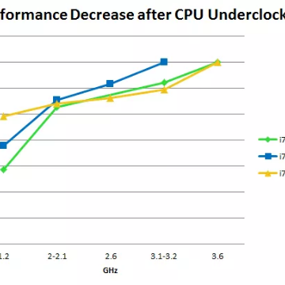

A Full Hardware Guide to Deep Learning — Tim Dettmers

A Full Hardware Guide to Deep Learning — Tim Dettmers

http://timdettmers.com/2018/12/16/deep-learning-hardware-guide/

In this guide I analyse hardware from CPU to SSD and their impact on performance for deep learning so that you can choose the hardware that you really need.