A Garage Sale Find of Rare Beatles Photos Took a Collector on a Magical Mystery Tour

# A Garage Sale Find of Rare Beatles Photos Took a Collector on a Magical Mystery Tour

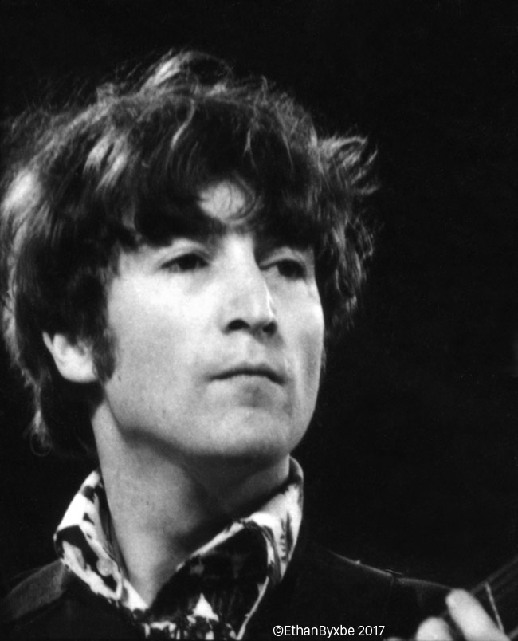

With apologies to John Lennon’s 1967 hippie anthem, “All You Need Is Love,” there’s nothing you can know about the Beatles that isn’t known. For serious Beatles fans, there are half a dozen or more books devoted to the band’s formative years in Hamburg, Germany, while no detail is too trivial when it comes to the group’s triumphant conquest of the former colonies at the height of Beatlemania. And if you have an appetite for gossip concerning the band’s acrimonious dissolution at the end of the 1960s, the Beatles are an all-you-can-eat buffet.

> “I was moved to tears when I saw the close-up of John Lennon.”

That’s why, in the late 1980s, when artist, musician, and serious Beatles fan [Dave Seabury](https://www.facebook.com/dave.seabury) came upon some black-and-white photographs of the Fab Four at a garage sale near San Francisco, he was somewhat surprised he didn’t immediately recognize the images. “I always ask people at garage sales if they have any [Grateful Dead](https://www.collectorsweekly.com/music-memorabilia/grateful-dead) or [Beatles](https://www.collectorsweekly.com/music-memorabilia/beatles) stuff,” Seabury recalls. On that fateful day, he got lucky. “They said, ‘Yeah, there are some Beatles pictures in that box over there.’ That’s where I found a beat-up frame with a contact sheet in it.”

A contact sheet is usually made by a photographer as a way for them to see lots of thumbnail [photographs](https://www.collectorsweekly.com/photographs/overview) from a roll of film at a glance. Negatives are laid down on a sheet of photographic paper, the paper is exposed to light, and the resulting print—the contact sheet—is then used to help the photographer decide which negatives to enlarge into a print. The contact sheet Seabury had found at that garage sale contained almost 70 different images of the Beatles. It was almost certainly printed by the photographer.

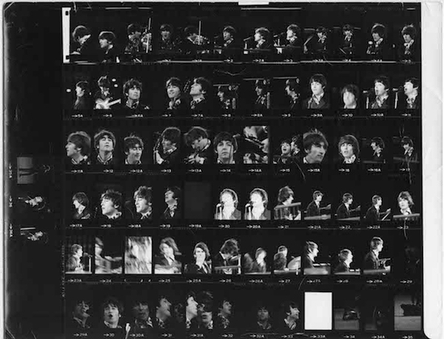

Top: John Lennon, August 29, 1966, San Francisco. Above: The contact sheet purchased by Dave Seabury in the late 1980s. Photographs Eric Weill, 1966. Copyright Ethan Byxbe, 2017. Via [Beatles Last Concert Photos](http://lostandfoundbeatles.com/Beatles/Beatles_Last_Concert_Photos.html).

When Seabury got home, he put the contact sheet in a drawer, where it lay relatively undisturbed for years. “Every so often, I’d pull it out and think, ‘These are really great, they deserve some attention,’ but that was about it. Then, years later, I read an article in the “San Francisco Chronicle” by Joel Selvin about the Beatles’ last concert on August 29, 1966, at Candlestick Park. The article featured the famous photos taken that day by Jim Marshall. Looking at the pictures, I thought, ‘Those shirts look familiar.’ So I pulled out my contact sheet and sure enough, same shirts. That’s when I realized the photos on my contact sheet were taken at Candlestick.”

But not by Jim Marshall. In fact, the identity of the photographer who took the photos on the contact sheet remained a stubborn mystery—to Seabury, anyway—for many years. Finally, in 2015, Seabury decided to solve this photographic puzzle. “The 50-year anniversary of the Beatles’ final concert was coming up,” he says, “so I started asking around to see if anyone I knew could identify the photographer. One by one, I contacted all the Beatles collectors I could find, as well as all the photographers I knew who were on the scene at that time. I just kept coming up zero.”

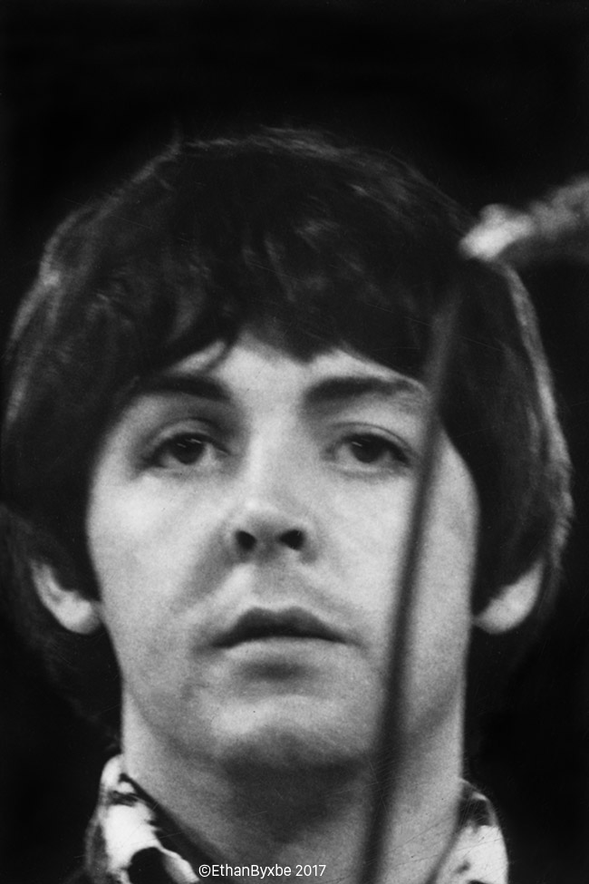

Paul McCartney, August 29, 1966, San Francisco. Photograph Eric Weill, 1966. Copyright Ethan Byxbe, 2017. Via [Beatles Last Concert Photos](http://lostandfoundbeatles.com/Beatles/Beatles_Last_Concert_Photos.html).

Concurrently, Seabury’s notion that the photographs deserved “some attention” was moving forward in the form of an exhibition to be called “Lost and Found Beatles” and scheduled to open on August 29, 2016, the 50th anniversary of the Candlestick show, at [The Reclaimed Room Gallery](https://reclaimedroom.com/) in San Francisco. Seabury’s wife, the photographer, author, and educator [Ruth E. Kaiser](https://www.ruthekaiser.com/), helped him create a [Kickstarter campaign](https://www.kickstarter.com/projects/1399132381/beatles-lost-and-found-photos-sf-candlestick-park/description) to raise the money required to turn the images on the contact sheet into prints for the exhibition. Photographer [Richard Blair](http://richardblair.com/Richard_Blair_Photography/Musicians.html) offered to scan the sheet at high resolution. Photographer [Amy Snyder](https://www.exploratorium.edu/about/staff/artists/amy-snyder), along with Blair, Kaiser, and Mark W., spent untold hours working with the scans in Photoshop to rid them of the dust and dirt that had been captured during scanning.

When the final images were printed, everyone who saw them agreed that the photographs were indeed as special as Seabury believed them to be. Unlike the usual hero shots that tend to be the stock-in-trade of rock photography, the pictures enlarged from Seabury’s contact sheet were oddly intimate, especially considering they were taken during a 37-minute set in a San Francisco baseball park before more than 25,000 screaming fans. These were not the four cocky lads from Liverpool who had made such a splash on “The Ed Sullivan Show;” instead, the pictures showed four pensive men, who had only recently decided among themselves that this would be their last live concert together. It was almost as if the mystery photographer knew their secret, too.

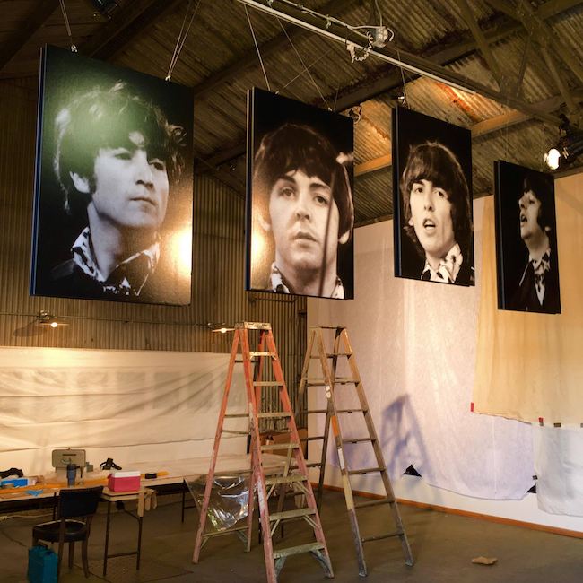

The installation of “Lost and Found Beatles” at The Reclaimed Room Gallery in San Francisco, 2016. Photo by [Richard Blair](http://richardblair.com/Richard_Blair_Photography/Musicians.html).

Still, despite the quality and artfulness of the images, would Seabury and his cohorts really be permitted to present an exhibition of photographs if they didn’t even know the name of the photographer? That question became increasingly urgent to Dave Seabury as the August 29 deadline loomed.

“The whole time I’m thinking, ‘Am I going to get sued? Is this thing going to get shut down when the photographer suddenly surfaces?’” Such questions would have been enough to kill the project for most people, but Seabury is blessed with what he admits is a kind of “blind naiveté” about the forgiveness one might expect for having one’s heart in the right place.

“All along, my intention was simply to share the images,” he says. “I wasn’t looking to make any money, I just wanted to present the images to the world on the occasion of the 50th anniversary of that last concert.” In fact, after raising $6,676 via Kickstarter, plus a few grand through the presale of prints—“We were on very shaky territory there,” he admits—Seabury had only about $600 in the project’s bank account on opening night. If making money off his contact sheet had been his aim, Seabury had failed miserably.

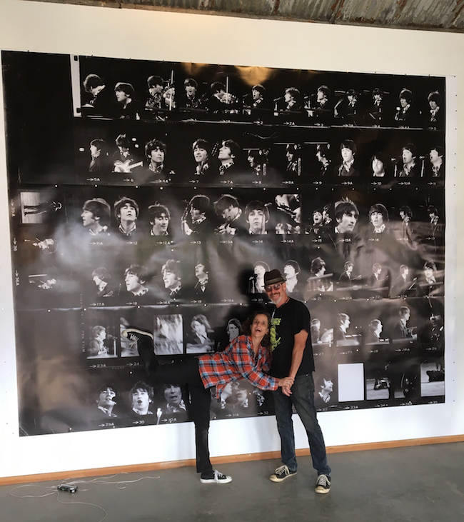

Ruth E. Kaiser and Dave Seabury pose in front of a blowup of the Eric Weill contact sheet Seabury found at a garage sale. From “Lost and Found Beatles” at The Reclaimed Room Gallery in San Francisco, 2016. Photo by [Richard Blair](http://richardblair.com/Richard_Blair_Photography/Musicians.html).

But August 29 came and went, and throughout the month of September, no photographer surfaced to claim the Beatles photographs as their own. Then, on October 8, at a “closing” party for the exhibition (it would remain up through October 20), a friend of Amy Snyder’s named Jenny Villagran brought her husband, a professional antiques and collectibles picker named Derek Taylor, to the show. Not the same Derek Taylor as the Beatles’ publicist and author of such books as [*It Was Twenty Years Ago Today*](http://www.amazon.com/dp/0671642014/?tag=colleweekl-20), but that coincidence proved to be a hint of how entangled and weird the story of Seabury’s contact sheet was about to get.

“We were having a good time,” Taylor recalls of the closing party. “I think I bought some postcards, but as I looked up at a large blow-up photo of John Lennon, I said to Jenny, ‘That picture looks really familiar.’ Now, I have seen a million images of the Beatles, and I’ve seen plenty of photos of that day, so I knew what the band members looked like when they played Candlestick Park. But this particular exposure looked very familiar to me because of the way Lennon’s hair was tousled. I just knew I’d seen that photo before, like something I’d bought once before filing it away in a box. ‘Maybe one day I’ll come across that photo again,’ I thought to myself. I didn’t go searching for it because my storage space is a disaster, but a few weeks later, I happened to be looking for a record and boom, the Lennon photo, an 8-by-10, falls out.”

Taylor couldn’t believe his eyes, and when he flipped the photo over, there on the back was a stamp that read, “Photo: Eric Weill.”

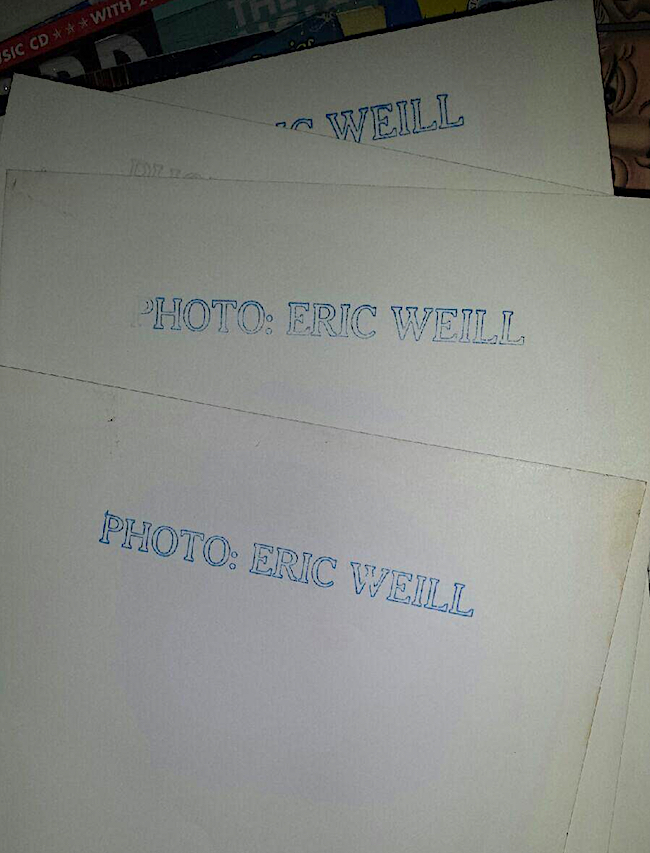

Almost all of Eric Weill’s photographs have this stamp on their backs, but the contact sheet that Seabury purchased at a garage sale did not.

“I texted Amy right away,” Taylor says. Reading his text, Snyder promptly typed the words “Eric Weill” into her computer and got a surprising result.

“When you Google Eric Weill,” Snyder says, “the [first thing that comes up](http://zodiackiller.forumotion.com/t44-eric-weill) is ‘Zodiac Killer.’” Snyder is referring to the notorious serial killer of the late 1960s, whose seven confirmed murders terrorized parts of northern California and San Francisco for years. “Eric Weill was not the Zodiac Killer,” Snyder adds, “but apparently, he was obsessed by him at that time.”

From there, Seabury says, Richard Blair’s wife, Kathleen Goodwin, got drawn into the research. “She found out that Eric Weill had a twin sister, a folk singer named Rita Weill, who had passed away in 2013.”

Kathleen also came across a reference to Eric. In 2006, she learned, the photographer of Seabury’s contact sheet had committed suicide.

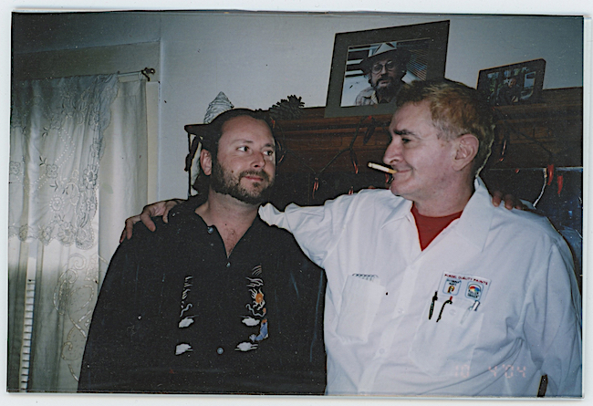

Ethan Byxbe (left) with his uncle, Eric Weill, circa 1999. Courtesy Ethan Byxbe.

Still, that would not be the end of the trail, in no small part because Seabury was determined to make sure the rightful owner of the photographs’ copyright was identified and properly compensated. Even though Eric Weill had left no heirs, Rita and her husband, Michael Byxbe, had had a son named Ethan, who is his uncle’s sole surviving relative. Thanks to yet another weird coincidence that’s too complicated to explain here, Seabury eventually connected with Eric Weill’s nephew, Ethan Byxbe.

> “The whole time I’m thinking, ‘Am I going to get sued?'”

“When I finally connected with Ethan and explained everything to him, he was totally blindsided, Seabury says. “He was like, ‘Whoa, wait a minute. You published his photos?’ And I said, ‘Look, man. I want to meet with you. You’re his only living relative. I cede all rights to these photos to you.’ And so we arranged to get together. He came for breakfast at our house, with Richard, Kathleen, and Amy. We showed him everything we had done, from the prints to the merch, and he was just blown away. He saw that we had respected his uncle’s work, and he really appreciated that. Today, we have a very nice relationship. He’s really a sweet guy.”

Talking to Ethan Byxbe over the phone, that was my impression, too. Although Byxbe wishes he remembers details of conversations with his uncle better than he does, his recollections do fill in many holes in the Eric Weill-Beatles photos story.

“He was a professional photographer,” Byxbe says. “He was a press photographer at one time—I think he may have done some work for the ‘Chronicle’—and he must have had his own darkroom. A news photo he took called ‘The First Hippie Riot’ from 1968 is in the collection of the [Smithsonian](https://www.aaa.si.edu/collections/items/detail/first-hippie-riot-san-francisco-12195).”

This Eric Weill photograph, titled “The First Hippie Riot” and dated 1968, is in the collection of the [Smithsonian](https://www.aaa.si.edu/collections/items/detail/first-hippie-riot-san-francisco-12195).

Richard Blair believes Eric Weill was a professional, too. According to Blair, Weill shot many of his photographs with an Olympus Pen F. “That was a hot camera in the 1960s for photojournalists,” he says. “It was really high-quality single-lens-reflex camera, and you could get 72 pictures to a roll rather than 32 because it shot half-frame vertical photos. You can see that on Dave’s contact sheet.”

Eric Weill often took his Olympus on assignments for a guy named Gene Kelley, who ran a record shop called Music 5, located on the corner of Market and Fifth streets in San Francisco, from 1964 until 1976. “I had two photographers,” Kelley corrects me when we spoke at his home, “Eric Weill and a guy named Steven Richard Krolik. They were the most talented photographers I’ve ever met in my life. I would tell them, ‘Hey, James Brown’s in town. Be there Saturday night.’”

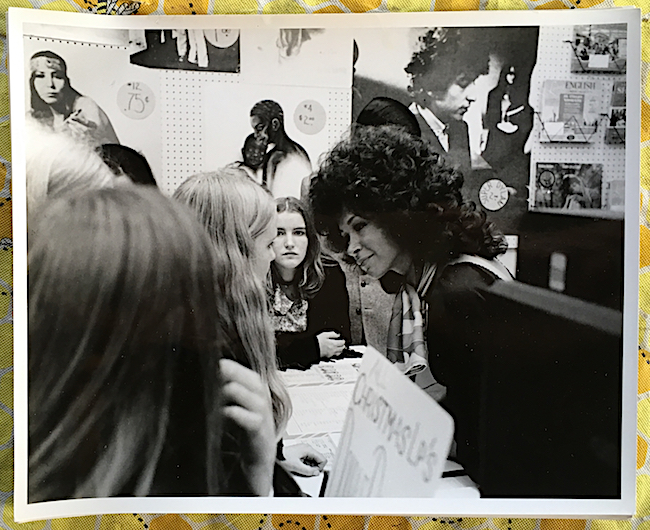

Gene Kelley’s San Francisco record store, Music 5, circa 1966. Kelley can’t remember the name of the Capitol Records singer (right) who was in his store on the day of this photograph, but the Bob Dylan poster behind her was taken from a shot by Eric Weill.

The Beatles concert at Candlestick, though, was not a Kelley assignment. “He wasn’t working for me on that one,” Kelley says. But that doesn’t mean Kelley didn’t recognize the sales potential of Weill’s Beatles photographs. A popular item at Music 5 was a four-pack of 8-by-10 glossies—one each for John, Paul, George, and Ringo—which were packed in a clear sleeve and retailed for $1.98. Each bore the “Photo: Eric Weill” stamp on the back, just like the ones Derek Taylor had shown to Dave Seabury to crack the mystery of the contact-sheet photographer.

Kelley digs in a cardboard box and pulls out a four-pack. The sleeve has shrunk faster than the photographs within, so they are now rippled and bent. “Do you have any idea how I could flatten them?” he asks me. “It bothers me because they are very valuable.” Kelley digs in the box again and pulls out a handful of 5-by-7s of Paul McCartney. Like the 8-by-10s, these all bear the Eric Weill stamp on the back, but these images are loose, which means they have curled uniformly and will probably be easier to flatten than the 8-by-10s.

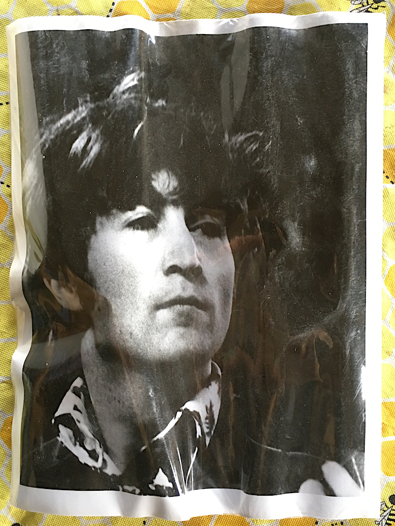

Kelley sold four-packs of 8-by-10 Beatles photographs shot by Weill at Candlestick Park for $1.98. Many of the ones he has today are still in their sleeves, but they are warped and wrinkled.

Because Gene Kelley was selling Eric Weill’s Beatles photos as fast as he could, that probably explains where Taylor’s Beatles photos came from, but what about Seabury’s contact sheet? That’s not the sort of thing one would have found in a record store in the late 1960s. How did that piece of Beatles history end up in a garage sale?

Byxbe thinks he knows. “The bulk of my uncle’s material was stolen right under our noses,” he says with an audible sigh. “When I was a little kid in the 1970s, my grandmother had hired some older neighborhood kids to help her clean up her garage and things like that. There were several milk crates full of original negatives and photographs in them, including most of the Beatles material. I had a bad feeling about them and said, ‘Grandma, maybe you should put Eric’s pictures in a closet or something.’ I don’t remember exactly what I said, but she said, ‘Oh, no, they’re fine.’ She was very trusting. And sure enough, after they left, I checked the garage and the milk crates with Eric’s original materials were gone. They had taken everything.”

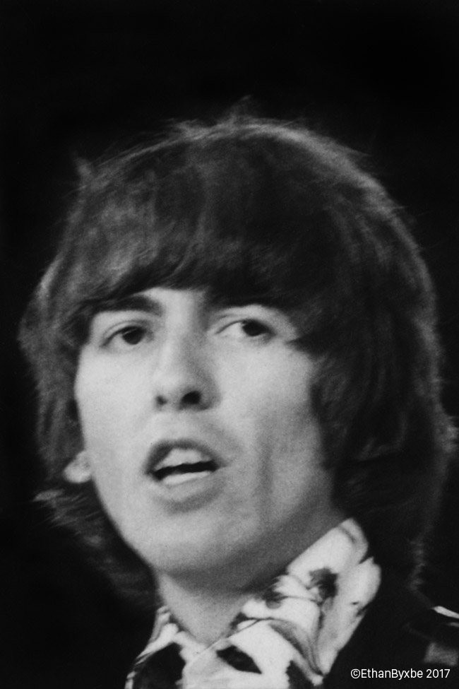

George Harrison, August 29, 1966, San Francisco. Photograph Eric Weill, 1966. Copyright Ethan Byxbe, 2017. Via [Beatles Last Concert Photos](http://lostandfoundbeatles.com/Beatles/Beatles_Last_Concert_Photos.html).

That was the first theft. The second occurred in the late 1970s or early 1980s. Byxbe isn’t sure of the date, but he does remember the circumstances.

“My uncle was living in an old, 1930s milk truck around that time,” he tells me. “He was a real—I don’t know if I should say this—bohemian. People would be in and out of the truck visiting him, and one time, someone ripped off much of what he had left. Between those two incidents, most of his photographic materials that I knew about were gone,” including the contact sheet that Seabury acquired at a garage sale in the late 1980s.

The fact that a talented photographer like Weill was living in a milk truck represents the most troubling part of this story, and it relates directly to the discovery Amy Snyder had made when she typed the words “Eric Weill” into Google and got a page about the Zodiac Killer as the first result.

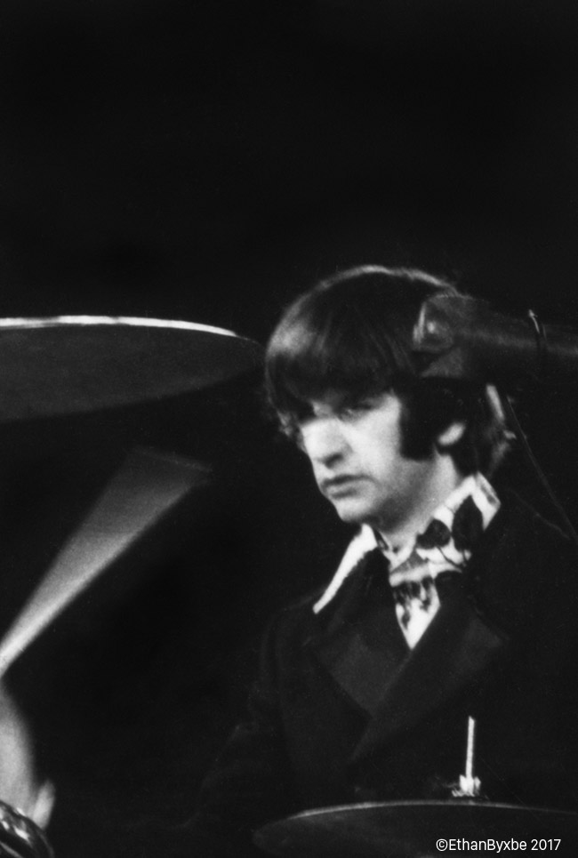

Ringo Starr, August 29, 1966, San Francisco. Photograph Eric Weill, 1966. Copyright Ethan Byxbe, 2017. Via [Beatles Last Concert Photos](http://lostandfoundbeatles.com/Beatles/Beatles_Last_Concert_Photos.html).

“My uncle could be very kind and loving, and very generous,” Byxbe says. “He was highly intelligent and creative. In addition to taking pictures, he drew, and he also wrote prose and poetry. He had an altruistic outlook in some of his writings, about helping the needy, peace on earth, and that sort of thing. But he could also get in bad moods. He was bipolar, so he suffered from that mental illness. It was a struggle for him throughout his life.”

Based on the limited evidence available to us today, that struggle appears to have already begun in December of 1965, when Weill attended a press conference with Bob Dylan in the studios of San Francisco public television station KQED—as of this writing, the video was still up on [YouTube](https://youtu.be/wPIS257tvoA). Weill was there as an official press photographer, but he also asked a few questions. Check out the spectacled, bearded guy at the very beginning of the press conference. That’s Eric Weill.

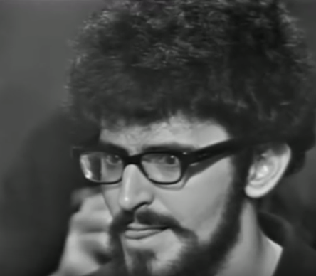

Eric Weill asking Bob Dylan a question during the singer-songwriter’s 1965 press conference in San Francisco. Via [YouTube](https://youtu.be/wPIS257tvoA).

Weill: “I’d like to know about the cover of your album. The one with ‘Subterranean Homesick Blues’ in it. I’d like to know about the meaning of the photograph of you wearing the Triumph T-Shirt?” Dylan: “What did you want to know about it?” Weill: “Well, I’d like to know if it’s an equivalent photograph. It means something, it’s got a philosophy in it. I’d like to know visually what it represents to you, because you’re a part of that.” Dylan: “Um, I haven’t really looked at it that much.” Weill: “I’ve thought about it a great deal!”

Later, Weill can be seen snapping pictures of Dylan, shooting with what appears to be a Polaroid camera.

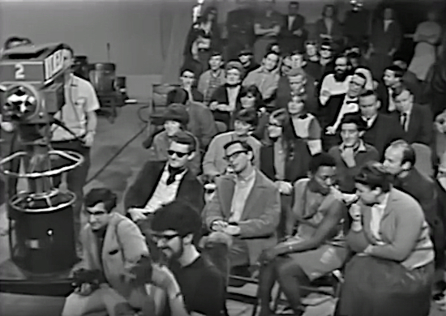

Eric Weill (bottom, center-left) photographing Bob Dylan at the singer-songwriter’s 1965 press conference in San Francisco. Via [YouTube](https://youtu.be/wPIS257tvoA).

Weill’s struggles with bipolar disorder may have erupted again in the fall of 1969, when he reportedly called into a radio show and claimed to be the Zodiac Killer. “I find it odd that he would identify with a killer,” Byxbe says, “but evidently, my uncle wanted to help the police investigate the crime, as an amateur sleuth. I think that was his good intention, in a normal frame of mind. But he was bipolar, so things could get scrambled upstairs.”

Weill drew attention again in 1980, when he was arrested for vandalizing a Richard Avedon photograph at an exhibition in Berkeley. “He threw orange iodine on it,” Byxbe says of Avedon’s 10-by-35-foot composite photograph of Andy Warhol and members of The Factory, taken in 1969. “My mother spoke to Richard Avedon and personally apologized for my uncle,” Byxbe remembers. “Eric went to jail for that. I think he felt bad about it later on. I always thought my uncle liked Warhol’s work, generally speaking. But he would just act up every once in a while. He was in and out of institutions all his life, unfortunately.”

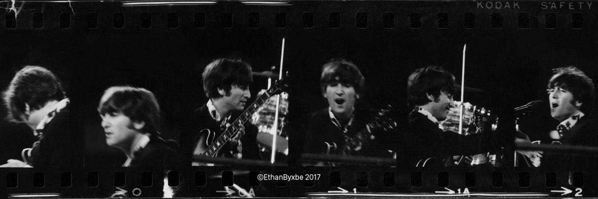

John Lennon, August 29, 1966, San Francisco. Photograph Eric Weill, 1966. Copyright Ethan Byxbe, 2017. Via [Beatles Last Concert Photos](http://lostandfoundbeatles.com/Beatles/Beatles_Last_Concert_Photos.html).

Maybe that explains Weill’s ability to notice and capture the heartache on the faces of the Beatles at their last concert. “I was moved to tears when I saw the close-up of John Lennon,” Byxbe says. “You can see all of their expressions. He had a sensitivity to people’s emotions. And now, thanks to Dave’s project, people can enjoy some of my uncle Eric’s photographs, and he can get credit for some of the work he did. I think he would be happy about that.”

As for Seabury, his Eric Weill adventure may just be getting started. “Have you watched that Dylan interview, the whole thing?” Seabury asks. “It blew my mind. About halfway through, you can see Eric popping in and out of the frame taking Polaroids of Dylan. And then, at one point, he hands a Polaroid to Dylan, and Dylan comments on it. And I’m thinking, ‘Where the fuck is that Polaroid?’ Nobody would ever throw that away, right? It’s probably sitting in a drawer somewhere.”

(*Eric Weill’s Beatles photos are now available at [Beatles Last Concert Photos](http://lostandfoundbeatles.com/Beatles/Beatles_Last_Concert_Photos.html). *)

### More Articles

[A Mad Day Out with the Beatles, 1968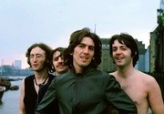](https://www.collectorsweekly.com/articles/a-mad-day-out-with-the-beatles-1968/)[John Lennon's Oddly Patronizing Letter to Eric Clapton Up For Auction](https://www.collectorsweekly.com/articles/john-lennon-letter-to-eric-clapton/)[Being The Beatles: Untold Stories from the Fab Four's Legendary North American Tours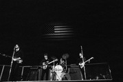](https://www.collectorsweekly.com/articles/the-beatles-north-american-tours/)